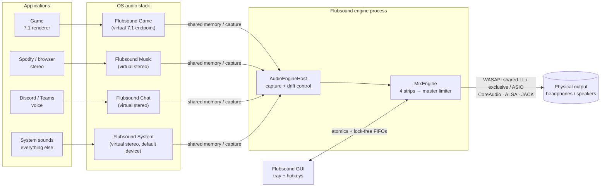
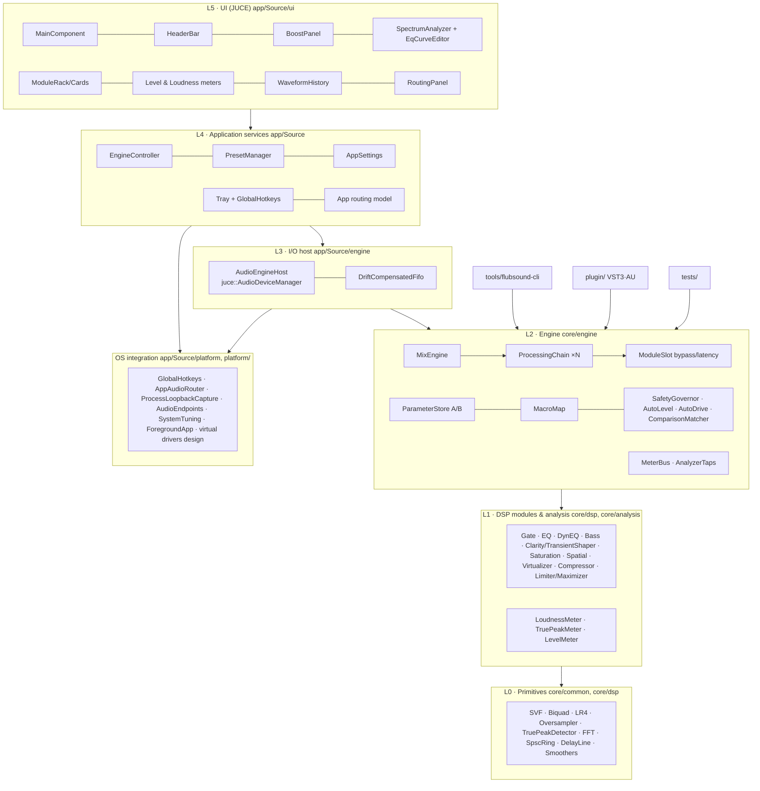
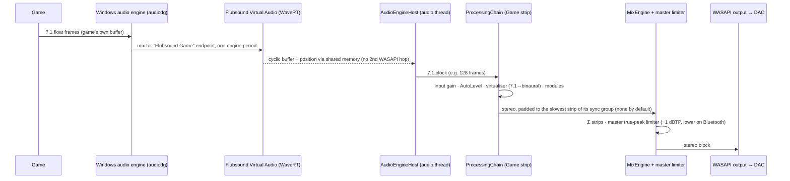
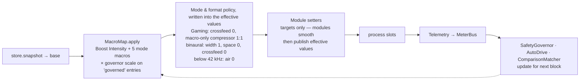

# 01 — High-Level System Architecture & Detailed Data Flow (Workflow 2)

> Flubsound Pro is a layered system with one sharp boundary: all DSP (every module, the meters and the engine) lives in **`flub_core`**; the hosts add only I/O glue and visualisation. That library is framework-free C++20 with no allocation or locks on the audio path. It is hosted by:
> - the desktop app (JUCE device I/O + GUI),
> - the plug-in,
> - the batch CLI,
> - the unit tests.
>
> System-wide and per-application processing comes from **virtual endpoints** (one per *strip*: Game, Music, Chat, System; per-platform status in §1). Each strip has its own processing chain and profile. The strips are summed and protected by a master true-peak limiter before the physical output.

---

## 1. System context



How each platform realises the virtual endpoints:

| Platform | Mechanism |
|---|---|
| Windows (primary) | WaveRT virtual audio driver, "Flubsound Virtual Audio" (**design only**, `platform/windows/driver/`; not built yet). Apps are assigned to endpoints by Windows' per-app output setting; the routing panel can do it itself only in builds with `FLUB_ENABLE_UNDOCUMENTED_ROUTING`, otherwise it opens `ms-settings:apps-volume`. **Implemented today:** per-process loopback capture (`ProcessLoopbackCapture`, Windows 10 version 2004 / build 19041+ and Windows 11; Microsoft documents 20348, see `windows_builds` in `PlatformServices.h`) as the no-driver path. |
| macOS | Audio Server Plug-in virtual device (libASPL) and per-app capture on 14.2+ via Core Audio process taps with *mute-when-tapped* (**design only**, `platform/macos/README.md`; the app reports routing and capture as unsupported). |
| Linux | PipeWire / PulseAudio null sinks `flubsound_game/music/chat/system` ("Flubsound Game" ...), created by `platform/linux/flubsound-pipewire-setup.sh` or a PipeWire config drop-in. Apps are moved per sink-input (`pactl move-sink-input`) or with `target.object` rules. **Implemented.** |
| Any OS, zero install | Any third-party virtual cable (VB-Cable, BlackHole, a JACK port) feeding a strip through the device input. |

---

## 2. Layered component architecture



**Dependency rule.** Arrows only point downwards. `core/` (L0–L2) never includes JUCE or OS headers, which is what makes it hostable by the plug-in, the CLI, the tests and, later, a Windows APO or a PipeWire filter node (see `09-future-roadmap.md`).

| Layer | Responsibility | Key types |
|---|---|---|
| L0 primitives | Allocation-free building blocks with exact, documented latency | `SvfCoeffs`, `LinkwitzRiley4`, `Oversampler`, `TruePeakDetector`, `Fft`, `SpscRing`, `DelayLine`, `LinearSmoothedValue` |
| L1 modules | One audio effect each, implementing `flub::Processor` | `ParametricEq`, `DynamicEq`, `BassEngine`, `ClarityEnhancer`, `Saturator`, `StereoSpatializer`, `HeadphoneVirtualizer`, `Compressor`, `TruePeakLimiter`, `LoudnessMaximizer`, `SpectralNoiseGate`, meters |
| L2 engine | Parameters, macros, protection loops, bypass, chain order, strips, telemetry | `ParameterStore`, `MacroMap`, `SafetyGovernor`, `AutoLevel`, `ModuleSlot`, `ProcessingChain`, `MixEngine`, `MeterBus` |
| L3 host | Device I/O, clock-domain bridging, reconfiguration | `AudioEngineHost`, `DriftCompensatedFifo` |
| L4 services | Presets, settings, routing model, tray, hotkeys, device profiles | `EngineController`, `PresetManager`, `AppSettings`, `AppRouting`, `HotkeyManager`, `TrayIcon` |
| L5 UI | Presentation and interaction only | JUCE components |

---

## 3. Process & thread model

| Thread | Priority | Runs | Must not |
|---|---|---|---|
| **Audio callback** (device) | Real-time (MMCSS "Pro Audio" / time-constraint / SCHED_FIFO, on Linux else RealtimeKit's SCHED_RR, asked by the message thread) | `MixEngine::process` → strips → master limiter (two engines, crossfaded, during an engine swap); reads the parameter snapshot; writes meters. A fed strip whose input and output have stayed below −120 dBFS for 10 s + its latency is frozen (its chain is not run, it adds zeros) and wakes, in the block, on the first sample above that ([11 E45](11-enhancement-report.md#e45) idle freeze) | Allocate, lock, log, do I/O, or wait |
| **Capture threads** (Windows process loopback, one per captured app) | MMCSS "Pro Audio" (falls back to "Audio") | Pull OS capture packets and push frames into a `DriftCompensatedFifo` | Allocate or lock (after start) |
| **Message thread** (JUCE) | Normal | UI (meters and analyser once per display frame via `VBlankAttachment`), parameter-control refresh at 30 Hz, reconfiguration poll at 5 Hz, controller housekeeping at 2 Hz (CPU-overload watchdog poll, foreground-application poll for automatic profiles, state autosave every 5 s, preferred-output rescan), preset I/O, tray, hotkeys | Block for long |
| **Worker threads** | Low | App routing worker ("Flubsound routing": session enumeration and endpoint moves, every 2 s while routes exist); `flubsound-cli batch --jobs N` (one chain per job). Roadmap: HRIR loading/resampling, inference | Touch audio-thread objects directly |

### Cross-thread communication (three main channels)

| Channel | Direction | Mechanism | Guarantees |
|---|---|---|---|
| `param::ParameterStore` | GUI/hotkeys/plug-in host → audio | Two banks (A/B) of `std::atomic<float>`, relaxed stores (values clamped, NaN ignored); the audio thread takes one `snapshot()` per block; a version counter lets the GUI refresh | Wait-free; last-writer-wins per value; the A/B switch is a single atomic |
| `MeterBus` | Audio → GUI | `std::atomic<float>` fields written once per block, polled at display rate | Wait-free; values are always individually consistent |
| `AnalyzerTaps` (`SpscRing<float>` pre/post) | Audio → GUI | Single-producer/single-consumer ring, acquire/release indices | Wait-free; drops (never blocks) if the GUI is slow |

A few single `std::atomic` hand-offs complement them: the chain publishes every *effective* value (post-macro, including its mode and format overrides) once per block (`ProcessingChain::effectiveValue()`, for the GUI's "ghost" markers), the momentary per-module audition bypass (`ProcessingChain::setAuditionBypass`) is one atomic bit mask, and `AudioEngineHost` passes strip gain / mute, the device-input map and the master ceiling to the audio thread through atomics.

Structural changes (latency profile, device format, strip layout, a neural model installed or removed) are never applied on the audio thread. The host polls `MixEngine::needsReprepare()` at 5 Hz on the message thread (strip-layout and neural-model changes, `AudioEngineHost::setStripLayout()` / `setNeuralModel()`, call it directly) and, while the device runs, replaces the engine by a **crossfaded engine swap** (`AudioEngineHost::reconfigure()`; the plug-in re-prepares its chain with its own timer and reports the new latency to the host):

1. The message thread builds a complete new engine instance (`MixEngine::configureFrom()`, which shares the running engine's `ParameterStore`s, plus the host's per-engine buffers) while the old one keeps playing.
2. It hands the instance to the audio thread through one atomic pointer. A newer request replaces a pending one the audio thread has not taken yet.
3. The audio thread takes it at the start of a callback and runs both engines on the same input. The new one pre-rolls, silent, for its latency + 10 ms (`kSwapSettleMs`), so its delay lines hold real signal and its detectors have seen it. A strip the new layout removes has lost its sources, but the old engine keeps processing it on silence, so the audio still in its delay lines plays out and fades with the old engine instead of being cut.
4. The audio thread then fades over `kSwapFadeMs` = 10 ms with raised-cosine curves:
   - **Equal latency** (a layout change): old and new crossfade with equal *gain* (g_old + g_new = 1). Both carry the same programme, so equal power would add up to +3 dB and could pass the master limiter's ceiling. Equal gain never exceeds either engine.
   - **Latency change** (a profile change, a neural model's latency added or removed): the old engine fades out over the 10 ms before the new one fades in over 10 ms. Overlapping two copies of the programme offset in time would comb-filter, and a pure tone could cancel. An equal-power overlap would not fix that either: where the offset copies happen to line up, it too adds up to +3 dB above the ceiling. The programme jumps by the latency difference inside that 20 ms dip (it repeats or skips that much), which no crossfade can avoid.
5. The old engine goes back through a second atomic pointer and is destroyed on the message thread (5 Hz poll or the next reconfiguration). The audio thread neither allocates nor frees, and one swap runs at a time. If a request arrives while one is running, the audio thread starts it when the running one has ended and its old engine has been collected.

Both engines run for the new latency + 10 ms, or + 20 ms at equal latency: about 40 ms of double DSP load for Balanced → Quality, far below what the overload watchdog reacts to. Measured with a 220 Hz sine at 48 kHz (`test_app_engine_swap.cpp`):
- No sample step exceeds the sine's own largest step plus what the fade slope adds.
- For Balanced → Quality the output stays below −26 dB of the tone for 4.4 ms (210 samples) inside the 20 ms dip.
- The new chain's fresh detectors settle within ~0.2 dB over ~100 ms.
- Installing and removing a 20 ms neural model (an identity model, eligible for Balanced) passes the same step and gap checks.
- 100 swaps in a row (profiles, layouts, a request replaced before the audio thread took it) allocate, free and lock nothing on the audio thread, and every engine is freed: under ASan the only leak reported is the few bytes of saved scheduling policy that promoting each new device thread keeps (never reverted, see `AudioEngineHost::audioDeviceIOCallbackWithContext`).

Sample-rate, buffer-size and device changes restart the device instead (JUCE stops the callback). The engine is rebuilt synchronously in `audioDeviceAboutToStart()`, and the first 10 ms after the engine latency fade in from silence. A swap pending or in flight when the device stops is dropped in favour of the newest engine. Message-thread code re-fetches chains when `AudioEngineHost::getStructureGeneration()` changes. A neural model goes through `AudioEngineHost::setNeuralModel (strip, factory)`: the factory makes a fresh runner for every engine the host builds (swaps, device restarts), because the old engine keeps running its own model until it has faded out; the new chain decides at its prepare whether the model is eligible (`getNeuralStatus()`). The app installs no model today. As with any re-prepare, other state set directly on a `ProcessingChain` does not carry over to the new engine's chains: the audition bypass, and a model installed with `ProcessingChain::setNeuralModel()` instead of through the host.

---

## 4. Data flow in detail

### 4.1 End-to-end signal path (Windows, driver path — design)

The driver is not built yet (`platform/windows/driver/README.md`); today the Windows strips are fed by per-process loopback capture or a virtual cable on the device input. The engine side (from `AudioEngineHost` on) is the same either way.



### 4.2 Inside one strip (the processing chain)

```
 in (2 / 6 / 8 ch)
  │
  ├─ Input gain (smoothed)                        ── all channels
  ├─ AutoLevel (gated LUFS input levelling, −12 … +6 dB, +1 dB/s up / −4 dB/s down, held through loud events;
  │            BS.1770-4 channel weights: 5.1/7.1 sides 1.41, 7.1 back pair 1.0, LFE excluded)
  ├─ ActiveChannelDetector (5.1/7.1)               ── FL/FR-only content → stereo passthrough fold
  ├─ HeadphoneVirtualizer 5.1/7.1 → binaural       ── or ITU-R BS.775 downmix (−3 dB), or the unity
  │                                                   passthrough; the LFE at virt.lfe in all three;
  │                                                   virt.on toggles crossfade over 20 ms, fold switches over 400 ms
  │        ════════ from here on: STEREO ════════
  ├─ dry tap ──► (delayed by total latency) ──► global bypass (loudness-matched reference;
  │                                               its own true-peak limiter fits inside that delay)
  ├─ [slot] SpectralNoiseGate      (Quality profile only; STFT 21.3 ms: 1024 at 48 kHz)
  ├─ [slot] ParametricEq           10 bands, SVF, zero latency
  ├─ [slot] DynamicEq              4 user bands + 4 mode bands (footsteps / de-harsh …)
  ├─ [slot] BassEngine             subsonic · mono-bass · protected shelf · harmonics · tighten
  ├─ [slot] ClarityEnhancer        transients · de-mud · dynamic presence · air exciter
  ├─ [slot] Saturator              tape / tube / digital, 4× oversampled (2× from 176.4 kHz)
  ├─ [slot] StereoSpatializer      side-only width / focus / space (mono-exact) · L/R crossfeed with ITD
  ├─ [slot] Compressor             look-ahead, linked, downward + upward
  ├─ [slot] LoudnessMaximizer      drive → 3-band glue (only while armed) → 4× soft clipper (Low Latency: a shorter 4× design, 2× from 88.2 kHz)
  │                                 → true-peak limiter (4× detector shared with the meters)
  ├─ Output gain (trim, −24 … 0 dB)
  ├─ control loops: SafetyGovernor · AutoDrive · ComparisonMatcher (feed the next block)
  ├─ global bypass crossfade (latency aligned, loudness matched: match gain capped per block, then a
  │                           dry-path true-peak limiter at max.ceiling, running only while bypass is engaged)
  └─ meters (peak/RMS/TP/LUFS M·S·I·LRA/correlation) · analyser tap → out (2 ch)
```

**Why this order:**
1. **Gate first.** Enhancement stages must not amplify hiss or hum they were never meant to see.
2. **Corrective before creative.** Static EQ fixes tonal balance. The dynamic EQ then reacts to that corrected balance and controls masking and resonances *before* the additive enhancers (bass, clarity, saturation) run, so they do not trigger extra dynamic cuts.
3. **Harmonics before width.** Saturation glues the generated harmonics. The spatializer then shapes the final tonal image, and only its side-channel.
4. **Dynamics late, limiter last.** The compressor sees the final spectrum and stereo image (linked detection). The maximizer is last because it is the only stage that *guarantees* the true-peak ceiling. Nothing after it adds gain: the output trim and the comparison trim can only attenuate. The loudness-matched bypass reference is protected separately: the match never raises it, but the input itself can peak above the ceiling, so the reference passes its own `TruePeakLimiter` at `max.ceiling` (`dryLimiter` in `ProcessingChain`). That limiter fits inside the chain latency the dry path is delayed by anyway (up to 1 ms look-ahead + the 20-sample detector, so no latency is added), runs only while bypass is engaged, and starts cold on engagement: it outputs silence for its own latency (1 ms + 20 samples: 1.42 ms at 48 kHz) at the start of the 30 ms crossfade, where the dry weight is still below 5 % at 44.1 kHz and above (a little more at narrowband rates, where the 20 detector samples weigh more). Test: *Chain: matched bypass never overshoots the ceiling when a louder dry peak arrives* (all three latency profiles; sample peak ≤ ceiling, true peak ≤ ceiling + 0.15 dB).

### 4.3 Control flow per audio block



- **Base vs effective values.** Presets and the GUI write *base* values. Each block the chain computes *effective* values:

  ```
  effective = clamp( base + Σ amount · smoothstep(start, end, source)^exponent · g )
  g = governorScale for "governed" entries (they add loudness / drive), 1 otherwise
  source = Boost Intensity or one of the five mode macros (0 … 1)
  ```

  Macros can also *engage* modules. For example, turning up *Warmth* switches Saturation on (`core/src/engine/MacroMap.cpp`). In Gaming, a compressor that only macros switched on runs upward-only (ratio 1:1) unless a ratio was chosen, so loud events keep their dynamics.
- **Mode bands.** Dynamic-EQ bands 4–7 belong to the mode policy, not to the user:
  - Gaming: the footstep cue enhancer (3.2 kHz and 260 Hz: a lift for what rises out of each band's own background, [11 E19](11-enhancement-report.md#e19)), explosion anti-masking (90 Hz low shelf, cut above; off in the mode policy since [11 E20](11-enhancement-report.md#e20), the presets that want it carry it as a user band) and voice/score presence (2 kHz).
  - Music: dynamic de-harsh (3.5 kHz), air lift (12 kHz shelf) and de-boom (120 Hz); band 7 is unused in Music.

  Each band's range scales with its source: Footsteps (bands 4–5) and Voice & Score (band 7) in Gaming; Clarity (de-harsh, air) and Boost Intensity (de-boom) in Music (`configureModeBands()` in `ProcessingChain.cpp`).
- **Glue arming.** The maximizer's 3-band glue splitter is only in the signal path while glue is *armed*: the preset sets `max.glue` > 0, or a macro that can raise it (Music: Boost Intensity, Loudness) is above zero. While armed, a 0.001 floor keeps the splitter engaged so Boost crossing the glue start point (40 %) never crossfades against the splitter's all-pass-shifted sum. Disarmed, the splitter is out of the path, because its all-pass rotation would raise the crest factor of flat-topped masters by 1–3 dB.
- **Protection loops** close around the output (`core/src/engine/Protection.cpp`):
  - The SafetyGovernor keeps the ~3 s average limiter gain reduction above −6 dB and the measured THD+N of the saturator and the soft clipper below −30 dB (each measured over 25 ms windows; the clipper's share floored at its clip energy ratio over the same window, the former proxy, so it does not act later on clipping than before). Over budget, its scale falls at 15 %/s (minimum 0.3); comfortably under budget (1.5 dB hysteresis) it recovers at 3 %/s.
  - AutoDrive can only *reduce* maximizer drive, towards a LUFS target (≤ 2 dB/s, 0.5 LU dead band). The reduction stops at the requested drive (the applied drive never goes below 0 dB), so there is no hidden reduction to wind back when the programme gets quieter.
  - ComparisonMatcher computes the fair-comparison trims: in a bypass comparison the louder side (the bypass path or the processed output) is turned down to the other, never raised (down to −20 dB, acquired in 1 s, then frozen until the bypass has been off for 10 s); the dry-path limiter above keeps the reference under the ceiling.
  - All three loudness loops use a gated 3 s measure that freezes in silence, pauses and fade-outs.

### 4.4 Parameter, preset & A/B flow

```
GUI knob / hotkey / tray / plug-in host automation
        │  store.set(id, v)   (clamped, NaN ignored, relaxed atomic, version++)
        ▼
ParameterStore ── Bank A ──┐
               └─ Bank B ──┴─ activeBank (atomic) ──► audio thread snapshot()
        ▲
PresetManager: JSON (string keys) ⇄ Preset(values) ⇄ applyToStore(bank) / captureFromStore(bank)
```

- **A/B.** Two complete parameter banks. The header's A / B buttons flip the active bank atomically, and all continuous parameters glide, so the switch is click-free. The copy button duplicates the active bank into the other one (A→B or B→A).
- **Presets.** Versioned JSON with stable string keys: unknown keys are ignored, missing keys keep defaults, out-of-range numbers are clamped, choices are stored as labels (`presets/factory/*.json`, user presets as `*.flubpreset.json`, `core/include/flub/io/PresetIO.h`). The hosts (app, plug-in, CLI) never take "Bypass All" from a preset or write it into one: it is application state, not sound. `latency.profile` and `bypass.matched` are application state too: factory presets carry none of them, and `preset::applyPresetToStore` never writes them (a preset only suggests a profile, [11 E40](11-enhancement-report.md#e40)).

### 4.5 Metering & visualisation flow

```
audio thread ─► LevelMeter / TruePeakMeter / LoudnessMeter ─► MeterBus atomics ─► GUI, once per display frame
            └─► mid (L+R)/2 pre & post ─► AnalyzerTaps SPSC rings ─► GUI FFT (4096, Hann, 75 %)
                                                                    ├─► SpectrumAnalyzer + EQ curve
                                                                    └─► WaveformHistory (min/max decimation)
```

The GUI does all FFT and drawing work on the message thread. The audio thread's metering cost is bounded and constant.

### 4.6 Per-application routing flow

1. The user assigns an application to a strip (routing panel), or a rule matches its executable.
2. `AppRouting` applies the mapping with one of two methods (`app/Source/engine/AppRouting.h`):
   - **Endpoint routing:** `AppAudioRouter::setAppEndpoint(pid, endpoint)` moves the app's output to the strip's virtual endpoint. Linux: `pactl move-sink-input` to `flubsound_game` etc. Windows: only in builds with `FLUB_ENABLE_UNDOCUMENTED_ROUTING` (and useful once the driver's endpoints exist); otherwise the router lists applications (`canList()`) but reports `canMoveEndpoint() == false`, so *Automatic* takes process capture or, without it, is Disabled with the router's explanation, and the UI opens `ms-settings:apps-volume`. macOS: not supported yet (the UI opens the Sound settings).
   - **Process capture** (Windows 10 build 19041+ / Windows 11): `ProcessLoopbackCapture` captures the process tree into the strip through a `DriftCompensatedFifo`. It cannot mute the app's original output, so it suits monitoring and "lite" setups.
3. The app's audio now arrives on that strip and is processed with that strip's profile (`ParameterStore`).
4. The mapping (executable → strip) persists in `AppSettings`. A background worker re-applies it (every 2 s while routes exist) whenever the executable shows up, and endpoint moves are restored to the system default on shutdown.

### 4.7 Batch processing & export flow

```
WAV in ─► decode ─► ProcessingChain (offline, same code as realtime; mono → stereo, 5.1/7.1 → binaural or downmix)
   │  (PCM 16/24/32, float 32/64,  │ latency compensated: flush L zeros, drop the first L output samples
   │   WAVE_FORMAT_EXTENSIBLE)     ▼
   │                     LoudnessMeter (integrated LUFS)
   │                               │ loudness target? move max.drive (then input.gain / output.gain) by the error,
   │                               │ secant steps, ≤ 4 corrective passes, stop within 0.3 LU, keep the closest pass
   ▼                               ▼
 report (LUFS, LRA, TP, peak) ◄─ export WAV (float32, or PCM24 / PCM16 with TPDF dither)
```

Tools: `tools/flubsound-cli` (`process`, `batch --jobs N`, `analyze`, `params`, `presets`). The desktop app's Export / batch process dialog (roadmap 2.10, `06-gui.md` §6.12) runs the same `OfflineRenderer` code on a worker thread; it decodes WAV, AIFF, FLAC, Ogg and MP3 through JUCE's `AudioFormatManager` and writes WAV (the core writer) or FLAC (JUCE's `FlacAudioFormat`).

---

## 5. Latency budget

This section is the project's single latency model. The R1.1 row in `00-understanding-and-plan.md`, the exit criteria in `07-roadmap.md`, device-lab test 8 in `10-headset-compatibility.md` §5, the Windows driver design (`platform/windows/driver/README.md` §6) and the README all refer to it. Every figure carries one of three scope labels:

| Scope | What it covers | Source | Status |
|---|---|---|---|
| **Chain** | One strip's algorithmic latency: look-aheads, oversampler FIRs, the STFT frame | `ProcessingChain::getLatencySamples()`; what the plug-in reports to its host and the CLI compensates | Exact, asserted by tests |
| **App engine** | Per strip: its chain + its sync-group padding + the desktop app's master limiter (`MixEngine::getStripLatencySamples()`); the largest of these is the engine total | `MixEngine::getLatencySamples()` | Exact, asserted by tests |
| **Added end-to-end** | Everything Flubsound puts between the application and the ear on top of the application's normal output path: engine + I/O buffering (+ capture buffering on a capture path) | §5.2 and §5.3 | **Estimate** until it is measured on real devices with the loopback probe (§5.4, `flubsound-cli latency-probe`; roadmap `07-roadmap.md` item 1.2; device-lab test 8 in `10-headset-compatibility.md` §5) |

**Target (R1.1): added end-to-end latency under 10–12 ms.**
- **Low Latency** is the profile that meets it: ≈ 9.5 ms estimated, under 10 ms.
- **Balanced** (the default) sits at the upper edge: ≈ 12–13 ms estimated.
- **Quality** (≈ 28 ms for the chain alone) is for music and batch use and is outside the target by design.

These estimates are for the Windows virtual-driver path, which is designed but not built. The capture paths that feed the strips today add buffering of their own (§5.3).

### 5.1 Algorithmic latency per profile (48 kHz; the only latency sources in the chain)

| Stage | Quality | Balanced (default) | Low Latency (competitive) |
|---|---|---|---|
| Spectral noise gate (STFT) | 1024 smp | — (not in chain) | — |
| Saturator oversampling (4× below 176.4 kHz, 8× in Quality below 88.2 kHz, 2× from 176.4 kHz; [11 E10](11-enhancement-report.md#e10)) | 32 smp | 16 smp | 16 smp |
| Compressor look-ahead | 3 ms = 144 smp | 1 ms = 48 smp | 0.5 ms = 24 smp |
| Maximizer clipper oversampling | 4× HQ: 36 smp | 4× HQ: 36 smp | 4× short: 16 smp (2× short from 88.2 kHz) |
| True-peak limiter look-ahead + detector | 2 ms + 20 = 116 smp | 1.5 ms + 20 = 92 smp | 0.5 ms + 20 = 44 smp |
| **Chain total** | **1352 smp ≈ 28.2 ms** | **192 smp = 4.0 ms** | **100 smp ≈ 2.1 ms** |
| *Desktop app only:* master true-peak limiter after the strip sum (`MixEngine`; 1 ms look-ahead + 20, or 0.5 ms + 20 when every strip runs Low Latency) | +68 smp | +68 smp | +44 smp |
| **App engine total** (`MixEngine::getLatencySamples()`) | **1420 smp ≈ 29.6 ms** | **260 smp ≈ 5.4 ms** | **144 smp = 3.0 ms** |

All other modules (EQ, dynamic EQ, bass, clarity, spatializer, virtualiser) have zero latency. Bypassing a module never changes the total: the dry path is delayed to match. The global-bypass reference's own true-peak limiter (§4.2) sits inside that dry-path delay, so it adds nothing either. Look-aheads and the noise gate's STFT frame are defined in ms (the frame is 21.3 ms, rounded to a power of two: 1024 samples at 44.1 / 48 kHz, 2048 at 88.2 / 96 kHz, 4096 at 176.4 / 192 kHz), and the oversampler FIRs and the true-peak detector in samples, so a profile costs about the same time at every rate and the FIR part shrinks as the rate rises: 1332 / 182 / 96 samples (30.2 / 4.1 / 2.2 ms) at 44.1 kHz, 2616 / 312 / 148 samples (27.3 / 3.3 / 1.5 ms) at 96 kHz, 5144 / 552 / 244 samples (26.8 / 2.9 / 1.3 ms) at 192 kHz (test *Chain: each profile's latency in ms is about the same from 44.1 to 192 kHz*; before [11 E42](11-enhancement-report.md#e42) the frame was 1024 samples at every rate, so Quality fell to 16.6 ms at 96 kHz and rose to 144 ms at 8 kHz). Below 32 kHz (Bluetooth hands-free and other speech links) a requested Quality runs as Balanced: 92 samples (11.5 ms) at 8 kHz instead of 1152 (144 ms); `ProcessingChain::getLatencyProfile()` reports the profile in effect and `getRequestedLatencyProfile()` the stored one, and the clamp is not a pending re-prepare. The plug-in and the CLI run a single chain with no master limiter. A strip is padded only to the slowest strip of its sync group (`StripConfig::syncGroup`, [11 E40](11-enhancement-report.md#e40) part 3); by default every strip is in a group of its own, so a Quality Music strip leaves a Low Latency Game strip at 100 + 68 samples instead of padding it to 1352 + 68, and `MixEngine::getStripLatencySamples()` / `getStripPaddingSamples()` report each strip's output latency and padding. `MixEngine::configure()` gives the master limiter the Low Latency look-ahead (0.5 ms) only when every strip runs that profile, and 1 ms otherwise, so a mix of profiles (possible in the engine; the app's Settings profile applies to every strip) pays the larger master latency on every strip. The app's header shows device input + output latency + app engine total (+ the capture FIFO target when per-app capture runs), marked `~` as an estimate; with no device running it reads `--` ([11 E42](11-enhancement-report.md#e42) / [E51](11-enhancement-report.md#e51); older screenshots show the engine alone, 5.4 ms for Balanced at 48 kHz). Its tooltip lists each strip's own latency and sync padding. A profile change while audio plays reaches the ear through the engine swap (§3): the old engine fades out and the new one fades in, a 20 ms dip in which the programme moves by the latency difference, e.g. 1160 samples (24 ms) later for Balanced → Quality.

### 5.2 Added end-to-end latency (what the user feels), Windows driver path

This is the budget table. It is an estimate for the virtual-driver path (`platform/windows/driver/README.md` §6 uses the same figures).

| Component | Scope | Low Latency + exclusive | Balanced + shared low-latency (`IAudioClient3`) |
|---|---|---|---|
| Read safety margin on the virtual endpoint | I/O | ~1 ms | ~1 ms |
| Engine block (128 frames) | I/O | 2.7 ms | 2.7 ms |
| Strip chain (§5.1) | chain | 2.1 ms (100 smp) | 4.0 ms (192 smp) |
| Master limiter (§5.1) | app engine − chain | 0.9 ms (44 smp) | 1.4 ms (68 smp) |
| Output buffering (device period, double-buffered) | I/O | ~2.7 ms | ~3–4 ms |
| **Added total (estimate)** | added end-to-end | **≈ 9.5 ms: meets ≤ 10 ms** | **≈ 12–13 ms: upper edge of 10–12 ms** |

- **Device mode.** Without a saved device choice the app opens JUCE's *Windows Audio (Low Latency Mode)* type (`IAudioClient3`, `AudioEngineHost::openDevice`), falling back to plain *Windows Audio* if the device cannot be opened in that mode; a type chosen in Settings > Audio (e.g. *(Exclusive Mode)*) is saved and always wins. Classic shared mode uses 10 ms periods, so the engine block and the output buffering each grow to about 10 ms and the added total roughly doubles (≈ 25 ms, estimate), well outside the target.
- **Reported, not measured.** The app's latency readout adds the device's reported input and output latencies to the app engine latency (and the capture FIFO target, if any). The loopback probe that measures it exists (§5.4, [11 E42d](11-enhancement-report.md#e42)) but has not been run on real hardware yet, and the device-lab plan checks the budget per headset with it (`10-headset-compatibility.md` §5, test 8). Until then every end-to-end figure in the docs is an estimate.
- **Other platforms.** The structure is the same on macOS (CoreAudio) and Linux (JACK / ALSA), with that backend's period in place of the WASAPI rows; they have not been estimated separately.

### 5.3 Capture paths that exist today add their own buffering

Until the virtual drivers exist, the strips are fed by a capture path. Each one adds buffering that the §5.2 budget does not contain, and on its own can use up the whole target:

| Path | Extra buffering | Figure at 48 kHz | Consequence |
|---|---|---|---|
| Windows per-process loopback capture (`ProcessLoopbackCapture` → `DriftCompensatedFifo`) | The FIFO target is max(2 device blocks, capture packet + 1 block) + 4 frames, so the drift loop never runs dry (asserted in the `DriftFifo:` tests) | **612 frames = 12.75 ms** with typical 10 ms (480-frame) capture packets and 128-frame blocks | Exceeds the 10–12 ms target before any device buffering. Suits monitoring and "lite" setups, not competitive play |
| Linux PipeWire null sinks (`flubsound_*`, §1) | The sink and its monitor add up to one graph quantum (`platform/linux/README.md`) | 1024 / 48000 = **21.3 ms** at pipewire-jack's default request; **256 / 48000 = 5.3 ms** requested by the app (`PIPEWIRE_LATENCY`, exported before the device opens; a request, not a lock, docs/11 E48a), or forced with `pw-metadata -n settings 0 clock.force-quantum 256` | Within the target when the request is honoured (PipeWire clients through pipewire-jack or PipeWire's ALSA plug-in; not yet measured on a PipeWire system). The Low Latency request (128 / 48000, locked) is not used yet |
| A third-party virtual cable on the device input (VB-Cable, BlackHole, a JACK port) | The cable's own buffer plus the input device's period | Set by the cable and its driver, not by Flubsound | Has to be measured per setup |

The app's latency readout includes the capture FIFO target of a running process-loopback capture, but not a PipeWire quantum or a cable's buffer.

### 5.4 Measuring it: the loopback probe

`flubsound-cli latency-probe` ([11 E42d](11-enhancement-report.md#e42); `core/include/flub/analysis/LatencyProbe.h`) measures the delay of a real playback → capture path from a WAV recording, so the §5.2 / §5.3 estimates can be replaced by numbers per device:

- `latency-probe generate -o probe.wav` writes the probe: 0.5 s of silence, then 10 exponential sweeps (20 Hz–20 kHz, 1 s, −12 dBFS peak), each followed by a gap of the longest delay searched (`--max-delay-ms`, default 500) + 250 ms.
- `latency-probe analyze -i recording.wav` deconvolves each sweep of the recording with `flub::Fft` (division by the sweep's spectrum, regularised and limited to the swept band), takes the impulse response's largest peak (either polarity, so an inverting path is reported, not missed), refines it with a parabola, rejects runs whose peak is less than 30 dB above the rest of the response and reports the median of the others (in samples and ms, with the spread and each run's SNR; `--json` for scripts). Fewer than half of the runs accepted is no result (exit code 1).
- Offline accuracy (`tests/test_latency_probe.cpp`): integer delays within 0.05 samples at 44.1, 48 and 96 kHz; a fractional delay (1234.37 samples) within 0.06 samples when attenuated by 30 dB, inverted and under noise 40 dB below the sweep, and within 0.1 ms through a 60 Hz high-pass and an 18 kHz low-pass (whose own group delay is part of the path); runs buried in noise rejected with the median unchanged; the processing chain measured at its reported latency on every profile (1351.997 / 191.997 / 99.997 samples against 1352 / 192 / 100).

On real devices (not run yet; device-lab test 8 in `10-headset-compatibility.md` §5):

1. Connect the path: a loopback cable from the output to a line input, or a measurement microphone held at the headphone's earcup (a quiet room; raise `--level` if runs are rejected).
2. Play `probe.wav` and record the input **sample-locked** with the playback, i.e. in one duplex stream: a DAW (probe on one track, record on another, with the DAW's own latency compensation off, and export the recording from the project start), Audacity with *Latency correction* set to 0, or JACK / PipeWire clients started by one transport. `analyze` then reports the round trip: output buffering, converters, cable or air, input buffering, plus Flubsound when the probe goes through it.
3. Without a duplex recorder, record two channels: channel 1 through the path, channel 2 over a direct path from the same output (a Y-split into a second input). Any recorder will do (for example `pw-record --channels 2 capture.wav`, then `pw-play probe.wav`); `analyze --channel 1 --ref-channel 2` finds the probe in channel 2 and reports channel 1's delay against it, so the start offset cancels.
4. Flubsound's own added latency is the difference between two measurements of the same path, with Flubsound in it and with it bypassed or removed.

Results are not stored per device yet and the app does not read them. E42's comparison with RTL Utility (within 0.2 ms on three interfaces) needs real hardware and is open.

---

## 6. Modularity & extension points

| Extension | How |
|---|---|
| New DSP module | Implement `flub::Processor`, add a `ModuleSlot` in `ProcessingChain`, add parameters to `Parameters.h/.cpp` (new string keys; `Id`s are only an in-memory index, the keys are the stable contract and are never renamed or reused; parameters added after the first release get the next `Info::sinceVersion` for the plug-in), and add a card in the UI (the generic `ParamGrid` editor comes free from `param::layout()`). |
| New macro behaviour | Add rows to the `MacroMap` tables (source, parameter, amount, start/end, curve, governed). No code changes in modules. |
| New mode policy | Extend `configureModeBands()` / the policy block in `ProcessingChain::applyParameters()`. |
| New host | Any code that can call `ProcessingChain::process()` with float buffers: app, plug-in, CLI, tests, future APO or PipeWire node. |
| New OS | Implement `app/Source/platform/PlatformServices.h` for that OS. |
| Neural module | Implement `flub::ModelRunner` (`core/include/flub/neural/ModelRunner.h`: frame size, input channels, a control frame of gains) and wrap it in `flub::AsyncModelProcessor`, which runs it on a worker thread behind a fixed latency of `frameSize × (1 + safetyFrames)` and falls back to the last good control, then to neutral, on a deadline miss or model failure; `isEligible()` (`neural/Eligibility.h`) says which latency profiles may run it. No chain code change is needed: `ProcessingChain::setNeuralModel (runner, config)` installs it (non-RT; it takes effect at the next `prepare()`, which `needsReprepare()` requests) in the chain's neural slot, after the gate and before the EQ and every dynamics stage, so the limiter still guarantees the ceiling. The slot is empty by default and then adds nothing; `prepare()` puts the model in only if it is eligible for the prepared profile and its sample rate matches, adding its latency, and otherwise leaves it out and reports why (`getNeuralStatus()`). `setNeuralBypass()` fades it out without changing the latency, and `getNeuralCounters()` exposes its deadline misses, failures and frames for the UI. There is no inference runtime or model yet (see `09-future-roadmap.md` §1.1). |

---

## 7. Resilience & failure handling

| Failure | Behaviour |
|---|---|
| NaN/Inf in the input (bad driver or plug-in) | The chain drops the block (outputs silence) and resets its signal-path state instead of latching garbage; the control loops (governor, AutoLevel, AutoDrive, loudness match), which never saw the block, keep theirs. |
| Finite garbage in the input (a sample beyond +24 dBFS, e.g. 1e30 from a decoder fault) | The chain mutes that sample and hides the block from the control loops, which hold their state for it, so one corrupt sample cannot move the level for seconds ([11 E10](11-enhancement-report.md#e10)). Muted samples and dropped blocks are counted on `MeterBus`. |
| Capture underrun / overrun | `DriftCompensatedFifo` fades to silence (then re-primes and fades back in over 5 ms) or drops the oldest frames, and counts the event in its `Stats` (available through `AudioEngineHost::getCaptures()` and `EngineController::getCaptureStreams()`, and shown per stream in Settings › Processing and the header's latency tooltip). The PI loop re-centres the fill level. A capture slot is re-allocated only after a device callback has completed since it was released; if the callback is stalled past 250 ms, the slot is quarantined (skipped by new captures) instead of being re-prepared under the stalled reader. |
| Device removed / sleep / default-device change | JUCE reports the change and the host re-prepares for the new device format; the output fades in over 10 ms after the restart (§3). A new device rate also restarts every running per-app capture at that rate (same capture id, FIFO re-primed), so the capture FIFO never resamples at a large ratio with its non-band-limiting interpolator (`AudioEngineHost::restartCapturesAtDeviceRate()`; a failed restart is reported in `getCaptures()` and retried at 1 Hz, 3 attempts). When the preferred output (for example a USB headset) disappears, JUCE falls back to another device; `EngineController` switches back as soon as the preferred device is listed again (rescan every 5 s while it is missing). With the virtual driver (design), the virtual endpoints would stay the default so apps are unaffected. |
| Output becomes the input's loopback partner (docs/11 E51) | In the cable setup the system default output *is* CABLE Input, so JUCE's fallback after a wireless headset drops closes a loop (CABLE Input → CABLE Output → engine → CABLE Input). At every device start `AudioEngineHost` checks the pair (`isLoopbackPair`: exact partners such as CABLE-x Input/Output, the same Voicemeeter VAIO bus, BlackHole / Soundflower / Loopback as both ends, a sink and its `.monitor`, Stereo Mix and the same codec's output; different cables or buses are left alone). A pair whose input feeds a strip (a loop; with device input Off it is none) holds the output at silence from the first sample (a pair detected while running ramps down over 10 ms) and freezes the engine, so no control loop accumulates step-downs; the next device start builds a fresh engine. `getDeviceSafetyState()` (loopback pair, device error or failed open, cleared by the next successful start) is what a banner shows; `allowLoopbackPair()` is the per-pair override, and `getLatencyInfo().valid` is false while no device runs or the guard holds the output. The banner, Retry / Choose output buttons and "--" readout in the UI are not wired yet. |
| Over-driven settings | The SafetyGovernor withdraws governed macro gain, and the limiter + master limiter guarantee the ceiling. |
| CPU overload | The header shows the device callback's CPU load, its peak (the p99.9 callback of the last half second, from the host's per-callback timing, [11 E45](11-enhancement-report.md#e45)) and, when the device reports them, its xrun count. A watchdog (`OverloadWatchdog`, polled at 2 Hz by `EngineController`) detects sustained overload: 2 s at ≥ 90 % load, where a poll's load is the higher of the average and that peak (a 2 Hz average hides callbacks 3–9× the mean), or ≥ 3 glitches within 5 s: xruns and overrunning callbacks, and on a device that counts no xruns itself also late callbacks (a gap of more than 1.5 periods in the host's timestamps); it clears after 5 s below 75 % without a new glitch. The default policy is **notify only**: the CPU readout turns into an OVERLOAD warning whose tooltip recommends the Low Latency profile, which is also the cheapest (shorter oversampling filters for the saturator and the clipper, no STFT gate), or a larger buffer, the tray shows one bubble per episode, and Settings › Processing counts the episodes of the session. Automatic degradation is **opt-in** (Settings › Processing › "Reduce processing load automatically when the CPU overloads", default off), because every step is a structural re-prepare with a dropout of its own. When it is on, `AutoLoadReducer` steps the latency profile down one level, Quality → Balanced → Low Latency (the profile is the engine's only load switch: it also selects the HQ / LQ oversampling and the STFT gate), after the overload has stayed stressed for 6 more consecutive polls (3 s: each poll at ≥ 75 % load or with a new glitch; a calm poll restarts the count, so one xrun burst at low load never steps), at most once every 30 s, and stops at Low Latency. A step is applied like a user change (every strip, both banks, on the message thread; `AudioEngineHost`'s poll re-prepares) and reported through `Change::Device`: header tooltip, one tray bubble, and Settings text with a **Restore** button. It never steps back up by itself; a profile chosen by hand resets the ladder. |
| GUI hang or crash | A hung GUI does not stop audio: the audio thread never waits for the GUI, which only reads atomics and rings. A crash still takes down the process (GUI and engine share it) until the service-process split (roadmap). |

---

## 8. Security & privacy

- **No network access** is required. Audio never leaves the machine, and future neural features run on-device.
- **Driver attack surface (design).** The virtual driver's private IOCTL validates caller, sizes and state. The shared buffer is mapped read/write only into the Flubsound engine process.
- **Per-process capture** is user-initiated for a chosen application. On macOS the app declares the microphone permission with a purpose string (capturing a virtual loopback device is an audio input); process-tap capture (design) will add `NSAudioCaptureUsageDescription`.
- **No injection or hooks** into other processes, which also keeps the product anti-cheat safe (`08-pitfalls-and-solutions.md` C7).
