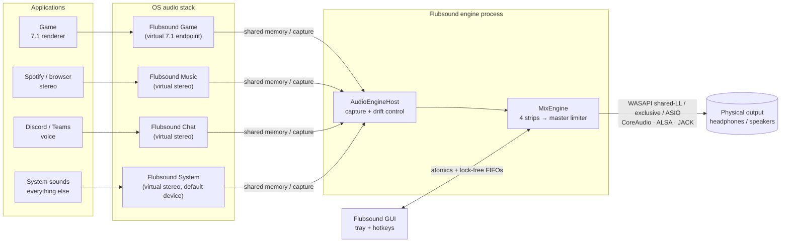
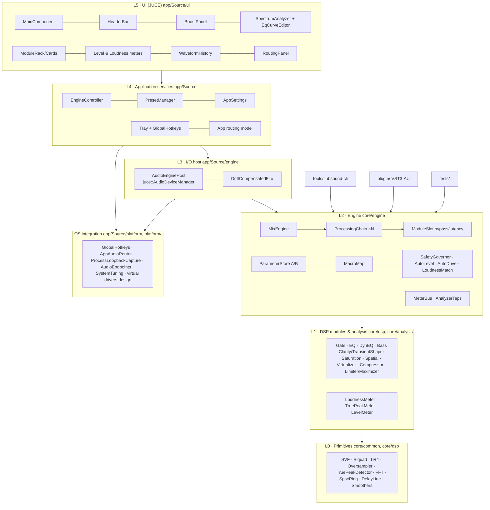
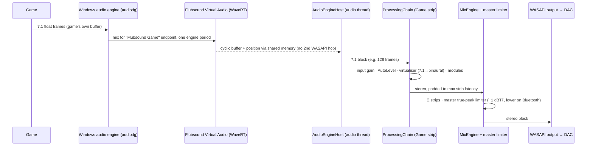
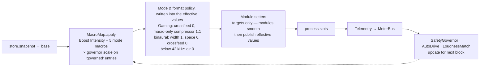

# 01 — High-Level System Architecture & Detailed Data Flow (Workflow 2)

> Flubsound Pro is a layered system with one sharp boundary: all DSP (every module, the meters and the engine) lives in **`flub_core`**; the hosts add only I/O glue and visualisation. That library is framework-free C++20 with no allocation or locks on the audio path. It is hosted by:
> - the desktop app (JUCE device I/O + GUI),
> - the plug-in,
> - the batch CLI,
> - the unit tests.
>
> System-wide and per-application processing comes from **virtual endpoints** (one per *strip*: Game, Music, Chat, System; per-platform status in §1). Each strip has its own processing chain and profile. The strips are summed and protected by a master true-peak limiter before the physical output.

---

## 1. System context



How each platform realises the virtual endpoints:

| Platform | Mechanism |
|---|---|
| Windows (primary) | WaveRT virtual audio driver, "Flubsound Virtual Audio" (**design only**, `platform/windows/driver/`; not built yet). Apps are assigned to endpoints by Windows' per-app output setting; the routing panel can do it itself only in builds with `FLUB_ENABLE_UNDOCUMENTED_ROUTING`, otherwise it opens `ms-settings:apps-volume`. **Implemented today:** per-process loopback capture (`ProcessLoopbackCapture`, Windows 10 build 20348+ / Windows 11) as the no-driver path. |
| macOS | Audio Server Plug-in virtual device (libASPL) and per-app capture on 14.2+ via Core Audio process taps with *mute-when-tapped* (**design only**, `platform/macos/README.md`; the app reports routing and capture as unsupported). |
| Linux | PipeWire / PulseAudio null sinks `flubsound_game/music/chat/system` ("Flubsound Game" ...), created by `platform/linux/flubsound-pipewire-setup.sh` or a PipeWire config drop-in. Apps are moved per sink-input (`pactl move-sink-input`) or with `target.object` rules. **Implemented.** |
| Any OS, zero install | Any third-party virtual cable (VB-Cable, BlackHole, a JACK port) feeding a strip through the device input. |

---

## 2. Layered component architecture



**Dependency rule.** Arrows only point downwards. `core/` (L0–L2) never includes JUCE or OS headers, which is what makes it hostable by the plug-in, the CLI, the tests and, later, a Windows APO or a PipeWire filter node (see `09-future-roadmap.md`).

| Layer | Responsibility | Key types |
|---|---|---|
| L0 primitives | Allocation-free building blocks with exact, documented latency | `SvfCoeffs`, `LinkwitzRiley4`, `Oversampler`, `TruePeakDetector`, `Fft`, `SpscRing`, `DelayLine`, `LinearSmoothedValue` |
| L1 modules | One audio effect each, implementing `flub::Processor` | `ParametricEq`, `DynamicEq`, `BassEngine`, `ClarityEnhancer`, `Saturator`, `StereoSpatializer`, `HeadphoneVirtualizer`, `Compressor`, `TruePeakLimiter`, `LoudnessMaximizer`, `SpectralNoiseGate`, meters |
| L2 engine | Parameters, macros, protection loops, bypass, chain order, strips, telemetry | `ParameterStore`, `MacroMap`, `SafetyGovernor`, `AutoLevel`, `ModuleSlot`, `ProcessingChain`, `MixEngine`, `MeterBus` |
| L3 host | Device I/O, clock-domain bridging, reconfiguration | `AudioEngineHost`, `DriftCompensatedFifo` |
| L4 services | Presets, settings, routing model, tray, hotkeys, device profiles | `EngineController`, `PresetManager`, `AppSettings`, `AppRouting`, `HotkeyManager`, `TrayIcon` |
| L5 UI | Presentation and interaction only | JUCE components |

---

## 3. Process & thread model

| Thread | Priority | Runs | Must not |
|---|---|---|---|
| **Audio callback** (device) | Real-time (MMCSS "Pro Audio" / time-constraint / SCHED_FIFO) | `MixEngine::process` → strips → master limiter; reads the parameter snapshot; writes meters | Allocate, lock, log, do I/O, or wait |
| **Capture threads** (Windows process loopback, one per captured app) | MMCSS "Pro Audio" (falls back to "Audio") | Pull OS capture packets and push frames into a `DriftCompensatedFifo` | Allocate or lock (after start) |
| **Message thread** (JUCE) | Normal | UI (meters and analyser once per display frame via `VBlankAttachment`), parameter-control refresh at 30 Hz, reconfiguration poll at 5 Hz, controller housekeeping at 2 Hz (CPU-overload watchdog poll, state autosave every 5 s, preferred-output rescan), preset I/O, tray, hotkeys | Block for long |
| **Worker threads** | Low | App routing worker ("Flubsound routing": session enumeration and endpoint moves, every 2 s while routes exist); `flubsound-cli batch --jobs N` (one chain per job). Roadmap: HRIR loading/resampling, inference | Touch audio-thread objects directly |

### Cross-thread communication (three main channels)

| Channel | Direction | Mechanism | Guarantees |
|---|---|---|---|
| `param::ParameterStore` | GUI/hotkeys/plug-in host → audio | Two banks (A/B) of `std::atomic<float>`, relaxed stores (values clamped, NaN ignored); the audio thread takes one `snapshot()` per block; a version counter lets the GUI refresh | Wait-free; last-writer-wins per value; the A/B switch is a single atomic |
| `MeterBus` | Audio → GUI | `std::atomic<float>` fields written once per block, polled at display rate | Wait-free; values are always individually consistent |
| `AnalyzerTaps` (`SpscRing<float>` pre/post) | Audio → GUI | Single-producer/single-consumer ring, acquire/release indices | Wait-free; drops (never blocks) if the GUI is slow |

A few single `std::atomic` hand-offs complement them: the chain publishes every *effective* value (post-macro, including its mode and format overrides) once per block (`ProcessingChain::effectiveValue()`, for the GUI's "ghost" markers), the momentary per-module audition bypass (`ProcessingChain::setAuditionBypass`) is one atomic bit mask, and `AudioEngineHost` passes strip gain / mute, the device-input map and the master ceiling to the audio thread through atomics.

Structural changes (latency profile, device format, strip layout) are never applied on the audio thread. The host polls `MixEngine::needsReprepare()` at 5 Hz on the message thread, detaches the callback, re-prepares, and re-attaches (the plug-in does the same with its own timer and reports the new latency to the host). This is a deliberate, short, explicit dropout; a crossfaded double-buffered engine swap is on the roadmap.

---

## 4. Data flow in detail

### 4.1 End-to-end signal path (Windows, driver path — design)

The driver is not built yet (`platform/windows/driver/README.md`); today the Windows strips are fed by per-process loopback capture or a virtual cable on the device input. The engine side (from `AudioEngineHost` on) is the same either way.



### 4.2 Inside one strip (the processing chain)

```
 in (2 / 6 / 8 ch)
  │
  ├─ Input gain (smoothed)                        ── all channels
  ├─ AutoLevel (gated LUFS input levelling, ±12 dB, +1 dB/s up / −4 dB/s down;
  │            BS.1770-4 channel weights: 5.1/7.1 sides 1.41, 7.1 back pair 1.0, LFE excluded)
  ├─ HeadphoneVirtualizer 5.1/7.1 → binaural       ── or ITU-R BS.775 downmix (LFE dropped, −3 dB);
  │                                                   virt.on toggles crossfade the two folds over 20 ms
  │        ════════ from here on: STEREO ════════
  ├─ dry tap ──► (delayed by total latency) ──► global bypass (loudness-matched reference;
  │                                               its own true-peak limiter fits inside that delay)
  ├─ [slot] SpectralNoiseGate      (Quality profile only; STFT 1024)
  ├─ [slot] ParametricEq           10 bands, SVF, zero latency
  ├─ [slot] DynamicEq              4 user bands + 4 mode bands (footsteps / de-harsh …)
  ├─ [slot] BassEngine             subsonic · mono-bass · protected shelf · harmonics · tighten
  ├─ [slot] ClarityEnhancer        transients · de-mud · dynamic presence · air exciter
  ├─ [slot] Saturator              tape / tube / digital, 2× oversampled
  ├─ [slot] StereoSpatializer      side-only width / focus / space / crossfeed (mono-exact)
  ├─ [slot] Compressor             look-ahead, linked, downward + upward
  ├─ [slot] LoudnessMaximizer      drive → 3-band glue (only while armed) → 4× soft clipper (2× in Low Latency)
  │                                 → true-peak limiter (4× detector shared with the meters)
  ├─ Output gain (trim, −24 … 0 dB)
  ├─ control loops: SafetyGovernor · AutoDrive · LoudnessMatch (feed the next block)
  ├─ global bypass crossfade (latency aligned, loudness matched: match gain capped per block, then a
  │                           dry-path true-peak limiter at max.ceiling, running only while bypass is engaged)
  └─ meters (peak/RMS/TP/LUFS M·S·I·LRA/correlation) · analyser tap → out (2 ch)
```

**Why this order:**
1. **Gate first.** Enhancement stages must not amplify hiss or hum they were never meant to see.
2. **Corrective before creative.** Static EQ fixes tonal balance. The dynamic EQ then reacts to that corrected balance and controls masking and resonances *before* the additive enhancers (bass, clarity, saturation) run, so they do not trigger extra dynamic cuts.
3. **Harmonics before width.** Saturation glues the generated harmonics. The spatializer then shapes the final tonal image, and only its side-channel.
4. **Dynamics late, limiter last.** The compressor sees the final spectrum and stereo image (linked detection). The maximizer is last because it is the only stage that *guarantees* the true-peak ceiling. Nothing after it adds gain: the output trim can only attenuate (its range ends at 0 dB). The loudness-matched bypass reference is protected separately: its match gain is capped once per block at `max.ceiling` minus the held dry peak, and because a new, louder dry peak can still arrive while that gain is high, the reference then passes its own `TruePeakLimiter` at `max.ceiling` (`dryLimiter` in `ProcessingChain`). That limiter fits inside the chain latency the dry path is delayed by anyway (up to 1 ms look-ahead + the 20-sample detector, so no latency is added), runs only while bypass is engaged, and starts cold on engagement: it outputs silence for its own latency (1 ms + 20 samples: 1.42 ms at 48 kHz) at the start of the 30 ms crossfade, where the dry weight is still below 5 % at 44.1 kHz and above (a little more at narrowband rates, where the 20 detector samples weigh more). Test: *Chain: matched bypass never overshoots the ceiling when a louder dry peak arrives* (all three latency profiles; sample peak ≤ ceiling, true peak ≤ ceiling + 0.15 dB).

### 4.3 Control flow per audio block



- **Base vs effective values.** Presets and the GUI write *base* values. Each block the chain computes *effective* values:

  ```
  effective = clamp( base + Σ amount · smoothstep(start, end, source)^exponent · g )
  g = governorScale for "governed" entries (they add loudness / drive), 1 otherwise
  source = Boost Intensity or one of the five mode macros (0 … 1)
  ```

  Macros can also *engage* modules. For example, turning up *Warmth* switches Saturation on (`core/src/engine/MacroMap.cpp`). In Gaming, a compressor that only macros switched on runs upward-only (ratio 1:1) unless a ratio was chosen, so loud events keep their dynamics.
- **Mode bands.** Dynamic-EQ bands 4–7 belong to the mode policy, not to the user:
  - Gaming: footstep lift (3.2 kHz and 260 Hz upward compression), explosion anti-masking (90 Hz low shelf, cut above) and voice/score presence (2 kHz).
  - Music: dynamic de-harsh (3.5 kHz), air lift (12 kHz shelf) and de-boom (120 Hz); band 7 is unused in Music.

  Each band's range scales with its source: Footsteps (bands 4–6) and Voice & Score (band 7) in Gaming; Clarity (de-harsh, air) and Boost Intensity (de-boom) in Music (`configureModeBands()` in `ProcessingChain.cpp`).
- **Glue arming.** The maximizer's 3-band glue splitter is only in the signal path while glue is *armed*: the preset sets `max.glue` > 0, or a macro that can raise it (Music: Boost Intensity, Loudness) is above zero. While armed, a 0.001 floor keeps the splitter engaged so Boost crossing the glue start point (40 %) never crossfades against the splitter's all-pass-shifted sum. Disarmed, the splitter is out of the path, because its all-pass rotation would raise the crest factor of flat-topped masters by 1–3 dB.
- **Protection loops** close around the output (`core/src/engine/Protection.cpp`):
  - The SafetyGovernor keeps the ~3 s average limiter gain reduction above −6 dB and the clip-energy ratio below −30 dB. Over budget, its scale falls at 15 %/s (minimum 0.3); comfortably under budget (1.5 dB hysteresis) it recovers at 3 %/s.
  - AutoDrive can only *reduce* maximizer drive, towards a LUFS target (≤ 2 dB/s, 0.5 LU dead band). The reduction stops at the requested drive (the applied drive never goes below 0 dB), so there is no hidden reduction to wind back when the programme gets quieter.
  - LoudnessMatch computes the fair-comparison gain for the bypass path (±12 dB, 3 dB/s; a raise is capped at `max.ceiling` minus the held dry peak, and the dry-path limiter above catches what the per-block cap misses).
  - All three loudness loops use a gated 3 s measure that freezes in silence, pauses and fade-outs.

### 4.4 Parameter, preset & A/B flow

```
GUI knob / hotkey / tray / plug-in host automation
        │  store.set(id, v)   (clamped, NaN ignored, relaxed atomic, version++)
        ▼
ParameterStore ── Bank A ──┐
               └─ Bank B ──┴─ activeBank (atomic) ──► audio thread snapshot()
        ▲
PresetManager: JSON (string keys) ⇄ Preset(values) ⇄ applyToStore(bank) / captureFromStore(bank)
```

- **A/B.** Two complete parameter banks. The header's A / B buttons flip the active bank atomically, and all continuous parameters glide, so the switch is click-free. The copy button duplicates the active bank into the other one (A→B or B→A).
- **Presets.** Versioned JSON with stable string keys: unknown keys are ignored, missing keys keep defaults, out-of-range numbers are clamped, choices are stored as labels (`presets/factory/*.json`, user presets as `*.flubpreset.json`, `core/include/flub/io/PresetIO.h`). The hosts (app, plug-in, CLI) never take "Bypass All" from a preset or write it into one: it is application state, not sound.

### 4.5 Metering & visualisation flow

```
audio thread ─► LevelMeter / TruePeakMeter / LoudnessMeter ─► MeterBus atomics ─► GUI, once per display frame
            └─► mid (L+R)/2 pre & post ─► AnalyzerTaps SPSC rings ─► GUI FFT (4096, Hann, 75 %)
                                                                    ├─► SpectrumAnalyzer + EQ curve
                                                                    └─► WaveformHistory (min/max decimation)
```

The GUI does all FFT and drawing work on the message thread. The audio thread's metering cost is bounded and constant.

### 4.6 Per-application routing flow

1. The user assigns an application to a strip (routing panel), or a rule matches its executable.
2. `AppRouting` applies the mapping with one of two methods (`app/Source/engine/AppRouting.h`):
   - **Endpoint routing:** `AppAudioRouter::setAppEndpoint(pid, endpoint)` moves the app's output to the strip's virtual endpoint. Linux: `pactl move-sink-input` to `flubsound_game` etc. Windows: only in builds with `FLUB_ENABLE_UNDOCUMENTED_ROUTING` (and useful once the driver's endpoints exist); otherwise the call fails with an explanation and the UI opens `ms-settings:apps-volume`. macOS: not supported yet (the UI opens the Sound settings).
   - **Process capture** (Windows 10 build 20348+ / Windows 11): `ProcessLoopbackCapture` captures the process tree into the strip through a `DriftCompensatedFifo`. It cannot mute the app's original output, so it suits monitoring and "lite" setups.
3. The app's audio now arrives on that strip and is processed with that strip's profile (`ParameterStore`).
4. The mapping (executable → strip) persists in `AppSettings`. A background worker re-applies it (every 2 s while routes exist) whenever the executable shows up, and endpoint moves are restored to the system default on shutdown.

### 4.7 Batch processing & export flow

```
WAV in ─► decode ─► ProcessingChain (offline, same code as realtime; mono → stereo, 5.1/7.1 → binaural or downmix)
   │  (PCM 16/24/32, float 32/64,  │ latency compensated: flush L zeros, drop the first L output samples
   │   WAVE_FORMAT_EXTENSIBLE)     ▼
   │                     LoudnessMeter (integrated LUFS)
   │                               │ loudness target? move max.drive (then input.gain / output.gain) by the error,
   │                               │ secant steps, ≤ 4 corrective passes, stop within 0.3 LU, keep the closest pass
   ▼                               ▼
 report (LUFS, LRA, TP, peak) ◄─ export WAV (float32, or PCM24 / PCM16 with TPDF dither)
```

Tools: `tools/flubsound-cli` (`process`, `batch --jobs N`, `analyze`, `params`, `presets`). Other formats (FLAC, MP3, AIFF, Ogg) are planned for the app's batch UI through JUCE's `AudioFormatManager` (roadmap Phase 2, item 2.10), which will use the same engine code.

---

## 5. Latency budget

This section is the project's single latency model. The R1.1 row in `00-understanding-and-plan.md`, the exit criteria in `07-roadmap.md`, device-lab test 8 in `10-headset-compatibility.md` §5, the Windows driver design (`platform/windows/driver/README.md` §6) and the README all refer to it. Every figure carries one of three scope labels:

| Scope | What it covers | Source | Status |
|---|---|---|---|
| **Chain** | One strip's algorithmic latency: look-aheads, oversampler FIRs, the STFT frame | `ProcessingChain::getLatencySamples()`; what the plug-in reports to its host and the CLI compensates | Exact, asserted by tests |
| **App engine** | The largest strip's chain + the desktop app's master limiter | `MixEngine::getLatencySamples()` | Exact, asserted by tests |
| **Added end-to-end** | Everything Flubsound puts between the application and the ear on top of the application's normal output path: engine + I/O buffering (+ capture buffering on a capture path) | §5.2 and §5.3 | **Estimate** until the loopback measurement (roadmap `07-roadmap.md` item 1.2; device-lab test 8 in `10-headset-compatibility.md` §5) |

**Target (R1.1): added end-to-end latency under 10–12 ms.**
- **Low Latency** is the profile that meets it: ≈ 9.5 ms estimated, under 10 ms.
- **Balanced** (the default) sits at the upper edge: ≈ 12–13 ms estimated.
- **Quality** (≈ 28 ms for the chain alone) is for music and batch use and is outside the target by design.

These estimates are for the Windows virtual-driver path, which is designed but not built. The capture paths that feed the strips today add buffering of their own (§5.3).

### 5.1 Algorithmic latency per profile (48 kHz; the only latency sources in the chain)

| Stage | Quality | Balanced (default) | Low Latency (competitive) |
|---|---|---|---|
| Spectral noise gate (STFT) | 1024 smp | — (not in chain) | — |
| Saturator oversampling (2×) | 32 smp (high-quality FIR) | 16 smp (short FIR) | 16 smp |
| Compressor look-ahead | 3 ms = 144 smp | 1 ms = 48 smp | 0.5 ms = 24 smp |
| Maximizer clipper oversampling | 4× HQ: 36 smp | 4× HQ: 36 smp | 2× short: 16 smp |
| True-peak limiter look-ahead + detector | 2 ms + 20 = 116 smp | 1.5 ms + 20 = 92 smp | 0.5 ms + 20 = 44 smp |
| **Chain total** | **1352 smp ≈ 28.2 ms** | **192 smp = 4.0 ms** | **100 smp ≈ 2.1 ms** |
| *Desktop app only:* master true-peak limiter after the strip sum (`MixEngine`; 1 ms look-ahead + 20, or 0.5 ms + 20 when every strip runs Low Latency) | +68 smp | +68 smp | +44 smp |
| **App engine total** (`MixEngine::getLatencySamples()`) | **1420 smp ≈ 29.6 ms** | **260 smp ≈ 5.4 ms** | **144 smp = 3.0 ms** |

All other modules (EQ, dynamic EQ, bass, clarity, spatializer, virtualiser) have zero latency. Bypassing a module never changes the total: the dry path is delayed to match. The global-bypass reference's own true-peak limiter (§4.2) sits inside that dry-path delay, so it adds nothing either. Look-aheads are defined in ms and FIR delays in samples, so the chain total varies with the rate: 1332 / 182 / 96 samples at 44.1 kHz, 1592 / 312 / 148 samples at 96 kHz. The plug-in and the CLI run a single chain with no master limiter. The app applies one latency profile to all strips; `MixEngine::configure()` gives the master limiter the Low Latency look-ahead (0.5 ms) only when every strip runs that profile, and 1 ms otherwise, so a mix of profiles (possible in the engine) pays the larger master latency on top of the largest strip. The app's header shows device input + output latency + app engine total (+ the capture FIFO target when per-app capture runs); with no device open that is the engine alone, 5.4 ms for Balanced at 48 kHz as in the screenshots.

### 5.2 Added end-to-end latency (what the user feels), Windows driver path

This is the budget table. It is an estimate for the virtual-driver path (`platform/windows/driver/README.md` §6 uses the same figures).

| Component | Scope | Low Latency + exclusive | Balanced + shared low-latency (`IAudioClient3`) |
|---|---|---|---|
| Read safety margin on the virtual endpoint | I/O | ~1 ms | ~1 ms |
| Engine block (128 frames) | I/O | 2.7 ms | 2.7 ms |
| Strip chain (§5.1) | chain | 2.1 ms (100 smp) | 4.0 ms (192 smp) |
| Master limiter (§5.1) | app engine − chain | 0.9 ms (44 smp) | 1.4 ms (68 smp) |
| Output buffering (device period, double-buffered) | I/O | ~2.7 ms | ~3–4 ms |
| **Added total (estimate)** | added end-to-end | **≈ 9.5 ms: meets ≤ 10 ms** | **≈ 12–13 ms: upper edge of 10–12 ms** |

- **Device mode.** Without a saved device choice the app opens JUCE's *Windows Audio (Low Latency Mode)* type (`IAudioClient3`, `AudioEngineHost::openDevice`), falling back to plain *Windows Audio* if the device cannot be opened in that mode; a type chosen in Settings > Audio (e.g. *(Exclusive Mode)*) is saved and always wins. Classic shared mode uses 10 ms periods, so the engine block and the output buffering each grow to about 10 ms and the added total roughly doubles (≈ 25 ms, estimate), well outside the target.
- **Reported, not measured.** The app's latency readout adds the device's reported input and output latencies to the app engine latency (and the capture FIFO target, if any). A loopback measurement tool is roadmap (`07-roadmap.md` item 1.2), and the device-lab plan checks the budget per headset (`10-headset-compatibility.md` §5, test 8). Until then every end-to-end figure in the docs is an estimate.
- **Other platforms.** The structure is the same on macOS (CoreAudio) and Linux (JACK / ALSA), with that backend's period in place of the WASAPI rows; they have not been estimated separately.

### 5.3 Capture paths that exist today add their own buffering

Until the virtual drivers exist, the strips are fed by a capture path. Each one adds buffering that the §5.2 budget does not contain, and on its own can use up the whole target:

| Path | Extra buffering | Figure at 48 kHz | Consequence |
|---|---|---|---|
| Windows per-process loopback capture (`ProcessLoopbackCapture` → `DriftCompensatedFifo`) | The FIFO target is max(2 device blocks, capture packet + 1 block) + 4 frames, so the drift loop never runs dry (asserted in the `DriftFifo:` tests) | **612 frames = 12.75 ms** with typical 10 ms (480-frame) capture packets and 128-frame blocks | Exceeds the 10–12 ms target before any device buffering. Suits monitoring and "lite" setups, not competitive play |
| Linux PipeWire null sinks (`flubsound_*`, §1) | The sink and its monitor add up to one graph quantum (`platform/linux/README.md`) | 1024 / 48000 = **21.3 ms** at the default quantum on many distributions; 256 / 48000 = 5.3 ms when forced (`pw-metadata -n settings 0 clock.force-quantum 256`) | Over the target at the default quantum. Setting `node.latency` for Flubsound's own nodes is roadmap |
| A third-party virtual cable on the device input (VB-Cable, BlackHole, a JACK port) | The cable's own buffer plus the input device's period | Set by the cable and its driver, not by Flubsound | Has to be measured per setup |

The app's latency readout includes the capture FIFO target of a running process-loopback capture, but not a PipeWire quantum or a cable's buffer.

---

## 6. Modularity & extension points

| Extension | How |
|---|---|
| New DSP module | Implement `flub::Processor`, add a `ModuleSlot` in `ProcessingChain`, add parameters to `Parameters.h/.cpp` (new string keys; `Id`s are only an in-memory index, the keys are the stable contract and are never renamed or reused; parameters added after the first release get the next `Info::sinceVersion` for the plug-in), and add a card in the UI (the generic `ParamGrid` editor comes free from `param::layout()`). |
| New macro behaviour | Add rows to the `MacroMap` tables (source, parameter, amount, start/end, curve, governed). No code changes in modules. |
| New mode policy | Extend `configureModeBands()` / the policy block in `ProcessingChain::applyParameters()`. |
| New host | Any code that can call `ProcessingChain::process()` with float buffers: app, plug-in, CLI, tests, future APO or PipeWire node. |
| New OS | Implement `app/Source/platform/PlatformServices.h` for that OS. |
| Neural module | Implement `flub::ModelRunner` (`core/include/flub/neural/ModelRunner.h`: frame size, input channels, a control frame of gains) and wrap it in `flub::AsyncModelProcessor`, which runs it on a worker thread behind a fixed latency of `frameSize × (1 + safetyFrames)` and falls back to the last good control, then to neutral, on a deadline miss or model failure; `isEligible()` (`neural/Eligibility.h`) says which latency profiles may run it. Putting it into `ProcessingChain` is still a code change (a new slot, as for any module), and there is no inference runtime or model yet (see `09-future-roadmap.md` §1.1). |

---

## 7. Resilience & failure handling

| Failure | Behaviour |
|---|---|
| NaN/Inf in the input (bad driver or plug-in) | The chain drops the block (outputs silence) and resets its state instead of latching garbage. |
| Capture underrun / overrun | `DriftCompensatedFifo` fades to silence (then re-primes and fades back in over 5 ms) or drops the oldest frames, and counts the event in its `Stats` (available through `AudioEngineHost::getCaptures()` and `EngineController::getCaptureStreams()`, and shown per stream in Settings › Processing and the header's latency tooltip). The PI loop re-centres the fill level. |
| Device removed / sleep / default-device change | JUCE reports the change and the host re-prepares for the new device format. When the preferred output (for example a USB headset) disappears, JUCE falls back to another device; `EngineController` switches back as soon as the preferred device is listed again (rescan every 5 s while it is missing). With the virtual driver (design), the virtual endpoints would stay the default so apps are unaffected. |
| Over-driven settings | The SafetyGovernor withdraws governed macro gain, and the limiter + master limiter guarantee the ceiling. |
| CPU overload | The header shows the device callback's CPU load and, when the device reports them, its xrun count. A watchdog (`OverloadWatchdog`, polled at 2 Hz by `EngineController`) detects sustained overload: 2 s at ≥ 90 % load, or ≥ 3 xruns / overrunning callbacks within 5 s; it clears after 5 s below 75 % without a new glitch. The policy is **notify only**: the CPU readout turns into an OVERLOAD warning whose tooltip recommends the Low Latency profile, which is also the cheapest (2× instead of 4× clipper oversampling, no STFT gate), or a larger buffer, and Settings › Processing counts the episodes of the session. Nothing is changed automatically, because every degradation step (latency profile, HQ oversampling) is a structural re-prepare with a dropout of its own; a watchdog that auto-degrades, and a tray notification, are on the roadmap. |
| GUI hang or crash | A hung GUI does not stop audio: the audio thread never waits for the GUI, which only reads atomics and rings. A crash still takes down the process (GUI and engine share it) until the service-process split (roadmap). |

---

## 8. Security & privacy

- **No network access** is required. Audio never leaves the machine, and future neural features run on-device.
- **Driver attack surface (design).** The virtual driver's private IOCTL validates caller, sizes and state. The shared buffer is mapped read/write only into the Flubsound engine process.
- **Per-process capture** is user-initiated for a chosen application. On macOS the app declares the microphone permission with a purpose string (capturing a virtual loopback device is an audio input); process-tap capture (design) will add `NSAudioCaptureUsageDescription`.
- **No injection or hooks** into other processes, which also keeps the product anti-cheat safe (`08-pitfalls-and-solutions.md` C7).
