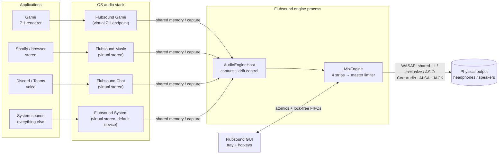
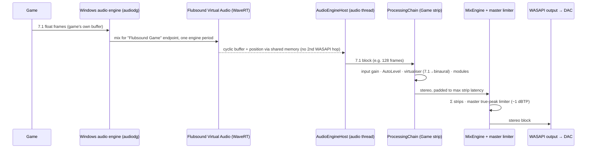
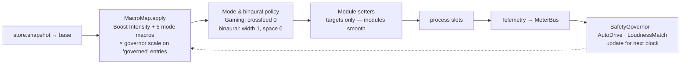

# 01 — High-Level System Architecture & Detailed Data Flow (Workflow 2)

> Flubsound Pro is a layered system with one sharp boundary: everything that touches audio samples lives in **`flub_core`**. That library is framework-free C++20 with no allocation or locks on the audio path. It is hosted by:
> - the desktop app (JUCE device I/O + GUI),
> - the plug-in,
> - the batch CLI,
> - the unit tests.
>
> System-wide and per-application processing comes from **virtual endpoints** (one per *strip*: Game, Music, Chat, System). Each strip has its own processing chain and profile. The strips are summed and protected by a master true-peak limiter before the physical output.

---

## 1. System context



How each platform realises the virtual endpoints:

| Platform | Mechanism |
|---|---|
| Windows (primary) | WaveRT virtual audio driver, "Flubsound Virtual Audio" (design in `platform/windows/driver/`). Apps are assigned to endpoints by Windows' per-app output setting or by Flubsound's routing panel. Process-loopback capture is a no-driver fallback. |
| macOS | Audio Server Plug-in virtual device (libASPL). Per-app capture on 14.2+ via Core Audio process taps with *mute-when-tapped*. |
| Linux | PipeWire null sinks `Flubsound Game/Music/Chat/System` (`platform/linux/flubsound-pipewire-setup.sh`). Apps are moved per sink-input or with WirePlumber rules. |
| Any OS, zero install | Any third-party virtual cable (VB-Cable, BlackHole, a JACK port) feeding a strip through the device input. |

---

## 2. Layered component architecture


**Dependency rule.** Arrows only point downwards. `core/` (L0–L2) never includes JUCE or OS headers, which is what makes it hostable by the plug-in, the CLI, the tests and, later, a Windows APO or a PipeWire filter node (see `09-future-roadmap.md`).

| Layer | Responsibility | Key types |
|---|---|---|
| L0 primitives | Allocation-free building blocks with exact, documented latency | `SvfCoeffs`, `LinkwitzRiley4`, `Oversampler`, `TruePeakDetector`, `Fft`, `SpscRing`, `DelayLine`, `LinearSmoothedValue` |
| L1 modules | One audio effect each, implementing `flub::Processor` | `ParametricEq`, `DynamicEq`, `BassEngine`, `ClarityEnhancer`, `Saturator`, `StereoSpatializer`, `HeadphoneVirtualizer`, `Compressor`, `TruePeakLimiter`, `LoudnessMaximizer`, `SpectralNoiseGate`, meters |
| L2 engine | Parameters, macros, protection loops, bypass, chain order, strips, telemetry | `ParameterStore`, `MacroMap`, `SafetyGovernor`, `AutoLevel`, `ModuleSlot`, `ProcessingChain`, `MixEngine`, `MeterBus` |
| L3 host | Device I/O, clock-domain bridging, reconfiguration | `AudioEngineHost`, `DriftCompensatedFifo` |
| L4 services | Presets, settings, routing model, tray, hotkeys | `EngineController`, `PresetManager`, `AppSettings` |
| L5 UI | Presentation and interaction only | JUCE components |

---

## 3. Process & thread model

| Thread | Priority | Runs | Must not |
|---|---|---|---|
| **Audio callback** (device) | Real-time (MMCSS "Pro Audio" / time-constraint / SCHED_FIFO) | `MixEngine::process` → strips → master limiter; reads the parameter snapshot; writes meters | Allocate, lock, log, do I/O, or wait |
| **Capture threads** (process loopback, one per captured app) | High (MMCSS "Audio") | Pull OS capture packets and push frames into a `DriftCompensatedFifo` | Allocate or lock (after start) |
| **Message thread** (JUCE) | Normal | UI, timers (meters at 60 Hz, parameter refresh at 30 Hz, reconfiguration poll at 5 Hz), tray, hotkeys | Block for long |
| **Worker threads** | Normal/low | Preset I/O, HRIR loading/resampling, batch rendering (one chain per job), future inference | Touch audio-thread objects directly |

### Cross-thread communication (the only three channels)

| Channel | Direction | Mechanism | Guarantees |
|---|---|---|---|
| `param::ParameterStore` | GUI/hotkeys/plug-in host → audio | Two banks (A/B) of `std::atomic<float>`, relaxed stores; the audio thread takes one `snapshot()` per block; a version counter lets the GUI refresh | Wait-free; last-writer-wins per value; the A/B switch is a single atomic |
| `MeterBus` | Audio → GUI | `std::atomic<float>` fields written once per block, polled at display rate | Wait-free; values are always individually consistent |
| `AnalyzerTaps` (`SpscRing<float>` pre/post) | Audio → GUI | Single-producer/single-consumer ring, acquire/release indices | Wait-free; drops (never blocks) if the GUI is slow |

Structural changes (latency profile, device format, strip layout) are never applied on the audio thread. The host notices `MixEngine::needsReprepare()` on the message thread, detaches the callback, re-prepares, and re-attaches. This is a deliberate, short, explicit dropout; a crossfaded double-buffered engine swap is on the roadmap.

---

## 4. Data flow in detail

### 4.1 End-to-end signal path (Windows, driver path)



### 4.2 Inside one strip (the processing chain)

```
 in (2 / 6 / 8 ch)
  │
  ├─ Input gain (smoothed)                        ── all channels
  ├─ AutoLevel (LUFS input levelling, ±12 dB, ≤ +1 dB/s)
  ├─ HeadphoneVirtualizer 5.1/7.1 → binaural       ── or ITU-R BS.775 downmix
  │        ════════ from here on: STEREO ════════
  ├─ dry tap ──► (delayed by total latency) ──► global bypass / A-B reference
  ├─ [slot] SpectralNoiseGate      (Quality profile only; STFT 1024)
  ├─ [slot] ParametricEq           10 bands, SVF, zero latency
  ├─ [slot] DynamicEq              4 user bands + 4 mode bands (footsteps / de-harsh …)
  ├─ [slot] BassEngine             subsonic · mono-bass · protected shelf · harmonics · tighten
  ├─ [slot] ClarityEnhancer        transients · de-mud · dynamic presence · air exciter
  ├─ [slot] Saturator              tape / tube / digital, 2× oversampled
  ├─ [slot] StereoSpatializer      side-only width / focus / space / crossfeed (mono-exact)
  ├─ [slot] Compressor             look-ahead, linked, downward + upward
  ├─ [slot] LoudnessMaximizer      drive → 3-band glue → 4× soft clipper → true-peak limiter
  ├─ Output gain
  ├─ control loops: SafetyGovernor · AutoDrive · LoudnessMatch (feed the next block)
  ├─ global bypass crossfade (latency aligned, loudness matched, ceiling-capped)
  └─ meters (peak/RMS/TP/LUFS M·S·I·LRA/correlation) · analyser tap → out (2 ch)
```

**Why this order:**
1. **Gate first.** Enhancement stages must not amplify hiss or hum they were never meant to see.
2. **Corrective before creative.** Static EQ fixes tonal balance. The dynamic EQ then reacts to that corrected balance and controls masking and resonances *before* the additive enhancers (bass, clarity, saturation) run, so they do not trigger extra dynamic cuts.
3. **Harmonics before width.** Saturation glues the generated harmonics. The spatializer then shapes the final tonal image, and only its side-channel.
4. **Dynamics late, limiter last.** The compressor sees the final spectrum and stereo image (linked detection). The maximizer is last because it is the only stage that *guarantees* the true-peak ceiling. Nothing after it may add gain, except the output trim, which only attenuates in practice, and the ceiling-capped matched bypass.

### 4.3 Control flow per audio block



- **Base vs effective values.** Presets and the GUI write *base* values. Each block the chain computes *effective* values:

  `effective = clamp(base + Σ amount · smoothstep(start, end, macro)^exp · governorScale)`

  Macros can also *engage* modules. For example, turning up *Warmth* switches Saturation on.
- **Mode bands.** Dynamic-EQ bands 4–7 belong to the mode policy, not to the user:
  - Gaming: footstep lift (3.2 kHz and 260 Hz upward compression), explosion anti-masking (90 Hz low shelf, cut above) and voice/score presence (2 kHz).
  - Music: dynamic de-harsh (3.5 kHz), air lift (12 kHz shelf) and de-boom (120 Hz).

  All of them scale with the relevant macro.
- **Protection loops** close around the output:
  - The governor keeps average limiter gain reduction above −6 dB and clip energy below −30 dB.
  - AutoDrive can only *reduce* maximizer drive, towards a LUFS target.
  - LoudnessMatch computes the fair-comparison gain for the bypass path.

### 4.4 Parameter, preset & A/B flow

```
GUI knob / hotkey / tray / plug-in host automation
        │  store.set(id, v)   (clamped, relaxed atomic, version++)
        ▼
ParameterStore ── Bank A ──┐
               └─ Bank B ──┴─ activeBank (atomic) ──► audio thread snapshot()
        ▲
PresetManager: JSON (string keys) ⇄ Preset(values) ⇄ applyToStore(bank) / captureFromStore(bank)
```

- **A/B.** Two complete parameter banks. "Compare" flips the active bank atomically, and all continuous parameters glide, so the switch is click-free. "Copy A→B" duplicates a bank.
- **Presets.** Versioned JSON with stable string keys: unknown keys are ignored, missing keys keep defaults, choices are stored as labels (`presets/factory/*.json`, `core/include/flub/io/PresetIO.h`).

### 4.5 Metering & visualisation flow

```
audio thread ─► LevelMeter / TruePeakMeter / LoudnessMeter ─► MeterBus atomics ─► GUI timers (60 Hz)
            └─► mid (L+R)/2 pre & post ─► AnalyzerTaps SPSC rings ─► GUI FFT (4096, Hann, 75 %)
                                                                    ├─► SpectrumAnalyzer + EQ curve
                                                                    └─► WaveformHistory (min/max decimation)
```

The GUI does all FFT and drawing work on the message thread. The audio thread's metering cost is bounded and constant.

### 4.6 Per-application routing flow

1. The user assigns an application to a strip (routing panel), or a rule matches its executable.
2. `AppAudioRouter::setAppEndpoint(pid, "Flubsound Game")` points the app's default render endpoint at the virtual endpoint. If the OS offers no supported API, the UI opens the system per-app device settings instead.
3. The app's audio now arrives on that strip and is processed with that strip's profile (`ParameterStore`).
4. The mapping (executable → strip) persists in `AppSettings` and is re-applied when the app starts.

Without the driver, `ProcessLoopbackCapture` can capture a specific process (tree) into a strip for monitoring and "lite" setups.

### 4.7 Batch processing & export flow

```
WAV/FLAC/MP3 in ─► decode ─► ProcessingChain (offline, same code as realtime)
      │                          │ latency compensated: drop first L samples, flush L zeros
      │                          ▼
      │                LoudnessMeter (integrated LUFS)
      │                          │ loudness target? adjust max.drive by the error, ≤ 4 iterations, stop within 0.3 LU
      ▼                          ▼
 report (LUFS, LRA, TP, peak) ◄─ export WAV (float32 / PCM24 / PCM16 with TPDF dither)
```

Tools: `tools/flubsound-cli` (`process`, `batch --jobs N`, `analyze`, `params`, `presets`). The app's batch UI (roadmap Phase 2) uses the same engine code.

---

## 5. Latency budget

### 5.1 Algorithmic latency per profile (48 kHz; the only latency sources in the chain)

| Stage | Quality | Balanced (default) | Low Latency (competitive) |
|---|---|---|---|
| Spectral noise gate (STFT) | 1024 smp | — (not in chain) | — |
| Saturator oversampling (2×) | 32 smp (high-quality FIR) | 16 smp (short FIR) | 16 smp |
| Compressor look-ahead | 3 ms = 144 smp | 1 ms = 48 smp | 0.5 ms = 24 smp |
| Maximizer clipper oversampling | 4× HQ: 36 smp | 4× HQ: 36 smp | 2× short: 16 smp |
| True-peak limiter look-ahead + detector | 2 ms + 12 = 108 smp | 1.5 ms + 12 = 84 smp | 0.5 ms + 12 = 36 smp |
| **Total** | **1344 smp ≈ 28 ms** | **184 smp ≈ 3.8 ms** | **92 smp ≈ 1.9 ms** |

All other modules (EQ, dynamic EQ, bass, clarity, spatializer, virtualiser) have zero latency. Bypassing a module never changes the total: the dry path is delayed to match.

### 5.2 Added end-to-end latency (what the user feels), Windows driver path

| Component | Low Latency + exclusive | Balanced + shared low-latency (`IAudioClient3`) |
|---|---|---|
| Read safety margin on the virtual endpoint | ~1 ms | ~1 ms |
| Engine block (128 frames) | 2.7 ms | 2.7 ms |
| Algorithmic (§5.1) | 1.9 ms | 3.8 ms |
| Output buffering (device period, double-buffered) | ~2.7 ms | ~3–4 ms |
| **Added total** | **≈ 8 ms** | **≈ 10–11 ms** |

Both meet the ≤ 10–12 ms target. Classic shared mode with a 10 ms default period would add about 7 ms more, which is why the engine prefers `IAudioClient3` low-latency shared mode or exclusive mode. The app's latency readout shows the actual device buffer sizes plus the engine's reported latency.

---

## 6. Modularity & extension points

| Extension | How |
|---|---|
| New DSP module | Implement `flub::Processor`, add a `ModuleSlot` in `ProcessingChain`, add parameters to `Parameters.h/.cpp` (append-only IDs), and add a card in the UI (the generic editor comes free from `param::layout()` groups). |
| New macro behaviour | Add rows to the `MacroMap` tables (source, parameter, amount, start/end, curve, governed). No code changes in modules. |
| New mode policy | Extend `configureModeBands()` / the policy block in `ProcessingChain::applyParameters()`. |
| New host | Any code that can call `ProcessingChain::process()` with float buffers: app, plug-in, CLI, tests, future APO or PipeWire node. |
| New OS | Implement `app/Source/platform/PlatformServices.h` for that OS. |
| Neural module | An asynchronous processor with a fixed-latency contract (see `09-future-roadmap.md` §1.1). |

---

## 7. Resilience & failure handling

| Failure | Behaviour |
|---|---|
| NaN/Inf in the input (bad driver or plug-in) | The chain drops the block (outputs silence) and resets its state instead of latching garbage. |
| Capture underrun / overrun | `DriftCompensatedFifo` outputs silence or drops the oldest frames and counts the event (shown in diagnostics). The PI loop re-centres the fill level. |
| Device removed / sleep / default-device change | The host re-opens the configured device, or falls back to the system default, and re-prepares. The virtual endpoints stay default so apps are unaffected. |
| Over-driven settings | The SafetyGovernor withdraws governed macro gain, and the limiter + master limiter guarantee the ceiling. |
| CPU overload | Meters show CPU. Recommended action: the Low Latency profile, which is also the cheapest. A watchdog that auto-degrades (e.g. drops HQ oversampling) is on the roadmap. |
| GUI hang or crash | Audio keeps running; the GUI only reads atomics and rings. The service-process split (roadmap) makes this fully independent. |

---

## 8. Security & privacy

- **No network access** is required. Audio never leaves the machine, and future neural features run on-device.
- **Driver attack surface.** The virtual driver's private IOCTL validates caller, sizes and state. The shared buffer is mapped read/write only into the Flubsound engine process.
- **Per-process capture** is user-initiated for a chosen application. The OS privacy permission (macOS audio capture) is requested with a clear purpose string.
- **No injection or hooks** into other processes, which also keeps the product anti-cheat safe (`08-pitfalls-and-solutions.md` C7).
