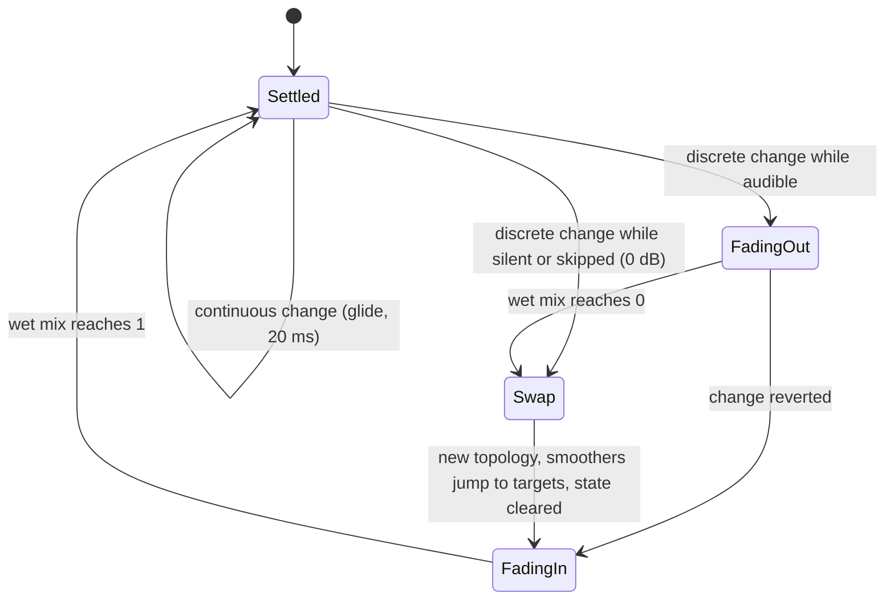
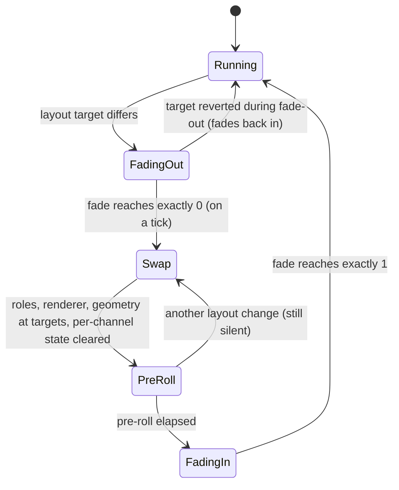

# 03 — DSP Design

> Every sample-touching algorithm in Flubsound Pro lives in `flub_core` (`core/`): allocation-free C++20 with no third-party code, exercised by the zero-dependency unit tests in `tests/`. This document covers **every DSP module of the processing chain**, as implemented:
> - the signal flow through the chain and through each module;
> - the maths as implemented: exact formulas and constants;
> - the parameter keys, ranges and defaults from [`core/src/engine/Parameters.cpp`](../core/src/engine/Parameters.cpp);
> - the smoothing that makes every change click-free;
> - latency and CPU, per module (sections 2–13) and for the whole chain (section 15);
> - how Gaming and Music mode use each module, and the macros and protection loops behind them (section 14);
> - the tests that prove each property;
> - known limitations. Roadmap items are labelled as such.
>
> Section 0 describes the shared primitives that the module sections build on, and section 1 the gain staging across the whole chain.

**Reading conventions**

- Levels are dBFS *peak* unless stated otherwise. For a sine, RMS = peak − 3.01 dB.
- `fs` is the session sample rate. The *control rate* is `fs / 16`: the parametric EQ, dynamic EQ, bass engine, clarity enhancer and headphone virtualizer use `kControlInterval = 16`; the stereo spatializer uses 32 (section 7). The other modules run their smoothing per sample (compressor, limiter, maximizer, saturator, transient shaper) or per STFT hop (noise gate).
- `x'` means "the smoothed value of parameter x".
- **Measured** figures were reproduced for this document with small harnesses linked against the module sources. The unit tests assert looser bounds, which are listed per module.
- **CPU** figures are indicative only, measured on one machine: g++ 13.3 `-O2`, x86-64 (Intel Xeon @ 2.10 GHz, container), 48 kHz, stereo, 512-sample blocks, white-noise input, `ScopedNoDenormals` active, best of 5 runs. "% core" = ns per stereo sample ÷ 20 833 ns (one 48 kHz sample period). Section 15 has the chain-level summary.

| § | Section | Main sources |
|---|---|---|
| [0](#0-conventions--shared-primitives) | Conventions & shared primitives | `core/include/flub/common/*`, `core/include/flub/dsp/{Svf,Biquad,Crossover,EnvelopeFollower,Oversampler,TruePeakDetector,FirDesign,Fft}.h`, `core/src/dsp/{Oversampler,Fft}.cpp` |
| [1](#1-gain-staging-overview) | Gain staging overview | `core/src/engine/ProcessingChain.cpp` |
| [2](#2-parametric-eq) | Parametric EQ | `core/src/dsp/ParametricEq.cpp` |
| [3](#3-dynamic-eq) | Dynamic EQ | `core/src/dsp/DynamicEq.cpp` |
| [4](#4-bass-engine) | Bass engine | `core/src/dsp/BassEngine.cpp` |
| [5](#5-transient-shaper--clarity-enhancer) | Transient shaper + Clarity enhancer | `core/src/dsp/TransientShaper.cpp`, `core/src/dsp/ClarityEnhancer.cpp` |
| [6](#6-saturation) | Saturation | `core/src/dsp/Saturator.cpp` |
| [7](#7-stereo-widener--spatializer) | Stereo widener / spatializer | `core/src/dsp/StereoSpatializer.cpp` |
| [8](#8-headphone-virtualizer) | Headphone virtualizer | `core/src/dsp/HeadphoneVirtualizer.cpp` |
| [9](#9-look-ahead-compressor-downward--upward) | Look-ahead compressor (downward + upward) | `core/src/dsp/Compressor.cpp` |
| [10](#10-true-peak-limiter) | True-peak limiter | `core/src/dsp/TruePeakLimiter.cpp` |
| [11](#11-loudness-maximizer--soft-clipper) | Loudness maximizer + soft clipper | `core/src/dsp/LoudnessMaximizer.cpp` |
| [12](#12-spectral-noise-gate) | Spectral noise gate | `core/src/dsp/SpectralNoiseGate.cpp` |
| [13](#13-metering-loudness-lra-true-peak-rms-and-correlation) | Metering: loudness, LRA, true peak, RMS and correlation | `core/src/analysis/LoudnessMeter.cpp`, `core/include/flub/analysis/{PeakMeters,LoudnessFollower,ChannelWeights}.h` |
| [14](#14-macros-musicgaming-modes--protection-loops) | Macros, Music/Gaming modes & protection loops; device correction and the headroom predictor (§14.10) | `core/src/engine/{MacroMap,ProcessingChain,Protection,MixEngine}.cpp`, `core/src/dsp/DeviceCorrection.cpp`, `core/src/io/ParametricEqText.cpp` |
| [15](#15-chain-level-cpu-and-latency-summary) | Chain-level CPU and latency summary | `core/src/engine/{ProcessingChain,ModuleSlot,MixEngine}.cpp` |
| [16](#16-neural-voice-cleanup-experimental) | Neural voice cleanup (experimental): the TinyNet runtime, the BandGains renderer and the first trained model | `core/src/neural/{TinyNet,VoiceCleanupRunner,AsyncModelProcessor}.cpp`, `core/include/flub/neural/BandGains.h`, `tools/neural/` |

---

## 0. Conventions & shared primitives

### 0.1 Numeric format and the module contract

| Aspect | Rule (as implemented) | Source |
|---|---|---|
| Sample format | 32-bit `float`, planar, processed **in place** on an `AudioBlock`: an array of up to `kMaxChannels = 8` channel pointers plus the sample count. Sub-blocks are views, so they cost no allocation. | `common/AudioBlock.h` |
| Double precision | Used where precision matters more than speed: <br>• filter *design* (`SvfCoeffs::make` computes in `double` and keeps `g`, `k` as `double` for exact response evaluation); <br>• FIR tap design (`FirDesign.h`, taps are then stored as `float`); <br>• `Biquad` coefficients and state (TDF-II); <br>• `MeanSquareFollower` state (so also the `LevelMeter` RMS and correlation and the `LoudnessFollower`s of the control loops); <br>• the loudness gates' sums of squares; <br>• `LoudnessMeter` energies (per-channel sums, the sub-block ring, the gating histogram); <br>• the `TruePeakLimiter` gain envelope (the release one-pole `gain` and its fast / slow / blend coefficients) and the box filter's running sum (`boxSum`, `boxLength`): a float one-pole with a long release stalls a few 1e−5 below its target; <br>• the `Compressor` gain computer's smoothing state (`gainDb`) and its attack, release and auto-release coefficients (the peak detector itself is float): a float one-pole with a coefficient near 1 − 1e−5 stalls up to ~0.7 dB short of its target; <br>• the `StereoSpatializer`'s output-correlation mean products. | `dsp/Svf.h`, `dsp/FirDesign.h`, `dsp/Biquad.h`, `dsp/EnvelopeFollower.h`, `analysis/LoudnessMeter.h`, `dsp/TruePeakLimiter.h`, `dsp/Compressor.h`, `dsp/StereoSpatializer.h`, `engine/Protection.h` |
| Threading | `prepare()` runs off the audio thread and may allocate. `reset()`, `process()` and all setters run on the audio thread: `noexcept`, no allocation, no locks, no I/O, bounded time. | `dsp/Processor.h` |
| Parameter push | `ProcessingChain::applyParameters()` calls every module setter **every block**. Each module sanitises the new values, compares them with the current set and returns early when nothing changed, so an unchanged parameter costs one comparison. | `engine/ProcessingChain.cpp` |
| Sanitising | **First line, the `ParameterStore`:** `ParameterStore::set()` ignores NaN and keeps the current value; `Info::clamp()` maps NaN to the parameter's default; ±inf clamps to the range edge. A NaN from automation, a host or a script therefore never reaches a module through the store (test *ParameterStore: NaN is ignored, infinities clamp, and the chain stays finite*). <br>**Second line, each module** (for direct API use): values are clamped to the module's documented range, and ±inf clamps to the range edge. NaN handling differs by module: <br>• the previous value is kept by `BassEngine`, `ClarityEnhancer` and `TransientShaper`; <br>• the default is used by `ParametricEq` and `Saturator`; <br>• `DynamicEq` keeps the previous setting for **any** non-finite value, including ±inf. | `engine/Parameters.h`, `src/engine/Parameters.cpp`, per-module `sanitise()` |
| Latency | An integer number of samples, constant between `prepare()` calls. The chain delay-compensates the bypass paths (`ModuleSlot`, global bypass). | `dsp/Processor.h`, `engine/ModuleSlot.h` |
| Channels | A block may carry fewer channels than prepared. Only the channels present are processed, and they are the only ones linked. | per module |

`DelayLine` (`common/DelayLine.h`) is the fixed integer delay used for the dry-path compensation of every latency-carrying stage. Block processing and per-sample processing (`processSample()` + `advance()`) give identical results (test *DelayLine: block delay equals per-sample delay*).

### 0.2 TPT state-variable filter (`dsp/Svf.h`)

The workhorse filter is Andrew Simper's (Cytomic) linear trapezoidal state-variable filter, a topology-preserving transform (TPT). It was chosen over direct-form biquads for three reasons:
- it stays well behaved when its coefficients change every few samples (dynamic EQ, glides);
- its two states are integrator outputs with a physical meaning;
- it is numerically robust for low cutoffs at high sample rates.

```
design:   w  = tan(pi * fc / fs)            fc clamped to [5 Hz, 0.49 fs], Q clamped to [0.025, 40]
          k  = 1 / Q                        A  = 10^(gainDb / 40)
          g  = w  (w / sqrt(A) for LowShelf, w * sqrt(A) for HighShelf)
          a1 = 1 / (1 + g (g + k)),  a2 = g a1,  a3 = g a2

per sample (state ic1, ic2):
          v3 = v0 - ic2
          v1 = a1 ic1 + a2 v3               band-pass core   s / (s^2 + k s + 1)
          v2 = ic2 + a2 ic1 + a3 v3         low-pass core    1 / (s^2 + k s + 1)
          ic1 = 2 v1 - ic1,   ic2 = 2 v2 - ic2
          y  = m0 v0 + m1 v1 + m2 v2
```

The mix coefficients select the response. Every type is one of the normalised analog prototypes below, evaluated at `s = j·tan(π f/fs)/g` (see the response mapping below):
- for the non-shelf types `g = tan(π fc/fs)`, so `|s| = 1` falls exactly on `fc`;
- for the shelves `g` is scaled by `1/√A` (low shelf) or `√A` (high shelf), which moves the half-gain point `|H| = A` onto `fc`.

| `FilterType` | `(m0, m1, m2)` | Analog prototype H(s) | Key property |
|---|---|---|---|
| `LowPass` | (0, 0, 1) | 1 / (s² + ks + 1) | −3.01 dB at fc for Q = 1/√2 |
| `HighPass` | (1, −k, −1) | s² / (s² + ks + 1) | |
| `BandPass` | (0, k, 0) | ks / (s² + ks + 1) | **0 dB at fc** (unity-gain detector) |
| `Notch` | (1, −k, 0) | (s² + 1) / (s² + ks + 1) | zero at fc |
| `AllPass` | (1, −2k, 0) | (s² − ks + 1) / (s² + ks + 1) | \|H\| = 1, −180° at fc |
| `Bell` (k = 1/(Q·A)) | (1, k(A² − 1), 0) | (s² + (A/Q)s + 1) / (s² + s/(QA) + 1) | A² = 10^(dB/20) at fc. A cut is the exact reciprocal of the equal boost, H₊·H₋ = 1. |
| `LowShelf` | (1, k(A − 1), A² − 1) | (s² + kAs + A²) / (s² + ks + 1) | full gain A² at DC, **half the dB gain (A) at fc**, 0 dB at HF |
| `HighShelf` | (A², kA(1 − A), 1 − A²) | (A²s² + kAs + 1) / (s² + ks + 1) | full gain at HF, half the dB gain at fc, 0 dB at DC |

**Exact response mapping.**
- The digital filter is the bilinear transform of the prototype, prewarped at the design frequency. Its response at frequency `f` is therefore exactly the prototype evaluated at `s = j·tan(ω/2)/g`, with `ω = 2π f / fs`.
- `SvfCoeffs::response()` evaluates this in `double`, with `f` clamped to [0, 0.4999 fs]:
  ```
  H(f) = m0 + m1 * s/(s^2+ks+1) + m2 * 1/(s^2+ks+1),   s = j tan(pi f / fs) / g
  ```
  `magnitudeDb()` floors `|H|` at 1e-12, i.e. −240 dB.
- The GUI curves (`ParametricEq::responseDb`) and several tests use exactly this function.
- Test *Svf: analytic response() matches the running filter for every type* checks the running filter against it to within 0.05 dB for all eight types, wherever the response is above −40 dB.

**Shelf convention (important for the bass engine).** The SVF shelf's *corner frequency is its half-gain point*. Two examples:
- a 9 dB low shelf at 60 Hz (Q 0.7) gives +8.85 dB at 20 Hz, **+7.33 dB at 40 Hz**, +4.50 dB at 60 Hz, +0.65 dB at 120 Hz and +0.10 dB at 200 Hz (analytic, identical at 44.1 and 48 kHz);
- test *Svf: shelves reach their gain at DC / Nyquist side* asserts +4 dB at the corner of an 8 dB shelf.

`svfTickRaw()` returns the raw `v1`/`v2` so that crossovers can form LP and HP from one state (HP = v0 − k·v1 − v2). `SvfFilter` is a convenience multichannel wrapper with shared coefficients.

### 0.3 Butterworth cascades

An order-2N Butterworth filter is built from N second-order SVF sections, all at the **same** cutoff, with the pole-pair Qs from `butterworthQ(N, k)`:

```
Q_k = 1 / (2 sin((2k + 1) pi / (4N))),   k = 0 .. N-1        (Svf.h)
```

| Sections N | Order / slope | Q₀ | Q₁ | Q₂ | Q₃ | Used for |
|---|---|---|---|---|---|---|
| 1 | 2nd, 12 dB/oct | 0.7071 | | | | 12 dB/oct EQ cuts; LR4 halves; bass harmonics post-HP and 25 Hz pre-HP; bass protection detector |
| 2 | 4th, 24 dB/oct | 1.3066 | 0.5412 | | | 24 dB/oct EQ cuts; bass subsonic HP4, replace-fundamental HP4, harmonics LP4s; clarity air HP4/LP4/HP4 |
| 3 | 6th, 36 dB/oct | 1.9319 | 0.7071 | 0.5176 | | 36 dB/oct EQ cuts |
| 4 | 8th, 48 dB/oct | 2.5629 | 0.9000 | 0.6013 | 0.5098 | 48 dB/oct EQ cuts |

Every cascade is maximally flat and exactly −3.01 dB at its cutoff. One octave into the stopband it reads −12.3 / −24.1 / −36.2 / −48.2 dB for N = 1..4 (analytic).

### 0.4 Linkwitz–Riley crossovers and all-pass alignment (`dsp/Crossover.h`)

`LinkwitzRiley4` derives both bands from **one** Butterworth design (Q = 1/√2), using three SVF states per channel. With D = s² + √2·s + 1:

```
split:  lp1 = v2,  hp1 = x - k v1 - v2              (one SVF tick)
low  = LP2(lp1)  = 1/D^2        high = HP2(hp1) = s^4/D^2

low + high = (1 + s^4)/D^2 = (s^2 - sqrt2 s + 1)/(s^2 + sqrt2 s + 1)
             because (s^2 + sqrt2 s + 1)(s^2 - sqrt2 s + 1) = s^4 + 1
```

The two bands sum to a second-order **all-pass**: flat magnitude, with phase passing −180° at the crossover. Each band is −6.02 dB at fc.

`LinkwitzRileyAllPass` is the SVF `AllPass` at the same frequency and Q. `ThreeBandSplitter` (used by the maximizer glue) passes the low band through the all-pass of the upper crossover:

```
low' = AP_hi · LP4_lo · x,   mid + high = AP_hi · HP4_lo · x   =>   low' + mid + high = AP_hi · AP_lo · x
```

so the three bands still sum to an all-pass. `BassEngine` uses the identical LR4 topology (`lr4Split()` on `svfTickRaw`), but owns the state so it can be flushed and recovered after a NaN; the shared class keeps its state private.

**Consequence used by the bass engine.** Because LP4 + HP4 is an all-pass that reaches −180° at the corner, crossfading *dry* against an LR4-processed path would notch the corner region. The bass engine therefore engages such stages "parked" at a subsonic corner (§4.3.6).

### 0.5 Biquad and FIR design helpers

- `Biquad` (`dsp/Biquad.h`) is a transposed direct-form II section in `double`, normalised to a0 = 1. It is used where coefficients are static and precision matters: BS.1770 K-weighting and the Brown–Duda head-shadow sections (sections 8 and 13).
- `BiquadCoeffs::fromAnalogFirstOrder(B0, B1, A0, A1, fs)` is the plain bilinear transform with K = 2·fs, *without* prewarping.
- `fir::kaiser`, `fir::sinc` and `fir::besselI0` (series, converged to 1e-14) are prepare-time helpers for the half-band and true-peak interpolators. `fir::lowpass()` (a normalised Kaiser-windowed low-pass) exists but no core module currently uses it.

### 0.6 Half-band oversampler (`dsp/Oversampler.h`, `src/dsp/Oversampler.cpp`)

**Purpose.** Every nonlinearity that can create harmonics above the original Nyquist runs oversampled: the saturation curves (§6) and the maximizer's soft clipper (section 11). This keeps those harmonics from aliasing. The oversampler must have an **integer** round-trip latency, so the dry paths can be compensated exactly.

**Delta oversampling (both users).** Neither user sends the programme itself through the round trip. The curve runs on the upsampled signal `x̂`, only its *deviation* `f(x̂) − x̂` is downsampled, and that band-limited deviation is added to the input delayed by exactly the round-trip latency (`DelayLine`):

```
y = x[n − L] + down( f(up(x)) − up(x) )          L = oversampler round-trip latency
```

Where the curve is linear (quiet material) the deviation vanishes and `y` is the delayed input, so the half-band passband droop below never reaches the programme. The alias rejection is unchanged, because the harmonics still pass the same downsampler. The latency is unchanged too.

**Design.**
- Each 2× stage is a linear-phase Kaiser-windowed half-band FIR with `4d + 1` taps, centre index `2d`.
- The centre tap is exactly 0.5.
- The taps at even offsets from the centre are exactly 0.
- The 2d odd taps, `h[2j+1] = 0.5·sinc((2j+1−2d)/2)·kaiser(2j+1, 4d+1, β)`, are rescaled to sum to 0.5, which gives exactly unity DC gain.

```
upsample   (per low-rate input x[i], history w[j] = x[i-j], j = 0..2d-1):
    out[2i]   = w[d]                              phase 0 = pure delay of d samples
    out[2i+1] = 2 * sum_j h[2j+1] * w[j]          phase 1 = interpolated
downsample (per low-rate output y[i], high-rate input v):
    y[i] = 0.5 * v[2i - 2d] + sum_j h[2j+1] * v[2i - (2j+1)]
round trip of one stage = d (up) + d (down) = 2d samples at the stage's lower rate
```

| Quality | Stage 1 (1× ↔ 2×) | Stage 2 (2× ↔ 4×) | 2× latency | 4× latency |
|---|---|---|---|---|
| `High` | d₁ = 16 → 65 taps, β = 9.0 | d₂ = 4 → 17 taps, β = 8.0 | 2d₁ = **32** | 2d₁ + d₂ = **36** |
| `Low` | d₁ = 8 → 33 taps, β = 4.5 | d₂ = 3 → 13 taps, β = 6.0 | **16** | **19** |
| factor 1 | pass-through (in place) | — | **0** | — |

Stage 2's round trip is 2d₂ samples at the 2× rate, which is d₂ base-rate samples. Hence `latency = 2·d₁ + d₂` for 4×.

**Rate-aware designs** ([11 E10](11-enhancement-report.md#e10) step 3; `Oversampler::Design`, `Oversampler::forProfile()`, used by the saturator, §6.4). A half-band's transition band is centred on the base Nyquist: at 44.1 kHz the 5th harmonic of a 5 kHz tone (25 kHz) folds to 19.1 kHz almost unattenuated, and at 2× every harmonic above the 2× Nyquist folds inside the oversampled domain. `Design` therefore also allows a stage-1 downsampler that is a general Kaiser-windowed-sinc low-pass (`DecimatorStage`, 4m + 1 taps at the 2× rate, delay m base samples, −6 dB point `cutoff1` × the 2× rate), so the transition can end near the image of 20 kHz. The round trip is then `d₁ + m₁` (2×) or `d₁ + m₁ + d₂` (4×). `forProfile()` keeps the latency the fixed 2× designs had, so no chain latency changes:

**8× and ADAA** ([11 E10](11-enhancement-report.md#e10) Phase 2). A hard-driven curve is close to a square wave, whose harmonics fall only 6 dB per octave: at 24 dB of drive the 17th / 19th harmonics of 10 kHz fold straight into the audible band at 4× (−28 dBc at 44.1 kHz). `Design` therefore also has factor 8 (a third half-band, d₃ = 2: 9 taps, `d₃/2` = 1 base sample; at 8× it only has to reject what would fold onto 0–20 kHz, so its transition runs from 20 kHz to the image band) and `adaa`, for curves evaluated with first-order antiderivative anti-aliasing (§6.4). ADAA1 is the curve followed by a one-sample box filter, whose sinc response nulls every multiple of the oversampled rate, i.e. exactly where the harmonics that fold near 0 Hz come from; it delays the curve by half an oversampled sample, which the stage-1 decimator takes back: with `adaa` its taps are centred `1/factor` of a 2×-rate sample early (a Kaiser-windowed sinc at a fractional centre, the window moved with it), so the deviation stays aligned with the exactly delayed dry path and the latency does not change. `forProfile()` keeps the latency the fixed 2× designs had, so no chain latency changes, and every row runs the ADAA curves:

| Profile | Below 88.2 kHz | 88.2 and 96 kHz | 176.4 kHz and above |
|---|---|---|---|
| Quality | 8×: up d₁ = 8 (β 8), stage 2 d₂ = 5 (β 9), stage 3 d₃ = 2 (β 5), decimator m₁ = 18 (73 taps, cutoff 0.23, β 9) → 8 + 18 + 5 + 1 = **32** | 4×: d₂ = 6, otherwise as 8× → 8 + 18 + 6 = **32** | 2×: d₁ = 16 (β 9), decimator m₁ = 16 (cutoff 0.25, β 9) → **32** |
| Balanced, Low Latency | 4×: d₁ = 4 (β 6), d₂ = 3 (β 7), m₁ = 9 (37 taps, cutoff 0.19, β 7) → 4 + 9 + 3 = **16** | as below 88.2 kHz, **16** | 2×: d₁ = 8 (β 6), decimator m₁ = 8 (cutoff 0.22, β 7) → **16** |

8× is used only in Quality: it doubles the curve's cost at the rates where most listening happens, and 4× with ADAA already keeps Warmth 100 and a 0 dBFS tone at 9 dB below −70 dBc there (§6.4). The decimator's passband ends below 20 kHz (−6 dB at 20.3 / 16.8 kHz for 44.1 kHz), which only the generated harmonics pass (delta oversampling); the programme keeps its top octave. Its cost is `4m + 1` multiply-adds per base-rate output; every FIR sums its products in four interleaved partial sums, which lets the compiler vectorise them (a single running sum is one serial add chain it may not reorder). Realtime factor of a CLI render (20 s of pink noise, 48 kHz, saturator on at 9 dB), against the 4× designs without ADAA: Balanced / Low Latency +4 % (the vectorised FIRs pay for ADAA), Quality −12 % (8×; Warmth 100, which now drives Tube at up to 0.9 dB, −17 %). E10 step 3 had cost 14 % (Balanced) / 22 % (Quality), so Quality is now about 31 % slower than before E10 with the saturator on, Balanced about 11 %.

**Filter performance.** The table below was computed from the actual tap design. "Image" is the level of the spectral image re unity gain (the worst value over the range, which is at its top edge). For the upsampler this is the image; for the downsampler it is the alias rejection of the same filter. The frequency axis is in base-rate `f/fs`: 0.375 = 18 kHz, 0.417 = 20 kHz at 48 kHz, and 0.4535 = 20 kHz at 44.1 kHz.

| Stage | Max passband deviation 0…0.375 / 0.417 / 0.4535 fs | Worst image rejection 0…0.375 / 0.417 / 0.4535 fs |
|---|---|---|
| Stage 1 High (65 taps) | 0.0002 / 0.004 / 0.50 dB | −91 / −67 / −25 dB |
| Stage 1 Low (33 taps) | 0.023 / 0.092 / 1.24 dB | −51.5 / −39.5 / −17.5 dB |
| Stage 2 High (17 taps) | 0.003 / 0.011 / 0.028 dB | −70 / −58 / −50 dB |
| Stage 2 Low (13 taps) | 0.016 / 0.035 / 0.078 dB | −55 / −48 / −41 dB |

- The header's "~90 dB (High) / ~50 dB (Low)" image rejection holds for content up to about 0.375 fs.
- A half-band filter's transition band is centred on the original Nyquist, so the top octave of a 44.1 kHz stream sits in it. Measured on a bare 2× `Oversampler` round trip at 44.1 kHz: −2.3 dB (Low) and −1.0 dB (High) at 20 kHz, and ≤ 0.03 dB up to 18 kHz. At 48 kHz, 20 kHz reads −0.18 dB (Low) and −0.01 dB (High). Because of delta oversampling (above), this droop applies only to the generated harmonics, not to the programme: a quiet 19.5 kHz tone keeps unity gain through the saturator and the clipper (`tests/test_transparency.cpp`, §6.3).
- Test *Oversampler: round trip reproduces the input delayed by the reported latency* asserts a round-trip SNR of ≥ 80 dB (High) and ≥ 45 dB (Low) for a 997 Hz sine at exactly the reported latency.

**Cost.**
- The loops do not exploit tap symmetry: 2d multiply-adds per base-rate sample for the interpolated upsampler phase, and 2d per base-rate output of the downsampler, summed in four interleaved partial sums (see above).
- `upsample()` returns a view on internal buffers, allocated in `prepare()` for `factor × maxBlockSize` samples. It clamps a block longer than `maxBlockSize`, and callers never exceed it.
- A minimum-phase / polyphase-IIR variant with lower latency and non-linear phase is noted in the header as the planned alternative. It is **roadmap**, not implemented.

### 0.7 4× true-peak interpolator (`dsp/TruePeakDetector.h`)

This is the BS.1770-4 Annex 2 approach: 4× oversampling, then take the peak.

- **Prototype filter.** A 161-tap Kaiser-windowed sinc (β = 5.0, centre 80), split into 4 polyphase phases of `kTapsPerPhase = 40` taps each.
- **Phase normalisation.** Each interpolating phase p = 1..3 is normalised to unity DC gain. Phase 0 is the original sample, because the prototype's zeros fall on every 4th tap.
- **Per call.** Each call pushes x[n] and returns `max |.|` over the positions { n−20, n−20+¼, n−20+½, n−20+¾ }. The constant delay is `kDelay = kTapsPerPhase / 2 = 20` base samples.
- **Accuracy** (computed from the float taps):
  - every phase stays within −0.010 / +0.017 dB up to 0.4 fs, and within −0.020 / +0.039 dB up to 0.4535 fs (20 kHz at 44.1 kHz, 21.8 kHz at 48 kHz), so full-band programme is never materially under-read;
  - the error against an ideal fractional delay stays below −54 dB up to 0.4 fs (the worst case is near 0.37 fs) and below −47 dB up to 0.4535 fs;
  - above that the phases roll off (−0.65 dB at 0.47 fs);
  - the small over-read near 0.45 fs is conservative for both users.

  | f / fs | 0.2 | 0.3 | 0.4 | 0.44 | 0.45 | 0.4535 | 0.47 |
  |---|---|---|---|---|---|---|---|
  | phases 1,3 / phase 2 | −0.001 / −0.001 dB | −0.001 / −0.003 | −0.001 / −0.002 | −0.007 / −0.015 | +0.016 / +0.032 | +0.019 / +0.039 | −0.31 / −0.65 |

  The previous design (97 taps, 24 per phase, β = 8, `kDelay` 12) dipped by up to 2 dB near 0.4535 fs; the header comment records the change.
- **Shared design.** The taps come from the static `TruePeakDetector::designPhaseTaps()` (the prototype above, `kKaiserBeta = 5.0`, per-phase unity DC gain; phase 0 is left to the delayed sample itself).
- **Users.** The design exists once, so the limiter and the meters can never read different peaks.
  - `TruePeakMeter` (`analysis/PeakMeters.h`) runs the detector itself and takes the plain maximum of the four grid points (§13.3).
  - The limiter's `RefinedPeakDetector` (`TruePeakLimiter.cpp`) calls the same `designPhaseTaps()` with the same `kDelay` and adds parabolic refinement of local maxima of the 4× sequence (§10.3.1, which also records why the limiter's former separate design was dropped).
- **Tests.**
  - *TruePeakDetector: finds the inter-sample peak of an fs/4 sine at 45 degrees*: sample peak −3.01 dB, detected 0 dB ± 0.15 dB.
  - *TruePeakDetector: phase 0 reproduces the input with kDelay samples of delay*.
  - *TruePeakDetector: full-band accuracy - a 20 kHz sine at 44.1 kHz reads its true amplitude*: 15, 18, 19.5 and 20 kHz sines at 44.1 and 48 kHz, four sampling phases each, read their amplitude within ±0.05 dB.

### 0.8 FFT (`dsp/Fft.h`, `src/dsp/Fft.cpp`)

- A radix-2, iterative, in-place complex FFT. Bit-reversal and twiddle tables (`e^{-j2πk/N}`, k < N/2) are built in `prepare()`.
- `inverse()` scales by 1/N.
- `forwardReal()` / `inverseReal()` run a full N-point complex transform through an internal scratch buffer. That is correct, but about 2× the cost of a true real FFT, and one instance must not be shared between threads.
- The only real-time user is the spectral noise gate (section 12).
- PFFFT or vDSP/IPP behind the same interface is **roadmap** (`docs/02-tech-stack.md`, `docs/07-roadmap.md` item 1.9).
- Test *Fft: forward/inverse round trip and a pure tone lands in one bin* covers it.

### 0.9 Envelope followers and smoothers

All one-pole time constants are 63 % rise times: `c = exp(−1 / (τ · rate))` (`onePoleCoeff`, `common/Math.h`), so 90 % takes 2.3 τ. `rate` is the rate at which the one-pole is stepped, fs or fs/16, and every module derives its coefficients for that rate.

| Primitive | Law | Used by |
|---|---|---|
| `EnvelopeFollower` | `env = x + c (env − x)`, with c = attack if x > env, else release (branching peak follower) | transient-shaper pairs; bass protection detector (10/150 ms); harmonics envelope (0.5/50 ms) |
| `GainSmoother` | `state = t + c (state − t)` in **dB**, with c = attack when the *detector level is rising* (see below) | dynamic EQ, de-mud, presence, compressor |
| `MeanSquareFollower` | `ms = x² + c (ms − x²)`, state in `double` | RMS meters (`analysis/PeakMeters.h`), loudness followers (`analysis/LoudnessFollower.h`). The clarity detectors use their own float mean squares with the same law. |
| `LinearSmoothedValue` | linear ramp over `max(1, ⌊fs·ms/1000⌋)` steps; the last step lands **exactly** on the target | gains, mixes, crossfades (end points must be exactly 0 or 1) |
| `OnePoleSmoother` | `cur = t + c (cur − t)`. It snaps to t when a step no longer changes `cur`, or when \|cur − t\| < 1e-6·(1 + \|t\|). | parameter glides (log-frequency, dB, log-Q) |
| `TransientShaper::PeakHold` | 4 buckets of L = ⌈(fs·T_min/1000)/3⌉ samples; output = max(current bucket, 3 closed buckets), so the window spans 3L+1 … 4L samples (≥ T_min) | ripple-free levels: 25 ms (shaper, bass detectors), 7.5 ms (air) |
| `SvfGlide` / `GGlide` | per-sample interpolation from the previous control-rate design to the new one (§0.10) | dynamic bells and shelves, corner sweeps |

**Attack/release convention** (`GainSmoother`, Giannoulis–Massberg–Reiss decoupled branching topology). "Attack" always means the response to the **detector level rising**:
- Compressor-type computers (level up → gain down: `CutAbove`, `BoostBelow`, de-mud, presence) use `expanderMode = false`: a *falling* gain uses the attack time.
- Expander-type computers (level up → gain up: `BoostAbove`, `CutBelow`) use `expanderMode = true`: a *rising* gain uses the attack time.

**Why peak holds.** A plain peak follower decays between waveform peaks, so it ripples at twice the signal frequency. Any gain derived from it then amplitude-modulates the audio, which is audible distortion on bass. The window covers at least half a period of the lowest frequency of interest: 25 ms is half the period of 20 Hz. So a steady tone always has a crest inside the window and reads as a constant, while a rising level still passes instantly. The float `OnePoleSmoother` stall fix (the "a step that no longer moves counts as settled" rule) is covered by test *OnePoleSmoother: glides converge exactly to non-zero targets (no float stall)*.

### 0.10 Control rate, coefficient glides and block-size invariance

**Control rate.** `ParametricEq`, `DynamicEq`, `BassEngine` and `ClarityEnhancer` run their parameter logic every `kControlInterval = 16` samples: smoothers, gain computers and filter redesign. (The spatializer uses 32; see section 7.) The control phase is counted in **absolute stream time**: the countdown survives across `process()` calls, and blocks are split at tick boundaries.

**Coefficient glides.** A new design is never switched in as a step. The filter glides to it per sample across the next 16 samples, using one of three schemes:

| Scheme | What is interpolated per sample | Used by |
|---|---|---|
| EQ ramp | the six coefficients (a1, a2, a3, m0, m1, m2), linearly from the previous design to the new one | `ParametricEq` |
| `SvfGlide` | (g, k, m0, m1, m2), with a1..a3 **re-derived** each sample, so every intermediate set is a valid, stable SVF | `DynamicEq` (own copy), bass shelf, de-mud and presence bells, air shelf |
| `GGlide` | only the prewarped frequency g, with k and m fixed (fixed-Q LP/HP/LR4 sweeps) and a1..a3 re-derived | bass subsonic, mono, replace, tighten and harmonics filters |

**Block-size invariance policy.**
- Output must not depend on how the host splits the stream. Tick positions and ramp positions are taken from the global control phase, never from the block start.
- Per-sample algorithms (`TransientShaper`, `Saturator`) are invariant by construction. The saturator splits segments only at crossfade ends and at `maxBlockSize`.
- The tests assert exact equality where the implementation is exact:
  - *DynamicEq review: bit-exact for any block split, with events at arbitrary samples* (random block sizes 1..4096 and 60 random events);
  - *BassEngine (review): every block size gives bit-identical output*;
  - *Clarity (review): every block size gives bit-identical output*;
  - *TransientShaper: output is independent of the host block size*.
- `ParametricEq` and `Saturator` assert ≤ 1e-5. The saturator differs only in *when* a sub-1e-15 state is flushed, which is about 1e-14 in effect.

### 0.11 Denormal and non-finite policy

**First line: the host.** Every real-time entry point holds a `ScopedNoDenormals` (`common/Denormals.h`):
- on x86 it sets MXCSR FTZ | DAZ (`0x8040`);
- on AArch64 it sets FPCR.FZ (bit 24);
- entry points: the app's audio callback (`app/Source/engine/AudioEngineHost.cpp`), the plug-in's `processBlock`, and the CLI's offline renderer and analysis.

**Second line: every module flushes its own recursive state.** A host that forgot FTZ therefore cannot trigger a 10–100× subnormal slowdown:

| Module | Flush floor | When | Non-finite recovery |
|---|---|---|---|
| `ParametricEq` | SVF states \|v\| < 1e-15 (−300 dBFS) | end of every processed segment | a non-finite state restarts that section from rest at the segment end |
| `DynamicEq` | SVF states < 1e-20; envelope < 1e-9 | every control tick | the per-band state sum is checked every tick; band state cleared |
| `BassEngine` | SVF states < 1e-20; envelopes < 1e-15 | every control tick | any non-finite state clears **all** states |
| `ClarityEnhancer` | SVF states < 1e-20; envelopes and mean squares < 1e-15 | every control tick | all states cleared |
| `TransientShaper` | +1e-5 (−100 dBFS) added to the detector input; NaN read as 0; input clamped to 1e6 | per sample | envelopes can never be poisoned |
| `Saturator` | IIR states < 1e-15 (the residual-path DC blocker's double state too) | end of every segment; the tape emphasis states also every 64 oversampled samples (`kTapeFlushInterval`) | non-finite states flushed to 0 at the same points |

**Chain-level guard.** `ProcessingChain::process()` multiplies every input sample by 0 and sums the results. If the sum is non-finite, the block is output as silence and the signal path is reset: every module, the virtualiser, the dry-path delay and limiter, the meters and the distortion monitor (`resetSignalState()`). The control loops (SafetyGovernor, AutoLevel, AutoDrive, ComparisonMatcher) keep their state, since none of them has seen the block; a full reset would snap the governor scale back to 1 and the AutoLevel gain to 0 dB, i.e. seconds of harder-driven or louder audio after a single NaN (tests *Chain: a NaN/Inf input block is dropped and the chain recovers*, *Chain: a dropped NaN/Inf block resets the signal path but keeps the converged governor, AutoLevel and AutoDrive state*). Dropped blocks are counted in `MeterBus::droppedBlockCount`.

**Finite garbage** ([11 E10](11-enhancement-report.md#e10)). A finite sample beyond +24 dBFS (`ProcessingChain::kSanitiseLimit`, 15.85; no real source gets there, a decoder or driver fault does, e.g. 1e30) passes the guard above. The chain mutes each such sample (sets it to 0; a sample clamped to +24 dBFS would still hit every detector) and hides the block from the control loops: AutoLevel holds its gain (`processUnmeasured`), the governor only advances its tick grid (`skip`), AutoDrive and the loudness match do not measure it. Muted samples are counted in `MeterBus::corruptSampleCount`. One 1e30 sample in −20 dBFS pink through the Signature preset used to give 100 ms of silence, then up to +12 dB, and the output still differed 4 s later (the end of the render); now the output differs from the clean render for 7 ms (the muted sample through the chain) and by 0.00 dB after 100 ms (test *KnownGap closed: a single 1e30 sample disturbs the output for under 50 ms and leaves the level alone; a NaN burst does not regress*). The capture FIFOs sanitise too: `DriftCompensatedFifo::push` mutes each NaN / Inf sample and each finite one beyond `kSanitiseLimit` of the stream it belongs to and counts it (`Stats::corruptSamples`), so a bad sample from one application never reaches the resampler's history or the other streams mixed into the same block, where the chain's guard would have to drop or mute the whole mix. A clean same-layout push is still a straight copy after one scan; a surround push is sanitised per source sample before the downmix (test *Signal hygiene: DriftCompensatedFifo::push mutes and counts NaN / Inf / beyond +24 dBFS samples; everything else is untouched*). On Linux, applications are mixed inside PipeWire before Flubsound sees them, so a NaN from one application reaches every capture of that mix; there the FIFO and chain guards limit it to the samples it hit, but cannot keep it out of the other applications' audio.

### 0.12 Tests that prove the primitives (`tests/test_primitives.cpp`)

*Svf: bell reaches its gain at the centre frequency and is flat far away* · *Svf: shelves reach their gain at DC / Nyquist side* · *Svf: analytic response() matches the running filter for every type* · *Svf: Butterworth Q table* · *LR4: bands sum to a flat magnitude; each band is -6 dB at the crossover* · *ThreeBandSplitter: low + mid + high is flat* · *Biquad: first-order analog BLT keeps DC and HF gains* · *Oversampler: round trip reproduces the input delayed by the reported latency* · *Oversampler: latency values per quality* (36 / 32 / 19 / 16 / 0) · *TruePeakDetector: finds the inter-sample peak of an fs/4 sine at 45 degrees* · *TruePeakDetector: phase 0 reproduces the input with kDelay samples of delay* · *TruePeakDetector: full-band accuracy - a 20 kHz sine at 44.1 kHz reads its true amplitude* · *Fft: forward/inverse round trip and a pure tone lands in one bin* · *SpscRing: FIFO order, capacity and overflow drop* · *DelayLine: block delay equals per-sample delay* · *OnePoleSmoother: glides converge exactly to non-zero targets (no float stall)*.

---

## 1. Gain staging overview

### 1.1 Purpose

Flubsound adds bass, presence, air, harmonics, transient punch, drive and loudness. Gain staging is what keeps those additions from stacking up into clipping, limiter pumping or THD, and it lets a user switch any module in or out without a level jump that is not the module's actual effect. The chain relies on five rules, all implemented in code:

1. **Neutral means exact.** At neutral settings every module described in §2–§6 is an exact identity; the saturator is exactly its delayed input. (For the bass engine "neutral" includes `bass.subsonic = 0`: its default 20 Hz high-pass is active.) A bypassed module (`ModuleSlot`) is exactly its latency-delayed dry path.
2. **Unity small-signal gain for everything nonlinear.**
   - The saturation curves are `f(g·x)/g` with `f'(0) = 1` (§6).
   - The Chebyshev bass harmonics and the air exciter add harmonics at a level proportional to the input band level and leave the fundamental untouched (§4, §5).
   - Quiet material therefore passes at unity gain.
3. **Every boost is explicit and bounded.** Level-dependent boosts are *protected* (bass shelf), *tapered* at the noise floor (dynamic-EQ `BoostBelow`, presence) or *gated* (de-mud).
4. **Loudness-adding macro contributions are governed.** The SafetyGovernor scales them back when the limiter or clipper work too hard (section 14).
5. **Exactly one stage guarantees the ceiling on the processed path:** the maximizer's true-peak limiter. Between stages the signal is float, may exceed 0 dBFS, and is never clipped. The only stage after the limiter, `output.gain`, can only attenuate (−24…0 dB). The global-bypass reference, which skips the maximizer, has its own true-peak limiter at the same ceiling while bypass is engaged (§14.5, §14.6), and the desktop app adds a master limiter after the strip sum.

### 1.2 Signal flow (where gain can be added or removed)

```
 in ─► input gain ±24 dB ─► AutoLevel −12 … +6 dB (+1 / −4 dB/s) ─► virtualiser, or BS.775 downmix (×0.7071 overall)
                                                                (virt.on toggles crossfade the two folds over 20 ms)
    ─► (dry reference, input meters) ─► automatic preamp ≤ 0 dB (auto.preamp: −max(0, predicted static boost − allowance), 20 ms ramp)
    ─► loudness contour (contour.on, off by default): the ISO 226 lift for the playback level ≤ contour.maxLift, and its own
                     trim ≤ 0 dB: −max(0, programme-weighted lift − 3 dB) (§14.12)
    ─► [gate]        attenuation only (≤ 40 dB); in the chain only in the Quality latency profile
    ─► Warmth tilt   (warmth.tone, 0 by default; the Music Warmth macro): body bell 200 Hz up to +3.5 dB, high shelf
                     7 kHz down to −3.0 dB, and a trim that takes the tilt's measured loudness change back (§14.13)
    ─► [EQ]          ±24 dB per band, output −24..+12 dB
    ─► [DynEQ]       static ±12 dB + dynamic up to ±24 dB per band (range), noise-floor tapered
    ─► [Bass]        low shelf 0..+15 dB, withdrawn to keep predicted LF peak ≤ bass.protect;
                     harmonics mix ≤ ×2 of the generated harmonics; subsonic HP removes DC/rumble
    ─► [Clarity]     transient gain ±12 (attack) ±12 (sustain) dB; presence ≤ +6 dB; de-mud ≤ −4 dB;
                     air: harmonics at ≤ −12 dB re band + ≤ +2 dB shelf
    ─► [Saturation]  unity small-signal; loud peaks reduced (≈ 1/g); wet output ±12 dB
    ─► [Smoothness]  attenuation only: the sibilant band down by ≤ 9 dB while it is hotter than before the
                     enhancement, or leaves hotter than the voice around it (smooth.amount, off by default; §14.5)
    ─► [Spatial]     L+R invariant, except with the Bs2b / Meier crossfeed (section 7)
    ─► per-ear stage the listener's personal hearing profile (none by default; not a parameter): per ear a
                     broadband gain and 8 bells at 250 Hz – 8 kHz, each ear's target ≤ +15 dB, the ears ≤ 12 dB
                     apart, both ears lowered by its headroom reservation (§14.15)
    ─► [Compressor]  make-up −12..+24 dB, upward ≤ +18 dB (section 9); the Startle Guard (guard.range, off by
                     default) measures its input and turns its output down: attenuation only (§14.5)
    ─► [Maximizer]   drive 0..+24 dB → glue (only while armed) → soft clipper → TRUE-PEAK LIMITER @ ceiling
                     (−12..0 dBTP, default −1)
    ─► output gain −24..0 dB (trim, attenuation only)
    ─► global bypass crossfade (30 ms) with the dry reference (tapped after the fold, delayed by the chain latency):
                     × match trim (0 … −20 dB, the louder side only) → TRUE-PEAK LIMITER @ max.ceiling
                     (only while bypass is engaged; its latency is taken out of the dry delay, so none is added)
    ─► (desktop app only) Σ strips → device correction (the output endpoint's curve, automatic preamp ≤ 0 dB, §14.10)
                     → master TP limiter −1 dBTP, 1 ms look-ahead (0.5 ms when every strip is Low Latency)
```

### 1.3 Where gain is added and removed

| Stage | Can add | Can remove | What bounds it | Source |
|---|---|---|---|---|
| Input gain (`input.gain`) | +24 dB | −24 dB | user; 20 ms linear ramp per block | `ProcessingChain.cpp` |
| AutoLevel (`autolevel.*`) | +6 dB | −12 dB | gated loudness loop on the input layout (BS.1770-4 channel weights, `analysis/ChannelWeights.h`), +1 dB/s up (3 dB/s for 2 s after a freeze), −4 dB/s down, held through loud events (section 14) | `Protection.h` |
| Surround fold-down | LFE at `virt.lfe` (default +10 dB since preset schema 3; +6 dB before) re one main channel; above +6 dB it arms the maximizer's LF-first limiter (§8.2) | 0.7071 × (sum of BS.775 contributions) in the surround fold; unity in the stereo passthrough fold | fixed matrix (`Bs775Fold`); the LFE through the same `LfeFold` in every fold, `virt.lfeFold` off drops it (the v1 downmix bit for bit); toggling `virt.on` (surround inputs only) crossfades virtualiser ↔ downmix over 20 ms (`virtMix`), the input-channel detector's surround ↔ stereo passthrough switch over 400 ms (`passMix`); a fold that starts again starts from reset state | `ProcessingChain.cpp`, `dsp/Bs775Fold.h` |
| Automatic preamp (`auto.preamp`, off by default) | — (0 dB maximum) | the chain's predicted static boost − `auto.preampAllowance` (default 1 dB); with `auto.preampHot` also the allowance, the drive and half the transient attack while the held input peak leaves no room under the ceiling | predicted on the audio thread from the effective values (§14.11), programme-weighted; 20 ms linear ramp; after the dry reference and the input meters, so AutoLevel and the bypass reference do not see it | `ProcessingChain.cpp` |
| Loudness contour (`contour.on`, off by default) | the ISO 226:2023 lift for the playback level below the reference, ≤ `contour.maxLift` (18 dB): +12.1 dB at 50 Hz, +4.4 dB at 12.5 kHz 30 dB down | −1.2 dB at 2–5 kHz (the contour), and its trim: −max(0, programme-weighted lift − 3 dB) | glides at ≤ 60 dB/s; the trim keeps what the lift leaves in at 3 dB (× the governor's scale at Normal / Strict), which the automatic preamp's model also counts (§14.12) | `LoudnessContour.*` |
| Warmth tilt (`warmth.tone`, 0 by default; the Music Warmth macro) | +3.5 dB × amount on the body bell (200 Hz, Q 0.7: half of it at 100 and 400 Hz) | −3.0 dB × amount on the high shelf (7 kHz corner), and a trim of −amount × the full tilt's K-weighted loudness change on its input (about 0 dB on pink noise, −0.7 dB on the drum-and-bass programme at 100 %) | glides 0 → 1 in 200 ms; loudness within 0.3 LU of Warmth 0 (§14.13); the automatic preamp counts the sections and the measured trim | `ToneTilt.*` |
| Parametric EQ | +24 dB per band, +12 dB output (store range) | −24 dB per band, −24 dB output, cuts | user only; no macro touches it | §2 |
| Dynamic EQ | `staticGain` + dynamic, `range` ≤ 24 dB | the same | `BoostBelow` fades out over the 10 dB above `noiseFloor`; mode bands scale with macros | §3 |
| Bass shelf | +15 dB (+ macros, clamped to 15) | never cuts | **predictive protection**: withdrawn by `softKnee(L + boost − protect)` | §4 |
| Bass harmonics | harmonics at up to ×2 (+6 dB) of the generated level; fundamental unchanged | optional replace-fundamental HP4 | level tracks the band linearly (envelope-normalised) | §4 |
| Clarity shaper | up to +12 dB on onsets (attack) / tails (sustain) | the same, as cuts | level-independent indicators; 1 ms gain smoothing | §5 |
| Presence / de-mud | +6 dB × presence | −4 dB × deMud | inverse-level computer with −80 dB RMS taper / relative threshold with −70 dB RMS gate | §5 |
| Air | 2nd/3rd harmonics at ≤ −12 dB re the 3.5–7 kHz band; +2 dB shelf at 10 kHz | — | envelope-normalised; disabled below 42 kHz | §5 |
| Saturation | wet make-up up to +12 dB (`sat.output`) | loud peaks (curve), −12 dB make-up | unity small-signal; see §6.3 for level behaviour | §6 |
| Startle Guard (`guard.range`, off by default) | — (0 dB maximum) | a loud event down to its ceiling over the recent programme (20 / 15 / 10 / 6 LU) | measures the compressor slot's input, applies to its output (the slot latency is its look-ahead); held 150 ms, released with 200 ms; programme that stays over the ceiling is guarded on its loudness and released with 4 s (§14.5, [11 E21](11-enhancement-report.md#e21)) | `StartleGuard.*` |
| Maximizer | drive up to +24 dB (+ governed macros) | limiter / clipper / glue reduction | **true-peak ceiling**, SafetyGovernor, AutoDrive (reduce only); the glue splitter is only in the path while glue is armed (§1.4) | section 11 |
| Output gain (`output.gain`) | — (0 dB maximum) | −24 dB | trim applied **after** the maximizer, 20 ms ramp (see §1.4) | `ProcessingChain.cpp`, `Parameters.cpp` |
| Matched-bypass reference (`bypass.matched`, only while `bypass` is engaged) | 0 dB (ComparisonMatcher never raises) | −20 dB | turned down only when it is the louder side, ramped over 50 ms; the reference then passes its own `TruePeakLimiter` at `max.ceiling` (`dryLimiter`), because the input itself can peak above the ceiling (§14.5) | `ProcessingChain.cpp`, `Protection.h` |
| Processed side during a comparison (`bypass.matched`) | 0 dB | −20 dB | ComparisonMatcher wet trim: the processed side, when it is the louder one, is turned down to the reference from the first bypass until the bypass has been off for 10 s, then returns at 2 dB/s (§14.5) | `ProcessingChain.cpp`, `Protection.h` |

### 1.4 Headroom policy

- **Headroom is float.** Nothing between the input stage and the maximizer clips; peaks above 0 dBFS inside the chain are legal. Protection acts on *predicted* or *measured* levels instead:
  - the bass protection predicts the boosted LF peak;
  - the governor measures the limiter's gain reduction (≤ 6 dB average) and the THD+N of the saturator and the soft clipper (≤ −30 dB, §14.5);
  - the limiter guarantees the ceiling.
- **The ceiling is a strip property.** The chain test *Chain: full Music boost on a hot programme never exceeds the ceiling* sets Boost Intensity and all five macros to 100 %, in both modes, on a hot programme. It asserts:
  - true peak ≤ −1 dBTP + 0.15 dB;
  - sample peak ≤ −1 dBFS;
  - zero safety-clamp engagements. This check is meaningful at chain level: the maximizer's limiter count (`LoudnessMaximizer::getSafetyClipCount()`) is published every block as `MeterBus::safetyClipCount`.
- **Factory presets hold it too.** *Factory presets: full macros - <preset> stays safe with Boost Intensity and all macros at 100 %* (`tests/test_factory_presets.cpp`) renders every factory preset with every macro at 100 % and checks sample peak ≤ ceiling, true peak ≤ ceiling + 0.15 dB and no safety clamp. Because the limiter shares the meters' interpolator and holds its gain under the interpolation kernel (section 10), the margin is not needed in practice: measured for this document on the test's own programme, the 24 presets at their own settings and at full macros (48 renders) read at most −1.048 dBTP on the 4× meter for a −1 dBTP ceiling (−2.05 dBTP for the −2 dBTP Bluetooth preset), with no safety clamp. `LoudnessMaximizer.h` records the same result: worst −1.04 dBTP at full macros.
- **Output gain cannot break the guarantee.** `output.gain` is a trim of −24…0 dB applied after the limiter, so it can only lower the level below the ceiling.
- **Neither can the matched bypass.** The dry reference never passes the maximizer. The loudness match used to raise it, with a per-block cap at `max.ceiling` − held dry peak that was not enough on its own (the gain ramps over 50 ms, so a new, louder dry peak could arrive while it was still high): CLI renders of pink noise with 55 Hz kicks under the Loudness macro peaked at −0.13 to +0.28 dBFS against a −1 dBTP ceiling. The match now only ever turns the louder side down ([11 E37](11-enhancement-report.md#e37)), but the input itself can peak above the ceiling. The reference therefore passes a dedicated `TruePeakLimiter` at `max.ceiling` (true-peak detection, 80 ms auto release) that fits inside the chain latency the dry path is delayed by anyway (§14.6), so every host (app, plug-in, CLI) now gets the ceiling in bypass too. Test: *Chain: matched bypass never overshoots the ceiling when a louder dry peak arrives*.
  - Hosts that run a single `ProcessingChain` (plug-in, CLI) therefore need no extra safety net. With `--ceiling` or `--target-lufs` the CLI switches the maximizer on, or warns if `max.on=off` was requested explicitly (`tools/flubsound-cli/CliOptions.cpp`); it also warns if the measured true peak of a render exceeds the ceiling by more than 0.1 dB (`OfflineRenderer.cpp`).
  - In the desktop app several strips, each at its own ceiling, can sum above it. The `MixEngine` master limiter (−1 dBTP, 1 ms look-ahead or 0.5 ms when every strip runs Low Latency, 50 ms auto release, `MixEngine.cpp`) catches that; its safety-clamp count is exposed as `MixEngine::getMasterSafetyClipCount()`.
  - The desktop app's device correction (§14.10) sits between the strip sum and that limiter. Its automatic preamp is −max(0, the curve's maximum boost over 20 Hz – 20 kHz), predicted on the exact digital response, so no steady sine leaves it louder than it entered; the master limiter still guarantees the ceiling.
- **The automatic preamp keeps boosts off the limiter** ([11 E11](11-enhancement-report.md#e11), `auto.preamp`, opt-in). With it on, the chain takes its own predicted static boost (EQ, dynamic-EQ static gains, bass shelf, presence, air, saturation make-up, less the surround fold's trim; §14.11) minus the allowance off the signal ahead of the modules, so a hot master reaches the maximizer with the headroom its boosts use instead of driving the limiter. Measured on a −9.2 LUFS / −0.35 dBTP pink-and-kick master: Signature limits more than 1 dB 17.9 → 7.5 % of the time (loudest clip energy −44.4 → −53.1 dB), Punchy Pop 49.3 → 6.9 % (−36.5 → −48.8 dB), for −0.5 / −1.0 LU (numbers from when it landed; the E04 Tighten fix re-based them to 18.9 → 6.9 % and 50.1 → 7.5 %). What is left is the presets' drive (Boost, loudness on purpose), the 1 dB allowance and Punch's onset lift; `auto.preampHot` (opt-in, §14.11) also takes those back while the input's held peak leaves no room under the ceiling: 6.9 → 0.5 % and 7.5 → 0.0 %, for another −1.4 / −2.8 LU (*KnownGap closed: hot master …*, `tests/test_known_gaps.cpp`).
- **Glue is out of the path unless armed.** The maximizer's 3-band glue splitter is an all-pass, and a phase rotator raises the crest factor of flat-topped (mastered) material, which the limiter would then have to take back. `applyParameters()` therefore keeps the 0.001 glue floor only while glue is *armed* (`base[max.glue] > 0`, or a macro that can raise glue is above zero); otherwise glue is 0 and the splitter is out of the path. §11.3.2 has the rule, the measurements and the test (*Chain: with glue disarmed the maximizer passes hot flat-topped material untouched*: a −5 dBFS 100 Hz square passes the default maximizer unchanged within 1e−6 of the delayed input, with no gain reduction).
- **Known onset overshoots** are left for the limiter by design:
  - the bass protection's 10 ms detector attack lets a sudden loud bass note overshoot its cap by up to ≈ 3–4 dB, from roughly 12 ms to 40 ms after the onset (§4.3.3, §4.9);
  - the transient shaper can add up to +12 dB to onsets (§5).

### 1.5 Gaming vs Music

The rules are identical in both modes. The difference is *which* contributions are governed; see the tables in section 14:

- **Music:** bass boost, harmonics, maximizer drive and saturation drive (Boost Intensity, Loudness, Warmth).
- **Gaming:** bass boost and maximizer drive (Boost Intensity), and Impact's punch (§4.3.7), which the chain scales by the governor. No Gaming macro engages or drives saturation (§6.8).

In both modes the tonal, spatial and detail contributions are ungoverned, because they add little loudness.

### 1.6 Tests that prove it

- *Chain: full Music boost on a hot programme never exceeds the ceiling*
- *Chain: matched bypass never overshoots the ceiling when a louder dry peak arrives*
- *Factory presets: full macros - <preset> stays safe with Boost Intensity and all macros at 100 %*
- *Chain: with glue disarmed the maximizer passes hot flat-topped material untouched*
- *MacroMap: glue is armed only while a source that can raise it is off zero*
- *Chain: toggling the virtualiser on a 7.1 strip crossfades (no step in the output)*
- *ParameterStore: NaN is ignored, infinities clamp, and the chain stays finite*
- *Chain: everything bypassed = input delayed by the chain latency (bit-transparent path)*
- *Chain: runs at every sample rate a headset may use (8 kHz hands-free .. 192 kHz)*
- *SafetyGovernor: backs off under sustained over-limiting and recovers*
- *ParametricEq: all bands disabled is an exact null*
- *DynamicEq review: an active band that is not acting is an exact identity*
- *BassEngine (review): switching everything off lands on a bit-exact pass-through*
- *BassEngine: headroom protection withdraws the boost on loud low frequencies*
- *Clarity: neutral parameters are an exact pass-through*
- *TransientShaper: neutral settings are an exact pass-through*
- *Saturator: small-signal gain is unity (-40 dBFS, 1 kHz, drive 12 dB)*
- *Saturator: drive 0 dB is transparent and mix 0 is the exactly delayed dry signal*

---

## 2. Parametric EQ

Sources: [`core/include/flub/dsp/ParametricEq.h`](../core/include/flub/dsp/ParametricEq.h), [`core/src/dsp/ParametricEq.cpp`](../core/src/dsp/ParametricEq.cpp).

### 2.1 Purpose

The parametric EQ provides static tonal correction and voicing, for example headphone compensation, device tilt, or taste. It is a fully parametric, **minimum-phase, zero-latency** EQ with up to `kMaxBands = 16` bands; the chain exposes `kDefaultBands = 10`. It is allocation-free even in `prepare()`, and every parameter change is click-free.

### 2.2 Signal flow

```
x ─► band 0 ─► band 1 ─► … ─► band 9 ─► output gain (20 ms linear ramp) ─► y
        │
        └── per band:  y_b = x_b + mix · (H_b(x_b) − x_b)
                       H_b = cascade of 1..4 TPT SVF sections (same state machine for every band)
                       mix = wet amount: exactly 1 when settled, linear 0↔1 ramps for discrete changes
```

### 2.3 Algorithm & maths

**Band topologies** (`designBand()`). The same function designs the running filter and `responseDb()`, so the GUI curve is exactly what is heard:

| `eq.N.type` | SVF sections | Filter (§0.2) | Gain used | Q used |
|---|---|---|---|---|
| Bell | 1 | `Bell`, A² = 10^(gain/20) at f | yes | yes |
| Low Shelf | 1 | `LowShelf`, full gain below f, half at f | yes | yes |
| High Shelf | 1 | `HighShelf` | yes | yes |
| Low Cut | slope/12 = 1..4 | `HighPass` Butterworth (Q table §0.3) | no | no |
| High Cut | 1..4 | `LowPass` Butterworth | no | no |
| Notch | 1 | `Notch` (s² + 1)/(s² + s/Q + 1) | no | yes |
| Band Pass | 1 | `BandPass`, 0 dB at f | no | yes |

- Slope → sections: `N = (clamp(slope, 12, 48) + 6) / 12`, so 12/24/36/48 dB/oct give 1/2/3/4 sections. The chain maps the choice index i to `12·(i+1)`.
- Cuts are exact order-2N Butterworth filters: −3.01 dB at f, 6 dB/oct per order.
- Bands run in series, band 0 first, then the output gain. Each band's mix is `y = x + mix·(H(x) − x)`.

**Control rate and continuous glides.**
- Every `kControlInterval = 16` samples of stream time (0.33 ms at 48 kHz), each *busy* band runs a control tick.
- **Smoothing.** Three `OnePoleSmoother`s step at the control rate with a **20 ms** time constant: `log2(f)`, gain in dB and `log2(Q)`. The per-tick coefficient is `exp(−16 / (0.020·fs))`, i.e. the per-sample 20 ms coefficient raised to the 16th power, so the glide has the same time constant as a per-sample one-pole. Frequency therefore glides exponentially in log-frequency.
- **Redesign.** Coefficients are redesigned only when a smoothed value moved. Across the following 16 samples, the six coefficients (a1, a2, a3, m0, m1, m2) ramp linearly from the previous design to the new one (`runSectionRamped()`), so a sweep is a chain of short ramps with no 16-sample zipper.
- **Settling.** When a smoother stalls at float resolution short of its target, `stepSmoother()` lands it on the target. The final step is below 3e-4 dB or octaves, even at 192 kHz, and the ramp spreads it out. Once settled, the running coefficients use the exact target values, so they are **bit-identical** to what `responseDb()` designs. The shared `OnePoleSmoother` now snaps on its own too, so `stepSmoother()` is a second safeguard.

**Discrete changes** (enable, type, number of cut sections) cannot be interpolated, so they are crossfaded:



- Each ramp lasts `fadeSamples = 16 · round(5 ms · fs / 16)`: 224 samples at 44.1 kHz, 240 at 48, 480 at 96 and 960 at 192 kHz.
- Because this is a whole number of control periods and the mix is computed from an integer position, the mix lands **exactly** on 0 and 1.
- While a swap is pending, the fading-out band keeps its *old* frequency, gain and Q. The new values arrive with the new topology under mix 0, so the old type never morphs towards values meant for the new one.
- A band that was not audible during the last control period (mix 0, or skipped as a 0 dB identity) swaps immediately and only fades in.

**CPU skipping and resume.**
- A band costs nothing while it is disabled and faded out.
- It also costs nothing while it is a Bell or shelf at exactly 0 dB that is not gliding, because it is then an exact identity (m0 = 1, m1 = m2 = 0).
- When a skipped 0 dB band starts to glide while audible, its state is primed: the SVF low-pass integrator `ic2` is set to the input sample (DC equilibrium) and `ic1` to 0. The output mix then ramps from identity to the new design over one control period, so leaving the identity path is step-free.
- When no band is busy, the rest of the block is processed as one segment. The output is sample-identical either way.

**State hygiene.**
- At the end of every processed segment, SVF states below 1e-15 are flushed to 0.
- A non-finite state restarts its section from rest, so a NaN input affects at most the current segment: one block while idle, at most 16 samples while busy.

**`responseDb(bands, n, f, fs)`** is static and pure, so it is safe on any thread:
- it sums `SvfCoeffs::magnitudeDb()` over the sections of every enabled band, after the same sanitising as the running filter;
- it ignores smoothing, crossfades and the output gain;
- it returns 0 for null or empty input, NaN frequency or a non-finite or non-positive sample rate.

### 2.4 Parameters

Band keys are `eq.N.*` with N = 0..9 (`param::kEqBands = 10`).

| Name | Key | Range | Default | Unit | Effect |
|---|---|---|---|---|---|
| Parametric EQ | `eq.on` | off/on | on | toggle | module bypass (`ModuleSlot`, 20 ms crossfade) |
| EQ Output | `eq.output` | −24 … +12 | 0 | dB | output gain, 20 ms linear ramp (the module itself accepts ±24) |
| Band N On | `eq.N.on` | off/on | on | toggle | enable (crossfaded) |
| Band N Type | `eq.N.type` | Bell, Low Shelf, High Shelf, Low Cut, High Cut, Notch, Band Pass | Bell | choice | topology (crossfaded) |
| Band N Frequency | `eq.N.freq` | 20 … 20 000 | 32, 64, 125, 250, 500, 1k, 2k, 4k, 8k, 16k | Hz | centre / corner, log glide 20 ms; the SVF clamps to 0.49 fs |
| Band N Gain | `eq.N.gain` | −24 … +24 | 0 | dB | Bell / shelves only |
| Band N Q | `eq.N.q` | 0.1 … 18 | 1.0 | — | Bell / shelves / Notch / Band Pass; ignored by the Butterworth cuts |
| Band N Slope | `eq.N.slope` | 12, 24, 36, 48 dB/oct | 24 dB/oct | choice | Low / High Cut only (crossfaded) |

With the defaults, all ten bands are enabled 0 dB bells, so all ten are skipped and cost nothing.

Module-level sanitising (`sanitise()`):
- frequency NaN → 1000 Hz, gain NaN → 0, Q NaN → 0.7071, ±inf clamps;
- an out-of-range type becomes Band Pass;
- `setBand()` with values identical to the current ones is free, and an invalid index is ignored.

### 2.5 Smoothing & click-freeness

| Change | Mechanism | Time |
|---|---|---|
| frequency / gain / Q | one-pole in log2 Hz / dB / log2 Q at control rate + per-sample coefficient ramp | 20 ms time constant; starts at the next 16-sample tick |
| enable / type / slope | wet-mix fade out → swap under mix 0 → fade in | 5 ms + 5 ms (whole control periods) |
| output gain | `LinearSmoothedValue`, applied sample-outer so every channel gets the identical ramp | 20 ms |
| module on/off | `ModuleSlot` equal-gain crossfade against the delayed dry path | 20 ms |

### 2.6 Latency & CPU

- **Latency: 0.** The EQ is minimum-phase IIR. Test *ParametricEq: zero latency - the impulse response starts at sample 0 and equals the raw SVF cascade* checks this.
- **CPU** (indicative; conditions under *Reading conventions*):

| Configuration | ns / stereo sample | % core |
|---|---|---|
| 10 static bells (±3 dB) | 97 | 0.47 % |
| 8 bells + two 48 dB/oct cuts | 162 | 0.78 % |
| 10 bands at 0 dB (defaults) | ≈ 0 (skipped) | ≈ 0 % |

Each SVF section costs a few ns per channel-sample. The recurrence is latency-bound, and channels are processed one after another. Control ticks cost O(bands) every 16 samples, and only while a band is busy. SIMD across channels is the next optimisation (**roadmap**, `docs/07-roadmap.md` 1.9).

### 2.7 Gaming vs Music usage

Neither the macros nor the mode policy touch the parametric EQ. `MacroMap` has no `eq.*` target, and `configureModeBands()` only drives dynamic-EQ bands. It is the user's or preset's static voicing layer and behaves identically in both modes. Mode-dependent, level-dependent tone shaping lives in the dynamic EQ (§3).

### 2.8 Tests that prove it (`tests/test_parametric_eq.cpp`)

- **Nulls:**
  - *ParametricEq: all bands disabled is an exact null*
  - *ParametricEq: bells and shelves at 0 dB are an exact null, also after toggles and glides*
- **Accuracy:**
  - *ParametricEq: measured sine gain matches responseDb() for every band type*
  - *ParametricEq: shape sanity - bell centre, shelf plateaus, notch depth, band-pass peak*
  - *ParametricEq: LowCut / HighCut are Butterworth (-3 dB at fc, 6 dB/oct per order)*
  - *ParametricEq: responseDb() sums enabled bands, ignores disabled ones, clamps and is finite*
  - *ParametricEq: 20 kHz bands are stable and accurate at 44.1 kHz and 192 kHz*
  - *ParametricEq: low-frequency bands stay accurate at 96 kHz and 192 kHz*
- **Click-freeness:**
  - *ParametricEq: abrupt gain / Q jumps are click-free (first-difference criterion)*
  - *ParametricEq: gain glides are as smooth as an ideal per-sample glide (no zipper, no stale state)*
  - *ParametricEq: abrupt type / slope / enable changes are crossfaded without clicks*
  - *ParametricEq: discrete changes use a smoothstep ~5 ms wet/dry crossfade*
  - *ParametricEq: a type switch crossfades without corners - the 4th difference during the fade stays near steady state (smoothstep, soak click)*
  - *ParametricEq: frequency glides in the log domain (~20 ms) without clicks*
  - *ParametricEq: the frequency glide is exponential in log2 (Hz), not in Hz*
  - *ParametricEq: output gain is smoothed, clamped and NaN-safe*
- **Robustness and RT safety:**
  - *ParametricEq: getBand() round-trips clamped values; bad indices are safe*
  - *ParametricEq: channels are independent and fewer channels than prepared work*
  - *ParametricEq: reset, setters and process are allocation-free*
  - *ParametricEq: robustness - silence, DC, full-scale noise, impulses, extreme settings, all rates*
  - *ParametricEq: a NaN / Inf input sample does not latch in the filter state*
  - *ParametricEq: output is independent of the host block size (1, 7, 64, 512)*
  - *ParametricEq: zero latency - the impulse response starts at sample 0 and equals the raw SVF cascade*
- **Review regressions:**
  - *ParametricEq (review): glides converge to the exact target design at every sample rate*
  - *ParametricEq (review): a type + gain change on a skipped 0 dB band never plays the old type*
  - *ParametricEq (review): a fading-out band keeps its old values until the swap*

### 2.9 Known limitations

- **No linear-phase mode.** It is roadmap, for offline/batch use only, because it would add latency.
- **Discrete changes crossfade through the dry signal.** Switching the type or slope of a steep cut on bright or bassy material briefly (5 ms each way) lets the unfiltered band through. This is an audible "flash", not a click. Running old and new filters in parallel during the fade would remove it; that is not implemented. The wet amount follows a smoothstep, not a straight line ([11 E53](11-enhancement-report.md#e53)'s soak click triage): a linear ramp's start and end are breaks in the slope of the band's contribution, 72.8 dB over the steady-state 4th difference on loud bass against 28.8 dB for the smoothstep.
- **The SVF clamps design frequencies to 0.49 fs.** Below 40.8 kHz the top of the 20 kHz range is therefore clamped, and `responseDb()` reflects this consistently.
- **Changing a cut's Q or gain field makes the band "busy".** Q and gain do not affect the Butterworth cuts, so the band redesigns identical coefficients for the length of the glide. This costs CPU only.
- **Channel-count changes without `prepare()`.** If a host changes the channel count between blocks without calling `prepare()`, newly used channels resume from old state.

---

## 3. Dynamic EQ

Sources: [`core/include/flub/dsp/DynamicEq.h`](../core/include/flub/dsp/DynamicEq.h), [`core/src/dsp/DynamicEq.cpp`](../core/src/dsp/DynamicEq.cpp). Mode bands: `configureModeBands()` in [`core/src/engine/ProcessingChain.cpp`](../core/src/engine/ProcessingChain.cpp).

### 3.1 Purpose

The dynamic EQ is level-dependent EQ: each band's gain follows the level *in its own frequency region*. It handles:
- masking and resonance control (de-harsh, de-boom, explosion anti-masking);
- upward "detail" lifts, such as footsteps, voice and air, that only act on quiet content.

It has 8 bands (`kMaxBands`):
- bands 0–3 are the user's (`dyneq.N.*`);
- bands 4–7 belong to the Music/Gaming mode policy.

It has zero latency, and detection is **stereo-linked**, so a gain change never moves a source in the stereo image.

### 3.2 Signal flow

```
 x (module input, "dry") ──┬──► EQ band 0 ─► EQ band 1 ─► … ─► EQ band 7 ─► y        (bands in series, in place)
                           │        ▲             ▲                ▲
                           │        │ totalDb_b (glides over the next 16 samples)
                           │
                           └──► per active band b (sidechain, reads the DRY input):
                                  detector SVF (unity gain) ─► |y|, |inter-sample midpoint|
                                  ─► max over ALL channels and samples of the tick (linked peak)
                                  ─► 2-bucket sliding hold (W ticks) ─► env = max(held, env·e^(−1/W))
                                  ─► levelDb ─► gain computer (mode) ─► GainSmoother (attack/release)
                                  ─► totalDb = fade · (staticGain' + dynamic)
```

Every band's detector reads the module's input *before* any band has changed it. Each threshold therefore refers to the input level, and bands never chase each other.

### 3.3 Algorithm & maths

**Detector per shape.** Each detector is a unity-gain TPT SVF at the band's smoothed frequency and Q:

| Band shape | Detector | Detector Q | Hold time `T_hold` (clamped to [1 ms, 25 ms]) |
|---|---|---|---|
| Bell | `BandPass` (0 dB at f) | band Q | `2 / f_l`, where `f_l = f·(sqrt(1 + 1/(4Q²)) − 1/(2Q))` is the band-pass's lower −3 dB edge. This is half a period of f_l/4, where the skirt is 16 dB down at Q = 1. Example: 1 kHz, Q 1 gives 3.24 ms. |
| High Shelf | `HighPass` | min(Q, 0.7071) | `4 / f`: half a period of f/8, where the 12 dB/oct skirt is 36 dB down |
| Low Shelf | `LowPass` | min(Q, 0.7071) | always 25 ms, i.e. half a period of 20 Hz. The low-pass passes all bass at unity whatever f is. |

- The shelf detectors' Q is capped at Butterworth, so they never resonate above unity near the corner.
- Detector coefficients are redesigned at control rate while f or Q glides, without a ramp, because they only feed the level measurement.

**Inter-sample peak estimate.** A sample-peak detector reads a tone near fs/4 up to 3 dB low. A tone slightly off fs/4 makes that error beat slowly, so the gain tremolos. The detector therefore also evaluates the midpoint between earlier outputs with the maximally flat 6-point Lagrange half-sample interpolator:

```
mid = (150 (y3 + y2) − 25 (y4 + y1) + 3 (y5 + y0)) / 256          (midpoint between y3 and y2)
per-tick peak = max over channels and samples of max(|y0|, |mid|)
```

- The interpolator's gain is ≤ 1, so it never over-reads.
- The midpoint lags 2.5 samples, in the sidechain only.
- A 5-sample history per band and channel carries across blocks.
- Test *DynamicEq review: the level is not read low for treble near fs/4 (inter-sample peaks)* uses a CutAbove bell (ratio 4, ideal gain −22.5 dB). It asserts that the applied gain stays within [ideal − 0.03, ideal + 0.45] dB (never more cut than ideal) for tones at fs/4 and 100 Hz – 19 kHz, and ≤ 0.2 dB gain ripple for a tone detuned 5 Hz from fs/4.

**Level.** At every control tick (control rate `fs/16`):

```
W        = max(1, round(T_hold · fs/16))                    window in ticks
held     = max(windowPeak, prevWindowPeak)                  2 alternating buckets → covers W .. 2W ticks
env      = max(held, env · exp(−1/W))                       instant attack, decay τ = one window
env      = 0 if env < 1e-9
levelDb  = 20 log10(env)   (floor −160 dB)
```

The window always spans at least half a period of the lowest frequency that reaches the detector at a significant level. A steady tone therefore reads a ripple-free level, and the band does not intermodulate. Test *DynamicEq: a steady tone is not modulated by detector ripple (fast release, low frequency)* covers this.

**Gain computers** (dB), with `o = levelDb − threshold'`:

```
CutAbove   (downward compression): g = −min(range', max(0,  o) · (1 − 1/ratio'))
BoostBelow (upward compression)  : g = +min(range', max(0, −o) · (1 − 1/ratio')) · taper
                                   taper = clamp((levelDb − noiseFloor') / 10 dB, 0, 1)
BoostAbove (upward expansion)    : g = +min(range', max(0,  o) · (ratio' − 1))
CutBelow   (downward expansion)  : g = −min(range', max(0, −o) · (ratio' − 1))
```

Worked example (threshold −30 dBFS, ratio 2, range 6 dB, noise floor −70 dBFS):

| Detector level | −65 | −50 | −40 | −30 | −25 | −20 | −10 |
|---|---|---|---|---|---|---|---|
| CutAbove | 0 | 0 | 0 | 0 | −2.5 | −5 | −6 (capped) |
| BoostBelow | +3 (taper ½) | +6 (capped) | +5 | 0 | 0 | 0 | 0 |
| BoostAbove | 0 | 0 | 0 | 0 | +5 | +6 (capped) | +6 |
| CutBelow | −6 | −6 | −6 (capped) | 0 | 0 | 0 | 0 |

The noise-floor taper is what makes `BoostBelow` safe: silence and hiss are never lifted. On digital silence the level is −160 dB, so the taper is 0.

**`CueLift` (the Gaming cue enhancer, docs/11 E19).** A fifth mode, used only by the Gaming mode bands 4 and 5 (the user bands' `mode` parameter offers the four above). Its threshold and ratio are unused; the gain is keyed to the band's own *background* instead:

```
level      = 10 log10( mean square of the detector, linked (max over channels),
                       one-pole over max(2.5 ms, 4 / f) )
background : starts at the level; for 300 ms after a (re)start follows it (40 ms);
             then rises at most 5 dB/s and falls with a 400 ms time constant;
             never below noiseFloor'
onset      = range' · ramp(level − background, 2 dB → 4.5 dB) · taper   (taper as BoostBelow)
held       = onset, held for 30 ms after it drops, then free to fall
cap        = (1 − ramp(peakDb − max(background, −55 dBFS), 26 dB → 36 dB))
             · (1 − ramp(peakDb, −6 dBFS → −1 dBFS))                     peakDb: the peak envelope above
dyn        = GainSmoother(held) · cap'     cap' = cap, falling in 0.5 ms, rising in 20 ms
```

A step or reload stands several dB out of a steady bed at any programme level, so it gets the full range within about 1–2 ms (the 20 ms steps of *KnownGap closed: step/bed contrast* get 5.2 dB of a 7 dB range, 40–80 ms steps 6.0–6.5 dB, at −14 to −50 LUFS alike). The bed is its own background and is not lifted (bed lift +0.01 to +0.07 dB at Footsteps 100 in `tests/test_scenes.cpp`), nor is any steady tone. Out of digital silence the background is the hiss floor, so an isolated −60 dBFS step is 15 dB out of it and gets 94–100 % of the range. Gunfire and explosions reach the cap: their peak stands 26–36 dB or more over the background, and the lift is withdrawn within 0.5 ms (+0.05 to +0.25 dB on −3 dBFS shots in the gaming presets). A new, louder bed is lifted only while it stands 2–4.5 dB over the old background, i.e. until the background has risen, at most about a second for a 5 dB step. `expanderMode` is true for `CueLift` (a rising gain is the attack).

**Smoothing of the dynamic gain.**
- `dyn = GainSmoother(targetDb)` runs at control rate with the band's `attackMs` / `releaseMs` as one-pole time constants.
- `expanderMode` is true for `BoostAbove`, `CutBelow` and `CueLift`, so "attack" is always the response to a *rising* detector level (§0.9).
- Once within 1e-5 dB, the gain snaps exactly onto its target.
- Time constants shorter than one control period (0.33 ms at 48 kHz) effectively act within a single tick.

**Total gain and the EQ section.**

```
totalDb = fade · (staticGain' + dyn)          published every tick (relaxed atomic) → getBandGainDb()
EQ      = SvfCoeffs::make(shape ∈ {Bell, LowShelf, HighShelf}, f', Q', totalDb)
```

- Coefficients are recomputed at a tick only when `totalDb` or the geometry changed.
- Across the next 16 samples the section glides linearly in (g, k, m0, m1, m2), re-deriving `a1 = 1/(1 + g(g + k))`, `a2 = g·a1`, `a3 = g·a2` per sample. Every intermediate filter is therefore a valid SVF.
- The ramp position comes from the global control phase.
- A glide between two 0 dB identity sets is skipped.

**Discrete changes** (enable, mode, shape) are click-free:
- A linear 0↔1 `fade` (`LinearSmoothedValue`, 20 ms at control rate: 60 ticks at 48 kHz) multiplies the band's total dB gain.
- At the bottom of the fade, with the EQ glide finished, the band is an exact identity. At 0 dB, Bell, LowShelf and HighShelf share one (g, k, m) set.
- There the band is either removed (disable), or re-typed (mode/shape swap). A swap:
  - switches the `GainSmoother` mode and resets it to 0 dB;
  - clears the level history and redesigns the detector;
  - keeps the SVF states;
  - then fades the band back in.
- Enabling an idle band starts it at its target settings with cleared state and a fade-in from 0.
- With no active band, `process()` only advances the control phase: zero cost and bit-transparent.

**Robustness.**
- When a block carries more channels than the previous one, the returning channels' detector state, EQ state and history are cleared, so a stale tail cannot ring out.
- NaN never enters the envelope: the running peak is the first argument of `std::max`.
- A non-finite band state is cleared within one control interval.

### 3.4 Parameters

**User bands 0–3** (`param::kDynEqBands = 4`, keys `dyneq.N.*`):

| Name | Key | Range | Default | Unit | Effect |
|---|---|---|---|---|---|
| Dynamic EQ | `dyneq.on` | off/on | on | toggle | module bypass (also engaged by macros, section 14) |
| Dyn N On | `dyneq.N.on` | off/on | off | toggle | enable (20 ms fade) |
| Dyn N Mode | `dyneq.N.mode` | Cut Above, Boost Below, Boost Above, Cut Below | Cut Above (N = 0–2), Boost Below (N = 3) | choice | gain computer (swap through 0 dB) |
| Dyn N Shape | `dyneq.N.shape` | Bell, Low Shelf, High Shelf | Bell (0–2), High Shelf (3) | choice | EQ + detector type |
| Dyn N Frequency | `dyneq.N.freq` | 20 … 20 000 | 90, 350, 3500, 10 000 | Hz | band / corner (20 ms log glide) |
| Dyn N Q | `dyneq.N.q` | 0.1 … 10 | 1.0 | — | EQ and detector Q (shelf detector capped at 0.7071) |
| Dyn N Threshold | `dyneq.N.threshold` | −80 … 0 | −24 | dBFS | detector peak level where action starts |
| Dyn N Ratio | `dyneq.N.ratio` | 1 … 20 | 2 | ratio | slope of the computer |
| Dyn N Range | `dyneq.N.range` | 0 … 24 | 6 | dB | maximum magnitude of the dynamic gain |
| Dyn N Static Gain | `dyneq.N.staticGain` | −12 … +12 | 0 | dB | fixed gain added to the dynamic gain |
| Dyn N Attack | `dyneq.N.attack` | 0.1 … 200 | 5 | ms | one-pole τ for a rising level |
| Dyn N Release | `dyneq.N.release` | 5 … 2000 | 80 | ms | one-pole τ for a falling level (plus the hold) |
| Dyn N Noise Floor | `dyneq.N.noiseFloor` | −100 … −30 | −70 | dBFS | `BoostBelow` lift fades out over the 10 dB above it (module accepts −120 … 0) |

- At module level, a non-finite value keeps the previous setting.
- An invalid mode becomes `CutAbove`, and a shape other than Bell or a shelf becomes Bell.
- Continuous values glide with a 20 ms one-pole at control rate: frequency and Q in the natural-log domain, plus threshold, ratio, range, static gain and noise floor.
- Attack and release times take effect immediately.

**Mode bands 4–7** are set every block by `configureModeBands()`. A band is enabled only while `range > 0.01 dB`, so it is idle and costs nothing when its macro is at 0:

| Mode | Band | Purpose | Mode / shape | f | Q | Thr (dBFS) | Ratio | Range | Att / Rel (ms) | Floor |
|---|---|---|---|---|---|---|---|---|---|---|
| Gaming | 4 | footstep detail (cue enhancer) | CueLift / Bell | 3200 Hz | 0.9 | — | — | 7 dB × Footsteps (0 at ≤ 32 kHz) | 1 / 40 | −75 |
| Gaming | 5 | footstep body (heel; cue enhancer) | CueLift / Bell | 260 Hz | 1.2 | — | — | 3 dB × Footsteps | 2 / 60 | −75 |
| Gaming | 6 | explosion anti-masking (off: range 0, see below) | CutAbove / Low Shelf | 90 Hz | 0.7 | −22 | 3 | 0 | 10 / 250 | −80 |
| Gaming | 7 | voice / score | BoostBelow / Bell | 2000 Hz | 0.7 | −36 | 2 | 4 dB × Voice & Score | 5 / 150 | −70 |
| Music | 4 | dynamic de-harsh | CutAbove / Bell | 3500 Hz | 1.2 | −22 | 3 | 3 dB × Clarity | 2 / 80 | −80 |
| Music | 5 | air lift | BoostBelow / High Shelf | 12 000 Hz | 0.7 | −45 | 2 | 3 dB × Clarity | 10 / 200 | −80 |
| Music | 6 | de-boom (paired with bass boost) | CutAbove / Bell | 120 Hz | 1.0 | −14 | 2.5 | 4 dB × Boost Intensity | 10 / 150 | −80 |
| Music | 7 | unused (range 0 → idle) | CutAbove / Bell | 1000 Hz | 1.0 | 0 | 1 | 0 | 5 / 80 | −80 |

The macro values used are the *effective* (post-MacroMap) values.

Gaming bands 4 and 5 are the docs/11 E19 cue enhancer (`CueLift`, §3.3): a cue that rises out of the band's own background gets the full range from its first milliseconds at any programme level, while the stationary bed, steady tones, loud events and hiss get none. Before it (the E19 interim) they were static bells with a −6 dBFS threshold: full lift for every cue under about −16 / −11 dBFS, including the bed itself, so the step/bed contrast moved only as a static EQ moves it (+0.8 dB), the loud roll-off cut −14 LUFS steps to 2.6–3.8 dB, and a step out of digital silence got 0.5–1.7 dB (the BoostBelow taper, below). Band 4 is off when the chain runs at 32 kHz or less (docs/11 E17): those are Bluetooth hands-free rates, where 3.2 kHz sits at 0.2–0.8 × Nyquist of a narrowband link. Band 6 (anti-masking) no longer follows Footsteps (docs/11 E20): at Footsteps 100 an explosion 3 dB under full scale came out 4.3 dB quieter, so the footstep control was also a loud-event control. Since docs/11 E21 Phase 3 it is keyed to the Dynamic Range control's Tame amount instead (`guard.range` Off / 20 / 15 / 10 / 6 LU → 0 / 0.25 / 0.5 / 0.75 / 1, `StartleGuard::tameAmountFor`): range = Tame × 18 dB at 4:1, threshold min (−22 dBFS, the Startle Guard's reference + 6 dB), so an explosion's low end is taken down at any listening level ahead of the guard, whose sidechain leaves it out (§14.5). Off keeps the band at range 0 and −22 dBFS, 3:1, as since E20. The presets that tamed loud LF (Competitive FPS, Battle Royale, Night Mode, Horror Detail, 7.1 Headphone Surround) carry the same band as user band 0 with their old amount (6 dB × their old Footsteps value; switching it off alone gave Competitive FPS +3.4 dB on −6 dBFS 55 Hz kicks).

The frequency column is a table in `ProcessingChain.cpp` (`kGamingModeBandHz`, `kMusicModeBandHz`); `ProcessingChain::modeBandFrequency(mode, band)` returns it for GUI markers (bands `kFirstModeBand = 4` … 4 + `kNumModeBands` − 1 = 7; 0 for any other band).

### 3.5 Smoothing & click-freeness

| Change | Mechanism |
|---|---|
| dynamic gain | `GainSmoother` (attack/release per mode convention) at control rate + per-sample (g, k, m) glide over 16 samples |
| frequency, Q, threshold, ratio, range, static gain, noise floor | 20 ms one-pole at control rate (log domain for f and Q) |
| enable / disable, mode / shape swap | 20 ms linear fade of the band's dB gain to 0 (an exact identity) → swap or remove → fade in |
| module on/off | `ModuleSlot` 20 ms crossfade |

Measured distortion from the gain control (implementer's measurements):
- a −6 dBFS 100 Hz note under an acting 1 kHz Bell (Q 1, default 5/80 ms) leaves intermodulation sidebands near −90 dBc;
- under a 1 kHz high shelf, about −113 dBc.

### 3.6 Latency & CPU

- **Latency: 0.** There is no look-ahead: the sidechain peak detection is instantaneous.
- **Per active band, per channel, per sample:** 2 SVF ticks (detector and EQ), the 3-multiply midpoint, and abs/max.
- **Per band, per tick:** one log10, the gain computer, and `SvfCoeffs::make` (tan, pow, sqrt) only when gain or geometry changed. A ramping band adds 16 divisions.

| Configuration (indicative) | ns / stereo sample | % core |
|---|---|---|
| 8 active bands | 212 | 1.0 % |
| all bands idle | ≈ 0 | ≈ 0 % |

### 3.7 Gaming vs Music usage

- **Gaming.**
  - The Footsteps macro scales bands 4 and 5, the cue enhancer: 2–5 kHz "scuff and tick" and 150–400 Hz heel energy are lifted as they rise out of the band's background, not the bed itself, the loudest events (gunfire, close explosions) or hiss (§3.3, §3.4).
  - The anti-masking low shelf (a user band in the presets that use it, §3.4) only acts on *very* loud low-frequency events and recovers with a 250 ms release, so the steps after an explosion are not buried.
  - Voice & Score scales band 7.
  - Linked detection keeps every source's direction intact.
- **Music.**
  - Clarity scales the de-harsh cut and the air lift that accompany the presence and air boosts of the clarity enhancer.
  - Boost Intensity scales the de-boom band that accompanies the bass boost.
- **Both.** Macros engage `dyneq.on`: Music via Boost Intensity and Clarity, Gaming via Footsteps and Voice & Score (section 14). The user bands 0–3 behave identically in both modes.

### 3.8 Tests that prove it (`tests/test_dynamic_eq.cpp`)

- **Gain computers:**
  - *DynamicEq: CutAbove at the band centre is range capped (-12 dB) and reported*
  - *DynamicEq: CutAbove with a 24 dB range follows the ratio (-15 dB)*
  - *DynamicEq: BoostBelow lifts quiet content, but never the noise floor*
  - *DynamicEq: BoostAbove and CutBelow (expansion) have the expected sign and slope*
  - *DynamicEq: static gain adds to the dynamic gain*
- **Detection:**
  - *DynamicEq: detection is stereo linked (a loud L drives the gain of a quiet R)*
  - *DynamicEq: a Bell band barely touches content two octaves away*
  - *DynamicEq: shelf detectors listen to their own side of the spectrum*
  - *DynamicEq: a steady tone is not modulated by detector ripple (fast release, low frequency)*
  - *DynamicEq: loud bass leaking through a detector skirt does not intermodulate*
  - *DynamicEq: detector reads the dry input, bands do not chase each other*
- **Timing:**
  - *DynamicEq: attack and release timing* (10 / 100 ms → 90 % in 18–30 ms and 200–265 ms)
  - *DynamicEq: level accuracy and timing do not depend on the sample rate*
  - *DynamicEq: expansion modes use attack for a RISING gain*
- **Click-freeness:**
  - *DynamicEq: disabled bands are bit-transparent; enable / disable glide click-free*
  - *DynamicEq: mode and shape switches are click-free crossfades*
  - *DynamicEq: continuous parameter changes glide*
- **RT safety and robustness:**
  - *DynamicEq: setBand sanitises parameters; index checks*
  - *DynamicEq: process, reset and setters do not allocate*
  - *DynamicEq: robustness - silence, DC, full-scale noise, impulses, extreme settings, all rates*
  - *DynamicEq: output is independent of the host block size*
  - *DynamicEq: zero latency - an impulse is not delayed*
- **Review regressions:**
  - *DynamicEq review: the level is not read low for treble near fs/4 (inter-sample peaks)*
  - *DynamicEq review: a channel that re-appears does not ring out stale filter state*
  - *DynamicEq review: bit-exact for any block split, with events at arbitrary samples*
  - *DynamicEq review: an active band that is not acting is an exact identity*
  - *DynamicEq review: hammering discrete changes stays click-free and settles on the last request*
  - *DynamicEq review: NaN / Inf input is flushed within two control intervals*
  - *DynamicEq review: re-preparing at another sample rate keeps levels and timing right*

### 3.9 Known limitations

- **No look-ahead**, by design, for zero latency. A fast transient passes at full level for roughly the attack time before a cut arrives.
- **The hold adds 1–2 windows before the release starts:**
  - 1–2 ms for treble bands;
  - about 3–6 ms for a 1 kHz Bell at Q 1;
  - 25–50 ms for low shelves.

  The envelope then decays with a time constant of one window, so a low-shelf band has an effective release floor of about 50 ms, whatever `releaseMs` is.
- **Minimum 1 ms hold.** Loud bass leaking through the skirt of a high-Q treble bell with a very low threshold can still modulate the gain slightly. Example: 3 kHz, Q 2, threshold −45 dBFS, −3 dBFS 100 Hz gives sidebands at −65 dBc with an 80 ms release and −47 dBc with 5 ms.
- **Residual level ripple** remains for tones very close to small rational fractions of fs: 0.13 dB near fs/4, 0.11 dB near fs/3, 0.04 dB near fs/6 (implementer's measurements).
- **A BoostBelow lift out of silence rises at the release time.** The gain smoother picks attack or release by the direction of the gain, and a BoostBelow gain that rises is a "release". Below the noise floor the taper holds the gain at 0, so a cue that starts from digital silence gets its lift only at `releaseMs`. The Gaming footsteps band gave isolated −60 dBFS bursts of 20 / 40 / 80 ms 0.5 / 0.9 / 1.7 dB against 5.7 dB steady while it was a BoostBelow band (120 ms release). Under a bed above the floor the lift is already there. The Gaming footsteps bands are `CueLift` since docs/11 E19, whose background sits at the floor in silence and whose rising gain is an attack: 5.3 / 5.6 / 5.7 dB (*KnownGap closed: burst footsteps*, `tests/test_known_gaps.cpp`).
- **`getBand()` returns a reference to audio-thread state.** GUIs must read band settings from the `ParameterStore`, not from `getBand()`. Post-macro values come from `ProcessingChain::effectiveValue(id)`, which the audio thread publishes once per block through relaxed atomics, and the live dynamic gain from `getBandGainDb()`.

---

## 4. Bass engine

Sources: [`core/include/flub/dsp/BassEngine.h`](../core/include/flub/dsp/BassEngine.h), [`core/src/dsp/BassEngine.cpp`](../core/src/dsp/BassEngine.cpp). The tighten stage embeds a `TransientShaper` (§5).

### 4.1 Purpose

The bass engine delivers "more bass" without the three usual costs: limiter pumping, muddy or phasey subs, and wasted headroom. It has five stages, all zero-latency IIR:
1. a subsonic high-pass;
2. mono bass;
3. a **headroom-protected** low shelf;
4. **psychoacoustic harmonics** (missing fundamental) for headsets and small speakers that cannot reproduce the fundamental;
5. a transient "tighten" of the low band.

### 4.2 Signal flow

```
 x_c (all channels, per sample)
  │
  ├─ 1. Subsonic HP4 (Butterworth, Q 1.3066 / 0.5412) @ subsonicHz            [parked stage, park 5 Hz]
  │        or HP2 (Q 0.7071) with subsonicOrder 2: both run, a 20 ms crossfade switches
  ├─ 2. Mono bass (exactly 2 channels): LR4 split @ monoBelowHz               [parked stage, park 10 Hz]
  │        out_L = (low_L + low_R)/2 + high_L,   out_R = (low_L + low_R)/2 + high_R
  │
  ├─ 3a. Impact's punch (impactPunch > 0, set by the chain from Gaming Impact; §4.3.7):
  │        onset w = TransientShaper indicator on LR4 40–150 Hz (mean_c x_c) → burst envelope b
  │        out_c = x_c + (10^(lift/20) − 1)·BP_77.5Hz(x_c),  lift = min(6 dB·punch·b, protect' − L_LF)
  │        the harmonics generator (4.) gets 0.5·punch·b of extra mix while b > 0
  │
  ├──────► protection detector (reads the pre-shelf signal):
  │          LP2 (Q 0.7071) @ max(150 Hz, 1.5·boostFrequency') → max_c|·| (linked)
  │          → 25 ms peak hold → EnvelopeFollower 10 ms / 150 ms → L (dBFS peak)
  │          control rate: withdraw = clamp(softKnee(L + boost' − protect'), 0, boost')
  │        splitProtection (docs/11 E02 (a)): sub = LR4 low @ 85 Hz → 25 ms hold →
  │          10 / 150 ms → w_sub (program hold); punch = the detector above with an
  │          8 ms hold → w_full; bell cut = hold(w_full − w_sub) ≤ shelf boost left at
  │          the bell; withdraw = w_sub
  │        look-ahead L (setLookaheadMs, 0 by default): the split detectors (1 ms
  │          attack) read x[n], the classic detector and everything after it x[n − L];
  │          the split withdrawals then skip the 5 ms smoothing (releases keep it)
  │
  ├─ 3. Low shelf, Q 0.7 @ boostFrequency', gain = max(0, smooth_5ms(boost' − withdraw))
  │     (+ splitProtection: bell, Q 0.5 @ 0.8·sqrt(60 Hz · detector LP), −smooth_5ms(cut))
  │
  ├──────► 4. harmonics source: mid = mean_c(x_c)
  │          → HP2 25 Hz → LP4 @ cutoff' → peak hold 25 ms → env (0.5 ms / 50 ms)
  │          → xn = clamp(b/env, −1, 1) → env·(w2 T2 + w3 T3 + w4 T4 + w5 T5)(xn)
  │          → HP2 @ cutoff' → LP4 @ 6·cutoff' → × (2·amount (20 ms linear ramp) + Impact's burst mix) = h
  │
  ├─ replace fundamental (optional): HP4 @ cutoff' on every channel             [parked stage, park 10 Hz]
  ├─ x_c += h   (same harmonics added to every channel)
  ├─ 5. Tighten: LR4 @ 150 Hz (detector only); g = TransientShaper(attack 0,
  │        sustain = −12 dB·tighten', gated by the onset) on max_c|low_c|;
  │        out_c = x_c + (g − 1)·LP1_150Hz(x_c)                                  [parked stage, park 10 Hz]
  ▼
 y_c
```

### 4.3 Algorithm & maths

#### 4.3.1 Subsonic high-pass

- A 4th-order Butterworth HP (two SVF sections) at `subsonicHz` (10–40 Hz; 0 = off).
- At the default 20 Hz: 10 Hz is attenuated by 24.1 dB, 20 Hz by 3.01 dB, and 100 Hz by only 0.00001 dB.
- It removes DC and inaudible rumble that would otherwise consume limiter headroom and woofer excursion.
- It runs before the harmonic generator (stage 4), so it also removes the source of the harmonics. With Small Speaker Mode (`bass.replaceFundamental`), the harmonics are all that is left of the lowest octave, and a corner above 20 Hz removes it: for a 30 Hz tone, Laptop Speakers with a 40 Hz subsonic left −23.8 dB of audible-band (≥ 120 Hz) energy, against −14.8 dB at the 20 Hz default and −14.6 dB with the filter off ([11 E03](11-enhancement-report.md#e03), test *KnownGap closed: 30 Hz audible-band energy*). Presets that replace the fundamental therefore keep the subsonic at ≤ 20 Hz (checked in `tests/test_factory_presets.cpp`).

#### 4.3.2 Mono bass

- Active only when both the prepared spec and the block have **exactly 2 channels**; it is ignored for mono and surround.
- Each channel is split by an LR4 at `monoBelowHz` (40–250 Hz), and both channels get the mid of the lows: `out_c = (low_L + low_R)/2 + high_c`.
- For in-phase content the output is `AP(x)`: LP4 + HP4 = all-pass, so the magnitude is flat.
- Measured:
  - antiphase 50 Hz at a 120 Hz split: **−30.7 dB**;
  - antiphase 1 kHz: −0.002 dB.
- The result is a centred low end with no phasey, out-of-phase sub content.

#### 4.3.3 Adaptive low shelf with predictive headroom protection

- The shelf is an SVF `LowShelf` with Q 0.7 at `boostFrequency`, gain `G` dB.
- In the SVF convention, `boostFrequency` is the **half-gain corner** (§0.2).
- It is skipped (zero cost) while its gain is exactly 0 dB.

The protection works per sample for detection and per control tick for the gain:

```
detector      d[n]  = max_c | LP2_{fd}(x_c[n]) |,   fd = max(150 Hz, 1.5 · boostFrequency')
level         L     = 20 log10( EnvFollower_{10 ms att, 150 ms rel}( PeakHold_25ms(d) ) )
predicted     e     = L + boost' − protect'                       (dB over the cap, full boost assumed)
withdrawal    w     = clamp( softKnee(e), 0, boost' )
                      softKnee(e) = 0              for e <= −3
                                  = (e + 3)^2 / 12 for −3 < e < 3     (6 dB knee, C1-continuous)
                                  = e              for e >= 3
shelf gain    G     = max(0, smooth_5ms(boost' − w))              (net gain smoothed, never a cut)
telemetry     getProtectionDb() = clamp(smooth_5ms(w), 0, boost')
```

Why each piece is there:
- **Prediction, not feedback.** The detector reads the signal *before* the shelf and assumes the whole boost reaches it. This is conservative: content above the corner receives less than the full boost, so the real output lands at or a little below the cap.
- **Detector corner tracking.** A fixed 150 Hz detector under-read content near a 150–200 Hz shelf corner, which still receives about half the boost; the output overshot the cap by up to 2.6 dB. The detector LP therefore sits at `max(150 Hz, 1.5 × boostFrequency)` and is redesigned at control rate while `boostFrequency` glides. For shelves at or below 100 Hz nothing changes. The worst steady overshoot for any tone from 30 to 300 Hz and any shelf from 30 to 200 Hz is about +0.2 dB.
- **Net-gain smoothing.** The 5 ms smoothing is applied to the *net* shelf gain, so a boost change and the protection's reaction cannot pull the gain in opposite directions for a moment.
- **Telemetry.** It smooths the withdrawal itself. It is exactly 0 on quiet material while the boost is automated, instead of flashing the shelf's 5 ms lag as "protection".
- **Peak hold.** The 25 ms hold (§0.9) makes a steady bass note read as a constant, so the protection does not gain-modulate it.

Measured (48 kHz, cap 0 dBFS, boost 12 dB, 40 Hz sine at −6 dBFS, default subsonic):

| Shelf corner | Steady output peak | Protection (telemetry) | First 30 ms after a cold start |
|---|---|---|---|
| 70 Hz (default) | −0.63 dBFS | 5.94 dB | peaks +3.7 dBFS |
| 60 Hz | −1.05 dBFS | 5.94 dB | peaks +2.9 dBFS |

- The onset overshoot is the consequence of the specified 10 ms detector attack. Per half period (12.5 ms) of the 40 Hz tone, the output peaks read −1.1, +2.0, **+3.7**, +1.0, −1.0 dBFS (70 Hz corner), so the output is above the cap from roughly 12 ms to 40 ms after the onset. The downstream limiter absorbs it (§4.9).
- A quiet 40 Hz tone at −40 dBFS keeps the full designed boost, and the protection reads exactly 0.
- A tone already above the cap has the whole boost withdrawn and is never cut.

#### 4.3.4 Psychoacoustic harmonics ("missing fundamental")

**Rationale.** Small transducers, such as laptop speakers and compact headset drivers, cannot reproduce the lowest octaves at a useful level. When a harmonic series 2f₀, 3f₀, 4f₀ … is present, the auditory system still perceives the pitch f₀, and much of the "weight", even if f₀ itself is weak or absent: the residue or virtual pitch effect. So generating harmonics of the bass the device cannot reproduce, in the range it *can* reproduce, restores perceived bass without the excursion and headroom cost of boosting the fundamental.

**Why Chebyshev polynomials give exact harmonics.** Chebyshev polynomials satisfy `T_n(cos θ) = cos(nθ)`:

```
T2(x) = 2x^2 − 1          T3(x) = 4x^3 − 3x
T4(x) = 8x^4 − 8x^2 + 1   T5(x) = 16x^5 − 20x^3 + 5x
```

For a sinusoid `b = A cos θ` normalised by its own amplitude (`xn = b/env` with `env = A`), `xn = cos θ`. Each polynomial then produces **exactly** the n-th harmonic, with no other components and no DC:

```
y = env · Σ w_n T_n(xn) = A · (w2 cos 2θ + w3 cos 3θ + w4 cos 4θ + w5 cos 5θ)
```

The harmonic amplitudes scale *linearly* with A. Unlike a static waveshaper on the raw signal, the tone colour does not change with level, and the added energy is proportional to the bass content. Test *BassEngine: harmonics create clear 2nd and 3rd harmonics of a low tone* checks this linearity to 0.5 dB at −40 dB re the reference level.

**Implementation.**
- **Source.** The mid signal `mean_c(x_c)` after the shelf, band-limited by HP2 at 25 Hz and LP4 (Butterworth) at `harmonicsCutoff`.
- **Envelope.** 25 ms peak hold → `EnvelopeFollower` with 0.5 ms attack and 50 ms release. The hold keeps `env` equal to the tone's peak on steady notes, so the shaper sees a clean `cos θ`.
- **Shaper.** `xn = clamp(b/env, −1, 1)` (0 when env = 0), then `h = env·(w2T2 + w3T3 + w4T4 + w5T5)(xn)`.
- **Weights.** A linear morph with `harmonicsCharacter'` (20 ms smoothing):
  ```
  character 0 (even / warm):  (w2, w3, w4, w5) = (1, 0.35, 0.3, 0.1)
  character 1 (odd / punchy): (w2, w3, w4, w5) = (0.35, 1, 0.1, 0.3)
  ```
- **Post filter.** HP2 at `harmonicsCutoff` (12 dB/oct) and LP4 at `6 × harmonicsCutoff` (24 dB/oct). The steep upper slope keeps the output in the device's usable band and removes the splatter of the envelope's fast attack.
- **Mix.** Linear gain `2 × harmonicsAmount` (+6 dB at amount 1) with a 20 ms linear ramp. The **same** harmonics are added to every channel, so they are centred.
- **Idle path.** The harmonics path is skipped while the amount is 0 and restarts from clean state.
- **Telemetry.** Where the harmonics are added, per channel: the dry path (after the shelf and the optional replace-fundamental HP), the shaper's input `b` through the same post filter and mix (its linear branch, three more SVF sections per sample) and the added harmonics feed a two-reference estimate over analysis windows of at least 25 ms (§14.5). `getDistortionDb()` is the harmonics' share of the output there: for a 40 Hz tone −12.3 … −9.6 dB at amount 0.25 and −3.0 … −1.8 dB at amount 1 (by character), 0 … −0.8 dB with the fundamental replaced; on the drum-like test programme about −24 dB at Boost 50 % and −10 dB at Boost 100 % on most Music presets, −3.5 dB for Laptop Speakers at its own settings. It is not a governor input (§14.5).

Measured (48 kHz, 50 Hz tone, cutoff 120 Hz, amount 1). Levels are relative to the fundamental, which itself is unchanged (0.00 dB):

| Character | H2 (100 Hz) | H3 (150 Hz) | H4 (200 Hz) | H5 (250 Hz) |
|---|---|---|---|---|
| 0 (even) | +0.9 dB | −4.9 dB | −5.2 dB | −14.5 dB |
| 0.5 | −2.5 dB | +0.8 dB | −8.8 dB | −8.5 dB |
| 1 (odd) | −8.2 dB | +4.3 dB | −14.8 dB | −4.9 dB |

H2 sits below the 120 Hz cutoff and is attenuated by the post-HP, which is why the character morph moves it so much.

#### 4.3.5 Replace fundamental ("Small Speaker Mode") and tighten

- **Replace fundamental.** An HP4 Butterworth at `harmonicsCutoff` on every channel, applied *before* the harmonics are added. It removes the content the transducer cannot reproduce anyway, which reclaims headroom. Measured: 50 Hz with a 120 Hz cutoff, **−30.4 dB**.
- **Tighten.** An LR4 split at a fixed 150 Hz per channel feeds the detector: a `TransientShaper` (§5.3.1) with attack 0 and sustain `−12 dB × tighten` on `max_c|low_c|` (linked), its sustain gated by the onset (`setSustainGatedByAttack`). Its gain g is applied as a dynamic low shelf, `out_c = x_c + (g − 1)·LP1_150Hz(x_c)` (a TPT one-pole on the stage's corner), which is exactly `x_c` whenever g is 1. Negative sustain shortens the decay of bass notes ("punchy rather than boomy"). [11 E04](11-enhancement-report.md#e04) step 2 changed two things. (1) The output used to be the band sum `g·low_c + high_c`; LP4 + HP4 is an all-pass (§0.4) with about 3 ms of group delay under 100 Hz, which took 1.5 dB off a kick's first 10 ms at any Tighten above 0. (2) The sustain pair still read the previous note's decay (S_slow high, S_fast at the floor) through a new note's first 2–3 ms, so the cut sat on the kick's first half-cycle; the gate lifts it there and the lifted cut returns in 0.5 ms. Kicks (50 + 80 Hz chirp, every 500 ms) at Tighten 0.5, re Tighten 0: 0–10 ms −1.69 → −0.20 dB (Done-when ≥ −0.5 dB), 60–150 / 150–300 ms −1.79 / −4.98 → −1.65 / −5.11 dB. The one-pole's lag bounds the cut (−6 dB of g reads −4.9 / −3.2 / −2.0 dB at 50 / 100 / 150 Hz, tighten 1, g ≥ −12 dB, about −8 dB at 50 Hz), it never lifts a frequency, and above the corner it leaves a small phase wobble while a cut moves (a 1 kHz tone during the release after a start transient: THD+N −91.7 → −42.3 dB at Tighten 0.5 on the E59 suite's 1 kHz sine; the level change at 1 kHz is under 0.1 dB). Tests *BassEngine: tighten shortens low-frequency decays and leaves highs alone* and *BassEngine: tighten keeps a kick's first 10 ms, still shortens its tail and never lifts a frequency (docs/11 E04 step 2)* check this.

#### 4.3.6 Click-free switching: parked stages

Subsonic, mono, replace and tighten are *filters in the signal path* that switch in and out. Crossfading dry against an LR4-processed path directly would notch the corner region, because LP4 + HP4 is an all-pass at −180° there (§0.4). Every such stage is therefore a `ParkedStage`:

```
engage   : corner parked at 10 Hz (subsonic: 5 Hz, the SVF's lowest design frequency)
           → 20 ms linear crossfade dry → processed (the two differ only below the audible band)
           → only then does the corner glide to its target (25 ms one-pole in log frequency)
disengage: corner glides back to within 5 % of the park frequency (|ln f − ln f_park| < 0.05)
           (tighten also waits until its shaper gain is exactly 1)
           → 20 ms crossfade to dry → the stage stops (zero cost)
corner change on an engaged stage: plain log-frequency glide, per-sample g interpolation (GGlide)
```

The implementer measured a high-frequency (> 3 kHz) residual of at most about −87 dBFS while toggling.

#### 4.3.7 Impact's punch ([11 E20](11-enhancement-report.md#e20))

Gaming *Impact* was a static low shelf (+6 dB) and harmonics (+0.25), which lifted a quiet rumble more than the explosion over it. It now keys the bass engine's punch: an LF onset detector triggers a short, headroom-reserved LF lift and a burst of harmonics. There is no parameter: `ProcessingChain` sets `BassEngineParams::impactPunch = smoothstep (0, 1, Impact) × governor scale` in Gaming mode (the curve of the shelf row it replaces, governed like it), 0 otherwise.

```
detector  band  = LR4 HP 40 Hz → LR4 LP 150 Hz (mean_c x_c)
          w     = TransientShaper::computeOnset(|band|)    hold 100 ms, A_slow attack 40 ms, release 200 / 20 ms
                                                             (program-dependent), A_fast attack 0.5 ms
          o     = clamp((w − 0.8) / 0.2, 0, 1)              a rise under 4.8 dB is no onset
burst     env   = o at once when o ≥ env, held 80 ms, then × one-pole 60 ms (flushed under 1e-4);
                  nothing for 200 ms after a switch-on or reset (the detector learns the programme)
          b     = env through two 1 ms one-poles             (a second-order rise: no splatter)
lift      L_LF  = 25 ms peak hold of max_c |LP2_150Hz(x_c)| (dBFS)
          lift  = min(6 dB · punch · b, max(0, bass.protect − L_LF)), then 1 ms rise / 20 ms fall (dB)
          out_c = x_c + (10^(lift/20) − 1) · BP(x_c)       BP = unity SVF band-pass 77.5 Hz, Q 0.7: a bell of
                                                             the lift, exactly x_c at 0 dB
harmonics the generator of §4.3.4 gets 0.5 · punch · b · r of extra mix, r the share of the lift bass.protect grants
          (at once down, 20 ms up, then 1 ms; exactly 1 uncapped); it starts with a burst (clean state)
          and idles again once its mix and b are back at 0
```

- **Why the slow detector.** The shaper's low band (§5.3.5: 25 ms hold, 10 ms slow attack) reads the held peaks of steady LF noise, which move by several dB within 25 ms, as onsets: 20 s of −40 dBFS rumble (the 40–150 Hz band of white noise) raised a burst 9 % of the time with a 50 ms hold and a 3.9 dB floor, never with these settings; an explosion's rise (tens of dB within milliseconds) still reads as one.
- **Headroom reserved.** The lift never takes the held LF peak over `bass.protect` (default −12 dBFS): an explosion whose LF is already there keeps only its harmonics (the module's hit 20 dB louder: 0.02 dB of lift). The stage sits before the protection detector, so the adaptive shelf withdraws for it too, and the chain's governor scale takes `impactPunch` back when the limiter or the distortion budget is over.
- **Measured** (chain, Gaming, Impact 100 against 0; *Gaming Impact (M3) Done-when (docs/11 E20): ...*): an explosion (45 Hz + noise under 250 Hz, peak −20 dBFS) over a −40 dBFS rumble: onset window (0–150 ms) LF +4.51 dB, rumble alone +0.37 dB, tail (300–800 ms) +0.18 dB; before (the static shelf, same scene, CLI) +6.15 / +2.40 / +4.09 dB. At Boost 50 a −1 dBFS explosion stays at −1.05 dBFS, as at Impact 0.
- **Switching** is click-free: `impactPunch` ramps over 20 ms, and a stage switched on starts from clean state with a 200 ms warm-up; on a steady tone nothing reaches above 3 kHz (−169 dBFS), and a burst on a hit leaves only the harmonics generator's own splatter (−75 dBFS on a −20 dBFS hit). Per sample, so block-size independent; the engine's non-finite guard restarts it.
- **Automatic preamp.** The preamp's model (§14.11, [11 E11](11-enhancement-report.md#e11)) counts the burst as an onset boost: in Gaming, the bell of `min(6 dB · smoothstep(0, 1, Impact), max(0, bass.protect − L_LF))` at 77.5 Hz with L_LF at a quiet programme's size (an onset gets the burst in full), and 0.25 · punch more harmonics. The macro's ungoverned value, as for the bass boost, times the Smart macros' `bass` multiplier, which the chain also puts on `impactPunch` ([11 E34](11-enhancement-report.md#e34)). The published prediction (the steady programme) leaves it out: a steady programme never gets a burst. Impact 100 against 0 with the preamp on, allowance 0, on the scene above: the preamp −6.22 dB (before: 0.00), so the onset window's LF lift is −1.71 dB instead of +4.51 dB; the prediction unchanged (*Gaming Impact (M3) and the automatic preamp (docs/11 E20): ...*). No factory preset turns the preamp on.
- **CPU.** About +75 ns per stereo sample while Impact is on (the detector band, the headroom LP2, the bell and the onset indicator; the harmonics generator only during bursts; §4.6).

### 4.4 Parameters

| Name | Key | Range | Default | Unit | Effect |
|---|---|---|---|---|---|
| Bass Engine | `bass.on` | off/on | on | toggle | module bypass |
| Bass Boost | `bass.boost` | 0 … 15 | 0 | dB | shelf gain before protection (20 ms smoothing) |
| Boost Frequency | `bass.freq` | 30 … 200 | 70 | Hz | shelf **half-gain corner** (25 ms log glide); also sets the detector corner max(150, 1.5·f) |
| Headroom Protect | `bass.protect` | −30 … 0 | −12 | dBFS | cap for the predicted boosted LF peak (20 ms smoothing) |
| Harmonic Bass | `bass.harmonics` | 0 … 1 | 0 | % | harmonics mix 0 … ×2 (+6 dB) |
| Speaker Low Limit | `bass.harmonicsCutoff` | 40 … 250 | 120 | Hz | harmonics band [cutoff, 6·cutoff]; replace-fundamental corner (25 ms log glide) |
| Harmonic Character | `bass.character` | 0 … 1 | 0.5 | % | even/warm ↔ odd/punchy weight morph |
| Small Speaker Mode | `bass.replaceFundamental` | off/on | off | toggle | HP4 at the cutoff on the original (parked stage) |
| Tighten | `bass.tighten` | 0 … 1 | 0 | % | low-band sustain 0 … −12 dB (parked stage below 150 Hz) |
| Mono Bass Below | `bass.monoBelow` | 0 … 250 | 0 (off) | Hz | LR4 mono-bass corner; values in (0, 40) clamp to 40 Hz |
| Subsonic Filter | `bass.subsonic` | 0 … 40 | 20 | Hz | HP4 corner; 0 = off, values in (0, 10) clamp to 10 Hz |
| Subsonic Slope | `bass.subsonicOrder` | 12 dB/oct, 24 dB/oct | 24 dB/oct | choice | the subsonic's order (2nd / 4th); 20 ms crossfade ([11 E02](11-enhancement-report.md#e02), layout version 5) |
| Split-Band Protection | `bass.splitProtect` | off/on | off | toggle | sub / punch detectors with a program-dependent release (§4.9; [11 E02](11-enhancement-report.md#e02) (a), layout version 5) |

At module level NaN keeps the previous value and ±inf clamps. Unchanged parameters return early.

### 4.5 Smoothing & click-freeness

| Quantity | Smoothing |
|---|---|
| `boostDb`, `protectThresholdDb`, `harmonicsCharacter` | 20 ms one-pole at control rate |
| `boostFrequency`, `harmonicsCutoff`, parked-stage corners | 25 ms one-pole in log frequency at control rate; filters reach new designs by a per-sample g glide (`GGlide`) |
| net shelf gain | 5 ms one-pole at control rate; the shelf coefficients glide per sample in (g, k, m) (`SvfGlide`) |
| harmonics mix | 20 ms linear ramp per sample |
| tighten amount | the embedded shaper's 20 ms parameter smoothing and 1 ms gain smoothing (0.5 ms while a cut the onset gate lifts returns, §5.3.1) |
| stage on/off | parked-stage sequence (§4.3.6); module bypass via `ModuleSlot` (20 ms) |
| subsonic slope | 20 ms linear crossfade between the 4th- and 2nd-order outputs (both always run while the stage is on) |
| split-band protection on / off | the split detectors start from the classic detector's level; shelf gain and bell glide (5 ms) |

### 4.6 Latency & CPU

- **Latency: 0**, or the split protection's look-ahead when one is set (`setLookaheadMs`, structural, 0–5 ms; §4.9). Tests *BassEngine: zero latency - an impulse is not delayed* and *BassEngine: the look-ahead is the latency, ...* check this. The chain does not set one yet (see §4.9).
- **CPU** (indicative):

| Configuration | ns / stereo sample | % core |
|---|---|---|
| defaults (only the 20 Hz subsonic HP active) | 24 | 0.12 % |
| all stages on (boost 9 dB, harmonics 0.5, replace, tighten 0.5, mono 120 Hz) | 165 | 0.79 % |
| defaults + Impact's punch (§4.3.7), no burst / bursts every 100 ms | 107 / 129 (defaults 33) | 0.51 / 0.62 % |

The harmonics telemetry (§4.3.4) is within run-to-run noise at this setting: 160–169 before, 162–171 ns after, in a same-session comparison. So is the 2nd-order subsonic section that runs beside the 4th since [11 E02](11-enhancement-report.md#e02) (defaults 46 → 31 ns, all on 211 → 210 ns, best of three on a busy machine); the split-band detectors add an LR4 split per channel while `bass.splitProtect` is on.

### 4.7 Gaming vs Music usage

Macro contributions (section 14 has the full tables):

- **Music.**
  - **Boost Intensity:** boost +5 dB over 20–80 % and harmonics +0.30 over 35–90 %, both governed.
  - **Punch:** no longer drives tighten (docs/11 E04: tighten 0.5 took 2 dB off a kick's first 10 ms; since E04 step 2 it takes 0.2 dB, §4.3.5).
  - **Warmth:** no bass rows since [11 E14](11-enhancement-report.md#e14)'s remap: its low end is the Warmth tilt's body bell (+3.5 dB at 200 Hz at 100 %, level compensated, §14.13), which lifts the upper bass and low mids rather than the sub-bass. With `warmth.tapeGrit` on (Lo-Fi Chill, Warm Vinyl) it keeps the v1 rows: engages Bass; harmonics +0.20 over 40–100 % and boost +2 dB over 30–100 %, both governed.
  - Boost Intensity also scales the de-boom dynamic-EQ band (120 Hz, §3.4), which holds boomy passages in check while the shelf boosts.
- **Gaming.**
  - **Boost Intensity:** boost +3 dB over 30–90 %, governed.
  - **Impact** (explosions, gunshots): engages Bass for its event-keyed punch (§4.3.7): up to +6 dB on LF onsets and a burst of harmonics, governed and inside `bass.protect`; no static boost or harmonics since [11 E20](11-enhancement-report.md#e20) (before: boost +6 dB and harmonics +0.25 over 40–100 %, both governed, which lifted a quiet rumble more than the explosion).
  - The protection keeps explosions from turning the boost into limiter pumping.
  - The linked detector and the centred harmonics never shift a source's position.
- **Preset/user settings only** (no macro touches them): boost frequency, headroom protect, subsonic, mono bass, the harmonics cutoff and character, and Small Speaker Mode. These are device-oriented, e.g. raise *Speaker Low Limit* for a small headset driver.

### 4.8 Tests that prove it (`tests/test_bass_engine.cpp`)

- **Basics and each stage:**
  - *BassEngine: silence in gives exactly silence out; no DC*
  - *BassEngine: the low shelf boosts a quiet tone by its designed amount* (analytic shelf within 0.1 dB; +9 dB within 0.5 dB deep in the shelf)
  - *BassEngine: headroom protection withdraws the boost on loud low frequencies*
  - *BassEngine: harmonics create clear 2nd and 3rd harmonics of a low tone*
  - *BassEngine: harmonics character flips the 2nd / 3rd harmonic balance*
  - *BassEngine: replace-fundamental removes the original below the cutoff*
  - *BassEngine: mono bass cancels antiphase lows and leaves antiphase highs*
  - *BassEngine: subsonic filter removes rumble and keeps the bass*
  - *BassEngine: tighten shortens low-frequency decays and leaves highs alone*
- **Switching, RT safety and robustness:**
  - *BassEngine: switching features on and off is click-free*
  - *BassEngine: zero latency - an impulse is not delayed*
  - *BassEngine: process, reset and setters do not allocate*
  - *BassEngine: robustness - silence, DC, full-scale noise, impulses, extreme settings, all rates*
  - *BassEngine: output is independent of the host block size*
- **Review regressions:**
  - *BassEngine (review): protection telemetry does not flash while the boost is automated*
  - *BassEngine (review): the protection cap holds for every shelf frequency and tone*
  - *BassEngine (review): after loud material the output decays to exact silence without a reset*
  - *BassEngine (review): switching everything off lands on a bit-exact pass-through*
  - *BassEngine (review): every block size gives bit-identical output*
  - *BassEngine (review): steady bass through protection, tighten, mono and subsonic stays clean*
- **Split-band protection and the subsonic slope** ([11 E02](11-enhancement-report.md#e02)):
  - *BassEngine: split-band protection holds a 32 Hz line steady under 55 Hz kicks at Bass Head's settings (docs/11 E02 (a))*
  - *BassEngine: split-band protection - kicks above 60 Hz leave the sub boost, an isolated hit releases as before, and the cap holds for every shelf and tone (docs/11 E02 (a))*
  - *BassEngine: the 2nd-order subsonic filter keeps 28 Hz within 3 dB and halves the group delay at 40 Hz (docs/11 E02 subsonic slice)*
  - *BassEngine: switching split-band protection and the subsonic slope is click-free and every block size gives the same output (docs/11 E02)*
  - *BassEngine: the split-protection look-ahead meets a sudden bass onset with its withdrawal - the maximizer's onset GR >= 2 dB lower (docs/11 E02 (a))*
  - *BassEngine: the look-ahead is the latency, keeps the line steady and the cap, switches click-free and is block-size independent (docs/11 E02 (a))*
  - the chain rows in `tests/test_known_gaps.cpp` (*KnownGap: bass-line pumping ...*, *KnownGap: subsonic slice ...*)
- **Harmonics telemetry** (`tests/test_distortion.cpp`, §14.5):
  - *Distortion: the bass harmonics generator's reading matches a harmonic analysis of the stage output within 0.05 dB (40 / 80 Hz, every character, with and without replacing the fundamental)* (measured < 0.001 dB)
  - *Distortion: linear settings of the bass engine and the clarity enhancer read -160 dB: harmonics / air off with every other stage engaged, after switching them off, and on silence*
  - *Distortion: the bass harmonics and air exciter readings do not depend on the host block size: a 55 Hz tone and a 4.4 kHz tone read the same in 32- and 4096-sample blocks* (within 0.2 dB of the 4096-sample reading; measured < 0.13 dB for the bass, < 0.002 dB for the exciter)
  - *Distortion: the monitor keeps the harmonic generators apart: power-summed and smoothed with tau = 300 ms, never in the THD+N block value or meter*
  - *Distortion: through the chain, the bass harmonics and the air exciter are not a governor input: harmonics far over the -30 dB budget leave the scale at exactly 1 and the THD+N meter at -160 dB, where a governor fed them would back off to its floor* (the governor policy of §14.5)
  - *Distortion: measuring in the bass harmonics generator and the air exciter, and the monitor's harmonics update, are allocation-free* (`tests/test_rtsan.cpp` checks the `FLUB_NONBLOCKING` annotations of `ParallelDistortion.h`, both readings and `DistortionMonitor::updateHarmonics`)

### 4.9 Reviewed design decisions & known limitations

- **`boostFrequency` is the shelf *corner*, i.e. the half-gain point** (SVF shelf convention, as in the parametric EQ). "9 dB @ 60 Hz" therefore gives about +7.3 dB at 40 Hz, +8.85 dB at 20 Hz and +4.5 dB at 60 Hz.
  - A Q 0.7 shelf reaches +8.85 dB at 40 Hz only with its corner at 120 Hz.
  - This was reviewed and kept, for consistency with every other shelf in the product. The test checks the analytic response, plus ≈ +9 dB deep in the shelf.
  - If "full boost at and below the set frequency" were wanted, the corner would have to sit about 1.5–2× higher, which changes the meaning of the control.
- **The protection detector corner tracks `max(150 Hz, 1.5 × boostFrequency)`**, not a fixed 150 Hz (see §4.3.3 for the overshoot it prevents).
- **Onset overshoot.** The 10 ms detector attack lets a sudden loud bass note exceed the cap by up to ≈ 3–4 dB, from roughly 12 ms to 40 ms after its onset (see §4.3.3). The maximizer's limiter absorbs this; it is not a ceiling risk.
- **Waveshaper clamp.** The shaper follows its envelope with a 0.5 ms attack and a hard clamp. When the band level rises faster than the envelope (note onsets, beating multi-tone bass), the clamp engages briefly and adds some intermodulation to the harmonics path. The 24 dB/oct upper limit keeps the residual above 3 kHz at about −55 dB re the programme (implementer's cutoff-sweep measurement).
- **Peak holds delay decay detection.** Holds delay the *start* of decay detection by about 25–33 ms: protection release, harmonics envelope and the tighten shaper. Attacks remain instant.
- **Mono bass requires exactly 2 channels.** If a 2-channel spec receives a 1-channel block, the mono stage pauses for that block, and it can resume with a small discontinuity. That only happens when a host changes the channel count mid-stream.
- **Disengaging a parked stage is deliberately gradual.** It takes about 100–150 ms: the glide to the park frequency, then the 20 ms crossfade.
- **Split-band protection** (`bass.splitProtect`, off by default; [11 E02](11-enhancement-report.md#e02) (a)). The classic detector withdraws the whole shelf for any LF peak and releases it within 150 ms, so a sustained bass line moves with every kick: a 32 Hz line under 55 Hz kicks at Bass Head's settings, protection alone, 3.5–4.7 dB peak to peak. With the split:
  - a sub detector (LR4 low band at 85 Hz, overlapping the punch band so a tone near 60 Hz is not under-read) withdraws the shelf; what the classic prediction (8 ms hold) still exceeds is cut by a wide bell in the 60–150 Hz punch band, never more than the boost the shelf still gives there, so no frequency ends below flat;
  - both withdrawals have a **program-dependent release**: onsets are rises of 3 dB over the band level's recent valley; once they recur (≤ 1.2 s apart) a withdrawal is held for the recent onset spacing + 1/8 (the larger of the last two) and then released with 150 ms; an isolated hit is not held;
  - result: the line holds one gain (0.0 dB modulation), at a steadily lower boost where the kick itself sits in the sub band (mean line gain +2.6…+4.0 → −0.6…+1.5 dB at −12…−24 dBFS lines); with 100 Hz kicks the line stays at about the classic mean (+3.7 → +3.4 dB), since the punch band takes their excess;
  - the cap holds within 0.5 dB for every tone and shelf (the classic reads 0.2 dB); Bass Head's whole engine still moves the line 1.2–1.9 dB, through Tighten ([11 E04](11-enhancement-report.md#e04)) and the harmonics generator ([11 E03](11-enhancement-report.md#e03));
  - **look-ahead** (`BassEngine::setLookaheadMs`, meant for the Quality profile at 2 ms): the audio path from the classic detector on is delayed; the split detectors read the undelayed signal with a 1 ms attack, and their withdrawals apply without the 5 ms gain smoothing (they are already ramped by the attack and lead the audio; releases keep it). The onset overshoot of §4.3.3 then goes: 40 Hz at −6 dBFS into +12 dB at 70 Hz, cap 0 dBFS, onset peak +3.9 (classic) / +4.0 (split) → −0.4 dBFS, and the deepest limiter gain reduction of the maximizer after it (Quality settings, drive 0, ceiling −1 dBTP) over the first 50 ms 4.58 / 4.72 → 0.69 dB; an explosion (45 Hz + low-passed noise, −6 dBFS) 1.43 → 0.00 dB. The line under kicks stays at 0.0 dB modulation (mean gain within 0.12 dB), the cap within 0.5 dB, switching is click-free and block-size independent. With `splitProtect` off it only delays the output (within −80 dBFS: the peak holds' bucket grid does not move with the delay, −93.9 dBFS measured). **Not in the chain yet:** 2 ms at 48 kHz raises Quality's total from 1352 to 1448 samples (1332 → 1420 at 44.1 kHz, 2616 → 2808 at 96 kHz, 5144 → 5528 at 192 kHz), which `tests/test_engine.cpp`, `tests/test_neural_slot.cpp` and [01 §5.1](01-architecture.md#51-algorithmic-latency-per-profile-48-khz-the-only-latency-sources-in-the-chain) pin; wiring it is one line in `ProcessingChain::prepare()` (`bass.setLookaheadMs (2.0f)` in the Quality case, 0 elsewhere) together with those numbers.
- **Subsonic slope.** `bass.subsonicOrder` 12 dB/oct keeps about half the 4th order's group delay (40 Hz: HP4 at 25 Hz 8.2 ms, at 20 Hz 5.9 ms, HP2 at 20 Hz 3.3 ms) and costs 28 Hz 1.0 dB (HP4 at 30 Hz 4.4 dB); Bass Head, Club Loud, Warm Vinyl, Competitive FPS and Battle Royale use it at the 20 Hz default.

---

## 5. Transient shaper + Clarity enhancer

Sources:
- [`core/include/flub/dsp/TransientShaper.h`](../core/include/flub/dsp/TransientShaper.h) and [`core/src/dsp/TransientShaper.cpp`](../core/src/dsp/TransientShaper.cpp) (the building block);
- [`core/include/flub/dsp/ClarityEnhancer.h`](../core/include/flub/dsp/ClarityEnhancer.h) and [`core/src/dsp/ClarityEnhancer.cpp`](../core/src/dsp/ClarityEnhancer.cpp) (the module).

### 5.1 Purpose

- **Clarity & detail.**
  - More punch and definition on onsets (drums, gunshots, footsteps).
  - Less smear from sustain.
  - Less low-mid "mud" when it dominates.
  - More intelligibility from a presence lift that backs off when the band is already loud (Absolute, the default) or already bright against the programme's own body (Relative, [11 E07](11-enhancement-report.md#e07) step 3: the same lift at any playback or mastering level).
  - "Air" from harmonics generated in the top octave.
- **All of it zero latency** (the shaper has an optional look-ahead for the Quality profile, §5.3.6, not yet set by the chain), linked across channels where a gain is applied, so the stereo image is preserved.
- **`TransientShaper`** is a standalone building block. `ClarityEnhancer` uses it full-band, and one per band in its 3-band path (§5.3.5); `BassEngine` uses it on the low band (§4.3.5).

### 5.2 Signal flow

```
 x_c
  ├─ 1. TransientShaper (linked): g[n] from d[n] = max_c|x_c[n]|, same g on every channel
  │     (either offset clarity.attackLow / attackHigh ≠ 0: 3 bands at split' / 4 kHz, one
  │      TransientShaper per band on its detector band (LR2 below the split, LR4 above), the gains
  │      on complementary one-pole bands: y_c = x_c + Σ_b (g_b − 1)·band1_b,c; §5.3.5, §5.3.6;
  │      look-ahead L: the gains land on x_c[n − L])
  ├─ 2. De-mud:   bell 250 Hz, Q 1, gain = deMud' · G_mud              detectors on THIS stage's input:
  │                                                                     BP 250 Hz Q 1 and the broadband signal,
  │                                                                     linked mean squares (20 ms)
  ├─ 3. Presence: bell presenceFrequency', Q 0.8, gain = presence' · G_pres
  │                                                                     detector: BP f' Q 0.8, linked mean square (20 ms);
  │                                                                     Relative also: body HP2 200 Hz → LP2 1 kHz (20 ms),
  │                                                                     band and body through 1 s followers
  ├─ 4. Air (per channel, not linked):
  │        h = HP4 3.5 kHz (x_c)          b = LP4 7 kHz (h)             (Butterworth)
  │        env = smooth_0.5ms( max( E(|b|), 0.7071 · E(|h|) ) )     E = 7.5 ms peak hold → 40 ms release
  │        xn = clamp(b / env, −1, 1);  y = env · (T2(xn) + 0.5·T3(xn))
  │        x_c += air' · 0.2512 · HP4 7 kHz (y)                          (−12 dB at air 1, 20 ms ramp)
  │     then high shelf 10 kHz, Q 0.7071, gain = 2 dB · air'
  ▼
 y_c
```

### 5.3 Algorithm & maths

#### 5.3.1 TransientShaper (level-independent)

```
d    = max_c |x_c|                      NaN → 0, clamped to 1e6
e    = PeakHold_25ms(d) + 1e-5          (window 25..33 ms; +1e-5 = −100 dBFS floor on every envelope)
attack pair : A_fast = Env(att 0.5 ms, rel 60 ms)(e),   A_slow = Env(att 20 ms, rel 60 ms)(e)
sustain pair: S_slow = Env(att 1 ms, rel 400 ms)(e),    S_fast = Env(att 1 ms, rel 40 ms)(e)
wA   = clamp( 20 log10(A_fast / A_slow) / 6 dB, 0, 1 )     > 0 at onsets
wS   = clamp( 20 log10(S_slow / S_fast) / 6 dB, 0, 1 )     > 0 in decays
gdB  = attackDb' · wA + sustainDb' · wS                    (' = 20 ms per-sample one-pole; each ±12 dB)
g    = 10^( smooth_1ms(gdB) / 20 )                         (symmetric 1 ms one-pole in dB, snaps within 1e-6 dB)

gated sustain (setSustainGatedByAttack, Tighten only):
wS  ← wS · (1 − clamp( 20 log10(e / A_slow) / 6 dB, 0, 1 ))   the onset lifts the sustain cut
       a rising gain then smooths with 0.5 ms instead of 1 ms
```

- **Level independence.** Only *ratios* of envelopes enter the gain, so the shaping follows the envelope's *shape*, not its level. The −100 dBFS floor keeps silence and fading hiss from reading as a "decay".
- **Why the hold.** Without the 25 ms peak hold, the 0.5 ms / 1 ms attack followers would re-acquire every waveform crest. The two envelopes of a pair would then disagree by a few dB at twice the note frequency, so the gain would amplitude-modulate sustained bass notes. With the hold, a steady tone reads as a constant, and both indicators are 0.
- **Neutral.** With attack and sustain at 0 dB and all smoothing landed, `computeGain()` returns **exactly 1.0f** and the log/exp work is skipped. The envelopes keep running so that re-enabling starts from a consistent state.
- **Cost per sample.** The logs are only evaluated while a ratio lies inside its 0–6 dB ramp: one max per channel, 4 one-poles, at most 2 logs and 1 exp (3 logs with the gated sustain).
- **Gated sustain** ([11 E04](11-enhancement-report.md#e04) step 2, off by default, so Clarity's sustain is unchanged). The held level against the slow attack envelope opens the gate on an onset's first samples and closes it once A_slow has caught up, 30–50 ms later, when the decay the sustain pair acts on begins. Repeated 80 Hz notes at −12 dB sustain: the first 10 ms −1.97 dB ungated, −0.12 dB gated, the tail (150–300 ms) −12.0 dB either way (*TransientShaper: a sustain gated by the attack indicator ...*). The faster 0.5 ms return (0.2 ms reached −0.13 dB on kicks but broke the −80 dBFS bound of the bass engine's feature-toggle click test) applies only to the gated mode.

#### 5.3.2 De-mud (dynamic cut at 250 Hz)

```
bandMs  = MS_20ms( max_c BP_{250 Hz, Q 1}(x_c)^2 )      broadMs = MS_20ms( max_c x_c^2 )
over    = dB(bandMs) − (dB(broadMs) − 12 dB)                           threshold tracks the broadband level
cut     = min(4 dB, softKnee6(over) · 0.5)                             6 dB soft knee (as §4.3.3), ratio 2:1
gate    = clamp((dB(broadMs) + 70) / 10, 0, 1)                         fades out between −60 and −70 dB RMS
G_mud   = GainSmoother_{15 ms att / 150 ms rel}( −cut · gate )           attack = cut deepening (gain falling)
EQ      : bell 250 Hz, Q 1, gain = deMud' · G_mud
```

Measured:
- a dominant 250 Hz tone gets **−4.0 dB** at deMud 1 and −2.0 dB at 0.5;
- a quiet 250 Hz component inside loud broadband material is untouched.

#### 5.3.3 Dynamic presence (inverse-level boost)

```
L       = dB( MS_20ms( max_c BP_{f', Q 0.8}(x_c)^2 ) )                 band level, dB RMS
boost   = clamp( (−18 − L) · 0.25, 0, 6 dB )                            full 6 dB at L <= −42 dB RMS, 0 at >= −18
taper   = clamp( (L + 80) / 10, 0, 1 )                                  no lift at/below −80 dB RMS (hiss)
G_pres  = GainSmoother_{5 ms att / 100 ms rel}( boost · taper )         attack = boost withdrawn (gain falling)
EQ      : bell f' (1–6 kHz), Q 0.8, gain = presence' · G_pres
```

For sines, RMS = peak − 3 dB. Measured at presence 1 on a 3.2 kHz tone (matches the formula):

| Tone level | Applied gain |
|---|---|
| −50 dBFS | +6.0 dB |
| −27 dBFS | +3.0 dB |
| −6 dBFS | 0 dB |

The result is intelligibility on quiet dialogue and quiet cues, without harshness on loud passages.

**Relative presence** (`clarity.presenceMode` Relative; [11 E07](11-enhancement-report.md#e07) step 3). The absolute law gives quiet programme up to 6 dB and a loud master almost nothing: presence 1 lifts pink noise's 2.5 – 4 kHz band 5.71 dB at −45 dBFS RMS, 1.99 dB at −18 and 0.57 dB at −12. Relative reads the band against the programme's own body instead of a fixed level:

```
body     = MS_20ms( max_c LP2_1k( HP2_200( x_c ) )^2 )                  Butterworth sections, on the stage's input
slow     = dB( F_1s(bandMs) ) − dB( F_1s(body) )                        F_1s: one-pole, 1 s, at control rate
fast     = dB( bandMs ) − dB( body )                                    the 20 ms detectors
boost    = clamp( (8 − max(slow, fast)) · 0.25, 0, 6 dB )                full 6 dB with the band 16 dB under the body, 0 at 8 dB over
G_pres   = GainSmoother_{5 ms / 100 ms}( boost · taper )                 the same noise-floor taper on L
```

- **Level independence.** Both followers scale with the programme, so the lift depends on how bright it is, not how loud: pink gets +1.94 dB over 2.5 – 4 kHz at −45, −18 and −12 dBFS alike. The threshold (8 dB) is set so pink gets what the absolute law gives it at the chain's nominal level, −18 dBFS RMS (AutoLevel's default target).
- **Balance.** A dark programme (pink through two 800 Hz low-passes) gets the full lift (+5.14 dB over the band), a bright one (two 1.5 kHz high-passes) none.
- **Dynamics.** The fast balance withdraws the lift at once (5 ms) when the band jumps over the body, as the absolute law does on a loud band: a 3.2 kHz burst 12 dB over pink's band is lifted 0.10 dB, while the pink between the bursts keeps 1.47 dB (the bursts brighten the slow balance by about 2.5 dB).
- **Switching.** The body detector and the slow followers run only while Relative is selected or still mixed in. They need 60 ms to be valid. After a reset, or with the stage coming on in Relative, the lift starts from 0 once they are. A switch while the stage runs keeps the old law through the warm-up, then crossfades the two laws' targets over 20 ms, and the bell glides as always. Absolute, the default, runs none of it and is bit-identical to the module before the key.

**Dynamic bells (de-mud and presence).**
- The gain computers run at control rate. The bells glide per sample in (g, k, m) (`SvfGlide`).
- A bell keeps running at 0 dB (an exact identity), so its state is current when the gain moves.
- A bell stops only once its amount target and value are 0 and it has landed on the identity.

#### 5.3.4 Air exciter and the alias-free argument

**Band limiting.**
- `h = HP4_3.5k(x)` is everything above 3.5 kHz; `b = LP4_7k(h)` is the 3.5–7 kHz band. Both are 24 dB/oct Butterworth.
- LP4 at 7 kHz reads −3.01 dB at 7 kHz, −5.1 dB at 7.6 kHz, −6.7 dB at 8 kHz, −11.3 dB at 9 kHz and −16.1 dB at 10 kHz (analytic, 44.1 kHz).

**Envelope.**

```
E(v)  = max( PeakHold_7.5ms(v), E_prev · c_40ms )      instant rise, 40 ms release (window 7.5..10 ms, ≥ 26 periods of 3.5 kHz)
env   = one-pole 0.5 ms of max( E(|b|), 0.7071 · E(|h|) )
```

**Shaper.**

```
xn = clamp(b / env, −1, 1)
y  = env · ( T2(xn) + 0.5 · T3(xn) ) = 2 b²/env − env + 2 b³/env² − 1.5 b      (for |b| <= env)
out = x + air' · 0.2512 · HP4_7k(y)          then high shelf 10 kHz, Q 0.7071, +2 dB · air'
```

**Why there is no oversampling.**
1. For a steady input, `env` is constant: the hold spans many periods of the band. `y` is then a polynomial of **order ≤ 3** in `b`.
2. The products of an order-3 polynomial occupy at most 3 × the input bandwidth: the spectrum of b² lies within [0, 14] kHz and that of b³ within [0, 21] kHz for `b` limited to 7 kHz.
3. So every product stays below 21 kHz, i.e. below Nyquist for any fs ≥ 42 kHz.
4. For a single tone at f the 3rd harmonic stays below Nyquist while f < fs/6: **7.35 kHz at 44.1 kHz**, 8 kHz at 48 kHz.
5. For a single sinusoid normalised to its own peak, `T2` and `T3` produce exactly the 2nd and 3rd harmonic (§4.3.4). For complex material the same polynomial also produces sum/difference and 2f₁ ± f₂ intermodulation terms, which are bounded by the same 21 kHz argument.
6. The final HP4 at 7 kHz keeps only the region above the band, and the 0.5 ms envelope smoother keeps level changes from splattering through the `−env` term.

**The skirt floor `0.7071·E(|h|)`.**
- The LP4 is not a brick wall. A tone at 7.6–9 kHz in its upper skirt reaches `b` attenuated, but normalised against its *own* small band level it would still be shaped at full depth, and its 3rd harmonic would fold back.
- The −3 dB floor derived from everything above 3.5 kHz, i.e. the LP4's level at its corner, makes such skirt content be shaped only gently.
- Content below 7 kHz is still normalised by the band envelope as before.
- The floor also backs the exciter off when the top octave is already bright.

Measured at air 1, levels re the input tone:

| Input | fs | 2nd harmonic | 3rd harmonic | Note |
|---|---|---|---|---|
| 4 kHz | 48 kHz | 8 kHz −13.8 dB | 12 kHz −17.8 dB | 16 kHz (4th) < −150 dB: order ≤ 3 |
| 6.5 kHz | 44.1 kHz | 13 kHz −12.3 dB | 19.5 kHz −18.0 dB | no alias |
| 7.6 kHz | 44.1 kHz | 15.2 kHz −17.1 dB | **alias at 21.3 kHz −25.0 dB** | skirt content |
| 8 kHz | 44.1 kHz | 16 kHz −20.1 dB | **alias at 20.1 kHz −29.8 dB** | |
| 8.5 kHz | 44.1 kHz | 17 kHz −24.8 dB | **alias at 18.6 kHz −36.7 dB** | |
| 9 kHz | 44.1 kHz | 18 kHz −30.0 dB | **alias at 17.1 kHz −44.3 dB** | |
| 8.5 / 9 kHz | 48 kHz | — | alias at 22.5 / 21 kHz: −36.0 / −43.0 dB | |

**Sample-rate guard.** `ProcessingChain` sets `air = 0` whenever **fs < 42 kHz**, for example USB 32 kHz modes and Bluetooth hands-free at 16 or 8 kHz, where the products would fold back. The guard is in `applyParameters()` (`if (fs < 42000) e[ClarityAir] = 0`, then `cp.air = e[ClarityAir]`) and matches the 21 kHz argument exactly: 3 × 7 kHz = 21 kHz < fs/2. Because it writes the effective value, `effectiveValue(clarity.air)` and the GUI's effective-value ring show the 0 that is applied (§14.1).

**Telemetry.** Where the harmonics are added (before the air shelf), per channel: the exciter's input, the band `b` through the same HP4 7 kHz and mix (the shaper's linear branch: below full scale `0.5·T3` leaves a term proportional to `b`, which is what the skirt floor produces; two more SVF sections per sample and channel) and the added signal feed a two-reference estimate over analysis windows of at least 25 ms (§14.5). `getDistortionDb()` is the generated harmonics' share of the output at that point: at air 1, −13.3 / −11.9 / −12.1 dB for 4 / 4.8 / 6 kHz tones and −35.1 dB for a 9.6 kHz skirt tone (a fit against the input alone read that one 12 dB high); −45 … −88 dB on the drum-like test programme. It is not a governor input (§14.5).

#### 5.3.5 The 3-band path ([11 E04](11-enhancement-report.md#e04) step 3)

With `clarity.attackLow` and `clarity.attackHigh` both at 0 (the default) stage 1 is the full-band shaper of §5.3.1, bit-exact with renders before the two keys existed (*Transparency (E04 step 3): ...*). With either one not 0, it runs 3 bands:

```
split'   = lowSplitHz (60 … 200 Hz, default 120; a module setting, no parameter), 25 ms log glide per sample
detect   = low: LR2 at split' (two one-poles); mid, high: ThreeBandSplitter (Crossover.h), LR4 at split' and 4 kHz
apply    = low1 = LP1_split'(x), high1 = HP1_4k(x − low1), mid1 = x − low1 − high1   (sum = x exactly; §5.3.6)
attack_b = clamp(attack + attackLow, ±12) | attack | clamp(attack + attackHigh, ±12);  sustain_b = sustain
y_c      = x_c + Σ_b (g_b − 1) · band1_b,c      g_b = TransientShaper_b(max_c |detect_b,c|)
           (step 3 applied the gains to the LR4 bands, y_c = Σ_b g_b·band_b,c: an all-pass at unity; §5.3.6)

                     low (< split')      mid (split' … 4 kHz)     high (> 4 kHz)
hold                 25 ms               1500 / split' ms         3 ms
A_slow attack        10 ms               8 ms                     4 ms
release (slow/fast)  40 / 4 ms           50 / 6 ms                40 / 3 ms
gain smoothing       0.3 ms              0.3 ms                   0.25 ms
onset floor          0                   1.5 dB                   1.5 dB     (step 4, §5.3.6)
(A_fast attack 0.5 ms; the sustain pair as in §5.3.1)

program-dependent release: w = clamp(20 log10(A_slow / e) / 6 dB, 0, 1)
                           both attack-pair envelopes release with coeff(slow) + (coeff(fast) − coeff(slow))·w
speed (transientSpeed 0.5 … 2, default 1; a module setting): the A_slow attack and both releases ÷ speed
```

- **Why the timings.** The full-band shaper's 20 ms slow attack and 60 ms release after a 25 ms hold spread an onset's lift over 40–60 ms and leave the next hit 75 ms later with a third of it. Each band's slow attack ends its onset reading within about 0.7 × that time, the gain smoothing reaches the lift within 1 ms, and the program-dependent release lets both attack envelopes follow a decaying hit down fast (the next hit reads as a full onset) while the shallow dips of a sustained sound release them slowly (no onset read on each dip: steady Gaussian white noise at +12 dB gains 0.9 dB in the high band, 0.25 / 0.35 dB in the low / mid band; the full-band shaper 0.4 dB). Both envelopes of the pair share the release, so their ratio does not change while they fall.
- **Holds.** The low band keeps the 25 ms anti-ripple hold. The mid band's hold covers split'/3, the lowest note its LR4 slope still passes at −38 dB (at −38 dB a ±12 dB ripple would still move the output 0.4 dB); it is resized without clearing while the split glides. The high band's 2 ms hold read steady noise's own peaks as onsets (+1.3 dB on Gaussian white noise at +12 dB); 3 ms reads 0.9 dB.
- **Switching.** An offset leaving 0 starts the band shapers from silence at their targets: for 5 × the low band's slow attack (50 ms at speed 1) they run on the programme while the output is still the full-band shaper's (bit-identical), then the output crossfades to the band gains over 50 ms (a smoothstep). Both offsets back at 0 crossfade back and stop the path; the full-band shaper runs throughout, so it is current when it takes over. Since step 4 both sides are gains on x, so the crossfade has no dip (step 3's mixed x and its all-pass, so near the crossover frequencies the level dipped for those 50 ms; the air exciter followed such a dip: over 20 ms its products above 15 kHz reached −78 dBFS on a −9 dBFS programme, −83 dBFS over 50 ms).
- **Measured** (per band +12 dB, the others 0; *Clarity (E04 step 3): each band keeps ...*), with step 4's application and against the input: the first 10 ms of hits 75 ms apart lifted 9.81 / 10.56 / 10.06 dB in the low / mid / high band (full band: 3.91 / 6.49 / 7.43 dB; step 3, against its band sum, 10.08 / 11.04 / 10.35 dB, the low band 9.21 dB against the input); 40–60 ms after an isolated hit 0.25 / 0.00 / 0.00 dB (full band 3.29 / 3.28 / 3.50 dB). The shaper's own gain (*TransientShaper (E04 step 3): the band timings keep ...*): at 75 ms spacing 12.00 dB in every band (full band 5.52 / 7.89 / 9.90), within 1 dB of its peak 0.75 / 0.75 / 0.60 ms after an isolated onset (full band 2.33 / 2.23 / 2.19 ms). A steady 40 Hz note with every band at ±12 dB attack and sustain moves 0.002 dB once settled, with no sidebands above −80 dB; in its first 2.5 s a +12 dB sustain lifts the mid band's −38 dB share while it settles from the high-pass's onset transient, which moves the note by 0.31 dB once (−12 dB: 0.08 dB).
- **CPU.** See §5.6.

#### 5.3.6 The macros, the one-pole application and the look-ahead ([11 E04](11-enhancement-report.md#e04) steps 4–5)

- **The macros** (§14.3, §14.4). Music *Punch* adds the attack high offset (+2.5 dB at 100 %) to its +6 dB attack, so any Punch runs the 3-band path; Gaming *Footsteps* and *Detail* add +2 dB each to the high band (Footsteps engages Clarity for it); *Impact*'s +4 dB goes to the low band (attack low offset) instead of the full band, beside the bass engine's event-keyed punch (§4.3.7). Punch 100 on the E59 kick (50 + 80 Hz chirp every 500 ms, *KnownGap closed: kick onset ...*): 0–10 / 10–30 ms lift 5.38 / 4.70 → 5.43 / 2.52 dB, onset minus body +0.68 → **+2.91 dB** (Done-when ≥ +2). A 20 ms step above 3 kHz 150 ms into an explosion's tail (peak −12 dBFS) at Gaming Boost 100 + Impact 100 keeps its isolated lift within 0.49 dB (7.67 / 7.18 dB; the full-band shaper 11.27 / 6.05 dB, −5.22 dB; *KnownGap closed: an HF step under an explosion's tail ...*).
- **Punch at high Boost** ([11 E04](11-enhancement-report.md#e04) / [E53](11-enhancement-report.md#e53), owner decision 2026-10-06). What Music *Punch*'s two attack rows add (+6 dB attack, +2.5 dB attack high offset) is multiplied by `MacroMap::punchHighBoostScale` = 1 − smoothstep (0.60, 0.70, Boost): exactly 1 up to Boost 60 % (every value there bit-identical), 0.5 at 65 %, 0 from 70 %. Above that the onset lift goes into a maximizer driven hard enough to tick on it (the soak's Music scene, Boost 100 + Punch 100: 4 → 0 clicks; Boost 72 + Punch 77: 2 → 0; the Loud scene at Boost 72 + Punch 77: 9 → 0), and any share left at Boost 100 still clicked, so Punch's attack is gone there: Boost 100 + Punch 100 renders as Boost 100 alone (Boost's own +2 dB attack stays). Kick onset lift of Punch 100 over Punch 0, maximizer on: +2.99 / +2.07 / 0.00 dB at Boost 60 / 65 / 100. Boost's own attack row, the Smart multiplier (§14.16) and Gaming's Footsteps / Detail rows are not scaled. Speech ticks at medium Boost (45 – 60 %) are accepted (Boost 66 + Punch 53 on the soak's Speech scene: 8 → 4 clicks).
- **The one-pole application.** Step 3 applied the band gains to the LR4 bands, whose sum is an all-pass with about 3 ms of group delay under 100 Hz: with every gain at 1 it took 2.4 dB off a kick's first 10 ms and put 1 dB on the next 20 (Punch 100 then read onset minus body −0.96 dB, worse than the full band). The gains now apply to complementary one-pole bands (low1 = LP1 at the split, high1 = HP1 at 4 kHz of the rest, mid1 the remainder): they sum to x exactly, so unity gains are the input, and a lift reads like a shelf of the band's gain (+12 dB on the low band: +11.1 / +9.3 / +2.6 / +0.8 dB at 60 / 120 / 500 / 1000 Hz; on the high band +2.3 / +9.2 / +11.1 dB at 1 / 4 / 8 kHz). The one-pole lags less than the LR4 band, so the low band's detector is LR2 (two one-poles, 2.6 ms of group delay under the split against LR4's 3.8 ms): with LR4 a 60 Hz hit 75 ms after the previous one got its lift 4–5 ms late (4.74 dB over the first 10 ms, 9.81 with LR2).
- **The onset floor** (mid and high band): the first 1.5 dB of the fast envelope's rise over the slow one is not an onset, `wA = clamp((20 log10(A_fast / A_slow) − 1.5 dB) / 4.5 dB, 0, 1)`. Their short holds follow the peaks of steady noise, which rise by a dB or two within 3–12 ms: steady Gaussian noise at +12 dB attack 0.23 / 0.53 → 0.00 / 0.00 dB (mid / high), hits 75 ms apart 10.69 / 10.28 → 10.56 / 10.06 dB. The low band (25 ms hold, 0.14 dB) and the full-band shaper keep no floor.
- **Look-ahead** (`ClarityEnhancer::setLookaheadMs`, structural, 0–5 ms, default 0; the chain sets 1 ms in Quality, 0 otherwise). Every detector reads x[n] and the gains apply to x[n − L] in both paths, so an onset's lift is in place when it arrives; the module's latency is L (neutral: the input delayed by L, bit for bit). 1 ms, +12 dB attack, the first millisecond of an onset: 4.18 → 8.90 dB (full band, 1 kHz plucks), 9.50 → 11.85 dB (high band, clicks); the first 10 ms within 0.5 dB (*Clarity (E04 step 5): ...*). **In the chain** (Quality, [11 E04](11-enhancement-report.md#e04) step 5): Quality's total is 1400 samples at 48 kHz instead of 1352 ([01 §5.1](01-architecture.md#51-algorithmic-latency-per-profile-48-khz-the-only-latency-sources-in-the-chain)), and the plug-in reports it to the host through the chain's latency. The bass engine's 2 ms look-ahead (§4.9) is still not set: it only acts with `bass.splitProtect`, which no factory preset turns on, and would otherwise only add delay.

### 5.4 Parameters

| Name | Key | Range | Default | Unit | Effect |
|---|---|---|---|---|---|
| Clarity | `clarity.on` | off/on | on | toggle | module bypass |
| Transient Attack | `clarity.attack` | −12 … +12 | 0 | dB | onset emphasis (+) or softening (−) |
| Transient Sustain | `clarity.sustain` | −12 … +12 | 0 | dB | tail lengthening (+) or shortening (−) |
| Presence | `clarity.presence` | 0 … 1 | 0 | % | scales the dynamic presence boost (≤ +6 dB) |
| Presence Frequency | `clarity.presenceFreq` | 1000 … 6000 | 3200 | Hz | presence bell and detector centre (25 ms log glide) |
| Presence Mode | `clarity.presenceMode` | Absolute / Relative | Absolute | choice | what the presence reads its band against: a fixed −18 dB RMS, or the programme's 200 Hz – 1 kHz body (§5.3.3; layout version 7) |
| Attack Low Offset | `clarity.attackLow` | −12 … +12 | 0 | dB | the attack of the band below the 60–200 Hz split over Transient Attack; with both offsets at 0 the shaper stays full band (§5.3.5; layout version 8) |
| Attack High Offset | `clarity.attackHigh` | −12 … +12 | 0 | dB | the attack of the band above 4 kHz over Transient Attack (§5.3.5; layout version 8) |
| Air | `clarity.air` | 0 … 1 | 0 | % | exciter mix 0 … −12 dB and 10 kHz shelf 0 … +2 dB (forced to 0 below 42 kHz fs) |
| De-Mud | `clarity.demud` | 0 … 1 | 0 | % | scales the 250 Hz dynamic cut (≤ −4 dB) |

At module level NaN keeps the previous value, other values are clamped, and unchanged parameters return early. `ClarityParams` also carries two module settings of the 3-band path without a parameter: `lowSplitHz` (60–200 Hz, 120) and `transientSpeed` (0.5–2, 1).

### 5.5 Smoothing & click-freeness

| Quantity | Smoothing |
|---|---|
| attack / sustain amounts | 20 ms one-pole per sample, inside the shaper; the gain itself has 1 ms dB smoothing |
| presence / de-mud amounts | 20 ms one-pole at control rate. When switched on, the stage starts from clean state with its amount rising from 0. |
| dynamic bell gains | `GainSmoother` at control rate (15/150 ms de-mud, 5/100 ms presence), then a per-sample `SvfGlide` |
| presence frequency | 25 ms one-pole in log frequency at control rate; the detector is redesigned per tick, the bell glides |
| presence mode | the two laws' targets crossfade over 20 ms (one-pole at control rate) once the relative followers are valid (60 ms); the gain smoother and the bell glide as always |
| air | exciter mix: 20 ms linear ramp per sample. Shelf: amount smoothed 20 ms at control rate, then glided. When switched on, all states start clean. |
| switching off | a stage runs until its amount and EQ gain are exactly 0, then stops |
| module on/off | `ModuleSlot` 20 ms crossfade |
| 3-band path on / off (§5.3.5) | 50 ms warm-up (output unchanged), then a 50 ms smoothstep crossfade between the full-band shaper's gain and the band gains (both on x, no dip); the band shapers' amounts as above |
| low split | 25 ms one-pole in log frequency; the LR4, LR2 and one-pole coefficients per sample while it glides |
| speed, mid hold | coefficients / window changed in place; the envelopes and the held value never step |

Test *TransientShaper: parameter changes and onsets move the gain smoothly* bounds the gain's slew at 48 kHz: a full 24 dB swing moves at most 0.55 dB per sample.

### 5.6 Latency & CPU

- **Latency: 0**, or the look-ahead when one is set (`setLookaheadMs`, structural; §5.3.6; 1 ms in the Quality profile). Tests: *TransientShaper: zero latency - an impulse is not delayed*, *Clarity: zero latency - an impulse is not delayed* and *Clarity (E04 step 5): a look-ahead is the module's latency ...*.
- **CPU** (indicative):

| Configuration | ns / stereo sample | % core |
|---|---|---|
| neutral (only the shaper's detector runs) | 9.6 | 0.05 % |
| all stages on (attack +6, sustain −3, presence 1, air 1, de-mud 1) | 151 | 0.73 % |
| 3-band path (§5.3.5): attack +6, sustain −3, attackHigh +3, rest off | 176 (full band 31) | 0.84 % |
| 3-band path with all stages on | 335 (full band 189) | 1.61 % |
| 3-band path, step 4's application (the LR2 detector and three one-poles per channel): attack +6, sustain −3, attackHigh +3 | 174 (full band 31); with a 1 ms look-ahead 172 | 0.84 % |

The 3-band rows were measured in one session (Release, gcc 13, 48 kHz, 256-sample blocks) with another build running on the machine, so they read about 25 % over the older rows; the band path adds about 145 ns per stereo sample: 7 SVF sections per channel and three more shaper gains (a log and an exp each). On the Low Latency strip see [11 E04](11-enhancement-report.md#e04)'s Status. The exciter telemetry (§5.3.4) adds about 20 ns at this setting: 124–130 before, 147–149 ns after, in a same-session comparison (most of it the two extra SVF sections of the linear branch).

### 5.7 Gaming vs Music usage

- **Music.**
  - **Boost Intensity:** presence +0.35 (0–50 %), air +0.30 (10–60 %), attack +2 dB (10–60 %).
  - **Punch:** attack +6 dB and the attack high offset +2.5 dB (the 3-band path, §5.3.6), fading out with Boost from 60 to 70 % (§5.3.6).
  - **Clarity:** presence +0.8, air +0.7 (20–100 %), de-mud +0.5 (0–70 %). It also drives the dynamic-EQ de-harsh (3.5 kHz) and air-lift (12 kHz) bands, so the static-looking brightness is dynamically policed.
- **Gaming.**
  - **Boost Intensity:** presence +0.3 (0–50 %), attack +2 dB (20–70 %).
  - **Footsteps:** the attack high offset +2 dB.
  - **Impact:** the attack low offset +4 dB (20–100 %; the full-band attack before [11 E04](11-enhancement-report.md#e04) step 4).
  - **Detail:** air +0.4 (20–100 %) and the attack high offset +2 dB.
  - **Voice & Score:** presence +0.7, de-mud +0.4 (20–100 %).
- **Gaming-relevant properties.**
  - The shaper, de-mud and presence gains are linked, so they never move a source.
  - The air exciter runs per channel. Its harmonics scale linearly with each channel's own band level, so a panned source keeps its interaural level difference in the generated harmonics.
- **Engagement.** Macros engage `clarity.on` where listed in section 14.

### 5.8 Tests that prove it

`tests/test_transient_shaper.cpp`:
- *TransientShaper: neutral settings are an exact pass-through*
- *TransientShaper: +12 dB attack lifts the onset of noise bursts relative to their sustained part* (≥ +6 dB onset lift, steady noise within 1 dB)
- *TransientShaper: negative sustain shortens a decaying tone's tail, positive sustain lengthens it* (tail ≥ 6 dB lower or higher)
- *TransientShaper: the shaping is independent of the absolute level* (≤ 0.5 dB difference)
- *TransientShaper: detection is linked - every channel gets the same gain*
- *TransientShaper: parameter changes and onsets move the gain smoothly*
- *TransientShaper: zero latency - an impulse is not delayed*
- *TransientShaper: process, reset and setters do not allocate*
- *TransientShaper: robustness - silence, DC, full-scale noise, impulses, extreme settings, all rates*
- *TransientShaper: output is independent of the host block size*
- *TransientShaper (review): steady low notes are not gain-modulated at any rate*
- *TransientShaper (review): gain is bounded and slews smoothly at every sample rate*
- *TransientShaper (review): neutral is bit-exact again after garbage input at every rate*
- *TransientShaper (E04 step 3): the band timings keep +12 dB attack at >= +9 dB on hits 75 ms apart, reach the peak within 1 ms of an onset and leave no bump > 1 dB at 40-60 ms (the full-band timing: 5.5-9.9 dB, 2.2-2.3 ms, 3.3-3.5 dB)*
- *TransientShaper (E04 step 3): the band timings leave steady noise within 1 dB and steady low notes unmodulated; the default timing is the full-band shaper bit for bit; speed scales the lift's length; timing changes never step the gain*

`tests/test_clarity.cpp`:
- *Clarity: neutral parameters are an exact pass-through*
- *Clarity: transient attack lifts onsets (linked, full band)*
- *Clarity: de-mud reduces a dominant 250 Hz tone and ignores balanced material* (−4.0 ± 0.5 dB at 1, −2.0 ± 0.5 dB at 0.5)
- *Clarity: dynamic presence lifts quiet content and leaves loud content*
- *Clarity: air creates 2nd and 3rd harmonics of upper-mid content* (no 4th harmonic: ≤ −100 dB)
- *Clarity: air produces no aliasing at 44.1 kHz* (6.5 kHz tone: worst non-harmonic component ≤ −80 dB; skirt tones at −12 dBFS: the 9 kHz 3rd-harmonic alias ≤ −40 dB, the 10 kHz 3rd-harmonic and 12 kHz 2nd-harmonic aliases ≤ −50 dB re the tone level)
- *Clarity: parameter changes are click-free*
- *Clarity: zero latency - an impulse is not delayed*
- *Clarity: process, reset and setters do not allocate*
- *Clarity: robustness - silence, DC, full-scale noise, impulses, extreme settings, all rates*
- *Clarity: output is independent of the host block size*
- *Clarity (review): after loud material the output decays to exact silence without a reset*
- *Clarity (review): every block size gives bit-identical output*
- *Clarity (review): steady tones through shaper, de-mud and presence stay free of modulation products*
- *Clarity (review): presence and de-mud behave the same at every sample rate*
- *Clarity (E07 step 3): Relative presence lifts pink the same at -45 and -12 dBFS (Absolute: 5 dB more at -45); at -18 dBFS both laws agree* (1.94 dB at every level, Absolute 5.71 / 1.99 / 0.57 dB)
- *Clarity (E07 step 3): Relative presence follows the programme's balance - a dark programme gets the full lift, a bright one none, and a band that jumps over the body is not lifted*
- *Clarity (E07 step 3): switching presenceMode glides without a click (also during the warm-up); Relative at presence 0 is an exact pass-through; the output does not depend on the block size* (and *Clarity: process, reset and setters do not allocate* switches the mode)
- *Clarity (E04 step 3): each band keeps +12 dB of attack at >= 9 dB on hits 75 ms apart (full band: 3.9 - 7.5 dB) and leaves no bump > 1 dB at 40-60 ms (full band: 3.3 - 3.5 dB); the other bands stay at unity*
- *Clarity (E04 step 3): a steady 40 Hz note moves <= 0.1 dB with every band at +-12 dB attack and sustain, and gains no sidebands*
- *Clarity (E04 step 3): with both offsets at 0 the shaper stays full band; an offset starts the 3-band path, which leaves the output alone while it warms up, then crossfades in and back out without a click, and stops*
- *Clarity (E04 step 3): switching the band offsets, the split and the speed is click-free; the split decides which band a note is in; the output does not depend on the block size and decays to exact silence* (air off: see §5.3.5's switching note; the allocation and robustness tests above also run the band path)

- *Clarity (E04 step 5): a look-ahead is the module's latency - neutral it delays the input bit for bit - and an onset's lift is in place when it arrives, in both paths; it allocates nothing and does not depend on the block size*

`tests/test_transparency.cpp`: *Transparency (E04 step 3): with clarity.attackLow / attackHigh at 0 Clarity's stage 1 is the full-band shaper bit for bit; neutral is an exact pass-through; the chain hands the offsets over*.

The macros (§5.3.6): *KnownGap closed: kick onset - Punch 100 lifts the kick's first 10 ms >= 2 dB more than its body (E04 step 4); ...* and *KnownGap closed: an HF step under an explosion's tail keeps its isolated lift within 1 dB at Gaming Boost 100 + Impact 100 (E04 step 4)* (`tests/test_known_gaps.cpp`); *Gaming Impact (M3): no static bass boost or harmonics; the attack goes to the shaper's low band and the bass engine's event-keyed punch (docs/11 E04 step 4, E20)* (`tests/test_modes.cpp`, which also holds the E20 cases of §4.3.7).

`tests/test_distortion.cpp` (exciter telemetry, §5.3.4 and §14.5):
- *Distortion: the air exciter's reading matches a harmonic analysis of the stage output (the linear air shelf taken out) within 0.05 dB, also on the band's skirt* (measured < 0.001 dB)
- *Distortion: the parallel-generator estimator counts only what neither the dry path nor the generator's linear branch explains: it matches a harmonic analysis where the dry-path fit alone reads high, and falls back to it when the branch adds no direction*
- the −160 dB, block-size, monitor, chain-policy and allocation tests, shared with the bass harmonics, are listed in §4.8

Chain level: *Chain: runs at every sample rate a headset may use (8 kHz hands-free .. 192 kHz)* runs all macros at 100 % at every rate, including the ones where air is forced off. *Headset: below 42 kHz (hands-free 8 / 16 kHz, USB 32 kHz) the air exciter is cut off - nothing is added above the input band; at 44.1 / 48 kHz the same setting adds its harmonics and shelf* (`tests/test_protection_gaps.cpp`) asserts the guard itself: with only Clarity on and air 100 %, the effective air reads 0 (also when the Clarity macro raises it) and the output at 8, 16 and 32 kHz is the delayed input within 1e−6; at 44.1 and 48 kHz the 2nd harmonic (≥ −30 dB) and the 10 kHz shelf (≥ +1 dB at 12 kHz) are there.

### 5.9 Reviewed design decisions & known limitations

- **Air exciter aliasing at 44.1/48 kHz.** The exciter is alias-free for content ≤ ~7.35 kHz at 44.1 kHz (≤ 8 kHz at 48 kHz).
  - Strong *tonal* content at 7.6–9 kHz, in the LP4 skirt, still leaves small aliases of −25 to −44 dB re the tone at air 1 (table in §5.3.4).
  - These fold to 17–21 kHz, where hearing is least sensitive and where the much louder exciting tone and its harmonics partly mask them.
  - The chain disables air below 42 kHz fs.
  - A frequency-selective envelope floor or 2× oversampling of the shaper would remove the aliases. Neither is implemented.
- **De-mud trims balanced (pink-like) material.**
  - The threshold is *broadband − 12 dB*. A Q 1 band at 250 Hz on pink noise sits only ≈ 8–9 dB below the broadband level (8.8 dB measured with the module's own detectors on Kellet-filtered pink noise at 48 kHz; 7.6 dB analytically for ideal 20 Hz – 20 kHz pink noise), i.e. ≈ 3–4 dB above the threshold. The level fluctuations of noise, the convex soft knee and the faster attack (cut deepening) push the average cut a little beyond the steady-state value of half that excess.
  - At de-mud 1 this trims pink-noise-like material by **≈ 1.7–2 dB at 250 Hz**: about 1.7 dB in the review measurement, and 1.9–2.0 dB in this document's harness with Kellet-filtered pink noise.
  - The unit test's "balanced material" case uses white noise, which is treble-heavy and does not show this.
  - This is a **tuning item**: a threshold of about broadband − 6…8 dB, or a milder ratio, would leave pink-ish spectra alone.
- **Absolute level thresholds.** The presence thresholds of the default Absolute law (−18 / −42 dB RMS, floor −80 dB RMS) and the de-mud gate (−70 dB RMS) are absolute, so they assume the chain's nominal level. AutoLevel, when enabled, keeps the input near its target. `clarity.presenceMode` Relative (§5.3.3) removes the presence's level dependence; making it the default would re-voice every preset that lifts presence (an owner decision), so it ships off. What stays level-dependent in the chain around it are the dynamic EQ's mode bands over fixed thresholds: Music Boost 100 + Clarity 100 still lifts the presence of −45 dBFS pink 2.0 dB more than of −12 dBFS pink at protection strength Normal with Relative presence (3.2 dB with Absolute), from the Clarity macro's de-harsh band (§14.5).
- **Residual attack gain after a click.** Both envelopes of the attack pair release with the same 60 ms time constant, so the onset ratio A_fast/A_slow built up by an isolated click decays only slowly. Quiet material that follows within about 100–200 ms can receive a few dB of residual attack gain. The peak hold reduces this but does not remove it; it is inherent to the specified topology. The 3-band path's program-dependent release (§5.3.5) removes most of it (40–60 ms after a hit 0.04–0.34 dB instead of 3.3–3.5 dB); the full-band shaper keeps it so that renders without band offsets stay bit-exact.
- **The 3-band path is engaged by an offset, not by its timing.** At `clarity.attackLow` = `clarity.attackHigh` = 0 the shaper stays full band with the timing above; any non-zero offset also brings the bands' faster timing and onset floor to the other bands. So a small offset changes more than its own band: since [11 E04](11-enhancement-report.md#e04) step 4 every preset with Punch, Footsteps, Impact or Detail above 0 runs the bands (the all-pass phase that step 3's band sum brought along is gone, §5.3.6).
- **The one-pole application overlaps.** A band's lift reaches its neighbours' content as a shelf of that gain would (§5.3.6), and each band shaper is level-independent, so it lifts what it reads of another band's onset: a 1 kHz pluck with only the low band at +12 dB rises 0.60 dB (0.10 dB when step 3 applied the gains to the LR4 bands). At the macros' own offsets (+2 … +4 dB) the overlap is a few tenths of a dB. A relevance gate (lift a band only while its own content dominates what the gain is applied to) is not implemented.
- **Level independence per band.** Each band shaper reads only its band's envelope shape, so content that leaks through an LR4 slope is shaped as fully as the band's own: at a 60 Hz split, a 150 Hz pluck (at −16 dB in the low band) still gets 2.7 dB with the low band at +12 dB (10.5 dB at a 200 Hz split).
- **Peak holds delay decay detection.** They delay the start of decay detection by 25–33 ms in the shaper and 7.5–10 ms in the air envelopes. Attacks stay instant.
- **Float envelope precision at high sample rates.** At 96/192 kHz the float followers settle within about 1e-4 of their input, so the steady-state shaper gain on constant material may sit up to about 0.002 dB off unity (implementer's measurement).

---

## 6. Saturation

Sources: [`core/include/flub/dsp/Saturator.h`](../core/include/flub/dsp/Saturator.h), [`core/src/dsp/Saturator.cpp`](../core/src/dsp/Saturator.cpp); oversampling §0.6.

### 6.1 Purpose

Saturation adds harmonic warmth and density: tape, tube or digital character. Two properties hold for all three types:
- **unity small-signal gain**, so drive changes the *character* and the peak behaviour, not the loudness of quiet material;
- **delta oversampling** (§0.6), so the generated harmonics do not alias while the programme itself never passes the half-band filters: no top-octave droop.

The dry/wet mix is latency-aligned internally, so any mix is comb-free.

### 6.2 Signal flow

```
x ──┬──► Oversampler ↑ (factor F) ─► x̂ ─► curve(type) at F·fs ─► f(x̂) − x̂ ─► Oversampler ↓ ──► d ──► HP5 ──► d'
    │                                     (Tape: pre-emphasis → tanh → de-emphasis)                     │
    │                                                                                                   │
    └──► DelayLine (L = oversampler round trip) ──────────────────────────────────────► x_d ──────────(+)──► s = x_d + d'

base-rate post-processing (per sample):
    s'   = s − tubeW · LP10(s)                  tube DC blocker: s − LP10(s) = 1st-order TPT HP at 10 Hz
    s''  = s' + bumpBeta · tapeW · BP80(s')      tape head bump: peaking bell of exactly (1 + bumpBeta) at 80 Hz
    core = x_d + depth · (s'' − x_d)            drive depth (0 at 0 dB drive, 1 from 6 dB)
    y    = x_d + mix · (outGain · core − x_d)    latency-aligned dry/wet; outGain acts on the wet path only
```

`tubeW` and `tapeW` are 1 for the active type and 0 otherwise; they ramp during a type crossfade.

**Residual-path DC blocker** ([11 E10](11-enhancement-report.md#e10) step 1). `HP5` is a 1st-order TPT high-pass at 5 Hz with double state on the band-limited deviation only, `d' = d − LP5(d)`, as on the maximizer's clipper correction (§11): every curve gives an asymmetric waveform DC (Tape and Digital are odd functions, but 100 + 200 Hz is not a symmetric waveform), and only what the stage adds is filtered, never the programme. 0.35 sin 100 Hz + 0.35 cos 200 Hz at 48 kHz, 2..4 s: Tape −29.8 / −36.2 dBFS DC at 12 / 24 dB drive → below −150 dBFS, Digital −28.2 / −35.9 → below −150 dBFS; Tube already sat at −150 dBFS behind its 10 Hz blocker, which stays (it high-passes the whole wet signal, and a test pins its 0.07 dB at 80 Hz). Test *Signal hygiene: the saturator's residual-path DC blocker - 100 + 200 Hz at 12 / 24 dB leaves <= -120 dBFS DC in every type*.

**Delta oversampling.** The upsampled input `x̂` is kept (`osInput`), and only the deviation `f(x̂) − x̂` is downsampled; during a type crossfade it is `(1 − w)·f_from(x̂) + w·f_to(x̂) − x̂`. The programme itself reaches `s` through the exact dry delay. The latency is unchanged, and the aliasing is unchanged too, because the harmonics still pass the same downsampler (§6.4).

### 6.3 Algorithm & maths

**Curves.** With `g = 10^(drive/20)`, every curve satisfies `f(0) = 0` and `f'(0) = 1`, so `y = f(g·x)/g ≈ x` for small x.

| Type | Curve (oversampled) | Harmonics | Notes |
|---|---|---|---|
| Tape | `de( tanh( g · pre(x) ) / g )` | odd only (tanh is odd). The pre-emphasis makes HF saturate earlier. | `pre` = +6 dB / `de` = −6 dB SVF high shelves at 3 kHz, Q 0.7071, designed at F·fs. They have the same f and Q with negated gain, so they are **exact inverses** (analytic cascade deviation < 1e-14 dB); the small-signal path is flat. Plus the head bump at base rate: `bumpDb = 1 dB · drive / 24`. |
| Tube | `f(u) = (tanh(u + b) − tanh b) / (1 − tanh² b)`, b = 0.2 | even + odd (asymmetric) | Evaluated as the identical closed form `tanh(u) / (1 + tanh(0.2)·tanh(u))`, which follows from the tanh addition theorem and avoids float cancellation at low levels. Asymptotes +0.835 / −1.246. Generated DC is removed by the 10 Hz blocker. |
| Digital | `f(u) = u − (4/27) u³` for \|u\| < 1.5, `sign(u)` beyond | odd only | f(1.5) = 1 and f'(1.5) = 0, so the join is C1: a soft clip with a hard limit at ±1 |

`Saturator::shape(type, x)` returns the bare static curve `f(x)` (tanh for Tape) for tests and the GUI transfer plot. Out-of-range enum values are treated as Digital.

**Drive depth.**
- With `f(g·x)/g` alone, 0 dB drive would still be `tanh(x)`: several % THD and −2.4 dB peaks on full-scale material.
- Engaging the module, for example through the Warmth macro's drive ramp from 0 dB, would then jump in character. The curve is therefore blended in:
  ```
  depth = smoothstep(0, 6 dB, drive) = 3t² − 2t³,   t = drive / 6 dB
  ```
- At 0 dB drive the output is **exactly** the delayed input. From 6 dB up it is exactly `f(g·x)/g`.
- Both terms have unity small-signal gain, so the blend keeps that property.

**DC blocker and head bump** (base rate):
- **DC blocker.** A TPT one-pole: `G = g_dc/(1 + g_dc)`, `g_dc = tan(π·10/fs)`, `v = (s − z)·G`, `lp = v + z`, `z = lp + v`, `HP = s − lp`. It runs continuously, so it is already settled when a crossfade brings Tube in.
- **Head bump.** A unity-peak SVF band-pass at 80 Hz, Q 1.0, so `s + β·BP80(s)` is a peaking bell of exactly `1 + β` at 80 Hz, with `β = 10^(bumpDb/20) − 1`. It is a constant-Q peak with no dip below it, a simplification of a real tape head bump.

**Measured THD** (1 kHz, −6 dBFS, 48 kHz, 2× High; harmonics H2–H20; the fundamental change shows the level behaviour):

| Drive | Tape THD / fund. | Tube THD / H2 / fund. | Digital THD / fund. |
|---|---|---|---|
| 1 dB | 0.12 % / −0.05 dB | 0.37 % / −49 dBc / −0.04 dB | 0.09 % / −0.02 dB |
| 6 dB | 4.8 % / −1.8 dB | 9.4 % / −23 dBc / −1.7 dB | 4.1 % / −1.0 dB |
| 12 dB | 12.3 % / −5.1 dB | 18.3 % / −23 dBc / −4.7 dB | 19.6 % / −4.4 dB |
| 24 dB | 25.5 % / −16.0 dB | 38.7 % / −32 dBc / −15.6 dB | 40.7 % / −15.9 dB |

Tape and Digital show no even harmonics: H2 is below −170 dBc.

**Level behaviour ("auto gain").** There is **no automatic gain-compensation loop** in the saturator. Level neutrality comes from the construction:

- **Quiet material** passes at unity for any drive. Pink noise at −30 dBFS RMS changes by ≤ 0.21 dB through Tape or Digital even at 13 dB drive. Tube reads about 1 dB lower on the same noise at any drive: its always-on 10 Hz DC blocker also removes the infrasonic part of the Kellet pink noise, which is a filter effect, not a level-dependent one.
- **The top octave is flat too.** Because of delta oversampling, a quiet tone never passes the half-band filters. Measured for this document at drive 12 dB, −40 dBFS: tones at 1, 18, 20 and 21 kHz read within 0.015 dB of unity for every type, at 44.1 and 48 kHz, with 2× Low and 2× High. Test *Transparency: the saturator keeps a quiet 19.5 kHz tone at unity gain with drive engaged* asserts ±0.1 dB at 19.5 kHz for the same cases.
- **Loud material loses level.** The wet path's peak ceiling is about `max|f| / g`, i.e. about 1/g for Tape and Digital. Measured on pink noise at −12 dBFS RMS with peaks near 0 dBFS, at 2× Low:

  | Type | Drive 4 dB | Drive 9 dB | Drive 13 dB |
  |---|---|---|---|
  | Tape | −1.2 dB RMS | −3.6 dB RMS (peaks −8.8 dBFS) | −6.1 dB RMS |
  | Digital | −0.5 dB RMS | −1.9 dB RMS | −4.0 dB RMS |

- **Make-up is manual.** `sat.output` (±12 dB) is a wet-path make-up gain. In the macro-driven workflow, loudness is restored downstream by the maximizer (Loudness macro, Boost Intensity) and bounded by AutoDrive. The loudness-matched global bypass (section 14) keeps A/B comparisons fair.
- An automatic wet make-up based on measured loudness is **not implemented**.

**Distortion telemetry.** `getDistortionDb()` is the stage's THD+N over the last completed analysis window (at least 25 ms, §14.5), measured with the least-squares estimator of `DistortionEstimator.h` (§14.5) *around the curve*, at the oversampled rate, where the upsampled input `x̂` and the curve's deviation `f(x̂) − x̂` are aligned (the round-trip latency never enters). Depth, mix and output gain are folded in: the output is `a·x + b·(f − x)` with `a = 1 − mix + mix·outGain` and `b = mix·outGain·depth`, so the deviation is weighted by `b/a` (held per base-rate sample). The linear post filters (the residual-path DC blocker, the Tube DC blocker, the Tape head bump) are not part of it; the DC a curve creates is counted, although the blockers remove it afterwards. The reading includes harmonics above the base-rate Nyquist that the downsampler removes. At 0 dB drive or mix 0 it is −160 dB. Test *Distortion: the saturator's and the soft clipper's in-stage readings match a harmonic analysis of what the stages do within 0.1 dB* compares it with a Goertzel analysis of the saturator's actual output (Digital and Tape, 6–15 dB drive; measured difference < 0.01 dB).

### 6.4 Oversampling and aliasing

| Profile (`latency.profile`) | Saturator oversampling (`Oversampler::forProfile()`, §0.6) | Latency |
|---|---|---|
| Quality | 8× below 88.2 kHz, 4× to 176.4 kHz, 2× from there; ADAA curves | 32 samples (0.67 ms at 48 kHz) |
| Balanced (default) | 4× below 176.4 kHz, 2× from there; ADAA curves | 16 samples (0.33 ms) |
| Low Latency | as Balanced | 16 samples (0.33 ms) |
| API (`setOversampling()` before `prepare()`; constructor default 2× High) | 1×, 2× or 4×, High or Low (other factors are sanitised: ≥ 4 → 4, ≥ 2 → 2, else 1), or an explicit `Oversampler::Design` (factor 1, 2, 4 or 8; `adaa` needs a stage-1 decimator) | 0 / 32 / 36 (High), 16 / 19 (Low) |

**ADAA** ([11 E10](11-enhancement-report.md#e10) Phase 2; `adaaLoop` in `Saturator.cpp`). With `u = g·x` and the curve φ (tanh, the tube curve, the digital clip), each oversampled output is the mean of the curve over the step from the previous input to the current one, from closed-form antiderivatives: `ln cosh u` (Tape), `(ln (cosh u + b sinh u) − b·u) / (1 − b²)` (Tube, b = tanh 0.2), `u²/2 − u⁴/27` below the knee and `|u| − 9/16` above it (Digital). Only the deviation is needed (delta oversampling), so the code differentiates Ψ(u) = Φ(u) − u²/2 in double, with forms whose error stays proportional to u² (`log1p (2 sinh² (u/2))`) and Taylor series below |u| = 0.5 (Tape) / 0.35 (Tube), so quiet signals stay exact; below a step of 1e−6 the midpoint value is used. The linear part of ADAA is the midpoint of consecutive inputs, which is the deviation's and the THD+N telemetry's reference, and the decimator takes the half sample back (§0.6): at 12 dB of drive the output's 1 / 5 kHz fundamental and 3rd harmonic match the plain curve's within 0.15 dB and 0.005 rad (a deviation half a sample late would turn the 5 kHz fundamental by 0.16 rad at 4×), and THD+N telemetry reads the same within 0.3 dB. What is left is ADAA1's own error, the curve evaluated on a straight path between samples: −0.04 dB on a 5 kHz fundamental at 4× and 12 dB of drive, four times less at 8×.

Before [11 E10](11-enhancement-report.md#e10) step 3 the chain ran the saturator at 2× High (Quality) and 2× Low (Balanced, Low Latency) at every rate. Worst in-band alias (20 Hz–20 kHz, `worstAliasDbc`, `tools/flubsound-cli/Analysis.h`) of −6 dBFS 1 / 5 / 7 / 10 kHz sines through Tape at 9 dB (the v1 Warmth 100), before → after step 3 (Phase 2's 8× and ADAA below):

| Rate | Quality | Balanced / Low Latency |
|---|---|---|
| 44.1 kHz | −32.2 → −78.5 dBc | −32.3 → −74.2 dBc |
| 48 kHz | −41.2 → −83.2 dBc | −41.1 → −78.0 dBc |
| 96 kHz | −83.1 → −132.1 dBc | −83.1 → −100.0 dBc |
| 192 kHz | −148.9 (unchanged) | −118.1 (unchanged) |

Through the whole chain (Music, Warmth 100, `flubsound-cli quality --macro warmth=100 --rate R`): 44.1 kHz −36.6 → −91.0 (Quality), −36.6 → −74.7 dBc (Balanced, Low Latency); 48 kHz −46.9 → −96.5, −46.7 → −79.9 dBc (tests in `tests/test_signal_hygiene.cpp`; the nightly rows in `tests/quality_targets.json`).

Harder drive (E10 Phase 2: ADAA everywhere, 8× in Quality below 88.2 kHz), the saturator alone, before (step 3's designs) → after:

| Rate, profile | Tape 24 dB | Tube 24 dB | Digital 24 dB | Tape 9 dB, 0 dBFS | Tape 9 dB, −6 dBFS |
|---|---|---|---|---|---|
| 44.1 kHz Quality | −28.2 → −73.0 | −38.0 → −87.6 | −35.6 → −83.9 | −45.9 → −92.5 | −78.5 → −106.0 |
| 44.1 kHz Balanced / Low Latency | −28.0 → −54.1 | −37.9 → −64.3 | −35.5 → −62.6 | −45.8 → −73.2 | −74.2 → −75.3 |
| 48 kHz Quality | −25.4 → −76.1 | −41.7 → −91.8 | −40.5 → −87.7 | −46.1 → −93.4 | −83.2 → −100.6 |
| 48 kHz Balanced / Low Latency | −25.1 → −59.3 | −41.5 → −71.5 | −40.3 → −72.4 | −46.0 → −75.5 | −78.0 → −79.2 |
| 96 kHz Quality / Balanced | −46.1 → −75.7 / −75.7 | −75.0 → −105.2 / −88.4 | −59.8 → −90.9 / −87.3 | −94.4 → −123.2 / −88.6 → −89.7 | −132.1 → −134.8 / −100.0 → −101.4 |
| 192 kHz Quality / Balanced | −46.1 → −75.7 / −45.6 → −75.7 | −75.0 → −105.3 / −74.7 → −104.5 | −59.8 → −90.9 / −59.4 → −90.8 | −94.4 → −125.0 / −85.9 → −105.8 | −147.9 → −149.7 / −118.1 → −138.9 |

(dBc, worst of the four tones; *Signal hygiene: extreme settings ...*). Quality meets ≤ −70 dBc at every rate and setting, Balanced / Low Latency from 88.2 kHz and at Warmth 100 and 0 dBFS everywhere. Still open, pinned in *Signal hygiene KnownGap: 24 dB of drive at 44.1 / 48 kHz ...*: 24 dB of drive in Balanced / Low Latency at 44.1 / 48 kHz (Tape −54.1 / −59.3, Tube −64.3, Digital −62.6 dBc; ≤ −60 dBc, Low Latency's target, is met by all but Tape), which needs 8× there too, at twice the curve's CPU. Evaluated: 8× fits the same 16 samples (4 + 8 + 3 + 1: a 33-tap stage-1 decimator and the 9-tap third half-band) and meets every row, Tape / Tube / Digital at 24 dB −73.1 / −74.7 / −73.4 dBc (44.1 kHz), −73.1 / −79.4 / −79.2 dBc (48 kHz; *Saturator: an 8x design in Balanced / Low Latency's 16 samples ...*), but the saturator alone goes 15.4 → 29.1 ms per second of stereo audio at 44.1 kHz and the CLI's realtime factor with it at 9 dB 22.7 → 17.0× (Balanced) and 22.4 → 14.7× (Low Latency), past the ≤ 25 % budget of [11 E10](11-enhancement-report.md#e10); it is not in the table.

Torture test: a 15 kHz sine at −6 dBFS, drive 12 dB, 48 kHz. The output is periodic in 16 samples, so every in-band component other than 15 kHz is an alias. The table gives the worst alias re the tone (re-measured on the delta-oversampled saturator):

| Type | 1× | 2× Low | 2× High | 4× Low | 4× High | 4× rate-aware, 16 smp | 4× rate-aware, 32 smp |
|---|---|---|---|---|---|---|---|
| Tape | −8.4 dB | −19.3 dB | −19.0 dB | −42.3 dB | −43.0 dB | −40.8 dB | −43.0 dB |
| Tube | −15.8 dB | −29.8 dB | −29.4 dB | −62.2 dB | −74.2 dB | −45.9 dB | −74.1 dB |
| Digital | −14.3 dB | −32.2 dB | −31.8 dB | −59.4 dB | −77.0 dB | −43.7 dB | −77.7 dB |

- The Tape figures are the worst because its +6 dB pre-emphasis drives a 15 kHz tone 6 dB harder into the tanh.
- At 2× the dominant alias is the 5th harmonic (75 kHz) folding to 21 kHz.
- Programme material has far less energy at 15 kHz than this test. The table predates ADAA; with the chain's ADAA designs heavy saturation of loud HF content aliases much less (the harder-drive table above).

### 6.5 Parameters

| Name | Key | Range | Default | Unit | Effect |
|---|---|---|---|---|---|
| Saturation | `sat.on` | off/on | **off** | toggle | module bypass (macros can engage it) |
| Saturation Type | `sat.type` | Tape, Tube, Digital | Tape | choice | curve (20 ms crossfade) |
| Drive | `sat.drive` | 0 … 24 | 0 | dB | curve input gain g (1/g after); depth blend below 6 dB; tape head bump 0…+1 dB |
| Mix | `sat.mix` | 0 … 1 | 1 (100 %) | % | latency-aligned dry/wet (mix 0 = exactly the delayed dry signal) |
| Saturation Output | `sat.output` | −12 … +12 | 0 | dB | wet-path make-up gain |

At module level NaN falls back to the default, values are clamped, and an unchanged parameter set returns early.

### 6.6 Smoothing & click-freeness

- **Drive, mix and output** use 20 ms linear ramps (`LinearSmoothedValue`), stepped once per base-rate sample and shared by all channels.
  - While drive ramps, the curve gain `g` is also interpolated linearly across the F oversampled sub-samples of each base sample, and `1/g` is computed per sub-sample. There is no base-rate staircase.
- **Type changes** are a true **20 ms crossfade in the oversampled domain.**
  - Both curves run on the same upsampled input, and the weight advances per oversampled sample: `w = (fadePos·F + k + 1) / (fadeLength·F)`, with `fadeLength = round(0.02·fs)`.
  - The DC blocker and head bump run continuously; their weights follow the fade.
  - Fading *into* Tape resets its emphasis states first, because the other curves are stateless.
  - Selecting the previous type mid-fade reverses the fade from its current position. A third type waits until the running fade ends.
- **Segment splitting.** `process()` splits blocks only at fade ends and at `maxBlockSize`. Everything else is per-sample state, so the output is identical for any host block size, up to the timing of sub-1e-15 state flushes.
- **Timing skew during ramps.** While drive ramps or a type fades, the base-rate weights (depth, head bump, DC blocker) lead the oversampled curve weights by about L/2 base samples: the upsampler and the downsampler each add about L/2. That is 16 samples (0.33 ms) at 48 kHz with 2× High. This is inaudible within the 20 ms ramps.
- **Module on/off** uses the `ModuleSlot` 20 ms crossfade against the delayed dry path. On re-activation the module is reset and pre-rolled for latency + 64 samples before it is heard.

### 6.7 Latency & CPU

- **Latency** equals the oversampler's round trip (§0.6): 0 / 32 / 36 samples (1× / 2× High / 4× High) and 16 / 19 samples (2× Low / 4× Low); the chain's rate-aware designs (4× / 8×, §6.4) keep 32 / 16.
  - It is structural: `setOversampling()` takes effect at the next `prepare()`.
  - The dry path is delayed by the same L.
  - Test *Saturator: latencySamples() is exact - a low-level impulse appears L samples later* checks this.
- **CPU** (indicative, drive 12 dB, re-measured with delta oversampling; run-to-run spread about ±10 %). The cost of `std::tanh` dominates Tape and Tube; the delta path adds only a copy and a subtraction per oversampled sample. During a type crossfade the curve cost doubles for 20 ms. The wet path runs even at 0 dB drive (warm states, click-free drive-up); `ModuleSlot` bypass is the way to save CPU.

| Configuration | Tape | Tube | Digital |
|---|---|---|---|
| 1× | 64 ns (0.31 %) | — | — |
| 2× Low (Balanced / Low Latency) | 143 ns (0.69 %) | 117 ns (0.56 %) | 58 ns (0.28 %) |
| 2× High (Quality) | 170 ns (0.82 %) | 138 ns (0.66 %) | 83 ns (0.40 %) |
| 4× High | 297 ns (1.43 %) | — | — |

### 6.8 Gaming vs Music usage

- **Music.**
  - **Warmth** engages Saturation (`sat.on`) once the macro exceeds about 1 %: the toggle contribution is `smoothstep(0, 0.02, v)` and a toggle reads as on at ≥ 0.5. It adds drive +0.9 dB (governed) and, while the saturator is Warmth's alone (`sat.on` off and `sat.type` at its default in the base values), selects Tube (an override row, §14.1): a gentle, mostly 2nd-order colour. A −6 dBFS 1 kHz sine through the Music chain (maximizer off) reads 0.08 / 0.30 % THD+N at Warmth 50 / 100, H2 −63.0 / −51.1 dBc over H3 −70.7 / −58.3 dBc, worst inharmonic −108 dBc (v1: Tape +9 dB, 2.99 % at Warmth 50 with H3 −30.5 dBc and no H2). The audible warmth is the tilt ahead of the modules (§14.13). With `warmth.tapeGrit` on, Warmth adds Tape-type drive +9 dB (governed) as in v1: the grit Lo-Fi Chill and Warm Vinyl are voiced on.
  - **Boost Intensity** adds drive +4 dB over 60–100 % (governed).
  - The SafetyGovernor can take this drive back when the maximizer limits too hard or the measured THD+N of the saturator and the clipper together exceeds −30 dB (§14.5).
- **Gaming.**
  - Nothing in the gaming macro table engages or drives saturation, and `sat.on` defaults to off. Saturation therefore stays off in Gaming mode unless a preset or the user turns it on.
  - This is deliberate: added harmonics and peak rounding bring no benefit to positional cues.
  - If it is enabled, the Low Latency profile runs it with the 16-sample rate-aware design (4× with ADAA below 176.4 kHz, 2× with ADAA from there; §6.4).

### 6.9 Tests that prove it (`tests/test_saturator.cpp`)

- **Curves and level:**
  - *Saturator: shape() has f(0) = 0, unit slope at 0, is bounded and monotonic*
  - *Saturator: small-signal gain is unity (-40 dBFS, 1 kHz, drive 12 dB)* (±0.1 dB for every type and mode; flat within 0.02 dB across the band at −60 dBFS)
  - *Saturator: drive 0 dB is transparent and mix 0 is the exactly delayed dry signal*
  - *Saturator: output gain scales the wet path and the dry/wet mix is latency-aligned*
  - *Transparency: the saturator keeps a quiet 19.5 kHz tone at unity gain with drive engaged* (`tests/test_transparency.cpp`: Tape, Tube and Digital at 44.1 and 48 kHz, 2× Low and High, drive 12 dB, −40 dBFS, within 0.1 dB)
- **Harmonics, DC and aliasing:**
  - *Saturator: THD rises with drive for every type*
  - *Saturator: Tube has a strong 2nd harmonic, Tape and Digital are odd*
  - *Saturator: Tube output is DC-free after settling*
  - *Saturator: 4x HQ Digital keeps 15 kHz aliasing below -60 dB (1x does not)*
  - *Saturator: latencySamples() is exact - a low-level impulse appears L samples later*
  - *Saturator: tape head bump follows drive and HF saturates earlier (emphasis)*
- **Click-freeness:**
  - *Saturator: drive / output / mix jumps are click-free*
  - *Saturator: type changes are crossfaded without clicks*
  - *Saturator: reversed and queued type changes converge to a fresh instance*
- **RT safety and robustness:**
  - *Saturator: process, reset and setParams do not allocate*
  - *Saturator: robust to silence, DC, full-scale noise, impulses and extreme parameters at every rate*
  - *Saturator: channels are independent; fewer channels than prepared is fine*
  - *Saturator: output is independent of the host block size*
- **ADAA and 8× (the chain's designs, [11 E10](11-enhancement-report.md#e10) Phase 2):**
  - *Saturator ADAA: the chain's designs keep unity small-signal gain and an exact latency at every rate*
  - *Saturator ADAA: the deviation stays aligned with the dry path - at 1 / 5 kHz and 12 dB the output's fundamental and 3rd harmonic match the plain curve's, and so does the THD+N telemetry*
  - *Saturator ADAA: parameter and type changes are click-free and every host block size gives the same output (4x and 8x)*
  - *Saturator ADAA: silence, quiet tails, NaN / Inf bursts and +24 dBFS input stay finite and recover (4x and 8x)*
  - the alias rows in `tests/test_signal_hygiene.cpp` (§6.4)
- **Review regressions:**
  - *Saturator (review): no subnormal crawl in the tape emphasis after the input stops (FTZ off)*
  - *Saturator (review): recovers from a NaN / Inf input burst*
  - *Saturator (review): mix 0 stays the exact delayed dry signal during fades and ramps*
  - *Saturator (review): maxBlockSize 1 gives the same output as maxBlockSize 4096*
  - *Saturator (review): toggling the type every sample stays click-free*

### 6.10 Known limitations

- **Aliasing at 24 dB of drive in Balanced / Low Latency at 44.1 / 48 kHz** stays above −70 dBc (−54 to −72 dBc, §6.4): 4× with ADAA is the limit there, 8× (Quality's design) meets it at twice the curve's CPU.
- **Ultrasonic harmonics at 88.2 kHz and above are not band-limited at 22 kHz.** A steep linear-phase low-pass on the deviation would need about 100 samples at 192 kHz; a minimum-phase one would turn the deviation against the dry path. The multitone's share above 22 kHz at 192 kHz: −47 dB at 24 dB of drive, −68 dB at 9 dB.
- **Loud material gets quieter as drive rises.** There is no automatic make-up (§6.3).
- **The head bump is a simplified model** (constant-Q peak, no dip).
- **Tube curve rounding.** The Tube curve can be non-monotonic by one float ulp (about 6e-8) next to its positive asymptote. This comes from rounding in `T/(1 + tT)` and is inaudible.

---

## 7. Stereo widener / spatializer

Sources: [`core/include/flub/dsp/StereoSpatializer.h`](../core/include/flub/dsp/StereoSpatializer.h), [`core/src/dsp/StereoSpatializer.cpp`](../core/src/dsp/StereoSpatializer.cpp).

### 7.1 Purpose

"Stereo & Space" widens, focuses and decorrelates the stereo image. It also offers headphone crossfeed. Width, focus, space and the Mono-safe crossfeed act on the **side** signal only, so the mono fold-down is invariant for them at every setting (§7.3.6). That guarantee protects mono playback, laptop speakers and Bluetooth hands-free links from comb filtering. The exception is the default Bs2b / Meier crossfeed ([11 E12](11-enhancement-report.md#e12) Phase A): a real L/R crossfeed with an interaural delay, which no side-only processor can produce (§7.3.4).

- Zero latency, all IIR.
- Stereo only: a block with `numChannels != 2` passes through untouched, and no state advances.
- Its control rate is `fs / 32` (`kControlInterval = 32`). The only control-rate work is the mono-safety loop and state hygiene; every smoother runs per sample.

### 7.2 Signal flow

```
 L ─┐   M = (L + R) / 2 ─────────────────────────────────────────────────────┬─► L' = M + S4
 R ─┘   S = (L − R) / 2                                                       └─► R' = M − S4
        │
        S  ─► d = HS_w(S) − S: 2nd-order high shelf (Q 1/√2) at spatial.lowCut
           ─► (S + guard_w · d) × min(w, 1) ─────────────────────────────────────► S1   width
        M, S ─► HP at spatial.lowCut ─► envelopes e_M, e_S; |d| ─► e_d ─► guard_w   (width polarity guard, §7.3.1; w > 1 only)
        S1 ─► S1 + guard · (bell 3 kHz, Q 0.5, +3 dB · focus (S1) − S1) ────────► S2   positional focus
        M, S1 ─► band-pass 3 kHz, Q 0.5 ─► envelopes e_M, e_S ─► guard ∈ [0, 1]   (polarity guard, §7.3.2)
        M  ─► HP 300 Hz ─► dip −7 dB @ 2 kHz, Q 0.4 ─► z^−10 ms ─► D (nested all-pass) ─► × 0.5·space ─(+)─► S3
        S3 ─► S3 − 0.6 · crossfeed · LP1_700 Hz(S3)  (Mono-safe type only) ───────► S4
 L3 = M + S4, R3 = M − S4
        ─► Bs2b / Meier crossfeed (§7.3.4):  L' = L3 − (1 − n0)·LP_fc(L3) + g·z^−D·LP_fc(R3),  R' likewise

 L', R' ─► <L'R'>, <L'²>, <R'²> (one-pole 300 ms, double) ─► ρ
        ─► every 32 samples: safety s ∈ [0, 1] ─► w_eff = w > 1 ? 1 + (w − 1)(1 − s) : w ─► 20 ms smoother ─► w
```

### 7.3 Algorithm & maths as implemented

#### 7.3.1 Width: a complementary shelf, not an LR4

The header contract is `S' = S_low · min(w, 1) + S_high · w`, split at `widthLowCutHz`. It is realised with a **complementary** split (`S_low + S_high = S` exactly):
- for `w ≤ 1` the width is the plain gain `w · S`;
- for `w > 1` it is `S + (w − 1) · S_high`, i.e. a 2nd-order minimum-phase high shelf on S.

The shelf is the Cytomic high shelf of §0.2, written in terms of the width so that the end points are exact:

```
wHi = max(w, 1),   A = sqrt(wHi)                (shelf gain A² = wHi)
g   = tan(π · lowCut / fs) · sqrt(A),   k = √2  (Q = 1/√2, no overshoot)
m0  = wHi,   m1 = k (1 − A) A,   m2 = 1 − wHi   → m0 + m2 = 1 exactly (LF gain 1)
S1  = min(w, 1) · SVF(S)                         w = 1 gives (1, 0, 0): bit-exact identity
```

The magnitude is 0 dB below the cut, `20 log10 w` above it and half of that (in dB) at the cut. Analytic values at `w = 2`, `lowCut = 180 Hz`, 48 kHz:

| Frequency re cut | 0.22× | 0.5× | 1× | 2× | 4× |
|---|---|---|---|---|---|
| S gain, complementary shelf (as built) | +0.02 dB | +0.38 dB | +3.01 dB | +5.64 dB | +6.00 dB |
| S phase re M | +6.5° | +16.6° | +27.7° | +16.6° | +7.5° |
| in-phase LR4 band sum (reference) | — | +0.5 dB | +3.5 dB | +5.8 dB | — |

The phase of S never strays more than 27.7° from M (16.3° at `w = 1.5`). A literal LR4 pair sums to a 2nd-order all-pass that reaches −180° at the crossover (§0.4). Applied to S alone, with M untouched, it would invert the side signal around the low cut: a left-panned 180 Hz source would image to the right. Width 1 could then never be a bit-exact pass-through either. Test *StereoSpatializer (review): widening never mirrors a panned source around the low cut* pins this choice.

The shelf is re-derived per sample only while `w` or the low cut glide: two square roots and one division, plus an `exp` and a `tan` while the low cut moves.

**Width polarity guard** ([11 E12](11-enhancement-report.md#e12) Phase A). Raising S against an untouched M writes `M − S' < 0` into the quieter ear once `S' > M`. For a source on one channel only (R = 0, so M = S) any widening does: at `w = 2` the far ear carried an anti-phase copy at −6.0 dB re the source (ILD 9.5 dB instead of infinite; −15.3 dB at 100 Hz, below the 180 Hz cut, from the shelf transition). The side signal the shelf adds, `d = HS_w(S) − S`, is therefore applied only in the share that keeps S below M in the widened band:

```
e_M, e_S = peak-hold envelopes of HP(M), HP(S)     HP: 2nd-order, Q 1/√2, at spatial.lowCut; release 30 ms
e_d      = peak-hold envelope of |d|                release 30 ms
guard_w  = e_d ≤ e_M − e_S ? 1 : max(0, (e_M − e_S) / e_d)    instant attack, 50 ms release
S1       = S + guard_w · d                          (w > 1; for w ≤ 1, d = 0 and S1 = w · S exactly)
```

- A hard-panned source (`e_M = e_S` exactly) is not widened: its far ear stays exactly silent at every frequency and its near ear bit-identical (measured with white noise and 100 Hz, 1 kHz and 5 kHz tones).
- A partially panned source is widened until its far ear reaches silence, never past it: R = L/2 still goes from 6 dB to 13.7 dB (1 kHz) / 14.0 dB (5 kHz) of ILD at `w = 2`; R = L/4 at 2 kHz ends with its far ear 33 dB down, in phase.
- A pure side signal (no M) and uncorrelated L/R of equal level (`e_M ≈ e_S`) are not widened.
- The detectors run only while the effective width is above 1 and start from clear state when it leaves 1 (the shelf adds nothing at 1, and the envelopes attack instantly).
- M is still never written: the mono sum stays exact. Like the focus guard it reads the band mix, not each source (§7.9).

#### 7.3.2 Positional focus

A Cytomic bell (as `SvfCoeffs::make(Bell)`) on S1 at a fixed 3 kHz, Q 0.5, gain `3 dB · positionalFocus` (`kFocusMaxDb`; 0 dB when the spatializer runs at 32 kHz or less):

```
A = 10^(gainDb / 40),  k = 1 / (Q A),  m = (1, k (A² − 1), 0)       focus 0 → m1 = 0 exactly
```

At focus 1 and 48 kHz (analytic): +0.12 dB at 300 Hz, +1.06 dB at 1 kHz, **+3.00 dB at 3 kHz**, +1.82 dB at 6 kHz, +0.71 dB at 10 kHz and +0.21 dB at 15 kHz. The gain is ≥ +1.5 dB (half the peak) from 1.26 kHz to 6.84 kHz. The cap is docs/11 E24's: the old +6 dB bell added 7.9 dB of ILD to a source 6 dB to one side, the +3 dB bell adds 2.9 dB (added ILD ≤ 3 dB, the E24 Done-when). At output rates of 32 kHz and below (Bluetooth hands-free / speech links, mono and narrowband; docs/11 E17) the bell is 0 dB whatever the setting. For broadband transients (footsteps, reloads), interaural level differences in this region are the main lateral localisation cue. Emphasising S there sharpens the perceived direction of amplitude-panned sources without touching the centre; HRTF-rendered sources gain no ILD from it (§7.9, [11 E24](11-enhancement-report.md#e24)).

**Polarity guard.** Raising S by a gain G against an untouched M turns the far ear `M − G·S` negative once `G·S > M`. For a source panned hard to one side (R = 0, so M = S) any lift would do so and put an anti-phase copy in the silent ear, taking the ILD from infinite to about 10 dB. The bell's *added* signal is therefore applied only in the share that keeps the quieter ear's polarity:

```
e_M, e_S = peak-hold envelopes of BP(M), BP(S1)       BP: band-pass at the bell's own 3 kHz, Q 0.5; release 30 ms
G        = A²                                          linear bell gain at 3 kHz
guard    = clamp((e_M − e_S) / (e_S · (G − 1)), 0, 1)  instant attack, 50 ms release
S2       = S1 + guard · (Bell(S1) − S1)                focus 0: Bell(S1) == S1, bit-exact
```

- At the full bell (+6 dB) the guard lets everything through while `e_M ≥ 2·e_S`, i.e. for sources panned less than about 9.5 dB (R ≥ L/3). Harder-panned sources get only the share that brings the far ear towards silence, never past it.
- A hard-panned source (`e_M = e_S`) gets no lift, so its far ear stays exactly silent. A partially panned one still gains ILD: R = L/2 goes from 6 dB to 8.9 dB at 3 kHz (focus 1, width 1).
- A pure side signal (`e_M = 0`) is not lifted, and the guard reads S1, i.e. after the width: where width has already raised S above M, focus adds nothing.
- M is still never written, so the mono sum stays exact (§7.3.6). The guard is one gain for the whole band, derived from the band mix, not per source (§7.9).

#### 7.3.3 Space

```
x  = z^−P · Dip(HP300(M))          HP300: 2nd-order Butterworth SVF high-pass; Dip: bell −7 dB at 2 kHz, Q 0.4
                                   (−5 dB at 1 and 4 kHz); P = 10 ms pre-delay (5 ms before 11 E12)
D  : three nested Schroeder all-passes, g = 0.5; the outer (7.3 ms) section carries the
     4.7 ms section in its delay path, which carries the 3.1 ms one. Per section:
         v = in + g · w,   y = w − g · v,   w = inner(v delayed)
S3 = S2 + 0.5 · space · D(x)
```

- Delays are whole samples (`msToSamples`, rounded) in power-of-two lines that share one wrapped write index. All reads precede the writes, and every delay is ≥ 1 sample.

  | fs | pre-delay | outer | middle | inner |
  |---|---|---|---|---|
  | 44.1 kHz | 441 | 322 | 207 | 137 |
  | 48 kHz | 480 | 350 | 226 | 149 |
  | 96 kHz | 960 | 701 | 451 | 298 |
  | 192 kHz | 1920 | 1402 | 902 | 595 |

- D is a true lossless all-pass, so the ambience has exactly the spectrum of Dip(HP300(M)). On mono sines at space 1, S/M (analytic) is −29.1 dB at 80 Hz, −10.0 dB at 300 Hz, −8.7 dB at 500 Hz, −11.1 dB at 1 kHz, −13.0 dB at 2 kHz, −12.2 dB at 3 kHz, −11.0 dB at 4 kHz and −7.6 dB at 9 kHz (−6.02 dB far above the dip). On white noise the test measures −7.4 dB (−6.1 dB before the dip).
- **Interaural level difference of a centred source.** For a centred source L'/R' = (1 + A)/(1 − A), with A the ambience response re M, so the ears differ wherever A is in phase with M. Averaged over a 1/3 octave the ripple of the delayed ambience cancels once the band is wider than about 3.5/P. Measured on a centred impulse at space 1 (1 s response, 1/3-octave bands 100 Hz–16 kHz): at most **0.70 dB** (315 Hz) with P = 10 ms, 1.91 dB (500 Hz) with the former 5 ms ([11 E12](11-enhancement-report.md#e12) asks ≤ 2 dB). On a steady tone the ripple does not average out and the ILD is up to 20·log10((1 + |A|)/(1 − |A|)): 9.5 dB at the flat |A| = 0.5 of space 1. The presence dip bounds it over 1–4 kHz, where a voice carries its presence: measured on 1/24-octave steady tones, **4.88 dB** at most there (9.27 dB before, the docs/11 audit's 9.3 dB). Elsewhere (300–700 Hz, above 5 kHz) steady tones keep up to 9.2 dB (§7.9).
- **Why the pre-delay.** A Schroeder section passes `−g` of its input with no delay. Without P that instantaneous tap would put `−0.25 · space · HP(M)` straight into S and pan the centre sideways (4.4 dB interaural level difference at space 1). Delayed, it becomes a lateral early reflection (a Lauridsen-type complementary comb) that reads as space, not as an image shift, and the ambience is uncorrelated with M at lag 0. 10 ms, rather than 5 ms, also averages its comb out within every 1/3 octave from 100 Hz (above).
- **Decay** (measured, impulse on M, space 1, 48 kHz, 10 ms windows): −20 dB after 90 ms, −40 dB after 200 ms, −60 dB after 340 ms (10 ms later than with the 5 ms pre-delay); the tail falls about 125–130 dB/s. The flush in §7.3.7 makes it exactly zero after about 2.1 s.
- The network always runs, even at space 0, so raising space starts from a live tail.

#### 7.3.4 Crossfeed

`spatial.crossfeedType` (`SpatializerParams::crossfeedType`) selects one of three models ([11 E12](11-enhancement-report.md#e12) Phase A). The default is **Bs2b**, the model the chain ran before the key existed (layout version 6), so a preset or state without the key sounds as it did (§7.4).

**Bs2b and Meier: an energy-preserving L/R crossfeed.** Each ear receives the other channel through a first-order head-shadow low-pass, delayed by an interaural time difference, and its own channel through a complementary near-ear shelf:

```
fc, feed = 700 Hz, 4.5 dB (Bs2b)  |  650 Hz, 9.5 dB (Meier)
r  = crossfeed · 10^(−feed/20)       far/near feed ratio at DC (the knob scales it linearly)
n0 = 1 / sqrt(1 + r²),  g = r · n0   so n0² + g² = 1
LP : first-order TPT low-pass at fc (as the Mono-safe one below), one per output channel
L' = L3 − (1 − n0) · LP(L3) + g · z^−D · LP(R3)     near ear N = 1 − (1 − n0)·LP = (n0 + jW)/(1 + jW)
R' = R3 − (1 − n0) · LP(R3) + g · z^−D · LP(L3)     far ear  X = g·z^−D·LP = g·z^−D/(1 + jW)
D  = 0.235 ms, read with a 4-tap (3rd-order) Lagrange interpolator, as the virtualiser's (§8)
```

- **Flat power.** `|N|² + |X|² = (n0² + g² + W²)/(1 + W²) = 1` at every frequency W. The bilinear transform keeps this exact in the digital domain, and the Lagrange read droops only where LP has already removed the signal. A hard-panned source, and uncorrelated L/R, keep their power at every frequency. Measured (hard-left sines 20 Hz–20 kHz, 1/6 octave): within ±0.07 dB for Bs2b and Meier at crossfeed 1 and for Bs2b at 0.3. The M/S shelf varied by 2.43 dB (−2.4 dB at low frequencies). The far ear sits 4.52 dB (Bs2b) / 9.52 dB (Meier) below the near ear at 50 Hz (14.97 dB for Bs2b at crossfeed 0.3).
- **Interaural delay.** The far ear lags the near ear by **0.27 ms** by cross-correlation of a hard-left white noise at 44.1 and 48 kHz, and 0.25 ms at 96 and 192 kHz: D plus the head-shadow low-pass's own delay, about the Woodworth ITD of a speaker at ±30° (0.26 ms). The Mono-safe shelf measures 0.03 ms (1.4 samples) on the same test; the docs/11 audit gave 0.24 samples.
- **Centred sources sum coherently.** `|N + X| = (1 + r)/sqrt(1 + r²)` at DC: a centred source gains **+2.7 dB** (Bs2b) / +2.0 dB (Meier) at low frequencies at crossfeed 1 (+1.3 dB for Bs2b at 0.3), falling to 0 dB above a few kHz (measured −0.13 dB at 12 kHz). This is the low-frequency build-up a stereo speaker pair gives its phantom centre. The ratio between centred and hard-panned sources, 20·log10((1 + r)/sqrt(1 + r²)), is the same for any normalisation. bs2b splits it (about +1.8 dB centred, −0.9 dB panned at DC); this design keeps panned and uncorrelated content flat, as [11 E12](11-enhancement-report.md#e12) specifies.
- **Not mono-exact.** `L' + R' = (N + X)(L3 + R3)`: the mono fold-down of centred content gets the same coherent low-frequency lift and a gentle comb above the head-shadow corner. Use the Mono-safe type where the mono sum must not change.
- **Smooth.** r glides (20 ms one-pole) and n0, g follow it (a square root and a division per sample while it moves). A type change cross-fades: the old type's gain glides to 0 while the new one's glides up, and fc glides (20 ms, on ln Hz). The low-passes and ITD lines run only while the crossfeed is on or fading. They start from clear state; the 20 ms fade-in is far slower than the 0.23 ms low-pass fills.

**Mono-safe: the former M/S shelf.** A first-order TPT low-pass at 700 Hz, subtracted from S:

```
G  = tan(π·700/fs) / (1 + tan(π·700/fs))
v  = (S3 − z) · G,   lp = v + z,   z ← lp + v
S4 = S3 − 0.6 · crossfeed · lp
```

This is a monotonic low shelf on S only, with no resonance and no delay. At crossfeed 1 (analytic, 48 kHz): −7.96 dB at DC, −7.53 dB at 100 Hz, −5.37 dB at 300 Hz, −2.37 dB at 700 Hz, −1.40 dB at 1 kHz, −0.19 dB at 3 kHz and −0.02 dB at 8 kHz. It narrows the low end on headphones without colouring M, and the mono sum stays exact. It was the only crossfeed before [11 E12](11-enhancement-report.md#e12). It narrows the image but gives it no interaural delay, which is why E12 replaced it as the default.

#### 7.3.5 Output

`L3 = M + S4`, `R3 = M − S4`, followed by the Bs2b / Meier crossfeed when it is on (§7.3.4). When every stage is neutral, S4 equals S bit-exactly, the crossfeed ratio is exactly 0, and the code leaves L and R untouched, because `M + S` does not round back to L in general. The neutral path is therefore bit-exact (test *width 1 with everything else neutral is a bit-exact pass-through*).

#### 7.3.6 Mono-sum invariance: proof

Claim: for every parameter setting, every automation trajectory and every safety state, `L' + R' = L + R`, up to float rounding. This holds whenever the Bs2b / Meier crossfeed is off (crossfeed 0, or the Mono-safe type). That crossfeed is a real L/R crossfeed with an interaural delay, and `L' + R' = (N + X)(L3 + R3)` (§7.3.4).

1. In exact arithmetic, `L' + R' = (M + S4) + (M − S4) = 2M = L + R`. This holds whatever S4 is, because S4 cancels.
2. Nothing in the module writes to M:
   - width, focus, the Mono-safe crossfeed and the safety only scale or filter S (the width and focus polarity guards read M but write only S);
   - the ambience is *derived* from M but *added* to S.

   So the identity holds sample by sample for any time-varying, recursive or nonlinear processing of S, including parameter glides and the safety loop.
3. Float rounding. `mid = fl(0.5 · fl(L + R))`, `L' = fl(mid + s)` and `R' = fl(mid − s)`, with unit roundoff `u = 2^−24`:
   ```
   |(L' + R') − (L + R)| ≤ u · (|L'| + |R'| + |L + R|)          (a few ulp of the signal)
   ```
   The neutral path (S4 == S) is exact.
4. Measured: 40 runs of full-scale white noise, every parameter re-randomised every 256 samples (48 kHz). The worst `|L' + R' − (L + R)|` was **1.19e−7**. The test bound is 1e−5 (*StereoSpatializer: L'+R' == L+R for random stereo noise under random settings*; also checked under per-sample parameter thrash).

Mono invariance is not the same as "nothing changes in mono". The space ambience and widened S *cancel* in the mono sum; they do not leak into it.

#### 7.3.7 Auto mono safety

```
correlation (output, double): <L'R'>, <L'²>, <R'²> one-pole, τ = 300 ms
ρ = <L'R'> / sqrt(<L'²><R'²>),  clamped to [−1, 1];  undefined (reads 1) if <L'²><R'²> ≤ 1e−20 (≈ −100 dBFS)

every 32 samples of stream time:
  safety off, or user width ≤ 1 :  s −= 32 / (0.3 s · fs)                  released in 300 ms
  ρ undefined (near silence)    :  hold
  else, e = minCorrelation − ρ, h = min(0.05, (1 − minCorrelation) / 2):
      e > 0   :  s += 32 / (0.3 s · fs) · min(1, e / 0.1)                  full pull in 300 ms
      e < −h  :  s −= 32 / (3 s · fs)                                       slow 3 s release
      else    :  hold                                                       hysteresis band
  s = clamp(s, 0, 1)
w_eff = w > 1 ? 1 + (w − 1)(1 − s) : w            only widening is pulled back
```

- `h` shrinks near `minCorrelation = 1` so that release stays reachable (test *mono safety releases with minCorrelation close to 1*).
- Holding during near-silence means game pauses between events do not pump the width back up.
- Per-tick steps at 48 kHz: 2.22e−3 (pull at full error) and 2.22e−4 (release). They scale with fs, so the timing is rate-independent (test *mono safety timing does not depend on the sample rate*).
- Measured (48 kHz, `w = 2`, `minCorrelation = 0`, antiphase noise): `w_eff ≤ 1.05` after 0.31 s. After switching to mono content, `w_eff ≥ 1.95` after 3.10 s.
- `getCorrelation()` and `getEffectiveWidth()` are published once per stereo block (relaxed atomics). The chain forwards the effective width to `MeterBus::effectiveWidth`. The chain's correlation meter is the separate `LevelMeter` (section 13).

**State hygiene** also runs on the 32-sample tick, in stream time:
- SVF states (including the width guard's two high-passes, the focus guard's two band-passes and the presence dip), the guard envelopes and the crossfeed states (Mono-safe and both head-shadow low-passes) below 1e−15 are flushed;
- all-pass and ITD line writes are flushed per write;
- the correlation accumulators are zeroed when `<L'²> + <R'²> < 1e−30`;
- any non-finite filter state, ambience output or correlation sum clears all state.

A NaN or ±inf input is therefore contained within 32–64 samples, and flushing on the tick instead of per host block keeps the output bit-identical for any block size.

### 7.4 Parameters

| Name | Key | Range | Default | Unit | What it does |
|---|---|---|---|---|---|
| Stereo & Space | `spatial.on` | off/on | on | toggle | module bypass (`ModuleSlot`, 20 ms) |
| Width | `spatial.width` | 0 … 2 | 1 | % (stored 0–2 = 0–200 %) | S gain; above 1 only above the low cut (§7.3.1) |
| Width Low Cut | `spatial.lowCut` | 60 … 500 | 180 | Hz | shelf corner (half-gain point) |
| Positional Focus | `spatial.focus` | 0 … 1 | 0 | % | 3 kHz bell on S, 0 … +3 dB (0 at ≤ 32 kHz), lift bounded by the polarity guard (§7.3.2) |
| Space | `spatial.space` | 0 … 1 | 0 | % | ambience level, `0.5 · space · D(…)` into S |
| Headphone Crossfeed | `spatial.crossfeed` | 0 … 1 | 0 | % | crossfeed amount of the type below: Bs2b / Meier far/near feed ratio `crossfeed · 10^(−feed/20)` at DC, 0.27 ms ITD, flat L+R power; Mono-safe side shelf `0.6 · crossfeed` (§7.3.4) |
| Crossfeed Type | `spatial.crossfeedType` | Bs2b / Meier / Mono-safe | Bs2b | choice | crossfeed model (§7.3.4): Bs2b 700 Hz, 4.5 dB; Meier 650 Hz, 9.5 dB; Mono-safe: no delay, mono sum exact. A change cross-fades (§7.5). Layout version 6; absent in a preset = Bs2b |
| Mono Safety | `spatial.monoSafety` | off/on | on | toggle | enables the correlation loop (§7.3.7) |
| Min Correlation | `spatial.minCorrelation` | −1 … 1 | 0 | — | target output correlation for the safety |

Module-level sanitising: NaN keeps the previous value; everything else, ±inf included, clamps. An unchanged parameter set returns early.

### 7.5 Smoothing & click-freeness

| Change | Mechanism | Time |
|---|---|---|
| width (user × safety) | per-sample one-pole on `w_eff`; shelf re-derived per sample while it moves | 20 ms (also removes the 32-sample steps of s) |
| low cut | per-sample one-pole on ln(Hz) | 50 ms |
| focus (dB), space gain, crossfeed gain / feed ratio | per-sample one-poles; bell a-coefficients and the crossfeed's n0, g re-derived while they move | 20 ms |
| crossfeed type | cross-fade: the old type's gain glides to 0, the new one's up; head-shadow corner glides on ln Hz | 20 ms |
| width polarity guard | as the focus guard: envelopes peak hold, one-pole release; guard instant attack, one-pole release (signal-driven) | 30 ms / 50 ms |
| focus polarity guard | band envelopes: peak hold, one-pole release; guard: instant attack, one-pole release (a signal-driven gain, not a parameter) | 30 ms / 50 ms |
| module on/off | `ModuleSlot` crossfade against the (zero-latency) dry path | 20 ms |
| `reset()` | every smoother jumps to its target (nothing to click against) | — |

There are no control-rate coefficient steps. The output is bit-identical for block sizes 1/13/1024/4096, including decaying tails (test *bit-identical for any block size, including tails and max-size blocks*).

### 7.6 Latency & CPU

- **Latency: 0** (test *zero latency - an impulse comes out at its own sample*).
- Per stereo sample: six SVF ticks at neutral settings (shelf, bell, the focus guard's two band-passes, HP, presence dip), two more while the width is above 1 (the width guard's high-passes), one first-order low-pass (Mono-safe crossfeed), at most two divisions (the guards), four delay-line reads and writes, three double multiply-adds. While the Bs2b / Meier crossfeed is on: two more first-order low-passes, two line writes and eight Lagrange reads. Coefficient maths run only while a parameter glides.
- CPU (indicative, conditions under *Reading conventions*): **26 ns** per stereo sample neutral (0.12 % of a core; the ambience network, the focus guard's detectors and the correlation run even at neutral settings), **41 ns** with width 1.6, focus/space 0.5 and the Bs2b crossfeed at 0.5 (0.20 %). [11 E12](11-enhancement-report.md#e12) Phase A added about 3 ns neutral and 14 ns in that busy setting (the same benchmark before it: 23 / 28 ns; the earlier 26–27 / 31–32 ns figures were another run).
- Memory: six delay lines (the four ambience lines, the largest 2048 floats at 192 kHz, and two ITD lines of 16–64 floats), allocated in `prepare()`.

### 7.7 Gaming vs Music usage

| | Music | Gaming |
|---|---|---|
| Macros | **Width** macro: engages `spatial.on`, width +0.6 (0–100 %), space +0.35 (40–100 %). **Boost Intensity**: width +0.2 (0–50 %). | **Positional** macro: engages `spatial.on`, focus +0.9 (0–100 %), width +0.25 (30–100 %); it raises the ILD of partially panned sources and leaves hard-panned ones hard-panned (the width and focus polarity guards, §7.3.1 and §7.3.2). **Boost Intensity**: focus +0.3 (0–60 %). |
| Crossfeed | as set by the user / preset (`spatial.crossfeedType`, Bs2b by default, §7.3.4) | **forced to 0** by `ProcessingChain` (it blurs interaural differences, the main lateral cue) |
| Binaural lock (both modes) | When a 5.1/7.1 strip was rendered by the virtualiser (`virt.on`, surround fold), the chain forces width 1, space 0, crossfeed 0 and focus 0: binaural output already carries exact interaural cues ([11 E24](11-enhancement-report.md#e24) (i); focus stayed available before). `virt.ownHrtf` (a game that renders its own HRTF) forces the same four on any strip ([11 E27](11-enhancement-report.md#e27)). | same |

The chain writes these overrides into the effective values, so `effectiveValue()` and the GUI's effective-value rings show what the spatializer applies (§14.1). All contributions are ungoverned (they add little loudness). Macro contributions are clamped to the parameter range: at 100 % Music Width plus Boost, width is `1 + 0.6 + 0.2 = 1.8`.

### 7.8 Tests that prove it (`tests/test_spatializer.cpp`)

- **Mono guarantee and exactness:**
  - *StereoSpatializer: L'+R' == L+R for random stereo noise under random settings* (≤ 1e−5)
  - *StereoSpatializer: width 1 with everything else neutral is a bit-exact pass-through*
  - *StereoSpatializer: width 0 folds to mono, L' == R' == (L + R) / 2*
- **Responses:**
  - *StereoSpatializer: width 2 lifts S by 6 dB above the low cut and not below; M untouched* (measured on a panned source, M = 4 S, so the width guard allows the full shelf: +6.02 ± 0.1 dB at 2/10 kHz, ≤ 0.1 dB at 40 Hz, ≤ 0.6 dB at half the cut; matches the analytic shelf within 0.05 dB; a pure side signal gets ≤ 0.01 dB)
  - *StereoSpatializer: positional focus lifts S around 3 kHz only; M untouched* (measured on a panned source, M = 4 S, so the guard allows the full bell: +3.0 ± 0.05 dB at 3 kHz, the analytic bell within 0.05 dB; a pure side signal gets ≤ 0.01 dB)
  - *StereoSpatializer: positional focus never flips the far ear - hard-panned sources stay hard-panned* (focus 1, hard-left 3 kHz sine and white noise: right ear exactly 0, left ear bit-identical; R = L/2 at 3 kHz: ILD 8.88 ± 0.1 dB, mono-sum error ≤ 1e−6)
  - *StereoSpatializer: positional focus adds at most 3 dB of ILD at 3 kHz, and none at speech-link rates (<= 32 kHz)* (a 3 kHz source with 6.02 dB ILD gains 2.86 ± 0.05 dB at 44.1, 48 and 96 kHz and 0 at 8, 16 and 32 kHz)
  - *StereoSpatializer: space adds decorrelated S to a mono input; mono sum stays exact* (S/M −7.4 ± 0.5 dB on noise; the analytic −6.02 dB + HP + presence dip within 0.05 dB at 1, 2, 3 and 9 kHz, −13.0 dB at 2 kHz; ≤ −25 dB at 80 Hz)
  - *StereoSpatializer: crossfeed reduces low-frequency S only; M untouched* (the Mono-safe type)
- **Safety and metering:**
  - *StereoSpatializer: auto mono safety pulls the width back for antiphase-heavy content*
  - *StereoSpatializer: published correlation tracks the output*
- **Channels, RT safety, robustness, timing:**
  - *StereoSpatializer: 1-channel and 6-channel blocks pass through untouched*
  - *StereoSpatializer: no allocation in reset / setParams / process*
  - *StereoSpatializer: robustness - silence, DC, full-scale noise, impulses, extreme params, all rates*
  - *StereoSpatializer: output is independent of the host block size*
  - *StereoSpatializer: zero latency - an impulse comes out at its own sample*
  - *StereoSpatializer: parameter jumps are click-free*
- **Review regressions:**
  - *StereoSpatializer (review): bit-identical for any block size, including tails and max-size blocks*
  - *StereoSpatializer (review): mono safety releases with minCorrelation close to 1*
  - *StereoSpatializer (review): mono safety timing does not depend on the sample rate*
  - *StereoSpatializer (review): widening never mirrors a panned source around the low cut*
  - *StereoSpatializer (review): NaN / inf inputs are contained within one control interval*
  - *StereoSpatializer (review): per-sample parameter thrash stays finite, bounded and mono-exact*
  - *StereoSpatializer (review): re-prepare at another rate, empty blocks, silence start*
- **[11 E12](11-enhancement-report.md#e12) Phase A (stereo headphone imaging), each printing its measured values:**
  - *StereoSpatializer (E12): Bs2b / Meier crossfeed ITD is 0.22-0.30 ms by cross-correlation at every rate* (0.27 ms at 44.1/48 kHz, 0.25 ms at 96/192 kHz; the Mono-safe type ≤ 0.05 ms, measured 0.03 ms)
  - *StereoSpatializer (E12): Bs2b / Meier crossfeed keeps a hard-panned source's L+R power flat within 0.5 dB* (±0.07 dB measured; feed level at 50 Hz 4.5 / 9.5 / 15.0 ± 0.2 dB; centred source +2.74 / +2.05 / +1.29 ± 0.15 dB at 40 Hz, within 0.25 dB at 12 kHz)
  - *StereoSpatializer (E12): Space keeps a centred impulse within 2 dB ILD per 1/3 octave, steady tones within 5 dB over 1-4 kHz* (asserts ≤ 1 dB per 1/3 octave, measured 0.70 dB; 1–4 kHz steady tones 4.88 dB; the 9.19 dB per-frequency maximum over 250 Hz–16 kHz is pinned as a KNOWN_GAP)
  - *StereoSpatializer (E12): width 2 writes no anti-phase into the far ear of a hard-panned source; partially panned sources still widen* (far ear exactly 0 and near ear bit-identical for white noise and 100 Hz / 1 kHz / 5 kHz tones; R = L/2 ≥ 13 dB ILD; R = L/4 far ear ≤ −20 dB and in phase; mono-sum error ≤ 1e−6)
  - *StereoSpatializer (E12): crossfeed type changes, crossfeed toggles and widening with the guard are click-free* (each type on/off, every type pair, width 1 ↔ 2 on a panned sine)
  - *Parameters (E12): spatial.crossfeedType - layout version 6, a Choice Bs2b / Meier / Mono-safe, Bs2b by default; a preset without the key loads Bs2b* (and a preset naming Meier or Mono-safe by label keeps it; saved by label)
  - *Chain (E12): spatial.crossfeedType - ITD 0.22-0.30 ms and feed 4.5 / 9.5 dB with L+R flat within 0.5 dB (Bs2b, Meier); Mono-safe: no delay, the mono sum exact* (through `ProcessingChain` with only Stereo & Space on, crossfeed 1, 48 kHz: ITD 0.268 / 0.268 / 0.028 ms, feed at 50 Hz 4.53 / 9.53 / 7.40 dB, hard-panned L+R −0.04 … +0.07 dB for Bs2b and Meier (octaves 31.5 Hz–16 kHz); the Mono-safe mono sum within 4.5e−8 of the crossfeed-0 render, the Bs2b / Meier one not preserved)
  - *Chain (E12): changing spatial.crossfeedType while playing is click-free, and the key does nothing with the crossfeed at 0 or in Gaming* (every type pair through the store on a panned 300 Hz sine: largest curvature 1.01 × the steady renders'; with crossfeed 0, or crossfeed 1 in Gaming, the three types render bit-identically)
- The mono-sum tests (*L'+R' == L+R …*, *per-sample parameter thrash …*, *zero latency …*) use the Mono-safe crossfeed; the thrash test also switches all three types every sample (finite, bounded) and *zero latency* checks that the Bs2b / Meier far ear starts only after the interaural delay.

### 7.9 Known limitations

- **Shelf, not brick-wall.** Below the cut the width transition falls at about 12 dB/oct, similar in practice to an in-phase LR4 sum but not a 24 dB/oct split.
- **Correlation reads 1 when one output channel is silent.** "Silent" here means `<L'²><R'²> ≤ 1e−20`, a geometric-mean level of about −100 dBFS; an example is a hard-panned source at any width and focus (without the Bs2b / Meier crossfeed). This is the same convention as `LevelMeter`; many meters read 0 there. The safety holds its state while ρ is undefined.
- **The safety scales only the width.** Space and focus are not pulled back, so a low `minCorrelation` target can be missed while space is on (the width then saturates at 1, which is harmless).
- **Widening is bounded by M.** The width polarity guard (§7.3.1) lets S rise only up to M in the widened band. Material whose S is already as strong as its M there (uncorrelated L/R of equal level, very wide or anti-phase mixes, a pure side signal) is therefore not widened at all, and a width above 1 widens a typical mix, whose M leads S by several dB, only until S reaches M. Before [11 E12](11-enhancement-report.md#e12), hard-panned sources widened above 1 drove ρ towards −1 and any `minCorrelation ≥ 0` pulled such material back to width 1. The guard now keeps them out of anti-phase, so the mono safety sees them only in mixes (next point).
- **Neither width nor positional focus lowers the ILD of an isolated hard-panned source.** For a source on one channel only (R = 0, so M = S), a side gain g > 1 would give `L' = (1 + g)·L/2` and `R' = (1 − g)·L/2`: an anti-phase copy in the far ear, and the interaural level difference would fall from infinite to `20 log10((1 + g)/(g − 1))` (9.5 dB at width 2, 19.1 dB at the *Positional* macro's width 1.25). Both polarity guards (§7.3.1, §7.3.2) give such a source no lift, so its far ear stays silent. Through the chain, the Gaming *Positional* macro at 100 % (with or without Boost Intensity at 100 %) leaves the far ear of a hard-left tone at 1, 2, 3, 6 or 10 kHz, or of hard-left white noise, at numerical silence; before the guard the ILD fell to 10.4 dB at 3 kHz (9.6 dB with Boost). Partially panned sources still gain ILD: an R = L/2 source goes from 6 dB to 11.2 dB at 3 kHz (11.7 dB with Boost Intensity also at 100 %; 18.0 / 20.7 dB before the 3 dB focus cap). The mono sum is unchanged in every case (§7.3.6). *Gaming Positional (M2): …* in `tests/test_modes.cpp` asserts that a hard-left 3 kHz tone keeps at least 60 dB of ILD and its near-ear level within 0.5 dB.
- **The width guard works on the band mix, not per source, as the focus guard does.** It compares envelopes of M and S above the low cut, so a hard-panned source under a louder centred one (`e_M > e_S`) is still widened, and its anti-phase copy lands in the far ear under the centred sound. Measured at width 2 with a hard-left pink noise 6 dB below a centred one: its far-ear copy is −8.3 dB re the source, anti-phase, the same as before the guard (−11.7 dB instead of −10.0 dB at equal levels). A band-split guard would separate sources that occupy different bands, and a per-bin one (the STFT path of the Quality profile) would separate them per partial; neither exists yet ([11 E12](11-enhancement-report.md#e12) Status).
- **Positional focus adds no ILD to HRTF-rendered sources.** Measured with the [11 E24](11-enhancement-report.md#e24) method (`tests/test_focus_ild.cpp`, `flubsound-cli analyze --focus-ild`): white noise rendered with the virtualiser's own parametric HRIRs (`HeadphoneVirtualizer::parametricHrir`) at 0–180° in 15° steps, through the spatializer alone at focus 0 / 50 / 100 %, and the ILD per 1/3 octave (250 Hz – 16 kHz) against the source's own. Focus 0 is transparent (< 0.01 dB). At 50 / 100 % no band of any azimuth moves by more than 0.09 dB. The flat-ILD source of the Phase 1 slice (6 dB, no time difference) gains +2.82 dB at 3.15 kHz at 100 % (+1.25 dB at 50 %), the §7.3.2 figure. The likely causes: the ears of a real source differ in time as well as level, so in the 1–6 kHz band its S is comparable to or stronger than M (M over S −10 to +5 dB at 3.15 kHz, depending on the azimuth) and the polarity guard, which lifts only while M leads S, holds most of the lift back; and a lift of an S that is out of phase with M changes the ears' phase difference more than their level difference. Either way, the "sharpens the perceived direction" of §7.3.2 is only shown for amplitude-panned sources. Whether to redesign focus (a filterbank ILD expander) or remove it from the competitive presets waits for the pointing task (E24).
- **The focus polarity guard works on the band mix, not per source.** It compares band envelopes of M and S around 3 kHz, so a hard-panned sound under a louder centred one (`e_M > e_S`) is still lifted, and its anti-phase copy lands in the far ear under the centred sound. Measured through the chain at *Positional* 100 %: a hard-left 3.5 kHz tone 12 dB below a centred 2.5 kHz tone reaches the right ear 11.8 dB below its left-ear level (8.1 dB before the 3 dB focus cap). Conversely, material whose band S is at least as strong as its M (very wide or anti-phase content, a pure side signal) gets no focus lift at all. Raising only the near ear of every source would need to know where each one is panned, which an M/S processor does not.
- **The space network is fixed:** no size, decay or modulation controls. Like any additive decorrelator, it gives frequency-dependent level differences between the ears on steady tones, up to 20·log10((1 + |A|)/(1 − |A|)) for an ambience level |A| re M: at space 1, 4.9 dB over 1–4 kHz (the presence dip) but up to 9.2 dB at 300–700 Hz and above 5 kHz. A zero-latency limiter on the ambience's in-phase ("correlated") part was prototyped and not shipped. Broadband, it removed the ILD of a pure 1.5 kHz tone (4.1 → 1.6 dB) but none of a 220 Hz harmonic tone's (5.7 dB per partial before and after), because each partial sees a different phase of the ambience. Bounding it per partial needs a resolution finer than the harmonic spacing (an STFT, so latency) or a lower |A|.
- **The Bs2b / Meier crossfeed changes the mono sum and lifts centred bass.** See §7.3.4: +2.7 dB (Bs2b) / +2.0 dB (Meier) at low frequencies on centred content at crossfeed 1, +1.3 dB at 0.3, and a gentle comb in the fold-down above the head-shadow corner. The factory presets that store crossfeed (Classical & Jazz 0.3, Earbuds 0.25, Audiophile Subtle and Bluetooth Headphones 0.15) became up to 1.3 dB fuller below 250 Hz on centred programme, and up to +1.06 LU louder integrated. The Mono-safe type (`spatial.crossfeedType`) is the former behaviour; re-voicing these presets onto it or onto Meier is left to the listening panel ([11 E14](11-enhancement-report.md#e14)).
- **The loop can overshoot once** on a sudden change, because of the 300 ms measurement lag. The implementer observed a dip to about 1.19 before settling at 1.33 on content with input correlation 0.3. It does not hunt.

---

## 8. Headphone virtualizer

Sources: [`core/include/flub/dsp/HeadphoneVirtualizer.h`](../core/include/flub/dsp/HeadphoneVirtualizer.h), [`core/src/dsp/HeadphoneVirtualizer.cpp`](../core/src/dsp/HeadphoneVirtualizer.cpp). Chain integration: `ProcessingChain::process()` step 2.

### 8.1 Purpose

Games render true positional audio when the endpoint reports 7.1, so the "Flubsound Game" endpoint advertises 7.1. This module folds 5.1/7.1 (or two virtual stereo speakers) down to **binaural** stereo for headphones: the "virtual 7.1" idea. It has two renderers:

- **A. Parametric** (built in, no data licence): a Brown & Duda (1998) spherical head. It provides Woodworth ITD, a first-order head shadow, a front/back cue and early reflections. The front/back cue is chosen by `virt.renderer`: **Classic** (the default, the v1 renderer bit for bit) is one rear pinna shelf; **Enhanced** ([11 E28](11-enhancement-report.md#e28)) is an angle-continuous pinna notch, Blauert's directional bands and a lateral timbre match (§8.3.9).
- **B. Measured HRIRs**: direct-form time-domain convolution of a per-speaker left/right impulse-response set.

Both renderers share the LFE path, the room reflections, a −3 dB headroom trim and ([11 E28a](11-enhancement-report.md#e28)) a **level match** that holds the render at the loudness of the BS.775 downmix, plus a **fold headroom** gain that keeps the binaural output at or below 0 dBFS (§8.3.8). The module reports **zero latency**: the ITD delays are part of the acoustic model (a centre source reaches both ears after a/c), not added latency.

### 8.2 Signal flow

```
 channel map (WAVEFORMATEXTENSIBLE):  5.1 = FL FR FC LFE SL SR     7.1 = FL FR FC LFE BL BR SL SR
 azimuth (deg, + = right):            FL/FR ∓front (30)  FC 0  SL/SR ∓side (100)  BL/BR ∓rear (145)

 speaker x (renderer A) ─► [6 direction cues: Enhanced] ─► rear-cue shelf ─► ITD line ─┬─► Lagrange(D_L) ─► shadow_L ─► ear L ─┐
                                                                                        └─► Lagrange(D_R) ─► shadow_R ─► ear R ─┤
 speaker x (renderer B) ─► 2L history ─► dot(h_L) ─► ear L,  dot(h_R) ─► ear R ────────────────┤
 LFE ─► LP 120 Hz (Butterworth, 24 dB/oct) ─► × lfeGain ─► both ears (LfeFold) ────────────────┤
 Σ non-LFE speaker inputs ─► HP 200 Hz ─► LP 5 kHz ─► 6 taps 4–19 ms, alternating ears ─► × room ┤
                                                                                                ▼
     (make-up × speaker ears + LFE) × 0.70795 (−3 dB trim) × fold headroom × swap fade ─► ch 0 / ch 1; ch ≥ 2 cleared
          ▲
 BS.775 matrix D of the speaker inputs ─► K-weighted power ─┐
 speaker ears (before the make-up)     ─► K-weighted power ─┴─► 3 s servo ─► make-up (§8.3.8)
```

In the chain the module runs only on multichannel strips (`inputChannels > 2`) with `virt.on`, after the input gain and AutoLevel and before any slot. The chain picks the layout from the strip width: 8 channels are read as 7.1, 6–7 as 5.1 and 3–5 as the stereo layout (FL/FR only; the rest is ignored and cleared).

**The three folds** ([`core/include/flub/dsp/Bs775Fold.h`](../core/include/flub/dsp/Bs775Fold.h), [11 E01](11-enhancement-report.md#e01) / [E27](11-enhancement-report.md#e27)). With the unity BS.775 matrix `D = FL + 0.7071·FC + 0.7071·(BL + SL) + a·LP(LFE)` (likewise R), the chain outputs one of:
- the virtualiser's binaural render `B` (`virt.on`, surround content), level-matched to the downmix below (§8.3.8);
- the BS.775 downmix `0.7071 · D` (`virt.on` off, surround content): the −3 dB overall trim of v1, held at or below 0 dBFS by the same fold headroom as the virtualiser's output (§8.3.8);
- the stereo passthrough `D` (FL/FR-only content, `virt.input` Force Stereo, or `virt.ownHrtf`): FL/FR-only input then comes out exactly as the same 2-channel stream, with neither the −15.4 dB centre notch nor the 10.8 dB left/right crosstalk of the two virtual speakers, and 3.01 dB louder than the downmix.

`a` is `virt.lfe` (−20 … +16 dB, default +10 dB) re one main channel; `LP` is the virtualiser's 120 Hz 4th-order Butterworth. Both are one `LfeFold`, used by the chain's `Bs775Fold`, by the virtualiser and by the app's own per-frame folds (`LfeFold::next`: the capture FIFO's and the test signal's downmix, §8.9), so the LFE sits `virt.lfe` above one main channel whichever fold runs (measured at one ear: +6.00 dB in the downmix, +5.97 dB in the virtualiser; before E01 the downmix dropped it and the virtualiser put it at −0.03 dB). Since the virtualiser's level match ([11 E28a](11-enhancement-report.md#e28), §8.3.8) this holds in loudness rather than per ear: the LFE keeps its level, and a main channel that reaches both ears sits 3 dB lower at each (+12.99 dB at one ear at +10 dB). The default is the +10 dB in-band convention since preset schema 3 (+6 dB in schema 2, [11 E01](11-enhancement-report.md#e01)); presets saved before keep their schema's default (0 dB in version 1, +6 dB in version 2: the frozen defaults of [`presets/README.md`](../presets/README.md)). **Fold headroom:** above +6 dB the LFE of a surround fold (not the stereo passthrough) arms the maximizer's LF-first limiter ([11 E05](11-enhancement-report.md#e05) step 5, §11.3.2) at (`virt.lfe` − 6) / 4, fully at +10 dB, so an explosion's LFE is limited in the low band instead of ducking the mix. An explosion-heavy 7.1 scene (a 35 Hz decaying sine at −3 dBFS peak on the LFE, −12 dBFS noise bursts on four mains, −30 dBFS pink beds) through the defaults with the BS.775 fold: at +6 dB the maximizer's limiter spends 7.3 % of the time over 1 dB (deepest 3.2 dB); at +10 dB alone 63.5 % (6.3 dB), the dialogue ducked under every explosion; with the LF-first limiter 2.7 % (3.0 dB). Through the virtualiser: 1.4 % → 2.5 % alone → 0.0 %. `virt.lfeFold` off drops the LFE everywhere (the v1 downmix bit for bit, and a 20 ms fade-out in the virtualiser). The report's LR4 was not used: an LR4 earns its −6 dB crossover point only against a complementary LR4 high-pass whose sum is flat, the mains are not high-passed here, and the Butterworth keeps the virtualiser path bit-identical (0.0 dB at 50 Hz, LR4 −0.26 dB). There is no fixed attenuation for the LFE + centre sum: it goes through the same budget as every channel sum (the fold's trim, AutoLevel, the true-peak limiter).

**Input-channel detection** (`ActiveChannelDetector`, [11 E27](11-enhancement-report.md#e27)). After AutoLevel, a 50 ms mean-square follower per channel compares the rest (channels 2…N−1, the LFE included) with the louder front. 250 ms of rest above front − 50 dB (and −90 dBFS) confirms surround; 2 s of rest below front − 60 dB (fronts above −70 dBFS) switches an unconfirmed strip to the stereo passthrough; digital silence holds both runs. A strip starts (and `prepare()`, `reset()` and `redetectInputChannels()` restart it) in the surround fold, unconfirmed, so a real 7.1 stream is never folded as stereo while the detector decides. Once confirmed, surround is latched until one of those restarts: a 30 s rear-silent stretch in a match does not flip the fold. `virt.input` overrides it (Auto, Force Surround, Force Stereo). `MeterBus` publishes `activeChannelMask` (bit c: channel c carries content), `inputFold` (1: the stereo passthrough) and `surroundConfirmed`. The 250 ms (the report's approach says 300 ms) keeps the decision within the report's 300 ms Done-when at host blocks up to 2048 samples at 48 kHz.

**Crossfades.** Toggling `virt.on` crossfades the virtualiser and the downmix (`ProcessingChain::virtMix`, 20 ms linear); a detector or override change crossfades the surround and the passthrough fold (`passMix`, 400 ms). With `w` = virtMix and `p` = passMix, the surround fold is `S = (1 − w)·0.7071·D + w·B` and the output `g·(S + p·(D − S))`. `g` is 1 outside the 400 ms ramp; during it, it holds the RMS of the mix on `(1 − p)·RMS(S) + p·RMS(D)`, from the block's mean `S²`, `D²` and `S·D` (both paths are rendered before the mix; smoothed over 50 ms). A plain linear fade dipped 2.6 dB mid-way where `S` and `D` are uncorrelated (FL/FR noise through the virtualiser: its highs), and an equal-power fade swelled 1.2–1.5 dB above both folds where they are correlated (centred pink noise: its lows). With `g` neither happens: the fully correlated downmix ↔ passthrough switch is a monotonic −3.01 → 0 dB amplitude glide (`g` = 1), and the level moves at most 0.32 dB per 20 ms. While a fade runs, `D` is computed on a copy of the input in `foldScratch` and `B` in place; a path whose weight is zero for the whole block is not run, and one that starts again is `reset()` first, so it starts from silence rather than from stale history.

### 8.3 Algorithm & maths as implemented

#### 8.3.1 Geometry and Woodworth ITD

Constants: `c = 343 m/s`, head radius `a = virt.headRadius` (default 87.5 mm, so a/c = 255.1 µs = 12.24 samples at 48 kHz). For a speaker at azimuth `az` and an ear at −90° (left) or +90° (right):

```
θ = |remainder(az − earAz, 360°)| ∈ [0°, 180°]     angle between source and ear axis
D = (a/c)(1 − cos θ) · fs              θ < 90°      (path to the ear on the lit side)
  = (a/c)(1 + θ − π/2) · fs            θ ≥ 90°      (straight line to the tangent + arc round the head)
```

For a source at lateral angle φ, the near ear has θ = 90° − φ and the far ear θ = 90° + φ:

```
ITD = D_far − D_near = (a/c)·[(1 + φ) − (1 − sin φ)] = (a/c)(φ + sin φ)          Woodworth
```

A rear source at 145° has the same lateral angle (35°) as one at 35°: a sphere is front/back symmetric, so the rear cue below is what separates them.

Per-ear delays and ITDs at the defaults (a = 87.5 mm, 48 kHz; analytic):

| Speaker | az | θ_L / θ_R | D_L / D_R (samples) | ITD |
|---|---|---|---|---|
| FL | −30° | 60° / 120° | 6.12 / 18.66 | 261 µs |
| FC | 0° | 90° / 90° | 12.24 / 12.24 | 0 |
| SL | −100° | 10° / 170° | 0.19 / 29.34 | 607 µs |
| BL | −145° | 55° / 125° | 5.22 / 19.72 | 302 µs |

These are the Classic renderer's delays (head-centred). The Enhanced renderer takes the near ear's delay off both ears (§8.3.9): D_L / D_R 0 / 12.54 (FL), 0 / 0 (FC), 0 / 29.15 (SL), 0 / 14.50 (BL), the same ITDs.

The maximum per-ear delay is `(a/c)(1 + π/2)`: 655.8 µs at the default radius and 787.0 µs = 151.1 samples at 192 kHz for a = 105 mm. The ITD lines are sized for that (+ 8, rounded up to a power of two): 256 samples up to 192 kHz, 512 at 384 kHz and 1024 at 768 kHz. The line can be shorter than a host block, so each speaker runs one fused per-sample loop that writes a sample and reads its four Lagrange taps before the line wraps.

**Fractional delay** is a 3rd-order (4-tap) Lagrange interpolator:

```
base = max(0, floor(D) − 1),  d = D − base ∈ [1, 2)   (d ∈ [0, 1) when D < 1)
h0 = −(d−1)(d−2)(d−3)/6,  h1 = d(d−2)(d−3)/2,  h2 = −d(d−1)(d−3)/2,  h3 = d(d−1)(d−2)/6
y  = Σ_k h_k · x[n − base − k]
```

The taps are continuous in D, and an exact integer delay selects a single tap. At the worst position (d = 1.5) its magnitude is −0.54 dB at 10 kHz, **−3.25 dB at 16 kHz** and −8.4 dB at 20 kHz (48 kHz, analytic). So different ears and angles get slightly different top octaves.

#### 8.3.2 Brown–Duda head shadow

A first-order shelving filter per ear:

```
H(s) = (1 + α s / (2 ω0)) / (1 + s / (2 ω0)),   ω0 = c / a
α(θ) = 1.05 + 0.95 · cos(θ · 180°/150°)
DC gain 1;  HF gain α;  pole at 2ω0 → c/(π a) = 1247.8 Hz for a = 87.5 mm
```

`α` is 2.0 (+6.02 dB) facing the ear (θ = 0°) and 0.1 (−20 dB) at θ = 150°. At θ = 180° it recovers partly to 0.28 (−11.0 dB), the "bright spot" behind a sphere. The section is bilinear-transformed **without prewarping** (`BiquadCoeffs::fromAnalogFirstOrder`, K = 2 fs), so the Nyquist gain is exactly α, and it runs as a double-precision TDF-II section.

Per-ear shadow magnitude at the defaults (analytic, excludes trim and rear shelf):

| Speaker | ear L: α / 1 kHz / 4 kHz / 10 kHz | ear R: α / 1 kHz / 4 kHz / 10 kHz | ILD at 4 kHz |
|---|---|---|---|
| FL (−30°) | 1.34 / +1.2 / +2.4 / +2.5 dB | 0.28 / −1.9 / −8.0 / −10.5 dB | 10.4 dB |
| FC (0°) | 0.76 / −0.8 / −2.2 / −2.4 dB | 0.76 / −0.8 / −2.2 / −2.4 dB | 0 |
| SL (−100°) | 1.98 / +3.3 / +5.6 / +5.9 dB | 0.18 / −2.1 / −9.4 / −13.6 dB | 15.0 dB |
| BL (−145°) | 1.44 / +1.5 / +3.0 / +3.1 dB | 0.23 / −2.0 / −8.8 / −12.1 dB | 11.8 dB |

#### 8.3.3 Rear cue

In renderer A every speaker passes an SVF high shelf at 4 kHz, Q 0.7071. Its gain is **−4 dB for |azimuth| > 90°** and 0 dB otherwise: −2 dB at 4 kHz (the half-gain point, §0.2) and −4 dB above. This models pinna shadowing of sources behind the head and resolves the sphere's front/back symmetry.
- At the defaults it applies to BL/BR (145°) and also to SL/SR, because the default side angle, 100°, is past 90°.
- A 0 dB shelf is an exact identity, but it still runs on every speaker so its state stays warm.
- When a side angle crosses 90°, the shelf gain glides (10 ms) rather than stepping.
- This is the **Classic** renderer's only front/back cue. With `virt.renderer` Enhanced its gain is 0 dB (it glides there with the renderer, §8.5) and the direction cues of §8.3.9 take its place.

#### 8.3.4 LFE

A 4th-order Butterworth low-pass at 120 Hz: two SVF sections, Q 0.5412 and 1.3066. It is scaled by `dbToGain(virt.lfe)` (`VirtualizerParams::lfeGainDb`, −20 … +16 dB; 0 with `lfeOn` false, ramped over 20 ms) and sent identically to both ears. Filter and gain are the shared `LfeFold` of §8.2, so the chain's BS.775 fold places the LFE identically. Including the trim, the implementer measured −3.0 dB at 50 Hz, −20.8 dB at 200 Hz and −76.7 dB at 1 kHz; the analytic Butterworth values agree. The stereo layout has no LFE.

#### 8.3.5 Early reflections

```
bus  = Σ non-LFE speaker inputs  → SVF HP 200 Hz (Q 0.7071) → SVF LP 5 kHz (Q 0.7071) → power-of-two line
ear L += room · (0.5 · bus[n − 4.0 ms] + 0.4 · bus[n − 8.9 ms] + 0.3 · bus[n − 15.4 ms])
ear R += room · (0.5 · bus[n − 5.3 ms] + 0.4 · bus[n − 11.7 ms] + 0.3 · bus[n − 19.0 ms])
```

- Reflected energy per ear is `(0.5² + 0.4² + 0.3²) · room² = 0.5 · room²`: −3 dB re a unit direct path at room 1 and −19.5 dB at the default 0.15, before band-limiting.
- The delays are mutually non-harmonic, to avoid a periodic comb, and integer: 192/254/427/562/739/912 samples at 48 kHz, in a 1024-sample line (4096 at 192 kHz).
- The 200 Hz high-pass keeps the reflections from building up boom and combing the bass.
- The line is always fed; the taps are skipped while room is 0 and not ramping.
- The reflections are direction-independent (one mono bus) and are not head-shadowed.

#### 8.3.6 Renderer B: HRIR convolution

- **Validation** in `prepare()`:
  - the layout enum is valid and `length ≥ 1`;
  - left and right entry counts are equal and match the layout (the 5.1/7.1 LFE entry may be present, and is then ignored, or omitted);
  - every IR holds at least `min(length, kMaxHrirTaps)` taps, and those taps are all finite.

  Sets longer than `kMaxHrirTaps = 1024` taps (21.3 ms at 48 kHz, enough for any anechoic HRIR) are truncated to 1024. The last `kHrirTruncationFade = 64` kept taps are then multiplied by a half-cosine fade-out, `w = 0.5 + 0.5 · cos(π (k − 960 + 1) / 64)` for k = 960 … 1023, which reaches exactly 0 at the last tap. A cut tail therefore does not end in a step. Sets of 1024 taps or fewer are used unchanged.
- **Selection.** The HRIR renderer runs only if the set's `sampleRate` equals the session rate within 0.5 Hz and its layout equals the running layout. Otherwise, or for a malformed set, the parametric renderer runs silently. A set is never resampled here.
- **Convolution** is direct-form:
  - each input sample is written twice into a mirrored history of 2L samples, so the newest L samples are always contiguous;
  - each output is one dot product per ear with the time-reversed IR;
  - four partial sums per ear use a fixed summation order, which is SIMD-friendly and block-size independent.
- The rear shelf, ITD and head shadow are **not** applied, because measured responses carry those cues. LFE, reflections and trim are.
- `setHrirSet()` is structural: a set handed over after `prepare()` is ignored until the next `prepare()`.
- **Status:** no host loads HRIR sets today. The chain always uses renderer A. The SOFA loader, background resampling and a uniformly-partitioned FFT convolver are **roadmap** (`docs/07-roadmap.md` item 2.6).

#### 8.3.7 Output level, channel handling, robustness

- **Output level.** `(make-up × speaker ears + LFE) × 0.70794578` (`10^(−3/20)`) × fold headroom × swap fade (§8.3.8).
  - The make-up (level match) replaces the missing normalisation by speaker count: it scales the speakers so the render is as loud as the BS.775 downmix.
  - Without the fold headroom, fully correlated full-scale content on every channel exceeds 0 dBFS. Measured with 7.1 at the defaults, 48 kHz, with neither the level match nor the headroom (v1):
    - 1.0 DC on all 8 channels settles at 5.66 (8 × 0.708, **+15.1 dBFS**; 5.98 peak at the onset);
    - 0 dBFS 60 Hz sine on all 8 reaches +14.3 dBFS;
    - correlated white noise of peak 1 on all 8 reaches +10.1 dBFS;
    - a single FC channel at 0 dBFS, 1 kHz, gives −4.0 / −3.7 dB at L / R. The asymmetry comes from the reflections, whose per-ear taps differ.
  - With both (the default), correlated pink noise of peak 1 on every speaker, level-matched, peaks at +10.05 dBFS (7.1) and +7.76 dBFS (5.1) before the headroom gain and at exactly 0 dBFS after it (true peak +0.29 / +0.48 dBTP).
- **Channel handling.**
  - Processing is in place: every input is read into scratch accumulators before channels 0/1 are written.
  - Inputs beyond the layout are ignored and cleared.
  - Layout channels missing from a block are silent, and their state is cleared once.
  - A 1-channel host bus receives `(L + R)/2`.
- **Robustness.** `prepare()` maps a non-finite or non-positive rate to 48 kHz and clamps the rate to 8–768 kHz. At the end of every segment, IIR states below 1e−15 or non-finite are zeroed. The delay lines are FIR, so after a NaN the module recovers by itself within one line length. For the parametric renderer the longest is the reflection line: 1024 samples at 48 kHz and 4096 at 192 kHz. An HRIR history needs its IR length L.

#### 8.3.8 Level match and fold headroom (E28a)

With `virt.on` off the chain outputs the downmix `0.7071·D`; the virtualiser's trim is the same 0.7071, so matching the ear sums to `D` matches virt on to virt off. Both are measured as a loudness meter does: BS.1770 K-weighting (the +4 dB shelf at 1682 Hz and the 38 Hz RLB high-pass, as SVFs on four lanes, one SSE register) and the power of both channels summed. The ratio depends on the content, so no fixed gain can match both ends:
- a single speaker reaches both ears here and one side there, so the render is 3 dB louder;
- uncorrelated speakers add in power in both folds, but here every speaker reaches both ears (+3.6 / +3.8 LU for 5.1 / 7.1 pink before the match);
- correlated speakers add in amplitude in both, but here with ITD and head-shadow differences that comb the highs (+0.8 / +1.4 LU).

The make-up is therefore two parts:
- **Diffuse-field gain** `sqrt(P_D / P_ears)` for uncorrelated pink noise of equal power on every speaker, computed from the running design at every layout swap: a 1/3-octave grid from 20 Hz to 20 kHz of `|K|²·|shadow|²·|shelf|²` per ear path (for an HRIR set, `|K|²·|HRIR|²` from a DFT at `prepare()`), plus the reflections' power (`room² × speakers × |HP·LP|²`; each ear's three taps weigh 0.5). With `D`'s weights (FL, FR 1; FC 0.7071 to both; the others 0.7071 to one side) the defaults give −2.87 dB (stereo), −3.84 dB (5.1) and −4.03 dB (7.1).
- **Adaptive servo**, feed-forward: the K-weighted powers of `D` and of the ear sums before the make-up, summed per 16-sample period (on every other sample: the K-weighting runs at fs/2, which halves its cost and leaves a power estimate unchanged), averaged by a one-pole of 3 s, only over periods where `D` is above −70 LUFS (silence freezes it). The make-up is `sqrt(⟨P_D⟩ / ⟨P_ears⟩)`, clamped to the diffuse-field gain ± 4 dB, moving at most 6 dB/s, and ramped linearly across each 16-sample period in stream time (block-size exact). Before any content it is the diffuse-field gain.

The LFE is outside the match: it is the same `LfeFold` in both folds, so it keeps its level and the LFE-to-mains loudness ratio is the downmix's. Per ear this moves the E01 convention: a main channel that the virtualiser sends to both ears sits 3 dB lower at each ear than in the downmix (FL-only 50 Hz: −15.01 → −18.04 dBFS at L), so the LFE reads `virt.lfe` + 3 dB re one main at one ear (+12.99 dB at the +10 dB default), and `virt.lfe` above it in loudness, in both folds. The servo is not a closed loop (it measures its own render before the make-up), so it cannot oscillate against AutoLevel or the governor. Its averages survive `reset()`, which the chain calls whenever `virt.on` comes back, so a quick A/B keeps what it learned; `prepare()` and a layout swap start them again at the diffuse-field gain, and a renderer switch starts them again and lets the make-up move faster for a while (§8.3.9).

Measured, module alone, room 0.15, loudness over 3–6 s against `0.7071·D` (`tests/test_virtualizer.cpp`): 5.1 correlated / uncorrelated +0.81 / +3.63 → −0.09 / −0.02 LU, 7.1 +1.39 / +3.83 → −0.10 / −0.02 LU, and a synthetic 7.1 HRIR set −2.98 / +0.71 → −0.09 / 0.00 LU. The make-up settles at −0.90 / −3.64 dB (5.1) and −1.48 / −3.84 dB (7.1), within 0.3 dB of the diffuse-field gain for uncorrelated content. Through `flubsound-cli process` with every other module off and `analyze` over the whole 6 s file (the first second is the servo settling): virt on − off +0.82 / +3.63 → −0.16 / −0.02 LU (5.1) and +1.41 / +3.83 → −0.15 / 0.00 LU (7.1).

**Fold headroom.** A linked peak gain on the output, after the trim and before the swap fade: when a sample of either ear would exceed 0 dBFS the gain drops at once to exactly `1 / peak`, holds 10 ms and recovers with a 150 ms one-pole. The module has zero latency, so there is no look-ahead: the first rising edge of an over is flattened, and after that the gain is smooth. Below 0 dBFS it never acts (bit-identical output). Full-scale correlated pink on every speaker: +11.79 → 0.00 dBFS (7.1) and +8.92 → 0.00 dBFS (5.1) through the CLI.

**The downmix's fold headroom** ([11 E28a](11-enhancement-report.md#e28) remainder, Phase 3 batch 3). The chain gives the BS.775 downmix `0.7071·D` the same law (`FoldHeadroom` in [`Bs775Fold.h`](../core/include/flub/dsp/Bs775Fold.h): instant attack to exactly 0 dBFS, 10 ms hold, 150 ms release, linked, per sample). `ProcessingChain::foldToStereo` runs it on the steady downmix and, inside the crossfades, on the `0.7071·D` term of `S = (1 − w)·h·0.7071·D + w·B` (h the headroom gain, computed from the same peaks as the steady path), so the virtualiser ↔ downmix crossfade mixes two held folds and hands its state on at either end; it starts from unity when the downmix comes back. The stereo passthrough `D` has none (it stays exactly the 2-channel stream). Below 0 dBFS it never acts: the chain's output is the plain fold bit for bit, and no factory-preset render moves (the render diff at 0 dB tolerance, 25 presets × 5 programmes; the `surround-7.1` programme stays below 0 dBFS). Full-scale correlated pink on every speaker, every module off (`flubsound-cli process`, whole 6 s file): pre-limiter sample peak +6.88 → 0.00 dBFS (7.1) and +4.65 → 0.00 dBFS (5.1), true peak +7.14 → +1.00 / +4.91 → +0.92 dBTP (no look-ahead; the maximizer's true-peak limiter takes the rest when on). On those overs virt on − off moves from −5.51 to −2.16 LU (7.1) and −3.65 to −2.09 LU (5.1) with every module off, and from −3.31 to −1.68 / −2.09 to −1.60 LU at the defaults, where the maximizer's mean gain reduction with virt off falls from −3.40 to −1.74 dB (7.1). The remaining 2 LU is the two folds' crest factor: at the same loudness (the level match) the binaural render peaks 3.1–3.2 dB higher than the downmix (+10.05 / +7.76 against +6.88 / +4.65 dBFS on this content), so the same 0 dBFS ceiling takes about 2 LU more from it; a loudness-linked law across both folds would close it (open). Switching `virt.on` or the passthrough on such overs is click-free (largest sample step ≤ 1.25× the steady maximum of the louder side).

**Meters.** `MeterBus::virtMakeupDb` carries the virtualiser's make-up (0 while it does not run) and `MeterBus::foldHeadroomDb` the deepest headroom gain of the block of whichever fold ran (dB ≤ 0; 0 on a stereo strip). `flubsound-cli process --json` reports them over a render in `render.stats.fold`: `virtMakeupMinDb`, `virtMakeupMaxDb`, `virtMakeupEndDb`, `headroomMaxDb` (deepest) and `headroomActivePercent` (frames held more than 0.1 dB). Full-scale correlated 7.1: virt off −6.88 dB deepest, 100 % active; virt on −10.31 dB, the make-up −3.97 … −1.45 dB (it starts at the diffuse-field gain and learns the correlated content's +2.6 dB).

`levelMatch` off glides the make-up to unity at 6 dB/s; `foldHeadroom` off lets the gain recover. Both switches are click-free (largest sample step within 1.25× the steady maximum). Cost: 7–9 ns per 7.1 frame at 48 kHz on top of the renderer, about 0.04 % of a core (the four-lane K-weighting at fs/2, the reference sum and the per-sample gains).

#### 8.3.9 Enhanced direction cues (E28)

`virt.renderer` Enhanced ([11 E28](11-enhancement-report.md#e28), layout version 8) replaces the binary rear shelf with six SVF sections per speaker, run ahead of the shelf and common to both ears, so they leave the interaural cues to the delays and the head shadow, and references each speaker's delays to its nearer ear (below). Each speaker keeps the sphere's ITD (the interaural phase delay at 0.5 / 1 kHz within 1.1e−5 samples of the analytic sphere's) and the ILD of the sphere's two ear paths at the renderer's own delays; the realised ILD differs from Classic's by the interpolator, up to 0.23 dB at 8 kHz and 2.8 dB at 16 kHz, and from the analytic sphere (pure delays) by up to 0.33 dB to 8 kHz and 3.25 dB at 16 kHz (Classic 1.8 dB; §8.9; tests below). Their gains are continuous functions of the angle from the front, φ = |azimuth|, with c = cos φ:

| Section | Filter | Gain | Why |
|---|---|---|---|
| Lateral timbre match | high shelf 3 kHz, Q 0.5 | −0.6 · 10 log10(P(az) / 2.5992) | P = α(θ_L)² + α(θ_R)², the sphere's both-ear HF power (§8.3.2), and 2.5992 its mean over the circle: the centre (both ears in the head's shadow) gets +2.1 dB, the sides at 100° −1.1 dB, 60 % of the way to one brightness |
| Front band | bell 4 kHz, Q 2.5 | +5 dB · c · s | Blauert's frontal band (a cut of the same size behind) |
| Front top | high shelf 13.5 kHz, Q 0.7071 | +6 dB · max(0, c) · s | the frontal 16 kHz band |
| Rear band | bell 1 kHz, Q 1.4 | +4 dB · max(0, −c) · s | Blauert's rear band |
| Rear top | bell 10 kHz, Q 2 | +6 dB · max(0, −c) · s | the rear 10–12 kHz band |
| Pinna notch | bell 7.6 kHz · 2^(−0.1 (1 − c) / 2), Q 2 | −10 dB | the concha notch: 7.6 kHz in front, 7.3 kHz at the side, 7.1 kHz behind |

`s` = `virt.frontBack` / 0.5 (0 … 2: 0 removes the bands, 100 % doubles them; the timbre match and the notch do not scale). The constants were chosen on an analytic model of the renderer (a search over the band gains, Qs, the timbre share and the notch path, with the Done-when rows as constraints and the 4–8 kHz comb as the objective) and rounded; the measured rows are in [11 E28](11-enhancement-report.md#e28) and §8.9. No listener has heard them yet.

- **Near-ear reference** ([11 E28](11-enhancement-report.md#e28)'s 4–8 kHz comb row, local 2026-10-08): Enhanced takes e times each speaker's near-ear Woodworth delay off both of its ears, `D_ear − e · min(D_L, D_R)`, so at e = 1 every speaker reaches its near ear at sample 0 (Lagrange taps 1, 0, 0, 0: exact, no top-octave droop) and its far ear after its ITD. With the head-centred delays of §8.3.1 the paths of one side and the centre reach that side's ear up to a/c apart (left ear: SL 0.19, BL 5.22, FL 6.12, FC 12.24 samples), and correlated content on several speakers combs the ear where the level is: SL against FL + BL, 5.5 samples apart, notches 4.36 kHz. Referenced to the near ear those paths add in phase; the far ear, 10–20 dB lower at those frequencies, carries the interaural lags. Each speaker keeps its ITD and the ILD of the model's ear paths at its delays (only the far ear is interpolated now, so the two renderers' ILDs differ by the interpolator: up to 0.23 dB at 8 kHz, 2.8 dB at 16 kHz; against the analytic sphere at 16 kHz FL / BL / SL −3.23 / −3.25 / −1.18 dB, Classic −1.78 / −0.44 / −1.27 dB: the near ear's droop no longer offsets the far ear's). Measured: the correlated seven-speaker impulse 18.88 → 9.38 dB peak-to-notch in 4–8 kHz; for every pair of speakers both ears' power of the correlated sum combs no deeper than with head-centred delays (18 of 21 shallower, the mirror pairs equal), while the far ear of a same-side pair combs deeper and lower (FL + SL, right ear: −25.1 dB at 2.0 kHz → −37.8 dB at 1.3 kHz re the power sum), where that ear is only 4–7 dB below the near one (Brown–Duda at 1.3 kHz: FL +1.5 / −2.8 dB, SL +4.0 / −3.0 dB) and in the 1–1.5 kHz region where the ITD still dominates; not heard yet. No per-sample cost: the reference is part of the delay designed on the control ticks.
- **Switching** glides: the Enhanced share e goes 0 ↔ 1 over a one-pole of 30 ms at the control rate; every cue gain is e times its Enhanced value, the rear shelf's gain (1 − e) times its Classic value and the near-ear reference e times its delay (a share glide redesigns the whole geometry on each tick), interpolated per sample like the geometry (§8.5). At e = 0 the sections are not run at all and the reference is exactly 0, so Classic is the v1 code path bit for bit, whatever `virt.frontBack` says.
- **Level match:** the diffuse-field gain (§8.3.8) includes the cues and is recomputed when a glide lands: −4.77 / −5.09 dB for 5.1 / 7.1 at the defaults (Classic −3.84 / −4.03 dB). With the near-ear reference the two renderers render correlated content up to 3.5 dB apart before the make-up (7.1 correlated pink: make-up −1.48 dB Classic, −4.94 dB Enhanced), so the servo's 3 s averages would carry the old renderer's make-up across a switch for seconds (+2.96 dB in the first 0.5 s after Classic → Enhanced, still +1.00 dB 2.5–3 s later). A renderer switch therefore restarts the averages twice, when the share starts to glide and when it is within 1 % of its target (about 140 ms later; the second restart drops the glide's mixed renders), and for 0.5 s after each restart the make-up may move at 24 dB/s instead of 6 dB/s; a renderer set while the module was not processed (virt off) jumps at the next `reset()`, which restarts the averages at the new diffuse-field gain. Measured, 7.1, −30 dBFS pink, room 0.15, switched module minus one started in the target: the first 0.5 s +0.90 / −0.23 dB (correlated, C → E / E → C; was +2.96 / −3.20), +0.19 / −0.17 dB uncorrelated (was +1.04 / −1.11); from 0.5 s on within 0.34 dB, from 1 s on within 0.09 dB; the first 0.1 s still reads up to +2.5 dB (5.1: +2.7 dB), as the share moves faster than the make-up.
- **Cost:** the sections of four speakers run side by side (one SSE register per section, `renderCues`), +47 ns per 7.1 frame at 48 kHz (§8.6).
- **HRIR renderer:** a measured set carries its own cues; both settings are ignored while it runs.
- `HeadphoneVirtualizer::parametricHrir (az, radius, fs, length, l, r, renderer, frontBack)` renders either renderer's speaker path at any azimuth (equal to the module within 1e−7).

### 8.4 Parameters

| Name | Key | Range | Default | Unit | What it does |
|---|---|---|---|---|---|
| Headphone Virtualizer | `virt.on` | off/on | on | toggle | chain chooses virtualiser (on) or BS.775 downmix (off) for surround content on strips with more than 2 channels, with a 20 ms crossfade on every toggle; no effect on stereo strips or in the stereo passthrough fold |
| Front Speaker Angle | `virt.front` | 22 … 45 | 30 | ° | FL/FR at ∓front |
| Side Speaker Angle | `virt.side` | 80 … 120 | 100 | ° | SL/SR at ∓side |
| Rear Speaker Angle | `virt.rear` | 120 … 165 | 145 | ° | BL/BR at ∓rear (7.1) |
| Head Radius | `virt.headRadius` | 70 … 105 | 87.5 | mm | a in the ITD and shadow models (personalisation) |
| Room | `virt.room` | 0 … 1 | 0.15 | % | early-reflection level |
| LFE Level | `virt.lfe` | −20 … +16 | +10 (version-1 presets: 0, version-2: +6) | dB | LFE level re one main channel, in every fold; above +6 it arms the maximizer's LF-first limiter (§8.2) |
| LFE Fold | `virt.lfeFold` | off/on | on | toggle | off: the LFE is dropped in every fold (the v1 downmix bit for bit) |
| Input Channels | `virt.input` | Auto, Force Surround, Force Stereo | Auto | choice | fold of 5.1/7.1 input: the detector's choice, or forced (§8.2) |
| Game Renders Own HRTF | `virt.ownHrtf` | off/on | off | toggle | the game's output is already binaural: virtualiser off, width 1, focus 0, crossfeed 0, space 0 on any strip, and the stereo passthrough fold on a 5.1/7.1 strip unless Force Surround |
| Renderer | `virt.renderer` | Classic, Enhanced | Classic | choice | the parametric renderer's front/back cue: the rear shelf (§8.3.3) or the direction cues (§8.3.9); switching glides over 30 ms; layout version 8 |
| Front/Back Contrast | `virt.frontBack` | 0 … 1 | 0.5 | % | Enhanced only: the directional bands × value / 0.5 (§8.3.9); Classic ignores it; layout version 8 |
| (layout) | — | Stereo, 5.1, 7.1 | from the strip | — | the chain sets it from the strip channel count: ≥ 8 → 7.1, 6–7 → 5.1, 3–5 → stereo |
| (HRIR set) | API `setHrirSet()` | — | none | — | structural; renderer B (not wired to any host yet) |
| (level match) | API `VirtualizerParams::levelMatch` | off/on | on | — | render at the BS.775 downmix's loudness (§8.3.8); off glides to unity; no parameter key |
| (fold headroom) | API `VirtualizerParams::foldHeadroom` | off/on | on | — | binaural output held at or below 0 dBFS (§8.3.8); no parameter key |

Module sanitising: NaN takes the default; ±inf clamps to the range edge; an invalid layout enum becomes 7.1. `speakerAzimuthDeg()` returns NaN for the LFE and for channels outside the layout.

### 8.5 Smoothing & click-freeness

- **Control rate** `fs / 16`, counted in absolute stream time. While the module is *busy*:
  - each tick advances one-pole smoothers (τ = 30 ms, coefficient computed for the control rate) for the three angles and the head radius;
  - it redesigns every speaker's delays, Lagrange taps and shadow coefficients;
  - across the following 16 samples, delays (hence Lagrange taps), shadow `b0/b1/a1` and the six shelf coefficients are interpolated per sample and land exactly on the new design. Interpolating a1 between two stable first-order poles keeps the pole inside the unit circle.
- **Rear-shelf gain:** its own one-pole (10 ms, control rate) in dB.
- **Renderer and front/back contrast** ([11 E28](11-enhancement-report.md#e28)): the Enhanced share and `virt.frontBack` / 0.5 each glide on a one-pole (30 ms, control rate); the rear shelf, the six cue sections and (with the share) the delays' near-ear reference are redesigned on every tick of the glide and interpolated per sample. Classic → Enhanced → Classic on a 3 kHz tone: the largest sample step around each switch stays within 1.25× the steady maximum of the louder side (on FC + BL + SL together, which Enhanced renders 3x louder at the near ear, and on each of FL, FC, BL, SL alone, where the renderers are within 1.5× of each other: at most 1.13× there), and with the level match off 300 ms after the switch the output equals a module started in the target within 1e−4, 450 ms after within 1e−6 (250 ms / 1e−4 before the near-ear reference, whose delays glide up to 12 samples). With the level match on the make-up relearns (§8.3.9): within 0.34 dB of the target from 0.5 s on, 0.09 dB from 1 s on (pink).
- **Room and LFE levels:** linear per-sample ramps over 20 ms.
- **Level-match make-up:** a linear ramp across each 16-sample period (stream time), at most 6 dB/s (24 dB/s for 0.5 s after a renderer switch's restarts, §8.3.9); **fold headroom:** instant attack to exactly 0 dBFS, 10 ms hold, 150 ms release, per sample (§8.3.8).
- **Layout change** (discrete: channel meaning and possibly renderer):



- The fade is `16 · round(5 ms · fs / 16)` samples: 224 at 44.1 kHz, 240 at 48, 480 at 96 and 960 at 192 kHz.
- The pre-roll is `16 · ceil(2 ms · fs / 16)` for the parametric renderer (96 samples at 44.1/48 kHz). For an HRIR it is `max(that, 16 · ceil(min(L, 10 ms · fs) / 16))`. It lets the cleared ITD lines and HRIR histories fill before anything is heard; fading in over an empty path would make the signal arrive as a step at non-zero gain.
- The reflection line and its filters are *not* cleared at a swap, so reflections of content common to both layouts stay continuous.
- The gap is therefore about 12 ms (parametric) to about 20 ms (long HRIR).
- The chain never changes the layout without re-preparing, so in practice this path is exercised only through the API.
- With nothing busy, a block is one segment; the output is sample-identical either way (bit-exact under random 1–4096 partitions with automation).

### 8.6 Latency & CPU

- **Latency: 0** (test *zero latency - near-ear and HRIR paths respond at sample 0*). The Woodworth path delay of up to (a/c)(1 + π/2) is part of the binaural cue; with the Enhanced renderer every near ear is at 0 and only the far ear is delayed, by the ITD (§8.3.9).
- CPU, indicative, 7.1 in → binaural out, 48 kHz, 512-sample blocks:

| Configuration | ns / sample frame | % core |
|---|---|---|
| parametric, room 0.15, steady geometry | 78–80 | 0.38 % |
| … plus the level match and fold headroom (the default, [11 E28a](11-enhancement-report.md#e28)) | +7–9 | +0.04 % |
| the default (Classic, with the level match), measured again in batch 5 | 88 | 0.42 % |
| `virt.renderer` Enhanced ([11 E28](11-enhancement-report.md#e28); six cue sections per speaker, four speakers per SSE register; the near-ear reference adds nothing per sample) | 135 (+47) | 0.65 % (Done-when < 1.5 %) |
| HRIR direct-form, 128 taps | 467–478 | 2.3 % |
| HRIR 256 taps | 838–844 | 4.0 % |
| HRIR 512 taps | ≈ 1 700 | 8.2 % |
| HRIR 1024 taps | 3 340–3 450 | 16.5 % |

HRIR cost is O(L) per speaker, ear and sample: 7 speakers × 2 ears × L multiply-adds. Direct form is practical up to about **512–1024 taps**, which is why `kMaxHrirTaps` is 1024: the worst accepted set costs about 16.5 % of a core at 7.1/48 kHz. Long BRIRs (a room tail of hundreds of ms) are truncated to that length and would need the partitioned FFT convolver (roadmap).

During a `virt.on` crossfade the chain runs both the virtualiser and the BS.775 fold for 20 ms, and during a surround ↔ passthrough switch for 400 ms. The detector adds one multiply-add per input sample and channel.

### 8.7 Gaming vs Music usage

- **Gaming.** The Game strip is 7.1, so with `virt.on` (default on) games are rendered binaurally.
  - The chain's *binaural lock* then fixes width 1, space 0, crossfeed 0 and focus 0 in the spatializer (section 7).
  - A game that renders for a stereo headset fills only FL/FR of the 8-channel container: the input-channel detector switches it to the stereo passthrough fold after 2 s (§8.2), so it is neither narrowed nor coloured by two virtual speakers. For a game with its own HRTF (CS2, Valorant, Fortnite 3D Headphones) the user sets `virt.ownHrtf`.
  - Presets for 7.1 headphone play (`gaming-7-1-headphone-surround`) rely on it.
  - Device profiles warn against stacking a headset's own virtual surround, or Windows Sonic, with this module (`adviceFor()`, [`core/src/engine/DeviceProfiles.cpp`](../core/src/engine/DeviceProfiles.cpp)).
- **Music.** Music strips are stereo, so the module does not run. No macro targets `virt.*` in either mode.

### 8.8 Tests that prove it (`tests/test_virtualizer.cpp`)

- **Geometry and cues:**
  - *HeadphoneVirtualizer: speaker azimuth mapping for stereo, 5.1 and 7.1*
  - *HeadphoneVirtualizer: side-left source is louder at 4 kHz and leads at the left ear by the Woodworth ITD* (ILD 6–25 dB at 4 kHz; lag within ±2 samples of the model)
  - *HeadphoneVirtualizer: ITD follows the head radius and the sample rate*
  - *HeadphoneVirtualizer: centre speaker reaches both ears identically*
  - *HeadphoneVirtualizer: rear cue - BL is darker than FL at the left ear*
  - *HeadphoneVirtualizer: LFE reaches both ears equally, low-passed, at lfeGainDb*
  - *HeadphoneVirtualizer: stereo layout renders two mirrored virtual speakers*
  - *HeadphoneVirtualizer: room amount adds reflections 4-19 ms after the direct sound*
- **HRIR renderer:**
  - *HeadphoneVirtualizer: HRIR renderer produces exactly the expected delayed/scaled copies*
  - *HeadphoneVirtualizer: HRIR renderer matches a reference convolution for dense responses*
  - *HeadphoneVirtualizer: HRIR set with another sample rate or layout falls back to the parametric renderer*
  - *HeadphoneVirtualizer: HRIRs longer than 1024 taps are truncated with a half-cosine fade-out*
- **Contract, RT safety, timing:**
  - *HeadphoneVirtualizer: channels >= 2 are zero after processing*
  - *HeadphoneVirtualizer: no allocation in reset / setParams / process*
  - *HeadphoneVirtualizer: robustness - silence, DC, full-scale noise, impulses, extreme params, all rates*
  - *HeadphoneVirtualizer: fewer channels than the layout, mono blocks and odd blocks are safe*
  - *HeadphoneVirtualizer: output is independent of the host block size*
  - *HeadphoneVirtualizer: zero latency - near-ear and HRIR paths respond at sample 0*
  - *HeadphoneVirtualizer: angle / head-radius changes are click-free and land on the target design*
  - *HeadphoneVirtualizer: layout changes fade out / swap / fade in without a click*
- **Adversarial:**
  - *HeadphoneVirtualizer [adversarial]: centre and ear-axis paths match the header model sample by sample* (independent Lagrange + bilinear reference, 1e−6)
  - *HeadphoneVirtualizer [adversarial]: ILD matches the Brown-Duda response at every rate*
  - *HeadphoneVirtualizer [adversarial]: largest ITD at 192 kHz fits the delay line without wrapping*
  - *HeadphoneVirtualizer [adversarial]: bit-exact under random block partitions with continuous automation*
  - *HeadphoneVirtualizer [adversarial]: continuous angle automation on every block stays click-free*
  - *HeadphoneVirtualizer [adversarial]: layout toggled every block never clicks and settles on the final layout*
  - *HeadphoneVirtualizer [adversarial]: 7.1 fed only FL/FR equals the stereo layout exactly*
  - *HeadphoneVirtualizer [adversarial]: a NaN / Inf input sample does not latch the module*
  - *HeadphoneVirtualizer [adversarial]: re-prepare switches the renderer with the session rate*
  - *HeadphoneVirtualizer [adversarial]: absurd sample rates in prepare() do not hang or produce NaN*
  - *HeadphoneVirtualizer [adversarial]: tiny inputs decay to exact zero at every rate (no subnormal crawl)*
  - *HeadphoneVirtualizer [adversarial]: switching renderer (HRIR 7.1 -> parametric stereo) is click-free*
- **Level match and fold headroom** ([11 E28a](11-enhancement-report.md#e28); the model tests above run with both off, and the random-partition test also runs with both on and toggled):
  - *HeadphoneVirtualizer: level match - 5.1 and 7.1 pink, correlated or not, lands within 0.5 LU of the BS.775 downmix, also for an HRIR set (docs/11 E28a)*
  - *HeadphoneVirtualizer: level match - diffuse-field gain per layout; the make-up moves at most 6 dB/s, stops 4 dB from it, and silence freezes it (docs/11 E28a)*
  - *HeadphoneVirtualizer: level match - reset() keeps what it learned, a layout change starts over at the new diffuse-field gain (docs/11 E28a)*
  - *HeadphoneVirtualizer: fold headroom - full-scale correlated 5.1 / 7.1 stays at 0 dBFS (true peak <= +1 dBTP), content below 0 dBFS is untouched (docs/11 E28a)*
  - *HeadphoneVirtualizer: switching the level match and the fold headroom on and off is click-free (docs/11 E28a)*
  - `tests/test_virtualizer_fold.cpp`, the downmix's headroom and the meters: *FoldHeadroom: an over drops the gain at once to exactly 0 dBFS, holds 10 ms, releases over 150 ms; below 0 dBFS it is the identity (docs/11 E28a)*, *Chain (docs/11 E28a): the BS.775 fold (virt off) holds full-scale correlated 5.1 / 7.1 at 0 dBFS before the limiter; below 0 dBFS it is untouched*, *Chain (docs/11 E28a): on full-scale correlated 5.1 / 7.1 overs, virt on vs off 3.8 / 5.6 -> 2.1 / 2.2 LU*, *Chain (docs/11 E28a): virt on / off and the stereo passthrough crossfade without a click while the fold headroom holds overs*, *CLI render.stats (docs/11 E28a): fold.virtMakeup\* and fold.headroom\* - the virtualiser's make-up and the fold headroom*
- **Objective spatial metrics** (`tests/test_spatial_metrics.cpp`, [11 E60](11-enhancement-report.md#e60) stage 2; `flub/analysis/SpatialMetrics.h`, `flubsound-cli analyze --spatial`):
  - *Spatial metrics: parametricHrir is the virtualiser's own rendering of a speaker, sample for sample* (`HeadphoneVirtualizer::parametricHrir`: the rear shelf, Woodworth ITD and Brown–Duda shadow of one speaker path at any azimuth, times the trim; equal to the module's output for every 7.1 speaker at room 0 within 1e−7)
  - *Spatial metrics: today's parametric renderer reproduces its weak values (7.1, defaults)* (pinned; see §8.9)
  - the same test of `parametricHrir` also covers the Enhanced renderer at `virt.frontBack` 0.5 and 1
  - *Spatial metrics: a synthetic pinna notch moves the diffuse-field deviation at its band, and a shift of the notch follows it* and the metrics' own validation on synthetic responses (IACC 1 for a dry centred source, ITD sign and lag, DRR +20.00 dB for a −20 dB reflection, 1/3-octave levels of a scaled impulse)
- **Enhanced renderer** ([11 E28](11-enhancement-report.md#e28), §8.3.9; the allocation test also switches the renderer and `virt.frontBack`):
  - *HeadphoneVirtualizer: Enhanced renderer - FL vs BL >= 3 dB in all four directional bands, FC vs sides tilt within 1 dB, the sphere's ITD and its ILD to 8 kHz kept (docs/11 E28)*
  - *HeadphoneVirtualizer: Enhanced renderer - 4-8 kHz peak-to-notch of a correlated 7-speaker impulse and the diffuse field (docs/11 E28, pinned)*
  - *HeadphoneVirtualizer: Enhanced renderer - the level match keeps virt on vs off within 0.5 LU for 5.1 / 7.1 pink, correlated or not (docs/11 E28)*
  - *HeadphoneVirtualizer: level match across a renderer switch - the make-up relearns the new renderer within 1 s instead of carrying the old one's over (docs/11 E28)*
  - *HeadphoneVirtualizer: Classic is the default and ignores frontBack bit for bit; switching the renderer glides without a click and lands on the target design (docs/11 E28)*
  - *HeadphoneVirtualizer: Enhanced renderer - bit-exact under random block partitions with renderer switches, and the chain hands virt.renderer / virt.frontBack over (docs/11 E28)*
- **Shared fold and detector** (`tests/test_virtualizer_fold.cpp`):
  - *Bs775Fold: with the LFE fold off it is the v1 downmix bit for bit (5.1 and 7.1)*
  - *Bs775Fold: passthrough (overall 1) is the identity on FL/FR-only input, and the LFE sits at virt.lfe re one main*
  - *Bs775Fold: switching the LFE fold off and on ramps over 20 ms (no step) and is exactly silent in between*
  - *HeadphoneVirtualizer: the LFE uses the shared LfeFold - up to +16 dB, and lfeOn = false fades it to exact silence*
  - *ActiveChannelDetector: FL/FR-only content folds as stereo after 2 s; rear content confirms surround within 300 ms and latches it*
  - *ActiveChannelDetector: -45 dB ambience keeps the surround fold, the -50..-60 dB band holds it, silence holds the stereo run*
- **Chain** (`tests/test_engine.cpp`):
  - *Chain: 7.1 input is virtualised (or downmixed) to stereo; extra channels cleared*
  - *Chain: a stereo game in an 8-channel container switches to the passthrough fold within 2.5 s without a level step, then equals the 2-channel render (E27)* (decision at 2.0 s, ramp done by 2.41 s, then the 2-channel render within 1e−6; the largest 20 ms level step 0.17 dB from the downmix, 0.39 dB from the level-matched virtualiser)
  - *Chain: rear content switches back to surround within 300 ms and latches through 30 s of rear silence; -45 dB ambience never leaves surround; redetect starts over (E27)*
  - *Chain: Force Stereo / Force Surround and the own-HRTF switch (E27); focus 0 under the binaural lock (E24 (i))*
  - *Chain: the LFE folds at virt.lfe re one main in both folds; virt.lfeFold off is the v1 downmix bit for bit (E01)*
  - `tests/test_known_gaps.cpp`: *KnownGap closed: 7.1 LFE - an LFE-only 50 Hz tone folds at +10 dB re one main channel with the virtualiser off and on (E01)* (+6.00 / +8.99 → +10.00 / +12.99 dB), *KnownGap closed: 5.1 pink - the band-limited LFE sits +10 dB re one main in the BS.775 fold and the virtualiser (E01)* (12.74 / 12.75 dB over 25–100 Hz, both channels: `virt.lfe` + 3.01 dB for the LFE on both sides, less the fold's 120 Hz low-pass), *KnownGap closed: the LFE fold's headroom - +10 dB LFE explosions ride the LF-first limiter, not the whole mix (E01)* (above) and *KnownGap closed: stereo in an 8-channel container - FL/FR-only content switches to the stereo passthrough fold: no centre notch, full separation (E27)* (before, the forced surround fold: −16.78 dB at 1412 Hz, +3.34 dB peak, 10.74 dB separation, now −19.70 / +0.47 dB with the E28a level match; after: 0.00 dB everywhere, exact silence in R)
  - *Chain: toggling the virtualiser on a 7.1 strip crossfades (no step in the output)* (off at 1.07 s and on at 2.13 s: the largest sample-to-sample step around each switch stays ≤ 1.25 × the steady-state maximum)

### 8.9 Known limitations

- **HRIR renderer is direct-form**, capped at 1024 taps (see the CPU table). Longer sets, such as BRIRs with a room tail, lose everything after 21 ms (48 kHz) apart from the 64-tap fade. No host loads HRIRs yet, and there is no public accessor reporting which renderer is active.
- **The fold headroom has no look-ahead** (zero latency): the first rising edge of an over is flattened before the gain holds, and intersample peaks stay (full-scale correlated pink: up to +1.0 dBTP through the downmix, +0.5 dBTP through the virtualiser). Both folds now hold 0 dBFS by the same law (§8.3.8), but on full-scale correlated overs virt on is still about 2 LU quieter than off (−8.84 against −6.68 LUFS on 7.1 with every module off; before the downmix's headroom −3.33 LUFS): at the same loudness the binaural render peaks about 3 dB higher, so the same ceiling takes more from it. A loudness-linked headroom across both folds is open ([11 E28](11-enhancement-report.md#e28)).
- **The level match follows the content over about 3 s.** After a layout swap, `prepare()` or a sharp change between correlated and uncorrelated content the render can differ from the downmix by up to about 2.6 dB (the correlated-to-diffuse spread) until the servo settles, at no more than 6 dB/s. A renderer switch relearns faster (§8.3.9): up to 2.7 dB off in its first 0.1 s on correlated content, within 0.34 dB from 0.5 s on. It matches loudness (both ears summed), so a hard-panned single speaker sits 3 dB lower per ear than in the downmix.
- **Switching `virt.on` changes the image over 20 ms,** not the loudness: the chain crossfades the two folds (no step), which differ in timing (ITD, head shadow) and spectrum. The surround ↔ passthrough switch is a 400 ms glide of up to +3.01 dB from the downmix and about +2.9 dB from the level-matched virtualiser (about +0.8 dB before E28a).
- **Detection restarts with the chain.** A new chain (the crossfaded engine swap builds one) starts unconfirmed in the surround fold, so a stereo game in the 8-channel container is folded as surround again for 2 s after a swap; carrying the detector state across a swap needs `MixEngine::configureFrom`. The host does not yet call `redetectInputChannels()` when the routed process changes, nor show `activeChannelMask` ([11 E27](11-enhancement-report.md#e27) step 1's "receiving 2 / 6 / 8 channels").
- **The app's own downmixes fold the LFE at `virt.lfe`'s default, not the strip's.** A 5.1 / 7.1 capture read by a stereo strip (moved there, or the layout changed under it) is folded by `AudioEngineHost` with `Bs775Fold` and an `ActiveChannelDetector`, as the chain folds: the LFE at the strip's `virt.lfe`, −3 dB or the stereo passthrough. The capture FIFO's own conversion (`DriftCompensatedFifo`, only when a capture delivers more channels than it asked for) and `TestSignalGenerator`'s stereo downmix of its Game71 scene keep their per-frame BS.775 matrices but take the LFE through the chain's `LfeFold` (`LfeFold::next`) inside the fold's −3 dB, at the parameter default (+10 dB): neither knows its strip ([11 E01](11-enhancement-report.md#e01); before, both dropped the LFE). A 50 Hz tone on the LFE re the same tone on one main, each side of the FIFO's 5.1 and 7.1 downmix: −∞ → +9.99 dB (the chain's fold +10.00 dB); the test signal's stereo downmix is the chain's `Bs775Fold` of its 8-channel render sample for sample, its LFE share −∞ → −7.95 dB re full scale as in the chain (`tests/app/test_app_lfe_fold.cpp`). The Game71 scene on a stereo strip is therefore about 10 LU louder than before (its explosions' LFE), as it already was on a 7.1 strip.
- **Lagrange top-octave loss:** up to −3.25 dB at 16 kHz at half-sample delays (48 kHz); with the Enhanced renderer only at the far ear (the near ear's delay is 0, §8.3.9).
- **Weak spatial cues of the Classic renderer, measured** ([11 E60](11-enhancement-report.md#e60) stage 2 metrics on the module's impulse responses, 7.1 at the defaults, pinned in `tests/test_spatial_metrics.cpp`; [11 E28](11-enhancement-report.md#e28) is measured against them; the Enhanced renderer's values follow the list):
  - The default room barely decorrelates the ears: centre (FC) early IACC (0–80 ms, max over ±1 ms) 1.000 dry, 0.995 at room 0.15; each octave 125 Hz – 8 kHz ≥ 0.985. Side speakers read 0.518 (ITD 0.60 ms), front 0.758, rear 0.711.
  - Direct-to-reverberant ratio +22.9 dB (FC) and +24.8 dB (SL) at room 0.15, and nothing after 80 ms (the late IACC is undefined: no reverberant tail).
  - Front and back differ only through the rear shelf: FL against BL at the near ear ≤ 0.35 dB in every 1/3 octave up to 2 kHz, 3.5 dB at 10 kHz.
  - The centre is darker than the sides: FC against SL / SR (both ears' power) up to −3.8 dB at 2.5 kHz.
  - The same impulse on all seven speakers, dry, combs to 28.06 dB peak-to-notch in 4–8 kHz at each ear.
  - The seven speakers' diffuse-field response spans 3.5 dB around its mean (1/3 octave, 100 Hz – 16 kHz: +0.9 dB at 1.6 kHz, −2.6 dB at 16 kHz); there is no diffuse-field equalisation.
- **What the Enhanced renderer changes, and what it does not** (§8.3.9, `tests/test_virtualizer.cpp`, same conditions):
  - FL against BL at the near ear, with the sign of each directional band: 1 kHz (rear) −0.31 → +3.34 dB, 4 kHz (front) +1.46 → +7.11 dB, 10 kHz (rear) −3.52 → +4.25 dB, 16 kHz (front) +4.27 → +3.48 dB: four bands at ≥ 3 dB (Classic: one). `virt.frontBack` 0 leaves none, 100 % doubles them. (Before the near-ear reference, 2026-10-08: +3.34 / +7.15 / +4.10 / +4.31 dB; the near ears lost the Lagrange droop, BL's more than FL's.)
  - FC against the sides: the least-squares tilt over 100 Hz – 16 kHz −2.78 → −0.07 dB (−0.57 before the near-ear reference); the largest single band −3.82 dB at 2.5 kHz → −3.09 dB at 8 kHz (the notch sits 0.1 octave lower behind the sides).
  - The same impulse on all seven speakers, dry: 28.06 → 9.38 dB peak-to-notch in 4–8 kHz, below the 12 dB target (18.88 dB with the cues alone: the comb was the head-centred arrival times at one ear, which the near-ear reference of §8.3.9 removes; what is left is the cues' own shape). Per pair of speakers both ears' power combs no deeper than Classic; per ear, the far ear of a same-side pair combs deeper and lower (§8.3.9).
  - The diffuse field is less flat: 3.52 → 8.24 dB range (7.19 before the near-ear reference; the notch and the bands are in every direction; the diffuse-field inverse is the next E28 stage).
  - Unchanged: the ITD of every speaker (sub-sample: the interaural phase delay at 0.5 / 1 kHz within 1.1e−5 samples of the analytic sphere's in both renderers) and the ILD of the model's two ear paths at each renderer's own delays. The realised ILD is not unchanged: the interpolator separates the renderers, up to 0.23 dB at 8 kHz and 2.8 dB at 16 kHz (BL), and against the analytic sphere (pure delays) both are within 0.33 dB up to 8 kHz while at 16 kHz FL / BL / SL read −3.23 / −3.25 / −1.18 dB in Enhanced and −1.78 / −0.44 / −1.27 dB in Classic (Enhanced's near ear no longer droops, so nothing offsets the far ear's droop); the octave-band IACC 125 Hz – 8 kHz within 0.02, FC 0.995 → 0.999 at room 0.15, so the centre still reads as a point source; the room (no reverberant tail). The broadband IACC of the front and rear speakers is lower (FL 0.758 → 0.567, BL 0.711 → 0.565, SL 0.518 → 0.530) and the DRR higher (FC +22.9 → +28.8 dB): the near ears' top octave, which the interpolator no longer dulls, and the front shelf.
  - Correlated content renders louder before the level match (the near ears add in phase; the module's make-up on 7.1 correlated pink −4.94 dB, Classic −1.48 dB, Enhanced before the near-ear reference −1.68 dB), and on full-scale correlated overs virt on vs off with Enhanced reads −0.31 / −0.56 LU (5.1 / 7.1, every other module off; Classic −1.78 / −1.91 LU).
- **Model simplifications:**
  - a spherical head (no elevation; pinna notches only as the Enhanced renderer's one parametric notch);
  - in Classic, the rear cue switches as the side angle crosses 90° (with a 10 ms glide) instead of blending with angle (Enhanced blends every cue with the angle);
  - reflections are direction-independent and unshadowed.
- **Room and LFE also apply in HRIR mode.** Users of BRIRs, which already contain a room, should set room to 0.

---

## 9. Look-ahead compressor (downward + upward)

Sources: [`core/include/flub/dsp/Compressor.h`](../core/include/flub/dsp/Compressor.h), [`core/src/dsp/Compressor.cpp`](../core/src/dsp/Compressor.cpp).

### 9.1 Purpose

A linked, look-ahead, feed-forward compressor that combines two curves:
- a **downward** curve for level control;
- an optional **upward** curve that lifts quiet detail ("environment detail", night mode) without lifting the noise floor.

Detection is linked across all channels, which is mandatory for games: unlinked gain on a game mix moves sounds between the ears. Everything runs per sample, so the output is bit-exact for any host block size.

### 9.2 Signal flow

```
 x (all channels) ─────────────────────────────────────────────► delay L (look-ahead) ─► × F ─► y
   │                                                                                      ▲
   └─► per channel: d = x + w · (HP_sc(x) − x)        HP_sc: 12 dB/oct Butterworth SVF    │
         ─► p = max_c |d|                              (linked, NaN ignored)               │
         ─► two-bucket peak hold (B+1 … 2B samples) ─► L = 20 log10(held) ∈ [−160, +100]   │
         ─► static curve  g_t = gDown(L) + gUp(L)                                          │
         ─► attack / release in dB (double; program-dependent release) ─► g               │
         ─► F = (1 − mix) + mix · 10^((g + makeup) / 20) ───────────────────────────────────┘
```

The gain computed from the detector at sample n is applied to `x[n − L]`: the gain starts moving L samples before the event plays.

### 9.3 Algorithm & maths as implemented

**Static curves.** With slope `s = 1 − 1/R`, knee width W, `o = L − T`:

```
downward (Giannoulis/Massberg/Reiss 2012 soft knee; W = 0 is a hard knee):
   2o < −W        : gDown = 0
   |2o| ≤ W       : gDown = −s (o + W/2)² / (2W)
   2o > W         : gDown = −s · o
upward (only when upMax > 0 and L < upT), s_u = 1 − 1/upR:
   gUp = min(upMax, (upT − L) · s_u) · clamp((L − upFloor) / 12 dB, 0, 1) · rel
   rel = 1                                                     fixed floor (Music, and upRelativeFloor off)
   rel = clamp((L − B − 3 dB) / 6 dB, 0, 1)                    relative floor (Gaming, docs/11 E19)
target g_t = gDown + gUp                            (computeGainDb() returns exactly this)
```

The knee joins with matching value and slope at `T ± W/2`. The upward lift fades out linearly over the 12 dB above `upFloor`, so silence and hiss are never pulled up. Worked values (fixed floor):

| Detector peak | −30 | −21 | −18 | −15 | −10 | 0 dBFS |
|---|---|---|---|---|---|---|
| gDown, defaults (T −18, R 2.5, W 6) | 0 | 0 | −0.45 | −1.80 | −4.80 | −10.80 dB |

| Detector peak | −40 | −50 | −60 | −63 | −69 | −75 dBFS |
|---|---|---|---|---|---|---|
| gUp (upT −45, upR 2, upMax 6, floor −75) | 0 | +2.5 | +6.0 (capped) | +6.0 | +3.0 (taper ½) | 0 dB |

With the default upward threshold, ratio and floor (−45 dBFS, 2:1, −75 dBFS), the uncapped lift peaks at **+9 dB at −63 dBFS**: `(−45 + 63) · 0.5 = 9`, taper 1. An `upMax` above 9 dB therefore only matters once the upward threshold, ratio or floor are moved away from their defaults.

**Relative floor** (`upRelativeFloor`, set by the chain in Gaming mode; [11 E19](11-enhancement-report.md#e19) step 2). A fixed floor lifts a stationary ambience bed with everything else: the bed sits between the floor and the upward threshold, so it gets the full law, and the step/bed contrast falls. With the relative floor the lift is also scaled by `rel` above, keyed to **B**, the background of the detector level L:
- B is `BackgroundTracker` ([`BackgroundTracker.h`](../core/include/flub/dsp/BackgroundTracker.h)), the law the dynamic EQ's cue enhancer uses (§3.3): it rises at most 5 dB/s, falls with a 400 ms time constant, never goes below `upFloor`, and for 300 ms after a reset follows L (40 ms) to learn it. It steps every 16 samples on the global sample phase, so the output stays independent of the host block size.
- A stationary bed, rain, wind, room tone or a held tone is its own background within seconds (the held peak of a bed spreads a few dB above B, under the 3 dB start of `rel`) and is not lifted. A quiet sound 9 dB or more out of the bed gets the full law, rising at `releaseMs` as before. Out of digital silence B is the floor, so `rel` only adds a fade over the 3–9 dB above it.
- Measured ([11 E19](11-enhancement-report.md#e19)): the −50 / −60 dBFS pink beds through Competitive FPS +2.57 / +2.52 → +0.85 / +0.80 LU and through Horror Detail +4.47 / +7.90 → +2.84 / +2.77 LU (the rest of the lift is the presets' other modules); at −14 / −24 / −40 LUFS the gaming presets' upward thresholds sit under the E60 scenes' bed, so nothing there moves.
- Switching `upRelativeFloor` glides `rel` from 1 over the same 20 ms as the curve parameters (§9.5). Music mode keeps the fixed floor: Late Night lifts quiet passages on purpose.

**Peak hold.** Two alternating buckets of B samples, `held = max(current, previous)`, which always covers the last B+1 to 2B samples:

```
B = max(1, L, round(fs / (2 f_low))),   f_low = max(20 Hz, scHp / 2) with the sidechain HP on, 20 Hz with it off
48 kHz: HP 80 Hz → B = 600 (12.5 ms);  HP off → 1200 (25 ms);  HP 300 Hz → 160 (3.3 ms), raised to L if L is longer
```

- A steady tone always has a waveform peak inside the window, so the level does not ripple at twice the signal frequency and the gain does not modulate the bass. A −8 dBFS tone with T −20, R 4 settles at −9.0 dB, the static-curve value.
- `B ≥ L` keeps every sample still inside the look-ahead delay held, so the release can never start before the loudest delayed sample has played.
- The side effect is that recovery = hold (B … 2B) + release.

**Level.** `L = min(20 log10(held), +100 dB)`, floored at −160 dB. The +100 dBFS clamp keeps the gain finite for ±Inf input. It is recomputed only when `held` changes, and the curve is re-evaluated only when L or the smoothed curve moves.

**Gain smoothing** (the `GainSmoother` law, §0.9, implemented inline in double precision):

```
g ← g_t + c · (g − g_t),   c = exp(−1 / (τ · fs))                        state and coefficients in double
  τ = attack   when g_t < g   (gain falling: level rising; also removes an upward lift)
  τ = release  when g_t > g   (with autoRelease and g < 0 dB: τ = release · (0.25 + 0.75 σ))
  |g − g_t| < 1e−5 dB  →  g = g_t                                         steady state costs no exp
```

The double state matters. A float one-pole with a 2000 ms release at 192 kHz stalled 0.74 dB short of its target (review finding, test *the gain lands on the static curve even with the slowest times at 192 kHz*).

**Program-dependent (auto) release.**
- An *episode* runs while the held target asks for more than 0.5 dB of downward reduction.
- `onsetGain` is the linear detector peak at which the smoothed downward curve reaches −0.5 dB. `reductionOnsetGain()` computes it in closed form (inside the knee `x = T − W/2 + sqrt(2·0.5·W/s)`, otherwise `x = T + 0.5/s`).
- `loudRun` is the episode-relative index of the last sample whose *instantaneous* linked peak exceeded `onsetGain`. The hold is therefore excluded exactly from the persistence.
- `σ = max(σ, min(1, loudRun / (0.1 s · fs)))`, so reduction that persisted for 100 ms or more releases at `releaseMs`, and a 5 ms transient at about `releaseMs / 4`.
- While the gain is still below −0.5 dB, σ is held, so dense material stays on the slow release (no pumping). Once the gain has recovered, σ falls linearly to 0 over 100 ms.
- The upward lift (g > 0 dB) always rises at `releaseMs`, so short gaps are not pumped up.

**Output.** One delay line serves as both the wet input and the dry path, so parallel compression is phase-aligned and collapses to one factor:

```
y = x[n − L] · ((1 − mix) + mix · 10^((g + makeup) / 20))    exactly 1 at mix 0; exactly G at mix 1
makeup = manual makeupDb, or with autoMakeup: clamp(−gDown(0 dBFS) / 2, 0, +24) dB     (defaults: +5.4 dB)
```

`F` (one `exp`) is recomputed only when `g + makeup` or mix changes.

**Meters.** `getGainReductionDb() = min(0, block minimum of g)` and `getUpwardGainDb() = max(0, block maximum of g)`. Both show the compressor's own net gain, excluding makeup and independent of mix.

**Housekeeping,** every 64 samples of stream time:
- sidechain SVF states below 1e−20 are flushed;
- a non-finite HP state is reset *per channel*, so a NaN on one channel does not disturb the others;
- a non-finite gain returns to 0 dB.

Prepared channels missing from a narrower block are fed zeros through their delay lines and their HP states are reset, so a rejoining channel starts from silence rather than stale audio.

### 9.4 Parameters

| Name | Key | Range | Default | Unit | What it does |
|---|---|---|---|---|---|
| Compressor | `comp.on` | off/on | **off** | toggle | module bypass (Gaming macros engage it, upward only unless a ratio is set: §9.7) |
| Threshold | `comp.threshold` | −60 … 0 | −18 | dBFS | downward threshold T (detector peak) |
| Ratio | `comp.ratio` | 1 … 20 | 2.5 | ratio | downward slope `1 − 1/R` |
| Knee | `comp.knee` | 0 … 24 | 6 | dB | soft-knee width W (0 = hard) |
| Attack | `comp.attack` | 0.1 … 200 | 10 | ms | one-pole τ for a falling gain |
| Release | `comp.release` | 10 … 2000 | 120 | ms | one-pole τ for a rising gain (after the hold) |
| Auto Release | `comp.autoRelease` | off/on | off | toggle | release scales `0.25 … 1 × releaseMs` with persistence |
| Makeup | `comp.makeup` | −12 … +24 | 0 | dB | manual makeup |
| Auto Makeup | `comp.autoMakeup` | off/on | off | toggle | makeup = half the reduction at 0 dBFS (≤ +24 dB) |
| Sidechain High-Pass | `comp.scHp` | 0 … 300 | 80 | Hz | 0 = off; otherwise clamped to 20 … 300 Hz by the module |
| Mix | `comp.mix` | 0 … 1 | 1 | % | phase-aligned parallel compression |
| Upward Threshold | `comp.upThreshold` | −80 … −10 | −45 | dBFS | below it, quiet material is lifted |
| Upward Ratio | `comp.upRatio` | 1 … 10 | 2 | ratio | lift slope `1 − 1/upR` |
| Upward Max Gain | `comp.upMax` | 0 … 18 | 0 | dB | cap on the lift; 0 = upward off |
| Upward Floor | `comp.upFloor` | −100 … −40 | −75 | dBFS | lift fades to 0 over the 12 dB above it; in Gaming also the lowest the background B may go (§9.3) |
| (look-ahead) | `latency.profile` | 0.5 / 1 / 3 ms | 1 ms (Balanced) | ms | structural; module accepts 0 … 10 ms (NaN → 0) |

Module sanitising: out-of-range values clamp, and a non-finite field keeps its last valid value. An unchanged parameter set returns early.

### 9.5 Smoothing & click-freeness

| Change | Mechanism | Time |
|---|---|---|
| threshold, knee, slope (ratio), upward threshold/slope/max/floor, the relative floor's weight (on/off), makeup (manual or auto), mix | per-sample one-poles (ratios smoothed as slopes, so the curve glides evenly); a step that no longer moves the float value lands on the target (local `glide()`), so glides really finish | τ = 20 ms (≈ 280 ms to land) |
| sidechain HP corner | one-pole on ln(Hz); SVF coefficients refreshed every 16 samples and on landing | 20 ms |
| sidechain HP on/off | detector input crossfaded raw ↔ high-passed; a re-enabled HP restarts from rest at the new corner under the fade | 20 ms linear |
| attack / release times | coefficients only; the gain state stays continuous | immediate |
| module on/off | `ModuleSlot` crossfade against the latency-delayed dry path; re-activation resets and pre-rolls for L + 64 samples | 20 ms |

### 9.6 Latency & CPU

- **Latency = L = round(lookahead · fs)**, fixed at `prepare()`. Per profile: 3 ms (144 samples at 48 kHz, 132 at 44.1 kHz) in Quality, 1 ms (48 / 44) in Balanced, 0.5 ms (24 / 22) in Low Latency. Test *latencySamples() = round(lookahead \* fs) and a quiet impulse arrives exactly that late* checks this.
- **The look-ahead is partial anticipation, not a ceiling guarantee.** With the default 10 ms attack and a 1 ms look-ahead, the gain has covered `1 − e^(−0.1)` ≈ 9.5 % of a step when the transient plays. A ceiling is the limiter's job (section 10).
- CPU (indicative): **22–23 ns** per stereo sample with the downward and upward curves active (0.11 % of a core), independent of the look-ahead. The implementer measured about 12.5 ns for steady or silent input. Transcendentals run only when the held level changes (`log10`), while the gain or makeup/mix moves (`exp`), when σ changes during a release (`exp`), and during a corner glide (`tan` every 16 samples).

### 9.7 Gaming vs Music usage

- **Gaming** (all ungoverned):
  - **Detail** engages `comp.on` and adds upward max +8 dB (0–100 %). With the default upward curve the lift is capped by the curve itself at +9 dB (above).
  - **The upward floor follows the programme's background** in Gaming (`upRelativeFloor`, §9.3; docs/11 E19 step 2): Detail lifts quiet sounds that rise out of the ambience, not the ambience itself. This also applies to the presets' own upward settings (Night Mode, Horror Detail) and to the app's Night latch on a Gaming strip.
  - Boost Intensity (+5 dB, 10–70 %) and Footsteps (+3 dB, 30–100 %) drove it too until docs/11 E19: a broadband upward compressor lifts the ambience bed with the cues, so the footstep lift is the dynamic EQ's cue enhancer alone (§3.4).
  - **A macro-engaged compressor is upward-only.** When only these macros switched the module on (base `comp.on` off) and `comp.ratio` is still at its default 2.5, `ProcessingChain::applyParameters()` sets the effective ratio to **1:1**. The downward slope `1 − 1/R` is then 0, so gunshots and explosions keep their dynamics while quiet cues are lifted. Before this rule the default downward curve (−18 dBFS, 2.5:1, 6 dB knee) took about 4.8 dB off a −10 dBFS tone at Footsteps 100 %. A preset that sets a ratio keeps it (the Gaming factory presets that engage the compressor choose 1:1 to 3:1), and so does a compressor the user switched on. The effective value shows the 1:1 (§14.1). Test: *Gaming: a compressor switched on only by a macro is upward-only - loud sounds keep their dynamics unless a ratio was chosen* (`tests/test_modes.cpp`: with only Detail engaging the compressor, the effective ratio reads 1:1 and a −10 dBFS 1 kHz tone stays within 0.2 dB of the macro-off level; with a stored 1.5:1 it comes out more than 1 dB lower). A compressor the user switched on is rendered too: its effective ratio stays at the default 2.5 and it takes more than 1 dB off the loud tone.
  - Where a downward ratio is in force, the 80 Hz sidechain high-pass keeps explosions from ducking everything.
  - The Low Latency profile uses a 0.5 ms look-ahead.
- **Music.** No Music macro touches the compressor, and `comp.on` defaults to off. It is a user/preset tool, for example dynamic genres or night listening via the upward curve.

### 9.8 Tests that prove it (`tests/test_compressor.cpp`)

- **Static curves:**
  - *Compressor: static curve is 0 below the knee, continuous inside it and has slope 1/R above it*
  - *Compressor: upward curve lifts below its threshold, caps at upMax and tapers to 0 at the floor*
  - *Compressor: static curve sanitises out-of-range and non-finite input*
  - *Compressor: 1 kHz tone at -8 dBFS, threshold -20, ratio 4, hard knee settles at -9 dB*
  - *Compressor: upward compression lifts a -50 dBFS tone by ~5 dB and leaves the floor alone*
  - *Compressor: relative upward floor - the static curve fades the lift from 3 to 9 dB over the background; with the background at the floor it only adds that fade (docs/11 E19)*
  - *Compressor: with the relative upward floor a steady bed is not lifted, a quiet sound 10 dB out of it is, the bed stays unlifted after it, and switching is click-free (docs/11 E19)* (a −60 dBFS pink bed: +9.99 dB with the fixed floor, +0.00 with the relative one; a −40 dBFS tone over it +4.14 dB either way; the bed after it −0.01 dB)
  - *Compressor: makeup is manual, or auto = half the reduction at 0 dBFS (knee included)*
- **Detection and timing:**
  - *Compressor: linked detection gives both channels identical gain when only one is loud*
  - *Compressor: sidechain high-pass stops a loud 30 Hz tone from causing much reduction*
  - *Compressor: look-ahead attenuates an isolated burst from its very first sample*
  - *Compressor: look-ahead withdraws the upward lift before a loud transient arrives*
  - *Compressor: auto release recovers faster after a short burst than after a long one*
  - *Compressor: mix 0 is exactly the input delayed by the latency; mix 0.5 blends aligned paths*
  - *Compressor: latencySamples() = round(lookahead \* fs) and a quiet impulse arrives exactly that late*
- **Click-freeness, RT safety, robustness:**
  - *Compressor: parameter changes during a loud tone are click-free*
  - *Compressor: reset, setParams and process do not allocate*
  - *Compressor: silence, DC, full-scale noise, impulses and extreme settings stay finite and bounded*
  - *Compressor: recovers from NaN / Inf input samples*
  - *Compressor: output is independent of the host block size (1, 7, 64, 512)*
  - *Compressor: 1..8 channels, all linked, and blocks narrower than the prepared width*
- **Adversarial:**
  - *Compressor [adversarial]: the gain lands on the static curve even with the slowest times at 192 kHz*
  - *Compressor [adversarial]: after a parameter glide the output matches a compressor set up with the final values*
  - *Compressor [adversarial]: attack and release time constants are exact and sample-rate independent* (hold 24–51 ms with the HP off; attack 5 ms ± 0.05; release 100 ms ± 1; at 44.1/48/96/192 kHz)
  - *Compressor [adversarial]: auto release after a 5 ms transient runs at ~releaseMs/4, whatever the hold phase*
  - *Compressor [adversarial]: a channel that rejoins after narrower blocks does not replay stale audio*
  - *Compressor [adversarial]: a NaN on one channel does not disturb the detector of the others*
  - *Compressor [adversarial]: the hold covers the full 10 ms look-ahead even with a 300 Hz sidechain corner*
  - *Compressor [adversarial]: random automation, block sizes and signals never produce NaN/Inf or out-of-range meters*
  - *Compressor [adversarial]: parameter changes at the same sample positions give identical output for any block split*

### 9.9 Known limitations

- **The peak hold is not user-adjustable.** Release begins only after B … 2B samples: 12.5–25 ms with the default 80 Hz sidechain HP, 25–50 ms with it off, and never less than the look-ahead. The GUI should label the release "after hold".
- **Peak detection on the high-passed sidechain** does not bound the unfiltered audio peak, so this is not a limiter. With the HP at fc, content below fc/2 (already ≥ 12 dB down) can still ripple the held level slightly; for example, a 30 Hz tone with HP 80 Hz has a half period (16.7 ms) longer than the bucket (12.5 ms).
- **Auto release** scales only the recovery from downward reduction. After a long reduction, σ stays 1 until the gain is back above −0.5 dB, so a short transient that follows immediately still releases slowly.
- **Auto makeup is capped at +24 dB.** The raw formula would give up to +28.5 dB at T −60, R 20.
- **Overlapping curves.** Where the downward and upward regions overlap (`upThreshold > threshold`), the meters show the net gain rather than the two parts.
- **Non-finite input samples** pass through the delay: that sample's output is non-finite. A ±Inf reads as a +100 dBFS peak, which causes deep reduction for hold + release. `ProcessingChain` drops non-finite blocks before they reach any module.

---

## 10. True-peak limiter

Sources: [`core/include/flub/dsp/TruePeakLimiter.h`](../core/include/flub/dsp/TruePeakLimiter.h), [`core/src/dsp/TruePeakLimiter.cpp`](../core/src/dsp/TruePeakLimiter.cpp), [`core/include/flub/dsp/TruePeakDetector.h`](../core/include/flub/dsp/TruePeakDetector.h).

### 10.1 Purpose

The limiter is the **only** stage that guarantees the ceiling (rule 5 of §1.1). It is used three times:
- inside every strip's `LoudnessMaximizer` (section 11), at `max.ceiling`, with the LF-safe envelope of §10.3.5 ([11 E05](11-enhancement-report.md#e05) stage 1);
- on every strip's global-bypass reference while bypass is engaged (`dryLimiter` in `ProcessingChain`, at `max.ceiling`, 1 ms look-ahead, 80 ms auto release; §14.5);
- as the desktop app's master limiter in `MixEngine` across all strips (section 14).

Its guarantee:
- the output never exceeds the ceiling in **sample peak**, for any input; this is proven below and enforced by a counted last-resort clamp;
- it stays within about **0.1 dB of the ceiling in true (inter-sample) peak** for content up to about 0.45 fs;
- it has no gain overshoot, is linked across channels and runs strictly per sample.

### 10.2 Signal flow

```
 x[n] (all channels) ─► RefinedPeakDetector (4× polyphase, 40 taps/phase, Kaiser β 5 = the meter's taps, parabolic refinement; delay D = 20)
        ─► p[n] = max over channels                      (|x| and D = 0 with true-peak detection off)
        ─► r[n] = p[n] > thr ? thr / p[n] : 1            thr = ceiling · 10^(−0.05/20)   (0.05 dB margin)
        ─► m[n] = min(r[n−L−Kh−1 … n])                   sliding minimum, L + Kh + 2 samples (monotonic deque)
        ─► a[n] = mean(m[n−L+Kh … n])                    box filter, L − Kh + 1 samples (double running sum)
        ─► g[n] = a[n] ≤ g[n−1] ? a[n] : a[n] + c · (g[n−1] − a[n])     release one-pole (double)
 x[n] ─► delay L + D ─► × g[n] ─► safety clamp |y| ≤ ceiling in force when r[n−L] was computed (counted) ─► y[n]
```

`L = round(lookahead · fs)` and `D = TruePeakDetector::kDelay = 20`. `Kh` is the **gain hold**: `Kh = min(kTruePeakHold = 8, ⌊L / 3⌋)` with true-peak detection on, and 0 in sample-peak mode (§10.3.2).

### 10.3 Algorithm & maths as implemented

#### 10.3.1 The limiter's own true-peak detector

`RefinedPeakDetector` (private to the limiter) uses **exactly the meter's interpolator**: its taps come from the shared design function `TruePeakDetector::designPhaseTaps()` of §0.7 (161-tap Kaiser-windowed sinc, β = `kKaiserBeta` = 5.0, 40 taps per phase, `kDelay = 20`, phases 1…3 at unity DC gain, phase 0 = the delayed sample `x[n − 20]` itself), so the limiter and the meters can never read different peaks.

Per call it forms |z| on the 4× grid:

```
a0 = n−D−¼ (previous call's phase 3)   a1 = n−D   a2 = n−D+¼   a3 = n−D+½   a4 = n−D+¾   a5 = n−D+1 (= x[n−19], already in the history)
peak = max(a1 … a4, and for every local maximum a_i (i = 1…4, a_i ≥ neighbours, den < 0):
                     a_i − (a_{i−1} − a_{i+1})² / (8 · den),  den = a_{i−1} − 2 a_i + a_{i+1})
```

The reading covers positions `[n − D − 1/8, n − D + 7/8)`. The parabolic vertex can only raise the estimate, and it costs no extra delay because `a5` is already in the history.

**Why refinement.** The plain maximum of a 4× grid under-reads a peak that falls between grid points by up to `cos(π f / (4 fs))` for a sine at f: −0.03 dB at 0.1 fs, −0.17 dB at 0.25 fs, −0.24 dB at 0.3 fs and −0.44 dB at 0.4 fs. That is more than the 0.05 dB margin. The header gives the refined residual as below 0.03 dB; §10.6 has the end-to-end measurement.

**Why the shared design.** An earlier revision gave the limiter its own Kaiser β 8 taps. They rolled off sooner near Nyquist than the meters' β 5 taps, so the limiter read peaks lower than the meters did. Together with the missing gain hold (§10.3.2), this let factory presets at full macros reach −0.62 dBTP on the meter for a −1 dBTP ceiling (figure recorded in the commit message of the change, 81f6b72, together with −1.04 dBTP after it). There is now one design, `TruePeakDetector::designPhaseTaps()`, used by both.

**Interpolator accuracy.** The phase responses are those of §0.7: flat within −0.02 / +0.04 dB up to 0.4535 fs (20 kHz at 44.1 kHz), with an error against an ideal fractional delay below −54 dB up to 0.4 fs. The small over-read near 0.45 fs is conservative for a limiter. The 0.05 dB margin absorbs the in-band error, and the measurements in §10.6 show the net result.

#### 10.3.2 Envelope: sliding minimum + box filter + gain hold, and why it never overshoots

Definitions: `n` is the sample index. `r[n] ≤ 1` is the gain that sample n's reading requires. The audio delay is `L + D`, so the output at time n is `y[n] = g[n] · x[n − L − D]`. The sample `x[n − L − D]` is the phase-0 point of the reading `p[n − L]`. `Kh` is the gain hold of §10.2.

```
m[k] = min{ r[j] : k − L − Kh − 1 ≤ j ≤ k }                 (window of L + Kh + 2)
a[n] = (1 / (L − Kh + 1)) · Σ_{k = n−L+Kh}^{n} m[k]          (window of L − Kh + 1)
Kh   = min(8, ⌊L / 3⌋) with true-peak detection, 0 in sample-peak mode
```

| Look-ahead | L @ 48 kHz | Kh | attack ramp `L − Kh + 1` | min window `L + Kh + 2` |
|---|---|---|---|---|
| 0.5 ms (Low Latency; master limiter when every strip is Low Latency) | 24 | 8 | 17 | 34 |
| 1.0 ms (master limiter, other profiles) | 48 | 8 | 41 | 58 |
| 1.5 ms (Balanced) | 72 | 8 | 65 | 82 |
| 2.0 ms (Quality) | 96 | 8 | 89 | 106 |

Kh is 8 for every profile look-ahead at 44.1 to 192 kHz, except 0.5 ms at 44.1 kHz: there L = 22, so Kh = 7 and the ramp is 16 samples. Look-aheads below 3 samples (API only) get Kh = 0.

**Lemma 1 (the envelope is at or below every requirement it must honour).** `a[n] ≤ r[j]` for every `j ∈ [n − L − Kh − 1, n − L + Kh]`.

*Proof.* Take any k in [n − L + Kh, n]. The window of m[k] is [k − L − Kh − 1, k]. Since k ≤ n, `k − L − Kh − 1 ≤ n − L − Kh − 1`, and since k ≥ n − L + Kh, `n − L + Kh ≤ k`. So the whole range [n − L − Kh − 1, n − L + Kh] lies in m[k]'s window, so every term of the mean satisfies `m[k] ≤ r[j]` for every j in it. A mean is at most its largest term. ∎

With Kh = 0 this is `a[n] ≤ min(r[n − L − 1], r[n − L])`. Read the other way round, reading `p[j]` is honoured by every output sample `n ∈ [j + L − Kh, j + L + Kh + 1]`. Those are the 2Kh + 2 output samples that carry `x[j − D − Kh] … x[j − D + Kh + 1]`: the two samples that bracket the reading and Kh more on each side.

**Lemma 2 (the release never undoes it).** `g[n] ≤ a[n]`. If `a[n] ≤ g[n−1]`, then `g[n] = a[n]`. Otherwise `g[n] = a[n] + c (g[n−1] − a[n])` with `c ∈ [0, 1)` and `g[n−1] − a[n] < 0`, so `g[n] < a[n]`. The landing rule (`a − g < 1e−7 ⇒ g = a`) gives equality, never more. ∎

**Theorem (sample peak).** `|y[n]| ≤ thr < ceiling` for every n, in exact arithmetic.

*Proof.* Phase 0 of the detector is the sample itself, so `|x[n − L − D]| ≤ p[n − L]`.
- If `p[n − L] ≤ thr`, then `|y[n]| ≤ g[n] · thr ≤ thr`, because g ≤ 1.
- Otherwise `r[n − L] = thr / p[n − L]`. The index j = n − L lies in the range of Lemma 1 for every Kh ≥ 0, so by Lemmas 1 and 2 `|y[n]| ≤ r[n − L] · p[n − L] = thr`. ∎

In float, the 0.05 dB margin between `thr` and the ceiling covers rounding. The final clamp uses the ceiling that was in force when `r[n − L]` was computed. That ceiling comes from its own per-sample ring of L + 1 entries, separate from the box-filter ring, so a falling ceiling never trips the clamp. The clamp turns NaN into 0 and counts every engagement. The tests require the count to be **0**. In every measurement of §10.6 the sample peak stayed at or below `thr` (−0.0501 dB re ceiling), and the clamp never engaged.

**True peak between samples.** Take the reading `p[j]`, which covers input positions `[j − D − 1/8, j − D + 7/8)`: sample `x[j − D]` and the interval up to the next sample.
- By Lemma 1, both output samples that bracket that interval carry a gain ≤ `r[j]`, and so do Kh further samples on each side.
- For an isolated peak the gain is exactly `r[j]` across all 2Kh + 2 of them (see *attack shape* below). The interpolator that reconstructs the interval weights the samples around it by its kernel. Its central 2Kh + 2 taps (18 at Kh = 8) therefore see a constant gain, and the inter-sample values there are r[j] times those of x.
- Only the kernel's outer taps see the gain ramp, and they carry little weight. That residual, and the interpolator's own error, are what the 0.05 dB margin is for.
- **Why the hold.** Without it (Kh = 0) the attack ramp is still falling across the kernel when the peak arrives. The code comment in `TruePeakLimiter.cpp` records that dense clipped programme then came out up to about 0.05 dB above the ceiling on the same interpolator. With Kh = 8 the worst case it records, on hard-clipped noise and tones at 44.1/48/96 kHz and 0.5–2 ms look-ahead, is 0.04 dB below.
- `Kh ≤ L/3` keeps at least two thirds of the look-ahead for the attack ramp.

The true-peak claim is therefore measured, not proven (§10.6).

**No gain overshoot in the other direction either.** Every m[k] in the mean is at least `min(r[n − 2L − 1 … n])`, because the oldest window in the mean starts at `(n − L + Kh) − L − Kh − 1 = n − 2L − 1`. So the envelope a[n] never dips below the deepest requirement within the preceding 2L + 2 samples: the attack and the hold never reduce more than some sample in that span asked for, and the release only lags the envelope on the way up. The envelope is a FIR (box) of a sliding minimum, so it cannot ring.

**Attack shape.** For an isolated over at `r[n0] = r` (all other r = 1):
- `m = r` on [n0, n0 + L + Kh + 1];
- `a[n0 + j] = 1 − (j + 1)(1 − r)/(L − Kh + 1)` for j = 0 … L − Kh, a linear ramp of L − Kh + 1 samples that reaches r at `n0 + L − Kh`;
- a stays at r for the 2Kh + 2 output samples `n0 + L − Kh … n0 + L + Kh + 1`. They carry `x[n0 − D − Kh] … x[n0 − D + Kh + 1]`: the gain is down Kh samples before the peak sample `x[n0 − D]` plays and stays down until Kh samples after the interval the reading refers to;
- after that a rises linearly and is back at 1 at `n0 + 2L + 2`; g follows at the release rate.

**Implementation.**
- The sliding minimum is a monotonic deque in a power-of-two ring of capacity `nextPow2(L + Kh + 3)`. Indices are `uint32_t` and only their differences are used, so wrap-around is safe. Each entry is pushed and popped once, so it costs O(1) amortised per sample.
- The box filter keeps a float ring of L − Kh + 1 entries with a **double** running sum, re-summed exactly once per ring cycle so it cannot drift.
- `a = sum / (L − Kh + 1)` is a division, so a window full of 1.0 gives exactly 1.0.
- The hold costs no latency: it is taken out of the attack ramp, inside the same look-ahead.

#### 10.3.3 Release

```
slow = exp(−1 / (releaseMs · fs)),   fast = autoRelease ? exp(−1 / (0.2 · releaseMs · fs)) : slow
over      : any sample with r < 1; overs < 25 ms apart belong to one run
runSpan   : time from the first to the latest over of the run
blend     = clamp((runSpan − 25 ms) / 25 ms, 0, 1),   c = fast + (slow − fast) · blend
run reset : no over for 25 ms AND g ≥ 10^(−0.1/20) (within 0.1 dB of unity)
```

- 25 ms is half a period of 20 Hz. A bass note that pokes over the ceiling on every half-cycle therefore counts as *continuous* limiting (slow, low-distortion release) rather than a string of isolated peaks (fast release that would modulate the waveform).
- Runs shorter than 25 ms release at `releaseMs / 5`; runs longer than 50 ms release at `releaseMs`; the coefficient is blended in between.
- The gain state is double: a float one-pole with a long release stalls a few 1e−5 below 1.0. Recovered, the limiter lands exactly on 1.0 and is **bit-transparent** (`y = x` delayed).

#### 10.3.4 Ceiling, telemetry, channels

- **Ceiling.**
  - Linear 50 ms ramp in dB (`ceilingDbS`); the threshold is re-derived per sample while it moves.
  - `setParams()` called before any processing after `prepare()`/`reset()` applies instantly (the chain pushes its parameters right after preparing).
- **Telemetry.**
  - `getGainReductionDb()` = `20 log10` of the block's minimum g, floored at −160 dB.
  - `getSafetyClipCount()` counts clamp engagements since `prepare()` (not reset by `reset()`). The maximizer forwards its limiter's count (`LoudnessMaximizer::getSafetyClipCount()`); the chain publishes it per block as `MeterBus::safetyClipCount`; the desktop master limiter's count is `MixEngine::getMasterSafetyClipCount()`.
- **Channels.** All channels are linked (one gain). Prepared channels missing from a block are fed zeros through the detector and the delay, so a channel that rejoins never replays stale audio.

#### 10.3.5 LF-safe envelope (maximizer only)

`setEnvelope (LimiterEnvelope)` (structural, read at `prepare()`) adds three optional stages ([11 E05](11-enhancement-report.md#e05) stage 1). The maximizer, the bypass reference ([11 E10](11-enhancement-report.md#e10)) and, since Phase 3, the MixEngine master turn all three on; the latency is unchanged. Two strips summing a 40 Hz tone 6 / 10 dB over the master's ceiling: THD+N −32.9 / −29.2 dB with the plain envelope, below −300 dB with it (*MixEngine: the master limiter has the LF-safe envelope ...*, `tests/test_limiter.cpp`).

```
periodHold     m[n] = min(r[n−L−Kh−1−H … n])          window L + Kh + 2 + H
               H = min(25 ms, T + T/8),  T = max(last two spacings of peak starts), 0 when no peak in the 25 ms before
               a peak start = r < 1 more than 0.5 ms after the previous over
smoothAttack   a[n] = mean(mean(m, M1), M2),  M1 + M2 − 1 = L − Kh + 1      triangular kernel over the same support
programEnvelope p[n] = g < p ? g + ca·(p − g) : g + cr·(p − g)   ca = 150 ms, cr = 800 ms (lands on g within 1e−7)
               output gain = min(g[n], p[n])
```

- **Period hold.** A periodic waveform's peaks recur every T (a symmetric tone: every half period; an asymmetric one: every period). Holding the minimum for T + T/8 keeps the gain flat from one peak to the next instead of releasing in between, which is what modulated a bass tone at its peak rate (THD+N, and DC on asymmetric waveforms: gain × waveform). Isolated peaks (transients, a kick's first half-cycle) and dense broadband programme, whose overs are a few samples apart, get no or a tiny hold. A fixed 10 ms hold on every peak, E05's first proposal, cost 1–2 LU on kick-heavy programme and lengthened every duck, so the hold follows the measured spacing. 40 Hz at 7 dB GR: THD+N −33.2 dB plain, below −100 dB held (test); `getHoldMs()` reads 14.06 ms (12.5 ms spacing + 1/8).
- **Smooth attack.** Two cascaded boxes whose lengths add up to the old box's support: the attack becomes an S-curve over the same samples. `a[n]` is still a convex combination of `m[n−L+Kh … n]`, so the bound `a[n] ≤ r[j]` of §10.3.2 holds unchanged.
- **Program envelope.** A slow follower of the fast gain; the output takes the lower of the two, so it can only reduce further and the ceiling proof is g's. Sustained limiting (dense kicks) keeps a base reduction instead of pumping fully back up between hits: a 2 kHz probe under 55 Hz kicks at 12 dB drive dips 3.7 dB instead of 8.9 (`flubsound-cli quality`, §11.8).
- **Cost and guarantees.** The window may shrink by many samples when H falls, so the deque's expiry is a loop; the deque is sized for the 25 ms maximum at `prepare()`. No allocation, no latency change, output bit-identical for any block size (tests).

### 10.4 Parameters

The strip limiter has no keys of its own. `LoudnessMaximizer` passes its parameters through (section 11), and the latency profile sets the structural values.

| Name | Key | Range | Default | Unit | What it does |
|---|---|---|---|---|---|
| Ceiling | `max.ceiling` | −12 … 0 | −1 | dBTP | limiter ceiling (strip) |
| Release | `max.release` | 5 … 1000 | 60 | ms | slow release τ; fast = τ/5 with auto release |
| Auto Release | `max.autoRelease` | off/on | on | toggle | run-span-based fast/slow blend |
| (look-ahead) | `latency.profile` | 2 / 1.5 / 0.5 ms | 1.5 ms (Balanced) | ms | structural; module accepts 0 … 10 ms (non-finite → 1.5 ms) |
| (true-peak detection) | — | on | on in every profile | — | structural; off gives a sample-peak limiter with D = 0 and Kh = 0 |
| (gain hold Kh) | — | 0 … 8 | 8 (7 at 0.5 ms, 44.1 kHz) | samples | derived at `prepare()`: `min(kTruePeakHold = 8, ⌊L/3⌋)` with true-peak detection, else 0; no latency |

Bypass-reference limiter (`ProcessingChain::dryLimiter`, every host, only while global bypass is engaged): ceiling `max.ceiling`, 1 ms look-ahead (capped at chain latency − 20), 80 ms auto release, true peak on; its latency is taken out of the dry-path delay (§14.5). It starts cold when bypass engages (silent for its latency), so the bypass crossfade waits that latency before it moves; starting the crossfade at once put a step into the dry side (a click, found by docs/11 E53's soak).

Master limiter (`MixEngine`, desktop app): ceiling −1 dBTP, capped by the device profile (−2 dBTP Bluetooth A2DP, −3 dBTP hands-free, section 14), 1 ms look-ahead (0.5 ms when every strip runs the Low Latency profile, chosen in `MixEngine::configure()`), 50 ms auto release, true peak on. Module sanitising: out-of-range values clamp; a non-finite value keeps the previous one.

### 10.5 Smoothing & click-freeness

- Ceiling: 50 ms linear ramp in dB; the clamp follows the per-sample ceiling history, so automation while limiting never trips it (tests).
- Release or auto-release changes: coefficients only, immediate.
- Attack: a linear ramp of L − Kh + 1 samples, then a flat hold of 2Kh + 2 samples, and release a one-pole towards the envelope, so the gain is continuous in both directions.
- The limiter is not in a `ModuleSlot` of its own; `max.on` bypasses the whole maximizer (section 11).

### 10.6 Latency & CPU

**Latency = L + D = round(lookahead · fs) + 20** (true peak on). The gain hold Kh does not change it.

| Look-ahead | 44.1 kHz | 48 kHz | 96 kHz | 192 kHz | Used by |
|---|---|---|---|---|---|
| 0.5 ms | 22 + 20 = 42 | 24 + 20 = **44** | 48 + 20 = 68 | 96 + 20 = 116 | Low Latency profile; master limiter (`MixEngine`) when every strip is Low Latency |
| 1.0 ms | 44 + 20 = 64 | 48 + 20 = 68 | 96 + 20 = 116 | 192 + 20 = 212 | master limiter (`MixEngine`), any other mix of profiles; the bypass-reference limiter (`dryLimiter`), inside the chain latency |
| 1.5 ms | 66 + 20 = 86 | 72 + 20 = **92** | 144 + 20 = 164 | 288 + 20 = 308 | Balanced profile (header default) |
| 2.0 ms | 88 + 20 = 108 | 96 + 20 = **116** | 192 + 20 = 212 | 384 + 20 = 404 | Quality profile |

**Measured true-peak accuracy.** Single channel, ceiling −1 dBTP, input peak +12 dBFS, four noise seeds per cell, judged by an ideal (8× zero-padded FFT, sinc) reconstruction, at 44.1, 48 and 96 kHz. Worst value re the ceiling:

| Content | Look-ahead 0.5 ms | 1.5 ms | 2 ms |
|---|---|---|---|
| noise band-limited to 0.39 fs | −0.03 dB | −0.03 dB | −0.03 dB |
| noise band-limited to 0.45 fs (CD-style 20 kHz band at 44.1 kHz) | −0.031 dB (44.1 kHz), −0.026 dB (48), −0.023 dB (96) | −0.023 dB | −0.023 dB |
| raw full-band white noise | +1.35 dB (44.1 kHz), +1.25 dB (48), +1.19 dB (96) | +1.09 dB (44.1), +1.18 dB (48), +0.96 dB (96) | +1.03 dB (44.1), +1.17 dB (48), +0.90 dB (96) |

Sample peak was ≤ −0.0501 dB re ceiling and the safety clamp never engaged in any case. The unit tests assert ≤ +0.1 dB on band-limited programme and ≤ +0.15 dB on full-level noise flat to 0.45 fs (six cases at 44.1 and 48 kHz, which measure −0.05 to −0.03 dB; the test also requires ≥ −0.5 dB, so the limiter cannot pass by muting).

**CPU** (indicative, stereo, while limiting): **150–168 ns** per stereo sample with true-peak detection (≈ 0.8 % of a core), independent of the look-ahead; the range spans the original runs and a re-run after the hold was added. Detection dominates: 3 interpolated phases × 40 taps = 120 multiply-adds per channel-sample. Sample-peak mode costs **11.5 ns** when idle and **20.5–22 ns** while limiting. SIMD for the TP detector is roadmap (`docs/07-roadmap.md` 1.9).

### 10.7 Gaming vs Music usage

The algorithm is identical in both modes; the profiles differ. Low Latency (the profile the competitive Gaming presets suggest) uses a 0.5 ms look-ahead, 44 samples at 48 kHz. Balanced (1.5 ms, 92 samples) is the default. Quality uses 2 ms (116 samples). The shorter look-ahead gives a steeper attack ramp (L − Kh + 1 = 17 samples at 48 kHz, then the 18-sample hold), which is still within the true-peak bound (§10.6).

### 10.8 Tests that prove it (`tests/test_limiter.cpp`)

The file contains an independent true-peak meter (8× FFT sinc reconstruction, shares no code with the limiter).

- **Latency and transparency:**
  - *TruePeakLimiter: independent true-peak meter is accurate (self-test)*
  - *TruePeakLimiter: latencySamples() = lookahead + detector delay, and a quiet impulse arrives exactly that late*
  - *TruePeakLimiter: a -30 dBFS signal passes bit-exactly, only delayed by latencySamples()*
- **Ceiling:**
  - *TruePeakLimiter: ceiling holds in sample peak and independent true peak (<= +0.1 dB) at 44.1/48/96 kHz*
  - *TruePeakLimiter: full-band synthetic signals hold the sample ceiling exactly (true peak bounded loosely)* (≤ +2 dB)
  - *TruePeakLimiter: other ceilings and look-aheads hold the ceiling too*
  - *TruePeakLimiter: a sudden +12 dB step never overshoots and is anticipated by the look-ahead*
  - *TruePeakLimiter [adversarial]: CD-band programme (flat to 0.45 fs) stays within the documented true-peak bound* (≤ +0.15 dB and ≥ −0.5 dB re ceiling, sample peak ≤ ceiling, safety count 0)
  - *TruePeakLimiter [adversarial]: 192 kHz and the latency-profile look-aheads hold the ceiling (sample + true peak)*
- **Envelope and release:**
  - *TruePeakLimiter [adversarial]: gain matches a brute-force model of the header (deque, box filter, attack bound)* (in sample-peak mode, so with Kh = 0; L = 0, 1, 29, 61, 72)
  - *TruePeakLimiter: release follows releaseMs (fixed) and releaseMs / 5 after an isolated peak (auto)*
  - *TruePeakLimiter [adversarial]: after 20 s of dense limiting with a 1 s release the gain lands exactly on 0 dB*
- **Linking and click-freeness:**
  - *TruePeakLimiter: detection is linked - a quiet channel gets the loud channel's gain*
  - *TruePeakLimiter: ceiling and release changes while limiting are click-free and never trip the safety clamp*
  - *TruePeakLimiter [adversarial]: ceiling automation while limiting never trips the safety clamp*
  - *TruePeakLimiter: sample-peak mode (true peak off) holds the sample ceiling with latency = lookahead*
- **LF-safe envelope (§10.3.5):** the three ceiling tests above run with the plain and the LF-safe envelope, and
  - *TruePeakLimiter: the LF-safe envelope holds a bass tone's gain from peak to peak - 40 Hz at 7 dB GR distorts no more and an asymmetric waveform gets no DC* (THD+N ≥ −40 dB plain, ≤ −90 dB held; DC ≥ −60 plain, ≤ −70 dBFS held)
  - *TruePeakLimiter: the period hold leaves isolated peaks and dense noise unheld, and the program envelope lands exactly on 0 dB afterwards*
  - *TruePeakLimiter: with the LF-safe envelope the output is bit-identical for any block size, and process() does not allocate*
- **RT safety and robustness:**
  - *TruePeakLimiter: reset, setParams and process do not allocate*
  - *TruePeakLimiter: silence, DC, full-scale noise, impulses and extreme settings stay finite and under the ceiling*
  - *TruePeakLimiter: NaN / Inf input never reaches the output and the limiter recovers*
  - *TruePeakLimiter: output is independent of the host block size (1, 7, 64, 512)*
  - *TruePeakLimiter: blocks narrower than the prepared channel count and long runs stay stable*
  - *TruePeakLimiter [adversarial]: a channel that leaves and rejoins never replays stale audio*
  - *TruePeakLimiter [adversarial]: reset() mid-limit forgets the gain; setParams() right after applies instantly*
  - *TruePeakLimiter [adversarial]: getGainReductionDb() reports the deepest gain of the block*
- **Detector primitives:** the three *TruePeakDetector* tests of §0.7 / §0.12 (`tests/test_primitives.cpp`) cover the shared interpolator.

### 10.9 Known limitations

- **True-peak scope.**
  - The sample peak is exact for any input.
  - True peak is within about 0.1 dB for content up to about 0.45 fs; measured at or below −0.023 dB re ceiling (§10.6).
  - Strong content between 0.45 fs and fs/2 is under-read, because no finite interpolator reaches fs/2. Raw digital white noise measured +0.90 to +1.35 dB above the ceiling, the most at 0.5 ms and 44.1 kHz (the header's "up to ~+1.2 dB" matches the 1.5 ms runs). Heavy maximizer clipping measured up to +0.17 dB on an ideal reconstruction (§11.3.5).
  - Mastered programme carries far less energy up there. On the 4× meter, every factory-preset render in `tests/test_factory_presets.cpp` stays below its ceiling (§1.4).
- **Look-ahead 0 ms is accepted** (API only; no profile uses it). The gain then switches instantly: the sample peak is exact, but the true peak is not guaranteed (about +1 dB on noise, implementer's measurement).
- **Release shape is fixed.** It is a one-pole in the linear gain domain; the run-gap and blend constants (25/25/50 ms) are not user parameters.
- **NaN counts as a clamp.** A NaN reaching the output is counted as a safety-clamp engagement (it is zeroed). `ProcessingChain` drops non-finite blocks before they get there.
- **The hold is fixed.** Kh = min(8, L/3) is a compile-time constant (`kTruePeakHold`), not a parameter. It is taken out of the attack ramp, so the ramp is Kh samples shorter (steeper) than the look-ahead alone would allow.
- **The LF-safe envelope is the maximizer's only** (§10.3.5). The master and bypass-reference limiters still release between a bass tone's peaks. Its constants (25 ms maximum hold, 150 / 800 ms program envelope) are not parameters, and there are no named styles yet ([11 E05](11-enhancement-report.md#e05) step 4).

---

## 11. Loudness maximizer + soft clipper

Sources: [`core/include/flub/dsp/LoudnessMaximizer.h`](../core/include/flub/dsp/LoudnessMaximizer.h), [`core/src/dsp/LoudnessMaximizer.cpp`](../core/src/dsp/LoudnessMaximizer.cpp). Chain policy (glue arming and floor, AutoDrive, output trim): [`core/src/engine/ProcessingChain.cpp`](../core/src/engine/ProcessingChain.cpp), [`core/src/engine/MacroMap.cpp`](../core/src/engine/MacroMap.cpp) (`isArmed`).

### 11.1 Purpose

The maximizer is the last slot of every strip. It makes programme louder under a hard true-peak ceiling while keeping distortion measurable and bounded. It has three stages:
1. **Glue**: gentle 3-band 2:1 pre-compression. It balances the band levels so that one band, usually the bass, does not dominate the limiter. In the same band split, the **LF-first limiter** (`max.lfLimit`, [11 E05](11-enhancement-report.md#e05) step 5, §11.3.2) limits the low band on its own before the bands are summed, so kicks are not taken down by ducking the whole mix.
2. **Soft clipper**: oversampled, crest-gated and depth-capped ([11 E05](11-enhancement-report.md#e05) stage 1). It shaves the peaks that stand out of their own short-term level (snare or gunshot crack, a kick's first half-cycle) by at most 3 dB, and leaves steady tones and bass alone, so drive beyond that becomes limiter gain reduction instead of clip distortion.
3. **True-peak limiter** at the ceiling (section 10), with the LF-safe envelope (§10.3.5).

It also publishes the telemetry the SafetyGovernor needs: limiter gain reduction (per block for the meter, `getGainReductionDb()`, and the deepest per fixed 10 ms window for the governor, `getWindowGainReductionDb()`: the limiter runs in pieces that end on that grid, so the governor input does not depend on the host block size), the clipper's measured THD+N (`getDistortionDb()`, §11.3.5) and the clip energy ratio, per block (`getClipEnergyRatioDb()`) and over the THD+N's analysis window (at least 25 ms, §14.5; `getWindowClipEnergyDb()`, which floors the clipper's share of the governor input), and the **whole-stage residual** of the clipper and the limiter together (`getResidualDistortionDb()`, [11 E06](11-enhancement-report.md#e06) step 1, §11.3.5), which the governor reads at protection strength Normal and Strict.

### 11.2 Signal flow

```
 x ─► × drive (0…24 dB, 50 ms ramp in dB; capped by the bed-lift budget, §11.3.1) ─► finiteOrZero
   ─► [glue]   (only while glue or lfLimit > 0; in the chain, only while glue is armed, §11.3.2)
               ThreeBandSplitter 120 Hz / 4 kHz (bands sum to an all-pass) ─► per band b:
                 linked |b| ─► 2-bucket hold ─► 5 / 80 ms follower ─► G_b = sqrt(T / env)  (env > T),  T = ceiling − 6 dB
               LF-first limiter (max.lfLimit): G_0 ← G_0 · (1 + lfLimit · (min(1, T_lf / env_lf) − 1)),  T_lf = ceiling − 3 dB
               wet = Σ_b b · (1 + glue · (G_b − 1));        out = x + mix_glue · (wet − x)
   ─► [clip]   x̂ = Up(x) (2× or 4× half-band)  ─► c = clip(x̂) − x̂ ─► Down(c)
               y = x[n − L_os] + w_clip[n] · HP5(Down(c))[n]         (DELTA oversampling; 5 Hz residual DC blocker, §11.3.4)
   ─► [limit]  TruePeakLimiter at the ceiling (look-ahead, 4× true peak)
 ─► (chain) output.gain trim −24 … 0 dB (20 ms ramp)
```

### 11.3 Algorithm & maths as implemented

#### 11.3.1 Drive

`x ← x · 10^(drive/20)`. The `exp` runs only while the drive ramps. A non-finite result, or a finite input pushed past the float range by the drive, becomes 0 at the door (`finiteOrZero`). It can then neither poison the glue splitter's recursive states nor smear through the oversampler FIRs. For finite input at 0 dB drive the path stays bit-exact.

**Bed-lift budget** (`max.bedLift` = B, [11 E19](11-enhancement-report.md#e19) step 3; 24 dB = none, the default). The drive is loudness only where it pushes programme into the limiter; on programme that stays far below the ceiling it just lifts everything, in a game the ambience bed with its cues, together with the static lifts ahead of the maximizer (EQ, compressor make-up, bass and presence boosts). With a budget, per sample:

```
P    = peak of the maximizer's input (linked |x| before the drive; instant attack, 400 ms release)
w    = clamp ((ceilingDb − P_dB − D) / 6 dB, 0, 1)            1: quiet programme, 0: the drive D reaches the ceiling
U    = the chain's lift ahead of the maximizer (setUpstreamLiftDb)
cap  = D − w · clamp (U + D − B, 0, 12 dB),  gliding with 20 ms;   drive = min (D, cap)
```

`ProcessingChain` measures U as the lift of the programme's **bed**: the background (`BackgroundTracker`, the minimum-statistics law of E19's cue enhancer: ≤ 5 dB/s up, 400 ms down) of a 50 ms K-weighted level of the maximizer's input minus that of the chain's input (after AutoLevel, whose levelling is on purpose), stepped every 10 ms. 20–80 ms cues barely move a background, so the cue enhancer's lift of the steps does not count as bed lift. The trackers step only on the bed: not while a 400 ms loudness of the input reads more than 6 LU over its background (an event), nor while w < 1, nor for 2 s after either, so a combat scene neither enters the estimate nor leaves the bed louder after it. (A first version measured U as 3 s loudness: it counted the steps' lift and the compressor's reaction to the combat, and trimmed beds up to 2.3 dB under their input at −14 LUFS.) The budget is a drive cap only: loud programme (w = 0) keeps the full drive, the ceiling guarantee is the limiter's as before. No factory preset sets it yet (numbers in [11 E19](11-enhancement-report.md#e19)).

#### 11.3.2 Glue

- **Split.** `ThreeBandSplitter` at 120 Hz and 4 kHz (§0.4). The low band passes the 4 kHz all-pass, so `low + mid + high = AP_4k · AP_120 · x`: flat magnitude, phase rotated.
- **Detection.** One *linked* level per band: `max over channels of |band|`. It then passes a two-bucket peak hold of `round(fs / (2 f_b))` samples, half a period of the lowest frequency the band carries:

  | Band | f_b | Hold at 48 kHz |
  |---|---|---|
  | low (< 120 Hz) | 30 Hz | 800 samples, 16.7 ms |
  | mid (120 Hz – 4 kHz) | 60 Hz | 400 samples, 8.3 ms |
  | high (> 4 kHz) | 2 kHz | 12 samples, 0.25 ms |

- **Follower and gain.**
  ```
  env ← held + c · (env − held),   c = attack (5 ms) if held > env else release (80 ms);   env < 1e−15 → 0
  T   = ceilingLin · 10^(−6/20) = ceilingLin · 0.50118723
  G   = env > T ? sqrt(T / env) : 1          i.e. out = T · (env / T)^½ : 2:1, hard knee, gain = −(L_env − T_dB)/2 dB
  bandGain = 1 + glue · (G − 1),   wet = Σ band · bandGain,   out = x + mix · (wet − x)
  ```
- **Telemetry.** `getGlueReductionDb()` is the block minimum over bands of `1 + mix · (bandGain − 1)`, in dB.
- **LF-first limiter** (`max.lfLimit`, [11 E05](11-enhancement-report.md#e05) step 5). The low band alone is limited before the bands are summed. Its detector is the low band's held peak (the 30 Hz hold above) times its glue gain, followed with a 1 ms attack and a 250 ms release; `T_lf = ceilingLin · 10^(−3/20)`; the low band's gain is multiplied by `1 + lfLimit · (min(1, T_lf / env) − 1)`. A kick's body is then taken down in the low band, and the wideband limiter, which would have ducked the vocals and pads with it, has little left to do. The held peak keeps the gain flat on steady bass. The 3 dB under the ceiling absorbs the attack's first-cycle overshoot, so the clipper and the wideband limiter no longer take the kick's onset. `getLfReductionDb()` is its deepest reduction per block. The stage runs while glue or `lfLimit` is above 0; in the chain Boost Intensity raises `max.lfLimit` from 0 at 50 % to 1 at 75 % (Music, ungoverned: it only takes level away; full at 100 % before [11 E05](11-enhancement-report.md#e05) step 6, which brought Boost 70 / 80 / 90 kick onset − body −2.14 / −0.89 / −0.05 → −1.46 / −0.30 / +0.16 dB with it alone). Tuning, E59 quality suite at Music Boost 100 (threshold 0 / −1 / −2 / −3 / −6 dB under the ceiling): kick onset − body −0.55 / −0.29 / −0.02 / +0.21 / +0.50 dB (−1.18 without it), 2 kHz probe dip 3.81 / 3.39 / 2.91 / 2.55 / 2.05 dB (5.37); release 60 / 120 / 250 ms at 12 dB drive, bass two-tone IMD −27.1 / −31.7 / −37.2 dB. The cost is bass weight at the loud end: on 55 Hz kicks under a 2 kHz tone at Boost 100 the band below 150 Hz is lifted +1.3 dB instead of +4.0 and the tone +7.5 dB instead of +5.8; with the maximizer alone at 12 dB drive the MTND at −18 dBFS reads −25.6 dB instead of −30.1 (the fast attack modulates the multitone's low tones).
- **Anti-denormal and overflow guards.** An input offset alternating 1e−20 / 0 (DC plus Nyquist) keeps the splitter's SVF states normal in silence; they belong to the shared splitter and cannot be flushed from outside. If a band sum is non-finite (overflow of finite input), the splitter is reset.

**The chain's glue arming and floor.** `ProcessingChain` decides per block whether glue is *armed*:

```
glueArmed = base[max.glue] > 0  ||  MacroMap::isArmed(base, max.glue)
mp.glue   = glueArmed ? max(0.001, effective[max.glue]) : effective[max.glue]
```

`MacroMap::isArmed()` is true when a macro source that can raise the parameter in the current mode is above zero, even before it reaches its entry's start point. For glue that means Boost Intensity (Music, glue from 40 %) or the Music *Loudness* macro (glue from 30 %). No Gaming macro raises glue, so in Gaming glue is armed only by a preset or user value.

- **While armed**, the floor keeps the stage running. Switching glue fully off and on crossfades x against its own all-pass-shifted band sum. At equal weights the partial sum is `(x + AP_4k · AP_120 · x) / 2`. The all-pass product is within 5° of −1 at both crossover frequencies, so it nulls 120 Hz and 4 kHz by 27.6 dB (analytic, 48 kHz). The reviewer's time-domain measurement during a real 30 ms fade saw about 28 dB at 4 kHz and about 9 dB at 120 Hz, for a few ms. Without the floor this would happen every time Boost Intensity crossed the 40 % start of its glue contribution. At 0.001, `bandGain ≥ 1 − 0.001 = 0.999`: at most −0.0087 dB of band compression, measured −0.005 dB at 18 dB drive.
- **While disarmed** (the default: `max.glue` 0 and Boost and Loudness at 0), glue is 0 and the stage is out of the path. At 0 dB drive the maximizer then passes material that stays under the clip knee and the limiter threshold unchanged, only delayed.

Why not keep the floor on permanently: a phase rotator also changes the crest factor, and it raises it on flat-topped material. Sample-peak change through `AP_120 · AP_4k` (measured, 48 kHz, 8 seeds):
- a 100 Hz square wave: +3.4 to +3.7 dB;
- quasi-Gaussian white noise: +1.2 to +2.9 dB;
- pink-ish noise: −0.9 to +0.9 dB.

In the maximizer at 0 dB drive, ceiling −1 dBTP, synthetic "mastered" programme (saturated or clipped, peaks at −0.26 dBFS) was limited by **3.2–3.5 dB** (deepest block) with the floor, against 0.8–1.7 dB with `glue = 0`. Unclipped programme showed almost no difference (0.95 vs 0.82 dB). Test *Chain: with glue disarmed the maximizer passes hot flat-topped material untouched* checks the disarmed path on a −5 dBFS 100 Hz square: its true peak is −2.9 dBTP, but through the splitter it would read about +0.5 dBTP and be limited.

**Stage switching:**
- **On:** splitter and detectors start from rest and run unheard for 10 ms, then fade in over 30 ms.
- **Off:** a 30 ms fade-out, after which the stage stops and costs nothing. With `glue = 0` the stage is skipped entirely and the path is bit-exact.
- In the chain this happens when glue becomes armed or disarmed: when Boost Intensity or Loudness leaves zero or returns to it (in Music), and when a preset or the user sets `max.glue` above zero or back to it. Once armed, glue changes glide on the floor without switching the stage.

#### 11.3.3 Soft clipper: the curve

```
t  = 10^((ceilingDb + lerp(+6 dB, +0.3 dB, clipAmount)) / 20)       threshold (per base-rate sample)
ks = t · (1 − knee / 2)                                             knee start, ks ≥ t/2
clip(x) = x                                                         |x| ≤ ks
        = sign(x) · min(t, ks + (t − ks) · tanh((|x| − ks) / (t − ks)))    |x| > ks
knee = 0 → hard clip at t;   t ≤ 0 → 0
```

- **Properties:** odd, monotonic and C1 at ks: tanh has slope 1 at 0, so the join is continuous in value and slope. The curve approaches t asymptotically and **never exceeds t**. Because ks ≥ t/2, `t − ks` is exact (Sterbenz), `ks + (t − ks)·tanh(·)` cannot round above t, and a final `min(·, t)` is applied anyway. NaN falls through as NaN and is caught downstream.
- **At the defaults** (ceiling −1 dBTP, `max.clip` 0.5, `max.clipKnee` 0.5): headroom `lerp(6, 0.3, 0.5) = 3.15 dB`, so `t = +2.15 dBFS` (1.281) and `ks = 0.75 t = −0.35 dBFS` (0.961).
- `clipAmount = 1` puts t at −0.70 dBFS; `clipAmount → 0` would put it at +5.0 dBFS, but `clipAmount = 0` disables the clipper altogether.
- The threshold t always sits 0.3–6 dB *above* the ceiling. With a large knee the soft region can start below it: at knee 1, ks = t/2, 6 dB under t. The clipper shaves transients; the limiter then brings everything to the ceiling.

**Crest gate and depth cap** ([11 E05](11-enhancement-report.md#e05) stage 1, `MaximizerParams::clipCrestDb` = 6 dB and `clipMaxDepthDb` = 3 dB; the parameters `max.clipCrest` and `max.clipMaxDb` since E05 step 1, whose defaults are these values):

```
P[n]  = two cascaded one-poles (5 ms each) of max_ch x_ch[n]²        linked short-term power of the clipper input (base rate)
t'[n] = max(t, 10^(crest/20) · sqrt(P[n]))                          crest 0 → t' = t (gate off)
y     = sign(x) · smoothmax(|clip(x; t', knee)|, g_d · |x|)          g_d = 10^(−depth/20); depth 24 → uncapped
smoothmax(a, b) = a  (b − a ≤ −w),   b  (b − a ≥ w),   a + (b − a + w)² / 4w  between;   w = 0.45 (1 − g_d) t'
```

- **Crest gate.** A steady tone's peak is 3 dB over its RMS, under the 6 dB gate: it is never clipped, however hard it is driven, and the limiter takes the drive instead. A transient that stands out of the level before it (the RMS lags by ~10 ms) is clipped. The follower's ripple on a 40 Hz tone is about ±0.3 dB, so bass does not flicker across the gate.
- **Depth cap.** No sample loses more than 3 dB to the clipper; the rest reaches the limiter. The blend is C1 and, because w ≤ 0.5 (1 − g_d) · ks, never touches the curve below the knee start: below ks the output is still bit-exact.
- **Why.** At 12 dB drive the old clipper squared off a −6 dBFS sine: THD+N −16 dB at 40 Hz to 1 kHz, and a 7 kHz tone riding on a clipped 60 Hz one came out with −5.1 dB of SMPTE IMD. With the gate: below −100 dB and −45.2 dB (`flubsound-cli quality`, §11.8).
- `softClipCapped()` is the public curve; `softClip()` is unchanged and is what `clipCrestDb = 0`, `clipMaxDepthDb = 24` reproduce.

#### 11.3.4 Soft clipper: delta oversampling

The clipper runs at `osFactor · fs` through the half-band oversampler (§0.6). **Only the correction is band-limited**:

```
x̂[k] = Up(x)                         (factor 1: x̂ = x)
e    = Down( clip(x̂) − x̂ )           the deviation is the only thing that passes the half-band filters
y[n] = x[n − L_os] + w[n] · HP5(e)[n] x delayed exactly by the oversampler round trip; w = clip crossfade weight
```

- **Residual-path DC blocker** ([11 E10](11-enhancement-report.md#e10)). `HP5` is a 1st-order TPT high-pass at 5 Hz with double state (`G = g/(1 + g)`, `g = tan(π·5/fs)`, `HP = e − LP(e)`), on the correction only, never on the programme. Clipping an asymmetric waveform shifts its mean, so without it the correction carried DC to the driver: 100 + 200 Hz at 0.35 each (no DC in) left −15.8 dBFS DC at 24 dB drive in every profile. With it: −73.6 (Quality), −68.8 (Balanced), −58.7 dBFS (Low Latency); what remained came from the true-peak limiter's gain modulation of the same waveform (−51.4 / −49.0 / −42.2 dBFS with the clipper off). Since [11 E05](11-enhancement-report.md#e05) stage 1 the limiter's period hold (§10.3.5) keeps its gain flat from one of the waveform's peaks to the next, and the crest gate leaves this steady waveform unclipped: about −141 dBFS in every profile, with and without the clipper (test *KnownGap closed: DC after the maximizer*). The state resets with the clipper and is flushed to 0 below 1e−30.
- **Unclipped audio is bit-transparent.** Where nothing exceeds ks, `clip(x̂) − x̂ = 0` exactly, and y is the exactly delayed input once the DC blocker's state has decayed (τ = 32 ms after the last clipped sample; it is flushed to exactly 0).
- **The top octave does not droop.** If the programme itself passed the half-band filters, they would cut 20 kHz by 1.0 dB (High) to 2.3 dB (Low) at 44.1 kHz even when nothing clipped. Test *Transparency: the maximizer's oversampled clipper does not droop the top octave* holds 1, 15 and 19.5 kHz tones at −20 dBFS within **0.05 dB** for 2×/4×, Low/High, at 44.1 and 48 kHz.
- **Aliasing.** The harmonics the curve creates above the original Nyquist are attenuated by the downsampler's alias rejection (§0.6). Delta oversampling changes nothing here, because the correction is the only part that carries them.
- **Where the weight is applied.** The clip weight w is applied at base rate *after* the downsampler. With w = 0 the output is exactly the dry path whatever the filter tails hold, which keeps the path block-size independent.
- **Held controls.** The controls (t, knee, w) are computed per base-rate sample and held across its oversampled sub-samples. They move far too slowly for that to matter.

**Stage switching:**
- **On:** the oversampler is reset and runs unheard for `2 · L_os + 8` samples, then fades in over 20 ms.
- **Off:** a 20 ms fade-out; then the oversampler stops, but the dry delay keeps running so the latency is unchanged.

#### 11.3.5 THD telemetry

```
clipEnergyRatioDb = 10 log10( Σ (w · (x̂ − clip(x̂)))² / Σ x̂² )     over all oversampled samples and channels of the block
                  = −160 dB when nothing was clipped or the clipper is off
```

This is the energy the clipper removed (before band-limiting) relative to the energy that entered it: a measure of how hard the clipper works. It is published (`MeterBus::clipEnergyRatioDb`) and overstates distortion: part of the removed signal is in phase with the input, i.e. a gain change rather than distortion. The governor keeps it only as a floor under the clipper's measured THD+N, taken over the same 25 ms window (`getWindowClipEnergyDb()`, §14.5).

The clipper's share of the governor input is its **measured THD+N**, `getDistortionDb()`, floored at the clip energy ratio above taken over the same window (§14.5). The THD+N is taken in the same oversampled loop where `x̂` and the clipped `x̂` are aligned (`DistortionEstimator.h`, §14.5). With `r = w·(x̂ − clip(x̂))` the effective output is `x̂ − r`, and per channel over an analysis window of at least 25 ms (the maximizer runs in pieces that end on its 10 ms GR-window grid, and the window closes on that grid at or after 25 ms, i.e. every 30 ms at 48 kHz, whatever the host block size; until [11 E06](11-enhancement-report.md#e06) step 1 it closed at the first host block boundary at or after 25 ms)

```
distortionDb = 10 log10( Σ_ch (Σr² − (Σx̂r)² / Σx̂²) / Σ_ch Σ(x̂ − r)² )       = −160 dB when nothing was clipped or the clipper is off
```

i.e. the energy left after the least-squares gain, relative to the output energy. (The measurements in the rest of this subsection predate the crest gate and depth cap of §11.3.3 and were not repeated; on this noise at 12 and 18 dB drive the gated clipper works less and the limiter more.) Only `Σx̂r` is new; the other two sums are the clip-energy sums. The reading covers harmonics up to `osFactor · fs/2`, before the downsampler removes those above the base-rate Nyquist. On white noise through four one-pole low-passes (−3 dB near 6 kHz), peak −6 dBFS before drive, 48 kHz, 4× High, defaults otherwise, it reads 0–3 dB below the clip energy ratio over the same windows (power averages over 3.5 s, THD+N / windowed clip energy / per-block clip energy: −81.9 / −81.9 / −81.9 dB at 6 dB drive, −38.3 / −38.0 / −38.1 dB at 9 dB, −21.8 / −20.7 / −20.7 dB at 12 dB, −10.7 / −7.9 / −7.9 dB at 18 dB, with 512-sample blocks; the same within 1 dB with 64-sample blocks). The SafetyGovernor's budget is **−30 dB** (≈ 3.2 % RMS) of THD+N, measured in the chain over the saturator and the clipper together (§14.5). The table below is the clip energy ratio, measured on noise band-limited to 0.4 fs, peak −6 dBFS (true peak −5.88 dBFS) before drive, 48 kHz, 4× High, 1.5 ms, defaults otherwise. "Disarmed" is `glue = 0`, the chain's default; "armed" is the 0.001 floor:

| Drive | Limiter GR (block min), disarmed / armed | Clip energy ratio (block max), disarmed / armed | Glue GR, armed | True peak re ceiling, disarmed / armed |
|---|---|---|---|---|
| 0 dB | 0.00 / 0.00 dB | −160 / −160 dB (no clipping) | 0.000 dB | −4.88 / −2.46 dB |
| 6 dB | −1.17 / −3.22 dB | −96.8 / −39.9 dB | −0.002 dB | −0.04 / −0.04 dB |
| 12 dB | −4.82 / −5.13 dB | −22.7 / −16.9 dB | −0.004 dB | −0.03 / −0.02 dB |
| 18 dB | −6.60 / −6.46 dB | −8.6 / −7.8 dB | −0.005 dB | +0.17 / +0.13 dB |

- At 0 dB drive the disarmed path returns the input's own true peak (−4.88 dB re ceiling); the armed splitter's all-pass raises it by 2.4 dB (§11.3.2).
- The same all-pass makes the armed stage clip and limit more at moderate drive: at 6 dB, 2.05 dB more limiting and clip energy 57 dB higher.
- At 12 and 18 dB drive this signal runs over the governor's −30 dB budget either way, in clip energy and in measured THD+N. In the chain the governor would scale the governed drive contributions back (section 14).
- The safety clamp never engaged.

**Whole-stage residual** ([11 E06](11-enhancement-report.md#e06) step 1). The clipper's THD+N cannot see what the limiter adds: its gain modulation of everything under a kick (IMD) and of beating bass. `getResidualDistortionDb()` is the same least-squares THD+N taken over the clipper and the limiter together: the limiter's output `y` against the clipper's input (after the drive and the glue stage) delayed by the stage latency `L_os + L + 20`, per channel over the same grid windows (`DistortionSums` with `x` = the delayed input, `d = y − x`). The least-squares gain takes the ceiling and the window's average reduction, so a flat reduction reads clean and only its modulation counts. Measured on the maximizer alone (limiter only, 12 dB drive): 50 + 63 Hz two-tone −35.7 dB and 55 Hz kicks under a 2 kHz tone −26.7 dB where the clipper reads −160 dB, pink −18 dBFS −29.7 dB (the E59 MTND at −18 dBFS reads −28.3 dB on the same setting); a −6 dBFS 1 kHz sine at 12 dB drive −140.6 dB. Its reference is taken after the glue stage because the band split is an all-pass: against the unsplit input a least-squares gain cannot follow the phase rotation.

#### 11.3.6 Limit and output trim

The internal `TruePeakLimiter` gets `{ceilingDb, releaseMs, autoRelease}`. `getGainReductionDb()` reports its block minimum. The limiter's look-ahead and true-peak detection are structural and passed through at `prepare()`.

After the maximizer the chain applies `output.gain`, a **trim of −24 … 0 dB** (20 ms linear ramp). It can only lower the level, so the strip's true-peak ceiling holds in every host, including the plug-in and the CLI, which have no master limiter.

#### 11.3.7 Block handling and channels

`process()` runs in segments of at most `maxBlockSize`. Prepared channels missing from a block are padded with silence from a pre-allocated `padBuffer`, so every stage (dry delay, oversampler, splitter, limiter) keeps running on all prepared channels and nothing stale is released when a wider block returns.

### 11.4 Parameters

| Name | Key | Range | Default | Unit | What it does |
|---|---|---|---|---|---|
| Loudness Maximizer | `max.on` | off/on | on | toggle | module bypass (`ModuleSlot`) |
| Drive | `max.drive` | 0 … 24 | 0 | dB | input gain into glue/clipper/limiter (+ governed macros; AutoDrive may reduce it) |
| Ceiling | `max.ceiling` | −12 … 0 | −1 | dBTP | limiter ceiling; clip threshold and glue threshold follow it |
| Clipper Share | `max.clip` | 0 … 1 | 0.5 | % | clip threshold headroom `lerp(6, 0.3 dB)`; 0 = clipper off |
| Clipper Softness | `max.clipKnee` | 0 … 1 | 0.5 | % | knee start `t (1 − knee/2)`; 0 = hard clip |
| Clipper Crest Gate | `max.clipCrest` | 0 … 24 | 6 | dB | threshold ≥ this far over the 5 ms RMS (§11.3.3); 0 = gate off |
| Clipper Depth Limit | `max.clipMaxDb` | 0.5 … 24 | 3 | dB | no sample loses more than this to the clipper; 24 = uncapped |
| Maximizer Style | `max.style` | Custom, Transparent, Punchy, Aggressive, Safe | Custom | choice | a named style sets the six controls below; Custom leaves them to their own values |
| LF-First Limiting | `max.lfLimit` | 0 … 1 | 0 | % | the low band limited 3 dB under the ceiling before the bands are summed (§11.3.2); Boost raises it from 50 % to 75 % (Music) |
| Bed Lift Budget | `max.bedLift` | 0 … 24 | 24 | dB | most the chain may lift programme far below the ceiling, the lift ahead of the maximizer included (§11.3.1); 24 = no budget |
| Multiband Glue | `max.glue` | 0 … 1 | 0 | % | 3-band 2:1 amount; while armed (§11.3.2) the chain uses `max(0.001, value)` |
| Release | `max.release` | 5 … 1000 | 60 | ms | limiter release (section 10) |
| Auto Release | `max.autoRelease` | off/on | on | toggle | limiter program-dependent release |
| Loudness Target | `max.autoDrive` | off/on | off | toggle | AutoDrive loop (section 14) |
| Target Loudness | `max.target` | −24 … −6 | −14 | LUFS | AutoDrive target (gated output loudness) |
| Output Gain | `output.gain` | −24 … 0 | 0 | dB | post-maximizer trim (chain) |
| (clip oversampling) | `latency.profile` | 4× High / 4× High / 4× rate-aware (2× Low from 88.2 kHz) | Balanced: 4× High | — | structural; `Oversampler::forClipper (profile, rate)`, or 1, 2, 4 (≤ 1 → 1, 2 → 2, ≥ 3 → 4) and High/Low; an explicit `Oversampler::Design` also takes 8 |

Module sanitising: out-of-range values clamp; non-finite values keep the previous one.

**Named styles** ([11 E05](11-enhancement-report.md#e05) step 4, `param::maxStyleValues()`). While a style other than Custom is selected, `ProcessingChain::applyParameters()` gives `max.clip`, `max.clipKnee`, `max.clipCrest`, `max.clipMaxDb`, `max.release` and `max.autoRelease` the style's values (published as effective values, so the GUI's markers show them); the stored values are untouched and apply again under Custom. Every preset saved before styles loads Custom, i.e. unchanged. Measured with `flubsound-cli quality`, maximizer alone at 12 dB drive (Custom = the defaults):

| Style | clip / knee / crest / depth / release | THD+N −6 dBFS sine, 40 / 1000 Hz | MTND at −12 dBFS | 2 kHz dip under kicks | kick onset − body | pink −18 dBFS → |
|---|---|---|---|---|---|---|
| Custom (defaults) | 0.5 / 0.5 / 6 dB / 3 dB / 60 ms | −296 / −111 dB | −21.6 dB | 3.7 dB | −0.5 dB | −6.9 LUFS |
| Transparent | 0.25 / 0.8 / 9 dB / 1.5 dB / 120 ms | −128 / −111 dB | −27.2 dB | 2.9 dB | −0.4 dB | −7.9 LUFS |
| Punchy | 0.8 / 0.4 / 4.5 dB / 6 dB / 60 ms | −55 / −72 dB | −17.8 dB | 5.3 dB | −0.1 dB | −5.9 LUFS |
| Aggressive | 0.85 / 0.3 / 3 dB / 6 dB / 30 ms | −32 / −37 dB | −15.1 dB | 6.0 dB | −0.5 dB | −5.5 LUFS |
| Safe | 0 (limiter only) / — / — / — / 150 ms | −296 / −111 dB | −29.6 dB | 3.0 dB | −0.5 dB | −8.7 LUFS |

Aggressive's 3 dB crest gate is at a sine's own crest factor, so steady tones are clipped too: its 40 Hz THD+N sits just under E05's −30 dB line.

### 11.5 Smoothing & click-freeness

| Change | Mechanism | Time |
|---|---|---|
| drive (dB), ceiling (dB), clipAmount, clipKnee, glue amount | linear ramps (per sample) | 50 ms |
| crest gate, depth cap (`max.clipCrest`, `max.clipMaxDb`) | linear ramps of their gains (0 = off / uncapped, continuous with the range ends) | 50 ms |
| LF-first limiting (`max.lfLimit`) | linear ramp of its amount (the stage keeps running while glue or it is above 0) | 50 ms |
| bed-lift budget (`max.bedLift`), and the drive cap it sets | one-pole glide of the cap in dB | 20 ms |
| glue stage on/off | warm-up (unheard), then crossfade against the input | 10 ms + 30 ms in / 30 ms out |
| clipper on/off | warm-up `2 L_os + 8` samples, then crossfade against the aligned dry path | 20 ms |
| limiter ceiling | see §10.5 | 50 ms |
| module on/off | `ModuleSlot` crossfade against the latency-delayed dry path; reset + pre-roll L + 64 on re-activation | 20 ms |
| first parameters after `prepare()`/`reset()` | applied instantly (nothing to click against) | — |

The output is independent of the host block size (tested to 1e−5, including automation of every parameter and stage switch; bit-exact in practice).

### 11.6 Latency & CPU

**Latency = L_os + L + 20**: clip oversampler round trip + limiter look-ahead + detector delay. It is identical with the clipper on or off.

Quality keeps its 2 ms look-ahead. [11 E05](11-enhancement-report.md#e05) step 3 proposed 3–5 ms there; measured with `flubsound-cli quality --profile quality` (maximizer alone at 12 dB drive / Music Boost 100, before step 5's LF-first limiter) at 2 / 3 / 4 / 5 ms: bass two-tone IMD −33.7 / −34.3 / −34.8 / −35.3 dB and MTND at −18 dBFS −30.1 / −30.3 / −30.4 / −30.5 dB improve a little, but the 2 kHz probe dip under kicks grows 3.84 / 4.00 / 4.13 / 4.25 dB and the kick onset − body at Boost 100 falls −1.22 / −1.34 / −1.44 / −1.56 dB: the longer attack starts ducking earlier, before the kick's first peak. With the same attack kernel a longer look-ahead does not pay for its +48 to +144 samples (1–3 ms) of latency.

| Profile | Clip oversampling | 44.1 kHz | 48 kHz | 96 kHz | 192 kHz |
|---|---|---|---|---|---|
| Quality | 4× High (36) + 2 ms | 36 + 108 = 144 | 36 + 116 = **152** | 36 + 212 = 248 | 36 + 404 = 440 |
| Balanced | 4× High (36) + 1.5 ms | 36 + 86 = 122 | 36 + 92 = **128** | 36 + 164 = 200 | 36 + 308 = 344 |
| Low Latency | 4× rate-aware (16), 2× Low (16) from 88.2 kHz, + 0.5 ms | 16 + 42 = 58 | 16 + 44 = **60** | 16 + 68 = 84 | 16 + 116 = 132 |

**Clip oversampling per profile and rate** (`Oversampler::forClipper`, [11 E10](11-enhancement-report.md#e10)). A hard clip is close to a square wave, whose harmonics fall only 6 dB per octave; at 2× Low the ones above the 2× Nyquist fold straight back below 20 kHz. Low Latency therefore runs the saturator's 16-sample 4× design (§6.4, without ADAA) below 88.2 kHz, in the same latency. Worst in-band alias of −6 dBFS 1 / 5 / 7 / 10 kHz sines, maximizer alone with the crest gate off and the depth uncapped, 2× Low → table: 24 dB of drive −19.0 → −42.0 dBc (44.1 kHz) and −22.5 → −44.0 dBc (48 kHz), 12 dB −34.0 → −57.3 and −47.1 → −64.6 dBc; at the defaults (crest gate 6 dB) a steady tone is not clipped (−96.8 dBc either way). From 88.2 kHz 2× Low keeps 12 dB below −60 dBc and stays. Quality and Balanced keep 4× High (36 samples): 8× fits the same 36 samples (−52.7 / −82.8 dBc at 24 / 12 dB, 44.1 kHz) but costs 60 % more of the maximizer's CPU for settings off the defaults. The E10 rows at 24 dB of drive (≤ −70 dBc, Low Latency ≤ −60) stay open and are pinned (*LoudnessMaximizer KnownGap: the clipper at extreme settings ...*); ADAA would need the curve's antiderivative, which the depth cap's blend does not have in closed form. Cost in Low Latency: the maximizer alone 261 → 353 ns per stereo sample at 44.1 kHz (251 → 371 at 48 kHz); the CLI's realtime factor on pink noise, Low Latency defaults, 44.1 kHz, 40.8 → 34.9×.

CPU (indicative, stereo, 12 dB drive). Re-measured after the glue-arming and limiter changes, in a pass where the `TruePeakMeter` reference read 76–78 ns (83–87 ns in §13.6), so compare rows within this table:

| Configuration | ns / stereo sample | % core |
|---|---|---|
| 4× High, clip 0.5, glue disarmed (Balanced / Quality default) | 367–386 | 1.8–1.9 % |
| 4× High, clip 0.5, glue floor 0.001 (armed) | 422–431 | 2.0–2.1 % |
| 4× High, clip 0.5, glue 0.5 | 407–421 | 2.0 % |
| 4× High, clip 0, glue floor | 232–242 | 1.1–1.2 % |
| clip 0, glue 0 (limiter only) | 161–163 | 0.8 % |
| 2× Low, clip 0.5, glue disarmed, 0.5 ms (Low Latency default) | 254–255 | 1.2 % |
| 2× Low, clip 0.5, glue floor, 0.5 ms | 321–333 | 1.5–1.6 % |
| 4× rate-aware (16 samples), clip 0.5, glue disarmed, 0.5 ms (Low Latency default since [11 E10](11-enhancement-report.md#e10); another pass, 2× Low read 251–261 in it) | 353–371 | 1.7–1.8 % |

The 4× clipper costs about 205–225 ns, the glue splitter 35–80 ns while it runs, and the true-peak limiter about 160 ns. The crest gate and the LF-safe envelope ([11 E05](11-enhancement-report.md#e05) stage 1) were measured as whole-render time only (see the E05 status in docs/11).

### 11.7 Gaming vs Music usage

| | Music | Gaming |
|---|---|---|
| Boost Intensity | drive **+8 dB** (30–100 %, curve^1.2, governed); glue +0.3 (40–100 %); engages `max.on` from ≈ 26 % | drive **+6 dB** (30–100 %, curve^1.2, governed); engages `max.on` from ≈ 26 % |
| Mode macro | **Loudness**: engages `max.on`; drive **+10 dB** (0–100 %, curve^1.3, governed); glue +0.5 (30–100 %) | — |
| Max. effective drive at 100 % (governor scale 1) | 18 dB (+ base `max.drive`, clamped to 24) | 6 dB (+ base) |
| Latency profile | Balanced (4× High, 1.5 ms) or Quality | Low Latency (4× in 16 samples, 0.5 ms), which the competitive presets suggest |

The governed drive contributions are what the SafetyGovernor takes back when the average limiter GR goes below −6 dB or the measured THD+N of the saturator and the clipper above −30 dB. AutoDrive can additionally *reduce* the effective drive towards a loudness target, but never below 0 dB (section 14).

### 11.8 Tests that prove it

`tests/test_maximizer.cpp`:
- **Curve, latency, transparency:**
  - *LoudnessMaximizer: softClip is odd, continuous, monotonic, identity below the knee and never exceeds t*
  - *LoudnessMaximizer: latencySamples() = clip oversampler + limiter latency, constant with the clipper off*
  - *LoudnessMaximizer: drive 0 and a -20 dBFS signal pass unchanged, only delayed by latencySamples()*
- **Ceiling:**
  - *LoudnessMaximizer: with 18 dB drive the ceiling holds on noise and drum-like programme (sample and true peak)* (true peak ≤ +0.1 dB while clip energy ≤ −12 dB, ≤ +0.5 dB beyond; sample peak exact)
  - *LoudnessMaximizer: extreme and full-band input still holds the sample ceiling exactly*
  - *LoudnessMaximizer [adversarial]: 192 kHz and the latency profiles hold the ceiling with 18 dB drive*
  - *LoudnessMaximizer: with the crest-gated clipper and the LF-safe limiter the ceiling holds on the 11-rate matrix at 18 dB drive (docs/11 E05 stage 1)* (8 … 192 kHz, drums + 45 Hz bass, true peak ≤ +0.1 dB, no safety clamp)
- **Stages and telemetry:**
  - *LoudnessMaximizer: clipAmount 0 disables the clipper (telemetry -160 dB); clipping shows up in the telemetry*
  - *LoudnessMaximizer: the clipper shaves transients so the limiter reduces less*
  - *LoudnessMaximizer: glue > 0 reduces limiter gain reduction on a bass-heavy signal*
  - *LoudnessMaximizer [adversarial]: clip-energy telemetry equals the header formula* (including the crest gate's follower and the depth cap)
  - *Distortion: the saturator's and the soft clipper's in-stage readings match a harmonic analysis of what the stages do within 0.1 dB* (`tests/test_distortion.cpp`: a 750 Hz sine at 0.6 peak; at 6, 9 and 12 dB drive the clipper's THD+N reading equals a Goertzel analysis of `softClip` on the same sine at 192 kHz; measured difference < 0.001 dB)
  - *LoudnessMaximizer [adversarial]: glue is 2:1 above ceiling - 6 dB and an all-pass (no gain) below it*
  - *LoudnessMaximizer: release and ceiling are passed to the limiter*
- **Click-freeness, RT safety, robustness:**
  - *LoudnessMaximizer: parameter changes and stage on/off switches are click-free*
  - *LoudnessMaximizer: the clip crest gate and depth cap (max.clipCrest / max.clipMaxDb) glide - no step when they move, the new setting once the glide is over (docs/11 E05 step 1)* (a clipped 100 Hz tone, crest 0 ↔ 6 dB and depth 3 ↔ 12 dB every 200 ms: second difference 1.04 × the held settings'; 150 ms after the last move within 1.4e−4 of the held setting)
  - *LoudnessMaximizer: reset, setParams and process do not allocate*
  - *LoudnessMaximizer: silence, DC, full-scale noise, impulses and extreme settings stay finite and under the ceiling*
  - *LoudnessMaximizer: NaN / Inf input is contained and the maximizer recovers*
  - *LoudnessMaximizer: output is independent of the host block size (1, 7, 64, 512)*
  - *LoudnessMaximizer [adversarial]: a channel that leaves and rejoins never replays stale audio*
  - *LoudnessMaximizer [adversarial]: a NaN in one channel does not glitch the other channel*
  - *LoudnessMaximizer [adversarial]: automation of every parameter and stage switch is block-size independent*

Elsewhere:
- *Transparency: the maximizer's oversampled clipper does not droop the top octave* (`tests/test_transparency.cpp`)
- The E59 quality suite on the maximizer (`tests/test_known_gaps.cpp`, the same `measureQuality` as `flubsound-cli quality`): *KnownGap closed: 60 Hz and 1 kHz THD+N of a -6 dBFS sine at 12 dB maximizer drive (E05)*, *KnownGap: the maximizer at 12 dB drive on the E59 quality suite - …*, *KnownGap: Music Boost 100 on the E59 quality suite - …*, *KnownGap closed: DC after the maximizer - …*. Before → after E05 stage 1 at 12 dB drive, maximizer alone: THD+N of −6 dBFS sines at 40 / 60 / 100 / 1000 Hz −16.3 / −16.3 / −16.2 / −16.2 → −296 / −131 / −137 / −111 dB; IMD 50 + 63 Hz −15.3 → −33.5 dB, SMPTE −5.1 → −45.2 dB; MTND at −18 / −12 dBFS RMS −23.6 / −13.4 → −30.1 / −21.6 dB (output −7.8 / −4.4 → −8.3 / −7.7 LUFS); 2 kHz probe under 55 Hz kicks: dip 8.9 → 3.7 dB, p95 − p5 6.3 → 4.6 dB; kick onset minus body −1.64 → −0.51 dB; pink −18 dBFS −6.28 → −6.90 LUFS.
- *Chain: full Music boost on a hot programme never exceeds the ceiling* (`tests/test_engine.cpp`)
- *Chain: with glue disarmed the maximizer passes hot flat-topped material untouched* (`tests/test_engine.cpp`; ≤ 1e−6 against the delayed input, no gain reduction)
- *MacroMap: glue is armed only while a source that can raise it is off zero* (`tests/test_engine.cpp`)
- *SafetyGovernor: backs off under sustained over-limiting and recovers* (`tests/test_engine.cpp`)
- *Protection: the SafetyGovernor's clip-energy branch alone backs off at 15 %/s, holds inside its hysteresis and recovers at 3 %/s* and *Protection: governed Boost drive into heavy clipping trips the clip-energy budget; the governor scales only the governed contributions, never the base values, and releases when the signal calms* (`tests/test_protection_gaps.cpp`; details in §14.8)
- [11 E05](11-enhancement-report.md#e05) step 5, E06 step 1 and E19 step 3 (`tests/test_maximizer.cpp`): *LoudnessMaximizer: the LF-first limiter takes kicks down in the low band, so a 2 kHz tone ducks less, and the ceiling holds* (dip 3.83 → 1.92 dB at 12 dB drive), *... the LF-first limiter's held-peak detector leaves a steady bass tone clean, and its amount glides click-free and block-size independent* (60 Hz at 12 dB drive −59 dB THD+N; 0 ↔ 1 every 200 ms 2.4 × the held settings' second difference), *... the whole-stage residual is the least-squares THD+N of the output against the aligned clipper input per 30 ms grid window ...* (equal to an offline fit within 0.05 dB on every window; the same reading for 480-, 4096-sample and ragged host blocks), *... the bed-lift budget lifts quiet programme by at most the budget, upstream lift included, and leaves loud programme at the full drive*; chain level (`tests/test_protection_gaps.cpp`): *Chain: at Normal the governor backs off on the limiter's gain-modulation IMD ...*, *Chain: the bypass reference of hot bass is limited without DC or THD ...*, *Chain: with max.bedLift the chain lifts a quiet bed by at most the budget ...* (+7 → +1.0 dB on a −40 dBFS bed with 4 dB of EQ ahead and 3 dB of drive; a −8 dBFS programme unchanged)

### 11.9 Known limitations

- **True peak under very hard clipping.** A clip energy ratio above about −12 dB (the threshold the maximizer tests use), 18 dB beyond the governor's budget, creates intermodulation up to fs/2, which the limiter's detector under-reads. Measured up to +0.17 dB on an ideal reconstruction here (§11.3.5). `LoudnessMaximizer.h` reports that every factory preset at full macros stays below the ceiling on the 4× meter (worst −1.04 dBTP for a −1 dBTP ceiling); the instrumented renders of §1.4 agree. The sample peak is always exact.
- **While glue is armed the maximizer is not bit-transparent.** The floor keeps the all-pass `AP_4k · AP_120` in the path (flat magnitude, phase rotation), and the rotation raises the crest factor of flat-topped (already limited or clipped) material. The synthetic "mastered" signals of §11.3.2 got 1.8–2.7 dB *more* limiting at 0 dB drive than with glue 0. This now applies only while Boost Intensity or Loudness is off zero in Music, or a preset sets glue. Hot commercial masters are expected to behave similarly; this is not yet measured on real programme. The governor does not react, because it only acts on an average limiter GR below −6 dB.
- **Arming and disarming still comb briefly.** The stage switches on (30 ms fade-in after 10 ms warm-up) when glue becomes armed and fades out over 30 ms when it is disarmed. During each fade x is crossfaded against its all-pass (§11.3.2), so 120 Hz and 4 kHz dip for a few ms. This now happens when Boost Intensity or Loudness leaves or returns to zero, instead of at the glue start point. The same holds for any caller that passes `max.glue = 0` directly; it is inherent to "glue 0 skips the stage, bit-exact".
- **No automatic loudness compensation inside the module.** Loudness targeting is AutoDrive's job (reduce-only), and fair A/B is the loudness-matched bypass (section 14). The level-dependent equal-loudness compensation is a separate stage ahead of the modules, the loudness contour (§14.12), which arms the LF-first limiter while it lifts the bass.
- **Clip controls are held per base-rate sample** across the oversampled sub-samples (inaudible at 50 ms ramps).
- **Less loudness per dB of drive** ([11 E05](11-enhancement-report.md#e05) stage 1). Steady content is no longer clipped and the limiter holds its gain over a bass note's or a kick's periods, so the same drive is quieter where the old clipper squared waveforms off: pink −18 dBFS at 12 dB drive −6.28 → −6.90 LUFS, Music Boost 100 −8.02 → −8.71 LUFS (Done-when: within 1.5 LU), the Loudness macro on a kick programme +6.0 → +4.5 LU over the input.
- **The limiter now does the pumping the clipper used to hide.** Where the old clipper's distortion held the governor back (Boost 100 on kicks, THD+N over the −30 dB budget), the full governed drive now reaches the limiter: a 2 kHz tone under 55 Hz kicks at Boost 100 dipped 5.5 dB instead of 2.4; since the LF-first limiter (step 5, Boost from 50 %) 2.5 dB, since Boost's transient coupling (step 6) 2.1 dB. The held gain also lifts a kick's decay against its onset: the energy centroid of 0–150 ms moves 5.8 → 8.6 ms later at 12 dB drive (E59's alignment target is < 2 ms).
- **The LF-first limiter trades bass weight for less ducking** (§11.3.2): at Boost 100 on kicks the band below 150 Hz is lifted 2.7 dB less and the rest 1.7 dB more than before; it runs without look-ahead, so its 1 ms attack lets a kick's first cycle through (the 3 dB under the ceiling absorbs it), and the multitone MTND at −18 dBFS through the maximizer alone at 12 dB drive with it fully on reads −25.6 dB against −30.1. No factory preset reaches Boost 50 %, so none moves; Gaming Boost does not raise it (its splitter is not armed there, and arming it would move every gaming preset).
- **Styles are chain-side bundles, not presets of the controls.** While a named `max.style` is selected, moving one of its six controls changes nothing audible (the style's value is applied; the control's own value returns under Custom). The app shows `max.style`, `max.clipCrest` and `max.clipMaxDb` only in the Maximizer card's full parameter view (the generic `ParamGrid` of the "Maximizer" group), not among the rack's main controls, and `auto.preamp` nowhere yet; no factory preset selects a style or the preamp.

---

## 12. Spectral noise gate

Sources: [`core/include/flub/dsp/SpectralNoiseGate.h`](../core/include/flub/dsp/SpectralNoiseGate.h), [`core/src/dsp/SpectralNoiseGate.cpp`](../core/src/dsp/SpectralNoiseGate.cpp); FFT §0.8.

### 12.1 Purpose

The gate is light, adaptive noise reduction for hiss and hum on noisy captures, old recordings and batch restoration. It is an STFT gate with a per-bin noise floor learned by minimum tracking. Bins that do not rise clearly above their floor are attenuated by at most `reductionDb`, 12 dB by default: light by design. It has `fftSize` samples of latency, so the chain includes it **only in the Quality latency profile**. Voice-chat denoise is a separate, future neural module (**roadmap**, `docs/09-future-roadmap.md`).

### 12.2 Signal flow

```
 per channel (independent; up to 8):
 x ─► input FIFO (N) ───────────────────────────────────────────────────────────────┐
 y ◄─ overlap-add accumulator [0, H) ◄───────────────────────────────────────────────┤ (read before the new frame)
                                                                                    │
 every H = N/4 samples of stream time (hop clock shared by all channels):          ▼
   frame = FIFO · wa ─► FFT (N) ─► per bin k = 0 … N/2:
        p_k = |X_k|² · 2/N + 1e−20 ─► P_k (one-pole, τ_P) ─► N_k (bias-scaled minimum tracker)
        ρ_k = P_k / N_k ─► 3-bin mean ─► soft gate (6 dB transition) ─► per-bin attack/release (dB)
        ─► linear gain ─► 3-bin mean ─► X_k · G_k ─► IFFT ─► · ws ─► overlap-add
```

### 12.3 Algorithm & maths as implemented

**Framing.**
- `N = fftSize` is structural (`setFftSize()` before `prepare()`): a power of two from 256 to 4096, otherwise 512. The chain uses the power of two nearest to 21.3 ms in the Quality profile: **1024** at 44.1 / 48 kHz, 2048 at 88.2 / 96 kHz, 4096 at 176.4 / 192 kHz, 512 at 32 kHz (below 32 kHz Quality runs as Balanced, without the gate).
- Hop `H = N/4` (75 % overlap), `N/2 + 1` bins, hop duration `h = H / fs`.
- At 48 kHz: N 512 → H 128 (2.67 ms), 257 bins; N 1024 → H 256 (5.33 ms), 513 bins.

**Windows and perfect reconstruction (COLA).**

```
wa[n] = sin(π n / N)              analysis  (periodic sqrt-Hann)
ws[n] = 0.5 · sin(π n / N)        synthesis
wa · ws = 0.5 sin²(π n / N);   Σ over the 4 frames covering any sample:
   sin²θ + sin²(θ + π/4) + sin²(θ + π/2) + sin²(θ + 3π/4) = (sin²θ + cos²θ) + (sin²(θ+π/4) + cos²(θ+π/4)) = 2
   → Σ wa·ws = 0.5 · 2 = 1
```

`Fft::forwardReal` is unscaled and `inverseReal` scales by 1/N, so unity gains reconstruct the input exactly: the implementer measured an error of about 1e−7. The test *reductionDb 0 is a perfect reconstruction delayed by fftSize* checks this. Each output sample is read from the accumulator *before* the incoming sample is analysed, so the delay is exactly N for every sample, independent of the hop phase.

**Per-bin power.**

```
p_k = |X_k|² · (2/N) + 1e−20          2/N = 1 / Σ wa²: white noise of variance σ² reads p_k = σ²
if p_k < 1e30:  P_k ← p_k + a_P (P_k − p_k),   a_P = exp(−h / τ_P),   τ_P = max(10 ms, 2 h)
```

- A bin whose raw power is NaN, Inf or ≥ 1e30 skips its update, so the statistics hold.
- `P_k` starts at 1e−20, which keeps every ratio and log finite.
- The two-hop minimum on τ_P takes over whenever the hop exceeds 5 ms. At 48 kHz that starts at N = 1024 (hop 5.33 ms, τ_P = 10.7 ms). It matters most for N ≥ 2048, where 10 ms would be less than one hop.

**Noise floor: bias-compensated minimum tracking.**

```
candidate c = B · P_k
first profile:  N_k = c
afterwards:     N_k = c                        if c < N_k        (follows downwards instantly)
                N_k = min(c, N_k · 10^(r·h/10))  otherwise        (rises at most r dB/s, r = floorRiseDbPerSec)
```

- **Bias B.** A minimum tracker on a fluctuating estimate settles on its *lower envelope*, not its mean. Uncompensated, the floor would sit 2 dB (short hops, fast rise) to 18 dB (long hops, slow rise) below the noise, and "threshold 6 dB above the floor" would open on plain noise.
  - `B` comes from a 2-D table, bilinear in (log2 h, log2 r).
  - Rows cover hops 0.3125 … 40 ms; columns cover r = 0.5 … 32 dB/s in octaves.
  - The values (0.85 … 9.14 dB) were generated by simulating this exact estimator on Gaussian white noise for 400 s.
  - At the defaults (r = 3 dB/s) B = **5.4 dB** for 512 @ 48 kHz and **7.1 dB** for 1024 @ 48 kHz.
  - With B, `N_k` estimates the *mean* noise power, so `thresholdDb` means "dB above the noise" for every fftSize, rate and rise rate. The reviewer's simulation found the mean floor error within ±0.05 dB of the true noise power across nine fs/N/r combinations.
- **When the floor may adapt:**
  - All four hops in the analysis window must be non-silent. A hop is *silent* if every sample has |x| < 1e−7 (−140 dBFS, digital silence); samples from before `reset()` count as silent.
  - Then `ceil(3 τ_P / h)` further valid frames must pass, so that P_k is within 5 % of settled: 12 frames at 512 @ 48 kHz and 6 at 1024. The first profile is therefore learned about 43 ms (512) or 53 ms (1024) after reset. Until then the gate is fully open.
  - Gaps between tracks do not erase the profile, and half-filled windows are never learned.
- **Freeze.** `freezeFloor` holds `N_k` completely, but only after an initial **learning period** of 1 s of adapting frames (375 frames at 512 @ 48 kHz). Before that the tracker adapts even with freeze on, because a profile frozen from a single ~10 ms snapshot would leave random bins permanently open.

**Gate gain.**

```
ρ_k      = clamp(P_k / N_k, 1e−20, 1e20)
ρ̄_k      = (ρ_{k−1} + ρ_k + ρ_{k+1}) / 3             mirrored at DC and Nyquist (Hermitian spectrum)
t        = clamp((10 log10 ρ̄_k − (thr − 3)) / 6, 0, 1)
target_k = −reduction · (1 − t)                        G_min at thr − 3 dB and below, unity at thr + 3 dB and above
g_k      ← target + c · (g_k − target),   c = exp(−h/attack) when opening (target > g), exp(−h/release) when closing
           snap to target within 1e−3 dB (an open bin is exactly 0 dB)
G_k      = 10^(g_k/20);   applied gain = (G_{k−1} + G_k + G_{k+1}) / 3 (mirrored);  all-unity stays exactly unity
```

**Musical-noise suppression.** Isolated bins of plain noise that randomly poke through the threshold and flicker on and off ("musical noise") are fought at five points:
1. The bias-compensated floor. The threshold refers to the *mean* noise power, so fewer noise bins cross it at all.
2. The 3-bin average of the *ratio*, not of the power. It cuts the variance of noise-only bins about 3×, and a stationary hum line cannot hold its neighbours open. At 1024 @ 48 kHz with 40 dB reduction it improves noise-only suppression from −25.7 to −31.8 dB (implementer).
3. A 6 dB soft transition instead of a binary decision.
4. Asymmetric per-bin ballistics. Bins open fast (5 ms) and close slowly (80 ms), which masks the random on/off flicker.
5. The 3-bin average of the *applied* gain. It keeps the gain curve smooth, which also keeps the equivalent filter kernel short and limits circular time-aliasing, and it spreads any isolated open bin.

**Measured noise-only attenuation.** White noise at −60 dBFS RMS, 48 kHz, defaults otherwise (threshold 6 dB, attack 5 ms, release 80 ms, rise 3 dB/s), averaged over 3–6 s:

| fftSize | reduction 12 dB | reduction 24 dB | reduction 40 dB (implementer) |
|---|---|---|---|
| 512 | −11.7 dB | −23.3 dB | −38.6 dB |
| 1024 (chain) | −11.2 dB | −21.8 dB | −31.8 dB |
| 4096 | −11.0 dB (implementer) | ≈ −22 dB (reviewer) | −28.0 dB |

The implementer measured that a −20 dBFS tone passes with less than 0.001 dB change, while noise outside 0.5–2 kHz drops by 11.4 dB. After a +20 dB noise step, the gate closes again after about `14 dB / r + 0.15 s`, independent of fftSize and rate.

### 12.4 Parameters

| Name | Key | Range | Default | Unit | What it does |
|---|---|---|---|---|---|
| Noise Gate | `gate.on` | off/on | **off** | toggle | module bypass; the slot exists only in the Quality profile |
| Gate Threshold | `gate.threshold` | 0 … 20 | 6 | dB | ρ̄ above the mean-noise floor at the centre of the 6 dB transition |
| Gate Reduction | `gate.reduction` | 0 … 40 | 12 | dB | maximum attenuation G_min; 0 = perfect reconstruction |
| Gate Attack | `gate.attack` | 1 … 50 | 5 | ms | per-bin opening time constant (hop rate) |
| Gate Release | `gate.release` | 10 … 500 | 80 | ms | per-bin closing time constant (hop rate) |
| Floor Adapt Rate | `gate.floorRise` | 0.5 … 20 | 3 | dB/s | maximum upward rate of the floor |
| Freeze Noise Profile | `gate.freeze` | off/on | off | toggle | hold the learned floor (after the 1 s learning period) |
| (FFT size) | `latency.profile` | 1024 in Quality at 44.1 / 48 kHz (21.3 ms, a power of two per rate) | — | samples | structural; module accepts 256 … 4096 (default 512) |

Module sanitising: NaN/Inf keeps the previous value; values are clamped; an unchanged set returns early.

### 12.5 Smoothing & click-freeness

- `thresholdDb` and `reductionDb` glide per hop with a 20 ms one-pole (snap 1e−4), so moving either never steps every bin at once.
- Attack, release and rise are rates, so they take effect immediately without a discontinuity.
- Per-bin gain ballistics plus overlap-add make every gain change a smooth crossfade between overlapping frames.
- Module on/off: `ModuleSlot` crossfade (20 ms) against the dry path delayed by N. Re-activation resets the gate (the learned profile is forgotten) and pre-rolls N + 64 samples.
- Frames fall on absolute hop boundaries and all smoothing runs at hop rate, so the output is bit-identical for any host block size.

### 12.6 Latency & CPU

- **Latency = N**: 1024 samples in the chain at 48 kHz (21.3 ms; 23.2 ms at 44.1 kHz, and 2048 / 4096 samples, 21.3 ms, at 96 / 192 kHz); 512 → 10.7 ms; 4096 → 85.3 ms at 48 kHz.
- CPU (indicative, stereo, 48 kHz): N 512 **245–259 ns** per stereo sample (1.2 %), N 1024 **262–279 ns** (1.3 %), N 4096 **282–316 ns** (1.4–1.5 %).
  - Per hop and channel it costs one forward and one inverse N-point transform, plus `N/2 + 1` each of `log10`, `exp` and division.
  - The reference FFT runs real transforms as full complex ones (§0.8), about 2× the cost of a real FFT. PFFFT/vDSP/IPP is roadmap.
- Memory, allocated in `prepare()`: per channel `2N + 3(N/2 + 1)` floats; shared `3N` floats, about `3(N/2 + 1)` scratch values and the FFT tables.

### 12.7 Gaming vs Music usage

- **Music / restoration.** The gate is available in the Quality profile (`gate.on`, default off; no macro touches it). Typical uses are hiss on old recordings and noisy captures, and the batch CLI.
- **Gaming.** It is not in the chain in Balanced or Low Latency, the profiles the gaming presets suggest: 21 ms of latency is unacceptable there, and minimum tracking would learn steady game ambience as noise. Voice-chat denoise is a future neural module (roadmap).

### 12.8 Tests that prove it (`tests/test_noise_gate.cpp`)

- **Reconstruction and latency:**
  - *SpectralNoiseGate: reductionDb 0 is a perfect reconstruction delayed by fftSize*
  - *SpectralNoiseGate: fftSize is validated (power of two 256..4096, else 512)*
  - *SpectralNoiseGate: a low-level impulse appears exactly latencySamples() later*
- **Gating behaviour:**
  - *SpectralNoiseGate: noise-only input converges towards -reductionDb* (between −reduction − 0.5 dB and −0.85 · reduction)
  - *SpectralNoiseGate: -60 dBFS noise is reduced, a -20 dBFS tone passes untouched*
  - *SpectralNoiseGate: bins open fast (attack) and close slowly (release)*
- **Floor tracking:**
  - *SpectralNoiseGate: the floor climbs at floorRiseDbPerSec, independent of the hop length*
  - *SpectralNoiseGate: the floor follows a falling noise level at once*
  - *SpectralNoiseGate: freezeFloor holds the learned floor when the input level rises*
  - *SpectralNoiseGate: a frozen gate still learns its first profile after reset*
  - *SpectralNoiseGate: digital silence does not wipe the learned floor*
- **Parameters and channels:**
  - *SpectralNoiseGate: parameter changes are click-free*
  - *SpectralNoiseGate: setParams clamps to the documented ranges and ignores non-finite values*
  - *SpectralNoiseGate: stereo channels are processed independently*
  - *SpectralNoiseGate: a channel that drops out and returns restarts cleanly*
- **RT safety and robustness:**
  - *SpectralNoiseGate: reset, setters and process do not allocate*
  - *SpectralNoiseGate: silence, DC, full-scale noise, impulses and extreme settings stay finite*
  - *SpectralNoiseGate: output is identical for any host block size*
- **Review regressions:**
  - *SpectralNoiseGate: freezeFloor from the start freezes a settled profile, not a raw snapshot*
  - *SpectralNoiseGate: the gate converges quickly after reset (the floor starts high, not low)*
  - *SpectralNoiseGate: a NaN / Inf burst neither sticks in the output nor poisons the statistics*
  - *SpectralNoiseGate: reset() mid-stream is equivalent to a freshly prepared gate*
  - *SpectralNoiseGate: 8 channels at 192 kHz, block size 1 vs 4096, each equal to a mono gate*
  - *SpectralNoiseGate: a tone is preserved and noise reduced at the rate / size extremes*
  - *SpectralNoiseGate: per-block parameter automation stays finite and click-free on noise*

### 12.9 Known limitations

- **Minimum tracking treats any steady sound as noise.**
  - A tone or pad already playing when the gate starts, or lasting longer than about `(level − floor) / r` seconds, is learned and gated. `freezeFloor` is the tool against this.
  - With freeze on, whatever plays in the first second of valid material becomes the profile.
- **The profile is not persistent.** `reset()` forgets it; so does re-activation through `ModuleSlot` and `ProcessingChain::reset()`.
- **Pauses that are not digital silence are learned.** Dither-only passages become the floor, and recovery then takes `level difference / r` seconds.
- **Musical noise limits the depth at long hops.** With 40 dB reduction the implementer measured −31.8 dB (1024) and −28 dB (4096) on white noise.
- **Leakage near loud tones.** sqrt-Hann sidelobes fall at only 12 dB/oct, so a loud tone keeps nearby bins open: about ±1 kHz at 512 @ 48 kHz with 60 dB tone-to-noise.
- **Output peaks can exceed input peaks.** A time-varying spectral gain can raise output peaks above the input's: the implementer's worst case was 1.49× full scale. The downstream limiter bounds the result.
- **Changing `floorRiseDbPerSec` switches the bias B instantly.** Raising r can briefly drop the floor by up to about 4 dB, recovering in about 0.2 s. It is not a click.
- **The bias table assumes Gaussian noise.** Deterministic hum gets a floor B dB above it, so it is gated more firmly. Very narrowband or impulsive noise gets a floor that is somewhat off.

---

## 13. Metering: loudness, LRA, true peak, RMS and correlation

Sources: [`core/src/analysis/LoudnessMeter.cpp`](../core/src/analysis/LoudnessMeter.cpp), [`core/include/flub/analysis/LoudnessMeter.h`](../core/include/flub/analysis/LoudnessMeter.h), [`core/include/flub/analysis/ChannelWeights.h`](../core/include/flub/analysis/ChannelWeights.h), [`core/include/flub/analysis/PeakMeters.h`](../core/include/flub/analysis/PeakMeters.h), [`core/include/flub/analysis/LoudnessFollower.h`](../core/include/flub/analysis/LoudnessFollower.h); telemetry [`core/include/flub/engine/MeterBus.h`](../core/include/flub/engine/MeterBus.h).

### 13.1 Purpose

The meters provide standards-based measurement for the GUI, the loudness-matched A/B, the control loops and the CLI `analyze` command:

| Class | Measures | Standard |
|---|---|---|
| `LoudnessMeter` | momentary (400 ms), short-term (3 s), integrated (gated), LRA, max momentary / short-term | ITU-R BS.1770-4, EBU R128, EBU Tech 3341/3342 |
| `TruePeakMeter` | per-channel true peak, last block and hold since reset | BS.1770-4 Annex 2 (4× oversampling) |
| `LevelMeter` | per-channel sample peak (last block), RMS (300 ms), L/R correlation (300 ms) | IEC 60268-10-like ballistics |
| `LoudnessFollower` | cheap K-weighted running loudness (one-pole, default 3 s) | control loops only (section 14) |

All meters only *read* the block (`process()` takes it as const) and add no latency to the audio.

### 13.2 Signal flow in the chain

```
 input stage → fold to stereo ─► inLevel (LevelMeter), inLoudness (LoudnessFollower, 3 s)      → MeterBus in* fields
                                 dry copy ─► ComparisonMatcher dry sum
 slots → output trim ─► SafetyGovernor / AutoDrive / ComparisonMatcher wet (control loops)
                      ─► comparison trim ─► global-bypass crossfade
                      ─► outLevel (peak, RMS, correlation), outTruePeak (TruePeakMeter),
                         outLoudness (LoudnessMeter: M, S, I, LRA)                            → MeterBus out* fields
```

Every scalar is written once per host block as a relaxed atomic and polled by the GUI at display rate. The chain processes a host block in segments that end on the governor's 10 ms grid (§14.1), so the readings that are per-block extremes (limiter, glue and compressor gain reduction, the clip energy ratio) are combined over the block's segments before they are published. `MeterBus::resetLoudnessRequest` (GUI → audio) resets the integrated measurement and the true-peak hold. The CLI's offline renderer reads the same scalars after every block of a render and reports their deepest, mean and time-above values as render statistics: limiter, glue and compressor gain reduction, clip energy, THD+N, bass protection, the mode bands, the governor scale and AutoLevel / AutoDrive (`RenderStats` in `tools/flubsound-cli/OfflineRenderer.h`; `render.stats` in `flubsound-cli process --json`, and a *Stats* line in its text output).

### 13.3 Algorithm & maths as implemented

**K-weighting.** Two double-precision TDF-II biquads per channel. They are designed from the analog prototype through a bilinear transform prewarped at f0 (the libebur128/ffmpeg derivation), so every sample rate gets the same analog response:

```
stage 1 (pre-filter, high shelf): f0 = 1681.974450955533 Hz, G = 3.999843853973347 dB, Q = 0.7071752369554196
   K = tan(π f0 / fs),  Vh = 10^(G/20),  Vb = Vh^0.4996667741545416,  a0 = 1 + K/Q + K²
   b = [(Vh + Vb K/Q + K²)/a0,  2(K² − Vh)/a0,  (Vh − Vb K/Q + K²)/a0],   a = [1,  2(K² − 1)/a0,  (1 − K/Q + K²)/a0]
stage 2 (RLB high-pass): f0 = 38.13547087602444 Hz, Q = 0.5003270373238773
   d = 1 + K/Q + K²,   b = [1, −2, 1] (unnormalised, as in the BS.1770 table),   a = [1,  2(K² − 1)/d,  (1 − K/Q + K²)/d]
```

- **At 48 kHz** this reproduces the BS.1770 table: stage 1 b = [1.53512485958697, −2.69169618940638, 1.19839281085285], a = [1, −1.69065929318241, 0.73248077421585]; stage 2 a = [1, −1.99004745483398, 0.99007225036621].
- **Combined response** at 48 kHz (analytic): −13.28 dB at 20 Hz, −1.13 dB at 100 Hz, **+0.691 dB at 997 Hz** (cancelled by the −0.691 offset), +4.01 dB at 5 kHz, +4.04 dB at 10 kHz.
- **Rate dependence.** The unnormalised stage-2 numerator makes the passband slightly rate-dependent: 96 kHz and 192 kHz read 0.017 and 0.027 LU lower than 48 kHz, as libebur128 and ffmpeg do. The design rate is guarded: a non-finite rate becomes 48 kHz and the minimum is 8 kHz.
- **Anti-denormal offset.** A constant 1e−20 (−400 dBFS) is added at the input. The RLB double zero at DC removes it before squaring, but it keeps every recursive state normal during digital silence without FTZ.

**Channel weights** come from `bs1770ChannelWeight(channel, numChannels)` in `ChannelWeights.h`, shared by `LoudnessMeter` and `LoudnessFollower` so both read identically. BS.1770-4 gives 1.41 (+1.49 dB) to a loudspeaker between 60° and 120° azimuth, 1.0 to the others, and excludes the LFE. In the engine's WAVEFORMATEXTENSIBLE channel orders:

| Channels | Layout | Weights |
|---|---|---|
| 1–5 | no LFE / surround interpretation | all 1.0 |
| 6–7 | 5.1: FL FR FC LFE SL SR (+ extra) | ch 3 (LFE) 0; ch 4/5 (SL/SR, about 110°) 1.41; all others 1.0 |
| 8 | 7.1: FL FR FC LFE BL BR SL SR | ch 3 (LFE) 0; ch 4/5 (BL/BR, about 135–150°) **1.0**; ch 6/7 (SL/SR, about 90–110°) 1.41 |

The meter sets them in `prepare()` from the prepared channel count. A weight-0 channel (the LFE) is not filtered at all.

**Sub-blocks and windows.**

```
sub-block   = round(0.1 · fs) samples  (4410 / 4800 / 9600 / 19200 at 44.1 / 48 / 96 / 192 kHz — exact)
E_sub       = Σ_c G_c · Σ y_c²           (a channel whose sum is non-finite contributes 0 and has its filters reset)
ring        : 30 sub-blocks (3 s)
L(window)   = −0.691 + 10 log10( Σ E_sub / (count · subBlockLength) )     floored at −160
momentary   = newest 4 sub-blocks (400 ms);   short-term = all 30 (3 s)
```

- Readings update at exactly 10 Hz on the stream's 100 ms grid.
- Each reads −160 ("−∞") until its window has completely filled since `reset()`: 400 ms for momentary, 3 s for short-term.
- Host blocks are split at sub-block boundaries, per-channel sums extend in stream order and windows are summed oldest to newest. Every reading is therefore bit-identical for any host block size.

**Integrated loudness** (gated, BS.1770-4 / EBU R128):
- Every momentary window is a gating block: 400 ms, a new one every 100 ms, so 75 % overlap.
- Absolute gate: blocks at or below −70 LUFS are discarded.
- Relative gate: `E_thr = mean_E(abs-gated) · 10^(−10/10)`, i.e. 10 LU below the absolute-gated mean energy.
- `I = −0.691 + 10 log10(Σ E / Σ n)` over the blocks that pass both gates.
- Blocks are kept in a **two-level histogram** from −70 to +30 LUFS:
  - 1000 coarse bins of 0.1 LU, each split into ten fine bins of 0.01 LU;
  - every bin keeps the exact energy sum and an `int64` count, at both levels, plus running totals of all absolute-gated energy, so the relative threshold itself is exact;
  - the gate is decided on the single fine bin that straddles it, by that bin's exact mean energy;
  - coarse bins above it are included whole;
  - blocks louder than +30 LUFS (possible only with float overs) share the top bin with their true energy.
- The result is exact except for blocks within 0.01 LU of the gate, and none when those blocks are identical (steady material).
- Memory is O(1) for any programme length: 2 histograms × 11 000 bins × 16 B = 352 KB, allocated in `prepare()`.
- Each 100 ms update scans at most about 1000 coarse and 20 fine bins.

**Loudness range** (EBU Tech 3342):
- Every short-term value (3 s window, 100 ms hop) enters a second histogram of the same kind, with an absolute gate of −70 LUFS and a relative gate of −20 LU.
- With n gated values, the ranks are `round((n − 1) · 0.10)` and `round((n − 1) · 0.95)`, following the Tech 3342 reference indexing. Each rank resolves to its fine bin and is represented by that bin's exact mean loudness.
- `LRA = P95 − P10 ≥ 0`. It reads 0 until the first gated short-term value.
- libebur128 hops 1 s instead of 100 ms. The finer hop only gives the statistics more samples.

**Max values and resets.**
- `maxMomentary` and `maxShortTerm` are the largest readings since the measurement started.
- `reset()` clears everything.
- `resetIntegrated()` starts a new measurement (histograms, I, LRA, max values) while momentary and short-term keep running. Only windows that lie entirely after the reset join it; a partly accumulated sub-block is skipped.

**True peak** (`TruePeakMeter`): the 4× `TruePeakDetector` of §0.7 (161-tap Kaiser β 5 prototype, 40 taps/phase, `kDelay` = 20; phases flat within −0.02 / +0.04 dB up to 0.4535 fs). Per channel it keeps the maximum of the last block and a hold since `reset()`.
- The reading is the plain maximum of four 4× grid points, *without* the limiter's parabolic refinement. A short transient whose peak falls between grid points can therefore read up to `cos(π f / 4 fs)` low: −0.17 dB at 0.25 fs, −0.55 dB at 0.45 fs. Sustained tones eventually land on the grid (test: 15–20 kHz sines within ±0.05 dB).
- The chain publishes `outTruePeakDb` (max over L/R of the last block) and `outTruePeakMaxDb` (hold).

**Level and correlation** (`LevelMeter`):
- Per channel: the sample peak of the last block, and RMS as a `MeanSquareFollower` with τ = 300 ms (double state).
- For the first two channels, the correlation `r = <LR> / sqrt(<L²><R²>)`, with each mean a 300 ms one-pole. It reads 1 when `sqrt(<L²><R²>) ≤ 1e−12` (below about −120 dBFS), clamped to [−1, 1]: +1 is mono, 0 uncorrelated or wide, −1 out of phase.
- The spatializer computes its own output correlation for the mono safety (§7.3.7); the GUI's correlation meter is this one.

**LoudnessFollower** (control loops):
- K-weighting (the same stage designs), then the same `bs1770ChannelWeight()` weights, chosen per block from `min(block channels, prepared channels)`, then `MeanSquareFollower` with τ = 3 s by default.
- `getLufs() = −0.691 + 10 log10(ms)`, or −160 below 1e−20; `isActive()` is true above −60 LUFS.
- Guards: a 1e−20 input offset and a 1e−60 floor on the mean square keep states normal in silence, and a non-finite mean square resets the follower at the end of the block.

### 13.4 Parameters

The meters have no parameter keys. Related controls: the GUI's *reset loudness* action (`MeterBus::resetLoudnessRequest`), `bypass.matched` (section 14), and `autolevel.*` / `max.autoDrive` / `max.target` (section 14), which consume `LoudnessFollower`s.

### 13.5 Smoothing & ballistics

| Reading | Ballistics / window | Update |
|---|---|---|
| momentary / short-term LUFS | rectangular 400 ms / 3 s windows | 10 Hz, 100 ms grid |
| integrated, LRA | gated histograms since (re)start | 10 Hz |
| true peak | last-block max + hold since reset | per block |
| sample peak | last-block max | per block |
| RMS, correlation | exponential, τ = 300 ms | per sample, published per block |
| `LoudnessFollower` | exponential, τ = 3 s (100 ms for the gates' fast follower) | per sample |

### 13.6 Latency & CPU

- **Latency: 0.** Readings refer to audio already processed (test *latency is zero - readings refer to the audio already processed*). The true-peak detector's internal 20-sample interpolation delay only shifts *when* a peak is reported.
- CPU (indicative, stereo, 48 kHz): `LoudnessMeter` **8–9 ns** per stereo sample (two double biquads per channel plus bookkeeping per 100 ms), `TruePeakMeter` **83–87 ns** (3 × 40 multiply-adds per channel-sample), `LevelMeter` **8.5–9.3 ns**.

### 13.7 Gaming vs Music usage

The meters are identical in both modes. The GUI shows LUFS M/S/I and LRA, true peak, RMS and correlation for every strip. The chain meters the **stereo output** of the strip, after the virtualiser's binaural fold, so the 5.1/7.1 weights never apply there. They apply in the CLI's `analyze` of multichannel files and in the `LoudnessFollower`s that see the raw multichannel input (AutoLevel).

### 13.8 Tests that prove it

`tests/test_loudness_meter.cpp`:
- **K-weighting:**
  - *LoudnessMeter: K-weighting at 48 kHz equals the BS.1770 table*
  - *LoudnessMeter: K-weighting response shape and consistency across sample rates*
  - *LoudnessMeter (adversarial): K-weighting designs stay finite and stable for any rate*
- **Calibration and compliance:**
  - *LoudnessMeter: 0 dBFS 997 Hz sine in one channel reads -3.01 LUFS*
  - *LoudnessMeter: EBU Tech 3341 case 1 (-23 dBFS, 20 s) at 44.1 / 48 / 96 kHz* (± 0.1 LU)
  - *LoudnessMeter: EBU Tech 3341 case 2 (-33 dBFS, 20 s)*
  - *LoudnessMeter: EBU Tech 3341 case 3 (-36 / -23 / -36 dBFS, relative gate)*
  - *LoudnessMeter: EBU Tech 3341 case 4 (-72 / -36 / -23 / -36 / -72 dBFS, both gates)*
  - *LoudnessMeter: EBU Tech 3341 case 5 (-26 / -20 / -26 dBFS, 20 / 20.1 / 20 s)*
  - *LoudnessMeter: EBU Tech 3341 case 6 (5.1: L/R -28, C -24, Ls/Rs -30 dBFS)*
  - *LoudnessMeter: EBU Tech 3342 LRA cases* (± 0.1 LU)
  - *LoudnessMeter (adversarial): EBU Tech 3342 LRA cases at 44.1 and 96 kHz*
  - *LoudnessMeter: 192 kHz still meets Tech 3341 case 1*
  - *LoudnessMeter: 5.1 / 7.1 channel weighting (LFE excluded, surrounds +1.5 dB)* (5.1 SL/SR and 7.1 SL/SR +1.49 dB, 7.1 BL/BR 0 dB, LFE silent, no interpretation below 6 channels)
- **Windows, gating and resets:**
  - *LoudnessMeter: window timing - readings appear exactly when their window is full*
  - *LoudnessMeter: momentary window is a rectangular 400 ms window on a 100 ms grid*
  - *LoudnessMeter: absolute gate - silence does not pull integrated loudness down*
  - *LoudnessMeter: max momentary / short-term hold the loudest window*
  - *LoudnessMeter: resetIntegrated starts a new measurement, momentary keeps running*
  - *LoudnessMeter: reset clears everything*
  - *LoudnessMeter (adversarial): histogram gating matches a brute-force BS.1770 / Tech 3342 reference* (I within 0.002 LU, LRA within 0.02 LU, at 44.1–192 kHz and several block sizes)
  - *LoudnessMeter (adversarial): a noise passage sitting right on the relative gate*
  - *LoudnessMeter (adversarial): reset() / resetIntegrated() exactly on and off the 100 ms grid*
- **Contract and robustness:**
  - *LoudnessMeter: process() only reads the block*
  - *LoudnessMeter: process, reset and getters do not allocate*
  - *LoudnessMeter: robustness - silence, DC, full-scale noise, impulses at all rates*
  - *LoudnessMeter: NaN / Inf input cannot poison the meter*
  - *LoudnessMeter (adversarial): NaN in one channel only drops that channel's sub-block*
  - *LoudnessMeter: extreme configuration values are clamped safely*
  - *LoudnessMeter (adversarial): blocks with fewer / more channels than prepared*
  - *LoudnessMeter: readings are independent of the host block size*
  - *LoudnessMeter: latency is zero - readings refer to the audio already processed*
- **Follower:**
  - *LoudnessFollower: converges to the programme loudness and gates silence*
  - *LoudnessFollower (adversarial): recovers from NaN / Inf input*

True peak: the three *TruePeakDetector* tests of §0.7 / §0.12 (`tests/test_primitives.cpp`).

### 13.9 Known limitations

- **Layouts are fixed by channel count.** The weights assume the Windows WAVEFORMATEXTENSIBLE orders above. A 6- to 8-channel file in another order (for example film order L C R) is weighted as if it were 5.1/7.1 in that order, and a 7-channel stream is read as 5.1 plus an unweighted extra channel.
- **Update rate.** Readings update at 10 Hz, so a value can lag the newest audio by up to 100 ms (this meets the EBU minimum). At non-standard rates where `0.1 · fs` is not an integer (e.g. 11 025 Hz) the windows are off by a fraction of a sample.
- **Gate comparisons are strict (`>`).** Tech 3342 writes `≥`; this matters only for values exactly on a threshold.
- **The true-peak meter uses the plain 4× grid** (no refinement), which BS.1770-4 permits. Short transients near fs/2 can read up to about 0.5 dB low; the limiter uses the refined detector.
- **Channel-count mismatch.** `LoudnessFollower` picks its surround weights from the *block's* channel count, the meter from the *prepared* count. They differ only when a block carries fewer channels than prepared.

---

## 14. Macros, Music/Gaming modes & protection loops

Sources: [`core/src/engine/MacroMap.cpp`](../core/src/engine/MacroMap.cpp), [`core/src/engine/Parameters.cpp`](../core/src/engine/Parameters.cpp), [`core/src/engine/ProcessingChain.cpp`](../core/src/engine/ProcessingChain.cpp), [`core/src/engine/Protection.cpp`](../core/src/engine/Protection.cpp) with [`core/include/flub/engine/Protection.h`](../core/include/flub/engine/Protection.h), [`core/src/engine/MixEngine.cpp`](../core/src/engine/MixEngine.cpp), [`core/include/flub/engine/DeviceProfiles.h`](../core/include/flub/engine/DeviceProfiles.h).

### 14.1 Base values, effective values and the macro formula

Presets and the GUI only write **base** values, through `ParameterStore::set()`. It ignores a NaN (the stored value is kept), clamps ±Inf and every other value to the parameter's range, and bumps the version counter; `Info::clamp()` on its own maps NaN to the default (§0.1). Every audio block, `ProcessingChain::applyParameters()` computes **effective** values from the base snapshot and pushes them into the modules:

```
effective[p] = clamp_p( base[p] + Σ_e  amount_e · c_e(v_e) · g_e )

  v_e      = value of the entry's source: Boost Intensity or Macro 1..5 (0..1); entries with v_e ≤ 0 are skipped
  c_e(v)   = smoothstep(start_e, end_e, v) ^ exponent_e       (smoothstep(t) = 3t² − 2t³)
  g_e      = SafetyGovernor scale (0.3..1) if the entry is "governed", else 1
  clamp_p  = the parameter's own [min, max] from the layout
```

- **Toggles.** Module enables can be macro targets. A toggle reads *on* at ≥ 0.5.
  - An entry `{source, XOn, +1, 0, 0.02}` (`kEngage = 0.02`) switches its module on as soon as the macro reaches 1 % (smoothstep(0, 0.02, 0.01) = 0.5). For example, *Warmth* engages Saturation.
  - Contributions clamp at 1, so a macro can switch a module on but never off.
  - The Boost entries for the maximizer (25–27 %) and, in Gaming, the compressor (5–7 %) switch on at about 26 % and 6 %.
- **Override rows** ([11 E14](11-enhancement-report.md#e14), `MacroOverride`). A macro can also make a *choice* for a parameter the user or the preset left alone: while the source is above 0, the base value equals the parameter's default and the module the parameter belongs to (`unlessOnId`, its enable) is off in the base values, the effective value is the row's value. Music Warmth's only one selects Tube for `sat.type` while `sat.on` is off: a preset or user that switched the saturator on chose its type, even the default Tape (on a 50 Hz sine with a base Tape saturator at 12 dB, a Tube override there raised THD+N at protection strength Normal from −32.6 to −28.1 dB). Presets are sparse (a missing key is the default), so an explicit Tape on a saturator left off reads as "not chosen"; `warmth.tapeGrit` keeps Tape and the v1 drive under Warmth. Music Warmth's additive rows are two sets chosen by the base `warmth.tapeGrit` (`MacroMap::warmthRows`): the tone set (default) and the v1 set; overrides apply only with the tone set, and neither in Gaming.
- **Governed entries.** Entries whose effect is "more loudness or drive" are **governed**. The governor can take them back without touching tonal or spatial entries.
- **Governor timing.** The governor ticks on a 10 ms grid ([11 E06](11-enhancement-report.md#e06)), and the chain splits every host block into segments that end on it, applying the parameters per segment: the scale applied in a segment is the one computed at the previous tick, at the same sample whatever the host block size.
- **Staggered windows.** Staggered `start/end` windows make one slider behave "intelligently": different processes arrive in a musically sensible order. The first third mostly adds clarity, width and detail, the middle adds bass and harmonics, and loudness ramps in last.
- **Arming.** `MacroMap::isArmed(base, paramId)` is true when a source that can raise the parameter in the current mode (an entry with a positive amount) is above zero, even before the entry's start point. The chain uses it for the glue floor (§11.3.2).
- **Mode and format overrides.** After `MacroMap::apply`, `applyParameters()` writes the chain's policies into the same effective array: in Gaming, crossfeed 0 and, for a compressor only macros switched on with the ratio at its default, ratio 1:1 (§14.4); under the binaural lock or `virt.ownHrtf`, width 1, space 0, crossfeed 0 and focus 0 (with `virt.ownHrtf` also `virt.on` 0); below 42 kHz, air 0 (§5.3.4). The modules receive exactly these values.
- **GUI read-back.** `ProcessingChain::effectiveValue(paramId)` returns the last effective value to the GUI for "ghost" markers (0 for an invalid id). It is published at the end of `applyParameters()`, after the overrides above, so the markers show what is applied rather than what the store and macros asked for (`prepare()` publishes the plain post-macro values, which the first processed block replaces). The audio thread publishes the whole array once per block into relaxed atomics, so the read is race-free from any thread. `ProcessingChain::modeBandFrequency(mode, band)` gives the GUI the centre or corner frequency of the dynamic-EQ mode bands (`kFirstModeBand = 4`, `kNumModeBands = 4`; 0 for any other band).

### 14.2 Boost Intensity staging

Every entry from `kMusicTable` / `kGamingTable` (amount at 100 %, active window, curve exponent; \* = governed):

| Target | Music | Gaming |
|---|---|---|
| Presence (`clarity.presence`) | +0.35 (0–50 %) | +0.30 (0–50 %) |
| Air (`clarity.air`) | +0.30 (10–60 %) | — |
| Transient attack (`clarity.attack`) | +2 dB (10–60 %) | +2 dB (20–70 %) |
| Width (`spatial.width`) | +0.20 (0–50 %) | — |
| Positional focus (`spatial.focus`) | — | +0.30 (0–60 %) |
| Upward detail (`comp.upMax`) | — | +5 dB (10–70 %) |
| Bass boost (`bass.boost`) | +5 dB\* (20–80 %) | +3 dB\* (30–90 %) |
| Harmonic bass (`bass.harmonics`) | +0.30\* (35–90 %) | — |
| Maximizer drive (`max.drive`) | +8 dB\* (30–100 %, curve^1.2) | +6 dB\* (30–100 %, curve^1.2) |
| Glue (`max.glue`) | +0.30 (40–100 %) | — |
| Saturation drive (`sat.drive`) | +4 dB\* (60–100 %) | — |
| LF-first limiting (`max.lfLimit`) | +1 (50–75 %) | — |
| Transient coupling (`clarity.attack`, [11 E05](11-enhancement-report.md#e05) step 6; in `ProcessingChain`, not a table row) | up to +1 dB\* (50–100 %) from the limiter's transient GR, below | — |
| Engages | Dynamic EQ (from > 1 %, so the Music de-boom band can track Boost), Maximizer (≈ 26 %) | Compressor (≈ 6 %, for upward compression; 1:1 downward unless a ratio is set, §14.4), Maximizer (≈ 26 %) |

`dyneq.on`, `max.on`, `bass.on`, `clarity.on` and `spatial.on` default to on, so their engage entries matter only if a preset or the user switched the module off. `comp.on` and `sat.on` default to off.

**Transient coupling** ([11 E05](11-enhancement-report.md#e05) step 6, `ProcessingChain::updateAttackCoupling`, Music only). Heavy limiting takes a kick's onset down with its body; Boost's top half therefore adds Clarity attack in proportion to how deep the limiter reaches into transients. Once per governor tick (10 ms, the maximizer's GR window, so the result does not depend on the host block) the tick's deepest limiter GR `G` updates a programme GR `P` (1 s one-pole) and a transient GR `T = max(G − P, 0.99 · T)` (held about 1 s); the added attack moves towards `min(1 dB, 1 · T) · smoothstep(0.5, 1, Boost) · governorScale` by at most 0.04 dB per tick (4 dB/s). A steady tone's GR is its own programme, so steady material gets nothing. The loop is positive (more attack, deeper transient GR): the 1 dB cap, the slew limit and the governor's scale bound it. `reset()` restarts it from 0 and puts the Clarity attack back to the value without it, so a reset chain does not depend on its history. No factory preset reaches Boost 50 %, so none moves. E59 quality suite, Music Boost 70 / 80 / 90 / 100, before → after step 6 (with the LF-first limiter now full at 75 %): kick onset − body −2.14 / −0.89 / −0.05 / +0.21 → −1.29 / +0.23 / +0.20 / +0.30 dB; 2 kHz probe dip 1.94 / 2.69 / 2.74 / 2.55 → 1.37 / 1.70 / 1.94 / 2.23 dB; pink loudness unchanged (−10.13 / −9.00 / −8.89 / −8.71 LUFS). Costs: the kick's 40–60 ms at Boost 100 +2.39 → +1.53 dB over the input, its energy centroid −2.8 → −5.0 ms, the limiter's deepest GR 3.55 → 3.97 dB, and (from the LF-first limiter now full at 75 %) the bass two-tone IMD at Boost 70 / 80 / 90 −12.6 / −9.2 / −6.5 → −11.6 / −7.7 / −6.0 dB. A 2 dB cap reached +0.47 dB at Boost 100 but cost 1.7 dB of the 40–60 ms window and moved the centroid to −6.8 ms. Below Boost 60 % onset − body stays about −2.9 dB for another reason: while Boost is above 0 the glue's band split is armed (§11.3.2), and its all-pass (the 120 Hz LR4's, about 4 ms of group delay under 80 Hz) shifts the kick's low end out of its first 10 ms (Music Boost 1 %: −3.28 dB against +0.11 dB at Boost 0, energy centroid shift 2.8 → 7.0 ms; Gaming, whose Boost does not arm the glue, +0.1 … +0.5 dB from 0 to 60 %).

### 14.3 Music mode macros (Macro 1–5)

| Macro | Targets (amount at 100 %, active window; \* governed) | Internal dynamic-EQ companion (mode bands, set by `configureModeBands()`) |
|---|---|---|
| **Punch** | Clarity on; transient attack +6 dB (0–100 %); attack high offset +2.5 dB (0–100 %: runs the shaper's 3-band path, §5.3.6; docs/11 E04 step 4) (no bass tighten since docs/11 E04); both attack rows fade out with Boost from 60 to 70 % (§5.3.6, owner decision 2026-10-06) | — |
| **Width** | Stereo on; width +0.6 (0–100 %); space +0.35 (40–100 %) | — |
| **Clarity** | Clarity on; presence +0.8 (0–100 %); air +0.7 (20–100 %); de-mud +0.5 (0–70 %); Dynamic EQ on | Band 4: **de-harsh** bell 3.5 kHz, Q 1.2, *cut above* −22 dBFS, 3:1, range 3 dB × Clarity, 2 / 80 ms. Band 5: **air** high shelf 12 kHz, Q 0.7, *boost below* −45 dBFS, 2:1, range 3 dB × Clarity, 10 / 200 ms |
| **Loudness** | Maximizer on; drive +10 dB\* (0–100 %, curve^1.3); glue +0.5 (30–100 %) | — |
| **Warmth** | Warmth tilt `warmth.tone` +1 (0–100 %: +3.5 dB at 200 Hz, −2.5 dB at 10 kHz on pink noise at 100 %, level compensated, §14.13); Saturation on; saturation drive +0.9 dB\* (0–100 %); `sat.type` Tube while `sat.on` is off and `sat.type` at its default in the base values (override row). With `warmth.tapeGrit` on, the v1 rows instead: Saturation on; saturation drive +9 dB\* (0–100 %); harmonic bass +0.2\* (40–100 %); bass boost +2 dB\* (30–100 %); Bass on; no tilt | — |

- **Always-on Music companion.** Band 6 is a **de-boom** bell at 120 Hz, Q 1.0, *cut above* −14 dBFS, 2.5:1, with range 4 dB × Boost Intensity (10 / 150 ms). When the bass is boosted, boomy passages are held in check dynamically. Band 7 is unused in Music: a 1 kHz bell with range 0, so idle.
- **Floor.** All Music mode bands use a −80 dBFS noise floor.
- **Idle bands.** A mode band is enabled only while its range exceeds 0.01 dB, so it costs nothing while its macro is at 0.

Maximum effective values with Boost and all five macros at 100 % (governor scale 1, default base values):

| Parameter | Value | Parameter | Value |
|---|---|---|---|
| presence | 1.0 (1.15 clamped) | bass boost | +5 dB (+7 dB with `warmth.tapeGrit`) |
| air | 1.0 (0 below 42 kHz, §5) | harmonic bass | 0.3 (0.5 with `warmth.tapeGrit`) |
| transient attack | +8 dB (attack high offset +2.5 dB) | maximizer drive | +18 dB |
| width | 1.8 | glue | 0.8 |
| space | 0.35 | saturation drive | +4.9 dB, Tube (+13 dB, Tape, with `warmth.tapeGrit`) |
| Warmth tilt | 1 (0 with `warmth.tapeGrit`) | | |

### 14.4 Gaming mode macros (Macro 1–5)

| Macro | Targets (\* governed) | Internal dynamic-EQ companion |
|---|---|---|
| **Footsteps** | Dynamic EQ on (docs/11 E19: no longer the compressor); Clarity on; attack high offset +2 dB (0–100 %, the shaper's band above 4 kHz, §5.3.6; docs/11 E04 step 4) | Band 4: **footstep detail** bell 3.2 kHz, Q 0.9, *cue lift*, range 7 dB × Footsteps (1 / 40 ms), floor −75 dBFS; off at 32 kHz and below. Band 5: **footstep body** bell 260 Hz, Q 1.2, *cue lift*, range 3 dB × Footsteps (2 / 60 ms), floor −75 dBFS. Both lift what rises out of the band's own background, not the bed, loud events or hiss (§3.3, §3.4). Band 6 (**explosion anti-masking**) no longer follows Footsteps (docs/11 E20); the presets that use it carry it as user band 0 |
| **Positional** | Stereo on; positional focus +0.9 (0–100 %); width +0.25 (30–100 %, widens only above `spatial.lowCut`, default 180 Hz). Raises the ILD of partially panned sources; a hard-panned source keeps its infinite ILD (the focus's polarity guard, §7.3.2; §7.9) | — |
| **Impact** (explosions, gunshots) | Bass on, for the bass engine's event-keyed punch (`impactPunch` = smoothstep (0, 1, Impact)\*, set by the chain: up to +6 dB on LF onsets and a burst of harmonics, §4.3.7; docs/11 E20); Clarity on; attack low offset +4 dB (20–100 %, the shaper's band below the split, §5.3.6). No static bass boost or harmonics since E20 (before: +6 dB\* and +0.25\*, and a full-band attack +4 dB) | — |
| **Detail** (environment) | Compressor on (upward only unless a ratio is set); upward max gain +8 dB (0–100 %), the floor following the programme's background (§9.3, docs/11 E19): quiet sounds that rise out of the ambience are lifted, the ambience is not; Clarity on; air +0.4 (20–100 %); attack high offset +2 dB (0–100 %, §5.3.6; docs/11 E04 step 4) | — |
| **Voice & Score** | Clarity on; presence +0.7 (0–100 %); de-mud +0.4 (20–100 %); Dynamic EQ on | Band 7: **voice / score** bell 2 kHz, Q 0.7, *boost below* −36 dBFS, 2:1, range 4 dB × Voice (5 / 150 ms), floor −70 dBFS |

Maximum effective values with Boost and all macros at 100 %:
- presence 1.0, positional focus 1.0 (1.2 clamped), transient attack +2 dB with the attack low / high offsets +4 / +4 dB (the 3-band path, §5.3.6; +6 dB full band before docs/11 E04 step 4), air 0.4, de-mud 0.4;
- width 1.25 (forced to 1 under the binaural lock);
- upward max gain +8 dB (Detail alone since docs/11 E19). With the default upward curve the lift itself tops out at +8 dB here (§9.3);
- bass boost +3 dB, harmonic bass 0 (Impact's punch: up to +6 dB on LF onsets and 0.5 of harmonics mix during its bursts, §4.3.7; +9 dB and 0.25 before docs/11 E20), maximizer drive +6 dB.

**Why this footstep design works.**
- Footsteps are quiet, transient and broadband, with their identifying energy around 2–5 kHz (the scuff and tick) and 150–400 Hz (the heel).
- The *cue lift* bands 4 and 5 (docs/11 E19, §3.3) are confined to those regions and keyed to the band's own background: a step that stands out of the ambience gets the full lift within 1–2 ms at any programme level (−14 to −50 LUFS alike), and the ambience itself, steady sounds and hiss get none, so the step/bed contrast rises by about the full range (+6.0 dB at Footsteps 100; +5 dB for Competitive FPS) instead of moving only as a static EQ moves it. The loudest events (gunfire, close explosions) stand 26–36 dB or more over the background and reach the loud cap, which withdraws the lift within 0.5 ms.
- The noise-floor taper keeps silence and hiss from being lifted: band 4's lift fades out over the 10 dB above −75 dBFS (§3.3). In digital silence the background is that floor, so a step out of silence gets its full lift at once.
- The anti-masking shelf only engages on *very* loud low-frequency events and recovers with a 250 ms release, so the steps after an explosion are not buried. It no longer follows Footsteps (docs/11 E20); the presets that want it store it as user band 0, until E21's loud-event "Tame" amount exists to key it to.
- All detection is stereo-linked (dynamic EQ, compressor, limiter), so none of this moves a source's apparent direction.

**Gaming policies enforced by the chain** (independent of preset values; written into the effective values, so `effectiveValue()` reports them, §14.1):
- **Crossfeed forced to 0.** It blurs interaural differences, the main lateral localisation cue.
- **A macro-engaged compressor is upward-only.** When Detail switched the compressor on (base `comp.on` off) and `comp.ratio` is still at its default 2.5, the effective ratio is 1:1: quiet cues are lifted, gunshots and explosions keep their dynamics. Presets that set a ratio (e.g. 1.5:1 glue) and a compressor the user switched on keep theirs (§9.7).
- **Binaural lock** (both modes). When the virtualiser rendered 5.1/7.1 to binaural (`inputChannels > 2`, `virt.on` and the surround fold), the chain sets width 1, space 0, crossfeed 0 and focus 0: Positional focus, an ILD emphasis on the side channel, would add a second, unprincipled ILD on top of the virtualiser's own ([11 E24](11-enhancement-report.md#e24) (i)). The stereo passthrough fold of FL/FR-only content ([11 E27](11-enhancement-report.md#e27), §8) is not binaural, so the lock is off there. `virt.ownHrtf` forces the same four values (and the virtualiser off) on any strip: the game's own HRTF render already carries the cues.
- **Headset enhancement cap** (both modes, [11 E16](11-enhancement-report.md#e16)). When the host reports that the output device applies its own enhancement (Superhuman Hearing, on-board EQ or virtual surround; `ProcessingChain::setOnboardEnhancementCap`, a per-device host setting, not a parameter or preset value), Gaming Footsteps and Detail reach the chain at most at 30 %: `MacroMap::apply` clamps them as inputs, so every row they drive and the mode bands 4 / 5 follow, while the store and the preset keep the user's values. The virtualiser is held off in either mode (its 20 ms crossfade). The cap glides in and out over 250 ms like a macro knob turned, and `MeterBus::onboardCapActive` reads true while any of it applies. Footsteps and Detail 100 with the cap render bit-identical to 30 without it (the null is −∞ dB; 100 against 30 uncapped: −10.4 dB), and switching it while playing adds no step (at most 1.02 × the steady-state sample step, the criterion of the virtualiser toggle test). In the desktop app the report is the user's answer for the output endpoint ("Headset enhancement (Superhuman Hearing / on-board EQ) is ON": the device banner asks for a profile with on-board DSP, Settings > Audio has the switch), stored with the endpoint's identity ([11 E51](11-enhancement-report.md#e51): endpoint id, hardware id, the name without Windows' "2- " as the fallback) and handed to every strip's chain on each output change and each engine the host builds; the Boost panel shows CAPPED beside Footsteps and Detail while `onboardCapActive` reads true.
- **Safe speaker bass cap** (both modes, [11 E51](11-enhancement-report.md#e51)). While the app plays an unplanned fallback to speakers (its safe speaker profile; `ProcessingChain::setSafeSpeakerBassCapDb`, a host setting, not a parameter or preset value, carried by `adoptGovernorState`), the bass lift towards DC, the bass engine's `bass.boost` plus the parametric EQ's positive low shelves and positive bells at or below 150 Hz, is scaled down together until its sum is at most the cap (the app uses +3 dB). The bass engine keeps running (subsonic, mono bass, Tighten, harmonics); a lift within the cap does not move (bit-identical), the store and preset keep their values, and the modules' own smoothing makes the change click-free. `tests/test_safe_speaker_cap.cpp`: 19 dB of lift (+9 dB boost, +6 dB shelf, +4 dB bell) measures +17.3 dB at 40 Hz re 1 kHz uncapped and +2.75 dB capped; engaging and releasing it mid-programme adds no sample step above the steady programme's. The loudness contour ([11 E32](11-enhancement-report.md#e32)), Warmth and the dynamic EQ's static gains are not counted.
- **Low Latency presets.** Presets for competitive play (`gaming-competitive-fps`, `gaming-battle-royale`, `gaming-tournament-clean`) suggest the *Low Latency* profile (`"suggestedLatencyProfile"`; a preset never sets `latency.profile`, which is app state, [11 E40](11-enhancement-report.md#e40)): 0.5 ms look-aheads and 2× short (Low-quality) oversampling. That is **100 samples = 2.08 ms** of algorithmic latency at 48 kHz, 96 samples = 2.18 ms at 44.1 kHz (section 15).

### 14.5 Protection loops

```
 in ─► input gain ─► AutoLevel ─► fold ─► [slots … maximizer (limiter @ max.ceiling)] ─► output trim ─┬─► global bypass ─► meters ─► strip out
        ▲ (+1/−4 dB/s)                                     │ GR, THD+N (sat + clipper)              │
        │                                                  ▼                                        ├─► AutoDrive ──► max.drive reduction (next block)
        └── measured on the input (open loop)       SafetyGovernor ──► scale on governed macro     └─► ComparisonMatcher wet ─► trims (louder side down)
                                                    amounts (next block)
 global bypass reference: fold ─► dry delay (chain latency − limiter latency) ─► × dry trim ─► TruePeakLimiter @ max.ceiling ─► crossfade
                          (the limiter runs only while bypass is engaged; the crossfade waits its latency)
 desktop app: Σ strips (padded within sync groups) ─► master TruePeakLimiter (−1 dBTP, or the device cap) ─► device
```

| Loop | Measures | Acts on | Law (as implemented) |
|---|---|---|---|
| **SafetyGovernor** (THD / over-processing) | Maximizer limiter gain reduction (the deepest per fixed 10 ms window, counted from the maximizer's reset: `getWindowGainReductionDb()`) and the distortion of the saturator and the maximizer's soft clipper: the **measured THD+N** of each (below), the clipper's floored at its clip energy ratio, power-summed; at protection strength Normal and Strict the maximizer's share is the higher of that and its **whole-stage residual** (clipper and limiter together, the limiter's gain-modulation IMD included; §11.3.5, [11 E06](11-enhancement-report.md#e06) step 1), while Off keeps the clipper's reading. The loop **ticks once per 10 ms window**, on the maximizer's grid, with Δt = 10 ms ([11 E06](11-enhancement-report.md#e06)); the chain ends its processing segments on that grid, so a tick reads exactly the window that just closed and its new scale takes effect at the same sample for any host block size. Averaged with a one-pole `a = exp(−Δt / 3 s)`: GR in dB, distortion in the power domain (so bursts are not under-weighted). A fully bypassed maximizer feeds 0 dB GR and no clipper distortion; a fully bypassed saturator feeds no THD+N. The bass harmonics generator and the air exciter are measured too, but are deliberately **not** an input of the stepwise loop (below); at Normal / Strict the measured loop reads the drive span's and the bass engine's audible residuals, the maximizer input's peaks and the output's PLR (*The measured loop*, below). | Scale on all *governed* macro amounts; at protection strength Normal / Strict also on the base `max.drive`, `sat.drive` and `bass.harmonics`, and a second scale on `bass.harmonics` (below) | **Off (the default): the stepwise loop.** **Over budget** (avg GR < −6 dB **or** avg distortion > −30 dB): scale −0.15 per second (−15 %/s), floor 0.3; 1 → 0.3 takes 4.7 s. **Comfortably under** (avg GR > −4.5 dB **and** distortion < −31.5 dB: 1.5 dB hysteresis on both): +0.03 per second (+3 %/s) up to 1; 0.3 → 1 takes 23 s. In between it holds. **Normal / Strict: the measured loop** (feed-forward + PI on weighted, whole-span readings, a dynamics budget and a harmonics scale; floor 0.3 / 0; *The measured loop* below). |
| **AutoLevel** (LUFS input levelling) | *Gated* K-weighted loudness of the input (all input channels with the BS.1770-4 channel weights of §13.3, before its own gain, so open-loop and unconditionally stable). A 15 s one-pole (`AutoLevel::kMeasureMs`; 3 s before [11 E21](11-enhancement-report.md#e21)'s time-constant unit, which is AutoDrive's, so the two are 5× apart) advances only while programme is present: block RMS > −70 dBFS, 100 ms follower > −50 LUFS and within 20 LU of the slow value. It counts as active only while the slow value is > −60 LUFS. **Upper gate** ([11 E21](11-enhancement-report.md#e21), AutoLevel only): a 400 ms and a 10 ms K-weighted loudness run beside the slow value; while the first reads more than 8 LU or the second more than 14 LU above it, and for 300 ms after, the block is held out of the slow value and the gain holds, so a burst of gunfire or an explosion neither pulls the gain down nor leaves a hole in the ambience after it. The 10 ms detector holds a burst from the block of its first shot: with the 400 ms one alone the first 200–300 ms of a burst about 10 LU over its ambience got in, lifted the measure, and the rest of the burst was admitted too (Auto Level fell 6 → −3.1 dB during three 1.5 s bursts; now 6.00 dB throughout). Nothing is judged before 0.5 s of programme has been measured since a (re)start. Programme that stays that loud is a new level: after 5 s of it (counted while the 100 ms follower also reads above the gate, so the 400 ms measure's decay after an event does not count) the slow value restarts on it. **Drop rule:** a 3 s measure of the same admitted programme (cold-start corrected the same way) 6 LU or more under the slow value for 3 s restarts it, so the long measure follows a quieter programme about as fast as the 3 s one did. **Relative-gate release:** the slow value only moves while the gate is open, so a programme more than 20 LU quieter than the last one would be held out for good; after 3 s of programme kept out by the relative criterion alone (silence and the absolute gates pause that count, an open gate clears it) the slow value restarts and acquires the new level. **Cold start:** after a reset or restart the one-pole reads 10 log10(1 − e^(−t/τ)) dB low after t seconds of open gate (with τ = 3 s: −8 dB at 0.5 s, −3 dB at 2 s); `GatedLoudness::getLufs()` adds that back, so the reading is the exponentially weighted mean over the open-gate time so far and is unbiased from the first block (the uncorrected reading made AutoLevel lift a source already at its target by up to 2.4 dB, and move one 6 dB over it the wrong way first). | Input gain before the fold and the slots | Gain = target − measured, clamped to −12 … +6 dB (a quiet bed is lifted at most 6 dB; it was ±12 dB before [11 E21](11-enhancement-report.md#e21)), slew +1 dB/s up and −4 dB/s down, adapted only while the slow value is advanced: frozen in pauses, track gaps and fade-outs, while the relative gate keeps programme out and while the upper gate holds a loud event. For 2 s after a freeze of programme (held or relatively gated) the upward slew is 3 dB/s. A reversal of the gain's direction waits until the desired gain is 1 dB past it (no hunting on bursts and bars). After a restart of the slow value the gain holds for 3 s of programme (the first reading is the mean of a beat or a phrase), and a 2 s pause during that hold restarts the slow value again (a short track that ended just after it was taken as the new level). Pauses, track gaps and fade-outs never pump the gain up. Switched off, it returns to 0 dB at 4 dB/s. Applied as a per-block linear ramp. Target `autolevel.target` −30 … −10 LUFS (default −18). |
| **Startle Guard** (`guard.range`, the Dynamic Range control, [11 E21](11-enhancement-report.md#e21) Phase 3; `StartleGuard.h`) | A sidechain of the signal entering the compressor slot: a 150 Hz 2nd-order high-pass (the low end is the Tame band's, §3.7), a −12 dB bell at 3.2 kHz, Q 0.7, over the 2–5 kHz cue band, K-weighting. **Detector:** max (the BS.1770 momentary loudness — a 400 ms rectangular window in 10 ms steps plus the samples so far, so an event is forgotten 400 ms after it ends —, a 1 ms mean square − 8 dB: a transient reads that much higher on 1 ms than its loudness). **Reference:** a 3 s mean square of the sidechain, cold-start corrected like `GatedLoudness`, advanced per sample only on the programme itself: not in silence (< −70 LUFS), not more than 20 LU under it (3 s of that restarts it: a quieter scene), not while the detector reads more than 6 LU over it and for 300 ms after (AutoLevel's 400 ms upper gate was too slow here: it let the first 80 ms of gunfire in, and the reference climbed with the fight). 5 s over that gate is a new level and is admitted, so a long battle or louder music is released as the reference rises. Kept in pre-AutoLevel terms (`setLevelOffsetDb`), so AutoLevel's moves shift the ceiling with the programme. Valid after 100 ms of programme | The signal leaving the compressor slot, broadband and stereo-linked. The slot's latency (0.5 / 1 / 3 ms, spent whether the compressor is on or not) is its look-ahead: the chain latency does not change | Target = min (0, reference + ceiling − detector) dB, ceiling Off / 20 / 15 / 10 (Balanced) / 6 (Shield) LU; held 150 ms (a 10 shots/s burst is one event), released with 200 ms (15 dB back within 1 dB about 0.95 s after the event); the gain falls with a one-pole attack of a third of the look-ahead (≥ 0.25 ms). **Sustained** ([11 E21](11-enhancement-report.md#e21) time-constant unit): programme that has stayed over the reference's 6 LU event gate for 1 s (with gaps under 300 ms) and whose momentary loudness is within 3 dB of the ceiling or over it is guarded on the momentary loudness alone (its transients are its own) and released with 4 s, so loud music is turned down smoothly instead of being modulated at its beats until the 5 s rule admits it (music 15 LU over the ambience at 10 LU: guard gain swing back 4.88 → 0.80 dB). The fast release returns as soon as the momentary loudness falls 3 dB under the ceiling or its target rises 5 dB over the gain (the fight ends, or an explosion in it has passed), so fire is back within 1 dB 1 s after it as before (−0.04 / −0.15 / −0.29 / −0.41 dB at 20 / 15 / 10 / 6 LU). A hidden block (§0.11) holds it. Off: a running gain is released, then the stage idles (the audio untouched, bit-exact) and restarts from a fresh reference when switched on. Only reduces, before the maximizer, so the true-peak ceiling is unaffected. |
| **AutoDrive** (maximizer loudness target) | Gated loudness (same gate, 3 s: 5× faster than AutoLevel's measure, so with both on it follows AutoLevel's slow moves instead of meeting them half-way; no factory preset turns both on) of the strip *output*, after the output trim | Maximizer drive | Closed loop with a 0.5 LU dead band. It integrates the error at min(2, 0.5 · \|error\|) dB/s. The chain passes the requested drive (effective `max.drive`) to `AutoDrive::update()`, and the reduction stays in [−requested drive, 0] dB (the requested drive clamped to 0 … 24 dB); the chain applies `drive = max(0, max.drive(effective) + reduction)`. It can only **reduce** the requested drive, never below 0 dB, so it never makes anything louder than the user or macros asked for (and cannot make a programme that is already above target at 0 dB drive quieter). Because the reduction stops where the drive reaches 0 dB, it holds no reduction beyond that point: the drive starts coming back as soon as the output falls more than 0.5 LU below the target, and a lowered drive clamps the reduction at once. (It used to run on towards −24 dB with nothing audible changing, and had to climb back from there before any drive returned.) Switched off, the reduction returns to 0 at 4 dB/s. Target `max.target` −24 … −6 LUFS (default −14). |
| **ComparisonMatcher** (fair A/B, [11 E37](11-enhancement-report.md#e37) Phase 1) | K-weighted energy of the dry reference (post-fold, pre-slots) and of the processed output in 100 ms sub-blocks; a sub-block counts when either side is above −60 LUFS, and the difference is the energy ratio over the last 30 counted sub-blocks (3 s of programme, pauses left out), valid from 4 on while both sides are above −70 LUFS over them. A sliding window forgets a change after 3 s (the former 3 s one-pole took 16 s to settle within 0.1 dB after a 7 dB drop) | Trims on the dry path in global bypass and on the processed output | Only the louder side is turned down, never the quieter one up: dry trim = min(0, wet − dry), wet trim = min(0, dry − wet), limited to −20 dB. A **comparison** starts when `bypass` is engaged with `bypass.matched` on and lasts until the bypass has been off for 10 s. The trims follow the live difference for the first 1 s of measured programme of a comparison, then are frozen until it ends; the processed side keeps its trim throughout, so every flip is matched both ways (the first flip still hears the processed side at its own level). When the comparison ends the wet trim returns to 0 dB at 2 dB/s. The dry trim ramps over 50 ms, the wet trim per block. The former match raised the reference (±12 dB, 3 dB/s) with a cap at `max.ceiling` − held dry peak and fell 2–3 LU short on hot programme. |
| **Bypass-reference limiter** (`dryLimiter`, every host) | The matched dry reference, 4× interpolated peaks | Reference gain in global bypass | A `TruePeakLimiter` at `max.ceiling`, 80 ms auto release, true-peak detection, with the maximizer's LF-safe envelope (period hold, S-shaped attack, program envelope, §10.3.5; [11 E10](11-enhancement-report.md#e10)): a hot reference's bass is limited without ripple (100 + 200 Hz at +1.5 dBFS peak: DC −55.7 → −176.7 dBFS; 50 Hz at +2.9 dBFS: THD+N −39.2 → −147.7 dB; unity while idle). Look-ahead 1 ms (48 samples at 48 kHz), capped at chain latency − 20; with the 20-sample detector that is 68 samples at 48 kHz, taken out of the dry-path delay (`dryDelay` = chain latency − limiter latency), so the reference stays aligned and no latency is added. If a chain's latency were too short for the detector plus 8 samples it would fall back to sample-peak detection with the whole chain latency as look-ahead; the shipped profiles never need that. It runs only while bypass is engaged (the crossfade is above 0 or moving) and is `reset()` whenever it starts, so it never resumes from stale history. Started cold, it outputs silence for its latency (1 ms + 20 samples: 68 samples = 1.42 ms at 48 kHz, 64 = 1.45 ms at 44.1 kHz) at the very start of the 30 ms crossfade, where the dry weight is still below 5 % at 44.1 kHz and above (at narrowband rates the 20 detector samples are a larger share: 28 samples = 3.5 ms at 8 kHz, about 12 % of the crossfade). |
| **True-peak ceiling** (strip) | 4× interpolated peaks with parabolic refinement | Limiter gain | Look-ahead sliding-minimum + box-filter envelope reaches the required gain Kh samples before the peak arrives and holds it Kh samples after (Kh = 8 at the profile look-aheads); a final safety clamp counts any engagement, published per block as `MeterBus::safetyClipCount` (section 10). |
| **Output trim** | — | Strip level after the maximizer | `output.gain` −24 … 0 dB (20 ms ramp). A trim cannot raise the level, so the strip ceiling also holds in the plug-in and the CLI, which have no master limiter. |
| **Master limiter** (desktop app, `MixEngine`) | Sum of all strips, each padded to the slowest strip of its sync group (none by default) | Master gain | −1 dBTP, 1 ms look-ahead (68 samples at 48 kHz including the detector); 0.5 ms (44 samples) when every strip runs Low Latency. 50 ms auto release. Engages only when several strips overlap hot. Its safety-clamp count is `MixEngine::getMasterSafetyClipCount()`. |
| **Device correction preamp** (desktop app, `DeviceCorrection`, [11 E15](11-enhancement-report.md#e15) / [E11](11-enhancement-report.md#e11)) | The output endpoint's correction curve (static, predicted on a 1/12-octave grid with golden-section refinement at every local maximum) | Correction gain, before the master limiter | −max(0, maximum boost − allowance), allowance 0 dB; both channels get the same preamp. Recomputed only when the curve changes (control thread). |
| **Device ceiling cap** (desktop app) | Output device transport and profile (`device::adviceFor()`) | Master limiter ceiling | Default −1 dBTP; **Bluetooth A2DP −2 dBTP** (lossy codecs overshoot); **Bluetooth hands-free −3 dBTP**. A profile's own `ceilingDbTp` can lower it further; no shipped profile sets one yet. Strip ceilings are untouched: the cap only ever lowers the output. |
| **Input sanitation** | Non-finite samples in the input block (Σ x·0 is non-finite) | Signal path | The block is output as silence and the signal-path state (modules, delays, meters) is reset; the control loops above keep theirs (§0.11). |
| **Parameter sanitation** | Every `ParameterStore::set()` | Base values | NaN is ignored (the previous value stays), ±Inf and out-of-range values clamp to the parameter's range, so no automation, host or script value can put a NaN gain into the audio path. |

**Measured distortion (THD+N).** Every nonlinear stage the governor watches measures its own distortion over analysis windows of at least 25 ms (next points) with `flub/dsp/DistortionEstimator.h`, *inside the stage*, around its curve, where the curve's input and output are time-aligned and at the same (oversampled) rate, so no latency or oversampler delay has to be compensated:

```
g        = <x, y> / <x, x>                         least-squares linear gain of the window (per channel)
residual = Σ_ch <y − g x, y − g x> = Σ_ch ( <d, d> − <x, d>² / <x, x> ),   d = y − x (the curve's deviation)
THD+N    = 10 log10( residual / Σ_ch <y, y> )       dB re the output energy; −160 dB = none
```

- **Stages.** The maximizer's soft clipper (at 2× / 4×, the clip weight included; §11.3.5) and the Saturator (at its oversampling factor, with depth, mix and output gain folded in; §6.3). Accumulating `x` and `d` instead of `x` and `y` avoids the cancellation of `<y, y> − <x, y>²/<x, x>`: a linear stage reads the rounding floor (tested below −90 dB; exactly −160 dB when `d = 0`). The cost is three double multiply-adds per oversampled sample and channel; the chain CPU change is within run-to-run noise with the saturator off (575–597 against 586–605 ns per stereo sample, Balanced, defaults, 48 kHz, 512-sample blocks, measured under load) and about +2 % with it on (1044–1070 against 982–1037 ns, Boost 60 % + Warmth 50 %).
- **Window, not block.** The sums accumulate in a `DistortionWindow` until at least 25 ms of base-rate samples (1200 at 48 kHz) have been counted; the window closes at the first block (or segment) boundary at or after that point, so it spans 25 ms up to 25 ms + one block, and exactly one block when blocks are longer than 25 ms (at 48 kHz: 2048 samples in 1024-sample blocks, 4096 in 4096-sample blocks). The stage publishes its reading when a window closes and holds it until the next; on programme the window length, and with it the energy weighting and the publish rate, therefore follows the block size. Over a block much shorter than a bass period, the fundamental and its harmonics are nearly collinear, so a per-block `g` absorbs most of the harmonics: per block, a 55 Hz sine through 12 dB of tape drive read 8 dB low in 64-sample blocks and 14 dB low in 32-sample blocks. With the window the reading is the same from 32- to 4096-sample blocks (measured within 0.05 dB at 30–2000 Hz; test *Distortion: the readings do not depend on the host block size: a 55 Hz tone through the saturator and the clipper reads the same in 32- and 4096-sample blocks*). The governor and the meter see the reading up to one window (at least 25 ms) late, which is small against their 3 s and 300 ms time constants. In the chain the segments end on the governor's 10 ms grid; the maximizer's windows (the clipper's THD+N and the whole-stage residual) close only on its own 10 ms grid, i.e. every 30 ms at 48 kHz whatever the host block ([11 E06](11-enhancement-report.md#e06) step 1). The saturator's still close on the segment boundaries (1216 samples in 64-sample blocks), which is the governor's remaining block-size dependence (0.047 LU integrated before this; a ragged host split now leaves a clipper-governed render within 1e−4, test *Chain: a host block runs in segments that end on the governor's 10 ms grid ...*). The parallel-generator windows of the bass harmonics and the air exciter (`ParallelDistortionWindow`, next points) close on a 10 ms grid counted from their reset when the host's boundaries allow it (in the chain always: 30 ms at 48 kHz), and otherwise at the first boundary one grid step past 25 ms, because the measured loop reads the bass harmonics' share ([11 E06](11-enhancement-report.md#e06) Phase 3; test *Distortion: an analysis window closes at the first block boundary at or after 25 ms ...; the parallel window waits for the 10 ms grid*). At Off that moves only their meter (`MeterBus::harmonicsDb`, the CLI's `render.stats.harmonics`; e.g. Bass Head on 55 Hz kicks at 1000-sample blocks, maximum −15.8 → −14.9 dB), not the audio.
- **Accuracy.** On a sine through tanh and through the Tube curve, the estimate equals a Goertzel harmonic analysis (DC + harmonics 2 … N/2 over the total) to < 0.001 dB from −60 to −10 dB; in the stages it matches a harmonic analysis of what the stage does to < 0.01 dB (`tests/test_distortion.cpp`). For a static curve on a sine, `g x` is exactly the fundamental, so the residual is exactly DC + harmonics; on programme it also contains intermodulation. The estimate includes harmonics above the base-rate Nyquist that the downsampler removes (they would otherwise alias).
- **Combination and smoothing** (`DistortionMonitor`, `Protection.h`). The latest window readings of the stages in series are power-summed every block (the saturator's residual passes the clipper at the same ratio to the signal; the two residuals are taken as uncorrelated; `DistortionMonitor::combineDb`). The governor gets the same power sum with the clipper's reading floored at its clip energy ratio over the same window (next point) and averages it over ~3 s in the power domain as above. For display, a power-domain one-pole with **τ = 300 ms** smooths it into `MeterBus::distortionDb` (the clip energy ratio stays in `MeterBus::clipEnergyRatioDb`).
- **Budget: −30 dB (≈ 3.2 % RMS of the output), with the clip energy as a floor.** This keeps the number of the former clip-energy budget. The clip-energy proxy counts the part of the removed signal that is in phase with the input, which is a gain change, not distortion: on a steady tone the clipper's THD+N reads 3–4 dB below it (soft clipper at its default knee, near the budget), on band-limited noise 0–3 dB (§11.3.5). On its own, the clipper's THD+N would therefore let the governor back off later on steady clipping than the proxy did, so the clipper's share of the governor input is `max(THD+N, clip energy ratio)`, both over the same analysis window: the governor then acts at least as early as on the proxy, one window later at most (test *Distortion: through the chain, the clipper's share of the governor input is floored at its clip energy ratio, so clipping backs the scale off at least as far as the proxy alone did*), and saturation is added on top. On programme the windowed reading is also higher than the former per-block proxy: a window weights its loud (clipped) stretches by their energy, while the proxy's per-block ratios entered the 3 s average with equal weight. Measured on the drum-like programme of the protection tests (kick, noise hats, 55 Hz bass line, pad; peaks −6.7 dBFS, 12 s, 48 kHz, 512-sample blocks), minimum governor scale with this input / with the former per-block proxy / with the windowed THD+N alone: at each preset's own settings, Club Loud 0.39 / 0.92 / 0.65 (its THD+N averages −32.3 dB, with peaks above the budget) and every other factory preset 1.00 / 1.00 / 1.00. At Boost Intensity 100 % the scale is at or below the proxy's on every factory preset, for example Earbuds 0.41 / 0.51 / 0.46, Horror Detail 0.36 / 0.44 / 0.50, Punchy Pop 0.31 / 0.41 / 0.46, Late Night 0.72 / 0.77 / 0.96, and Lo-Fi Chill and Warm Vinyl 0.30 / 1.00 / 0.30 (the proxy could not see their saturation; THD+N −26.5 and −23.1 dB). The THD+N alone would have left three of them above the proxy's scale. Saturation is now counted too: the saturator's THD at 6 dB drive on a −6 dBFS tone is already about −26 dB (§6.3), so saturation that uses up the budget by itself leaves Boost and Warmth no room to add more.
- **Governed contributions, and base drives by choice.** Decision 4 of `00-understanding-and-plan.md` and §14.1 define the governor as scaling the governed macro *contributions*; the base values (`max.drive`, `sat.drive` from a preset or the user) are the user's explicit choice. At protection strength **Off** (the default) they are never touched: the governor reacts to all measured distortion, including what base values cause, but only takes back what the macros add. The host can raise the strength ([11 E06](11-enhancement-report.md#e06); `ProcessingChain::setProtectionStrength`, a host / user safety setting, not a preset value): **Normal** also multiplies the base `max.drive`, `sat.drive` and `bass.harmonics` by the scale (in the effective values; the store is never written), **Strict** does that and lets the scale fall to 0. On the Done-when scene of E06 (all Music macros 100 on a −12 dBFS 50 Hz sine) the stepwise loop changed nothing at Normal, because Music's base drives are 0 and the scale already sat at its 0.3 floor: 20.0 % THD+N at Off and Normal, 6.0 % at Strict. What that output carries is the bass harmonics generator's intended harmonics (Boost's and Warmth's `bass.harmonics` at 0.3 of their amounts): its own reading, −13.6 dB of the output, is the whole −14.0 dB THD+N within 0.4 dB, while the limiter, whose gain the period hold keeps flat on a steady 50 Hz, adds nothing the whole-stage residual can find. The measured loop's harmonics policy (below) governs those harmonics: 20.0 → 1.5 % at Normal, 6.0 → 1.6 % at Strict, Off unchanged at 20.0 % (with base `max.drive` 12 and `sat.drive` 12 added: Off 22.5 % unchanged, Normal 19.9 → 2.4 %, Strict 9.6 → 4.4 %; test *KnownGap closed: all Music macros at 100 on a 50 Hz sine*). Since [11 E14](11-enhancement-report.md#e14)'s Warmth remap (Phase 3 batch 2) the scene reads 14.2 % at Off (13.8 % driven), and the rows at Normal / Strict are read with the level drift tracked (a sine fit per 100 ms, summed): on this steady sine the loop reaches its 0.3 floor by 3 s and then probes (it recovers at 1 dB/s from about 7 s and backs off near 10 s, the probe memory's first 4 s hold), and one fit over 6 – 10 s counts that ramp as THD+N, 5.0 % plain against 0.8 % tracked at Normal (driven 1.2 / 1.2 %; Strict 1.8 / 0.2 % and driven 7.0 / 0.3 %). The v1 Warmth read 1.5 % plain only because its probe fell outside the window (4.0 % over 2 – 6 s). Where the limiter does distort, Normal sees it: 55 Hz kicks under a 2 kHz tone through the limiter alone at base `max.drive` 12 (average GR about −4 dB, inside its budget; clipper −160 dB) leave the scale at 1 at Off and take it to 0.53 at Normal, for the distortion budget (test *Chain: at Normal the governor backs off on the limiter's gain-modulation IMD ...*). The app sets it in Settings › Processing › Protection strength (or a click on the Boost panel's governor chip); the CLI with `--protection off|normal|strict` (`process`, `batch`, `quality`), and `render.stats` reports the governor's scale, state and reasons at the end of a render (`governor.end`) and, at Normal / Strict, the measured loop's readouts (`governor.measured`, *The measured loop* below). `getState()` (idle, backing off, holding, recovering) and `getReason()` (which budget made it back off) are published as `MeterBus::governorState` / `governorReason`, with the two ~3 s averages (`governorGrDb`, `governorDistortionDb`). The measurement itself is published (`MeterBus::distortionDb`), so the distortion that base settings cause can be shown; the app does not display it yet, and `flubsound-cli process --json` reports its maximum and mean over a render (`render.stats.distortion`).
- **The intentional harmonic generators: measured, kept apart, not a governor input.** The bass engine's harmonics (§4.3.4) and the clarity air exciter (§5.3.4) add a generated signal `a` to a dry path `x` on purpose. Each measures, over the same analysis windows, the share of what it generates in its output (`BassEngine::getDistortionDb()`, `ClarityEnhancer::getDistortionDb()`; −160 dB while harmonics / air are off), where the harmonics are added and the paths are aligned. Their band-split filters matter here: the shaper's input `b` is a filtered copy of the input, and below full scale an odd Chebyshev term has a part proportional to `b` (the exciter on its band's skirt; the bass shaper on programme whose envelope is not one tone's own amplitude), which the post filters phase-shift against `x`. A scalar fit against `x` counts that linear branch as distortion (a 9.6 kHz tone through the exciter read 12 dB high). The stages therefore fit the output against **two** linear references, the dry path `x` and the linear branch `p` (`b` through the same post filters and mix as the shaper output), and count only what neither explains (`flub/dsp/ParallelDistortion.h`):
  ```
  residual = min over (α, β) of ‖ x + a − α x − β p ‖²      (per channel, Gram–Schmidt on the six sums xx, xp, pp, xa, pa, aa)
  reading  = 10 log10( Σ_ch residual / Σ_ch ‖x + a‖² )     dB re the stage output at that point
  ```
  For a steady tone this equals a harmonic analysis of the stage output to < 0.001 dB (40 / 80 Hz through the bass harmonics at every character, with and without replacing the fundamental; 4–6 kHz and the 9.6 kHz skirt tone through the exciter, its air shelf taken out, since the reading is taken before that linear shelf), reads −160 dB with harmonics / air off whatever the other stages do, and is the same from 32- to 4096-sample blocks (within 0.13 dB for a 55 Hz tone, 0.002 dB for the exciter). On programme it also contains intermodulation, as the THD+N does.
  **What they read, and the policy.** Measured like the protection rows above (drum-like programme, factory presets, 12 s, 48 kHz, 512-sample blocks; power averages after 2 s): the bass harmonics read **−3.5 dB** (Laptop Speakers, whose Small Speaker Mode replaces the fundamental; measured with its former 40 Hz subsonic, now the 20 Hz default) to −42 dB on the 7 presets that use them at their own settings, −2.9 to −25 dB on 16 presets at Boost 50 % and −1.7 to −17.5 dB at Boost 100 %; the air exciter reads −45 to −88 dB on 22 presets. Harmonics are the point of these stages, so power-summing them into the −30 dB budget makes the governor fight the macros that ask for them. Presets whose minimum governor scale falls below 1 (in brackets: how many of those reach the 0.3 floor), for each way of feeding the harmonic readings to the governor:

  | Governor input | Own settings | Boost 0 % | Boost 50 % | Boost 100 % |
  |---|---|---|---|---|
  | saturator + clipper only (**chosen**; unchanged) | 0 | 0 | 1 (0): Lo-Fi Chill 0.83 | 5 (1): Lo-Fi Chill 0.30, Club Loud and Warm Vinyl 0.46, Punchy Pop 0.94, Bluetooth Headphones 0.99 |
  | + harmonics at full weight | 6 (6) | 6 (6) | 16 (16) | 16 (16) |
  | + harmonics at −6 dB | 6 (6) | 6 (6) | 15 (7) | 16 (16) |
  | + harmonics at −10 dB | 6 (6) | 6 (6) | 7 (6) | 16 (16) |

  (Measured over the 24 factory presets that existed before Voice Chat. The six pinned at their own settings are Earbuds, Laptop Speakers, Cinematic Adventure, Racing, Bass Head and Club Loud.) No weight helps: keeping Laptop Speakers at its own settings off the budget needs a weight below −26.5 dB, at which every other preset stays under the budget even at Boost 100 % (Bass Head: −5.1 − 26.5 = −31.6 dB), so the weight would only ever act on Small Speaker Mode, the most deliberate use of the harmonics; and the governor could not take back air at all (`clarity.air` has no governed macro contribution), only Boost's other governed amounts. So both readings are **excluded from the governor input and from the THD+N meter** (`MeterBus::distortionDb` would otherwise show −2 to −25 dB whenever harmonic bass is on). That remains the policy of the stepwise loop (Off); at Normal / Strict the measured loop gives the bass harmonics a scale of their own, budgeted by what the programme leaves audible, and never charges them to the drive (*The measured loop*, below). `DistortionMonitor::updateHarmonics()` power-sums and smooths them (τ = 300 ms) separately, so they can be shown as what they are, and the chain publishes that as `MeterBus::harmonicsDb` (the CLI's `render.stats` reports its maximum and power mean, `harmonics`). Test *Distortion: through the chain, the bass harmonics and the air exciter are not a governor input: harmonics far over the -30 dB budget leave the scale at exactly 1 and the THD+N meter at -160 dB, where a governor fed them would back off to its floor* asserts the policy end to end (the laptop setting on programme reads −2.1 dB). Cost: the chain with harmonic bass 0.6 (+6 dB boost) and air 0.6 went from 639–656 to 664–682 ns per stereo sample (+4 %, Balanced, 48 kHz, 512-sample blocks, same session); the second reference costs the bass engine three and the exciter two SVF sections per sample (and channel), and six double multiply-adds per sample and channel.

**The measured loop** (protection strength Normal / Strict, [11 E06](11-enhancement-report.md#e06) Phase 3; `SafetyGovernor::updateMeasured`, `flub/dsp/WeightedResidual.h`). At Off none of it runs and the output is bit-identical to the stepwise loop's (checked on nine CLI renders: the 50 Hz scene, pink and kicks at Boost 100 with and without Loudness 100 or 24 dB of base drive, Gaming Boost 100, and five factory presets at 512-, 64- and 1000-sample blocks; the E59 quality suite moves 0 of 76 values on four settings; the preset render diff moves nothing).

- **Whole-span, weighted measurement.** The chain taps two spans (mid channel, each input delayed by its span's latency): the **drive span**, saturator → maximizer output, and the **bass engine**. `WeightedResidual` fits each output against its input per FFT bin (4096-point Hann frames at 44.1 / 48 kHz, hops drawn from [N/4, N/2] by a fixed pseudo-random sequence, 0.3 s averages of Sxx, Syy, Sxy): the incoherent power N_k = Syy − |Sxy|² / Sxx is what no linear time-invariant response explains (harmonics, IMD, noise, fast gain modulation), exactly 0 for any LTI span. Three guards keep linear processing out of it: both sides first pass the same 8th-order 40 Hz high-pass (the input's subsonic content leaked through the window's ±23 Hz main lobe past a subsonic filter: pink through the bass engine's 20 Hz high-pass read −12 dB), each band of each frame is brought back to the running response by its least-squares real gain before averaging (slow gain riding is not distortion: a 3 dB/s ramp read −19 dB, now −48 dB), and no bin may claim a linear gain more than 6 dB over the span's largest band gain (a saturator's 3rd harmonic of 50 Hz on top of a faint phase-locked copy from the bass harmonics fitted as "gain" and read 13 dB low). Bins 40 Hz … 20 kHz go into 25 critical bands, weighted by the BS.1770 K-weighting; masking is within the band only and only by the programme's own coherent content, with Johnston's tonality-dependent offset (5.5 dB under a noise-like band, 14.5 + z dB under a tonal one): audible part A_b = N_b² / (N_b + T_b). Meta-validation (`tests/test_protection_measured.cpp`): an LTI span reads −60.9 dB flat at any block size; a 1 % cubic on a 55 Hz / 1 kHz sine −38.36 / −38.47 dB flat against −38.38 analytic; harmonics of a 50 Hz tone 30 dB down read −29.8 dB flat and all of it audible (−26.4 dB with the K-weighting); independent pink 30 dB under pink −30.6 dB flat but −55.4 dB audible; 10 % 4 Hz tremolo −62.8 dB audible. Cost: one 4096-point complex FFT (both sides packed) per span every 21–43 ms.
- **Attribution and the harmonics policy.** The drive scale is charged with the drive span's audible residual plus the bass engine's non-harmonic share (its protection riding the boost shelf: on a steady 50 Hz its 10 ms envelope ripples and adds a 3rd harmonic; the boost follows the drive scale). The bass engine's share from its harmonics (by the ratio of the generator's own two-reference reading, smoothed per 10 ms tick, to the span's flat residual) goes to a **harmonics scale** that multiplies `bass.harmonics` on top of the drive scale: harmonics on top of a fundamental the output still carries are held to the audible-residual budget (a steady bass tone masks none of them, dense programme most), while Small Speaker Mode's harmonics, which stand in for the fundamental it removes, are left alone at Normal (Strict governs them too; test *Chain: the harmonics policy ...*). The air exciter's harmonics and the Clarity stage are in neither span.
- **Control.** Per 10 ms tick, two scales in dB. The drive scale is the lowest of three PI loops on dB errors (set points 1.5 dB inside the budgets): the limiter loop is a slow trim (¼ gain) around a **feed-forward**, the drive at which the maximizer input's 10 ms peaks of the last 3 s would hold the limiter at the loop's set point, as a share of the drive at the full scale: per tick the gain its peak needs, min (1, ceiling / (peak × drive)), after the soft clipper has taken its share (its threshold over the ceiling, raised to the crest gate over the tick's RMS, each peak losing at most the depth cap), through a model of the limiter's programme envelope (150 ms attack, 800 ms release, one-pole in the linear gain; the deeper of the two, averaged in dB over the programme ticks), from 8 ticks (80 ms) of programme on, and "the drive at the full scale" is the sum of the base drive and the governed contributions before `max.drive`'s 24 dB clamp (evaluated at a quarter of the scale) ([11 E06](11-enhancement-report.md#e06) batch 2; batch 1 took the mean of max (0, peak + drive − ceiling) = −budget from 0.5 s on, against the clamped drive: Gaming Boost 100 on a 24 dB base is 30 dB of drive at scale 1, so its share read 3 dB high). The feed-forward is an upper bound on the limiter's GR (the glue and the LF-first limiter take peaks it does not model), so while the limiter is all but idle (GR above −1 dB over 0.5 s) the limiter loop holds nothing down; the residual loop; and in Music the **dynamics loop** on the output's PLR (3 s peak against a cold-start-corrected 3 s K-weighted loudness), whose set point is the budget + 0.5 dB but never above the input's own PLR − 1 dB (a steady tone cannot be given more). Over the set point a loop runs PI on the error + 1 dB (so it arrives), within 3 dB under it it holds, further under it recovers (no proportional term, ≤ 1 dB/s); falls are ≤ 6 dB/s (drive) and 12 dB/s (harmonics). **Release tie** (batch 2): a drive that falls faster than the limiter's programme envelope releases takes the output down by the difference until it has. So while the output is limiter-bound (the limiter loop is the lowest of the three, or the modelled envelope holds more than that loop's 4.5 dB set point: a drive fall is then absorbed by the limiter, and any lag is a dip) and the envelope (modelled on the window GR) holds more than 0.5 dB, the drive may fall, in dB of drive, by what the envelope's attack has not yet taken (free: the limiter is still building that reduction; counted while the modelled envelope deepens by more than 0.1 dB per tick) plus what keeps the modelled dip (the falls not yet released, releasing at 8.686 (10^(L/20) − 1) / 0.8 s dB/s at a dip of L dB) under 0.5 dB: about 0.65 dB of drive per second once the envelope is settled. A residual or PLR loop that backs off below a lightly limited output (its fall is meant to lower the level) and an audible residual 6 dB or more over its set point fall at the faster 6 dB/s. **Probe memory:** at the onset of a back-off a loop steps 1 dB under the level that went over, waits 0.5 s for the readings (unless it started 6 dB or more over), and caps its recovery there for 4 s, doubling to 64 s while back-offs keep starting within 1 dB of the last one: the maximizer's glue switches in at a threshold (13 dB more residual per dB of drive on a steady bass tone), and plain recovery probed it every few seconds. Budgets (`SafetyGovernor::budgetsFor`, provisional until the E60 listening panel): GR −6 dB (Strict −4), audible residual −35 dB Music / −30 dB Gaming (Strict 6 dB lower), PLR ≥ 8 dB in Music (Strict 10), none in Gaming. Floors: drive 0.3 at Normal, 0 at Strict; harmonics 0. State and reasons as the stepwise loop's, plus `kReasonDynamics` and `kReasonHarmonics`; the ~3 s GR and stage-THD+N averages stay on `MeterBus` for the meters. Every input steps on the 10 ms grid, so the output does not depend on the host's blocks (480 / 4096 / ragged within 1e−4, test *Chain: at Normal the output does not depend on the host block size ...*).
- **Learned state and readouts** ([11 E06](11-enhancement-report.md#e06) batch 2). What the loop has learned (`SafetyGovernor::Memory`: the three scales and each loop's probe memory) survives a chain's `reset()` at Normal / Strict (`SafetyGovernor::restart()`; a plug-in host's transport jump): the scales are restored at once, the averages, the spans and the release tie start again, and the loop holds until its readings are back (the feed-forward's first prediction, in Music both PLRs; at most 3 s of programme), then restarts bumplessly from them. At Off `reset()` starts from 1 as before. A chain that replaces a running one (`MixEngine::configureFrom`, the host's crossfaded engine swap) takes over its protection strength and its learned state, at Off too (`ProcessingChain::adoptGovernorState`; the running chain publishes the state after every block through a seqlock of relaxed atomics). A re-prepare of the same chain at the same sample rate and input layout (a plug-in host's `prepareToPlay` for a new block size or a transport start; [11 E06](11-enhancement-report.md#e06), Phase 3 batch 5) keeps the learned state as `reset()` does (`SafetyGovernor::prepare (rate, keepLearned)`: Normal / Strict; at Off exactly a reset); a new rate or layout is a new device and starts from 1. The chain publishes the loop on `MeterBus`: `governorStrength`, `governorHarmonicsScale`, `governorTonalScale`, `governorDriveResidualDb` (what the drive loop compares: the drive span plus the bass engine's non-harmonic share), `governorHarmonicsResidualDb`, `governorBassResidualDb`, `governorPlrDb`, the budgets of the mode (`governorResidualBudgetDb`, `governorGrBudgetDb`, `governorPlrBudgetDb`) and the brightness lifts with their budgets (`tonalLiftDb`, `tonalBudgetDb`; −160 dB / 1000 dB while Off or not yet measured); `render.stats.governor.measured` reports them over a render (scales min / end, the audible residuals max / power mean / end, PLR min / end, brightness max / end, the share of the time each new reason held), `governor.end.reasons` names `dynamics`, `harmonics` and `tonal` too, and `flubsound-cli quality` adds the pink render's governor (`loudness.pinkGovernor`, and a *Governor* line).
- **Results** (Normal, before → after). The Done-when scene: 20.0 → 1.5 % (above; batch 2's loop changes left it unchanged; with E14's Warmth it reads 0.8 % with the level drift tracked, above). Stationary limiter-bound programme (pink −18 dBFS, Gaming Boost 100, base `max.drive` 24, clipper off): batch 1 settled by 3.5 s (−10.2 dB) and then moved 0.08 dB, but the output dipped 4.3 dB under its settled level around 2 s, while the limiter's 800 ms programme envelope released more slowly than the drive fell. With batch 2's feed-forward and release tie the scale falls to about −7 dB in the first 100 ms (while the envelope is still attacking), is at −7.5 dB at 1 s and −8.29 dB at 3 s, within 0.01 dB of its value at 8 s, and then moves 0.12 dB; the deepest 0.5 s window from 0.5 s on is 0.61 dB under the settled level (the Done-when's sag ≤ 1 dB; 4.29 → 0.61 dB). Other stimuli (the same measure, 8 s, before → after): pink seeds 1 / 7 / 11 4.13 / 4.68 / 3.29 → 0.92 / 0.82 / 0.68 dB, −24 dBFS 2.81 → 0.39 dB, base drive 12 1.73 → 0.43 dB, the clipper at 0.5 with drive 24 / 18 2.34 / 1.77 → 0.47 / 0.49 dB, Music at drive 24 2.34 → 0.41 dB, Music Boost 100 + base drive 12 with the clipper 1.30 → 0.76 dB; Loudness 100 (Music, the dynamics and residual loops, not limiter-bound) 0.66 → 0.55 dB and unchanged at −12 / −24 dBFS. Loudness 100 + Boost 100 on the same pink (Music): audible drive-span residual −36.9 dB at 3 s (−36.8 dB since batch 2; budget −35), output PLR 8.36 dB at 8 s (8.40 dB; test *Chain: Done-when rows at Normal ...*). Three minutes of the E59 music-like programme (`makeMusic` of `tests/test_scenes.cpp`, 120 bpm, laid out as twelve 15 s sections at 0 … −14 dB, peak −1 dBFS: −20.5 LUFS, LRA 12.3 LU, PLR 19.8 dB) through the CLI at Music Boost 100 + Loudness 100: Off −12.1 LUFS, LRA 2.95 LU, PLR 11.1 dB; Normal −16.5 LUFS, **LRA 8.42 LU, PLR 15.5 dB** (the Done-when's ≥ 6 LU / ≥ 8 dB; batch 1 8.42 / 15.5; the 3 s PLR the dynamics loop holds never under 9.7 dB); Strict LRA 11.8 LU, PLR 18.9 dB. The same programme first mastered (the maximizer alone at 9 dB of drive: −14.4 LUFS, LRA 8.5 LU, PLR 13.4 dB) keeps only 3.95 LU at Normal (Off 1.29, Strict 6.58; PLR 12.1 / 10.1 / 14.4 dB): the drive scale sits at its 0.3 floor 97 % of the time, backing off for the audible residual (−25 dB mean against −35), which the bass engine's non-harmonic share dominates (about −29 dB, the drive span −36 dB) and which the floor cannot bring under the budget. E59 quality suite at Normal, batch 1 → batch 2 (values that moved more than 0.1 dB): Music Boost 100 only SMPTE −68.1 → −68.4 dB; all Music macros THD+N at 60 Hz / 1 kHz −14.2 / −23.8 → −14.5 / −24.0 dB, SMPTE −15.5 → −15.9 dB, MTND at −12 dBFS −17.2 → −17.4 dB; Boost 100 + Loudness 100 THD+N at 1 kHz −29.1 → −37.4 dB, two-tone IMD −23.1 → −25.3 dB, MTND at −12 dBFS −20.8 → −22.0 dB, the probes under kicks 3.4–3.8 → 2.3 dB p95−p5 and 4.5–5.0 → 3.2 dB lift; the maximizer alone at 12 dB drive (the limiter holds 7 dB on the −6 dBFS tones) THD+N at 40 / 100 Hz / 1 kHz −23.3 / −40.7 / −40.5 → −24.9 / −62.4 / −110.3 dB and MTND at −12 dBFS −27.4 → −31.2 dB, but 60 Hz −39.3 → −35.7 dB and two-tone −47.2 → −46.0 dB (the early drop lands in the suite's 1–2 s window); Warmth 100 unchanged. A render at Normal costs the same within the run-to-run spread (180 s, Music Boost 100: 13.6–14.1 s before, 13.9–14.1 s after). E59 quality suite (`flubsound-cli quality --protection normal`): Music Boost 100: THD+N at 40 / 60 / 100 Hz −6.3 / −4.4 / −6.8 → −24.1 / −20.7 / −19.6 dB, bass two-tone IMD −8.0 → −26.9 dB, SMPTE −23.5 → −68.1 dB, MTND −10.2 / −11.8 / −10.1 → −18.0 / −20.9 / −24.8 dB (output −12.9 / −10.0 / −8.8 → −15.9 / −11.9 / −10.0 LUFS), probe dip under kicks 3.0 → 0.1 dB, kick onset / body lift 5.0 / 4.8 → 1.8 / 3.8 dB; all Music macros: THD+N 40–100 Hz −5.0 / −4.7 / −6.7 → −17.8 / −14.2 / −20.0 dB, probes down > 1 dB 41 → 0.7 %; Warmth 100: MTND −14.4 / −15.6 / −14.0 → −27.8 / −26.5 / −21.5 dB. Two readings get worse, both from the suite's short renders: the THD+N windows start 1 s in, where a loop that is backing off is still moving, and a gain change reads as residual. The maximizer alone at 12 dB drive (the limiter at 7 dB GR on the −6 dBFS tones, over its budget) reads −124 → −23 dB at 40 Hz and −297 → −40 dB at 1 kHz; at 40 Hz the output is back at −128 dB after 5 s. Music Boost 100 at 1 kHz: −95 → −41 dB.

**High-frequency harshness: the Smoothness stage and the tonal-balance rule** ([11 E07](11-enhancement-report.md#e07); `flub/dsp/SmoothnessGuard.h`, `flub/dsp/TonalBalanceMeter.h`, `Protection.h`). Two guards against what Boost and Clarity do to the top end; neither runs by default, so the default sound and every factory preset render are unchanged (preset render diff against the build before them at 0.0 dB tolerance: 125 of 125 renders identical; the KnownGap suite moves one value, the 50 Hz scene at Normal, −36.34 → −36.35 dB, where the rule reads the harmonics above 2 kHz as brightness).

- **Smoothness** (`smooth.amount`, 0 … 100 %, default 0; its own slot after the saturator and before the spatializer, the compressor and the maximizer; zero latency). A de-esser that measures against a reference instead of a threshold: the dynamic EQ's input (after the user's parametric EQ), delayed by the slots in between. Per signal it follows a sibilant band (unity-peak SVF band-pass at 7 kHz, Q 0.8) and a body band (150 Hz – 2 kHz, 2nd-order Butterworth edges) over 5 ms, summed over the channels; every 16 samples the excess is `(band − body)` of the input minus `max ((band − body)` of the reference, threshold`)`, the threshold 0 dB in Music and +3 dB in Gaming (pink noise reads −2.8 dB, so dense programme is left alone). The band is lowered by `amount × excess`, at most 9 dB in Music and 6 dB in Gaming (the light guard), smoothed 1 ms down / 60 ms up. The cut is a fixed band-pass applied with a gliding gain, `y = x + (G − 1) bp (x)` (never above unity, no coefficient changes, no zipper); `G` comes from a table computed at prepare that sizes the bell's centre gain for the flat 5 – 10 kHz band an "s" fills. So an "s" goes back to the balance it had before the enhancement, whatever the level, and a natural "s" is not de-essed. With `amount` 0 the slot is bypassed and the chain is bit-exact. Results (the report's sung-vocal stand-in through the CLI, 6 s: sibilance 5 – 10 kHz in the "s" over voice 150 Hz – 2 kHz in the vowels, change against the input, Smoothness 0 → 100): Clarity 100 +1.73 → +0.15 dB; Boost 70 + Clarity 70 +2.06 → +0.56 dB (+2.84 → +0.95 dB at +8 dB input); Boost 100 + Clarity 100 +2.68 → +1.24 dB at 0 dB input and +3.39 → +1.69 dB at +8 dB. What stayed at Boost 100 was the level dependence around the stage: the maximizer after it ducks the loud vowels 0.6 dB more than the quieter "s", and the inverse-level lifts lift the body under an "s" more than the vowel (at −10 dB input, maximizer idle, the same setting read +2.81 → +0.41 dB). **Output coupling** ([11 E07](11-enhancement-report.md#e07) batch 2): the chain hands the stage its output (`SmoothnessGuard::processDownstream`, after the maximizer, before the output gain; the stage's own output is kept per sample for the latency of the slots after it, spatializer + compressor + maximizer, 176 samples in Balanced). With it the excess is `min (ratio_x − threshold, lift_h + g_down − lift_b)`: `lift_h` the sibilant band's lift at the stage over the reference, `g_down` what the slots after the stage do to that band now (the stage's delayed output against the chain's output, 5 ms, read up to the end of the previous 10 ms segment), `lift_b` the body's lift at the output over 300 ms (power weighted, so the loud vowels set it). So an "s" leaves the chain lifted as much as the voice around it, the maximizer's ducking included; with nothing level-dependent around the stage both rules agree. Results (same renders, Smoothness 100, before → after): Boost 100 + Clarity 100 +1.24 → **+0.32 dB** at 0 dB input, +1.69 → **+0.57 dB** at +8 dB, +0.41 → +0.23 dB at −10 dB; Boost 70 + Clarity 70 +0.56 → +0.25 dB (+0.95 → +0.49 dB at +8 dB); Clarity 100 +0.15 → +0.20 dB. Its cut is on `MeterBus::smoothnessCutDb` and in `render.stats.smoothness` (`cutMaxDb`, `activePercent`: frames cut more than 0.5 dB).
- **Tonal-balance rule** (protection strength Normal / Strict; `SafetyGovernor::getTonalScale`). `TonalBalanceMeter` compares the dynamic EQ's input with the chain's output (stereo, 8th-order bands: mids 200 Hz – 1 kHz, presence 2 – 5 kHz, harsh 5 – 10 kHz, air 10 – 16 kHz; per-tick power one-poles with a 1 s time constant; pauses hold the readings) and reports each band's lift over the mids' lift, whatever caused it. **Every passage weighs the same** ([11 E07](11-enhancement-report.md#e07), p3b4): each 10 ms window of both sides is divided by the programme's level (the reference's power over the bands, a 50 ms one-pole of the windows, floored at −70 dB) before it joins the averages, so a steady programme reads as a plain power average would, but the lifts of quiet passages count as much as those of loud ones. Those are the upward lifts: the upward compressor's (it lifts a quiet passage as a whole, which brightens the programme where its quiet passages are brighter than its loud ones), the inverse-level presence's and the dynamic EQ's boost-below bands'. A plain power average heard only the loud passages: a +6 dB presence bell on the −45 dBFS passages of pink alternating with −12 dBFS passages read 0.01 → 1.92 dB; an 8 dB lift of bright −45 dBFS passages between dark −12 dBFS ones 0.22 → 3.90 dB; through the chain, Music Boost 100 + Clarity 100 on those passages at Normal, the tonal scale 1.000 → 0.891 and the meter −0.29 → +2.13 dB, the quiet passages' presence lift 3.28 → 2.95 dB (Off 3.36); at Strict 0.651 → 0.380, 2.20 → 1.50 dB. Steady programme moves by hundredths of a dB (the Gaming full stack below unchanged, the 50 Hz scene at Normal −25.99 → −26.02 dB). A third PI loop on the governor's 10 ms ticks (gain 0.5, set point 0.5 dB inside the budget, a 1 dB hold band, falls ≤ 3 dB/s, rises ≤ 1 dB/s; the probe memory of the other loops) takes a **tonal scale** down while any band is over its budget: presence / harsh / air +3 / +3 / +4 dB in Music, +2 / +2 / +3 dB in Gaming, Strict 1.5 dB lower; `kReasonTonal` joins the governor's reasons. The scale multiplies only the lifts the macros add ungoverned: what they add to `clarity.presence` and `clarity.air`, and the range of the Gaming Voice & Score band and of the Music air band; never base values, the user's EQ, the footstep cue bands or the drive. The automatic preamp keeps predicting from the unscaled values. Results at Normal (CLI, 12 s, over 8 – 12 s, before → after): Gaming Boost 100 + every macro 100 on −30 dBFS pink, 2 – 5 kHz lift minus 200 Hz – 1 kHz lift +4.75 → +1.28 dB (Strict +4.77 → +0.67; Off +4.57, unchanged), the scale settling near 0.2 in about 6 s; Music Boost 100 + Clarity 100 on pink, the relative presence lift at −45 dBFS against −12 dBFS 6.65 → 2.95 dB. A base `clarity.presence` still lifts 4.86 dB more at −45 dBFS than at −12 dBFS: that is the presence's inverse-level law (§5.3.3), which the rule does not govern; `clarity.presenceMode` Relative takes it to 0.00 dB (§5.3.3). Cost: the meter's 64 filter sections per sample make a Normal render about 12 % slower (60 s of stereo pink, Music Boost 100: 4.10 → 4.61 s); Smoothness adds about 3 % when on.

### 14.6 Bypass, A/B and latency profiles

- **Per-module bypass** (`ModuleSlot`):
  - A 20 ms linear, equal-gain crossfade (`y = d + mix · (w − d)`) against a dry path delayed by the module's latency.
  - A bypassed module is not processed at all.
  - A re-enabled module is reset and pre-rolled for latency + 64 samples while still fully dry, so look-ahead lines and filters are primed before anything is heard.
  - The chain latency is identical whether a module is on or off.
- **Global bypass** (`bypass`): a 30 ms crossfade to a dry reference taken after the input stage and fold and delayed to the full chain latency. The delay is split: a plain `DelayLine` of chain latency − 68 samples (at 48 kHz) and, while bypass is engaged, the bypass-reference `TruePeakLimiter` (68 samples), so the reference is true-peak limited at `max.ceiling` without adding latency (§14.5). With *loudness-matched bypass* (`bypass.matched`, default on), the louder side is turned down for the comparison (§14.5), so comparisons are about tone and dynamics, not loudness: usually the processed side, which then plays at the reference's loudness until the bypass has been off for 10 s. The first flip into bypass still hears the processed side at its own level. On hot programme (Loudness macro 100 %, dense pink noise at −15.8 LUFS and 55 Hz kicks at −18.2 LUFS) every bypass and processed step of a 10 s comparison reads within 0.1 LU of the others; the former raise-only match, capped at the ceiling, left the reference 1.96–2.31 LU (pink) and 3.04–3.07 LU (kicks) below the processed output (test *Chain: on hot programme the loudness-matched bypass and the processed side match within 0.5 LU through a 10 s comparison, the reference below the ceiling*).
- **A/B:** two complete parameter banks in the `ParameterStore`. The switch is one atomic, and all continuous parameters glide inside the modules.
- **Latency profiles** (`latency.profile`, structural):
  - Changing the profile sets `needsReprepare()`. The host re-prepares off the audio thread: the desktop app builds a new engine and crossfades to it without a dropout ([01 §3](01-architecture.md#3-process--thread-model)); the plug-in re-prepares its chain and reports the new latency to the host.
  - The profile is application state, like `bypass` and `bypass.matched`: a preset never sets it ([11 E40](11-enhancement-report.md#e40)). Factory presets name the profile they are made for in a `"suggestedLatencyProfile"` label, which is metadata. `preset::applyPresetToStore` never writes app state, and a `latency.profile` in an older preset's `params` becomes `Preset::suggestedLatencyProfile`. `preset::applyToStore` (saved strip state) writes app state only when the JSON carries its key, so a preset without it leaves the strip's profile alone.
  - Totals at 48 kHz are below; section 15 has the other rates.

| Profile | Gate (STFT) | Saturator OS | Compressor LA | Clipper OS | Limiter LA | Total @ 48 kHz |
|---|---|---|---|---|---|---|
| Quality | in chain (1024) | 8× ADAA (32; 4× from 88.2 kHz) | 3 ms (144) | 4× High (36) | 2 ms + 20 (116) | 1400 smp ≈ 29.2 ms (with Clarity's 1 ms look-ahead, 48) |
| Balanced (default) | — | 4× ADAA (16) | 1 ms (48) | 4× High (36) | 1.5 ms + 20 (92) | 192 smp = 4.0 ms |
| Low Latency | — | 4× ADAA (16) | 0.5 ms (24) | 4× rate-aware (16) | 0.5 ms + 20 (44) | 100 smp ≈ 2.1 ms |

### 14.7 Parameters (global, macros, protection)

| Name | Key | Range | Default | Unit | What it does |
|---|---|---|---|---|---|
| Input Gain | `input.gain` | −24 … +24 | 0 | dB | before AutoLevel, 20 ms ramp |
| Output Gain | `output.gain` | −24 … 0 | 0 | dB | trim after the maximizer, 20 ms ramp |
| Mode | `mode` | Music, Gaming | Music | choice | selects the macro table, mode bands and gaming policies |
| Boost Intensity | `boost` | 0 … 1 | 0 | % | staged macro source (§14.2) |
| Macro 1 … 5 | `macro.1` … `macro.5` | 0 … 1 | 0 | % | Music: Punch, Width, Clarity, Loudness, Warmth. Gaming: Footsteps, Positional, Impact, Detail, Voice & Score |
| Auto Level | `autolevel.on` | off/on | off | toggle | input LUFS levelling |
| Auto Level Target | `autolevel.target` | −30 … −10 | −18 | LUFS | AutoLevel target |
| Dynamic Range | `guard.range` | Off, 20 LU, 15 LU, 10 LU (Balanced), 6 LU (Shield) | Off | choice | the Startle Guard's ceiling over the recent programme and the Gaming Tame band (§14.5, §3.7); layout version 4 |
| Smoothness | `smooth.amount` | 0 … 1 | 0 | % | the post-enhancement de-esser takes back that share of the sibilance the chain added (§14.5); 0 = bypassed; layout version 4 |
| Warmth Tone | `warmth.tone` | 0 … 1 | 0 | % | the level-compensated Warmth tilt ahead of the modules (§14.13); the Music Warmth macro adds up to 1; 0 = idle (bit-exact); layout version 5 |
| Warmth: Tape Grit | `warmth.tapeGrit` | off/on | off | toggle | the Music Warmth macro drives Tape saturation and bass as in v1 instead of the tilt and Tube (§14.3); Lo-Fi Chill and Warm Vinyl; layout version 5 |
| Loudness-Matched Bypass | `bypass.matched` | off/on | on | toggle | in a bypass comparison the louder side (usually the processed one) is turned down to the other |
| Bypass All | `bypass` | off/on | off | toggle | global bypass (30 ms crossfade) |
| Latency Profile | `latency.profile` | Quality, Balanced, Low Latency | Balanced | choice | structural (re-prepare) |
| Automatic Preamp | `auto.preamp` | off/on | off | toggle | takes the predicted static boost − allowance off ahead of the modules (§14.11) |
| Preamp Allowance | `auto.preampAllowance` | 0 … 12 | 1 | dB | boost the automatic preamp leaves in |
| Preamp: Hot Programme | `auto.preampHot` | off/on | off | toggle | with `auto.preamp`: while the input's held peak leaves no room under the ceiling, also takes back the allowance, the maximizer's drive and half the transient attack (§14.11); layout version 5 |
| Loudness Target | `max.autoDrive` | off/on | off | toggle | AutoDrive |
| Target Loudness | `max.target` | −24 … −6 | −14 | LUFS | AutoDrive target |

### 14.8 Tests that prove it

`tests/test_engine.cpp`:
- **Parameters and macros:**
  - *Parameters: layout is complete, keys unique, defaults in range*
  - *ParameterStore: clamping, banks, snapshot, version*
  - *ParameterStore: NaN is ignored, infinities clamp, and the chain stays finite* (every parameter set to NaN, then a programme through the chain: all output finite)
  - *MacroMap: zero macros leave base values untouched*
  - *MacroMap: Boost Intensity is staged and governed*
  - *MacroMap: glue is armed only while a source that can raise it is off zero*
  - *MacroMap: every mode has five named macros that engage modules*
- **Protection loops:**
  - *SafetyGovernor: backs off under sustained over-limiting and recovers* (6 s at −12 dB GR: scale < 0.6 and ≥ 0.3; then it rises)
  - *AutoLevel: brings a quiet source towards the target, slew limited, frozen in silence*
  - *Chain: AutoDrive pulls a hot drive down to the loudness target at <= 2 dB/s and settles near, not above, it* (+16 dB drive, 7 LU over a −18 LUFS target: reduction in [−24, 0] dB, never faster than 2 dB/s, exactly 2 dB/s while far over, within 0.75 LU of the target by 10 s and never back above it, settles at −19 … −17.25 LUFS)
  - *Chain: AutoDrive never raises the drive: below the target it is inert, and it stops at 0 dB drive (the input itself)*
  - *Chain: AutoDrive's reduction stops at the requested drive, so it recovers at once* (+6 dB drive and an unreachable −24 LUFS target: after 12 s the reduction is −6 dB within 1e−3, not lower; lowering `max.drive` to 2 dB lifts it to ≥ −2 dB at once)
  - *Chain: matched bypass plays the input as it is and turns the processed side down to it within 0.5 LU; unmatched bypass is the input itself* (+10 dB drive on a programme peaking at −25 dBFS: the reference is the delayed input within 1e−6, matched or not; back on the processed side within the comparison it reads within 0.5 LU of the input when matched and 10 ± 0.5 LU over it when not)
  - *Chain: on hot programme the loudness-matched bypass and the processed side match within 0.5 LU through a 10 s comparison, the reference below the ceiling* (`tests/test_protection_gaps.cpp`; Loudness macro 100 %, dense pink noise and 55 Hz kicks, bypass flipped every 2 s: all steps within 0.5 LU of each other and of the input, measured within 0.1 LU; reference true peak ≤ −1 dBTP + 0.15 dB)
- **Bypass and latency:**
  - *ModuleSlot: bypassed slot is a pure latency-compensated delay and toggling is click-free*
  - *Chain: latency per profile and constant under module bypass* (Balanced < 5 ms, Low Latency < 2.5 ms)
  - *Chain: everything bypassed = input delayed by the chain latency (bit-transparent path)* (≤ 1e−6)
- **Ceiling and chain behaviour:**
  - *Chain: full Music boost on a hot programme never exceeds the ceiling* (both modes, all macros 100 %: true peak ≤ −1 dBTP + 0.15 dB, sample peak ≤ −1 dBFS, `MeterBus::safetyClipCount` 0)
  - *Chain: with glue disarmed the maximizer passes hot flat-topped material untouched*
  - *Chain: process() is allocation-free in every mode and profile*
  - *Chain: 7.1 input is virtualised (or downmixed) to stereo; extra channels cleared*
  - *Chain: toggling the virtualiser on a 7.1 strip crossfades (no step in the output)*
  - *Chain: loudness-matched global bypass tracks the processed loudness without exceeding the ceiling*
  - *Chain: matched bypass never overshoots the ceiling when a louder dry peak arrives* (Loudness macro 100 %, kicks rising from −26 to 0 dBFS over 10 s, bypass engaged at 4 s, all three latency profiles: from 100 ms after engaging, true peak ≤ −1 dBTP + 0.15 dB and sample peak ≤ −1 dBFS + 1e−6 on both channels)
  - *MixEngine: strips are summed, padded to equal latency and master-limited*
  - *Chain: a NaN/Inf input block is dropped and the chain recovers*
  - *Chain: runs at every sample rate a headset may use (8 kHz hands-free .. 192 kHz)*

`tests/test_protection_gaps.cpp`:
- **SafetyGovernor, distortion branch** (these two tests predate the measured THD+N; the unit test's "clip energy" values now enter the governor's distortion input, and in the chain test the budget is tripped by the heavily clipping maximizer, whose share of that input is its clip energy ratio or its measured THD+N, whichever is higher, while the test mirrors the published clip energy ratio):
  - *Protection: the SafetyGovernor's clip-energy branch alone backs off at 15 %/s, holds inside its hysteresis and recovers at 3 %/s* (GR input 0 dB throughout: −20 dB clip energy lowers the scale by 0.15 ± 0.002 per second to exactly 0.3; clean input releases it at 0.06 ± 0.002 per 2 s once the average is under −31.5 dB; −31 dB holds it unchanged for 20 s; one 10 ms block at −3 dB trips it, one at −15 dB does not)
  - *Protection: governed Boost drive into heavy clipping trips the clip-energy budget; the governor scales only the governed contributions, never the base values, and releases when the signal calms* (base drive 10 dB + Boost 100 %, clipper share 1, 8 s of hot programme: the mirrored 3 s GR average never goes below −4.5 dB while the clip-energy average peaks ≥ 6 dB over its budget (−11 dB measured), the scale reaches ≤ 0.35; every block's effective drive, bass boost, harmonics and saturation drive equal base + amount × the previous block's scale within 1e−4, presence, width and glue never move, and the store is unchanged; 20 s of quiet programme bring the scale back up by ≥ 0.1 (0.30 → 0.55 measured))
- **Measured THD+N** (`tests/test_distortion.cpp`):
  - *Distortion: on a sine through tanh (and the asymmetric tube curve) the estimator matches a Goertzel harmonic analysis within 0.02 dB from -60 to -10 dB*
  - *Distortion: a linear gain stage reads below -90 dB; the identity, silence and linear stage settings read -160 dB* (gains 0.25 … 3.98 and −1 on noise; the saturator at 0 dB drive with +6 dB make-up and the maximizer below its knee read exactly −160 dB; 12 dB of tape drive on a −80 dBFS sine reads below −90 dB)
  - *Distortion: the saturator's and the soft clipper's in-stage readings match a harmonic analysis of what the stages do within 0.1 dB*
  - *Distortion: the readings do not depend on the host block size: a 55 Hz tone through the saturator and the clipper reads the same in 32- and 4096-sample blocks* (0.3 sine, tape 12 dB / maximizer 12 dB drive, blocks 4096, 1024, 128, 64 and 32: within 0.2 dB of the 4096-sample reading, measured < 0.05 dB; with a per-block estimate the saturator read 4, 9 and 14 dB low at 128, 64 and 32)
  - *Distortion: the monitor power-sums the stages and smooths the meter in the power domain with tau = 300 ms* (a step reaches 1 − 1/e of its power after 0.3 s, ±0.02 dB, for 480- and 64-sample blocks)
  - *Distortion: the SafetyGovernor backs off when the measured THD+N of a real stage exceeds the -30 dB budget, and not when it stays under* (the saturator's own reading on a sine, 3–6 dB over the budget: scale at the 0.3 floor after 10 s; 3–6 dB under it: scale 1 throughout)
  - *Distortion: through the chain, base saturation alone trips the governor on measured THD+N (the clip-energy proxy stays silent) and only the governed Warmth contributions are scaled* (maximizer off, so GR 0 dB and clip energy −160 dB every block; base tape drive 12 dB + Warmth 100 % with `warmth.tapeGrit` on, so Warmth adds the v1 rows' governed +9 dB tape drive ([11 E14](11-enhancement-report.md#e14)), on hot programme: `MeterBus::distortionDb` peaks ≥ 6 dB over the budget, the scale ends ≤ 0.35, every block's effective `sat.drive` = base + 9 dB × the previous block's scale within 1e−4, the store is unchanged; Warmth 30 % on quiet programme: measurable THD+N ≥ 3 dB under the budget, scale exactly 1)
  - *Distortion: through the chain, the clipper's share of the governor input is floored at its clip energy ratio, so clipping backs the scale off at least as far as the proxy alone did* (the maximizer alone with the clipper at its maximum share on a 750 Hz sine at 0.94, 8 s, Boost 0 so the scale changes no audio: the clip energy averages ≥ 1 dB over the budget (−27.8 dB) and the THD+N ≥ 0.5 dB under it (−31.1 dB); in every block the chain's scale is at most that of a SafetyGovernor fed the published GR and per-block clip energy, plus 0.004 for the one-window delay, and both reach ≤ 0.6; with the floor removed the chain's scale stays at 1, 0.7 above the mirror's)
  - *Distortion: measuring in the saturator and the clipper, the monitor and the governor update are allocation-free* (`tests/test_rtsan.cpp` checks the `FLUB_NONBLOCKING` annotations of the estimator, `DistortionMonitor::update` / `reset` and `SafetyGovernor::update` / `reset`)
- **ComparisonMatcher as a unit:**
  - *ComparisonMatcher: only the louder side is turned down, by the measured difference, and only in a comparison* (+6, −9, 0, +11.5, +25 and −25 dB: no trim outside a comparison, the trim right from the first block of one, within 0.05 dB of the difference, limited to −20 dB, never positive)
  - *ComparisonMatcher: acquires in 1 s of programme, holds still for a whole comparison, ends 10 s after the last bypass-off and releases at 2 dB/s* (no match against a silent processed side or in silence; valid after 0.4 s and frozen 1 s later; frozen through 10 s of flips while the processed level moves by 8 dB; released at ≤ 0.02 dB per 10 ms block; matching off clears the dry trim at once)
- **Gated loudness, dropped blocks, bypassed meters and the governor's GR input:**
  - *GatedLoudness: programme more than 20 LU below the last one is held out for 3 s, then the slow measure restarts, so AutoLevel converges on it and AutoDrive releases its reduction* (−8 LUFS for 20 s, then −30 LUFS: AutoLevel at −10 dB and AutoDrive at its −12 dB floor hold through 2.5 s of the quiet programme and 5 s of silence, then AutoLevel climbs monotonically, at ≤ 3 dB/s for the first 2 s after the freeze (+6 dB in them) and ≤ 1 dB/s after, to its +6 dB cap, and AutoDrive returns to 0 dB within 30 s; without the release they stayed at −9.4 and −12 dB)
  - *GatedLoudness: the slow measure is corrected for its cold start, so AutoLevel leaves a source at its target alone and never moves the wrong way* (from the first open block a fresh measure reads within 0.1 dB of the settled one; AutoLevel from reset stays within ±0.15 dB on a source at its target and never rises on one 6 dB over it, reaching −6 ± 0.15 dB by 1.5 s; uncorrected: +2.48 dB, +0.71 dB and −1.97 dB)
  - *Chain: a dropped NaN/Inf block resets the signal path but keeps the converged governor, AutoLevel and AutoDrive state* (Boost 100 % into heavy clipping with AutoLevel on: across the dropped block the scale (< 0.6) and the AutoLevel gain (< −3 dB) move by no more than their own slew; a full reset moved them by 0.7 and 8.5 dB)
  - *Chain: a maximizer, compressor, bass engine or dynamic EQ switched off mid-stream publishes no gain reduction and no clip energy (its last readings are not held)*
  - *Protection: the governor's limiter-GR input is taken per fixed 10 ms window, so the same programme and drive govern the same at 64- and 4096-sample blocks* (maximizer alone at 14 dB drive, no clipper: minimum scale in 64- and 4096-sample blocks within 0.05 of the 512-sample one, which is between 0.5 and 0.9; per-block minimum: 1.0 / 0.68 / 0.3)
- **Governor tick grid, state and strength; input sanitiser** ([11 E06](11-enhancement-report.md#e06) slice, [11 E10](11-enhancement-report.md#e10) Phase 1; `tests/test_protection_gaps.cpp`):
  - *Protection: the SafetyGovernor ticks once per 10 ms window whatever the block split, and a block that closes no window leaves the scale alone* (64 / 480 / 4096 / ragged calls give the bit-identical scale; `skip()` moves only the grid)
  - *Protection: the SafetyGovernor says what it is doing and why: backing off (limiter, distortion or both), holding, recovering, idle*
  - *Protection: strength Off governs only the macro amounts, Normal also the base max.drive, sat.drive and bass.harmonics, Strict lets the scale reach 0; state and reason reach the MeterBus*
  - *Chain: a finite sample beyond +24 dBFS is muted and counted, and its block is hidden from AutoLevel, the governor, AutoDrive and the loudness match*
  - *Chain: a host block runs in segments that end on the governor's 10 ms grid, so the output does not depend on the host block size while the governor acts* (480, 4096 and ragged blocks within 1e−4)
  - *Chain: the meters of a host block split on the governor grid read the whole block: the deepest limiter, glue and compressor GR and the clip energy ratio over all its segments*
- **Startle Guard and Tame** ([11 E21](11-enhancement-report.md#e21) Phase 3, [11 E20](11-enhancement-report.md#e20); `tests/test_dynamics_guard.cpp`, `tests/test_scenes.cpp`, `tests/test_known_gaps.cpp`):
  - *StartleGuard: guard.range is a layout-version-4 Choice, Off by default, mapped to the E21 ceilings and E20 Tame amounts*
  - *StartleGuard: Off leaves the audio untouched, and a steady ambience under the ceiling is passed bit-exact at every setting* (−30 dBFS pink, every setting)
  - *StartleGuard: automatic fire about 20 LU over the ambience is held to the ceiling (+1 LU), the ambience is back within 1 dB 1 s after it, the reference does not move* (the guard alone behind a 1 ms delay: 17.07 / 12.07 / 7.07 / 3.07 LU at 20 / 15 / 10 / 6 LU, gain 1 s after −0.04 to −0.41 dB, reference 0.01 dB; before the sustained detector 16.45 / 11.47 / 6.47 / 2.48 LU and −0.02 to −0.36 dB)
  - *StartleGuard: music that stays over the ceiling is guarded on its loudness, not modulated at its beats, until it is the new level (docs/11 E21 sustained detector)* (music 15 LU over a −40 dBFS ambience at 10 LU, 1.5–4.5 s into it: sustained throughout, gain swing back 4.88 → 0.80 dB, −5.16 … −0.24 → −4.15 … −1.83 dB; released 12 s in)
  - *StartleGuard: a loud 3.2 kHz footstep does not trigger it (the cue band is out of its sidechain); broadband sound at the same loudness does* (400 ms bursts 12 LU over the ambience at 6 LU: 0.00 / −5.69 dB)
  - *StartleGuard: programme that stays loud becomes the new level after 5 s and is released; a quieter scene restarts the reference* (+15 LU: −4.97 dB after 1 s, 0 dB after 12 s; then 25 dB quieter: reference −24.72 dB after 5.5 s)
  - *StartleGuard: switching it off during an event releases the gain smoothly and then idles; hidden blocks hold it*
  - *Chain: the Startle Guard adds no latency in any profile and is bit-exact while it is not needed; guard.range keys the Gaming Tame band* (Quality / Balanced / Low Latency)
  - *Tame (docs/11 E20 via E21): the Dynamic Range control keys the Gaming anti-masking band - an explosion's loudness down >= 6 dB, a step 150 ms into it within 1 dB* (Balanced −6.15 / +0.34 dB; Shield −8.99 dB, the step −2.75 dB)
  - *Scenes: the Startle Guard (10 / 6 LU) on Competitive FPS at -24 LUFS …*, *(15 / 10 LU) … at -40 LUFS …*, *(6 LU) … at -40 LUFS …* (event over ambience ≤ N + 1 LU, onset jump ≤ 1 dB, step band within 1 dB after 1 s, recovery ≤ 1 s, ambience and step contrast within 0.05 dB of the guard off)
  - *KnownGap closed: Night Mode ambush - no hole after the event, the bed lifted <= +6 dB and the fire held by the Startle Guard (E21)* (bed 5.10 dB, hole −0.04 dB, event −10.28 dB)
  - *AutoLevel: a burst of fire about 10 LU over the ambience is held out of the measure from its first shot, so the gain does not follow the fight down (docs/11 E21)* (three 1.5 s bursts: lowest gain −3.11 → 6.00 dB, 4 s after 1.95 → 6.00 dB)
  - *AutoLevel and AutoDrive: their time constants are 5x apart, and with both on a 6 LU step of music is levelled without a swing back over 1 dB (docs/11 E21)* (a `static_assert` on the 15 s / 3 s measures; summed gain +4.20 → −2.67 dB, swing back 0.00 dB, 0.61 dB with the 3 s measure)
  - *First combat after 10 s of quiet: Competitive FPS with the Startle Guard at 10 / 6 LU, -14 / -24 / -40 LUFS …* and *Night Mode Gaming at -14 / -40 LUFS …* (`tests/test_soak_levels.cpp`, one case per render: the first shot's gain minus the steady state's ≤ 1 dB, the step band 1–2 s after the fight within 1 dB; −0.01 … 0.25 dB for Competitive FPS, 0.42 / 0.39 dB for Night Mode); *… Night Mode Gaming at -24 LUFS (…KnownGap…)* (1.75 dB, pinned; 2.85 dB before, see §14.9)
  - `tests/test_rtsan.cpp` checks the `FLUB_NONBLOCKING` annotations of `StartleGuard::measure`, `apply`, `reset`, `setCeilingLu` and `setLevelOffsetDb`.
  - KnownGap metrics in `tests/test_known_gaps.cpp`: block-size spread of governed macros (0.25 → 0.047 LU), the 1e30 spike and NaN burst, DC after the maximizer per profile, 50 Hz THD+N at each protection strength (*KnownGap closed: all Music macros at 100 on a 50 Hz sine - ...*, one case each for Off, Normal and Strict).
- **Levellers on long and mixed programme** ([11 E21](11-enhancement-report.md#e21) remainder, [11 E23](11-enhancement-report.md#e23); `tests/test_soak_levels.cpp`):
  - *Late Night Low Volume: music / speech at -14 / -24 / -40 LUFS plays within 1 LU of -20 LUFS* (six cases; the E60 music and speech mastered to the level through a −1 dBTP limiter, output integrated 10–16 s: music −19.31 / −19.94 / −19.26, speech −20.04 / −20.24 / −20.78 LUFS; true peak ≤ −1 dBTP)
  - *Podcast & Voice: speech at -35 / -12 LUFS ends within 1.3 LU of -19.5 LUFS short-term, true peak <= -1 dBTP, no maximizer pumping* (E23's speech, 16 s in Quality: −20.39 / −18.60 LUFS, 1.79 LU apart; −4.94 / −1.25 dBTP; limiter never deeper than 1 dB)
  - *Soak levels smoke: the mixed programme's first 20 s through Night Mode Gaming / Late Night Low Volume / Podcast & Voice / Competitive FPS …* (the leveller, Auto Level + AutoDrive, swings back at most 0 / 0.31 / 0.55 / 0 dB)
  - *Soak levels (slow, FLUB_SOAK=1): 10 minutes of mixed programme …* (`ctest -C Soak`; programme 0 / 0.03 / 0.55 / 0 dB, met; KnownGap pinned in combat: 1.05 / 1.08 / 1.05 dB, 3.46 / 4.61 / 4.61 dB with the 3 s measure, see §14.9)
- **The measured loop** ([11 E06](11-enhancement-report.md#e06) Phase 3; `tests/test_protection_measured.cpp`):
  - *WeightedResidual: a linear span reads nothing at any block size, a 1 % cubic its analytic THD, masked noise less than exposed harmonics, and slow gain riding is not distortion (meta-validation)*
  - *Protection: the feed-forward finds the drive that holds the limiter at its GR budget (its programme envelope and the clipper modelled); the PLR meter reads a sine's crest against its loudness* (constant peaks: 15 dB exact; the clipper at 0.3 dB with a 3 dB depth cap: 18 dB; its crest gate leaves crest-0 ticks alone: 15 dB)
  - *Protection: the measured loop settles on a steep synthetic plant without hunting; Off still runs the stepwise loop* (settled by 3 s within the hold band, then within 0.2 dB; Off through `updateMeasured()` equals `update()` tick for tick)
  - *Chain: the harmonics policy - at Normal exposed bass harmonics get their own scale, Small Speaker Mode's are left alone, Strict governs both; Off never moves it*
  - *Chain: Done-when rows at Normal - stationary limiter-bound programme settles within 3 s, then holds still, and never sags more than 1 dB under its settled level; Loudness 100's audible residual is under budget within 3 s; the dynamics budget holds the output PLR*
  - *Chain: at Normal the output does not depend on the host block size while the measured loop acts (the spans, the PLR and the feed-forward step on the governor's grid)* (480, 4096 and ragged blocks within 1e−4)
  - `tests/test_protection_readouts.cpp` (batch 2): *Chain: at Normal a reset() keeps what the governor has learned ...* (scale −8.36 dB before, at most −8.17 dB in the second after, deepest GR −5.5 dB in the second before and after; batch 1's reset started again from 1: the limiter back at −15 to −18 dB of GR and a new back-off; Off back at 1 as before), *MixEngine: the crossfaded engine swap hands each strip's protection strength and the governor's learned state to the new engine* (the running engine at −8.55 dB, the new one at most −8.44 dB in its first 0.5 s where one without the hand-over starts at 0 dB; at Off the stepwise scale within 0.01), *Chain: MeterBus carries the measured loop's readouts ...* and *CLI: render.stats and `quality` carry the measured loop's readouts ...*
  - `tests/test_protection_measured.cpp` (Phase 3 batch 5, [11 E06](11-enhancement-report.md#e06)): *SafetyGovernor: prepare (keepLearned) at the rate it has keeps the learned scale at Normal; a new rate, keepLearned false or Off start from 1* and *Chain: at Normal a re-prepare at the same rate and layout (another block size) keeps the governor's learned scale; a new layout starts from 1* (−8.35 dB learned on the limiter-bound scene, at most −8.17 dB in the 250 ms after a re-prepare at 256-sample blocks, where it started again from 0 dB before; a 5.1 re-prepare starts from 0 dB).
- **High-frequency harshness** ([11 E07](11-enhancement-report.md#e07); `tests/test_protection_tonal.cpp`, KnownGap cases in `tests/test_known_gaps.cpp`):
  - *Smoothness: at amount 0, or with an input that keeps its reference's balance, the stage passes the input bit for bit* (also a broadband gain of the reference)
  - *Smoothness: an "s" the enhancement made 6 dB hotter goes back to its reference's balance at any level; the vowels keep their lift* (+5.4 dB → +0.2 dB at −20 / 0 / +10 dB)
  - *Smoothness: dense programme keeps a 2 dB brightening; Gaming's light guard takes back at most 6 dB; the output does not depend on the block size* (pink keeps 1.53 of 1.79 dB; 64, 4096 and ragged blocks bit-identical)
  - *TonalBalanceMeter: a copy, a broadband gain and a pause read no lift; a 3.2 kHz presence bell reads its lift in the presence band* (within 0.25 dB of an FFT)
  - *SafetyGovernor tonal rule: a presence lift over the budget takes the tonal scale down and says so; under it the scale comes back; the drive scale and Off are untouched*
  - *Smoothness: handed the chain's output, it holds an "s" to the voice's lift there - a limiter after it that ducks the loud vowels 1.5 dB more than the "s" is taken back too* (batch 2: +1.68 dB without the output, +0.45 dB with it)
  - *Chain: Smoothness 0 is bit-exact, the slot adds no latency, and switching Smoothness on and off fades without a step* (and its cut on `MeterBus::smoothnessCutDb`)
  - *Chain: at protection strength Normal the tonal scale reaches the macros' presence and air and the Gaming voice band, never a base value or Off*
  - `tests/test_protection_readouts.cpp`: *CLI: render.stats carries the Smoothness stage's cut (smoothness.cutMaxDb, activePercent), 0 while it idles*
  - KnownGap: *KnownGap closed: sibilance over voice ...* (Smoothness 0 / 100; the Done-when rows at Boost 100 + Clarity 100 since batch 2: +0.25 dB at 0 dB, +0.44 dB at +8 dB input), the Gaming full stack's tilt at Off and Normal (*KnownGap closed at protection strength Normal*), presence at −45 against −12 dBFS.
- **A/B and bypass clicks:**
  - *A/B: bank switches and global bypass toggles (matched and unmatched) are click-free on a sine* (1 kHz; bank B = +9 dB EQ at 1 kHz, presence, saturation on, width 1.5, +3 dB drive; around every switch and bypass toggle the largest sample-to-sample step stays within 1.1 × the steady signal's own, measured 1.000–1.002)
- **Music Width and Clarity macros:**
  - *Macros: Music Width engages Stereo and raises width 1 -> 1.6 and space 0 -> 0.35 (from 40 %) monotonically, ungoverned, clamped at 2*
  - *Macros: Music Clarity engages Clarity and Dynamic EQ and raises presence (+0.8), air (+0.7 from 20 %) and de-mud (+0.5 by 70 %) monotonically, ungoverned*
  - *Macros: through the chain, Width raises the side / mid ratio and Clarity lifts quiet presence-band content, both in proportion to the macro* (side / mid −12.0 / −9.8 / −7.2 dB at Width 0 / 50 / 100 %; a quiet 3.2 kHz tone +0 / +2.4 / +4.8 dB at Clarity 0 / 50 / 100 %, a loud one −2.9 dB at 100 %)
- **Device ceiling caps:** *Headset: the master limiter at the Bluetooth -2 dBTP and hands-free -3 dBTP caps holds the 4x true peak of hot inter-sample-peak material* (cap from `adviceFor()`, 44.1 / 48 / 16 / 8 kHz, ≥ 6 dB of master gain reduction: true peak ≤ cap + 0.1 dB on the 4× meter and an independent 4× interpolator, sample peak ≤ cap, no safety clamp; measured cap − 0.045 to − 0.050 dB), and the air cut-off test of §5.8.

`tests/test_modes.cpp`: the Gaming mode policy through the full chain, at least one case per Gaming macro (Footsteps: mode bands 4 and 5 as the cue enhancer - a burst rising out of a bed lifted by the range at any level and within 2–12 ms, a steady tone, a loud cue and hiss not - band 4 off at 8 / 16 / 32 kHz, band 6 no longer following Footsteps and the presets' user anti-masking band; Positional: ILD up, mono sum unchanged, a hard-left source stays hard-left; Impact; Detail: a quiet cue out of silence lifted by the upward law, the same tone held from the first sample not lifted, Music mode keeping the fixed floor; Voice & Score: band 7), plus *Gaming: crossfeed is forced off - a hard-left source never leaks into the right ear, whatever the store says*, *Gaming: binaural lock on a 7.1 strip - width 1, space 0 and focus 0 whatever the store asks* (the published effective values read width 1, space 0, crossfeed 0 and focus 0; Positional 100 % leaves the binaural output bit-identical) and *Gaming: a compressor switched on only by a macro is upward-only - loud sounds keep their dynamics unless a ratio was chosen*. The Positional case also checks that a hard-left 3 kHz source keeps at least 60 dB of ILD (§7.9).

`tests/test_device_profiles.cpp`: *DeviceProfiles: advice caps the ceiling per connection and warns about stacked headset DSP*, the matching and parsing tests, and the endpoint-name corpus ([11 E16](11-enhancement-report.md#e16), `tests/data/endpoint-names-corpus.txt`: 130 Windows, macOS and PipeWire names; 69 / 69 headset strings in the right family and 0 false positives on 61 others, 42 of them not headsets; ordinary words such as "atlas" or "stealth" count only with a vendor or headset word and never with a speaker word).

`tests/test_onboard_cap.cpp`: the headset enhancement cap (§14.4): the MacroMap clamp (cap 0 bit-identical, base values untouched, Music macros not capped), the Competitive FPS null of Footsteps / Detail 100 with the cap against 30 without it, the 250 ms glide, the MeterBus flag and the hand-over to a swapped-in chain, and click-free switching on a stereo and a 7.1 strip.

`tests/test_factory_presets.cpp`: *Factory presets: hot programme - <preset> renders cleanly below its ceiling …*, *Factory presets: full macros - <preset> stays safe with Boost Intensity and all macros at 100 %*, *Factory presets: macros stack sanely and gaming presets keep positional cues*. The two render tests allow a true peak of ceiling + 0.15 dB on the 4× `TruePeakMeter` and require a sample peak at or below the ceiling and a safety-clamp count of 0. The measured margins (every preset below its ceiling on that meter, worst −1.048 dBTP for a −1 dBTP ceiling, no clamp) are in §1.4.

### 14.9 Known limitations

- **The Startle Guard on programme that stays loud.** Programme that stays over the guard's ceiling (music 10–15 LU over the scene before it) is turned down on its loudness by the sustained detector (§14.5) until, after 5 s, it becomes the new level; within that it still moves with its 400 ms loudness (0.8 dB swing back on the E60 music at 10 LU, 4.9 dB before). A slower release applied always had kept automatic fire 1–4 dB down 1 s after it; the sustained detector ends its slow release as soon as the loudness drops, so it does not. On the E60 track change (+15 LU) Night Mode with a 10 LU ceiling left the loud track's first 500 ms (before its first snare: its kick is below the guard's sidechain) 2.4–3.8 dB over its guarded steady state, settled after 2.34 s at −14 / −40 LUFS; with 15 LU 0.2–1.3 dB and 0–2.34 s. Night Mode therefore uses 20 LU (−0.2 / −1.0 / −1.2 dB, settled within 0.94 s), which still holds the ambush's fire (about 30 LU over the bed) 10 dB down.
- **Auto Level over long mixed programme.** Over the 10-minute mixed programme of `tests/test_soak_levels.cpp` ([11 E21](11-enhancement-report.md#e21)) Auto Level swings back at most 1.05–1.08 dB in combat (3.5–4.6 dB with the 3 s measure and the 400 ms gate alone, which let each burst of fire in): where the fire is only 4–8 LU over a loud ambience (−21 LUFS, fire capped at −7 dBFS) it is programme, not an event, and the 15 s measure follows the fight's loudness about 1.1 dB over 20 s. On speech and music it is at most 0.55 dB (1.65 dB before). The slower measure costs a little elsewhere: on the E60 quiet → loud track change Late Night now leaves the level of the loud track to its compressor for the whole 5 s the upper gate holds it (settle 0 → 1.88 s at −24 LUFS; the 3 s measure's leak used to take part of the step), and the first combat event after 10 s of quiet is 1.75 dB over the steady state through Night Mode at −24 LUFS (2.85 dB before), which is its compressor's 3 ms attack (1 ms reads 0.52 dB; a re-voicing for the owner). The levelling presets set their level with a peak-sensing compressor after it (*Late Night Low Volume*: 10:1 down and 10:1 up around −24 / −20 dB, *Podcast & Voice*: 6:1 and 10:1 around −18 dB, with about 12 dB of make-up), so programme with a low crest factor plays louder than the −20 LUFS these hold for music and speech (tone under kicks: −16.6 LUFS through Late Night).
- **AutoDrive only reduces.** It cannot make a programme that is already louder than the target at 0 dB drive any quieter. Use `output.gain` or AutoLevel for that.
- **"No ratio chosen" means the stored ratio equals the default.** The Gaming upward-only rule (§14.4) cannot tell a stored 2.5:1 from an untouched one, so a macro-engaged compressor runs at 1:1 in both cases. To keep the 2.5:1 downward curve, switch `comp.on` on in the preset or store any other ratio (the factory-preset lint already rejects stored defaults).
- **Base distortion can hold the governor down.** The governor reacts to all measured THD+N but can only take back the governed macro contributions (§14.5). Saturation set above the budget by a preset or the user (roughly 6 dB of `sat.drive` on hot material) therefore holds the scale at its 0.3 floor, and Boost Intensity and Warmth then add only 30 % of their governed amounts. The measured distortion is published in `MeterBus::distortionDb`; the app's loudness panel shows it (floored by the clip-energy ratio) as the Distortion bar.
- **Only the saturator and the soft clipper feed the governor.** The bass harmonics generator and the clarity air exciter are measured (§14.5) but deliberately kept out of the THD+N input and meter: they add harmonics on purpose, and budgeting them would pin the governor at its floor on every harmonic-bass preset. Their combined reading is kept in `DistortionMonitor` (`getSmoothedHarmonicsDb()`) and published as `MeterBus::harmonicsDb` (and in `render.stats.harmonics`); at Normal / Strict the measured loop budgets the bass share by what the programme leaves audible (§14.5). Compressor and limiter gain modulation are not measured; they are covered by the limiter GR budget. The measured THD+N includes the DC that the Tube bias creates, which the 10 Hz blocker removes downstream (slightly conservative).
- **The governor's GR input is a window minimum.** It is the deepest limiting per fixed 10 ms window (so it no longer depends on the host block size: with the former per-block minimum, a drum programme at 14 dB drive held the scale at 1.0 in 64-sample blocks, 0.69 in 512 and 0.3 in 4096; now 0.74–0.76 in all three), averaged over about 3 s, so its budget refers to the deepest limiting per 10 ms, not to the mean gain. The scale is updated on the same 10 ms grid and the chain's segments end on it, so it takes effect at the same sample for any host block size ([11 E06](11-enhancement-report.md#e06) slice).
- **Absolute gates assume the chain's nominal level.** The loudness gates are absolute (−70 dBFS RMS, −50 LUFS) plus relative (20 LU); very quiet sources below −50 LUFS never drive the loops. The relative gate's 3 s release (§14.5) also applies within a programme: a passage more than 20 LU below the preceding material that lasts over 3 s, including a slow fade-out that spends that long in the band between the relative and the absolute gate, restarts the measurement on itself.
- **The matched bypass turns the processed side down.** The match never raises the reference (a raise needs headroom the reference does not have), so while a comparison lasts the processed side plays at the reference's loudness, and for 10 s after the last bypass-off; then it returns at 2 dB/s. The first flip into bypass is not matched: it hears the processed side at its own level, then the reference. A trim acquired while the processed side was still settling (a setting changed less than 3 s before the flip) stays for the whole comparison. Phase 2 of [11 E37](11-enhancement-report.md#e37) (per-bank offsets, A/B) is not built.

### 14.10 Device correction and the headroom predictor (desktop app)

[11 E15](11-enhancement-report.md#e15) MVP and [E11](11-enhancement-report.md#e11)'s predictor.

**Purpose.** The largest audible error of a headphone is its own frequency response. `DeviceCorrection` (`core/include/flub/dsp/DeviceCorrection.h`) runs one correction curve per output endpoint on the stereo sum, between the strip sum and the master limiter (`MixEngine::getDeviceCorrection()`). It is not a parameter: presets, A/B banks, strip state and automatic profiles never read or write it. The desktop app stores one curve per output endpoint ([06](06-gui.md), Settings > Correction).

**Curve.** Up to 16 filters per channel, each on the left, the right or both channels, plus a per-channel gain (the file's `Preamp`). Filter types: peaking, low / high shelf (RBJ shelf Q at the centre frequency), low / high pass with Q, band-pass (0 dB peak), notch, all-pass. Each is one TPT SVF section (`SvfCoeffs::make`, §0.2), which is algebraically the RBJ cookbook biquad (bilinear transform prewarped at the corner), so an AutoEQ curve is reproduced exactly; a 0 dB peak or shelf is skipped (an exact identity).

**Import** (`core/include/flub/io/ParametricEqText.h`). AutoEQ `ParametricEQ.txt` and the Equalizer APO / Peace subset: `Preamp`, `Filter` (`ON` / `OFF`; `PK` / `PEQ` / `Modal`, `LSC` / `HSC` / `LS` / `HS` with Q, `LSC` / `HSC` with a slope in dB/oct (RBJ S = slope / 12, converted to Q at the filter's gain), `LP` / `HP` / `LPQ` / `HPQ`, `BP`, `NO`, `AP`; `Q` or `BW Oct` (analog relation Q = √2^BW / (2^BW − 1))), `Channel` (L / R / 1 / 2 / all; centre, LFE and surround channels are dropped with a warning) and `Device` (ignored with a warning). Refused with a message naming the line: `GraphicEQ` (needs the FIR convolver), `Include`, `Convolution`, `Stage`, the routing / scripting commands, the corner-frequency shelves `LS 6dB` / `LS 12dB` / `HS …`, more than 16 filters on a channel, |gain| > 30 dB, Fc outside 1 Hz – 100 kHz, Q outside (0, 100]. Numbers are parsed locale-independently. `format()` writes the curve back in APO syntax (shortest round-trip float form), and `parse (format (c)) == c`; the app stores curves in that form.

**Headroom predictor** (`headroom::predictMaxBoost`, [11 E11](11-enhancement-report.md#e11)). The maximum of a response over 20 Hz – 20 kHz: a 1/12-octave grid (121 points), then a 40-step golden-section search on log frequency around every local maximum of the grid, so a narrow peak between grid points is found (a Q 12 bell a quarter grid step off a grid point: within 0.01 dB). Evaluated on `SvfCoeffs::response`, the exact digital response at the running rate. Flat weighting (the correction's) treats every frequency as able to carry full-scale programme; the Programme weighting subtracts a heuristic long-term programme envelope (−6 dB/oct below 40 Hz, 0 dB to 1 kHz, −3 dB/oct above) for a chain-wide preamp that should not give level away for treble boosts. Automatic preamp = −max(0, max − allowance) (allowance 0 dB for the correction; the chain's automatic preamp, §14.11, uses `auto.preampAllowance`, 1 dB by default). `headroom::predictMaxBoostWith` is the same search (the same points, so the same result) as a template without allocation or `std::function`, for the audio thread. The same preamp goes to both channels, so their balance is kept. Range caveat: a low shelf keeps boosting below 20 Hz, so infrasonic content can still gain a few hundredths of a dB (0.025 dB at 18 Hz on the test curve); the master limiter holds the ceiling regardless.

**Processing, transitions, cost.** Per channel: gain, then the sections in series, block by block (each section runs a whole block with its state in registers). Zero latency. A new curve is designed on the control thread and handed to the audio thread through a 4-deep SPSC ring; the audio thread then runs the old and the new filters side by side and crossfades over 20 ms with an equal-gain raised cosine (both carry the same programme, so the sum never exceeds the louder of the two), and continues on the new filters with their state. A curve that arrives during a crossfade waits for its end; only the newest waiting one is kept. Off (or no curve) is a bit-exact passthrough that costs nothing; Compare keeps the correction's broadband gain (file preamp + automatic preamp) and drops the filters, so an A/B is not a loudness comparison. State below −300 dBFS is flushed and a non-finite state restarts from rest at the end of each block. The app re-sends a curve the ring had no room for from its 5 Hz timer.

**Tests that prove it** (`tests/test_device_correction.cpp`, `tests/app/test_app_device_correction.cpp`):
- *rendered response matches an independent RBJ reference within 0.1 dB, 20 Hz – 20 kHz*: a synthetic AutoEQ-style curve (10 filters) and a per-channel curve with every other filter type, at 44.1 / 48 / 96 kHz, 24 points per octave, the rendered 1 s impulse response's DFT against the cookbook biquads evaluated at e^jω (no shared code): worst 0.0003 dB.
- *after the automatic preamp no sine grows and 0 dBFS pink stays below 0 dBFS*: without the file's preamp the synthetic curve gets −5.67 dB; steady sines at the predicted maximum and elsewhere ≤ +0.005 dB; 10 s of pink noise normalised to a 0 dBFS sample peak leaves at −2.69 dBFS.
- *a curve change crossfades click-free over 20 ms*: 1 kHz + 60 Hz tones, curve A → B: the output stays within −64 dBFS of the ideal equal-gain crossfade of the two steady outputs, no sample step in the fade is larger than the steady signal's largest; afterwards the output is B's to 1e−4; a change inside a fade waits and the newest wins.
- import, refusal, warning and round-trip cases; off = bit-exact; compare = flat at the broadband gain; allocation-free `process()`, NaN / Inf recovery, block-size invariance (1 … 4096 samples, bit-identical including a crossfade); the MixEngine hook (a +6 dB bell's preamp lowers 100 Hz by 6 dB; a full-scale 3 kHz tone still meets −1 dBFS after the limiter; the settings survive `configure()` at a new rate and `configureFrom()`); the headroom predictor cases above.
- App: the curve belongs to its endpoint, survives preset loads, A/B, automatic profiles, a strip-layout rebuild and a restart, and follows endpoint changes; off / compare / remove, rendered through the whole engine.

**Known limitations.** GraphicEQ, target curves, amount, per-model suggestions and in-house measurements are later E15 stages; the endpoint key is the output device name as JUCE reports it (not yet `IMMDevice::GetId` / the CoreAudio UID / the PipeWire node name, [11 E51](11-enhancement-report.md#e51)). Neither the plug-in nor the CLI has a correction stage.

### 14.11 Automatic preamp (chain)

[11 E11](11-enhancement-report.md#e11). `auto.preamp` (off by default, so every older preset is unchanged) and `auto.preampAllowance` (1 dB).

**Model** (`ProcessingChain::StaticBoostModel`, `buildStaticBoostModel()`). The stages that can raise the level, from the effective values (macros and module enables included; the GUI's momentary audition bypass is not, so "listen without" a module plays exactly that module's effect), in the chain's order: the loudness contour's sections and trim and the Warmth tilt's two sections with its trim at the target amount (§14.12, §14.13: −amount × its measured loudness change, followed in 0.25 dB steps, so a trim that already takes the lift back is not taken back twice), the parametric EQ's bands and output gain (the same SVF designs as `ParametricEq`), the dynamic EQ (static gains, and the dynamic gain of each user band and mode band), the bass shelf (Q 0.7, ≤ 15 dB) with the subsonic high-pass, less the headroom protection's withdrawal, the bass harmonics (added power) and Small Speaker Mode's high-pass, presence (bell Q 0.8) and the air shelf (10 kHz, 2 dB × air), the saturator's small-signal gain 1 − mix + mix · 10^(`sat.output`/20), the Bs2b / Meier crossfeed's sum on a centred source (|1 − (1 − n₀) LP + g e^(−jωD) LP|², up to +2.7 dB at low frequencies at crossfeed 1; width, focus, space and Mono-safe act on the side signal only), the compressor's net gain (make-up minus its reduction, mixed with the dry path) and the surround folds' −3.01 dB trim. The bass boost, presence, air and harmonics are taken before the SafetyGovernor's scales: a preamp that followed the governor would feed its loop. Not modelled: the transient shaper, the de-mud cut, the air and saturation harmonics, the saturator's compression of hot programme and the maximizer's drive (loudness on purpose). Each section's |H|² is evaluated in closed form at s = jΩ (`responseDb`), one `tan` per frequency.

**Level-dependent terms** ([11 E11](11-enhancement-report.md#e11), Phase 3 batch 5). Presence, the dynamic EQ, the bass protection and the compressor act on the programme's level, so the model takes them at a programme: pink noise high-passed at 20 Hz (4th order), centred, at `programmeDb` RMS per channel (`BoostModelContext`). Each detector reads that programme through the stages before it — its power is the mean of |H|² × the detector's |F|² over a 1/6-octave grid, 20 Hz – 0.49 fs (pink has the same power in every octave) — and each term's gain computer is the module's own, with offsets fitted on that pink through the module alone at −40 … −10 dBFS:

- *Presence, Absolute*: lift = clamp((−18 − (band level + 0.2 dB)) / 4, 0, 6) × presence, tapered at the −80 dB floor. *Relative* (§5, docs/11 E07 step 3): lift = clamp((8 − (band − body balance + 0.8 dB)) / 4, 0, 6) × presence, level-invariant (+2.0 dB at presence 1 on pink).
- *Dynamic EQ* (user bands and the mode bands the mode policy sets, CueLift left out: it lifts onsets out of their background, never a steady programme): the band's computer (`DynamicEq.cpp`) at the detector's RMS + a held-peak crest (8.75 dB at the 1 ms peak hold, 7.0 dB at 25 ms, log-interpolated over the band's hold), averaged over a Gaussian spread of the level (2 dB; 5-point Gauss–Hermite), which smooths the knee and the range as the fluctuating level does.
- *Bass protection* (classic detector): withdraw = the 6 dB soft knee of (LF-detector RMS + 8.25 dB + boost − `bass.protect`), 0 … boost, averaged over a 1 dB spread.
- *Harmonics*: added power 4 × amount^1.5 × (source band power / harmonics band power), falling as (f / 1.2 f꜀)^−2.7 above the cutoff, through the generator's HP2 f꜀ / LP4 6 f꜀; level-independent (the shaper is envelope-normalised).
- *Compressor*: the static curve (`Compressor::computeGainDb`, the upward section's background = the level: a steady programme is its own background) at the sidechain's RMS + 10.1 dB + 0.6 × max(0, (1 − 1/ratio) · ln(release / attack) − 3.5) (a slow release after a fast attack at a steep ratio rides the peaks), plus the make-up (auto: half the reduction at 0 dBFS), mixed.

The chain's programme level is the loudness of its input's loud parts, after AutoLevel and before the preamp: the 3 s K-weighted loudness (`inLoudness`) minus 3.7 dB (20 Hz-high-passed stereo pink reads 3.7 LU over its RMS per channel at 44.1 / 48 kHz), corrected for the follower's start from nothing, held at its maximum for 30 s and then released at 0.1 dB/s towards the reading, gated below −60 LUFS and taken after 3 s of input (−18 dBFS, AutoLevel's default target, until then); the prediction follows it in 0.5 dB steps. `reset()` keeps it (and waits the 3 s again), `prepare()` starts again at −18 dBFS. Holding the loud parts' level keeps the preamp from riding the programme's dynamics (a level that followed every passage would turn it into a slow expander). The mode bands are taken at the macros' ungoverned values and without the tonal-balance rule's scale, like presence and air.

**The preamp's model.** The preamp is there for the onsets that reach the limiter, and the boosts that withdraw on loud programme (presence, the dynamic EQ, the bass protection) only do so after their detectors' attack: an onset still gets them in full. The preamp's model therefore takes those terms at a quiet programme's size (−50 dBFS, `kPreampQuietProgrammeDb`: their full lifts, above every noise-floor taper), and the compressor's net gain (its look-ahead meets the onsets) and the level-invariant terms (the crossfeed's sum, the harmonics, a Relative presence's lift on the programme's balance) as predicted. For a chain without a compressor, crossfeed, harmonics or Relative presence this is the preamp of Phase 2.

**Prediction and preamp.** `headroom::predictMaxBoostWith` over 20 Hz – min(20 kHz, 0.49 fs) with the Programme weighting (§14.10); preamp = −max(0, prediction − allowance), through a 20 ms linear ramp. It runs on the audio thread inside `applyParameters()` when one of its inputs (136 parameter values, the fold, the four mode bands, the contour's target, the Warmth trim and the programme level) changes, at most once per 10 ms, without allocation: the model at the programme level for the published prediction, and with `auto.preamp` on the preamp's model (§ above; 20 – 50 µs per model and about 25 µs per prediction on the §15.2 machine, so up to about 150 µs while a parameter moves, nothing while none does); the first block after `prepare()` starts the preamp at its value. `getPredictedBoostDb()`, `getPredictedBoostHz()`, `getAutoPreampDb()` and `getModelProgrammeDb()` publish it (any thread); `buildHeadroomModel (model, programmeDb)` rebuilds the chain's model at another level (tests, tools). The prediction runs with the preamp off too.

**Hot programme** (`auto.preampHot`, off by default, layout version 5; only with `auto.preamp`; [11 E11](11-enhancement-report.md#e11) Phase 3 batch 2). On a hot master the boost the allowance leaves in, the maximizer's drive (Boost's loudness) and the transient shaper's onset lift have no room under the ceiling and only drive the limiter. With it on the chain holds the sample peak of the signal the preamp gets (per segment; a new peak at once, held 2 s, then released at 1 dB/s; blocks the sanitiser muted are left out) and lowers the preamp further by hot = −clamp(peak + gain − ceiling, 0, max(0, gain)), gain = prediction + preamp (what the allowance leaves in) + the applied `max.drive` + ½ × the applied `clarity.attack` (≥ 0; the half is tuned: the full attack cost Punchy Pop 1.3 LU more on the hot master than needed), the ceiling the maximizer's (0 dBFS and no drive with the maximizer off). So the held peak reaches the maximizer at its ceiling at most; programme with room keeps all of it, bit for bit (the term is 0 and the preamp's target is not touched). The limiter still catches the first peak of a louder passage (there is no look-ahead), and a master that is itself over the ceiling (−0.35 dBTP against −1 dBTP) keeps that excess. `prepare()` clears the held peak, `reset()` keeps it. The trade-off: it is a slow gain rider on hot programme, so the loud section of a track loses what the intro keeps (the intro / loud-section delta moves by up to the hot term, below).

**Placement.** After the dry reference, the input meters and the analyser's pre tap, before the gate: AutoLevel measures ahead of it (applied before AutoLevel's detector, AutoLevel would cancel it), bypass compares against the unprocessed signal, and every module sees the lowered level. Unity is not applied at all (bit-exact with the preamp off or at 0 dB).

**Accuracy.** Against the rendered transfer of centred pink noise high-passed at 20 Hz (1/6-octave bands 25 Hz – 16 kHz, from 1 s on; maximizer out, Auto Level off, Balanced), the flat-weighted prediction of the chain's model at the programme's level, every factory preset at Boost 0 / 50 / 100 (Phase 3 batch 5, before → after, the same tree without the level-dependent terms as before): at −24 dBFS within 1 dB 59 → 90 of 90 (worst 8.1 → 0.88 dB); at −30 dBFS 52 → 90 of 90 (13.7 → 0.90 dB); at −18 dBFS 50 → 89 of 90 (9.4 → 1.08 dB, Orchestral & Film at Boost 100 under-predicted at 25 Hz); at −14 dBFS 21 → 84 of 90 (12.5 → 1.78 dB: Lo-Fi Chill and Warm Vinyl over-predicted where the saturator compresses hot programme, Earbuds, Bluetooth Headphones and Late Night 1.0 – 1.1 dB under at 25 Hz). Before, the compressor presets read up to 8 dB above their prediction (Podcast & Voice, Voice Chat: fixed make-up), presence at its full lift over-predicted by up to 2.2 dB and the crossfeed's centred sum under-predicted by up to 2 dB (Classical & Jazz).

**Tests that prove it** (`tests/test_parameters_headroom.cpp`): the new parameters and their defaults; `predictMaxBoostWith` equals `predictMaxBoost` exactly without allocating; the model equals `ParametricEq::responseDb` to 1e−6 dB and quiet rendered sines through the dynamic-EQ static gain, bass shelf + subsonic, presence, air (0.1 dB: the exciter's linear term) and saturation make-up to 0.05 dB; a +6 dB 1 kHz bell with allowance 1 dB leaves a 1 kHz sine at +1.00 dB from the first block, a new boost within 10 ms, the same bell at 8 kHz costs nothing; off (or 0 dB) is bit-identical; switching glides (second difference 1.75 × the tone's, a step would be ~2500 ×); AutoLevel on: exactly the preamp lower (−5.000 dB); the bypass reference does not carry it. `tests/test_preamp_hot.cpp` (batch 2): `auto.preampHot`'s layout entry; programme with room (pink peaking near −14 dBFS through +6 dB EQ and 2 dB drive) bit-identical with it on, and nothing without `auto.preamp`; a −0.3 dBFS sine through the same chain: preamp −5 → −8 dB, maximizer GR −3.75 → −0.75 dB (the master's own 0.7 dB over the ceiling), held for 2 s at −20 dBFS, −7.7 dB after 3 s, back at −5 dB after 7 s. `tests/test_known_gaps.cpp`: *KnownGap closed: hot master …* (§1.4). Phase 3 batch 5 (`tests/test_parameters_headroom.cpp`): *Headroom (E11): the model's level-dependent terms against each module alone …* (presence in both laws, the crossfeed's centred sum at 40 Hz, a compressor, a dynamic-EQ cut, the protected bass shelf and the harmonics, each at −30 and −18 dBFS within 0.2 – 0.6 dB of the rendered transfer), *Chain (E11): the model's programme level is the loudness of the input's loud parts …* (−24 dBFS pink reads −23.9 dB after the warm-up; a quieter passage and `reset()` hold it, `prepare()` returns to −18; the published prediction is the model's, the preamp the quiet model's), and one case per factory preset, *Headroom (E11) Done-when: the predicted maximum boost is within 1 dB of the rendered pink transfer maximum at Boost 0 / 50 / 100 - <preset>*; `tests/test_known_gaps.cpp`: *Chain (E11) Done-when: a −17 LUFS classical stand-in …* (LRA 19.60 LU in, 19.59 LU out with `auto.preamp` on, 19.56 LU with it off, through Classical & Jazz Dynamic).

### 14.12 Loudness contour (chain)

[11 E32](11-enhancement-report.md#e32), relative mode. `LoudnessContour` (`dsp/LoudnessContour.h`), after the automatic preamp and before the gate / EQ, so every module, the governor's spans and the maximizer see it and neither AutoLevel's detector nor the bypass reference does. Parameters (layout version 4, all off or neutral by default, so no preset moves): `contour.on`; `contour.reference`, the loudness at the reference playback level (60 … 90 phon, 80); `contour.level`, the playback level below it (−60 … 0 dB, 0: a plug-in host automates it); `contour.maxLift`, the cap (0 … 24 dB, 18). The level the stage designs for is `contour.level` plus the host's offset, `ProcessingChain::setListeningLevelDb()` (any thread, one atomic): the OS output volume (`platform::AudioEndpoints::queryOutputVolume`: `IAudioEndpointVolume` on Windows, `kAudioDevicePropertyVolumeDecibels` on macOS, the PipeWire / Pulse sink through `pactl` on Linux) minus the volume the user set as the reference.

**Contour.** ISO 226:2023 Formula (1) with the Table 1 parameters (`iso226::splDb`): Lp(f, L_N) = (10/α_f) lg[(4·10⁻¹⁰)^(0.3−α_f) (10^(0.03 L_N) − 10^0.072) + 10^(α_f (T_f + L_U)/10)] − L_U. At 1 kHz it returns L_N exactly and at 2.4 phon the threshold T_f, at every one of the 29 frequencies; it matches an independent double-precision evaluation within 0.001 dB. The gain that keeps the balance heard at P phon when the level falls L dB is G(f) = Lp(f, P + L) − Lp(f, P) − L: at P = 80 phon and L = −10 / −20 / −30 / −40 dB, 50 Hz +4.1 / +8.1 / +12.1 / +16.0 dB, 500 Hz +0.6 / +1.2 / +1.8 / +2.3 dB, 3.15 kHz −0.4 / −0.8 / −1.2 / −1.7 dB, 12.5 kHz +1.5 / +3.0 / +4.4 / +5.7 dB. P + L is kept at ≥ 20 phon and the level at ≥ −60 dB; G is capped at `contour.maxLift`.

**Design.** Four SVF sections of fixed shape — low shelves at 40 Hz and 250 Hz (Q 0.6), a 3 kHz bell (Q 0.6) and a 10 kHz high shelf (Q 0.7) — whose gains are fitted in dB to G at the 29 ISO frequencies: least squares on the unit-gain basis responses (the pseudo-inverse, computed in `prepare()`), then three Gauss-Newton steps on the exact digital responses. Fit error over 20 Hz – 12.5 kHz ≤ 0.80 dB and ≤ 0.48 dB at 50 Hz from 0 to −40 dB (48 kHz); a binding cap adds up to 1 dB where the shelves cannot follow its corner (13.03 dB for a 12 dB cap at −60 dB). Points above 0.45 fs and the high shelf above 0.4 fs are left out. The design runs on the audio thread when the enable, level, reference or cap changes, at most once per 10 ms (about 45 µs with the headroom prediction below: under 0.5 % of a core while the volume moves, nothing while it does not).

**Headroom.** The lift is budgeted like the chain's static boosts ([11 E11](11-enhancement-report.md#e11), §14.11): `headroom::predictMaxBoostWith` over the sections with the Programme weighting (12.9 dB at −30 dB), and the stage trims the level by −max(0, prediction − 3 dB) (−9.9 dB at −30 dB). At protection strength Normal / Strict the 3 dB allowance is multiplied by the SafetyGovernor's scale ([11 E06](11-enhancement-report.md#e06)), so an overloaded limiter makes the contour take its lift out of the level instead. The automatic preamp's model includes the contour's sections and trim (with `auto.preamp` on and nothing else boosting it predicts 3.00 dB and applies −3.00 dB). While the lift at 50 Hz exceeds 4 dB (released under 2 dB) the maximizer's LF-first limiter is armed ([11 E05](11-enhancement-report.md#e05) step 5) at lift / 12 dB: with the bass lifted 12 dB it halved the limiter's reduction on a hot kick programme (1.99 → 1.09 dB); at the reference level it stays disarmed, because the splitter's all-pass costs hot programme 0.4 dB of limiting and up to 0.6 LU (§11.9). Pink noise through the Music defaults at −30 dB: limiter GR 0 / 0 / −0.72 dB at −20 / −14 / −10 dBFS RMS (without the contour 0 / 0 / −2.24 dB).

**Glide.** Section gains and trim move towards their targets by at most 60 dB/s, re-designed every 32 samples and interpolated sample by sample in between (coefficients and trim): on a 50 Hz tone through a volume ramp of 1 dB every 25 ms from 0 to −40 dB, consecutive 20 ms periods differ by ≤ 0.39 dB and nothing above 2 kHz exceeds −77 dB re the tone (updating the coefficients in steps read −47 dB; a shelf re-designed at every sample −83 dB). The first design after `prepare()` applies without a glide.

**Off.** A disabled contour glides flat and then idles: flat sections are the identity and, once every gain and the trim are at 0 dB, the stage is skipped (bit-exact against the delayed input). While enabled the filters run even when flat, so their state follows the signal when the lift starts. Steady processing costs about 0.16 % of a core (stereo, 48 kHz).

**Tests that prove it** (`tests/test_contour.cpp`): *Contour: ISO 226:2023 - 1 kHz is the loudness level, 2.4 phon is the threshold of hearing, and the formula matches an independent evaluation*; *... the four sections fit G within 0.85 dB ... and within 0.5 dB at 50 Hz from 0 to −40 dB; the cap holds*; *... in the chain the 50 Hz gain re 1 kHz tracks the listening level within 1 dB from 0 to −40 dB* (0.00 / 3.98 / 7.94 / 11.87 / 15.18 dB against ISO 0.00 / 4.08 / 8.12 / 12.10 / 15.95 dB; the last one under the default 18 dB cap at 20–31.5 Hz; `contour.level` and the host's offset add); *... a volume ramp from 0 to −40 dB in 1 dB steps glides: no step, no click*; *... off by default and untouched; switched off it glides flat, then idles bit-exact*; *... pink noise with the contour at −30 dB keeps the maximizer's limiter under 1 dB* (and never adds limiting); *... the automatic preamp counts the contour's lift net of its trim; no allocation while the level moves*. `tests/app/test_app_endpoint_volume.cpp`: the Linux endpoint volume through a fake `pactl` (default sink for JUCE's ALSA device names, a sink name as given, the channels' mean, −inf, over-amplification, mute, failures reported, an unsafe name never reaches the shell).

**Known limitations.** The desktop app follows the endpoint volume only when *Follow the system volume* is on (Settings › Processing, off by default; the volume minus the user's reference volume, read every 250 ms, [06 §6.11](06-gui.md#611-settingsdialog)); otherwise, and in the plug-in and the CLI, the stage follows `contour.level` alone. The Windows and macOS endpoint reads are compiled but not run here, and a headset's hardware dial is invisible to the OS. The design fits at the 29 ISO frequencies only (above 12.5 kHz the high shelf holds its value). The contour stays relative: it does not read the hearing guard's absolute estimate (§14.12.1), and there is no listening test yet against Late Night's static contour, which is unchanged.

#### 14.12.1 Hearing guard: listening-level estimate, dose and cap (mix bus)

[11 E32](11-enhancement-report.md#e32) (c), the mechanism; the app's display and settings are a later unit. `HearingGuard` (`engine/HearingGuard.h`) runs in `MixEngine` after the master limiter, on the signal that leaves for the device. Everything it reports is an **estimate**, not a measurement and not a medical device: it knows the digital signal, the operating system's endpoint volume and a sensitivity, never the headset's own volume dial, its fit or its on-board EQ, each of which can move the real level 10 – 20 dB. No figure has been checked on a coupler; that is the device lab's job.

**Estimate.** Per ear, the A-weighted level of the output in dB re a full-scale sine (a 0 dBFS sine reads 0 dB), plus the endpoint volume (dB, 0 = full, the E32 poll's reading, handed in by the host; muted at or below −150 dB), plus the sensitivity: the dB SPL a 0 dBFS sine plays at full endpoint volume. The louder ear counts. A-weighting is IEC 61672-1's analog curve as two bilinear high-pass sections (20.6 Hz double pole, 107.7 / 737.9 Hz) and a matched-z double pole at 12.2 kHz with a double zero fitted to the curve, normalised at 1 kHz: worst error 0.02 / 0.06 dB (44.1 kHz), 0.02 / 0.05 dB (48 kHz) and 0.001 / 0.002 dB (96 kHz) from 20 Hz to 4 kHz / 12.5 kHz. Readings (`HearingMeters` in `MeterBus.h`, dB(A) SPL): the level now (125 ms, "Fast"), the Leq over the last 5 s (the cap's window), the session Leq, the session dose and today's dose, the cap's gain and how often it had to step. A 1 kHz sine at −20 dBFS with a 100 dB SPL sensitivity reads 80.0 dB(A), at −15 dB endpoint volume 65.0 dB(A); a 100 Hz sine reads the curve's −19.1 dB less (all within 0.05 dB).

**Sensitivity.** Unknown (NaN) by default, and then the guard is off: every reading is *unknown* (`HearingMeters::kUnknown`), no dose is counted and not a sample is touched. The host passes one in (`setSensitivityDbSpl`); `HearingGuard::chooseSensitivity` takes the user's own figure or calibration first, then the matched device profile's. A device profile may carry `"sensitivity": {"dbSplAtFullScale": 108}` (what a USB or wireless headset's own DAC and amplifier give at full volume) or `{"dbSplPerMw": 104, "impedanceOhm": 32}` (a passive driver, which also needs the source's output voltage for a 0 dBFS sine: `device::splAtFullScale (s, vrms)`, NaN without it), with an optional `"source"` (`manufacturer`, `lab`); anything that is not a number in range reads as unknown. No shipped profile carries a figure: the Turtle Beach headsets have no published dB SPL at full scale, and a driver's dB / mW says nothing without the headset's own amplifier.

**Dose.** Equal energy (3 dB exchange rate) against the WHO / ITU-T H.870 reference, 80 dB(A) for 40 h a week: a dose of 1.0 is the whole weekly allowance, so 2 h at 86 dB(A) is 2 / 40 × 10^0.6 = 0.199 and 100 dB(A) uses it in 24 min. `Dosimeter` is the arithmetic on a synthetic clock (any thread); the guard counts on the engine's clock, the sample count, from the A-weighted energy that reaches the ear after the cap. The host owns the calendar: it hands in today's persisted dose (`setDoseBaseline`) and reads `doseToday` (that baseline plus the session dose since) and the monotonic `sessionDose`; the rolling 7-day sum and any notification are the host's. The session dose carries across `prepare()` (a new rate) and across an engine swap (`MixEngine::configureFrom`), so neither restarts it.

**Cap.** Optional and off by default (`setCap (on, level)`, 60 … 100 dB(A), 85 by default; 75 for a sensitive / children's mode): a slow limiter that holds the estimated A-weighted Leq over **any** 5 s window at or below the cap. Three gains, the smallest wins, applied as a linear ramp within chunks of at most 32 samples, ≤ 1 (no overs, no latency): (1) a slow gain that aims the louder ear 1 dB under the cap (1 s detector, 0.5 s attack, 4 s release); (2) a planned gain that keeps the programme at the level the window can still sustain (the window's energy kept in 500 segments of 10 ms, so every 5 s window lies inside the last 501), and spends what is left of the window in no less than 0.5 s, so a sudden loud start cannot use the whole window in milliseconds and pay for it with seconds of silence; (3) the hard bound: the last 500 segments, the current one and the next chunk's exact A-weighted energy under its gain ramp (the filter's zero-input response plus its responses to the ramp, solved as a quadratic in the ramp's end gain), plus a reserve for ramping the chunk after it to zero, must fit the cap's energy less 0.05 dB. Only a signal that jumps within one chunk from nothing to far over a full window forces a step (counted in `capSteps`). The bound holds for every window that starts after the cap, the sensitivity or the output was last set, at the endpoint volume the host last reported (a volume change reaches the guard at the host's next poll). Switched off, or the sensitivity cleared, while it holds the level down, the cap glides back up at its release rate and then leaves the signal untouched.

**Off is bit-identical.** Unknown sensitivity (with or without the cap), a sensitivity with the cap off, and the cap on with the programme under it leave the output bit for bit as it was, also through the whole `MixEngine`. Cost at 48 kHz, stereo: nothing while unknown, about 0.06 % of a core measuring, about 0.3 % with the cap on.

**Tests that prove it** (`tests/test_hearing_guard.cpp`): *HearingGuard: A-weighting follows IEC 61672-1* (the curve against the standard's table within 0.05 dB; the sections within 0.1 dB to 12.5 kHz at 44.1 / 48 / 96 kHz); *... synthetic-clock dose matches a hand computation* (2 h at 86 dB(A) = 0.19905; a synthetic day of 1 h at 80, 30 min at 95 and 2 h at 70 dB(A) to 1e-9; on the engine's clock 5 min at 86 dB(A) then 5 min at 80 dB(A) after a −6 dB volume change: 0.0103772, the hand value, asserted within 0.2 %, today's dose = the 0.25 baseline + the session dose, session Leq 83.96 dB(A)); *... level estimate = programme + endpoint volume + sensitivity*; *... device profiles carry a sensitivity, unknown by default*; *... the cap never exceeds its A-weighted Leq over 5 s* (host blocks of 173 samples; silence, programme under the cap, white noise 20 dB over it, 150 ms bursts, a jump from just under the cap to full scale, a full-scale 60 Hz tone: every sample-aligned 5 s window measured independently, worst 84.25 dB(A) against an 85 dB(A) cap with the input at 104.7, steady loud programme 83.94 dB(A), no forced step, the gain moves at most 0.006 per sample; a 75 dB(A) cap at −2 dB endpoint volume: worst 74.52 dB(A)); *... off or unknown is bit-identical; switching off glides* (from −20.2 dB of cap gain back to untouched in 36 s, at most 2 × 10⁻⁵ of gain per sample); *... MixEngine keeps the settings, the dose and the cap across a swap*. `process()` and `reset()` are `FLUB_NONBLOCKING` and in `tests/test_rtsan.cpp`.

**Known limitations.** An estimate only, uncalibrated until the device lab measures real headsets on a coupler (E32's ≤ 3 dB row); the hardware volume dial and on-board EQ of USB and wireless headsets are invisible. The host's endpoint volume arrives at the poll's rate (250 ms in the app), so a volume turned up between polls is counted late. The cap limits the output level only; limiting Boost and the upward compressors' maxima as well (E32 (c)'s full scope) is not done. Nothing is shown in the app yet, and no dose is persisted: that is the host's (a later app unit). The wording is "estimate" everywhere and never claims hearing protection or H.870 / EN 50332 compliance.

### 14.13 Warmth tilt (chain)

[11 E14](11-enhancement-report.md#e14)'s Warmth remap, after the owner's first test on a headset ("Warmth 0 → 100 seems to do nothing"): v1 Warmth was Tape drive +9 dB (about 3 % odd-order THD at mid-knob: grit, not warmth), bass +2 dB and a little bass harmonics, and no change of tone on broadband programme (pink noise: +0.4 dB at 63 Hz, −0.5 dB elsewhere). Warmth now *is* a change of tone. `ToneTilt` (`dsp/ToneTilt.h`) runs ahead of the module slots: after the preamp, the loudness contour, the gate and the neural slot, before the parametric EQ and every stage the SafetyGovernor scales or taps. Parameters (layout version 5, both 0 / off by default, so every preset that leaves Warmth at 0 is bit-identical): `warmth.tone` (0 … 1; the Music Warmth macro adds up to 1 through the macros' smoothstep, so the knob at 25 / 50 / 75 % gives 16 / 50 / 84 % of the effect, ungoverned like the other tonal rows) and `warmth.tapeGrit` (§14.3).

**Tilt.** Two SVF sections: a body bell at 200 Hz, Q 0.7, +3.5 dB × amount (half of it at 100 and 400 Hz, +0.5 dB at 50 Hz, +0.3 dB at 1 kHz) and a high shelf at 7 kHz, Q 0.707, −3.0 dB × amount (−1.5 dB at 7 kHz, −2.6 dB at 10 kHz). In plain words: more body in the upper bass and low mids (kick body, the bass line's upper partials, the chest of a voice), softer cymbals, hiss and sibilance, the sub-bass and the vocal range left where they were, at the same loudness. Pink noise through the Music chain re Warmth 0 (third-octave bands, compensation included, 48 kHz): Warmth 50 +1.75 / +0.17 / −1.25 dB and Warmth 100 +3.50 / +0.34 / −2.49 dB at 200 Hz / 1 kHz / 10 kHz (44.1 kHz within 0.05 dB; 96 kHz +3.88 / +0.71 / −2.01 dB, where pink noise's ultrasonic energy under the high shelf moves the trim; identical in all three latency profiles).

**Why a bell, not a low shelf (verifier's retune).** The first version used a low shelf at 300 Hz (+3.8 dB). A shelf lifts the 40–80 Hz energy that carries most of the K-weighted loudness of bass-heavy music, so the level compensation took everything above the bass back down: on a synthetic mix (kick, bass line, chords, voice) at Warmth 100 the 250 Hz octave ended 0.6 dB *lower* than at Warmth 0, 1 – 4 kHz 3 dB lower and 12.5 kHz 5.7 dB lower, the sub-bass +0.8 dB: "quieter and duller", not "warmer". With the bell the same mix reads −0.4 / +1.0 / +1.9 dB at 63 / 125 / 250 Hz, −0.1 dB at 500 Hz, −0.9 to −1.4 dB over 1 – 4 kHz and −3.1 / −4.0 dB at 8 / 12.5 kHz: the body goes up, the vocal range barely moves, the top softens. The trim is smaller on bass-heavy programme (−0.7 dB on the drum-and-bass programme and −1.3 dB on the mix, against −3.2 / −3.0 dB with the shelf), so the tilt also moves less with the programme.

**Level compensation.** The tilt's loudness change depends on the programme (about 0 LU on pink noise, +0.7 LU on the drum-and-bass programme, +1.3 LU on the mix at 100 %), so no fixed trim holds within 0.3 LU. The stage measures it, open loop: the K-weighted (BS.1770) mean square of its *input* and of its input through the full tilt (amount 1), both channels summed, one-pole over 3 s (a running mean for the first 3 s after a start, so it settles in a few hundred ms; chunks below −80 dB are skipped). L1 = their ratio in dB, clamped to [−3.0, +3.5] dB; the trim at amount a is −a · L1. It never reads its own output, and nothing the SafetyGovernor scales runs ahead of it, so nothing downstream feeds back into it; it moves with the programme's spectral balance over seconds and follows the amount at once, so turning Warmth changes tone, not level. Integrated loudness re Warmth 0 (5 s renders, every rate and latency profile): pink −0.11 / −0.02 LU, drum programme −0.04 / −0.05 LU, the mix −0.05 / +0.01 LU at Warmth 50 / 100 (Done-when ≤ 0.3 LU); over 2 – 6 s of the drum programme (kicks every 500 ms) the trim moves 0.04 dB. The tone never pumps: the sections are fixed for a given amount; only the broadband trim follows the programme, slowly. Placement: between the Clarity and Saturation slots (the first version) the bell also lifted the bass engine's generated harmonics and the governed stages ahead of it moved the measure; ahead of the modules neither happens.

**Saturation.** Warmth's saturation is a gentle, mostly 2nd-order colour: +0.9 dB drive (governed; the depth blend `smoothstep(0, 6 dB, drive)` keeps it light) and Tube while `sat.type` is at its default (§6.8, §14.1); a saturator the user or preset switched on keeps its type and gets the +0.9 dB. On a −6 dBFS 1 kHz sine, maximizer off or on: THD+N 0.08 / 0.30 %, H2 −63.0 / −51.1 dBc, H3 −70.7 / −58.3 dBc (Warmth 50 / 100; the same within 0.1 dB at 44.1, 48 and 96 kHz), worst inharmonic −117.8 / −111.9 dBc at 44.1 kHz and −114.4 / −108.5 dBc at 48 kHz. The drive range shrank from 9 to 0.9 dB (E14 asked for 10–15 dB less, which would be below 0 dB; the drive-dependent depth blend makes 0.9 dB the equivalent). The v1 bass boost and harmonics are gone: the body bell does the warming, and more at 70 Hz would add boom and limiter work, not warmth.

**Tape grit.** With `warmth.tapeGrit` on, Warmth is v1 row for row (Tape drive +9 dB, bass +2 dB, harmonics +0.2, no tilt, no override); Lo-Fi Chill and Warm Vinyl set it, so they sound as before (their effective values are bit-identical, renders bit-exact, and Warm Vinyl's "raise Warmth for more tape drive" still holds).

**Glide and off.** The amount moves at most 5 per second (0 → 1 in 200 ms); coefficients and trim are recomputed every 32 samples and interpolated sample by sample. A sweep 0 → 100 → 0 over 2 s on 50 + 300 Hz tones: consecutive 20 ms periods differ by ≤ 0.01 dB and nothing above 2 kHz exceeds −95 dB re the tones; a step 0 → 100 or 100 → 0 in one block (64 or 512 samples) on 60 + 400 Hz tones keeps the largest second difference at that of the held settings and everything above 3 kHz under −100 dBFS. At amount 0 the sections are the identity and the trim 0 dB; once the amount has glided there the stage idles and does not touch the signal (bit-exact), and a new start begins from cleared filters and a fresh measure. The first `setParams()` after `prepare()` applies without a glide. Held settings render bit-identically at host blocks of 64, 512, 4096 and ragged sizes (1 sample: within −300 dB).

**Automatic preamp.** Its model (§14.11) counts the two sections at the effective amount (+3.2 dB at 200 Hz re 1 kHz at Warmth 100) and the trim at the target amount, −amount × the measured L1, followed in 0.25 dB steps. Counting the sections alone took the trim's work twice: with `auto.preamp` on, Warmth 100 read −2.8 LU on every programme. Now the preamp takes back only what the trim leaves (the drum programme: −1.6 LU, preamp −1.6 dB; pink noise, where the trim is 0: −2.8 LU, the preamp's intended headroom for a +3.5 dB bell).

**Tests that prove it** (`tests/test_warmth.cpp`): the parameters (layout version 5, off); MacroMap (the tone set, the Tube override and a chosen type kept, governed drive, the v1 set with `warmth.tapeGrit`, Gaming's Voice & Score untouched with or without it); Lo-Fi Chill and Warm Vinyl bit-identical to the v1 Warmth; the v1 set's governed drive through the chain; the −6 dBFS 1 kHz sine (THD+N ≤ 0.5 %, H2 > H3, no inharmonic above −80 dBc at 44.1 / 48 kHz); the pink transfer (+3.5 / −2.5 dB × Warmth ± 0.3 dB, 1 kHz +0.35 × Warmth ± 0.2 dB); loudness 0 ↔ 50 / 100 within 0.3 LU on pink and the drum programme; the trim's stability and the preamp model's sections; the preamp counting the trim; the click-free sweep; bit-exact at 0 and after a trip to 100.

**Known limitations.** The deviation from E14's numbers is on purpose: E14 asked for a +1.5 / −1.5 dB low / high shelf pair; the owner heard nothing at the old mapping, so the tilt is about twice that (+3.5 / −2.5 dB on pink at 100 %), and its low section is a body bell (above). No listening panel yet ([11 E14](11-enhancement-report.md#e14) step 4). With `auto.preamp` on, Warmth still costs level on programme whose trim is small (the preamp's headroom for the bell, above). The app shows no indication that Warmth chose Tube, and no control for `warmth.tapeGrit` beyond the generic parameter list. A user preset that raised Warmth now gets the new Warmth unless it sets `warmth.tapeGrit` (a macro-map change cannot be shimmed, [11 T5](11-enhancement-report.md)).

### 14.14 Chat sidechain and ChatMix (mix bus, desktop app)

Sources: [`core/include/flub/dsp/VoiceActivity.h`](../core/include/flub/dsp/VoiceActivity.h), [`core/include/flub/dsp/ChatDucker.h`](../core/include/flub/dsp/ChatDucker.h), [`core/src/engine/MixEngine.cpp`](../core/src/engine/MixEngine.cpp), for the room also [`core/include/flub/dsp/DeviceCorrection.h`](../core/include/flub/dsp/DeviceCorrection.h) (`getMaxGain`) ([11 E22](11-enhancement-report.md#e22)).

**Purpose.** A teammate's callout on the Chat strip is masked by the game in the 1 – 4 kHz band that carries speech, and the one master limiter over the sum turns the chat down with every explosion. The mix bus now lets the Chat strip steer the others. These are host settings on `MixEngine`, not parameters: no preset, A/B bank or strip state carries them, and the parameter layout is unchanged.

**Roles.** Strips take a role from their name at `configure()`: `Game`, `Music`, `Chat` (case-insensitive, the names of the app's default layout); any other name has none (`MixEngine::getStripRole`).

**Voice activity** (`VoiceActivity`, on the Chat strip's input before its chain, mono sum, 10 ms frames): the 300 – 3400 Hz band's mean square (2nd-order SVF high-pass and low-pass), that band's share of the whole frame (≥ 0.5), the flatness of six constant-Q band-passes across it (geometric over arithmetic mean, < 0.55: pink noise reads 1, white noise about 0.75), and a level floor (−70 dBFS). Such a frame is *voiced*. A *syllable boundary* is a frame 9 dB under the band's voiced maximum of the last 300 ms. A voiced frame within 600 ms of a boundary is speech; the detector is active until 600 ms after the last speech frame, so the pauses between words and phrases do not release the duck. It answers about one syllable after a talker starts (speech from silence at 1.0 s, duck in from 1.13 s). It runs whenever there is a Chat strip (a strip nobody feeds is silence), and publishes its verdict (`MixEngine::isChatVoiceActive`, any thread). Sustained or legato music, a mix with drums and bass, and noise do not look like syllables; staccato solo instruments in the voice band and singing do.

**Duck** (`ChatDucker`, `MixEngine::setChatDuck (on, depth)`, off by default, depth 3 – 6 dB, default 4.5). On the output of each Game and Music strip (after its chain, padding and idle-freeze wake fade, before the strip gain), gliding in with 30 ms and out with 300 ms while the detector is active:

| Section | Game strip | Music strip |
|---|---|---|
| Dip | SVF bells 1.2 kHz Q 1.2 −depth, 2.1 kHz Q 3 −0.8 depth, 3 kHz Q 1.4 +0.3 depth: at 3 / 6 dB −2.5 / −5.1 dB at 1 kHz, at least −2.5 / −5.0 dB over 1.25 – 2.2 kHz, −1.5 / −3.0 dB at 2.4 kHz, and within ±0.5 dB over 2.8 – 6 kHz (the Gaming cue-detail band, mode band 4 at 3.2 kHz) and below 370 Hz (the footstep body band, 260 Hz) | one SVF bell 2 kHz Q 0.7 −depth (about −depth / 2 at 1 and 4 kHz) |
| Voice & Score lift | taken back: the Game chain's Gaming mode band 7 (the Voice macro's BoostBelow bell at 2 kHz, Q 0.7) as its `MeterBus::dynEqGainDb[7]` reports it for the block, by the exact inverse bell (an SVF bell of −g inverts one of +g at the same frequency and Q), scaled by the duck | — |
| Ceiling | strip-priority master protection: the strip's peaks held 3 dB × the duck under the master ceiling by a zero-latency, stereo-linked sample-peak limiter (instant attack, 20 ms hold, 150 ms release). Without look-ahead the first half-cycle over the ceiling is flattened (an explosion's leading edge); intersample peaks stay the master limiter's | — |
| Room (the chat sub-limiter, 2026-10-08) | the same limiter's ceiling is at most the room the chat leaves: per sample (master ceiling ÷ the device correction's largest gain − the duck × the Chat strip's share of the sum) ÷ the Game strip's gain (strip gain × ChatMix), never lower than the room floor under that ceiling (`ChatDucker::kDefaultRoomFloorDb`, −6 dB, provisional; `MixEngine::setChatRoomFloorDb`, 0 dB = no room); the lower of it and the 3 dB offset ceiling holds. The Chat strip's share is `ChatRoomEnvelope`: its stereo-linked output × its gain glide, looked at ahead within the block and rising by at most full scale per 3 ms (the same slope across blocks), held 20 ms, released over 150 ms; NaN reads as 0. A Game gain under −80 dB is left alone (no division by 0). With the chat silent the room is above the offset ceiling, which then holds alone | — |

At duck 0 with the limiter released a strip's duck idles and does not touch the signal (bit-exact); the next start begins from cleared filters. The lift cancel sits after the chain, one block after the chain's own dynamics, so it removes the lift as applied to within those modules' gain changes (they are slow next to it); it does not change what the chain's protection loops measure. The chain itself is not signalled (the chain-side flag [11 E22](11-enhancement-report.md#e22)'s Approach describes would need a `ProcessingChain` hook).

**ChatMix** (`MixEngine::setChatMix (balance)`, −1 Game … +1 Chat, 0 by default): complementary gains, Game `1 − max (0, b)` and Chat `1 + min (0, b)` in amplitude: both 0 dB at the centre, the side the balance moves towards stays at 0 dB, the other falls to silence at the end. Each glides linearly over 50 ms (`kChatMixRampMs`) on top of the strip gain; the product is applied as one per-block ramp.

**Threads and the app.** `setChatDuck` and `setChatMix` are callable from any thread (unlike the strip setters): they store relaxed atomics that the audio thread takes at the start of the next `process()`, and an engine configured later starts on them. The desktop app's controller sets them on the host's newest engine: the *Duck game under voice chat* switch and its depth (Chat strip row, persisted as `chat.duck` / `chat.duckDepthDb`, off by default), and ChatMix from the tray flyout, the Chat row and the ChatMix hotkeys, which move this balance and no strip gain ([06 §6.10](06-gui.md#610-routingpanel--strips-and-applications), [§7.1](06-gui.md#71-tray)). The flyout and the Chat row show `isChatVoiceActive()` as a dot.

**Engine swap and idle freeze.** `configureFrom()` carries the duck setting, its depth and ChatMix, and an active talker: the new detector starts active (its hangover running) and the new ducks at the old one's amount (`getChatDuckAmount`, a relaxed atomic of the running engine). `configure()` keeps the settings and restarts the detector. A frozen Game or Music strip's duck keeps gliding (`ChatDucker::skip`), so it wakes with the dip already where it should be.

**Two passes (2026-10-08).** The room needs the Chat strip's block before the Game strip's duck, so `MixEngine::process` runs every strip's chain, pad, wake fade and idle decision first, in place in the caller's blocks, and then each strip's duck, gain and share of the sum, in strip order. Each step touches only its own strip and the sum is taken in the same order as before, so with the duck off (and with the floor at 0 dB) the output is the same bit for bit. The device correction sits between the sum and the master limiter: `DeviceCorrection::getMaxGain()` (the curve's predicted maximum after its automatic preamp, the larger of the two curves during a crossfade) lowers the room; a curve that only cuts counts as flat, and a transient that grows through a curve's phase is the master limiter's.

**Latency and CPU.** No latency (`getLatencySamples()` unchanged with the duck on). The detector costs 8 SVF sections per sample on the Chat strip; each ducking strip 4 (Game) or 1 (Music) sections per channel plus the peak limiter while the duck is in. The room adds the Chat strip's envelope (two passes over the block) and a division per sample on each Game strip while a Game strip's duck is in: 21 → 26.5 ns per sample for the Game duck, the envelope 4.5 ns of it (best of five on the owner's busy PC, 64- and 480-sample blocks).

**Tests that prove it** (`tests/test_mix_engine_sidechain.cpp`, all with the strips' chains bypassed unless noted):
- the dip's shape at 3 / 4.5 / 6 dB (the rows in the table), and the lift cancel's frequency = `ProcessingChain::modeBandFrequency (Gaming, 7)`;
- *VoiceActivity: finds speech*: the E60 formant speech at −20 and −35 LUFS, 86 % of its syllable frames held (the misses: the first syllable of each phrase after silence, and frames it does not call voiced); *false-positive duty < 5 % on 10 s of music*: 0 % on the E60 drum music at −14 LUFS, a pad-and-legato-lead at −18 and −40 LUFS and pink noise;
- *the Game and Music 1 – 4 kHz dip only while speech is active*: speech from 1.0 s on Chat, tones on Game (260 Hz, 1.25 kHz, 3.2 kHz) and Music (2 kHz), depth 4.5 dB: the output bit-identical to the duck off until the duck starts (1.13 s) and again once it has released; where it is fully in, Game 1.25 kHz −4.62 dB and Music 2 kHz −4.50 dB, while 260 Hz and 3.2 kHz move at most 0.32 dB; no 100 ms window dips while no speech is held; no click; latency unchanged; no allocation in `process()`;
- *off: bit-identical to an engine without a Chat strip; on with no voice untouched* (music on the Chat strip);
- *−1 dBTP explosions on Game change the Chat short-term level < 0.5 dB*: explosions limited to a −1 dBFS peak every 2 s under speech at −20 LUFS (the Voice Chat level, [11 E23](11-enhancement-report.md#e23)), the chat through the master limiter's gain against the chat alone: 0.20 dB duck off → 0.02 dB with the offset ceiling alone → 0.00 dB with the room; *a loud teammate (Chat at −14 LUFS): the room holds it < 0.5 dB*: 1.02 dB duck off → 0.82 dB offset alone → 0.46 dB with the room at its −6 dB floor;
- *the room: floor table* (one case per level and floor, −6 / −9 / −12 dB; the Game strip's own output against the duck off for how far the explosions are pulled down; clicks on it): at −20 LUFS 0.00 dB at every floor (the room went 4.84 dB under the ceiling), explosions' peaks −2.65 dB, short-term −0.81 dB; at −14 LUFS 0.46 / 0.18 / 0.15 dB, peaks −4.65 / −7.61 / −10.33 dB, short-term −1.46 / −1.86 / −1.94 dB (offset alone −1.88 / −0.65 dB); 0 clicks everywhere ([11 E22](11-enhancement-report.md#e22) has the table and the owner's question);
- *the room: the same whichever order the strips are in* (Chat strip first: 0.46 dB either way); *ChatRoomEnvelope* (a peak inside the block reached on time by a ramp, the rise never over full scale per 3 ms, the hold, one release time to 1 / e, a peak at a block's start rate-limited, NaN / Inf finite, a muted Chat strip 0); *its level is a ramp, not a step* (a −1 dBFS 55 + 110 Hz rumble held at the offset ceiling, the chat jumping 0 → 0.7 where the rumble is loudest, floor −12 dB: a stepped room 2 clicks, the envelope 0); *in the engine, no click on a loud sustained Game signal under a loud teammate* (floors −6 and −12 dB); *with the chat silent while the hangover holds, the offset ceiling alone* (57 blocks: the room at 0 dB, the Game limiter equal to a floor-0 engine's); *a muted Game strip and ChatMix fully towards Chat* (finite, no room on a silent share); *the device correction's largest gain* (`getMaxGain` +6 / 0 / 0 dB for a +6 dB 80 Hz bell with 6 dB of allowance, none, and compare; in the engine 1.19 → 0.00 dB at −20 LUFS); *CPU*;
- *the Game chain's Voice & Score lift is taken back*: the cancel section inverts a +4 dB lift within 0.01 dB; a Gaming Game chain with Voice & Score 100 on a −50 dBFS 2 kHz tone lifts 4.00 dB and the duck cancels −4.00 dB while chat talks, nothing before;
- *ChatMix*: the measured gains equal the law within 0.002 at −1 … +1 and Game (b) = Chat (−b); the centre, and a return to it, bit-identical to an engine that never set it; a sweep with a new balance every block and a jump from +1 to −1: no click, at most 0.54 % of the tone's level per block;
- *engine swap* (settings, the active talker and the duck amount carried) and *idle freeze* (a frozen Game strip wakes with the duck in).

**Known limitations.** The room's floor is provisional (−6 dB: a −14 LUFS teammate still loses 0.46 dB short-term, 0.04 dB under the row; −9 dB: 0.18 dB at 3 dB more pull-down of the explosions' peaks): the owner's decision. The room counts the Chat strip only: Music, an Other strip or a second Game strip (each Game strip gets the whole room) can still meet the master limiter, and Music has no room. A chat peak at the very start of a block is reached up to its level × 3 ms late (the look-ahead ends with the block), which the master limiter holds. Measured on synthetic speech and explosions only. The detector's first syllable after silence is not ducked, and singing or a staccato instrument on the Chat strip ducks the game. No play test against Sonar ChatMix or with real Discord captures yet; the app's ChatMix control and duck setting are [11 E22](11-enhancement-report.md#e22)'s app unit.


### 14.15 Personal hearing profile, per ear (chain)

Sources: [`core/include/flub/engine/PersonalProfile.h`](../core/include/flub/engine/PersonalProfile.h), [`core/src/engine/PersonalProfile.cpp`](../core/src/engine/PersonalProfile.cpp), [`core/src/io/PersonalProfileIO.cpp`](../core/src/io/PersonalProfileIO.cpp), `ProcessingChain` ([11 E33](11-enhancement-report.md#e33), the per-ear slice; the core only, the app's editor is a later unit).

**Purpose.** Every other stage is stereo-linked and there is no balance parameter, so a listener who hears less on one side, or less of the top octave on one side, cannot say so. The personal profile is a **listening preference**, not a hearing test, a fitting or a medical device: the listener types, per ear, a broadband gain and gains at the eight audiometric frequencies, plus a balance. Nothing measures hearing or prescribes a gain (FDA OTC hearing-aid rule, EU MDR: 08 L4).

**Storage.** Outside `ParameterStore`: preset loads, A/B banks, the macros and the automatic profiles never write it (`applyToStore` writes every parameter). The host keeps it in its own JSON file and hands it to every strip's chain (`ProcessingChain::setPersonalProfile`); `prepare()` re-designs it at the new rate and `adoptGovernorState()` carries it to a swapped-in engine's chain (`MixEngine::configureFrom`). File (`personal::load / save / toJson / fromJson`):

```json
{ "format": "flubsound-personal-profile", "version": 1, "enabled": true, "balanceDb": 0,
  "bandHz": [250, 500, 1000, 2000, 3000, 4000, 6000, 8000],
  "left":  { "gainDb": 0, "bandsDb": [0, 0, 0, 0, 0, 0, 0, 0] },
  "right": { "gainDb": 0, "bandsDb": [0, 0, 0, 12, 12, 12, 12, 12] } }
```

A missing key reads 0 / false; values out of range load clamped; another format, a newer version, another band list or a value of the wrong type is refused with a reason and leaves the profile as it was. `save()` writes a temporary file beside the target and renames it over it, so an interrupted save keeps the previous profile.

**Targets.** Per ear e and band b: B_e = gain_e (±12 dB) + balance_e, where a balance > 0 turns the left ear down by it and < 0 the right (±12 dB; a balance never boosts); T_e,b = clamp (B_e + band_e,b (±15 dB), −30, **+15 dB**). The ears differ by at most **12 dB** (E33's cap on the per-ear difference): where |T_R − T_L| (or |B_R − B_L|) is larger, the higher ear is lowered to the cap, the lower one is never raised.

**Design.** Per ear the broadband gain B_e and one SVF bell per band at the band frequency, Q from 1.25 × the mean spacing to the neighbouring bands (1.12 up to 1 kHz, 1.43 at 2 kHz, 2.29 from 3 kHz). The bells' gains are solved so the response at every band frequency is T_e,b: Newton on the exact digital responses (`SvfCoeffs::magnitudeDb`, an 8 × 8 Jacobian by finite differences, Gaussian elimination, each bell within ±36 dB), on the thread that sets the profile. Every profile inside the ranges is met, a ±15 dB zigzag across neighbouring bands included (bells up to about 28 dB; 1 × the spacing reached only ±24 dB bells and missed some zigzags by up to 3.6 dB). Between the bands the response ripples: a +12 dB plateau from 2 to 8 kHz dips to 9.8 dB at 5 kHz (−2.2 dB; 1 × the spacing −3.5 dB), and a steep slope up to ±3 dB; above 8 kHz and below 250 Hz it returns to B_e (no extrapolated boost). Bands at or above 0.4 fs are left out (at 16 kHz the 8 kHz band; the rest are still met). The design is a `CorrectionCurve` with per-channel masks, run by a `DeviceCorrection` (zero latency).

**Headroom reservation.** The stage lowers both ears alike by R = −max (0, the louder ear's programme-weighted maximum boost) (`headroom::Weighting::Programme`, §14.11), so the boosted ear reaches the dynamics at about the level it had without the profile: −9.0 dB for +12 dB at 2 – 8 kHz on the right, −10.3 dB for the sloping loss of the tests (+15 dB from 3 kHz), 0 dB for cuts. What it takes, the maximizer, the upward compressor or the volume gives back.

**Placement: both measured.** The ILD row of E33: a 2 – 8 kHz noise source hard-panned right (the left ear carries it 20 dB down, the far ear's head shadow of a binaural render at 4 kHz) with its peak at −40 / −20 / −6 dBFS, the factory Competitive FPS and Flubsound Signature at Boost 100, a +12 dB right-ear HF profile. ILD = right minus left band energy over the last 1.5 s of 2.5 s; the row compares its change with the profile to the static per-ear gain, the same change through the stage alone (11.35 dB on this source: the ripple and the band edges take 0.65 dB of the 12).

| Placement | ILD change − static, worst of 6 | Left (good) ear −40 / −20 / −6 dBFS |
|---|---|---|
| **Before the compressor** (after the spatializer, ahead of the Startle Guard, the compressor and the maximizer), with the reservation: **the product's** | **0.03 dB** (row ≤ 1 dB met) | −9.0 / −9.0 / −10.3 … −10.9 dB |
| Before the compressor, no reservation (measured, not kept) | 0.39 dB | 0 / 0 … −1.3 / −8.3 … −8.6 dB |
| After the maximizer, with its own true-peak limiter per ear (unlinked, 1 ms look-ahead, at `max.ceiling`; no reservation) | **11.3 dB** (−11.1 / −11.3 dB at −6 dBFS, −1.4 dB for Music at −20) | 0 dB |

Before the compressor, every dynamics stage after the stage detects on both channels and applies one gain (08 C1), so the difference between the ears survives whatever they do; the maximizer's true-peak limiter still holds the ceiling. After the maximizer the output already sits at the ceiling at Boost 100, so the boosted ear's own limiter takes the boost back on loud material (a linked one would keep the ILD but duck the good ear by the whole boost). Without the reservation the linked limiter ducks the good ear by up to 8.6 dB whenever the other ear's content is loud (a level that pumps with the other side); with it the good ear is 9 dB down all the time (the volume makes that up) and moves only 1.3 – 1.9 dB with the loud passages. `setPersonalPlacement (AfterMaximizer)` stays as a measurement switch; it adds the limiters' latency (1 ms + the 4× detector) and hosts do not use it.

**True peak.** On dense material (independent full-band pink noise at −10 dBFS RMS per ear), Competitive FPS and Club Loud at Boost 100, with +15 dB at 2 – 8 kHz in both ears and with +15 dB everywhere: at most −0.05 dB re the ceiling (an independent 4× meter; tolerance +0.15 dB as §14.8's preset checks), both placements.

**The chain's own measures.** At protection strength Normal / Strict the governor's drive span (§14.5), the output PLR, the tonal-balance rule's output and the Smoothness stage's downstream view read the output with the stage undone: a second `DeviceCorrection` runs the exact reciprocal (a bell with the negated gain is the reciprocal of the bell: (s² + (A/q) s + 1) / (s² + s/(qA) + 1) with A → 1/A; so is the negated gain) on a copy. Otherwise the listener's ear correction reads as distortion and as brightness the chain adds: Competitive FPS at Boost 100 with Smoothness 50 at Normal on a game-like programme, +12 dB right-ear HF: drive residual −143.9 dB without the profile, −10.5 dB with it read on the output, **−71.2 dB** through the inverse (what is left is the dynamics' moving gain, which does not commute exactly with the filters; the budget is −35 dB); presence lift 3.17 → 13.12 → **3.14 dB**, harsh 0.60 → 8.52 → **0.60 dB**, tonal scale 0.344 → 0.298 → **0.345**. The inverse runs only while those measures run; its hand-over ring is drained every block otherwise.

**Hand-over.** `setPersonalProfile` designs on the host's thread and hands the design (and the inverse's) to the audio thread through `DeviceCorrection`'s wait-free ring; the audio thread crossfades from the running filters to the new ones over 20 ms (equal-gain raised cosine). More than the ring holds while the audio thread does not run: the newest waits and `retryPersonalProfile()` (or the next call, or `prepare()`) hands it over. A −12 dB → +12 dB change on a 2 kHz sine while it plays: no sample step larger than the steady louder sine's.

**Off.** A disabled or all-zero profile designs to nothing and the stage does not touch the signal: the chain is bit-identical to one that never had a profile (also at Normal with Smoothness on, where the inverse copy runs), and a profile cleared while it plays is bit-exact again once its crossfade is over. The automatic preamp's model (§14.11) does not count the stage: it has its own reservation. Cost at 48 kHz, stereo, 16 bells: about 0.5 % of a core, twice that at Normal / Strict (the inverse); nothing without a profile.

**Tests that prove it** (`tests/test_personal_profile.cpp`): *ranges, balance and the 12 dB cap*; *per-ear magnitude within 1 dB of target at the audiometric frequencies* (four shapes at 44.1 / 48 / 96 kHz: design within 9e-5 dB, measured with sines within 9e-5 dB; 0.4 fs); *the chain applies the stage per ear* (every module off, within 9e-5 dB); *a hard-panned source keeps its ILD through the whole chain at Boost 100 (before the compressor; not after the maximizer)* (the table); *true peak stays under the ceiling on dense material with a +15 dB profile*; *the chain's measures read the output with the stage undone*; *no profile is bit-identical; a cleared profile glides back to untouched*; *a change is a crossfade, never a click; the hand-over ring and its retry*; *the profile survives 5 preset loads, a re-prepare, an engine swap and its file* (the ILD change 11.31 – 11.33 dB after each load); *the file round-trips, rejects what it cannot read and clamps what is out of range*; the RTSan static asserts of `PersonalEarStage::process / processInverse / reset / setCeilingDb` (`tests/test_rtsan.cpp`).

**Known limitations.** The core only: no editor, file location, strip wiring or on/off in the desktop app yet, so the owner cannot use it until the app unit. It sits inside the chain, so the global bypass (and the loudness-matched A/B) takes it out too, and the bypass match and Auto Drive measure the output with it. Not built from E33's full scope: the in-app threshold test, audiogram import, a fitting rule (half-gain / NAL-NL2-lite), per-ear WDRC and E36's wizard. The ripple between bands (±2 – 3 dB on steep shapes) is not corrected. The benefit for gaming (localisation) is a hypothesis until E33's participant study.


### 14.16 Content analysis and Smart macros (chain)

Sources: [`core/include/flub/analysis/ContentAnalysis.h`](../core/include/flub/analysis/ContentAnalysis.h), [`core/src/analysis/ContentAnalysis.cpp`](../core/src/analysis/ContentAnalysis.cpp), `MacroModulation` and `MacroMap::smartModulation` in [`core/include/flub/engine/MacroMap.h`](../core/include/flub/engine/MacroMap.h), `ProcessingChain::setSmartMacros` ([11 E34](11-enhancement-report.md#e34)).

The same macro offsets hit a −9 LUFS brick-walled master and a −23 LUFS classical recording. On the first, Punch's onset lift and Boost's or Loudness's drive only drive the limiter harder, so the master gets quieter and flatter. **Smart macros** (off by default; a preset's top-level `"smart": true`, `Preset::smart`, which the host hands to `ProcessingChain::setSmartMacros`) scale what the macros add by what the programme is.

**The tap.** `ContentAnalysis` runs in-line in `processSegment`, after the input gain and AutoLevel and ahead of the stereo fold (a 5.1 / 7.1 input is read as a stereo mixdown: centre and surrounds at −3 dB, LFE at −6 dB). It only reads the block. It runs only while Smart macros are on (or gliding back) or a reader asked for it (`setContentAnalysisTap`), and starts afresh each time it starts. In 100 ms frames (10 Hz; the frame clock counts samples, so the state does not depend on the host blocks) it accumulates, per sample and in double precision: the K-weighted power, the plain power and the sample peak of both sides; mid / side and L / R products; the mid's power below 100 Hz (4th-order Butterworth); nine octave band-passes on the mid (RBJ, Q √2, 63 Hz … 16 kHz, each below 0.4 fs, normalised so pink noise reads the same in every band); and onsets on 10 ms sub-frames (the mid's energy, or that of its bands from 4 kHz up, more than 6 dB over the mean of the 50 ms before and above −70 dB, at most one per 50 ms). A frame whose plain RMS is at or below −70 dB is a pause: it is left out and the state holds. The window is the last 30 programme frames (3 s). `AnalysisState`:

| Reading | Definition | Examples |
|---|---|---|
| `plrDb` | highest sample peak in the window − its K-weighted loudness (LU) | synthetic limited master 7.4, the programme it came from 12.8, steady pink noise 9.7 |
| `crestDb` | the same peak − the plain RMS of both sides | a sine 3.01 |
| `tiltDbPerOctave` | least-squares slope of the 125 Hz … 8 kHz band levels over log₂ f | pink 0.0, white +2.85 |
| `highTiltDb` | mean of the 8 (and 16) kHz bands − mean of 500 Hz … 2 kHz | pink 0.0, white +9.6 |
| `lowShareDb` | mid energy below 100 Hz over all of it | the test pink −4.1 (it keeps −3 dB / octave down to about 10 Hz), a kick-heavy mix −1.5 |
| `sideDb`, `correlation` | side over mid energy; E[LR] / √(E[L²] E[R²]) | two independent pinks 0.3 dB / −0.03; mono −∞ / 1 |
| `fluxDb`, `onsetsPerSecond` | mean positive band-level change per frame; onsets per second of programme | kicks + hats at 2 + 2 /s: 3.8 /s; pink 0.5 /s |

It is valid once 5 programme frames (0.5 s) are in. The state goes to other threads through `AnalysisSnapshot`, a seqlock of relaxed words (`ProcessingChain::getContentAnalysis`), published once per programme frame. Cost: about 15 double biquads per sample while it runs.

**The law** (`MacroMap::smartModulation`; identity while the state is not valid). Each multiplier is in [0, 1]: Smart only takes back, and never touches base values (the preset's or the user's own settings).

| Group (parameters) | Multiplier |
|---|---|
| attack (`clarity.attack`, `clarity.attackLow`, `clarity.attackHigh`) | `smoothstep(7.5, 10.5, PLR)`: all of it from 10.5 LU up, none at 7.5 LU and below (half at 9) |
| drive (`max.drive`, `sat.drive`) | `0.25 + 0.75 × attack` |
| bass (`bass.boost`, `bass.harmonics`) | `1 − 0.5 × smoothstep(−3, 0 dB, lowShare)` |
| air (`clarity.air`) | `1 − 0.5 × smoothstep(−6, 0 dB, highTilt)` |

`MacroMap::apply(base, effective, governorScale, onboardCap, modulation)` multiplies each row's contribution by `modulation->forParam(row.paramId)` after the governor's scale; `nullptr` or the identity is bit-identical to no modulation (×1 is exact). The chain passes the same modulation to its governed, quarter-scale (the governor's drive per unit of scale) and ungoverned (the automatic preamp's model) applications, so the preamp predicts the bass the chain applies. The multipliers move once per governor tick (10 ms, at the end of the segment that closes it, so the render does not depend on the host block size either), down by at most 0.04 per tick (0.25 s for the whole range) and up by at most 0.005 (2 s); they hold while the state is not valid and through pauses. Switched off, they glide back to 1 and only then is the modulation dropped. `reset()` (and so every offline render's priming) restarts the tap and the multipliers from 1; `adoptGovernorState()` carries the flag and the multipliers to a swapped-in chain, which holds them until its own tap is valid. Boost's transient coupling (§14.2) is not scaled.

**Measured** (`tests/test_content_analysis.cpp`, synthetic programme: a 55 Hz kick every 500 ms, noise hats on the off-beats and a pink bed; the limited master is that programme through the maximizer alone at 24 dB of drive, clipper first, −0.3 dBFS ceiling: PLR 7.4 LU, −7.75 LUFS). Punch 0 → 100 on the limited master, default chain: static −0.14 LU, Smart −0.04 LU; over Boost 40 + Loudness 60: static −0.47 LU, Smart −0.04 LU (the true peak stays at the maximizer's ceiling either way). There Smart also plays the master 1.1 LU quieter than static at Punch 0: Loudness's drive is scaled to the 0.25 floor. On the open programme (PLR 12.8) Smart renders within 0.03 LU of static (Punch 100: 0.00 LU; Boost 60 + Loudness 60: +0.02 LU, where only the bass multiplier acts: the kick-heavy mix reads −1.5 dB below 100 Hz). Two Smart renders are bit-identical, and 64- and 1024-sample blocks give the same output bit for bit.

**CLI.** `flubsound-cli analyze` prints the readings of the whole file (`ContentAnalysis::analyseWhole`: one window over every programme frame) and `suggest`: the multipliers Smart would apply there, with one-line notes (`content` and `suggest` in `--json`).

**Known limitations.** The law's thresholds are tuned on synthetic programme only; E34's re-tune pass, real limited masters and the MUSHRA of Smart against static macros on 10 masters are gated. No factory preset sets `smart`, and the desktop app, the plug-in and the CLI's render path do not yet hand a preset's flag to the chain (the core API and the preset field are in; the wiring is in their files). The first 0.5 s of a programme, before the state is valid, gets the static macros; with the maximizer off that onset is not held under a ceiling (the limited master at Punch 100: 7.07 dBTP in its first half second with Smart as without, 2.39 dBTP after the first second against 2.44 at Punch 0; static 4.31). The classifier (Music / Speech / Game-FX / Silence) is E34's next unit.

---

## 15. Chain-level CPU and latency summary

Sources: [`core/src/engine/ProcessingChain.cpp`](../core/src/engine/ProcessingChain.cpp) (`prepare()`: profile settings; latency = Σ slot latencies), [`core/src/engine/ModuleSlot.cpp`](../core/src/engine/ModuleSlot.cpp), [`core/src/engine/MixEngine.cpp`](../core/src/engine/MixEngine.cpp).

### 15.1 Latency per module and profile

Latency is the sum of the slot latencies of the current profile. It is constant until the next `prepare()` and does **not** change when a module is bypassed: `ModuleSlot` delays the dry path by the module's latency. Only the gate slot is absent outside the Quality profile. Values are in samples at 48 kHz.

| Stage | Source of latency | Quality | Balanced (default) | Low Latency |
|---|---|---|---|---|
| Input gain, AutoLevel | — | 0 | 0 | 0 |
| Virtualiser / BS.775 downmix | ITD is part of the cue (§8.6) | 0 | 0 | 0 |
| Spectral noise gate | STFT frame N (in chain only in Quality) | **1024** | — | — |
| Parametric EQ, Dynamic EQ, Bass | minimum-phase IIR | 0 | 0 | 0 |
| Clarity | attack look-ahead in Quality ([11 E04](11-enhancement-report.md#e04) step 5, §5.3.6); IIR otherwise | 48 (1 ms) | 0 | 0 |
| Saturator | 2× oversampler round trip | 32 (2× High) | 16 (2× Low) | 16 (2× Low) |
| Stereo & Space | IIR | 0 | 0 | 0 |
| Compressor | look-ahead | 144 (3 ms) | 48 (1 ms) | 24 (0.5 ms) |
| Maximizer: clipper | oversampler round trip | 36 (4× High) | 36 (4× High) | 16 (4× rate-aware below 88.2 kHz, §11.6) |
| Maximizer: limiter | look-ahead + TP detector (20) | 96 + 20 = 116 | 72 + 20 = 92 | 24 + 20 = 44 |
| **Strip total** | | **1400 = 29.17 ms** | **192 = 4.00 ms** | **100 = 2.08 ms** |

Strip totals at other rates, measured with `ProcessingChain::getLatencySamples()`:

| fs | Quality | Balanced | Low Latency |
|---|---|---|---|
| 44.1 kHz | 1376 = 31.20 ms | 182 = 4.13 ms | 96 = 2.18 ms |
| 48 kHz | 1400 = 29.17 ms | 192 = 4.00 ms | 100 = 2.08 ms |
| 96 kHz | 2712 = 28.25 ms | 312 = 3.25 ms | 148 = 1.54 ms |
| 192 kHz | 5336 = 27.79 ms | 552 = 2.88 ms | 244 = 1.27 ms |
| 8 kHz | 92 = 11.50 ms (runs as Balanced) | 92 = 11.50 ms | 60 = 7.50 ms |

Why the totals behave as they do:
- The oversampler round trips are fixed in samples: 16/32/36, in base-rate samples at any rate.
- The look-aheads are fixed in milliseconds.
- The gate's STFT frame is fixed in milliseconds too ([11 E42](11-enhancement-report.md#e42) E42a): 21.3 ms rounded to a power of two, 1024 samples at 44.1 / 48 kHz, 2048 at 88.2 / 96 kHz, 4096 at 176.4 / 192 kHz, so its bin spacing in Hz and the Quality total in ms stay about the same from 44.1 to 192 kHz (before, the frame was 1024 samples at every rate: Quality 16.58 ms at 96 kHz, 10.79 ms at 192 kHz).
- Below 32 kHz (Bluetooth hands-free and other speech links) a requested Quality runs as Balanced: at 8 kHz the old 1024-sample frame alone was 128 ms and the Quality total 1152 samples = 144 ms. `ProcessingChain::getLatencyProfile()` is the profile in effect, `getRequestedLatencyProfile()` the stored one.

**Desktop app.**
- `MixEngine` pads a strip only to the slowest strip of its sync group (`StripConfig::syncGroup`, [11 E40](11-enhancement-report.md#e40) part 3), so strips that carry one A/V programme stay in sync. By default every strip is in a group of its own and is not padded: a Quality Music strip no longer delays a Low Latency Game strip. `getStripLatencySamples()` / `getStripPaddingSamples()` report each strip's output latency and padding.
- The master limiter then adds its own look-ahead plus the 20-sample detector delay: 1 ms, i.e. 68 samples = 1.42 ms at 48 kHz, or 0.5 ms (44 samples = 0.92 ms) when every strip runs the Low Latency profile, as the app sets it. App engine totals at 48 kHz: 144 samples = 3.0 ms (Low Latency), 260 = 5.4 ms (Balanced), 1468 ≈ 30.6 ms (Quality).
- The bypass-reference limiter of the global bypass (§14.5) sits inside the strip's dry-path delay and adds nothing.
- Device buffering (WASAPI / CoreAudio / ALSA periods, and the drift-compensated FIFO of captured strips) comes on top. It is not algorithmic and is not included here; the added end-to-end budget, with its scope labels (chain / app engine / added end-to-end), is `01-architecture.md` §5.
- The README's "~2.1 ms Low Latency profile" is the strip's algorithmic (chain) latency at 48 kHz.

### 15.2 CPU per module (indicative)

**How it was measured.**
- A throwaway benchmark program, not part of the repository: `flub_core` sources compiled with g++ 13.3 `-O2` and a small `main()`.
- x86-64, Intel Xeon @ 2.10 GHz in a container; 48 kHz, 512-sample blocks, stereo white noise (peak 0.3) unless noted.
- `ScopedNoDenormals` active; best of 5 runs of about 10 s of audio each.
- Two complete runs were made and the range is shown.
- The maximizer rows and §15.3 were re-measured (two more runs) after the glue-arming and limiter-hold changes. In that pass the `TruePeakMeter` reference read 76–78 ns instead of 83–87 ns, so those rows sit a few per cent low next to the others. The saturator row was re-measured after the switch to delta oversampling (§6.7; white noise of peak 0.3 and 0.5, which agree within the run-to-run spread). The Stereo & Space row was re-measured after the positional focus gained its polarity guard (§7.3.2); in the same session the previous code still read 18–21 / 23 ns.
- "% core" = ns per stereo sample ÷ 20 833 ns (one 48 kHz sample period).

These are single-machine numbers for relative comparison, not a performance specification.

| Module (configuration) | ns / stereo sample | % core | Section |
|---|---|---|---|
| Parametric EQ, 10 bands at 0 dB (defaults: skipped) | ≈ 0 | 0 % | §2.6 |
| Parametric EQ, 10 static bells | 97–101 | 0.5 % | §2.6 |
| Dynamic EQ, all bands idle / 8 active bands | ≈ 0 / 205–212 | 0 / 1.0 % | §3 |
| Bass engine, defaults (20 Hz subsonic) / all stages | 23–24 / 160–165 | 0.1 / 0.8 % | §4 |
| Clarity, neutral / all stages | 9–10 / 144–151 | 0.05 / 0.7 % | §5 |
| Saturator Tape, 2× Low / 2× High, drive 12 dB (delta oversampling) | 143–144 / 150–170 | 0.7 / 0.7–0.8 % | §6.7 |
| Stereo & Space, neutral / widened + focus + space + crossfeed | 26 / 41 | 0.12 / 0.20 % | §7.6 |
| Virtualiser, parametric, 7.1 → binaural (+ level match and fold headroom) | 78–80 (+7–9) | 0.38 % (+0.04 %) | §8.6 |
| Virtualiser, HRIR direct form, 7.1, 512 / 1024 taps | ≈ 1 700 / 3 340–3 450 | 8.2 / 16.5 % | §8.6 |
| Compressor, down + upward, any look-ahead | 22–23 | 0.11 % | §9.6 |
| True-peak limiter, limiting (sample-peak mode, idle / limiting) | 150–168 (11.5 / 20.5–22) | 0.8 % (0.06 / 0.1 %) | §10.6 |
| Maximizer, 4× High, clip on, glue disarmed (Balanced/Quality default) / glue armed | 367–386 / 422–431 | 1.8–1.9 / 2.0–2.1 % | §11.6 |
| Maximizer, 2× Low, clip on, glue disarmed, 0.5 ms (Low Latency default before [11 E10](11-enhancement-report.md#e10)'s clipper table; now 4× in 16 samples, 353–371) / glue armed | 254–255 / 321–333 | 1.2 / 1.5–1.6 % | §11.6 |
| Spectral noise gate, N 1024 (Quality) | 262–279 | 1.3 % | §12.6 |
| LoudnessMeter / TruePeakMeter / LevelMeter | 8–9 / 83–87 / 8.5–9.3 | 0.04 / 0.4 / 0.04 % | §13.6 |

### 15.3 Whole-chain CPU

This is the full `ProcessingChain::process()`:
- parameter snapshot, MacroMap and mode bands;
- every slot, including the dry-delay work of bypassed ones;
- output trim and the global-bypass path;
- all meters, AutoLevel / AutoDrive followers, the ComparisonMatcher sums and analyser taps.

Stereo in and out unless noted; same conditions as §15.2. Global bypass is off in every row, so none of them includes the bypass-reference limiter (§14.5): it runs only while bypass is engaged and then costs about one true-peak limiter (150–168 ns per stereo sample, §10.6). These rows were measured before that limiter was added; with bypass off the chain skips it. They also predate the spatializer's polarity guard, which adds about 7–8 ns wherever Stereo & Space runs (§7.6).

| Scenario | Quality | Balanced | Low Latency |
|---|---|---|---|
| Defaults, Music (EQ bands skipped, dynamic EQ idle, bass subsonic, clarity neutral, spatial neutral, maximizer at 0 dB drive with clip 0.5 and glue disarmed; gate off, saturator and compressor bypassed) | 558–575 ns (2.7–2.8 %) | 554–586 ns (2.7–2.8 %) | 454–479 ns (2.2–2.3 %) |
| Music, Boost 100 % + all five macros 100 % (glue armed; Quality: gate on as well) | 1 405–1 429 ns (6.7–6.9 %) | 1 213–1 243 ns (5.8–6.0 %) | 1 047–1 093 ns (5.0–5.2 %) |
| Gaming, **7.1 input** through the virtualiser, Boost 50 % + all five macros 100 % (glue disarmed: no Gaming macro raises it) | 979–982 ns (4.7 %) | 977–991 ns (4.7–4.8 %) | 894–913 ns (4.3–4.4 %) |
| Balanced, all modules bypassed: fixed overhead of meters, control loops and bypass delay lines | — | 199–205 ns (1.0 %) | — |
| Balanced, 7.1 input, only the virtualiser active | — | 305–327 ns (1.5–1.6 %) | — |

**Reading the numbers:**
- About 200 ns per stereo sample is fixed overhead. The largest items are the 4× true-peak meter (≈ 85 ns), ten K-weighted measures (five `LoudnessFollower`s for AutoLevel, two for AutoDrive, the ComparisonMatcher's two windowed sums and one follower for input telemetry; the slow follower of each gate, and AutoLevel's 3 s drop-rule measure, run only while the gate is open. The counts changed with [11 E21](11-enhancement-report.md#e21) / E37, the timing was not re-measured; the Startle Guard adds one more, with its high-pass and cue-band bell, only while `guard.range` is on) and the latency-compensating dry delays.
- At defaults the maximizer is the largest single module, because the clipper runs (clip share 0.5). Its glue splitter runs only while glue is armed (§11.3.2): in the Music boost row, not at defaults or in Gaming.
- The heaviest realistic strip, full Music boost in the Quality profile with the gate on, stays under 7 % of one 2.1 GHz core. Four strips plus the master limiter stay well inside one core.
- A strip that is fed but silent (below −120 dBFS in and out for 10 s + its latency) costs almost nothing in the desktop app: `MixEngine` freezes it ([11 E45](11-enhancement-report.md#e45) idle freeze; a 7.1 strip fed zeros at defaults, 48 kHz / 256 samples: about 300 → 3–4 µs per block, *Idle freeze (E45): a fed-silence strip's callback time drops by at least 90 %*). The plug-in and the CLI run the chain without it.
- Profile differences come mainly from the clipper's oversampling (4× High vs 2× Low; Low Latency runs 4× in 16 samples below 88.2 kHz since [11 E10](11-enhancement-report.md#e10)) and the gate.
- The HRIR renderer is the only configuration whose cost grows without bound, linearly in the IR length. It is not used by any host yet (§8.9).

**Headroom and roadmap.** Real-time safety depends on the worst block, not the average. The per-sample algorithms have bounded cost per block, apart from:
- the gate's FFT frame every H samples;
- the limiter's once-per-ring re-sum;
- the loudness meter's 100 ms histogram scans.

Each of these is O(N) or bounded by a small constant. Planned optimisations (**roadmap**, `docs/07-roadmap.md` item 1.9):
- SIMD across channels for the SVF cascades and the true-peak detector;
- a real FFT (PFFFT / vDSP / IPP) for the gate;
- a partitioned FFT convolver for long HRIRs (item 2.6).

---

## 16. Neural voice cleanup (experimental)

Sources: [`core/include/flub/neural/TinyNet.h`](../core/include/flub/neural/TinyNet.h), [`core/src/neural/TinyNet.cpp`](../core/src/neural/TinyNet.cpp) (the runtime); [`core/include/flub/neural/BandGains.h`](../core/include/flub/neural/BandGains.h) (window and band layout); [`core/include/flub/neural/VoiceCleanupRunner.h`](../core/include/flub/neural/VoiceCleanupRunner.h), [`core/src/neural/VoiceCleanupRunner.cpp`](../core/src/neural/VoiceCleanupRunner.cpp) (the model's front end and post-processing), `core/src/neural/VoiceCleanupModelData.cpp` (the embedded weights, generated from [`presets/neural/voice-cleanup.fnn`](../presets/neural/voice-cleanup.fnn)); the `BandGains` renderer in [`core/src/neural/AsyncModelProcessor.cpp`](../core/src/neural/AsyncModelProcessor.cpp); training and evaluation in [`tools/neural/`](../tools/neural/README.md); the model card [`presets/neural/voice-cleanup.model.json`](../presets/neural/voice-cleanup.model.json). Framework: [09 §1.1](09-future-roadmap.md#11-how-a-neural-module-plugs-in-framework-tinynet-runtime-and-the-first-model); roadmap item [11 E35](11-enhancement-report.md#e35).

### 16.1 Purpose

An RNNoise-style speech-in-noise suppressor for the Chat strip (09 §1.2 N1): it turns down steady noise, hum, typing and background voices around and under a voice, as per-band gains that the DSP applies, never as generated audio. It is Flubsound's first trained model and is **experimental**: opt-in (Settings › Processing › *Voice chat*), off by default, trained and evaluated on synthetic data only.

### 16.2 Signal flow in the chain

The model sits in the Chat strip's neural slot (§15.1, 09 §1.1): after the spectral gate (Quality only) and before the EQ, AutoLevel's dynamics, the compressor and the maximizer, so the Voice Chat preset's leveller and the limiter act on the cleaned voice and the ceiling holds. `AsyncModelProcessor` collects 240-sample frames of the strip's mono downmix for its worker thread; the worker's runner computes the features, runs the network and returns 22 band gains; the processor's `BandGains` renderer applies them to both channels on the audio thread.

```
Chat strip input ─► [gate] ─► AsyncModelProcessor ─────────────────────────────► EQ ─► ... ─► maximizer
                               │ mono frames (240)          ▲ 22 band gains / frame
                               ▼                            │
                    worker: Vorbis window 480 → FFT 512 → 22 band energies + voicing
                            → TinyNet (Conv1D, GRU 48, GRU 64, 2 heads) → floor / release
```

### 16.3 Algorithm as implemented

**Front end (feature set 1, 48 kHz).** Hop N = 240 (5 ms). Frame k analyses the window [previous hop, this hop] (480 samples, 10 ms) with the Vorbis power-complementary window w[n] = sin (π/2 · sin² (π (n + ½) / 480)), zero-padded to a 512-point FFT (93.75 Hz bins). 22 bands on RNNoise's layout, centres 0, 200, 400, 600, 800, 1000, 1200, 1400, 1600, 2000, 2400, 2800, 3200, 4000, 4800, 5600, 6800, 8000, 9600, 12 000, 15 600 and 20 000 Hz, with triangular weights: bin k between centres c[b] ≤ f < c[b + 1] counts (1 − frac) to band b and frac to band b + 1; a bin at or above 20 kHz belongs to the last band. Features: log10 (E_b + 10⁻¹⁰) for the 22 band energies, and a voicing strength: the signal box-decimated by 4 (12 kHz), the largest normalised autocorrelation of its last 20 ms (240 samples) at lags 30 – 180 (400 – 67 Hz), num / √(E_seg · E_ref + 10⁻⁹), at least 0.

**Network (TinyNet, 51 111 parameters).** Feature normalisation is folded into the first layer's weights.

| Layer | Input | Output | Activation |
|---|---|---|---|
| Conv1D, 3 frames (15 ms of features) | 23 features | 48 | tanh |
| GRU | conv (48) | 48 | — |
| Dense (voice activity) | GRU 1 (48) | 1 | sigmoid |
| GRU | conv + GRU 1 (96) | 64 | — |
| Dense (band gains) | GRU 1 + GRU 2 (112) | 22 | sigmoid |

The GRU is the "reset after" form (z, r, n rows; n = tanh (W_n x + b_xn + r ⊙ (U_n h + b_hn))). Weights are stored as int8 with one float scale per row (dequantised once at load), biases as float32: a 56 580-byte file.

**Post-processing (runner).** g_b ← max (g_b, 0.03): no band below −30.5 dB, never a hard gate; g_b ← max (g_b, 0.775 · g_b,prev): a cut deepens by at most 2.2 dB per 5 ms frame (RNNoise's 0.6 per 10 ms) and lets go at once; after a reset the previous gains are 1, so the cleanup fades in.

**Renderer (`ControlKind::BandGains`).** The processor delays the input by safetyFrames × 240 samples, cuts it into hops and, at every frame boundary, windows the last two hops with the same Vorbis window, zero-pads to 512, transforms, multiplies each bin by the band gains interpolated with the same weights (bin gain = (1 − frac) g_b + frac g_b+1), transforms back, windows again and overlap-adds. The window that ends with input frame k is the one the model analysed for frame k, so its gains land on exactly those spectra (test: within 5 · 10⁻¹⁰ of the analytic crossfade). w² + w² shifted by a hop = 1, so unity gains reconstruct the input: the null is −128.9 dB. Gains change once per frame and the overlapping windows crossfade them over 5 ms. The zero-padding leaves 32 samples of room, not a guarantee: the bin gains are real, so their response is zero-phase (centred on sample 0, spreading both ways), and the 512-point product is a circular convolution. Samples 480 – 511 of the result (its un-wrapped end) are discarded; whatever of the response reaches past either end of the frame wraps into its other end (time aliasing), attenuated only by the synthesis window. Measured against the linear convolution with the same response (`tools/neural/renderer_aliasing.py`, white noise): the wrapped part is 56 dB below the output for the sharpest curve the model can produce (alternate bands at 1 and the 0.03 floor), 57 – 64 dB for steps and a speech band, median 63 dB (worst 59 dB) for random gains in [0.03, 1]; at unity there is none.

**Training (tools/neural/, numpy only).** 4 h of synthetic training audio (2 400 clips of 6 s): a source-filter speech synthesiser (male, female and child speakers; phrases of (C)(C)V(C) syllables with formant vowels and diphthongs, nasals, approximants, fricatives, plosives; declination, accents, question rises, jitter, shimmer, breathiness) mixed with white, pink, brown, fan (broadband + 50 / 60 Hz hum with harmonics + blade tone), keyboard typing and babble (3 – 8 voices) noise, one or two at a time, at −5 … +20 dB SNR on the speech-active frames, with a random EQ (± 6 dB) on speech and noise, levels of −42 … −18 dBFS and codec band limits (4 – 16 kHz) and low cuts; 7 % nearly clean and 4 % noise-only clips. Targets: g_b = √(E_speech / (E_speech + E_noise)) per band and a voice-activity label (speech energy within 40 dB of the clip's loudest frame, widened by two frames). Loss: 10 · mean (d² + 10 d⁴) with d = √ĝ − √g over bands with energy, plus 0.5 · binary cross-entropy of the voice activity (RNNoise's weighting). BPTT over 2 s sequences (400 frames), batch 192, Adam, cosine learning rate 2 · 10⁻³ → 10⁻⁴, 2 500 steps (192 M frames), gradient-norm clip 5, the best of 40 validation checks on 96 held-out clips (step 2 046). Synchronous data-parallel over 12 processes on the owner's i7-13700KF: data 9.5 min, training 27 min.

### 16.4 Parameters

None: no `ParameterStore` key, preset field or A/B bank carries it. The app's switch (`chat.neuralCleanup`, `EngineController::setChatNeuralCleanup`) installs or removes the model; the CLI's `process` / `batch --neural voice-cleanup` renders with it. The constants are the model's (frame, bands, floor 0.03, release 0.775).

### 16.5 Latency & CPU

- **Latency.** L = 240 × (2 + safetyFrames): one frame to collect, one for the overlap-add, and the safety frames that give the worker time (09 §1.1). The app has the host pick safetyFrames = ⌈buffer / 240⌉ for every engine it builds (`AudioEngineHost::NeuralSafety::OneDeviceBuffer`), so the engine a device start builds already has the buffer's value: **960 samples = 20 ms** with the usual 480-sample buffer (Balanced allows two 10 ms reference frames; Low Latency does not), 1 200 samples = 25 ms with 481 – 720-sample buffers (Quality only). Added to the Chat strip only: strips in no sync group are not padded (§15.1), so the Game strip's latency does not change.
- **CPU (worker thread).** 27 µs median, 155 µs 99th percentile per 5 ms frame on the i7-13700KF with other builds running (MSVC 19.51 Release; *VoiceCleanup: inference is allocation-free and costs well under 1 ms per 5 ms frame*): 0.55 % of one core. On the CI runners 29 µs (gcc; Apple Clang on the arm64 macOS runner), 34 µs (MSVC) and 39 µs (clang) median (run 37618998064). The worker runs with the time-constraint policy on macOS (09 §1.1, *Worker scheduling*). The audio thread adds two 512-point real FFTs per channel per frame for the renderer.

### 16.6 Evaluation

Held-out synthetic test set (seeds never used in training): 6 noise types × 6 SNRs (−5 … +20 dB) × 3 clips of 8 s, plus 6 nearly clean clips. *ΔSNR* = SNR of the output against the clean speech minus that of the input; *ΔsegSNR* over 20 ms speech frames, each clipped to −10 … 35 dB; *clean band error* = the mean |level change| per band of clean speech run alone (frames with speech, bands within 40 dB of the frame's loudest); *pauses* = the output's level change between the words; *VAD* = the voice-activity output against the labels (5 ms frames). "C++" is the shipped runtime rendered by `flubsound-cli batch --neural voice-cleanup` (Balanced, every other module off); "gate" is the spectral noise gate (§12) alone in Quality, at its defaults (12 dB) and at 30 dB.

| 108 noisy clips | ΔSNR | ΔsegSNR | clean band error | clean level | pauses | VAD |
|---|---|---|---|---|---|---|
| model (numpy) | **+4.73 dB** | +2.25 dB | 0.55 dB | −0.24 dB | **−19.9 dB** | 89.8 % |
| model (C++ runtime, CLI) | +4.72 dB | +2.25 dB | 0.54 dB | −0.24 dB | −19.2 dB | — |
| spectral gate, 12 dB (Quality) | +3.48 dB | +2.73 dB | 0.33 dB | −0.04 dB | −6.1 dB | — |
| spectral gate, 30 dB (Quality) | +3.68 dB | **+3.16 dB** | 0.71 dB | −0.06 dB | −10.3 dB | — |

| ΔSNR / pauses by noise | white | pink | brown | fan | keyboard | babble |
|---|---|---|---|---|---|---|
| model | +8.15 / −21.2 | +4.74 / −21.5 | +3.78 / −22.0 | +4.01 / −19.8 | +4.33 / −16.5 | +3.35 / −18.3 |
| gate, 12 dB | +7.17 / −9.5 | +4.60 / −8.4 | +3.29 / −7.0 | +4.54 / −9.3 | +0.01 / −0.0 | +1.29 / −2.5 |

| ΔSNR by input SNR | −5 dB | 0 dB | +5 dB | +10 dB | +15 dB | +20 dB | nearly clean (40 dB) |
|---|---|---|---|---|---|---|---|
| model | +8.59 | +6.52 | +5.17 | +4.23 | +3.15 | +0.69 | −8.00 |
| gate, 12 dB | +5.44 | +4.49 | +3.96 | +3.09 | +2.17 | +1.74 | −0.74 |

Reading it honestly:
- **Better than the gate** where a voice-chat denoiser matters: 3 × the reduction between words (−19.9 vs −6.1 dB), +1.25 dB SNR overall, and typing and babble, which the gate's slow noise-floor tracker cannot follow (+4.3 and +3.4 dB against +0.0 and +1.3 dB). It runs in Balanced; the gate only in Quality (21 ms).
- **Worse than the gate** on clean or nearly clean speech and on segmental SNR: it takes 0.24 dB off clean speech and changes its bands by 0.55 dB on average (gate 0.33 dB), which caps the output SNR near 30 dB (nearly clean speech 40 → 32 dB) and costs segmental SNR on frames that had no noise (typing: −5.1 dB, because most speech frames have no keystroke and their input SNR is clipped at 35 dB). On fan noise the gate's SNR gain is 0.5 dB higher; the model still removes twice as much between words.
- **VAD**: 89.8 % overall; 97.6 % with typing, 82.8 % with babble (other voices are voices), 81.6 % at −5 dB SNR.
- **Through the Voice Chat preset** (the Chat strip's own, Balanced; 108 clips): the speech-to-pause ratio goes 7.3 → 21.7 dB (pauses −27.7 → −43.1 dBFS, speech −20.4 → −21.4 dBFS): the preset's upward compression lifts some of the residual back, most of the cleanup survives.
- **Synthetic only.** No real voice, microphone, room or codec has been through it; a listening check and real Discord captures are the owner's ([11 E35](11-enhancement-report.md#e35)).

### 16.7 Tests that prove it

`tests/test_tinynet.cpp`:
- *TinyNet: Dense, Conv1D and GRU layers with every activation match the numpy reference (float32 and int8 weights)*: a 7-layer reference net with skip connections and a reset, 9 frames, against `tools/neural`'s reference outputs (`tests/neural_reference_data.h`): largest deviation 2.4 · 10⁻⁷.
- *TinyNet: the header and outputs of a valid file are reported; run() before load() is a no-op*.
- *TinyNet: truncated, corrupt and hostile model files are refused with a reason*: every truncation, every single-byte change of the payload (CRC), and two dozen targeted edits (magic, version, sizes, counts, flags, layer type, activation, kernel, forward references, weight format, NaN weights, a negative int8 row scale, an int8 −128, a GRU activation, trailing bytes), each with its own reason (*weights not finite*, *weights have a negative row scale*, ...).
- *TinyNet: run() and reset() allocate nothing and give the same bits on every run*.
- *VoiceCleanup: the embedded model is presets/neural/voice-cleanup.fnn byte for byte and fits the front end*.
- *VoiceCleanup: features, band gains and voice activity match the numpy reference on a test signal*: 50 frames; band log-energies within 1.3 · 10⁻⁶, voicing 1.8 · 10⁻⁷, gains 2.2 · 10⁻⁷.

`tests/test_voice_cleanup.cpp`:
- *Neural BandGains: unity band gains reconstruct the input delayed by L = frameSize * (2 + safetyFrames), for any block size* (null −128.9 dB; offline and on the worker; blocks 1 – 480).
- *Neural BandGains: the gains computed from window k are applied to window k (the overlap-add crossfades them across the hop)*.
- *Neural BandGains: a failing model holds the last good band gains, then returns to unity after K frames*.
- *Neural BandGains: an invalid band layout gives an inert processor (no latency, audio untouched)*: 11 broken descriptions (FFT size 0, 500, 256 < 2 × frame, 65 536 > 32 768; one band; no, equal, falling, negative, NaN or infinite centres): latency 0, output bit-identical; `InvalidModel` in the chain.
- *VoiceCleanup: on the real worker thread (waited for after every block) with 480-sample blocks it adds 960 samples, handles every frame and matches the offline render* (bit for bit). It waits for the worker after every block, so it checks determinism and bookkeeping, not deadlines.
- *VoiceCleanup: paced at real time with 480-sample blocks and no waiting, the worker meets its deadlines*: 1 s of audio at the device's pace (one block per 10 ms) from a thread scheduled like a device callback (on macOS the time-constraint policy Core Audio's I/O thread has; an ordinary thread there oversleeps a 10 ms sleep to 14 – 86 ms on the CI runner, so the blocks came in bursts and up to 160 of 196 frames missed); the worker's own scheduling is asserted (time-constraint on macOS, the OS default elsewhere), and on macOS its response for 9 frames in 10 within 2.5 ms. 0 of 196 due frames missed on the owner's PC (MSVC Release) and on five CI legs of run 37618998064 (MSVC, gcc, clang, RTSan, Apple Clang; bound 5 %, loose for shared CI machines); worker response at the 99th percentile 0.7 ms on Linux, 2.1 ms on Windows (1 ms timer), 2.6 ms on macOS (09 §1.1, *Worker scheduling*).
- *VoiceCleanup: in the chain's neural slot it is eligible in Balanced (480-sample buffers) and Quality, not in Low Latency or at 44.1 kHz* (and a corrupt embedded copy is `InvalidModel`).
- *VoiceCleanup: inference is allocation-free and costs well under 1 ms per 5 ms frame*.
- *VoiceCleanup: quality floor on the held-out clip (fan noise at 5 dB SNR)*: `tests/data/neural/voice-cleanup-clip.wav` (2 s, speech and noise on two channels): SNR +3.22 dB (gate +3.31), clean speech −0.33 dB, noise alone −16.99 dB (gate −11.08); floors +3.0 dB, −0.6 dB, −16.0 dB.

`tests/test_rtsan.cpp` asserts `TinyNet::run` / `reset` and `VoiceCleanupRunner::processFrame` carry `FLUB_NONBLOCKING` (RTSan checks every test call). `tests/app/test_app_neural_cleanup.cpp`: the app's switch (off by default; on: the Chat strip's slot `Active`, +960 samples on Chat only, no parameter changed; Low Latency `Ineligible` with the reason and the fix; the Settings switch and its fixed-height Status line, which does not move the rows below; persisted; 44.1 kHz `SampleRateMismatch`); the safety frames from the device start's own engine (480: `Active`, 960 samples, one engine build; 512: 1 200 samples, `Ineligible` in Balanced and Low Latency with the fix named, `Active` in Quality); a layout change carries the model with the Chat strip in the layout's own engine build (no extra build) and drops it with the strip. `tests/test_cli_demo.cpp`: the `neural-voice-cleanup` pair.

### 16.8 Known limitations

- Trained and evaluated on synthetic speech and noise only; real voices, microphones, rooms and chat codecs are untested. Experimental, opt-in.
- 48 kHz only; Balanced needs buffers of at most 480 samples, Low Latency never runs it.
- Gains only: no pitch (comb) filter between harmonics, so noise inside a voiced band stays; no dereverberation.
- One model per strip, on the Chat strip only; the microphone path ([11 E18](11-enhancement-report.md#e18)) does not exist.
