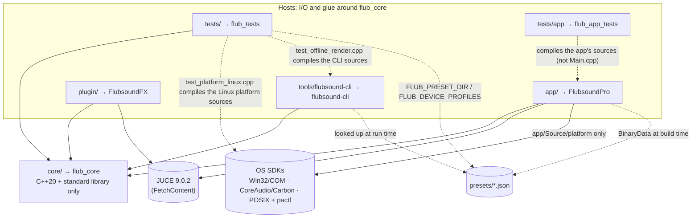

# 04 — Project / Folder Structure (Workflow 4)

> The repository is a single CMake project (`FlubsoundPro`, version 0.1.0, C++20) with one hard boundary. All processing that shapes the sound is in **`core/`**: primitives, modules, chain, mixer, meters, and preset and WAV I/O. `core/` builds the static library **`flub_core`**, which depends only on the C++ standard library. Four hosts sit around it:
> - the JUCE desktop app (`app/`),
> - the JUCE plug-in (`plugin/`),
> - the batch CLI (`tools/flubsound-cli/`),
> - the zero-dependency unit tests (`tests/`).
>
> The hosts contain only I/O and glue. There are three exceptions in the app, and none of them is part of the enhancement chain:
> - the clock-drift resampler for captured streams (`app/Source/engine/DriftCompensatedFifo`);
> - the synthetic test-signal generator;
> - the display-side analyser FFT.
>
> Everything else is data (`presets/`), OS integration designs and scripts (`platform/`), build tooling (`cmake/`, `.github/`) and documentation (`docs/`).
>
> This document describes the tree as it is in the repository. Every path, target, option and constant below was checked against the files, and the default build (core + tests + CLI) was configured, built and run while writing it.

**Contents**

1. [Top level at a glance](#1-top-level-at-a-glance)
2. [Annotated tree](#2-annotated-tree)
3. [Layering and dependency rules](#3-layering-and-dependency-rules)
4. [Build targets and CMake options](#4-build-targets-and-cmake-options)
5. [Naming and style conventions](#5-naming-and-style-conventions)
6. [Where new code goes, and adding a DSP module step by step](#6-where-new-code-goes-and-adding-a-dsp-module-step-by-step)
7. [Test layout](#7-test-layout)
8. [Platform folders](#8-platform-folders)
9. [Presets and device profiles](#9-presets-and-device-profiles)
10. [Continuous integration](#10-continuous-integration)

---

## 1. Top level at a glance

| Path | Contents | CMake target(s) | Built by default | Depends on |
|---|---|---|---|---|
| `CMakeLists.txt` | Root project: C++20, the `FLUB_*` options, `add_subdirectory` for every part | — | — | — |
| `cmake/` | Shared compiler settings (INTERFACE target) and the JUCE `FetchContent` declaration | `flub_compiler_settings` (`flub::compiler_settings`) | yes | — |
| `core/` | DSP primitives, DSP modules, analysis, engine, presets and file I/O | `flub_core` (`flub::core`), STATIC | yes | C++ standard library, `Threads::Threads` |
| `tests/` | Self-registering unit tests plus an allocation-counting `operator new` | `flub_tests` (one CTest test, `flub_tests`) | yes (`FLUB_BUILD_TESTS=ON`) | `flub_core` |
| `tests/app/` | App-level tests: the app's own sources with a fake audio device, a fake per-app router and headless views | `flub_app_tests` (one CTest test, `flub_app_tests`) | with the app (`FLUB_BUILD_APP=ON`, `FLUB_BUILD_APP_TESTS=ON`) | `flub_core`, JUCE 9.0.2, the app's sources |
| `tools/flubsound-cli/` | Batch processor, loudness analyser, parameter and preset browser | `flubsound-cli` | yes (`FLUB_BUILD_TOOLS=ON`) | `flub_core` |
| `tools/scripts/` | Generator for the embedded device-profile database; all-preset render diff; quality-target report; soak matrix | — (run by hand) | — | Python 3 (standard library) |
| `app/` | JUCE desktop app: engine host, GUI, tray, hotkeys, presets, settings, platform services | `FlubsoundPro`, `FlubsoundPresets` (BinaryData) | no (`FLUB_BUILD_APP=OFF`) | `flub_core`, JUCE 9.0.2, OS SDKs |
| `plugin/` | VST3 / AU / Standalone wrapper around one `ProcessingChain` | `FlubsoundFX` + per-format wrappers | no (`FLUB_BUILD_PLUGIN=OFF`) | `flub_core`, JUCE 9.0.2 |
| `platform/` | Virtual-device designs, a shared driver header, PipeWire scripts and configs | — (not built) | — | — |
| `presets/` | 25 factory presets and the device-profile database (JSON) | embedded by `FlubsoundPresets` / installed by `flubsound-cli` | — | — |
| `docs/` | The design deliverables and screenshots | — | — | — |
| `.github/workflows/ci.yml` | CI: core matrix, sanitizers, RTSan, app + plug-in | — | — | — |
| `.clang-format`, `.editorconfig`, `.gitignore` | Formatting and editor rules; ignores for build trees and renders | — | — | — |
| `README.md`, `CONTRIBUTING.md` | Overview and build commands; real-time contract, style and review checklist | — | — | — |

---

## 2. Annotated tree

Generated with `find . -path ./.git -prune -o -name 'build*' -prune -o -print`. Build trees (`/build*/`, `/out/`, `/cmake-build-*/`) are git-ignored and not shown. Header/source pairs in `app/`, `plugin/` and `tools/` are written as `Name.{h,cpp}`.

```
Flubsound/
├── CMakeLists.txt                          root project FlubsoundPro 0.1.0: C++20, FLUB_* options, adds core → tests → tools → (JUCE) → app → plugin
├── README.md                               product overview, build commands, option table, repository layout
├── CONTRIBUTING.md                         build & test, the real-time contract, style, adversarial review checklist, preset rules
├── .clang-format                           house style (LLVM base, Allman, 4 spaces, SpaceBeforeParens: Always, 140 columns)
├── .editorconfig                           UTF-8, LF, 4-space indent (2 for JSON/YAML), trim trailing whitespace except in *.md
├── .gitignore                              build trees, IDE folders, *.wav (except presets/**/*.wav), /renders/
├── .github/
│   └── workflows/
│       ├── ci.yml                          jobs: core (4 compilers), sanitizers (ASan+UBSan), rtsan (Clang 20), fuzz (libFuzzer, 30 s per target), app + plugin (3 OSes, flub_app_tests, headless screenshots, test installers, pluginval)
│       └── nightly.yml                     scheduled (02:23 UTC) and by hand: the four fuzzers for 1 h each from the corpus earlier nights grew (docs/11 E53)
│
├── cmake/
│   ├── FlubCompilerSettings.cmake          INTERFACE target flub_compiler_settings: warnings, -Werror, sanitizers, RTSan
│   └── FlubJuce.cmake                      FetchContent JUCE at tag FLUB_JUCE_VERSION (default 9.0.2)
│
├── core/                                   flub_core: every sample-touching line; C++20 + standard library only
│   ├── CMakeLists.txt                      STATIC library flub_core (alias flub::core); globs src/**/*.cpp and include/flub/**/*.h
│   ├── include/flub/                       public headers, included as "flub/<area>/<Name>.h"
│   │   ├── common/                         L0 containers and helpers (all header-only)
│   │   │   ├── AudioBlock.h                non-owning AudioBlock view (kMaxChannels = 8) and owning AudioBuffer
│   │   │   ├── DelayLine.h                 fixed multichannel delay: look-ahead, dry-path latency compensation
│   │   │   ├── Denormals.h                 ScopedNoDenormals: FTZ/DAZ via the SSE control register, FZ via FPCR on AArch64
│   │   │   ├── Math.h                      dB ↔ gain, smoothstep, onePoleCoeff, msToSamples, nextPowerOfTwo, FastRandom
│   │   │   ├── Realtime.h                  FLUB_NONBLOCKING: [[clang::nonblocking]] on the audio entry points in FLUB_RTSAN builds, else empty
│   │   │   ├── SmoothedValue.h             LinearSmoothedValue and OnePoleSmoother (zipper-free parameter glides)
│   │   │   └── SpscRing.h                  wait-free single-producer/single-consumer ring (analyser taps, capture streams)
│   │   ├── dsp/                            L0 filter primitives and L1 modules
│   │   │   ├── Processor.h                 the module contract: ProcessSpec, prepare / reset / process / latencySamples / name
│   │   │   ├── Svf.h                       Cytomic TPT state-variable filter (SvfCoeffs, SvfState, SvfFilter), Butterworth Q table
│   │   │   ├── Biquad.h                    double-precision transposed DF-II biquad (K-weighting, head shadow)
│   │   │   ├── Crossover.h                 LinkwitzRiley4, LinkwitzRileyAllPass, ThreeBandSplitter
│   │   │   ├── DistortionEstimator.h       least-squares THD+N of a nonlinear stage over 25 ms windows (DistortionSums, DistortionEnergy, DistortionWindow)
│   │   │   ├── ParallelDistortion.h        share of a parallel harmonic generator's added harmonics (two linear references: dry path + linear branch; bass harmonics, air exciter)
│   │   │   ├── EnvelopeFollower.h          EnvelopeFollower, GainSmoother, MeanSquareFollower
│   │   │   ├── FirDesign.h                 flub::fir: Bessel I0, Kaiser window, sinc (prepare-time design only)
│   │   │   ├── Oversampler.h               1× / 2× / 4× / 8× cascaded half-band polyphase oversampler (HalfbandStage, DecimatorStage, Oversampler; rate-aware designs with ADAA, docs/11 E10)
│   │   │   ├── TruePeakDetector.h          4× polyphase inter-sample peak detector (4 phases × 40 taps, kDelay = 20)
│   │   │   ├── Fft.h                       radix-2 complex FFT, RT-safe after prepare() (reference implementation)
│   │   │   ├── SpectralNoiseGate.h         module: STFT spectral gate / light noise reduction (latency = fftSize)
│   │   │   ├── ParametricEq.h              module: parametric EQ, kMaxBands = 16 (the chain uses 10), zero latency
│   │   │   ├── DynamicEq.h                 module: dynamic EQ, kMaxBands = 8 (4 user bands + 4 mode bands in the chain)
│   │   │   ├── BassEngine.h                module: subsonic HP, mono bass, protected adaptive shelf, harmonics, tighten
│   │   │   ├── TransientShaper.h           building block: level-independent transient shaper (used by ClarityEnhancer)
│   │   │   ├── ClarityEnhancer.h           module: transients, de-mud, dynamic presence, air exciter
│   │   │   ├── Saturator.h                 module: oversampled tape / tube / digital saturation, unity small-signal gain
│   │   │   ├── StereoSpatializer.h         module: side-only width / focus / space (mono sum preserved exactly), L/R headphone crossfeed
│   │   │   ├── HeadphoneVirtualizer.h      module: 5.1 / 7.1 → binaural (parametric renderer or HRIR convolution)
│   │   │   ├── Compressor.h                module: look-ahead, channel-linked, downward + upward compressor (Gaming: upward floor follows the background, docs/11 E19)
│   │   │   ├── BackgroundTracker.h         slow background estimate of a level (rises ≤ 5 dB/s, falls 400 ms, floored): the Compressor's relative floor, SceneEvents
│   │   │   ├── TruePeakLimiter.h           module: look-ahead true-peak brickwall limiter (also the MixEngine master)
│   │   │   ├── LoudnessMaximizer.h         module: drive → 3-band glue → oversampled soft clipper → TruePeakLimiter
│   │   │   ├── SmoothnessGuard.h       module: Smoothness, a post-enhancement de-esser against the pre-enhancement reference (docs/11 E07; slot SSmooth)
│   │   │   ├── TonalBalanceMeter.h     the chain's net presence / harsh / air lifts over its mids lift, for the governor's tonal rule (docs/11 E07)
│   │   │   ├── WeightedResidual.h      loudness-weighted, masking-limited residual of a span against its latency-aligned input (docs/11 E06 measured loop)
│   │   │   ├── LoudnessContour.h       ISO 226:2023 relative loudness contour after the preamp, four fitted sections and a headroom trim (docs/11 E32)
│   │   │   ├── ToneTilt.h                  the Warmth tilt: a body bell and a high shelf with open-loop level compensation (docs/11 E14)
│   │   │   └── DeviceCorrection.h          output-device correction (docs/11 E15, MixEngine only): ≤ 16 RBJ sections per channel, crossfaded hand-off; headroom:: max-boost predictor and automatic preamp (E11)
│   │   ├── analysis/                       L1 read-only meters
│   │   │   ├── CallbackTiming.h            lock-free per-callback duration / interval histograms, read by another thread (docs/11 E45)
│   │   │   ├── ChannelWeights.h            ITU-R BS.1770-4 channel weights for stereo / 5.1 / 7.1 (LFE excluded)
│   │   │   ├── Discontinuity.h             streaming, allocation-free discontinuity detector: clicks, dropouts, NaN / Inf runs, DC steps (docs/11 E53 soak, analyze --glitches)
│   │   │   ├── LoudnessMeter.h             BS.1770-4 / EBU R128: momentary, short-term, integrated, LRA
│   │   │   ├── LatencyProbe.h          loopback latency probe: exponential sweeps, deconvolution, SNR gate, median (docs/11 E42d)
│   │   │   ├── LoudnessFollower.h          cheap K-weighted running loudness for the control loops (default 3 s)
│   │   │   ├── PeakMeters.h                TruePeakMeter; LevelMeter (sample peak, 300 ms RMS, correlation)
│   │   │   └── SceneEvents.h               offline scene-event detector (onsets, loud events, silences, level changes; docs/11 E60), for the CLI and the scene tests
│   │   ├── engine/                         L2 engine: parameters, macros, protection, bypass, chain, mixer, telemetry
│   │   │   ├── Parameters.h                stable parameter IDs, Info table, two-bank lock-free ParameterStore (A/B)
│   │   │   ├── MacroMap.h                  Boost Intensity + 5 mode macros → effective values; "governed" entries
│   │   │   ├── Protection.h                GatedLoudness, DistortionMonitor, SafetyGovernor, AutoLevel, AutoDrive, ComparisonMatcher
│   │   │   ├── StartleGuard.h          Startle Guard: a programme-relative ceiling for loud events around the compressor slot, with E20's Tame keying (docs/11 E21)
│   │   │   ├── ModuleSlot.h                click-free, latency-compensated bypass wrapper (20 ms default crossfade)
│   │   │   ├── ProcessingChain.h           the per-strip chain: module order, latency profiles, mode and binaural policy, optional neural slot
│   │   │   ├── MixEngine.h                 up to kMaxStrips = 4 strips, latency padding, master true-peak limiter
│   │   │   ├── MeterBus.h                  audio → GUI telemetry atomics; AnalyzerTaps (pre/post SPSC rings, 1 << 15 samples)
│   │   │   └── DeviceProfiles.h            flub::device: headset profile database, connection detection, ceiling caps, advice
│   │   ├── neural/                         neural extension point (docs/09 §1.1), run by ProcessingChain's neural slot; no inference runtime, no model
│   │   │   ├── ModelRunner.h               model interface: describe() (frame size, channels, control frame), prepare / reset / run on the worker
│   │   │   ├── FrameQueue.h                wait-free SPSC queue of fixed-size float frames with a sequence header
│   │   │   ├── AsyncModelProcessor.h       Processor: runs a ModelRunner on one worker thread behind latency frameSize × (1 + safetyFrames); miss / failure fallback
│   │   │   ├── Eligibility.h               isEligible (latency profile, model latency, rate, realtime / offline)
│   │   │   └── ReferenceRunners.h          stand-in models: IdentityRunner, ConstantGainRunner, FailingRunner
│   │   └── io/                             non-real-time file formats
│   │       ├── FilePath.h                  flub::io: UTF-8 std::string ⇄ std::filesystem::path (via std::u8string), used by every core file API
│   │       ├── Json.h                      flub::json: RFC 8259 value / parser / writer, insertion-ordered objects
│   │       ├── ParametricEqText.h          flub::eqtext: AutoEQ / Equalizer APO ParametricEQ.txt parse and format for DeviceCorrection (docs/11 E15)
│   │       ├── PresetIO.h                  flub::preset: preset model, JSON (de)serialisation by string key, store glue; schema major.minor, migration registry, uuid, contentHash, fromJson warnings, saved-state recall (docs/11 E52)
│   │       └── WavFile.h                   flub::io: dependency-free WAV reader/writer, TPDF dither for integer formats
│   └── src/                                implementations, same area/name as the header
│       ├── analysis/
│       │   ├── CallbackTiming.cpp          log buckets at 1/8 octave, percentiles, windows (since)
│       │   ├── Discontinuity.cpp           4th-order-difference spike and cubic-fit jump tests, recurrence filter, dropout / NaN / DC-step runs
│       │   ├── LatencyProbe.cpp        sweep generation, regularised deconvolution, parabolic peak, locate() for a reference channel
│       │   ├── LoudnessMeter.cpp           K-weighting, 100 ms sub-blocks, two-level gating histogram
│       │   └── SceneEvents.cpp             10 ms frames, background, event runs, median level changes
│       ├── dsp/
│       │   ├── BassEngine.cpp
│       │   ├── ClarityEnhancer.cpp
│       │   ├── Compressor.cpp
│       │   ├── DeviceCorrection.cpp
│       │   ├── DynamicEq.cpp
│       │   ├── Fft.cpp
│       │   ├── HeadphoneVirtualizer.cpp
│       │   ├── LoudnessContour.cpp     iso226:: Formula (1), least-squares + Gauss-Newton fit, glide
│       │   ├── LoudnessMaximizer.cpp
│       │   ├── Oversampler.cpp             half-band stage design (uses FirDesign.h)
│       │   ├── ParametricEq.cpp
│       │   ├── Saturator.cpp
│       │   ├── SmoothnessGuard.cpp
│       │   ├── SpectralNoiseGate.cpp
│       │   ├── StereoSpatializer.cpp
│       │   ├── TonalBalanceMeter.cpp
│       │   ├── ToneTilt.cpp
│       │   ├── TransientShaper.cpp
│       │   ├── WeightedResidual.cpp
│       │   └── TruePeakLimiter.cpp
│       ├── engine/
│       │   ├── DeviceProfiles.cpp          profile matching, connection heuristics, adviceFor()
│       │   ├── DeviceProfilesData.cpp      GENERATED from presets/devices/device-profiles.json. Do not edit by hand.
│       │   ├── MacroMap.cpp                kMusicTable (25 rows), Music Warmth's two row sets and its override row, kGamingTable (23 rows)
│       │   ├── MixEngine.cpp
│       │   ├── ModuleSlot.cpp
│       │   ├── Parameters.cpp              buildLayout(): every key, name, group, unit, range, default, skew
│       │   ├── ProcessingChain.cpp         prepare() per latency profile, applyParameters(), configureModeBands(), process()
│       │   ├── StartleGuard.cpp
│       │   └── Protection.cpp
│       ├── neural/
│       │   ├── AsyncModelProcessor.cpp     frame capture, boundary bookkeeping, fallback ramps, polling worker loop
│       │   ├── Eligibility.cpp
│       │   └── ReferenceRunners.cpp
│       └── io/
│           ├── Json.cpp
│           ├── ParametricEqText.cpp
│           ├── PresetIO.cpp
│           └── WavFile.cpp
│
├── tests/                                  flub_tests: one executable, zero dependencies
│   ├── CMakeLists.txt                      globs tests/*.cpp; defines FLUB_PRESET_DIR and FLUB_DEVICE_PROFILES; adds platform/windows/driver to the include path and, except on MSVC, test_driver_shared_c.c as C89; compiles the tools/flubsound-cli sources except main.cpp
│   ├── TestFramework.h                     TEST_CASE / CHECK / REQUIRE / CHECK_NEAR / CHECK_LE / CHECK_GE, AllocationGuard
│   ├── TestMain.cpp                        runner (substring filter, exit code = failed cases), counting global operator new
│   ├── TestSignals.h                       sine / whiteNoise / rms / peakAbs / toDb / measureGainDb helpers, Planar buffer, processInBlocks
│   ├── app/                                flub_app_tests (added by app/CMakeLists.txt): the app's sources except Main.cpp, JUCE, no device or display
│   │   ├── CMakeLists.txt                  juce_add_console_app; copies FlubsoundPro's definitions, includes, link libraries and per-source warning flags / definitions
│   │   ├── AppTestMain.cpp                 runner under juce::ScopedJuceInitialiser_GUI; per-thread counting operator new / delete; Linux: counting pthread_mutex_lock / _trylock
│   │   ├── AppTestSupport.h                RealtimeProbe (allocations, frees, locks on the calling thread), pumpMessagesUntil, TempFolder
│   │   ├── test_app_realtime.cpp           AudioEngineHost's device callback with a fake AudioIODevice (48 kHz / 256): no allocation, free or lock per block
│   │   ├── test_app_export.cpp             ExportJob on real WAV / AIFF / FLAC / corrupt / .txt files: formats, loudness target, CLI parity, cancel, refusals; ExportDialog
│   │   ├── test_app_hotkeys.cpp            HotkeyManager with a fake GlobalHotkeys: action names as descriptions, per-action status, answers from another thread
│   │   ├── test_app_headset_cap.cpp        EngineController::simulateOutputDevice -> master ceiling -2 (Bluetooth) / -3 (hands-free) / -1 dBTP, measured on the output
│   │   ├── test_app_meters.cpp             SpectrumAnalyzer calibration, AnalyzerFeed, LevelMeters RMS / peak, correlation, WaveformHistory, LoudnessPanel
│   │   ├── test_app_routing.cpp            AppRouting with a fake AppAudioRouter: session -> strip mapping, endpoint moves, captures, errors, persistence
│   │   ├── test_app_overload.cpp           OverloadWatchdog hysteresis, device xruns and capture FIFO stats through EngineController to the header / Settings text
│   │   ├── test_app_overload_response.cpp  AutoLoadReducer ladder / rate limit / switch / manual reset; the opt-in profile step through EngineController to the header / Settings
│   │   ├── test_app_engine_swap.cpp        the crossfaded engine swap: profile / layout / neural-model swaps mid-stream, x100 with the realtime probe, device restarts, a removed strip's tail
│   │   ├── test_app_auto_profile.cpp       AutoProfileSwitcher; automatic profiles through EngineController with a scripted ForegroundApp; the routing panel list and add form
│   │   ├── test_app_accessibility.cpp      WCAG contrast of both palettes, the live theme switch, the UI scale setting and minimum window sizes, Settings > General
│   │   ├── test_app_device_correction.cpp  docs/11 E15: the correction per output endpoint through presets, A/B, BypassAll, auto profiles, rebuilds and restarts; off / compare / remove; Settings > Correction
│   │   ├── test_app_settings.cpp           docs/11 E52: settings .corrupt-<ts> quarantine, .bak1-3 restore and rotation, schemaVersion and the one-time preset-reference migration
│   │   ├── test_app_presets.cpp            docs/11 E52: preset ids are uuids (factory, user, copies), Save As / overwrite / rename, full-state user presets, import, warnings hook
│   │   ├── test_app_host_io.cpp            docs/11 E27 / E01 / E45: ALSA 7.1 order per-channel tone test, round-trip channel check (backend maps, channel names), a 7.1 capture folded on a stereo strip, callback timing
│   │   ├── test_app_host_realtime.cpp      docs/11 E44: the device thread recorded without allocation, RealtimeKit asked once from the message thread, the audio-thread status
│   │   ├── test_app_endpoint_volume.cppdocs/11 E32: the Linux endpoint volume through a fake pactl (per channel, mute, failures, a refused sink name)
│   │   ├── test_app_ui_preset_browser.cppdocs/11 E40 / E37: preset search and filters, preview in the active bank, Cancel bit for bit, matched flips
│   │   ├── test_app_ui_simple_view.cpp docs/11 E39 / E38: the Simple view by default and kept, layouts 800 × 560 .. 2560 × 1440, headset status, chips
│   │   ├── RoutingTestFakes.h              fake AppAudioRouter / captures shared by the E47 / E55 routing tests
│   │   ├── test_app_device_selection.cpp   docs/11 E51: endpoint identities, explicit output selection, hot-plug on another USB port, sleep / resume, exclusive-mode retries, the safe speaker profile
│   │   ├── test_app_onboard_cap.cpp        docs/11 E16: "Headset enhancement is ON" per output endpoint (applied / removed by device changes, persisted, found after a "2- " re-plug), the banner offer, Settings › Audio, the CAPPED chips
│   │   ├── test_app_diagnostics.cpp        docs/11 E54: redaction, the rotating log, engine events, crash reports (forked child), the session log, the diagnostics zip
│   │   ├── test_app_drift_asrc.cpp         docs/11 E50 Phase A: the polyphase resampler kernel, THD+N at ±200 ppm, levels through the FIFO
│   │   ├── test_app_listening_level.cpp    docs/11 E32: the contour following the system volume (fake reader), the background poll, persistence, Settings › Processing
│   │   ├── test_app_night_loopback.cpp     docs/11 E21 / E51: the Night latch reads Night Mode Gaming; allowed loopback pairs persisted and applied
│   │   ├── test_app_pipewire.cpp           docs/11 E48: the native node, registry linker and PipeWire device type against a running PipeWire (skipped without one)
│   │   ├── test_app_routing_doubling.cpp   docs/11 E47: the doubling guard (output endpoint lookup, held-back capture, the amber state)
│   │   ├── test_app_routing_journal.cpp    docs/11 E47: the route journal, crashes at both points of a move, a real SIGKILL / TerminateProcess of a child
│   │   ├── test_app_routing_tournament.cpp docs/11 E55: the process cache, Tournament mode for routing and automatic profiles
│   │   ├── test_app_tournament.cpp docs/11 E55: Tournament mode in the app (anti-cheat switch-on, no foreground poll or process open, persistence, badge, tray)
│   │   ├── test_app_ui_compare.cpp         docs/11 E37: per-bank A/B matching, module / virtualiser ears, the bypass line, the blind A/B/X test
│   │   ├── test_app_ui_guards.cpp          docs/11 E21 / E07: Dynamic Range and Smoothness in the Simple view and on the rack's cards
│   │   ├── test_app_ui_hints.cpp           docs/11 E39: a plain-language hint for every parameter key in both modes, as tooltips
│   │   ├── test_app_ui_reflow.cpp          docs/11 E39 / E38: reflow below 1100 px, the routing drawer, relevance-ordered rack, the tray flyout, the protection readouts
│   │   └── test_app_ui_status.cpp          docs/11 E51 / E52 / E42a / E48a / E06 / E11 / E38: device banner, notices, latency prompt, PipeWire quantum plan, protection strength, governor chip, active-now chips, loudness readouts
│   ├── test_primitives.cpp                 Svf, Biquad, LR4, ThreeBandSplitter, Oversampler, TruePeakDetector, Fft, SpscRing, DelayLine, OnePoleSmoother
│   ├── test_parametric_eq.cpp              ParametricEq
│   ├── test_dynamic_eq.cpp                 DynamicEq
│   ├── test_bass_engine.cpp                BassEngine
│   ├── test_transient_shaper.cpp           TransientShaper
│   ├── test_clarity.cpp                    ClarityEnhancer
│   ├── test_saturator.cpp                  Saturator
│   ├── test_spatializer.cpp                StereoSpatializer
│   ├── test_virtualizer.cpp                HeadphoneVirtualizer
│   ├── test_virtualizer_fold.cpp           Bs775Fold (LFE fold, passthrough) and ActiveChannelDetector: the 7.1 fold of docs/11 E01 / E27
│   ├── test_compressor.cpp                 Compressor
│   ├── test_limiter.cpp                    TruePeakLimiter (incl. the LF-safe envelope of docs/11 E05)
│   ├── test_device_correction.cpp          DeviceCorrection, ParametricEqText and the headroom predictor (docs/11 E15 / E11); MixEngine's correction stage
│   ├── test_maximizer.cpp                  LoudnessMaximizer
│   ├── test_transparency.cpp               top-octave transparency of the oversampled clipper and saturator
│   ├── test_noise_gate.cpp                 SpectralNoiseGate
│   ├── test_neural.cpp                     AsyncModelProcessor on its real worker thread with scripted stand-in models; eligibility rule
│   ├── test_neural_slot.cpp                ProcessingChain's neural slot: empty = unchanged, latency + L when eligible, ineligible / failing models kept out, ceiling, bypass
│   ├── test_loudness_meter.cpp             LoudnessMeter and LoudnessFollower (EBU Tech 3341 / 3342 cases)
│   ├── test_engine.cpp                     Parameters, ParameterStore, MacroMap, protection loops, ModuleSlot, ProcessingChain, MixEngine, preset round trip
│   ├── test_modes.cpp                      Gaming mode policy through the full chain: what each Gaming macro does to effective values and sound
│   ├── test_protection_gaps.cpp            SafetyGovernor clip-energy branch, ComparisonMatcher, A/B click-freedom, Music Width / Clarity macros, headset ceiling caps and air cut-off
│   ├── test_distortion.cpp                 measured THD+N: estimator vs harmonic analysis, in-stage readings, block-size independence, DistortionMonitor, SafetyGovernor on measured distortion; the bass harmonics / air exciter readings, kept out of the governor
│   ├── test_factory_presets.cpp            every presets/factory/*.json: metadata (unique uuid), keys, protection rules, render below the ceiling
│   ├── test_device_profiles.cpp            DeviceProfiles, and embedded copy == presets/devices/device-profiles.json
│   ├── test_json.cpp                       JSON parser/writer
│   ├── test_presets.cpp                    PresetIO: application state (bypass, latency profile) kept out of presets, suggestedLatencyProfile (docs/11 E40)
│   ├── test_presets_schema.cpp             PresetIO (docs/11 E52): major.minor versions, the migration registry and v1 defaults, uuid / contentHash, fromJson warnings (also as CLI notes), plug-in state recall (resolveSavedState)
│   ├── test_presets_golden.cpp             docs/11 E52: parameter defaults, factory uuids / contentHashes and (reference platform only) golden renders against tests/golden
│   ├── test_wav.cpp                        WAV reader/writer, including hostile input and UTF-8 (non-ASCII) paths
│   ├── test_offline_render.cpp             flubsound-cli: OfflineRenderer vs ProcessingChain, --target-lufs, process export formats and report, batch
│   ├── test_known_gaps.cpp                 docs/11 E59 slice: "KnownGap:" sound-quality metrics pinned at today's values (pumping, THD+N, 7.1 LFE, footstep bursts, Night Mode ambush, kick onset, 30 Hz audible band, focus ILD, 3.2 kHz lift at hands-free rates); the E19 cue enhancer's gunfire check; metric meta-validation; render.stats vs a hand computation
│   ├── test_scenes.cpp                     docs/11 E60 stage 1: seeded burst / quiet → combat / ambush programme at −14 / −24 / −40 LUFS through every gaming and night preset, nine scene metrics pinned (ratchet), metric validation, E19's Done-when; dialogue over effects, speech → music → silence and a track change; the SceneEvents detector
│   ├── test_protection_measured.cpp    docs/11 E06 Phase 3: WeightedResidual meta-validation, feed-forward, PLR meter, the measured loop, harmonics policy, block independence
│   ├── test_protection_tonal.cpp       docs/11 E07: SmoothnessGuard, TonalBalanceMeter, the governor's tonal rule and the Smoothness slot in the chain
│   ├── test_dynamics_guard.cpp         docs/11 E21 / E20: StartleGuard as a unit and in the chain, guard.range, Tame keyed to it
│   ├── test_contour.cpp                docs/11 E32: ISO 226:2023, the section fit, tracking the level in the chain, glides, off bit-exact, the limiter and the preamp
│   ├── test_latency_probe.cpp          docs/11 E42d: LatencyProbe offline (integer / fractional delays, filters, SNR gate, reference channel, the chain's latency), the CLI
│   ├── test_warmth.cpp                     docs/11 E14: the Warmth tilt, its MacroMap rows and Tube override, v1 tape grit, THD+N / H2 > H3, pink transfer, loudness, the preamp's model, click-free sweeps
│   ├── test_preamp_hot.cpp                 docs/11 E11: auto.preampHot (layout, bit-identity with room, a -0.3 dBFS sine, hold and release)
│   ├── test_protection_readouts.cpp        docs/11 E06 / E07: the governor's learned state across reset() and the engine swap, MeterBus readouts, render.stats / quality
│   ├── golden/preset-render-baseline.json  baseline of tools/scripts/preset-render-diff.py (25 presets x 5 programmes, not read by flub_tests)
│   ├── golden/parameter-defaults.json      every parameter default (test_presets_golden.cpp: a changed default needs a schema major and a migration)
│   ├── golden/factory-presets.json         per factory preset: uuid, contentHash and the golden render (integrated LUFS, 1/3-octave bands)
│   ├── test_drift_fifo.cpp                 #includes app/Source/engine/DriftCompensatedFifo.cpp: clock drift, stalls, downmix, continuity
│   ├── test_driver_shared.cpp              platform/windows/driver/FlubVirtualAudioShared.h: constants, IOCTL codes, ring index maths, Generation lock, C vs C++ layout
│   ├── test_driver_shared_c.c              the same header compiled as strict C89 (GCC / Clang only); layout table for test_driver_shared.cpp
│   ├── test_callback_timing.cpp            CallbackTiming (docs/11 E45): bucket tiling, percentiles, a 3x spike every 500 ms, late intervals, windows, a concurrent reader
│   ├── test_parameters_headroom.cpp        docs/11 E11 / E05 / E19: layout version 3 parameters, the chain's static-boost model and automatic preamp, named maximizer styles
│   ├── test_signal_hygiene.cpp             docs/11 E10: the rate-aware saturator table, alias rows, residual-path DC blockers, the capture FIFO's sanitiser
│   ├── test_soak.cpp                       docs/11 E53: DiscontinuityDetector on clean and damaged programme, the 10 s chain soak under automation, injected faults
│   ├── test_cli_analyze.cpp                flubsound-cli analyze --events / --bands / --glitches (docs/11 E60 / E53)
│   ├── test_cli_quality.cpp                tests/quality_targets.json and the KNOWN_GAP ratchet of `flubsound-cli quality` (docs/11 E59), hygiene metrics' meta-validation
│   ├── test_cli_demo.cpp                   flubsound-cli demo: every pair written, matched within 0.5 LU unless a level feature, index band deltas = analyze, deterministic across worker counts, --input
│   ├── test_cli_stats.cpp                  --protection off|normal|strict and render.stats' governor state / reasons (docs/11 E06)
│   ├── quality_targets.json                named `quality` settings and metric rows with targets, per-profile / per-rate rows, recorded KNOWN_GAP values per compiler (docs/11 E59)
│   ├── test_rtsan.cpp                      FLUB_RTSAN builds only: nonblocking annotations present, RTSan self-test
│   ├── fuzz/                           libFuzzer targets (FLUB_BUILD_FUZZERS, Clang): fuzz_json, fuzz_preset, fuzz_state, fuzz_eqtext, seed corpus, run-fuzzers.sh (docs/11 E53)
│   └── test_platform_linux.cpp             Linux only: #includes app/Source/platform/PlatformServices_{common,linux}.cpp (incl. the XDG autostart entry, Wayland hotkeys against a mock GlobalShortcuts portal and RealtimeKit against a mock rtkit on a private dbus-daemon, ALSA channel maps)
│
├── tools/
│   ├── flubsound-cli/                      flubsound-cli: JUCE-free, links flub::core only
│   │   ├── CMakeLists.txt                  explicit source list, FLUB_CLI_VERSION, FLUB_SOURCE_PRESET_DIR, install rules
│   │   ├── main.cpp                        command-line parsing, help text and dispatch; exit codes 0 / 1 / 2
│   │   ├── Commands.{h,cpp}                process / batch / analyze / quality / params / presets: render-and-write glue, batch folder walk, worker pool, per-file reports
│   │   ├── Demo.{h,cpp}                    demo: the by-ear pack, loudness-matched before / after WAV pairs per macro, Boost step and module switch on built-in music / speech / game (and 7.1) programmes or --input, and index.txt (settings, band deltas as analyze reads them, readouts, what to listen for)
│   │   ├── Soak.{h,cpp}                    soak: the chain on a seeded streaming programme under parameter automation, watched by the discontinuity detector (docs/11 E53)
│   │   ├── CliOptions.{h,cpp}              strict option parsing; precedence defaults → --preset → --mode → --boost/... → --set
│   │   ├── FactoryPresets.{h,cpp}          run-time preset folder lookup (--dir, $FLUBSOUND_PRESET_DIR, exe-relative, source tree)
│   │   ├── OfflineRenderer.{h,cpp}         sample-aligned offline render through ProcessingChain, loudness-target iterations, writeRender; also compiled into the app (export/)
│   │   ├── LatencyProbeCommand.{h,cpp} latency-probe generate / analyze: the loopback probe on files (docs/11 E42d)
│   │   ├── Analysis.{h,cpp}                whole-file LUFS / LRA / true peak / sample peak / RMS with the core meters; octave bands (--bands), band tracks and events (--events), glitches, alias / DC / ultrasonic hygiene metrics
│   │   └── Utf8Windows.h                   Windows: UTF-8 argv (CommandLineToArgvW), environment (GetEnvironmentVariableW) and console output; pass-through elsewhere
│   └── scripts/
│       ├── embed-device-profiles.py        regenerates core/src/engine/DeviceProfilesData.cpp from the JSON (≤ 16000 bytes); --check only verifies
│       ├── preset-render-diff.py           renders every factory preset on pinned programmes with flubsound-cli and diffs the results against tests/golden (docs/11 E59)
│       ├── quality-report.py               runs every tests/quality_targets.json row through `flubsound-cli quality`: met / known gap / REGRESSED; --update-recorded (docs/11 E59)
│       ├── soak.py                         the soak matrix (user rows, Low Latency, 44.1 kHz, parameter fuzz) for N minutes each through `flubsound-cli soak` (docs/11 E53)
│       ├── package-desktop.sh              the CI test package per OS: folder + Inno Setup installer (Windows), .zip + .dmg (macOS), .tar.gz with install.sh (Linux)
│       └── TESTING.txt                     the tester's notes shipped in every test package
│
├── app/                                    FlubsoundPro: the JUCE desktop application
│   ├── CMakeLists.txt                      juce_add_gui_app, explicit FLUB_APP_SOURCES, platform detection, BinaryData presets, JUCE flags; adds tests/app (FLUB_BUILD_APP_TESTS)
│   └── Source/                             include root of the app ("engine/EngineController.h", ...)
│       ├── Main.cpp                        START_JUCE_APPLICATION (flub::app::FlubsoundApplication)
│       ├── FlubsoundApplication.{h,cpp}    JUCEApplication: start-up order, command line, headless --screenshot mode, lifetime, the diagnostics session
│       ├── diagnostics/                    docs/11 E54: no audio-thread code
│       │   ├── DiagnosticLog.{h,cpp}       rotating, redacted log file in <user data>/Logs (512 KB × 3)
│       │   ├── DiagnosticsMonitor.{h,cpp}  2 Hz message-thread reader of the engine's counters and device events into the log
│       │   ├── CrashHandler.{h,cpp}        crash reports: POSIX signals on an alternate stack (async-signal-safe), Windows exception filter + minidump
│       │   ├── DiagnosticsBundle.{h,cpp}   Settings › Diagnostics: the diagnostics zip (system details, settings, route journal, logs, crash reports)
│       │   └── DiagnosticsSession.{h,cpp}  wires the log, the crash handler and the monitor into the app's lifetime
│       ├── engine/                         L3 host and L4 services (message thread + audio callback)
│       │   ├── AudioEngineHost.{h,cpp}     juce::AudioDeviceManager, device callback, MixEngine owner, capture FIFO slots
│       │   ├── DriftCompensatedFifo.{h,cpp} capture-clock → device-clock bridge: SPSC ring, 48-tap polyphase Kaiser-sinc resampler (docs/11 E50), PI loop
│       │   ├── EngineController.{h,cpp}    the façade the UI talks to: strips, parameters, presets, device, routing, advice
│       │   ├── AppRouting.{h,cpp}          executable → strip map; endpoint routing or per-process capture (a second constructor injects the router); the doubling guard, route journal and Tournament mode (docs/11 E47 / E55)
│       │   ├── OverloadWatchdog.h          CPU-overload decision logic (load + glitch counter per 2 Hz poll, hysteresis)
│       │   ├── AutoLoadReducer.h           opt-in overload response: latency-profile step-down ladder (rate limited, never back up)
│       │   └── TestSignalGenerator.{h,cpp} deterministic synthetic music / 7.1 game scene (screenshots, demos)
│       ├── export/                         Export / batch process (docs/06-gui.md §6.12)
│       │   ├── ExportJob.{h,cpp}           worker-thread job: JUCE decoding, the CLI's OfflineRenderer, WAV (core writer) / FLAC (JUCE) output, per-file results
│       │   └── ExportDialog.{h,cpp}        the dialog: inputs (drop, files, folder), output folder / format, strip snapshot or preset, loudness target / ceiling, results table
│       ├── presets/
│       │   └── PresetManager.{h,cpp}       factory presets from BinaryData, user presets (*.flubpreset.json), uuid ids, strip glue
│       ├── settings/
│       │   └── AppSettings.{h,cpp}         juce::PropertiesFile: device state, per-strip A/B state, hotkeys, routing map, window; schemaVersion, .bak1-3, .corrupt-<ts>
│       ├── platform/                       OS integration. Plain C++ interfaces, no JUCE types.
│       │   ├── PlatformServices.h          the fixed interface: GlobalHotkeys, AppAudioRouter, ProcessLoopbackCapture, AudioEndpoints, SystemTuning
│       │   ├── PlatformServicesInternal.h  shared private helpers (chord validation, F-key and navigation-key encoding)
│       │   ├── PlatformServices_common.cpp KeyChord formatting / validation, "unsupported" fallbacks for other OSes
│       │   ├── PlatformServices_win.cpp    Windows: Win32/COM only (hotkeys, sessions, process loopback, MMCSS, EcoQoS)
│       │   ├── PlatformServices_mac.mm     macOS: Carbon hotkeys, transport type, time-constraint thread policy
│       │   ├── PlatformServices_linux.cpp  Linux: X11 hotkeys (XGrabKey, libX11 via dlopen), Wayland hotkeys (GlobalShortcuts portal, libdbus-1 via dlopen), pactl-based routing to the null sinks, SCHED_FIFO tuning and RealtimeKit (libdbus-1 via dlopen), ALSA capture channel maps (libasound via dlopen)
│       │   ├── PlatformServices.cmake      link libraries, FLUB_ENABLE_UNDOCUMENTED_ROUTING, optional libpipewire-0.3 (FLUB_WITH_PIPEWIRE), warning flags for the files above
│       │   ├── pipewire/                   docs/11 E48, Linux: PipeWireGraph.h (registry mirror and link plans, header-only), PipeWireCycle.h (the node's RT cycle), PipeWireNative.{h,cpp} (session, links, the native node; built with libpipewire only), PipeWireDeviceType.{h,cpp} (a JUCE device type on the node)
│       │   └── PlatformBridge.{h,cpp}      the only access point for the rest of the app; nullptr / no-op without services
│       ├── shell/                          top-level windows and OS-facing shell
│       │   ├── MainWindow.{h,cpp}          resizable DocumentWindow (minimum 800 × 560; the main component reflows below 1100 × 700) hosting ui::MainComponent
│       │   ├── TrayIcon.{h,cpp}            tray / menu-bar icon, quick menu and the quick-controls flyout
│       │   ├── HotkeyManager.{h,cpp}       registers the system-wide shortcuts through PlatformBridge; per-action registration status
│       │   └── ScreenshotDriver.{h,cpp}    headless render: synthetic audio, 60 Hz pacing, PNG snapshot, exit codes 0 / 1 / 2
│       └── ui/                             L5 GUI (message thread only)
│           ├── MainComponent.{h,cpp}       layout (800 × 560 → 2560 × 1440, reflowing below 1100 × 700) and the per-frame update loop
│           ├── Theme.{h,cpp}               design tokens: palette, mode accent, fonts, panel helpers, number formatting
│           ├── FlubLookAndFeel.{h,cpp}     LookAndFeel_V4 subclass: knobs, buttons, combos, menus, meters
│           ├── Widgets.{h,cpp}             vector icons, icon buttons, style helpers
│           ├── ParamKnob.{h,cpp}           labelled rotary knob
│           ├── ParameterBinding.{h,cpp}    ParamFormat (value ↔ text per Unit) and ParameterBinder (30 Hz version polling)
│           ├── ParamGrid.{h,cpp}           auto-generated editor for a layout group (banded rows for eq.* / dyneq.*)
│           ├── HeaderBar.{h,cpp}           logo, mode, strip, preset browser, A/B, bypass, latency / CPU, settings
│           ├── DeviceAdviceBanner.{h,cpp}  headset / Bluetooth advice strip under the header
│           ├── NoticeBanners.{h,cpp}       device error banner (Retry / Choose output / Sound settings) and notice bar (preset warnings, settings recovery, latency prompt)
│           ├── BoostPanel.{h,cpp}          Boost Intensity dial (with governor arc), governor chip (state, reason, strength), the five mode macros, active-now chips
│           ├── AnalyzerFeed.{h,cpp}        the single consumer of a chain's AnalyzerTaps; fans out to the views
│           ├── AnalyzerPanel.{h,cpp}       SpectrumAnalyzer with EqCurveEditor stacked on top
│           ├── SpectrumAnalyzer.{h,cpp}    pre/post spectrum: 4096-point Hann FFT (juce::dsp::FFT), 75 % overlap
│           ├── EqCurveEditor.{h,cpp}       interactive 10-band EQ curve drawn from ParametricEq::responseDb
│           ├── WaveformHistory.{h,cpp}     scrolling min/max output history with a short-term LUFS trace
│           ├── LevelMeters.{h,cpp}         input / output peak + RMS bars, peak hold, clip latch, true-peak readout
│           ├── LoudnessPanel.{h,cpp}       LUFS M / S / I, LRA, gain-reduction meters, correlation, width
│           ├── MeterSnapshot.{h,cpp}       one frame of MeterBus values, read once per frame
│           ├── ModuleRack.{h,cpp}          horizontally scrolling rack of ModuleCards, focused (expanded) view
│           ├── ModuleCard.{h,cpp}          one module card; ModuleDescriptor::all() is the table of the ten modules
│           ├── PresetBrowser.{h,cpp}   the preset browser popover: search, scope / mode / category / tag filters, favourites, recents, description pane (docs/11 E40)
│           ├── PresetAudition.{h,cpp}  preview in the active bank and the loudness estimates that match it (docs/11 E40 / E37)
│           ├── Comparison.{h,cpp}          loudness-matched comparisons: per-bank A/B, module ears, the blind A/B/X test (docs/11 E37)
│           ├── AbxPanel.{h,cpp}            the blind A/B/X panel over the window (docs/11 E37)
│           ├── ParamHints.{h,cpp}          one plain-language hint per parameter key and mode (docs/11 E39)
│           ├── QuickControls.{h,cpp}       the tray flyout: Boost, preset stepper, Bypass, open the window (docs/11 E39)
│           ├── SimpleStatusPanel.{h,cpp}the Simple view's headset status and loudness meter in plain words (docs/11 E39)
│           ├── RoutingPanel.{h,cpp}        strips, gains, mutes, per-app assignment
│           └── SettingsDialog.{h,cpp}      Audio / Correction / Processing / Hotkeys / General / Diagnostics pages
│
├── plugin/                                 FlubsoundFX: VST3 + Standalone (+ AU on macOS)
│   ├── CMakeLists.txt                      juce_add_plugin (manufacturer code Flub, plug-in code FlFx), explicit sources
│   └── Source/
│       ├── PluginProcessor.{h,cpp}         one ProcessingChain + ParameterStore; APVTS built from param::layout(); state recall gives absent parameters their default
│       └── PluginEditor.{h,cpp}            GenericAudioProcessorEditor + preset import/export + telemetry line
│
├── installer/                              unsigned test installers built by tools/scripts/package-desktop.sh in the CI app job (docs/11 E54)
│   ├── windows/FlubsoundPro.iss            Inno Setup 6: the app, the VST3 into Common Files\VST3, Start menu, uninstaller
│   ├── macos/make-dmg.sh                   hdiutil disk image with an Applications link (retried on "Resource busy")
│   └── linux/                              flubsound-pro.desktop and install.sh (per-user install / --uninstall), shipped in the .tar.gz
│
├── platform/                               OS integration designs, scripts and configs (nothing here is compiled)
│   ├── windows/
│   │   └── driver/
│   │       ├── README.md                   "Flubsound Virtual Audio" WaveRT driver design (status: design, not implemented)
│   │       └── FlubVirtualAudioShared.h    C contract between driver and engine: control block, IOCTLs, endpoint ids
│   ├── macos/
│   │   └── README.md                       Core Audio process taps (14.2+) and Audio Server Plug-in design
│   └── linux/
│       ├── README.md                       PipeWire / PulseAudio null-sink model and routing
│       ├── flubsound-pipewire-setup.sh     create / remove / status of the four flubsound_* null sinks via pactl
│       └── pipewire/
│           ├── pipewire.conf.d/
│           │   └── 90-flubsound-sinks.conf           persistent null sinks created by the PipeWire daemon
│           └── pipewire-pulse.conf.d/
│               └── 90-flubsound-app-routing.conf     example per-application target.object rules
│
├── presets/
│   ├── README.md                           every factory preset, the rules they follow, the file format
│   ├── factory/                            25 presets, <category>-<slug>.json
│   │   ├── music-*.json                    12 Music presets
│   │   ├── gaming-*.json                   9 Gaming presets
│   │   └── device-*.json                   3 Device presets
│   └── devices/
│       └── device-profiles.json            headset / output-device profiles (8 profiles; source of truth for the embedded copy)
│
└── docs/
    ├── 00-understanding-and-plan.md        scope, requirement IDs, interpretation decisions, delivery plan
    ├── 01-architecture.md                  architecture, threads, data flow, latency budget
    ├── 02-tech-stack.md                    stack decisions and licensing
    ├── 03-dsp-design.md                    DSP design, module by module: maths, parameters, latency, CPU, tests
    ├── 04-project-structure.md             this document
    ├── 05-code-skeletons.md                guided tour of the real core code
    ├── 06-gui.md                           GUI structure and components, screenshots
    ├── 07-roadmap.md                       MVP → Advanced → Polish roadmap
    ├── 08-pitfalls-and-solutions.md        pitfalls and concrete solutions
    ├── 09-future-roadmap.md                post-1.0 expansion
    ├── 10-headset-compatibility.md         headset / Turtle Beach compatibility
    ├── TRACEABILITY.md                     requirement traceability matrix: design, code, tests and status per requirement ID
    └── images/                             screenshots rendered by the app's headless --screenshot mode (used by docs/06)
        ├── app-music.png                   Music mode, 1440 × 900
        ├── app-gaming.png                  Gaming mode, 1440 × 900
        ├── app-gaming-headset-advice.png   Gaming mode with a recognised headset (advice banner), 1440 × 900; also used by docs/10
        └── app-bluetooth-handsfree-1100x700.png  Music mode, headset in Bluetooth hands-free (−3 dBTP ceiling advice), minimum window size 1100 × 700
```

`README.md` and `docs/00-understanding-and-plan.md` link `docs/TRACEABILITY.md`, the requirement traceability matrix. The DSP design is [`docs/03-dsp-design.md`](03-dsp-design.md); the GUI is [`docs/06-gui.md`](06-gui.md).

**Header-only core components.** These have no `.cpp`:
- all of `common/`;
- `io/FilePath.h`;
- `dsp/Processor.h`, `Svf.h`, `Biquad.h`, `Crossover.h`, `EnvelopeFollower.h`, `FirDesign.h`, `TruePeakDetector.h`, `BackgroundTracker.h`;
- `analysis/ChannelWeights.h`, `LoudnessFollower.h`, `PeakMeters.h`;
- `engine/MeterBus.h`.

---

## 3. Layering and dependency rules

### 3.1 Between the parts of the repository



| Code in | May include / link | Must not include |
|---|---|---|
| `core/` | The C++ standard library. `<xmmintrin.h>` in `common/Denormals.h`, x86 only (a CPU intrinsic header, not an OS header). `<fstream>` / `<filesystem>` only in non-real-time code (`io/FilePath.h`, `io/WavFile.cpp`, `io/PresetIO.cpp`, `engine/DeviceProfiles.cpp`); every path those files open is a UTF-8 `std::string` converted by `io/FilePath.h`, so non-ASCII paths work with MSVC too (test *WavFile: UTF-8 paths with non-ASCII characters round trip on every platform*). | JUCE, any OS header, any third-party library, anything from `app/`, `plugin/`, `tools/`, `tests/` |
| `tests/` | `core/include/flub/**`, `TestFramework.h`, `TestSignals.h`. **Exceptions:** `test_platform_linux.cpp` `#include`s `app/Source/platform/PlatformServices_common.cpp` and `PlatformServices_linux.cpp`, guarded by `#if defined(__linux__)`, to test functions in an unnamed namespace; `test_drift_fifo.cpp` `#include`s `app/Source/engine/DriftCompensatedFifo.cpp` (JUCE-free, core headers only) on every OS; `test_rtsan.cpp` uses POSIX `fork()` / `waitpid()`, only in `FLUB_RTSAN` builds on Linux and macOS, and includes `app/Source/platform/PlatformServices.h` (plain C++) for one type check; `test_driver_shared.cpp` and `test_driver_shared_c.c` include `platform/windows/driver/FlubVirtualAudioShared.h` (plain C, no Windows headers outside kernel mode) on every OS; `test_offline_render.cpp` includes the `tools/flubsound-cli` headers, and `tests/CMakeLists.txt` compiles that folder's sources except `main.cpp` into `flub_tests` on every OS (independent of `FLUB_BUILD_TOOLS`). | JUCE |
| `tests/app/` | Everything `app/Source/` may use, the app's own headers, `TestFramework.h`. Fakes stand in for the audio device (`juce::AudioIODevice`), the per-app router (`platform::AppAudioRouter`, through `AppRouting`'s injecting constructor) and captures (`AudioEngineHost::setCaptureFactory`). `AppTestMain.cpp` interposes `pthread_mutex_lock` / `_trylock` on Linux / glibc only (`dlsym (RTLD_NEXT)`). | `plugin/`, `tools/`; opening a real audio device or a window |
| `tools/flubsound-cli/` | `flub::core`, its own files, `std::thread` (`batch --jobs N`). `<windows.h>` / `<mach-o/dyld.h>` in `FactoryPresets.cpp`, only to find the executable's own path; `<windows.h>` / `<shellapi.h>` in `Utf8Windows.h`, only for UTF-8 argv, environment and console on Windows. | JUCE, `app/`, `plugin/` |
| `plugin/Source/` | `flub::core`; `juce_audio_utils`, `juce_audio_processors`, `juce_gui_basics` | `app/` (the shared custom editor is roadmap item 2.9) |
| `app/Source/` | `flub::core`; `juce_audio_utils`, `juce_audio_devices`, `juce_dsp`, `juce_gui_extra`; OS SDKs in `platform/` only | `plugin/`, `tools/` |

**Why core is framework-free.** The same `ProcessingChain` then runs, sample for sample, in the app, the plug-in, the CLI and the tests. It could later also be hosted by a Windows APO or a PipeWire filter node, which are roadmap items (see `09-future-roadmap.md`).

**How the boundary is enforced.**
- **Link level.** `flub_core` links only `flub::compiler_settings` (PRIVATE) and `Threads::Threads` (PUBLIC; the core itself creates no threads, the CLI does). JUCE targets exist only after `cmake/FlubJuce.cmake` is included, which happens only with `FLUB_BUILD_APP` or `FLUB_BUILD_PLUGIN`, and after `core/` has been added.
- **Include level.** The CI `core` job never fetches JUCE, so a JUCE include in `core/` fails all four core builds. An OS-specific header in `core/` (for example `<windows.h>`) fails on at least one of the three CI platforms; a POSIX header shared by Linux and macOS would only fail on Windows. There is no automated include check beyond this, so review remains part of the enforcement.
- **Review.** `CONTRIBUTING.md`, "The real-time contract".

### 3.2 Inside `flub_core`

The `include/flub/` sub-folders form a strict hierarchy. The `#include` graph was checked while writing this document: there are no upward edges and no file-level cycles.

```
 level  folder / file                     may include (besides the standard library)
 ─────  ────────────────────────────────  ───────────────────────────────────────────────────────────
   0    common/*                          common/AudioBlock.h (DelayLine.h does)
   0    io/FilePath.h, io/Json.h,         nothing from flub/ (WavFile.cpp: common/AudioBlock.h, io/FilePath.h)
        io/WavFile.h
   1    dsp/*                             common/*, dsp/*
   2    analysis/*                        common/*, dsp/Biquad.h, dsp/EnvelopeFollower.h, dsp/TruePeakDetector.h, dsp/BackgroundTracker.h, analysis/*
   3    engine/*                          common/*, dsp/*, analysis/*, engine/*,
                                          io/Json.h (engine/DeviceProfiles.h only; DeviceProfiles.cpp also io/FilePath.h),
                                          neural/* (engine/ProcessingChain.h only: the neural slot)
   3    neural/*                          common/*, dsp/Processor.h, neural/*, engine/Parameters.h (neural/Eligibility.h only)
   4    io/PresetIO.h                     engine/Parameters.h, io/Json.h (PresetIO.cpp also io/FilePath.h)
   2    io/ParametricEqText.h             dsp/DeviceCorrection.h (ParametricEqText.cpp also io/Json.h)
```

Rules that follow from this:

- **DSP modules (`dsp/`) know nothing about parameters, macros, meters or presets.** They expose a plain `<Name>Params` struct and `setParams()`; the two EQs take one struct per band instead (`ParametricEq::setBand (int, const EqBandParams&)`, `DynamicEq::setBand (int, const DynEqBandParams&)`). The only place where parameter IDs meet modules is `ProcessingChain::applyParameters()`.
- **Analysis never modifies audio.** Meters take the block and only read it.
- **`io/` is split by level.** `FilePath`, `Json` and `WavFile` sit at the bottom. `PresetIO` sits above `engine/Parameters.h` because presets are keyed by `param::Info::key`; `ParametricEqText` sits above `dsp/DeviceCorrection.h`, whose curve it reads and writes.
- **Real-time and non-real-time code share headers but not entry points.** `Processor::prepare()` (`AsyncModelProcessor::prepare()` also starts its worker thread), `ProcessingChain::prepare()`, `MixEngine::configure()`, everything in `io/` and `DeviceProfiles` may allocate. Everything reachable from `process()`, `reset()` or a setter may not (see `core/include/flub/dsp/Processor.h` and `CONTRIBUTING.md`).
- **Only three channels cross threads:** `param::ParameterStore` atomics, `MeterBus` atomics and `SpscRing`s (`AnalyzerTaps`, capture FIFOs). See `01-architecture.md` §3.

### 3.3 Inside the app

```
 Main.cpp / FlubsoundApplication  ──►  shell/  ──►  ui/  ──►  engine/EngineController  ──►  engine/AudioEngineHost ──► flub::MixEngine
                                          │           │              │                               │
                                          │           │              ├──► presets/PresetManager ─────┴──► flub::preset, flub::param
                                          │           │              ├──► settings/AppSettings ──► platform/PlatformServices.h (KeyChord)
                                          └───────────┴──────────────┴──► platform/PlatformBridge ──► PlatformServices_<os> ──► OS SDKs
```

| Folder | Includes | Never includes |
|---|---|---|
| `platform/` | `PlatformServices.h`, `PlatformServicesInternal.h`, OS SDK headers, `flub/io/Json.h` (Linux implementation only) | JUCE, any other app folder |
| `settings/` | `juce_data_structures`, `platform/PlatformServices.h` (for `KeyChord`) | `engine/`, `ui/`, `shell/` |
| `presets/` | `juce_core`, `<FlubsoundPresetData.h>` (generated), `flub/io/*`, `flub/engine/Parameters.h`, `flub/engine/MixEngine.h` | `ui/`, `shell/` |
| `engine/` | `juce_audio_devices`, `juce_events`, core headers, `presets/`, `settings/`, `platform/` | `ui/`, `shell/` |
| `ui/` | `juce_gui_basics` (and `juce_dsp`, `juce_audio_utils` where needed), `engine/EngineController.h`, `export/ExportDialog.h` (`MainComponent` opens it), read-only core headers (`Parameters.h`, `ProcessingChain.h`, `MeterBus.h`, `ParametricEq.h` for `responseDb`) | `shell/`, `AudioEngineHost` internals |
| `shell/` | `ui/`, `engine/`, `platform/PlatformBridge.h`, `platform/PlatformServices.h` (types only, `HotkeyManager.h`) | — |
| `export/` | `juce_audio_formats`, `juce_gui_basics`, `engine/EngineController.h`, `presets/PresetManager.h`, `ui/` theme and widgets, `tools/flubsound-cli/OfflineRenderer.h` and `Analysis.h`, core headers | `shell/`, `AudioEngineHost` internals |

- **`EngineController` is the façade.** It is the one object the UI talks to (`engine/EngineController.h`). There are two small exceptions:
  - `ui/RoutingPanel.cpp` calls `platform_bridge::servicesCompiledIn()` to explain why routing is unavailable;
  - `ui/SettingsDialog.cpp` includes `presets/PresetManager.h` to show the user preset folder, obtained via `controller.getPresetManager()`.
- **All OS access goes through `PlatformBridge`.** Every app file outside `platform/` calls `platform/PlatformBridge.h` rather than the `flub::platform` factories. Without an OS implementation (`FLUB_HAS_PLATFORM_SERVICES=0`) the bridge returns `nullptr` and no-ops, and callers treat that like `isSupported() == false`.
- **The platform sources are JUCE-free by design.** That is what lets `tests/test_platform_linux.cpp` compile the Linux implementation into `flub_tests`.

---

## 4. Build targets and CMake options

### 4.1 Targets

| Target | Kind | Defined in | Sources | Links | Output (single-config Ninja, `-B build`) | Built when |
|---|---|---|---|---|---|---|
| `flub_compiler_settings` (alias `flub::compiler_settings`) | INTERFACE library | `cmake/FlubCompilerSettings.cmake` | — | — | — | always |
| `flub_core` (alias `flub::core`) | STATIC library, PIC | `core/CMakeLists.txt` | `file(GLOB_RECURSE … CONFIGURE_DEPENDS)` over `src/*.cpp` and `include/flub/*.h` | PRIVATE `flub::compiler_settings`; PUBLIC `Threads::Threads`; PUBLIC include dir `core/include`; `cxx_std_20` | `build/core/libflub_core.a` (`flub_core.lib` on MSVC) | always |
| `flub_tests` | executable + CTest test `flub_tests` | `tests/CMakeLists.txt` | `file(GLOB … CONFIGURE_DEPENDS "*.cpp")`, plus `test_driver_shared_c.c` compiled with `-std=c89` except on MSVC, and the `tools/flubsound-cli` sources except `main.cpp` | `flub::core`, `flub::compiler_settings`; `shell32` on Windows | `build/tests/flub_tests` | `FLUB_BUILD_TESTS=ON` |
| `flubsound-cli` | executable (+ `install`) | `tools/flubsound-cli/CMakeLists.txt` | explicit `FLUB_CLI_SOURCES` | `flub::core`, `flub::compiler_settings`, `Threads::Threads`; `shell32` on Windows (`CommandLineToArgvW`) | `build/tools/flubsound-cli/flubsound-cli` | `FLUB_BUILD_TOOLS=ON` |
| `FlubsoundPro` | `juce_add_gui_app` (product "Flubsound Pro", bundle id `com.flubsound.pro`) | `app/CMakeLists.txt` | explicit `FLUB_APP_SOURCES` + the detected platform sources | `flub::core`, `FlubsoundPresets`, `juce_audio_utils`, `juce_audio_devices`, `juce_dsp`, `juce_gui_extra`, `juce_recommended_config_flags`; OS libraries (§8) | `build/app/FlubsoundPro_artefacts/<config>/Flubsound Pro` | `FLUB_BUILD_APP=ON` |
| `flub_app_tests` | `juce_add_console_app` + CTest test `flub_app_tests` | `tests/app/CMakeLists.txt`, added at the end of `app/CMakeLists.txt` | `file(GLOB … CONFIGURE_DEPENDS "*.cpp")` in `tests/app/`, plus `FLUB_APP_SOURCES` except `Main.cpp` and the detected platform sources | whatever `FlubsoundPro` links (copied from its `LINK_LIBRARIES`, so the platform libraries of `PlatformServices.cmake` too), `${CMAKE_DL_LIBS}`; `FlubsoundPro`'s compile definitions and include directories plus `JUCE_MODAL_LOOPS_PERMITTED=1` | `build/tests/app/flub_app_tests_artefacts/<config>/flub_app_tests` | `FLUB_BUILD_APP=ON` **and** `FLUB_BUILD_APP_TESTS=ON` |
| `FlubsoundPresets` | `juce_add_binary_data` (namespace `FlubsoundPresetData`, header `FlubsoundPresetData.h`) | `app/CMakeLists.txt` | sorted `${FLUB_FACTORY_PRESET_DIR}/*.json` | — | `build/app/libFlubsoundPresets.a` | `FLUB_BUILD_APP=ON` **and** at least one preset found |
| `FlubsoundFX` (shared code) + `FlubsoundFX_VST3`, `FlubsoundFX_Standalone`, `FlubsoundFX_AU` (macOS), `FlubsoundFX_All` | `juce_add_plugin` (manufacturer `Flub`, code `FlFx`, bundle id `com.flubsound.fx`) | `plugin/CMakeLists.txt` | explicit `FLUB_PLUGIN_SOURCES` + headers | `flub::core`, `juce_audio_utils`, `juce_audio_processors`, `juce_gui_basics`, `juce_recommended_config_flags` | `build/plugin/FlubsoundFX_artefacts/<config>/{VST3,Standalone,AU}` | `FLUB_BUILD_PLUGIN=ON` |

Notes:
- **JUCE** is fetched by `FetchContent` into `build/_deps/` (tag `FLUB_JUCE_VERSION`, shallow clone). The standard override `-DFETCHCONTENT_SOURCE_DIR_JUCE=/path/to/JUCE` builds offline against a local checkout.
- **No install rules for the app or plug-in.** Only `flubsound-cli` has them:
  - `bin/flubsound-cli`;
  - `share/flubsound/presets/factory/*.json`.
  Packaging is roadmap work (`07-roadmap.md` items 1.7, 3.3, 3.4). The plug-in is built with `COPY_PLUGIN_AFTER_BUILD FALSE`.
- **Build type.** `CMAKE_BUILD_TYPE` defaults to `Release` for single-config generators. `CMAKE_EXPORT_COMPILE_COMMANDS` is `ON`.

### 4.2 Options and cache variables

| Option / variable | Default | Defined in | Affects | Effect |
|---|---|---|---|---|
| `FLUB_BUILD_TESTS` | `ON` | root | — | `enable_testing()` + `tests/` |
| `FLUB_BUILD_TOOLS` | `ON` | root | — | `tools/flubsound-cli/` |
| `FLUB_BUILD_APP` | `OFF` | root | — | includes `cmake/FlubJuce.cmake` (fetches JUCE), adds `app/` |
| `FLUB_BUILD_PLUGIN` | `OFF` | root | — | includes `cmake/FlubJuce.cmake`, adds `plugin/` |
| `FLUB_BUILD_APP_TESTS` | `ON` | root | only with `FLUB_BUILD_APP=ON` | `enable_testing()` + `tests/app/` (`flub_app_tests`). It compiles the app's sources and JUCE a second time, so turn it off for a faster app-only build. |
| `FLUB_WARNINGS_AS_ERRORS` | `OFF` | root | targets linking `flub::compiler_settings` | `-Werror` / `/WX` |
| `FLUB_SANITIZE` | `OFF` | root | same; GCC/Clang only (ignored on MSVC) | `-fsanitize=address,undefined -fno-omit-frame-pointer` (compile + link) |
| `FLUB_RTSAN` | `OFF` | root | same; configure fails unless the C++ compiler is Clang ≥ 20, and with `FLUB_SANITIZE` or `FLUB_BUILD_PLUGIN` | defines `FLUB_RTSAN=1`, so `FLUB_NONBLOCKING` (`common/Realtime.h`) marks `ProcessingChain::process`, `MixEngine::process`, every `Processor::process` and `Processor::reset` override and the module setters the audio thread calls `[[clang::nonblocking]]`; `-fsanitize=realtime` (compile + link) and `-Wno-function-effects` (C++ only). CI job `rtsan`. |
| `FLUB_BUILD_FUZZERS` | `OFF` | root | configure fails unless the C++ compiler is Clang (with libFuzzer), and with `FLUB_RTSAN` | adds `tests/fuzz/`: `fuzz_json`, `fuzz_preset`, `fuzz_state`, `fuzz_eqtext`, linked against their own `-fsanitize=fuzzer-no-link,address,undefined` copy of the core (`flub_core_fuzz`); `tests/fuzz/run-fuzzers.sh <build> <seconds>` runs them (docs/11 E53) |
| `FLUB_JUCE_VERSION` | `9.0.2` | `cmake/FlubJuce.cmake` | JUCE fetch | git tag passed to `FetchContent_Declare` |
| `FETCHCONTENT_SOURCE_DIR_JUCE` | unset | CMake built-in | JUCE fetch | use a local JUCE checkout instead of cloning |
| `FLUB_ASIO_SDK_DIR` | `""` | `app/CMakeLists.txt` | `FlubsoundPro` (Windows) | `JUCE_ASIO=1` and adds `<dir>/common` to the includes. Warns if `common/iasiodrv.h` is missing. |
| `FLUB_FACTORY_PRESET_DIR` | `${PROJECT_SOURCE_DIR}/presets/factory` | `app/CMakeLists.txt` | `FlubsoundPresets` | folder whose top-level `*.json` files are embedded |
| `FLUB_ENABLE_UNDOCUMENTED_ROUTING` | `OFF` | `app/Source/platform/PlatformServices.cmake` (declared only when `FlubsoundPro` exists and has platform services) | `PlatformServices_win.cpp` | sets `FLUB_ENABLE_UNDOCUMENTED_ROUTING=1` on that one source file, which compiles the undocumented `IAudioPolicyConfigFactory` per-app routing adapter |
| `FLUB_WITH_PIPEWIRE` | `ON` | `app/Source/platform/PlatformServices.cmake` (Linux, with platform services) | `FlubsoundPro`, `flub_app_tests` | when `pkg-config` finds `libpipewire-0.3` ≥ 0.3.48, builds `pipewire/PipeWireNative.cpp` and `PipeWireDeviceType.cpp`, links libpipewire and defines `FLUB_HAS_PIPEWIRE=1` (the native node and registry linking, docs/11 E48); otherwise, or `OFF`, the app keeps pw-dump / pw-link and has no native node |

**Scope of `flub::compiler_settings`.** Only `flub_core`, `flub_tests` and `flubsound-cli` link it, so `FLUB_WARNINGS_AS_ERRORS`, `FLUB_SANITIZE` and `FLUB_RTSAN` apply to those three targets. The app and the plug-in compile JUCE module sources inside their own targets. They therefore set warnings per source file, on their own translation units only:
- app and plug-in sources: `-Wall -Wextra -Wshadow -Wno-sign-conversion`, or `/W4 /permissive- /utf-8` on MSVC;
- platform sources (`PlatformServices.cmake`): the same plus `-Wconversion`.

`flub_app_tests` compiles the app's and the platform's sources with the flags above (copied from the `app/` directory's source properties), and its own `tests/app/*.cpp` with the app set, plus `-Werror` / `/WX` when `FLUB_WARNINGS_AS_ERRORS` is on. JUCE's headers are not clean under `-Wconversion` / `-Wpedantic`, so the core's strict set is not used there.

**Compiler settings (`cmake/FlubCompilerSettings.cmake`).**

| Compiler | Options | Definitions |
|---|---|---|
| MSVC | `/W4 /permissive- /Zc:__cplusplus /utf-8 /fp:precise` | `_USE_MATH_DEFINES NOMINMAX` |
| GCC / Clang | `-Wall -Wextra -Wpedantic -Wshadow -Wconversion -Wno-sign-conversion -fno-math-errno` | — |

`-ffast-math` and `/fp:fast` are deliberately absent: they would break the chain's NaN/Inf input guard and the metering maths.

**Compile definitions generated by the build.**

| Definition | Set on | Value / meaning |
|---|---|---|
| `FLUB_PRESET_DIR` | `flub_tests` | `"<source>/presets/factory"`. Without it `test_factory_presets.cpp` compiles to nothing. |
| `FLUB_DEVICE_PROFILES` | `flub_tests` | `"<source>/presets/devices/device-profiles.json"` |
| `FLUB_TEST_DRIVER_SHARED_C=1` | `flub_tests`, except on MSVC | `test_driver_shared.cpp` also compares the C89 layout from `test_driver_shared_c.c` |
| `FLUB_CLI_VERSION` | `flubsound-cli` | `"${PROJECT_VERSION}"` (0.1.0) |
| `FLUB_SOURCE_PRESET_DIR` | `flubsound-cli`, `flub_tests` | last-resort preset folder: the source tree the binary was built from |
| `FLUB_HAS_PLATFORM_SERVICES` | `FlubsoundPro` | `1` when `PlatformServices_<os>` exists for the build OS, else `0` |
| `FLUB_HAS_FACTORY_PRESETS` | `FlubsoundPro` | `1` when `FlubsoundPresets` was created |
| `JUCE_APPLICATION_NAME_STRING`, `JUCE_APPLICATION_VERSION_STRING` | `FlubsoundPro` | product name and version, from the target's JUCE properties |
| `FLUB_ENABLE_UNDOCUMENTED_ROUTING=1` | `PlatformServices_win.cpp` only (source property) | set when the option of the same name is `ON` |
| `JUCE_WEB_BROWSER=0 JUCE_USE_CURL=0 JUCE_STRICT_REFCOUNTEDPOINTER=1` | app and plug-in | no web view, no libcurl |
| `JUCE_WASAPI=1 JUCE_DIRECTSOUND=0`, `JUCE_ASIO=0/1` | app, Windows | WASAPI only; ASIO with the SDK |
| `JUCE_ALSA=1 JUCE_JACK=1` | app and plug-in, Linux | device types; `JUCE_USE_XINPUT=0` when `X11/extensions/XInput2.h` is missing |
| `JUCE_VST3_CAN_REPLACE_VST2=0` | plug-in | — |

### 4.3 Recipes

```bash
# Default: core + tests + CLI (no external dependencies)
cmake -S . -B build -G Ninja -DCMAKE_BUILD_TYPE=Release
cmake --build build
ctest --test-dir build --output-on-failure          # or: ./build/tests/flub_tests "Chain:"

# Desktop app + plug-in (fetches JUCE 9.0.2 unless FETCHCONTENT_SOURCE_DIR_JUCE is given)
cmake -S . -B build-app -G Ninja -DCMAKE_BUILD_TYPE=Release -DFLUB_BUILD_APP=ON -DFLUB_BUILD_PLUGIN=ON
cmake --build build-app
ctest --test-dir build-app -R flub_app_tests --output-on-failure   # or: build-app/tests/app/flub_app_tests_artefacts/Release/flub_app_tests "App: AppRouting"

# What CI's sanitizer job runs
cmake -S . -B build-asan -G Ninja -DCMAKE_BUILD_TYPE=RelWithDebInfo -DCMAKE_CXX_COMPILER=clang++ \
      -DFLUB_SANITIZE=ON -DFLUB_BUILD_TOOLS=OFF
cmake --build build-asan && ctest --test-dir build-asan --output-on-failure

# What CI's rtsan job runs (Ubuntu: apt-get install clang-20 libclang-rt-20-dev)
CC=clang-20 CXX=clang++-20 cmake -S . -B build-rtsan -G Ninja -DCMAKE_BUILD_TYPE=RelWithDebInfo \
      -DFLUB_RTSAN=ON -DFLUB_WARNINGS_AS_ERRORS=ON -DFLUB_BUILD_TOOLS=OFF
cmake --build build-rtsan && RTSAN_OPTIONS=halt_on_error=1 ctest --test-dir build-rtsan --output-on-failure

# Windows with ASIO, and the opt-in undocumented per-app routing adapter
cmake -S . -B build-win -G Ninja -DFLUB_BUILD_APP=ON -DFLUB_ASIO_SDK_DIR=C:/sdk/asiosdk \
      -DFLUB_ENABLE_UNDOCUMENTED_ROUTING=ON
```

Linux packages for the app build: `libasound2-dev libjack-jackd2-dev libfreetype-dev libfontconfig1-dev libx11-dev libxext-dev libxrandr-dev libxinerama-dev libxcursor-dev libxcomposite-dev`. CI also installs `libgl1-mesa-dev ninja-build xvfb`.

---

## 5. Naming and style conventions

### 5.1 Formatting

`.clang-format` and `.editorconfig` are authoritative:
- LLVM base style, `IndentWidth: 4`, `ColumnLimit: 140`, `BreakBeforeBraces: Allman`.
- `SpaceBeforeParens: Always`, so calls and definitions read `foo (x)`. `SpaceAfterLogicalNot: true`, so negations read `! x`.
- `PointerAlignment: Left`, `NamespaceIndentation: None`, `AccessModifierOffset: -4`, `IndentCaseLabels: true`.
- `SortIncludes: CaseSensitive` with `IncludeBlocks: Regroup`, `Standard: c++20`.
- Short functions go on one line only when inline. Short `if`s and loops never do.
- UTF-8 and LF everywhere. JSON and YAML indent by 2.

Comments explain *why* (the DSP reasoning or the constraint), not what the next line does (`CONTRIBUTING.md`).

### 5.2 Files and folders

| Kind | Convention | Examples |
|---|---|---|
| Core public header | `core/include/flub/<area>/<Type>.h`, `<area>` ∈ `common`, `dsp`, `analysis`, `engine`, `io` | `flub/dsp/BassEngine.h` |
| Core source | `core/src/<area>/<Type>.cpp`, same area and name as the header | `core/src/dsp/BassEngine.cpp` |
| Generated source | carries a `// GENERATED by …` banner; never edited by hand | `core/src/engine/DeviceProfilesData.cpp` |
| App / plug-in / CLI | `PascalCase.{h,cpp}`, one main type per pair, in a folder named after its layer | `app/Source/ui/LevelMeters.{h,cpp}` |
| Platform implementation | `PlatformServices_<os>.{cpp,mm}`, `<os>` ∈ `win`, `mac`, `linux`, each guarded by its own OS macro | `PlatformServices_mac.mm` |
| Tests | `tests/test_<subject>.cpp` (snake_case) | `test_dynamic_eq.cpp` |
| Factory presets | `presets/factory/<category>-<slug>.json`, lower case, `<category>` ∈ `music`, `gaming`, `device` | `gaming-competitive-fps.json` |
| User presets | `*.flubpreset.json` in `<userApplicationDataDirectory>/Flubsound/Presets` | — |
| Design docs | `docs/NN-kebab-title.md` | `docs/03-dsp-design.md`, `docs/05-code-skeletons.md` |

Every C++ header uses `#pragma once` and starts with a `// Flubsound Pro - <purpose>` block (`// Flubsound FX - ` in the plug-in, `// Flubsound Pro CLI - ` in the CLI headers). The one C header, `platform/windows/driver/FlubVirtualAudioShared.h`, uses a C block comment and a classic `#ifndef FLUB_VIRTUAL_AUDIO_SHARED_H` include guard so that it also builds as C in the driver. For modules, that block is the **contract**: algorithm, maths, latency and threading.

### 5.3 Includes

- Core headers are included by full path, `"flub/<area>/<Type>.h"`, from outside their folder: other core areas, core sources (each `.cpp` includes its own header this way), tests and hosts. A header includes a header in the same folder by the short form `"Type.h"` (e.g. `ProcessingChain.h` includes `"MacroMap.h"`).
- App code includes relative to `app/Source`, e.g. `"engine/EngineController.h"`, `"platform/PlatformBridge.h"`. Same-folder includes use the short form.
- JUCE is included module by module (`<juce_gui_basics/juce_gui_basics.h>`), never through a `JuceHeader.h`.

### 5.4 Namespaces

| Namespace | Where |
|---|---|
| `flub` | core types (modules, primitives, engine, meters) |
| `flub::param` | `Parameters.h`: `Id`, `Info`, `ParameterStore`, `layout()`, `findByKey()` |
| `flub::device` | `DeviceProfiles.h` |
| `flub::json`, `flub::preset`, `flub::io` | `Json.h`, `PresetIO.h`, `WavFile.h` |
| `flub::fir` | `FirDesign.h` |
| `flub::app`, `flub::app::ui`, `flub::app::platform_bridge` | the desktop app |
| `flub::platform` (`flub::platform::detail` for private helpers) | `app/Source/platform/` |
| `flub::cli` | `tools/flubsound-cli/` |
| `flub::plugin` | `plugin/Source/` |
| `flubtest` | `tests/` helpers |

### 5.5 Identifiers

| Kind | Convention | Examples |
|---|---|---|
| Types, enum classes and their values | `PascalCase` | `ProcessingChain`, `EqBandType::LowShelf`, `LatencyProfileValue::LowLatency` |
| Functions, methods, members, locals | `lowerCamelCase` | `latencySamples()`, `applyParameters()`, `gateInChain` |
| Constants | `k` + `PascalCase` | `kMaxBands`, `kControlInterval`, `kNumParams`, `kMaxStrips` |
| Parameter IDs (`param::Id`, plain enum) | `PascalCase`, grouped by module prefix | `BassBoostDb`, `CompUpRatio`, `MaxCeilingDb` |
| Parameter keys (persisted) | `<group>.<name>`, lower camel after the dot; banded keys are `eq.<n>.<field>` and `dyneq.<n>.<field>` with 0-based `n` | `bass.harmonicsCutoff`, `max.autoRelease`, `eq.3.freq` |
| Module parameter structs | `<Name>Params` (usually a short form of the module name) with in-class defaults and a defaulted `operator==`; per-band structs for the EQs | `SaturatorParams`, `ClarityParams`, `LimiterParams`, `EqBandParams` |
| Preprocessor symbols, CMake options and variables | `FLUB_` prefix | `FLUB_HAS_SSE_CSR`, `FLUB_BUILD_APP` |
| CMake library targets | `flub_<name>` with a `flub::<name>` alias; JUCE products `PascalCase` | `flub_core` / `flub::core`, `FlubsoundPro` |
| Test cases | `"<Subject>: <behaviour>"`, so a substring filter selects a subject | `"Chain: latency per profile and constant under module bypass"` |

### 5.6 Shape of a DSP module header

Every module follows the same layout (see `Saturator.h`, `Compressor.h`, `BassEngine.h`):

```cpp
// Flubsound Pro - <what it is>.
//
// <contract: signal flow, formulas, parameter ranges, latency, what is linked>
#pragma once

#include "Processor.h"                       // plus only the primitives the private section needs

namespace flub
{
struct FooParams                             // plain values; ranges documented per field
{
    float amount = 0.0f;                     // 0 .. 1
    bool operator== (const FooParams&) const = default;
};

class Foo final : public Processor
{
public:
    void setSomethingStructural (int x) noexcept;   // "Structural: call before prepare()"
    void prepare (const ProcessSpec& spec) override; // may allocate
    void reset() noexcept FLUB_NONBLOCKING override;                          // audio thread allowed: RTSan-checked too
    void process (const AudioBlock& block) noexcept FLUB_NONBLOCKING override; // RTSan-checked in FLUB_RTSAN builds
    int latencySamples() const noexcept override;   // constant between prepare() calls
    const char* name() const noexcept override { return "Foo"; }

    void setParams (const FooParams& p) noexcept;   // RT-safe; the module smooths internally
    const FooParams& getParams() const noexcept { return params; }

private:
    // ---- implementation-defined below this line ----
    FooParams params;
};
} // namespace flub
```

The public section is the reviewed contract. Implementers extend only the part below the `implementation-defined` marker. Some headers add "(owned by the .cpp author)" to that marker. The two EQs deviate in one point: they take `setBand (int index, const <Band>Params&)` instead of `setParams()` / `getParams()`.

---

## 6. Where new code goes, and adding a DSP module step by step

### 6.1 Placement cheat sheet

| To add… | Put it in | CMake edit? |
|---|---|---|
| A shared DSP primitive or helper | `core/include/flub/common/` or `core/include/flub/dsp/` (header-only unless it is large) | No. `GLOB_RECURSE … CONFIGURE_DEPENDS` picks it up at the next build. |
| A DSP module | `core/include/flub/dsp/<Name>.h` + `core/src/dsp/<Name>.cpp` | No |
| A meter | `core/include/flub/analysis/` + `core/src/analysis/` | No |
| A unit-test file | `tests/test_<subject>.cpp` | No (glob `tests/*.cpp`) |
| An app source file | `app/Source/<layer>/<Type>.{h,cpp}` | **Yes:** add the `.cpp` to `FLUB_APP_SOURCES` in `app/CMakeLists.txt` |
| A plug-in source file | `plugin/Source/` | **Yes:** `FLUB_PLUGIN_SOURCES` (and the header to `target_sources`) |
| A CLI source file | `tools/flubsound-cli/` | **Yes:** `FLUB_CLI_SOURCES`, and the CLI source list in `tests/CMakeLists.txt` if it is not `main.cpp` |
| Support for a new OS | `app/Source/platform/PlatformServices_<os>.*` | **Yes:** extend the `if(WIN32) / elseif(APPLE) / else()` selection in `app/CMakeLists.txt`; link flags go in `PlatformServices.cmake` |
| A factory preset | `presets/factory/<category>-<slug>.json` (top level; see §9) | No (globbed with `CONFIGURE_DEPENDS`) |
| A device profile | `presets/devices/device-profiles.json`, then `python3 tools/scripts/embed-device-profiles.py` (`--check` verifies the embedded copy without writing) | No |
| A macro behaviour | rows in `kMusicTable` / `kGamingTable`, `core/src/engine/MacroMap.cpp` | No |
| A mode policy | `configureModeBands()` or the policy block in `ProcessingChain::applyParameters()` | No |

### 6.2 Adding a DSP module to the chain

The example module is called `Foo`, with parameter group `"Foo"`, key prefix `foo.` and slot `SFoo`. All three are placeholders. Every file and function named below exists in the repository.

**1. Contract header: `core/include/flub/dsp/Foo.h`.**
- Write it in the shape of §5.6.
- Specify the algorithm, the parameter ranges and `latencySamples()` in the header comment before implementing.
- Latency must be a whole number of samples and constant between `prepare()` calls. Anything that changes it (look-ahead length, FFT size, oversampling factor) is a *structural* setter called before `prepare()`.

**2. Implementation: `core/src/dsp/Foo.cpp`.** Obey the real-time contract (`Processor.h`, `CONTRIBUTING.md`):
- allocate only in `prepare()`;
- mark `process()`, `reset()` and the setters `noexcept`, with no locks, I/O or unbounded loops;
- derive coefficients from the current sample rate;
- smooth continuous parameters and crossfade discrete ones;
- keep the output identical for any host block size.

**3. Tests: `tests/test_foo.cpp`.** The glob picks the file up. At minimum, cover the `CONTRIBUTING.md` checklist:
- an `AllocationGuard` check around `process()`;
- `FLUB_NONBLOCKING` on `process()`, `reset()` and every setter `ProcessingChain` calls on the audio thread (declaration and definition), so the `rtsan` CI job checks them under RealtimeSanitizer, and `hasNonblockingProcess<Foo>` / `hasNonblockingReset<Foo>` / `hasNonblockingSetParams<Foo, FooParams>` lines in `tests/test_rtsan.cpp`, so the annotations cannot silently go missing;
- block-size invariance for blocks of 1, 7, 64 and 512 samples;
- `latencySamples()` equal to the measured impulse delay;
- finite, bounded output for silence, DC, full-scale noise, impulses and extreme parameters, at 44.1–192 kHz and 1–8 channels;
- one test per claim in the header.

```cpp
#include "TestFramework.h"
#include "TestSignals.h"

#include "flub/dsp/Foo.h"

using namespace flub;
using namespace flubtest;

TEST_CASE ("Foo: process() is allocation-free")
{
    Foo foo;
    foo.prepare ({ 48000.0, 512, 2 });   // ProcessSpec { sampleRate, maxBlockSize, numChannels }
    Planar buf (2, 512);
    AllocationGuard guard;
    foo.process (buf.block());
    CHECK (guard.allocations() == 0);
}
```

**4. Parameters: `core/include/flub/engine/Parameters.h` and `core/src/engine/Parameters.cpp`.**
- Add `FooOn` and the module's IDs to `enum Id`. Append them at the end of the scalar block, directly before `kNumScalarParams`; never reorder existing IDs.
- This shifts the computed IDs of the banded parameters (`kEqBase`, `kDynBase`). That is safe because every persisted form uses the string key:
  - presets (`PresetIO`);
  - the app's per-strip state (`stripStateToJson()` in `EngineController.cpp` stores preset JSON);
  - plug-in state (APVTS `ParameterID` = `Info::key`).
- In `buildLayout()`, add one `set (...)` per ID:

  ```cpp
  set (FooOn, toggle ("foo.on", "Foo", "Modules", false));
  set (FooAmount, make ("foo.amount", "Foo Amount", "Foo", Unit::Percent, 0.0f, 1.0f, 0.0f));
  ```

  Arguments: key, display name, group, unit, min, max, default, and optionally a skew centre. Keys are permanent once released.
- The debug assertion in `buildLayout()` and the test `"Parameters: layout is complete, keys unique, defaults in range"` check the table.

**5. Chain: `core/include/flub/engine/ProcessingChain.h`.**
- `#include "flub/dsp/Foo.h"` and add a `Foo foo;` member.
- Insert `SFoo` into `enum SlotIndex` at its position in the signal flow. The "Why this order" rules in `01-architecture.md` §4.2 apply: gate first, corrective before creative, harmonics before width, dynamics late, limiter last.
- Update the chain diagram in the header comment.

**6. Chain: `core/src/engine/ProcessingChain.cpp`.**
- `prepare()`: set Foo's structural options inside the `switch` over `LatencyProfileValue` if it has any, then add `slots[SFoo].prepare (foo, stereo, 20.0f, on (e, FooOn));`. The latency sum and `reset()` loop over all slots, so the new slot is included automatically. Only `SGate` is special-cased, through `gateInChain`.
- `applyParameters()`: build the parameter struct from the effective values, then set the slot's state:

  ```cpp
  FooParams fp;
  fp.amount = e[FooAmount];
  foo.setParams (fp);
  slots[SFoo].setActive (on (e, FooOn));
  ```

  Mode rules (Gaming) and binaural rules go in the same function.
- `process()` needs no edit: the loop under `// ---- 4. Module slots ----` runs every slot.
- The slots are all stereo (`ProcessSpec stereo { sr, maxB, 2 }`). A module that must see the multichannel input before the fold-down is not a slot: `HeadphoneVirtualizer` is prepared with `config.inputChannels`, run separately and crossfaded through its own `virtMix` smoother. Follow that pattern, not this one, for such a module.

**7. Structural parameters (only if Foo has one).**
- Set `Info::structural = true` in `Parameters.cpp` (as `buildLayout()` does for `LatencyProfile`).
- `ProcessingChain::needsReprepare()` needs no edit: it loops over the whole layout and returns true when any parameter with `Info::structural` differs from its value at the last `prepare()` (`baseAtPrepare`).
- Extend the plug-in's `FlubsoundProcessor::timerCallback()` (`plugin/Source/PluginProcessor.cpp`). Unlike the chain, it is hard-coded to poll only `LatencyProfile` (at `kStructuralPollHz = 5`).
- The app host polls `MixEngine::needsReprepare()` (`AudioEngineHost.cpp`), so it follows automatically.

**8. Telemetry (optional).** Add `std::atomic<float>` fields to `MeterBus` (`core/include/flub/engine/MeterBus.h`) and store them in `ProcessingChain::publishMeters()`. The GUI reads them once per frame through `app/Source/ui/MeterSnapshot.{h,cpp}`.

**9. Macros (optional).**
- Add `MacroEntry` rows to `kMusicTable` / `kGamingTable` in `core/src/engine/MacroMap.cpp`, and bump the `std::array` sizes (currently 30 and 27).
- Mark every row that adds loudness or drive as `governed = true`, so the SafetyGovernor can take it back.
- A row `{ source, FooOn, 1.0f, 0.0f, kEngage, 1.0f, false }` makes a macro switch the module on.

**10. Hosts.**
- **Automatic** (they iterate `param::layout()`):
  - the CLI (`flubsound-cli params`, `--set foo.amount=…`);
  - the plug-in (APVTS parameters, grouped by `Info::group`, shown by the generic editor);
  - preset load/save;
  - the app's expanded `ParamGrid`.
- **Manual**, in the app: add a card row to `ModuleDescriptor::all()` in `app/Source/ui/ModuleCard.cpp`:

  ```cpp
  add ("foo", "Foo", "Foo", "One-line description", FooOn, B::None, { { FooAmount, "Amount" } });
  ```

  The third argument must equal the parameter group used in `Parameters.cpp`, so the expanded card lists the module's parameters. Cards take 3–5 key controls.
- **Manual**, in the plug-in: `plugin/Source/PluginProcessor.cpp` gives every parameter the version hint `kParameterVersion = 1`. Its comment says parameters added later "get a higher hint (AU ordering)", but no per-parameter mechanism exists yet. Add one before the first release that adds parameters.

**11. Chain-level tests: `tests/test_engine.cpp`.**
- `"Chain: latency per profile and constant under module bypass"` asserts Balanced < 5 ms and Low Latency < 2.5 ms of algorithmic latency. A module with latency must fit these budgets, or the budget change needs an explicit decision.
- Consider switching the module on in `"Chain: process() is allocation-free in every mode and profile"`.
- Run `"Factory presets"` again: a module that is on by default changes every preset's render.

**12. Documentation.**
- `docs/03-dsp-design.md`: algorithm, parameters, latency, CPU.
- The requirement traceability matrix (`docs/TRACEABILITY.md`, linked from `README.md`; `CONTRIBUTING.md` checklist item 9).
- `01-architecture.md` §4.2, and §5.1 if the module adds latency.
- The tree in §2 of this document.

**13. Verify.**

```bash
cmake --build build && ./build/tests/flub_tests "Foo:" && ctest --test-dir build --output-on-failure
cmake -S . -B build-asan -G Ninja -DCMAKE_CXX_COMPILER=clang++ -DFLUB_SANITIZE=ON && cmake --build build-asan && ctest --test-dir build-asan
```

---

## 7. Test layout

- **One executable, one CTest entry.** `tests/CMakeLists.txt` globs every `tests/*.cpp` into `flub_tests` and registers it as the single CTest test `flub_tests`. `ctest` therefore reports one test (two in an app build, which adds `flub_app_tests`, below). For per-case output run the binary directly:

  ```
  ./build/tests/flub_tests                     # all cases
  ./build/tests/flub_tests "Factory presets"   # every case whose name contains the substring
  ```

  The runner prints `[ RUN  ]` / `[  OK  ]` / `[ FAIL ]` per case and ends with `<passed>/<run> test cases passed`. The exit code is the number of failed cases.
- **Framework (`TestFramework.h`, `TestMain.cpp`).**
  - `TEST_CASE (name)` self-registers.
  - `CHECK`, `CHECK_NEAR (actual, expected, tol)`, `CHECK_LE` and `CHECK_GE` record a failure and continue. `REQUIRE` aborts the case.
  - `TestMain.cpp` replaces the global `operator new` / `delete`, including the aligned forms, with thread-local counting versions. `flubtest::AllocationGuard` reads that counter, which is how tests prove that `process()` paths never allocate.
- **Signals (`TestSignals.h`).**
  - Generators and measurements: `sine`, `whiteNoise`, `rms`, `peakAbs`, `toDb`, `toneAmplitude`, `measureGainDb`.
  - `processInBlocks (processor, buf, blockSize)` for block-size tests.
  - `Planar`, an owning planar buffer that hands out `AudioBlock`s. Copies re-bind their channel pointers. After assigning a new vector to `buf.ch[c]`, call `buf.rebind()`, otherwise `ptrs` still points at the old storage.
- **Files → subjects.** See the tree in §2. Each DSP module has one file. The cross-cutting files are:
  - `test_engine.cpp`: parameters, macros, protection, slot, chain, mixer, presets;
  - `test_transparency.cpp`: top-octave droop of the oversampled stages;
  - `test_factory_presets.cpp`: validation and render of every preset;
  - `test_device_profiles.cpp`: the profile database and the drift check of the embedded copy;
  - `test_platform_linux.cpp`: Linux platform services, with no sound server needed (the XDG autostart cases point `XDG_CONFIG_HOME` / `HOME` at a temporary folder and restore them); the X11 global-hotkey case needs an X display and `libXtst` (CI: `xvfb-run` in the `sanitizers` job) and is skipped without them; the Wayland global-hotkey cases start their own `dbus-daemon` with a mock GlobalShortcuts portal (never the machine's session bus) and are skipped without `dbus-daemon` or libdbus-1; the rest run headless; compiles to nothing on other OSes;
  - `test_drift_fifo.cpp`: the app's capture FIFO in a simulated producer / device clock pair (±200 and ±2000 ppm, stalls, 7.1 and mono sources);
  - `test_modes.cpp`: the Gaming mode policy through the full chain (macros → effective values → sound);
  - `test_protection_gaps.cpp`: the SafetyGovernor's clip-energy branch (as a unit and through the chain), ComparisonMatcher as a unit, click-free A/B bank switches and bypass toggles, the Music Width and Clarity macros, the master limiter at the headset ceiling caps and the air exciter's cut-off below 42 kHz;
  - `test_distortion.cpp`: the measured THD+N (the per-block least-squares estimator against a Goertzel harmonic analysis, the saturator's and the clipper's in-stage readings and their independence of the host block size, the DistortionMonitor, and the SafetyGovernor acting on it as a unit and through the chain, including the clip-energy floor under the clipper's share), and the readings of the bass harmonics generator and the air exciter (a two-reference estimator against a harmonic analysis, -160 dB on linear settings, block-size independence, kept apart in the DistortionMonitor and out of the governor input);
  - `test_offline_render.cpp`: the CLI's render-and-write path (`OfflineRenderer` against the chain run directly, the `--target-lufs` loop, float32 / PCM24 / PCM16 export and its report) and `batch` (folder walk, parallel jobs, per-file results, a corrupt file), in folders it creates below the system temp path and removes;
  - `test_known_gaps.cpp`: the docs/11 E59 sound-quality metrics (`KnownGap:` cases pinned at today's values, `KnownGap closed:` cases for fixed defects), a meta-validation of every metric against injected artefacts, and the CLI's `render.stats` against a hand computation;
  - `test_scenes.cpp`: the docs/11 E60 stage 1 game scenes (burst, quiet → combat, ambush) at −14 / −24 / −40 LUFS through every gaming and night preset, nine scene metrics pinned as a ratchet, and the metrics' own validation; the stage 1 remainder (dialogue over effects, speech → music → silence, a quiet → loud track change) through the presets each is for; the `SceneEvents` detector on those programmes;
  - `test_presets_schema.cpp` / `test_presets_golden.cpp`: the docs/11 E52 preset schema (versions, migration, uuid, contentHash, warnings, plug-in state recall) and the golden files in `tests/golden/` (every default, every factory preset's uuid, hash and, with `FLUB_GOLDEN_REFERENCE=1`, its render; `FLUB_GOLDEN_UPDATE=1` re-records);
  - `test_device_correction.cpp`: the docs/11 E15 output-device correction and its ParametricEQ.txt parser against an independent biquad reference, and the E11 headroom predictor;
  - `test_parameters_headroom.cpp`: the layout version 3 parameters (docs/11 E11 / E05 / E19), the chain's static-boost model against the modules' own responses, the automatic preamp through the chain (bit-identical while off, click-free switching, AutoLevel does not cancel it) and the named maximizer styles;
  - `test_signal_hygiene.cpp`: docs/11 E10 - the rate-aware saturator designs (8× in Quality up to 48 kHz, ADAA) keep their latency, the alias rows at Warmth 100 (saturator and chain), extreme settings per profile and rate, a KnownGap for 24 dB of drive in Balanced / Low Latency at 44.1 / 48 kHz, the residual-path DC blockers and the capture FIFO's sanitiser;
  - `test_soak.cpp`: docs/11 E53 - the discontinuity detector on clean programme (nothing), on skips, impulses, steps, dropouts, NaN runs and DC steps (once each, block-size invariant), and the 10 s chain soak under automation (no click, dropout, NaN or DC step);
  - `test_cli_analyze.cpp`, `test_cli_quality.cpp`, `test_cli_stats.cpp`: `flubsound-cli analyze --events / --bands / --glitches`, the `quality` targets file and KNOWN_GAP ratchet (a deliberately regressed render fails), and `--protection` with `render.stats`' governor state and reasons;
  - `test_driver_shared.cpp` + `test_driver_shared_c.c`: the driver ↔ engine ABI header (`platform/windows/driver/FlubVirtualAudioShared.h`) on every OS, and its C89 build and layout on GCC / Clang;
  - `test_protection_measured.cpp`: docs/11 E06 Phase 3 - `WeightedResidual`'s meta-validation (a linear span reads nothing at any block size, a 1 % cubic its analytic THD, masked noise under exposed harmonics, gain riding is not distortion), the feed-forward (the limiter's programme envelope and the clipper modelled) and the PLR meter, the measured loop on a synthetic plant, the harmonics policy and the Done-when rows through the chain at Normal (settled within 3 s, still after 4 s, sag ≤ 1 dB), and block-size independence while the loop acts;
  - `test_protection_tonal.cpp`: docs/11 E07 - `SmoothnessGuard` (bit-exact at 0, the "s" taken back to its reference's balance at any level, dense programme and Gaming's light guard, the band-cut table), `TonalBalanceMeter`, the governor's tonal rule and, through the chain, the Smoothness slot (no latency, fades) and the tonal scale on the macros' lifts only;
  - `test_dynamics_guard.cpp`: docs/11 E21 / E20 - `StartleGuard` as a unit (bit-exact under the ceiling, fire held to the ceiling, the cue band out of the sidechain, a new level after 5 s, switching off mid-event) and in the chain (no latency in any profile, `guard.range`), and Tame keyed to it;
  - `test_contour.cpp`: docs/11 E32 - ISO 226:2023 Formula (1) against the standard and an independent evaluation, the four-section fit, the 50 Hz gain tracking the level through the chain, glides on a volume ramp, off by default and bit-exact, the maximizer's limiter on pink with the contour, the automatic preamp counting its net lift;
  - `test_latency_probe.cpp`: docs/11 E42d - `LatencyProbe` offline (integer and fractional delays, filters, noise, the SNR gate, a reference channel, the chain's reported latency on every profile) and `flubsound-cli latency-probe` on files;
  - `test_warmth.cpp`: docs/11 E14 - the Warmth tilt's parameters (layout version 5, off), its MacroMap rows (the tone set, the Tube override, the v1 rows under `warmth.tapeGrit`, Lo-Fi Chill and Warm Vinyl bit-identical), THD+N / H2 > H3 / inharmonics at Warmth 50 / 100, the pink transfer, loudness within 0.3 LU on pink and music, the level compensation and the automatic preamp's model, a click-free sweep and bit-exact idling;
  - `test_preamp_hot.cpp`: docs/11 E11 - `auto.preampHot` (layout version 5, a toggle, off), bit-identity with room under the ceiling and without `auto.preamp`, a −0.3 dBFS sine (the allowance and the drive taken back, the 2 s hold, 1 dB/s release);
  - `test_protection_readouts.cpp`: docs/11 E06 / E07 - the governor's learned state across `reset()` and the crossfaded engine swap, the MeterBus readouts of the measured loop (scales, residuals, PLR, brightness, budgets, reason bits; Off reads none), `render.stats` / `quality` (`governor.measured`, `smoothness`);
  - `fuzz/` (not in `flub_tests`): the libFuzzer targets of docs/11 E53, built with `FLUB_BUILD_FUZZERS=ON` (Clang), each with a round-trip property beyond "no crash, no sanitizer report"; `run-fuzzers.sh` seeds them from `fuzz/corpus`, the factory presets and the device-profile database;
  - `test_rtsan.cpp`: compiles to nothing unless `FLUB_RTSAN` is on; then checks at compile time that the audio entry points carry `[[clang::nonblocking]]` and, in a forked child, that RTSan stops an allocation inside a nonblocking function.
- **App-level tests (`tests/app/`, `flub_app_tests`).** A second executable, built only with the app (`FLUB_BUILD_APP=ON`, `FLUB_BUILD_APP_TESTS=ON`), that compiles the app's own sources except `Main.cpp` and uses the same `TestFramework.h` registry, runner output and substring filter; every case name starts with `App:`. It needs no audio device and no display (it also runs under `xvfb-run -a`) and takes about 30 seconds. Its runner initialises JUCE once (`juce::ScopedJuceInitialiser_GUI`, no window), so the test thread is the message thread, and points `FLUB_USER_DATA_DIR` (plus `XDG_CONFIG_HOME` on Linux) at a temporary folder on every OS, so the user's settings, presets and device-profile override are never read or written. `flubapptest::RealtimeProbe` counts allocations, frees and (Linux / glibc) `pthread_mutex_lock` / `_trylock` calls on the calling thread only.
  - `test_app_realtime.cpp`: the host is started with a fake `juce::AudioIODevice` (48 kHz / 256) as JUCE starts it, then 600 probed callbacks run on a separate "device" thread with 8 device inputs on the 7.1 strip, a fake per-app capture through the `DriftCompensatedFifo` (including an underrun and re-prime), gain / mute / ceiling / parameter changes, the UI draining the analyser taps between blocks, and a whole latency-profile engine swap (Balanced → Quality) inside the probed blocks; a self-check proves the probe counts; a second case trips the loopback guard, runs frozen blocks and releases it (ramp up) under the probe;
  - `test_app_export.cpp`: the Export / batch process job on files it writes with JUCE's writers into a temporary folder (a WAV, an AIFF, a FLAC, a corrupt WAV and a `.txt`): output format, rate, length and channel count, per-file results, FLAC 24 / 16 at a loudness target (±0.3 LU) under the ceiling, WAV output byte-identical to the CLI renderer's, cancel and abort during a file, the refusals (output = input folder, an output that would overwrite an input) and output naming, and the dialog built headless (strip snapshot, preset source, dropped folders, layout at 720 × 560, a Start). The worker is waited on through `ExportJob::waitForCompletion`, with the timeout only as a hang guard;
  - `test_app_hotkeys.cpp`: `HotkeyManager` with a fake `platform::GlobalHotkeys` injected through its second constructor, answering at once (as Windows, macOS and X11 do) or later from a worker thread (as the Wayland portal does): every action registered under its name, the per-action status texts (registered, in use, not assigned, off, not supported, waiting, bound as another key, declined), answers from the other thread applied only on the message thread, stale answers dropped, and an answer still queued when its manager is destroyed; and the docs/11 E56 actions through a headless `EngineController`: the hotkey strip (never the GUI selection) named in the feedback, Focus, Night, ChatMix and the strip Bypass, and the new actions' names, default chords and persisted keys;
  - `test_app_headset_cap.cpp`: headless `EngineController::simulateOutputDevice` for a Bluetooth, a hands-free and a wired device name: the master ceiling applied is −2 / −3 / −1 dBTP, and a mix pushed about 11 dB over full scale leaves the engine at that ceiling;
  - `test_app_meters.cpp`: `SpectrumAnalyzer` band levels (a 1 kHz sine at 0 and −20 dBFS reads its level ±0.5 dB at 44.1 and 48 kHz, directly and through the chain's taps and `AnalyzerFeed`), `AnalyzerFeed` fan-out and backlog trimming, `LevelMeters` (sine RMS = peak − 3.01 dB), correlation (+1 / −1 / ≈0), `WaveformHistory` columns and the `LoudnessPanel` short-term readout;
  - `test_app_routing.cpp`: `AppRouting` with a fake `platform::AppAudioRouter` (endpoint moves, one per process, errors shown per app, un-mapping and shutdown restoring endpoints, routes of apps that exited undone in the same run and the next, a reused process id not taken for the routed one), the process-capture fallback with fake captures (a given-up capture retried after a re-mapping, method change or stop), stale worker passes dropped, routes / method persisted through `AppSettings`, a router that lists but cannot move never chosen for endpoint routing (docs/11 E47a; Disabled with a reason without capture), the Windows process-loopback build gate, and the routing panel's red "No apps are being processed" state;
  - `test_app_overload.cpp`: `OverloadWatchdog` fed load / glitch-counter samples directly (entry after 4 hot polls, recovery after 10 calm ones, no flapping around either threshold, xrun bursts, a restarted counter, a stopped device), `EngineController::updateOverloadWatchdog` broadcasting `Change::Device` and the header / Settings CPU text, device xruns from a fake `juce::AudioIODeviceType` through `AudioEngineHost::getStatus()`, and per-app capture FIFO statistics (an underrun and an overflow driven through the device callback) through `EngineController::getCaptureStreams()` to `SettingsDialog::describeCaptureStreams()`; the header's latency readout ("~" while estimated, "--" without an audible path, per-strip tooltip) and its DEVICE warning for a loopback pair or a device error (docs/11 E42a, E51).
  - `test_app_overload_response.cpp`: `AutoLoadReducer` fed polls directly (one step after 6 overloaded polls along Quality → Balanced → Low Latency, the bottom, at most one step per 60 polls, never back up, nothing while switched off, a manual change resetting the ladder), and `EngineController` with chosen statuses: the switch and the latency box of Settings › Processing, the step written to every strip and bank and re-prepared into the chains, `Change::Device`, the header tooltip / tray text, the Restore button; with the switch off nothing changes; one xrun burst at low load starts an overload but never steps (hardening #13).
  - `test_app_device_safety.cpp`: `AudioEngineHost` with a fake `juce::AudioIODevice` / device type (docs/11 E51 Phase A): the loopback-pair table (exact partner pairs, not vendor tokens), the guard holding the output silent from the first sample with the engine frozen and the per-pair override releasing it, the wireless-headset case (preferred output removed, input "CABLE Output", JUCE falling back to "CABLE Input"), the device-error state; captures restarted at a new device rate, a capture slot quarantined while the callback is stalled; and the per-strip latency readout against the MixEngine's sync-group padding (docs/11 E42a).
  - `test_app_first_run.cpp`: presets never write app state (docs/11 E40: all 25 factory presets on all 4 strips in Quality and Low Latency, a user preset that still carries `latency.profile` / `bypass`, *Save*), first-run default presets per strip and saved state never overwritten (E36), Voice Chat levelling speech on the Chat strip (E23), First Run – Game on quiet pink beds, FL / FR-only 8-channel input and the E59 burst scene's step/bed contrast (E36), and the user's `device-profiles.json` override in a non-ASCII user-data folder.
  - `test_app_engine_swap.cpp`: the crossfaded engine swap of `AudioEngineHost` with a fake device driven block by block from a persistent device thread (the test acts only between blocks): latency-profile and layout swaps mid-stream (no sample step beyond the fade's slope bound, no gap longer than the fade), 100 swaps including a superseded request with the realtime probe on every block, a device restart before, during and after a swap (10 ms fade-in), a neural model installed and removed through the swap, and a removed strip's tail played out by the old engine;
  - `test_app_auto_profile.cpp`: `AutoProfileSwitcher` fed samples directly (2-poll hysteresis, holds, one switch at a time, matching, manual cancel, rule edits) and automatic profiles through a headless `EngineController` with a scripted `platform::ForegroundApp` (preset and mode applied, both banks restored on exit, keep rules, persistence, a settings file from before preset uuids migrated once and its rule still applied after the preset is renamed), the routing panel's AUTO PROFILES list with its unsupported reason, and the add form;
  - `test_app_accessibility.cpp`: WCAG 2 contrast of both palettes' tokens on the surfaces they are drawn on, `Theme::setTheme` re-colouring `Palette::`, every `FlubLookAndFeel` and component colours and restoring them exactly, the UI scale setting (round trip, clamping, the Desktop scale factor), minimum window sizes capped at the screen, and the Settings › General boxes;
  - `test_app_onboard_cap.cpp`: docs/11 E16's app half through a headless `EngineController` with a fake endpoint list: the banner's question for a profile with on-board DSP, the answer stored per output endpoint and handed to every strip's chain (effective Footsteps / Detail 0.30, the virtualiser off, the store untouched), removed and re-applied by simulated device changes and kept on rebuilt engines, found again after a restart, a "2- " re-plug with a new endpoint id, a rename and without ids but not for another hardware id, the Settings › Audio switch and the Boost panel's CAPPED chips.
  - `test_app_device_correction.cpp`: the docs/11 E15 device correction through a headless `EngineController`: a curve imported for one output endpoint survives preset loads, A/B, BypassAll, an automatic profile, a strip-layout rebuild and a restart, an endpoint change swaps it, off / compare / remove, the rendered preamp before the limiter, and Settings › Correction.
  - `test_app_settings.cpp`: `AppSettings` on files in a temporary folder (docs/11 E52 Phase B): three starts rotate `.bak1`–`.bak3` (only a changed file is backed up), a truncated file, garbage with a damaged `.bak1`, and an empty file with no backup are each moved to `.corrupt-<yyyymmdd-hhmmss>` and the newest valid backup (or the defaults) restored; with `persist == false` nothing on disk is touched; a non-integer `settings.schemaVersion` counts as damage, a newer one is read as it is and never lowered; the one-time schema 1 → 2 step rewrites strip presets and rule presets through an alias map;
  - `test_app_presets.cpp`: `PresetManager` (docs/11 E52 Phase B): factory presets keyed by their permanent uuid, legacy ids and any-case uuids resolved; a user preset without a uuid given one in its file once, a copied file given its own (the original keeps it); *Save As* a new uuid, overwrite and rename keeping it, full-state files without app state; import keeping a unique uuid and replacing a taken one; reader warnings to `onPresetWarnings` on import and on each load.
  - `test_app_host_io.cpp`: `AudioEngineHost` with a fake device (docs/11): the per-channel tone test of a fake 8-input "ALSA" device (ALSA's FL FR RL RR FC LFE SL SR reaches the Game strip as FL FR FC LFE BL BR SL SR; a "JACK" device unpermuted) (E27); a 7.1 capture moved to the stereo Music strip folded like the chain folds it, the LFE at `virt.lfe`, FL / FR-only content at unity once detected, with no allocation or lock (E01); the callback's duration and interval histograms from host timestamps, a stall read as a late callback, a device restart and a clock change not (E45); the round-trip channel check: fake JACK devices whose channel names (`monitor_FL` …) and fake ALSA devices whose injected channel maps come in engine, ALSA or scrambled order put every speaker in its engine channel, a plug-in PCM without a map keeps ALSA's order, and speaker positions from channel names and the engine order from positions (E27 step 4).
  - `test_app_host_realtime.cpp`: the device callback driven from its own thread with a stand-in scheduler and RealtimeKit (docs/11 E44): the first callback on a new thread promotes it and records its kernel thread id with no allocation, free or lock; the message thread asks RealtimeKit once per new thread at priority 20 and reports "real-time (RR 20 via rtkit)"; a refusal is reported with the fix, the audio server's own real-time thread is left alone, and neither the message thread nor a device the host did not open is ever asked for.
  - `test_app_endpoint_volume.cpp`: `platform::AudioEndpoints::queryOutputVolume` on Linux against a fake `pactl` on `PATH` (docs/11 E32): the default sink for JUCE's ALSA device names, a sink by name, per-channel volumes averaged, mute, `-inf`, failures and a refused unsafe name.
  - `test_app_ui_preset_browser.cpp`: the preset browser (docs/11 E40 / E37): search ranking and filters, the description pane with reader warnings, the header's preset box opening and closing it, the preview in the active bank only with Cancel restoring it bit for bit and Load through the controller, favourites and recents, `matchTrims`, a louder preview matched within 1 LU 1 s after the flip and the way back, `--state preset-browser`.
  - `test_app_ui_simple_view.cpp`: the Simple view (docs/11 E39 / E38): the default and the kept choice, the view buttons, both views at 800 × 560 .. 2560 × 1440 with nothing outside the window and no overlap, the headset status and loudness texts, every active-now chip of Signature at Boost 55 in wrapped rows, `--view`.
  - `test_app_ui_status.cpp`: what the UI surfaces (Phase 2 batch 2): the device banner for a device error and a loopback pair with its three actions (docs/11 E51); the notice bar (newest first, replace by key, expiry, action); preset reader warnings from an import and a load through `EngineController` into a toast, the settings-recovery notice and a rename that keeps the uuid (E52); the latency prompt of a preset made for another profile and its action (E42a); the PipeWire quantum plan and environment (E48a); protection strength persisted and re-applied to a rebuilt engine, the governor chip's texts and, end to end, a hot programme that backs the governor off for the limiter (E06); active-now chips from effective values, the in → out text and the limiter-active share (E38 / E11); `MainComponent` laying out the banner, toast and prompt; the screenshot driver's `--state` parsing.
  - `test_app_device_selection.cpp`: `AudioEngineHost`'s output selection and recovery with a fake JUCE backend and a fake `platform::AudioDeviceWatcher` (docs/11 E51): endpoint identities (instance numbers, hardware ids), `selectOutput`, the missing saved headset with CABLE Input as the default, the dongle re-plugged into another USB port under a new name and id, the user's choice winning, sleep / resume, an output busy in exclusive mode (fallback, backoff, return) and the safe speaker profile's 6 dB trim on the audio thread (no allocation or lock);
  - `test_app_diagnostics.cpp`: docs/11 E54 - redaction, the rotating log, engine events and counters, a crash report written by a forked child (signal, stack, reason), the session log and the Settings › Diagnostics zip; the Windows crash-writer case runs on Windows only;
  - `test_app_drift_asrc.cpp`: docs/11 E50 Phase A - the polyphase resampler kernel (flat to 20 kHz at every phase, group delay), THD+N at ±200 ppm, 10 / 20 kHz through the FIFO with no allocation and the delay reported;
  - `test_app_listening_level.cpp`: docs/11 E32 - the contour following the system volume through `EngineController` with an injected reader, the background poll, persistence and Settings › Processing;
  - `test_app_night_loopback.cpp`: docs/11 E21 / E51 - the Night latch copies Night Mode Gaming's retuned dynamics; allowed loopback pairs play, persist, apply at start and mute again when removed;
  - `test_app_pipewire.cpp`: docs/11 E48 - the native PipeWire node, the registry linker and the PipeWire device type against a running PipeWire server (a headless `pipewire` + `wireplumber` works); skipped without a server;
  - `test_app_routing_doubling.cpp`, `test_app_routing_journal.cpp`, `test_app_routing_tournament.cpp`: docs/11 E47 / E55 with the fakes of `RoutingTestFakes.h` - the doubling guard, the route journal (a crash at both points of a move, a reused pid, a real SIGKILL / `TerminateProcess` of a child `flub_app_tests`), the process cache and Tournament mode;
  - `test_app_ui_compare.cpp`: docs/11 E37 - matched per-bank A/B (estimate, refinement from the meters, release), module and virtualiser ears, the bypass line, the blind A/B/X test and its panel;
  - `test_app_ui_guards.cpp`, `test_app_ui_hints.cpp`, `test_app_ui_reflow.cpp`: docs/11 E21 / E07 / E39 / E38 - Dynamic Range and Smoothness where a listener finds them, a hint for every parameter key in both modes as tooltips, the reflow below 1100 px (header menus, the routing drawer, 800 × 560), the relevance-ordered rack, the tray flyout, the protection readouts.
- **Data-dependent tests.** The definitions `FLUB_PRESET_DIR` and `FLUB_DEVICE_PROFILES` point at the source tree, and `tests/CMakeLists.txt` always sets both. Without `FLUB_PRESET_DIR`, `test_factory_presets.cpp` compiles to nothing. Without `FLUB_DEVICE_PROFILES`, the preset → profile cross-check in `test_factory_presets.cpp` is skipped, but the `DeviceProfiles:` cases in `test_device_profiles.cpp` that use the shipped file load an empty database and **fail**, so a custom test build must keep that definition.
- **Current state** (current tree). 787 test cases in 52 `test_*.cpp` files plus `test_driver_shared_c.c` (788 in an `FLUB_RTSAN` build, which adds the RTSan self-test; 785 on Linux without the X11 headers, where the X11 hotkey and X11 foreground-app cases are compiled out, as on the `core` CI jobs), and 201 `App:` cases in the 35 `tests/app/test_app_*.cpp` files of `flub_app_tests`. The 49 `flub_tests` and 64 `App:` cases added by docs/11 Phase 3 batch 2 (3 new core test files, 13 new app test files; 7 older cases renamed) passed locally in the builds TRACEABILITY.md's verification baseline lists and first ran on CI in run [36575196651](https://github.com/flubydooby-creator/Flubsound/actions/runs/36575196651) (all ten jobs green). The 52 `flub_tests` and 24 `App:` cases added by docs/11 Phase 3 batch 1 (5 new core test files, 4 new app test files; 8 older cases renamed, two of them split in review to stay under 2 s) passed locally in the builds TRACEABILITY.md's verification baseline lists and first ran on CI in run [36521915726](https://github.com/flubydooby-creator/Flubsound/actions/runs/36521915726) (all ten jobs green). The 72 `flub_tests` and 24 `App:` cases added by docs/11 Phase 2 batch 2 (7 new core test files, 4 new app test files; 4 older cases renamed) passed locally in the builds TRACEABILITY.md's verification baseline lists and first ran on CI in run [36391842718](https://github.com/flubydooby-creator/Flubsound/actions/runs/36391842718) (all nine jobs green, `98fe974`). The 54 `flub_tests` and 3 `App:` cases added by docs/11 Phase 2 batch 1 (and the 8 older cases it renamed) first ran on CI in run [36367474107](https://github.com/flubydooby-creator/Flubsound/actions/runs/36367474107) (all nine jobs green, `04d15e8`; see TRACEABILITY.md's verification baseline). All passed in a Release GCC 13.3 build with `FLUB_WARNINGS_AS_ERRORS=ON` and a Clang Release build (both with `flub_app_tests`), a Clang 20 `FLUB_RTSAN=ON` build and an ASan + UBSan build; the cases added with `test_offline_render.cpp`, `test_protection_gaps.cpp` and the XDG autostart cases first ran on CI in run [36273859875](https://github.com/flubydooby-creator/Flubsound/actions/runs/36273859875) (commit `f4d30bf`), green on all nine jobs. `flub_app_tests` (on windows-2022, macos-14 and ubuntu-24.04) and the three Wayland global-hotkey cases in `test_platform_linux.cpp` (in the `sanitizers` job, ASan + UBSan) first ran on CI in run [36280955812](https://github.com/flubydooby-creator/Flubsound/actions/runs/36280955812) (commit `3d71cb0`), green on all nine jobs. The 13 `Neural:` cases in `test_neural.cpp` and the 7 cases in `test_app_overload.cpp` first ran on CI in run [36286593482](https://github.com/flubydooby-creator/Flubsound/actions/runs/36286593482) (commit `4c0d35a`), green on all nine jobs. The 9 `Distortion:` cases in `test_distortion.cpp`, the 8 `NeuralSlot:` cases in `test_neural_slot.cpp` and the 6 cases in `test_app_overload_response.cpp` first ran on CI in run [36298016361](https://github.com/flubydooby-creator/Flubsound/actions/runs/36298016361) (commit `fdc18e8`), green on all nine jobs. The cases added since first ran on CI in run [36348112906](https://github.com/flubydooby-creator/Flubsound/actions/runs/36348112906) (commit `ad3af1d`, manually dispatched), green on all nine jobs: round 7's (8 `Distortion:` cases for the bass harmonics and the air exciter, 2 `Platform:` cases for the portal's descriptions and binding results, 2 `App:` cases in `test_app_hotkeys.cpp` and 6 in `test_app_export.cpp`; run 15 on commit `88c13af` failed only an X11 hotkey race, since fixed) and the 50 `flub_tests` and 27 `App:` cases added after it by the hardening waves, the docs/11 Phase 0–1 core items and round 8 (`test_known_gaps.cpp`, `test_virtualizer_fold.cpp`, `test_presets.cpp`, `test_app_engine_swap.cpp`, `test_app_auto_profile.cpp`, `test_app_accessibility.cpp` and new cases in existing files). The 7 `flub_tests` and 25 `App:` cases of wave B2 (3 `Chain:` / `MixEngine:` cases in `test_engine.cpp` for docs/11 E40 / E42a, 4 Wayland portal `Platform:` cases, the new `test_app_device_safety.cpp` and `test_app_first_run.cpp`, and new cases in `test_app_hotkeys.cpp`, `test_app_overload.cpp`, `test_app_overload_response.cpp`, `test_app_realtime.cpp` and `test_app_routing.cpp`) passed locally and first ran on CI in run [36352297079](https://github.com/flubydooby-creator/Flubsound/actions/runs/36352297079) (commit `7820c58`), green on all nine jobs.

---

## 8. Platform folders

There are two platform locations with different roles:

- **`app/Source/platform/`** is compiled into `FlubsoundPro`. It implements the fixed interface `PlatformServices.h` per OS.
- **`platform/`** holds everything that is **not** compiled: driver designs, a shared C header, scripts and configuration files.

**Source selection (`app/CMakeLists.txt`).**
1. The file is chosen by OS: `PlatformServices_win.cpp` if `WIN32`, `PlatformServices_mac.mm` if `APPLE`, `PlatformServices_linux.cpp` otherwise.
2. If that file exists, it and `PlatformServices_common.cpp` are added and `FLUB_HAS_PLATFORM_SERVICES=1`.
3. Otherwise the app builds without OS services (`FLUB_HAS_PLATFORM_SERVICES=0`), and `PlatformBridge` returns `nullptr` / no-ops.
4. `PlatformServices.cmake` is then included `OPTIONAL`. It adds the link libraries: `ole32 user32 shell32 shlwapi version avrt mmdevapi advapi32` on Windows, `-framework Carbon -framework AppKit -framework ServiceManagement` on macOS, and on Linux libpipewire-0.3 through pkg-config when it is found (`FLUB_WITH_PIPEWIRE`, on by default: the native PipeWire node, docs/11 E48). If the file is absent, `app/CMakeLists.txt` applies the same libraries itself.

| OS | Compiled implementation | What works | What reports `isSupported() == false` | Not compiled (in `platform/`) |
|---|---|---|---|---|
| Windows | `PlatformServices_win.cpp`: plain Win32 / COM (no JUCE, WRL or ATL; builds with MSVC, clang-cl and MinGW-w64) | global hotkeys (`RegisterHotKey`, message-only window); session enumeration and the `ms-settings:apps-volume` fallback; per-process loopback capture on build ≥ 19041; output transport query; EcoQoS opt-out; MMCSS "Pro Audio"; output endpoint identities, hot-plug (`IMMNotificationClient`) and sleep / resume (`PowerRegisterSuspendResumeNotification`, loaded at run time) for device recovery (docs/11 E51); the anti-cheat services running (service control manager, E55) | moving an app to another endpoint (`setAppEndpoint`) unless built with `FLUB_ENABLE_UNDOCUMENTED_ROUTING=ON` | `windows/driver/README.md`: the WaveRT "Flubsound Virtual Audio" driver (status: design, roadmap 2.1–2.3). `windows/driver/FlubVirtualAudioShared.h`: the C user/kernel contract. No product target includes it yet; `flub_tests` does (`tests/test_driver_shared.cpp` on every OS, `tests/test_driver_shared_c.c` as strict C89 on GCC / Clang). |
| macOS | `PlatformServices_mac.mm` (Objective-C++) | Carbon global hotkeys; output transport (`kAudioDevicePropertyTransportType`); time-constraint thread policy | per-app routing, per-process capture | `macos/README.md`: Core Audio process taps (14.2+) and the Audio Server Plug-in virtual device (design, roadmap 3.1–3.2) |
| Linux | `PlatformServices_linux.cpp` (`flub::json` + C library; shells out to `pactl`; X11 headers at build time only, libX11 loaded with `dlopen` at run time) | global hotkeys under X11 (`XGrabKey` on the root window, own event thread) and in Wayland sessions (xdg-desktop-portal GlobalShortcuts over D-Bus, libdbus-1 loaded with `dlopen`, own thread); per-app routing by moving sink-inputs to the `flubsound_*` null sinks (when `pactl` is present); best-effort `SCHED_FIFO`, else RealtimeKit over the system D-Bus (libdbus-1 loaded with `dlopen`); the capture channel map of an ALSA card PCM (libasound loaded with `dlopen`) | global hotkeys in a Wayland session without the GlobalShortcuts portal (or libdbus-1), and under X11 without a `DISPLAY` or without the X11 headers / libX11; per-process capture (not needed on Linux); output transport (`Unknown`, name heuristics are used instead) | `linux/flubsound-pipewire-setup.sh` (`install`, `remove`, `status`, `print-pa-config`); `linux/pipewire/pipewire.conf.d/90-flubsound-sinks.conf` (persistent sinks); `linux/pipewire/pipewire-pulse.conf.d/90-flubsound-app-routing.conf` (example routing rules); `linux/README.md` |

**The four strips.** The default strip layout lives in `AudioEngineHost` (`app/Source/engine/AudioEngineHost.h`): Game (8 channels, 7.1), Music, Chat and System (2 channels each). `MixEngine::kMaxStrips = 4` caps the layout. The virtual endpoints in every design use the same four names: "Flubsound Game / Music / Chat / System". The Windows and macOS designs also add a "Flubsound Mic" capture endpoint.

---

## 9. Presets and device profiles

| Item | Location | Consumed by | How |
|---|---|---|---|
| Factory presets | `presets/factory/*.json` (25) | `FlubsoundPro` | `juce_add_binary_data` over the sorted top-level `*.json` of `FLUB_FACTORY_PRESET_DIR`, re-globbed at build time (`CONFIGURE_DEPENDS`); read by `PresetManager` |
| | | `flubsound-cli` | run-time lookup (`FactoryPresets.h`): `--dir` / `--preset-dir`, `$FLUBSOUND_PRESET_DIR`, `<exe dir>/presets/factory` and up to four parent folders, `<exe dir>/../share/flubsound/presets/factory`, `<exe dir>/../Resources/presets/factory`, then `FLUB_SOURCE_PRESET_DIR` |
| | | `flub_tests` | `test_factory_presets.cpp` over `FLUB_PRESET_DIR` (top level) |
| | | `install` | `share/flubsound/presets/factory/*.json` (CLI install rule) |
| User presets | `<userApplicationDataDirectory>/Flubsound/Presets/*.flubpreset.json` | app | save / overwrite / rename / delete / import in `PresetManager` |
| Device profiles | `presets/devices/device-profiles.json` (8 profiles, 7132 bytes) | `flub_core` | embedded as `core/src/engine/DeviceProfilesData.cpp` by `tools/scripts/embed-device-profiles.py`. The script refuses input over 16000 bytes (one MSVC string literal) and leaves the file untouched when it is already up to date; `--check` writes nothing and exits 1 if the embedded copy is stale, and `--help` only prints usage. `test_device_profiles.cpp` fails if the embedded copy drifts from the JSON. |
| | | app | `EngineController::loadDeviceProfiles()` prefers `<userApplicationDataDirectory>/Flubsound/device-profiles.json` and falls back to the embedded database |

**Factory preset files.**

| Category (mode) | Files |
|---|---|
| Music (Music) — 12 | `music-audiophile-subtle`, `music-bass-head`, `music-classical-jazz-dynamic`, `music-club-loud`, `music-crystal-clarity`, `music-flubsound-signature`, `music-late-night-low-volume`, `music-lo-fi-chill`, `music-podcast-voice`, `music-punchy-pop`, `music-warm-vinyl`, `music-wide-stage` |
| Gaming (Gaming) — 9 | `gaming-7-1-headphone-surround`, `gaming-battle-royale`, `gaming-cinematic-adventure`, `gaming-competitive-fps`, `gaming-horror-detail`, `gaming-moba-strategy`, `gaming-night-mode`, `gaming-racing`, `gaming-tournament-clean` |
| Device (Music) — 3 | `device-bluetooth-headphones`, `device-earbuds`, `device-laptop-speakers` |

**Rules.** The format, the per-preset voicing and the full rule list are in `presets/README.md`. In short, a factory preset:
- has `"format": "flubsound-preset"` and `"version": 1` (read through the 1 → 2 migration, which fills the frozen version-1 defaults);
- has a unique, permanent lower-case `uuid` and loads without a `fromJson` warning;
- has params keyed by `param::Info::key`, with choices stored as labels;
- stores only non-default values;
- keeps the ceiling ≤ −1 dBTP (≤ −2 dBTP for Bluetooth) and the maximizer on;
- keeps `output.gain` ≤ 0 dB and `max.drive` = 0.

`test_factory_presets.cpp` enforces all of this and renders each preset through the full chain. `test_presets_golden.cpp` pins every parameter default and each factory preset's uuid and `contentHash` on every platform, and its golden renders (integrated LUFS and 1/3-octave bands within 0.05 dB) on the reference platform only (CI's `core` gcc leg, `FLUB_GOLDEN_REFERENCE=1`); `FLUB_GOLDEN_UPDATE=1` re-records `tests/golden/` for an intended change.

**Preset schema (docs/11 E52).** `"version"` is major.minor. A newer minor of a known major loads with a warning, a newer major is refused, and an older major is migrated in memory by `preset::migrations()` (one pure JSON → JSON step per major; files are never rewritten on load). `fromJson` reports every ignored or changed key or value in `Preset::warnings`; `flubsound-cli` prints them as `warning: preset: ...` and the plug-in's Import shows them. `preset::findByUuid` resolves a uuid reference. In the app a preset's id is its uuid (`PresetManager`): a user preset without one, or with one another preset already has, gets a new uuid written into its file once, so automatic profile rules and each strip's last preset survive a rename; the legacy ids (`factory:<file>`, `user:<file name>`) are still accepted, and a settings file written before uuids is migrated once (`AppSettings` schema 2, `migratePresetReferences`). User presets are saved with every sound parameter. See docs/11 E52's Status.

**Keep `presets/factory/` flat.** The app's BinaryData glob and the preset test read only the top level of the folder. The CLI's lookup (`recursive_directory_iterator` in `FactoryPresets.cpp`) and the install rule would also pick up a sub-folder, so a preset placed in one would reach the CLI without being validated or embedded.

---

## 10. Continuous integration

`.github/workflows/ci.yml` runs on `push`, `pull_request` and `workflow_dispatch`. Its concurrency group is `ci-${{ github.ref }}` with `cancel-in-progress: true`.

| Job | Runners | Configure | Steps |
|---|---|---|---|
| `core` | `ubuntu-24.04` × {gcc, clang}, `windows-2022` (MSVC via `ilammy/msvc-dev-cmd`), `macos-14` (Apple Clang); `fail-fast: false` | Ninja, Release, `FLUB_BUILD_TESTS=ON`, `FLUB_BUILD_TOOLS=ON`, `FLUB_WARNINGS_AS_ERRORS=ON` on Linux only | build → `ctest --output-on-failure` → on the gcc leg only, the factory-preset golden renders (`FLUB_GOLDEN_REFERENCE=1 flub_tests "Golden renders"`, about 3 s) → CLI smoke test (`flubsound-cli params > /dev/null`, `flubsound-cli presets`) → on the gcc leg only, the by-ear demo pack (`flubsound-cli demo --seconds 8 --format pcm16`, a few seconds), uploaded as artifact `Flubsound-demo-pack` (14 days) |
| `sanitizers` | `ubuntu-24.04` | Ninja, RelWithDebInfo, `clang++`, `FLUB_SANITIZE=ON`, `FLUB_BUILD_TOOLS=OFF` | `apt-get install libx11-dev libxtst6 xvfb` → build → `ctest` with `UBSAN_OPTIONS=halt_on_error=1:print_stacktrace=1`, `ASAN_OPTIONS=detect_leaks=1` → the platform tests again under `xvfb-run -a ./build/tests/flub_tests "Platform:"` with the same options, so the X11 global-hotkey test runs against a real X server |
| `rtsan` | `ubuntu-24.04` | `apt-get install clang-20 libclang-rt-20-dev`; Ninja, RelWithDebInfo, `CC=clang-20 CXX=clang++-20`, `FLUB_RTSAN=ON`, `FLUB_WARNINGS_AS_ERRORS=ON`, `FLUB_BUILD_TOOLS=OFF` | build → the full `ctest` with `RTSAN_OPTIONS=halt_on_error=1`: every test that calls a `ProcessingChain`, `MixEngine` or module `process()` runs it under RealtimeSanitizer, and `test_rtsan.cpp` proves the annotations and the sanitizer are live |
| `fuzz` | `ubuntu-24.04` | `apt-get install clang-20 libclang-rt-20-dev`; Ninja, Release, `CC=clang-20 CXX=clang++-20`, `FLUB_WARNINGS_AS_ERRORS=ON`, `FLUB_BUILD_FUZZERS=ON`, tests and tools OFF | builds the four `tests/fuzz` targets → `tests/fuzz/run-fuzzers.sh build 30`: each target 30 s in parallel from the seed corpus; a crash, sanitizer report or failed round-trip check fails the job and uploads the input (docs/11 E53) |
| `app` (`needs: core`) | `windows-2022`, `macos-14`, `ubuntu-24.04` | Linux: the apt line adds `libpipewire-0.3-dev`, so the native PipeWire node is built (docs/11 E48). Ninja, Release, `FLUB_BUILD_APP=ON`, `FLUB_BUILD_PLUGIN=ON`, `FLUB_BUILD_APP_TESTS=ON`, unit tests and tools OFF; Windows with the static C++ runtime (`CMAKE_MSVC_RUNTIME_LIBRARY=MultiThreaded`: no Visual C++ Redistributable needed); `build/_deps` cached under key `juce-<FLUB_JUCE_VERSION>-<runner.os>`, the version read from `cmake/FlubJuce.cmake` | build → `ctest --test-dir build --output-on-failure --timeout 300`, which runs `flub_app_tests` (the only registered test there) with no audio device or display (the PipeWire cases skip without a server). On Linux: three headless screenshots at 1440×900 under `xvfb-run` (`--mode music`, `--mode gaming`, `--mode gaming --device "Headphones (Stealth 700 Gen 2 MAX)"`), uploaded as artifact `screenshots`. Windows: Inno Setup (`choco install innosetup` unless the image has it). Then `tools/scripts/package-desktop.sh` with `FLUB_REQUIRE_INSTALLER=1` → artifact `Flubsound-<os>` (Windows: the folder and `FlubsoundPro-Setup-<version>.exe`; macOS: `.zip` and `.dmg`; Linux: `.tar.gz` with `install.sh` and a `.desktop` entry). Last, pluginval (the latest release from GitHub) validates the Flubsound FX VST3 at strictness 5 in process, with a 120 s timeout (Linux under `xvfb-run`); a failure fails the job and uploads the log as `pluginval-<os>` (docs/11 E53) |

`.github/workflows/nightly.yml` (schedule `23 2 * * *` and `workflow_dispatch` with a `seconds` input, concurrency `nightly-<ref>` without cancelling): one `fuzz` job on `ubuntu-24.04` (100 min timeout) builds the four fuzzers as the per-commit job does and runs `tests/fuzz/run-fuzzers.sh build <seconds, default 3600> fuzz-work` from the corpus earlier nights left in the Actions cache (`fuzz-corpus-<run id>`, restored by prefix, saved even on failure); a finding fails the run and uploads it (docs/11 E53).

What CI does **not** run today:
- RealtimeSanitizer on anything but the unit tests (the app and the plug-in are not built with it; the app's own callback code is not annotated; the app's callback is instead checked for allocations, frees and, on Linux, mutex locks by `flub_app_tests`);
- sanitizers on Windows or macOS;
- tests against the built app or plug-in binaries: `flub_app_tests` compiles the app's sources into its own executable (and `flub_tests` compiles the Linux platform services and the drift FIFO), but nothing opens a real audio device, drives the GUI or loads the plug-in;
- pluginval above strictness 5, and plug-in state round-trip tests in the repository (roadmap item 2.9);
- signed or notarised installers, and running the installers (roadmap 1.7, 2.3, 3.3): the Windows installer and the macOS disk image are built, unsigned, never installed by CI;
- a PipeWire server: the `app` job builds the native node, and its integration cases skip.

The JUCE cache key follows `FLUB_JUCE_VERSION`: a step reads it from `cmake/FlubJuce.cmake` (and fails the job if it is missing), so bumping the version there also invalidates the cache.
