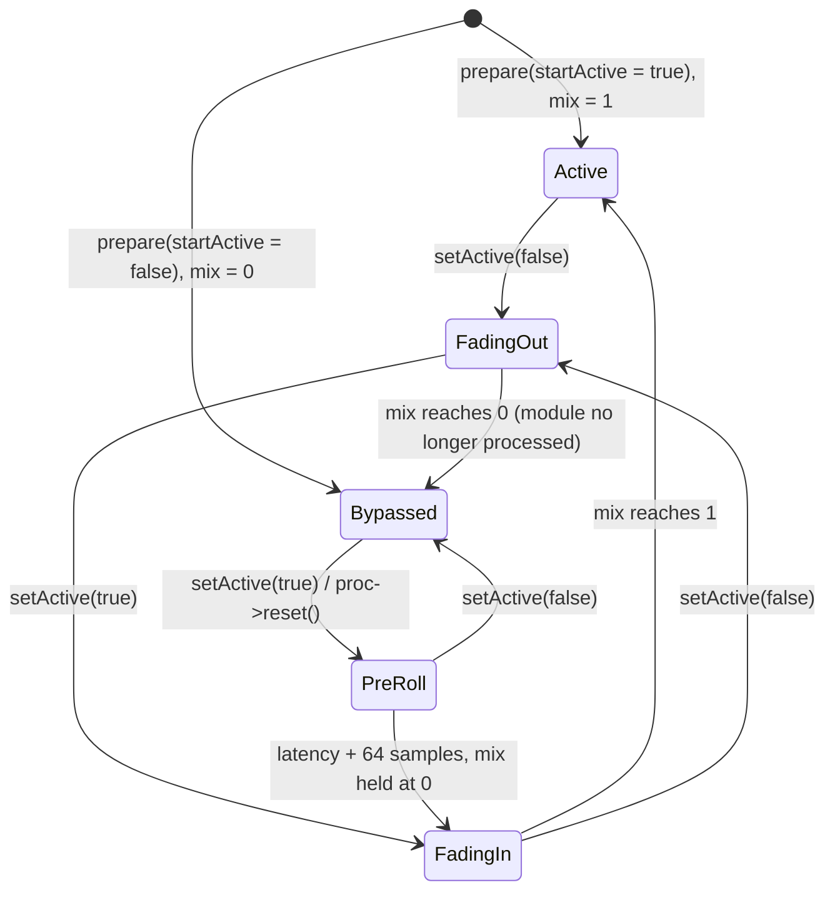
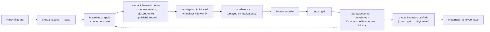

# 05 — Core DSP Code Skeletons: a Guided Tour of the Real Code (Workflow 4)

> This deliverable is not a set of hypothetical stubs. The code already exists, so each "skeleton" below is a **condensed excerpt of the real source** in `flub_core` (`core/`). The excerpts cover:
> - the main **processing chain**;
> - the **loudness maximizer** (with its true-peak limiter);
> - the **parametric EQ**;
> - the **bass engine**;
> - the **stereo spatializer**;
> - the supporting pieces: the `Processor` contract, `ModuleSlot`, `ParameterStore` and `MacroMap`.
>
> Each section shows the public API and the core per-sample loop, explains the design decisions (RT safety, smoothing, latency handling, channel linking), and links to the full file. §11 is a complete host program, for a single chain and for the multi-strip `MixEngine`, that was **compiled and run** against `core/` while this document was written. Its real output is included.

**Reading conventions**

- Excerpts are the source text, trimmed. `// ...` marks elided code. Short comments are kept from the source or abridged. Inline member functions defined in a header are shown as bare declarations, and a few consecutive declarations or constants are merged onto one line.
- `// [n]` markers were **added by this document**. They point to the numbered "Design decisions" list under each excerpt.
- Paths are relative to the repository root. Links go to the full files. In tables, `dsp/…`, `engine/…` and `common/…` are short for `core/include/flub/…`, and `src/…` for `core/src/…`.
- Numbers (constants, time constants, latencies) are the values in the code. Latencies in samples were read back from `latencySamples()` / `getLatencySamples()` of the built code.
- `fs` is the session sample rate. *Control rate* means "once every `kControlInterval` samples of stream time".

| § | Piece | Main files |
|---|---|---|
| [0](#0-rules-every-skeleton-follows) | Rules every skeleton follows | `core/include/flub/dsp/Processor.h`, `core/include/flub/common/*` |
| [1](#1-the-processor-contract-and-audioblock) | `Processor` contract + `AudioBlock` | `dsp/Processor.h`, `common/AudioBlock.h`, `common/SmoothedValue.h`, `common/Denormals.h` |
| [2](#2-parameterstore--the-lock-free-two-bank-parameter-table) | `ParameterStore` | `engine/Parameters.h`, `src/engine/Parameters.cpp` |
| [3](#3-macromap--base-values-to-effective-values) | `MacroMap` | `engine/MacroMap.h`, `src/engine/MacroMap.cpp` |
| [4](#4-moduleslot--click-free-latency-constant-bypass) | `ModuleSlot` | `engine/ModuleSlot.h`, `src/engine/ModuleSlot.cpp` |
| [5](#5-processingchain--the-main-processing-chain) | `ProcessingChain` | `engine/ProcessingChain.h`, `src/engine/ProcessingChain.cpp` |
| [6](#6-loudnessmaximizer--truepeaklimiter) | `LoudnessMaximizer` + `TruePeakLimiter` | `dsp/LoudnessMaximizer.h`, `dsp/TruePeakLimiter.h`, `src/dsp/LoudnessMaximizer.cpp`, `src/dsp/TruePeakLimiter.cpp` |
| [7](#7-parametriceq) | `ParametricEq` | `dsp/ParametricEq.h`, `src/dsp/ParametricEq.cpp` |
| [8](#8-bassengine) | `BassEngine` | `dsp/BassEngine.h`, `src/dsp/BassEngine.cpp` |
| [9](#9-stereospatializer) | `StereoSpatializer` | `dsp/StereoSpatializer.h`, `src/dsp/StereoSpatializer.cpp` |
| [10](#10-mixengine--the-multi-strip-variant) | `MixEngine` (multi-strip) | `engine/MixEngine.h`, `src/engine/MixEngine.cpp` |
| [11](#11-end-to-end-usage-example-verified) | End-to-end host example (verified) | this document |
| [12](#12-where-each-skeleton-is-proven) | Test map | `tests/*.cpp` |

The algorithms and their measured behaviour are described in [03 — DSP design](03-dsp-design.md). The threads and data flow around the chain are in [01 — Architecture](01-architecture.md).

---

## 0. Rules every skeleton follows

These conventions recur in every excerpt below, so they are stated once here.

| Rule | How the code does it | Why |
|---|---|---|
| Allocate only in `prepare()` | `AudioBuffer::setSize`, `DelayLine::prepare` and `std::vector::assign` appear only in `prepare()`. Everything else uses fixed `std::array`s or pre-sized buffers. | The audio thread must never touch the heap. Allocation-counting tests (`AllocationGuard`) enforce this for every module and for the chain. |
| Setters are RT-safe and idempotent | Every `setParams()` / `setBand()` sanitises its input, compares it with the current set (`operator== = default`) and **returns early when nothing changed**. | `ProcessingChain` pushes **every** parameter **every** block. An unchanged value costs one comparison, and the chain needs no dirty-tracking. |
| Sanitise, never trust | Values are clamped to the documented ranges. Non-finite handling differs by module: `ParametricEq`, `BassEngine` and `StereoSpatializer` clamp ±inf to the range edge; on NaN, `BassEngine` and `StereoSpatializer` keep the previous value and `ParametricEq` falls back to the default; `LoudnessMaximizer` and `TruePeakLimiter` keep the previous value for any non-finite input. | Host automation, presets or macro arithmetic may deliver garbage. The module must stay stable anyway. |
| Continuous changes glide, discrete ones crossfade | `LinearSmoothedValue` (fixed-length ramp, exact end point) for gains and mixes. `OnePoleSmoother` (exponential) for frequencies in the log domain and for dB values. Discrete changes (type, enable, stage on/off) fade through zero or through a latency-aligned dry path. | No zipper noise, no clicks, including when the A/B bank switches every parameter at once. |
| Stream-time control rate | Control ticks happen every `kControlInterval` samples of **absolute stream time** (16 in EQ and bass, 32 in the spatializer). The countdown survives across `process()` calls. | The output is independent of the host block size. Each module's tests compare several block sizes (for example 1, 7, 64 and 512 samples), most of them bit-exactly. |
| Constant latency | `latencySamples()` depends only on structural settings latched in `prepare()`. Bypass paths are delayed by the same amount. | Toggling anything never shifts audio in time. |
| Denormal / NaN hygiene | The host holds a `ScopedNoDenormals` (FTZ/DAZ) around processing. Modules *also* flush tiny recursive states (`< 1e-15` or `< 1e-20`) and reset a non-finite state. The chain drops any block that contains NaN/Inf. | Correct even without FTZ. A single bad sample cannot latch in IIR state. |

---

## 1. The `Processor` contract and `AudioBlock`

**Full files:** [`core/include/flub/dsp/Processor.h`](../core/include/flub/dsp/Processor.h) · [`core/include/flub/common/AudioBlock.h`](../core/include/flub/common/AudioBlock.h) · [`core/include/flub/common/SmoothedValue.h`](../core/include/flub/common/SmoothedValue.h) · [`core/include/flub/common/Denormals.h`](../core/include/flub/common/Denormals.h)

```cpp
// core/include/flub/dsp/Processor.h
namespace flub
{
struct ProcessSpec
{
    double sampleRate = 48000.0;
    int maxBlockSize = 512;
    int numChannels = 2;
};

class Processor
{
public:
    virtual ~Processor() = default;

    virtual void prepare (const ProcessSpec& spec) = 0;              // [1] non-RT: may allocate, may be slow
    virtual void reset() noexcept FLUB_NONBLOCKING = 0;              // [2] audio thread allowed

    /** In-place processing. block.numSamples <= spec.maxBlockSize and
        block.numChannels <= spec.numChannels are guaranteed by the caller. */
    virtual void process (const AudioBlock& block) noexcept FLUB_NONBLOCKING = 0; // [3]

    virtual int latencySamples() const noexcept { return 0; }        // [4]
    virtual const char* name() const noexcept = 0;
};
} // namespace flub
```

```cpp
// core/include/flub/common/AudioBlock.h
inline constexpr int kMaxChannels = 8;  // 7.1                     // [5]

struct AudioBlock                                                  // [6] non-owning view, value type
{
    std::array<float*, kMaxChannels> ch {};
    int numChannels = 0;
    int numSamples = 0;

    float* channel (int c) const noexcept { return ch[static_cast<size_t> (c)]; }
    AudioBlock subBlock (int offset, int length) const noexcept;   // pointer arithmetic only
    AudioBlock firstChannels (int n) const noexcept;
    void clear() const noexcept;
    void copyFrom (const AudioBlock& src) const noexcept;
    void applyGain (float g) const noexcept;
    void applyGainRamp (float g0, float g1) const noexcept;        // [7] linear ramp across the block
};

class AudioBuffer                                                  // owning storage
{
public:
    void setSize (int channels, int samples);                      // allocates: prepare() only
    AudioBlock block() noexcept;
    AudioBlock block (int channels, int samples) noexcept;
    // ...
};
```

The two shared smoothers (`common/SmoothedValue.h`) and the denormal guard (`common/Denormals.h`):

```cpp
class LinearSmoothedValue            // gains, crossfades: "reaches exactly the target" matters
{
public:
    void reset (double sampleRate, float rampMs, float initial) noexcept;
    void setTarget (float newTarget) noexcept;   // restarts a ramp of rampMs to the new target
    void setImmediate (float v) noexcept;
    float next() noexcept;                       // last step lands exactly on target
    float skip (int n) noexcept;                 // control-rate advance
    bool isSmoothing() const noexcept;
    // ...
};

class OnePoleSmoother                // frequencies (log domain), dB values: soft landing
{
public:
    void reset (double sampleRate, float timeMs, float initial) noexcept; // coeff = exp(-1 / (timeMs * 1e-3 * sampleRate))
    float next() noexcept;           // current = target + coeff * (current - target), then snapIfSettled()
    // ...
private:
    /** In float the recursion stalls ~0.5 ulp / (1 - coeff) short of a non-zero
        target, so a step that no longer changes the value also counts as settled. */
    void snapIfSettled (float previous) noexcept;                  // [8]
};

class ScopedNoDenormals              // RAII: FTZ | DAZ (SSE MXCSR 0x8040) or FZ (AArch64 FPCR bit 24)
{ /* ... */ };
```

**Design decisions**

1. `prepare()` is the only place a module may allocate or do slow work: filter design tables, delay lines, FIR taps.
2. `reset()` runs on the audio thread. The chain calls it after dropping a NaN block, and `ModuleSlot` calls it when a module is re-activated. It must therefore be allocation-free.
3. Processing is **in place** on a view. No module owns I/O buffers. Sub-blocks (`subBlock`, `firstChannels`) are free, which is why the maximizer can split a host block into `maxBlockSize` segments and the chain can take a stereo view of an 8-channel block. `process()` is declared `FLUB_NONBLOCKING` (`common/Realtime.h`) in the base and in every override: in the `FLUB_RTSAN` build that is `[[clang::nonblocking]]`, and RealtimeSanitizer aborts on anything below it that allocates, frees, locks or blocks (CI job `rtsan`); elsewhere it expands to nothing.
4. Latency is a virtual *query*, not a setter. It must be constant between `prepare()` calls, because the chain sums slot latencies once, in `ProcessingChain::prepare()`, and sizes its global dry delay from the sum.
5. `kMaxChannels = 8` bounds every per-channel `std::array` in the engine, so per-channel state needs no heap.
6. `AudioBlock` is a small value type (8 pointers + 2 ints). Passing it by `const&` or copying it is cheap.
7. `applyGainRamp()` is how every block-rate gain (input/output gain, AutoLevel, strip gain) becomes a per-sample ramp: no steps at block boundaries.
8. `snapIfSettled()` fixes a real float trap found in review: a one-pole with a slow coefficient stops moving tens of ulps short of a non-zero target, so a band would stay "busy" forever. `ParametricEq` adds its own `stepSmoother()` guard for the same reason (§7).
9. Work that cannot be bounded, such as neural inference, keeps the contract by leaving the audio thread: `flub::AsyncModelProcessor` (`core/include/flub/neural/`) is an ordinary `Processor` whose `process()` only moves fixed-size frames through two wait-free queues to one worker thread that runs a `ModelRunner`, and applies the returned control frame to the input delayed by a constant `frameSize × (1 + safetyFrames)` (a late or failed frame keeps the last good controls, then ramps to neutral). A batch render, which has no deadline, uses its offline mode instead: `process()` runs the model on the rendering thread, so every frame gets its result however fast the render runs. `ProcessingChain` runs one in its optional neural slot (§5, decision 20; `09-future-roadmap.md` §1.1).

---

## 2. `ParameterStore` — the lock-free, two-bank parameter table

**Full files:** [`core/include/flub/engine/Parameters.h`](../core/include/flub/engine/Parameters.h) · [`core/src/engine/Parameters.cpp`](../core/src/engine/Parameters.cpp)

```cpp
// core/include/flub/engine/Parameters.h
namespace flub::param
{
struct Info
{
    std::string key;   // stable preset key, e.g. "eq.3.freq"
    std::string name;  // display name, e.g. "Band 4 Frequency"
    std::string group; // "Global", "EQ", "Bass", ... (generic editors / docs)
    Unit unit = Unit::None;
    float minValue = 0.0f, maxValue = 1.0f, defaultValue = 0.0f;
    float skewCentre = 0.0f;          // value at slider mid-point (0 = linear)
    std::vector<std::string> choices; // Unit::Choice labels
    bool structural = false;          // needs chain re-prepare (latency changes)      [1]

    float clamp (float v) const noexcept { return v < minValue ? minValue : (v > maxValue ? maxValue : v); }
};

enum Id : int                                                                    // [2] append-only
{
    InputGainDb = 0, OutputGainDb, Mode, BoostIntensity, Macro1, /* ... Macro5 */
    AutoLevelOn, AutoLevelTargetLufs, LoudnessMatchBypass, BypassAll, LatencyProfile,
    GateOn, EqOn, DynEqOn, BassOn, ClarityOn, SaturationOn, SpatialOn, VirtualizerOn, CompressorOn, MaximizerOn,
    // ... per-module parameters ...
    MaxDriveDb, MaxCeilingDb, MaxClipAmount, MaxClipKnee, MaxGlue, MaxReleaseMs, MaxAutoRelease, MaxAutoDrive, MaxTargetLufs,
    kNumScalarParams                                                             // = 87
};

inline constexpr int kEqBands = 10;
inline constexpr int kDynEqBands = 4;
inline constexpr int kEqBase = kNumScalarParams;
inline constexpr int kDynBase = kEqBase + kEqBands * kEqFields;                  // 6 fields per EQ band
inline constexpr int kNumParams = kDynBase + kDynEqBands * kDynFields;           // 12 per dyn band -> 195

constexpr int eq (int band, EqField f) noexcept { return kEqBase + band * kEqFields + f; }
constexpr int dyn (int band, DynField f) noexcept { return kDynBase + band * kDynFields + f; }

const std::vector<Info>& layout();          // built once, immutable afterwards
int findByKey (const std::string& key);     // non-RT; -1 if unknown

enum class Bank : int { A = 0, B = 1 };

class ParameterStore
{
public:
    ParameterStore();

    float get (int id) const noexcept;                   // active bank, relaxed atomics
    void set (int id, float value) noexcept;             // clamps, bumps version
    float get (Bank b, int id) const noexcept;
    void set (Bank b, int id, float value) noexcept;

    void setActiveBank (Bank b) noexcept;                                         // [3]
    Bank getActiveBank() const noexcept;
    void copyBank (Bank from, Bank to) noexcept;
    void resetToDefaults (Bank b) noexcept;

    uint32_t version() const noexcept { return changeCounter.load (std::memory_order_acquire); } // [4]
    void snapshot (float* dest) const noexcept;          // copies the active bank. RT-safe.

private:
    std::unique_ptr<std::atomic<float>[]> values;        // [bank * kNumParams + id]  [5]
    std::atomic<int> activeBank { 0 };
    std::atomic<uint32_t> changeCounter { 0 };
};
} // namespace flub::param
```

```cpp
// core/src/engine/Parameters.cpp
void ParameterStore::set (Bank b, int id, float value) noexcept
{
    assert (id >= 0 && id < kNumParams);
    const float v = layout()[static_cast<size_t> (id)].clamp (value);                        // [6]
    values[static_cast<size_t> (static_cast<int> (b) * kNumParams + id)].store (v, std::memory_order_relaxed);
    changeCounter.fetch_add (1, std::memory_order_release);
}

void ParameterStore::snapshot (float* dest) const noexcept                                  // [7]
{
    const int bank = activeBank.load (std::memory_order_acquire);
    for (int i = 0; i < kNumParams; ++i)
        dest[i] = values[static_cast<size_t> (bank * kNumParams + i)].load (std::memory_order_relaxed);
}
```

**Design decisions**

1. Only `latency.profile` is `structural`. The chain latches it in `prepare()` and reports a change through `needsReprepare()`. Every other value can change on the audio thread.
2. Everything in the engine addresses parameters by a dense integer id (`index == Id`). String keys (`"eq.3.freq"`) appear only at the boundary: presets, CLI, IPC. Ids are **append-only**, and presets store keys, so reordering can never corrupt a saved preset.
3. **A/B = two complete banks.** Comparing is one atomic store of `activeBank`. Every continuous value then glides inside the modules and discrete ones crossfade, so the switch is click-free. `copyBank(A, B)` gives "compare against a tweak".
4. `version()` lets a GUI refresh its controls without subscribing to anything (polled, wait-free).
5. One `std::atomic<float>` per value per bank (2 × 195). Relaxed loads and stores give no torn floats and no locks. Consistency *across* parameters is not guaranteed (last writer wins per value); that is harmless because modules smooth.
6. `set()` clamps to the layout range. `layout()` is a function-local static that the store's constructor already builds (`resetToDefaults()` calls it), so a `set()` on the audio thread never triggers the one-time construction. **Limitation:** `Info::clamp` passes NaN through (both comparisons are false), so a NaN written by a host is stored as NaN. Most modules then keep their previous value (§0), but some chain-level paths do not. For example, NaN in `output.gain` becomes a NaN gain ramp *after* the maximizer, and the chain's NaN guard (§5.3) checks only the input. Measured against the current code: 15,358 of the 15,360 output samples after the write were NaN (only the first samples of the ramp, which still start from the old gain, stay finite).
7. The chain calls `snapshot()` **once per block**. Every module in that block sees one coherent copy, and the audio thread performs no further atomic reads.

---

## 3. `MacroMap` — base values to effective values

**Full files:** [`core/include/flub/engine/MacroMap.h`](../core/include/flub/engine/MacroMap.h) · [`core/src/engine/MacroMap.cpp`](../core/src/engine/MacroMap.cpp)

Presets and the GUI write **base** values. Each block, the chain computes **effective** values:

```
eff[p]   = clamp_p( base[p] + Σ_e amount_e · curve_e(source_e) · gov_e )
curve(v) = smoothstep(start, end, v) ^ exponent          smoothstep(t) = t² (3 − 2t), t = clamp((v − start)/(end − start), 0, 1)
gov_e    = SafetyGovernor scale (0.3 … 1) if the entry is "governed", else 1
```

```cpp
// core/include/flub/engine/MacroMap.h
enum class MacroSource : uint8_t { Boost = 0, M1, M2, M3, M4, M5 };

struct MacroEntry
{
    MacroSource source;
    int paramId;
    float amount;   // added to the base value at curve = 1 (param units)
    float start;    // source value where the contribution starts (0..1)
    float end;      // source value where it reaches full amount (0..1)
    float exponent; // curve shaping (1 = smoothstep)
    bool governed;  // scaled by the SafetyGovernor
};

class MacroMap
{
public:
    static std::span<const MacroEntry> table (param::ModeValue mode) noexcept;
    static const char* macroName (param::ModeValue mode, int macroIndex) noexcept; // 0..4
    static void apply (const float* base, float* effective, float governorScale) noexcept;
    /** True when a source that can raise paramId in the current mode is above 0,
        even before its entry's start point (used for the glue floor, §5 decision 15). */
    static bool isArmed (const float* base, int paramId) noexcept;
};
```

```cpp
// core/src/engine/MacroMap.cpp
constexpr float kEngage = 0.02f;                        // toggles switch on as soon as a macro leaves 0   [1]

constexpr std::array<MacroEntry, 30> kMusicTable {{   // 27 entries in kGamingTable                  [2]
    // ---- Boost Intensity: clarity/width first, bass next, loudness last ----
    { MacroSource::Boost, ClarityPresence,   0.35f, 0.00f, 0.50f, 1.0f, false },
    // ... air, attack, width
    { MacroSource::Boost, BassBoostDb,       5.00f, 0.20f, 0.80f, 1.0f, true  },
    // ... harmonics
    { MacroSource::Boost, MaxDriveDb,        8.00f, 0.30f, 1.00f, 1.2f, true  },
    // ... glue
    { MacroSource::Boost, SatDriveDb,        4.00f, 0.60f, 1.00f, 1.0f, true  },
    // ... M1 Punch, M2 Width, M3 Clarity, M4 Loudness
    // ---- M5 Warmth ----
    { MacroSource::M5, SaturationOn,         1.00f, 0.00f, kEngage, 1.0f, false },
    { MacroSource::M5, SatDriveDb,           9.00f, 0.00f, 1.00f, 1.0f, true  },
    // ...
}};

void MacroMap::apply (const float* base, float* effective, float governorScale) noexcept
{
    for (int i = 0; i < kNumParams; ++i)
        effective[i] = base[i];

    const auto mode = static_cast<ModeValue> (static_cast<int> (std::lround (base[Mode])));
    const auto& info = layout();

    for (const auto& e : table (mode))
    {
        const float v = sourceValue (base, e.source);
        if (v <= 0.0f)
            continue;                                                      // [3]
        float c = smoothstep (e.start, e.end, v);
        if (e.exponent != 1.0f)
            c = std::pow (c, e.exponent);
        const float g = e.governed ? governorScale : 1.0f;                 // [4]
        effective[e.paramId] += e.amount * c * g;
    }

    for (const auto& e : table (mode))
        effective[e.paramId] = info[static_cast<size_t> (e.paramId)].clamp (effective[e.paramId]); // [5]
}
```

**Design decisions**

1. Macros can **engage modules**: a toggle entry with `start = 0, end = 0.02` switches, for example, Saturation on as soon as *Warmth* moves. The module then fades in through its `ModuleSlot` (§4).
2. The tables are `constexpr std::array`s exposed as `std::span`: no allocation, no locks, trivially RT-safe. Adding macro behaviour means adding rows; no module code changes.
3. A macro at 0 contributes nothing, so with all sources at 0 the effective values equal the base values exactly (test *MacroMap: zero macros leave base values untouched*).
4. Only loudness-adding entries (maximizer drive, bass boost, harmonics, saturation drive) are `governed`. The SafetyGovernor can therefore withdraw loudness without touching tonal or spatial entries.
5. Only the parameters the table touches are re-clamped; everything else is already in range from `ParameterStore::set()`.

**Worked example** (verified by the §11 program): Music mode, Boost Intensity 0.6, governor scale 1, entry `MaxDriveDb 8 dB, 0.30 → 1.00, exp 1.2`:

```
t = (0.6 − 0.3) / 0.7 = 0.4286;  smoothstep = 0.3936;  0.3936^1.2 = 0.3267;  0.3267 × 8 dB = 2.61 dB effective drive
```

---

## 4. `ModuleSlot` — click-free, latency-constant bypass

**Full files:** [`core/include/flub/engine/ModuleSlot.h`](../core/include/flub/engine/ModuleSlot.h) · [`core/src/engine/ModuleSlot.cpp`](../core/src/engine/ModuleSlot.cpp)



```cpp
// core/include/flub/engine/ModuleSlot.h
class ModuleSlot
{
public:
    void prepare (Processor& processor, const ProcessSpec& spec, float fadeMs = 20.0f, bool startActive = true);
    void setActive (bool shouldBeActive) noexcept { wantActive = shouldBeActive; }   // RT-safe, once per block
    void process (const AudioBlock& block) noexcept;
    void reset() noexcept;

    int latencySamples() const noexcept { return latency; }
    bool isFullyBypassed() const noexcept { return ! processing && mix == 0.0f; }
    // ...
private:
    Processor* proc = nullptr;
    AudioBuffer dry;
    DelayLine dryDelay;
    int latency = 0, preRoll = 0;
    float mix = 1.0f, step = 1.0f / 960.0f;
    bool wantActive = true, processing = true;
};
```

```cpp
// core/src/engine/ModuleSlot.cpp
void ModuleSlot::prepare (Processor& processor, const ProcessSpec& spec, float fadeMs, bool startActive)
{
    proc = &processor;
    processor.prepare (spec);
    latency = processor.latencySamples();                                                  // [1]
    dry.setSize (spec.numChannels, spec.maxBlockSize);
    dryDelay.prepare (spec.numChannels, latency);
    step = 1.0f / std::max (1.0f, static_cast<float> (fadeMs * 0.001 * spec.sampleRate));   // 960 samples at 48 kHz
    // ...
}

void ModuleSlot::process (const AudioBlock& block) noexcept
{
    if (proc == nullptr)
        return;

    const int n = block.numSamples;

    if (wantActive && ! processing)                     // re-activation from full bypass       [2]
    {
        proc->reset();
        processing = true;
        preRoll = latency + 64;
    }
    if (! wantActive)
        preRoll = 0;

    const AudioBlock d = dry.block (block.numChannels, n);
    d.copyFrom (block);
    dryDelay.process (d);                               // dry path ALWAYS runs                 [3]

    if (! processing)
    {
        block.copyFrom (d);                             // fully bypassed: latency-compensated dry [4]
        return;
    }

    proc->process (block);

    const float target = wantActive ? 1.0f : 0.0f;
    if (mix == target && preRoll == 0)                  // steady state: no per-sample mixing  [5]
    {
        if (mix == 0.0f)
        {
            block.copyFrom (d);
            processing = false;
        }
        return;
    }

    for (int i = 0; i < n; ++i)                         // linear (equal-gain) crossfade        [6]
    {
        if (preRoll > 0)
            --preRoll;                                  // hold (mix stays where it is, normally 0)
        else if (mix < target)
            mix = std::min (target, mix + step);
        else if (mix > target)
            mix = std::max (target, mix - step);

        for (int c = 0; c < block.numChannels; ++c)
        {
            float* w = block.channel (c);
            const float x = d.channel (c)[i];
            w[i] = x + mix * (w[i] - x);
        }
    }

    if (! wantActive && mix == 0.0f)
        processing = false;
}
```

**Design decisions**

1. A slot's latency is its module's latency, read once. The dry path is delayed by exactly that, so **bypass never changes the chain latency** (test *ModuleSlot: bypassed slot is a pure latency-compensated delay and toggling is click-free*).
2. On re-activation the module is `reset()` and then **pre-rolled** for `latency + 64` samples with the output still fully dry. Look-ahead lines, oversampler FIR histories and envelope followers are primed with real signal before a single wet sample is heard. The reset also means a module never resumes from stale state left over from before the bypass.
3. The dry delay line runs every block, including in steady wet state. A fade can then start at any block with valid dry content. The cost is one copy and one delay per block.
4. While fully bypassed, the module is **not processed at all**, so a disabled module costs only the dry copy.
5. Fast path: in steady state (`mix == target`, no pre-roll) no per-sample crossfade work is done.
6. The crossfade is linear, 20 ms by default (all chain slots use 20 ms). Wet and dry are time-aligned and largely correlated, which is the case where an equal-gain crossfade keeps the level constant. The mix is per sample and shared by all channels, so the stereo image cannot shift during a fade.

---

## 5. `ProcessingChain` — the main processing chain

**Full files:** [`core/include/flub/engine/ProcessingChain.h`](../core/include/flub/engine/ProcessingChain.h) · [`core/src/engine/ProcessingChain.cpp`](../core/src/engine/ProcessingChain.cpp) · protection loops: [`core/include/flub/engine/Protection.h`](../core/include/flub/engine/Protection.h), [`core/src/engine/Protection.cpp`](../core/src/engine/Protection.cpp)

### 5.1 Public API

```cpp
// core/include/flub/engine/ProcessingChain.h
struct ChainConfig
{
    double sampleRate = 48000.0;
    int maxBlockSize = 512;
    int inputChannels = 2; // 2, 6 (5.1) or 8 (7.1)
};

class ProcessingChain
{
public:
    explicit ProcessingChain (param::ParameterStore& store);

    /** Non-RT. Reads structural parameters (latency profile) from the store. */
    void prepare (const ChainConfig& config);
    void reset() noexcept;

    /** RT. io.numChannels == config.inputChannels, numSamples <= maxBlockSize.
        Output is written to channels 0/1; channels >= 2 are cleared. */
    void process (const AudioBlock& io) noexcept FLUB_NONBLOCKING;

    int getLatencySamples() const noexcept { return totalLatency; }
    param::LatencyProfileValue getLatencyProfile() const noexcept; // as prepared (MixEngine's master look-ahead)
    bool needsReprepare() const noexcept;               // latency profile changed since prepare()
    /** Centre / corner frequency of dynamic-EQ mode band 4..7 in `mode` (GUI markers). */
    static float modeBandFrequency (param::ModeValue mode, int band) noexcept;

    MeterBus& meters() noexcept { return meterBus; }    // audio -> GUI atomics
    AnalyzerTaps& taps() noexcept { return analyzerTaps; } // pre/post SPSC rings (mid signal)
    /** Last effective value of a parameter - after the macros and the chain's
        mode / format overrides, i.e. what is applied. Published once per block
        (relaxed atomics), so any thread may call it. */
    float effectiveValue (int paramId) const noexcept;

    // Neural slot (docs/09 §1.1): empty by default; a model takes effect at the next prepare().
    void setNeuralModel (std::unique_ptr<ModelRunner> runner, const NeuralSlotConfig& config = {}); // non-RT
    void clearNeuralModel();                                                                       // non-RT
    NeuralSlotStatus getNeuralStatus() const noexcept FLUB_NONBLOCKING;     // state (Active / Ineligible / ...) + L
    NeuralSlotCounters getNeuralCounters() const noexcept FLUB_NONBLOCKING; // misses, failures, frames (any thread)
    void setNeuralBypass (bool bypassed) noexcept FLUB_NONBLOCKING;         // latency-constant fade, any thread

private:
    // Modules (owned) and their bypass slots, in processing order.
    SpectralNoiseGate gate;   ParametricEq paramEq;   DynamicEq dynEq;      BassEngine bass;
    ClarityEnhancer clarity;  Saturator saturator;    StereoSpatializer spatial;
    Compressor compressor;    LoudnessMaximizer maximizer;                  HeadphoneVirtualizer virtualizer;

    std::unique_ptr<AsyncModelProcessor> neural, pendingNeural; // installed / waiting for prepare()

    enum SlotIndex { SGate, SNeural, SEq, SDynEq, SBass, SClarity, SSat, SSpatial, SComp, SMax, kNumSlots };
    std::array<ModuleSlot, kNumSlots> slots;
    bool gateInChain = false, neuralInChain = false;   // inChain (s): the gate / neural slot only when set
    // ... gain smoothers, AutoLevel, AutoDrive, SafetyGovernor, ComparisonMatcher,
    //     virtMix + foldScratch (20 ms virtualiser <-> downmix crossfade),
    //     global-bypass dry buffer + DelayLine + dryLimiter (TruePeakLimiter on the reference),
    //     meters, MeterBus, AnalyzerTaps,
    //     publishedEffective (std::atomic<float>[kNumParams], read by effectiveValue())
};
```

### 5.2 `prepare()` — latency profile → structural settings

```cpp
void ProcessingChain::prepare (const ChainConfig& cfg)
{
    config = cfg;
    config.inputChannels = std::clamp (config.inputChannels, 2, kMaxChannels);
    // ...
    store.snapshot (base.data());
    MacroMap::apply (base.data(), effective.data(), 1.0f);             // [1] effective values decide initial enables
    publishEffective();                                                // plain post-macro values until the first block
    const float* e = effective.data();

    profileAtPrepare = idx (e, LatencyProfile);                        // [2] latched until the next prepare()
    switch (static_cast<LatencyProfileValue> (profileAtPrepare))
    {
        case LatencyProfileValue::Quality:
            gateInChain = true;
            gate.setFftSize (1024);
            saturator.setOversampling (2, Oversampler::Quality::High);
            compressor.setLookaheadMs (3.0f);
            maximizer.setClipOversampling (4, Oversampler::Quality::High);
            maximizer.setLookaheadMs (2.0f);
            maximizer.setTruePeakDetection (true);
            break;
        case LatencyProfileValue::LowLatency:
            gateInChain = false;
            saturator.setOversampling (2, Oversampler::Quality::Low);
            compressor.setLookaheadMs (0.5f);
            maximizer.setClipOversampling (2, Oversampler::Quality::Low);
            maximizer.setLookaheadMs (0.5f);
            maximizer.setTruePeakDetection (true);
            break;
        case LatencyProfileValue::Balanced:
        default:
            // ... sat 2x Low, comp 1 ms, max 4x High + 1.5 ms
            break;
    }

    virtualizer.prepare ({ sr, maxB, config.inputChannels });          // the only multichannel module
    const ProcessSpec stereo { sr, maxB, 2 };                          // everything after the fold is stereo
    if (gateInChain)
        slots[SGate].prepare (gate, stereo, 20.0f, on (e, GateOn));
    prepareNeuralSlot (stereo);                                        // [20] swap in a pending model; in chain
                                                                       //      only if eligible for the profile
    slots[SEq].prepare (paramEq, stereo, 20.0f, on (e, EqOn));
    // ... DynEq, Bass, Clarity, Sat, Spatial, Comp
    slots[SMax].prepare (maximizer, stereo, 20.0f, on (e, MaximizerOn));

    totalLatency = 0;
    for (int s = 0; s < kNumSlots; ++s)
        if (inChain (s))
            totalLatency += slots[static_cast<size_t> (s)].latencySamples();   // [3]

    dryBuffer.setSize (2, maxB);
    // The bypass reference's safety limiter lives inside the chain latency:     [17]
    // up to 1 ms look-ahead plus the 4x detector delay when the latency allows
    // (every profile at 22.05 kHz and above), sample-peak otherwise.
    {
        const int detector = TruePeakDetector::kDelay;                          // 20
        const bool truePeak = totalLatency >= detector + 8;
        const int lookahead = truePeak ? std::min (totalLatency - detector, std::max (1, static_cast<int> (std::lround (0.001 * sr))))
                                       : totalLatency;
        dryLimiter.setTruePeakDetection (truePeak);
        dryLimiter.setLookaheadMs (static_cast<float> (1000.0 * lookahead / sr));
        dryLimiter.prepare ({ sr, maxB, 2 });
    }
    dryDelay.prepare (2, std::max (0, totalLatency - dryLimiter.latencySamples())); // global-bypass reference
    foldScratch.setSize (config.inputChannels, maxB);
    virtMix.reset (sr, 20.0f, on (e, VirtualizerOn) && ! on (e, VirtOwnHrtf) ? 1.0f : 0.0f);
    passMix.reset (sr, 400.0f, /* stereo fold forced by virt.input / virt.ownHrtf */ ...);  // detector starts "surround"
    inputGain.reset (sr, 20.0f, dbToGain (e[InputGainDb]));
    outputGain.reset (sr, 20.0f, dbToGain (e[OutputGainDb]));
    bypassMix.reset (sr, 30.0f, on (e, BypassAll) ? 1.0f : 0.0f);
    dryMatchGain.reset (sr, 50.0f, 1.0f);
    // ... protection loops, meters, analyser scratch
    reset();
}
```

**Algorithmic latency per profile** (sum of slot latencies, read back from the built code):

| Stage (48 kHz) | Quality | Balanced (default) | Low Latency |
|---|---|---|---|
| `SpectralNoiseGate` (STFT) | 1024 | not in chain | not in chain |
| `Saturator` 2× oversampling | 32 (High) | 16 (Low) | 16 (Low) |
| `Compressor` look-ahead | 144 (3 ms) | 48 (1 ms) | 24 (0.5 ms) |
| `LoudnessMaximizer` clip oversampler | 36 (4× High) | 36 (4× High) | 16 (2× Low) |
| `LoudnessMaximizer` limiter L + D | 96 + 20 = 116 | 72 + 20 = 92 | 24 + 20 = 44 |
| **Total** | **1352 = 28.17 ms** | **192 = 4.00 ms** | **100 = 2.08 ms** |

| Sample rate | Quality | Balanced | Low Latency |
|---|---|---|---|
| 44.1 kHz | 1332 (30.20 ms) | 182 (4.13 ms) | 96 (2.18 ms) |
| 48 kHz | 1352 (28.17 ms) | 192 (4.00 ms) | 100 (2.08 ms) |
| 96 kHz | 1592 (16.58 ms) | 312 (3.25 ms) | 148 (1.54 ms) |
| 192 kHz | 2072 (10.79 ms) | 552 (2.88 ms) | 244 (1.27 ms) |

The oversampler and detector latencies (and the 1024-sample STFT) are fixed sample counts; look-ahead scales with `fs`. EQ, dynamic EQ, bass, clarity, spatializer and virtualiser have zero latency. An active neural model adds its fixed `L = frameSize × (1 + safetyFrames)` to every column (decision 20); with no model the slot adds nothing.

### 5.3 `process()` — one block

```cpp
void ProcessingChain::process (const AudioBlock& io) noexcept
{
    const int n = io.numSamples;
    if (n <= 0)
        return;

    // A single NaN/Inf from a misbehaving driver or upstream plug-in would latch
    // forever in IIR state: drop the block and restart the chain cleanly.
    float checksum = 0.0f;
    for (int c = 0; c < io.numChannels; ++c)
        for (int i = 0; i < n; ++i)
            checksum += io.channel (c)[i] * 0.0f;                               // [4]
    if (! std::isfinite (checksum))
    {
        io.clear();
        reset();
        return;
    }

    store.snapshot (base.data());                                                // [5]
    // ... honour meterBus.resetLoudnessRequest (GUI -> audio flag)
    applyParameters();                                                           // [6]
    const float* e = effective.data();

    // ---- 1. Input stage (all input channels) ----
    const AudioBlock in = io.firstChannels (config.inputChannels);
    const float g0 = inputGain.getCurrent();
    in.applyGainRamp (g0, inputGain.skip (n));
    autoLevel.process (in);

    // ---- 2. Fold to stereo ----
    inputDetector.process (in);                          // surround or FL/FR-only content? (docs/11 E27)
    if (config.inputChannels > 2)
        foldToStereo (in);                                                       // [16]
    // foldToStereo, outside a fade: one of
    //     fold.process (in, 1.0f);                      // stereo passthrough (unity BS.775)
    //     virtualizer.process (in);                     // 5.1/7.1 -> binaural
    //     fold.process (in, k);                         // ITU-R BS.775, -3 dB
    // (Bs775Fold: the LFE at virt.lfe re one main through the LfeFold the
    // virtualiser shares, docs/11 E01). During a fade: D = fold of a
    // foldScratch copy, B = virtualizer in place, per sample
    //     S = (1 - w) k D + w B,   y = g (S + p (D - S))
    // with w = virtMix.next() (20 ms, virt.on), p = passMix.next() (400 ms);
    // g = 1 outside the p ramp, and during it holds the mix's RMS on
    // (1 - p) RMS(S) + p RMS(D) from the block's S^2, D^2, S D (50 ms smoothed).
    const AudioBlock st = io.firstChannels (2);

    // ---- 3. Dry reference for global bypass / A-B ----
    const AudioBlock dry = dryBuffer.block (2, n);
    dry.copyFrom (st);
    loudnessMatch.measureDry (dry);
    dryDelay.process (dry);                                                      // [7] delayed by totalLatency
    // ... input meters, analyser "pre" tap (mid = (L+R)/2)

    // ---- 4. Module slots ----
    for (int s = 0; s < kNumSlots; ++s)
        if (inChain (s))
            slots[static_cast<size_t> (s)].process (st);
    // ... neural counters published for getNeuralCounters() (relaxed atomics)

    // ---- 5. Output gain ----
    const float o0 = outputGain.getCurrent();
    st.applyGainRamp (o0, outputGain.skip (n));                                  // [8] range -24..0 dB

    // ---- 6. Control loops for the next block ----
    const bool maxActive = ! slots[SMax].isFullyBypassed();
    const bool satActive = ! slots[SSat].isFullyBypassed();
    const float distortionDb = distortion.update (satActive ? saturator.getDistortionDb() : kMinusInfDb,
                                                  maxActive ? maximizer.getDistortionDb() : kMinusInfDb, n);
    governor.update (maxActive ? maximizer.getGainReductionDb() : 0.0f, distortionDb, n); // [9]
    autoDrive.update (st, e[MaxTargetLufs], on (e, MaxAutoDrive), e[MaxDriveDb]); // [14] floored at -requested drive
    loudnessMatch.measureWet (st);

    // ---- 7. Global bypass (latency-aligned, optionally loudness matched) ----
    // The louder side is turned down, never the quieter one up.            [10]
    loudnessMatch.update (on (e, BypassAll), on (e, LoudnessMatchBypass), n);
    loudnessMatch.applyWetTrim (st);
    dryMatchGain.setTarget (dbToGain (loudnessMatch.getDryTrimDb()));

    if (bypassMix.getCurrent() > 0.0f || bypassMix.isSmoothing())
    {
        // The match only ever turns the reference down, but the input itself
        // can peak above the ceiling: the reference therefore passes a
        // true-peak limiter at the ceiling.                                [17]
        if (! dryLimiterRunning)
        {
            dryLimiter.reset();                                                  // cold start: silent for its latency,
            dryLimiterRunning = true;                                            // so the crossfade waits that long
            dryWarmup = bypassMix.getCurrent() > 0.0f ? 0 : dryLimiter.latencySamples();
        }
        for (int i = 0; i < n; ++i)
        {
            const float dg = dryMatchGain.next();                                // 50 ms linear
            for (int c = 0; c < 2; ++c)
                dry.channel (c)[i] *= dg;
        }
        dryLimiter.process (dry);                                                // @ max.ceiling, its latency is part of totalLatency
        for (int i = 0; i < n; ++i)
        {
            float b = bypassMix.getCurrent();                                    // 30 ms linear, after the warm-up
            if (dryWarmup > 0)
                --dryWarmup;
            else
                b = bypassMix.next();
            for (int c = 0; c < 2; ++c)
            {
                float* w = st.channel (c);
                w[i] += b * (dry.channel (c)[i] - w[i]);
            }
        }
    }
    else
    {
        dryLimiterRunning = false;                                               // only runs while bypass is engaged
        dryWarmup = 0;
        dryMatchGain.skip (n);
    }

    // ---- 8. Output meters / analyser ----
    publishMeters (st, n);                                                       // relaxed atomic stores
    // ... analyser "post" tap
    for (int c = 2; c < io.numChannels; ++c)
        std::fill (io.channel (c), io.channel (c) + n, 0.0f);
}
```

### 5.4 `applyParameters()` — effective values → module setters (audio thread, every block)

```cpp
void ProcessingChain::applyParameters() noexcept
{
    MacroMap::apply (base.data(), effective.data(), governor.getScale());       // [11]
    float* e = effective.data();   // the mode / format policies below write their overrides into e [18]
    const auto mode = static_cast<ModeValue> (idx (e, Mode));
    const bool ownHrtf = on (e, VirtOwnHrtf);                                    // the game renders its own HRTF
    if (ownHrtf)
        e[VirtualizerOn] = 0.0f;
    const bool stereoFold = config.inputChannels > 2 && stereoFoldFor (e, inputDetector.getFold()); // virt.input override
    const bool binaural = config.inputChannels > 2 && ! stereoFold && on (e, VirtualizerOn);
    // ... input/output gain targets, AutoLevel, bypassMix target,
    //     dryLimiter.setParams ({ e[MaxCeilingDb], 80.0f, true }) (ceiling, release ms, auto release),
    //     virtMix / passMix targets, fold.setLfeGain (LfeFold::gainFor (virt.lfeFold, virt.lfe)), gate

    for (int b = 0; b < kEqBands; ++b)                                          // ---- Parametric EQ ----
    {
        EqBandParams bp;
        bp.enabled = on (e, eq (b, EqFieldOn));
        bp.type = static_cast<EqBandType> (idx (e, eq (b, EqFieldType)));
        bp.frequency = e[eq (b, EqFieldFreq)];
        bp.gainDb = e[eq (b, EqFieldGain)];
        bp.q = e[eq (b, EqFieldQ)];
        bp.slopeDbPerOct = 12 * (idx (e, eq (b, EqFieldSlope)) + 1);
        paramEq.setBand (b, bp);                                                 // early-returns if unchanged
    }
    paramEq.setOutputGainDb (e[EqOutputGainDb]);
    slots[SEq].setActive (on (e, EqOn));

    // ... Dynamic EQ user bands 0..3, then configureModeBands() writes mode bands 4..7   [12]
    // ... Bass (BassEngineParams)
    if (config.sampleRate < 42000.0)                                             // ---- Clarity ----
        e[ClarityAir] = 0.0f;  // exciter products of <= 7 kHz content must stay below fs / 2
    // ... ClarityParams (cp.air = e[ClarityAir]), Saturation

    if (mode == ModeValue::Gaming)                                               // ---- mode / binaural policy ----
        e[SpatialCrossfeed] = 0.0f; // crossfeed blurs lateral cues: never in gaming   [13]
    if (binaural || ownHrtf)
    {
        e[SpatialWidth] = 1.0f;     // binaural output already carries exact interaural cues
        e[SpatialSpace] = 0.0f;
        e[SpatialCrossfeed] = 0.0f;
        e[SpatialFocus] = 0.0f;     // no second ILD on top of an HRTF render (docs/11 E24 (i))
    }
    SpatializerParams wp;
    // ... copy spatial.* values from e
    spatial.setParams (wp);
    slots[SSpatial].setActive (on (e, SpatialOn));

    // ... Virtualiser

    if (mode == ModeValue::Gaming && ! (base[CompressorOn] >= 0.5f)             // ---- Compressor ----
        && base[CompRatio] == layout()[static_cast<size_t> (CompRatio)].defaultValue)
        e[CompRatio] = 1.0f;   // engaged only by a macro, no ratio chosen: upward only   [19]
    // ... CompressorParams from e, compressor.setParams, slots[SComp].setActive

    MaximizerParams mp;                                                          // ---- Maximizer ----
    mp.driveDb = std::max (0.0f, e[MaxDriveDb] + autoDrive.getReductionDb());   // [14] AutoDrive only reduces
    mp.ceilingDb = e[MaxCeilingDb];
    mp.clipAmount = e[MaxClipAmount];
    mp.clipKnee = e[MaxClipKnee];
    constexpr float kGlueFloor = 0.001f;
    const bool glueArmed = base[MaxGlue] > 0.0f || MacroMap::isArmed (base.data(), MaxGlue);
    mp.glue = glueArmed ? std::max (kGlueFloor, e[MaxGlue]) : e[MaxGlue];        // [15]
    mp.releaseMs = e[MaxReleaseMs];
    mp.autoRelease = on (e, MaxAutoRelease);
    maximizer.setParams (mp);
    slots[SMax].setActive (on (e, MaximizerOn));

    publishEffective();                                                          // [18] -> effectiveValue(), overrides included
}
```



### 5.5 Chain-level parameters

| Name | Key | Range | Default | Unit | What it does |
|---|---|---|---|---|---|
| Input Gain | `input.gain` | −24 … +24 | 0 | dB | Gain on all input channels, 20 ms linear ramp (applied as per-block linear segments). |
| Output Gain | `output.gain` | −24 … 0 | 0 | dB | Trim after the maximizer. It can only attenuate, so the ceiling holds in every host. 20 ms ramp. |
| Mode | `mode` | Music, Gaming | Music | choice | Selects the macro table, the mode dynamic-EQ bands 4–7 and the spatial policy. |
| Boost Intensity | `boost` | 0 … 1 | 0 | % | Staged macro source (§3). |
| Macro 1–5 | `macro.1` … `macro.5` | 0 … 1 | 0 | % | Music: Punch, Width, Clarity, Loudness, Warmth. Gaming: Footsteps, Positional, Impact, Detail, Voice & Score. |
| Auto Level | `autolevel.on` | off / on | off | toggle | Gated-LUFS input levelling: −12 … +6 dB, slewed +1 dB/s up (3 dB/s for 2 s after a freeze) and −4 dB/s down; held through loud events by its upper gate. |
| Auto Level Target | `autolevel.target` | −30 … −10 | −18 | LUFS | AutoLevel target. |
| Dynamic Range | `guard.range` | Off, 20 LU, 15 LU, 10 LU (Balanced), 6 LU (Shield) | Off | choice | The Startle Guard's ceiling over the recent programme (`StartleGuard`, measured ahead of the compressor slot, applied after it: no added latency), and the Gaming Tame band (dynamic-EQ band 6) keyed to it ([11 E21](11-enhancement-report.md#e21) / [E20](11-enhancement-report.md#e20)). Layout version 4. |
| Loudness-Matched Bypass | `bypass.matched` | off / on | on | toggle | In a bypass comparison the louder side is turned down to the other (never a raise, down to −20 dB): usually the processed side, from the first bypass until the bypass has been off for 10 s. The reference is true-peak limited at `max.ceiling` (decision 17). |
| Bypass All | `bypass` | off / on | off | toggle | 30 ms crossfade to the latency-aligned dry reference. |
| Latency Profile | `latency.profile` | Quality, Balanced, Low Latency | Balanced | choice (**structural**) | Sets the structural settings of §5.2. Takes effect only through `prepare()`. App state, like `bypass` and `bypass.matched`: `preset::applyPresetToStore` never writes it, and presets name a profile only as the `"suggestedLatencyProfile"` label (`PresetIO.h`). |
| Automatic Preamp | `auto.preamp` | off / on | off | toggle | Takes the chain's predicted static boost (EQ, dynamic-EQ static gains, bass shelf, presence / air, saturation make-up, the surround fold's trim) minus the allowance off the signal after the dry reference and input meters; 20 ms ramp (docs/11 E11). |
| Preamp Allowance | `auto.preampAllowance` | 0 … 12 | 1 | dB | The boost the automatic preamp leaves in. |
| Loudness Contour | `contour.on` | off / on | off | toggle | ISO 226:2023 equal-loudness compensation for the playback level below the reference, after the automatic preamp, with its own headroom trim (`LoudnessContour`, [11 E32](11-enhancement-report.md#e32), docs/03 §14.12). Layout version 4. |
| Contour Reference (phon) | `contour.reference` | 60 … 90 | 80 | phon | The loudness the programme is balanced for at the reference playback level. |
| Listening Level | `contour.level` | −60 … 0 | 0 | dB | The playback level below the reference; the app adds the OS output volume's offset from the user's reference volume (`ProcessingChain::setListeningLevelDb`). |
| Contour Max Lift | `contour.maxLift` | 0 … 24 | 18 | dB | Cap on the contour's lift at any frequency. |
| Module enables | `gate.on`, `eq.on`, `dyneq.on`, `bass.on`, `clarity.on`, `sat.on`, `spatial.on`, `virt.on`, `comp.on`, `max.on` | off / on | gate off, eq on, dyneq on, bass on, clarity on, sat off, spatial on, virt on, comp off, max on | toggle | `ModuleSlot::setActive()`: 20 ms latency-compensated crossfade. `gate.on` has an effect only in the Quality profile (the only one with the gate in the chain). `virt.on` has no slot: it chooses virtualiser vs downmix for 6/8-channel input, with a 20 ms crossfade between the two folds (decision 16). |

| Protection loop (`Protection.h/.cpp`) | Constants in the code |
|---|---|
| `SafetyGovernor` | ~3 s averaging of limiter GR and measured distortion (power domain; the clipper's THD+N floored at its clip energy ratio over the same 25 ms window). Over budget if avg GR < −6 dB or avg distortion > −30 dB: scale −0.15/s, floor 0.3. Recovers at +0.03/s once 1.5 dB inside both budgets. |
| `DistortionMonitor` | Power sum of the latest THD+N readings of the saturator and the soft clipper (each measured inside the stage over 25 ms windows, `DistortionEstimator.h`); a 300 ms power-domain one-pole feeds `MeterBus::distortionDb`. The governor gets `combineDb (saturator, max (clipper THD+N, clip energy ratio over the same window))`. |
| `AutoDrive` | Gated loudness of the output. `update()` also takes the requested (effective) drive: the reduction stays in [−requested drive, 0] dB (requested drive clamped to 0 … 24 dB), rate `min(2, 0.5·\|error\|)` dB/s, 0.5 LU dead band. Relaxes to 0 at 4 dB/s when off. |
| `ComparisonMatcher` | K-weighted dry and wet energy over the last 3 s of programme. Dry trim = min(0, wet − dry), wet trim = min(0, dry − wet), ≥ −20 dB; acquired in the first 1 s of a comparison, then frozen until the bypass has been off for 10 s; the wet trim then returns at 2 dB/s. |
| `GatedLoudness` | 100 ms "momentary" + 3 s "slow" K-weighted followers. Gate closed below −70 dBFS RMS, below −50 LUFS, or more than 20 LU under the slow value; after 3 s held out by that relative criterion alone the slow value restarts on the new level. The slow reading is corrected for its cold start (`−10 log10(1 − pole^n)` after n open-gate samples). |

**Design decisions**

1. Initial module enables come from the **effective** values, so a macro that engages a module (e.g. *Warmth* → Saturation) is already on after `prepare()`.
2. The profile is latched in `profileAtPrepare`. `needsReprepare()` compares it with the store's current value. The host applies it off the audio thread (§11); applying it in `process()` would change the latency mid-stream.
3. `totalLatency` is computed once from the slot latencies. The gate's slot counts only in Quality, where it is in the chain; the neural slot only while a model is active (decision 20).
4. The NaN/Inf guard costs one multiply-add per sample: `x * 0` is 0 for any finite `x` and NaN for Inf/NaN, so the sum is non-finite iff any sample is. The signal path is reset (`resetSignalState()`: every module, the delays, the meters) rather than trying to repair individual modules; the control loops keep their state, since none of them has seen the block.
5. **One snapshot per block.** All modules in a block see one coherent parameter set.
6. `applyParameters()` pushes every value into every module every block. The modules' early-return on unchanged values makes that cheap, and the chain has no change-tracking state that could get out of sync.
7. The global-bypass reference is taken **after** input gain, AutoLevel and the virtualiser/downmix. "Bypass" therefore compares the enhancement, not the level-matching or the 7.1 fold. It is delayed by `totalLatency` in total (the `dryDelay` line plus the `dryLimiter` latency, decision 17), so toggling bypass never shifts audio in time.
8. The output gain range tops out at 0 dB: nothing after the maximizer can push the output over the ceiling.
9. The protection loops read this block's telemetry and act on the **next** block. Their time constants are seconds, so the one-block delay is irrelevant. A fully bypassed maximizer feeds the governor "no reduction, no clipper distortion", a fully bypassed saturator "no saturator distortion"; `DistortionMonitor` power-sums the two stages' measured THD+N for the meters; the governor's input floors the clipper's share at its clip energy ratio over the same 25 ms window.
10. Loudness matching never *raises* either path ([11 E37](11-enhancement-report.md#e37)): the louder side is turned down. A raise needs headroom the dry reference does not have, since the processed side got its loudness from limiting; the former raise, capped at `max.ceiling` − held dry peak, fell 2–3 LU short on hot programme. The processed side keeps its trim for the whole comparison (until the bypass has been off for 10 s), so flips back to it are matched too.
11. The governor scale is applied inside `MacroMap::apply`, on the governed entries only.
12. Dynamic-EQ bands 4–7 belong to the mode policy (`configureModeBands (dyn, mode, e, sampleRate)`). In Gaming they are footstep, footstep-body, anti-masking and voice bands. *Footsteps* (M1) scales bands 4 and 5, the cue enhancer (`DynEqMode::CueLift`, docs/11 E19): each lifts only what rises out of its own background, with no fixed threshold, so a step under a bed gets the full range from its first milliseconds at any programme level while the bed, steady sounds, loud events and hiss get none. Band 4 (3.2 kHz) is off when the chain runs at 32 kHz or less (`kSpeechLinkMaxRate`, Bluetooth hands-free rates; docs/11 E17). The anti-masking band 6 is off (range 0) since docs/11 E20 decoupled it from *Footsteps*; the presets that tame loud LF carry it as user band 0 until E21's loud-event "Tame" amount exists. *Voice & Score* (M5) scales band 7. In Music they are de-harsh and air bands, scaled by *Clarity* (M3), and a de-boom band scaled by Boost Intensity; band 7 is unused (range 0).
13. Gaming correctness beats spaciousness: crossfeed is forced to 0 in Gaming mode. With binaural (virtualised) input, or a game that renders its own HRTF (`virt.ownHrtf`), width, space, crossfeed and focus are forced neutral.
14. AutoDrive's value is ≤ 0, so it can only *reduce* the drive the user or macros asked for. It is also ≥ −requested drive: past that the applied drive is already 0 dB, and further "reduction" would change nothing audible while delaying recovery. Test: *Chain: AutoDrive's reduction stops at the requested drive, so it recovers at once*.
15. **Glue floor, only while glue is armed.** Glue is armed when its base value is above 0, or when a macro source that can raise it is above 0 in the current mode (`MacroMap::isArmed()`: Boost Intensity or *Loudness* in Music, even before the entry's start point). While armed, `kGlueFloor = 0.001` keeps the maximizer's 3-band splitter engaged. Switching glue fully off and on crossfades the input against its own all-pass-shifted band sum, which comb-nulls 120 Hz and 4 kHz for the fade. Without the floor that would happen every time Boost Intensity crosses its glue start point (40 %); 0.001 of 2:1 band compression is inaudible. When glue is disarmed the floor is not applied and the splitter is out of the path, because its all-pass rotation raises the crest factor of flat-topped (mastered) material by 1–3 dB (source comment), which the limiter would otherwise have to take back.
16. Fold changes on 6/8-channel input never click. Toggling `virt.on` crossfades the binaural render and the downmix for 20 ms (`virtMix`), since they differ in level and timing (ITD, head shadow); the input-channel detector's (or `virt.input`'s) switch between the surround and the stereo passthrough fold takes 400 ms (`passMix`), a linear fade whose level is corrected from the two folds' correlation, so the level glides between them with neither a mid-fade hole nor a swell. A fold that did not run in the previous block is `reset()` before it runs again, so it starts from silence rather than stale history.
17. **The bypass reference has its own true-peak limiter.** `dryLimiter` (a `TruePeakLimiter` at `max.ceiling`, 80 ms auto release) limits the matched reference, so the ceiling holds in bypass in every host, including the plug-in and the CLI, which have no master limiter. It fits inside the latency the dry path needs anyway: 1 ms look-ahead + the 20-sample detector = 68 samples at 48 kHz, and `dryDelay` shrinks by the same amount, so no latency is added. It runs only while bypass is engaged (`bypassMix` above 0 or moving), which keeps its cost out of normal processing, and it is `reset()` every time it starts. Started cold, it outputs silence for its latency (1.42 ms at 48 kHz) at the very start of the 30 ms crossfade, where the dry weight is still below 5 % at 44.1 kHz and above. Test: *Chain: matched bypass never overshoots the ceiling when a louder dry peak arrives* (all three profiles; sample peak ≤ ceiling, true peak ≤ ceiling + 0.15 dB).
18. **Published effective values include the chain's overrides.** The mode and format policies write into the effective array itself (Gaming crossfeed 0; binaural lock or `virt.ownHrtf`: width 1, space 0, crossfeed 0, focus 0, and with `virt.ownHrtf` also `virt.on` 0; air 0 below 42 kHz; the compressor rule of decision 19), and `publishEffective()` runs at the end of `applyParameters()`. `effectiveValue()` and the GUI's effective-value rings therefore show what the modules apply, not what the store and macros asked for. `prepare()` publishes the plain post-macro values; the first processed block replaces them. Test: *Gaming: binaural lock on a 7.1 strip - width 1, space 0 and focus 0 whatever the store asks* reads the published width, space, crossfeed and focus.
19. **In Gaming, a macro-engaged compressor is upward-only.** *Detail* switches the compressor on for its upward section (Boost Intensity and *Footsteps* did too until docs/11 E19). When the base `comp.on` is off and `comp.ratio` is still at its default (2.5), the effective ratio is set to 1:1, so the downward section is off and gunshots and explosions keep their dynamics. A preset that sets a ratio, or a compressor the user switched on, keeps its ratio. Test: *Gaming: a compressor switched on only by a macro is upward-only - loud sounds keep their dynamics unless a ratio was chosen*.
20. **The neural slot is optional, eligibility-checked and ahead of the dynamics.** `setNeuralModel()` wraps the runner in an `AsyncModelProcessor` at once (no thread yet) and parks it; `prepare()` swaps it in, so the audio thread never sees the model change, and `needsReprepare()` reports the pending change so the host re-prepares as for a profile change. `prepare()` then puts it in the chain only if `isEligible (profile, L, fs, context)` holds, the model's sample rate matches and, in real time, `maxBlockSize` is at most `safetyFrames × frameSize` (a result is only picked up in a later block than its frame's, so a longer buffer makes a fixed share of frames miss whatever the model's speed: `BlockTooLarge`). An ineligible, mismatched, invalid or failing model, or one whose safety frames do not cover the buffer, stays installed but out of the chain, with no worker thread and no latency, and `getNeuralStatus()` says why. The `Offline` context (batch rendering) accepts any model and any block length and runs the processor in offline mode, with the model inside `process()`, so a render faster than real time still gets every frame's result. The slot is part of the fixed slot array (the processor is owned through a pointer), so it shares `ModuleSlot`'s latency-compensated bypass fade (`setNeuralBypass()`) and the NaN reset. It sits after the gate and before the EQ: upstream of the compressor and the maximizer, so the true-peak limiter still guarantees the ceiling whatever gain the model applies (up to `maxGain`, +12 dB); downstream of the gate, whose noise-floor tracking would otherwise follow the model's frame-rate gain; and ahead of the tonal, saturation and width stages, so the model sees the source it was trained on. Tests: the `NeuralSlot:` cases in `tests/test_neural_slot.cpp` (no model: reference latencies and bit-identical output; an identity model adds exactly `L`; ineligible in Low Latency; `BlockTooLarge`; an Offline render with no waiting gets every frame's gain, reproducibly; the ceiling with −6 / +12 dB models; latency-constant bypass; allocation-free `process()`; `clearNeuralModel()`).

---

## 6. `LoudnessMaximizer` + `TruePeakLimiter`

**Full files:** [`core/include/flub/dsp/LoudnessMaximizer.h`](../core/include/flub/dsp/LoudnessMaximizer.h) · [`core/src/dsp/LoudnessMaximizer.cpp`](../core/src/dsp/LoudnessMaximizer.cpp) · [`core/include/flub/dsp/TruePeakLimiter.h`](../core/include/flub/dsp/TruePeakLimiter.h) · [`core/src/dsp/TruePeakLimiter.cpp`](../core/src/dsp/TruePeakLimiter.cpp)

```
x · drive ─► [glue] 3-band 2:1 pre-compression ─► [clip] oversampled soft clipper (delta) ─► [limit] true-peak limiter ─► y
                (120 Hz / 4 kHz, linked per band)      (1×/2×/4×, dry-aligned crossfade)        (look-ahead L, detector D)
```

### 6.1 Parameters

| Name | Key | Range | Default | Unit | What it does |
|---|---|---|---|---|---|
| Loudness Maximizer | `max.on` | off / on | on | toggle | Slot enable (20 ms crossfade, latency unchanged). |
| Drive | `max.drive` | 0 … 24 | 0 | dB | Input gain into glue/clipper/limiter. 50 ms linear glide in dB. Macro- and governor-controlled; AutoDrive may reduce it. |
| Ceiling | `max.ceiling` | −12 … 0 | −1 | dBTP | Limiter ceiling. It also sets the glue threshold (ceiling − 6 dB) and the clip threshold. 50 ms glide. |
| Clipper Share | `max.clip` | 0 … 1 | 0.5 | % | Clip threshold `t = ceilingLin · 10^(lerp(6, 0.3, clip)/20)`. 0 disables the clipper (bit-exact dry-delay path). |
| Clipper Softness | `max.clipKnee` | 0 … 1 | 0.5 | % | Knee start `ks = t · (1 − knee/2)`. 0 = hard clip at `t`. |
| Multiband Glue | `max.glue` | 0 … 1 | 0 | % | Blend of the per-band 2:1 gains. While glue is armed, the chain enforces a floor of 0.001 (§5, decision 15). |
| Release | `max.release` | 5 … 1000 | 60 | ms | Limiter release (slow). |
| Auto Release | `max.autoRelease` | off / on | on | toggle | Fast release = release/5 for isolated peaks, blended to the slow release as a limiting run spans 25 → 50 ms. |
| Loudness Target | `max.autoDrive` | off / on | off | toggle | Enables AutoDrive (§5.5). |
| Target Loudness | `max.target` | −24 … −6 | −14 | LUFS | AutoDrive target. |
| Clipper Crest Gate | `max.clipCrest` | 0 … 24 | 6 | dB | The clip threshold stays at least this far over the clipper input's 5 ms RMS (0 = off). 50 ms glide (docs/11 E05). |
| Clipper Depth Limit | `max.clipMaxDb` | 0.5 … 24 | 3 | dB | No sample loses more than this to the clipper (24 = uncapped). 50 ms glide. |
| Maximizer Style | `max.style` | Custom, Transparent, Punchy, Aggressive, Safe | Custom | choice | A named style sets `max.clip`, `max.clipKnee`, `max.clipCrest`, `max.clipMaxDb`, `max.release` and `max.autoRelease` in the effective values; Custom leaves the stored values. |
| LF-First Limiting | `max.lfLimit` | 0 … 1 | 0 | % | The low band of the glue split is limited 3 dB under the ceiling before the bands are summed; runs the band stage while > 0. Music Boost raises it from 50 %. |
| Bed Lift Budget | `max.bedLift` | 0 … 24 | 24 | dB | Programme far below the ceiling is lifted at most this much, the lift ahead of the maximizer included (24 = no budget; docs/11 E19). |

Structural (chain-controlled via the latency profile, latched in `prepare()`): clip oversampling factor and quality, limiter look-ahead, true-peak detection.

### 6.2 Public API

```cpp
// core/include/flub/dsp/LoudnessMaximizer.h
struct MaximizerParams
{
    float driveDb = 0.0f;    // 0 .. 24
    float ceilingDb = -1.0f; // -12 .. 0 dBTP
    float clipAmount = 0.5f; // 0 .. 1
    float clipKnee = 0.5f;   // 0 .. 1
    float glue = 0.0f;       // 0 .. 1
    float releaseMs = 60.0f; // 5 .. 1000
    bool autoRelease = true;

    bool operator== (const MaximizerParams&) const = default;
};

class LoudnessMaximizer final : public Processor
{
public:
    /** Structural: call before prepare(). */                                        // [1]
    void setClipOversampling (int factor, Oversampler::Quality q = Oversampler::Quality::High) noexcept;
    void setLookaheadMs (float ms) noexcept { lookaheadMs = ms; }
    void setTruePeakDetection (bool enabled) noexcept { truePeak = enabled; }

    void prepare (const ProcessSpec& spec) override;
    void reset() noexcept override;
    void process (const AudioBlock& block) noexcept override;
    int latencySamples() const noexcept override;   // oversampler round trip + limiter (L + D)
    const char* name() const noexcept override { return "Loudness Maximizer"; }

    void setParams (const MaximizerParams& p) noexcept;

    /** Soft-clip transfer curve (threshold t, knee 0..1), exposed for tests/GUI. */
    static float softClip (float x, float threshold, float knee) noexcept;

    float getGainReductionDb() const noexcept;     // limiter, deepest in the block (relaxed atomic)
    uint64_t getSafetyClipCount() const noexcept;  // limiter's final-clamp engagements since prepare()
    float getGlueReductionDb() const noexcept;
    float getClipEnergyRatioDb() const noexcept;   // how hard the clipper works, per block (meters)
    float getDistortionDb() const noexcept;        // clipper THD+N over the last 25 ms window (meters; the SafetyGovernor's input ...)
    float getWindowClipEnergyDb() const noexcept;  // ... floored at the clip energy ratio over that window
    // ...
};
```

### 6.3 Core: parameter push, soft clip, per-segment loop

```cpp
// core/src/dsp/LoudnessMaximizer.cpp
constexpr float kParamSmoothMs = 50.0f;   // drive, ceiling, clip amount / knee, glue
constexpr float kGlueFadeMs = 30.0f;      // glue stage on/off
constexpr float kClipFadeMs = 20.0f;      // clipper stage on/off
constexpr float kGlueWarmupMs = 10.0f;    // stage runs unheard before its fade-in
constexpr int kClipWarmupExtra = 8;       // clipper warm-up: 2 x oversampler latency + this
constexpr float kGlueThresholdGain = 0.50118723f;            // ceiling - 6 dB
constexpr std::array<double, 3> kBandLowestHz { 30.0, 60.0, 2000.0 }; // peak hold = half a period

void LoudnessMaximizer::setParams (const MaximizerParams& newParams) noexcept
{
    const MaximizerParams p = sanitised (newParams, params);   // clamp; non-finite keeps previous
    if (p == params)
        return; // pushed every block by the chain; unchanged values cost nothing
    params = p;
    limiter.setParams ({ p.ceilingDb, p.releaseMs, p.autoRelease });
    if (fresh)
    {
        applyParamsImmediately();                               // [2] nothing output yet: no glide
        return;
    }
    driveDbS.setTarget (p.driveDb);
    ceilingDbS.setTarget (p.ceilingDb);
    // ... clipAmount / clipKnee targets; glue & clipper stage on/off handling (warm-up + fade)
}

float LoudnessMaximizer::softClip (float x, float threshold, float knee) noexcept
{
    if (! (threshold > 0.0f))
        return 0.0f;
    const float k = std::isfinite (knee) ? std::clamp (knee, 0.0f, 1.0f) : 0.0f;
    const float ax = std::abs (x);
    // Knee start ks = t (1 - knee / 2) >= t / 2, so t - ks is exact (Sterbenz)
    // and ks + (t - ks) * tanh(.) can never round above t.
    const float ks = threshold * (1.0f - 0.5f * k);
    if (ax <= ks)
        return x;                                                                   // [3] identity below the knee
    const float span = threshold - ks;
    float y = threshold; // knee 0: hard clip
    if (span > 0.0f)
        y = ks + span * std::tanh ((ax - ks) / span); // C1-continuous at ks (slope 1), -> t asymptotically
    return std::copysign (std::min (y, threshold), x);
}

void LoudnessMaximizer::processSegment (const AudioBlock& seg, double& clipDiffEnergy, double& clipInEnergy,
                                        float& glueMinGain) noexcept
{
    const int n = seg.numSamples;
    const int numCh = seg.numChannels;
    // ... data[c] = seg.channel (c)

    // ---- 1) per sample: controls, drive, glue --------------------------------
    for (int i = 0; i < n; ++i)
    {
        const auto si = static_cast<size_t> (i);
        if (driveDbS.isSmoothing())
            driveGain = dbToGain (driveDbS.next());                                 // [4] exp only while gliding
        // ... ceiling / clipAmount glides -> updateCeiling(), updateClipThreshold()
        if (clipWarmup > 0 && --clipWarmup == 0)
            clipMixS.setTarget (1.0f);
        thresholdBuf[si] = clipThreshold;       // per base-rate sample, held for the oversampled sub-samples
        kneeBuf[si] = clipKneeS.next();
        clipMixBuf[si] = clipMixS.next();

        if (! glueRunning)
        {
            for (int c = 0; c < numCh; ++c)
            {
                float& x = data[static_cast<size_t> (c)][i];
                x = finiteOrZero (x * driveGain);                                   // [5]
            }
            continue;
        }

        // ... glue warm-up countdown: when it expires, glueMixS.setTarget (1.0f)
        const float mix = glueMixS.next();
        const float amount = glueS.next();
        // ... per channel: x = finiteOrZero (x * driveGain);
        //     splitter.processSample (c, x + antiDenormal, s[0], s[1], s[2]);   (antiDenormal alternates 1e-20 / 0)
        //     (a non-finite band sum resets the splitter: last resort for absurd but finite levels)
        //     level[b] = max over channels of |s[b]|                               (linked per band)
        for (size_t b = 0; b < kNumBands; ++b)
        {
            auto& det = bands[b];
            det.bucket = std::max (det.bucket, level[b]);          // two alternating buckets:
            const float held = std::max (det.bucket, det.prevBucket); // covers holdLength .. 2 holdLength
            // ... rotate buckets every holdLength = fs / (2 * kBandLowestHz[b]) samples
            const float coeff = held > det.env ? det.attack : det.release;      // 5 ms / 80 ms
            det.env = held + coeff * (det.env - held);
            // ... flush env < 1e-15
            const float g = det.env > glueThreshold ? std::sqrt (glueThreshold / det.env) : 1.0f; // [6] 2:1
            bandGain[b] = 1.0f + amount * (g - 1.0f);
            glueMinGain = std::min (glueMinGain, 1.0f + mix * (bandGain[b] - 1.0f));
        }
        for (int c = 0; c < numCh; ++c)
        {
            // ... const auto ci = static_cast<size_t> (c); const auto& s = split[ci]; const float x = data[ci][i];
            const float wet = s[0] * bandGain[0] + s[1] * bandGain[1] + s[2] * bandGain[2];
            data[ci][i] = x + mix * (wet - x);
        }
        // ... stop the stage once glue = 0 and its fade-out has finished
    }

    // ---- 2) oversampled soft clipper, crossfaded against the aligned dry path --
    if (clipRunning)
    {
        const AudioBlock dry = dryBuffer.block (numCh, n);
        dry.copyFrom (seg);
        dryDelay.process (dry);                                     // exactly the oversampler round trip

        const AudioBlock up = oversampler.upsample (seg);
        for (int c = 0; c < up.numChannels; ++c)
        {
            float* u = up.channel (c);
            int k = 0;
            for (int i = 0; i < n; ++i)
                for (int f = 0; f < osFactor; ++f, ++k)
                {
                    const float x = u[k];
                    const float y = softClip (x, thresholdBuf[static_cast<size_t> (i)], kneeBuf[static_cast<size_t> (i)]);
                    // ... telemetry: diffEnergy += (w (x - y))^2, inEnergy += x^2
                    u[k] = y - x;                                   // [7] delta oversampling
                }
        }
        oversampler.downsample (seg);                               // seg = band-limited correction
        for (int c = 0; c < numCh; ++c)
        {
            float* y = data[static_cast<size_t> (c)];
            const float* d = dry.channel (c);
            for (int i = 0; i < n; ++i)
                y[i] = d[i] + clipMixBuf[static_cast<size_t> (i)] * y[i];   // dry + w * LP(clip(x^) - x^)
        }
        // ... stop the stage once clipAmount = 0 and its fade-out has finished
    }
    else
    {
        dryDelay.process (seg); // keeps the latency constant with the clipper off           [8]
    }

    // ---- 3) true-peak limiter at the ceiling -----------------------------------
    limiter.process (seg);
}

void LoudnessMaximizer::process (const AudioBlock& block) noexcept
{
    // ... split into segments of at most spec.maxBlockSize; prepared channels missing from
    //     the block are run on silence (padBuffer) so no stage replays stale audio later   [9]
    // ... publish limiter GR (block minimum), glue GR, and
    //     clipRatioDb = 10 log10 (sum (w (x - clip x))^2 / sum x^2)   (-160 when nothing clipped)
}
```

### 6.4 Core: the true-peak limiter, per sample

```cpp
// core/src/dsp/TruePeakLimiter.cpp  (constants)
constexpr float kMarginLin = 0.99426007f;   // 10^(-0.05 / 20): threshold 0.05 dB below the ceiling
constexpr int kTruePeakHold = 8;            // Kh = min(8, L / 3) in true-peak mode, 0 in sample-peak mode
constexpr float kMaxLookaheadMs = 10.0f;
constexpr float kCeilingSmoothMs = 50.0f;   // linear in dB
constexpr float kFastFraction = 0.2f;       // auto release: fast = releaseMs / 5
constexpr float kBlendStartMs = 25.0f, kBlendEndMs = 50.0f;
constexpr float kRunGapMs = 25.0f;          // overs closer than this are one run (half a period of 20 Hz)
constexpr float kRecoveredGain = 0.98855309f; // -0.1 dB
constexpr double kLand = 1.0e-7;            // release lands exactly on the envelope

void TruePeakLimiter::process (const AudioBlock& block) noexcept
{
    // ...
    for (int i = 0; i < numSamples; ++i)                    // strictly per sample: block-size independent
    {
        if (ceilingDbS.isSmoothing())
            updateCeiling (ceilingDbS.next());

        // ---- 1) linked peak: one gain for all channels (keeps the image) --------   [10]
        float peak = 0.0f;
        if (detectTruePeak)
        {
            for (int c = 0; c < numCh; ++c)
                peak = std::max (peak, detector.processSample (c, data[static_cast<size_t> (c)][i]));
            for (int c = numCh; c < numPrepared; ++c)
                peak = std::max (peak, detector.processSample (c, 0.0f));
        }
        else
        {
            // ... peak = max |x|
        }

        // ---- 2) required gain r = min (1, threshold / p) --------------------------
        const float r = peak > thresholdLin ? thresholdLin / peak : 1.0f;   // +Inf -> 0, NaN -> 1

        // ---- 3) sliding minimum over r[n-L-Kh-1 .. n] (monotonic deque) -----------   [11]
        while (dequeBack != dequeFront && dqValue[(dequeBack - 1u) & dequeMask] >= r)
            --dequeBack;
        dqValue[dequeBack & dequeMask] = r;
        dqIndex[dequeBack & dequeMask] = sampleIndex;
        ++dequeBack;
        if (sampleIndex - dqIndex[dequeFront & dequeMask] >= window)
            ++dequeFront;
        const float m = dqValue[dequeFront & dequeMask];
        ++sampleIndex;

        // ---- 4) box filter: mean of m over the last L - Kh + 1 samples ------------   [12]
        const float oldM = box[ringPos];
        box[ringPos] = m;
        boxSum += static_cast<double> (m) - static_cast<double> (oldM);
        ceilHist[ceilingPos] = ceilingLin;                   // separate ring, L + 1 long
        if (++ceilingPos > lookahead)
            ceilingPos = 0;
        if (++ringPos == ringSize)
        {
            ringPos = 0;
            // ... re-sum once per ring cycle so the running sum cannot drift
        }
        const float clampLin = ceilHist[ceilingPos];         // ceiling in force when r[n-L] was computed
        const double env = std::clamp (boxSum / boxLength, 0.0, 1.0);

        // ---- 5) program-dependent release ----------------------------------------   [13]
        // ... runSpan bookkeeping (overs < 25 ms apart = one run; forgotten once recovered to -0.1 dB)
        if (env <= gain)
            gain = env;                                      // attack: follow the (already ramped) envelope
        else
        {
            const double blend = std::clamp (static_cast<double> (runSpan - blendStart) * blendScale, 0.0, 1.0);
            const double coeff = fastCoeff + (slowCoeff - fastCoeff) * blend;
            gain = env + coeff * (gain - env);               // double: a float one-pole stalls below 1.0
            if (env - gain < kLand)
                gain = env;
        }
        const float g = static_cast<float> (gain);

        // ---- 6) delayed audio, gain, final safety clamp --------------------------   [14]
        for (int c = 0; c < numCh; ++c)
        {
            float* d = data[static_cast<size_t> (c)];
            float y = audioDelay.processSample (c, d[i]) * g;    // x[n - L - D] * g[n]
            if (! (std::abs (y) <= clampLin))
            {
                y = std::isnan (y) ? 0.0f : std::copysign (clampLin, y);
                ++clips;
            }
            d[i] = y;
        }
        // ... absent prepared channels are fed silence; audioDelay.advance()
    }
    // ... grDb = 20 log10 (block minimum g); safetyClips += clips
}
```

### 6.5 Latency and time constants

| Quantity | Value in the code |
|---|---|
| `latencySamples()` | `oversampler.latencySamples() + limiter.latencySamples()`, the same with the clipper on or off |
| Clip oversampler round trip | 4× High 36 · 4× Low 19 · 2× High 32 · 2× Low 16 · 1× 0 samples |
| Limiter | `L + D`: `L = round(lookaheadMs · fs / 1000)` (look-ahead clamped to 0–10 ms; non-finite → 1.5 ms), `D = TruePeakDetector::kDelay = 20` with true-peak detection, else 0 |
| Limiter attack / hold | true-peak mode: `Kh = min(8, L / 3)`. Attack = linear ramp of `L − Kh + 1` samples that reaches the required gain `Kh` samples before the peak and holds it until `Kh` samples after. At 48 kHz: `Kh = 8`, ramps of 17 / 65 / 89 samples for 0.5 / 1.5 / 2 ms (master limiter: 1 ms → 41, or 0.5 ms → 17 when every strip runs Low Latency). Sample-peak mode: `Kh = 0`, ramp `L + 1` |
| Class defaults (4× High, 1.5 ms) | 36 + 72 + 20 = **128** samples at 48 kHz |
| Chain profiles at 48 kHz | Quality 36 + 116 = 152 · Balanced 36 + 92 = 128 · Low Latency 16 + 44 = 60 |
| Glue detector | peak-hold buckets of 800 / 400 / 12 samples at 48 kHz (`fs / (2 · 30, 60, 2000 Hz)`), follower 5 ms attack / 80 ms release |
| Stage switching | glue: 10 ms silent warm-up + 30 ms fade · clipper: `2 × oversampler latency + 8` samples warm-up + 20 ms fade |
| Parameter glides | drive, ceiling, clip amount, knee, glue: 50 ms linear · limiter ceiling: 50 ms linear in dB |

**Design decisions**

1. Oversampling factor, look-ahead and true-peak detection are **structural**. They are read only in `prepare()` (the limiter copies them into `lookahead` / `detectorDelay` there), so the latency the chain summed can never change behind its back.
2. A `fresh` flag (nothing processed since `prepare()`/`reset()`) makes the first `setParams()` apply instantly. The chain pushes parameters right after preparing, and there is no previous output to click against.
3. Below the knee the clipper is an exact identity. With `clipAmount = 0` and the fade finished, the oversampler is not run at all, only the dry delay: **bit-exact** and zero clipper CPU.
4. `dbToGain` (an `exp`) runs only while the drive glides.
5. Non-finite input, or a drive product that overflows float, becomes 0 at the door. It can therefore neither poison the glue splitter's recursive states nor smear through the oversampler FIRs into neighbouring samples.
6. Glue is a 2:1 hard-knee compressor in the linear domain, `G = sqrt(T / env)`, per band. Detection is linked across channels within each band, so the image does not shift. The two-bucket peak hold spans half a period of the band's lowest frequency, so a steady tone reads as a constant level and the gain does not modulate the waveform.
7. **Delta oversampling:** only the clipping correction `clip(x̂) − x̂` passes the band-limiting half-band downsampler and is added to the exactly delayed input. Unclipped programme never passes the half-band filters: it stays bit-transparent, and the top octave does not droop (test *Transparency: the maximizer's oversampled clipper does not droop the top octave*). The clip mix is applied at the base rate after the downsampler, so at mix 0 the output is exactly the dry path whatever the filter tail holds.
8. With the clipper off, the dry delay still runs: the latency is constant.
9. Channels that a block leaves out are run on silence through every stage, so nothing stale is released when a wider block returns.
10. Limiter detection is **linked**: one gain for all channels keeps the stereo image and positional cues. The detector is a private `RefinedPeakDetector`. Its taps come from the same function as the meters' `TruePeakDetector`, `TruePeakDetector::designPhaseTaps()`: a 161-tap Kaiser-windowed sinc prototype (β = 5), 4 phases of 40 taps, `kDelay = 20`. The limiter and the meters therefore can never read different peaks. Computed from those taps, every phase stays within −0.02 … +0.04 dB of flat up to 0.4535 fs (20 kHz at 44.1 kHz). On top of the grid, each local maximum of the 4× sequence gets a parabolic refinement. The plain grid maximum under-reads a peak halfway between grid points by up to `cos(π f / 4 fs)` (0.24 dB at 0.3 fs, 0.44 dB at 0.4 fs), far more than the 0.05 dB margin; refined, the residual is < 0.03 dB (header figure).
11. The sliding minimum runs over `L + Kh + 2` samples, using a monotonic deque in a power-of-two ring (`nextPowerOfTwo(L + Kh + 3)`) sized in `prepare()`. Each entry is pushed and popped once: amortised O(1), with no data-dependent history loops.
12. The box filter is the running mean of the sliding minimum over `L − Kh + 1` samples, with a `double` sum re-summed once per ring cycle. The result is a **linear attack ramp** that reaches the required gain `Kh` samples before the peak leaves the look-ahead delay and holds it until `Kh` samples after (`a[n] ≤ r[j]` for every `j` in `[n−L−Kh−1, n−L+Kh]`). The limiter therefore has no overshoot and no clamp-driven distortion. The hold (`Kh = min(8, L/3)`, true-peak mode only) keeps the gain flat under the central taps of the interpolator that reads the peak. Without it, the gain was still ramping across the kernel when the peak arrived, and on dense clipped programme the output's true peak came out up to ~0.05 dB over the ceiling. With `Kh = 8` the source comment reports a worst case 0.04 dB *below* the ceiling (hard-clipped noise and tones, 44.1 / 48 / 96 kHz, 0.5–2 ms look-ahead). `Kh ≤ L/3` keeps at least two thirds of the look-ahead for the ramp. A window full of 1.0 gives exactly 1.0 (a division, not a multiply by a reciprocal).
13. Release is a one-pole in **double** precision (a float one-pole with a long release stalls a few 1e-5 below 1.0), landing exactly on the envelope within `1e-7`: a recovered limiter is bit-transparent. Auto release uses `releaseMs/5` for isolated peaks and blends to `releaseMs` as a limiting run spans 25 → 50 ms, so dense bass does not get a waveform-modulating fast release.
14. The final clamp is a counted last resort; it also turns NaN into silence. Its level is the ceiling that was in force when that sample's gain was computed (`ceilingRing`, `L + 1` samples long, with its own index `ceilingPos` because the box ring is shorter), so a falling ceiling never trips it. `TruePeakLimiter::getSafetyClipCount()` exposes the count. `LoudnessMaximizer::getSafetyClipCount()` forwards it, `ProcessingChain::publishMeters()` stores it in `MeterBus::safetyClipCount` every block, and `MixEngine::getMasterSafetyClipCount()` reports the master limiter's own count. The tests require it to stay 0 (for example the factory-preset stress test at full macros).

Guarantee, as documented in `TruePeakLimiter.h`: the sample peak never exceeds the ceiling for any input. The true peak stays within ~0.1 dB of it for content inside the detector's band (flat to 0.4535 fs, decision 10). The header's measurements: full-level noise band-limited to 0.45 fs peaks within +0.02 dB of the ceiling. Raw digital white noise, whose energy reaches fs/2 where every 4× interpolator rolls off, reads up to ~+1.2 dB over it. The chain's profiles always use 0.5–2 ms of look-ahead. With 0 ms (allowed by the class; then `Kh = 0`) the gain switches instantly and, per the implementation review, only the sample-peak guarantee remains.

---

## 7. `ParametricEq`

**Full files:** [`core/include/flub/dsp/ParametricEq.h`](../core/include/flub/dsp/ParametricEq.h) · [`core/src/dsp/ParametricEq.cpp`](../core/src/dsp/ParametricEq.cpp) · filter primitive: [`core/include/flub/dsp/Svf.h`](../core/include/flub/dsp/Svf.h)

Each band is a cascade of 1–4 Cytomic TPT state-variable-filter sections, applied as `y = x + mix · (H(x) − x)`. Bands run in series (band 0 first), then the output gain. Zero latency.

### 7.1 Parameters (chain keys; `b` = 0 … 9)

| Name | Key | Range | Default | Unit | What it does |
|---|---|---|---|---|---|
| Parametric EQ | `eq.on` | off / on | on | toggle | Slot enable (20 ms crossfade). |
| Band On | `eq.<b>.on` | off / on | on | toggle | Discrete change: the band's wet mix fades in or out over ~5 ms. |
| Type | `eq.<b>.type` | Bell, Low Shelf, High Shelf, Low Cut, High Cut, Notch, Band Pass | Bell | choice | Band topology (discrete change): ~5 ms fade out, swap at mix 0, ~5 ms fade in. |
| Frequency | `eq.<b>.freq` | 20 … 20000 | 32, 64, 125, 250, 500, 1000, 2000, 4000, 8000, 16000 | Hz | Glides as log2(Hz), 20 ms one-pole at control rate. The SVF clamps to 0.49 fs. |
| Gain | `eq.<b>.gain` | −24 … +24 | 0 | dB | Bell and shelves only. A 0 dB bell/shelf is skipped (exact identity). |
| Q | `eq.<b>.q` | 0.1 … 18 | 1.0 | – | Glides as log2(Q). Ignored by the cuts (always Butterworth). |
| Slope | `eq.<b>.slope` | 12, 24, 36, 48 | 24 | dB/oct (choice) | Cuts only: 1–4 sections, an order-2N Butterworth. A change of section count is a discrete (crossfaded) change. |
| EQ Output | `eq.output` | −24 … +12 | 0 | dB | Output gain, 20 ms linear ramp (the module itself accepts −24 … +24). |

The module supports `kMaxBands = 16`; the chain uses `kDefaultBands = kEqBands = 10`.

### 7.2 Public API

```cpp
// core/include/flub/dsp/ParametricEq.h
enum class EqBandType : uint8_t { Bell = 0, LowShelf, HighShelf, LowCut, HighCut, Notch, BandPass };

struct EqBandParams
{
    bool enabled = false;
    EqBandType type = EqBandType::Bell;
    float frequency = 1000.0f; // Hz, 20 .. 20000
    float gainDb = 0.0f;       // dB, -24 .. +24 (Bell / shelves)
    float q = 0.7071f;         // 0.1 .. 18
    int slopeDbPerOct = 12;    // 12 / 24 / 36 / 48 (LowCut / HighCut only)

    bool operator== (const EqBandParams&) const = default;
};

class ParametricEq final : public Processor
{
public:
    static constexpr int kMaxBands = 16;
    static constexpr int kDefaultBands = 10;
    static constexpr int kControlInterval = 16;

    void prepare (const ProcessSpec& spec) override;
    void reset() noexcept override;
    void process (const AudioBlock& block) noexcept override;   // latencySamples() = 0 (default)

    void setBand (int index, const EqBandParams& params) noexcept;   // RT-safe, clamps
    void setOutputGainDb (float db) noexcept;

    /** Exact magnitude (dB) of a set of bands at freqHz, for GUI curves.
        Pure function: safe on any thread. Ignores smoothing state. */
    static double responseDb (const EqBandParams* bands, int numBands, double freqHz, double sampleRate) noexcept; // [1]
private:
    struct Band
    {
        Topology running;                                     // enabled, type, numSections
        OnePoleSmoother logFreq, gainDb, logQ;                // control-rate smoothers
        std::array<SvfCoeffs, kMaxSections> coeffs {}, prevCoeffs {};
        std::array<std::array<SvfState, kMaxSections>, kMaxChannels> state {};
        int fadePos = 0, fadeDir = 0, rampPos = 0;
        bool ramping = false, audible = false, stateValid = true, primeOnStart = false, coeffsDirty = true, busy = false;
    };
    std::array<EqBandParams, kMaxBands> targets {};
    std::array<Band, kMaxBands> bandDsp {};                   // fixed size: prepare() allocates nothing
    // ...
};
```

### 7.3 Core: setter, control tick, per-sample coefficient ramp, block loop

```cpp
// core/src/dsp/ParametricEq.cpp
constexpr float kSmoothingMs = 20.0f;      // one-pole time constant: frequency, gain, Q
constexpr float kFadeMs = 5.0f;            // discrete-change crossfade (each direction)
constexpr float kOutputGainRampMs = 20.0f; // linear output gain ramp
constexpr float kStateFloor = 1.0e-15f;    // flush integrators below -300 dBFS

void ParametricEq::prepare (const ProcessSpec& newSpec)
{
    // ...
    // Crossfade length is a whole number of control periods, so a fade that
    // starts on a tick always lands exactly on 0 or 1 on a later tick.
    const long periods = std::lround (static_cast<double> (kFadeMs) * 0.001 * spec.sampleRate / kControlInterval);
    fadeSamples = std::max (1, static_cast<int> (periods)) * kControlInterval;       // [2]
    // The smoothers are stepped once per control period (== the per-sample one-pole ^ 16).
    const double controlRate = spec.sampleRate / kControlInterval;
    for (auto& band : bandDsp)
    {
        band.logFreq.reset (controlRate, kSmoothingMs, 0.0f);
        band.gainDb.reset (controlRate, kSmoothingMs, 0.0f);
        band.logQ.reset (controlRate, kSmoothingMs, 0.0f);
    }
    // ...
}

void ParametricEq::setBand (int index, const EqBandParams& params) noexcept
{
    if (index < 0 || index >= kMaxBands)
        return;
    const EqBandParams p = sanitise (params);            // NaN -> default, clamps, slope -> 12 * sections
    auto& target = targets[static_cast<size_t> (index)];
    if (p == target)
        return; // the chain pushes every parameter every block: unchanged is free
    target = p;
    auto& band = bandDsp[static_cast<size_t> (index)];
    band.logFreq.setTarget (std::log2 (p.frequency));                                 // [3]
    band.gainDb.setTarget (p.gainDb);
    band.logQ.setTarget (std::log2 (p.q));
    band.busy = true;                                    // gliding / crossfading happens on the ticks
    anyBusy = true;
}

/** A step that no longer moves the value lands on the target (float one-pole stall). */
void stepSmoother (OnePoleSmoother& s) noexcept                                         // [4]
{
    if (! s.isSmoothing())
        return;
    const float before = s.getCurrent();
    if (s.next() == before)
        s.setImmediate (s.getTarget());
}

void ParametricEq::updateBand (Band& band, const EqBandParams& target) noexcept    // one control tick
{
    // ...
    const Topology wanted = topologyOf (target);
    // 1. Discrete changes: fade out, swap at mix 0, fade back in. A band that
    //    is already silent, or was skipped as an exact 0 dB identity, swaps at once.   [5]
    if (! (wanted == band.running))
    {
        if (band.fadePos == 0 || ! band.audible)
            swapTopology (band, wanted);    // new topology, smoothers jump to targets, state cleared
        else
            band.fadeDir = -1;
    }
    // 2. Continuous parameters glide (frozen while a swap is pending; jump while silent).
    // ... stepSmoother (band.logFreq); stepSmoother (band.gainDb); stepSmoother (band.logQ);
    // 3. Run the filter this period? Redesign coefficients if a smoothed value moved:
    //    refreshCoefficients (band, target, continuous) -> prevCoeffs = coeffs; coeffs = design(...)
    // ... "resuming" 0 dB band: prime the LP integrator with the input, ramp m0..m2 from identity   [6]
}

/** Coefficients move linearly from `from` to `to` over kControlInterval samples. */
void runSectionRamped (const SvfCoeffs& from, const SvfCoeffs& to, SvfState& state, float* d, int n, int rampPos) noexcept
{
    constexpr int len = ParametricEq::kControlInterval;
    constexpr float inv = 1.0f / static_cast<float> (len);
    const float da1 = (to.a1 - from.a1) * inv, da2 = (to.a2 - from.a2) * inv, da3 = (to.a3 - from.a3) * inv;
    const float dm0 = (to.m0 - from.m0) * inv, dm1 = (to.m1 - from.m1) * inv, dm2 = (to.m2 - from.m2) * inv;
    SvfCoeffs c = from;
    SvfState s = state;                                   // locals: keep state in registers
    for (int i = 0; i < n; ++i)
    {
        const float t = static_cast<float> (std::min (rampPos + i + 1, len));
        c.a1 = from.a1 + t * da1;  c.a2 = from.a2 + t * da2;  c.a3 = from.a3 + t * da3;           // [7]
        c.m0 = from.m0 + t * dm0;  c.m1 = from.m1 + t * dm1;  c.m2 = from.m2 + t * dm2;
        d[i] = svfTick (c, s, d[i]);
    }
    storeState (state, s);                                // flush < 1e-15, reset non-finite        [8]
}

void ParametricEq::process (const AudioBlock& block) noexcept
{
    const int numSamples = block.numSamples;
    const int numChannels = std::clamp (block.numChannels, 0, spec.numChannels);
    if (numSamples <= 0)
        return;

    int pos = 0;
    while (pos < numSamples)
    {
        if (samplesToTick == 0)
        {
            if (anyBusy)
                controlTick();                            // updateBand() for every band
            samplesToTick = kControlInterval;
        }
        // While nothing is busy every tick would be a no-op, so the rest of the
        // block is one segment (identical output, far fewer loop set-ups).                      [9]
        const int len = anyBusy ? std::min (samplesToTick, numSamples - pos) : numSamples - pos;

        for (auto& band : bandDsp)
        {
            if (band.audible)                             // skipped: disabled+faded out, or 0 dB bell/shelf   [10]
                processBand (band, block, pos, len, numChannels);
            if (band.fadeDir != 0)
                band.fadePos = std::clamp (band.fadePos + band.fadeDir * len, 0, fadeSamples);
        }
        // Keep the tick grid aligned to absolute stream time.
        samplesToTick = ((samplesToTick - len) % kControlInterval + kControlInterval) % kControlInterval;
        pos += len;
    }
    applyOutputGain (block, numChannels);
}
```

The SVF tick itself (`core/include/flub/dsp/Svf.h`):

```cpp
inline float svfTick (const SvfCoeffs& c, SvfState& s, float v0) noexcept
{
    const float v3 = v0 - s.ic2;
    const float v1 = c.a1 * s.ic1 + c.a2 * v3;            // band-pass
    const float v2 = s.ic2 + c.a2 * s.ic1 + c.a3 * v3;    // low-pass
    s.ic1 = 2.0f * v1 - s.ic1;
    s.ic2 = 2.0f * v2 - s.ic2;
    return c.m0 * v0 + c.m1 * v1 + c.m2 * v2;             // (m0, m1, m2) select the response
}
```

| Time constant | Value |
|---|---|
| Control interval | 16 samples (0.33 ms at 48 kHz): the latest point at which a parameter change takes effect |
| Frequency / gain / Q glide | one-pole, 20 ms, stepped at `fs/16` (per-tick coefficient `exp(−16 / (0.020·fs))`) |
| Coefficient interpolation | linear per sample across each 16-sample control period |
| Discrete-change fade | `16 · round(5 ms · fs / 16)`: 224 (44.1 k), 240 (48 k), 480 (96 k), 960 (192 k) samples, each way |
| Output gain | 20 ms linear |

**Design decisions**

1. **One design function** (`designBand()`) is shared by the audio path and `responseDb()`. Once smoothing ends, the running coefficients are bit-identical to what the GUI curve evaluates, so the curve the user sees is exactly what is heard.
2. The fade length is a whole number of control periods, so the wet mix lands exactly on 0 and 1.
3. Frequency and Q are smoothed as **log2**, gain in dB: perceptually even glides in both directions.
4. `stepSmoother()` works around the float one-pole stall (§1, decision 8). Without it, a band would redesign coefficients forever and never reach the exact target design.
5. Discrete changes (type, number of cut sections, enable) cannot be smoothed. They are crossfaded through dry: fade out, swap at mix 0 with cleared state, fade in. While a swap is pending the old band keeps its old values, and a band nobody can hear swaps at once.
6. **CPU skipping with a seamless resume.** A 0 dB bell/shelf is an exact identity (m0 = 1, m1 = m2 = 0) and is skipped entirely. When it starts to glide, its low-pass integrator is primed with the input (DC equilibrium) and the mix coefficients ramp from identity to the new design over one control period. A stale or zero state would otherwise produce a step.
7. Designs are recomputed at the control rate only; the per-sample interpolation of `(a1, a2, a3, m0, m1, m2)` removes 16-sample zipper steps. The TPT structure keeps its state meaningful under modulation, which is why the SVF, not a direct-form biquad, is the workhorse.
8. State hygiene per segment: integrators below 1e-15 flush to 0 (no subnormal crawl without FTZ), and a non-finite state resets, so a NaN input corrupts at most the current segment.
9. The tick grid is in stream time, and idle blocks run as one segment. Output is identical for any host block size (test *output is independent of the host block size (1, 7, 64, 512)*).
10. The chain's 10 default bands are enabled bells at 0 dB, so a default EQ costs almost nothing.

The sibling `DynamicEq` (4 user bands + 4 mode bands) follows the same SVF/glide conventions; see [03 — DSP design](03-dsp-design.md).

---

## 8. `BassEngine`

**Full files:** [`core/include/flub/dsp/BassEngine.h`](../core/include/flub/dsp/BassEngine.h) · [`core/src/dsp/BassEngine.cpp`](../core/src/dsp/BassEngine.cpp) · helpers: [`core/include/flub/dsp/TransientShaper.h`](../core/include/flub/dsp/TransientShaper.h) (`PeakHold`, `SvfGlide`), [`core/include/flub/dsp/EnvelopeFollower.h`](../core/include/flub/dsp/EnvelopeFollower.h)

Per sample, zero latency, all IIR (stage numbers as in the source):

```
x
├─ 1 subsonic HP4 (Butterworth; 0 = off)
├─ 2 mono bass: LR4 split, out_c = (low_L + low_R) / 2 + high_c          (exactly 2 channels only)
│     └─ detector (linked, taken before the shelf): LP2 at max(150 Hz, 1.5 · boostFrequency)
│        → max_c |·| → 25 ms peak hold → 10 / 150 ms envelope → level (dBFS)
├─ 3 low shelf, Q 0.7 at boostFrequency; gain = smooth_5ms(boost − clamp(softKnee(level + boost − cap), 0, boost))
│     └─ 4 harmonics from mid = mean of the channels:
│        HP2 25 Hz → LP4 at cutoff → Chebyshev T2..T5 (normalised by env) → HP2 at cutoff → LP4 at 6 · cutoff → × 2 · amount = h
├─ optional replace-fundamental HP4 at cutoff
├─ x_c += h                                                               (equally on every channel)
├─ 5 tighten: LR4 at 150 Hz, out_c = g · low_c + high_c; g from a TransientShaper (sustain −12 dB · tighten)
y
```

### 8.1 Parameters

| Name | Key | Range | Default | Unit | What it does |
|---|---|---|---|---|---|
| Bass Engine | `bass.on` | off / on | on | toggle | Slot enable (20 ms crossfade). |
| Bass Boost | `bass.boost` | 0 … 15 | 0 | dB | Low-shelf gain before protection (20 ms smoothing). |
| Boost Frequency | `bass.freq` | 30 … 200 | 70 | Hz | Shelf corner: the half-gain point in the SVF shelf convention. 25 ms log glide. |
| Headroom Protect | `bass.protect` | −30 … 0 | −12 | dBFS | Cap for the *predicted* boosted LF peak. The boost is withdrawn by the excess (6 dB soft knee). |
| Harmonic Bass | `bass.harmonics` | 0 … 1 | 0 | % | Harmonics mix, linear gain `2 · amount` (+6 dB at 1), 20 ms ramp. |
| Speaker Low Limit | `bass.harmonicsCutoff` | 40 … 250 | 120 | Hz | Top of the harmonic source band and bottom of the harmonic band-pass. Also the replace-fundamental HP corner. |
| Harmonic Character | `bass.character` | 0 … 1 | 0.5 | % | Weights morph from even (w2..w5 = 1, .35, .3, .1) to odd (.35, 1, .1, .3). |
| Small Speaker Mode | `bass.replaceFundamental` | off / on | off | toggle | 4th-order Butterworth HP at the cutoff on the programme before the harmonics are added. |
| Tighten | `bass.tighten` | 0 … 1 | 0 | % | Low band (< 150 Hz) sustain of `−12 dB · tighten` (TransientShaper). |
| Mono Bass Below | `bass.monoBelow` | 0 … 250 | 0 (off) | Hz | LR4 split. The low band is replaced by its mid. 0 = off; the module clamps non-zero values to 40–250 Hz. Active only on exactly 2 channels. |
| Subsonic Filter | `bass.subsonic` | 0 … 40 | 20 | Hz | 4th-order Butterworth HP. 0 = off; the module clamps non-zero values to 10–40 Hz. |

### 8.2 Public API

```cpp
// core/include/flub/dsp/BassEngine.h
struct BassEngineParams
{
    float boostDb = 0.0f;              // 0 .. 15
    float boostFrequency = 70.0f;      // 30 .. 200 Hz
    float protectThresholdDb = -12.0f; // -30 .. 0 dBFS predicted LF level cap
    float harmonicsAmount = 0.0f;      // 0 .. 1 (mix of generated harmonics, up to +6 dB)
    float harmonicsCutoff = 120.0f;    // 40 .. 250 Hz (device low-frequency limit)
    float harmonicsCharacter = 0.5f;   // 0 = even/warm .. 1 = odd/punchy
    bool replaceFundamental = false;   // small-speaker mode
    float tighten = 0.0f;              // 0 .. 1 -> 0 .. -12 dB low-band sustain
    float monoBelowHz = 0.0f;          // 0 = off, else 40 .. 250 Hz
    float subsonicHz = 20.0f;          // 0 = off, else 10 .. 40 Hz

    bool operator== (const BassEngineParams&) const = default;
};

class BassEngine final : public Processor
{
public:
    void prepare (const ProcessSpec& spec) override;
    void reset() noexcept override;
    void process (const AudioBlock& block) noexcept override;
    void setParams (const BassEngineParams& p) noexcept;
    /** Boost currently withdrawn by the protection stage (dB >= 0), for the GUI. */
    float getProtectionDb() const noexcept;
private:
    static constexpr int kControlInterval = 16;
    /** A filter stage that can be switched in and out without a click or a momentary notch. */
    struct ParkedStage
    {
        bool wanted = false, active = false;
        float targetHz = 100.0f, parkHz = 10.0f, hz = 10.0f;
        float logTarget = 0.0f, logPark = 0.0f;
        OnePoleSmoother logHz;     // control rate, log-frequency glide
        LinearSmoothedValue blend; // per sample: 0 = dry .. 1 = processed
        GGlide glide;              // per-sample g between two control-rate designs
    };
    ParkedStage subsonic, mono, replace, tight;
    // ... shelf (TransientShaper::SvfGlide), detector LP + PeakHold + EnvelopeFollower,
    //     harmonic filters + GGlides, TransientShaper tightShaper, per-channel SVF states
};
```

### 8.3 Core: the control tick (protection) and the per-sample segment

```cpp
// core/src/dsp/BassEngine.cpp
constexpr float kParamSmoothMs = 20.0f;     // dB values, amounts, character
constexpr float kFreqGlideMs = 25.0f;       // one-pole in log frequency
constexpr float kBlendMs = 20.0f;           // parked-stage crossfade
constexpr float kSplitParkHz = 10.0f;       // LR4 splits, replace-fundamental HP
constexpr float kSubsonicParkHz = 5.0f;
constexpr double kShelfQ = 0.7;
constexpr double kDetectorHz = 150.0;
constexpr double kDetectorTrackRatio = 1.5; // detector LP >= 1.5 x boostFrequency
constexpr float kDetectorAttackMs = 10.0f, kDetectorReleaseMs = 150.0f;
constexpr float kShelfGainSmoothMs = 5.0f;
constexpr float kProtectionKneeDb = 6.0f;
constexpr double kHoldMs = 25.0;            // half a period of 20 Hz
constexpr float kHarmEnvAttackMs = 0.5f, kHarmEnvReleaseMs = 50.0f;
constexpr float kHarmonicsMaxGain = 2.0f;   // +6 dB at amount 1

float softKnee (float excessDb) noexcept    // 0 below -3 dB, (e + 3)^2 / 12 inside +-3 dB, e above
{
    constexpr float halfKnee = 0.5f * kProtectionKneeDb;
    if (excessDb <= -halfKnee)
        return 0.0f;
    if (excessDb >= halfKnee)
        return excessDb;
    const float t = excessDb + halfKnee;
    return t * t / (2.0f * kProtectionKneeDb);
}

void BassEngine::process (const AudioBlock& block) noexcept
{
    // ...
    for (int pos = 0; pos < numSamples;)
    {
        const int len = std::min (numSamples - pos, controlCountdown);      // [1] stream-time ticks
        processSegment (block, numCh, pos, len);
        pos += len;
        controlCountdown -= len;
        if (controlCountdown == 0)
        {
            controlCountdown = kControlInterval;
            controlTick();
        }
    }
}

void BassEngine::controlTick() noexcept
{
    // ---- switchable filter stages: a moved corner is redesigned and reached by a per-sample g glide
    if (tickStage (subsonic, true))
    {
        const double g0 = subsonicHp[0].g;
        designHighPass4 (subsonicHp, subsonic.hz, sr);
        subsonic.glide.start (g0, subsonicHp[0].g);
    }
    // ... mono, replace, tight (tight also waits for tightShaper.isSettled() before parking out)

    // ---- adaptive low shelf with headroom protection -----------------------
    const float boost = boostSmoothed.next();
    const float threshold = thresholdSmoothed.next();
    // ... boostFrequency glide -> detectorLp = LP at max (150 Hz, 1.5 x boostHz)
    const float levelDb = gainToDb (detectorEnv.get());
    const float withdraw = std::clamp (softKnee (levelDb + boost - threshold), 0.0f, boost);  // [2]
    shelfGainSmoothed.setTarget (boost - withdraw);                                           // [3]
    const float gainDb = std::max (0.0f, shelfGainSmoothed.next());
    withdrawSmoothed.setTarget (withdraw);                                                    // telemetry only
    protectionDb.store (std::clamp (withdrawSmoothed.next(), 0.0f, boost), std::memory_order_relaxed);

    if (gainDb != shelfGainDb || (shelfMoved && gainDb != 0.0f))
    {
        if (! shelfActive)
        {
            shelfState.fill ({});          // resume from identity with clean state
            shelfActive = true;
        }
        shelfGainDb = gainDb;
        shelf.glideTo (SvfCoeffs::make (FilterType::LowShelf, boostHz, kShelfQ, gainDb, sr));  // [4]
    }
    else
    {
        shelf.ramping = false;
        if (shelf.isIdentity())
            shelfActive = false;           // exact 0 dB: skip it until the gain moves
    }
    // ... harmonics: character -> weights, cutoff glide -> updateHarmonicFilters()
    // ---- state hygiene: flush states < 1e-20, envelopes < 1e-15; non-finite -> clearAllStates()   [5]
}

void BassEngine::processSegment (const AudioBlock& block, int numCh, int pos, int len) noexcept
{
    const bool doMono = mono.active && numCh == 2;                                            // [6]
    const int phase = kControlInterval - controlCountdown;
    // ...
    for (int i = 0; i < len; ++i)
    {
        const float t = static_cast<float> (phase + i + 1) * invInterval; // glide position
        // ... 1. subsonic HP4 (blended by subsonic.blend), 2. mono bass:
        //        lr4Split (L), lr4Split (R); x_c = blend (x_c, (low_L + low_R) / 2 + high_c)

        // 3. Protection detector (pre-boost, linked) + low shelf ---------------
        float lfPeak = 0.0f;
        for (int c = 0; c < numCh; ++c)
        {
            const size_t ch = static_cast<size_t> (c);
            lfPeak = std::max (lfPeak, std::abs (svfTick (detectorLp, detectorState[ch], x[ch])));   // [7]
        }
        detectorEnv.process (detectorHold.process (lfPeak));

        if (shelfActive)
        {
            const SvfCoeffs sc = shelf.ramping ? shelf.at (t) : shelf.end;
            for (int c = 0; c < numCh; ++c)
                x[static_cast<size_t> (c)] = svfTick (sc, shelfState[static_cast<size_t> (c)], x[static_cast<size_t> (c)]);
        }

        // 4. Psychoacoustic harmonics from the mid signal ------------------------
        float harmonics = 0.0f;
        if (harmonicsActive)
        {
            // ... mid = mean of the channels; b = LP4_cutoff (HP2_25Hz (mid))
            const float env = harmEnv.process (harmHold.process (std::abs (b)));
            const float xn = env > 0.0f ? std::clamp (b / env, -1.0f, 1.0f) : 0.0f;              // [8]
            const float x2 = xn * xn;
            const float t2 = 2.0f * x2 - 1.0f;
            const float t3 = xn * (4.0f * x2 - 3.0f);
            const float t4 = 8.0f * x2 * (x2 - 1.0f) + 1.0f;
            const float t5 = xn * (x2 * (16.0f * x2 - 20.0f) + 5.0f);
            float y = (w2 * t2 + w3 * t3 + w4 * t4 + w5 * t5) * env;
            // Band-pass [cutoff (12 dB/oct), 6 cutoff (24 dB/oct)]: the steep
            // upper slope also removes the splatter of the envelope's attacks.
            y = svfTick (postHp, harmState[3], y);
            y = svfTick (postLp0, harmState[4], y);
            y = svfTick (postLp1, harmState[5], y);
            harmonics = y * harmonicsMix.next();
        }
        // ... optional replace-fundamental HP4 on every channel; x_c += harmonics
        // 5. Tighten: lr4Split at 150 Hz per channel; g = tightShaper.computeGain (max_c |low_c|);
        //    x_c = blend (x_c, g * low_c + high_c)                                                [9]
        // ... write x back to the block
    }
}
```

**Design decisions**

1. The control logic (smoothers, protection, filter redesign) runs every 16 samples of **stream time**; the counter survives across `process()` calls. Filters then **glide per sample** towards the new design: `SvfGlide` interpolates `(g, k, m0..m2)` for the shelf, and `GGlide` interpolates the prewarped `g` for fixed-Q LP/HP/LR4 sections, re-deriving `a1..a3` each sample. No 16-sample steps, and output is bit-identical for any block size.
2. **Predictive protection.** The detector measures the LF level *before* the boost. `excess = level + boost − cap`, and the boost is withdrawn by `softKnee(excess)`, clamped to `[0, boost]`. The stage never cuts, and "+12 dB bass" does not turn into limiter pumping on bass-heavy material and explosions.
3. The **net** shelf gain (`boost − withdraw`) is smoothed (5 ms), not the protection term alone. A boost change and the protection's reaction to it can therefore never pull the gain in opposite directions for a moment. The telemetry smooths the withdrawal separately, so automating the boost on quiet material does not flash a false "protection" reading.
4. The shelf is Q 0.7 at `boostFrequency`: half the dB gain at the corner, full gain well below it. At exactly 0 dB the shelf is an identity and is skipped.
5. State hygiene: SVF states below 1e-20 and envelopes below 1e-15 flush every tick. A non-finite value in any state resets all states, and silence in gives exactly 0 out.
6. Mono bass needs **exactly** two channels in both the spec and the block. It is ignored for mono and surround.
7. The detector LP sits at `max(150 Hz, 1.5 × boostFrequency)`. For shelves at 150–200 Hz a fixed 150 Hz LP would read content near the corner low and overshoot the cap (review fix). Detection is linked (max over channels), and the 25 ms peak hold makes a steady bass note read as a constant level, so the protection causes no gain-modulation distortion.
8. **Amplitude-normalised Chebyshev waveshaper:** `Tk(cos θ) = cos kθ`, so for a sinusoid it produces exact harmonics 2–5 whose level tracks the fundamental linearly (`× env`). The envelope uses the same peak hold, so a steady tone is not modulated. The harmonics come from the mid signal and are added equally to all channels: centred, and no phasey image.
9. **Parked stages.** Crossfading dry against an LR4-filtered path at its target corner would cancel around the corner (an LR4 sum is −180° there). Subsonic, mono, replace and tighten therefore engage with the corner parked at 10 Hz (subsonic: 5 Hz), where processed ≈ dry, crossfade in over 20 ms, and only then glide (25 ms, log) to the target. Disengaging runs the sequence backwards: glide back to within 5 % of the park frequency (tighten also waits until its gain is exactly 1), then crossfade out.

---

## 9. `StereoSpatializer`

**Full files:** [`core/include/flub/dsp/StereoSpatializer.h`](../core/include/flub/dsp/StereoSpatializer.h) · [`core/src/dsp/StereoSpatializer.cpp`](../core/src/dsp/StereoSpatializer.cpp)

Width, focus, space and the Mono-safe crossfeed act on the **side** signal only, which is the mono-compatibility guarantee. The default Bs2b / Meier crossfeed is a real L/R crossfeed after it (docs/11 E12 Phase A; [03 §7.3.4](03-dsp-design.md#734-crossfeed)):

```
M  = (L + R) / 2,   S = (L − R) / 2
S1 = min(w, 1) · (S + guard_w · (HS_w(S) − S))         width: complementary 2nd-order high shelf at the low cut; guard_w ∈ [0, 1] keeps S below M (no far-ear anti-phase)
S2 = S1 + guard · (Bell(S1) − S1)                      positional focus: bell 3 kHz, Q 0.5, +3 dB · focus (0 dB at fs ≤ 32 kHz); guard ∈ [0, 1] keeps the far ear's polarity
S3 = S2 + 0.5 · space · AP(z^−10ms · Dip(HP_300(M)))   space: presence dip −7 dB @ 2 kHz, nested Schroeder all-passes 7.3 / 4.7 / 3.1 ms, g = 0.5
S4 = S3 − 0.6 · crossfeed · LP1_700(S3)                Mono-safe crossfeed only (first-order low-pass)
L3 = M + S4,  R3 = M − S4          ⇒  L3 + R3 = 2M = L + R for every setting (to float rounding)
L' = L3 − (1 − n0)·LP(L3) + g·z^−D·LP(R3), R' likewise   Bs2b / Meier crossfeed: head shadow 700 / 650 Hz, D = 0.235 ms, n0² + g² = 1
```

### 9.1 Parameters

| Name | Key | Range | Default | Unit | What it does |
|---|---|---|---|---|---|
| Stereo & Space | `spatial.on` | off / on | on | toggle | Slot enable (20 ms crossfade). |
| Width | `spatial.width` | 0 … 2 | 1 | % (0–200 %) | ≤ 1: plain gain on S (0 = mono). > 1: S gains up to `20·log10(w)` dB above the low cut, 0 dB below it. 20 ms one-pole. |
| Width Low Cut | `spatial.lowCut` | 60 … 500 | 180 | Hz | Shelf turnover: the low end never gets wider. 50 ms one-pole on ln(Hz). |
| Positional Focus | `spatial.focus` | 0 … 1 | 0 | % | +0 … 3 dB bell on S at 3 kHz, Q 0.5 (lateral cue emphasis; at 100 % a source 6 dB to one side gains 2.9 dB of ILD, docs/11 E24). Off at sample rates ≤ 32 kHz (Bluetooth hands-free links). A polarity guard bounds the lift, so a hard-panned source stays hard-panned. M is untouched. |
| Space | `spatial.space` | 0 … 1 | 0 | % | Adds decorrelated ambience from HP(M) into S (gain 0.5 · space). Cancels in mono. |
| Headphone Crossfeed | `spatial.crossfeed` | 0 … 1 | 0 | % | Bs2b L/R crossfeed with a 0.27 ms interaural delay and flat L+R power (`spatial.crossfeedType` selects Bs2b, Meier or the Mono-safe side shelf; Bs2b by default). **Forced to 0 in Gaming mode** and with binaural input. |
| Crossfeed Type | `spatial.crossfeedType` | Bs2b / Meier / Mono-safe | Bs2b | choice | Crossfeed model: Bs2b 700 Hz / 4.5 dB, Meier 650 Hz / 9.5 dB (0.27 ms ITD, flat L+R power), Mono-safe side shelf (no delay, mono sum exact). A change cross-fades (20 ms). Layout version 6 (docs/11 E12). |
| Mono Safety | `spatial.monoSafety` | off / on | on | toggle | Pulls widths > 1 back towards 1 while the output correlation is below the minimum. |
| Min Correlation | `spatial.minCorrelation` | −1 … 1 | 0 | – | Target for the mono safety. |

### 9.2 Public API

```cpp
// core/include/flub/dsp/StereoSpatializer.h
struct SpatializerParams
{
    float width = 1.0f;            // 0 (mono) .. 2
    float widthLowCutHz = 180.0f;  // 60 .. 500 Hz
    float positionalFocus = 0.0f;  // 0 .. 1
    float space = 0.0f;            // 0 .. 1
    float crossfeed = 0.0f;        // 0 .. 1
    bool autoMonoSafety = true;
    float minCorrelation = 0.0f;   // -1 .. 1

    bool operator== (const SpatializerParams&) const = default;
};

class StereoSpatializer final : public Processor
{
public:
    void prepare (const ProcessSpec& spec) override;
    void reset() noexcept override;
    void process (const AudioBlock& block) noexcept override;   // stereo only; zero latency
    void setParams (const SpatializerParams& p) noexcept;

    /** Output L/R correlation (-1..1) and the width actually applied. */
    float getCorrelation() const noexcept;
    float getEffectiveWidth() const noexcept;
private:
    static constexpr int kControlInterval = 32;
    // ... shelf / focus / space-HP SVFs, the focus guard's two band-pass SVFs and envelopes,
    //     4 power-of-two delay lines (one shared write index), OnePoleSmoothers,
    //     double-precision correlation accumulators, safety amount
};
```

### 9.3 Core: the per-sample loop, the width shelf and the mono-safety tick

```cpp
// core/src/dsp/StereoSpatializer.cpp
void StereoSpatializer::process (const AudioBlock& block) noexcept
{
    if (! prepared || block.numChannels != 2)
        return; // stereo only: any other channel count passes through untouched          [1]

    float* left = block.channel (0);
    float* right = block.channel (1);

    for (int i = 0; i < block.numSamples; ++i)
    {
        if (--controlCountdown <= 0)
        {
            controlCountdown = kControlInterval;
            controlTick();                                  // mono safety + state hygiene, stream time
        }

        const float l = left[i], r = right[i];
        const float mid = 0.5f * (l + r);
        const float side = 0.5f * (l - r);

        // ---- width ----
        if (lowCutLogHz.isSmoothing())
            lowCutG0 = prewarp (std::exp (lowCutLogHz.next()));
        const float w = widthSmoother.next();
        if (w != shelfWidth || lowCutG0 != shelfG0)
            designShelf (w, lowCutG0);                      // per sample, only while gliding       [2]
        float s = svfTick (shelfCoeffs, shelfState, side) * std::min (w, 1.0f);

        // ---- positional focus ----
        if (focusDb.isSmoothing())
            designFocus (focusDb.next());
        {
            const float focused = svfTick (focusCoeffs, focusState, s);                              // [8]
            envMid = std::max (std::abs (svfTick (focusDetectCoeffs, detectMidState, mid)), envRelease * envMid);
            envSide = std::max (std::abs (svfTick (focusDetectCoeffs, detectSideState, s)), envRelease * envSide);
            const float lift = envSide * (focusCentreGain - 1.0f);   // focusCentreGain = A^2 (3 kHz gain)
            const float target = lift <= envMid - envSide ? 1.0f : std::max (0.0f, (envMid - envSide) / lift);
            focusGuard = target < focusGuard ? target : target + guardRelease * (focusGuard - target);
            s += focusGuard * (focused - s); // focus 0: focused == s, exact
        }

        // ---- space ---- (the network always runs, so raising space never starts from an empty reverb)
        s += spaceGain.next() * ambience (mid);                                                     // [3]

        // ---- crossfeed ----
        const float v = (s - crossfeedState) * crossfeedG;  // first-order TPT low-pass at 700 Hz
        const float lp = v + crossfeedState;
        crossfeedState = lp + v;
        s -= crossfeedGain.next() * lp;

        // Neutral settings leave S bit-exact: keep L / R bit-exact too
        // (M + S does not round back to L in general).
        float lo = l, ro = r;
        if (s != side)                                                                              // [4]
        {
            lo = mid + s;
            ro = mid - s;
            left[i] = lo;
            right[i] = ro;
        }

        const double dl = static_cast<double> (lo), dr = static_cast<double> (ro);                  // [5]
        corrLR = dl * dr + corrCoeff * (corrLR - dl * dr);  // 300 ms one-pole mean products of the OUTPUT
        corrLL = dl * dl + corrCoeff * (corrLL - dl * dl);
        corrRR = dr * dr + corrCoeff * (corrRR - dr * dr);
    }
    correlation.store (correlationEstimate(), std::memory_order_relaxed);
    effectiveWidth.store (widthSmoother.getCurrent(), std::memory_order_relaxed);
}

void StereoSpatializer::designShelf (float width, float g0) noexcept
{
    // Cytomic high shelf with gain A^2 = max (w, 1): g = g0 sqrt (A),
    // m = (A^2, k (1 - A) A, 1 - A^2). Written with wHi instead of A^2 so the
    // LF gain m0 + m2 is exactly 1 and w = 1 is exactly (1, 0, 0).
    const float wHi = std::max (width, 1.0f);
    const float a = std::sqrt (wHi);
    setA (shelfCoeffs, g0 * std::sqrt (a), kShelfK);        // kShelfK = sqrt 2 (Q = 1/sqrt 2)
    shelfCoeffs.m0 = wHi;
    shelfCoeffs.m1 = kShelfK * (1.0f - a) * a;
    shelfCoeffs.m2 = 1.0f - wHi;
    // ...
}

void StereoSpatializer::controlTick() noexcept
{
    sanitiseState();                    // flush < 1e-15; non-finite -> clearState()   [6]
    // ...
    if (! params.autoMonoSafety || params.width <= 1.0f)
    {
        safety -= safetyOffStep;                            // released in 300 ms
    }
    else if (corrLL * corrRR > kCorrelationFloor)           // 1e-20: below ~-100 dBFS rho is undefined -> hold
    {
        const float hysteresis = std::min (kSafetyHysteresis, 0.5f * (1.0f - params.minCorrelation));
        const float err = params.minCorrelation - correlationEstimate();
        if (err > 0.0f)
            safety += safetyAttackStep * std::min (1.0f, err / kSafetyErrorRange);   // full pull in 300 ms
        else if (err < -hysteresis)
            safety -= safetyReleaseStep;                                            // 3 s release
    }
    safety = std::clamp (safety, 0.0f, 1.0f);
    updateWidthTarget();                // w > 1 ? 1 + (w - 1)(1 - safety) : w      [7]
}
```

| Constant | Value |
|---|---|
| Control interval | 32 samples (stream time) |
| Smoothers (per sample) | width, focus dB, space gain, crossfeed gain: 20 ms one-pole · ln(low cut): 50 ms one-pole |
| Width shelf | Q = 1/√2 (k = √2), gain `max(w, 1)` above the cut |
| Focus bell | 3 kHz, Q 0.5, max +3 dB (`kFocusMaxDb`); 0 dB at fs ≤ 32 kHz (`focusMaxDb`, set in `prepare()`) |
| Focus polarity guard | band-pass 3 kHz, Q 0.5 on M and S1; envelopes peak hold, 30 ms release; guard instant attack, 50 ms release |
| Space | HP 300 Hz (Q 0.707), presence dip −7 dB at 2 kHz (Q 0.4), pre-delay 10 ms (480 samples at 48 kHz), nested all-passes 7.3 / 4.7 / 3.1 ms (350 / 226 / 149 samples at 48 kHz, g = 0.5), scale 0.5 |
| Crossfeed | Bs2b 700 Hz / 4.5 dB, Meier 650 Hz / 9.5 dB: first-order head-shadow LP per channel, far-ear delay 0.235 ms (4-tap Lagrange), near-ear shelf n0 = 1/√(1 + r²); Mono-safe: first-order LP at 700 Hz on S, scale 0.6 |
| Width polarity guard | HP at the low cut (Q 1/√2) on M and S; envelopes peak hold, 30 ms release; guard instant attack, 50 ms release; runs only while w > 1 |
| Mono safety | correlation one-pole 300 ms (double), attack 300 ms (saturating at an error of 0.1), release 3 s, off-release 300 ms, hysteresis `min(0.05, (1 − minCorrelation)/2)` |

**Design decisions**

1. Stereo only. Blocks with any other channel count pass through untouched and no state advances. The chain places the spatializer after the 7.1 fold, so it always sees stereo.
2. **Width = complementary shelf, not a literal LR4.** An LR4 pair sums to an all-pass that reaches −180° at the crossover. Applied to S alone (M must stay untouched for the mono guarantee), it would invert the side signal against M around the low cut: a left-panned 180 Hz source would image right, and width 1 could not be transparent. The complementary split `S_low + S_high = S` gives the same magnitude transition as an in-phase LR4 sum (at w = 2: +0.38 / +3.0 / +5.6 dB at 0.5× / 1× / 2× the cut), and its phase never strays more than 28° from M. Coefficients are recomputed per sample, but only while width or low cut glide.
3. The ambience network **always runs**, so raising *space* starts from a live tail, not an empty reverb. The 10 ms pre-delay turns the Schroeder direct tap (−g·x) into a lateral early reflection whose comb averages out within every 1/3 octave from 100 Hz. Without it, 0.25 · space · HP(M) would go straight into S and pull the centre sideways (4.4 dB level difference between the ears at space 1).
4. When every stage is neutral, S is unchanged bit-exactly, and L/R are left untouched instead of being rebuilt as M ± S (which would not round back to L and R): a bit-exact pass-through (test *width 1 with everything else neutral is a bit-exact pass-through*).
5. Correlation is measured on the **output**, in double precision, so the safety reacts to what the listener actually gets.
6. State hygiene runs on the 32-sample tick in stream time, not once per block. A NaN is contained within one control interval, and the output is bit-identical for any block size, tails included.
7. The mono safety pulls **only widening** back towards 1; a narrowed image is never widened. The width smoother also removes the 32-sample steps of the safety amount. During near-silence the pull is held, so a game's pauses do not pump the width between events.
8. **The focus never flips the far ear.** Raising S by G against an untouched M turns `M − G·S` negative once `G·S > M`; for a hard-panned source (M = S) any lift would put an anti-phase copy in the silent ear. Band envelopes of M and S1 at the bell's own centre and Q bound the applied share of the bell's added signal to `clamp((e_M − e_S) / (e_S (G − 1)), 0, 1)`. A hard-panned source gets no lift (its far ear stays exactly silent), a partially panned one still gains ILD, a pure side signal is not lifted, and M is still never written (test *positional focus never flips the far ear - hard-panned sources stay hard-panned*; 03 §7.3.2).

---

## 10. `MixEngine` — the multi-strip variant

**Full files:** [`core/include/flub/engine/MixEngine.h`](../core/include/flub/engine/MixEngine.h) · [`core/src/engine/MixEngine.cpp`](../core/src/engine/MixEngine.cpp)

```
strip 0 (Game, 7.1) ─ chain ─ pad ─ ×gain ─┐
strip 1 (Music, 2)  ─ chain ─ pad ─ ×gain ─┼─ Σ ─► master TruePeakLimiter (−1 dBTP, 1 ms LA or 0.5 ms if all Low Latency, TP on) ─► out (2 ch)
strip 2 (Chat, 2)   ─ chain ─ pad ─ ×gain ─┘      pad = max strip latency − own latency
```

```cpp
// core/include/flub/engine/MixEngine.h
struct StripConfig
{
    std::string name = "Main";
    int inputChannels = 2;
    float gainDb = 0.0f;
    bool muted = false;
};

class MixEngine
{
public:
    static constexpr int kMaxStrips = 4;
    static constexpr float kMasterLookaheadLowLatencyMs = 0.5f, kMasterLookaheadMs = 1.0f; // [3]

    void configure (const std::vector<StripConfig>& strips, double sampleRate, int maxBlockSize); // non-RT
    param::ParameterStore& params (int strip) noexcept;          // one store (= profile) per strip
    ProcessingChain& chain (int strip) noexcept;
    void setStripGainDb (int strip, float db) noexcept;          // audio thread: 20 ms ramp        [5]
    void setStripMuted (int strip, bool muted) noexcept;
    void setMasterCeilingDb (float db) noexcept;

    /** RT. inputs[i] feeds strip i; out is stereo. Strips with no input pass nullptr. */
    void process (const AudioBlock* const* inputs, const AudioBlock& out) noexcept FLUB_NONBLOCKING;

    int getLatencySamples() const noexcept;                      // max strip latency + master limiter
    float getMasterGainReductionDb() const noexcept;
    uint64_t getMasterSafetyClipCount() const noexcept;           // master limiter's final-clamp count
    bool needsReprepare() const noexcept;                        // any strip's chain
    // ...
};
```

```cpp
// core/src/engine/MixEngine.cpp
void MixEngine::configure (const std::vector<StripConfig>& configs, double sr, int maxBlockSize)
{
    // Keep existing strips' parameter stores (their profiles/presets) when the
    // layout is re-configured, e.g. after a device sample-rate change.                 [1]
    std::vector<std::unique_ptr<Strip>> next;
    const size_t count = std::min (configs.size(), static_cast<size_t> (kMaxStrips));
    for (size_t i = 0; i < count; ++i)
    {
        auto s = std::make_unique<Strip>();
        // ... config, clamp inputChannels to 2..8
        if (i < strips.size() && strips[i]->store != nullptr)
            s->store = std::move (strips[i]->store);
        else
            s->store = std::make_unique<param::ParameterStore>();
        s->chain = std::make_unique<ProcessingChain> (*s->store);
        s->chain->prepare ({ sr, maxBlockSize, s->config.inputChannels });
        s->gain.reset (sr, 20.0f, s->config.muted ? 0.0f : dbToGain (s->config.gainDb));
        next.push_back (std::move (s));
    }
    strips = std::move (next);

    maxStripLatency = 0;                                                                 // [2]
    for (const auto& s : strips)
        maxStripLatency = std::max (maxStripLatency, s->chain->getLatencySamples());
    for (auto& s : strips)
        s->pad.prepare (2, maxStripLatency - s->chain->getLatencySamples());

    // The master look-ahead follows the strips; a profile change re-configures
    // through needsReprepare().
    const auto isLowLatency = [] (const auto& s) { return s->chain->getLatencyProfile() == param::LatencyProfileValue::LowLatency; };
    const bool allLowLatency = ! strips.empty() && std::all_of (strips.begin(), strips.end(), isLowLatency);
    master.setLookaheadMs (allLowLatency ? kMasterLookaheadLowLatencyMs : kMasterLookaheadMs); // 0.5 / 1 ms [3]
    master.setTruePeakDetection (true);
    master.prepare ({ sr, maxBlockSize, 2 });
    LimiterParams lp;
    lp.ceilingDb = -1.0f;
    lp.releaseMs = 50.0f;
    lp.autoRelease = true;
    master.setParams (lp);
    mixBuffer.setSize (2, maxBlockSize);
}

void MixEngine::process (const AudioBlock* const* inputs, const AudioBlock& out) noexcept
{
    const int n = std::min (out.numSamples, maxBlock);
    const AudioBlock mix = mixBuffer.block (2, n);
    mix.clear();
    for (size_t i = 0; i < strips.size(); ++i)
    {
        auto& s = *strips[i];
        const AudioBlock* in = inputs != nullptr ? inputs[i] : nullptr;
        if (in == nullptr || in->numChannels < s.config.inputChannels)
            continue;                                                                    // [4]
        const AudioBlock io = in->firstChannels (s.config.inputChannels).subBlock (0, n);
        s.chain->process (io);                     // in place; stereo result on channels 0/1
        const AudioBlock st = io.firstChannels (2);
        s.pad.process (st);
        // ... sum into mix with a per-block linear ramp of the strip gain (g0 -> g1)
    }
    master.process (mix);
    out.firstChannels (2).subBlock (0, n).copyFrom (mix);
    // ... clear out channels >= 2
}
```

**Design decisions**

1. One `ParameterStore` + `ProcessingChain` per strip = per-application profiles. Stores are moved into the new strips on re-configuration, so a sample-rate change or a structural re-prepare keeps every strip's settings (test *MixEngine: strips are summed, padded to equal latency and master-limited*).
2. Strips may run **different latency profiles** (e.g. Game on Low Latency, Music on Balanced). A strip is padded only to the slowest strip of its sync group (`StripConfig::syncGroup`; by default each strip is its own group and is not padded), so strips that carry one A/V programme stay in sync while a slow Music strip never delays the Game strip ([11 E40](11-enhancement-report.md#e40) part 3; test *MixEngine: padding only within sync groups, per-strip latency reported*).
3. The master `TruePeakLimiter` (−1 dBTP, 50 ms auto release) only engages when the *sum* of individually limited strips overshoots. Its look-ahead follows the strips: 0.5 ms + 20-sample detector = 44 samples at 48 kHz when every strip runs Low Latency (the app applies one profile to all strips), otherwise 1 ms + 20 = 68. `getLatencySamples()` = max strip latency + that: 100 + 44 = 144 (Low Latency), 192 + 68 = 260 (Balanced) at 48 kHz (test *MixEngine: master look-ahead follows the strips' latency profiles*). A latency-profile change is structural, so `needsReprepare()` brings the host back to `configure()`, which re-decides.
4. A strip with no input this block (nullptr, or too few channels) is skipped and contributes nothing.
5. The strip gain, mute and master-ceiling setters are allocation-free, but they write plain (non-atomic) fields and smoothers, so they belong on the audio thread. The desktop host keeps the GUI's values in its own atomics and forwards changes at the start of each block on the audio thread (`AudioEngineHost::processBlock()` → `applyPendingMixSettings()` in `app/Source/engine/AudioEngineHost.cpp`). Per-strip *processing* parameters go through each strip's `ParameterStore` as usual.

---

## 11. End-to-end usage example (verified)

The program below is a complete host. It creates a `ParameterStore` and a `ProcessingChain`, prepares them, sets a few parameters, processes blocks, reads meters, does an A/B comparison against the loudness-matched bypass, and applies a structural latency-profile change. It then runs the `MixEngine` multi-strip variant: a 7.1 Game strip in Gaming mode on the Low Latency profile, plus a stereo Music strip at −3 dB.

**Verification.** It was compiled and run in the scratch directory against the repository's `core/`, with exactly the command below; re-run against the current tree (with the bypass-reference limiter of §5.3 and the Gaming upward-only compressor of decision 19), it prints the output below; only the last line changed with decision 19. The bank-B reference peaks at −1.99 dBFS, below the ceiling, so that limiter does not act here:

```bash
g++ -std=c++20 -Icore/include example.cpp core/src/**/*.cpp -o example && ./example
```

(g++ 13.3.0, x86-64.) It also compiles with zero warnings under `-O2 -Wall -Wextra -Wpedantic -Wshadow -Wconversion`, and the `-O2` build prints identical output. The program and its output below were re-verified against the current code, including the final `TruePeakLimiter` (shared detector taps and the `Kh` gain hold of §6), the conditional glue floor, the `effectiveValue()` accessor and the AutoDrive and Gaming compressor changes of decisions 14 and 19.

```cpp
// Flubsound Pro - minimal host for flub_core (docs/05-code-skeletons.md, section 11).
// Build from the repository root (flub_core has no dependencies):
//   g++ -std=c++20 -O2 -Icore/include example.cpp core/src/**/*.cpp -o example
#include "flub/common/Denormals.h"
#include "flub/engine/MixEngine.h"
#include "flub/engine/ProcessingChain.h"

#include <algorithm>
#include <cmath>
#include <cstdio>
#include <vector>

using namespace flub;
using namespace flub::param;

namespace
{
constexpr double kSampleRate = 48000.0;
constexpr int kBlock = 256;

/** Test programme on channels 0/1 (55 Hz bass + 2.2 kHz lead, lead panned
    by polarity); any further channels (surround) are silent. */
void render (const AudioBlock& b, long& t, float amp) noexcept
{
    for (int i = 0; i < b.numSamples; ++i, ++t)
    {
        const double s = static_cast<double> (t) / kSampleRate;
        const float bass = static_cast<float> (std::sin (kTwoPi * 55.0 * s));
        const float lead = static_cast<float> (std::sin (kTwoPi * 2200.0 * s));
        b.channel (0)[i] = amp * (0.7f * bass + 0.3f * lead);
        b.channel (1)[i] = amp * (0.7f * bass - 0.3f * lead);
        for (int c = 2; c < b.numChannels; ++c)
            b.channel (c)[i] = 0.0f;
    }
}

float peakOf (const AudioBlock& b) noexcept
{
    float p = 0.0f;
    for (int c = 0; c < std::min (2, b.numChannels); ++c)
        for (int i = 0; i < b.numSamples; ++i)
            p = std::max (p, std::abs (b.channel (c)[i]));
    return p;
}
} // namespace

int main()
{
    // ===== 1. One strip: ParameterStore + ProcessingChain ====================
    // GUI / preset side: write BASE values (clamped, relaxed atomics).
    ParameterStore store;
    store.set (Mode, static_cast<float> (ModeValue::Music));
    store.set (LatencyProfile, static_cast<float> (LatencyProfileValue::Balanced)); // structural
    store.set (BoostIntensity, 0.6f);      // 60 %: clarity + bass + some maximizer drive
    store.set (eq (1, EqFieldGain), 3.0f); // EQ band 2 (64 Hz bell) +3 dB
    store.set (SpatialWidth, 1.3f);
    store.set (MaxCeilingDb, -1.0f);

    ProcessingChain chain (store);
    chain.prepare ({ kSampleRate, kBlock, 2 }); // non-RT: allocates, latches the latency profile
    std::printf ("chain latency: %d samples (%.2f ms)\n", chain.getLatencySamples(),
                 1000.0 * chain.getLatencySamples() / kSampleRate);

    AudioBuffer io (2, kBlock); // allocated here, never on the audio thread
    long t = 0;
    float peakA = 0.0f;
    {
        ScopedNoDenormals noDenormals; // FTZ/DAZ for the duration of "audio thread" work
        for (int block = 0; block < 750; ++block) // 4 s
        {
            if (block == 375)
                store.set (Macro1, 0.8f); // the GUI moves "Punch" mid-stream; modules glide
            const AudioBlock b = io.block();
            render (b, t, 0.5f);
            chain.process (b); // RT: in place, stereo result on channels 0/1
            peakA = std::max (peakA, peakOf (b));
        }
    }
    const MeterBus& m = chain.meters();
    std::printf ("A: out peak %.2f dBFS, TP max %.2f dBTP, short-term %.1f LUFS, limiter GR %.2f dB\n",
                 gainToDb (peakA), m.outTruePeakMaxDb.load(), m.shortTermLufs.load(), m.maxGainReductionDb.load());
    std::printf ("   base drive %.1f dB -> effective %.2f dB (Boost Intensity), governor scale %.2f\n",
                 store.get (MaxDriveDb), chain.effectiveValue (MaxDriveDb), m.governorScale.load());

    // A/B: bank B = bank A + global bypass. Switching banks is one atomic;
    // the chain crossfades (30 ms) to the latency-aligned dry path.
    store.copyBank (Bank::A, Bank::B);
    store.set (Bank::B, BypassAll, 1.0f);
    store.setActiveBank (Bank::B);
    float peakB = 0.0f;
    {
        ScopedNoDenormals noDenormals;
        for (int block = 0; block < 750; ++block)
        {
            const AudioBlock b = io.block();
            render (b, t, 0.5f);
            chain.process (b);
            peakB = std::max (peakB, peakOf (b));
        }
    }
    std::printf ("B (bypass): out peak %.2f dBFS, short-term %.1f LUFS\n", gainToDb (peakB), m.shortTermLufs.load());
    // Back to A within the comparison: the louder, processed side is now
    // turned down to the bypass loudness (never the bypass raised).
    store.setActiveBank (Bank::A);
    {
        ScopedNoDenormals noDenormals;
        for (int block = 0; block < 750; ++block)
        {
            const AudioBlock b = io.block();
            render (b, t, 0.5f);
            chain.process (b);
        }
    }
    std::printf ("A (in the comparison): short-term %.1f LUFS\n", m.shortTermLufs.load());

    // Structural change: flagged by the chain, applied off the audio thread.
    store.set (LatencyProfile, static_cast<float> (LatencyProfileValue::LowLatency));
    if (chain.needsReprepare())
        chain.prepare ({ kSampleRate, kBlock, 2 }); // real host: detach callback, prepare, re-attach
    std::printf ("after re-prepare (Low Latency): %d samples\n", chain.getLatencySamples());

    // ===== 2. Several strips: MixEngine (per-app routing) =====================
    MixEngine mix;
    const std::vector<StripConfig> strips { { "Game", 8, 0.0f, false }, { "Music", 2, -3.0f, false } };
    mix.configure (strips, kSampleRate, kBlock); // non-RT: one ParameterStore + chain per strip
    mix.params (0).set (Mode, static_cast<float> (ModeValue::Gaming));
    mix.params (0).set (Macro1, 0.7f); // Gaming macro 1 = Footsteps
    mix.params (0).set (LatencyProfile, static_cast<float> (LatencyProfileValue::LowLatency));
    if (mix.needsReprepare())
        mix.configure (strips, kSampleRate, kBlock); // stores (profiles) survive re-configuration
    std::printf ("mix latency: %d samples (max strip + master limiter)\n", mix.getLatencySamples());

    AudioBuffer game (8, kBlock), music (2, kBlock), out (2, kBlock);
    const AudioBlock gameBlock = game.block(), musicBlock = music.block();
    const AudioBlock* inputs[] = { &gameBlock, &musicBlock }; // nullptr = strip has no input
    long tg = 0, tm = 0;
    float mixPeak = 0.0f, masterGr = 0.0f;
    {
        ScopedNoDenormals noDenormals;
        for (int block = 0; block < 375; ++block) // 2 s
        {
            render (gameBlock, tg, 0.9f);
            render (musicBlock, tm, 0.9f);
            mix.process (inputs, out.block()); // strips -> pad -> sum -> master TP limiter
            mixPeak = std::max (mixPeak, peakOf (out.block()));
            masterGr = std::min (masterGr, mix.getMasterGainReductionDb()); // deepest GR of the run
        }
    }
    std::printf ("mix: out peak %.2f dBFS, deepest master limiter GR %.2f dB\n", gainToDb (mixPeak), masterGr);
    return 0;
}
```

**Actual output:**

```
chain latency: 192 samples (4.00 ms)
A: out peak -1.05 dBFS, TP max -1.05 dBTP, short-term -6.4 LUFS, limiter GR -1.91 dB
   base drive 0.0 dB -> effective 2.61 dB (Boost Intensity), governor scale 1.00
B (bypass): out peak -3.53 dBFS, short-term -10.5 LUFS
A (in the comparison): short-term -10.5 LUFS
after re-prepare (Low Latency): 100 samples
mix latency: 260 samples (max strip + master limiter)
mix: out peak -1.05 dBFS, deepest master limiter GR -4.42 dB
```

**What the output demonstrates**

| Line | Shows |
|---|---|
| `chain latency: 192` | The Balanced profile at 48 kHz: 16 (saturator) + 48 (compressor) + 36 + 92 (maximizer) samples, whether or not those modules are enabled (§5.2). |
| `A: out peak -1.05 dBFS, TP max -1.05 dBTP` | The −1 dBTP ceiling holds, in sample and true peak. The 0.05 dB below the ceiling is the limiter's internal margin. |
| `effective 2.61 dB` | MacroMap staging of Boost Intensity 0.6 onto `max.drive` (worked example in §3). The base value stays 0. |
| `B (bypass) … -10.5 LUFS` | The A/B switch to bank B (`bypass` on) plays the dry path at its own loudness, 4.1 LU under the processed signal: the loudness match never raises the reference (decision 10). This first flip starts a comparison. The out peak includes the 30 ms crossfade from the processed side; after it the dry path peaks at −6.03 dBFS. (Since Punch no longer drives Bass Tighten, docs/11 E04, the processed bass entering that crossfade is fuller: −6.01 → −3.53 dBFS on the same tree.) |
| `A (in the comparison) … -10.5 LUFS` | Back on bank A within the comparison, the louder, processed side is turned down to the bypass loudness: the loudness-matched bypass. It keeps that trim until the bypass has been off for 10 s. (Before [11 E37](11-enhancement-report.md#e37) the bypass line read −1.99 dBFS / −6.4 LUFS: the reference was raised instead.) |
| `after re-prepare: 100` | `needsReprepare()` flagged the structural change; after `prepare()` the Low Latency profile is 100 samples (2.08 ms). |
| `mix latency: 260` | The Music strip (Balanced, 192) sets the pad; the Game strip (Low Latency, 100) is padded by 92. Not every strip is Low Latency, so the master limiter keeps its 1 ms look-ahead and adds 48 + 20 = 68. |
| `deepest master limiter GR -4.42 dB` | The two individually limited strips overshoot when summed. The master limiter catches it, and the output peaks at −1.05 dBFS, under its −1 dBTP ceiling. (The Game strip's *Footsteps* compressor is upward-only since decision 19, so that strip is no longer compressed downward and the sum needs more master limiting; before that rule this line read −1.57 dB and −1.06 dBFS. Since the footsteps bands became static bells, docs/11 E19 interim, Footsteps 70 % lifted the Game strip's 3.2 kHz and 260 Hz content by up to 4.9 and 2.1 dB, which took this line from −3.38 to −3.86 dB. Since E19's redesign the footstep bands leave this steady programme alone, but Footsteps no longer drives the anti-masking band either (docs/11 E20), which had taken up to 4.2 dB off the Game strip's −4 dBFS 55 Hz bass: −4.05 → −4.42 dB on the same tree.) |

**What a real host does differently.** The app (`app/Source/engine`) and the plug-in do the same things in a device callback or `processBlock`. `prepare()` / `configure()` for a structural change happens on the message thread after detaching the callback; see [01 — Architecture §3](01-architecture.md#3-process--thread-model). The offline renderer (`tools/flubsound-cli/OfflineRenderer.cpp`) adds a "prime" step: one silent `process()` block delivers every parameter to the modules, then `reset()` snaps their smoothers onto those targets, so an offline render has no start-up glide. It then drops the first `getLatencySamples()` output samples and flushes the same number of zeros for sample alignment. After every block that carries programme it also reads the chain's `MeterBus` (from the rendering thread, which is also the thread that calls `process()`, so the readings are exactly that block's) and accumulates the render statistics that `flubsound-cli process --json` reports as `render.stats`; nothing is added to the audio path. `tests/test_offline_render.cpp` checks that a render equals the chain run this way by hand, bit for bit, and is bit-identical at any block size while no control loop moves (AutoLevel and AutoDrive off, and the SafetyGovernor at scale 1: its scale is updated once per block and applied from the next, so once it moves the block size changes the samples slightly), and that with the modules bypassed the first and last input samples come out unchanged.

---

## 12. Where each skeleton is proven

| Piece | Test file | Representative tests |
|---|---|---|
| `ParameterStore`, `MacroMap`, `ModuleSlot`, `ProcessingChain`, `MixEngine`, protection loops | [`tests/test_engine.cpp`](../tests/test_engine.cpp) | *ParameterStore: clamping, banks, snapshot, version* · *MacroMap: Boost Intensity is staged and governed* · *ModuleSlot: bypassed slot is a pure latency-compensated delay and toggling is click-free* · *Chain: latency per profile and constant under module bypass* · *Chain: everything bypassed = input delayed by the chain latency (bit-transparent path)* · *Chain: full Music boost on a hot programme never exceeds the ceiling* · *Chain: matched bypass never overshoots the ceiling when a louder dry peak arrives* · *Chain: process() is allocation-free in every mode and profile* · *MixEngine: strips are summed, padded to equal latency and master-limited* |
| `LoudnessMaximizer` | [`tests/test_maximizer.cpp`](../tests/test_maximizer.cpp), [`tests/test_transparency.cpp`](../tests/test_transparency.cpp) | *softClip is odd, continuous, monotonic, identity below the knee and never exceeds t* · *latencySamples() = clip oversampler + limiter latency, constant with the clipper off* · *with 18 dB drive the ceiling holds on noise and drum-like programme (sample and true peak)* · *clip-energy telemetry equals the header formula* · *the maximizer's oversampled clipper does not droop the top octave* |
| `TruePeakLimiter` | [`tests/test_limiter.cpp`](../tests/test_limiter.cpp) | *latencySamples() = lookahead + detector delay, and a quiet impulse arrives exactly that late* · *gain matches a brute-force model of the header (deque, box filter, attack bound)* · *after 20 s of dense limiting with a 1 s release the gain lands exactly on 0 dB* |
| `ParametricEq` | [`tests/test_parametric_eq.cpp`](../tests/test_parametric_eq.cpp) | *measured sine gain matches responseDb() for every band type* · *gain glides are as smooth as an ideal per-sample glide (no zipper, no stale state)* · *abrupt type / slope / enable changes are crossfaded without clicks* · *glides converge to the exact target design at every sample rate* |
| `BassEngine` | [`tests/test_bass_engine.cpp`](../tests/test_bass_engine.cpp) | *headroom protection withdraws the boost on loud low frequencies* · *harmonics character flips the 2nd / 3rd harmonic balance* · *the protection cap holds for every shelf frequency and tone* · *switching everything off lands on a bit-exact pass-through* |
| `StereoSpatializer` | [`tests/test_spatializer.cpp`](../tests/test_spatializer.cpp) | *L'+R' == L+R for random stereo noise under random settings* · *width 1 with everything else neutral is a bit-exact pass-through* · *widening never mirrors a panned source around the low cut* · *positional focus never flips the far ear - hard-panned sources stay hard-panned* · *positional focus adds at most 3 dB of ILD at 3 kHz, and none at speech-link rates (<= 32 kHz)* · *NaN / inf inputs are contained within one control interval* |

**Roadmap items visible in these files** (not implemented today):
- a linear-phase EQ mode for offline/batch mastering (`ParametricEq.h`);
- a minimum-phase / polyphase-IIR oversampler for a lower-latency profile (`Oversampler.h`);
- a crossfade on device-format changes (sample rate, buffer size, device): they restart the device, so the new engine fades in from silence; other structural changes already use the crossfaded engine swap ([01 §3](01-architecture.md#3-process--thread-model)).
