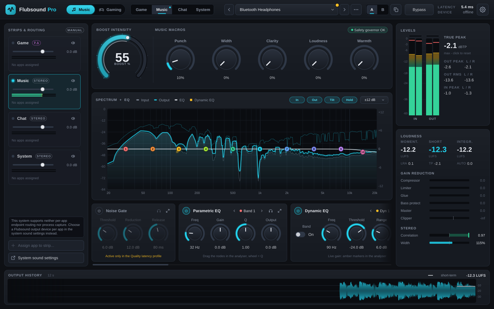
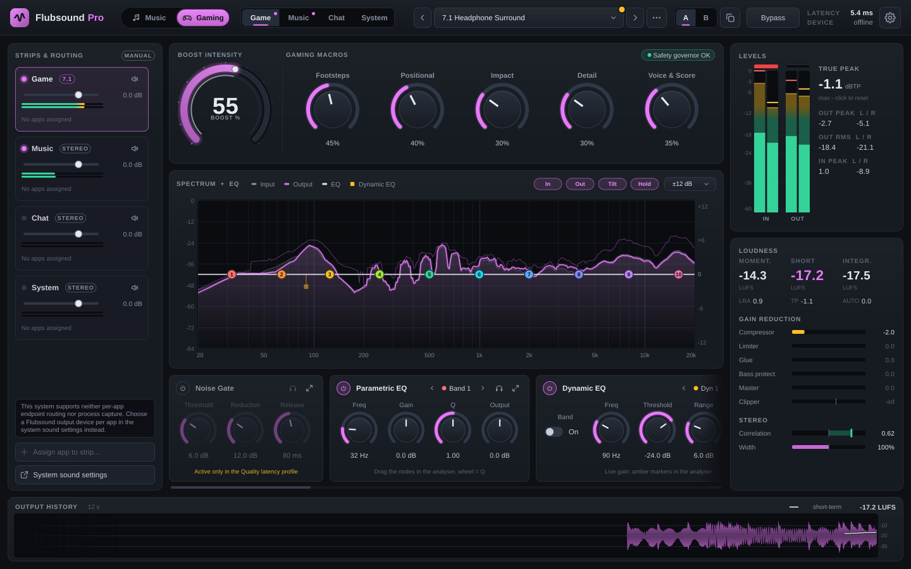
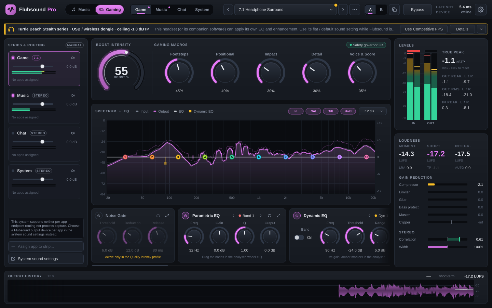
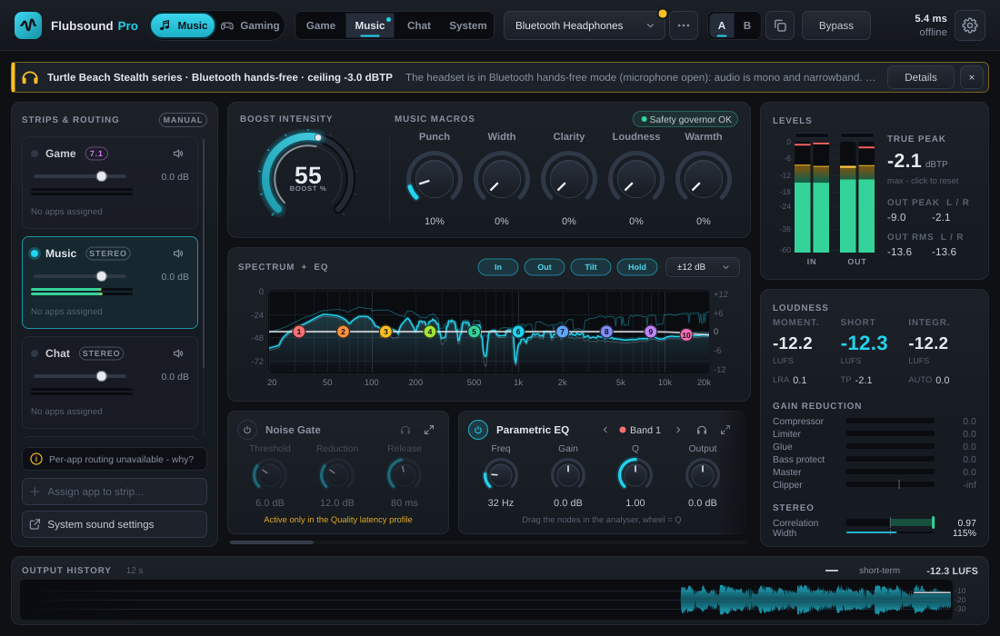
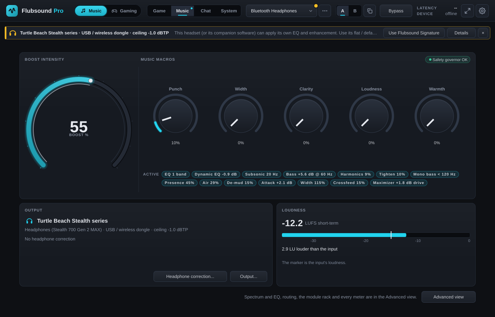
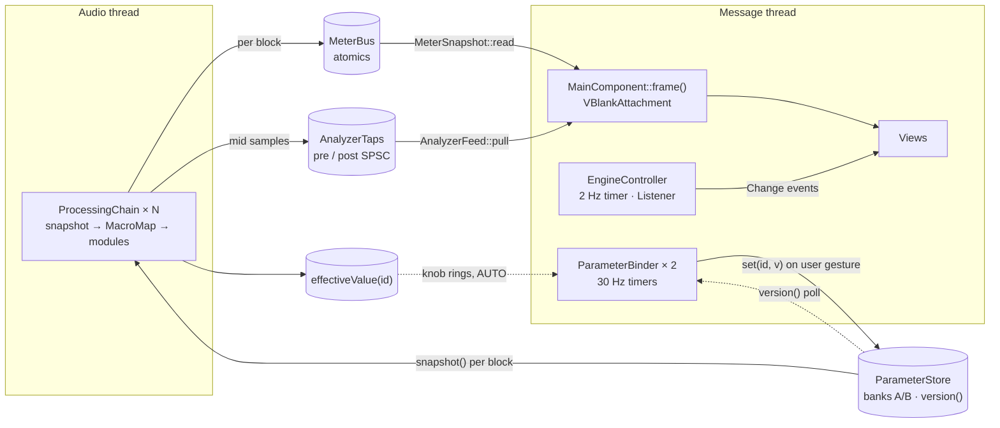
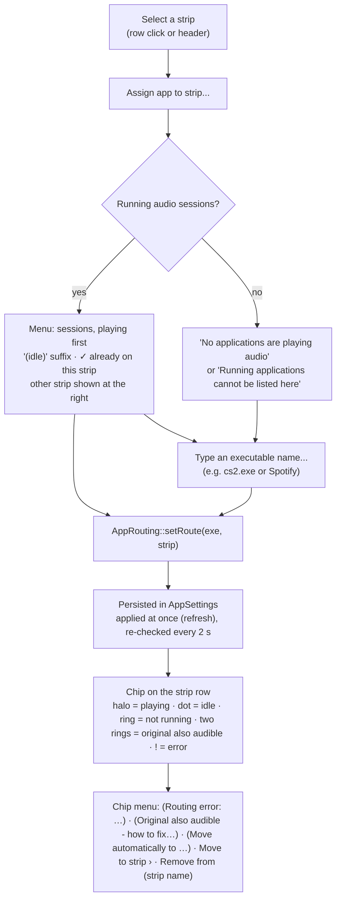

# 06 — GUI Structure & Key Components (Workflow 5)

> The desktop GUI is a native JUCE 9 application: `app/Source/ui` holds the components and `app/Source/shell` holds the window, tray, hotkeys and headless screenshot driver. It is a presentation layer only. It writes parameters and reads telemetry through the three lock-free channels of [`01-architecture.md`](01-architecture.md) §3, and nothing it does can block the audio thread.
>
> This document describes the GUI **as implemented**: design language, layout, component hierarchy, update model, every key component, tray and hotkeys, the per-app routing UX, the device advice banner and the headless screenshot driver. Anything planned rather than built is labelled **Roadmap** with its item number in [`07-roadmap.md`](07-roadmap.md). Examples: the onboarding wizard, the custom plug-in editor and macOS per-app routing.

**Reading conventions**

- Paths are relative to the repository root. `ui/…` is short for `app/Source/ui/…` and `shell/…` for `app/Source/shell/…`.
- A **frame** is one display refresh delivered by `juce::VBlankAttachment`. Rates are quoted at a 60 Hz display. Work scheduled "every N frames" scales with the refresh rate, while ballistics use the measured `dt` and do not.
- Sizes are logical pixels (px). JUCE maps them to physical pixels on HiDPI displays.
- Every number is a constant from the code. Colours are given as `#RRGGBB`; all tokens are fully opaque.

| § | Topic |
|---|---|
| [1](#1-status-at-a-glance) | Status at a glance |
| [2](#2-design-language) | Design language: palette, accent, meters, typography, spacing, controls, accessibility |
| [3](#3-window-and-layout) | Window, annotated wireframe, layout rules, screenshots, Simple view |
| [4](#4-component-hierarchy) | Component hierarchy and wiring |
| [5](#5-threading-and-update-model) | Threading and update model |
| [6](#6-key-components) | Key components, one by one |
| [7](#7-system-tray-and-global-hotkeys) | System tray and global hotkeys |
| [8](#8-per-app-routing-ux) | Per-app routing UX |
| [9](#9-first-run-and-onboarding) | First run and onboarding |
| [10](#10-plug-in-editor-strategy) | Plug-in editor strategy |
| [11](#11-headless-screenshot-driver) | Headless screenshot driver; real-device soak (§11.1) |
| [12](#12-persisted-ui-state) | Persisted UI state |
| [13](#13-known-limitations) | Known limitations |
| [14](#14-requirement-traceability) | Requirement traceability |

---

## 1. Status at a glance

| Area | Status | Code |
|---|---|---|
| Main window, layout and every panel in §6 | Implemented. The data side of the analyser, level meters, loudness panel and waveform history is tested by `flub_app_tests` (`tests/app/test_app_meters.cpp`, §6.4–§6.8); painting is checked by the CI screenshots only, and the layout by those and by the containment test of §3.5 (both views, 800 × 560 to 2560 × 1440; the reflow of §3.3 by `tests/app/test_app_ui_reflow.cpp`) | `ui/*`, `shell/MainWindow.*` |
| Simple view ([11 E39](11-enhancement-report.md#e39)) | Implemented (§3.5): the default view for a new user, the last choice kept; mode, strip, preset, A/B, Bypass, the Boost dial, the five macros, Dynamic Range and Smoothness ([11 E21](11-enhancement-report.md#e21), [E07](11-enhancement-report.md#e07)), up to three rows of active-now chips, the headset status and one loudness meter; the full window one click away. Views, persistence, the layout at 800 × 560 to 2560 × 1440 and the chip wrapping are tested by `tests/app/test_app_ui_simple_view.cpp`, the Dynamic Range / Smoothness row (and their rack keys) by `tests/app/test_app_ui_guards.cpp` | `ui/MainComponent.*`, `ui/SimpleStatusPanel.*`, `ui/BoostPanel.*`, `ui/HeaderBar.*` |
| Progressive disclosure, rest of [11 E39](11-enhancement-report.md#e39) | Implemented: a plain-language hint per parameter key and mode (≤ 140 characters) as the tooltips (§6.3, §6.9; `tests/app/test_app_ui_hints.cpp`), the rack ordered by relevance with the gate card only in Quality (§6.9), the reflow down to an 800 × 560 minimum with a narrow header, a routing drawer and no history below 700 px (§3.3), the tray's quick-controls flyout (§7.1), the Safety Governor's measured-loop and brightness readouts in the loudness panel and the governor chip (§6.3, §6.7; `tests/app/test_app_ui_reflow.cpp`). The moderated user test is not done | `ui/ParamHints.*`, `ui/ModuleRack.*`, `ui/MainComponent.*`, `ui/HeaderBar.*`, `ui/QuickControls.*`, `ui/LoudnessPanel.*`, `shell/TrayIcon.*` |
| Loudness-matched comparisons ([11 E37](11-enhancement-report.md#e37)) | Implemented: the header's A/B (§6.1), a module's and the virtualiser's ear (§6.9), the blind A/B/X test (§6.1b), "proc. +x LU" under Bypass; tested by `tests/app/test_app_ui_compare.cpp`. The true-original tap and live per-side probes in the engine (Phase 3) are not done | `ui/Comparison.*`, `ui/AbxPanel.*`, `ui/HeaderBar.*`, `ui/ModuleRack.*`, `engine/EngineController.*` |
| Preset browser ([11 E40](11-enhancement-report.md#e40)) with a loudness-matched preview ([E37](11-enhancement-report.md#e37)) | Implemented (§6.1a): a click on the header's preset box opens it; search, scope / mode / category / tag filters, favourites, recents, the preset suggested for the output, the description, tags, latency profile and reader warnings; the selected row plays on the strip (the preview plays in the active bank as a never-saved audition bank: Cancel restores it; the autosave, a preset save and an A/B copy during it take the sound from before the preview, so neither a crash nor a save can keep it) with the louder side turned down to the quieter. Tested by `tests/app/test_app_ui_preset_browser.cpp`. No hover audition | `ui/PresetBrowser.*`, `ui/PresetAudition.*`, `ui/HeaderBar.*`, `settings/AppSettings.*` |
| Design system: tokens, look-and-feel, vector icons | Implemented | `ui/Theme.*`, `ui/FlubLookAndFeel.*`, `ui/Widgets.*` |
| Colour-blind safe meter palette | Implemented. It covers the level meters, clip LEDs and strip mini meters, plus the status colours of the loudness panel (gain reduction, clipper, TP, correlation), the muted-strip icon and the app-chip error badge. A few amber/green indicators stay fixed (§2.8) | `ui/Theme.*`, `ui/SettingsDialog.*` |
| Headset / output-device advice banner | Implemented | `ui/DeviceAdviceBanner.*` |
| Device error banner and notice bar ([11 E51](11-enhancement-report.md#e51), [E52](11-enhancement-report.md#e52), [E42](11-enhancement-report.md#e42)) | Implemented (§6.2a): a muted or failed output with Retry / Choose output / Sound settings; preset reader warnings, a restored settings file and the latency-profile prompt. Tested by `tests/app/test_app_ui_status.cpp` | `ui/NoticeBanners.*` |
| Settings dialog: Audio, Correction, Processing, Routing, Hearing, Hotkeys, General, Diagnostics | Implemented, with the feedback-loop guard's per-pair override on the Audio page ([11 E51](11-enhancement-report.md#e51)) and the listening level (the loudness contour following the system volume against a reference volume, off by default, [11 E32](11-enhancement-report.md#e32)) on the Processing page; tested by `tests/app/test_app_night_loopback.cpp` and `tests/app/test_app_listening_level.cpp` (a fake endpoint-volume reader) | `ui/SettingsDialog.*`, `engine/EngineController.*`, `settings/AppSettings.*` |
| Headphone / speaker correction per output device ([11 E15](11-enhancement-report.md#e15) MVP) | Implemented: import an AutoEQ / Equalizer APO ParametricEQ.txt, on / off, compare, remove; stored per output device; automatic preamp. No bundled measurement data, no GraphicEQ, no target curves yet | `ui/SettingsDialog.*` (`CorrectionPage`), `engine/EngineController.*`, `settings/AppSettings.*` |
| System tray / macOS menu-bar icon | Implemented, with the quick-controls flyout (§7.1) | `shell/TrayIcon.*`, `ui/QuickControls.*` |
| Global hotkeys | Implemented on Windows (`RegisterHotKey`), macOS (Carbon `RegisterEventHotKey`) and Linux: `XGrabKey` under X11, the xdg-desktop-portal GlobalShortcuts interface in Wayland sessions ("unsupported" when the desktop has no such portal) | `shell/HotkeyManager.*`, `app/Source/platform/PlatformServices_*` |
| Per-app routing UI | Implemented. Backend support differs per OS (§8). The routing model (`AppRouting`) is tested with a fake router and fake captures (`tests/app/test_app_routing.cpp`); `RoutingPanel`'s strip rows are not (its *Auto profiles* list is, below) | `ui/RoutingPanel.*`, `app/Source/engine/AppRouting.*` |
| Automatic profiles (foreground app → preset) | Implemented (roadmap 2.5, §8.1): rules in the routing panel's *Auto profiles* list. Foreground detection on Windows (`GetForegroundWindow`), macOS (`NSWorkspace.frontmostApplication`) and Linux X11 (`_NET_ACTIVE_WINDOW` + `_NET_WM_PID`); unsupported under Wayland, which the panel says. The decision logic, the controller (with a fake foreground app), persistence and the list / add form are tested by `flub_app_tests` (`tests/app/test_app_auto_profile.cpp`), the X11 query under Xvfb by `flub_tests` (`tests/test_platform_linux.cpp`). The Windows path has been compiled (MinGW) but not run, the macOS path not yet built or run on a Mac | `app/Source/engine/AutoProfile.h`, `EngineController.*`, `ui/RoutingPanel.*`, `app/Source/platform/PlatformServices_*` |
| Headless screenshot driver (incl. `--device` and `--state`) | Implemented; used by CI: the `app` job's Linux step renders three screenshots under `xvfb-run` and uploads them as the `screenshots` artifact (green in CI run 36247109446; nothing is compared against a reference image) | `shell/ScreenshotDriver.*`, `.github/workflows/ci.yml` |
| Onboarding wizard | **Roadmap** 1.6 (device check, OEM enhancements, headphones vs speakers) and 3.6 (wizard) | — |
| Custom plug-in editor sharing these components | **Roadmap** 2.9. Today the plug-in uses JUCE's generic editor plus a toolbar (§10) | `plugin/Source/PluginEditor.*` |
| Export / batch process dialog | Implemented (roadmap 2.10, §6.12): preset menu › *Export / batch process audio files…*. The job (decode, render, write, cancel, refusals, parity with `flubsound-cli`) and the dialog's settings and layout are tested by `flub_app_tests` (`tests/app/test_app_export.cpp`); its painting is not checked by CI | `app/Source/export/*`, `tools/flubsound-cli/OfflineRenderer.*` |
| Start with the OS | Implemented: Windows `HKCU\…\CurrentVersion\Run`, macOS 13+ `SMAppService` login item (older macOS: hidden), Linux XDG autostart entry. Only the Linux path has been run; the Windows path has been compiled (MinGW) but not run, and the macOS path not yet built or run on a Mac | `ui/SettingsDialog.*`, `app/Source/platform/PlatformServices_*` |
| Hearing guard, localisation, accessibility audit, UI motion polish | **Roadmap** 2.11, 3.7, 3.6 | — |

---

## 2. Design language

The visual language rests on five decisions:

- a near-black canvas with raised panels;
- **one accent colour that follows the processing mode**;
- numeric readouts that are legible at a glance;
- vector drawing only (no bitmaps), so every scale factor is crisp;
- three levels of depth, as promised in [`08-pitfalls-and-solutions.md`](08-pitfalls-and-solutions.md): Boost Intensity + 5 mode macros → module cards with 3–5 key controls → the full parameter grid of one module.

### 2.1 Palette tokens

`ui/Theme.h`, namespace `Palette`. Every colour the UI draws with is one of these tokens; nothing else is hard-coded. The names refer to the active theme's `PaletteTokens`: *Settings › General › Theme* switches between the standard dark theme and a high-contrast one (`Theme::setTheme`, §2.8).

| Token | Standard | High contrast | Used for |
|---|---|---|---|
| `background` | `#0E1014` | `#000000` | Content background; edge fades of the module rack |
| `well` | `#0A0C10` | `#000000` | Meter wells, plot backgrounds, text-editor fill |
| `panel` | `#161A21` | `#0C0D10` | Panel base. `drawPanel()` fills a vertical gradient from `panel.brighter (0.035)` at the top to `panel` 160 px down, then draws a 1 px `border` |
| `panelRaised` | `#1C212A` | `#16181C` | Buttons, combo boxes, the advice banner |
| `panelHover` | `#222834` | `#262A31` | Hover states |
| `menu` | `#171B22` | `#0C0D10` | Popup menus |
| `tooltip` | `#1F2530` | `#16181C` | Tooltips, EQ node readouts |
| `tabOn` | `#262D3A` | `#2A2F38` | Selected "tab" button |
| `border` | `#232A35` | `#9AA3B2` | 1 px panel borders and dividers |
| `borderStrong` | `#2F3847` | `#C8CED8` | Control outlines |
| `track` | `#2F3847` | `#606878` | Knob and slider tracks (in high contrast ≥ 3:1 both against the panel and against the accent value arc) |
| `grid` | `#1D232D` | `#3A404A` | Grid lines of the meters and the history |
| `gridMinor`, `gridMajor` | `#141920`, `#232B37` | `#262B33`, `#4A5260` | Analyser frequency lines (minor, decades) |
| `scrollThumb`, `scrollThumbHover` | `#343C4A`, `#4A5466` | `#9AA3B2`, `#D0D6E0` | Scrollbar thumb |
| `text` | `#E6E9EF` | `#FFFFFF` | Primary text, knob pointers, the EQ curve |
| `muted` | `#8A93A3` | `#E2E6EE` | Captions, secondary text, the input (pre) spectrum |
| `faint` | `#7F899B` | `#C3C9D4` | Axis labels, empty states, disabled controls. Was `#5A6373` (2.9:1 on a panel); raised to meet WCAG AA |
| `teal` | `#22D3EE` | `#3DE8FF` | **Music** accent |
| `magenta` | `#E879F9` | `#FFA0FF` | **Gaming** accent; surround channel badges (always magenta) |
| `amber` | `#FBBF24` | `#FFD23F` | Warnings (card notes, hotkey errors, CPU > 70 %), Bypass when on, "preset modified" dot, advice banner, governor limiting. It is also the *warn* status colour of the standard palette (gain-reduction bars, clipper, correlation < 0.3) |
| `red` | `#F87171` | `#FF8080` | The *hot* status colour of the standard palette (app-chip routing errors, correlation < 0, loudness-panel TP over −1 dBTP, clipper over budget, muted-strip icon) |
| `green` | `#34D399` | `#4CF5A8` | "Safety governor OK". It is also the *safe* status colour of the standard palette (correlation ≥ 0.3) |
| `dynamicEq` | `#FBBF24` | `#FFD23F` | Dynamic-EQ ghost markers and the Dyn band dot |
| `meterSafe`, `meterHot` | `#34D399`, `#EF4444` | `#4CF5A8`, `#FF5A5A` | Ends of the standard meter gradient (§2.3) |
| `knobTop`, `knobBottom`, `knobRim` | `#2A313D`, `#171B22`, `#343D4C` | `#2A2F38`, `#16181C`, `#C8CED8` | Knob body gradient and outline |
| `highlight`, `shadow` | white, black | white, black | Translucent sheens and drop shadows |
| `eqBands` | 10 colours | same | EQ band nodes (`EqCurveEditor::bandColour`) |

**Contrast** (WCAG 2.x, `Theme::contrastRatio`; checked for every pair by `tests/app/test_app_accessibility.cpp`):

- *Standard:* every text token (`text`, `muted`, `faint`, the accents and status colours) ≥ 4.5:1 on `background`, `well`, `panel` and the top of the panel gradient; `text` and `muted` ≥ 4.5:1 on `panelRaised`, `panelHover`, `menu` and `tooltip`. Disabled controls (drawn in `faint` on raised surfaces) are exempt in WCAG.
- *High contrast:* every text token ≥ 4.5:1 on every surface (`text` and `muted` ≥ 7:1); borders, tracks, the scrollbar thumb, knob rims, both meter palettes and the EQ band colours ≥ 3:1 on the surfaces they are drawn on.

The `DocumentWindow` background is `#0F1115` (`shell/MainWindow.h`), but it is never visible behind the opaque `MainComponent`.

### 2.2 Mode accent

- **Rule.** `Theme::accentForMode()` returns magenta for Gaming and teal otherwise. The accent is stored in `FlubLookAndFeel::setAccent()`. `applyAccentColours()` re-colours every accent-dependent JUCE colour ID:
  - toggled buttons (20 % alpha) and tick boxes;
  - focused combo and text-editor outlines;
  - popup highlight (16 % alpha);
  - slider fill and track;
  - text-box highlight, caret, label editing outline, hyperlinks.

  Custom components ask for the accent with `Theme::accent (component)`.
- **What follows the accent:**
  - the logo tile and the "Pro" wordmark;
  - active-strip dots and the selected strip row;
  - the output spectrum and its peak-hold line, and the EQ curve fill;
  - the Boost dial and all knob arcs;
  - the SHORT loudness value, the upward-gain and width bars;
  - the waveform envelope and the routing-method pill;
  - the AUTO pill and focus rings.
- **What does not:** the advice banner (amber), surround badges (magenta), meter colours (§2.3), the correlation meter and the tray icon (§7.1).
- **Switching.** `MainComponent::frame()` reads the *selected strip's* `Mode` every frame. On a change, `applyMode()`:
  1. sets the accent;
  2. relabels the macros (`BoostPanel::setMode`);
  3. refreshes the header;
  4. calls `sendLookAndFeelChange()`, which invalidates the cached analyser grid and EQ layer.

  The header's mode thumb slides and cross-fades teal ↔ magenta with a time constant of 55 ms.
- **One look-and-feel.** `FlubsoundApplication` installs `FlubLookAndFeel` as the application default. Dialogs, alert windows, tooltips and the tray menu therefore match the main window. `MainComponent` only creates a private instance if the default is not a `FlubLookAndFeel`.

### 2.3 Meter palette

| Palette | safe | warn | hot | Selection |
|---|---|---|---|---|
| Standard | `meterSafe` `#34D399` | `amber` `#FBBF24` | `meterHot` `#EF4444` (high-contrast theme: `#4CF5A8` / `#FFD23F` / `#FF5A5A`) | Settings › Processing › Meter colours |
| Colour-blind safe (Okabe–Ito) | `#56B4E9` sky blue | `#F0E442` yellow | `#D55E00` vermillion | same; persisted as `ui.meterPalette = 1` |

- **Zones** (`Theme::meterColourForDb`, used for peak-hold lines): ≥ −3 dBFS is *hot*, ≥ −12 dBFS is *warn*, anything lower is *safe*.
- **Bar gradient** (`LevelMeters::gradient`). The stops are placed in meter-deflection coordinates (§6.6):
  - *safe* up to −14 dBFS;
  - blend to *warn* at −10 dBFS and hold it to −4 dBFS;
  - *hot* from −2 dBFS to 0 dBFS.
- **Users of the meter colours** (`Theme::meterColours`): the level-meter bars, the peak-hold lines, the clip LEDs, the strip mini meters in the routing panel and the TRUE PEAK readout when it is above −1 dBTP.
- **Status colours** (`Theme::statusColours`). These are for indicators that encode a state by colour outside the level bars. The standard palette gives the UI's own `green` / `amber` / `red` (`#34D399` / `#FBBF24` / `#F87171`, note *hot* is `red`, not the meter's `#EF4444`). The colour-blind safe palette gives the same Okabe–Ito triple as above. Users:
  - the loudness panel's gain-reduction bars (*warn*), clipper bar (*warn*, *hot* over budget), TP readout (*hot*) and correlation meter (*hot* / *warn* / *safe*);
  - the muted-strip icon (*hot*);
  - the app-chip error badge and outline in the routing panel (*hot*);
  - the input level bar of the Settings › Audio device selector (*hot* above 0.95).
- **Switching** the palette in Settings calls `MainComponent::sendLookAndFeelChange()`, so views that cache palette colours (the routing rows' mute icons) refresh at once.

### 2.4 Categorical colours: EQ bands

`EqCurveEditor::bandColour()` (the `Palette::eqBands` token; both themes use the same colours, each ≥ 3:1 on the high-contrast black):

| Band | 1 | 2 | 3 | 4 | 5 | 6 | 7 | 8 | 9 | 10 |
|---|---|---|---|---|---|---|---|---|---|---|
| Colour | `#F87171` | `#FB923C` | `#FBBF24` | `#A3E635` | `#34D399` | `#22D3EE` | `#60A5FA` | `#818CF8` | `#C084FC` | `#F472B6` |

Every node also carries its band number, so band identity is never conveyed by colour alone. The EQ module card shows the same colour as a dot next to "Band N".

### 2.5 Typography

**Family.** `Theme::fontFamily()` runs once and picks the first installed face from this list: Inter, Inter Variable, Segoe UI Variable Text, Segoe UI, SF Pro Text, Helvetica Neue, Roboto, Noto Sans, Open Sans, Cantarell, Liberation Sans. If none is installed it falls back to JUCE's default sans. The chosen face is also set as the look-and-feel's default sans typeface, so JUCE's own dialogs use it.

| Role | Helper | Style | Examples |
|---|---|---|---|
| Caption | `Theme::caption (h = 11)` | bold, kerning +0.08, upper case by convention | `LOUDNESS`, `BOOST INTENSITY`; pills at ≤ 10 px |
| Numeric | `Theme::numeric (h, bold = true)` | kerning +0.01 | TRUE PEAK 24 px; LUFS 21 px (25 px for SHORT); Boost value 22–46 px; header latency 12.5 px; knob value boxes 12 px regular |
| Body | `Theme::font (h, bold)` | plain / bold | card titles 13 px bold; labels 11.5–13 px; axis labels 9.5–10.5 px |
| Wordmark | `Theme::font` | 17 px bold, 15 px when compact | "Flubsound" in `text` + "Pro" in the accent |

Formatting helpers:

| Helper | Output |
|---|---|
| `Theme::formatDb` | `"-inf"` at ≤ −99 dB or for non-finite input |
| `Theme::formatSignedDb` | explicit `+` / `-`; a value that rounds to `"0.0"` gets no sign |
| `Theme::formatLufs` | `"--.-"` at ≤ −70 LUFS |

### 2.6 Shape, spacing and elevation

| Token | Value |
|---|---|
| Panel radius (`Theme::kPanelRadius`) | 10 px |
| Control radius (`Theme::kControlRadius`) | 6 px: framed icon buttons, combo boxes, banner, analyser plot well |
| Module card / strip row radius | 8 px / 7 px |
| Window margin / gap between panels | 12 px / 10 px |
| Header height | 56 px |
| Advice banner height (`DeviceAdviceBanner::kHeight`) | 34 px, plus a 10 px gap |
| Panel inner padding | 12–14 px horizontal (module cards 10 px), 8–12 px vertical |
| Control heights | 32 px in the header (34 px mode switch); 30 px for settings rows and routing buttons; 26 px module-card header |

**Elevation.** Panels use the gradient fill plus a 1 px border. Framed controls use `Theme::sheen()`, a subtle vertical gradient.

### 2.7 Control vocabulary

`FlubLookAndFeel` draws every stock JUCE widget. A style is chosen with the component property `flubStyle` (`Style::set (component, "tab")`), so plain `juce::TextButton` / `ToggleButton` / `Slider` objects are used throughout.

| Widget | Style | Look | Used by |
|---|---|---|---|
| `TextButton` | `tab` | neutral; ON = raised fill + 2 px accent underline | strip selector, A/B, settings navigation |
| | `chip` | pill; ON = accent tint + accent text | analyser In / Out / Tilt / Hold |
| | `warning` | amber tint and outline while toggled on | Bypass |
| | *(none)* | raised `panelRaised` sheen + `borderStrong` outline; ON = accent tint and outline | banner buttons, dialog buttons |
| `ToggleButton` | `power` | round power icon; accent while on | module enable |
| | `switch` | pill switch + label | Dyn EQ band On, settings toggles, `ParamGrid` toggles |
| | *(none)* | tick box + label | — |
| `Slider`, rotary | — | 270° sweep from `kRotaryStart = 1.25π` to `kRotaryEnd = 2.75π` (−135°…+135°). Bipolar ranges grow from their zero point. Optional *effective-value* ring | `ParamKnob`; `BoostDial` uses the same angles |
| `Slider`, linear | — | 4 px track, 12 px thumb; bipolar ranges grow from 0 | strip gain |
| `IconButton` | Ghost / Framed / Round | vector icon, optional text | header, cards, routing footer |

**Knob anatomy** (`drawRotarySlider`):

- The track is `clamp (0.075 · size, 2.5, 6)` px wide.
- The value arc has a 16 %-alpha halo 4 px wider than the track.
- The body is a gradient disc with a pointer; a keyboard-focus ring is drawn in the accent at 55 %.
- **Effective-value ring.** The `flubEffective` property is set by `ParameterBinder` (§5.4). When the effective value differs from the knob position by more than 0.004 of the travel, a 1.5 px outer arc runs from the knob value to the effective value and ends in a 4 px dot. This is how Boost Intensity and the macros become visible on the module knobs they drive. The effective value also carries the engine's mode and format overrides, so the ring shows what is applied: crossfeed 0 in Gaming, width 1 / space 0 / crossfeed 0 under the binaural lock, air 0 below 42 kHz, and ratio 1:1 for a Gaming compressor that only macros switched on ([03 §14.1](03-dsp-design.md#141-base-values-effective-values-and-the-macro-formula)).

**`ParamKnob`** (`ui/ParamKnob.*`) is caption above, knob, value box below.

| Size | Preferred size | Used in |
|---|---|---|
| Small | 64 × 78 | full parameter grids |
| Medium | 70 × 90 | module cards |
| Large | 84 × 106 | macros |

The drag sensitivity is 220 px for full travel, and velocity mode is off. Clicking the value box lets the user type a value.

**Icons** (`ui/Widgets.h`) are paths on a 24 × 24 design grid, stroked with round caps (1.7 px by default): gear, chevrons, more, copy, power, expand, collapse, ear, plus, close, reset, external, music note, gamepad, speaker, speaker-muted and the logo.

### 2.8 Accessibility

**Implemented**

- **Names and descriptions.** Every custom component sets a title and a description, for example "Spectrum analyser — Input and output spectrum of the selected strip, 20 Hz to 20 kHz". Every bound slider gets the parameter name as its title. Its help text reads "*Name* (double-click to reset to *default*)" (`ParamFormat::configureSlider`). `IconButton` uses its accessible name as its title. `Style::describe()` sets title, help text and tooltip in one call.
- **Keyboard.**
  - Focus rings are drawn on knobs, sliders, buttons, toggles, combo boxes, the mode segments, the Boost dial and the EQ plot.
  - The EQ curve is fully keyboard-editable (§6.5).
  - Esc collapses an expanded module card and closes the settings dialog.
  - Alert windows bind Return and Esc.
- **Redundant coding.** EQ nodes are numbered. The mode switch shows a label and an icon. The governor chip states its status in words. Every bar has a numeric readout. App chips draw their state as a shape (§6.10) and name it in their tooltip and in the strip row's accessible description.
- **Meters.** A colour-blind safe palette (§2.3) for the level meters and the status colours of the loudness panel and routing rows.
- **Tooltips** appear after 650 ms. They are disabled in headless screenshot runs.
- **HiDPI.** All drawing is vector. The cached analyser grid and EQ layer are rendered at the physical pixel scale and re-rendered when that scale changes.
- **UI scale.** *Settings › General › UI scale*: *Follow system* (default: only the OS's display scaling) or 75, 90, 100, 110, 125, 150, 175 or 200 % (`AppSettings::getUiScalePercent`, key `ui.scalePercent`; other values are clamped to 75–200 %). `Theme::applyUiScale` sets `juce::Desktop::setGlobalScaleFactor`, so every window, dialog, menu and tooltip scales, text is laid out at the physical resolution (crisp) and mouse hit-testing uses the scaled coordinates. It applies at once and at start-up (before the main window restores its position). Windows keep their size in logical pixels, so they grow on screen: the main window (design minimum 1100 × 700), the settings dialog (720 × 580) and the export dialog (720 × 560) register their minimum with `Theme::setMinimumWindowSize`, which caps it at the display's user area and shrinks a window that no longer fits (`Theme::minimumWindowSize`).
- **High contrast.** *Settings › General › Theme › High contrast* (key `ui.theme`): black surfaces, white text, bright borders and a mid-grey knob track (§2.1), meeting WCAG AA. `Theme::setTheme` re-points `Palette::`, re-applies the colours of every `FlubLookAndFeel` (the mode accent follows), re-maps colours that components set explicitly from the old palette (`Theme::remapComponentColours`) and sends every window a look-and-feel change, so cached layers are redrawn; nothing needs a restart. The colour-blind meter palette (§2.3) combines with either theme.

**Gaps** (**Roadmap** 3.6, accessibility audit)

- The custom-drawn views (spectrum, meters, loudness, history) expose a title and description but not their live values. No custom `AccessibilityHandler` exists.
- Some indicators keep fixed colours whatever the palette:
  - the governor chip and inner arc (green/amber; the chip also states its status in words);
  - the CPU readout (amber over 70 %, or a peak callback at 90 % or more);
  - the preset-modified dot and the card warning notes (amber).
- The high-contrast theme is chosen in the app only; it does not follow the OS's high-contrast / increased-contrast setting.

---

## 3. Window and layout

### 3.1 Window

`shell/MainWindow.*` is a `DocumentWindow` titled "Flubsound Pro":

- native title bar, resizable;
- **minimum 800 × 560** ([11 E39](11-enhancement-report.md#e39): below 1100 × 700 the layout reflows, §3.3), default 1280 × 820, centred on first start;
- position and size saved in `AppSettings` when the window is closed and at shutdown;
- two views of the same window: **Simple** (§3.5, the default until the user picks one) and **Advanced** (§3.2–§3.4, every panel). The header's view button switches them and the choice is kept (`ui.view`, §12). Both views share the minimum size.

The close button is handled by the application: it either closes to the tray or quits (§7.1). For headless screenshots, `setExactContentSize()` lifts the minimum.

The content is `ui::MainComponent`: opaque, 1280 × 820 initially, keyboard-focusable. The layout comment in `ui/MainComponent.h` targets 800 × 560 up to 2560 × 1440; the resize limit itself is 16384 × 16384.

### 3.2 Annotated wireframe

This is the **Advanced** view (the Simple view is §3.5). The proportions follow the 1440 × 900 screenshots in §3.4; exact sizes are in §3.3.

```
+------------------------------------------------------------------------------------------------+ y 0
| HEADERBAR  56 px                                                                               |
| [logo Flubsound Pro] [Music|Gaming] [Game|Music|Chat|System]  [<][preset      v][>][...]       |
|                                        [A|B][copy] [Bypass] LATENCY 5.4 ms [view][gear]        |
+------------------------------------------------------------------------------------------------+ y 56
| DEVICE ERROR BANNER  34 px + 10 px gap (only while the output is muted or the device failed)  |
| [!] Audio device error  message...                  [Retry][Choose output][Sound settings]     |
| DEVICE ADVICE BANNER  34 px + 10 px gap (only for a recognised headset or a Bluetooth link)    |
| [headphones] Family . connection . ceiling -x.x dBTP  advice...  [Use <preset>][Details][x]    |
| NOTICE BAR  34 px + 10 px gap (only while a notice waits)                                      |
| [!] Preset "X": unknown parameter "bost" ignored ...          +1 more  [Use Quality][x]        |
+------------------+-----------------------------------------------+-----------------------------+ y 68 (+44 with banner)
| STRIPS & ROUTING | BOOST INTENSITY        MUSIC|GAMING MACROS    | LEVELS                      |
|        [MANUAL]  | ( 55 ) | (o)  (o)  (o)  (o)  (o)  [governor]  | IN  OUT | TRUE PEAK -2.1    |
| +--------------+ |  dial  |  5 macro knobs (captions per mode)   | ||  ||  | OUT PEAK L/R      |
| |* Game   [7.1]| +-----------------------------------------------+ ||  ||  | OUT RMS  L/R      |
| | gain  ----o  | | SPECTRUM + EQ   [In][Out][Tilt][Hold][+-12 dB]| ||  ||  | IN PEAK  L/R      |
| | mini meter   | |  0 dB __________________________________ +12  +-----------------------------+
| | app chips    | |     input spectrum (grey fill)                | LOUDNESS                    |
| +--------------+ |     output spectrum (accent) + peak hold      | MOMENT.   SHORT   INTEGR.   |
| | Music STEREO | |     EQ curve, numbered nodes 1..10            | LRA       TP      AUTO      |
| | Chat  ...    | |     dynamic-EQ ghost markers (amber)          | GAIN REDUCTION              |
| | System ...   | | -84 dB ______________________________ -12     |  Compressor  Limiter  Glue  |
|                  |   20  50  100  200  500  1k  2k  5k  10k  20k |  Bass protect  Master       |
|                  +-----------------------------------------------+  Clipper (-30 dB budget)    |
|                  | [Noise Gate][Parametric EQ][Dynamic EQ][Ba -> | STEREO                      |
| [+ Assign app..] |  module cards, horizontal scroll; one card    |  Correlation     Width      |
| [System sound..] |  can expand to fill the whole rack            |                             |
+------------------+-----------------------------------------------+-----------------------------+
| OUTPUT HISTORY  12 s        mirrored min/max envelope + short-term LUFS trace    -12.3 LUFS    |
+------------------------------------------------------------------------------------------------+
```

### 3.3 Layout rules

`MainComponent::resized()`. `W` is the component width. `C` is the content height below the header (and the banner, if shown) inside the 12 px margins. `H` is `C` minus the history and its 10 px gap. `R` is the centre-column height left below the Boost panel and its gap.

| Region | Rule |
|---|---|
| Header | top 56 px, full width |
| Banners | device error, device advice, notice bar in that order, each `DeviceAdviceBanner::kHeight` = 34 px + 10 px gap, only when its `shouldShow()` |
| Output history | bottom, `clamp (C / 8, 76, 128)` px (integer division); left out while the window is under 700 px high |
| Routing panel | left, `clamp (round (0.17 · W), 228, 300)` px wide; under 1100 px of width a drawer instead (below) |
| Right column | right, `clamp (round (0.19 · W), 252, 320)` px wide; under 1100 px `clamp (round (0.23 · W), 220, 252)` |
| Level meters | top of right column, `clamp (max (round (0.36 · H), H − 480 − 10), 196, 560)` px. The loudness panel's content is about 420 px with its PROTECTION section (§6.7), so tall windows give the spare height to the meters |
| Loudness panel | rest of the right column |
| Boost panel | top of the centre column, `clamp (round (0.27 · H), 150, 212)` px |
| Module rack | bottom of the centre column: `clamp (round (0.36 · R), 150, 200)` px, or `round (0.64 · R)` while a card is expanded |
| Analyser panel | whatever remains in the centre column |

The same rules, computed at the sizes used in this document:

| Geometry (px) | routing w | centre w | right w | history h | levels h | loudness h | boost h | analyser h | rack h |
|---|---|---|---|---|---|---|---|---|---|
| 1280 × 820 (default) | 228 | 756 | 252 | 92 | 230 | 398 | 172 | 282 | 164 |
| 1440 × 900 | 245 | 877 | 274 | 102 | 255 | 443 | 191 | 314 | 183 |
| 1440 × 900 + banner | 245 | 877 | 274 | 97 | 241 | 418 | 181 | 296 | 172 |
| 1100 × 700 + banner | 228 | 576 | 252 | 76 | 196 | 284 | 150 | 170 | 150 |
| 1093 × 614 (a 1366 × 768 laptop at 125 %) | drawer | 808 | 251 | — | 196 | 328 | 150 | 214 | 150 |
| 800 × 560 (minimum) | drawer | 546 | 220 | — | 196 | 274 | 150 | 160 | 150 |

At 1440 × 900 an expanded module card takes 324 px, leaving the analyser 173 px.

**Adaptive behaviour**

- **Header** is *compact* below 1280 px width:
  - logo area 136 px instead of 160;
  - mode switch 152 px instead of 176;
  - strip buttons 54 px instead of 60;
  - the LATENCY / CPU captions are hidden.

  The view button ([11 E39](11-enhancement-report.md#e39), 34 px plus a 4 px gap, left of the gear) is shown at every width and takes that much from the preset area. The preset ‹ › arrows are hidden whenever the preset area minus the menu and arrow widths is under 180 px. The preset combo is at most 300 px wide (250 compact).
- **Header, narrow** (under `HeaderBar::kNarrowWidth` = 1100 px, [11 E39](11-enhancement-report.md#e39)): the logo is the mark alone (34 px), the strip buttons become a 100 px strip menu, and the copy button and the latency / CPU readout leave for an **overflow button** (…, left of the view button) whose menu holds the readout's line (latency, CPU, a device problem), *Copy A to B*, the *Loudness-matched A/B* switch, *Blind test (A/B/X)…*, *Routing and strips…* and *Settings…*. At 800 px the preset combo keeps about 155 px.
- **Routing panel, narrow.** Under 1100 px the panel leaves the row; *Routing and strips…* in the overflow menu opens it as a 280 px drawer over the analyser, below the banners (Escape or the same item closes it; a wider window puts it back in its column).
- **Short windows.** Under 700 px of height the output history is left out; the analyser keeps the height (160 px at 800 × 560).
- **Loudness panel, narrow.** At 220 px some readouts are cut with an ellipsis (*IN>OUT +2.8…*); their full values are in the Simple view's loudness meter and the tooltip.
- **Routing panel.** If the red *No apps are being processed* notice (§6.10) does not fit above the strip rows at full length, it collapses to one line, *"No apps are being processed - why?"* (*"No apps processed - why?"* when that does not fit either). The full text is in its tooltip, and clicking opens it in an alert.
- **Level meters.** Scale labels are skipped when they would be closer than 11.5 px; grid lines are always drawn. Each numeric readout is only drawn if at least 30 px remain.
- **Module rack.** Cards keep their preferred width, `max (220, keys · 72 + 28)` px, and scroll horizontally with a 10 px scrollbar and 36 px edge fades. The cards are ordered by relevance to the mode (§6.9), so the first ones in view are the ones a listener reaches for; the Noise Gate card is shown only in the Quality profile. The nine or ten cards need over 3,000 px, so on practical window sizes the rack always scrolls. Only when everything fits is the spare width spread over the cards.
- **Analyser legend** is drawn only when all four entries fit left of the option chips.

### 3.4 Screenshots

All four images are real renders of the app by the headless driver (§11). No audio device is open; the engine runs on synthetic programme material.



*`--screenshot app-music.png --mode music --size 1440x900`.*

- The Music strip is selected and the accent is teal.
- The preset is *Bluetooth Headphones* because the driver loads the first factory preset whose mode is Music, and the factory list is ordered by category, then name. The amber dot on the preset box means *modified*: the driver raised Boost to 55 % after loading.
- `LATENCY 5.4 ms` / `DEVICE offline`: with no device there are no device buffers. The readout is the engine latency alone, 260 samples at 48 kHz: the largest strip chain (192 samples, Balanced) plus the master safety limiter (1 ms look-ahead = 48 samples + 20 samples of true-peak detector delay). The screenshot predates docs/11 E42a / E51: a current build shows `--` without a running device (no audible path), and an estimate such as `~12.3 ms` only while one runs.
- The routing notice appears because the CI container has no routing back-end. The screenshot predates docs/11 E47a: a current build draws it as the red *No apps are being processed* state under the panel header (§6.10).



*`--mode gaming`.*

- The Game strip (7.1) is selected and the accent is magenta.
- The driver plays a 7.1 game scene on Game and music at −12 dB on the Music strip, so both strips show activity dots.
- The single amber diamond near 90 Hz is the live gain of the Gaming *anti-masking* mode band (dynamic-EQ band 6). The screenshot predates docs/11 E19 and E20: that band is now this preset's user band 0 (same 90 Hz shelf, so its diamond sits in the same place), and the footstep bands 4 / 5 are the cue enhancer, which shows a diamond at 3.2 kHz / 260 Hz only while a cue rises out of the ambience (up to +3.2 / +1.4 dB at this preset's Footsteps 45 %; a marker is drawn from 0.1 dB).
- The compressor shows −2.0 dB of gain reduction (*7.1 Headphone Surround* sets a 1.5:1 ratio, so its downward section stays in force).



*`--mode gaming --device "Headphones (Stealth 700 Gen 2 MAX)"`.*

- The simulated output matches the *Turtle Beach Stealth series* profile on a USB / wireless-dongle connection, with a −1.0 dBTP ceiling.
- The banner shows the top piece of advice and offers *Use Competitive FPS*. The screenshot predates docs/11 E16's app half: a current build asks instead, for this profile with its own enhancement, *Is the headset's own enhancement on (Superhuman Hearing, on-board EQ or surround)?* with *Yes, it is ON* / *No*, until the output endpoint has an answer (stored per endpoint; also the switch *Headset enhancement (Superhuman Hearing / on-board EQ) is ON* on Settings › Audio). *Yes* caps Footsteps and Detail at 30 % and holds the virtualiser off on every strip, and the Boost panel shows CAPPED beside those two macros (`--state onboard-cap`).
- Everything below the header moves down by 44 px (34 px banner + 10 px gap).



*`--size 1100x700 --mode music`, with `--device` naming a Stealth-series endpoint on a Bluetooth **hands-free** connection.* The minimum window size shows most of the adaptive rules of §3.3:

- The ceiling is −3.0 dBTP.
- There is no *Use …* button: the suggested preset (*Bluetooth Headphones*) is already loaded.
- The header is compact: no LATENCY caption, no preset arrows.
- The routing notice is the one-line form (in a current build the red *"No apps are being processed - why?"*, §6.10).
- The IN PEAK readout is dropped, and the −3 dB meter label is skipped.
- The analyser legend is hidden, and the rack shows two cards with its scrollbar.

### 3.5 Simple view

[11 E39](11-enhancement-report.md#e39): a reduced main window for listeners who do not want the engineer's rack. It is the view a new user sees; after that the last choice is kept (`AppSettings::getMainView`, key `ui.view`: anything but `advanced`, including no value, is Simple). The header, the banners and every control in them are the same as in the Advanced view; below them `MainComponent::layoutSimple` shows two parts and hides the routing panel, analyser, module rack, level meters, loudness panel and output history (`MainComponent::getAdvancedOnlyComponents`).

```
+------------------------------------------------------------------------------------------------+
| HEADERBAR: mode, strips, preset, A/B, Bypass, latency / CPU, [view: Advanced], settings        |
+------------------------------------------------------------------------------------------------+
| banners (device error, device advice, notice bar), as in the Advanced view                     |
|        +--------------------------------------------------------------------------------+      |
|        | BOOST INTENSITY            MUSIC MACROS                     [Safety governor OK] |      |
|        |    ( 55 )     |   (o)     (o)     (o)     (o)     (o)                           |      |
|        |   dial        |  Punch  Width  Clarity  Loudness  Warmth                        |      |
|        |   <= 280 px   |  DYNAMIC RANGE [Off      v]    SMOOTHNESS [====o-----]  0 %     |      |
|        |               |  ACTIVE [EQ 1 band] [Subsonic 20 Hz] [Bass +5.6 dB @ 60 Hz] ... |      |
|        |               |         [Presence 45%] [Air 29%] ...    (up to three rows)      |      |
|        +------------------------------------------+-------------------------------------+      |
|        | OUTPUT                                   | LOUDNESS                            |      |
|        | [ear] Turtle Beach Stealth series        | -12.2 LUFS short-term               |      |
|        | device . connection . ceiling -1.0 dBTP  | [==========|=====        ]          |      |
|        | No headphone correction                  | 2.9 LU louder than the input        |      |
|        |          [Headphone correction...][Output...]                                  |      |
|        +------------------------------------------+-------------------------------------+      |
|        | Spectrum and EQ, routing, the module rack ... in the Advanced view. [Advanced view]    |
+------------------------------------------------------------------------------------------------+
```

| Region | Rule |
|---|---|
| Content width | the area under the banners inside the 12 px margins, at most 1180 px wide, centred |
| Status row (`SimpleStatusPanel`) | `clamp (round (0.40 · C), 200, 260)` px: the two cards over a 34 px footer and a 10 px gap; the OUTPUT card takes 56 % of the width |
| Boost panel (Simple layout) | `clamp (C − status − 10, 150, 380)` px, above the status row; spare height is split above and below the pair |
| Boost dial | as tall as the panel allows, 104–280 px (Advanced: 104–196) |
| Macro knobs | at most 124 × 156 px in cells at most 170 px apart (Advanced: 96 × 124) |
| Dynamic Range / Smoothness | one 24 px row between the knobs and the chips while the knobs keep about 118 px and one chip row fits; hidden in the Advanced view, whose rack has them (§6.9) |
| Active-now chips | up to three 20 px rows (one row more while the knobs keep about 118 px), wrapped (`BoostPanel::layoutChips`); the last row keeps 34 px free for the *+N* of what does not fit (Advanced: one row) |

- **OUTPUT** is the headset status (`SimpleStatusPanel::describeOutput`): the matched profile, or the device name as a *generic output, no headset profile*, then the connection, the safety ceiling the master limiter applies and the device correction ([11 E15](11-enhancement-report.md#e15): *Headphone correction: HD 600.txt (on)* or *No headphone correction*). A device problem (§6.2a) prefixes *Output muted: feedback loop* / *Audio device error* in the hot status colour. The first advice message is shown only while the advice banner is not (dismissed, or no profile). **Headphone correction…** and **Output…** open Settings on the Correction and Audio pages.
- **DYNAMIC RANGE and SMOOTHNESS** ([11 E21](11-enhancement-report.md#e21), [11 E07](11-enhancement-report.md#e07)) are the two listener controls beside the macros, on the selected strip: `guard.range` (*Off*, *20 LU*, *15 LU*, *10 LU (Balanced)*, *6 LU (Shield)*: the Startle Guard holds a sudden loud event to that much over the level before it, and in Gaming mode the Tame band takes the explosion's low end down with it) and `smooth.amount` (0–100 %: takes back the sibilance and harshness Boost and the macros added, never the source's own). Both are off by default and saved with the preset.
- **LOUDNESS** is the one loudness meter: the selected strip's output short-term loudness as a number and a bar from −36 to 0 LUFS (accent), the input's as a marker, and in words what the strip does to it (`SimpleStatusPanel::describeLoudnessChange`: *2.9 LU louder than the input*, *… quieter …*, *About as loud as the input* within 0.5 LU, *No audio on this strip right now*). Repainted at ≤ 10 Hz.
- **Frame loop.** The analyser taps are still drained, but the Simple view skips the analyser's FFTs, the EQ editor and the rack's engine poll; the rack is refreshed once when the Advanced view comes back.
- **Switching.** The header's view button (expand arrows: *Advanced view*; collapse arrows: *Simple view*) and the footer's **Advanced view** button; an expanded module card is collapsed first. Focus that was on the button moves to the header's view button.
- **Checked.** `tests/app/test_app_ui_simple_view.cpp`: in both views at 1100 × 700 (also with the advice banner and a notice), 1280 × 820, 1920 × 1080 and 2560 × 1440 every visible child lies inside its parent (a `Viewport`'s content excepted), and in the Simple view the header, the Boost dial (≥ 104 px), all five macros, the status row and the Advanced view button are shown without overlap; Signature at Boost 55 shows all 11 active-now chips where the Advanced view's single row shows 3 and *+8*. `tests/app/test_app_ui_guards.cpp`: the Dynamic Range and Smoothness row is shown at 1100 × 700, 1280 × 820 and 2560 × 1440 inside the panel, clear of the knobs, with three chip rows still at 1280 × 820, hidden in the Advanced view, and writes the selected strip.

Headless renders (`--view simple`, §11) were inspected at 1280 × 820 at 100 % and 150 % UI scale and in the high-contrast theme, and at 1100 × 700 with the advice banner and a notice:



*`--screenshot app-simple-view.png --mode music --size 1280x820 --view simple --device "Headphones (Stealth 700 Gen 2 MAX)"`.*

Since Phase 3 batch 2 ([11 E39](11-enhancement-report.md#e39)): every parameter has a "what you will hear" hint as its tooltip (`ui/ParamHints.*`, §6.9), the rack is ordered by relevance without the gate card outside Quality, the window reflows down to 800 × 560 (§3.3) and the tray has a compact flyout (§7.1). Still open: the moderated test with 6–8 non-experts and the SUS comparison.

---

## 4. Component hierarchy

```
FlubsoundApplication                        app/Source/FlubsoundApplication.*
├─ FlubLookAndFeel (application default)    ui/FlubLookAndFeel.*
├─ EngineController                         app/Source/engine/EngineController.*
├─ MainWindow  (DocumentWindow)             shell/MainWindow.*
│  └─ MainComponent                         ui/MainComponent.*    EngineController::Listener + VBlankAttachment
│     ├─ HeaderBar                          ui/HeaderBar.*
│     │  ├─ ModeSegment ×2 (Music, Gaming)  custom Button, sliding thumb painted by the header
│     │  ├─ TextButton ×N strips ("tab")    one per strip, activity dot painted over
│     │  ├─ IconButton ‹  PresetBox (its pop-up is the browser)  IconButton ›  IconButton … (preset actions)
│     │  ├─ TextButton A | B ("tab") + IconButton copy
│     │  ├─ PopupButton Bypass ("warning"; right-click = options)
│     │  ├─ IconButton view (Simple ↔ Advanced)
│     │  └─ IconButton settings (gear)
│     ├─ DeviceErrorBanner                  ui/NoticeBanners.*        only while the output is muted / failed / on a fallback
│     │  └─ TextButton "Retry", "Choose output", "Sound settings"
│     ├─ DeviceAdviceBanner                 ui/DeviceAdviceBanner.*   hidden unless relevant
│     │  └─ TextButton "Use <preset>", "Details", "×"
│     ├─ NoticeBar                          ui/NoticeBanners.*        only while a notice waits
│     │  └─ TextButton action (optional), "×"
│     ├─ RoutingPanel                       ui/RoutingPanel.*         Advanced view only (like the analyser, rack, meters, history)
│     │  ├─ Viewport → StripRow ×N          LED, name, channel badge, mute IconButton, gain Slider,
│     │  │                                   mini meter, application chips
│     │  ├─ IconButton "Assign app to strip..."
│     │  └─ IconButton "System sound settings"
│     ├─ BoostPanel                         ui/BoostPanel.*           owns a ParameterBinder
│     │  ├─ BoostDial (juce::Slider)
│     │  └─ ParamKnob ×5 (Large)            ui/ParamKnob.*        Standard or Simple layout
│     ├─ AnalyzerPanel                      ui/AnalyzerPanel.*
│     │  ├─ SpectrumAnalyzer                ui/SpectrumAnalyzer.*
│     │  ├─ EqCurveEditor (same bounds, on top)  ui/EqCurveEditor.*
│     │  └─ TextButton ×4 ("chip") + ComboBox EQ range
│     ├─ ModuleRack                         ui/ModuleRack.*           owns a ParameterBinder
│     │  └─ Viewport → ModuleCard ×10       ui/ModuleCard.*
│     │     ├─ ToggleButton power, IconButton ear, IconButton expand, IconButton ‹ › (banded)
│     │     ├─ key controls: ParamKnob | ComboBox | ToggleButton ("switch")
│     │     └─ (expanded) Viewport → ParamGrid   ui/ParamGrid.*
│     ├─ LevelMeters                        ui/LevelMeters.*
│     ├─ LoudnessPanel                      ui/LoudnessPanel.*
│     ├─ WaveformHistory                    ui/WaveformHistory.*
│     ├─ SimpleStatusPanel                  ui/SimpleStatusPanel.*    Simple view only
│     │  └─ TextButton "Headphone correction...", "Output...", "Advanced view"
│     ├─ PresetBrowserOverlay               ui/PresetBrowser.*        on demand, owned by the HeaderBar; covers the window
│     │  └─ PresetBrowser                   search TextEditor, chips, ListBox, detail pane, Favourite / Cancel / Load
│     │     ├─ PresetAudition (non-visual)  ui/PresetAudition.*       the preview on the selected strip
│     │     └─ PresetLoudnessEstimator (non-visual, shared with the header; one worker juce::Thread)
│     ├─ TooltipWindow (650 ms; not created with --screenshot)
│     ├─ AnalyzerFeed   (non-visual)        ui/AnalyzerFeed.*
│     └─ MeterSnapshot  (non-visual)        ui/MeterSnapshot.*
│  on demand: DialogWindow → SettingsDialog ui/SettingsDialog.*
│     └─ AudioDeviceSelectorComponent | CorrectionPage | ProcessingPage | HotkeysPage | GeneralPage
│  on demand: DialogWindow → ExportDialog   app/Source/export/ExportDialog.*
│     └─ ExportJob (non-visual; one worker juce::Thread)   app/Source/export/ExportJob.*
├─ TrayIcon (SystemTrayIconComponent)       shell/TrayIcon.*
├─ HotkeyManager                            shell/HotkeyManager.*
└─ ScreenshotDriver (headless runs only)    shell/ScreenshotDriver.*
```

**Shared building blocks.**

- [`ui/Theme.*`](../app/Source/ui/Theme.h): tokens, fonts, panel / caption / pill drawing, number formatting.
- [`ui/Widgets.*`](../app/Source/ui/Widgets.h): icons, `IconButton`, `Style::set` / `Style::describe`.
- [`ui/ParameterBinding.*`](../app/Source/ui/ParameterBinding.h): `ParamFormat` and `ParameterBinder`.

**Coupling.** Only twelve UI classes take an `EngineController&`: `MainComponent`, `HeaderBar`, `DeviceAdviceBanner`, `DeviceErrorBanner`, `RoutingPanel`, `BoostPanel`, `ModuleRack`, `SimpleStatusPanel`, `PresetBrowser` (and its overlay), `SettingsDialog` and `ExportDialog`, plus the non-visual `PresetAudition`. All other components (the `NoticeBar` included) work from a `ParameterStore*` provider, a `ProcessingChain*` provider, a `MeterSnapshot`, or raw sample blocks. This split is the basis of the plug-in editor plan (§10).

**Wiring in `MainComponent`**

| Source | Target |
|---|---|
| `header.onSettingsRequested`, `deviceBanner.onDetailsRequested` | `openSettings()`: a single, non-modal settings window; brought to front if already open |
| `header.onExportRequested` | `openExport()`: a single, non-modal Export / batch process window (§6.12); brought to front if already open, deleted with the main component |
| `levels.onResetRequested`, `loudness.onResetRequested` | `MeterBus::resetLoudnessRequest = true` for the selected strip |
| `rack.onLayoutModeChanged` | `resized()`: a card was expanded or collapsed |
| `analyzer.getEqEditor().onBandSelected` ↔ `rack.onEqBandSelected` | curve node selection and the EQ card's band selector stay in sync |
| `analyzer.onOptionsChanged` | save `ui.analyzer` |
| `AnalyzerFeed` sink | pre → `SpectrumAnalyzer::push (false, …)`; post → `SpectrumAnalyzer::push (true, …)` and `WaveformHistory::push` |
| `header.onViewToggleRequested`, `simple.onAdvancedRequested` | `setView()`: Simple ↔ Advanced (§3.5), saved as `ui.view` |
| `simple.onOutputSettingsRequested`, `simple.onCorrectionRequested` | `openSettings()` on the Audio / Correction page |
| `keyPressed (Esc)` | collapse an expanded module card (Advanced view) |

---

## 5. Threading and update model

### 5.1 Threads and channels

Every UI object lives on the **JUCE message thread**. The audio thread never calls into the UI. The UI reaches audio state only through the following channels:

| Channel | Direction | UI side | Mechanism |
|---|---|---|---|
| `param::ParameterStore` (per strip, banks A/B) | UI → audio | `ParameterBinder`, `EqCurveEditor`, `EngineController` (mode, boost, A/B, bypass, presets), `HeaderBar` (reset, loudness-matched bypass), Settings (latency profile) | `set (id, v)`: clamped relaxed atomic store (NaN is ignored), `version()` incremented. The audio thread takes one `snapshot()` per block |
| `ProcessingChain::effectiveValue (id)` | audio → UI | `ParameterBinder` (knob rings), `ModuleRack` (AUTO / dimming) | post-macro values, including the chain's mode / format overrides, published as relaxed atomics at the end of each block's `applyParameters()` |
| Audition mask (`ProcessingChain::setAuditionBypass`) | UI → audio | `ModuleCard` ear via `ModuleRack` → `EngineController::setAuditionBypass` | one atomic bit per module. It forces the module off whatever the preset or macros say, via the slot's click-free crossfade. It is not a parameter |
| `MeterBus` | audio → UI | `MeterSnapshot::read()` once per frame for the selected strip. `RoutingPanel` reads `outPeakDb` of every strip directly | relaxed atomics written once per block |
| `MeterBus::resetLoudnessRequest` | UI → audio | click on TRUE PEAK or INTEGR. | atomic flag; the chain `exchange`s it at the next block and resets integrated loudness and the TP hold |
| `AnalyzerTaps` pre / post / postStereo | audio → UI | `AnalyzerFeed`, the **only** consumer | SPSC rings of mid `(L+R)/2` samples (pre, post) and of post mid / side `(L−R)/2` pairs (stereo width §6.4.1, the visualisers §6.4.2), 32768 entries each (≈ 0.68 s at 48 kHz); the producer drops samples when a ring is full |
| Host atomics | UI → audio | strip gain / mute (routing panel), master ceiling (device advice) | `AudioEngineHost` atomics, applied at the start of each audio block |
| `EngineController::Listener` | controller → UI | `MainComponent`, `TrayIcon` | callbacks on the message thread for state that cannot be polled cheaply |

Other threads feed the UI, always via the message thread:

- the per-app routing worker ("Flubsound routing"), through a `juce::AsyncUpdater` → `onChanged` → `Change::Routing`;
- the Export / batch process worker ("Flubsound export", §6.12), whose progress reaches the `ExportDialog` through a `juce::ChangeBroadcaster`; it renders on its own chains and never touches the live engine;
- global-hotkey callbacks and registration results, which `HotkeyManager` moves onto the message thread with `MessageManager::callAsync` when they arrive on another thread (the Linux services call them from their own X event / D-Bus thread).



### 5.2 The frame loop

`MainComponent::frame (timestamp)` runs once per display refresh (`juce::VBlankAttachment`):

1. `dt = clamp (t − t_prev, 0, 0.1 s)`; `1/60 s` on the first frame.
2. Re-read the selected strip and `EngineController::getEngineGeneration()`. If either changed, run `resetAnalysis()`: discard queued tap samples; reset the analyser, history, meters and loudness panel; force an EQ refresh.
3. `chain = controller.getChain (strip)`, **re-fetched every frame and never cached**, because a reconfiguration re-creates the chains.
4. Mode check → `applyMode()` on change (§2.2).
5. `snapshot.read (chain.meters())`, plus `masterGainReductionDb` and `active = isStripActive (strip)`.
6. Push the host sample rate to the analyser, the EQ editor and the history.
7. `feed.pull (chain.taps())` drains both rings into the sinks (§4).
8. Advance the views:
   - `analyzer.advance (dt)`;
   - `eqEditor.refresh()` and `setDynamicEqState (snapshot.dynEqGainDb, mode)`;
   - `history.setLoudness (shortTermLufs)` and `advance()`;
   - `levels.update`, `loudness.update`;
   - `boost.update (snapshot)` (governor chip, and the active-now chips every 15 frames), in the Simple view `simple.update (snapshot, dt)`, `routing.updateMeters (dt)`, `header.animate (dt)`.

   The Simple view (§3.5) skips the analyser and the EQ editor.
9. Every 4th frame `rack.updateFromEngine()` (Advanced view only); every 15th frame `header.updateStatus()`.

`paint()` never analyses anything. Every view prepares its paths or images in its advance/update step and repaints only the region that changed.

`AnalyzerFeed` drains each ring in chunks of 2048 samples, at most 32 chunks per frame. If more than 16384 samples (≈ 0.34 s at 48 kHz) are queued after a stall (window hidden, debugger), it skips all but the newest 8192, so the views jump to "now" instead of replaying stale audio.

### 5.3 Clocks and rates

| Clock | Rate | Work |
|---|---|---|
| `VBlankAttachment` (`MainComponent`) | every display frame (60 Hz on a 60 Hz display) | the frame loop above |
| — every 4 frames | ≈ 15 Hz | `ModuleRack::updateFromEngine()`: card base / effective state |
| — every 15 frames | ≈ 4 Hz | `HeaderBar::updateStatus()`: latency, CPU, strip activity dots, preset-modified dot |
| `SpectrumAnalyzer` FFT | one hop per 1024 new samples (≈ 46.9/s at 48 kHz); at most one per stream per frame | 4096-point FFT |
| — optional views (§6.4.1) | Sharper lows: one 8192-point FFT per stream per `kHop / decimation` decimated samples; Stereo width: one 4096-point FFT of the side per hop; Spectrogram: one image row per post hop | each only while its view is on |
| Visualisers (§6.4.2) | `advance` once per frame for the selected view and strip and the created history views; Stereo field: two 4096-point FFTs per 2048 samples; Goniometer: a 320 × 320 phosphor fade + render per frame; Brain: a 4096- and a 1024-point complex FFT per 512 samples, the music views' 16384-point FFT per 32 ms, the model every frame and a new picture at most 75 times a second (none while the brain is still and dark) | nothing for views never chosen |
| `LevelMeters` numeric readouts | ≥ 0.08 s apart (≈ 12 Hz) | TRUE PEAK and L/R readouts; the bars repaint every frame |
| `LoudnessPanel` | repaint ≥ 0.05 s apart (≤ 20 Hz), and only when a value changed | readouts and bars |
| `WaveformHistory` | 100 columns/s (10 ms each); paths rebuilt in the frame when a column completed | envelope and LUFS trace |
| `ParameterBinder` × 2 (Boost panel, module rack) | 30 Hz `juce::Timer` | `store.version()` poll → control refresh; effective-value rings |
| `ModuleCard` ear | 10 Hz, only while held | safety net: ends the audition if the button is no longer down, the card is hidden or the app lost the foreground |
| `SettingsDialog` | 2 Hz | live latency, CPU and capture-stream text (Processing); device-profile text (Audio); the output's correction status (Correction) |
| `AudioEngineHost` | 5 Hz | structural re-prepare poll (latency profile, layout) → `Change::Engine` |
| `EngineController` | 2 Hz | CPU-overload watchdog poll (`OverloadWatchdog`, §6.1) → `Change::Device` when an overload starts or ends, and when the opt-in `AutoLoadReducer` stepped the latency profile down; foreground-application poll for automatic profiles (§8.1; skipped when unsupported or switched off) → `Change::Preset` / `Change::Routing` when a rule applies or ends; strip-state autosave every 5 s (only when a store's `version()` changed); preferred-output rescan every 5 s while it is missing |
| `AppRouting` worker | every 2 s while routes exist, captures run or live updates are on; immediately on `refresh()` | session enumeration, endpoint moves |
| `AppSettings` | writes debounced 2 s after a change | settings file |
| `ScreenshotDriver` | 60 Hz | offline rendering paced in real time (§11) |

### 5.4 `ParameterBinder` and `ParamFormat`

`ui/ParameterBinding.*` binds stock controls to parameter IDs of the store returned by a `StoreProvider`. The provider is re-evaluated on every use, so strip switches and engine rebuilds are picked up without re-binding.

**Write path.** A user gesture fires `onValueChange` / `onClick` / `onChange`, which calls `store->set (id, value)` and then `onUserEdit (id)`.

**Refresh path.** The 30 Hz timer compares the store address and `store.version()` with the last values seen. On a change it *pulls* every bound control:

- the control is set with `dontSendNotification`, under an `updating` guard, so a refresh never writes back and there is no feedback loop;
- a slider that is being dragged (`isMouseButtonDown()`) is skipped.

**Effective rings.** The same tick reads `chain->effectiveValue (id)` for every bound slider. If `|effective − base|` exceeds `1e−4 × range`, the slider's `flubEffective` property is set to the effective position. The slider repaints only when that position moved by more than 0.002.

**Lifetime.** No control may keep a callback into a dead binder. Two patterns are used:
- The binder dies first. Its destructor detaches every callback. `BoostPanel` declares it after its dial and knobs.
- The controls unbind while the binder is still alive. `ModuleRack` declares the binder before its cards and clears the cards in its destructor. `ModuleCard` and `ParamGrid` call `unbind` in their destructors.

`ParamFormat` turns `flub::param::layout()` metadata into text and ranges:

| Unit | Display (`toText`) | Text entry (`fromText`) |
|---|---|---|
| `Db` | `"+3.0 dB"`: signed for bipolar ranges, no decimals at ≥ 100 | `"-6"`, `"+3"` |
| `Hz` | `"Off"` (0 when min ≤ 0); `"32 Hz"` / `"31.5 Hz"` below 100 Hz; `"250 Hz"`; `"2.40 kHz"`; `"12.0 kHz"` | `"3.2k"` → 3200 |
| `Ms` | `"4.5 ms"`, `"120 ms"`, `"1.20 s"` | `"1.2s"` → 1200 ms |
| `Percent` (stored 0…1) | `"40%"` | `"25 %"` → 0.25 |
| `Ratio` | `"4.0:1"`, `"12:1"` | `"4:1"` |
| `Lufs` / `Degrees` / `Millimetres` / `DbPerSec` | `"-14.0 LUFS"` / `"30°"` / `"87.5 mm"` / `"3.0 dB/s"` | number |
| `Choice` | the label | label, label prefix or index |
| `Toggle` | `On` / `Off` | `on`, `1`, `true`, `yes` |

- Everywhere, `off`, `-inf` and `min` mean the minimum and `max` means the maximum. Results are clamped to the parameter range.
- Slider ranges are `NormalisableRange (min, max)` skewed so that `Info::skewCentre` sits at mid-travel. Choices and toggles use an interval of 1.
- Double-click returns to the default value.

### 5.5 Controller events

`MainComponent::engineControllerChanged`:

| `Change` | Emitted by | UI reaction |
|---|---|---|
| `Preset` | preset loaded, saved, renamed or list changed; reader warnings queued by an import (announced once, asynchronously) | rebuild the preset list; refresh the banner (its *Use …* offer hides once that preset is loaded); take the queued preset warnings and latency suggestion into the notice bar (§6.2a), and drop a latency prompt whose preset is no longer loaded |
| `Engine` | engine re-configured (rate, latency profile, layout, device restart) | release any ear hold (the new chains start without auditions); rebuild header strip buttons and routing rows only if the strip names or channel counts changed; reset analysis; refresh header, status and banner |
| `SelectedStrip` | `setSelectedStrip()` (which also recomputes the device advice for the new strip's mode) | release any ear hold; refresh the header; select the routing row; reset analysis; refresh the banner |
| `MasterEnable`, `Parameters` | bypass (master or one strip's), mode, boost, A/B, Focus, Night, ChatMix through the controller | refresh the header and the banner |
| `Device`, `Settings` | device opened, changed or failed; the device safety state changed (loopback guard, device error); a CPU overload started or ended, or the automatic overload response changed the latency profile; device-input or routing settings, the latency profile chosen in Settings, the overload-response switch, the protection strength | header status, routing refresh, refresh of both device banners; the latency prompt goes once the profile is the suggested one |
| `Routing` | routing worker results, route edits | `RoutingPanel::refreshRouting()` |

`TrayIcon` listens for `MasterEnable` (it redraws its icon) and for `Device` (one info bubble when an overload starts, and one per automatic latency-profile step).

### 5.6 Reconfiguration safety

- Chains are re-fetched each frame (§5.2), and `getEngineGeneration()` changes whenever the host re-prepares.
- `AnalyzerFeed::discard()` drops samples queued before a strip switch or rebuild.
- The binders and the EQ editor compare the store *address* as well as its version.

A strip switch or engine rebuild therefore never shows the previous strip's audio or dereferences a stale chain.

---

## 6. Key components

Each component below lists its purpose, what it reads and writes, its update rate and its interaction model.

### 6.1 `HeaderBar` — mode, strip, presets, A/B, bypass, status

`ui/HeaderBar.*`, 56 px. From the left: logo + wordmark · mode switch · strip selector · (free space) · preset browser · A/B + copy · Bypass · latency/CPU · view · settings. Under 1100 px: mark · mode · strip menu · preset · A/B · Bypass · overflow · view · settings (§3.3).

| Element | Reads | Writes | Interaction |
|---|---|---|---|
| **Mode switch** | `controller.getMode()` (selected strip, active bank) | `controller.setMode()` → `Mode` of the selected strip's active bank | Two segments: music-note icon + *Music*, gamepad icon + *Gaming*. A thumb slides (τ = 55 ms) and cross-fades teal ↔ magenta. Mode is stored per strip and per bank, so A and B can differ |
| **Strip selector** | strip names and channel counts; `isStripActive()` | `setSelectedStrip()` | "tab" buttons; an accent dot marks strips currently receiving audio. The tooltip names the format (7.1 / 5.1 / stereo) |
| **Preset box** | `PresetManager::getPresets()`, current preset ID, `isPresetModified()` | `loadPreset (id, selected strip)`, `nextPreset()` / `previousPreset()`; `AppSettings::addRecentPreset` | Names the strip's preset: "Default settings" when no preset is set, "No presets installed" when the list is empty. A click (or Space / Enter) opens the preset browser (§6.1a) instead of a plain list (`PresetBox::showPopup`); the arrow keys and ‹ › step through the list, which is ordered like the old grouped list (factory by category, then user). An amber dot at the top-right corner marks a modified preset. A preset picked here, with ‹ ›, or in the browser is recorded as recent |
| **Preset menu (…)** | current preset | preset files | **Browse presets…** (§6.1a) · **Save** (user preset *and* modified) · **Save as…** (name, category, description) · **Rename…** (user only; keeps the preset's uuid, so strips and automatic profile rules keep it, `EngineController::renameUserPreset`) · **Delete** (user only; confirmation, moved to the trash) · **Import…** (`*.json`, loaded straight into the strip) · **Export…** (defaults to `<Documents>/<name>.flubpreset.json`) · **Show preset folder** · **Reset strip to defaults** (active bank only; keeps `mode`, `latency.profile` and `bypass`) · **Export / batch process audio files…** (opens the `ExportDialog`, §6.12) |
| **A / B + copy** | `getActiveBank()`, `BankComparison::getStatus` | `setActiveBank()`, `copyActiveToOtherBank()`, `EngineController::setComparisonTrimDb` | Switching is one atomic bank flip; continuous parameters glide, so it is click-free. It is **loudness matched** ([11 E37](11-enhancement-report.md#e37), `ui/Comparison.*`): the louder bank is turned down to the quieter one, never the other way round, by a trim on the strip's gain in the mix (after the chain, so the maximizer's loudness target never sees it). The offsets are the banks' chain gains estimated in the background at the strip's input level (`PresetLoudnessEstimator`, the preset browser's, shared), so a flip is matched from its first second; 3.5 s after it the trim is refined once from the strip's own meters (short-term out minus the programme's level, read while each bank played unchanged) and then frozen until the next flip, so an edit is heard at its own loudness. A preset load releases the trim; identical banks get none. A line under the buttons reads the trim (*B −7.2 dB*, *matched*, *matching…*); the tooltip says which bank is louder by how much, estimated or measured. **Right-click** on A or B: **Loudness-matched A/B and module listen** (`compare.matched`, default on), copy, **Blind test (A/B/X)…** (§6.1b). The copy tooltip reads "Copy A to B" or "Copy B to A" |
| **Bypass** | `isEnabled()`, `bypass.matched` of the selected strip | `toggleEnabled()` → `bypass` on **every strip, both banks** | "warning" style, label *Bypass* / *Bypassed*. While bypassed, a line under it reads how much louder the processed sound was: *proc. +2.9 LU*, short-term out minus in as last read before the bypass ([11 E37](11-enhancement-report.md#e37)); the tooltip repeats it. **Right-click** shows a menu with **Loudness-matched bypass**, an application-wide setting written to `bypass.matched` on every strip and both banks |
| **Latency / CPU** | `getLatencyInfo()`, `getStatus()`, `getOverloadState()`, `getCaptureStreams()`, `getDeviceSafetyState()` | click: `onSettingsRequested` | Top line `totalMs + captureBufferMs` with one decimal (`HeaderBar::formatLatencyReadout`), prefixed `~` while it is an estimate (`LatencyInfo::estimated`: driver-reported device latency, no Bluetooth codec or OS mixer delay; always today), or `--` when no audible path runs (no device, or the loopback guard holds the output). Bottom line: CPU %, amber above 70 %, or `offline` (the caption then reads DEVICE). A device problem ([11 E51](11-enhancement-report.md#e51), `DeviceSafetyState`) takes the bottom line over in the *hot* colour: DEVICE `muted` (the output is the loopback partner of a strip's input and is held at silence) or DEVICE `error`; the tooltip then starts with the host's message and "Click to open Settings.", and a click on the readout opens Settings. The peak follows the CPU %, `42% pk 97%`: the p99.9 callback of the watchdog's last poll window over the callback's period ([11 E45](11-enhancement-report.md#e45); amber from 90 %; left out in the compact header and when it does not fit beside the caption, e.g. OVERLOAD with a three-digit peak). When the device reports xruns (`juce::AudioIODevice::getXRunCount() >= 0`) the count follows, `42% pk 97% · 3 xr`, and the readout widens by 34 px. A sustained overload (below) turns the line bold in the *hot* status colour with the caption OVERLOAD (compact: a `!` prefix). Hover shows the breakdown "device in + engine + device out (+ audio graph) (+ app capture) = total", marked *estimated* with what the estimate leaves out, then one line per strip with its latency in the engine and, for a strip padded to a slower strip of its sync group (none by default), its own latency plus the sync padding (`HeaderBar::describeLatency`, from `LatencyInfo::strips`, which are the MixEngine's own per-strip figures), the CPU load, its peak and xruns, the overload warning with the recommended action or the session's overload count, what the automatic overload response changed (if it did; `EngineController::describeLoadReduction()`), one line per per-app capture stream (§6.11) and the output-device profile |
| **View** | the shown view (`setSimpleView`) | `onViewToggleRequested` → `MainComponent::setView` | Framed icon button left of the gear: expand arrows, title *Advanced view*, in the Simple view; collapse arrows, *Simple view*, in the Advanced view (§3.5) |
| **Settings** | — | opens `SettingsDialog` | gear button |

- **"Modified" semantics.** `PresetManager::isModified()` compares the active bank's values with a snapshot taken when the preset was loaded or saved, so reverting an edit clears the dot. The comparison runs only after `store.version()` changed.
  - Application state that shares the store is ignored: `bypass`, `latency.profile` and `bypass.matched` (`PresetManager::isPresetSound`).
- **Latency profile on load.** A preset never writes application state ([11 E40](11-enhancement-report.md#e40)): `PresetManager::loadIntoBank` loads through `preset::applyPresetToStore`, which leaves `bypass`, `bypass.matched` and `latency.profile` at the bank's values, so loading or stepping any preset, including a user preset from before E40 that still carries a `latency.profile` or `bypass` key, never changes a strip's profile, never re-prepares the engine and never pads another strip. The profile a preset was made for is metadata (`PresetInfo::suggestedLatencyProfile`: the `"suggestedLatencyProfile"` label, or a profile an older file carries in `params`). *Save* / *Save as…* write no app-state key and record the profile the strip is in as the new preset's `"suggestedLatencyProfile"`. `tests/app/test_app_first_run.cpp` loads every factory preset on every strip in Quality and in Low Latency and checks all three values and `needsReprepare()`.
  - Which bank is active does not count, only the values heard. Switching to a B bank whose values differ therefore shows the dot.
  - The ear button never marks the preset as modified: it is an engine audition, not a store write (§6.9).
- **Rates.** `refresh()` is event-driven (§5.5). `updateStatus()` runs every 15 frames. `animate()` runs every frame, but only while the thumb is moving.
- **CPU-overload watchdog.** `engine/OverloadWatchdog.h` is the decision logic, plain C++ fed one sample per poll; `EngineController` polls it at 2 Hz with `getStatus()`: the callback's CPU load and a glitch counter (device xruns when reported plus callbacks that overran their buffer period, `juce::AudioDeviceManager::getXRunCount()`). An overload starts after 4 consecutive polls (2 s) at ≥ 90 % load, or ≥ 3 new glitches within 10 polls (5 s); it ends after 10 consecutive calm polls (5 s below 75 % with no new glitch), or when the device stops. The two thresholds and the two durations are the hysteresis that keeps a load hovering near 90 % from flapping. The default policy is **notify only** (`01-architecture.md` §7): the readout and its tooltip warn and recommend the Low Latency profile or a larger buffer, and Settings › Processing counts the episodes of the session; the engine is not changed. The tray icon shows one info bubble when an overload starts (peak load, dropouts and the same advice). `tests/app/test_app_overload.cpp` covers the logic, the notification and the text.
- **Automatic overload response (opt-in).** Settings › Processing › "Reduce processing load automatically when the CPU overloads" (`AppSettings::getReduceLoadOnOverload()`, default off). `engine/AutoLoadReducer.h` is the decision logic, plain C++ fed once per watchdog poll with the switch, whether the overload is still stressed (`OverloadWatchdog::isStressed()`: overloaded and the poll at ≥ 75 % load or with a new glitch) and the strips' profile. The ladder is the latency profile, Quality → Balanced → Low Latency, the engine's only load switch (it also selects the saturator's and clipper's HQ / LQ oversampling and the STFT gate). A step needs an overload that has stayed stressed for 6 consecutive polls (3 s; a calm poll restarts the count, so one xrun burst at low load never steps) with the switch on and 60 polls (30 s) since the previous step or manual profile change; Low Latency is the bottom. `EngineController` applies it like `setLatencyProfile()` (every strip, both banks, message thread; `AudioEngineHost`'s 5 Hz poll re-prepares) and broadcasts `Change::Device`: the readout's tooltip ends with "Processing load reduced automatically after a sustained CPU overload: latency profile Quality -> Balanced. Restore Quality in Settings > Processing.", the tray shows it once as a bubble, and Settings › Processing shows it with an enabled **Restore** button (`restoreLatencyProfile()`). It never steps back up by itself; choosing a profile by hand (or Restore) resets the ladder. `tests/app/test_app_overload_response.cpp` covers the ladder, the rate limit, the switch, manual changes, a glitch burst at low load that does not step, and the controller / header / Settings path.

**Global parameters driven from the header**

| Name | Key | Range | Default | Unit | What it does |
|---|---|---|---|---|---|
| Mode | `mode` | Music, Gaming | Music | choice | Selects the macro set, the dynamic-EQ mode bands and the accent. Fresh strips named "Game" or with more than 2 channels start in Gaming |
| Bypass All | `bypass` | off / on | off | toggle | Latency-aligned, click-free global bypass of a strip. Driven by the master Bypass for all strips |
| Loudness-Matched Bypass | `bypass.matched` | off / on | on | toggle | In a bypass comparison the louder side is turned down to the other, never the quieter one raised: usually the processed side, which keeps that trim until Bypass has been off for 10 s and then returns at 2 dB/s. The first press of Bypass therefore still hears the processed sound at its own level; every flip after it is matched. The reference passes the chain's bypass-reference true-peak limiter at `max.ceiling`, so it never exceeds the ceiling (`03-dsp-design.md` §14.5) |
| Latency Profile | `latency.profile` | Quality, Balanced, Low Latency | Balanced | choice, structural | Set in Settings › Processing on every strip and both banks. While audio plays the engine is replaced by the crossfaded engine swap ([01 §3](01-architecture.md#3-process--thread-model)): no dropout, a 20 ms dip in which the output moves by the latency difference. On Linux a choice by hand also asks PipeWire for the profile's quantum (256/48000 on Quality and Balanced, 128/48000 locked on Low Latency; a `PIPEWIRE_LATENCY` the user exported wins) and, when that changed the request, re-opens a JACK / ALSA device, a brief dropout ([11 E48](11-enhancement-report.md#e48) E48a); the native "PipeWire" device instead changes its own `node.latency` in place, with no re-open ([11 E48](11-enhancement-report.md#e48)). Loading a preset never changes it; a preset made for another profile raises the prompt of §6.2a |

### 6.1b `AbxPanel` — the blind A/B/X test

`ui/AbxPanel.*` over the whole window, header included ([11 E37](11-enhancement-report.md#e37) Phase 4), from the A/B right-click menu or the overflow menu. `AbxTest` (`ui/Comparison.*`) runs 10 trials on the selected strip's two banks: each trial hides A or B behind **X** (`juce::Random`, seeded per test); **A**, **B** and **X** play that bank (a bank switch: click-free, and loudness matched by the header's `BankComparison`, so X plays at exactly the level of the bank it is); **X is A** / **X is B** answer. Keys: A, B, X play, 1 / 2 answer, Escape closes. Dots show the trials done. At the end: *9 of 10 right: p = 0.011. You can reliably tell A from B at the same loudness.* or *No reliable difference …*, the one-sided binomial p-value of guessing as well (`AbxTest::pValue`). The panel covers the header because the A/B buttons and the trim line would give X away; clicks on the backdrop do nothing. With identical banks it says so and offers nothing to test; with matching off it warns that the louder side may give X away. Closing puts back the bank that played before the test. Tested in `tests/app/test_app_ui_compare.cpp`.

### 6.1a `PresetBrowser` — search, filters, favourites and a matched preview

`ui/PresetBrowser.*` and `ui/PresetAudition.*` ([11 E40](11-enhancement-report.md#e40), with the preset comparison of [11 E37](11-enhancement-report.md#e37)). A popover over the main window, below the header: `PresetBrowserOverlay` covers the window with a scrim (a click on it cancels) and holds the browser, 820 × 540 px where the window allows (it fits the 1100 × 700 minimum), centred 8 px below the header. The `HeaderBar` owns it and opens it from the preset box or *Browse presets…*.

```
+-- PRESETS ------------------------------------------------------------------+
| [Search names, tags and descriptions        ]  [Preview] [Match loudness]    |
| All | Favourites | Recent | For <headset>     (Any)(Music)(Gaming)  [Category v] |
| (headphones)(footsteps)(low-latency)(night) ...  the 10 most common tags     |
| +- list --------------------------+ +- details -----------------------------+ |
| | [ear] Current sound             | | Late Night Low Volume                 | |
| | * Late Night Low Volume         | | Factory . Music . by ...              | |
| |   Music . night, low-volume ... | | [SUGGESTED FOR <HEADSET>]             | |
| | ...                             | | description, tags, latency profile,   | |
| +---------------------------------+ | reader warnings, loudness             | |
|                                     +---------------------------------------+ |
| 3 of 30 presets . matched -7.0 dB          [Favourite] [Cancel] [Load]       |
+-----------------------------------------------------------------------------+
```

| Part | Behaviour |
|---|---|
| **Search** | Every word of the query (letters and digits; one-letter words and a few filler words dropped) is looked for as the start of a word in the name, tags, category, mode, author and description; a trailing *s* is optional (*footsteps* finds *footstep*). Presets that match more words come first, then those that match in more prominent fields (name 6, tag 4, category 3, mode 2, author and description 1 per word), then list order (`PresetBrowser::filterPresets`). *late night quiet listening* lists Late Night Low Volume first. Down / Up move the list selection from the search field; Enter loads the selection (or the first result) |
| **Scope** | *All*, *Favourites* (list order), *Recent* (newest first, up to 8) and, when the output has a suggestion, *For <device profile or output name>*: the preset the device profile suggests for the strip's mode (`device::Advice::suggestedPreset`) and, on a Bluetooth link, the presets tagged `bluetooth` (`recommendedFor`). Those rows carry a *FOR YOUR OUTPUT* pill |
| **Mode, category, tags** | *Any / Music / Gaming* (the preset's `mode`), a category box, and chips for the ten most common tags; every selected tag must be present |
| **List** | The first row is always *Current sound*: what the strip had when the browser opened, so a preview can be compared with it by moving between the two rows. Each preset row shows a star (click it to toggle the favourite), the name, category · mode (once when they are the same) · three tags, and pills *LOADED* (the strip's preset), *FOR YOUR OUTPUT*, *USER*. The tooltip is the description |
| **Details** | Name; factory / user, mode, category, author; the suggestion badge; the description; the tags; the latency profile the preset was made for and, when it differs, that the engine keeps its own (loading never changes it, §6.1); the reader's warnings in amber (unknown keys, clamped values, a newer minor version; read by the browser, not queued as a toast); the loudness against the current sound (*7.0 LU louder than your current sound (preview turned down 7.0 dB to match)*) |
| **Preview** (default on, `presets.preview`) | The selected row plays on the selected strip (`PresetAudition`): the preset's sound is written into the strip's **active bank** with `preset::applyPresetToStore`, so the latency profile, bypass and loudness-matched bypass are never touched, nothing re-prepares and no strip is padded; continuous values glide and discrete ones crossfade. The other bank is never written. *Cancel* (Escape, a click on the scrim, or *Keep current* on the current-sound row) puts the active bank back to the values it had, except a value that someone else moved meanwhile (a Boost hotkey); the strip's current preset, its *Modified* dot and the saved last preset do not change during a preview. A preset loaded into the strip by someone else (an automatic profile) ends the preview without restoring. Selecting a strip or rebuilding the engine cancels it |
| **Match loudness** (default on, `presets.previewMatched`) | Only the louder side is turned down, to the quieter: a louder preview is trimmed to the current sound, and going back to the current sound trims it to a quieter preview (`PresetAudition::matchTrims`, both ≤ 0 dB, at most 20 dB). The trim is an offset on the strip's gain in the mix (after the chain, smoothed by the MixEngine), not `output.gain`, which the maximizer's loudness target measures after. The two sides' chain gains come from `PresetLoudnessEstimator`: output minus input integrated loudness of a 3 s reference programme (the `TestSignalGenerator` music, measured after 1 s) rendered through the CLI's offline renderer with each preset's values on a worker thread, at the level the strip's programme arrives at (its input loudness less the input gain and AutoLevel, in whole LU; −18 LUFS until programme arrives). The level matters: Club Loud is 4.5 LU louder than Lo-Fi Chill on that music at −13 LUFS and 7.2 LU at −23 LUFS. Estimates are cached by the values and the level, so a preset is matched from its first second once estimated (about 0.2 s each; the selected row first, then the list). *Load* drops the trim: a loaded preset plays at its own level |
| **Load** (Enter, a double click) | `EngineController::loadPreset` (the strip's current and last preset, reader warnings as a notice, the latency-profile prompt of §6.2a) and `AppSettings::addRecentPreset`; the browser closes |

- **Measured** (`tests/app/test_app_ui_preset_browser.cpp`, the test signal's music at about −26 LUFS on the Music strip, judged against a run that did not flip over the same stretch): Lo-Fi Chill → Club Loud, 1–2.5 s after the flip, 6.9 LU louder unmatched, −0.1 LU matched (trim −7.0 dB); back from Lo-Fi Chill to a current Club Loud, 7.2 LU unmatched, +0.2 LU matched. (On the 7.1 game scene folded to stereo at about −24 LUFS it read 0.6 / 1.3 LU matched; since that fold carries the LFE at +10 dB, as the chain's does, the scene plays about 10 LU louder and LF-heavy there, and the music-based estimate leaves 1.3–2.9 LU.) The estimate is made on music, so on other programme it is approximate; the live, per-side probes that would refine it during a comparison are core work (11 E37 Phase 3).
- **Crash safety.** A preview is written into the active bank, but while one plays the strip-state autosave (every 5 s, and on the way down) stores the bank as *Cancel* would leave it (`EngineController::setPreviewInProgress`, registered by `PresetAudition` after every write and cleared when the session ends): a value that still holds what the preview wrote is saved as the value before it, a value someone else moved meanwhile as it is. A crash or kill during a preview therefore restarts with the sound from before it (`tests/app/test_app_ui_preset_browser.cpp`, *a crash during a preview cannot save the previewed sound*, reads the file back as a restart would).
- **Audition bank ([11 E40](11-enhancement-report.md#e40)).** The same registration makes the previewed values a never-saved audition bank: every path that saves or copies a bank reads it through `EngineController::getSavedBankValues`, so *Save As…* (`saveUserPreset`), *Save* (`PresetManager::saveCurrent`, through the filter `EngineController` installs with `setAuditionFilter`) and *Copy A → B* (`copyActiveToOtherBank`) during a preview take the sound from before it, never the previewed one; the inactive bank is never written by the preview itself. A save does not end the session: the saved preset becomes its start (`PresetAudition::presetChanged`), the preview plays on and *Cancel* returns to the saved (unmodified) sound. A preset loaded by someone else still ends it without restoring (`tests/app/test_app_ui_preset_browser.cpp`, *the preview is a never-saved audition bank*).
- **Limits.** The audition bank is not a third bank of the `ParameterStore`: the preview plays in the active bank's slots and the saving and copying paths read around it (above), so code that reads the store directly (the plug-in has no browser) would see the previewed values. There is no hover audition (the selection plays). The estimate is of a stereo input; on the 7.1 Game strip it does not include the virtualiser's handling of surround input.

### 6.2 `DeviceAdviceBanner` — headset and output-device advice

`ui/DeviceAdviceBanner.*`, a 34 px strip under the header. It surfaces `EngineController::getDeviceAdvice()`, the device-profile match of [`10-headset-compatibility.md`](10-headset-compatibility.md).

- **Shown when all of these hold:**
  - an output device name is known;
  - a profile matched, **or** the connection is Bluetooth / Bluetooth hands-free;
  - the advice has at least one message;
  - the user has not dismissed it for this device name.
- **Content.**
  - **Headline:** `<profile name or device name> · <connection> · ceiling <x.x> dBTP`. The connection text is one of *wired*, *USB / wireless dongle*, *Bluetooth* or *Bluetooth hands-free*. The ceiling is the cap already applied to the master limiter: −1 dBTP by default, −2 on Bluetooth, −3 on hands-free. `tests/app/test_app_headset_cap.cpp` checks that wiring headlessly (`EngineController::simulateOutputDevice`), including the limited output level; the banner itself is not tested.
  - **Body:** the first advice message.
  - **Tooltip and accessible description:** all messages.
- **Actions.**
  - **Use \<preset\>** is shown only when the suggested preset exists and is not already the current preset of the selected strip. It loads that preset into the selected strip.
  - **Details** opens Settings on the Audio page, which lists the profile, connection, ceiling, narrowband flag, suggested preset and guidance. If Settings is already open, it is brought to the front and switched to the Audio page.
  - **×** hides the banner for this output device name for the rest of the session; a different device shows it again. The dismissal is not persisted.
- **Style.** `panelRaised` fill, amber 45 % outline, a 4 px amber stripe on the left and a headphone glyph drawn in code.
- **Updates.** Event-driven: `refresh()` runs on `Preset`, `Engine`, `SelectedStrip`, `MasterEnable`, `Parameters`, `Device` and `Settings`. When visibility changes, `MainComponent` re-runs its layout.
- **Mode dependence.** The controller computes the advice (and its suggested preset) from the mode of the selected strip. It recomputes it on every device change, `setMode()` and `setSelectedStrip()`, so the offer always follows the strip being edited.

### 6.2a `DeviceErrorBanner` and `NoticeBar` — what needs attention

`ui/NoticeBanners.*`, two more 34 px strips under the header, in the `DeviceAdviceBanner`'s style.

- **`DeviceErrorBanner`** ([11 E51](11-enhancement-report.md#e51) Phase A) is shown while `EngineController::getDeviceSafetyState()` is not `None` and cannot be dismissed: the output is silent or gone until the problem is fixed. A hot stripe and warning glyph; the headline *Output muted: feedback loop* (the loopback guard holds the output at silence) or *Audio device error* (the device reported an error, or no output could be opened), then the host's message (tooltip and accessible description too). Actions:
  - **Retry** (`EngineController::retryDevice()`): a device error re-opens the device from the saved state (headless, with no device, the error is dismissed); a loopback pair is checked again with the device manager's current names, so it clears once the output is no longer the input's partner or the input no longer feeds a strip. A failed re-open keeps the banner and appends the error;
  - **Choose output** opens Settings on the Audio page;
  - **Sound settings** opens the system's own sound / routing settings (`AppRouting::openSystemRoutingSettings`).

  The per-pair override for a deliberate loopback setup is in Settings › Audio (§6.11: **Allow this pair**, the allowed pairs with **Remove**; persisted, [11 E51](11-enhancement-report.md#e51)); allowing the muted pair there clears the banner at once.

  It also shows, in amber (the *warn* status colour) and with the same actions, while the chosen output is missing or failed to open and the host plays to another one (`DeviceSafetyState::outputFallback`, [11 E51](11-enhancement-report.md#e51) device selection): *Output fallback* or, when the safe speaker profile is on, *Output fallback: safe speaker profile*, then e.g. *"Headset Earphone (Stealth 700 Gen 2)" is not connected: playing on "Speakers (Realtek(R) Audio)" with the safe speaker profile (virtualiser off, bass at most +3 dB, -6 dB). Flubsound switches back when it is available again.* It goes by itself when the chosen output plays again (also re-plugged into another USB port, under Windows' "2- …" name) or the user chooses the fallback device in Settings › Audio.
- **`NoticeBar`** shows one notice at a time, the newest, with "+N more" for the older ones; a notice with the same key replaces the older one, **×** dismisses the one shown and its action button (if any) runs it and dismisses it:
  - **Preset warnings** ([11 E52](11-enhancement-report.md#e52)): the reader's warnings (unknown keys with a "did you mean", clamped values, a newer minor version) of a preset imported or loaded into a strip, queued by `EngineController::takePresetWarnings()`: *Preset "Typo": unknown parameter "bost" ignored (did you mean "boost"?) (+1 other warning)*, every warning in the tooltip; amber, hides after 12 s;
  - **Settings recovery**: the settings file was damaged and restored from `.bak<n>` (or the defaults), with the path of the kept `.corrupt-<timestamp>` file in the tooltip (`AppSettings::getRecovery()`); amber, stays until dismissed;
  - **Latency prompt** ([11 E42](11-enhancement-report.md#e42) E42a): a preset loaded by hand (loadPreset, next / previous) was made for another latency profile than the engine runs (`takeLatencySuggestion()`): *"Audiophile Subtle" was made for Quality; the engine runs Balanced.* with **Use Quality**, which calls `setLatencyProfile()` (every strip, both banks). Loading a preset never changes the profile. The prompt goes when the profile becomes the suggested one or another preset is loaded, else after 30 s.

### 6.3 `BoostPanel` — Boost Intensity and the mode macros

`ui/BoostPanel.*`. The panel owns a `ParameterBinder`. Its `StoreProvider` is the selected strip's store and its `EffectiveProvider` is the selected strip's chain.

- **`BoostDial`**, the hero control. It is a `juce::Slider` (rotary drag, 300 px sensitivity, no text box) painted by hand:
  - 11 ticks at 10 % steps; ticks up to the value are drawn in the accent;
  - a value arc with a glow and an accent gradient;
  - a thumb dot in the text colour;
  - the centre readout (integer %, 22–46 px) captioned `BOOST %`.

  A thin **inner arc** shows the share actually applied: `value × governorScale`. It is amber while `governorScale < 0.985`, and 55 % text colour otherwise. `governorScale` comes from `MeterBus::governorScale` every frame. The Safety Governor floor is 0.3 (`kMinScale` in `core/src/engine/Protection.cpp`; documented in `core/include/flub/engine/Protection.h`).
- **Governor chip** (right end of the panel's caption row, [11 E06](11-enhancement-report.md#e06)): green *Safety governor OK*, or amber *Governor NN% · limiter* / *distortion* / *limiter + distortion* while it backs off (the `SafetyGovernor::kReason*` bits on the `MeterBus`), *· holding* or *· recovering* (`BoostPanel::describeGovernor`). The reasons also name *dynamics*, *harmonics* and *brightness* (the measured loop's `kReasonDynamics` / `kReasonHarmonics` / `kReasonTonal`). The tooltip gives what it does, the ~3 s limiter average against the budget the chain publishes for its strength and mode (`MeterBus::governorGrBudgetDb`; −6 dB at Off), and at Normal / Strict the audible (weighted) residual and the bass harmonics' against theirs, the output PLR against its budget and the brightness lifts (presence / harsh / air over 200 Hz – 1 kHz, [11 E07](11-enhancement-report.md#e07)) against theirs, with the harmonics and tonal scales (`BoostPanel::describeGovernor`, `describeProtectionLevel`, `describePlr`, `describeBrightness`); at Off the clipper THD+N against −30 dB as before. A click on the chip chooses the strength (Off / Normal / Strict, `EngineController::setProtectionStrength`, also in Settings › Processing).
- **Active now** (bottom of the macro column, [11 E38](11-enhancement-report.md#e38) slice): chips for the stages that change the sound right now, from the selected chain's effective values (after the macros and the governor) and its meters, in signal order: auto level, automatic preamp, noise gate, EQ bands, the dynamic EQ band acting most, subsonic high-pass, bass shelf (*Bass +3.1 dB @ 70 Hz*), harmonics, tighten, mono bass, presence, air, de-mud, transient attack / sustain, saturation, width, focus, space, crossfeed, the virtualiser (surround input it renders), compressor, maximizer drive and the limiter while it reduces gain by more than 0.5 dB (`BoostPanel::describeActiveStages`). What does not fit is counted (*+3*); the tooltip lists every chip with a line on what it is. Recomputed every 15 frames. Music at Boost 0 shows the subsonic high-pass; Boost 55 on Signature shows at least three chips (tested).
- **Layouts** ([11 E39](11-enhancement-report.md#e39)). `setLayout (Standard)` in the Advanced view, as described here; `Simple` in the Simple view (§3.5): a dial up to 280 px, knobs up to 124 × 156 px, the Dynamic Range combo and Smoothness slider row (`guard.range`, `smooth.amount`; [11 E21](11-enhancement-report.md#e21), [11 E07](11-enhancement-report.md#e07)) and up to three wrapped chip rows (`BoostPanel::layoutChips`, pure and tested: a chip that does not fit moves to the next row; on the last row every chip but the last keeps 34 px for the *+N*).
- **Five macro knobs** (`ParamKnob`, Large; cells at most 170 px apart; knob at most 96 × 124 px, 124 × 156 in the Simple layout). Captions come from `flub::MacroMap::macroName()` and change with the mode, together with titles and tooltips; the tooltips (and the dial's) are the plain-language hints of `ui/ParamHints.*` ([11 E39](11-enhancement-report.md#e39)), per mode.
- **Warmth chip** (Music only; a `chip` button beside the Warmth knob's value, bottom right, [11 E14](11-enhancement-report.md#e14)): what the Warmth macro does to the saturator now (`BoostPanel::describeWarmth`, from `WarmthColour` in `ui/ModuleCard.h`): *TUBE* while its override row chose the Tube saturator (Warmth above 0, `sat.on` off and `sat.type` at its default in the stored values; the Saturation card's note says *Tube chosen by Warmth*), *TAPE* while `warmth.tapeGrit` is on (tinted), else *TONE* (the tone tilt alone, or the user's own saturator, which keeps its type). It is bound to the selected strip's `warmth.tapeGrit`: a click switches Tape Grit on or off; the tooltip says which colour plays and why. Refreshed with the active-now chips.
- **Rates.** Dial and macros refresh through the binder at 30 Hz. The governor updates every frame; the header strip repaints only when the chip's text changes.

| Key | Range / default | Music macro — tooltip | Gaming macro — tooltip |
|---|---|---|---|
| `boost` | 0–100 % / 0 % | **Boost Intensity**: "One knob for more: clarity and width first, then bass, loudness last, always watched by the safety governor." | "One knob for more: detail and direction first, then impact, loudness last, always watched by the safety governor." |
| `macro.1` | 0–100 % / 0 % | **Punch**: sharper drum hits, the attack of kicks and snares without a louder mix | **Footsteps**: lifts steps and movement when they happen, not the whole background |
| `macro.2` | 0–100 % / 0 % | **Width**: a wider stereo image and a little more space; mono listeners still hear everything | **Positional**: sharper left / right and front / back placement |
| `macro.3` | 0–100 % / 0 % | **Clarity**: clearer vocals and cymbals, less mud; too much sounds thin or bright | **Impact**: bigger explosions and gunshots: more low end and attack on loud events |
| `macro.4` | 0–100 % / 0 % | **Loudness**: denser and louder, like a finished master; flattens the dynamics | **Detail**: lifts quiet sounds (distant steps, reloads, ambience) closer to the loud ones |
| `macro.5` | 0–100 % / 0 % | **Warmth**: a softer, darker tone with a fuller low end and a touch of tube colour | **Voice & Score**: clearer dialogue and music over effects, less boom |

The Punch and Footsteps tooltips follow [11 E04](11-enhancement-report.md#e04) (Punch no longer drives Bass Tighten) and [11 E19](11-enhancement-report.md#e19) / [E20](11-enhancement-report.md#e20) (Footsteps is the cue enhancer and no longer drives the anti-masking band).

The macros add staged contributions on top of the preset's base values (`MacroMap`, [`05-code-skeletons.md`](05-code-skeletons.md) §3). The Boost and macro knobs are the sources, so they never show an effective ring. The module knobs they drive do.

### 6.4 `AnalyzerPanel` / `SpectrumAnalyzer` — pre vs post spectrum

`ui/AnalyzerPanel.*` stacks the `SpectrumAnalyzer` and the `EqCurveEditor` with identical bounds; the editor shares the analyser's geometry.

- **Header row (24 px):**
  - caption `SPECTRUM + EQ`;
  - a legend, drawn only if it fits: Input (muted), Output (accent), EQ (text), Dynamic EQ (amber diamond);
  - four "chip" toggles, 46 px each: **In**, **Out**, **Tilt**, **Hold**;
  - a **View** chip (50 px) left of them that opens the optional-views menu (§6.4.1); it is lit while any of
    Spectrogram, Sharper lows, Stereo width or Piano keys is on;
  - **Diff** and **Freeze** chips left of View, each shown only if the caption and the whole legend still fit
    (at 1280 px Diff fits, Freeze does not; both are always in the View menu);
  - the EQ display-range combo: **±6 / ±12 / ±24 dB**.

  The options persist as `ui.analyzer` (§12).
- **Data.** `SpectrumAnalyzer::push()` writes the mono mid samples of the pre and post taps into two 4096-sample history rings.
  - The **pre** tap is taken after input gain, AutoLevel and the stereo fold (virtualiser, downmix or stereo passthrough), before the module slots.
  - The **post** tap is the strip's output after the global-bypass crossfade, before the strip gain and the master limiter.

The analysis maths, from `ui/SpectrumAnalyzer.*`:

```
N = 4096 (kFftOrder 12), hop = 1024 (75 % overlap), analysis starts once ≥ 2048 samples arrived
window  w[i] = 0.5 − 0.5·cos(2π·i/N)                       periodic Hann (exact 75 % overlap-add)
X[k]    = |FFT(w · x)|                                     juce::dsp::FFT, frequency-only transform
display points: 420, log-spaced 20 Hz … 20 kHz
band of point fc: [fc·2^(−1/12), fc·2^(+1/12)]             1/6 octave
  if the band spans < 2 bins:  P = (linear interpolation of X at fc/binHz)²
  else:                        P = mean(X[k]²) over the bins inside the band
calibrationDb = 20·log10(4/N) − 10·log10(1.5) + 10·log10(B1k / binHz)
  B1k = 1000·(2^(1/12) − 2^(−1/12)) ≈ 115.6 Hz              1/6-octave bandwidth at 1 kHz; binHz = fs/N
level(fc) = max(−140, 10·log10(P + 1e−24) + calibrationDb)  dB
tilt(fc)  = 4.5 · log2(fc / 1000)                           dB, added at draw time when Tilt is on
```

The Hann coherent gain of 0.5 is folded into the `4/N` term (sine amplitude = 4·|X|/N), the `1.5` is the Hann window's equivalent noise bandwidth in bins (a tone's power is spread over the bins that are summed), and the bandwidth term turns the per-bin mean power into the power of a 1/6-octave band at the 1 kHz pivot. So a sine and pink noise read on the same scale there. Because the bands have constant relative width, pink noise reads flat with Tilt off. The +4.5 dB/octave tilt is there so that typical music reads roughly flat.

A 0 dBFS, 1 kHz sine therefore reads ≈ 0 dB: +0.3 dB at 44.1 kHz and +0.4 dB at 48 kHz (measured with the real `SpectrumAnalyzer`). `flub_app_tests` checks that a 1 kHz sine at 0 and −20 dBFS reads its level within ±0.5 dB at both rates, fed directly and through a chain's analyser tap and `AnalyzerFeed`. The small excess comes from the bands holding whole bins: at 48 kHz the band of the display point nearest 1 kHz (995 Hz) spans 9 bins = 105 Hz instead of 115.6 Hz.

**Ballistics** (`advance (dt)`, `dt` clamped to 0…0.25 s):

```
d += (target − d) · (1 − e^(−dt/τ))    τ = 12 ms rising, 300 ms falling
peak hold: 1.2 s, then falls at 14 dB/s
no samples for 0.35 s → the target drops to the −140 dB floor (the trace falls away)
```

Above 61.44 kHz (1024 samples × 60 frames/s), for example at 88.2 or 96 kHz, more than one hop arrives per 60 Hz frame. Only one analysis runs per stream per frame and the surplus hop count is discarded (`sinceHop = min (sinceHop − 1024, 1023)`). The analysis always uses the newest 4096 samples.

**Display**

- Log frequency axis 20 Hz–20 kHz, labelled at 20, 50, 100, 200, 500, 1k, 2k, 5k, 10k, 20k.
- dB axis −84…0 (plot clamp −96…+6), with 12 dB grid steps, or 24 / 42 dB when the plot is short.
- Pre spectrum: grey gradient fill with a 45 % line. Post: accent fill (20 % → 0 %), a 4.5 px 15 % glow and a crisp 1.5 px line. Peak hold: 1 px accent at 38 %.
- The grid and axis labels are cached in an image at the physical pixel scale; `paint()` only strokes ready-made paths.
- With no data yet, the plot reads *"Waiting for audio on this strip"*.

The component is opaque, so 60 Hz repaints never repaint the parent, and it ignores the mouse. **Rate:** paths are rebuilt, and the plot area repainted, only when some display point moved by more than 0.01 dB.

#### 6.4.1 Optional views (owner request 2026-10-06)

All are additions: they are off by default, and with them off the analyser analyses and draws exactly as above
(no decimation, side analysis or spectrogram rows run while their view is off). They are switched in the **View**
menu (and the Diff / Freeze chips), persist in `ui.analyzer` (Freeze excepted), and stack: every overlay is drawn in
both the Spectrum and the Spectrogram view, with the EQ curve, nodes and dynamic-EQ markers on top as always.
`flub_app_tests` covers each in `tests/app/test_app_analyzer_views.cpp`; the screenshot driver has a state per view
(`analyzer-diff`, `-lows`, `-width`, `-keys`, `-spectrogram`, `-hover`, `-freeze`).

- **Hover readout.** The `EqCurveEditor` owns the mouse, so it draws the readout: over the plot, and not over a node
  (a node shows its own bubble) or while dragging one, a vertical crosshair, a faint level line, a dot on the output
  trace and a tooltip-coloured box with `describeFrequency()`, e.g. `B1 +7c · 62.0 Hz` (nearest equal-tempered note,
  A4 = 440 Hz, cents rounded; Hz with one decimal below 100 Hz, kHz above 1 kHz), and a second line
  `Out −8.9 dB   In −11.0 dB` (the shown traces' levels after ballistics, **without** the tilt, i.e. the band level on
  the analyser's scale) plus `Δ +2.1 dB` while the difference view is on. It hides on mouse exit. With Piano keys on,
  the hovered note's key is lit in the accent.
- **What Flubsound changes (Diff).** `differenceDb[i]` = the mean of `post − pre` over the display points within ±6
  of i (≈ ±1/7 octave), using the ballistic values and skipping points where both are below −100 dB (0 where none
  qualifies): `SpectrumAnalyzer::computeDifference()`. Drawn against the EQ gain axis on the right (0 dB = no change,
  same range as the EQ curve) in `Palette::green` with a 4 px glow and a fill to 0 dB. Unlike the EQ curve it shows
  everything the chain does (dynamics, saturation, Boost, loudness), averaged over the programme.
- **Sharper lows.** A second analysis per stream of the input decimated to ≈ 8 kHz (factor `round (fs / 8000)`: 6 at
  48 kHz, 12 at 96 kHz) after a 4th-order Butterworth low-pass at fs_dec / 10 (800 Hz at 48 kHz; ≈ −79 dB where
  7.7–8.3 kHz would fold into 0–300 Hz, −0.002 dB at 300 Hz). Window 4096 decimated samples (24576 input samples,
  0.51 s at 48 kHz), Hann, zero-padded to an 8192-point FFT, one hop per `kHop / decimation` decimated samples (the
  main FFT's update rate). The display points below 300 Hz read its magnitude interpolated between the padded bins
  (no band averaging), calibrated on the same density scale (`20·log10(4/4096) − 10·log10(1.5) + 10·log10(B1k ·
  4096 / fs_dec)`); a smoothstep in log frequency crossfades (in dB) from it at 220 Hz to the main analysis at 300 Hz.
  Ballistics, peak hold and tilt apply unchanged. Measured (`flub_app_tests`, 48 kHz): white noise reads the same on
  both analyses (60–200 Hz mean −41.15 vs −41.04 dB), two sines 1/6 octave apart around 60 Hz show a 16.4 dB dip
  between them (the main analysis: one lump, 1.0 dB), and the 1 kHz calibration is untouched. **Scale note:** the
  display is a density scale (pink noise reads flat, a sine reads its dBFS level only at 1 kHz). A sine reads its
  level + 10·log10(B1k / resolution bandwidth), and the resolution bandwidth below 220 Hz drops from 1.5 × 11.7 Hz to
  1.5 × 1.95 Hz, so with Sharper lows on a pure low tone reads +16.0 dB instead of +8.2 dB (55 and 80 Hz sines read
  within 0.25 dB of that); broadband programme reads the same. Bass notes therefore stand out more in this view.
- **Stereo width.** `ProcessingChain` also writes the post side `(L − R) / 2` into `AnalyzerTaps::postStereo` (with
  the mid, as aligned pairs, §6.4.2; same block, right after `post`; no new audio-thread entry point).
  `AnalyzerFeed::setSideSink` hands the side to `SpectrumAnalyzer::pushSide`; the mid sinks are unchanged, and without
  a side or stereo sink the ring is drained and dropped. While the view is on, the side stream gets the main 4096-point analysis and each point's width is
  `S / (M + S)` in power from the side and post mid band levels (`widthFromLevels`: 0 mono, 0.5 uncorrelated, 1
  anti-phase; 0 below −100 dB), smoothed with a 150 ms time constant. It is drawn as a translucent area in the bottom
  fifth of the plot (above the piano keys and their labels when those are on) with a dashed guide at 0.5 and a
  `WIDTH` caption, in the other mode's accent (magenta in Music, teal in Gaming).
- **Spectrogram.** A View option that replaces the traces (not the overlays or the EQ) with a scrolling waterfall:
  `ui/Spectrogram.*` keeps a 420 × 256 software ARGB image (one column per display point, so it shares the log axis)
  used as a ring of rows; each post hop writes one row of the analysed levels (tilt included when on) through a
  256-entry colour table from the well colour through dark accent tints to the accent and, at the top, towards the
  text colour (range −90…−6 dB). `draw()` blits the ring in two pieces, newest at the top: 256 hops = 5.5 s at
  48 kHz. Nothing is allocated after construction (the test checks the pixel buffer never changes). The left axis
  reads `now`, `−2 s`, `−4 s`; decade lines are drawn over the image. A mode or theme change re-tints new rows.
- **Freeze.** `SpectrumAnalyzer::freeze()` copies the ballistic post trace (and the pre trace if shown) into a
  reference drawn as dashed lines (post: text colour 62 %, 1.3 px; pre: muted 45 %, 1 px). Pressing again
  re-captures; Shift+click on the chip or **View › Clear frozen trace** removes it. It survives strip switches and
  engine rebuilds (`reset()` keeps it) but is not persisted.
- **Piano keys.** An 11 px keyboard C1–C8 drawn inside the bottom of the plot (the plot never changes size), keys
  placed with `xForFrequency`: a black key spans its semitone (f·2^(±1/24)) at 62 % height, a white key reaches the
  centre of a neighbouring black key (else the semitone edge, E–F and B–C), so A and every black key are centred on
  their frequency; C labels sit above the strip (`getKeyBounds()`).
  Playing notes light their keys (owner request): `keyActivity()` reads the output's displayed level at each
  note and lights a key 3 → 9 dB over the notes 2–4 semitones either side, within 30 dB of the loudest note and over
  −80 dB; the glow fades with a 0.15 s time constant (`getKeyGlow()`).
  **Fundamentals only** (View › *Piano keys: fundamentals only*, enabled while Piano keys is on; owner request): the
  keys are lit from `vis::PitchEstimator` (§6.4.2) instead: each estimated note lights its key at
  `0.35 + 0.65 × its level` (the fundamental's level on the estimator's compressed scale), with the same 0.15 s glow
  fade, so a note's overtones (octave, twelfth, ...) stay dark. `SpectrumAnalyzer::setFundamentalsOnly` creates the
  estimator on first use and feeds it the post mid only while Piano keys and Fundamentals only are both on (it has its
  own decimated long analysis, so it does not depend on Sharper lows). Persisted in the `keys` field of
  `ui.analyzer`: 0 / 1 = off / on, + 2 with Fundamentals only (kept while the keys are off); older values (0 / 1) read
  as before, and an older build reads 2 / 3 as keys off. Screenshot state `analyzer-fundamentals`.

#### 6.4.2 Visualisers (owner request 2026-10-06)

The owner asked for many more visual styles. They are **visualisers**: optional views the analyser panel shows in place
of the spectrum plot, beside it, or as a thin strip under it. *Spectrum + EQ* stays the default and is not a
visualiser: with the defaults (no visualiser, no strip) the panel lays out and draws exactly as in §6.4 / §6.4.1.

**Choosing.** The **View** menu has a *Visualiser* section: *Spectrum + EQ (default)* and one radio item per view,
*Beside the spectrum (wide windows)* and a *Strip under the plot* submenu (*None* and the strip views). A view that
replaces the spectrum takes the whole plot area and the header keeps only the View chip (In / Out / Tilt / Hold, the
range box, Diff and Freeze have nothing to act on and hide); the caption becomes the view's (e.g. `GONIOMETER`) and
the legend is the view's own. *Beside* puts the view at the right of the spectrum (width `clamp (220, half the plot,
1.15 × its height)`) when the plot is at least 640 px wide, else it replaces the spectrum as before. A strip view
(`getStripHeight()`, 30 px for the correlation meter) sits under whichever is shown, 6 px apart. Persisted in
`ui.analyzer` (§12): three fields appended to the earlier ten, `visualiser,strip,beside`, e.g.
`...,goniometer,correlation,1`; the 10- and 5-field values still read with the defaults (`spectrum`, `none`, 0), and
an id this build does not know (written by a newer version) or registered for the other place reads as the default.

**Framework** (`app/Source/ui/vis/`, message thread only):

- `Visualiser.h`: `class Visualiser : public juce::Component` with
  `setSampleRate (double)`, `reset()` (strip switch / engine rebuilt), `pushPre (mid, n)`,
  `pushPost (mid, side, n)` (aligned: `L = mid + side`, `R = mid − side`), `advance (const FrameContext&)` (pure
  virtual; once per frame after the pushes: analyse, update, repaint), `keepsHistory()` (default false) and
  `getStripHeight()` (default 34) and `addMenuItems (PopupMenu&)` (the view's own right-click items, default none; the
  visualiser window puts them at the top of its menu). `FrameContext` carries this frame's `MeterSnapshot` (levels, LUFS, correlation, gain
  reductions, …), `dtSeconds`, `sampleRate`, the `SpectrumAnalyzer*` (its latest analysis and geometry; nullptr in
  tests) and the loudness target (`targetLufs`, NaN for none, and `targetName`). Rules: pushes only copy into
  preallocated buffers, analysis happens in `advance`; no allocation per frame (images, FFT buffers and paths are sized
  in the constructor / `setSampleRate` / `resized`; `juce::Path::clear` keeps its storage, `preallocateSpace` reserves
  it); colours from `Palette::` / `Theme::` (`Theme::accent (*this)`: teal in Music, magenta in Gaming;
  `Theme::statusColours (*this)` for good / caution / alert, colour-blind aware); paint inside the view's own bounds
  (the plot well `vis::drawWell`, transparent elsewhere so the panel fill shows through).
- `VisualiserRegistry.{h,cpp}`: `vis::registry()` is the list of `Descriptor { id, menuName, caption, description,
  canBeMain, canBeStrip, create }` in menu order; `findDescriptor (id)`, `indexOf (id)`, `isValidId (id)` (1–40 of
  `a-z 0-9 -`; `spectrum` and `none` are reserved). The id is persisted: never rename or reuse one.
- `VisualiserHost.{h,cpp}`: owned by `AnalyzerPanel` (`getVisualisers()`). Creates a view from the registry on first
  use (`get (id)`, setting its title, description, tooltip and sample rate) and keeps it, so a view with a history
  keeps it across switches. Each frame's pushes and `advance` go to the selected main view and strip and to every
  created view whose `keepsHistory()` is true; the rest cost nothing.
- `VisCommon.{h,cpp}`: shared pieces: `drawWell`, `labelFont` / `labelColour`, `drawLegend`, `frequencyColour (hz)`
  (20 Hz red → 20 kHz violet), `formatValue`, `SlotHistory` (a fixed ring of N time slots of K values, each slot the
  max / min / last of the frames in it; `getSlotFraction()` for smooth scrolling) and `Phosphor` (a fixed intensity
  grid that fades per frame and takes bilinear splats, shown through a 256-entry colour table as a software image).
- Wiring: `AnalyzerFeed::setStereoSink` hands `pushPost` the post tap as aligned pairs (below); the pre mid sink calls
  `pushPre`; `MainComponent::frame()` calls `AnalyzerPanel::advanceVisualisers (snapshot, dt, sampleRate)` in the
  Advanced view and `resetAnalysis()` calls the host's `reset()`. The loudness target is
  `AnalyzerPanel::loudnessTarget (store)`: the maximizer's `MaxTargetLufs` while `MaximizerOn` and `MaxAutoDrive` are on, else
  `AutoLevelTargetLufs` while `AutoLevelOn` is on (an *input* target, labelled so), else none.
- **Aligned mid / side.** `AnalyzerTaps::postStereo` (core `MeterBus.h`) is one SPSC ring of `StereoTapFrame { mid,
  side }` written by `ProcessingChain` right after `post` (same block, same length; it replaced the separate
  `postSide` float ring of §6.4.1). Being one ring, a drop when it is full or a backlog trim takes mid and side
  together, so the pairs can never slip. No new audio-thread entry point; one preallocated scratch vector.
- **Adding a view:** write `vis/MyView.{h,cpp}` (derive from `Visualiser`), add one line to the list in
  `vis/VisualiserRegistry.cpp`. `app/CMakeLists.txt` globs `Source/ui/vis/*.cpp`; the View menu, persistence, the
  screenshot driver's `vis-<id>` / `vis-strip-<id>` states and the framework tests in
  `tests/app/test_app_visualisers.cpp` (ids, creation, no allocation per frame) pick it up from the registry. Add a
  mapping test of its own and a docs/12 line.

**The views** (`tests/app/test_app_visualisers.cpp` checks each one's mapping; screenshot states `vis-<id>`):

- **Goniometer** (`goniometer`, `Goniometer.*`). Lissajous of the output: `x = −side · g`, `y = mid · g`
  (`scopePoint`), so mono is the vertical (M) axis, left only leans to the upper-left (L), right only upper-right (R)
  and out-of-phase sound lies on the horizontal (S) axis. Every sample is splatted into a 320 × 320 `Phosphor` that
  fades with a 0.12 s time constant (the trail) and is drawn into the largest square that fits, over a full-scale
  circle, a half circle, the M / S axes and dashed L / R diagonals. Automatic gain `g`: the peak of |mid|, |side|
  (instant attack, 0.8 s release) is put at 0.95 of the circle, between 0 and +30 dB; it falls at once and rises
  gently. Corner readouts: *Auto gain +n dB* and the meter bus's correlation. Main view only.
- **Stereo field by frequency** (`stereo-field`, `StereoField.*`). Per ISO third-octave band (30 bands, 25 Hz –
  20 kHz) from a 4096-point Hann FFT of mid and side every 2048 samples: `PM = Σ|M|²`, `PS = Σ|S|²`,
  `C = Σ Re (M·S*)`, averaged over 0.3 s; with `PL = PM + PS + 2C`, `PR = PM + PS − 2C`: pan `= (PR − PL) / (PL + PR)`
  (−1 left … +1 right), correlation `= (PM − PS) / √(PL·PR)` (+1 when one side is silent) and level
  `10·log10 (PM + PS)` (`analyse`). Frequency up the plot, pan across (L / C / R), one dot per band in
  `frequencyColour`, a bar of half length `(1 − correlation) / 2` of the half width for a wide band (outlined red
  below 0), size and brightness from the level within 48 dB of the loudest band. Main view only.
- **Correlation meter** (`correlation`, `CorrelationMeter.*`). A strip: L / R correlation from the aligned pairs
  (one-pole averages of LR, L², R² over 0.1 s), a −1 … +1 bar with a red zone below 0, a fill from 0 and a needle in
  the status colours (good ≥ 0.3, caution 0 … 0.3, alert < 0), a hold triangle at the lowest value of the last 3 s
  (then rising 0.5 per second) and the value at the right; below −70 dB *no signal* (dimmed, `--`). Strip only.
- **Loudness history** (`loudness-history`, `LoudnessHistory.*`). The meter bus's momentary and short-term LUFS
  (the LOUDNESS panel's) in 600 slots of 0.1 s (60 s; momentary: the slot's maximum, short-term: its last reading),
  momentary as a thin line over a translucent area, short-term as a bold accent line with a glow, gaps below
  −70 LUFS, −42 … 0 LUFS with a grid every 6 LU and time every 10 s; the target (above) as a dashed amber line with
  its name; current readings top right. Keeps its history while hidden.
- **Waveform before / after** (`waveform`, `WaveformView.*`). The pre tap (input, grey fill with a faint outline on
  top) and the post mid (output, accent fill and outline) as min / max envelopes in 800 columns over the last 4 s
  (5 ms each), on a linear ±1 (0 dBFS) axis with −6 dB lines; each stream scrolls with its own sample count. Keeps
  its history while hidden.
- **Gain reduction history** (`gain-reduction`, `GainReductionTrace.*`). Compressor (accent), limiter (alert colour,
  with a translucent fill), glue (caution colour), bass protection (blue) and master limiter (text colour) from the
  meter bus, 600 slots of 25 ms (15 s, each the slot's deepest reading), 0 dB at the top, 0 … −12 dB growing to
  −24 dB while the history holds more than 11 dB; a stage draws only where it reduces by more than 0.05 dB; the
  legend carries the current values. Keeps its history while hidden.
- **3D waterfall** (`waterfall-3d`, `Waterfall3D.*`; owner request: eye candy). The output spectrum of the last 6 s as
  a landscape in perspective: 240 log-spaced columns (20 Hz – 20 kHz) across, level as height, 72 rows of 1/12 s going
  into the screen. Data: once per frame the analyser's *displayed* post levels (`getDisplayLevelDb`, after its
  ballistics) at the columns, tilted +4.5 dB/octave around 1 kHz; each row keeps the highest level of its 1/12 s; the
  live levels are the front ridge, completed rows recede with a sub-row offset (smooth scrolling). Height
  `t^1.6` with `t = (level − (top − 60 dB)) / 60 dB`; the automatic range `top` = the loudest column + 3 dB
  (−45 … +6 dB), instant up, 3 s release. Projection (`project`): `z = 1 + depth · 2.6`, floor at
  `horizon + (bottom − horizon) / z` with the horizon at 30 % of the plot, width scale `0.42 + 0.58 / z`, a full
  ridge rises 56 % of the plot `/ z`. Hidden-line drawing: back to front, each ridge's polygon (ridge down to its
  floor) filled with the terrain colour (the well, darker in front, fading into the far colour's haze at the back)
  before its line is stroked, so near ridges hide what lies behind; lines fade from the accent (front) to the other
  mode's colour (back) and thin out; the live ridge glows (three strokes). Backdrop (rendered once per size / colour
  into an image): the well fading into a haze of the far colour at the horizon, a low striped sun behind the
  landscape and a horizon glow; floor grid lines at 100 Hz / 1 kHz / 10 kHz and every second; frequency labels under
  the front row and *−2 s … −6 s* at the right. 73 preallocated path pairs; reads the analyser only (no FFT of its own).
- **Radial spectrum** (`radial-spectrum`, `RadialSpectrum.*`; owner request: eye candy). The output spectrum around a
  ring, mirrored left / right: 84 rays per half from 30 Hz at the top (`angleFor`: 0.015 π) clockwise to 16 kHz at
  the bottom (0.985 π), the left half at `−angle` (`polar (centre, angle, r)`: `x = cx + r sin a`, `y = cy − r cos a`);
  a ray reaches from the inner ring to `radiusFor (level)` = inner + level · (outer − inner), level = `t^1.4` of the
  same tilted displayed levels over a 54 dB automatic range, with a fast rise and 0.2 s fall, and a peak dot per ray
  (0.35 s hold, then 30 dB/s). Rays in 14 colour groups along accent → a saturated violet → the other mode's colour,
  a glowing outline through the tips, a ring of 72 dots outside turning at `0.06 + 0.5 × mean level` rad/s. Bass
  pulse: the 40 – 100 Hz displayed level (floored at −66 dB) against its own 0.3 s average (`(fast − slow − 1 dB) /
  6 dB`, fast: instant rise, 0.12 s fall), taken only while the bass rises (a hit, not a held note), decaying 0.18 s; it swells the inner ring (+12 %), its accent rim and a halo image
  behind the rays (+10 %, brighter). The centre shows the meter bus's momentary loudness (`-14.2` / `LUFS`) while the
  strip plays; *30 Hz* and *16 kHz* mark the top and bottom.
- **Brain** (`brain`, `BrainView.*` with `BrainAnatomy.*`, `BrainListener.*`, `BrainActivity.*`; owner request
  2026-10-09, the look of the approved three.js mockup redone with the app's own CPU rendering; main view and the
  visualiser window, not a strip). How the music playing now travels through a model of the human brain: a rotating
  3D point cloud (two folded hemispheres with the lateral and central sulci open, the cerebellum, the brainstem), the
  ears, the cochlea spirals and the nerve tracts that connect every station; a signal lights the tract itself as a
  bright segment that runs along it and leaves a fading trail (no travelling orbs); the landing spots (nuclei and
  cortical patches) grow brighter and bigger with the level that reaches them and go dark in silence. The caption says
  it is a model from published research driven by the music, not a scan of the listener, and that the trip from ear to
  cortex (about 15 ms) is shown 20 times slower while the beat, chord and reward responses are not to scale (the
  longest of three wordings that fits the width); the legend gives the colours (signal hue by frequency, HSL hue 0 → 0.52 over log
  30 Hz – 16 kHz, low red to high cyan; beat purple `#7F77DD`, chord surprise teal `#1D9E75`, dopamine pink `#D4537E`);
  status pills show *Beat*, the chord (*outside the key* when it surprised), *Build-up* and *Drop* as they are detected.
  Hovering a landing spot names it (a label in the view and the tooltip: what it does, and *heuristic* for the spots
  lit by detected features). Drag turns it (the near side follows the hand), a click stops or restarts the turning
  (0.16 rad/s, the face moving to the viewer's right first, as in the mockup), the right-click menu
  has *Stop turning* / *Turn* and *Reset view* (in the visualiser window they head its menu, whose double-click still
  toggles full screen: the window listens to the view's mouse events; `Visualiser::addMenuItems`).
  - **Anatomy** (`BrainAnatomy`, built once, deterministic). Every station has an approximate MNI coordinate (mm, right
    side; x is mirrored for the left), mapped to the view's axes by `fromMni`: view x = x / 90, view y = (z − 10) / 90,
    view z = (y + 18) / 90 (x lateral, y up, z front; 90 mm per unit, so the mockup's cloud of about ±0.8 × ±0.6 ×
    ±0.95 holds a 144 × 108 × 171 mm brain). These axes (right, up, front: MNI's x, z, y) are a left-handed frame,
    so the projection mirrors screen x and the picture is the brain itself, not its mirror image: facing it, its right
    side is on the viewer's left (a test checks the handedness at 21 angles and tilts). The start view is the mockup's
    pose (angle −0.5, tilt 0.15): the face to the viewer's right, the right hemisphere nearer. The cortex patches (premotor, SMA, IFG) are the drawn cortex points
    nearest their coordinate (the mean of the 8 nearest; the members within a Gaussian of 0.14 / 0.12 view units); the
    ear and cochlea are drawn beside the head so the temporal lobe does not hide them. All coordinates are approximate
    placements for a picture, not measurements:

    | Station | MNI x, y, z (mm) | Where drawn | Source / reason |
    |---|---|---|---|
    | Ear | — | (±1.2, −0.12, 0), a ring of radius 0.13 | drawn beside the head (the mockup's) |
    | Cochlea | ±33, −22, −38 | (±1.0, −0.24, 0.02), a 2.5-turn spiral | petrous temporal bone; drawn outside the head |
    | Cochlear nucleus | ±14, −43, −45 | at the coordinate | pontomedullary junction, dorsolateral |
    | Superior olive: MSO | ±9, −34, −40 | at the coordinate | medial olive (low frequencies, timing between the ears; excited by both ears alike) |
    | Superior olive: LSO | ±13, −35, −41 | at the coordinate | lateral olive (high frequencies, level between the ears; excited by its own ear, inhibited by the other through the MNTB) |
    | Lateral lemniscus (nuclei) | ±13, −35, −25 | at the coordinate | lateral pons |
    | Inferior colliculus | ±6, −35, −10 | at the coordinate | midbrain tectum |
    | Medial geniculate nucleus | ±15, −26, −6 | at the coordinate | thalamus |
    | Heschl's gyrus (primary auditory cortex) | centre ±47, −20, 7; low end ±56, −11, 3; high end ±38, −29, 10 | a strip along its axis, buried in the lateral sulcus | Te1.0 of Morosan et al. 2001; low frequencies anterolateral, high posteromedial (the classic gradient along the gyrus; Formisano et al. 2003 describe it as part of a mirror-symmetric map) |
    | Premotor cortex (dorsal) | ±30, −4, 58 | the cortex patch nearest | after Mayka et al. 2006 |
    | SMA (proper) | ±4, −7, 55 | the cortex patch nearest | after Mayka et al. 2006 |
    | Putamen | ±25, 2, 0 | at the coordinate | Harvard-Oxford subcortical atlas (FSL), about its centre |
    | Ventrolateral thalamus | ±13, −13, 6 | at the coordinate | thalamus, ventrolateral nucleus |
    | Cerebellum | ±24, −64, −24 | its hemisphere (lobule VI near the coordinate) | lobule VI, where rhythm studies report it (e.g. Chen, Penhune and Zatorre 2008) |
    | Inferior frontal gyrus | ±50, 14, 12 | the cortex patch nearest | pars opercularis (BA 44), where Maess et al. 2001 placed the ERAN's sources |
    | Caudate | ±13, 12, 10 | at the coordinate | Harvard-Oxford subcortical atlas (FSL), the head |
    | Nucleus accumbens | ±10, 12, −8 | at the coordinate | Harvard-Oxford subcortical atlas (FSL), about its centre |
    | VTA | 0, −16, −12 | on the midline | ventral midbrain (both sides at about x = ±4); stands for the VTA and the neighbouring substantia nigra, whose nigrostriatal path feeds the caudate (the VTA mainly feeds the accumbens) |

    A measured MNI atlas of the subcortical auditory nuclei is Sitek et al. 2019 (eLife 8:e48932); the values above
    are approximate and not taken from it. Tracts (44, each 48 segments of a Catmull-Rom curve through hand-placed
    waypoints): per side the ear canal and the auditory nerve; the superior olive as Grothe, Pecka and McAlpine (2010)
    describe it: the cochlear nucleus excites both MSOs alike and its own LSO, and its crossed path runs through the
    trapezoid body to the other side's MNTB (a waypoint, not a station), which inhibits that LSO (drawn thinner, at half
    weight); above the olive the pathway crosses: the MSO's output stays on its side, the LSO's output and the cochlear
    nucleus's direct route go to the *other* lateral lemniscus; lateral lemniscus → inferior colliculus → MGN →
    Heschl's gyrus (the auditory radiation); inferior colliculus → the basilar pons → the *opposite* cerebellum (the
    pontocerebellar fibres cross the midline in the basilar pons and enter the opposite cerebellar hemisphere through its middle cerebellar peduncle), cerebellum → the *opposite* ventrolateral thalamus
    (crossing the midline in the midbrain) → premotor, so the loop crosses twice; Heschl's gyrus → premotor (dorsal
    stream) → SMA → putamen; Heschl's gyrus → IFG (ventral stream); Heschl's gyrus → accumbens; VTA → accumbens and
    VTA → caudate. Beyond the hearing pathway the lines are functional routes, some of them several steps (Heschl's
    gyrus → accumbens is the functional coupling Salimpoor et al. 2013 measured), not single fibre bundles. 12 tracts
    cross the midline. Every tract starts and ends within its stations' drawn size; each ear reaches both auditory cortices, and
    every station is reached from the ears or the VTA (whose own inputs are not drawn). The point cloud: about 6 800
    cortex points, 900 cerebellum, 420 brainstem, 1 120 on Heschl's gyrus and a blob per nucleus (11 308 in all),
    sorted top to bottom for drawing.
  - **Tonotopy.** The cochlea's place for a frequency follows Greenwood (1990), human: f = 165.4 (10^(2.1 x) − 0.88)
    with x from the apex, so the base (the outer turn, where the canal arrives) answers high frequencies and the apex
    (the centre) low ones; 1 kHz sits at 60 % of the way from the base. Heschl's gyrus maps log frequency 30 Hz – 16 kHz
    from its anterolateral to its posteromedial end: the classic gradient (high-field fMRI shows mirror-symmetric
    high – low – high gradients with the low band along the gyrus, Formisano et al. 2003).
  - **What it hears** (`BrainListener`, from the post tap's aligned mid / side pairs, L = M + S, R = M − S). Every hop
    of 512 samples (10.7 ms at 48 kHz) one complex FFT of L + iR per window, both Hann windows centred on the same
    instant: 4096 samples for the bands under 300 Hz, 1024 above; 32 log-spaced bands per ear, 30 Hz – 16 kHz,
    calibrated so a sine of amplitude a reads 20 log10 a dB. Per band and ear: the level (instant attack, 80 ms
    release) and an onset (8 dB over the band's mean of the previous hops, at least −62 dBFS, 80 ms refractory); an
    onset is percussive when at least 6 bands of that ear start within three hops, else tonal. Activity, what lights
    the model: x = (dB − floor) / 60 dB, floor −72 dBFS for a band and −66 dBFS for an ear's summed power (roughly how
    the auditory population's firing grows with the level in dB; a single nerve fibre covers a few tens of dB);
    displayed brightness and size follow
    x^1.2 (up to 1.3), so loud and very loud stay apart, and a colour never turns white (a hue at full brightness; the
    renderer also keeps every pixel's grey part under 80 % of its brightest channel). Measured: the cochlear nucleus
    reads 0.24 / 0.49 / 0.68 for noise at −40 / −20 / −6 dBFS; silence leaves every spot and tract at exactly 0. NaN
    and infinite samples are taken as 0 and values clamped to ±16 on the way in, so one bad block cannot latch the level
    followers, the drop's averages or the chord listener (measured: a 440 Hz tone reads 0.842 in Heschl's gyrus 2 s
    after a NaN or an inf frame, as without one; a NaN frame in the build-up and drop scene still lets the drop be found
    at 7.02 s).
  - **The ascending pathway** (`BrainActivity`). Each hop goes into a history ring; segment j of a tract shows what
    entered the ear `delayStart + (delayEnd − delayStart) × j / 48` display seconds ago, the delays being 20 × the real
    latencies after the cochlea (Jewett and Williston 1971 for the brainstem waves; the cortex at about 15 ms): cochlear
    nucleus 2 ms, superior olive 3.5 ms, lateral lemniscus 4.5 ms, inferior colliculus 5.5 ms, MGN 9 ms, Heschl's gyrus
    15 ms, i.e. 0.06 / 0.09 / 0.11 / 0.13 / 0.20 / 0.32 s on screen after a 20 ms lead-in through the ear canal. An
    onset therefore runs along each tract as a bright segment, with a 0.18 s trail; a sustained sound pulses along it
    every 0.125 s at 0.7 × its level and keeps a floor of 0.35 × its level (its path stays lit with repeated weaker
    activity). Landing spots take the onsets and 0.75 × the level at their own delay and hold it (0.35 s; Heschl's gyrus
    and the cochlea per band, 0.2 / 0.15 s). The cochlear nucleus's tracts carry its own ear (all bands; the low bands
    under 1.5 kHz to both MSOs at 0.5 each, the high ones to its own LSO at full weight and, inhibitory, to the other
    LSO at half). The MSO reads 0.5 × each ear's low bands (excited by both ears alike); the LSO its own ear's high
    bands less 0.5 × the other ear's, never below 0 (it answers the side where a high sound is louder, about half for a
    centred one: an approximation of its level-difference tuning). From the lateral lemniscus up each side carries
    0.35 × its own ear + 0.65 × the other ear (contralateral about 65 / 35). The radiation to Heschl's gyrus weights
    percussive onsets (fast changes in time) +15 % on the left and tonal sound (fine spectral detail) +15 % on the
    right, −15 % on the other side: a simplification of Zatorre and Belin 2001, who found the left auditory cortex more
    tuned to temporal and the right to spectral change (the right bias mainly in the anterior superior temporal
    areas). The view runs 0.116 s (at 48 kHz) behind the newest sample, so every hop is in the history before its time
    is shown. Measured: 440 Hz in the left ear lights the right Heschl's gyrus at 0.50 and the left at 0.17 (the right
    ear: left 0.35, right 0.24, the tonal +15 % on the right working against it); a 300 Hz and a 4 kHz tone in the left
    ear light the left LSO at 0.60 and the right at 0, both MSOs at 0.27, the right lateral lemniscus at 0.39 and the
    left at 0.18; a 150 Hz and a 4 kHz tone light the cochlea and Heschl's gyrus in the band of 152 Hz / 3876 Hz.
  - **Beyond hearing**, driven by detected features (all heuristics, named so in the tooltips):
    - *Beat* (kick and snare, from the short window, L + R): a candidate is a 40 – 150 Hz rise of 8 dB carrying the mix
      (within 12 dB of the whole) or a noisy (spectral flatness ≥ 0.25) 1 – 4 kHz rise of 6 dB with a 150 – 500 Hz
      rise; it is decided 4 hops (43 ms) later: a kick when the low band's spectral centroid has sunk smoothly (no step
      up of more than 12 Hz) to 0.8 of where it started (a kick drum's falling pitch; a bass note's centroid stays or
      jitters), a snare when the 1 – 4 kHz band is still noise; 150 ms refractory. A beat of strength a starts waves:
      inferior colliculus → cerebellum (both sides) at +0.13 s for 0.05 s (0.55 a), cerebellum → opposite thalamus
      +0.18 / 0.16 s (0.45 a), thalamus → premotor +0.34 / 0.12 s (0.45 a), Heschl's gyrus → premotor (dorsal stream)
      +0.32 / 0.16 s (0.6 a), premotor → SMA +0.48 / 0.1 s (0.6 a), SMA → putamen +0.58 / 0.1 s (0.5 a) — roughly the
      mockup's delays, not to scale (Grahn and Brett 2007 for the network). Measured: a 120 BPM kick pattern gives 6 of
      6 kicks, each within 40 ms, and lights cerebellum 0.49, thalamus 0.38, premotor 0.54, SMA 0.54, putamen 0.44.
    - *Chord change* (the chord view's PitchEstimator, KeyDetector and ChordTracker): a change from one chord to another
      sends the ventral stream to the inferior frontal gyrus (stamped in display time, as the beats and the hops),
      arriving 0.22 s after the change is named (measured 0.233 s, within a 60 Hz frame; the ERAN peaks about 0.2 s
      after the chord; Koelsch et al. 2000, Maess et al. 2001), shown at about its real time (not slowed):
      1.0 on the right and 0.4 on the left when the new chord has a pitch class outside the estimated key (minor keys
      also allow the melodic minor's raised sixth and seventh; only once the key's confidence is at least 0.3), else
      0.22 / 0.1. The tracker names a change 0.25 – 0.5 s after it sounds. Measured (I–IV–V–I in C for 8 s, then):
      C → Am lights the right IFG at 0.16, C → A♭ at 1.00 (left 0.33).
    - *Build-up and drop* (on 0.25 s slots; a slot under −60 dBFS is a pause, stop / play or a gap between tracks, and
      counts in no mean): a build-up is a sustained rise over 3 s without a pause (the level by 2.5 dB, or the power
      from 4 kHz by 4 dB while it is at least −60 dBFS and within 30 dB of the whole, each second above the one before,
      or the high-band onsets per second up by 3 to at least 6: snare rolls), not the bass returning and not within
      4 s of a drop; while it lasts a dopamine pulse runs VTA → caudate every 0.5 s (0.3 + 0.6 × its progress, full
      after 4 s; anticipation). A drop is the 40 – 150 Hz band jumping 10 dB above its mean of the 2 s before (at least
      6 of those 8 slots not a pause) and carrying the mix again (within 9 dB of the whole, at least −40 dBFS) with the
      level up (1 dB after a build-up, 3 dB after a quieter passage), after a build-up (or within 1.5 s of its end) or
      a quieter passage (5 dB under the 8 s before it, at least 16 of those 32 slots not a pause): VTA → accumbens
      (both sides, 1.0) and Heschl's gyrus → accumbens 0.35 s later (0.8). Salimpoor et al. 2011 measured dopamine
      release in the caudate while listeners anticipated a peak and in the accumbens at the peak (their chills), and
      2013 the accumbens' coupling with the auditory cortex; the detected drop stands in for that peak. 6 s refractory,
      nothing in a stream's first 4 s. Measured on a synthetic breakdown (3 s), build-up (4 s of a rising
      noise riser and an accelerating snare roll) and drop (kick and bass at 7 s): one build-up with 6 pulses, the
      caudate at 0.61 before the drop (0 in the breakdown), the drop found at 7.02 s, the accumbens 0 before and 1.00
      after it.
    - *False triggers measured* (MSVC, the tests below): the app's own test music (12 s, Am – F – C – G at 120 BPM with
      kick, snare, hats, a bass line on the eighths and a pad): 23 of 24 kicks found, 0 beats off a kick, 8 chord changes
      with 0 outside the key (A minor), 0 build-ups, 0 drops. Six seconds each of a sustained pad: 0 beats; a gated
      bass line on the eighths without a click: 1 beat in 24 notes; hi-hats on the eighths: 0; a steady groove (kick,
      hats, bass, pad): 11 of 12 kicks, 0 build-ups, 0 drops. Pauses: the test music paused for 0.5 or 2 s at 6 s:
      0 drops; chords without bass with a 2 s gap: 0 build-ups; 6 s of silence, then a held chord: 0 build-ups (before
      the pause rule each of these gave one or two false events). A C major triad re-struck every 0.5 s for 17 s (a
      pumping synth without hats): 0 build-ups (before the highs' floors: 1, from attack splatter near −90 dBFS). Noise:
      white noise at −20 dBFS for 12 s: 1 snare, 4 chord changes (0 outside the key), 0 build-ups, 0 drops; 40 ms noise
      bursts every 0.7 s (gunshots in a game) for 6 s: 9 of 9 read as snares, 5 chord changes (0 outside the key), 0
      build-ups, 0 drops. Limits: the beat rule wants a kick with a falling pitch (most electronic kicks; an acoustic
      kick without one is missed) and can take a plucked bass note whose spectrum happens to sink; noise and game
      effects (gunshots, impacts) can read as snares and light the beat network, and noise can name chords (weak
      expected-change waves); a song that starts loud after silence, a pause or a gap between tracks is not a drop, and
      a breakdown that only thins the mix without lowering the level is not a quieter passage; the chord rule inherits
      the chord tracker's passing names and the key detector's 15 s window (a new song reads in its old key at first);
      none of these was tried on the owner's music.
  - **Rendering** (message thread; no OpenGL). Camera as the mockup: perspective, 36° vertical field of view, from
    (0, 0.42, 3.1) at (0, −0.17, 0), fitted to the plot (the ears' outer edges ±1.42 across); the root turns about y
    (angle) and tilts about x (−0.6 … 0.9); screen x runs against the camera's right (the view's axes are
    left-handed), so the picture is not a mirror image. Into a preallocated 32-bit frame buffer: the tracts as anti-aliased lines
    whose joints are split exactly along the bisectors (each segment's colour the tract's base `(0.09, 0.11, 0.18)` mixed
    with its lit colour, and a glow while lit), the ear rings, the cochlea spirals lit per band at their Greenwood place,
    then every point as an additive dot with the mockup's profile (alpha 1 at the centre, 0.6 at 30 % of the radius,
    0 at the edge; diameter = size × the focal length × tan 18° / depth; cortex 0.032, Heschl's gyrus 0.036 + 0.03 I,
    spot members 0.022 + 0.05 I), the landing spots' glows ((min (extent, 0.07) + 0.05 I) view units), integer
    arithmetic with a hue-preserving saturation. Only the rectangle that changed is copied into a native ARGB image
    (`uploadScene`); a Direct2D window draws its pixels as they are (no format conversion) but, as JUCE marks every GPU
    page of the image outdated after a write, re-uploads the whole image when it next draws it, so the rectangle saves
    the CPU-side copy. The legend and caption are drawn once per size into an image. A new picture is rendered at most 75 times a second (every frame at 60 Hz, every
    second one at 120 / 144 Hz; the model advances every frame), at the display's scale up to 2.3 megapixels.
    `pushPost`, `advance` and `renderScene` allocate nothing; on Windows `uploadScene`'s BitmapData on the Direct2D
    image makes JUCE allocate one small releaser object per frame (none on the Linux and macOS CI legs). A still brain
    (not turning, not dragged) that is dark (held activity under 1e-4 is set to 0) is not rendered again, while the
    overlay still repaints (measured: 0 renders in 30 frames dark and still; a dark, still 1280 × 720 frame used to
    cost about 1.8 ms). Measured on this PC (MSVC Release, Windows 11,
    the PC 42 – 57 % busy with other work, the display at 143 Hz): in the test harness the analysis and model take
    0.3 ms a frame and the scene render 2.3 – 2.5 ms at 1280 × 720 and 4.0 – 4.8 ms at 1920 × 1080; on screen (the
    screenshot driver's real window, Direct2D) a whole paint (render, upload, blit, overlay) takes 1.2 ms for the
    analyser panel's 732 × 234 view, 3.3 ms (render 2.25 ms) for a 1256 × 664 view in a 1280 × 720 window and 6.3 ms
    (render 4.3 ms, p95 5.2 ms) full screen at 1900 × 1060. With a software ARGB image instead of the native one the
    full-screen paint took 9.1 ms, with a 24-bit software image 10.9 ms. The review fixes (the mirrored projection, two
    more tracts, the pause rules) do not change the cost: the same harness, run minutes apart on the PC under the same
    load, read 2.79 / 5.07 ms (render at 1280 × 720 / 1920 × 1080) after them and 2.76 / 5.18 ms before; with the PC
    68 – 86 % busy it read 3.2 – 3.3 / 5.9 – 6.3 ms (3 runs). Full screen stays above the ~4 ms aim; the owner keeps it
    sharp (decided 2026-10-10: no smaller internal render scaled up).
  - Tests: `tests/app/test_app_brain_view.cpp` (24 cases, one per synthetic loop and per frame size: the tract graph and the table, the tonotopic maps, a tone in
    one ear, the superior olive's wiring, levels and silence, the kick pattern, chord surprise and its timing, build-up
    and drop, the test music, the synthetic loops, pauses, chords after silence or a gap, a re-struck chord, noise and
    noise bursts, NaN / inf input, hover / menu / reset, the picture's handedness at 21 angles and tilts, no render
    while still and dark, no allocation and the frame time at 1280 × 720 and 1920 × 1080 with no white pixel, and PNGs
    of the view when `FLUB_BRAIN_SHOTS` names a folder); the framework tests in
    `tests/app/test_app_visualisers.cpp` and the window tests cover it through the registry. Screenshot states
    `vis-brain`, `vis-popout-brain` (and `vis-popout-full`).
  - Sources: Greenwood DD (1990) J Acoust Soc Am 87:2592–2605; Jewett DL, Williston JS (1971) Brain 94:681–696;
    Grothe B, Pecka M, McAlpine D (2010) Physiol Rev 90:983–1012;
    Morosan P et al. (2001) NeuroImage 13:684–701; Formisano E et al. (2003) Neuron 40:859–869; Mayka MA et al.
    (2006) NeuroImage 31:1453–1474; Zatorre RJ, Belin P (2001) Cereb Cortex 11:946–953; Grahn JA, Brett M (2007)
    J Cogn Neurosci 19:893–906; Chen JL, Penhune VB, Zatorre RJ (2008) Cereb Cortex 18:2844–2854; Koelsch S et al.
    (2000) J Cogn Neurosci 12:520–541; Maess B et al. (2001) Nat Neurosci 4:540–545; Salimpoor VN et al. (2011) Nat
    Neurosci 14:257–262; Salimpoor VN et al. (2013) Science 340:216–219; Sitek KR et al. (2019) eLife 8:e48932.

**The visualiser window** (`vis/VisualiserWindow.{h,cpp}`, `SpectrumMirror.{h,cpp}`; owner request 2026-10-06). The
View menu's last item, *Open in a window (full screen, second monitor)…*, opens one top-level window (a native
`juce::DocumentWindow`, resizable from 360 × 240, default 1100 × 680 centred) that shows any main view on its own:
*Spectrum* and *Spectrogram* (`SpectrumMirror`: read-only mirrors of the analyser panel's, which is not a visualiser;
the spectrum draws the displayed input as a grey fill and the output as an accent fill with a glowing line, with the
panel's tilt setting; the spectrogram writes the analysed output into a 360 × 360 `Spectrogram` image, one row per
1/60 s, −90 … −6 dB) and every registered main view. The window owns its own view instance (a view can be in the
panel and the window at once; a history view starts empty in the window) and the panel's `VisualiserHost` feeds it as
its *extra* view (`setExtra`): the same pushes and `FrameContext` as the panel's views, no second analysis. While the
window is open `MainComponent::frame()` also advances the analyser and the visualisers in the Simple view. Header:
the view's caption, a hint, a view picker and a *Full screen* chip. Keys: **F11** (or a double-click on the view, or
the right-click menu, or the chip) toggles borderless full screen on the display the window is on (no title bar or
frame, the display's whole area); **Esc** leaves it; **Left / Right** step through the views. In full screen the view
fills the screen (10 px margin), and the header floats over it and the mouse pointer hides 2.5 s after the last mouse
movement. The native maximise button and title-bar double-click maximise as usual. Closing the window leaves the
panel's own view untouched. Persisted in `ui.visualiserWindow` (§12) on every view / full-screen change and on close:
`"view,x,y,w,h,maximised,fullscreen"` (the normal bounds, so the monitor is remembered; maximised and full screen are
re-applied on the display holding those bounds; bounds not showing at least 120 × 80 on a connected display are
centred on the main one; an unknown view reads as `spectrum`). Opening it again (the same session or the next) brings
back the last view, bounds and full screen; the first time it opens with the panel's view. **Tournament mode**
([11 E55](11-enhancement-report.md#e55)): like the OSD, no extra window while it is on: the menu item is disabled
(*Open in a window (off in Tournament mode)*) and an open window closes when Tournament mode comes on (the
controller's Settings change, and a check every 15 frames). Tests: `tests/app/test_app_visualiser_window.cpp`
(state round trip, view list, window lifecycle with the host's extra feed, full screen with F11 / Esc keeping the
normal bounds, reopening from the saved state; the waterfall's ring and projection, the radial mapping and pulse, the
mirrors, no allocation per frame with a live analyser). Screenshot states: `vis-popout-<id>` (the PNG is the window
at `--size` with that view) and `vis-popout-full` (its full-screen layout).

**Music-theory views** (owner request 2026-10-06; `tests/app/test_app_music_views.cpp`):

- **Pitch estimator** (`PitchEstimator.*`, shared by the views below and the fundamentals-only piano keys; message
  thread, no allocation after `setSampleRate`). The post mid is decimated by `round (fs / 16 kHz)` (3 at 44.1 / 48 kHz)
  behind an 8th-order Butterworth low-pass at 0.3 × the decimated rate; every 512 decimated samples (32 ms) the latest
  8192 (0.51 s at 16 kHz, 1.95 Hz bins, like Sharper lows) are Blackman-windowed and zero-padded to a 16384-point FFT
  (only the latest pending hop runs). `findPeaks`: local maxima from 27 Hz to 0.28 × the decimated rate (4.48 kHz),
  above −84 dBFS and within 50 dB of the loudest, frequency and level by parabolic interpolation in dB (a sine of
  amplitude a reads a). `estimateNotes`: harmonic summation over C1–C8 with iterative subtraction. A candidate needs a
  peak at its fundamental within ±35 cents, at least 0.3 on the compressed scale (0 = 50 dB under the loudest peak,
  1 = the loudest) and at least 20 % of it not yet explained by the notes found; its salience is
  `Σ h^−0.5 · level · residual / amplitude` over its first 10 harmonics. The best candidate is taken and each of its
  harmonics loses at most the mean of it and its neighbouring harmonics (spectral smoothness, so a partial two notes
  share keeps the other note's part); repeat while the best salience is ≥ 0.45 and ≥ 0.3 × the first note's, up to 6
  notes, and at most one note below C3 (a bass line plays one note; a kick drum's low smear otherwise reads as a
  cluster of low notes). The result clears after 0.35 s without samples. `foldChroma`: every peak from 100 Hz up
  (under it there is mostly kick; a bass note counts by its harmonics) adds `x²` (x = its level on a 36 dB scale under
  the loudest peak) to its pitch class, split between the two nearest by its offset in semitones; normalised to a
  largest bin of 1. Measured on synthetic notes with six harmonics: C2, A3 and E5 read as exactly that note; C major,
  A minor 7 and A2 + C4 E4 G4 read as exactly their notes.
- **Music theory** (`MusicTheory.*`). `nameChord (mask, bass)`: tries every pitch class of the set as the root against
  26 templates (major, m, 7, maj7, m7, 5, sus4, sus2, dim, aug, m7b5, dim7, add9, m(add9), 6, m6, 7sus4, m(maj7), 9,
  maj9, m9, and 7 / maj7 / m7 / major / minor without the fifth), preferring a root in the bass, then the earlier
  template (so C E G A is C6 over C and Am7 otherwise); a bass that is not the root makes a slash chord (`C/E`); a lone
  note is its name, nothing `N.C.`; a set no template fits is tried without one, then two notes (never the bass).
  `ChordTracker`: per pitch class a presence that follows the notes' salience (full from half the strongest note's)
  with 0.12 s attack / 0.25 s release; the pitch classes over 0.4 are named strongest first (the most of them, up to
  6, that make a chord without dropping, so a stray note is left out); a new name shows after holding 0.25 s, `N.C.`
  after 0.8 s with nothing sounding or 3 s of notes no chord fits; the last 8 chords are kept. `KeyDetector`:
  Krumhansl-Schmuckler: the chroma of every analysis accumulated with a 15 s leaky time constant, Pearson-correlated
  with the 24 rotated Krumhansl-Kessler major / minor profiles; a new key must beat the shown one by 0.015; confidence
  = best correlation × (0.55 + 0.45 × min (1, its lead over the runner-up / 0.1)) × min (1, signal in the window /
  6 s). Flat keys (F, Bb, Eb, Ab, Db major; D, G, C, F, Bb, Eb minor) spell chords with flats. `MusicListener`
  bundles an estimator with a key detector for a view.
- **Chord name** (`chord`, `ChordView.*`, main view and strip). The tracker's chord as a big symbol in the accent
  (faint for `N.C.`) that cross-fades and rises 8 px over 0.18 s on a change, what it is (*minor seventh · bass G*),
  the chord's notes from the root as pills (the root filled), the last chords (*Am › F › C › G*, older ones fainter)
  and the key top right. At least 600 px wide: a one-octave keyboard at the right lighting every pitch class by its
  presence (the root brightest, a dot on the bass) and the estimated notes with their octaves at the left; narrower,
  the keyboard goes under the pills when there is height. As a strip: the symbol, its notes and kind, the key.
- **Chromagram** (`chromagram`, `ChromagramView.*`, main view and strip, keeps its history while hidden). Twelve bars
  C … B from `foldChroma` (rising with 0.03 s, falling with 0.35 s), labels in the key's spelling with the scale tones
  dotted and the tonic in the accent; beside them (under them below 520 px) a 15 s history, 300 columns of 50 ms
  (each the bars' maximum in it), 12 rows (C at the bottom) as a software image through a 256-entry colour table
  (re-tinted on a mode / theme change); the header shows the key with a confidence bar and the relative key. As a
  strip: twelve cells lit by the bars and the key.
- **Song key** (`key`, `KeyView.*`, strip, keeps its history while hidden). The key in the accent, its confidence as
  a bar and a percentage, the scale's notes from the tonic and the relative key; *listening…* until the detector has
  ¼ s of signal, *no signal* without any. `reset()` (strip switch, engine rebuilt) starts it afresh.

Measured on the app's own test music (the screenshot scene's Am – F – C – G with kick, a snare with a 185 Hz tone,
hats and a bass line with octaves and fifths, 8.5 s): the tracker shows *Am Am6 Fmaj7 F C Gmaj7* (the passing names
come from the change-overs and the snare's F♯) and the key reads A minor at 0.77. Cost: each music view (and the
fundamentals-only keys) runs one 16384-point FFT and the note search per 32 ms while it is fed; chord name only while
shown, chromagram and key also while hidden once created.

### 6.5 `EqCurveEditor` — the interactive EQ curve

`ui/EqCurveEditor.*` lies over the analyser with identical bounds.

**Model.** When the store address or `version()` changed (checked each frame), the editor reads the 10 bands, `eq.output` and `eq.on`. The combined response is evaluated every 2 px across the plot:

```
response(f) = ParametricEq::responseDb(bands, 10, f, fs) + eq.output
```

This is the same design function the audio path uses ([`05-code-skeletons.md`](05-code-skeletons.md) §7), so the curve on screen is the response that is heard.

**Gain axis.** A right-hand axis shows ±range (6 / 12 / 24 dB) at ±1, ±½ and 0:

```
y(g) = centreY − clamp(g/range, −1.08, 1.08) · (plotHeight/2) · 0.92
```

**Drawing.**

- Curve: 1.6 px at 88 % text colour over a 4 px glow at 7 %, with a 10 % accent fill down to 0 dB. The whole curve drops to 40 % alpha when `eq.on` is off.
- The selected band's own contribution is filled in its band colour at 16 %.
- Nodes are numbered, radius 7.5 px (+1.5 selected, +1 hovered). Disabled bands are drawn hollow.
- A bubble describes the dragged or hovered band, e.g. `4  Bell   250 Hz   +3.0 dB   Q 1.00`. Cut types show `dB/oct` instead of Q; a disabled band adds `(off)`.
- Curve, nodes and bubble are cached in an image and rebuilt only after edits or hover changes.

**Dynamic-EQ ghost markers** come from `MeterBus::dynEqGainDb[0…7]`, which `setDynamicEqState` checks every frame. They are painted over the cached layer:

- a 2 px amber stem from 0 dB to the live gain, with a diamond of 5 px radius;
- strength `clamp (|g| / 4, 0.35, 1)`; markers are skipped below 0.1 dB;
- the editor repaints only when any gain moved by more than 0.05 dB or the mode-band frequencies changed.

Bands 0–3 are the user dynamic bands at `dyneq.<b>.freq`. Bands 4–7 are the internal mode bands at `ProcessingChain::modeBandFrequency()`:

| Mode | Band 4 | Band 5 | Band 6 | Band 7 |
|---|---|---|---|---|
| Gaming | 3.2 kHz footstep cue lift | 260 Hz footstep-body cue lift | 90 Hz low-shelf anti-masking (inactive since 11 E20; the presets use a user band) | 2 kHz voice & score (upward) |
| Music | 3.5 kHz dynamic de-harsh | 12 kHz air shelf (upward) | 120 Hz de-boom | 1 kHz (inactive; range 0) |

**Interaction**

| Input | Action |
|---|---|
| Drag a node | frequency (clamped 20 Hz–20 kHz) and, for Bell / Low Shelf / High Shelf only, gain (clamped ±24 dB). **Shift** = fine (0.2× motion). Grabbing a disabled node switches it on |
| Mouse wheel over a node, or anywhere once a band is selected | `Q ← clamp (Q · 2^(1.6·Δ), 0.1, 18)` |
| Double-click a node | reset the band to its defaults |
| Right-click a node | menu: *Enabled*, *Type ›* (Bell, Low Shelf, High Shelf, Low Cut, High Cut, Notch, Band Pass), *Slope ›* (12/24/36/48 dB/oct; cut types only), *Reset band*, *Reset all bands (flat)* |
| ← / → | frequency ∓/± 1/12 octave (Shift: 1/48) |
| ↑ / ↓ | gain ±0.5 dB (Shift: 0.1 dB), gain types only |
| + / = / − | Q × 2^(±0.25) |
| Delete / Backspace | toggle the band's enable |
| Tab / Shift-Tab, `]` / `[` | next / previous band. Tab at the last band (or Shift-Tab at the first) passes focus on |
| Esc | deselect |

Selecting a band also selects it on the EQ module card, and vice versa. Every edit writes the store directly (`store->set`) and re-reads it at once.

**Band parameters** (`b` = 0…9):

| Name | Key | Range | Default | Unit | What it does |
|---|---|---|---|---|---|
| Band *n* On | `eq.<b>.on` | off / on | on | toggle | Band enable |
| Band *n* Type | `eq.<b>.type` | Bell, Low Shelf, High Shelf, Low Cut, High Cut, Notch, Band Pass | Bell | choice | Filter shape |
| Band *n* Frequency | `eq.<b>.freq` | 20–20000 (skew centre 1000) | 32, 64, 125, 250, 500, 1k, 2k, 4k, 8k, 16k | Hz | Centre / corner |
| Band *n* Gain | `eq.<b>.gain` | −24…+24 | 0 | dB | Bell and shelves only |
| Band *n* Q | `eq.<b>.q` | 0.1–18 (skew centre 1) | 1 | — | Bandwidth / resonance |
| Band *n* Slope | `eq.<b>.slope` | 12, 24, 36, 48 dB/oct | 24 dB/oct | choice | Cut types only |
| EQ Output | `eq.output` | −24…+12 | 0 | dB | Added to the displayed curve |

### 6.6 `LevelMeters` — input and output levels

`ui/LevelMeters.*`, top of the right column.

- **Bars.** L/R bars for the strip input (after the stereo fold) and the strip output, with RMS as the solid body and peak as a translucent (42 %) body with a crisp top edge. Each pair has a peak-hold line and a latching clip LED.
- **Scale.** IEC 60268-18 deflection (`LevelMeters::deflection`), labelled at 0, −3, −6, −12, −18, −24, −36 and −60 dB:

  | dBFS | Deflection |
  |---|---|
  | < −70 | 0 % |
  | −70 … −60 | `(dB + 70) · 0.25` → 0–2.5 % |
  | −60 … −50 | `(dB + 60) · 0.5 + 2.5` → 2.5–7.5 % |
  | −50 … −40 | `(dB + 50) · 0.75 + 7.5` → 7.5–15 % |
  | −40 … −30 | `(dB + 40) · 1.5 + 15` → 15–30 % |
  | −30 … −20 | `(dB + 30) · 2 + 30` → 30–50 % |
  | −20 … 0 | `(dB + 20) · 2.5 + 50` → 50–100 % |
  | ≥ 0 | 100 % |

- **Ballistics:**
  - peak falls at 12 dB/s (the IEC type I PPM figure: 20 dB in 1.7 s);
  - displayed RMS smoothed with τ = 60 ms and never above the peak;
  - hold 1.5 s, then falls at 20 dB/s.
- **Clip LEDs** latch when an input or output peak exceeds −0.05 dBFS, or the output true peak exceeds 0 dBTP.
- **Readouts** (right side):
  - **TRUE PEAK**: the maximum since reset (`outTruePeakMaxDb`), 24 px, in the *hot* meter colour above −1 dBTP;
  - OUT PEAK L/R (hold values), OUT RMS L/R and IN PEAK L/R.

  With no signal on the strip, the caption row reads *no signal* and the bars fall.
- **Interaction.** Clicking the bars clears the clip LEDs. Clicking TRUE PEAK resets the true-peak hold *and* the integrated loudness via `MeterBus::resetLoudnessRequest`, and also resets the local holds and clip LEDs.
- **Rate.** Bars repaint every frame while anything moves; the readouts at most every 0.08 s.
- **Tested** (`tests/app/test_app_meters.cpp`): a −6 dBFS sine through the engine shows its peak and an RMS 3.01 dB lower on both the input and output bars, and the bars fall after the signal stops.

### 6.7 `LoudnessPanel` — loudness, dynamics and stereo

`ui/LoudnessPanel.*`, below the level meters. All values come from the frame's `MeterSnapshot`. The panel repaints at most every 0.05 s, and only when a value moved by more than its tolerance: 0.05 LU / dB for the loudness readouts, 0.02 dB for gain reduction, 0.1 dB for the clipper and 0.005 for correlation and width. The bar and readout colours named below are the *standard* status colours. With the colour-blind safe palette they become sky blue / yellow / vermillion (§2.3).

| Section | Contents |
|---|---|
| **LOUDNESS** | MOMENT. / **SHORT** (accent, 25 px) / INTEGR. in LUFS (EBU R128 / BS.1770; `--.-` at ≤ −70). Below them: **LRA** (LU); **TP** (max since reset, red above −1 dBTP); **AUTO** (AutoLevel gain, signed dB). Then what the strip does to loudness ([11 E38](11-enhancement-report.md#e38) / [E11](11-enhancement-report.md#e11)): **IN>OUT**, short-term out minus in (`+2.3 LU`, `--` while either side is ≤ −70 LUFS or the strip is idle); **LIM**, the share of about the last 10 s with the maximizer's limiter more than 1 dB down (an exponential average of the per-frame reading, amber above 10 %; [11 E11](11-enhancement-report.md#e11)'s *Limiter active x %*, spelled out in its tooltip, `LoudnessPanel::describeLimiterActive`: the header's readout column is full); **PRE**, the automatic preamp (`ProcessingChain::getAutoPreampDb`; *off* unless `auto.preamp` is on). Clicking the INTEGR. column resets integrated loudness and the TP hold |
| **GAIN REDUCTION** | Bars on a 12 dB full scale, amber, released at 18 dB/s on screen: **Compressor** (plus an accent bar from the right for upward gain), **Limiter** (maximizer), **Glue** (multiband), **Bass protect**, **Master** (master safety limiter). **Distortion** shows what the Safety Governor weighs, the measured THD+N of the saturator and the clipper (floored by the clipper's clip-energy ratio, 03 §14.5), on a −60…−10 dB scale with a marker at −30 dB, the governor's budget at protection strength Off (the only strength that budgets it; at Normal / Strict the PROTECTION section's audible residual has the budget, and the row has no marker). The bar turns red above the budget and falls at 36 dB/s. **Harmonics** (same scale, accent, no budget) is what the bass harmonics and the air exciter add on purpose (`MeterBus::harmonicsDb`) |
| **PROTECTION** | The Safety Governor's measured loop ([11 E06](11-enhancement-report.md#e06) Phase 3, [11 E07](11-enhancement-report.md#e07)), captioned with the strength the chain runs at (`MeterBus::governorStrength`). At Normal / Strict: **Audible dist.**, the weighted residual of the drive span (`governorDriveResidualDb`) on the −60…−10 dB scale with a marker at its budget (`governorResidualBudgetDb`), red above it; **PLR** over ~3 s against its budget (`9.1 / 8`, red below it; no budget in Gaming); **BRIGHT**, the presence / harsh / air lifts over 200 Hz – 1 kHz (`tonalLiftDb`, `+1.2 +0.4 +0.8`), red when one is over its budget. At Off a line says the loop runs at Normal or Strict. Left out when the panel is too short for it (e.g. 800 × 560) |
| **STEREO** | **Correlation** −1…+1 from the centre: red < 0, amber < 0.3, green otherwise; smoothed τ = 150 ms. **Width** 0–200 % (a marker at 100 %) from the spatializer's `effectiveWidth`; readout clamped to 0–300 % |

Row heights adapt between 14 and 22 px. When the full layout does not fit (a short window with a banner, e.g. 1100 × 700 with the device banner) the panel goes compact: smaller captions and gaps, the LUFS unit line dropped, rows down to 12 px.

**Tested** (`tests/app/test_app_meters.cpp`): through the engine, the correlation meter reads +1 for a mono sine, −1 for an anti-phase one and ≈ 0 for independent noise, and SHORT reads −20.0 LUFS for a −20 dBFS 1 kHz sine on both channels. `tests/app/test_app_ui_status.cpp`: the IN>OUT text and the limiter share (> 0.95 after 40 s limiting, < 0.05 after 40 s not, 0.5 ± 0.06 alternating by the second).

### 6.8 `WaveformHistory` — output history

`ui/WaveformHistory.*`, full width at the bottom.

- **Envelope.** The post tap is decimated into **1200 min/max columns covering 12 s**, i.e. 10 ms per column (`samplesPerColumn = round (fs · 12 / 1200)`, 480 at 48 kHz), independent of the pixel width. The columns form a mirrored filled envelope scrolling right to left.
  - Display shaping is `sign (v) · sqrt (min (1, |v|))`, so quiet passages stay visible.
  - The accent gradient runs from 85 % at the extremes to 35 % at the centre line.
  - The oldest 12 % of the width fades into the well.
- **Loudness trace.** The short-term LUFS of each column is drawn as a 1.5 px trace (every second column, over a dark 3.5 px underlay) on a −40…0 LUFS axis. Grid lines are at −10, −20 and −30; the trace breaks where loudness is ≤ −60 LUFS.
- **Header:** `OUTPUT HISTORY`, `12 s`, a legend and the current short-term value.
- **Rate.** Paths are rebuilt in the frame loop only when a column completed (100 per second). With no audio yet, the plot reads *"No output yet"*.
- **Tested** (`tests/app/test_app_meters.cpp`): column min / max of a sine and of silence, the loudness recorded per column, partial columns and `reset()`.

### 6.9 `ModuleRack` and `ModuleCard` — the processing modules

`ui/ModuleRack.*` shows the `ModuleCard`s in a horizontally scrolling `Viewport`, with one `ParameterBinder` shared by all cards. `ModuleDescriptor::all()` defines the cards (in chain order, with the virtualiser among the stereo modules); the rack shows them **by relevance** to the strip's mode ([11 E39](11-enhancement-report.md#e39), `ModuleRack::relevanceOrder`, re-evaluated with the card states):

- **Music:** EQ, Bass Engine, Clarity, Stereo & Space, Saturation, Compressor, Loudness Maximizer, Dynamic EQ;
- **Gaming:** Dynamic EQ (the footstep bands), Clarity, Stereo & Space, Compressor, Bass Engine, Loudness Maximizer, EQ, Saturation;
- the **Headphone Virtualizer** first on a 5.1 / 7.1 strip in Gaming mode, second in Music mode, and last on a stereo strip (nothing to render there);
- the **Noise Gate** only in the Quality latency profile, the only one whose chain runs it (last).

| Card | Enable key | Default | Key controls on the card | Expanded view (layout group) |
|---|---|---|---|---|
| Noise Gate | `gate.on` | off | Threshold `gate.threshold` · Reduction `gate.reduction` · Release `gate.release` | Noise Gate (6 params) |
| Parametric EQ | `eq.on` | on | Freq / Gain / Q of the selected band · Output `eq.output` | EQ (61: output + 10 × 6) |
| Dynamic EQ | `dyneq.on` | on | Band On (switch) · Freq · Threshold · Range · Ratio of the selected user band | Dynamic EQ (48: 4 × 12) |
| Bass Engine | `bass.on` | on | Boost · Freq · Harmonics · Tighten · Protect | Bass (10) |
| Clarity | `clarity.on` | on | Presence · Air · De-Mud · Attack · Smooth `smooth.amount` (acts with Clarity off too) | Clarity (7, with Smoothness) |
| Saturation | `sat.on` | off | Type (combo) · Drive · Mix · Output · Tape Grit `warmth.tapeGrit` (switch; the Music Warmth macro's classic tape colour, acts with Saturation off too, [11 E14](11-enhancement-report.md#e14)) | Saturation (4) |
| Stereo & Space | `spatial.on` | on | Width · Focus · Space · Crossfeed | Stereo (7) |
| Headphone Virtualizer | `virt.on` | on | Room · Head · LFE | Virtualizer (6) |
| Compressor | `comp.on` | off | Threshold · Ratio · Attack · Release · Makeup · Dyn. Range `guard.range` (combo; acts with the compressor off too) | Compressor (14; `guard.range` is in the Global group, on the card only) |
| Loudness Maximizer | `max.on` | on | Drive · Ceiling · Style `max.style` (combo) · Clipper · Glue · Release · LF Limit `max.lfLimit` ([11 E05](11-enhancement-report.md#e05)); a named style dims Clipper and Release, which it sets | Maximizer (9) |

**Card anatomy**

```
[power]  Module name  [AUTO]        [‹ ● Band 3 ›]  [ear] [expand]    26 px header
   knob      knob      knob      knob                                  3–7 key controls
                    note / hint line (16 px)
```

- **Power** (`power` style) is bound to the base enable parameter. Bypass in the engine is a click-free, latency-compensated crossfade ([`05-code-skeletons.md`](05-code-skeletons.md) §4).
- **State** comes from `updateFromEngine()`, every 4 frames:
  - `baseOn` = the store value;
  - `effectiveOn` = `chain.effectiveValue (enable) ≥ 0.5`;
  - whether the latency profile is Quality;
  - whether the strip has more than 2 channels.

  While the module is effectively off, the key controls dim to 42 % and the title turns muted, except a key that acts on its own (`ModuleDescriptor::Key::independent`: Smoothness on the Clarity card, the Startle Guard's Dynamic Range on the Compressor card, [11 E07](11-enhancement-report.md#e07) / [11 E21](11-enhancement-report.md#e21)); its tooltip says it *works with <module> switched off too*. A choice key's cell is 1.6 times as wide as a knob's. **AUTO** (an accent pill) marks a module that is off in the preset but engaged by Boost Intensity or a macro.
- **Note line** (first match wins; the first two are amber):
  1. *Active only in the Quality latency profile* (Noise Gate outside Quality);
  2. *Active for 5.1 / 7.1 sources (Game strip)* (virtualiser on a stereo strip);
  3. what the module does now, where it has a reading ([11 E07](11-enhancement-report.md#e07) / [E05](11-enhancement-report.md#e05) / [E14](11-enhancement-report.md#e14)): *Smoothness cut −3.2 dB (5 - 10 kHz)* on the Clarity card while the Smoothness stage cuts (`ProcessingChain::getSmoothnessCutDb`, from −0.05 dB), *Style Punchy sets Clipper and Release* on the Maximizer card under a named style, *Tube chosen by Warmth* on the Saturation card while the Music Warmth macro's override row selects the Tube saturator (`WarmthColour`);
  4. *Engaged by Boost Intensity / macros*;
  5. *Drag the nodes in the analyser, wheel = Q* (EQ);
  6. *Live gain: amber markers in the analyser* (Dynamic EQ);
  7. *Hold the ear to A/B this module*.
- **Tooltips** of the key controls, the power switch and every control of an expanded card's grid are the plain-language hints of `ui/ParamHints.*` ([11 E39](11-enhancement-report.md#e39)): one "what you will hear" sentence per parameter key (keyed by `param::Info::key`, `#` for a band number, a Gaming text where the mode changes the meaning), at most 140 characters, e.g. *Harmonic Bass: Bass you can hear on small speakers and earbuds: adds overtones your ears read as low notes.*
- **Ear (A/B listen).** Hold it to hear the strip without this module. The comparison is **loudness matched** ([11 E37](11-enhancement-report.md#e37), `ListenMatch`): when the pointer enters the ear, the strip's gain with and without the module (an audition-bypassed render, on the 7.1 game scene for a 7.1 strip) is estimated in the background; while held, the "without" side is trimmed when it is the louder; when it is the quieter, the "with" side is trimmed from the release until 10 s after the last hold, then the trim returns to 0 dB at 2 dB/s (the bypass matcher's session). The trim is a second slot next to the A/B's (`EngineController::ComparisonSlot::Listen`).
  - The card calls `onListen (true)` on press. `ModuleRack` remembers the strip and calls `EngineController::setAuditionBypass (strip, enableId, true)`, which sets the module's bit in `ProcessingChain`'s audition mask. The chain treats the module as off whatever the base value or the macros say, through the slot's click-free crossfade.
  - It is not a parameter write. The store is untouched, the preset is never marked modified, and it works just as well for a module that only Boost Intensity or a macro engages.
  - The ear is enabled whenever the module is effectively on.
  - Every hold gets exactly one release: on mouse-up, or when a 10 Hz safety timer sees the button up, the card hidden or the app no longer in the foreground. The card's destructor also releases it, and so does `ModuleRack::releaseListening()` on a strip switch or engine reconfiguration (the re-created chains start without auditions anyway).
- **Band selector** (EQ and Dynamic EQ only).
  - The EQ card cycles bands 1–10 with a band-colour dot and follows the curve editor's selection.
  - The Dynamic EQ card cycles the 4 user bands ("Dyn N", amber dot).
  - The key controls re-bind to the selected band's parameter IDs.
- **Expand.** The card fills the whole rack; the rack takes 64 % of the centre column below the Boost panel. The card shows an auto-generated `ParamGrid` of **every** parameter of its layout group:
  - toggles as switches (96–190 px);
  - choices as captioned combos (126 px);
  - everything else as Small knobs (80 px cells, 80 px rows, 6 px gaps);
  - banded parameters grouped under "Band N" / "Dynamic band N" headings, with the band prefix stripped from their captions.

  Esc or the collapse icon returns to the row. Only one card can be expanded at a time.
- **Preferred width** is `max (220, keys · 72 + 28)` px (§3.3).

### 6.10 `RoutingPanel` — strips and applications

`ui/RoutingPanel.*`, the left column.

- **Header:** `STRIPS & ROUTING` and a pill naming the *effective* routing method: **ENDPOINTS**, **CAPTURE** or **MANUAL** (routing disabled). The pill is filled in the accent unless routing is disabled.
- **One row per strip** (default layout Game 7.1, Music, Chat, System). A row is 80 px plus 22 px per line of application chips (1–3 lines), the Chat row 56 or 82 px more:

  | Element | Reads | Writes | Notes |
  |---|---|---|---|
  | Activity LED | `isStripActive()` | — | accent + halo when receiving audio |
  | Name + channel badge | layout | — | `7.1` (≥ 8 ch), `5.1` (≥ 6), `MONO`, `STEREO`; surround badges magenta |
  | Mute | `isStripMuted()` | `setStripMuted()` | speaker / speaker-muted icon (the *hot* status colour: red, or vermillion with the colour-blind palette) |
  | Gain slider | `getStripGainDb()` | `setStripGainDb()` | −60…+12 dB, skew centre −12 dB, double-click → 0 dB. This is a mixer setting held in host atomics and persisted per strip name, **not** a `ParameterStore` parameter |
  | Mini meter | `MeterBus::outPeakDb[0/1]` of that strip | — | two 3 px bars, IEC deflection, meter-palette gradient, falls at 30 dB/s; every frame |
  | Voice-chat line (Chat row only, [11 E22](11-enhancement-report.md#e22)) | `getChatMix()`, `getChatDuck()`, `getChatDuckDepthDb()`, `isChatVoiceActive()` | `setChatMix()`, `setChatDuck()` | 56 px more (82 in a column narrower than 388 px, where the depth goes under the switch): *GAME* ‹ChatMix› *CHAT* (a ChatMix hotkey moves the slider) and the voice dot (as the tray flyout's, read every frame; its word only in a wide column), then the **Duck game under voice chat** switch (off by default; *Duck game under chat* where the full label does not fit) and its depth, 3 – 6 dB (default 4.5, enabled while the switch is on). Both persisted (`chat.duck`, `chat.duckDepthDb`) |
  | App chips | `AppRouting::getRoutes()` + `getApps()` | via menus | state glyph, a shape as well as a colour: accent dot with a halo = playing, muted dot = running but idle, hollow ring (and a dimmed name) = not running, a *hot* `!` badge and outline = routing / capture error (red, or vermillion with the colour-blind palette). Every running instance counts: an error wins, then playing. The tooltip names the state and shows the full error text; the chip menu then starts with a *Routing error: …* entry that opens the whole message. "+N" marks overflow (its tooltip lists the hidden apps); *No apps assigned* when empty |

  Clicking a row selects that strip for editing, the same as the header's strip selector. Clicking a chip opens its menu instead.
- **Footer:**
  - **Assign app to strip…**, for the selected strip (§8);
  - **System sound settings**, which opens the OS per-app page and is enabled when the platform router exists.
- **"No apps are being processed" (red state).** While no application reaches a strip through per-app routing (`AppRouting::getProcessedAppCount() == 0`: nothing moved to a strip endpoint and nothing captured), a notice under the header shows the title *No apps are being processed* in the *hot* status colour (red, or vermillion with the colour-blind palette) with a red outline and a filled `!` in its one-line form, so it does not rely on colour alone. The exception is a setup without per-app routing: when no application is assigned and the device input feeds a strip (a virtual cable set as the system output, Settings › Routing › Device input), the audio is processed, so the panel shows only the neutral grey reason notice, if any. Below the title it says why:
  1. per-app routing is unavailable (`AppRouting::getUnavailableReason()`; the assign button is then greyed out): platform services not compiled in; routing switched off by the user; the running applications cannot be listed; or neither method works, e.g. a Windows build without `FLUB_ENABLE_UNDOCUMENTED_ROUTING` on a Windows version without process capture. The platform's own reason says what to do instead (Windows: pick the output per app in Windows' sound settings);
  2. no application is assigned to a strip yet;
  3. the assigned applications could not be routed (their chips carry the error), or the doubling guard holds their captures back (the amber text below);
  4. the assigned applications are running but not routed yet (until the next routing pass);
  5. none of the assigned applications is running.

  The text is also the panel's accessible description. If it does not fit, it collapses to the one-line *"No apps are being processed - why?"* (§3.3). Tested in `tests/app/test_app_routing.cpp` (docs/11 E47a).
- **"Original also audible" (amber state, docs/11 E47).** An assigned application that is to be captured (process capture) but still plays straight to the device Flubsound plays to (a headset used for both) would be heard twice: the original and the processed copy, a few milliseconds apart. `AppRouting` does not start that capture (a running one stops) and marks the app `doublingBlocked`. Its chip then shows two overlapping rings in the *warn* status colour (amber, or the colour-blind palette's own) with an amber outline, its tooltip says *original also audible … click for the fix*, and its menu has *Original also audible - how to fix…*. While other applications are processed, a notice under the header titled *Original also audible* (amber outline and a hollow `!` in its one-line form, *"Original also audible - fix?"*) names the applications and the device and gives the fix: set the app's output to a device you do not listen to in Windows' sound settings (Volume mixer, or App volume and device preferences), where the capture still reaches it, followed by the active output devices other than the output and Flubsound's own (`AppRouting::getSpareEndpoints`), or, when there are none, a virtual cable as one. Clicking the notice (or the menu item) opens the text with **Open sound settings**. When nothing else is processed, the red state shows the same text, and clicking it opens the same dialog. Tested in `tests/app/test_app_routing_doubling.cpp`.
- **One-click move (docs/11 E47, R4.5; Windows).** Where Flubsound can move an app's own output itself (`AppRouting::canMoveOriginalAway()`: the router's `canMoveAppOutput()` and process capture), the doubling text ends with *Or let Flubsound do it: "Move automatically to Digital Audio (S/PDIF)" turns on "Move the app's own sound away automatically" (Settings › Routing), …*. The fix dialog then has that button first (no key: it changes a Windows per-app setting, so Return stays on **Open sound settings**), and the chip's menu has it under *Original also audible - how to fix…* (`RoutingPanel::getDoublingFixAction()` / `applyDoublingFixAction()`, which call `AppRouting::moveOriginalsAwayNow()`). The click switches the option on and persists it. The routing worker then moves the held-back apps to the silent device and captures them; the next pass, 250 ms later, checks that they follow. The chip of a moved app reads *playing (routed to Music), its own sound moved to Digital Audio (S/PDIF)*. With the option on, an app that is still held back says why in the same notice:
  - it still plays to the headset after the move (the app picks its device itself);
  - the user changed its output after the move (the button reads **Move again to …**);
  - the silent device is not connected, or no likely silent device exists;
  - the move failed (a red chip with the Windows error; after 3 attempts it waits for **Move again** or a configuration change).
  **Put back, not heard (amber *Not heard*).** Windows moves only the streams an app opens after its per-app device changes (measured on Windows 11 build 26200). So an app Flubsound put back (unassigned, the option off, another method) that was playing keeps playing to the silent device, and once it is no longer captured it is not heard. The passes after the put-back look for that (`AppRouting::getPutBackNotes()` / `describePutBack()`): *Spotify still plays to Digital Audio (S/PDIF), where Flubsound had moved its own sound, so it is not heard. Its own output device is set back: restart its playback (reload, or pause and play) to hear it again.* The panel shows it as an amber notice titled *Not heard* (one-line form *"An app is not heard - why?"*, `RoutingPanel::isShowingPutBack()`), or adds it to the red / amber notice when one shows. It goes when the app plays elsewhere, exits, is moved again, or the user sets that device for it. At quit the same case is written to the diagnostic log.
  Tested in `tests/app/test_app_routing_move_away.cpp`.
- **Live updates.** While the panel is visible it asks `AppRouting` for live session updates, so the worker enumerates every 2 s even without routes.
- **Auto profiles** (below the strip rows, §8.1). Caption `AUTO PROFILES` with a text-less switch at its right end, titled *Follow the app in front* for screen readers and in its tooltip (all rules on / off, persisted). One line per rule, e.g. *cs2 -> Game: Competitive FPS (Gaming), restores on exit* (or *kept on exit*; *missing preset …* when the preset was deleted). The active rule is drawn bold in the accent. Each line has a remove button (*Remove the automatic profile for cs2*). *No automatic profiles…* when the list is empty. Under the list: what is active (*cs2 in front: Game plays Competitive FPS (restored when it leaves)*) or the last error. Where the foreground app cannot be detected (Wayland, no X display, no platform services) that reason is shown in amber instead, and the switch and **Add automatic profile…** are disabled.
- **Add automatic profile…** opens a dialog (`AutoProfileForm` in an `AlertWindow`) with these fields:
  - *Application*: an executable name, a path or a macOS bundle id. It is pre-filled with the application most recently in front.
  - *Recent*: the applications recently in front (newest first, never Flubsound), then the ones playing audio. Picking one fills *Application*.
  - *Strip*: defaults to the selected strip.
  - *Preset*: grouped like the preset menu; defaults to the strip's current preset.
  - *Mode*: the preset's own, Music or Gaming.
  - *Restore the previous preset when it leaves* (default off).

  A new rule replaces an existing rule for the same application, because only the first match could ever apply.

### 6.11 `SettingsDialog`

`ui/SettingsDialog.*` is a non-modal, resizable `DialogWindow` titled "Flubsound Pro - Settings":

- 780 × 600 by default; the minimum of 720 × 580 is the smallest size at which every page fits (the Audio, Processing, Routing and Hearing pages scroll when their content is taller); the maximum is 1600 × 1200;
- native title bar, Esc closes, only one instance open at a time;
- a 170 px left navigation of "tab" buttons;
- a 2 Hz refresh timer.

| Page | Contents |
|---|---|
| **Audio** | **OUTPUT DEVICE PROFILE** box (`describeOutputDevice`): device · profile or "generic device" · connection · safety ceiling · "narrowband (speech) format" · suggested preset · every guidance message, one bulleted paragraph each; the box grows with its text and the page scrolls when it is longer than the dialog. Below it, `juce::AudioDeviceSelectorComponent`: device type, device, rate, buffer; 0–16 inputs (one 7.1 strip + three stereo strips); 1–2 outputs; channels as stereo pairs; no MIDI. The EngineController persists the selection. Between them, the **FEEDBACK-LOOP GUARD** box ([11 E51](11-enhancement-report.md#e51), `describeLoopbackGuard`): *Output muted: "CABLE Input …" plays back into the input "CABLE Output …" (a feedback loop) …* while the guard holds the output at silence, or what the guard does; **Allow this pair** (enabled for the pair the guard muted, or for current devices that look like a loopback pair and are not allowed yet: `loopbackPairToAllow`) lets that input / output pair play, e.g. a cable monitored on purpose; one row per allowed pair with **Remove**. The pairs are persisted (`device.allowedLoopbackPairs`) and applied to the host before every device start (`EngineController::setLoopbackPairAllowed`, `AudioEngineHost::allowLoopbackPair`); names compare ignoring case. Under the guard box, the switch **Follow the system default output** ([11 E51](11-enhancement-report.md#e51), off by default, `device.followSystemDefault`; `EngineController::setFollowSystemDefaultOutput`, `AudioEngineHost::setFollowSystemDefault`): the output is the system default and changes with it, never a virtual cable or the input's loopback partner, with no fallback banner and no safe speaker profile; the output chosen in the selector is kept for when it is off, and choosing another output there turns it off. Under the selector, a **DEVICE TYPE** note (amber outline; R1.2, `describeDeviceTypeNote`, refreshed with the page) when the current type has one. It sits below the selector, so picking such a type never moves the selector's combo boxes under the pointer (R1.2 review: above it, it pushed them down by its height plus 8 px, 80–92 px with these texts; `tests/app/test_app_device_types.cpp` checks the selector's position with and without a note, and that LATENCY follows the note). **ASIO** ([08 D10](08-pitfalls-and-solutions.md#d10-asio-specifics); only in a build with `-DFLUB_ASIO=ON` and the Steinberg SDK): *ASIO drivers usually serve one application at a time: while Flubsound plays through this ASIO device, other apps cannot use it directly. To hear an app through Flubsound, assign it to a strip in the routing panel ("Assign app to strip...") and set the app's own output to another device by hand (Windows: Settings > System > Sound > Volume mixer; Settings > Routing > "Move the app's own sound away automatically" cannot do it with ASIO); or choose "Windows Audio" to share the output. The driver's own control panel may also fix the sample rate and buffer size.* (an ASIO output is no Windows endpoint `AppRouting` can name, so neither the doubling guard nor R4.5's move acts on it); **Windows Audio (Exclusive Mode)** ([08 D2](08-pitfalls-and-solutions.md#d2-exclusive-mode-locks-everyone-else-out-windows)): the output is Flubsound's alone; the same per-app capture with the app's own output on another device (by hand in the Volume mixer, *or, for an app Windows still lists on this output, let Flubsound do it: Settings > Routing > "Move the app's own sound away automatically", off by default*, §6.11, R4.5), or a virtual cable chosen as Flubsound's input, or a shared type. Both are Windows types, and Windows has no Flubsound virtual devices yet (R4.6: the driver is a design), so neither note sends apps to one; the per-app capture with the app's own output moved is the double-audio fix of [11 E47](11-enhancement-report.md#e47), confirmed on the owner's PC with the shared types (not yet with ASIO or exclusive mode). **PipeWire** (Linux, [11 E48](11-enhancement-report.md#e48)): Flubsound's own node makes the Game / Music / Chat / System sinks, reads them and plays to the default output, linking everything itself. The shared types (Windows Audio, Low Latency Mode, CoreAudio, ALSA, JACK) have none. The "PipeWire" type is listed only when `libpipewire-0.3.so.0` loads at run time (the app does not link it); a first start opens it only when a PipeWire server answers and has an output sink that is not Flubsound's (`pipewire::serverPlaysAudio`), so a PulseAudio desktop keeps ALSA (pulse-alsa) even with libpipewire installed or a PipeWire running beside it for screen capture, where the entry is still listed. Under the note (or right under the selector when the current type has none), **LATENCY** (`ui/LatencyPanel.*`, [11 E42](11-enhancement-report.md#e42) E42c / E42d): an intro line; *Automatic buffer size (follows the latency profile)* (switch, on by default, `device.autoBufferSize`; `EngineController::setAutomaticBufferSize`, AudioEngineHost *DEVICE BUFFER SIZE*): Low Latency asks the device for its smallest size of at least 1.33 ms, Balanced the size nearest to 5 ms, Quality its default, never above the default; picking a size in the selector's *Audio buffer size* list turns it off (the page listens to that list), and turning it on again forgets the device's back-off floor; on the first start with the switch (no `device.autoBufferSize` stored yet) the device's open decides it: a saved size other than the device's default was picked by hand, so the switch starts off (`AudioEngineHost::setAutomaticBufferSizeFromSavedState`); the buffer follows the profile last chosen by hand (`device.bufferProfile`), never one the automatic overload response stepped to, also after a restart; the line under it (`describeBuffer`) gives the buffer in samples and ms and why it is that size (*Low Latency: the smallest size the device offers …*, *The device offers only this size in this mode …*, *Raised to 160 samples after dropouts …*, *Automatic is off …*, or for plain *Windows Audio* to choose the Low Latency Mode type), how often the back-off raised it this session, and the reported *device out + engine + device in* as an estimate. Then a mode box (*Device only* / *Through Flubsound (<strip> strip)* / *Both: device only, then through Flubsound*, the default), **Measure latency…** (enabled when `EngineController::whyCannotMeasureLatency` is empty: a running device, an open input, no feedback-loop guard, the strip not muted for the Through path) and **Cancel** (while it plays). *Measure latency…* first asks in a dialog (*Start* / *Cancel*): the sweeps' level (−24 dBFS; through Flubsound never above −18 dBFS), duration, output and input, and to turn the volume down, hold the microphone at an earcup or use a cable, and switch mic monitoring off. While it plays only the sweeps are heard: *Both* plays its two passes back to back (chained on the audio thread), and *Through Flubsound* fades the output out at its start and opens it for the first sweep, so what was playing does not run on through the strip's delay (`latency::ProbeSession`). The text under the buttons (`describeMeasurement`, amber for a warning) is why it cannot start, the progress (*Measuring (pass 1 of 2: device only)… 9 s left …*, *Analysing the recording…*), the result (`latency::describe` / `describeBoth`: round trip, split, playback latency with its bounds, confidence and warnings, and for Both the engine's latency measured against what it reports) or *Not measured: …*. The page sets its height to the panel's bottom |
| **Correction** | **Headphone / speaker correction** for the open output device ([11 E15](11-enhancement-report.md#e15); DSP in [03 §14.10](03-dsp-design.md#1410-device-correction-and-the-headroom-predictor-desktop-app)). An intro says what it is and that Flubsound ships no measurement data. A status block: `Output: <device>` and `describeDeviceCorrection()`, e.g. `HD 600 ParametricEQ.txt  -  10 filters  -  preamp -5.7 dB (max boost +5.7 dB at 20 Hz)`, `...  -  off`, `...  -  comparing (filters off)`, "No correction for this output." or "Open an output device to import a correction for it.". **Import ParametricEQ.txt...** (a file chooser; the file must be an AutoEQ or Equalizer APO / Peace ParametricEQ text: refused commands such as GraphicEQ, Include or corner-frequency shelves are reported with their line, ignored lines such as `Device:` or a centre channel as notes, below the buttons); **Compare** (a toggle: the curve's filters off, its broadband gain kept, so the comparison is not a loudness one; per session, ends on an endpoint change); **Remove**; *Correction on for this output* (switch, persisted). The curve belongs to the output device: presets, A/B and automatic profiles never change it, and switching the output device switches (or removes) it without a click (20 ms crossfade) |
| **Processing** | **Latency profile** (Quality / Balanced / Low Latency), written to every strip and both banks so A/B never triggers a re-prepare (`EngineController::setLatencyProfile()`). Help text: Quality adds the spectral gate and the highest oversampling; Balanced ≈ 4 ms is the default; Low Latency ≈ 2 ms. **Reduce processing load automatically when the CPU overloads** (switch, default off; §6.1), and **Automatic change**: what it changed (or "None") with a **Restore** button, enabled only after an automatic step. **Protection strength** ([11 E06](11-enhancement-report.md#e06)): Off (default; the governor scales the macro amounts only) / Normal (also the preset's own maximizer drive, saturation drive and bass harmonics) / Strict (as Normal, down to 0); a host setting for every strip, persisted as `protection.strength` and re-applied to every engine the host builds (`EngineController::setProtectionStrength`). **Automatic preamp on the <strip> strip** ([11 E11](11-enhancement-report.md#e11)): the selected strip's `auto.preamp` parameter (saved with presets), with the chain's live predicted boost and the preamp it takes in the help text; under it *... also on hot programme (<strip> strip)*, the selected strip's `auto.preampHot` (saved with presets, off by default; dimmed while `auto.preamp` is off, since it acts only with it); then *Smart macros on the <strip> strip* ([11 E34](11-enhancement-report.md#e34)): a host setting per strip name (`strip.<name>.smart`, off by default; `ProcessingChain::setSmartMacros`), not a parameter, so A/B banks do not carry it; a preset carries it as its `smart` flag: loading a preset (by hand, next / previous or an automatic profile, which gives the switch back when it ends) sets the strip's switch to the flag, off without one, and saving a user preset writes the switch. **Voice chat** ([11 E22](11-enhancement-report.md#e22)), under the contour's curve: *Duck game under voice chat* (off) and *Duck depth* (3 – 6 dB, 4.5), the settings the routing panel's Chat row also has; then *Neural voice cleanup on the Chat strip (experimental)* ([03 §16](03-dsp-design.md#16-neural-voice-cleanup-experimental), [11 E35](11-enhancement-report.md#e35)): a switch, off by default, persisted as `chat.neuralCleanup` (a host setting: no preset, A/B bank or automatic profile carries it; `EngineController::setChatNeuralCleanup`, which installs the model in the Chat strip's neural slot through the crossfaded engine swap). Its help text says what it is (static); under it a fixed-height *Status* line (a label, two lines of room, refreshed at 2 Hz without re-laying out the page) gives `EngineController::describeChatNeuralCleanup()`: *On: 20 ms added to the Chat strip. Now: voice 87 %, noise cut -12.0 dB.* (the model's voice activity and what its band gains took off the last 5 ms frame, and any late or failed frames), *Starting...*, or why it does not run and what to change, from the prepared profile and the buffer: *Low Latency allows at most 10 ms, and with this 480-sample buffer the model needs 20 ms. Choose Balanced or Quality (Latency profile, above).*, *Balanced allows at most 20 ms, and with this 512-sample buffer the model needs 25 ms. Choose Quality (Latency profile, above) or a buffer of 480 samples or less (Settings > Audio).*, *the model works at 48 kHz and the device runs at 44.1 kHz*, or no Chat strip in the layout. **Listening level** ([11 E32](11-enhancement-report.md#e32); DSP in [03 §14.12](03-dsp-design.md#1412-loudness-contour-chain)): *Loudness contour on the <strip> strip*, the selected strip's `contour.on` (saved with presets, off by default); *Follow the system volume* (switch, default off, persisted as `contour.followVolume`): the controller reads the output device's OS volume every 250 ms on a background thread (`platform::AudioEndpoints::queryOutputVolume`: `IAudioEndpointVolume`, Core Audio, or `pactl` on PipeWire / PulseAudio) and hands every strip's chain the volume minus the reference (`ProcessingChain::setListeningLevelDb`, added to `contour.level`); switched on without a reference, the volume at that moment becomes it, so nothing changes until the volume moves; *Reference volume* (−60 … +12 dB slider, `contour.referenceVolumeDb`) and **Use current volume** ("this is my reference volume"), with the live line `describeListeningLevel()`: *System volume now −35.0 dB, reference −20.0 dB: the contour plays −15.0 dB re the reference.* (or why the volume cannot be read; a failed read keeps the last volume of the same output, a new output starts from 0 dB). **Contour now** (read-only): the curve the selected strip's contour aims at, relative to 1 kHz, at ISO 226's 29 one-third-octave points from 20 Hz to 12.5 kHz on a −6 … +18 dB scale, for its `contour.reference`, `contour.maxLift` and level (`contour.level` plus the listening level, clamped as the stage clamps it; `SettingsDialog::contourCurve`), flat and *Contour off* while it is off, with the line `describeContourCurve()`: *At −30.0 dB re the reference: +12.1 dB at 50 Hz, +4.4 dB at 12.5 kHz; level trim −9.9 dB (so the lift does not drive the limiter).* **Meter colours**: Standard / Colour-blind safe. **Current latency** block: device and type, rate, block size, "device in + engine + device out (+ app capture) = total (reported)", a CPU line: load, device xruns when reported, and "OVERLOAD now (peak x %)" or "n overloads this session", and after a latency measurement this session (§6.11 Audio, [11 E42](11-enhancement-report.md#e42)) the line *Measured (Settings > Audio): round trip … ms, playback about … ms with Flubsound, confidence …*. **Per-app capture streams** block: one wrapped line per running capture, from its `DriftCompensatedFifo::Stats` (`EngineController::getCaptureStreams()`), e.g. `Discord (Chat): fill 21.3 / 20.0 ms, drift +42 ppm  -  1 underrun, 0 overflows` (application name from `AppRouting`, else `Process <pid>`; `priming` or `stopped` when not streaming; dropped frames when any), or a note that there are none |
| **Routing** | **Per-app routing** (moved here from Processing): Automatic / Endpoint routing / Process capture / Off, with unsupported entries greyed out (§8). *Move the app's own sound away automatically* ([11 E47](11-enhancement-report.md#e47), R4.5; switch, off by default, `routing.moveOriginalAway`; enabled where `AppRouting::canMoveOriginalAway()`, i.e. Windows with process capture), its help line is `AppRouting::describeMoveAway()`: *Off (default). A captured app that plays to Speakers (Stealth 600PC Gen 3) is held back (it would be heard twice). On: Flubsound moves its own sound to Digital Audio (S/PDIF) and captures it; …*, *On. 1 app plays its own sound to … while Flubsound captures it.*, or *On. Paused: …* with the reason. **Silent device** (`routing.silentEndpoint` / `routing.silentEndpointName`): *Automatic (Digital Audio (S/PDIF) …)* naming what the rules pick now (`AppRouting::chooseSilentEndpoint`: an S/PDIF / optical / *Digital Output* endpoint, else an HDMI / DisplayPort output, each only while no unassigned app plays to it; never one named *Speakers* / *Headphones* / *Headset* / *Earphones* (e.g. *Speakers (USB Digital Audio)*), Flubsound's output, the system default, a Flubsound endpoint or a virtual cable whose device part matches Flubsound's input), then every output endpoint the last routing pass listed (`getKnownOutputEndpoints()`), Flubsound's output and the system default greyed out with *(Flubsound's output)* / *(system default)*, and a chosen device that is unplugged kept as *(not connected)*. **Device input**: Automatic (only inputs that look like a virtual cable or loopback, never a microphone) / Always / Off. **Input feeds strip** (default Game; greyed out while the map is in use). **Input map** (R4.6, [11 E48](11-enhancement-report.md#e48)): one row per strip, *Not fed* or *Inputs 1 - 8* … (*Input N* for a mono strip) for every active input channel of the open device (16 without one), written as `deviceInput.map` (`Game=0;Music=8`, `EngineController::setDeviceInputMapChannels`); **Fill in one after another** (Game 1–8, Music 9–10, Chat 11–12, System 13–14, `EngineController::consecutiveInputMap`) and **Clear map**; a line under them (`SettingsDialog::describeInputMap`) says whether the map is in use, or that it is not used because the device input is not processed now (*Device input is off*, or Automatic with an input that does not look like a virtual cable / loopback device), the device's active inputs and, on Linux, that the sinks' monitors are linked to those inputs by Flubsound itself (pw-link / the registry). The 2 Hz refresh leaves a list alone while it is open. The page scrolls. Tested in `tests/app/test_app_routing_move_away.cpp` |
| **Hearing** | ([11 E32](11-enhancement-report.md#e32) (c), [E33](11-enhancement-report.md#e33); `ui/HearingPage.*`, `ui/PersonalProfileEditor.*`) An intro in non-medical words: an estimate for information, not a measurement, a hearing test or a medical device. **Listening level**: *Use my own sensitivity figure* (per output endpoint, `hearing.sensitivities`) and *Sensitivity* (60 – 150 dB SPL for a full-scale tone at full volume; the value box takes typed numbers; prefilled from the device profile's figure, which the line under it marks *manufacturer figure, not lab-verified* unless the device lab measured it); *Estimate*: the level now, over the last 5 s and this session in dB(A), with the system volume it counts (read off the audio thread while a sensitivity is known; unreadable counts as full volume). Without a sensitivity (every shipped profile today) the lines say *Unknown* and nothing is estimated or applied. **Listening-level cap**: switch (off) and level (60 – 100 dB(A), 85), which holds the estimated level over any 5 s under it (`HearingGuard`); it says when it holds the level down, and that it does nothing without a sensitivity. **Estimated dose**: today and the last 7 days as a share of the WHO / ITU-T H.870 weekly allowance (80 dB(A) for 40 hours), kept per calendar day (`hearing.dailyDoses`, stored every 5 s and at exit, a new day from midnight). **Personal profile (per ear)**: *Use my personal profile (per ear)*, **Flat**, *Balance* (±12 dB, turns one ear down), and per ear a *Gain* (±12 dB) and eight bands at 250 Hz – 8 kHz (±15 dB), vertical sliders whose value boxes take typed numbers; the line under them gives each ear's level after the core's caps (each ear at most +15 dB, at most 12 dB apart) and the headroom reservation both ears get. It is a listening preference in its own file (`personal-profile.json` next to the settings file), applied to every strip's chain at once (a 20 ms crossfade), written within 5 s. The page scrolls |
| **Hotkeys** | *Enable system-wide hotkeys* switch. *Hotkeys act on*: the strip the strip-level hotkeys control (§7.2; default Game). One row per action (R4.4, 2026-10-07): the action's name, its chord in a **recorder** field (`ui/HotkeyCapture.*`), a reset button whose tooltip names the default, the registration status and, while the hotkey is not active, **Pick a free one** ("Pick free" below about 116 px; accessible name *Pick a free combination for <action>*). **Recording:** click the field (or Return / Space on it, or a screen reader's press): it reads *Press a shortcut…* and shows the modifiers held (*Ctrl+Alt+…*); the next key with its modifiers is the new chord. Flubsound's own hotkeys are released while it records (`HotkeyManager::setSuspended`), so one of its chords reaches the field instead of running its action; a chord another application holds never arrives (the system gives it to that application), which the prompt says. Any other control that registers the hotkeys again ends a recording first (`HotkeysPage::stopRecording`: the reset button, the switch, **Pick a free one** and typed entry). The reset button and the switch take no keyboard focus, so before the review of 2026-10-07 the field went on recording with the chords registered again, and a chord recorded then was saved but not registered while the page said all were registered; `HotkeyManager::setSuspended (false)` also always registers from the settings. A chord another action already has is refused (*Ctrl+Alt+M is already Toggle Music / Gaming's shortcut …*), so is one that is not a valid hotkey (`HotkeyManager::validateChord`: letters, digits and navigation keys need Ctrl, Alt or Win / Super), a chord other applications or the system use (`HotkeyManager::commonShortcutProblem`, *Not taken: Alt+F4 closes the active window in every application.*): Alt+F4, Alt+Space, Ctrl+Alt+Delete, Super+Space / L / D / Q and F1–F12 alone or with Shift only, and, when recorded, one modifier besides Shift (Ctrl or Alt; on macOS also Cmd) with a letter, a digit, a navigation key or F1–F12 (Ctrl+C, Ctrl+Shift+M, Alt+Left, Alt+F1: one reflex press after a stray click must not take a key from every application; typed, such a chord is taken on purpose); and a key that cannot be part of one (Tab, the numeric keypad, punctuation). On Windows a character key is first mapped to the letter or digit key that types it unshifted on the current layout (`platform_bridge::keyCodeForCharacter`, `VkKeyScanW`), so AZERTY's digit keys (JUCE reports them as *&*, *é* …) and Cyrillic letter keys record as 1, 2 … and A–Z; on macOS and Linux JUCE reports Shift+digit as its symbol (*!*), which is refused: type it. Recording goes on until a valid chord, **Esc** (cancel) or **Backspace** (no chord). Leaving the field or the page cancels. JUCE reports no Win / Super key on Windows and Linux, so a **right click** on the field, **Shift+F10** on it or a screen reader's *show menu* opens a text entry instead (`Super+F5`, `Ctrl+Alt+F`, `None`; Return saves with the same refusals, Esc cancels). **Status** (`HotkeyManager::getStatus`, §7.2): "Registered" (green); in red (`Theme::statusColours (…).hot`, also with the colour-blind palette), with a red frame round the chord: "Could not register" (another application holds it, the system reserves it, or the service could not take it: "In use by another app" until the review of 2026-10-07, which blamed another program in every case), "Declined by the desktop", "Same chord as <action>", "Not a valid shortcut"; otherwise muted: "Bound by the desktop as <key>", "Waiting for the desktop", "Not assigned", "Off" or "Not supported here". **Pick a free one** (`HotkeyManager::pickFreeChord`) tries the action's short list (`AppSettings::getAlternativeHotkeys`: the default, then Ctrl+Alt+Shift with the default key, with a second key per action and with F1–F11; chords another action has are skipped; its tooltip lists them) and keeps the first one the system accepts. The page polls the statuses at 4 Hz while visible, so answers the desktop gives later appear by themselves. The text under the rows: the last change's outcome (*Bypass hotkey strip is now Ctrl+Alt+Shift+Y.*, a refusal, a pick that found nothing free) or the recorder's prompt, then one of: "All shortcuts are registered.", "Shortcuts are switched off.", *Not active:* with every problem and its reason (*Bypass hotkey strip (Ctrl+Alt+B) could not be registered (another application may hold it, or the system reserves it).*) and the two ways to fix it, "Waiting for the desktop to confirm the shortcuts …", "The desktop bound some shortcuts to other keys …", or "not available here" (no platform support / Wayland without the GlobalShortcuts portal; the chords are still saved). Showing the page again clears an old outcome |
| **General** | *Start Flubsound Pro when I sign in* (§7.1; hidden where unsupported); *Start minimised*; *Close button keeps Flubsound running in the tray*; **Appearance**: *UI scale* (Follow system, 75–200 %) and *Theme* (Standard (dark) / High contrast), both applied app-wide at once and persisted (§2.8); paths of the settings file and the user preset folder, each with **Show**; version line `Flubsound Pro <version>  -  Music & Gaming Edition` |

### 6.12 `ExportDialog` — Export / batch process

`app/Source/export/ExportDialog.*` is the UI; `app/Source/export/ExportJob.*` does the work and has no UI dependency. Preset menu › **Export / batch process audio files…** opens a non-modal, resizable `DialogWindow` titled "Flubsound Pro - Export / batch process": 720 × 560 by default and at minimum (the results table shrinks first), at most 1600 × 1200, native title bar, Esc closes, one instance at a time (`MainComponent::openExport()`).

```
 INPUT      [Add files...] [Add folder...] [Clear]   (o) Include sub-folders
            1 folder:  My Album                      (files / folders can also be dropped on the dialog)
 OUTPUT     Folder [/path/to/Exports ...............................] [Choose...]
            Format [WAV 32-bit float v]        Settings [Current strip settings (Game) v]
 LOUDNESS   (o) Loudness target  ----o---  -14.0 LUFS     (o) Ceiling  -------o-  -1.0 dBTP
 +---------------------------------------------------------------------------------------+
 | File            | Status | In LUFS | Out LUFS | Out dBTP | Details                     |
 | Track 1.wav     | Done   |   -20.6 |    -14.0 |   -12.63 | WAV 24-bit, 48000 Hz, 2 ch  |
 | broken.wav      | Failed |         |          |          | Cannot decode: ...          |
 | cover.jpg       | Skipped|         |          |          | Not an audio file ...       |
 +---------------------------------------------------------------------------------------+
 5 done, 1 failed, 1 skipped
 [==================== progress ====================]  [Reveal in folder] [Cancel] [Start]
```

| Part | Controls | Behaviour |
|---|---|---|
| **Input** | **Add files…** (multi-select, filtered to every registered format), **Add folder…**, **Clear**, *Include sub-folders*; files and folders dropped anywhere on the dialog are added too | Every file whose extension a registered format claims becomes a row; other files are listed as *Skipped*. A folder scan leaves out hidden files and names starting with `.` (such as the `._x.wav` AppleDouble files macOS writes on FAT / exFAT / SMB volumes); a hidden file added on its own is kept. Rows are sorted by their path relative to the added folder |
| **Output** | **Folder** + **Choose…**; **Format**: WAV 32-bit float, WAV 24-bit PCM, WAV 16-bit PCM, FLAC 24-bit, FLAC 16-bit; **Settings**: *Current strip settings (<strip>)* or any factory / user preset (grouped like the header's preset box) | The output folder is created when missing. Each input keeps its relative path below it, with the output extension. On a name clash (`a.wav` + `a.flac` → WAV) the file that already has the output extension keeps the name and the other gets its source extension appended (`a_flac.wav`) |
| **Loudness** | *Loudness target* switch + slider, −60 … −1 LUFS (default −14); *Ceiling* switch + slider, the `max.ceiling` range −12 … 0 dBTP (default −1) | The rules of `flubsound-cli --target-lufs` / `--ceiling`: the ceiling is written to `max.ceiling`, the maximizer is switched on when a target or ceiling needs it, `max.autoDrive` is switched off under a target; each change is noted in the status line |
| **Results** | table: File, Status (Queued / Rendering / Done / Failed / Skipped / Cancelled), In LUFS, Out LUFS, Out dBTP, Details (input format, the renderer's notes, or the error); tooltips give the full paths and texts | Double-click a finished row (or select it and press **Reveal in folder**) to show the file; with no row selected, Reveal shows the output folder |
| **Actions** | progress bar (files finished / files to render), status line ("Rendering x (2 of 6)", "5 done, 1 failed, 1 skipped", or why Start was refused), **Reveal in folder**, **Cancel**, **Start** | Controls are disabled while a job runs; Start needs inputs and an output folder |

- **Parameters.** *Current strip settings* is a snapshot of the selected strip's active A/B bank taken when **Start** is pressed (`ExportJob::snapshotStrip`); later edits do not affect a running export. *Bypass All* is application state, not the strip's sound: it is set off, so a bypassed app still exports the processed sound (the CLI's rule for presets). A preset goes through `PresetManager::loadIntoBank` into a fresh store (`ExportJob::presetValues`).
- **Decoding.** `juce::AudioFormatManager::registerBasicFormats()`: WAV, AIFF, FLAC, Ogg Vorbis and MP3 (`JUCE_USE_MP3AUDIOFORMAT` defaults to 1 in JUCE 9.0.2 and the app does not change it), plus Core Audio's formats on macOS. Files are rendered at their own sample rate (no resampling, as in the CLI), with 1, 2, 6 or 8 channels; the output is always stereo. A file that no reader accepts fails with "Cannot decode: not a supported audio file, or the file is damaged".
- **Rendering** is `flub::cli::renderFile`, the CLI's offline renderer: `tools/flubsound-cli/OfflineRenderer.cpp` and `Analysis.cpp` are compiled into the app (not the CLI's `main.cpp`, the same way `flub_tests` compiles them). Each file gets its own `ParameterStore` and `ProcessingChain`: priming, latency compensation (the output has the input's length), the loudness-target loop (≤ 4 corrective passes, within 0.3 LU) and the ceiling hold behave exactly as in `flubsound-cli process`, and the live engine is never touched.
- **Writing.** WAV goes through `flub::cli::writeRender` (the core WAV writer with its seeded TPDF dither), so a WAV export is byte-identical to `flubsound-cli process` for the same decoded samples and parameters. FLAC goes through `juce::FlacAudioFormat` (compression level 5) with the same TPDF dither. A file is written under a temporary name next to its target and moved into place when complete; a write failure fails the file, including one while the FLAC encoder finishes the stream (last frame, STREAMINFO, final flush), which JUCE's `FlacWriter` itself ignores. Out LUFS / Out dBTP measure the file as written (PCM and FLAC are read back, so quantisation and dither are included).
- **Never overwrites an input.** Start is refused when the output folder is an input folder or the folder of an input file (also through `..` or a symlink), and the whole job is refused when an output path would be an input (an output folder above a recursive input folder). Files inside an output folder nested in an input folder (by path, or through a symlink or `..`) are never picked up as inputs.
- **Threading.** `ExportJob` renders the files one after another on its own `juce::Thread` ("Flubsound export"), never on the message or the audio thread. Results and progress are copied under a lock and announced through a `juce::ChangeBroadcaster`, which the dialog listens to on the message thread. **Cancel** stops after the file being rendered (that file is completed and written, the rest become *Cancelled*). Closing the dialog, or quitting, aborts the file in progress between two blocks or stages: decoding, rendering (`RenderSettings::abort`), FLAC encoding and the read-back; a loudness analysis that is already running (up to a few seconds for a long file) still finishes first. The aborted file fails as *Aborted* and its partial file is discarded. `isRunning()` turns false before the job's last change message is posted, so the dialog re-enables its controls on that message.
- **Tests** (`tests/app/test_app_export.cpp`, headless): a folder with a WAV, an AIFF and a FLAC written by JUCE's writers, a corrupt WAV and a `.txt` (outputs in the right format, rate, length and channel count; per-file results; inputs byte-identical afterwards); FLAC 24 / 16 at a −16 LUFS target within 0.3 LU and under a −1 dBTP ceiling, with the table's values equal to a measurement of the file; WAV float32 and PCM16 byte-identical to the CLI renderer's output for the same WAV and parameters; cancel and abort during the first file, and abort in the decode, encode and read-back stages; `isRunning()` already false when the final progress is visible; a FLAC stream that fails only while the encoder finishes; hidden / `._` files and an output folder nested through a symlink left out of a scan; the refusals and output naming; the dialog's parameter snapshot (Bypass All ignored), preset source, dropped folders and layout at 720 × 560, and a Start through the dialog.

---

## 7. System tray and global hotkeys

### 7.1 Tray

`shell/TrayIcon.*` is a `juce::SystemTrayIconComponent`.

- **Icon.** Drawn in code: five "equaliser" bars in a rounded tile.
  - Enabled: a gradient `#22D3C5` → `#3B5BF6`.
  - Bypassed: grey `#6B7280` → `#374151`.
  - A black template image is used for the macOS menu bar.
  - The tooltip reads "Flubsound Pro - enabled" or "Flubsound Pro - bypassed".
  - The icon is redrawn on `Change::MasterEnable`.
  - One notification when Tournament mode switches itself on because an anti-cheat service runs ([11 E55](11-enhancement-report.md#e55), §8).
- **Clicks.** On Windows and Linux a left click opens the **quick-controls flyout** and a double click the main window; a right click opens the menu; before showing it, the app makes itself the foreground process, which Windows needs to dismiss tray menus correctly. On macOS any click opens the drop-down menu, whose *Quick controls…* opens the flyout.
- **Flyout** ([11 E39](11-enhancement-report.md#e39), `ui/QuickControls.*`, 330 × 216 px in a `juce::CallOutBox` next to the icon, or at the mouse where the OS gives the icon no bounds): the selected strip's name, a **Boost** slider (bound to the strip's store, click-free), a preset stepper (‹ name ›, `previousPreset` / `nextPreset`; `*` marks a modified preset), **Bypass** (every strip), an *open the window* button and a **ChatMix** row ([11 E22](11-enhancement-report.md#e22)): *GAME* ‹slider› *CHAT* (`setChatMix`, −1 … +1 in 10 % steps, double-click: centre; its tooltip names the gains, e.g. *Game -6.0 dB, Chat 0 dB*; greyed out without a Game and a Chat strip) and the voice dot (accent with a halo and *Voice* while the Chat strip carries speech, `isChatVoiceActive()` polled 15 times a second; a ring and *Quiet* otherwise). It closes when it loses focus. It replaces an always-on-top compact window: a fullscreen game hides one, and the hotkeys already give feedback in game.
- **Menu.** Mode, boost and presets act on the selected strip:

  ```
  Flubsound Pro - <selected strip>
  ✓ Enabled
  ─────────
  ✓ Music Mode
    Gaming Mode
  ─────────
    Boost +10%   (now 55%)        (disabled at 100 %)
    Boost -10%                    (disabled at 0 %)
  ─────────
    Presets ›  factory presets, one submenu per category (flat when there is one), ✓ current
  ─────────
    Tournament mode               (✓ while on; "Tournament mode on: Vanguard is running" while a service holds it on; §8)
  ✓ Tournament mode when an anti-cheat runs
  ─────────
    2 hotkeys not active - fix... (only while hotkeys failed to register, §7.2; opens Settings › Hotkeys)
  ─────────
    Quick controls...
    Open Flubsound Pro
    Quit
  ```

- **Close and start-up behaviour** (`FlubsoundApplication`):
  - With *close to tray* on (default **on**) and a tray icon present, the close button hides the window. On Linux, where a tray host is not guaranteed, it minimises instead.
  - With *start minimised* (default off), Windows and macOS start tray-only; Linux starts iconified.
  - *Start Flubsound Pro when I sign in* (default off) adds or removes the OS's own start-up entry through `platform::AutoStart`: the per-user `Run` registry value on Windows, `SMAppService.mainAppService` on macOS 13+, `$XDG_CONFIG_HOME/autostart/flubsound-pro.desktop` on Linux. On Windows and Linux an enabled entry is rewritten at every interactive start, so it follows the executable when the app is moved, updated into a new folder or its AppImage renamed (macOS registers the bundle itself). The settings file, user presets and the device-profile override share one per-user folder (`settings/UserDataFolder.h`): on Linux `$XDG_CONFIG_HOME/Flubsound` when the variable is an absolute path, else `~/.config/Flubsound` (JUCE's own lookup ignores the variable). On every OS an absolute `FLUB_USER_DATA_DIR` replaces the folder (tests, portable installs). The plug-in uses the same preset folder. The OS entry is the source of truth: each time the General page is shown the switch reads it back, so an entry removed or switched off in the OS's start-up settings shows as off. A failure appears in amber under the switch, which then shows the actual state. The entry starts the plain executable; *start minimised* decides how it opens.
  - A second launch focuses the running instance (`moreThanOneInstanceAllowed()` is false except for `--screenshot`).
  - *Quit* and system quit requests end the app.

### 7.2 Global hotkeys

`shell/HotkeyManager.*`. Defaults come from `AppSettings::getDefaultHotkey`; every chord is user-configurable in Settings › Hotkeys.

| Action (settings name) | Default chord | Effect | Feedback text |
|---|---|---|---|
| Enable / Disable | **Ctrl+Alt+F** | `toggleEnabled()`: master bypass of every strip | "Flubsound enabled" / "Flubsound disabled" |
| Toggle Music / Gaming | **Ctrl+Alt+M** | `toggleMode (hotkey strip)` | "Game: Gaming mode" |
| Boost +10% | **Ctrl+Alt+Up** | `nudgeBoost (+0.1, hotkey strip)`, snapped to whole percent | "Game: Boost 60%" |
| Boost -10% | **Ctrl+Alt+Down** | `nudgeBoost (−0.1, hotkey strip)` | "Game: Boost 50%" |
| Next Preset | **Ctrl+Alt+Right** | `nextPreset (hotkey strip)` | "Game: preset <name>" / "No presets available" |
| Previous Preset | **Ctrl+Alt+Left** | `previousPreset (hotkey strip)` | same |
| Focus (footsteps) | **Ctrl+Alt+S** | `setFocus (hotkey strip, on / off)`: latched Footsteps override, Macro 1 at 100 % on both banks through the smoothed parameter path; off puts the replaced value back (a value changed meanwhile stays); Gaming mode only; a preset load ends it | "Game: Focus on (Footsteps 100%)" / "Game: Focus off" / "Game: Focus needs Gaming mode" |
| ChatMix: more chat | **Ctrl+Alt+PageUp** | `nudgeChatMix (+0.2)`: one balance, −1 … +1, the MixEngine's complementary gains ([11 E22](11-enhancement-report.md#e22)): the side it moves towards stays at 0 dB, the other falls to 1 − \|b\| in amplitude (muted at the end), both 0 dB at the centre, gliding over 50 ms; no other strip changes and the strip gains never move. The same balance as the tray flyout's and the Chat row's ChatMix slider | "ChatMix Game -1.9 dB, Chat 0 dB" / "ChatMix Game muted, Chat 0 dB" / "ChatMix needs a Game and a Chat strip" |
| ChatMix: more game | **Ctrl+Alt+PageDown** | `nudgeChatMix (−0.2)` | same |
| Night listening | **Ctrl+Alt+N** | `setNight (hotkey strip, on / off)`: latched override with the Night Mode Gaming preset's dynamics, read from the factory preset (`EngineController::getNightOverrides`; since [11 E21](11-enhancement-report.md#e21) Phase 3: Auto Level on at −14 LUFS, Dynamic Range 20 LU, compressor 3:1 at −18 dB, knee 10 dB, 3 / 250 ms with auto release and no makeup, upward 2.5:1 below −32 dB up to +6 dB with a −62 dB floor), released like Focus | "Game: Night listening on" / "… off" |
| Bypass hotkey strip | **Ctrl+Alt+Shift+B** (Ctrl+Alt+B before 2026-10-07) | `setStripBypassed (hotkey strip, …)`: bypass of that strip only, on top of the master enable (loudness matched when `bypass.matched` is on) | "Game: bypassed (loudness matched)" / "Game: processing" |

**Why Bypass moved to Ctrl+Alt+Shift+B** (R4.4, 2026-10-07). On the owner's PC another running program holds Ctrl+Alt+B (a read-only probe that registers and at once releases each chord from its own process: Ctrl+Alt+B and Ctrl+Alt+R taken, every other default and every alternative below free, Ctrl+Alt+Shift+F1–F12 included in a second probe the same day; Windows has no call that names a hotkey's owner, so which program it is stays unknown), and the log said so at every start. Ctrl+Alt+letter is the pattern other tray utilities use most, and on Windows AltGr is Ctrl+Alt, so a Ctrl+Alt+letter hotkey can also swallow a character typed with AltGr on some layouts. A third modifier keeps the B for Bypass and is far less likely to be held by another program or typed by accident. A saved `hotkey.toggleBypass` (an existing user who set Ctrl+Alt+B, or any other chord) is kept; a user who never changed it (no key in the settings, as on the owner's PC) gets the new default at the next start.

- **Hotkey strip** ([11 E56](11-enhancement-report.md#e56)). Strip actions go to `EngineController::getHotkeyStrip()`: the strip of the active automatic profile (§8.1), else the one chosen in Settings › Hotkeys (*Hotkeys act on*, `AppSettings::getHotkeyStripName()`, default Game; a name the layout lacks falls back to the first strip). Never the strip selected in the window, so Boost+ mid-match cannot land on Music because Music was clicked last. Focus, Night, the strip bypass and ChatMix are per session: shutdown releases the latches before the strip state is saved, and a layout change resets all four.

- **Feedback: the on-screen display** ([11 E56](11-enhancement-report.md#e56), `ui/Osd.*`). After each action, `onActionPerformed` shows the feedback text in a small display at the top centre of the primary screen: the strip in small capitals over the text ("GAME" / "Boost 60%"), with a level bar for Boost. It stays 1.2 s and fades out over 0.3 s; a new action restarts it. The window never takes the keyboard focus or a click: a JUCE top-level window with `windowIsTemporary | windowIgnoresMouseClicks | windowIgnoresKeyPresses`, shown with `toFront (false)`; on Windows also `WS_EX_NOACTIVATE | WS_EX_TRANSPARENT | WS_EX_TOOLWINDOW` and topmost; on X11 an override-redirect window with an empty input shape, so a click inside it reaches the window below; on macOS the peer sits in a borderless, non-activating `NSPanel` of its own (`ui/OsdNative.h`) that cannot become the key or main window, ignores the mouse, joins every Space and fullscreen app (`CanJoinAllSpaces | FullScreenAuxiliary`) at the pop-up menu level, stays shown while another app is active and is ordered in with `orderFrontRegardless`, so the active app keeps its key window (asserted on the macOS CI runner with the test process made the active app; over a real fullscreen game not yet tried). While a game runs in **exclusive fullscreen** (Windows `SHQueryUserNotificationState` = `QUNS_RUNNING_D3D_FULL_SCREEN`) no window is shown, since a topmost window can take the game out of exclusive mode; the **earcon** option plays two short blips (880 / 1320 Hz, 60 ms each, −24 dBFS) instead (`osd.earcon`: `off` by default, `fullscreen`, or `always`). The earcon is Flubsound's own: `OsdEarconVoice`, a second `AudioDeviceManager` callback registered on the first earcon, adds it to the app's output after the master limiter (−1 dBTP + −24 dBFS stays below full scale), never through the system's default device (which can be a game or stream mix), and not while the device guard holds the output silent. **Tournament mode** (§8) shows nothing and takes a display already on screen away at once. When the display is switched off (`osd.enabled`) or Tournament mode holds it, the feedback goes to a tray info bubble as before, where the OS supports one. The two options are in the settings file and are set with `flubsound-cli ctl Osd on|off` and `ctl Earcon off|fullscreen|always`; Settings has no row for them yet.
- **Remote control** ([11 E56](11-enhancement-report.md#e56), `shell/RemoteControl.*`, `tools/flubsound-cli/Ctl.*`). `flubsound-cli ctl <action> [strip] [value]` runs an action in the running app and prints its feedback, e.g. `ctl BoostUp Game` → "Game: Boost 60%". The actions are the hotkey actions under their `HotkeyAction` names (`ToggleEnable`, `ToggleMode`, `BoostUp`, `BoostDown`, `NextPreset`, `PreviousPreset`, `ToggleFocus`, `ChatMixToChat`, `ChatMixToGame`, `ToggleNight`, `ToggleBypass`; the same code, feedback and display as the chord), plus `Boost [strip] <0-100>`, `LoadPreset [strip] <uuid>`, `Show`, `Osd <on|off>` and `Earcon <off|fullscreen|always>`; `ctl --list` prints them. Without a strip an action goes to the hotkey strip; a named strip must exist. Exit codes: 0 ok, 1 the action did not apply (e.g. "Game: Focus needs Gaming mode"), 2 usage (unknown action, strip or value; an unknown action is refused before anything is sent), 3 Flubsound is not running. The app listens on a per-user AF_UNIX socket (Linux `$XDG_RUNTIME_DIR/flubsound-ctl.sock`, macOS `$TMPDIR/flubsound-ctl.sock`, Windows `%LOCALAPPDATA%\Flubsound\ctl.sock`; the POSIX folder must be the user's own and not writable by others, and a peer of another user id is refused). `FlubsoundPro --ctl <action> [strip] [value]` sends the same request from a second start of the app and exits with the same code, without starting the app. A second plain start shows the running window: JUCE forwards it on Windows and macOS, and on Linux, where JUCE forwards nothing, the new start sends `Show` over the socket.
- **Registration.** `registerAll()` first unregisters everything. It skips unassigned chords (`keyCode == 0`) and registers each action under its name (`AppSettings::getHotkeyActionName`, e.g. "Boost +10%"), which the Wayland portal shows in the desktop's dialog and shortcut settings; Windows, macOS and X11 have no such list and ignore it. Disabling hotkeys in settings registers nothing. Flubsound's own problems are named as such before anything is sent to the system (R4.4): a chord that is not a valid hotkey is `Invalid` ("Not a valid shortcut", with the validator's reason), and a chord an earlier action (in the table's order) already has is `Conflict` ("Same chord as Toggle Music / Gaming"); neither is registered, so neither is blamed on another application. `setSuspended (true)` releases every chord without touching the statuses (the recorder, §6.11); `setSuspended (false)` always registers them again from the settings, also when a `registerAll()` in between already ended the suspension (so a chord recorded then is never left saved but unregistered).
- **Conflicts with other programs** (R4.4). `pickFreeChord (action)` registers the candidates of `freeChordCandidates` (the action's `AppSettings::getAlternativeHotkeys` without its current chord, chords other actions have and invalid ones) in turn and keeps the first one the system accepts: registered at once on Windows, macOS and X11, handed to the desktop on Wayland (which may still decline it; the message says it waits). The winner is saved; when none is free nothing changes and the message lists what was tried. A candidate's own refusal is not reported on its own (one `onStatusChanged` at the end). The lists, all valid and pairwise distinct (no chord is an alternative of two actions or another action's default):

  | Action | Pick a free combination tries |
  |---|---|
  | Enable / Disable | Ctrl+Alt+F, Ctrl+Alt+Shift+F, Ctrl+Alt+Shift+E, Ctrl+Alt+Shift+F1 |
  | Toggle Music / Gaming | Ctrl+Alt+M, Ctrl+Alt+Shift+M, Ctrl+Alt+Shift+G, Ctrl+Alt+Shift+F2 |
  | Boost +10% / -10% | Ctrl+Alt+Up / Down, Ctrl+Alt+Shift+Up / Down, Ctrl+Alt+Shift+U / D, Ctrl+Alt+Shift+F3 / F4 |
  | Next / Previous Preset | Ctrl+Alt+Right / Left, Ctrl+Alt+Shift+Right / Left, Ctrl+Alt+Shift+P / O, Ctrl+Alt+Shift+F5 / F6 |
  | Focus (footsteps) | Ctrl+Alt+S, Ctrl+Alt+Shift+S, Ctrl+Alt+Shift+H, Ctrl+Alt+Shift+F7 |
  | ChatMix: more chat / more game | Ctrl+Alt+PageUp / PageDown, Ctrl+Alt+Shift+PageUp / PageDown, Ctrl+Alt+Shift+C / V, Ctrl+Alt+Shift+F8 / F9 |
  | Night listening | Ctrl+Alt+N, Ctrl+Alt+Shift+N, Ctrl+Alt+Shift+L, Ctrl+Alt+Shift+F10 |
  | Bypass hotkey strip | Ctrl+Alt+Shift+B, Ctrl+Alt+Shift+Y, Ctrl+Alt+Shift+F11 |

  After the default every alternative has Ctrl+Alt+Shift. The first version (2026-10-07) ended each list with Ctrl+Alt+<second key>; the review dropped those, because Ctrl+Alt+letter is AltGr+letter on Windows and types a character on many layouts (Ctrl+Alt+E: the euro sign on German, French, Italian and Spanish layouts, *ę* on Polish; Ctrl+Alt+C / L / O: Polish *ć*, *ł*, *ó*), so *Pick a free one* could have taken a typed character silently. No alternative is refused by `commonShortcutProblem` (tested).

- **The notice** (R4.4). At start-up (once the window is shown or not) and after every status change (posted to the message loop, so it sees the settled state), `MainComponent::announceHotkeyFailures` posts `NoticeBar::hotkeyNotice` when a failure not named before appears (`HotkeyManager::takeUnannouncedFailures`): *Hotkey not active: Bypass hotkey strip (Ctrl+Alt+B) could not be registered (another application may hold it, or the system reserves it).* (+N others), a warning that stays until dismissed, with **Fix in Settings** (opens Settings › Hotkeys); its tooltip lists every failure and both fixes. The notice lists every hotkey that still fails, the new ones first, and is brought up to date at every status change (`NoticeBar::refresh`, in place, not to the front): a failure fixed meanwhile drops off it, and an earlier one that still fails stays on it (before the review a later failure replaced the notice with only the new one). A notice the user dismissed is not brought back by a change with nothing new. A failure is named once per action and chord, remembered in the settings (`hotkeys.announced`), so a restart does not repeat it; an action that registers or loses its chord is forgotten, so a later failure is news again. Nothing is posted while Settings › Hotkeys is showing (the page shows the failures itself, and they count as named), and the notice goes by itself once no hotkey fails. Started minimised (to the tray), the same text is also shown once as a tray bubble (`MainComponent::getHotkeyTrayText`: while the window is hidden or minimised). The tray menu shows *N hotkeys not active - fix…* while any fails (§7.1). The stderr / log line at every start stays.
- **Status per action.** `GlobalHotkeys::setBindingListener` receives the outcome of every registration as a `BindingResult` (`Registered`, `Reassigned` with the desktop's name for the key it bound, `Unavailable`, `Declined`). Windows, macOS and X11 report synchronously, from inside `registerHotkey`; the Wayland portal reports from its D-Bus thread once the desktop has answered. `HotkeyManager` moves results onto the message thread, keeps one `ActionStatus` per action (`Pending` until the answer arrives; results for actions the last `registerAll()` did not request are dropped, and so are late results for an action whose `registerHotkey()` returned false in it) and calls `onStatusChanged`. `getStatusText` gives the Hotkeys page's row text ("Registered", "Could not register", "Declined by the desktop", "Same chord as Toggle Music / Gaming", "Not a valid shortcut", "Bound by the desktop as Ctrl+Alt+PgUp", "Waiting for the desktop", "Not assigned", "Off", "Not supported here"); `isProblem` is true for the four that mean "not active" (`Unavailable`, `Declined`, `Conflict`, `Invalid`). `getFailures()` lists the inactive ones, such as "Next Preset (Ctrl+Alt+Right) could not be registered: another application may already use it, or the system does not allow that key", "… was declined by the desktop: bind it in the desktop's keyboard settings, or choose another chord", "… is not registered: Toggle Music / Gaming has the same chord" or "… is not a valid shortcut: <reason>"; at start-up those known by then are printed to stderr and the diagnostic log. `getFailureList()` / `describeFailure()` give the same as data and one sentence each (the notice and the page). A second constructor takes the `GlobalHotkeys` service, so `tests/app/test_app_hotkeys.cpp` drives it with a fake.
- **Chord format.** `KeyChord` uses VK-style codes, the same on every OS: `'A'…'Z'`, `'0'…'9'`, F1…F24 = `0x70…0x87`, Space `0x20`, PageUp / PageDown / End / Home `0x21…0x24`, arrows Left / Up / Right / Down `0x25…0x28`, Insert `0x2D`, Delete `0x2E`. The modifiers are Ctrl, Alt, Shift and Super (Win / Cmd). Letters, digits and navigation keys need a modifier other than Shift (`detail::isValidChord`); F-keys may be bare on Windows (not F12, which Windows reserves) and macOS (which maps F1–F20 only). Before this validator accepted navigation keys, the default Boost and preset chords (Ctrl+Alt+arrows) failed to register on every OS.

| OS | Implementation | Notes |
|---|---|---|
| Windows | `RegisterHotKey` on a message-only window, `MOD_NOREPEAT` | Full support |
| macOS | Carbon `RegisterEventHotKey` | Ctrl maps to ⌃ Control and Alt to ⌥ Option, so the defaults are ⌃⌥F etc.; Super maps to ⌘ |
| Linux (X11) | `XGrabKey` on the root window for each chord × {none, CapsLock, NumLock, both}, so lock keys do not defeat it. libX11 is loaded at run time with `dlopen` (no link dependency; without the library or the build-time headers the service reports "unsupported"). A private `Display` is served by its own event thread (`poll` + wake pipe), which calls the callbacks; `HotkeyManager` moves them to the message thread | A chord another X client holds is refused (`BadAccess`, caught by a temporary `XSetErrorHandler`). `XkbSetDetectableAutoRepeat` plus a per-chord down flag make a held key fire once; the key's release clears the flag even when the modifiers were let go first. Bare keys are refused, F-keys included, and so is a chord another action already uses (one press would run both; Windows refuses it too). Tested under Xvfb (`tests/test_platform_linux.cpp`; the CI `sanitizers` job runs it with `xvfb-run`) |
| Linux (Wayland) | In a Wayland session (`XDG_SESSION_TYPE=wayland` or `WAYLAND_DISPLAY` set, also with an XWayland `DISPLAY`): xdg-desktop-portal **GlobalShortcuts** (`PortalGlobalHotkeys`). libdbus-1 is loaded at run time with `dlopen` (no headers or link dependency); a private session-bus connection is served by the service's own thread (`poll` + wake pipe), which calls the callbacks once per `Activated` signal. That thread asks for the portal's GlobalShortcuts version without blocking; the constructor, on the message thread, waits at most 250 ms for the answer, so a portal still starting at login neither stalls start-up nor switches hotkeys off: registrations wait for its answer. `CreateSession`, then `BindShortcuts` with id `flubsound-<action>`, description `Flubsound Pro: <action name>` (made valid UTF-8; `Flubsound Pro: <chord>` without a name) and `preferred_trigger` in the XDG shortcuts format (`CTRL+ALT+Up`, `CTRL+SHIFT+m`). A changed set is bound in a new session (the old one is closed); changes within 50 ms are coalesced, and a `registerAll()` that ends with the set already bound sends nothing | Available where the desktop's portal has GlobalShortcuts (KDE Plasma 5.27+, GNOME 48+, Hyprland); otherwise `isSupported()` is false and the Hotkeys page explains it. A portal that appears later is probed again and used from the next registration; a probe that times out is retried (2 s, doubling to 60 s). If the session bus connection is lost, the shortcuts are reported `Unavailable` and later registrations are refused at once. The desktop may show a dialog in which the user can choose another key or decline. Binding is asynchronous, so `registerHotkey` returns true when the chord could be requested and the outcome follows through the binding listener: a shortcut missing from the `BindShortcuts` response, or a response code 1 / 2, is `Declined`; a `trigger_description` naming another key than requested is `Reassigned` (compared by modifiers and key, with English names, GNOME's `Press <Control><Alt>Up` form, Qt's German, French, Spanish and Brazilian Portuguese key names, and any one of several listed triggers; a description not understood shows as "bound by the desktop as …", never as registered); under GNOME a shortcut without a `trigger_description` (the user removed its key) is `Declined`; a D-Bus error is `Unavailable`; a session the desktop closes later, also while its binding dialog is open, turns its shortcuts `Declined`; an answer to a batch the settings have changed since is not reported (the next batch's is). A `registerAll()` that needs no new binding repeats the previous outcome. Refusals are also logged to stderr. Tested against a mock portal on a private `dbus-daemon` (`tests/test_platform_linux.cpp`) |

---

## 8. Per-app routing UX

**Model.** The user maps an **executable** (e.g. `cs2.exe`, `Spotify`) to a **strip name**. The map is persisted in `AppSettings` and re-applied whenever the app is seen again. Matching is case-insensitive and ignores a trailing `.exe` and any directory part (`AppRouting::executablesMatch`). How a route is realised depends on the effective method:

| Method | What happens |
|---|---|
| **Endpoint routing** | `AppAudioRouter::setAppEndpoint` points the app at the strip's virtual endpoint. The default endpoint names are `Flubsound <Strip>` (Windows / macOS) and `flubsound_<strip>` (Linux null sink); both can be overridden per strip in `AppSettings`. The strip is fed from that endpoint's capture / monitor side through the device inputs. The OS remembers the move per application, so Flubsound undoes every move it made: when the app is un-mapped or the method changes, and for apps still running at shutdown. The executables it moved are kept in the settings until then, so an app that exited while routed is moved back to the system default the next time it appears un-mapped, in the same run or a later one. **Route journal** (docs/11 E47): every move is first written to `route-journal.json` next to the settings file (process id, process start time, executable and path, target and previous endpoint; replaced atomically through a temporary file and a rename), and its entry goes when the move is undone; a move whose entry cannot be written is not made (the chip says why). After a crash, `TerminateProcess` or `SIGKILL` the next start reads the journal: a process of a recorded executable is moved back to the system default when it is seen, except the very process that was moved (same process id and start time) while it is still assigned to that strip, which stays where it is |
| **Process capture** | `ProcessLoopbackCapture` captures the app's process tree straight into the strip through a `DriftCompensatedFifo`. Its extra FIFO latency appears as "app capture" in the latency readouts. The app keeps playing to its own endpoint, so an app that plays to the device Flubsound plays to is not captured (**doubling guard**, docs/11 E47): the router names the output device's endpoint (`AppAudioRouter::findOutputEndpointId`, JUCE's WASAPI device name matched to an endpoint), the app's active sessions name its endpoints, and the panel shows the amber *Original also audible* state with the fix (§6.10). An output the router cannot name (an ASIO driver) leaves the guard off. **Moving the original away** (Windows, docs/11 E47 / R4.5): with *Move the app's own sound away automatically* on (Settings › Routing, off by default; the notice's one-click fix switches it on), an assigned app that plays to the output has its own output moved first (`AppAudioRouter::setAppEndpoint`, the per-app device Windows keeps per executable; read before with `getAppEndpoint`) to the silent device (§6.11), then it is captured. A browser's audio comes from a child process: the session's process is moved, once per executable. The move is journaled first (`route-journal.json`, kind *away*, with the app's own earlier device) and undone to that device when the app is unassigned, the option goes off or capture stops being the method, at shutdown (through a process of the executable that one last enumeration finds), and after a crash at the next start. An app that does not play to the output (a device the user set) is left alone and not recorded; a device the user sets after Flubsound's move is kept (Flubsound forgets its move until **Move again**). A silent device that goes away: an automatic choice moves the apps to the next candidate, a chosen one pauses them (held back, with the reason) until it returns |
| **Automatic** (default) | Endpoint routing if the router can list the applications **and** move them (`AppAudioRouter::canList()` and `canMoveEndpoint()`), else process capture if supported (it also needs the list), else disabled with a reason (`AppRouting::getUnavailableReason()`). It never picks a method whose every move would fail |

A capture that fails to start is retried on the next two passes, then given up until the app is re-mapped, the method changes, another capture stops (freeing a slot) or the process goes away; its last error stays on the app's chip. A worker pass that was computed before the routes, method or strip layout changed is discarded, and a fresh pass follows at once, so no capture starts from an outdated mapping. The model (mapping, endpoint moves once per process, restoring endpoints on un-mapping and shutdown and for apps that exited while routed, captures, retries, discarded outdated passes, errors, persistence) is tested with a fake router in `tests/app/test_app_routing.cpp`; the route journal (written before every move, both crash points, a reused process id, a real `SIGKILL` / `TerminateProcess` of a child process and the restart) in `tests/app/test_app_routing_journal.cpp`, and the doubling guard in `tests/app/test_app_routing_doubling.cpp`.



**Per-OS behaviour** of the current platform layer (`app/Source/platform/PlatformServices_*`):

| OS | Session list | Endpoint routing | Process capture | "System sound settings" opens |
|---|---|---|---|---|
| Windows | Yes (WASAPI session enumeration on every render endpoint; Flubsound's own sessions and system sounds are skipped; `canList()` is true) | Only in builds with `FLUB_ENABLE_UNDOCUMENTED_ROUTING`, which offers endpoint routing to strip endpoints (they need the virtual driver, docs/11 E46). The adapter for the undocumented per-app default-endpoint API itself is in every build since R4.5, used only to move a captured app's own output away once the user switched that on (`canMoveAppOutput()`, Windows 10 1803+; checked on build 26200). Otherwise `canMoveEndpoint()` is false, so *Automatic* takes process capture, the Settings entry is greyed out, and the reason (`cannotMoveReason()`, pointing to Windows' per-app sound settings) is shown when nothing else works (§6.10) | Windows build ≥ 19041 (Windows 10 2004; Microsoft documents 20348, `windows_builds` in `PlatformServices.h`) | `ms-settings:apps-volume` |
| Linux | Yes, through `pactl` (PulseAudio / PipeWire-pulse) when `pactl` is on `PATH` | Yes: sink-inputs are moved to the `flubsound_<strip>` null sinks (created by `platform/linux/flubsound-pipewire-setup.sh`). On PipeWire the routing worker also links each mapped sink's monitor to the engine's input at the strip's channel (`AppAudioRouter::connectEndpointInputs`: through libpipewire registry events in a build with libpipewire, else `pw-dump` / `pw-link`), so no qpwgraph step is needed. What it cannot link, including missing PipeWire tools, is logged to stderr and shown in amber on the panel's link line above its buttons (`AppRouting::getInputLinkStatus`; `platform/linux/README.md`). The native PipeWire node ([11 E48](11-enhancement-report.md#e48); it creates the sinks itself and links them to its own per-strip ports) is the "PipeWire" device type, opened on a first start when a PipeWire server answers and has an output sink that is not Flubsound's (R1.2); with it the link line reads e.g. *PipeWire: Linked 14 of 14 input channels, output to alsa_output.usb-… (2 of 2), quantum 256/48000* (amber when a link is missing), and the router links nothing itself. Moves back to the default also clear WirePlumber's remembered target for the stream ([11 E47](11-enhancement-report.md#e47)) | Not applicable: the design routes into null sinks and reads their monitors | `pavucontrol --tab=1`, else `pwvucontrol`, `gnome-control-center sound` or `systemsettings kcm_pulseaudio` |
| macOS | Router object present, but `canList()` and `canMoveEndpoint()` are false (its `cannotMoveReason()` is shown) | Not yet (**Roadmap** 3.2: Core Audio process taps, macOS 14.2+) | Not yet (same) | System Settings › Sound |

**Tournament mode** ([11 E55](11-enhancement-report.md#e55)). `AppRouting::setTournamentMode (true)` freezes routing: the worker stops enumerating sessions (no process is opened), moves no app and starts or stops no capture; the app list and the running captures stay as they are, and switching it off runs a pass at once. `AutoProfileSwitcher::setTournamentMode` holds automatic profiles the same way (the active rule stays, nothing is applied or restored). Outside tournament mode the Windows router opens each process once while its sessions last (`platform::ProcessInfoCache`, keyed by process id and the session's instance identifier), not on every 2 s pass. In the app ([11 E55](11-enhancement-report.md#e55), app wiring) `EngineController` owns the switch: the user's choice (`tournament.mode`, off by default) from the tray menu ("Tournament mode") or the header badge, and the automatic switch-on (`tournament.auto`, on by default, "Tournament mode when an anti-cheat runs"): every 10 s it reads `platform::AntiCheatServices::running()` (the service manager only; no process is opened) and a running vgc, BEService, EasyAntiCheat(_EOS), FACEITService or ESEADriver2 switches Tournament mode on at once, with one tray notice ("Tournament mode on: Vanguard is running"); two polls without one (20 s) return it to the user's choice. Switching it off while a service holds it on lasts until that service stops. While it is on, routing is frozen, automatic profiles hold and the 2 Hz foreground poll does not run (`isTournamentActive()` is there for a later OSD or hook). The header shows a TOURNAMENT pill after the strips from 1400 px wide, below that an amber shield on the logo mark's corner, so the preset box keeps its room; its tooltip says why it is on and a click offers to switch it off and the automatic switch-on.

**When nothing works.** The panel explains why (§6.10). The user can still pick a Flubsound output device per application in the OS settings, or use any virtual cable that feeds a strip through the device input (Settings › Routing › Device input).

### 8.1 Automatic profiles (foreground application → preset)

**Model.** A rule reads *"while `<application>` is in the foreground, the `<strip>` strip plays `<preset>`"*. It can optionally force Music or Gaming mode, and it chooses whether the strip's previous state returns when the application leaves (*restore on exit*, default off). Rules are an ordered list persisted in `AppSettings` (`autoProfile.rules`, plus the switch `autoProfile.enabled`, default on). The executable matches like a route (`AppRouting::executablesMatch`) or equals the macOS bundle id, and the first matching rule wins.

**Polling and decisions.** `EngineController` polls `platform::ForegroundApp` from its 2 Hz message-thread timer (`pollForegroundApp`). The pure `AutoProfileSwitcher` (`app/Source/engine/AutoProfile.h`, no platform calls, time counted in polls) decides:

- **Hysteresis.** A new foreground application, or none, must stay in front for 2 consecutive polls (1 s) before anything changes, so alt-tabbing or a notification does not flap presets.
- **One rule at a time.** A newly stable rule first ends the active one (restoring if that rule asks), then applies.
- **Holding.** Flubsound's own window in front (the user is tweaking the auto-loaded preset) and polls without an answer (no focused window, a process that cannot be inspected) keep the current state and do not reset a count in progress.
- **Apply.** The rule's preset loads like a preset from the menu, into the bank that is heard. The mode override follows. The strip keeps both banks, the active bank, the preset id and its *modified* state for a later restore.
- **Restore.** Both banks come back, and so do the active bank and the preset with its *modified* state. Application state that shares the store (Bypass All, latency profile, loudness-matched bypass) stays as it is now. Quitting while a restoring rule is active restores first, so the saved state is the user's own.
- **Manual change cancels.** A preset chosen by hand on the rule's strip cancels the rule, and nothing is restored later. This covers the preset menu, next / previous (hotkeys too), saving a preset, and a change made outside the controller such as *Reset strip*, which is noticed on the next poll. The rule is not applied again until another application, or none, has been stable in front.
- **Edits.** An edited or removed active rule ends without restoring, and so does switching the feature off. A rule whose preset no longer exists shows the error under the list instead of loading.

Everything runs on the message thread as parameter writes, like a preset load. Nothing new happens on the audio thread.

**Per-OS foreground detection** (`ForegroundApp`, `app/Source/platform/PlatformServices_*`):

| OS | How | Notes |
|---|---|---|
| Windows | `GetForegroundWindow` → `GetWindowThreadProcessId` → `OpenProcess (PROCESS_QUERY_LIMITED_INFORMATION)` + `QueryFullProcessImageNameW` (handle closed at once) | Games run as administrator are still recognised; protected processes and the secure desktop are not (no answer). A UWP app in front is an `ApplicationFrameHost.exe` frame: the process of its hosted child window is reported instead (retried each poll while the app is still starting). The path is cached while the same window and process stay in front |
| macOS | `NSWorkspace.frontmostApplication` | Executable path and bundle id; needs no Accessibility or Screen Recording permission |
| Linux (X11) | `_NET_ACTIVE_WINDOW` on the root window → `_NET_WM_PID` → `/proc/<pid>/exe` (libX11 loaded with `dlopen`, a private display connection) | Wine / Proton programs are reported by their Windows executable (argv[0] of the loader), so a rule for `cs2.exe` matches on Linux too. Another user's process falls back to `comm`. A window destroyed mid-query is ignored |
| Linux (Wayland) | Unsupported: Wayland does not let applications see which window is in the foreground | The panel shows the reason and disables adding rules |

---

## 9. First run and onboarding

### 9.1 What exists today (implemented)

There is no wizard yet. First-run behaviour is built from defaults and in-context guidance:

- **Sensible defaults** (`EngineController`, `AppSettings`):
  - four strips (Game 7.1, Music, Chat, System);
  - a strip with no saved state at start-up (a first run) loads a default factory preset ([11 E36](11-enhancement-report.md#e36), `EngineController::loadFirstRunDefault`): *Flubsound Signature* on Music and System (and any other stereo strip), *Voice Chat* on Chat ([11 E23](11-enhancement-report.md#e23): speech levelled to about −18 to −20 LUFS, no maximizer drive), and on Game (and any strip with more than 2 channels) *First Run – Game*: *Competitive FPS* with Boost 20 % (below the 25 % where Boost switches the maximizer on), shown as a modified *Competitive FPS*. It lifts −50 / −60 dBFS pink beds by +0.50 / +0.48 LU and raises the step/bed contrast of the E59 burst scenes by +1.4 to +5.6 dB. Until E36's review it also capped Footsteps at 30 % and Detail at 15 %, needed while Competitive FPS lifted those beds by +4.9 / +9.7 LU; since [11 E19](11-enhancement-report.md#e19)'s cue enhancer and relative upward floor they only cost about 3 dB of that contrast, so they were dropped. A/B start equal, no default sets a latency profile (Balanced), ceiling −1 dBTP, and saved state is never overwritten. Headless runs without state restore (screenshots) keep the parameter defaults (Boost 0 %);
  - the Game strip, and any strip with more than 2 channels, starts in Gaming mode;
  - master enabled;
  - the saved audio device is opened, recognised by its endpoint and hardware id when it was renamed or moved to another USB port; if it is missing or fails to open, the system default plays unless it is a virtual cable or the input's loopback partner, else the first real output, with the safe speaker profile ([11 E51](11-enhancement-report.md#e51), §6.2a). Without a saved choice the system default is opened on the same terms, and Windows uses JUCE's *Windows Audio (Low Latency Mode)* type (`IAudioClient3`), falling back to *Windows Audio*;
  - device input in *Automatic*: an input is processed only when its name looks like a virtual cable or loopback device (`flubsound`, `cable output`, `vb-audio`, `voicemeeter`, `blackhole`, `soundflower`, `loopback`), so "Stereo Mix" and "Monitor of …" are deliberately excluded to avoid feedback;
  - routing method *Automatic*;
  - hotkeys on, close-to-tray on.
- **State carried over.** Strip A/B states, last presets, the selected strip, window geometry, the preferred output device (re-selected when a USB or wireless headset returns) and the routes all survive restarts.
- **Contextual guidance:**
  - the device advice banner (§6.2) and the Audio page's profile box;
  - the routing panel's "why unavailable" explanation (§6.10);
  - the module-card notes (§6.9);
  - help lines on the Processing page;
  - the hotkey status line;
  - empty states: *Waiting for audio on this strip*, *No output yet*, *no signal*, *No apps assigned*, *Default settings*, *No presets installed*.

### 9.2 Planned onboarding (Roadmap 1.6 and 3.6, not implemented)

The following flow is the design intent recorded in [`07-roadmap.md`](07-roadmap.md) and [`08-pitfalls-and-solutions.md`](08-pitfalls-and-solutions.md). None of it exists in code yet.

1. **Device check.** Choose the output and confirm the format matches the device's mix rate (usually 48 kHz). Classify it as headphones or speakers.
2. **Stacked processing check.** Detect OEM APOs / "enhancements", spatial sound and other enhancer software, and link to where each can be disabled.
3. **Surround rule.** Use *either* the game's HRTF with a stereo endpoint, *or* 7.1 into Flubsound's virtualiser, never both. The engine already covers part of this: a game that fills only FL/FR of the Game strip's 8 channels is switched to the stereo passthrough fold after 2 s, and `virt.ownHrtf` ("Game Renders Own HRTF") takes the virtualiser, width, focus, crossfeed and space out for an in-game HRTF ([03 §8.2](03-dsp-design.md#82-signal-flow)). No GUI control or "receiving 2 / 6 / 8 channels" readout (`MeterBus::activeChannelMask`) exists for them yet. On Linux `AudioEngineHost` puts the Game strip's channels into the engine's order (FL FR FC LFE BL BR SL SR) from what the device says each input carries: an ALSA sound card's capture channel map, else the channel names of a JACK device (the `flubsound_game` monitor ports `monitor_FL` … `monitor_SR`, which PipeWire links port by port). A JUCE ALSA plug-in device without a map (the `default`, `pipewire` or `pulse` PCM) delivers ALSA's order, FL FR RL RR FC LFE SL SR, which is permuted back for 5.1 and 7.1 strips ([11 E27](11-enhancement-report.md#e27) step 4). `EngineStatus::inputChannelMap` says which applies; no panel shows it yet.
4. **Routing.** Set the system default to *Flubsound System* and assign the game, music and chat apps (the §8 flow).
5. **Safe listening.** WHO guidance (≈ 80 dB(A) for 40 h/week) and the conservative defaults; the hearing-guard notice is roadmap item 2.11.
6. **Preset pick** by mode and device, reusing the device-advice suggestion.

---

## 10. Plug-in editor strategy

**Today (implemented).** `plugin/Source/PluginEditor.*` ("Flubsound FX", VST3 + Standalone everywhere, AU on macOS) wraps `juce::GenericAudioProcessorEditor`. That editor exposes every `flub::param::layout()` parameter through the APVTS: parameter ID = the preset key, floats with the layout's skew, choices, toggles. `bypass` doubles as the host bypass parameter. On top sits a 40 px toolbar:

- the title "Flubsound FX";
- **Import preset… / Export preset…**: `*.flubpreset.json`, the same format and user folder (`<user app data>/Flubsound/Presets`) as the app and the CLI;
- a telemetry line polled at 10 Hz from the chain's `MeterBus`: latency, short-term and integrated LUFS, true-peak maximum, limiter gain reduction, governor %.

The editor is resizable from 520 × 260 to 2400 × 1800 (default 720 × 560, or wider if the generic editor needs it) and uses JUCE's default look-and-feel.

**Planned (Roadmap 2.9): a custom editor built from the app's components.** The component split in §4 makes most of the UI reusable:

| Component group | Plug-in reuse | Work needed |
|---|---|---|
| `Theme`, `FlubLookAndFeel`, `Widgets`, `ParamKnob`, `ParamGrid`, `ModuleCard` | As is | — |
| `SpectrumAnalyzer`, `EqCurveEditor`, `AnalyzerPanel`, `AnalyzerFeed`, `LevelMeters`, `LoudnessPanel`, `WaveformHistory`, `MeterSnapshot` | As is. The plug-in's `ProcessingChain` has the same `MeterBus` and `AnalyzerTaps`; nothing consumes the taps today, so the rings just fill and drop | A frame loop like `MainComponent::frame()` (VBlank) in the editor. `masterGainReductionDb` stays 0 because the plug-in has no `MixEngine` |
| `ParameterBinder`, `EqCurveEditor` writes | Not as is | In the plug-in the **APVTS is the source of truth**: `processBlock` copies changed APVTS values into the store. Writing the store directly would bypass host automation, undo and saved state. The shared editor needs a binder back-end that writes through the APVTS parameters (gesture begin / set / end) while keeping the same `version()`-style refresh |
| `BoostPanel`, `ModuleRack` | With an adapter | They only need the selected store, the chain (effective values, audition bypass), the strip's channel count and the static `getMacroName()`. Replace the `EngineController&` with provider functions |
| `HeaderBar` | Partly | Mode, presets (file based) and A/B are meaningful. Strip selector, master bypass, device latency and CPU are not: the host owns I/O and bypass |
| `RoutingPanel`, `DeviceAdviceBanner`, `SettingsDialog`, tray, hotkeys | Not applicable | Single chain, host-owned devices |

pluginval in CI is part of the same roadmap item.

---

## 11. Headless screenshot driver

`shell/ScreenshotDriver.*` renders the real UI without an audio device. It is used for visual verification in CI and produced every image in this document.

```
FlubsoundPro --screenshot out.png [--mode music|gaming] [--size WxH] [--seconds S] [--scale F]
             [--theme standard|high-contrast] [--device "output device name"] [--state name[,name...]]
             [--view advanced|simple]
```

| Option | Default | Validation | Effect |
|---|---|---|---|
| `--screenshot <file>` | required | must be followed by a file name | PNG path, relative to the working directory; parent folders are created |
| `--mode music\|gaming` | `music` | anything else is an error | Scene set-up (below) |
| `--size WxH` | `1280x820` | 64–8192 per side | Exact content size; bypasses the 800 × 560 minimum |
| `--seconds S` | `3.5` | clamped 0.2–60 | Run time before the capture. The default is > 3 s so the 3 s short-term loudness window is full |
| `--scale F` | `1` | clamped 0.5–4 | Snapshot scale, e.g. 2 for a HiDPI check or 1.5 for the 150 % UI scale. It is also applied as the UI scale (`Theme::applyUiScale`, clamped to 75–200 %); `--size` stays in logical pixels, so the image is `--size` × F, exactly what the window shows at that UI scale |
| `--theme standard\|high-contrast` | `standard` | anything else is an error | Palette (§2.1), applied before the window is created (parsed in `FlubsoundApplication.cpp`) |
| `--device "name"` | none | must be followed by a name | `EngineController::simulateOutputDevice (name, engine rate, 2 channels)`. The device-profile match, advice banner and master-ceiling cap then behave as if that output were open. It never overrides a real device |
| `--view advanced\|simple` | `advanced` | anything else is an error | The main window's view (§3.5), set without saving it. The default is the full window every earlier screenshot shows; the app's own default, without a saved choice, is Simple |
| `--state a,b` | none | one or more of the names below, comma separated; anything else is an error | UI states that need a real device or a real mistake, reached through the same code paths where they can: `device-error` (`AudioEngineHost::audioDeviceError`: the error banner), `loopback` (the device input feeds the Game strip and `checkLoopbackPair` is given CABLE Output / CABLE Input: the muted banner), `preset-warning` (a preset with a typo'd key and an out-of-range value, read by `flub::preset::fromJson`, as the notice bar shows its warnings), `recovery` (the notice for a settings file restored from `.bak1`), `latency-prompt` (Audiophile Subtle, or Competitive FPS in gaming mode, loaded on Balanced), `governor` (Boost 100 %, Loudness / Impact 100 %, maximizer drive 12 dB, protection Strict; use `--seconds 8` so the governor's 3 s averages settle), `preset-browser` (the preset browser open, searched for *late night quiet* — *night quiet* with `--mode gaming` — with the best match selected and previewing, loudness matched), `settings-audio` / `settings-processing` (the PNG is that Settings page at `--size` instead of the main window; with `loopback` the Audio page shows the muted pair and **Allow this pair**, [11 E51](11-enhancement-report.md#e51); Processing switches *Follow the system volume* on, [11 E32](11-enhancement-report.md#e32); give a tall size such as `780x1500` to see the whole page), `ab-matched` (bank B = the scene's sound at Boost 100 % and Loudness / Impact 100 %, playing loudness matched: the trim line under A / B, [11 E37](11-enhancement-report.md#e37)), `abx` (that pair in the blind A/B/X panel, three trials answered), `bypass` (the master Bypass switched on at 80 % of the run, so give `--seconds 5` or more: *proc. +x LU* under it), `routing-drawer` (the routing panel's drawer open; narrow windows), `governor-normal` (as `governor` at protection Normal: the loudness panel's PROTECTION readouts), `quick-controls` (the PNG is the tray flyout at `--size`, e.g. `330x216`), `settings-diagnostics` (the PNG is the Diagnostics page with its Updates section, [11 E54](11-enhancement-report.md#e54); nothing is requested unless the check is on in the settings used), `settings-hearing` (the PNG is the Hearing page with a Turtle Beach output, the listener's figure of 108 dB SPL and the cap at 85 dB(A), [11 E32](11-enhancement-report.md#e32)), `settings-hearing-unknown` (the same page without a sensitivity: *Unknown*), `hearing-profile` (as `settings-hearing` with a right-ear high-frequency preference in the per-ear editor, [11 E33](11-enhancement-report.md#e33); give a tall size such as `860x1400` to see the editor), `hearing-readout` (the main window with a sensitivity: the loudness panel's dose row), `module-keys` (the rack scrolled to the Clarity card: Presence Mode Relative, Crossfeed Type Meier on Stereo & Space), `analyzer-diff` / `-lows` / `-width` / `-keys` / `-spectrogram` / `-hover` / `-freeze` / `-fundamentals` (§6.4.1), `vis-<id>` (that visualiser in place of the spectrum, any registered main view, e.g. `vis-goniometer`), `vis-beside` (beside it instead) and `vis-strip-<id>` (that strip, e.g. `vis-strip-correlation`) (§6.4.2; not saved), `vis-popout-<id>` (the PNG is the visualiser window at `--size` showing that view: `spectrum`, `spectrogram` or a main view id) with `vis-popout-full` for its full-screen layout (§6.4.2), `settings-hotkeys` (the PNG is Settings › Hotkeys with a saved Ctrl+Alt+B shown as not registered: the red row, **Pick a free one** and the reason under the rows, R4.4) and `hotkey-notice` (the main window with the *Hotkey not active: Bypass hotkey strip (Ctrl+Alt+B) …* notice, R4.4). Without `--state` the notice bar starts empty |

- **Exit codes:** 0 success, 1 the PNG could not be written, 2 bad arguments.
- **Headless controller.** No audio device, no state restore, no app routing, settings never written (temporary file `FlubsoundPro-screenshot.settings`). There is also no tray, no hotkeys and no tooltip window, and multiple instances are allowed.
- **Scene** (`setUpScene()`):
  1. Find the Game strip (by name, else the first strip with ≥ 6 channels) and the Music strip.
  2. Load the first factory preset of the requested mode into the focus strip (Music strip for `music`, Game strip for `gaming`) and set the mode.
  3. Raise Boost to 55 % if it is below 45 %. Set the macros to 60 / 45 / 50 / 35 / 40 % if all are zero.
  4. Select the focus strip. Apply `--device` if given, clear the notice bar (the scene's own preset loads could leave a latency prompt), then apply `--state`.
  5. Start `TestSignalGenerator`:
     - `music`: drum / bass / pad programme on the Music strip;
     - `gaming`: a 7.1 game scene on the Game strip, plus music at −12 dB on the Music strip, which is set to Music mode with 30 % Boost.
- **Pacing.** A 60 Hz timer renders exactly the audio that would have played since the last tick, capped at 0.1 s per tick, through `EngineController::renderOffline`. Meters, analyser and history therefore fill as they would live. The driver finishes once `seconds` have elapsed *and* at least 90 % of that much audio has been rendered, then writes `createComponentSnapshot()` at `--scale`.
- **CI** (`.github/workflows/ci.yml`). Under `xvfb-run` it renders `--mode music`, `--mode gaming` and `--mode gaming --device "Headphones (Stealth 700 Gen 2 MAX)"` at 1440 × 900, and uploads them as the `screenshots` artifact.

### 11.1 Headless real-device soak ([11 E53](11-enhancement-report.md#e53), R1.5)

`shell/DeviceSoak.*` runs the full engine (`EngineController` → `AudioEngineHost` → `MixEngine`) on **one real output** for a set time under automation and writes a report. It is a test tool, not a user feature: nothing in the UI starts it. Its programme reaches full scale (the 7.1 fold over 0 dBFS, strip gain up to +6 dB, protection cycled through Off), so it belongs on an output nobody listens to.

```
FlubsoundPro --device-soak --device "<output>" [--type "<device type>"] [--buffer <samples>|min]
             [--rate <Hz>] [--minutes <m>] [--report <file.json>] [--profile quality|balanced|low]
             [--seed <n>] [--interval <ms>] [--automation user|off] [--ui] [--dump <s>[,<s>...]] [--allow-audible]
FlubsoundPro --device-soak --list [--device "<output>"] [--type "<device type>"]
FlubsoundPro --device-soak --replay <report.json> [--report <file.json>] [--dump <s>[,<s>...]]
```

| Option | Default | Validation | Effect |
|---|---|---|---|
| `--device "<output>"` | required (unless `--list` / `--replay`) | must be listed by the device type, and must not be its system default output unless `--allow-audible`; else exit 3 and nothing is opened | The output, exactly as the device type lists it. It is **pinned** (`AudioEngineHost::setOutputPin`): the host only ever asks for that output, never the system default or a first safe output; a device JUCE opens by itself under another name (its own fallback when the pinned one fails or disappears) plays silence from its first callback, is closed on the message thread's next pass, and ends the soak (exit 4). So audio reaches the pinned output only, though JUCE may open another device for a moment |
| `--type "<type>"` | the app's first-run type: `Windows Audio (Low Latency Mode)` on Windows, else the first type | must exist | JUCE device type |
| `--buffer n\|min\|default` | `default` | 16–16384 | Buffer size, kept for the whole run (*Automatic buffer size* is off in a soak); `min` is the smallest the device offers (`getAvailableBufferSizes`, read without opening a stream) |
| `--rate Hz` | the device's | 8000–384000 | Sample rate |
| `--minutes m` | `10` | 0.05–1440 | Programme time analysed |
| `--report file.json` | `device-soak-<time>.json` in the working folder | — | The JSON report; the human summary is printed and written next to it as `.txt` |
| `--profile quality\|balanced\|low` | `balanced` | — | Latency profile at the start (the automation switches it) |
| `--seed n`, `--interval ms` | `1`, `2000` | interval 50–600000 | The automation's seed and mean time between actions (± 50 %) |
| `--automation user\|off` | `user` | — | `off`: the scene only |
| `--ui` | off | — | Also show the main window (its meters and analyser run as usual) |
| `--dump s[,s...]` | none | programme seconds, each a plain number ≥ 0 (a negative or non-numeric one: exit 2) | Triage: for each time, the output from 0.5 s before to 0.5 s after it (`<report>-dump-<s>.wav`, 32-bit float, for `flubsound-cli analyze --glitches`; shorter when the stream started less than 0.5 s before) and the Game and Music strips' states with both banks as the stream passed it (`<report>-dump-<s>-strips.json`); the report's `dumps` lists each file and its span, or that it was not written (a time the run did not reach) |
| `--allow-audible` | off | — | Allow the device type's system default output (refused otherwise: it is likely the one being listened to) |
| `--list` | — | — | Print the device types, their outputs (the system default marked) and, for `--device`, its buffer sizes and rates and whether a soak would run on it or refuse it (and why). Opens no stream |
| `--replay report.json` | — | must be a device-soak report whose actions name existing strips (0 .. 15) and parameters their kind takes (a macro, a module's ear, a parameter id) with finite values; else exit 2 | Re-run that session on a virtual device (`SoakVirtualDeviceType`, no hardware, faster than real time): the same rate, buffer size, programme and every logged action at its logged frame. The replay's report says which detections came back - the same type within one block + 3 ms of the same programme frame; levels are not compared - (the processing's own, or an action's) and which did not (the real-time path) |

- **Exit codes:** 0 clean, 1 findings (any detection, late or over-budget callback, device xrun, device restart or error, tap drop; on the virtual device the callback timing is not real time and not judged), 2 bad arguments (or a damaged `--replay` report), 3 the device could not be opened or was refused (the system default without `--allow-audible`), 4 aborted (pin, a stall of 15 s without callbacks, a virtual device that runs no callback or brings no frame for 64 steps, the app closed).
- **Console.** The app is a windowed program: an interactive prompt does not wait for it, and `%ERRORLEVEL%` is not its exit code. Run it through `tools/scripts/device-soak.py`, or with its output redirected (`> soak.log 2>&1`), so the shell waits and keeps what it prints. Started with no standard output at all, it attaches to the console of the process that started it (Windows; `diagnostics::attachToParentConsole`).
- **The end.** The soak closes its device (the host's callback is removed, which waits for a callback in flight, and the backend's thread ends) before it detaches and frees the programme and the tap, so a callback stalled beyond the host's bounded wait (`setDeviceSignalSource` / `setOutputTap` return false then) cannot use them after they are gone. The report is written before that close.
- **Isolation.** Temporary settings at a fresh path under the temp folder (never the user's settings file; never written; the folder is not even created, so a killed soak leaves nothing behind), no state restore, routing, automatic profiles, Tournament switch, tray, hotkeys, remote control, diagnostic log or crash handler; several instances may run. *Automatic buffer size* ([§6.11](#611-settingsdialog) Audio, [11 E42](11-enhancement-report.md#e42) E42c) is off, so the device keeps the `--buffer` size (or its default) for the whole run and a latency-profile action never re-opens it (on Linux an ALSA or JACK device behind PipeWire is still re-opened when a switch to or from Low Latency changes the graph quantum, [11 E48](11-enhancement-report.md#e48)). The system default output is never changed.
- **Programme.** `TestSignalGenerator` inside the device callback (`AudioEngineHost::setDeviceSignalSource`, allocation- and lock-free): the 7.1 game scene on Game and the music on Music, each at −6 dB; Chat and System silent. Game starts on *Competitive FPS*, Music on *Signature*, both at Boost 50 %.
- **Automation.** From 5 s on, one action every `--interval` ms ± 50 % on the Game or the Music strip, through the same `EngineController` calls as the UI and the hotkeys: factory preset, Boost, macro, master bypass, strip bypass, A/B bank, mute, strip gain, latency profile (a crossfaded engine swap, started at once), mode, a module's ear, Night, Focus, protection strength, Smart macros. The kinds come from a seeded bag of 20 (preset, Boost, gain twice, macro three times), so each comes up in every 20 actions. Nothing happens in the last 2 s.
- **Watched.** The engine's output as the callback hands it to the device (after the loopback guard and the output trim) is copied in the callback into a preallocated `flub::StreamTap` (`AudioEngineHost::setOutputTap`; a 4 s ring of 128-frame chunks with stream positions) and read on the message thread at 50 Hz by a `DiscontinuityDetector` (restarted at a gap in the tap); a second detector reads the dry programme as a self-check. What the device does with that output afterwards is not seen: a device underrun after a late callback leaves no trace in the tap, so its dropout count speaks for the engine's output only; late callbacks are the proxy. Also recorded: the callback timing since the start (`CallbackTiming`: duration and interval percentiles, the longest callback against its period, over-budget and late callbacks with the second they came in), the device's xrun count (−1: the type reports none; JUCE's WASAPI types count input discontinuities only) and JUCE's glitch count, JUCE's CPU load, the process's and the system's CPU time, device restarts and errors, overload episodes, engine swaps, and private bytes / working set every 10 s (growth and slope after the first minute).
- **Triage** of every detection: `restart` (within 1 s after a device restart), `gap` (at a tap gap), `headroom` (the 7.1 fold's zero-latency headroom limiter, [11 E28](11-enhancement-report.md#e28)a, acted in the block before: `MeterBus::foldHeadroomDb`, read after every block on the virtual device and at 50 Hz on a real one), `transition` (within 500 ms after an action, named with its age), `programme` (the dry programme breaks there too; for a DC step, the dry programme read 6 dB more sensitively within the step's 250 ms window), else `static`; plus whether the master bypass was engaged. The replay is the stronger test: a detection that comes back on the virtual device at the same frame is the processing's own; a replay's script may also carry `param` actions (any parameter of a strip's active bank, by id), which the automation never draws, to take parts away (11 E53, 2026-10-07).
- **Wrapper.** `tools/scripts/device-soak.py --app "<Flubsound Pro.exe>" --device "<output>" --minutes 10 --out <folder>` runs the rows `low-default`, `low-min` and `shared` (and `default` for long runs) one after the other and prints one table.

---

## 12. Persisted UI state

The settings file is XML, `Flubsound Pro.settings` in the per-user application-data folder. Writes are debounced 2 s. Per-strip entries are keyed by strip *name*. Presets are referenced by their uuid (the `PresetManager` id), so a renamed user preset keeps its rules and strips; a file from before uuids (no `settings.schemaVersion`) is migrated once to schema 2 (docs/11 E52). A file that does not parse is never overwritten: it is renamed to `Flubsound Pro.settings.corrupt-<yyyymmdd-hhmmss>` and the newest valid of `.bak1`–`.bak3` restored (`AppSettings::getRecovery()`); each start that finds a changed, valid file backs it up to `.bak1`.

| What | Key / mechanism | Default |
|---|---|---|
| Meter palette | `ui.meterPalette` (0 standard, 1 colour-blind) | 0 |
| UI scale | `ui.scalePercent` (0 follow the system, else 75–200) | 0 |
| Theme | `ui.theme` (`standard` / `high-contrast`) | standard |
| Main window view ([11 E39](11-enhancement-report.md#e39)) | `ui.view` (`simple` / `advanced`; anything else reads as simple) | simple |
| Visualiser window | `ui.visualiserWindow` = `"view,x,y,w,h,maximised,fullscreen"` (`vis::VisualiserWindow::State`, §6.4.2): the view (`spectrum`, `spectrogram` or a main visualiser id; unknown reads as `spectrum`), the normal bounds (below 360 × 240: the default size), maximised and full screen | unset: the panel's view, 1100 × 680 centred |
| Analyser options | `ui.analyzer` = `"pre,post,tilt,hold,range,diff,lows,width,keys,spectrogram,visualiser,strip,beside"` (`AnalyzerPanel::Options::toString`; visualiser / strip are registry ids, §6.4.2; keys 0–3: + 2 = fundamentals only, §6.4.1); range clamped 6–24; the older 10- and 5-field values read with the newer fields at their defaults; an unknown id reads as the default | `"1,1,1,1,12,0,0,0,0,0,spectrum,none,0"` |
| Window position and size | `DocumentWindow::getWindowStateAsString()` | centred 1280 × 820 |
| Selected strip, master enable | `AppSettings` | 0 (Game), enabled |
| Strip parameter state (both banks + active bank) | JSON per strip; autosaved within 5 s of a change and at shutdown; during a preset preview the bank as the preview's end will leave it (§6.1a) | — |
| Last preset per strip, strip gain and mute | `AppSettings` per strip name | —, 0 dB, unmuted |
| Preset browser ([11 E40](11-enhancement-report.md#e40)): favourites, recent presets (newest first, at most 8), Preview, Match loudness | `presets.favourites`, `presets.recent` (comma-separated preset ids, i.e. uuids), `presets.preview`, `presets.previewMatched` | none, none, on, on |
| Hotkeys, hotkeys enabled, hotkey strip | `AppSettings` | §7.2 table, on, Game |
| Hotkey failures the notice already named (`hotkeys.announced`: `hotkey.<action>=<chord>`, comma separated) | `AppSettings` (`isHotkeyFailureAnnounced` / `setHotkeyFailureAnnounced`) | none |
| Start minimised, close to tray | `AppSettings` | off, on |
| Start with the OS | `ui.startWithOs`, a copy of the OS entry's state (§7.1) | off |
| Reduce processing load automatically when the CPU overloads | `engine.reduceLoadOnOverload` (§6.1); a profile it stepped to is saved like a manual one, the Restore offer is per session | off |
| Routing method and routes; preferred output device | `AppSettings` | Automatic; none |
| Move a captured app's own sound away; the silent device ([11 E47](11-enhancement-report.md#e47), R4.5) | `routing.moveOriginalAway`; `routing.silentEndpoint` / `routing.silentEndpointName` (endpoint id and name; empty = Automatic) (§6.11 Routing) | off; Automatic |
| Neural voice cleanup on the Chat strip ([03 §16](03-dsp-design.md#16-neural-voice-cleanup-experimental)) | `chat.neuralCleanup` (§6.11 Processing; a host setting, never in a preset or an A/B bank) | off |
| Automatic profiles: switch and rules (application, strip, preset id, mode, restore on exit; in order) | `autoProfile.enabled`, `autoProfile.rules` (§8.1) | on; none |
| Device corrections: one per output endpoint (its device name, endpoint id and hardware id, [11 E51](11-enhancement-report.md#e51); imported file name, on / off, the curve as Equalizer APO text) | `device.corrections` (§6.11 Correction); never part of a strip state or a preset | none |
| Loudness contour follows the system volume; reference volume ([11 E32](11-enhancement-report.md#e32)) | `contour.followVolume`, `contour.referenceVolumeDb` (§6.11 Processing) | off; unset (the volume when following is first switched on) |
| Loopback pairs the feedback-loop guard lets play ([11 E51](11-enhancement-report.md#e51)) | `device.allowedLoopbackPairs` (§6.11 Audio) | none |
| Follow the system default output ([11 E51](11-enhancement-report.md#e51)) | `device.followSystemDefault` (§6.11 Audio) | off |
| Automatic buffer size; the back-off floors per device type and output; the latency profile the buffer follows (the last one chosen by hand) ([11 E42](11-enhancement-report.md#e42) E42c) | `device.autoBufferSize`, `device.bufferFloors`, `device.bufferProfile` (§6.11 Audio) | on (absent on the first start with it: the saved device state decides); none; the strip's profile |
| Hearing guard: the listener's headset sensitivity per output endpoint, the listening-level cap, the estimated dose per day ([11 E32](11-enhancement-report.md#e32)) | `hearing.sensitivities`, `hearing.capOn`, `hearing.capDbA`, `hearing.dailyDoses` (§6.11 Hearing; the last 7 days kept) | none (the profile's figure, none shipped); off; 85 dB(A); none |
| Personal per-ear profile ([11 E33](11-enhancement-report.md#e33)) | its own file, `personal-profile.json` next to the settings file (§6.11 Hearing); never part of a strip state or a preset | none (off) |
| Smart macros per strip ([11 E34](11-enhancement-report.md#e34)) | `strip.<name>.smart` (§6.11 Processing) | off |
| Loudness-matched A/B and module listen ([11 E37](11-enhancement-report.md#e37)) | `compare.matched` (§6.1) | on |

**Not persisted:** the preset browser's search and filters and its loudness estimates (also the A/B's and the module listen's), the comparison trims, the blind test, the routing drawer, banner dismissal (per session and device), the correction's Compare toggle, the expanded card, the selected EQ band, the Settings page and the Export / batch process dialog's inputs, output folder and options.

---

## 13. Known limitations

These describe the behaviour of the current code.

- **Hotkeys on Wayland** need the desktop's GlobalShortcuts portal; without it they are reported unsupported (until a portal appears on the bus). Trigger descriptions are understood in English, GNOME's GTK form and the Qt (KDE) key names of German, French, Spanish and Brazilian Portuguese; a description in another language shows as "Bound by the desktop as …" with the desktop's text, never as "Registered" (§7.2).
- **Hotkeys another program holds** (§7.2, R4.4) are reported as "Could not register", never by that program's name: Windows, macOS and X11 refuse the registration but no public call names the owner (and the same status covers a chord the system reserves or a portal that stopped). Pick a free combination finds a free chord among a short list only. The recorder cannot see the Win / Super key on Windows and Linux (JUCE reports no such modifier), so those chords are typed (right click or Shift+F10 on the field); a chord another application holds never reaches the recorder at all. On macOS and Linux JUCE reports Shift+digit as its symbol, so such chords are typed too (Windows maps a character to its key on the current layout). On Wayland every recording, even a cancelled one, unbinds the shortcuts and binds them again; the portal back-end coalesces the burst and desktops remember the user's choice per shortcut id, so no dialog is expected, but this is untested on a real desktop. The OS context-menu (Apps) key does not open the typed entry: JUCE delivers no key press for it.
- **Per-app routing on macOS** is not implemented. **On Windows**, routing an application to a strip endpoint needs the opt-in `FLUB_ENABLE_UNDOCUMENTED_ROUTING` build and the unbuilt driver (§8). Every Windows build can move a captured app's own output to a silent device (*Move the app's own sound away automatically*, §6.11, off by default); an app that is playing when it is put back may need its playback restarted to be heard (Windows moves only new streams).
- **Automatic profiles on Wayland** are unsupported: Wayland does not let applications see which window is in the foreground (§8.1). X11 needs an EWMH window manager that publishes `_NET_ACTIVE_WINDOW` and clients that set `_NET_WM_PID`. On Windows and macOS the foreground detection has not been run yet (compiled with MinGW only / not yet built on a Mac).
- **Accessibility gaps** are listed in §2.8.
- **Device correction** (§6.11) is keyed by the output endpoint's identity ([11 E51](11-enhancement-report.md#e51): the same endpoint id, else the same vendor / product id and name without Windows' "2- " instance number, else that name), so a curve follows its headset to another USB port and through a rename on Windows (not yet run there); without platform ids (Linux, macOS, DirectSound / ASIO names) two identical headsets under one name still share a curve. There is no curve editor or graph, no GraphicEQ import, no target selection and no model search ([11 E15](11-enhancement-report.md#e15) later stages, [E16](11-enhancement-report.md#e16)).
- **Following the system volume** (§6.11 Processing, [11 E32](11-enhancement-report.md#e32)) sees only the software volume of the output: a headset's own dial on many USB and wireless headsets is invisible to the OS. The Windows (`IAudioEndpointVolume`) and macOS (Core Audio) reads are compiled but have not been run on those systems; the Linux read runs `pactl` (PipeWire / PulseAudio) and does not see an ALSA `hw:` card's mixer. The contour is shown only as switches and a level line, not as a curve.
- **Loudness-matched comparisons** (§6.1, §6.9, §6.1b, [11 E37](11-enhancement-report.md#e37)) start from estimates made on a reference programme (the test generator's music, or its 7.1 game scene on a 7.1 strip) at the strip's input level; on programme unlike it the first seconds of a comparison can be off by about a decibel until the A/B is refined from the strip's meters (3.5 s after a flip). A module's ear is not refined (a hold is too short to measure). The engine's own true-original tap and per-side probes (E37 Phase 3) would remove both limits.
- **Export / batch process** (§6.12) renders one file at a time (the CLI's `batch --jobs N` runs several in parallel), has no progress within a file, and does not resample (outputs keep the input's rate). Outputs are always stereo WAV (float32 / PCM24 / PCM16) or FLAC (24 / 16-bit); there is no MP3 / Ogg / AAC output. Cancel waits for the file being rendered to finish.

---

## 14. Requirement traceability

| ID | Requirement | Where in this document | Code |
|---|---|---|---|
| R4.1 | Modern dark professional GUI | §2, §3 | `ui/Theme.*`, `ui/FlubLookAndFeel.*`, `ui/MainComponent.*` |
| R4.2 | Spectrum, waveform, LUFS / true-peak / RMS meters | §6.4–§6.8 | `ui/SpectrumAnalyzer.*`, `ui/WaveformHistory.*`, `ui/LevelMeters.*`, `ui/LoudnessPanel.*` |
| R4.3 | Music and Gaming preset system (UI side) | §6.1, §7.1 | `ui/HeaderBar.*`, `shell/TrayIcon.*` |
| R4.4 | System tray + global hotkeys | §6.11 (Settings › Hotkeys: the recorder, *Pick a free one*), §7 (incl. the conflict notice and the OSD) | `shell/TrayIcon.*`, `shell/HotkeyManager.*`, `ui/HotkeyCapture.*`, `ui/NoticeBanners.*`, `ui/Osd.*`, `ui/OsdNative*` |
| R4.5 | Per-application profiles and routing | §6.10 (incl. the one-click move), §6.11 (Settings › Routing: method, *Move the app's own sound away automatically*, silent device), §8, §8.1 (automatic profiles) | `ui/RoutingPanel.*`, `ui/SettingsDialog.*` (`RoutingPage`), `app/Source/engine/AppRouting.*`, `app/Source/engine/AutoProfile.h` |
| R4.6 | Virtual audio device / cable support | §6.11 (Settings › Routing: **Device input**, with *Automatic (virtual cables / loopback only)* / *Always process the device input* / *Off*, **Input feeds strip** and the **Input map**, one first channel per strip), §8 (endpoint routing to the `Flubsound <Strip>` / `flubsound_<strip>` endpoints). The virtual devices themselves are designs (`platform/windows/driver/README.md`, `platform/macos/README.md`); the Linux null sinks exist (`platform/linux/`) | `ui/SettingsDialog.*` (`RoutingPage`), `engine/EngineController.*` (`setDeviceInputMode`, `setDeviceInputStrip`, `setDeviceInputMapChannels`, `looksLikeLoopbackDevice`: Flubsound, VB-Audio / "CABLE Output", VoiceMeeter, BlackHole, Soundflower, "loopback"), `engine/AudioEngineHost.*` (`setDeviceInputMap`) |
| R2.10 | Per-module bypass + A/B | §6.1, §6.9 | `ui/HeaderBar.*`, `ui/ModuleCard.*` |
| R3.4 | Boost Intensity 0–100 % | §6.3 | `ui/BoostPanel.*` |
| R6.1 | Headset-aware safety and setup advice | §6.2, §6.11 (Correction: per-device correction curve), §11 (`--device`) | `ui/DeviceAdviceBanner.*`, `ui/SettingsDialog.*`, `shell/ScreenshotDriver.*` |
| R5.1, R5.2 | Batch processing and export of enhanced audio (in the app) | §6.12 | `export/ExportDialog.*`, `export/ExportJob.*`, `tools/flubsound-cli/OfflineRenderer.*` |
