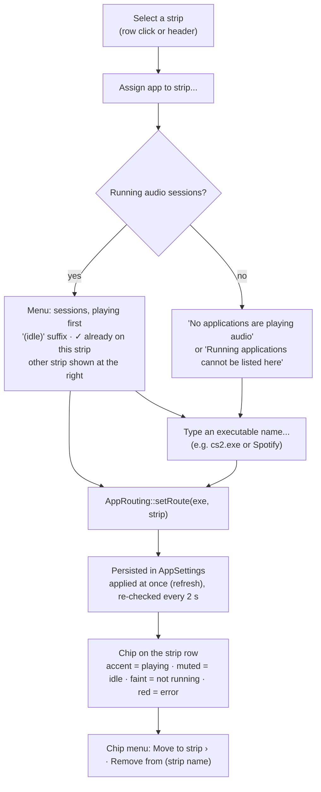

# 06 — GUI Structure & Key Components (Workflow 5)

> The desktop GUI is a native JUCE 9 application: `app/Source/ui` holds the components and `app/Source/shell` holds the window, tray, hotkeys and headless screenshot driver. It is a presentation layer only. It writes parameters and reads telemetry through the three lock-free channels of [`01-architecture.md`](01-architecture.md) §3, and nothing it does can block the audio thread.
>
> This document describes the GUI **as implemented**: design language, layout, component hierarchy, update model, every key component, tray and hotkeys, the per-app routing UX, the device advice banner and the headless screenshot driver. Anything planned rather than built is labelled **Roadmap** with its item number in [`07-roadmap.md`](07-roadmap.md). Examples: the onboarding wizard, the custom plug-in editor, Linux hotkeys and macOS per-app routing.

**Reading conventions**

- Paths are relative to the repository root. `ui/…` is short for `app/Source/ui/…` and `shell/…` for `app/Source/shell/…`.
- A **frame** is one display refresh delivered by `juce::VBlankAttachment`. Rates are quoted at a 60 Hz display. Work scheduled "every N frames" scales with the refresh rate, while ballistics use the measured `dt` and do not.
- Sizes are logical pixels (px). JUCE maps them to physical pixels on HiDPI displays.
- Every number is a constant from the code. Colours are given as `#RRGGBB`; all tokens are fully opaque.

| § | Topic |
|---|---|
| [1](#1-status-at-a-glance) | Status at a glance |
| [2](#2-design-language) | Design language: palette, accent, meters, typography, spacing, controls, accessibility |
| [3](#3-window-and-layout) | Window, annotated wireframe, layout rules, screenshots |
| [4](#4-component-hierarchy) | Component hierarchy and wiring |
| [5](#5-threading-and-update-model) | Threading and update model |
| [6](#6-key-components) | Key components, one by one |
| [7](#7-system-tray-and-global-hotkeys) | System tray and global hotkeys |
| [8](#8-per-app-routing-ux) | Per-app routing UX |
| [9](#9-first-run-and-onboarding) | First run and onboarding |
| [10](#10-plug-in-editor-strategy) | Plug-in editor strategy |
| [11](#11-headless-screenshot-driver) | Headless screenshot driver |
| [12](#12-persisted-ui-state) | Persisted UI state |
| [13](#13-known-limitations) | Known limitations |
| [14](#14-requirement-traceability) | Requirement traceability |

---

## 1. Status at a glance

| Area | Status | Code |
|---|---|---|
| Main window, layout and every panel in §6 | Implemented | `ui/*`, `shell/MainWindow.*` |
| Design system: tokens, look-and-feel, vector icons | Implemented | `ui/Theme.*`, `ui/FlubLookAndFeel.*`, `ui/Widgets.*` |
| Colour-blind safe meter palette | Implemented. It covers the level meters, clip LEDs and strip mini meters, plus the status colours of the loudness panel (gain reduction, clipper, TP, correlation) and the muted-strip icon. A few amber/red indicators stay fixed (§2.8) | `ui/Theme.*`, `ui/SettingsDialog.*` |
| Headset / output-device advice banner | Implemented | `ui/DeviceAdviceBanner.*` |
| Settings dialog: Audio, Processing, Hotkeys, General | Implemented | `ui/SettingsDialog.*` |
| System tray / macOS menu-bar icon | Implemented | `shell/TrayIcon.*` |
| Global hotkeys | Implemented on Windows (`RegisterHotKey`) and macOS (Carbon `RegisterEventHotKey`). Linux: not yet; the service reports "unsupported" | `shell/HotkeyManager.*`, `app/Source/platform/PlatformServices_*` |
| Per-app routing UI | Implemented. Backend support differs per OS (§8) | `ui/RoutingPanel.*`, `app/Source/engine/AppRouting.*` |
| Headless screenshot driver (incl. `--device`) | Implemented; used by CI | `shell/ScreenshotDriver.*`, `.github/workflows/ci.yml` |
| Onboarding wizard | **Roadmap** 1.6 (device check, OEM enhancements, headphones vs speakers) and 3.6 (wizard) | — |
| Custom plug-in editor sharing these components | **Roadmap** 2.9. Today the plug-in uses JUCE's generic editor plus a toolbar (§10) | `plugin/Source/PluginEditor.*` |
| Batch processing UI | **Roadmap** 2.10. Today: `flubsound-cli` | `tools/flubsound-cli` |
| Start with the OS | **Roadmap** 1.5. Tray, hotkeys and close-to-tray from that item exist | — |
| Hearing guard, localisation, accessibility audit, UI motion polish | **Roadmap** 2.11, 3.7, 3.6 | — |

---

## 2. Design language

The visual language rests on five decisions:

- a near-black canvas with raised panels;
- **one accent colour that follows the processing mode**;
- numeric readouts that are legible at a glance;
- vector drawing only (no bitmaps), so every scale factor is crisp;
- three levels of depth, as promised in [`08-pitfalls-and-solutions.md`](08-pitfalls-and-solutions.md): Boost Intensity + 5 mode macros → module cards with 3–5 key controls → the full parameter grid of one module.

### 2.1 Palette tokens

`ui/Theme.h`, namespace `Palette`:

| Token | Colour | Used for |
|---|---|---|
| `background` | `#0E1014` | Content background; edge fades of the module rack |
| `well` | `#0A0C10` | Meter wells, plot backgrounds, text-editor fill |
| `panel` | `#161A21` | Panel base. `drawPanel()` fills a vertical gradient from `panel.brighter (0.035)` at the top to `panel` 160 px down, then draws a 1 px `border` |
| `panelRaised` | `#1C212A` | Buttons, combo boxes, the advice banner |
| `panelHover` | `#222834` | Hover states |
| `border` | `#232A35` | 1 px panel borders and dividers |
| `borderStrong` | `#2F3847` | Control outlines, knob and slider tracks |
| `grid` | `#1D232D` | Grid lines of the meters and the history |
| `text` | `#E6E9EF` | Primary text, knob pointers, the EQ curve |
| `muted` | `#8A93A3` | Captions, secondary text, the input (pre) spectrum |
| `faint` | `#5A6373` | Axis labels, empty states, disabled controls |
| `teal` | `#22D3EE` | **Music** accent |
| `magenta` | `#E879F9` | **Gaming** accent; surround channel badges (always magenta) |
| `amber` | `#FBBF24` | Warnings (card notes, hotkey errors, CPU > 70 %), Bypass when on, "preset modified" dot, advice banner, governor limiting. It is also the *warn* status colour of the standard palette (gain-reduction bars, clipper, correlation < 0.3) |
| `red` | `#F87171` | App-chip routing errors. It is also the *hot* status colour of the standard palette (correlation < 0, loudness-panel TP over −1 dBTP, clipper over budget, muted-strip icon) |
| `green` | `#34D399` | "Safety governor OK". It is also the *safe* status colour of the standard palette (correlation ≥ 0.3) |
| `dynamicEq` | `#FBBF24` | Dynamic-EQ ghost markers and the Dyn band dot |

A few fixed colours live in `ui/FlubLookAndFeel.cpp`:

- popup menus `#171B22`;
- tooltips `#1F2530`;
- scrollbar thumb `#343C4A`;
- knob body gradient `#2A313D` → `#171B22`, outline `#343D4C`.

The `DocumentWindow` background is `#0F1115` (`shell/MainWindow.h`), but it is never visible behind the opaque `MainComponent`.

### 2.2 Mode accent

- **Rule.** `Theme::accentForMode()` returns magenta for Gaming and teal otherwise. The accent is stored in `FlubLookAndFeel::setAccent()`. `applyAccentColours()` re-colours every accent-dependent JUCE colour ID:
  - toggled buttons (20 % alpha) and tick boxes;
  - focused combo and text-editor outlines;
  - popup highlight (16 % alpha);
  - slider fill and track;
  - text-box highlight, caret, label editing outline, hyperlinks.

  Custom components ask for the accent with `Theme::accent (component)`.
- **What follows the accent:**
  - the logo tile and the "Pro" wordmark;
  - active-strip dots and the selected strip row;
  - the output spectrum and its peak-hold line, and the EQ curve fill;
  - the Boost dial and all knob arcs;
  - the SHORT loudness value, the upward-gain and width bars;
  - the waveform envelope and the routing-method pill;
  - the AUTO pill and focus rings.
- **What does not:** the advice banner (amber), surround badges (magenta), meter colours (§2.3), the correlation meter and the tray icon (§7.1).
- **Switching.** `MainComponent::frame()` reads the *selected strip's* `Mode` every frame. On a change, `applyMode()`:
  1. sets the accent;
  2. relabels the macros (`BoostPanel::setMode`);
  3. refreshes the header;
  4. calls `sendLookAndFeelChange()`, which invalidates the cached analyser grid and EQ layer.

  The header's mode thumb slides and cross-fades teal ↔ magenta with a time constant of 55 ms.
- **One look-and-feel.** `FlubsoundApplication` installs `FlubLookAndFeel` as the application default. Dialogs, alert windows, tooltips and the tray menu therefore match the main window. `MainComponent` only creates a private instance if the default is not a `FlubLookAndFeel`.

### 2.3 Meter palette

| Palette | safe | warn | hot | Selection |
|---|---|---|---|---|
| Standard | `#34D399` | `#FBBF24` | `#EF4444` | Settings › Processing › Meter colours |
| Colour-blind safe (Okabe–Ito) | `#56B4E9` sky blue | `#F0E442` yellow | `#D55E00` vermillion | same; persisted as `ui.meterPalette = 1` |

- **Zones** (`Theme::meterColourForDb`, used for peak-hold lines): ≥ −3 dBFS is *hot*, ≥ −12 dBFS is *warn*, anything lower is *safe*.
- **Bar gradient** (`LevelMeters::gradient`). The stops are placed in meter-deflection coordinates (§6.6):
  - *safe* up to −14 dBFS;
  - blend to *warn* at −10 dBFS and hold it to −4 dBFS;
  - *hot* from −2 dBFS to 0 dBFS.
- **Users of the meter colours** (`Theme::meterColours`): the level-meter bars, the peak-hold lines, the clip LEDs, the strip mini meters in the routing panel and the TRUE PEAK readout when it is above −1 dBTP.
- **Status colours** (`Theme::statusColours`). These are for indicators that encode a state by colour outside the level bars. The standard palette gives the UI's own `green` / `amber` / `red` (`#34D399` / `#FBBF24` / `#F87171`, note *hot* is `red`, not the meter's `#EF4444`). The colour-blind safe palette gives the same Okabe–Ito triple as above. Users:
  - the loudness panel's gain-reduction bars (*warn*), clipper bar (*warn*, *hot* over budget), TP readout (*hot*) and correlation meter (*hot* / *warn* / *safe*);
  - the muted-strip icon (*hot*);
  - the input level bar of the Settings › Audio device selector (*hot* above 0.95).
- **Switching** the palette in Settings calls `MainComponent::sendLookAndFeelChange()`, so views that cache palette colours (the routing rows' mute icons) refresh at once.

### 2.4 Categorical colours: EQ bands

`EqCurveEditor::bandColour()`:

| Band | 1 | 2 | 3 | 4 | 5 | 6 | 7 | 8 | 9 | 10 |
|---|---|---|---|---|---|---|---|---|---|---|
| Colour | `#F87171` | `#FB923C` | `#FBBF24` | `#A3E635` | `#34D399` | `#22D3EE` | `#60A5FA` | `#818CF8` | `#C084FC` | `#F472B6` |

Every node also carries its band number, so band identity is never conveyed by colour alone. The EQ module card shows the same colour as a dot next to "Band N".

### 2.5 Typography

**Family.** `Theme::fontFamily()` runs once and picks the first installed face from this list: Inter, Inter Variable, Segoe UI Variable Text, Segoe UI, SF Pro Text, Helvetica Neue, Roboto, Noto Sans, Open Sans, Cantarell, Liberation Sans. If none is installed it falls back to JUCE's default sans. The chosen face is also set as the look-and-feel's default sans typeface, so JUCE's own dialogs use it.

| Role | Helper | Style | Examples |
|---|---|---|---|
| Caption | `Theme::caption (h = 11)` | bold, kerning +0.08, upper case by convention | `LOUDNESS`, `BOOST INTENSITY`; pills at ≤ 10 px |
| Numeric | `Theme::numeric (h, bold = true)` | kerning +0.01 | TRUE PEAK 24 px; LUFS 21 px (25 px for SHORT); Boost value 22–46 px; header latency 12.5 px; knob value boxes 12 px regular |
| Body | `Theme::font (h, bold)` | plain / bold | card titles 13 px bold; labels 11.5–13 px; axis labels 9.5–10.5 px |
| Wordmark | `Theme::font` | 17 px bold, 15 px when compact | "Flubsound" in `text` + "Pro" in the accent |

Formatting helpers:

| Helper | Output |
|---|---|
| `Theme::formatDb` | `"-inf"` at ≤ −99 dB or for non-finite input |
| `Theme::formatSignedDb` | explicit `+` / `-`; a value that rounds to `"0.0"` gets no sign |
| `Theme::formatLufs` | `"--.-"` at ≤ −70 LUFS |

### 2.6 Shape, spacing and elevation

| Token | Value |
|---|---|
| Panel radius (`Theme::kPanelRadius`) | 10 px |
| Control radius (`Theme::kControlRadius`) | 6 px: framed icon buttons, combo boxes, banner, analyser plot well |
| Module card / strip row radius | 8 px / 7 px |
| Window margin / gap between panels | 12 px / 10 px |
| Header height | 56 px |
| Advice banner height (`DeviceAdviceBanner::kHeight`) | 34 px, plus a 10 px gap |
| Panel inner padding | 12–14 px horizontal (module cards 10 px), 8–12 px vertical |
| Control heights | 32 px in the header (34 px mode switch); 30 px for settings rows and routing buttons; 26 px module-card header |

**Elevation.** Panels use the gradient fill plus a 1 px border. Framed controls use `Theme::sheen()`, a subtle vertical gradient.

### 2.7 Control vocabulary

`FlubLookAndFeel` draws every stock JUCE widget. A style is chosen with the component property `flubStyle` (`Style::set (component, "tab")`), so plain `juce::TextButton` / `ToggleButton` / `Slider` objects are used throughout.

| Widget | Style | Look | Used by |
|---|---|---|---|
| `TextButton` | `tab` | neutral; ON = raised fill + 2 px accent underline | strip selector, A/B, settings navigation |
| | `chip` | pill; ON = accent tint + accent text | analyser In / Out / Tilt / Hold |
| | `warning` | amber tint and outline while toggled on | Bypass |
| | *(none)* | raised `panelRaised` sheen + `borderStrong` outline; ON = accent tint and outline | banner buttons, dialog buttons |
| `ToggleButton` | `power` | round power icon; accent while on | module enable |
| | `switch` | pill switch + label | Dyn EQ band On, settings toggles, `ParamGrid` toggles |
| | *(none)* | tick box + label | — |
| `Slider`, rotary | — | 270° sweep from `kRotaryStart = 1.25π` to `kRotaryEnd = 2.75π` (−135°…+135°). Bipolar ranges grow from their zero point. Optional *effective-value* ring | `ParamKnob`; `BoostDial` uses the same angles |
| `Slider`, linear | — | 4 px track, 12 px thumb; bipolar ranges grow from 0 | strip gain |
| `IconButton` | Ghost / Framed / Round | vector icon, optional text | header, cards, routing footer |

**Knob anatomy** (`drawRotarySlider`):

- The track is `clamp (0.075 · size, 2.5, 6)` px wide.
- The value arc has a 16 %-alpha halo 4 px wider than the track.
- The body is a gradient disc with a pointer; a keyboard-focus ring is drawn in the accent at 55 %.
- **Effective-value ring.** The `flubEffective` property is set by `ParameterBinder` (§5.4). When the post-macro value differs from the knob position by more than 0.004 of the travel, a 1.5 px outer arc runs from the knob value to the effective value and ends in a 4 px dot. This is how Boost Intensity and the macros become visible on the module knobs they drive.

**`ParamKnob`** (`ui/ParamKnob.*`) is caption above, knob, value box below.

| Size | Preferred size | Used in |
|---|---|---|
| Small | 64 × 78 | full parameter grids |
| Medium | 70 × 90 | module cards |
| Large | 84 × 106 | macros |

The drag sensitivity is 220 px for full travel, and velocity mode is off. Clicking the value box lets the user type a value.

**Icons** (`ui/Widgets.h`) are paths on a 24 × 24 design grid, stroked with round caps (1.7 px by default): gear, chevrons, more, copy, power, expand, collapse, ear, plus, close, reset, external, music note, gamepad, speaker, speaker-muted and the logo.

### 2.8 Accessibility

**Implemented**

- **Names and descriptions.** Every custom component sets a title and a description, for example "Spectrum analyser — Input and output spectrum of the selected strip, 20 Hz to 20 kHz". Every bound slider gets the parameter name as its title. Its help text reads "*Name* (double-click to reset to *default*)" (`ParamFormat::configureSlider`). `IconButton` uses its accessible name as its title. `Style::describe()` sets title, help text and tooltip in one call.
- **Keyboard.**
  - Focus rings are drawn on knobs, sliders, buttons, toggles, combo boxes, the mode segments, the Boost dial and the EQ plot.
  - The EQ curve is fully keyboard-editable (§6.5).
  - Esc collapses an expanded module card and closes the settings dialog.
  - Alert windows bind Return and Esc.
- **Redundant coding.** EQ nodes are numbered. The mode switch shows a label and an icon. The governor chip states its status in words. Every bar has a numeric readout.
- **Meters.** A colour-blind safe palette (§2.3) for the level meters and the status colours of the loudness panel and routing rows.
- **Tooltips** appear after 650 ms. They are disabled in headless screenshot runs.
- **HiDPI.** All drawing is vector. The cached analyser grid and EQ layer are rendered at the physical pixel scale and re-rendered when that scale changes.

**Gaps** (**Roadmap** 3.6, accessibility audit)

- The custom-drawn views (spectrum, meters, loudness, history) expose a title and description but not their live values. No custom `AccessibilityHandler` exists.
- Some indicators keep fixed colours whatever the palette:
  - the governor chip and inner arc (green/amber; the chip also states its status in words);
  - the CPU readout (amber over 70 %);
  - the preset-modified dot and the card warning notes (amber);
  - the app-chip dots in the routing panel (accent / muted / faint / red), which encode *playing / idle / not running / error* by colour alone.
- There is no in-app UI scale setting and no high-contrast theme.

---

## 3. Window and layout

### 3.1 Window

`shell/MainWindow.*` is a `DocumentWindow` titled "Flubsound Pro":

- native title bar, resizable;
- **minimum 1100 × 700**, default 1280 × 820, centred on first start;
- position and size saved in `AppSettings` when the window is closed and at shutdown.

The close button is handled by the application: it either closes to the tray or quits (§7.1). For headless screenshots, `setExactContentSize()` lifts the minimum.

The content is `ui::MainComponent`: opaque, 1280 × 820 initially, keyboard-focusable. The layout comment in `ui/MainComponent.h` targets 1100 × 700 up to 2560 × 1440; the resize limit itself is 16384 × 16384.

### 3.2 Annotated wireframe

The proportions follow the 1440 × 900 screenshots in §3.4; exact sizes are in §3.3.

```
+------------------------------------------------------------------------------------------------+ y 0
| HEADERBAR  56 px                                                                               |
| [logo Flubsound Pro] [Music|Gaming] [Game|Music|Chat|System]  [<][preset      v][>][...]       |
|                                               [A|B][copy] [Bypass] LATENCY 5.4 ms [gear]       |
+------------------------------------------------------------------------------------------------+ y 56
| DEVICE ADVICE BANNER  34 px + 10 px gap (only for a recognised headset or a Bluetooth link)    |
| [headphones] Family . connection . ceiling -x.x dBTP  advice...  [Use <preset>][Details][x]    |
+------------------+-----------------------------------------------+-----------------------------+ y 68 (+44 with banner)
| STRIPS & ROUTING | BOOST INTENSITY        MUSIC|GAMING MACROS    | LEVELS                      |
|        [MANUAL]  | ( 55 ) | (o)  (o)  (o)  (o)  (o)  [governor]  | IN  OUT | TRUE PEAK -2.1    |
| +--------------+ |  dial  |  5 macro knobs (captions per mode)   | ||  ||  | OUT PEAK L/R      |
| |* Game   [7.1]| +-----------------------------------------------+ ||  ||  | OUT RMS  L/R      |
| | gain  ----o  | | SPECTRUM + EQ   [In][Out][Tilt][Hold][+-12 dB]| ||  ||  | IN PEAK  L/R      |
| | mini meter   | |  0 dB __________________________________ +12  +-----------------------------+
| | app chips    | |     input spectrum (grey fill)                | LOUDNESS                    |
| +--------------+ |     output spectrum (accent) + peak hold      | MOMENT.   SHORT   INTEGR.   |
| | Music STEREO | |     EQ curve, numbered nodes 1..10            | LRA       TP      AUTO      |
| | Chat  ...    | |     dynamic-EQ ghost markers (amber)          | GAIN REDUCTION              |
| | System ...   | | -84 dB ______________________________ -12     |  Compressor  Limiter  Glue  |
|                  |   20  50  100  200  500  1k  2k  5k  10k  20k |  Bass protect  Master       |
| why-unavailable  +-----------------------------------------------+  Clipper (-30 dB budget)    |
|                  | [Noise Gate][Parametric EQ][Dynamic EQ][Ba -> | STEREO                      |
| [+ Assign app..] |  module cards, horizontal scroll; one card    |  Correlation     Width      |
| [System sound..] |  can expand to fill the whole rack            |                             |
+------------------+-----------------------------------------------+-----------------------------+
| OUTPUT HISTORY  12 s        mirrored min/max envelope + short-term LUFS trace    -12.3 LUFS    |
+------------------------------------------------------------------------------------------------+
```

### 3.3 Layout rules

`MainComponent::resized()`. `W` is the component width. `C` is the content height below the header (and the banner, if shown) inside the 12 px margins. `H` is `C` minus the history and its 10 px gap. `R` is the centre-column height left below the Boost panel and its gap.

| Region | Rule |
|---|---|
| Header | top 56 px, full width |
| Banner | `DeviceAdviceBanner::kHeight` = 34 px + 10 px gap, only when `shouldShow()` |
| Output history | bottom, `clamp (C / 8, 76, 128)` px (integer division) |
| Routing panel | left, `clamp (round (0.17 · W), 228, 300)` px wide |
| Right column | right, `clamp (round (0.19 · W), 252, 320)` px wide |
| Level meters | top of right column, `clamp (max (round (0.40 · H), H − 400 − 10), 196, 560)` px. The loudness panel's content is about 340 px, so tall windows give the spare height to the meters |
| Loudness panel | rest of the right column |
| Boost panel | top of the centre column, `clamp (round (0.27 · H), 150, 212)` px |
| Module rack | bottom of the centre column: `clamp (round (0.36 · R), 150, 200)` px, or `round (0.64 · R)` while a card is expanded |
| Analyser panel | whatever remains in the centre column |

The same rules, computed at the sizes used in this document:

| Geometry (px) | routing w | centre w | right w | history h | levels h | loudness h | boost h | analyser h | rack h |
|---|---|---|---|---|---|---|---|---|---|
| 1280 × 820 (default) | 228 | 756 | 252 | 92 | 255 | 373 | 172 | 282 | 164 |
| 1440 × 900 | 245 | 877 | 274 | 102 | 298 | 400 | 191 | 314 | 183 |
| 1440 × 900 + banner | 245 | 877 | 274 | 97 | 268 | 391 | 181 | 296 | 172 |
| 1100 × 700 + banner (minimum) | 228 | 576 | 252 | 76 | 196 | 284 | 150 | 170 | 150 |

At 1440 × 900 an expanded module card takes 324 px, leaving the analyser 173 px.

**Adaptive behaviour**

- **Header** is *compact* below 1280 px width:
  - logo area 136 px instead of 160;
  - mode switch 152 px instead of 176;
  - strip buttons 54 px instead of 60;
  - the LATENCY / CPU captions are hidden.

  The preset ‹ › arrows are hidden whenever the preset area minus the menu and arrow widths is under 180 px. The preset combo is at most 300 px wide (250 compact).
- **Routing panel.** If the "per-app routing unavailable" explanation does not fit under the strip rows, it collapses to a one-line notice, *"Per-app routing unavailable - why?"*. The full text is in its tooltip, and clicking opens it in an alert.
- **Level meters.** Scale labels are skipped when they would be closer than 11.5 px; grid lines are always drawn. Each numeric readout is only drawn if at least 30 px remain.
- **Module rack.** Cards keep their preferred width, `max (220, keys · 72 + 28)` px, and scroll horizontally with a 10 px scrollbar and 36 px edge fades. The ten cards need 3,394 px, so on practical window sizes the rack always scrolls. Only when everything fits is the spare width spread over the cards.
- **Analyser legend** is drawn only when all four entries fit left of the option chips.

### 3.4 Screenshots

All four images are real renders of the app by the headless driver (§11). No audio device is open; the engine runs on synthetic programme material.


*`--screenshot app-music.png --mode music --size 1440x900`.*

- The Music strip is selected and the accent is teal.
- The preset is *Bluetooth Headphones* because the driver loads the first factory preset whose mode is Music, and the factory list is ordered by category, then name. The amber dot on the preset box means *modified*: the driver raised Boost to 55 % after loading.
- `LATENCY 5.4 ms` / `DEVICE offline`: with no device there are no device buffers. The readout is the engine latency alone, 260 samples at 48 kHz: the largest strip chain (192 samples, Balanced) plus the master safety limiter (1 ms look-ahead = 48 samples + 20 samples of true-peak detector delay).
- The routing notice appears because the CI container has no routing back-end.


*`--mode gaming`.*

- The Game strip (7.1) is selected and the accent is magenta.
- The driver plays a 7.1 game scene on Game and music at −12 dB on the Music strip, so both strips show activity dots.
- The single amber diamond near 90 Hz is the live gain of the Gaming *anti-masking* mode band (dynamic-EQ band 6).
- The compressor shows −2.2 dB of gain reduction.


*`--mode gaming --device "Headphones (Stealth 700 Gen 2 MAX)"`.*

- The simulated output matches the *Turtle Beach Stealth series* profile on a USB / wireless-dongle connection, with a −1.0 dBTP ceiling.
- The banner shows the top piece of advice and offers *Use Competitive FPS*.
- Everything below the header moves down by 44 px (34 px banner + 10 px gap).


*`--size 1100x700 --mode music`, with `--device` naming a Stealth-series endpoint on a Bluetooth **hands-free** connection.* The minimum window size shows most of the adaptive rules of §3.3:

- The ceiling is −3.0 dBTP.
- There is no *Use …* button: the suggested preset (*Bluetooth Headphones*) is already loaded.
- The header is compact: no LATENCY caption, no preset arrows.
- The routing notice is the one-line form.
- The IN PEAK readout is dropped, and the −3 dB meter label is skipped.
- The analyser legend is hidden, and the rack shows two cards with its scrollbar.

---

## 4. Component hierarchy

```
FlubsoundApplication                        app/Source/FlubsoundApplication.*
├─ FlubLookAndFeel (application default)    ui/FlubLookAndFeel.*
├─ EngineController                         app/Source/engine/EngineController.*
├─ MainWindow  (DocumentWindow)             shell/MainWindow.*
│  └─ MainComponent                         ui/MainComponent.*    EngineController::Listener + VBlankAttachment
│     ├─ HeaderBar                          ui/HeaderBar.*
│     │  ├─ ModeSegment ×2 (Music, Gaming)  custom Button, sliding thumb painted by the header
│     │  ├─ TextButton ×N strips ("tab")    one per strip, activity dot painted over
│     │  ├─ IconButton ‹  ComboBox preset  IconButton ›  IconButton … (preset actions)
│     │  ├─ TextButton A | B ("tab") + IconButton copy
│     │  ├─ PopupButton Bypass ("warning"; right-click = options)
│     │  └─ IconButton settings (gear)
│     ├─ DeviceAdviceBanner                 ui/DeviceAdviceBanner.*   hidden unless relevant
│     │  └─ TextButton "Use <preset>", "Details", "×"
│     ├─ RoutingPanel                       ui/RoutingPanel.*
│     │  ├─ Viewport → StripRow ×N          LED, name, channel badge, mute IconButton, gain Slider,
│     │  │                                   mini meter, application chips
│     │  ├─ IconButton "Assign app to strip..."
│     │  └─ IconButton "System sound settings"
│     ├─ BoostPanel                         ui/BoostPanel.*           owns a ParameterBinder
│     │  ├─ BoostDial (juce::Slider)
│     │  └─ ParamKnob ×5 (Large)            ui/ParamKnob.*
│     ├─ AnalyzerPanel                      ui/AnalyzerPanel.*
│     │  ├─ SpectrumAnalyzer                ui/SpectrumAnalyzer.*
│     │  ├─ EqCurveEditor (same bounds, on top)  ui/EqCurveEditor.*
│     │  └─ TextButton ×4 ("chip") + ComboBox EQ range
│     ├─ ModuleRack                         ui/ModuleRack.*           owns a ParameterBinder
│     │  └─ Viewport → ModuleCard ×10       ui/ModuleCard.*
│     │     ├─ ToggleButton power, IconButton ear, IconButton expand, IconButton ‹ › (banded)
│     │     ├─ key controls: ParamKnob | ComboBox | ToggleButton ("switch")
│     │     └─ (expanded) Viewport → ParamGrid   ui/ParamGrid.*
│     ├─ LevelMeters                        ui/LevelMeters.*
│     ├─ LoudnessPanel                      ui/LoudnessPanel.*
│     ├─ WaveformHistory                    ui/WaveformHistory.*
│     ├─ TooltipWindow (650 ms; not created with --screenshot)
│     ├─ AnalyzerFeed   (non-visual)        ui/AnalyzerFeed.*
│     └─ MeterSnapshot  (non-visual)        ui/MeterSnapshot.*
│  on demand: DialogWindow → SettingsDialog ui/SettingsDialog.*
│     └─ AudioDeviceSelectorComponent | ProcessingPage | HotkeysPage | GeneralPage
├─ TrayIcon (SystemTrayIconComponent)       shell/TrayIcon.*
├─ HotkeyManager                            shell/HotkeyManager.*
└─ ScreenshotDriver (headless runs only)    shell/ScreenshotDriver.*
```

**Shared building blocks.**

- [`ui/Theme.*`](../app/Source/ui/Theme.h): tokens, fonts, panel / caption / pill drawing, number formatting.
- [`ui/Widgets.*`](../app/Source/ui/Widgets.h): icons, `IconButton`, `Style::set` / `Style::describe`.
- [`ui/ParameterBinding.*`](../app/Source/ui/ParameterBinding.h): `ParamFormat` and `ParameterBinder`.

**Coupling.** Only seven UI files take an `EngineController&`: `MainComponent`, `HeaderBar`, `DeviceAdviceBanner`, `RoutingPanel`, `BoostPanel`, `ModuleRack` and `SettingsDialog`. All other components work from a `ParameterStore*` provider, a `ProcessingChain*` provider, a `MeterSnapshot`, or raw sample blocks. This split is the basis of the plug-in editor plan (§10).

**Wiring in `MainComponent`**

| Source | Target |
|---|---|
| `header.onSettingsRequested`, `deviceBanner.onDetailsRequested` | `openSettings()`: a single, non-modal settings window; brought to front if already open |
| `levels.onResetRequested`, `loudness.onResetRequested` | `MeterBus::resetLoudnessRequest = true` for the selected strip |
| `rack.onLayoutModeChanged` | `resized()`: a card was expanded or collapsed |
| `analyzer.getEqEditor().onBandSelected` ↔ `rack.onEqBandSelected` | curve node selection and the EQ card's band selector stay in sync |
| `analyzer.onOptionsChanged` | save `ui.analyzer` |
| `AnalyzerFeed` sink | pre → `SpectrumAnalyzer::push (false, …)`; post → `SpectrumAnalyzer::push (true, …)` and `WaveformHistory::push` |
| `keyPressed (Esc)` | collapse an expanded module card |

---

## 5. Threading and update model

### 5.1 Threads and channels

Every UI object lives on the **JUCE message thread**. The audio thread never calls into the UI. The UI reaches audio state only through the following channels:

| Channel | Direction | UI side | Mechanism |
|---|---|---|---|
| `param::ParameterStore` (per strip, banks A/B) | UI → audio | `ParameterBinder`, `EqCurveEditor`, `EngineController` (mode, boost, A/B, bypass, presets), `HeaderBar` (reset, loudness-matched bypass), Settings (latency profile) | `set (id, v)`: clamped relaxed atomic store (NaN is ignored), `version()` incremented. The audio thread takes one `snapshot()` per block |
| `ProcessingChain::effectiveValue (id)` | audio → UI | `ParameterBinder` (knob rings), `ModuleRack` (AUTO / dimming) | post-macro values published as relaxed atomics |
| Audition mask (`ProcessingChain::setAuditionBypass`) | UI → audio | `ModuleCard` ear via `ModuleRack` → `EngineController::setAuditionBypass` | one atomic bit per module. It forces the module off whatever the preset or macros say, via the slot's click-free crossfade. It is not a parameter |
| `MeterBus` | audio → UI | `MeterSnapshot::read()` once per frame for the selected strip. `RoutingPanel` reads `outPeakDb` of every strip directly | relaxed atomics written once per block |
| `MeterBus::resetLoudnessRequest` | UI → audio | click on TRUE PEAK or INTEGR. | atomic flag; the chain `exchange`s it at the next block and resets integrated loudness and the TP hold |
| `AnalyzerTaps` pre / post | audio → UI | `AnalyzerFeed`, the **only** consumer | SPSC rings of mid `(L+R)/2` samples, 32768 floats each (≈ 0.68 s at 48 kHz); the producer drops samples when a ring is full |
| Host atomics | UI → audio | strip gain / mute (routing panel), master ceiling (device advice) | `AudioEngineHost` atomics, applied at the start of each audio block |
| `EngineController::Listener` | controller → UI | `MainComponent`, `TrayIcon` | callbacks on the message thread for state that cannot be polled cheaply |

Two other threads feed the UI, always via the message thread:

- the per-app routing worker ("Flubsound routing"), through a `juce::AsyncUpdater` → `onChanged` → `Change::Routing`;
- global-hotkey callbacks, which `HotkeyManager` moves onto the message thread with `MessageManager::callAsync` if an implementation ever calls from another thread.


### 5.2 The frame loop

`MainComponent::frame (timestamp)` runs once per display refresh (`juce::VBlankAttachment`):

1. `dt = clamp (t − t_prev, 0, 0.1 s)`; `1/60 s` on the first frame.
2. Re-read the selected strip and `EngineController::getEngineGeneration()`. If either changed, run `resetAnalysis()`: discard queued tap samples; reset the analyser, history, meters and loudness panel; force an EQ refresh.
3. `chain = controller.getChain (strip)`, **re-fetched every frame and never cached**, because a reconfiguration re-creates the chains.
4. Mode check → `applyMode()` on change (§2.2).
5. `snapshot.read (chain.meters())`, plus `masterGainReductionDb` and `active = isStripActive (strip)`.
6. Push the host sample rate to the analyser, the EQ editor and the history.
7. `feed.pull (chain.taps())` drains both rings into the sinks (§4).
8. Advance the views:
   - `analyzer.advance (dt)`;
   - `eqEditor.refresh()` and `setDynamicEqState (snapshot.dynEqGainDb, mode)`;
   - `history.setLoudness (shortTermLufs)` and `advance()`;
   - `levels.update`, `loudness.update`;
   - `boost.setGovernorScale`, `routing.updateMeters (dt)`, `header.animate (dt)`.
9. Every 4th frame `rack.updateFromEngine()`; every 15th frame `header.updateStatus()`.

`paint()` never analyses anything. Every view prepares its paths or images in its advance/update step and repaints only the region that changed.

`AnalyzerFeed` drains each ring in chunks of 2048 samples, at most 32 chunks per frame. If more than 16384 samples (≈ 0.34 s at 48 kHz) are queued after a stall (window hidden, debugger), it skips all but the newest 8192, so the views jump to "now" instead of replaying stale audio.

### 5.3 Clocks and rates

| Clock | Rate | Work |
|---|---|---|
| `VBlankAttachment` (`MainComponent`) | every display frame (60 Hz on a 60 Hz display) | the frame loop above |
| — every 4 frames | ≈ 15 Hz | `ModuleRack::updateFromEngine()`: card base / effective state |
| — every 15 frames | ≈ 4 Hz | `HeaderBar::updateStatus()`: latency, CPU, strip activity dots, preset-modified dot |
| `SpectrumAnalyzer` FFT | one hop per 1024 new samples (≈ 46.9/s at 48 kHz); at most one per stream per frame | 4096-point FFT |
| `LevelMeters` numeric readouts | ≥ 0.08 s apart (≈ 12 Hz) | TRUE PEAK and L/R readouts; the bars repaint every frame |
| `LoudnessPanel` | repaint ≥ 0.05 s apart (≤ 20 Hz), and only when a value changed | readouts and bars |
| `WaveformHistory` | 100 columns/s (10 ms each); paths rebuilt in the frame when a column completed | envelope and LUFS trace |
| `ParameterBinder` × 2 (Boost panel, module rack) | 30 Hz `juce::Timer` | `store.version()` poll → control refresh; effective-value rings |
| `ModuleCard` ear | 10 Hz, only while held | safety net: ends the audition if the button is no longer down, the card is hidden or the app lost the foreground |
| `SettingsDialog` | 2 Hz | live latency text (Processing); device-profile text (Audio) |
| `AudioEngineHost` | 5 Hz | structural re-prepare poll (latency profile, layout) → `Change::Engine` |
| `EngineController` | 1 Hz | strip-state autosave every 5 s (only when a store's `version()` changed); preferred-output rescan every 5 s while it is missing |
| `AppRouting` worker | every 2 s while routes exist, captures run or live updates are on; immediately on `refresh()` | session enumeration, endpoint moves |
| `AppSettings` | writes debounced 2 s after a change | settings file |
| `ScreenshotDriver` | 60 Hz | offline rendering paced in real time (§11) |

### 5.4 `ParameterBinder` and `ParamFormat`

`ui/ParameterBinding.*` binds stock controls to parameter IDs of the store returned by a `StoreProvider`. The provider is re-evaluated on every use, so strip switches and engine rebuilds are picked up without re-binding.

**Write path.** A user gesture fires `onValueChange` / `onClick` / `onChange`, which calls `store->set (id, value)` and then `onUserEdit (id)`.

**Refresh path.** The 30 Hz timer compares the store address and `store.version()` with the last values seen. On a change it *pulls* every bound control:

- the control is set with `dontSendNotification`, under an `updating` guard, so a refresh never writes back and there is no feedback loop;
- a slider that is being dragged (`isMouseButtonDown()`) is skipped.

**Effective rings.** The same tick reads `chain->effectiveValue (id)` for every bound slider. If `|effective − base|` exceeds `1e−4 × range`, the slider's `flubEffective` property is set to the effective position. The slider repaints only when that position moved by more than 0.002.

**Lifetime.** No control may keep a callback into a dead binder. Two patterns are used:
- The binder dies first. Its destructor detaches every callback. `BoostPanel` declares it after its dial and knobs.
- The controls unbind while the binder is still alive. `ModuleRack` declares the binder before its cards and clears the cards in its destructor. `ModuleCard` and `ParamGrid` call `unbind` in their destructors.

`ParamFormat` turns `flub::param::layout()` metadata into text and ranges:

| Unit | Display (`toText`) | Text entry (`fromText`) |
|---|---|---|
| `Db` | `"+3.0 dB"`: signed for bipolar ranges, no decimals at ≥ 100 | `"-6"`, `"+3"` |
| `Hz` | `"Off"` (0 when min ≤ 0); `"32 Hz"` / `"31.5 Hz"` below 100 Hz; `"250 Hz"`; `"2.40 kHz"`; `"12.0 kHz"` | `"3.2k"` → 3200 |
| `Ms` | `"4.5 ms"`, `"120 ms"`, `"1.20 s"` | `"1.2s"` → 1200 ms |
| `Percent` (stored 0…1) | `"40%"` | `"25 %"` → 0.25 |
| `Ratio` | `"4.0:1"`, `"12:1"` | `"4:1"` |
| `Lufs` / `Degrees` / `Millimetres` / `DbPerSec` | `"-14.0 LUFS"` / `"30°"` / `"87.5 mm"` / `"3.0 dB/s"` | number |
| `Choice` | the label | label, label prefix or index |
| `Toggle` | `On` / `Off` | `on`, `1`, `true`, `yes` |

- Everywhere, `off`, `-inf` and `min` mean the minimum and `max` means the maximum. Results are clamped to the parameter range.
- Slider ranges are `NormalisableRange (min, max)` skewed so that `Info::skewCentre` sits at mid-travel. Choices and toggles use an interval of 1.
- Double-click returns to the default value.

### 5.5 Controller events

`MainComponent::engineControllerChanged`:

| `Change` | Emitted by | UI reaction |
|---|---|---|
| `Preset` | preset loaded, saved or list changed | rebuild the preset list; refresh the banner (its *Use …* offer hides once that preset is loaded) |
| `Engine` | engine re-configured (rate, latency profile, layout, device restart) | release any ear hold (the new chains start without auditions); rebuild header strip buttons and routing rows only if the strip names or channel counts changed; reset analysis; refresh header, status and banner |
| `SelectedStrip` | `setSelectedStrip()` (which also recomputes the device advice for the new strip's mode) | release any ear hold; refresh the header; select the routing row; reset analysis; refresh the banner |
| `MasterEnable`, `Parameters` | bypass, mode, boost, A/B through the controller | refresh the header and the banner |
| `Device`, `Settings` | device opened, changed or failed; device-input or routing settings | header status, routing refresh, banner refresh |
| `Routing` | routing worker results, route edits | `RoutingPanel::refreshRouting()` |

`TrayIcon` listens for `MasterEnable` only, and redraws its icon.

### 5.6 Reconfiguration safety

- Chains are re-fetched each frame (§5.2), and `getEngineGeneration()` changes whenever the host re-prepares.
- `AnalyzerFeed::discard()` drops samples queued before a strip switch or rebuild.
- The binders and the EQ editor compare the store *address* as well as its version.

A strip switch or engine rebuild therefore never shows the previous strip's audio or dereferences a stale chain.

---

## 6. Key components

Each component below lists its purpose, what it reads and writes, its update rate and its interaction model.

### 6.1 `HeaderBar` — mode, strip, presets, A/B, bypass, status

`ui/HeaderBar.*`, 56 px. From the left: logo + wordmark · mode switch · strip selector · (free space) · preset browser · A/B + copy · Bypass · latency/CPU · settings.

| Element | Reads | Writes | Interaction |
|---|---|---|---|
| **Mode switch** | `controller.getMode()` (selected strip, active bank) | `controller.setMode()` → `Mode` of the selected strip's active bank | Two segments: music-note icon + *Music*, gamepad icon + *Gaming*. A thumb slides (τ = 55 ms) and cross-fades teal ↔ magenta. Mode is stored per strip and per bank, so A and B can differ |
| **Strip selector** | strip names and channel counts; `isStripActive()` | `setSelectedStrip()` | "tab" buttons; an accent dot marks strips currently receiving audio. The tooltip names the format (7.1 / 5.1 / stereo) |
| **Preset browser** | `PresetManager::getPresets()`, current preset ID, `isPresetModified()` | `loadPreset (id, selected strip)`, `nextPreset()` / `previousPreset()` | Combo grouped under section headings `Factory - <category>` / `User - <category>`. It reads "Default settings" when no preset is set and "No presets installed" when the list is empty. An amber dot at the top-right corner marks a modified preset |
| **Preset menu (…)** | current preset | preset files | **Save** (user preset *and* modified) · **Save as…** (name, category, description) · **Rename…** (user only) · **Delete** (user only; confirmation, moved to the trash) · **Import…** (`*.json`, loaded straight into the strip) · **Export…** (defaults to `<Documents>/<name>.flubpreset.json`) · **Show preset folder** · **Reset strip to defaults** (active bank only; keeps `mode`, `latency.profile` and `bypass`) |
| **A / B + copy** | `getActiveBank()` | `setActiveBank()`, `copyActiveToOtherBank()` | Switching is one atomic bank flip; continuous parameters glide, so it is click-free. The copy tooltip reads "Copy A to B" or "Copy B to A" |
| **Bypass** | `isEnabled()`, `bypass.matched` of the selected strip | `toggleEnabled()` → `bypass` on **every strip, both banks** | "warning" style, label *Bypass* / *Bypassed*. **Right-click** shows a menu with **Loudness-matched bypass**, an application-wide setting written to `bypass.matched` on every strip and both banks |
| **Latency / CPU** | `getLatencyInfo()`, `getStatus()` | — | Top line `totalMs + captureBufferMs` with one decimal. Bottom line: CPU %, amber above 70 %, or `offline` (the caption then reads DEVICE). Hover shows the breakdown "device in + engine + device out (+ app capture)" plus the output-device profile |
| **Settings** | — | opens `SettingsDialog` | gear button |

- **"Modified" semantics.** `PresetManager::isModified()` compares the active bank's values with a snapshot taken when the preset was loaded or saved, so reverting an edit clears the dot. The comparison runs only after `store.version()` changed.
  - Application state that shares the store is ignored: `bypass`, `latency.profile` and `bypass.matched` (`PresetManager::isPresetSound`).
  - Which bank is active does not count, only the values heard. Switching to a B bank whose values differ therefore shows the dot.
  - The ear button never marks the preset as modified: it is an engine audition, not a store write (§6.9).
- **Rates.** `refresh()` is event-driven (§5.5). `updateStatus()` runs every 15 frames. `animate()` runs every frame, but only while the thumb is moving.

**Global parameters driven from the header**

| Name | Key | Range | Default | Unit | What it does |
|---|---|---|---|---|---|
| Mode | `mode` | Music, Gaming | Music | choice | Selects the macro set, the dynamic-EQ mode bands and the accent. Fresh strips named "Game" or with more than 2 channels start in Gaming |
| Bypass All | `bypass` | off / on | off | toggle | Latency-aligned, click-free global bypass of a strip. Driven by the master Bypass for all strips |
| Loudness-Matched Bypass | `bypass.matched` | off / on | on | toggle | The bypass path gets the loudness-match gain, capped so the dry signal never exceeds the ceiling |
| Latency Profile | `latency.profile` | Quality, Balanced, Low Latency | Balanced | choice, structural | Set in Settings › Processing on every strip and both banks. The engine re-prepares with a brief dropout |

### 6.2 `DeviceAdviceBanner` — headset and output-device advice

`ui/DeviceAdviceBanner.*`, a 34 px strip under the header. It surfaces `EngineController::getDeviceAdvice()`, the device-profile match of [`10-headset-compatibility.md`](10-headset-compatibility.md).

- **Shown when all of these hold:**
  - an output device name is known;
  - a profile matched, **or** the connection is Bluetooth / Bluetooth hands-free;
  - the advice has at least one message;
  - the user has not dismissed it for this device name.
- **Content.**
  - **Headline:** `<profile name or device name> · <connection> · ceiling <x.x> dBTP`. The connection text is one of *wired*, *USB / wireless dongle*, *Bluetooth* or *Bluetooth hands-free*. The ceiling is the cap already applied to the master limiter: −1 dBTP by default, −2 on Bluetooth, −3 on hands-free.
  - **Body:** the first advice message.
  - **Tooltip and accessible description:** all messages.
- **Actions.**
  - **Use \<preset\>** is shown only when the suggested preset exists and is not already the current preset of the selected strip. It loads that preset into the selected strip.
  - **Details** opens Settings on the Audio page, which lists the profile, connection, ceiling, narrowband flag, suggested preset and guidance. If Settings is already open, it is only brought to the front, on whatever page it shows.
  - **×** hides the banner for this output device name for the rest of the session; a different device shows it again. The dismissal is not persisted.
- **Style.** `panelRaised` fill, amber 45 % outline, a 4 px amber stripe on the left and a headphone glyph drawn in code.
- **Updates.** Event-driven: `refresh()` runs on `Preset`, `Engine`, `SelectedStrip`, `MasterEnable`, `Parameters`, `Device` and `Settings`. When visibility changes, `MainComponent` re-runs its layout.
- **Mode dependence.** The controller computes the advice (and its suggested preset) from the mode of the selected strip. It recomputes it on every device change, `setMode()` and `setSelectedStrip()`, so the offer always follows the strip being edited.

### 6.3 `BoostPanel` — Boost Intensity and the mode macros

`ui/BoostPanel.*`. The panel owns a `ParameterBinder`. Its `StoreProvider` is the selected strip's store and its `EffectiveProvider` is the selected strip's chain.

- **`BoostDial`**, the hero control. It is a `juce::Slider` (rotary drag, 300 px sensitivity, no text box) painted by hand:
  - 11 ticks at 10 % steps; ticks up to the value are drawn in the accent;
  - a value arc with a glow and an accent gradient;
  - a thumb dot in the text colour;
  - the centre readout (integer %, 22–46 px) captioned `BOOST %`.

  A thin **inner arc** shows the share actually applied: `value × governorScale`. It is amber while `governorScale < 0.985`, and 55 % text colour otherwise. `governorScale` comes from `MeterBus::governorScale` every frame. The Safety Governor floor is 0.3 (`kMinScale` in `core/src/engine/Protection.cpp`; documented in `core/include/flub/engine/Protection.h`).
- **Governor chip** (right end of the panel's caption row): green *Safety governor OK*, or amber *Safety governor: NN% applied*.
- **Five macro knobs** (`ParamKnob`, Large; cells at most 170 px apart; knob at most 96 × 124 px). Captions come from `flub::MacroMap::macroName()` and change with the mode, together with titles and tooltips.
- **Rates.** Dial and macros refresh through the binder at 30 Hz. The governor updates every frame; the header strip repaints only when the limiting state or the rounded percentage changes.

| Key | Range / default | Music macro — tooltip | Gaming macro — tooltip |
|---|---|---|---|
| `boost` | 0–100 % / 0 % | **Boost Intensity**: "one control for the whole enhancement. Clarity and width come first, bass next and loudness last, always watched by the safety governor." | *(same)* |
| `macro.1` | 0–100 % / 0 % | **Punch**: transient attack and a tighter low end | **Footsteps**: lifts quiet high-frequency cues (steps, reloads) and tames masking booms |
| `macro.2` | 0–100 % / 0 % | **Width**: stereo width and a sense of space | **Positional**: sharpens left / right / front / back placement |
| `macro.3` | 0–100 % / 0 % | **Clarity**: presence, air and de-mud (with dynamic de-harsh) | **Impact**: weight for explosions and gunshots (safety governed) |
| `macro.4` | 0–100 % / 0 % | **Loudness**: maximizer drive and multiband glue (safety governed) | **Detail**: brings up quiet ambience and distant cues (upward compression) |
| `macro.5` | 0–100 % / 0 % | **Warmth**: tape saturation and harmonic bass (safety governed) | **Voice & Score**: dialogue, comms and music intelligibility |

The macros add staged contributions on top of the preset's base values (`MacroMap`, [`05-code-skeletons.md`](05-code-skeletons.md) §3). The Boost and macro knobs are the sources, so they never show an effective ring. The module knobs they drive do.

### 6.4 `AnalyzerPanel` / `SpectrumAnalyzer` — pre vs post spectrum

`ui/AnalyzerPanel.*` stacks the `SpectrumAnalyzer` and the `EqCurveEditor` with identical bounds; the editor shares the analyser's geometry.

- **Header row (24 px):**
  - caption `SPECTRUM + EQ`;
  - a legend, drawn only if it fits: Input (muted), Output (accent), EQ (text), Dynamic EQ (amber diamond);
  - four "chip" toggles, 46 px each: **In**, **Out**, **Tilt**, **Hold**;
  - the EQ display-range combo: **±6 / ±12 / ±24 dB**.

  The options persist as `ui.analyzer` (§12).
- **Data.** `SpectrumAnalyzer::push()` writes the mono mid samples of the pre and post taps into two 4096-sample history rings.
  - The **pre** tap is taken after input gain, AutoLevel and the stereo fold (virtualiser or downmix), before the module slots.
  - The **post** tap is the strip's output after the global-bypass crossfade, before the strip gain and the master limiter.

The analysis maths, from `ui/SpectrumAnalyzer.*`:

```
N = 4096 (kFftOrder 12), hop = 1024 (75 % overlap), analysis starts once ≥ 2048 samples arrived
window  w[i] = 0.5 − 0.5·cos(2π·i/N)                       periodic Hann (exact 75 % overlap-add)
X[k]    = |FFT(w · x)|                                     juce::dsp::FFT, frequency-only transform
display points: 420, log-spaced 20 Hz … 20 kHz
band of point fc: [fc·2^(−1/12), fc·2^(+1/12)]             1/6 octave
  if the band spans < 2 bins:  P = (linear interpolation of X at fc/binHz)²
  else:                        P = mean(X[k]²) over the bins inside the band
calibrationDb = 20·log10(4/N) + 10·log10(B1k / binHz)
  B1k = 1000·(2^(1/12) − 2^(−1/12)) ≈ 115.6 Hz              1/6-octave bandwidth at 1 kHz; binHz = fs/N
level(fc) = max(−140, 10·log10(P + 1e−24) + calibrationDb)  dB
tilt(fc)  = 4.5 · log2(fc / 1000)                           dB, added at draw time when Tilt is on
```

The Hann coherent gain of 0.5 is folded into the `4/N` term (sine amplitude = 4·|X|/N), and the bandwidth term turns the per-bin mean power into the power of a 1/6-octave band at the 1 kHz pivot. So a sine and pink noise read on the same scale there. Because the bands have constant relative width, pink noise reads flat with Tilt off. The +4.5 dB/octave tilt is there so that typical music reads roughly flat.

The calibration does **not** compensate the Hann window's equivalent noise bandwidth (1.5 bins, +1.76 dB). Both a sine and noise therefore read about 1.7 dB high: a 0 dBFS, 1 kHz sine displays at ≈ +1.7 dB (checked numerically against the code's formulas at 48 kHz). The code's own comment says "close to its dBFS value". See §13.

**Ballistics** (`advance (dt)`, `dt` clamped to 0…0.25 s):

```
d += (target − d) · (1 − e^(−dt/τ))    τ = 12 ms rising, 300 ms falling
peak hold: 1.2 s, then falls at 14 dB/s
no samples for 0.35 s → the target drops to the −140 dB floor (the trace falls away)
```

Above 61.44 kHz (1024 samples × 60 frames/s), for example at 88.2 or 96 kHz, more than one hop arrives per 60 Hz frame. Only one analysis runs per stream per frame and the surplus hop count is discarded (`sinceHop = min (sinceHop − 1024, 1023)`). The analysis always uses the newest 4096 samples.

**Display**

- Log frequency axis 20 Hz–20 kHz, labelled at 20, 50, 100, 200, 500, 1k, 2k, 5k, 10k, 20k.
- dB axis −84…0 (plot clamp −96…+6), with 12 dB grid steps, or 24 / 42 dB when the plot is short.
- Pre spectrum: grey gradient fill with a 45 % line. Post: accent fill (20 % → 0 %), a 4.5 px 15 % glow and a crisp 1.5 px line. Peak hold: 1 px accent at 38 %.
- The grid and axis labels are cached in an image at the physical pixel scale; `paint()` only strokes ready-made paths.
- With no data yet, the plot reads *"Waiting for audio on this strip"*.

The component is opaque, so 60 Hz repaints never repaint the parent, and it ignores the mouse. **Rate:** paths are rebuilt, and the plot area repainted, only when some display point moved by more than 0.01 dB.

### 6.5 `EqCurveEditor` — the interactive EQ curve

`ui/EqCurveEditor.*` lies over the analyser with identical bounds.

**Model.** When the store address or `version()` changed (checked each frame), the editor reads the 10 bands, `eq.output` and `eq.on`. The combined response is evaluated every 2 px across the plot:

```
response(f) = ParametricEq::responseDb(bands, 10, f, fs) + eq.output
```

This is the same design function the audio path uses ([`05-code-skeletons.md`](05-code-skeletons.md) §7), so the curve on screen is the response that is heard.

**Gain axis.** A right-hand axis shows ±range (6 / 12 / 24 dB) at ±1, ±½ and 0:

```
y(g) = centreY − clamp(g/range, −1.08, 1.08) · (plotHeight/2) · 0.92
```

**Drawing.**

- Curve: 1.6 px at 88 % text colour over a 4 px glow at 7 %, with a 10 % accent fill down to 0 dB. The whole curve drops to 40 % alpha when `eq.on` is off.
- The selected band's own contribution is filled in its band colour at 16 %.
- Nodes are numbered, radius 7.5 px (+1.5 selected, +1 hovered). Disabled bands are drawn hollow.
- A bubble describes the dragged or hovered band, e.g. `4  Bell   250 Hz   +3.0 dB   Q 1.00`. Cut types show `dB/oct` instead of Q; a disabled band adds `(off)`.
- Curve, nodes and bubble are cached in an image and rebuilt only after edits or hover changes.

**Dynamic-EQ ghost markers** come from `MeterBus::dynEqGainDb[0…7]`, which `setDynamicEqState` checks every frame. They are painted over the cached layer:

- a 2 px amber stem from 0 dB to the live gain, with a diamond of 5 px radius;
- strength `clamp (|g| / 4, 0.35, 1)`; markers are skipped below 0.1 dB;
- the editor repaints only when any gain moved by more than 0.05 dB or the mode-band frequencies changed.

Bands 0–3 are the user dynamic bands at `dyneq.<b>.freq`. Bands 4–7 are the internal mode bands at `ProcessingChain::modeBandFrequency()`:

| Mode | Band 4 | Band 5 | Band 6 | Band 7 |
|---|---|---|---|---|
| Gaming | 3.2 kHz footstep lift (upward) | 260 Hz footstep body (upward) | 90 Hz low-shelf anti-masking (cut above) | 2 kHz voice & score (upward) |
| Music | 3.5 kHz dynamic de-harsh | 12 kHz air shelf (upward) | 120 Hz de-boom | 1 kHz (inactive; range 0) |

**Interaction**

| Input | Action |
|---|---|
| Drag a node | frequency (clamped 20 Hz–20 kHz) and, for Bell / Low Shelf / High Shelf only, gain (clamped ±24 dB). **Shift** = fine (0.2× motion). Grabbing a disabled node switches it on |
| Mouse wheel over a node, or anywhere once a band is selected | `Q ← clamp (Q · 2^(1.6·Δ), 0.1, 18)` |
| Double-click a node | reset the band to its defaults |
| Right-click a node | menu: *Enabled*, *Type ›* (Bell, Low Shelf, High Shelf, Low Cut, High Cut, Notch, Band Pass), *Slope ›* (12/24/36/48 dB/oct; cut types only), *Reset band*, *Reset all bands (flat)* |
| ← / → | frequency ∓/± 1/12 octave (Shift: 1/48) |
| ↑ / ↓ | gain ±0.5 dB (Shift: 0.1 dB), gain types only |
| + / = / − | Q × 2^(±0.25) |
| Delete / Backspace | toggle the band's enable |
| Tab / Shift-Tab, `]` / `[` | next / previous band. Tab at the last band (or Shift-Tab at the first) passes focus on |
| Esc | deselect |

Selecting a band also selects it on the EQ module card, and vice versa. Every edit writes the store directly (`store->set`) and re-reads it at once.

**Band parameters** (`b` = 0…9):

| Name | Key | Range | Default | Unit | What it does |
|---|---|---|---|---|---|
| Band *n* On | `eq.<b>.on` | off / on | on | toggle | Band enable |
| Band *n* Type | `eq.<b>.type` | Bell, Low Shelf, High Shelf, Low Cut, High Cut, Notch, Band Pass | Bell | choice | Filter shape |
| Band *n* Frequency | `eq.<b>.freq` | 20–20000 (skew centre 1000) | 32, 64, 125, 250, 500, 1k, 2k, 4k, 8k, 16k | Hz | Centre / corner |
| Band *n* Gain | `eq.<b>.gain` | −24…+24 | 0 | dB | Bell and shelves only |
| Band *n* Q | `eq.<b>.q` | 0.1–18 (skew centre 1) | 1 | — | Bandwidth / resonance |
| Band *n* Slope | `eq.<b>.slope` | 12, 24, 36, 48 dB/oct | 24 dB/oct | choice | Cut types only |
| EQ Output | `eq.output` | −24…+12 | 0 | dB | Added to the displayed curve |

### 6.6 `LevelMeters` — input and output levels

`ui/LevelMeters.*`, top of the right column.

- **Bars.** L/R bars for the strip input (after the stereo fold) and the strip output, with RMS as the solid body and peak as a translucent (42 %) body with a crisp top edge. Each pair has a peak-hold line and a latching clip LED.
- **Scale.** IEC 60268-18 deflection (`LevelMeters::deflection`), labelled at 0, −3, −6, −12, −18, −24, −36 and −60 dB:

  | dBFS | Deflection |
  |---|---|
  | < −70 | 0 % |
  | −70 … −60 | `(dB + 70) · 0.25` → 0–2.5 % |
  | −60 … −50 | `(dB + 60) · 0.5 + 2.5` → 2.5–7.5 % |
  | −50 … −40 | `(dB + 50) · 0.75 + 7.5` → 7.5–15 % |
  | −40 … −30 | `(dB + 40) · 1.5 + 15` → 15–30 % |
  | −30 … −20 | `(dB + 30) · 2 + 30` → 30–50 % |
  | −20 … 0 | `(dB + 20) · 2.5 + 50` → 50–100 % |
  | ≥ 0 | 100 % |

- **Ballistics:**
  - peak falls at 12 dB/s (the IEC type I PPM figure: 20 dB in 1.7 s);
  - displayed RMS smoothed with τ = 60 ms and never above the peak;
  - hold 1.5 s, then falls at 20 dB/s.
- **Clip LEDs** latch when an input or output peak exceeds −0.05 dBFS, or the output true peak exceeds 0 dBTP.
- **Readouts** (right side):
  - **TRUE PEAK**: the maximum since reset (`outTruePeakMaxDb`), 24 px, in the *hot* meter colour above −1 dBTP;
  - OUT PEAK L/R (hold values), OUT RMS L/R and IN PEAK L/R.

  With no signal on the strip, the caption row reads *no signal* and the bars fall.
- **Interaction.** Clicking the bars clears the clip LEDs. Clicking TRUE PEAK resets the true-peak hold *and* the integrated loudness via `MeterBus::resetLoudnessRequest`, and also resets the local holds and clip LEDs.
- **Rate.** Bars repaint every frame while anything moves; the readouts at most every 0.08 s.

### 6.7 `LoudnessPanel` — loudness, dynamics and stereo

`ui/LoudnessPanel.*`, below the level meters. All values come from the frame's `MeterSnapshot`. The panel repaints at most every 0.05 s, and only when a value moved by more than its tolerance: 0.05 LU / dB for the loudness readouts, 0.02 dB for gain reduction, 0.1 dB for the clipper and 0.005 for correlation and width. The bar and readout colours named below are the *standard* status colours. With the colour-blind safe palette they become sky blue / yellow / vermillion (§2.3).

| Section | Contents |
|---|---|
| **LOUDNESS** | MOMENT. / **SHORT** (accent, 25 px) / INTEGR. in LUFS (EBU R128 / BS.1770; `--.-` at ≤ −70). Below them: **LRA** (LU); **TP** (max since reset, red above −1 dBTP); **AUTO** (AutoLevel gain, signed dB). Clicking the INTEGR. column resets integrated loudness and the TP hold |
| **GAIN REDUCTION** | Bars on a 12 dB full scale, amber, released at 18 dB/s on screen: **Compressor** (plus an accent bar from the right for upward gain), **Limiter** (maximizer), **Glue** (multiband), **Bass protect**, **Master** (master safety limiter). **Clipper** shows the clip-energy ratio on a −60…−10 dB scale with a marker at −30 dB, the Safety Governor's budget. The bar turns red above the budget and falls at 36 dB/s |
| **STEREO** | **Correlation** −1…+1 from the centre: red < 0, amber < 0.3, green otherwise; smoothed τ = 150 ms. **Width** 0–200 % (a marker at 100 %) from the spatializer's `effectiveWidth`; readout clamped to 0–300 % |

Row heights adapt between 14 and 22 px.

### 6.8 `WaveformHistory` — output history

`ui/WaveformHistory.*`, full width at the bottom.

- **Envelope.** The post tap is decimated into **1200 min/max columns covering 12 s**, i.e. 10 ms per column (`samplesPerColumn = round (fs · 12 / 1200)`, 480 at 48 kHz), independent of the pixel width. The columns form a mirrored filled envelope scrolling right to left.
  - Display shaping is `sign (v) · sqrt (min (1, |v|))`, so quiet passages stay visible.
  - The accent gradient runs from 85 % at the extremes to 35 % at the centre line.
  - The oldest 12 % of the width fades into the well.
- **Loudness trace.** The short-term LUFS of each column is drawn as a 1.5 px trace (every second column, over a dark 3.5 px underlay) on a −40…0 LUFS axis. Grid lines are at −10, −20 and −30; the trace breaks where loudness is ≤ −60 LUFS.
- **Header:** `OUTPUT HISTORY`, `12 s`, a legend and the current short-term value.
- **Rate.** Paths are rebuilt in the frame loop only when a column completed (100 per second). With no audio yet, the plot reads *"No output yet"*.

### 6.9 `ModuleRack` and `ModuleCard` — the processing modules

`ui/ModuleRack.*` shows ten `ModuleCard`s in a horizontally scrolling `Viewport`, with one `ParameterBinder` shared by all cards. `ModuleDescriptor::all()` defines the cards in chain order, with one exception: in the chain the virtualiser folds 5.1/7.1 to stereo *before* the gate, while the card sits between Stereo & Space and the Compressor.

| Card | Enable key | Default | Key controls on the card | Expanded view (layout group) |
|---|---|---|---|---|
| Noise Gate | `gate.on` | off | Threshold `gate.threshold` · Reduction `gate.reduction` · Release `gate.release` | Noise Gate (6 params) |
| Parametric EQ | `eq.on` | on | Freq / Gain / Q of the selected band · Output `eq.output` | EQ (61: output + 10 × 6) |
| Dynamic EQ | `dyneq.on` | on | Band On (switch) · Freq · Threshold · Range · Ratio of the selected user band | Dynamic EQ (48: 4 × 12) |
| Bass Engine | `bass.on` | on | Boost · Freq · Harmonics · Tighten · Protect | Bass (10) |
| Clarity | `clarity.on` | on | Presence · Air · De-Mud · Attack | Clarity (6) |
| Saturation | `sat.on` | off | Type (combo) · Drive · Mix · Output | Saturation (4) |
| Stereo & Space | `spatial.on` | on | Width · Focus · Space · Crossfeed | Stereo (7) |
| Headphone Virtualizer | `virt.on` | on | Room · Head · LFE | Virtualizer (6) |
| Compressor | `comp.on` | off | Threshold · Ratio · Attack · Release · Makeup | Compressor (14) |
| Loudness Maximizer | `max.on` | on | Drive · Ceiling · Clipper · Glue · Release | Maximizer (9) |

**Card anatomy**

```
[power]  Module name  [AUTO]        [‹ ● Band 3 ›]  [ear] [expand]    26 px header
   knob      knob      knob      knob                                  3–5 key controls
                    note / hint line (16 px)
```

- **Power** (`power` style) is bound to the base enable parameter. Bypass in the engine is a click-free, latency-compensated crossfade ([`05-code-skeletons.md`](05-code-skeletons.md) §4).
- **State** comes from `updateFromEngine()`, every 4 frames:
  - `baseOn` = the store value;
  - `effectiveOn` = `chain.effectiveValue (enable) ≥ 0.5`;
  - whether the latency profile is Quality;
  - whether the strip has more than 2 channels.

  While the module is effectively off, the key controls dim to 42 % and the title turns muted. **AUTO** (an accent pill) marks a module that is off in the preset but engaged by Boost Intensity or a macro.
- **Note line** (first match wins; the first two are amber):
  1. *Active only in the Quality latency profile* (Noise Gate outside Quality);
  2. *Active for 5.1 / 7.1 sources (Game strip)* (virtualiser on a stereo strip);
  3. *Engaged by Boost Intensity / macros*;
  4. *Drag the nodes in the analyser, wheel = Q* (EQ);
  5. *Live gain: amber markers in the analyser* (Dynamic EQ);
  6. *Hold the ear to A/B this module*.
- **Ear (A/B listen).** Hold it to hear the strip without this module.
  - The card calls `onListen (true)` on press. `ModuleRack` remembers the strip and calls `EngineController::setAuditionBypass (strip, enableId, true)`, which sets the module's bit in `ProcessingChain`'s audition mask. The chain treats the module as off whatever the base value or the macros say, through the slot's click-free crossfade.
  - It is not a parameter write. The store is untouched, the preset is never marked modified, and it works just as well for a module that only Boost Intensity or a macro engages.
  - The ear is enabled whenever the module is effectively on.
  - Every hold gets exactly one release: on mouse-up, or when a 10 Hz safety timer sees the button up, the card hidden or the app no longer in the foreground. The card's destructor also releases it, and so does `ModuleRack::releaseListening()` on a strip switch or engine reconfiguration (the re-created chains start without auditions anyway).
- **Band selector** (EQ and Dynamic EQ only).
  - The EQ card cycles bands 1–10 with a band-colour dot and follows the curve editor's selection.
  - The Dynamic EQ card cycles the 4 user bands ("Dyn N", amber dot).
  - The key controls re-bind to the selected band's parameter IDs.
- **Expand.** The card fills the whole rack; the rack takes 64 % of the centre column below the Boost panel. The card shows an auto-generated `ParamGrid` of **every** parameter of its layout group:
  - toggles as switches (96–190 px);
  - choices as captioned combos (126 px);
  - everything else as Small knobs (80 px cells, 80 px rows, 6 px gaps);
  - banded parameters grouped under "Band N" / "Dynamic band N" headings, with the band prefix stripped from their captions.

  Esc or the collapse icon returns to the row. Only one card can be expanded at a time.
- **Preferred width** is `max (220, keys · 72 + 28)` px (§3.3).

### 6.10 `RoutingPanel` — strips and applications

`ui/RoutingPanel.*`, the left column.

- **Header:** `STRIPS & ROUTING` and a pill naming the *effective* routing method: **ENDPOINTS**, **CAPTURE** or **MANUAL** (routing disabled). The pill is filled in the accent unless routing is disabled.
- **One row per strip** (default layout Game 7.1, Music, Chat, System). A row is 80 px plus 22 px per line of application chips (1–3 lines):

  | Element | Reads | Writes | Notes |
  |---|---|---|---|
  | Activity LED | `isStripActive()` | — | accent + halo when receiving audio |
  | Name + channel badge | layout | — | `7.1` (≥ 8 ch), `5.1` (≥ 6), `MONO`, `STEREO`; surround badges magenta |
  | Mute | `isStripMuted()` | `setStripMuted()` | speaker / speaker-muted icon (the *hot* status colour: red, or vermillion with the colour-blind palette) |
  | Gain slider | `getStripGainDb()` | `setStripGainDb()` | −60…+12 dB, skew centre −12 dB, double-click → 0 dB. This is a mixer setting held in host atomics and persisted per strip name, **not** a `ParameterStore` parameter |
  | Mini meter | `MeterBus::outPeakDb[0/1]` of that strip | — | two 3 px bars, IEC deflection, meter-palette gradient, falls at 30 dB/s; every frame |
  | App chips | `AppRouting::getRoutes()` + `getApps()` | via menus | dot colour: accent = playing, muted = running but idle, faint = not running, red = routing / capture error. "+N" marks overflow; *No apps assigned* when empty |

  Clicking a row selects that strip for editing, the same as the header's strip selector. Clicking a chip opens its menu instead.
- **Footer:**
  - **Assign app to strip…**, for the selected strip (§8);
  - **System sound settings**, which opens the OS per-app page and is enabled when the platform router exists.
- **Unsupported notice.** When the effective method is Disabled, an explanation is shown above the footer and the assign button is greyed out:
  1. platform services not compiled in;
  2. routing switched off by the user;
  3. the system supports neither endpoint routing nor process capture.

  If it does not fit, it collapses to the one-line *"Per-app routing unavailable - why?"* (§3.3).
- **Live updates.** While the panel is visible it asks `AppRouting` for live session updates, so the worker enumerates every 2 s even without routes.

### 6.11 `SettingsDialog`

`ui/SettingsDialog.*` is a non-modal, resizable `DialogWindow` titled "Flubsound Pro - Settings":

- 780 × 600 by default; the minimum of 720 × 580 is the smallest size at which every page fits; the maximum is 1600 × 1200;
- native title bar, Esc closes, only one instance open at a time;
- a 170 px left navigation of "tab" buttons;
- a 2 Hz refresh timer.

| Page | Contents |
|---|---|
| **Audio** | **OUTPUT DEVICE PROFILE** box (`describeOutputDevice`): device · profile or "generic device" · connection · safety ceiling · "narrowband (speech) format" · suggested preset · up to 2 guidance lines. Below it, `juce::AudioDeviceSelectorComponent`: device type, device, rate, buffer; 0–16 inputs (one 7.1 strip + three stereo strips); 1–2 outputs; channels as stereo pairs; no MIDI. The EngineController persists the selection |
| **Processing** | **Latency profile** (Quality / Balanced / Low Latency), written to every strip and both banks so A/B never triggers a re-prepare. Help text: Quality adds the spectral gate and the highest oversampling; Balanced ≈ 4 ms is the default; Low Latency ≈ 2 ms. **Device input**: Automatic (only inputs that look like a virtual cable or loopback, never a microphone) / Always / Off. **Input feeds strip** (default Game). **Per-app routing**: Automatic / Endpoint routing / Process capture / Off, with unsupported entries greyed out. **Meter colours**: Standard / Colour-blind safe. **Current latency** block: device and type, rate, block size, and "device in + engine + device out (+ app capture) = total" |
| **Hotkeys** | *Enable system-wide hotkeys* switch. One row per action with a text editor: type a chord such as `Ctrl+Alt+F`, `Ctrl+Shift+F5` or `None`, then Return or leave the field; Esc reverts. A reset button's tooltip names the default. The status line reads one of: "All shortcuts are registered", "Shortcuts are switched off", the chords that failed ("probably used by another application"), an invalid-chord message, or "not available here" (no platform support / Wayland without the GlobalShortcuts portal; the chords are still saved) |
| **General** | *Start minimised*; *Close button keeps Flubsound running in the tray*; paths of the settings file and the user preset folder, each with **Show**; version line `Flubsound Pro <version>  -  Music & Gaming Edition` |

---

## 7. System tray and global hotkeys

### 7.1 Tray

`shell/TrayIcon.*` is a `juce::SystemTrayIconComponent`.

- **Icon.** Drawn in code: five "equaliser" bars in a rounded tile.
  - Enabled: a gradient `#22D3C5` → `#3B5BF6`.
  - Bypassed: grey `#6B7280` → `#374151`.
  - A black template image is used for the macOS menu bar.
  - The tooltip reads "Flubsound Pro - enabled" or "Flubsound Pro - bypassed".
  - The icon is redrawn on `Change::MasterEnable`.
- **Clicks.** On Windows and Linux a left click opens the main window and a right click opens the menu; before showing it, the app makes itself the foreground process, which Windows needs to dismiss tray menus correctly. On macOS any click opens the drop-down menu.
- **Menu.** Mode, boost and presets act on the selected strip:

  ```
  Flubsound Pro - <selected strip>
  ✓ Enabled
  ─────────
  ✓ Music Mode
    Gaming Mode
  ─────────
    Boost +10%   (now 55%)        (disabled at 100 %)
    Boost -10%                    (disabled at 0 %)
  ─────────
    Presets ›  factory presets, one submenu per category (flat when there is one), ✓ current
  ─────────
    Open Flubsound Pro
    Quit
  ```

- **Close and start-up behaviour** (`FlubsoundApplication`):
  - With *close to tray* on (default **on**) and a tray icon present, the close button hides the window. On Linux, where a tray host is not guaranteed, it minimises instead.
  - With *start minimised* (default off), Windows and macOS start tray-only; Linux starts iconified.
  - A second launch focuses the running instance (`moreThanOneInstanceAllowed()` is false except for `--screenshot`).
  - *Quit* and system quit requests end the app.

### 7.2 Global hotkeys

`shell/HotkeyManager.*`. Defaults come from `AppSettings::getDefaultHotkey`; every chord is user-configurable in Settings › Hotkeys.

| Action (settings name) | Default chord | Effect | Feedback text |
|---|---|---|---|
| Enable / Disable | **Ctrl+Alt+F** | `toggleEnabled()`: master bypass of every strip | "Flubsound enabled" / "Flubsound disabled" |
| Toggle Music / Gaming | **Ctrl+Alt+M** | `toggleMode()` on the selected strip | `<strip>: Gaming mode` |
| Boost +10% | **Ctrl+Alt+Up** | `nudgeBoost (+0.1)`, snapped to whole percent | "Boost 60%" |
| Boost -10% | **Ctrl+Alt+Down** | `nudgeBoost (−0.1)` | "Boost 50%" |
| Next Preset | **Ctrl+Alt+Right** | `nextPreset()` | `Preset: <name>` / "No presets available" |
| Previous Preset | **Ctrl+Alt+Left** | `previousPreset()` | same |

- **Feedback.** After each action, `onActionPerformed` shows the feedback text as a tray info bubble, where the OS supports one.
- **Registration.** `registerAll()` first unregisters everything. It skips unassigned chords (`keyCode == 0`) and collects failures such as "Next Preset (Ctrl+Alt+Right) is in use by another application". These are printed to stderr at start-up and shown on the Hotkeys page. Disabling hotkeys in settings registers nothing.
- **Chord format.** `KeyChord` uses VK-style codes: `'A'…'Z'`, `'0'…'9'`, F1 = `0x70`, arrows `0x25…0x28`, Space `0x20`. The modifiers are Ctrl, Alt, Shift and Super (Win / Cmd).

| OS | Implementation | Notes |
|---|---|---|
| Windows | `RegisterHotKey` on a message-only window, `MOD_NOREPEAT` | Full support |
| macOS | Carbon `RegisterEventHotKey` | Ctrl maps to ⌃ Control and Alt to ⌥ Option, so the defaults are ⌃⌥F etc.; Super maps to ⌘ |
| Linux | Not implemented. `isSupported()` returns false and the Hotkeys page explains it | **Roadmap**: xdg-desktop-portal GlobalShortcuts on Wayland, `XGrabKey` on X11 (design notes in `PlatformServices_linux.cpp`) |

---

## 8. Per-app routing UX

**Model.** The user maps an **executable** (e.g. `cs2.exe`, `Spotify`) to a **strip name**. The map is persisted in `AppSettings` and re-applied whenever the app is seen again. Matching is case-insensitive and ignores a trailing `.exe` and any directory part (`AppRouting::executablesMatch`). How a route is realised depends on the effective method:

| Method | What happens |
|---|---|
| **Endpoint routing** | `AppAudioRouter::setAppEndpoint` points the app at the strip's virtual endpoint. The default endpoint names are `Flubsound <Strip>` (Windows / macOS) and `flubsound_<strip>` (Linux null sink); both can be overridden per strip in `AppSettings`. The strip is fed from that endpoint's capture / monitor side through the device inputs. Endpoints are restored to the system default on shutdown |
| **Process capture** | `ProcessLoopbackCapture` captures the app's process tree straight into the strip through a `DriftCompensatedFifo`. Its extra FIFO latency appears as "app capture" in the latency readouts |
| **Automatic** (default) | Endpoint routing if supported, else process capture if supported, else disabled |



**Per-OS behaviour** of the current platform layer (`app/Source/platform/PlatformServices_*`):

| OS | Session list | Endpoint routing | Process capture | "System sound settings" opens |
|---|---|---|---|---|
| Windows | Yes (WASAPI session enumeration on every render endpoint; Flubsound's own sessions and system sounds are skipped) | Reported as supported, so *Automatic* selects it. Moving an app only works in builds with `FLUB_ENABLE_UNDOCUMENTED_ROUTING` (opt-in adapter for the undocumented per-app default-endpoint API). Otherwise each move fails. The platform layer returns an explanation that points to Windows' per-app sound settings, but the panel shows only a red chip dot, not the text (§13) | Windows build ≥ 20348 | `ms-settings:apps-volume` |
| Linux | Yes, through `pactl` (PulseAudio / PipeWire-pulse) when `pactl` is on `PATH` | Yes: sink-inputs are moved to the `flubsound_<strip>` null sinks (created by `platform/linux/flubsound-pipewire-setup.sh`) | Not applicable: the design routes into null sinks and reads their monitors | `pavucontrol --tab=1`, else `pwvucontrol`, `gnome-control-center sound` or `systemsettings kcm_pulseaudio` |
| macOS | Router object present, but `isSupported()` is false | Not yet (**Roadmap** 3.2: Core Audio process taps, macOS 14.2+) | Not yet (same) | System Settings › Sound |

**When nothing works.** The panel explains why (§6.10). The user can still pick a Flubsound output device per application in the OS settings, or use any virtual cable that feeds a strip through the device input (Settings › Processing › Device input).

---

## 9. First run and onboarding

### 9.1 What exists today (implemented)

There is no wizard yet. First-run behaviour is built from defaults and in-context guidance:

- **Sensible defaults** (`EngineController`, `AppSettings`):
  - four strips (Game 7.1, Music, Chat, System);
  - fresh strips reset to parameter defaults: Boost 0 %, ceiling −1 dBTP;
  - the Game strip, and any strip with more than 2 channels, starts in Gaming mode;
  - master enabled;
  - the saved (or default) audio device is opened;
  - device input in *Automatic*: an input is processed only when its name looks like a virtual cable or loopback device (`flubsound`, `cable output`, `vb-audio`, `voicemeeter`, `blackhole`, `soundflower`, `loopback`), so "Stereo Mix" and "Monitor of …" are deliberately excluded to avoid feedback;
  - routing method *Automatic*;
  - hotkeys on, close-to-tray on.
- **State carried over.** Strip A/B states, last presets, the selected strip, window geometry, the preferred output device (re-selected when a USB or wireless headset returns) and the routes all survive restarts.
- **Contextual guidance:**
  - the device advice banner (§6.2) and the Audio page's profile box;
  - the routing panel's "why unavailable" explanation (§6.10);
  - the module-card notes (§6.9);
  - help lines on the Processing page;
  - the hotkey status line;
  - empty states: *Waiting for audio on this strip*, *No output yet*, *no signal*, *No apps assigned*, *Default settings*, *No presets installed*.

### 9.2 Planned onboarding (Roadmap 1.6 and 3.6, not implemented)

The following flow is the design intent recorded in [`07-roadmap.md`](07-roadmap.md) and [`08-pitfalls-and-solutions.md`](08-pitfalls-and-solutions.md). None of it exists in code yet.

1. **Device check.** Choose the output and confirm the format matches the device's mix rate (usually 48 kHz). Classify it as headphones or speakers.
2. **Stacked processing check.** Detect OEM APOs / "enhancements", spatial sound and other enhancer software, and link to where each can be disabled.
3. **Surround rule.** Use *either* the game's HRTF with a stereo endpoint, *or* 7.1 into Flubsound's virtualiser, never both.
4. **Routing.** Set the system default to *Flubsound System* and assign the game, music and chat apps (the §8 flow).
5. **Safe listening.** WHO guidance (≈ 80 dB(A) for 40 h/week) and the conservative defaults; the hearing-guard notice is roadmap item 2.11.
6. **Preset pick** by mode and device, reusing the device-advice suggestion.

---

## 10. Plug-in editor strategy

**Today (implemented).** `plugin/Source/PluginEditor.*` ("Flubsound FX", VST3 + Standalone everywhere, AU on macOS) wraps `juce::GenericAudioProcessorEditor`. That editor exposes every `flub::param::layout()` parameter through the APVTS: parameter ID = the preset key, floats with the layout's skew, choices, toggles. `bypass` doubles as the host bypass parameter. On top sits a 40 px toolbar:

- the title "Flubsound FX";
- **Import preset… / Export preset…**: `*.flubpreset.json`, the same format and user folder (`<user app data>/Flubsound/Presets`) as the app and the CLI;
- a telemetry line polled at 10 Hz from the chain's `MeterBus`: latency, short-term and integrated LUFS, true-peak maximum, limiter gain reduction, governor %.

The editor is resizable from 520 × 260 to 2400 × 1800 (default 720 × 560, or wider if the generic editor needs it) and uses JUCE's default look-and-feel.

**Planned (Roadmap 2.9): a custom editor built from the app's components.** The component split in §4 makes most of the UI reusable:

| Component group | Plug-in reuse | Work needed |
|---|---|---|
| `Theme`, `FlubLookAndFeel`, `Widgets`, `ParamKnob`, `ParamGrid`, `ModuleCard` | As is | — |
| `SpectrumAnalyzer`, `EqCurveEditor`, `AnalyzerPanel`, `AnalyzerFeed`, `LevelMeters`, `LoudnessPanel`, `WaveformHistory`, `MeterSnapshot` | As is. The plug-in's `ProcessingChain` has the same `MeterBus` and `AnalyzerTaps`; nothing consumes the taps today, so the rings just fill and drop | A frame loop like `MainComponent::frame()` (VBlank) in the editor. `masterGainReductionDb` stays 0 because the plug-in has no `MixEngine` |
| `ParameterBinder`, `EqCurveEditor` writes | Not as is | In the plug-in the **APVTS is the source of truth**: `processBlock` copies changed APVTS values into the store. Writing the store directly would bypass host automation, undo and saved state. The shared editor needs a binder back-end that writes through the APVTS parameters (gesture begin / set / end) while keeping the same `version()`-style refresh |
| `BoostPanel`, `ModuleRack` | With an adapter | They only need the selected store, the chain (effective values, audition bypass), the strip's channel count and the static `getMacroName()`. Replace the `EngineController&` with provider functions |
| `HeaderBar` | Partly | Mode, presets (file based) and A/B are meaningful. Strip selector, master bypass, device latency and CPU are not: the host owns I/O and bypass |
| `RoutingPanel`, `DeviceAdviceBanner`, `SettingsDialog`, tray, hotkeys | Not applicable | Single chain, host-owned devices |

pluginval in CI is part of the same roadmap item.

---

## 11. Headless screenshot driver

`shell/ScreenshotDriver.*` renders the real UI without an audio device. It is used for visual verification in CI and produced every image in this document.

```
FlubsoundPro --screenshot out.png [--mode music|gaming] [--size WxH] [--seconds S] [--scale F]
             [--device "output device name"]
```

| Option | Default | Validation | Effect |
|---|---|---|---|
| `--screenshot <file>` | required | must be followed by a file name | PNG path, relative to the working directory; parent folders are created |
| `--mode music\|gaming` | `music` | anything else is an error | Scene set-up (below) |
| `--size WxH` | `1280x820` | 64–8192 per side | Exact content size; bypasses the 1100 × 700 minimum |
| `--seconds S` | `3.5` | clamped 0.2–60 | Run time before the capture. The default is > 3 s so the 3 s short-term loudness window is full |
| `--scale F` | `1` | clamped 0.5–4 | Snapshot scale, e.g. 2 for a HiDPI check |
| `--device "name"` | none | must be followed by a name | `EngineController::simulateOutputDevice (name, engine rate, 2 channels)`. The device-profile match, advice banner and master-ceiling cap then behave as if that output were open. It never overrides a real device |

- **Exit codes:** 0 success, 1 the PNG could not be written, 2 bad arguments.
- **Headless controller.** No audio device, no state restore, no app routing, settings never written (temporary file `FlubsoundPro-screenshot.settings`). There is also no tray, no hotkeys and no tooltip window, and multiple instances are allowed.
- **Scene** (`setUpScene()`):
  1. Find the Game strip (by name, else the first strip with ≥ 6 channels) and the Music strip.
  2. Load the first factory preset of the requested mode into the focus strip (Music strip for `music`, Game strip for `gaming`) and set the mode.
  3. Raise Boost to 55 % if it is below 45 %. Set the macros to 60 / 45 / 50 / 35 / 40 % if all are zero.
  4. Select the focus strip. Apply `--device` if given.
  5. Start `TestSignalGenerator`:
     - `music`: drum / bass / pad programme on the Music strip;
     - `gaming`: a 7.1 game scene on the Game strip, plus music at −12 dB on the Music strip, which is set to Music mode with 30 % Boost.
- **Pacing.** A 60 Hz timer renders exactly the audio that would have played since the last tick, capped at 0.1 s per tick, through `EngineController::renderOffline`. Meters, analyser and history therefore fill as they would live. The driver finishes once `seconds` have elapsed *and* at least 90 % of that much audio has been rendered, then writes `createComponentSnapshot()` at `--scale`.
- **CI** (`.github/workflows/ci.yml`). Under `xvfb-run` it renders `--mode music`, `--mode gaming` and `--mode gaming --device "Headphones (Stealth 700 Gen 2 MAX)"` at 1440 × 900, and uploads them as the `screenshots` artifact.

---

## 12. Persisted UI state

The settings file is XML, `Flubsound Pro.settings` in the per-user application-data folder. Writes are debounced 2 s. Per-strip entries are keyed by strip *name*.

| What | Key / mechanism | Default |
|---|---|---|
| Meter palette | `ui.meterPalette` (0 standard, 1 colour-blind) | 0 |
| Analyser options | `ui.analyzer` = `"pre,post,tilt,hold,range"`; range clamped 6–24 | `"1,1,1,1,12"` |
| Window position and size | `DocumentWindow::getWindowStateAsString()` | centred 1280 × 820 |
| Selected strip, master enable | `AppSettings` | 0 (Game), enabled |
| Strip parameter state (both banks + active bank) | JSON per strip; autosaved within 5 s of a change and at shutdown | — |
| Last preset per strip, strip gain and mute | `AppSettings` per strip name | —, 0 dB, unmuted |
| Hotkeys, hotkeys enabled | `AppSettings` | §7.2 table, on |
| Start minimised, close to tray | `AppSettings` | off, on |
| Routing method and routes; preferred output device | `AppSettings` | Automatic; none |

**Not persisted:** banner dismissal (per session and device), the expanded card, the selected EQ band and the Settings page.

---

## 13. Known limitations

These describe the behaviour of the current code.

- **Hotkeys on Linux** are not implemented (§7.2).
- **Per-app routing on macOS** is not implemented. **On Windows**, moving an application needs the opt-in `FLUB_ENABLE_UNDOCUMENTED_ROUTING` build (§8).
- **Spectrum calibration** reads about 1.7 dB high for sines and noise alike, because the Hann window's 1.5-bin equivalent noise bandwidth is not compensated (§6.4).
- **App-chip errors** are shown only as a red dot. The error text itself (`AppState::error`) is not shown in the routing panel.
- **Accessibility gaps** are listed in §2.8.

---

## 14. Requirement traceability

| ID | Requirement | Where in this document | Code |
|---|---|---|---|
| R4.1 | Modern dark professional GUI | §2, §3 | `ui/Theme.*`, `ui/FlubLookAndFeel.*`, `ui/MainComponent.*` |
| R4.2 | Spectrum, waveform, LUFS / true-peak / RMS meters | §6.4–§6.8 | `ui/SpectrumAnalyzer.*`, `ui/WaveformHistory.*`, `ui/LevelMeters.*`, `ui/LoudnessPanel.*` |
| R4.3 | Music and Gaming preset system (UI side) | §6.1, §7.1 | `ui/HeaderBar.*`, `shell/TrayIcon.*` |
| R4.4 | System tray + global hotkeys | §7 | `shell/TrayIcon.*`, `shell/HotkeyManager.*` |
| R4.5 | Per-application profiles and routing | §6.10, §8 | `ui/RoutingPanel.*`, `app/Source/engine/AppRouting.*` |
| R2.10 | Per-module bypass + A/B | §6.1, §6.9 | `ui/HeaderBar.*`, `ui/ModuleCard.*` |
| R3.4 | Boost Intensity 0–100 % | §6.3 | `ui/BoostPanel.*` |
| R6.1 | Headset-aware safety and setup advice | §6.2, §11 (`--device`) | `ui/DeviceAdviceBanner.*`, `shell/ScreenshotDriver.*` |
