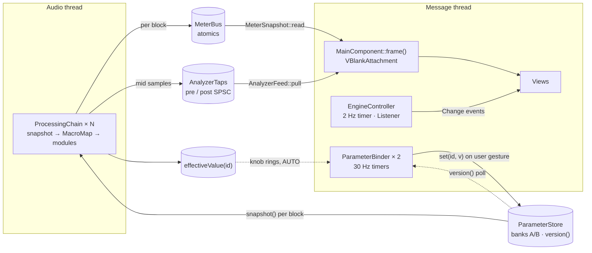

# 06 — GUI Structure & Key Components (Workflow 5)

> The desktop GUI is a native JUCE 9 application: `app/Source/ui` holds the components and `app/Source/shell` holds the window, tray, hotkeys and headless screenshot driver. It is a presentation layer only. It writes parameters and reads telemetry through the three lock-free channels of [`01-architecture.md`](01-architecture.md) §3, and nothing it does can block the audio thread.
>
> This document describes the GUI **as implemented**: design language, layout, component hierarchy, update model, every key component, tray and hotkeys, the per-app routing UX, the device advice banner and the headless screenshot driver. Anything planned rather than built is labelled **Roadmap** with its item number in [`07-roadmap.md`](07-roadmap.md). Examples: the onboarding wizard, the custom plug-in editor and macOS per-app routing.

**Reading conventions**

- Paths are relative to the repository root. `ui/…` is short for `app/Source/ui/…` and `shell/…` for `app/Source/shell/…`.
- A **frame** is one display refresh delivered by `juce::VBlankAttachment`. Rates are quoted at a 60 Hz display. Work scheduled "every N frames" scales with the refresh rate, while ballistics use the measured `dt` and do not.
- Sizes are logical pixels (px). JUCE maps them to physical pixels on HiDPI displays.
- Every number is a constant from the code. Colours are given as `#RRGGBB`; all tokens are fully opaque.

| § | Topic |
|---|---|
| [1](#1-status-at-a-glance) | Status at a glance |
| [2](#2-design-language) | Design language: palette, accent, meters, typography, spacing, controls, accessibility |
| [3](#3-window-and-layout) | Window, annotated wireframe, layout rules, screenshots, Simple view |
| [4](#4-component-hierarchy) | Component hierarchy and wiring |
| [5](#5-threading-and-update-model) | Threading and update model |
| [6](#6-key-components) | Key components, one by one |
| [7](#7-system-tray-and-global-hotkeys) | System tray and global hotkeys |
| [8](#8-per-app-routing-ux) | Per-app routing UX |
| [9](#9-first-run-and-onboarding) | First run and onboarding |
| [10](#10-plug-in-editor-strategy) | Plug-in editor strategy |
| [11](#11-headless-screenshot-driver) | Headless screenshot driver |
| [12](#12-persisted-ui-state) | Persisted UI state |
| [13](#13-known-limitations) | Known limitations |
| [14](#14-requirement-traceability) | Requirement traceability |

---

## 1. Status at a glance

| Area | Status | Code |
|---|---|---|
| Main window, layout and every panel in §6 | Implemented. The data side of the analyser, level meters, loudness panel and waveform history is tested by `flub_app_tests` (`tests/app/test_app_meters.cpp`, §6.4–§6.8); painting is checked by the CI screenshots only, and the layout by those and by the containment test of §3.5 (both views, 1100 × 700 to 2560 × 1440) | `ui/*`, `shell/MainWindow.*` |
| Simple view ([11 E39](11-enhancement-report.md#e39)) | Implemented (§3.5): the default view for a new user, the last choice kept; mode, strip, preset, A/B, Bypass, the Boost dial, the five macros, up to three rows of active-now chips, the headset status and one loudness meter; the full window one click away. Views, persistence, the layout at 1100 × 700 to 2560 × 1440 and the chip wrapping are tested by `tests/app/test_app_ui_simple_view.cpp` | `ui/MainComponent.*`, `ui/SimpleStatusPanel.*`, `ui/BoostPanel.*`, `ui/HeaderBar.*` |
| Design system: tokens, look-and-feel, vector icons | Implemented | `ui/Theme.*`, `ui/FlubLookAndFeel.*`, `ui/Widgets.*` |
| Colour-blind safe meter palette | Implemented. It covers the level meters, clip LEDs and strip mini meters, plus the status colours of the loudness panel (gain reduction, clipper, TP, correlation), the muted-strip icon and the app-chip error badge. A few amber/green indicators stay fixed (§2.8) | `ui/Theme.*`, `ui/SettingsDialog.*` |
| Headset / output-device advice banner | Implemented | `ui/DeviceAdviceBanner.*` |
| Device error banner and notice bar ([11 E51](11-enhancement-report.md#e51), [E52](11-enhancement-report.md#e52), [E42](11-enhancement-report.md#e42)) | Implemented (§6.2a): a muted or failed output with Retry / Choose output / Sound settings; preset reader warnings, a restored settings file and the latency-profile prompt. Tested by `tests/app/test_app_ui_status.cpp` | `ui/NoticeBanners.*` |
| Settings dialog: Audio, Correction, Processing, Hotkeys, General | Implemented | `ui/SettingsDialog.*` |
| Headphone / speaker correction per output device ([11 E15](11-enhancement-report.md#e15) MVP) | Implemented: import an AutoEQ / Equalizer APO ParametricEQ.txt, on / off, compare, remove; stored per output device; automatic preamp. No bundled measurement data, no GraphicEQ, no target curves yet | `ui/SettingsDialog.*` (`CorrectionPage`), `engine/EngineController.*`, `settings/AppSettings.*` |
| System tray / macOS menu-bar icon | Implemented | `shell/TrayIcon.*` |
| Global hotkeys | Implemented on Windows (`RegisterHotKey`), macOS (Carbon `RegisterEventHotKey`) and Linux: `XGrabKey` under X11, the xdg-desktop-portal GlobalShortcuts interface in Wayland sessions ("unsupported" when the desktop has no such portal) | `shell/HotkeyManager.*`, `app/Source/platform/PlatformServices_*` |
| Per-app routing UI | Implemented. Backend support differs per OS (§8). The routing model (`AppRouting`) is tested with a fake router and fake captures (`tests/app/test_app_routing.cpp`); `RoutingPanel`'s strip rows are not (its *Auto profiles* list is, below) | `ui/RoutingPanel.*`, `app/Source/engine/AppRouting.*` |
| Automatic profiles (foreground app → preset) | Implemented (roadmap 2.5, §8.1): rules in the routing panel's *Auto profiles* list. Foreground detection on Windows (`GetForegroundWindow`), macOS (`NSWorkspace.frontmostApplication`) and Linux X11 (`_NET_ACTIVE_WINDOW` + `_NET_WM_PID`); unsupported under Wayland, which the panel says. The decision logic, the controller (with a fake foreground app), persistence and the list / add form are tested by `flub_app_tests` (`tests/app/test_app_auto_profile.cpp`), the X11 query under Xvfb by `flub_tests` (`tests/test_platform_linux.cpp`). The Windows path has been compiled (MinGW) but not run, the macOS path not yet built or run on a Mac | `app/Source/engine/AutoProfile.h`, `EngineController.*`, `ui/RoutingPanel.*`, `app/Source/platform/PlatformServices_*` |
| Headless screenshot driver (incl. `--device` and `--state`) | Implemented; used by CI: the `app` job's Linux step renders three screenshots under `xvfb-run` and uploads them as the `screenshots` artifact (green in CI run 36247109446; nothing is compared against a reference image) | `shell/ScreenshotDriver.*`, `.github/workflows/ci.yml` |
| Onboarding wizard | **Roadmap** 1.6 (device check, OEM enhancements, headphones vs speakers) and 3.6 (wizard) | — |
| Custom plug-in editor sharing these components | **Roadmap** 2.9. Today the plug-in uses JUCE's generic editor plus a toolbar (§10) | `plugin/Source/PluginEditor.*` |
| Export / batch process dialog | Implemented (roadmap 2.10, §6.12): preset menu › *Export / batch process audio files…*. The job (decode, render, write, cancel, refusals, parity with `flubsound-cli`) and the dialog's settings and layout are tested by `flub_app_tests` (`tests/app/test_app_export.cpp`); its painting is not checked by CI | `app/Source/export/*`, `tools/flubsound-cli/OfflineRenderer.*` |
| Start with the OS | Implemented: Windows `HKCU\…\CurrentVersion\Run`, macOS 13+ `SMAppService` login item (older macOS: hidden), Linux XDG autostart entry. Only the Linux path has been run; the Windows path has been compiled (MinGW) but not run, and the macOS path not yet built or run on a Mac | `ui/SettingsDialog.*`, `app/Source/platform/PlatformServices_*` |
| Hearing guard, localisation, accessibility audit, UI motion polish | **Roadmap** 2.11, 3.7, 3.6 | — |

---

## 2. Design language

The visual language rests on five decisions:

- a near-black canvas with raised panels;
- **one accent colour that follows the processing mode**;
- numeric readouts that are legible at a glance;
- vector drawing only (no bitmaps), so every scale factor is crisp;
- three levels of depth, as promised in [`08-pitfalls-and-solutions.md`](08-pitfalls-and-solutions.md): Boost Intensity + 5 mode macros → module cards with 3–5 key controls → the full parameter grid of one module.

### 2.1 Palette tokens

`ui/Theme.h`, namespace `Palette`. Every colour the UI draws with is one of these tokens; nothing else is hard-coded. The names refer to the active theme's `PaletteTokens`: *Settings › General › Theme* switches between the standard dark theme and a high-contrast one (`Theme::setTheme`, §2.8).

| Token | Standard | High contrast | Used for |
|---|---|---|---|
| `background` | `#0E1014` | `#000000` | Content background; edge fades of the module rack |
| `well` | `#0A0C10` | `#000000` | Meter wells, plot backgrounds, text-editor fill |
| `panel` | `#161A21` | `#0C0D10` | Panel base. `drawPanel()` fills a vertical gradient from `panel.brighter (0.035)` at the top to `panel` 160 px down, then draws a 1 px `border` |
| `panelRaised` | `#1C212A` | `#16181C` | Buttons, combo boxes, the advice banner |
| `panelHover` | `#222834` | `#262A31` | Hover states |
| `menu` | `#171B22` | `#0C0D10` | Popup menus |
| `tooltip` | `#1F2530` | `#16181C` | Tooltips, EQ node readouts |
| `tabOn` | `#262D3A` | `#2A2F38` | Selected "tab" button |
| `border` | `#232A35` | `#9AA3B2` | 1 px panel borders and dividers |
| `borderStrong` | `#2F3847` | `#C8CED8` | Control outlines |
| `track` | `#2F3847` | `#606878` | Knob and slider tracks (in high contrast ≥ 3:1 both against the panel and against the accent value arc) |
| `grid` | `#1D232D` | `#3A404A` | Grid lines of the meters and the history |
| `gridMinor`, `gridMajor` | `#141920`, `#232B37` | `#262B33`, `#4A5260` | Analyser frequency lines (minor, decades) |
| `scrollThumb`, `scrollThumbHover` | `#343C4A`, `#4A5466` | `#9AA3B2`, `#D0D6E0` | Scrollbar thumb |
| `text` | `#E6E9EF` | `#FFFFFF` | Primary text, knob pointers, the EQ curve |
| `muted` | `#8A93A3` | `#E2E6EE` | Captions, secondary text, the input (pre) spectrum |
| `faint` | `#7F899B` | `#C3C9D4` | Axis labels, empty states, disabled controls. Was `#5A6373` (2.9:1 on a panel); raised to meet WCAG AA |
| `teal` | `#22D3EE` | `#3DE8FF` | **Music** accent |
| `magenta` | `#E879F9` | `#FFA0FF` | **Gaming** accent; surround channel badges (always magenta) |
| `amber` | `#FBBF24` | `#FFD23F` | Warnings (card notes, hotkey errors, CPU > 70 %), Bypass when on, "preset modified" dot, advice banner, governor limiting. It is also the *warn* status colour of the standard palette (gain-reduction bars, clipper, correlation < 0.3) |
| `red` | `#F87171` | `#FF8080` | The *hot* status colour of the standard palette (app-chip routing errors, correlation < 0, loudness-panel TP over −1 dBTP, clipper over budget, muted-strip icon) |
| `green` | `#34D399` | `#4CF5A8` | "Safety governor OK". It is also the *safe* status colour of the standard palette (correlation ≥ 0.3) |
| `dynamicEq` | `#FBBF24` | `#FFD23F` | Dynamic-EQ ghost markers and the Dyn band dot |
| `meterSafe`, `meterHot` | `#34D399`, `#EF4444` | `#4CF5A8`, `#FF5A5A` | Ends of the standard meter gradient (§2.3) |
| `knobTop`, `knobBottom`, `knobRim` | `#2A313D`, `#171B22`, `#343D4C` | `#2A2F38`, `#16181C`, `#C8CED8` | Knob body gradient and outline |
| `highlight`, `shadow` | white, black | white, black | Translucent sheens and drop shadows |
| `eqBands` | 10 colours | same | EQ band nodes (`EqCurveEditor::bandColour`) |

**Contrast** (WCAG 2.x, `Theme::contrastRatio`; checked for every pair by `tests/app/test_app_accessibility.cpp`):

- *Standard:* every text token (`text`, `muted`, `faint`, the accents and status colours) ≥ 4.5:1 on `background`, `well`, `panel` and the top of the panel gradient; `text` and `muted` ≥ 4.5:1 on `panelRaised`, `panelHover`, `menu` and `tooltip`. Disabled controls (drawn in `faint` on raised surfaces) are exempt in WCAG.
- *High contrast:* every text token ≥ 4.5:1 on every surface (`text` and `muted` ≥ 7:1); borders, tracks, the scrollbar thumb, knob rims, both meter palettes and the EQ band colours ≥ 3:1 on the surfaces they are drawn on.

The `DocumentWindow` background is `#0F1115` (`shell/MainWindow.h`), but it is never visible behind the opaque `MainComponent`.

### 2.2 Mode accent

- **Rule.** `Theme::accentForMode()` returns magenta for Gaming and teal otherwise. The accent is stored in `FlubLookAndFeel::setAccent()`. `applyAccentColours()` re-colours every accent-dependent JUCE colour ID:
  - toggled buttons (20 % alpha) and tick boxes;
  - focused combo and text-editor outlines;
  - popup highlight (16 % alpha);
  - slider fill and track;
  - text-box highlight, caret, label editing outline, hyperlinks.

  Custom components ask for the accent with `Theme::accent (component)`.
- **What follows the accent:**
  - the logo tile and the "Pro" wordmark;
  - active-strip dots and the selected strip row;
  - the output spectrum and its peak-hold line, and the EQ curve fill;
  - the Boost dial and all knob arcs;
  - the SHORT loudness value, the upward-gain and width bars;
  - the waveform envelope and the routing-method pill;
  - the AUTO pill and focus rings.
- **What does not:** the advice banner (amber), surround badges (magenta), meter colours (§2.3), the correlation meter and the tray icon (§7.1).
- **Switching.** `MainComponent::frame()` reads the *selected strip's* `Mode` every frame. On a change, `applyMode()`:
  1. sets the accent;
  2. relabels the macros (`BoostPanel::setMode`);
  3. refreshes the header;
  4. calls `sendLookAndFeelChange()`, which invalidates the cached analyser grid and EQ layer.

  The header's mode thumb slides and cross-fades teal ↔ magenta with a time constant of 55 ms.
- **One look-and-feel.** `FlubsoundApplication` installs `FlubLookAndFeel` as the application default. Dialogs, alert windows, tooltips and the tray menu therefore match the main window. `MainComponent` only creates a private instance if the default is not a `FlubLookAndFeel`.

### 2.3 Meter palette

| Palette | safe | warn | hot | Selection |
|---|---|---|---|---|
| Standard | `meterSafe` `#34D399` | `amber` `#FBBF24` | `meterHot` `#EF4444` (high-contrast theme: `#4CF5A8` / `#FFD23F` / `#FF5A5A`) | Settings › Processing › Meter colours |
| Colour-blind safe (Okabe–Ito) | `#56B4E9` sky blue | `#F0E442` yellow | `#D55E00` vermillion | same; persisted as `ui.meterPalette = 1` |

- **Zones** (`Theme::meterColourForDb`, used for peak-hold lines): ≥ −3 dBFS is *hot*, ≥ −12 dBFS is *warn*, anything lower is *safe*.
- **Bar gradient** (`LevelMeters::gradient`). The stops are placed in meter-deflection coordinates (§6.6):
  - *safe* up to −14 dBFS;
  - blend to *warn* at −10 dBFS and hold it to −4 dBFS;
  - *hot* from −2 dBFS to 0 dBFS.
- **Users of the meter colours** (`Theme::meterColours`): the level-meter bars, the peak-hold lines, the clip LEDs, the strip mini meters in the routing panel and the TRUE PEAK readout when it is above −1 dBTP.
- **Status colours** (`Theme::statusColours`). These are for indicators that encode a state by colour outside the level bars. The standard palette gives the UI's own `green` / `amber` / `red` (`#34D399` / `#FBBF24` / `#F87171`, note *hot* is `red`, not the meter's `#EF4444`). The colour-blind safe palette gives the same Okabe–Ito triple as above. Users:
  - the loudness panel's gain-reduction bars (*warn*), clipper bar (*warn*, *hot* over budget), TP readout (*hot*) and correlation meter (*hot* / *warn* / *safe*);
  - the muted-strip icon (*hot*);
  - the app-chip error badge and outline in the routing panel (*hot*);
  - the input level bar of the Settings › Audio device selector (*hot* above 0.95).
- **Switching** the palette in Settings calls `MainComponent::sendLookAndFeelChange()`, so views that cache palette colours (the routing rows' mute icons) refresh at once.

### 2.4 Categorical colours: EQ bands

`EqCurveEditor::bandColour()` (the `Palette::eqBands` token; both themes use the same colours, each ≥ 3:1 on the high-contrast black):

| Band | 1 | 2 | 3 | 4 | 5 | 6 | 7 | 8 | 9 | 10 |
|---|---|---|---|---|---|---|---|---|---|---|
| Colour | `#F87171` | `#FB923C` | `#FBBF24` | `#A3E635` | `#34D399` | `#22D3EE` | `#60A5FA` | `#818CF8` | `#C084FC` | `#F472B6` |

Every node also carries its band number, so band identity is never conveyed by colour alone. The EQ module card shows the same colour as a dot next to "Band N".

### 2.5 Typography

**Family.** `Theme::fontFamily()` runs once and picks the first installed face from this list: Inter, Inter Variable, Segoe UI Variable Text, Segoe UI, SF Pro Text, Helvetica Neue, Roboto, Noto Sans, Open Sans, Cantarell, Liberation Sans. If none is installed it falls back to JUCE's default sans. The chosen face is also set as the look-and-feel's default sans typeface, so JUCE's own dialogs use it.

| Role | Helper | Style | Examples |
|---|---|---|---|
| Caption | `Theme::caption (h = 11)` | bold, kerning +0.08, upper case by convention | `LOUDNESS`, `BOOST INTENSITY`; pills at ≤ 10 px |
| Numeric | `Theme::numeric (h, bold = true)` | kerning +0.01 | TRUE PEAK 24 px; LUFS 21 px (25 px for SHORT); Boost value 22–46 px; header latency 12.5 px; knob value boxes 12 px regular |
| Body | `Theme::font (h, bold)` | plain / bold | card titles 13 px bold; labels 11.5–13 px; axis labels 9.5–10.5 px |
| Wordmark | `Theme::font` | 17 px bold, 15 px when compact | "Flubsound" in `text` + "Pro" in the accent |

Formatting helpers:

| Helper | Output |
|---|---|
| `Theme::formatDb` | `"-inf"` at ≤ −99 dB or for non-finite input |
| `Theme::formatSignedDb` | explicit `+` / `-`; a value that rounds to `"0.0"` gets no sign |
| `Theme::formatLufs` | `"--.-"` at ≤ −70 LUFS |

### 2.6 Shape, spacing and elevation

| Token | Value |
|---|---|
| Panel radius (`Theme::kPanelRadius`) | 10 px |
| Control radius (`Theme::kControlRadius`) | 6 px: framed icon buttons, combo boxes, banner, analyser plot well |
| Module card / strip row radius | 8 px / 7 px |
| Window margin / gap between panels | 12 px / 10 px |
| Header height | 56 px |
| Advice banner height (`DeviceAdviceBanner::kHeight`) | 34 px, plus a 10 px gap |
| Panel inner padding | 12–14 px horizontal (module cards 10 px), 8–12 px vertical |
| Control heights | 32 px in the header (34 px mode switch); 30 px for settings rows and routing buttons; 26 px module-card header |

**Elevation.** Panels use the gradient fill plus a 1 px border. Framed controls use `Theme::sheen()`, a subtle vertical gradient.

### 2.7 Control vocabulary

`FlubLookAndFeel` draws every stock JUCE widget. A style is chosen with the component property `flubStyle` (`Style::set (component, "tab")`), so plain `juce::TextButton` / `ToggleButton` / `Slider` objects are used throughout.

| Widget | Style | Look | Used by |
|---|---|---|---|
| `TextButton` | `tab` | neutral; ON = raised fill + 2 px accent underline | strip selector, A/B, settings navigation |
| | `chip` | pill; ON = accent tint + accent text | analyser In / Out / Tilt / Hold |
| | `warning` | amber tint and outline while toggled on | Bypass |
| | *(none)* | raised `panelRaised` sheen + `borderStrong` outline; ON = accent tint and outline | banner buttons, dialog buttons |
| `ToggleButton` | `power` | round power icon; accent while on | module enable |
| | `switch` | pill switch + label | Dyn EQ band On, settings toggles, `ParamGrid` toggles |
| | *(none)* | tick box + label | — |
| `Slider`, rotary | — | 270° sweep from `kRotaryStart = 1.25π` to `kRotaryEnd = 2.75π` (−135°…+135°). Bipolar ranges grow from their zero point. Optional *effective-value* ring | `ParamKnob`; `BoostDial` uses the same angles |
| `Slider`, linear | — | 4 px track, 12 px thumb; bipolar ranges grow from 0 | strip gain |
| `IconButton` | Ghost / Framed / Round | vector icon, optional text | header, cards, routing footer |

**Knob anatomy** (`drawRotarySlider`):

- The track is `clamp (0.075 · size, 2.5, 6)` px wide.
- The value arc has a 16 %-alpha halo 4 px wider than the track.
- The body is a gradient disc with a pointer; a keyboard-focus ring is drawn in the accent at 55 %.
- **Effective-value ring.** The `flubEffective` property is set by `ParameterBinder` (§5.4). When the effective value differs from the knob position by more than 0.004 of the travel, a 1.5 px outer arc runs from the knob value to the effective value and ends in a 4 px dot. This is how Boost Intensity and the macros become visible on the module knobs they drive. The effective value also carries the engine's mode and format overrides, so the ring shows what is applied: crossfeed 0 in Gaming, width 1 / space 0 / crossfeed 0 under the binaural lock, air 0 below 42 kHz, and ratio 1:1 for a Gaming compressor that only macros switched on ([03 §14.1](03-dsp-design.md#141-base-values-effective-values-and-the-macro-formula)).

**`ParamKnob`** (`ui/ParamKnob.*`) is caption above, knob, value box below.

| Size | Preferred size | Used in |
|---|---|---|
| Small | 64 × 78 | full parameter grids |
| Medium | 70 × 90 | module cards |
| Large | 84 × 106 | macros |

The drag sensitivity is 220 px for full travel, and velocity mode is off. Clicking the value box lets the user type a value.

**Icons** (`ui/Widgets.h`) are paths on a 24 × 24 design grid, stroked with round caps (1.7 px by default): gear, chevrons, more, copy, power, expand, collapse, ear, plus, close, reset, external, music note, gamepad, speaker, speaker-muted and the logo.

### 2.8 Accessibility

**Implemented**

- **Names and descriptions.** Every custom component sets a title and a description, for example "Spectrum analyser — Input and output spectrum of the selected strip, 20 Hz to 20 kHz". Every bound slider gets the parameter name as its title. Its help text reads "*Name* (double-click to reset to *default*)" (`ParamFormat::configureSlider`). `IconButton` uses its accessible name as its title. `Style::describe()` sets title, help text and tooltip in one call.
- **Keyboard.**
  - Focus rings are drawn on knobs, sliders, buttons, toggles, combo boxes, the mode segments, the Boost dial and the EQ plot.
  - The EQ curve is fully keyboard-editable (§6.5).
  - Esc collapses an expanded module card and closes the settings dialog.
  - Alert windows bind Return and Esc.
- **Redundant coding.** EQ nodes are numbered. The mode switch shows a label and an icon. The governor chip states its status in words. Every bar has a numeric readout. App chips draw their state as a shape (§6.10) and name it in their tooltip and in the strip row's accessible description.
- **Meters.** A colour-blind safe palette (§2.3) for the level meters and the status colours of the loudness panel and routing rows.
- **Tooltips** appear after 650 ms. They are disabled in headless screenshot runs.
- **HiDPI.** All drawing is vector. The cached analyser grid and EQ layer are rendered at the physical pixel scale and re-rendered when that scale changes.
- **UI scale.** *Settings › General › UI scale*: *Follow system* (default: only the OS's display scaling) or 75, 90, 100, 110, 125, 150, 175 or 200 % (`AppSettings::getUiScalePercent`, key `ui.scalePercent`; other values are clamped to 75–200 %). `Theme::applyUiScale` sets `juce::Desktop::setGlobalScaleFactor`, so every window, dialog, menu and tooltip scales, text is laid out at the physical resolution (crisp) and mouse hit-testing uses the scaled coordinates. It applies at once and at start-up (before the main window restores its position). Windows keep their size in logical pixels, so they grow on screen: the main window (design minimum 1100 × 700), the settings dialog (720 × 580) and the export dialog (720 × 560) register their minimum with `Theme::setMinimumWindowSize`, which caps it at the display's user area and shrinks a window that no longer fits (`Theme::minimumWindowSize`).
- **High contrast.** *Settings › General › Theme › High contrast* (key `ui.theme`): black surfaces, white text, bright borders and a mid-grey knob track (§2.1), meeting WCAG AA. `Theme::setTheme` re-points `Palette::`, re-applies the colours of every `FlubLookAndFeel` (the mode accent follows), re-maps colours that components set explicitly from the old palette (`Theme::remapComponentColours`) and sends every window a look-and-feel change, so cached layers are redrawn; nothing needs a restart. The colour-blind meter palette (§2.3) combines with either theme.

**Gaps** (**Roadmap** 3.6, accessibility audit)

- The custom-drawn views (spectrum, meters, loudness, history) expose a title and description but not their live values. No custom `AccessibilityHandler` exists.
- Some indicators keep fixed colours whatever the palette:
  - the governor chip and inner arc (green/amber; the chip also states its status in words);
  - the CPU readout (amber over 70 %);
  - the preset-modified dot and the card warning notes (amber).
- The high-contrast theme is chosen in the app only; it does not follow the OS's high-contrast / increased-contrast setting.

---

## 3. Window and layout

### 3.1 Window

`shell/MainWindow.*` is a `DocumentWindow` titled "Flubsound Pro":

- native title bar, resizable;
- **minimum 1100 × 700**, default 1280 × 820, centred on first start;
- position and size saved in `AppSettings` when the window is closed and at shutdown;
- two views of the same window: **Simple** (§3.5, the default until the user picks one) and **Advanced** (§3.2–§3.4, every panel). The header's view button switches them and the choice is kept (`ui.view`, §12). Both views share the minimum size.

The close button is handled by the application: it either closes to the tray or quits (§7.1). For headless screenshots, `setExactContentSize()` lifts the minimum.

The content is `ui::MainComponent`: opaque, 1280 × 820 initially, keyboard-focusable. The layout comment in `ui/MainComponent.h` targets 1100 × 700 up to 2560 × 1440; the resize limit itself is 16384 × 16384.

### 3.2 Annotated wireframe

This is the **Advanced** view (the Simple view is §3.5). The proportions follow the 1440 × 900 screenshots in §3.4; exact sizes are in §3.3.

```
+------------------------------------------------------------------------------------------------+ y 0
| HEADERBAR  56 px                                                                               |
| [logo Flubsound Pro] [Music|Gaming] [Game|Music|Chat|System]  [<][preset      v][>][...]       |
|                                        [A|B][copy] [Bypass] LATENCY 5.4 ms [view][gear]        |
+------------------------------------------------------------------------------------------------+ y 56
| DEVICE ERROR BANNER  34 px + 10 px gap (only while the output is muted or the device failed)  |
| [!] Audio device error  message...                  [Retry][Choose output][Sound settings]     |
| DEVICE ADVICE BANNER  34 px + 10 px gap (only for a recognised headset or a Bluetooth link)    |
| [headphones] Family . connection . ceiling -x.x dBTP  advice...  [Use <preset>][Details][x]    |
| NOTICE BAR  34 px + 10 px gap (only while a notice waits)                                      |
| [!] Preset "X": unknown parameter "bost" ignored ...          +1 more  [Use Quality][x]        |
+------------------+-----------------------------------------------+-----------------------------+ y 68 (+44 with banner)
| STRIPS & ROUTING | BOOST INTENSITY        MUSIC|GAMING MACROS    | LEVELS                      |
|        [MANUAL]  | ( 55 ) | (o)  (o)  (o)  (o)  (o)  [governor]  | IN  OUT | TRUE PEAK -2.1    |
| +--------------+ |  dial  |  5 macro knobs (captions per mode)   | ||  ||  | OUT PEAK L/R      |
| |* Game   [7.1]| +-----------------------------------------------+ ||  ||  | OUT RMS  L/R      |
| | gain  ----o  | | SPECTRUM + EQ   [In][Out][Tilt][Hold][+-12 dB]| ||  ||  | IN PEAK  L/R      |
| | mini meter   | |  0 dB __________________________________ +12  +-----------------------------+
| | app chips    | |     input spectrum (grey fill)                | LOUDNESS                    |
| +--------------+ |     output spectrum (accent) + peak hold      | MOMENT.   SHORT   INTEGR.   |
| | Music STEREO | |     EQ curve, numbered nodes 1..10            | LRA       TP      AUTO      |
| | Chat  ...    | |     dynamic-EQ ghost markers (amber)          | GAIN REDUCTION              |
| | System ...   | | -84 dB ______________________________ -12     |  Compressor  Limiter  Glue  |
|                  |   20  50  100  200  500  1k  2k  5k  10k  20k |  Bass protect  Master       |
|                  +-----------------------------------------------+  Clipper (-30 dB budget)    |
|                  | [Noise Gate][Parametric EQ][Dynamic EQ][Ba -> | STEREO                      |
| [+ Assign app..] |  module cards, horizontal scroll; one card    |  Correlation     Width      |
| [System sound..] |  can expand to fill the whole rack            |                             |
+------------------+-----------------------------------------------+-----------------------------+
| OUTPUT HISTORY  12 s        mirrored min/max envelope + short-term LUFS trace    -12.3 LUFS    |
+------------------------------------------------------------------------------------------------+
```

### 3.3 Layout rules

`MainComponent::resized()`. `W` is the component width. `C` is the content height below the header (and the banner, if shown) inside the 12 px margins. `H` is `C` minus the history and its 10 px gap. `R` is the centre-column height left below the Boost panel and its gap.

| Region | Rule |
|---|---|
| Header | top 56 px, full width |
| Banners | device error, device advice, notice bar in that order, each `DeviceAdviceBanner::kHeight` = 34 px + 10 px gap, only when its `shouldShow()` |
| Output history | bottom, `clamp (C / 8, 76, 128)` px (integer division) |
| Routing panel | left, `clamp (round (0.17 · W), 228, 300)` px wide |
| Right column | right, `clamp (round (0.19 · W), 252, 320)` px wide |
| Level meters | top of right column, `clamp (max (round (0.40 · H), H − 440 − 10), 196, 560)` px. The loudness panel's content is about 380 px, so tall windows give the spare height to the meters |
| Loudness panel | rest of the right column |
| Boost panel | top of the centre column, `clamp (round (0.27 · H), 150, 212)` px |
| Module rack | bottom of the centre column: `clamp (round (0.36 · R), 150, 200)` px, or `round (0.64 · R)` while a card is expanded |
| Analyser panel | whatever remains in the centre column |

The same rules, computed at the sizes used in this document:

| Geometry (px) | routing w | centre w | right w | history h | levels h | loudness h | boost h | analyser h | rack h |
|---|---|---|---|---|---|---|---|---|---|
| 1280 × 820 (default) | 228 | 756 | 252 | 92 | 255 | 373 | 172 | 282 | 164 |
| 1440 × 900 | 245 | 877 | 274 | 102 | 298 | 400 | 191 | 314 | 183 |
| 1440 × 900 + banner | 245 | 877 | 274 | 97 | 268 | 391 | 181 | 296 | 172 |
| 1100 × 700 + banner (minimum) | 228 | 576 | 252 | 76 | 196 | 284 | 150 | 170 | 150 |

At 1440 × 900 an expanded module card takes 324 px, leaving the analyser 173 px.

**Adaptive behaviour**

- **Header** is *compact* below 1280 px width:
  - logo area 136 px instead of 160;
  - mode switch 152 px instead of 176;
  - strip buttons 54 px instead of 60;
  - the LATENCY / CPU captions are hidden.

  The view button ([11 E39](11-enhancement-report.md#e39), 34 px plus a 4 px gap, left of the gear) is shown at every width and takes that much from the preset area. The preset ‹ › arrows are hidden whenever the preset area minus the menu and arrow widths is under 180 px. The preset combo is at most 300 px wide (250 compact).
- **Routing panel.** If the red *No apps are being processed* notice (§6.10) does not fit above the strip rows at full length, it collapses to one line, *"No apps are being processed - why?"* (*"No apps processed - why?"* when that does not fit either). The full text is in its tooltip, and clicking opens it in an alert.
- **Level meters.** Scale labels are skipped when they would be closer than 11.5 px; grid lines are always drawn. Each numeric readout is only drawn if at least 30 px remain.
- **Module rack.** Cards keep their preferred width, `max (220, keys · 72 + 28)` px, and scroll horizontally with a 10 px scrollbar and 36 px edge fades. The ten cards need 3,394 px, so on practical window sizes the rack always scrolls. Only when everything fits is the spare width spread over the cards.
- **Analyser legend** is drawn only when all four entries fit left of the option chips.

### 3.4 Screenshots

All four images are real renders of the app by the headless driver (§11). No audio device is open; the engine runs on synthetic programme material.


*`--screenshot app-music.png --mode music --size 1440x900`.*

- The Music strip is selected and the accent is teal.
- The preset is *Bluetooth Headphones* because the driver loads the first factory preset whose mode is Music, and the factory list is ordered by category, then name. The amber dot on the preset box means *modified*: the driver raised Boost to 55 % after loading.
- `LATENCY 5.4 ms` / `DEVICE offline`: with no device there are no device buffers. The readout is the engine latency alone, 260 samples at 48 kHz: the largest strip chain (192 samples, Balanced) plus the master safety limiter (1 ms look-ahead = 48 samples + 20 samples of true-peak detector delay). The screenshot predates docs/11 E42a / E51: a current build shows `--` without a running device (no audible path), and an estimate such as `~12.3 ms` only while one runs.
- The routing notice appears because the CI container has no routing back-end. The screenshot predates docs/11 E47a: a current build draws it as the red *No apps are being processed* state under the panel header (§6.10).


*`--mode gaming`.*

- The Game strip (7.1) is selected and the accent is magenta.
- The driver plays a 7.1 game scene on Game and music at −12 dB on the Music strip, so both strips show activity dots.
- The single amber diamond near 90 Hz is the live gain of the Gaming *anti-masking* mode band (dynamic-EQ band 6). The screenshot predates docs/11 E19 and E20: that band is now this preset's user band 0 (same 90 Hz shelf, so its diamond sits in the same place), and the footstep bands 4 / 5 are the cue enhancer, which shows a diamond at 3.2 kHz / 260 Hz only while a cue rises out of the ambience (up to +3.2 / +1.4 dB at this preset's Footsteps 45 %; a marker is drawn from 0.1 dB).
- The compressor shows −2.0 dB of gain reduction (*7.1 Headphone Surround* sets a 1.5:1 ratio, so its downward section stays in force).


*`--mode gaming --device "Headphones (Stealth 700 Gen 2 MAX)"`.*

- The simulated output matches the *Turtle Beach Stealth series* profile on a USB / wireless-dongle connection, with a −1.0 dBTP ceiling.
- The banner shows the top piece of advice and offers *Use Competitive FPS*.
- Everything below the header moves down by 44 px (34 px banner + 10 px gap).


*`--size 1100x700 --mode music`, with `--device` naming a Stealth-series endpoint on a Bluetooth **hands-free** connection.* The minimum window size shows most of the adaptive rules of §3.3:

- The ceiling is −3.0 dBTP.
- There is no *Use …* button: the suggested preset (*Bluetooth Headphones*) is already loaded.
- The header is compact: no LATENCY caption, no preset arrows.
- The routing notice is the one-line form (in a current build the red *"No apps are being processed - why?"*, §6.10).
- The IN PEAK readout is dropped, and the −3 dB meter label is skipped.
- The analyser legend is hidden, and the rack shows two cards with its scrollbar.

### 3.5 Simple view

[11 E39](11-enhancement-report.md#e39): a reduced main window for listeners who do not want the engineer's rack. It is the view a new user sees; after that the last choice is kept (`AppSettings::getMainView`, key `ui.view`: anything but `advanced`, including no value, is Simple). The header, the banners and every control in them are the same as in the Advanced view; below them `MainComponent::layoutSimple` shows two parts and hides the routing panel, analyser, module rack, level meters, loudness panel and output history (`MainComponent::getAdvancedOnlyComponents`).

```
+------------------------------------------------------------------------------------------------+
| HEADERBAR: mode, strips, preset, A/B, Bypass, latency / CPU, [view: Advanced], settings        |
+------------------------------------------------------------------------------------------------+
| banners (device error, device advice, notice bar), as in the Advanced view                     |
|        +--------------------------------------------------------------------------------+      |
|        | BOOST INTENSITY            MUSIC MACROS                     [Safety governor OK] |      |
|        |    ( 55 )     |   (o)     (o)     (o)     (o)     (o)                           |      |
|        |   dial        |  Punch  Width  Clarity  Loudness  Warmth                        |      |
|        |   <= 280 px   |  ACTIVE [EQ 1 band] [Subsonic 20 Hz] [Bass +5.6 dB @ 60 Hz] ... |      |
|        |               |         [Presence 45%] [Air 29%] ...    (up to three rows)      |      |
|        +------------------------------------------+-------------------------------------+      |
|        | OUTPUT                                   | LOUDNESS                            |      |
|        | [ear] Turtle Beach Stealth series        | -12.2 LUFS short-term               |      |
|        | device . connection . ceiling -1.0 dBTP  | [==========|=====        ]          |      |
|        | No headphone correction                  | 2.9 LU louder than the input        |      |
|        |          [Headphone correction...][Output...]                                  |      |
|        +------------------------------------------+-------------------------------------+      |
|        | Spectrum and EQ, routing, the module rack ... in the Advanced view. [Advanced view]    |
+------------------------------------------------------------------------------------------------+
```

| Region | Rule |
|---|---|
| Content width | the area under the banners inside the 12 px margins, at most 1180 px wide, centred |
| Status row (`SimpleStatusPanel`) | `clamp (round (0.40 · C), 200, 260)` px: the two cards over a 34 px footer and a 10 px gap; the OUTPUT card takes 56 % of the width |
| Boost panel (Simple layout) | `clamp (C − status − 10, 150, 380)` px, above the status row; spare height is split above and below the pair |
| Boost dial | as tall as the panel allows, 104–280 px (Advanced: 104–196) |
| Macro knobs | at most 124 × 156 px in cells at most 170 px apart (Advanced: 96 × 124) |
| Active-now chips | up to three 20 px rows (one row more while the knobs keep about 118 px), wrapped (`BoostPanel::layoutChips`); the last row keeps 34 px free for the *+N* of what does not fit (Advanced: one row) |

- **OUTPUT** is the headset status (`SimpleStatusPanel::describeOutput`): the matched profile, or the device name as a *generic output, no headset profile*, then the connection, the safety ceiling the master limiter applies and the device correction ([11 E15](11-enhancement-report.md#e15): *Headphone correction: HD 600.txt (on)* or *No headphone correction*). A device problem (§6.2a) prefixes *Output muted: feedback loop* / *Audio device error* in the hot status colour. The first advice message is shown only while the advice banner is not (dismissed, or no profile). **Headphone correction…** and **Output…** open Settings on the Correction and Audio pages.
- **LOUDNESS** is the one loudness meter: the selected strip's output short-term loudness as a number and a bar from −36 to 0 LUFS (accent), the input's as a marker, and in words what the strip does to it (`SimpleStatusPanel::describeLoudnessChange`: *2.9 LU louder than the input*, *… quieter …*, *About as loud as the input* within 0.5 LU, *No audio on this strip right now*). Repainted at ≤ 10 Hz.
- **Frame loop.** The analyser taps are still drained, but the Simple view skips the analyser's FFTs, the EQ editor and the rack's engine poll; the rack is refreshed once when the Advanced view comes back.
- **Switching.** The header's view button (expand arrows: *Advanced view*; collapse arrows: *Simple view*) and the footer's **Advanced view** button; an expanded module card is collapsed first. Focus that was on the button moves to the header's view button.
- **Checked.** `tests/app/test_app_ui_simple_view.cpp`: in both views at 1100 × 700 (also with the advice banner and a notice), 1280 × 820, 1920 × 1080 and 2560 × 1440 every visible child lies inside its parent (a `Viewport`'s content excepted), and in the Simple view the header, the Boost dial (≥ 104 px), all five macros, the status row and the Advanced view button are shown without overlap; Signature at Boost 55 shows all 11 active-now chips where the Advanced view's single row shows 3 and *+8*.

Headless renders (`--view simple`, §11) were inspected at 1280 × 820 at 100 % and 150 % UI scale and in the high-contrast theme, and at 1100 × 700 with the advice banner and a notice:


*`--screenshot app-simple-view.png --mode music --size 1280x820 --view simple --device "Headphones (Stealth 700 Gen 2 MAX)"`.*

Not yet part of it ([11 E39](11-enhancement-report.md#e39) remainder): per-parameter "what you will hear" hints, a relevance-ordered rack without the gate card outside Quality, a reflow below 1100 px and a lower minimum size, and a compact tray flyout.

---

## 4. Component hierarchy

```
FlubsoundApplication                        app/Source/FlubsoundApplication.*
├─ FlubLookAndFeel (application default)    ui/FlubLookAndFeel.*
├─ EngineController                         app/Source/engine/EngineController.*
├─ MainWindow  (DocumentWindow)             shell/MainWindow.*
│  └─ MainComponent                         ui/MainComponent.*    EngineController::Listener + VBlankAttachment
│     ├─ HeaderBar                          ui/HeaderBar.*
│     │  ├─ ModeSegment ×2 (Music, Gaming)  custom Button, sliding thumb painted by the header
│     │  ├─ TextButton ×N strips ("tab")    one per strip, activity dot painted over
│     │  ├─ IconButton ‹  ComboBox preset  IconButton ›  IconButton … (preset actions)
│     │  ├─ TextButton A | B ("tab") + IconButton copy
│     │  ├─ PopupButton Bypass ("warning"; right-click = options)
│     │  ├─ IconButton view (Simple ↔ Advanced)
│     │  └─ IconButton settings (gear)
│     ├─ DeviceErrorBanner                  ui/NoticeBanners.*        only while the output is muted / failed
│     │  └─ TextButton "Retry", "Choose output", "Sound settings"
│     ├─ DeviceAdviceBanner                 ui/DeviceAdviceBanner.*   hidden unless relevant
│     │  └─ TextButton "Use <preset>", "Details", "×"
│     ├─ NoticeBar                          ui/NoticeBanners.*        only while a notice waits
│     │  └─ TextButton action (optional), "×"
│     ├─ RoutingPanel                       ui/RoutingPanel.*         Advanced view only (like the analyser, rack, meters, history)
│     │  ├─ Viewport → StripRow ×N          LED, name, channel badge, mute IconButton, gain Slider,
│     │  │                                   mini meter, application chips
│     │  ├─ IconButton "Assign app to strip..."
│     │  └─ IconButton "System sound settings"
│     ├─ BoostPanel                         ui/BoostPanel.*           owns a ParameterBinder
│     │  ├─ BoostDial (juce::Slider)
│     │  └─ ParamKnob ×5 (Large)            ui/ParamKnob.*        Standard or Simple layout
│     ├─ AnalyzerPanel                      ui/AnalyzerPanel.*
│     │  ├─ SpectrumAnalyzer                ui/SpectrumAnalyzer.*
│     │  ├─ EqCurveEditor (same bounds, on top)  ui/EqCurveEditor.*
│     │  └─ TextButton ×4 ("chip") + ComboBox EQ range
│     ├─ ModuleRack                         ui/ModuleRack.*           owns a ParameterBinder
│     │  └─ Viewport → ModuleCard ×10       ui/ModuleCard.*
│     │     ├─ ToggleButton power, IconButton ear, IconButton expand, IconButton ‹ › (banded)
│     │     ├─ key controls: ParamKnob | ComboBox | ToggleButton ("switch")
│     │     └─ (expanded) Viewport → ParamGrid   ui/ParamGrid.*
│     ├─ LevelMeters                        ui/LevelMeters.*
│     ├─ LoudnessPanel                      ui/LoudnessPanel.*
│     ├─ WaveformHistory                    ui/WaveformHistory.*
│     ├─ SimpleStatusPanel                  ui/SimpleStatusPanel.*    Simple view only
│     │  └─ TextButton "Headphone correction...", "Output...", "Advanced view"
│     ├─ TooltipWindow (650 ms; not created with --screenshot)
│     ├─ AnalyzerFeed   (non-visual)        ui/AnalyzerFeed.*
│     └─ MeterSnapshot  (non-visual)        ui/MeterSnapshot.*
│  on demand: DialogWindow → SettingsDialog ui/SettingsDialog.*
│     └─ AudioDeviceSelectorComponent | CorrectionPage | ProcessingPage | HotkeysPage | GeneralPage
│  on demand: DialogWindow → ExportDialog   app/Source/export/ExportDialog.*
│     └─ ExportJob (non-visual; one worker juce::Thread)   app/Source/export/ExportJob.*
├─ TrayIcon (SystemTrayIconComponent)       shell/TrayIcon.*
├─ HotkeyManager                            shell/HotkeyManager.*
└─ ScreenshotDriver (headless runs only)    shell/ScreenshotDriver.*
```

**Shared building blocks.**

- [`ui/Theme.*`](../app/Source/ui/Theme.h): tokens, fonts, panel / caption / pill drawing, number formatting.
- [`ui/Widgets.*`](../app/Source/ui/Widgets.h): icons, `IconButton`, `Style::set` / `Style::describe`.
- [`ui/ParameterBinding.*`](../app/Source/ui/ParameterBinding.h): `ParamFormat` and `ParameterBinder`.

**Coupling.** Only ten UI classes take an `EngineController&`: `MainComponent`, `HeaderBar`, `DeviceAdviceBanner`, `DeviceErrorBanner`, `RoutingPanel`, `BoostPanel`, `ModuleRack`, `SimpleStatusPanel`, `SettingsDialog` and `ExportDialog`. All other components (the `NoticeBar` included) work from a `ParameterStore*` provider, a `ProcessingChain*` provider, a `MeterSnapshot`, or raw sample blocks. This split is the basis of the plug-in editor plan (§10).

**Wiring in `MainComponent`**

| Source | Target |
|---|---|
| `header.onSettingsRequested`, `deviceBanner.onDetailsRequested` | `openSettings()`: a single, non-modal settings window; brought to front if already open |
| `header.onExportRequested` | `openExport()`: a single, non-modal Export / batch process window (§6.12); brought to front if already open, deleted with the main component |
| `levels.onResetRequested`, `loudness.onResetRequested` | `MeterBus::resetLoudnessRequest = true` for the selected strip |
| `rack.onLayoutModeChanged` | `resized()`: a card was expanded or collapsed |
| `analyzer.getEqEditor().onBandSelected` ↔ `rack.onEqBandSelected` | curve node selection and the EQ card's band selector stay in sync |
| `analyzer.onOptionsChanged` | save `ui.analyzer` |
| `AnalyzerFeed` sink | pre → `SpectrumAnalyzer::push (false, …)`; post → `SpectrumAnalyzer::push (true, …)` and `WaveformHistory::push` |
| `header.onViewToggleRequested`, `simple.onAdvancedRequested` | `setView()`: Simple ↔ Advanced (§3.5), saved as `ui.view` |
| `simple.onOutputSettingsRequested`, `simple.onCorrectionRequested` | `openSettings()` on the Audio / Correction page |
| `keyPressed (Esc)` | collapse an expanded module card (Advanced view) |

---

## 5. Threading and update model

### 5.1 Threads and channels

Every UI object lives on the **JUCE message thread**. The audio thread never calls into the UI. The UI reaches audio state only through the following channels:

| Channel | Direction | UI side | Mechanism |
|---|---|---|---|
| `param::ParameterStore` (per strip, banks A/B) | UI → audio | `ParameterBinder`, `EqCurveEditor`, `EngineController` (mode, boost, A/B, bypass, presets), `HeaderBar` (reset, loudness-matched bypass), Settings (latency profile) | `set (id, v)`: clamped relaxed atomic store (NaN is ignored), `version()` incremented. The audio thread takes one `snapshot()` per block |
| `ProcessingChain::effectiveValue (id)` | audio → UI | `ParameterBinder` (knob rings), `ModuleRack` (AUTO / dimming) | post-macro values, including the chain's mode / format overrides, published as relaxed atomics at the end of each block's `applyParameters()` |
| Audition mask (`ProcessingChain::setAuditionBypass`) | UI → audio | `ModuleCard` ear via `ModuleRack` → `EngineController::setAuditionBypass` | one atomic bit per module. It forces the module off whatever the preset or macros say, via the slot's click-free crossfade. It is not a parameter |
| `MeterBus` | audio → UI | `MeterSnapshot::read()` once per frame for the selected strip. `RoutingPanel` reads `outPeakDb` of every strip directly | relaxed atomics written once per block |
| `MeterBus::resetLoudnessRequest` | UI → audio | click on TRUE PEAK or INTEGR. | atomic flag; the chain `exchange`s it at the next block and resets integrated loudness and the TP hold |
| `AnalyzerTaps` pre / post | audio → UI | `AnalyzerFeed`, the **only** consumer | SPSC rings of mid `(L+R)/2` samples, 32768 floats each (≈ 0.68 s at 48 kHz); the producer drops samples when a ring is full |
| Host atomics | UI → audio | strip gain / mute (routing panel), master ceiling (device advice) | `AudioEngineHost` atomics, applied at the start of each audio block |
| `EngineController::Listener` | controller → UI | `MainComponent`, `TrayIcon` | callbacks on the message thread for state that cannot be polled cheaply |

Other threads feed the UI, always via the message thread:

- the per-app routing worker ("Flubsound routing"), through a `juce::AsyncUpdater` → `onChanged` → `Change::Routing`;
- the Export / batch process worker ("Flubsound export", §6.12), whose progress reaches the `ExportDialog` through a `juce::ChangeBroadcaster`; it renders on its own chains and never touches the live engine;
- global-hotkey callbacks and registration results, which `HotkeyManager` moves onto the message thread with `MessageManager::callAsync` when they arrive on another thread (the Linux services call them from their own X event / D-Bus thread).



### 5.2 The frame loop

`MainComponent::frame (timestamp)` runs once per display refresh (`juce::VBlankAttachment`):

1. `dt = clamp (t − t_prev, 0, 0.1 s)`; `1/60 s` on the first frame.
2. Re-read the selected strip and `EngineController::getEngineGeneration()`. If either changed, run `resetAnalysis()`: discard queued tap samples; reset the analyser, history, meters and loudness panel; force an EQ refresh.
3. `chain = controller.getChain (strip)`, **re-fetched every frame and never cached**, because a reconfiguration re-creates the chains.
4. Mode check → `applyMode()` on change (§2.2).
5. `snapshot.read (chain.meters())`, plus `masterGainReductionDb` and `active = isStripActive (strip)`.
6. Push the host sample rate to the analyser, the EQ editor and the history.
7. `feed.pull (chain.taps())` drains both rings into the sinks (§4).
8. Advance the views:
   - `analyzer.advance (dt)`;
   - `eqEditor.refresh()` and `setDynamicEqState (snapshot.dynEqGainDb, mode)`;
   - `history.setLoudness (shortTermLufs)` and `advance()`;
   - `levels.update`, `loudness.update`;
   - `boost.update (snapshot)` (governor chip, and the active-now chips every 15 frames), in the Simple view `simple.update (snapshot, dt)`, `routing.updateMeters (dt)`, `header.animate (dt)`.

   The Simple view (§3.5) skips the analyser and the EQ editor.
9. Every 4th frame `rack.updateFromEngine()` (Advanced view only); every 15th frame `header.updateStatus()`.

`paint()` never analyses anything. Every view prepares its paths or images in its advance/update step and repaints only the region that changed.

`AnalyzerFeed` drains each ring in chunks of 2048 samples, at most 32 chunks per frame. If more than 16384 samples (≈ 0.34 s at 48 kHz) are queued after a stall (window hidden, debugger), it skips all but the newest 8192, so the views jump to "now" instead of replaying stale audio.

### 5.3 Clocks and rates

| Clock | Rate | Work |
|---|---|---|
| `VBlankAttachment` (`MainComponent`) | every display frame (60 Hz on a 60 Hz display) | the frame loop above |
| — every 4 frames | ≈ 15 Hz | `ModuleRack::updateFromEngine()`: card base / effective state |
| — every 15 frames | ≈ 4 Hz | `HeaderBar::updateStatus()`: latency, CPU, strip activity dots, preset-modified dot |
| `SpectrumAnalyzer` FFT | one hop per 1024 new samples (≈ 46.9/s at 48 kHz); at most one per stream per frame | 4096-point FFT |
| `LevelMeters` numeric readouts | ≥ 0.08 s apart (≈ 12 Hz) | TRUE PEAK and L/R readouts; the bars repaint every frame |
| `LoudnessPanel` | repaint ≥ 0.05 s apart (≤ 20 Hz), and only when a value changed | readouts and bars |
| `WaveformHistory` | 100 columns/s (10 ms each); paths rebuilt in the frame when a column completed | envelope and LUFS trace |
| `ParameterBinder` × 2 (Boost panel, module rack) | 30 Hz `juce::Timer` | `store.version()` poll → control refresh; effective-value rings |
| `ModuleCard` ear | 10 Hz, only while held | safety net: ends the audition if the button is no longer down, the card is hidden or the app lost the foreground |
| `SettingsDialog` | 2 Hz | live latency, CPU and capture-stream text (Processing); device-profile text (Audio); the output's correction status (Correction) |
| `AudioEngineHost` | 5 Hz | structural re-prepare poll (latency profile, layout) → `Change::Engine` |
| `EngineController` | 2 Hz | CPU-overload watchdog poll (`OverloadWatchdog`, §6.1) → `Change::Device` when an overload starts or ends, and when the opt-in `AutoLoadReducer` stepped the latency profile down; foreground-application poll for automatic profiles (§8.1; skipped when unsupported or switched off) → `Change::Preset` / `Change::Routing` when a rule applies or ends; strip-state autosave every 5 s (only when a store's `version()` changed); preferred-output rescan every 5 s while it is missing |
| `AppRouting` worker | every 2 s while routes exist, captures run or live updates are on; immediately on `refresh()` | session enumeration, endpoint moves |
| `AppSettings` | writes debounced 2 s after a change | settings file |
| `ScreenshotDriver` | 60 Hz | offline rendering paced in real time (§11) |

### 5.4 `ParameterBinder` and `ParamFormat`

`ui/ParameterBinding.*` binds stock controls to parameter IDs of the store returned by a `StoreProvider`. The provider is re-evaluated on every use, so strip switches and engine rebuilds are picked up without re-binding.

**Write path.** A user gesture fires `onValueChange` / `onClick` / `onChange`, which calls `store->set (id, value)` and then `onUserEdit (id)`.

**Refresh path.** The 30 Hz timer compares the store address and `store.version()` with the last values seen. On a change it *pulls* every bound control:

- the control is set with `dontSendNotification`, under an `updating` guard, so a refresh never writes back and there is no feedback loop;
- a slider that is being dragged (`isMouseButtonDown()`) is skipped.

**Effective rings.** The same tick reads `chain->effectiveValue (id)` for every bound slider. If `|effective − base|` exceeds `1e−4 × range`, the slider's `flubEffective` property is set to the effective position. The slider repaints only when that position moved by more than 0.002.

**Lifetime.** No control may keep a callback into a dead binder. Two patterns are used:
- The binder dies first. Its destructor detaches every callback. `BoostPanel` declares it after its dial and knobs.
- The controls unbind while the binder is still alive. `ModuleRack` declares the binder before its cards and clears the cards in its destructor. `ModuleCard` and `ParamGrid` call `unbind` in their destructors.

`ParamFormat` turns `flub::param::layout()` metadata into text and ranges:

| Unit | Display (`toText`) | Text entry (`fromText`) |
|---|---|---|
| `Db` | `"+3.0 dB"`: signed for bipolar ranges, no decimals at ≥ 100 | `"-6"`, `"+3"` |
| `Hz` | `"Off"` (0 when min ≤ 0); `"32 Hz"` / `"31.5 Hz"` below 100 Hz; `"250 Hz"`; `"2.40 kHz"`; `"12.0 kHz"` | `"3.2k"` → 3200 |
| `Ms` | `"4.5 ms"`, `"120 ms"`, `"1.20 s"` | `"1.2s"` → 1200 ms |
| `Percent` (stored 0…1) | `"40%"` | `"25 %"` → 0.25 |
| `Ratio` | `"4.0:1"`, `"12:1"` | `"4:1"` |
| `Lufs` / `Degrees` / `Millimetres` / `DbPerSec` | `"-14.0 LUFS"` / `"30°"` / `"87.5 mm"` / `"3.0 dB/s"` | number |
| `Choice` | the label | label, label prefix or index |
| `Toggle` | `On` / `Off` | `on`, `1`, `true`, `yes` |

- Everywhere, `off`, `-inf` and `min` mean the minimum and `max` means the maximum. Results are clamped to the parameter range.
- Slider ranges are `NormalisableRange (min, max)` skewed so that `Info::skewCentre` sits at mid-travel. Choices and toggles use an interval of 1.
- Double-click returns to the default value.

### 5.5 Controller events

`MainComponent::engineControllerChanged`:

| `Change` | Emitted by | UI reaction |
|---|---|---|
| `Preset` | preset loaded, saved, renamed or list changed; reader warnings queued by an import (announced once, asynchronously) | rebuild the preset list; refresh the banner (its *Use …* offer hides once that preset is loaded); take the queued preset warnings and latency suggestion into the notice bar (§6.2a), and drop a latency prompt whose preset is no longer loaded |
| `Engine` | engine re-configured (rate, latency profile, layout, device restart) | release any ear hold (the new chains start without auditions); rebuild header strip buttons and routing rows only if the strip names or channel counts changed; reset analysis; refresh header, status and banner |
| `SelectedStrip` | `setSelectedStrip()` (which also recomputes the device advice for the new strip's mode) | release any ear hold; refresh the header; select the routing row; reset analysis; refresh the banner |
| `MasterEnable`, `Parameters` | bypass (master or one strip's), mode, boost, A/B, Focus, Night, ChatMix through the controller | refresh the header and the banner |
| `Device`, `Settings` | device opened, changed or failed; the device safety state changed (loopback guard, device error); a CPU overload started or ended, or the automatic overload response changed the latency profile; device-input or routing settings, the latency profile chosen in Settings, the overload-response switch, the protection strength | header status, routing refresh, refresh of both device banners; the latency prompt goes once the profile is the suggested one |
| `Routing` | routing worker results, route edits | `RoutingPanel::refreshRouting()` |

`TrayIcon` listens for `MasterEnable` (it redraws its icon) and for `Device` (one info bubble when an overload starts, and one per automatic latency-profile step).

### 5.6 Reconfiguration safety

- Chains are re-fetched each frame (§5.2), and `getEngineGeneration()` changes whenever the host re-prepares.
- `AnalyzerFeed::discard()` drops samples queued before a strip switch or rebuild.
- The binders and the EQ editor compare the store *address* as well as its version.

A strip switch or engine rebuild therefore never shows the previous strip's audio or dereferences a stale chain.

---

## 6. Key components

Each component below lists its purpose, what it reads and writes, its update rate and its interaction model.

### 6.1 `HeaderBar` — mode, strip, presets, A/B, bypass, status

`ui/HeaderBar.*`, 56 px. From the left: logo + wordmark · mode switch · strip selector · (free space) · preset browser · A/B + copy · Bypass · latency/CPU · view · settings.

| Element | Reads | Writes | Interaction |
|---|---|---|---|
| **Mode switch** | `controller.getMode()` (selected strip, active bank) | `controller.setMode()` → `Mode` of the selected strip's active bank | Two segments: music-note icon + *Music*, gamepad icon + *Gaming*. A thumb slides (τ = 55 ms) and cross-fades teal ↔ magenta. Mode is stored per strip and per bank, so A and B can differ |
| **Strip selector** | strip names and channel counts; `isStripActive()` | `setSelectedStrip()` | "tab" buttons; an accent dot marks strips currently receiving audio. The tooltip names the format (7.1 / 5.1 / stereo) |
| **Preset browser** | `PresetManager::getPresets()`, current preset ID, `isPresetModified()` | `loadPreset (id, selected strip)`, `nextPreset()` / `previousPreset()` | Combo grouped under section headings `Factory - <category>` / `User - <category>`. It reads "Default settings" when no preset is set and "No presets installed" when the list is empty. An amber dot at the top-right corner marks a modified preset |
| **Preset menu (…)** | current preset | preset files | **Save** (user preset *and* modified) · **Save as…** (name, category, description) · **Rename…** (user only; keeps the preset's uuid, so strips and automatic profile rules keep it, `EngineController::renameUserPreset`) · **Delete** (user only; confirmation, moved to the trash) · **Import…** (`*.json`, loaded straight into the strip) · **Export…** (defaults to `<Documents>/<name>.flubpreset.json`) · **Show preset folder** · **Reset strip to defaults** (active bank only; keeps `mode`, `latency.profile` and `bypass`) · **Export / batch process audio files…** (opens the `ExportDialog`, §6.12) |
| **A / B + copy** | `getActiveBank()` | `setActiveBank()`, `copyActiveToOtherBank()` | Switching is one atomic bank flip; continuous parameters glide, so it is click-free. The copy tooltip reads "Copy A to B" or "Copy B to A" |
| **Bypass** | `isEnabled()`, `bypass.matched` of the selected strip | `toggleEnabled()` → `bypass` on **every strip, both banks** | "warning" style, label *Bypass* / *Bypassed*. **Right-click** shows a menu with **Loudness-matched bypass**, an application-wide setting written to `bypass.matched` on every strip and both banks |
| **Latency / CPU** | `getLatencyInfo()`, `getStatus()`, `getOverloadState()`, `getCaptureStreams()`, `getDeviceSafetyState()` | click: `onSettingsRequested` | Top line `totalMs + captureBufferMs` with one decimal (`HeaderBar::formatLatencyReadout`), prefixed `~` while it is an estimate (`LatencyInfo::estimated`: driver-reported device latency, no Bluetooth codec or OS mixer delay; always today), or `--` when no audible path runs (no device, or the loopback guard holds the output). Bottom line: CPU %, amber above 70 %, or `offline` (the caption then reads DEVICE). A device problem ([11 E51](11-enhancement-report.md#e51), `DeviceSafetyState`) takes the bottom line over in the *hot* colour: DEVICE `muted` (the output is the loopback partner of a strip's input and is held at silence) or DEVICE `error`; the tooltip then starts with the host's message and "Click to open Settings.", and a click on the readout opens Settings. When the device reports xruns (`juce::AudioIODevice::getXRunCount() >= 0`) the count follows the CPU %, `42% · 3 xr`, and the readout widens by 34 px. A sustained overload (below) turns the line bold in the *hot* status colour with the caption OVERLOAD (compact: a `!` prefix). Hover shows the breakdown "device in + engine + device out (+ audio graph) (+ app capture) = total", marked *estimated* with what the estimate leaves out, then one line per strip with its latency in the engine and, for a strip padded to a slower strip of its sync group (none by default), its own latency plus the sync padding (`HeaderBar::describeLatency`, from `LatencyInfo::strips`, which are the MixEngine's own per-strip figures), the CPU load and xruns, the overload warning with the recommended action or the session's overload count, what the automatic overload response changed (if it did; `EngineController::describeLoadReduction()`), one line per per-app capture stream (§6.11) and the output-device profile |
| **View** | the shown view (`setSimpleView`) | `onViewToggleRequested` → `MainComponent::setView` | Framed icon button left of the gear: expand arrows, title *Advanced view*, in the Simple view; collapse arrows, *Simple view*, in the Advanced view (§3.5) |
| **Settings** | — | opens `SettingsDialog` | gear button |

- **"Modified" semantics.** `PresetManager::isModified()` compares the active bank's values with a snapshot taken when the preset was loaded or saved, so reverting an edit clears the dot. The comparison runs only after `store.version()` changed.
  - Application state that shares the store is ignored: `bypass`, `latency.profile` and `bypass.matched` (`PresetManager::isPresetSound`).
- **Latency profile on load.** A preset never writes application state ([11 E40](11-enhancement-report.md#e40)): `PresetManager::loadIntoBank` loads through `preset::applyPresetToStore`, which leaves `bypass`, `bypass.matched` and `latency.profile` at the bank's values, so loading or stepping any preset, including a user preset from before E40 that still carries a `latency.profile` or `bypass` key, never changes a strip's profile, never re-prepares the engine and never pads another strip. The profile a preset was made for is metadata (`PresetInfo::suggestedLatencyProfile`: the `"suggestedLatencyProfile"` label, or a profile an older file carries in `params`). *Save* / *Save as…* write no app-state key and record the profile the strip is in as the new preset's `"suggestedLatencyProfile"`. `tests/app/test_app_first_run.cpp` loads every factory preset on every strip in Quality and in Low Latency and checks all three values and `needsReprepare()`.
  - Which bank is active does not count, only the values heard. Switching to a B bank whose values differ therefore shows the dot.
  - The ear button never marks the preset as modified: it is an engine audition, not a store write (§6.9).
- **Rates.** `refresh()` is event-driven (§5.5). `updateStatus()` runs every 15 frames. `animate()` runs every frame, but only while the thumb is moving.
- **CPU-overload watchdog.** `engine/OverloadWatchdog.h` is the decision logic, plain C++ fed one sample per poll; `EngineController` polls it at 2 Hz with `getStatus()`: the callback's CPU load and a glitch counter (device xruns when reported plus callbacks that overran their buffer period, `juce::AudioDeviceManager::getXRunCount()`). An overload starts after 4 consecutive polls (2 s) at ≥ 90 % load, or ≥ 3 new glitches within 10 polls (5 s); it ends after 10 consecutive calm polls (5 s below 75 % with no new glitch), or when the device stops. The two thresholds and the two durations are the hysteresis that keeps a load hovering near 90 % from flapping. The default policy is **notify only** (`01-architecture.md` §7): the readout and its tooltip warn and recommend the Low Latency profile or a larger buffer, and Settings › Processing counts the episodes of the session; the engine is not changed. The tray icon shows one info bubble when an overload starts (peak load, dropouts and the same advice). `tests/app/test_app_overload.cpp` covers the logic, the notification and the text.
- **Automatic overload response (opt-in).** Settings › Processing › "Reduce processing load automatically when the CPU overloads" (`AppSettings::getReduceLoadOnOverload()`, default off). `engine/AutoLoadReducer.h` is the decision logic, plain C++ fed once per watchdog poll with the switch, whether the overload is still stressed (`OverloadWatchdog::isStressed()`: overloaded and the poll at ≥ 75 % load or with a new glitch) and the strips' profile. The ladder is the latency profile, Quality → Balanced → Low Latency, the engine's only load switch (it also selects the saturator's and clipper's HQ / LQ oversampling and the STFT gate). A step needs an overload that has stayed stressed for 6 consecutive polls (3 s; a calm poll restarts the count, so one xrun burst at low load never steps) with the switch on and 60 polls (30 s) since the previous step or manual profile change; Low Latency is the bottom. `EngineController` applies it like `setLatencyProfile()` (every strip, both banks, message thread; `AudioEngineHost`'s 5 Hz poll re-prepares) and broadcasts `Change::Device`: the readout's tooltip ends with "Processing load reduced automatically after a sustained CPU overload: latency profile Quality -> Balanced. Restore Quality in Settings > Processing.", the tray shows it once as a bubble, and Settings › Processing shows it with an enabled **Restore** button (`restoreLatencyProfile()`). It never steps back up by itself; choosing a profile by hand (or Restore) resets the ladder. `tests/app/test_app_overload_response.cpp` covers the ladder, the rate limit, the switch, manual changes, a glitch burst at low load that does not step, and the controller / header / Settings path.

**Global parameters driven from the header**

| Name | Key | Range | Default | Unit | What it does |
|---|---|---|---|---|---|
| Mode | `mode` | Music, Gaming | Music | choice | Selects the macro set, the dynamic-EQ mode bands and the accent. Fresh strips named "Game" or with more than 2 channels start in Gaming |
| Bypass All | `bypass` | off / on | off | toggle | Latency-aligned, click-free global bypass of a strip. Driven by the master Bypass for all strips |
| Loudness-Matched Bypass | `bypass.matched` | off / on | on | toggle | In a bypass comparison the louder side is turned down to the other, never the quieter one raised: usually the processed side, which keeps that trim until Bypass has been off for 10 s and then returns at 2 dB/s. The first press of Bypass therefore still hears the processed sound at its own level; every flip after it is matched. The reference passes the chain's bypass-reference true-peak limiter at `max.ceiling`, so it never exceeds the ceiling (`03-dsp-design.md` §14.5) |
| Latency Profile | `latency.profile` | Quality, Balanced, Low Latency | Balanced | choice, structural | Set in Settings › Processing on every strip and both banks. While audio plays the engine is replaced by the crossfaded engine swap ([01 §3](01-architecture.md#3-process--thread-model)): no dropout, a 20 ms dip in which the output moves by the latency difference. On Linux a choice by hand also asks PipeWire for the profile's quantum (256/48000 on Quality and Balanced, 128/48000 locked on Low Latency; a `PIPEWIRE_LATENCY` the user exported wins) and, when that changed the request, re-opens a JACK / ALSA device, a brief dropout ([11 E48](11-enhancement-report.md#e48) E48a). Loading a preset never changes it; a preset made for another profile raises the prompt of §6.2a |

### 6.2 `DeviceAdviceBanner` — headset and output-device advice

`ui/DeviceAdviceBanner.*`, a 34 px strip under the header. It surfaces `EngineController::getDeviceAdvice()`, the device-profile match of [`10-headset-compatibility.md`](10-headset-compatibility.md).

- **Shown when all of these hold:**
  - an output device name is known;
  - a profile matched, **or** the connection is Bluetooth / Bluetooth hands-free;
  - the advice has at least one message;
  - the user has not dismissed it for this device name.
- **Content.**
  - **Headline:** `<profile name or device name> · <connection> · ceiling <x.x> dBTP`. The connection text is one of *wired*, *USB / wireless dongle*, *Bluetooth* or *Bluetooth hands-free*. The ceiling is the cap already applied to the master limiter: −1 dBTP by default, −2 on Bluetooth, −3 on hands-free. `tests/app/test_app_headset_cap.cpp` checks that wiring headlessly (`EngineController::simulateOutputDevice`), including the limited output level; the banner itself is not tested.
  - **Body:** the first advice message.
  - **Tooltip and accessible description:** all messages.
- **Actions.**
  - **Use \<preset\>** is shown only when the suggested preset exists and is not already the current preset of the selected strip. It loads that preset into the selected strip.
  - **Details** opens Settings on the Audio page, which lists the profile, connection, ceiling, narrowband flag, suggested preset and guidance. If Settings is already open, it is brought to the front and switched to the Audio page.
  - **×** hides the banner for this output device name for the rest of the session; a different device shows it again. The dismissal is not persisted.
- **Style.** `panelRaised` fill, amber 45 % outline, a 4 px amber stripe on the left and a headphone glyph drawn in code.
- **Updates.** Event-driven: `refresh()` runs on `Preset`, `Engine`, `SelectedStrip`, `MasterEnable`, `Parameters`, `Device` and `Settings`. When visibility changes, `MainComponent` re-runs its layout.
- **Mode dependence.** The controller computes the advice (and its suggested preset) from the mode of the selected strip. It recomputes it on every device change, `setMode()` and `setSelectedStrip()`, so the offer always follows the strip being edited.

### 6.2a `DeviceErrorBanner` and `NoticeBar` — what needs attention

`ui/NoticeBanners.*`, two more 34 px strips under the header, in the `DeviceAdviceBanner`'s style.

- **`DeviceErrorBanner`** ([11 E51](11-enhancement-report.md#e51) Phase A) is shown while `EngineController::getDeviceSafetyState()` is not `None` and cannot be dismissed: the output is silent or gone until the problem is fixed. A hot stripe and warning glyph; the headline *Output muted: feedback loop* (the loopback guard holds the output at silence) or *Audio device error* (the device reported an error, or no output could be opened), then the host's message (tooltip and accessible description too). Actions:
  - **Retry** (`EngineController::retryDevice()`): a device error re-opens the device from the saved state (headless, with no device, the error is dismissed); a loopback pair is checked again with the device manager's current names, so it clears once the output is no longer the input's partner or the input no longer feeds a strip. A failed re-open keeps the banner and appends the error;
  - **Choose output** opens Settings on the Audio page;
  - **Sound settings** opens the system's own sound / routing settings (`AppRouting::openSystemRoutingSettings`).

  The per-pair override for a deliberate loopback setup (`AudioEngineHost::allowLoopbackPair`) has no UI yet.
- **`NoticeBar`** shows one notice at a time, the newest, with "+N more" for the older ones; a notice with the same key replaces the older one, **×** dismisses the one shown and its action button (if any) runs it and dismisses it:
  - **Preset warnings** ([11 E52](11-enhancement-report.md#e52)): the reader's warnings (unknown keys with a "did you mean", clamped values, a newer minor version) of a preset imported or loaded into a strip, queued by `EngineController::takePresetWarnings()`: *Preset "Typo": unknown parameter "bost" ignored (did you mean "boost"?) (+1 other warning)*, every warning in the tooltip; amber, hides after 12 s;
  - **Settings recovery**: the settings file was damaged and restored from `.bak<n>` (or the defaults), with the path of the kept `.corrupt-<timestamp>` file in the tooltip (`AppSettings::getRecovery()`); amber, stays until dismissed;
  - **Latency prompt** ([11 E42](11-enhancement-report.md#e42) E42a): a preset loaded by hand (loadPreset, next / previous) was made for another latency profile than the engine runs (`takeLatencySuggestion()`): *"Audiophile Subtle" was made for Quality; the engine runs Balanced.* with **Use Quality**, which calls `setLatencyProfile()` (every strip, both banks). Loading a preset never changes the profile. The prompt goes when the profile becomes the suggested one or another preset is loaded, else after 30 s.

### 6.3 `BoostPanel` — Boost Intensity and the mode macros

`ui/BoostPanel.*`. The panel owns a `ParameterBinder`. Its `StoreProvider` is the selected strip's store and its `EffectiveProvider` is the selected strip's chain.

- **`BoostDial`**, the hero control. It is a `juce::Slider` (rotary drag, 300 px sensitivity, no text box) painted by hand:
  - 11 ticks at 10 % steps; ticks up to the value are drawn in the accent;
  - a value arc with a glow and an accent gradient;
  - a thumb dot in the text colour;
  - the centre readout (integer %, 22–46 px) captioned `BOOST %`.

  A thin **inner arc** shows the share actually applied: `value × governorScale`. It is amber while `governorScale < 0.985`, and 55 % text colour otherwise. `governorScale` comes from `MeterBus::governorScale` every frame. The Safety Governor floor is 0.3 (`kMinScale` in `core/src/engine/Protection.cpp`; documented in `core/include/flub/engine/Protection.h`).
- **Governor chip** (right end of the panel's caption row, [11 E06](11-enhancement-report.md#e06)): green *Safety governor OK*, or amber *Governor NN% · limiter* / *distortion* / *limiter + distortion* while it backs off (the `SafetyGovernor::kReason*` bits on the `MeterBus`), *· holding* or *· recovering* (`BoostPanel::describeGovernor`). The tooltip gives what it does, the ~3 s limiter and distortion averages against their −6 / −30 dB budgets and the protection strength; a click on the chip chooses the strength (Off / Normal / Strict, `EngineController::setProtectionStrength`, also in Settings › Processing).
- **Active now** (bottom of the macro column, [11 E38](11-enhancement-report.md#e38) slice): chips for the stages that change the sound right now, from the selected chain's effective values (after the macros and the governor) and its meters, in signal order: auto level, automatic preamp, noise gate, EQ bands, the dynamic EQ band acting most, subsonic high-pass, bass shelf (*Bass +3.1 dB @ 70 Hz*), harmonics, tighten, mono bass, presence, air, de-mud, transient attack / sustain, saturation, width, focus, space, crossfeed, the virtualiser (surround input it renders), compressor, maximizer drive and the limiter while it reduces gain by more than 0.5 dB (`BoostPanel::describeActiveStages`). What does not fit is counted (*+3*); the tooltip lists every chip with a line on what it is. Recomputed every 15 frames. Music at Boost 0 shows the subsonic high-pass; Boost 55 on Signature shows at least three chips (tested).
- **Layouts** ([11 E39](11-enhancement-report.md#e39)). `setLayout (Standard)` in the Advanced view, as described here; `Simple` in the Simple view (§3.5): a dial up to 280 px, knobs up to 124 × 156 px and up to three wrapped chip rows (`BoostPanel::layoutChips`, pure and tested: a chip that does not fit moves to the next row; on the last row every chip but the last keeps 34 px for the *+N*).
- **Five macro knobs** (`ParamKnob`, Large; cells at most 170 px apart; knob at most 96 × 124 px, 124 × 156 in the Simple layout). Captions come from `flub::MacroMap::macroName()` and change with the mode, together with titles and tooltips.
- **Rates.** Dial and macros refresh through the binder at 30 Hz. The governor updates every frame; the header strip repaints only when the chip's text changes.

| Key | Range / default | Music macro — tooltip | Gaming macro — tooltip |
|---|---|---|---|
| `boost` | 0–100 % / 0 % | **Boost Intensity**: "one control for the whole enhancement. Clarity and width come first, bass next and loudness last, always watched by the safety governor." | *(same)* |
| `macro.1` | 0–100 % / 0 % | **Punch**: transient attack and impact | **Footsteps**: lifts cues (steps, reloads) as they rise out of the ambience |
| `macro.2` | 0–100 % / 0 % | **Width**: stereo width and a sense of space | **Positional**: sharpens left / right / front / back placement |
| `macro.3` | 0–100 % / 0 % | **Clarity**: presence, air and de-mud (with dynamic de-harsh) | **Impact**: weight for explosions and gunshots (safety governed) |
| `macro.4` | 0–100 % / 0 % | **Loudness**: maximizer drive and multiband glue (safety governed) | **Detail**: brings up quiet ambience and distant cues (upward compression) |
| `macro.5` | 0–100 % / 0 % | **Warmth**: tape saturation and harmonic bass (safety governed) | **Voice & Score**: dialogue, comms and music intelligibility |

The Punch and Footsteps tooltips follow [11 E04](11-enhancement-report.md#e04) (Punch no longer drives Bass Tighten) and [11 E19](11-enhancement-report.md#e19) / [E20](11-enhancement-report.md#e20) (Footsteps is the cue enhancer and no longer drives the anti-masking band).

The macros add staged contributions on top of the preset's base values (`MacroMap`, [`05-code-skeletons.md`](05-code-skeletons.md) §3). The Boost and macro knobs are the sources, so they never show an effective ring. The module knobs they drive do.

### 6.4 `AnalyzerPanel` / `SpectrumAnalyzer` — pre vs post spectrum

`ui/AnalyzerPanel.*` stacks the `SpectrumAnalyzer` and the `EqCurveEditor` with identical bounds; the editor shares the analyser's geometry.

- **Header row (24 px):**
  - caption `SPECTRUM + EQ`;
  - a legend, drawn only if it fits: Input (muted), Output (accent), EQ (text), Dynamic EQ (amber diamond);
  - four "chip" toggles, 46 px each: **In**, **Out**, **Tilt**, **Hold**;
  - the EQ display-range combo: **±6 / ±12 / ±24 dB**.

  The options persist as `ui.analyzer` (§12).
- **Data.** `SpectrumAnalyzer::push()` writes the mono mid samples of the pre and post taps into two 4096-sample history rings.
  - The **pre** tap is taken after input gain, AutoLevel and the stereo fold (virtualiser, downmix or stereo passthrough), before the module slots.
  - The **post** tap is the strip's output after the global-bypass crossfade, before the strip gain and the master limiter.

The analysis maths, from `ui/SpectrumAnalyzer.*`:

```
N = 4096 (kFftOrder 12), hop = 1024 (75 % overlap), analysis starts once ≥ 2048 samples arrived
window  w[i] = 0.5 − 0.5·cos(2π·i/N)                       periodic Hann (exact 75 % overlap-add)
X[k]    = |FFT(w · x)|                                     juce::dsp::FFT, frequency-only transform
display points: 420, log-spaced 20 Hz … 20 kHz
band of point fc: [fc·2^(−1/12), fc·2^(+1/12)]             1/6 octave
  if the band spans < 2 bins:  P = (linear interpolation of X at fc/binHz)²
  else:                        P = mean(X[k]²) over the bins inside the band
calibrationDb = 20·log10(4/N) − 10·log10(1.5) + 10·log10(B1k / binHz)
  B1k = 1000·(2^(1/12) − 2^(−1/12)) ≈ 115.6 Hz              1/6-octave bandwidth at 1 kHz; binHz = fs/N
level(fc) = max(−140, 10·log10(P + 1e−24) + calibrationDb)  dB
tilt(fc)  = 4.5 · log2(fc / 1000)                           dB, added at draw time when Tilt is on
```

The Hann coherent gain of 0.5 is folded into the `4/N` term (sine amplitude = 4·|X|/N), the `1.5` is the Hann window's equivalent noise bandwidth in bins (a tone's power is spread over the bins that are summed), and the bandwidth term turns the per-bin mean power into the power of a 1/6-octave band at the 1 kHz pivot. So a sine and pink noise read on the same scale there. Because the bands have constant relative width, pink noise reads flat with Tilt off. The +4.5 dB/octave tilt is there so that typical music reads roughly flat.

A 0 dBFS, 1 kHz sine therefore reads ≈ 0 dB: +0.3 dB at 44.1 kHz and +0.4 dB at 48 kHz (measured with the real `SpectrumAnalyzer`). `flub_app_tests` checks that a 1 kHz sine at 0 and −20 dBFS reads its level within ±0.5 dB at both rates, fed directly and through a chain's analyser tap and `AnalyzerFeed`. The small excess comes from the bands holding whole bins: at 48 kHz the band of the display point nearest 1 kHz (995 Hz) spans 9 bins = 105 Hz instead of 115.6 Hz.

**Ballistics** (`advance (dt)`, `dt` clamped to 0…0.25 s):

```
d += (target − d) · (1 − e^(−dt/τ))    τ = 12 ms rising, 300 ms falling
peak hold: 1.2 s, then falls at 14 dB/s
no samples for 0.35 s → the target drops to the −140 dB floor (the trace falls away)
```

Above 61.44 kHz (1024 samples × 60 frames/s), for example at 88.2 or 96 kHz, more than one hop arrives per 60 Hz frame. Only one analysis runs per stream per frame and the surplus hop count is discarded (`sinceHop = min (sinceHop − 1024, 1023)`). The analysis always uses the newest 4096 samples.

**Display**

- Log frequency axis 20 Hz–20 kHz, labelled at 20, 50, 100, 200, 500, 1k, 2k, 5k, 10k, 20k.
- dB axis −84…0 (plot clamp −96…+6), with 12 dB grid steps, or 24 / 42 dB when the plot is short.
- Pre spectrum: grey gradient fill with a 45 % line. Post: accent fill (20 % → 0 %), a 4.5 px 15 % glow and a crisp 1.5 px line. Peak hold: 1 px accent at 38 %.
- The grid and axis labels are cached in an image at the physical pixel scale; `paint()` only strokes ready-made paths.
- With no data yet, the plot reads *"Waiting for audio on this strip"*.

The component is opaque, so 60 Hz repaints never repaint the parent, and it ignores the mouse. **Rate:** paths are rebuilt, and the plot area repainted, only when some display point moved by more than 0.01 dB.

### 6.5 `EqCurveEditor` — the interactive EQ curve

`ui/EqCurveEditor.*` lies over the analyser with identical bounds.

**Model.** When the store address or `version()` changed (checked each frame), the editor reads the 10 bands, `eq.output` and `eq.on`. The combined response is evaluated every 2 px across the plot:

```
response(f) = ParametricEq::responseDb(bands, 10, f, fs) + eq.output
```

This is the same design function the audio path uses ([`05-code-skeletons.md`](05-code-skeletons.md) §7), so the curve on screen is the response that is heard.

**Gain axis.** A right-hand axis shows ±range (6 / 12 / 24 dB) at ±1, ±½ and 0:

```
y(g) = centreY − clamp(g/range, −1.08, 1.08) · (plotHeight/2) · 0.92
```

**Drawing.**

- Curve: 1.6 px at 88 % text colour over a 4 px glow at 7 %, with a 10 % accent fill down to 0 dB. The whole curve drops to 40 % alpha when `eq.on` is off.
- The selected band's own contribution is filled in its band colour at 16 %.
- Nodes are numbered, radius 7.5 px (+1.5 selected, +1 hovered). Disabled bands are drawn hollow.
- A bubble describes the dragged or hovered band, e.g. `4  Bell   250 Hz   +3.0 dB   Q 1.00`. Cut types show `dB/oct` instead of Q; a disabled band adds `(off)`.
- Curve, nodes and bubble are cached in an image and rebuilt only after edits or hover changes.

**Dynamic-EQ ghost markers** come from `MeterBus::dynEqGainDb[0…7]`, which `setDynamicEqState` checks every frame. They are painted over the cached layer:

- a 2 px amber stem from 0 dB to the live gain, with a diamond of 5 px radius;
- strength `clamp (|g| / 4, 0.35, 1)`; markers are skipped below 0.1 dB;
- the editor repaints only when any gain moved by more than 0.05 dB or the mode-band frequencies changed.

Bands 0–3 are the user dynamic bands at `dyneq.<b>.freq`. Bands 4–7 are the internal mode bands at `ProcessingChain::modeBandFrequency()`:

| Mode | Band 4 | Band 5 | Band 6 | Band 7 |
|---|---|---|---|---|
| Gaming | 3.2 kHz footstep cue lift | 260 Hz footstep-body cue lift | 90 Hz low-shelf anti-masking (inactive since 11 E20; the presets use a user band) | 2 kHz voice & score (upward) |
| Music | 3.5 kHz dynamic de-harsh | 12 kHz air shelf (upward) | 120 Hz de-boom | 1 kHz (inactive; range 0) |

**Interaction**

| Input | Action |
|---|---|
| Drag a node | frequency (clamped 20 Hz–20 kHz) and, for Bell / Low Shelf / High Shelf only, gain (clamped ±24 dB). **Shift** = fine (0.2× motion). Grabbing a disabled node switches it on |
| Mouse wheel over a node, or anywhere once a band is selected | `Q ← clamp (Q · 2^(1.6·Δ), 0.1, 18)` |
| Double-click a node | reset the band to its defaults |
| Right-click a node | menu: *Enabled*, *Type ›* (Bell, Low Shelf, High Shelf, Low Cut, High Cut, Notch, Band Pass), *Slope ›* (12/24/36/48 dB/oct; cut types only), *Reset band*, *Reset all bands (flat)* |
| ← / → | frequency ∓/± 1/12 octave (Shift: 1/48) |
| ↑ / ↓ | gain ±0.5 dB (Shift: 0.1 dB), gain types only |
| + / = / − | Q × 2^(±0.25) |
| Delete / Backspace | toggle the band's enable |
| Tab / Shift-Tab, `]` / `[` | next / previous band. Tab at the last band (or Shift-Tab at the first) passes focus on |
| Esc | deselect |

Selecting a band also selects it on the EQ module card, and vice versa. Every edit writes the store directly (`store->set`) and re-reads it at once.

**Band parameters** (`b` = 0…9):

| Name | Key | Range | Default | Unit | What it does |
|---|---|---|---|---|---|
| Band *n* On | `eq.<b>.on` | off / on | on | toggle | Band enable |
| Band *n* Type | `eq.<b>.type` | Bell, Low Shelf, High Shelf, Low Cut, High Cut, Notch, Band Pass | Bell | choice | Filter shape |
| Band *n* Frequency | `eq.<b>.freq` | 20–20000 (skew centre 1000) | 32, 64, 125, 250, 500, 1k, 2k, 4k, 8k, 16k | Hz | Centre / corner |
| Band *n* Gain | `eq.<b>.gain` | −24…+24 | 0 | dB | Bell and shelves only |
| Band *n* Q | `eq.<b>.q` | 0.1–18 (skew centre 1) | 1 | — | Bandwidth / resonance |
| Band *n* Slope | `eq.<b>.slope` | 12, 24, 36, 48 dB/oct | 24 dB/oct | choice | Cut types only |
| EQ Output | `eq.output` | −24…+12 | 0 | dB | Added to the displayed curve |

### 6.6 `LevelMeters` — input and output levels

`ui/LevelMeters.*`, top of the right column.

- **Bars.** L/R bars for the strip input (after the stereo fold) and the strip output, with RMS as the solid body and peak as a translucent (42 %) body with a crisp top edge. Each pair has a peak-hold line and a latching clip LED.
- **Scale.** IEC 60268-18 deflection (`LevelMeters::deflection`), labelled at 0, −3, −6, −12, −18, −24, −36 and −60 dB:

  | dBFS | Deflection |
  |---|---|
  | < −70 | 0 % |
  | −70 … −60 | `(dB + 70) · 0.25` → 0–2.5 % |
  | −60 … −50 | `(dB + 60) · 0.5 + 2.5` → 2.5–7.5 % |
  | −50 … −40 | `(dB + 50) · 0.75 + 7.5` → 7.5–15 % |
  | −40 … −30 | `(dB + 40) · 1.5 + 15` → 15–30 % |
  | −30 … −20 | `(dB + 30) · 2 + 30` → 30–50 % |
  | −20 … 0 | `(dB + 20) · 2.5 + 50` → 50–100 % |
  | ≥ 0 | 100 % |

- **Ballistics:**
  - peak falls at 12 dB/s (the IEC type I PPM figure: 20 dB in 1.7 s);
  - displayed RMS smoothed with τ = 60 ms and never above the peak;
  - hold 1.5 s, then falls at 20 dB/s.
- **Clip LEDs** latch when an input or output peak exceeds −0.05 dBFS, or the output true peak exceeds 0 dBTP.
- **Readouts** (right side):
  - **TRUE PEAK**: the maximum since reset (`outTruePeakMaxDb`), 24 px, in the *hot* meter colour above −1 dBTP;
  - OUT PEAK L/R (hold values), OUT RMS L/R and IN PEAK L/R.

  With no signal on the strip, the caption row reads *no signal* and the bars fall.
- **Interaction.** Clicking the bars clears the clip LEDs. Clicking TRUE PEAK resets the true-peak hold *and* the integrated loudness via `MeterBus::resetLoudnessRequest`, and also resets the local holds and clip LEDs.
- **Rate.** Bars repaint every frame while anything moves; the readouts at most every 0.08 s.
- **Tested** (`tests/app/test_app_meters.cpp`): a −6 dBFS sine through the engine shows its peak and an RMS 3.01 dB lower on both the input and output bars, and the bars fall after the signal stops.

### 6.7 `LoudnessPanel` — loudness, dynamics and stereo

`ui/LoudnessPanel.*`, below the level meters. All values come from the frame's `MeterSnapshot`. The panel repaints at most every 0.05 s, and only when a value moved by more than its tolerance: 0.05 LU / dB for the loudness readouts, 0.02 dB for gain reduction, 0.1 dB for the clipper and 0.005 for correlation and width. The bar and readout colours named below are the *standard* status colours. With the colour-blind safe palette they become sky blue / yellow / vermillion (§2.3).

| Section | Contents |
|---|---|
| **LOUDNESS** | MOMENT. / **SHORT** (accent, 25 px) / INTEGR. in LUFS (EBU R128 / BS.1770; `--.-` at ≤ −70). Below them: **LRA** (LU); **TP** (max since reset, red above −1 dBTP); **AUTO** (AutoLevel gain, signed dB). Then what the strip does to loudness ([11 E38](11-enhancement-report.md#e38) / [E11](11-enhancement-report.md#e11)): **IN>OUT**, short-term out minus in (`+2.3 LU`, `--` while either side is ≤ −70 LUFS or the strip is idle); **LIM**, the share of about the last 10 s with the maximizer's limiter more than 1 dB down (an exponential average of the per-frame reading, amber above 10 %); **PRE**, the automatic preamp (`ProcessingChain::getAutoPreampDb`; *off* unless `auto.preamp` is on). Clicking the INTEGR. column resets integrated loudness and the TP hold |
| **GAIN REDUCTION** | Bars on a 12 dB full scale, amber, released at 18 dB/s on screen: **Compressor** (plus an accent bar from the right for upward gain), **Limiter** (maximizer), **Glue** (multiband), **Bass protect**, **Master** (master safety limiter). **Distortion** shows what the Safety Governor weighs, the measured THD+N of the saturator and the clipper (floored by the clipper's clip-energy ratio, 03 §14.5), on a −60…−10 dB scale with a marker at −30 dB, the governor's budget. The bar turns red above the budget and falls at 36 dB/s. **Harmonics** (same scale, accent, no budget) is what the bass harmonics and the air exciter add on purpose (`MeterBus::harmonicsDb`) |
| **STEREO** | **Correlation** −1…+1 from the centre: red < 0, amber < 0.3, green otherwise; smoothed τ = 150 ms. **Width** 0–200 % (a marker at 100 %) from the spatializer's `effectiveWidth`; readout clamped to 0–300 % |

Row heights adapt between 14 and 22 px. When the full layout does not fit (a short window with a banner, e.g. 1100 × 700 with the device banner) the panel goes compact: smaller captions and gaps, the LUFS unit line dropped, rows down to 12 px.

**Tested** (`tests/app/test_app_meters.cpp`): through the engine, the correlation meter reads +1 for a mono sine, −1 for an anti-phase one and ≈ 0 for independent noise, and SHORT reads −20.0 LUFS for a −20 dBFS 1 kHz sine on both channels. `tests/app/test_app_ui_status.cpp`: the IN>OUT text and the limiter share (> 0.95 after 40 s limiting, < 0.05 after 40 s not, 0.5 ± 0.06 alternating by the second).

### 6.8 `WaveformHistory` — output history

`ui/WaveformHistory.*`, full width at the bottom.

- **Envelope.** The post tap is decimated into **1200 min/max columns covering 12 s**, i.e. 10 ms per column (`samplesPerColumn = round (fs · 12 / 1200)`, 480 at 48 kHz), independent of the pixel width. The columns form a mirrored filled envelope scrolling right to left.
  - Display shaping is `sign (v) · sqrt (min (1, |v|))`, so quiet passages stay visible.
  - The accent gradient runs from 85 % at the extremes to 35 % at the centre line.
  - The oldest 12 % of the width fades into the well.
- **Loudness trace.** The short-term LUFS of each column is drawn as a 1.5 px trace (every second column, over a dark 3.5 px underlay) on a −40…0 LUFS axis. Grid lines are at −10, −20 and −30; the trace breaks where loudness is ≤ −60 LUFS.
- **Header:** `OUTPUT HISTORY`, `12 s`, a legend and the current short-term value.
- **Rate.** Paths are rebuilt in the frame loop only when a column completed (100 per second). With no audio yet, the plot reads *"No output yet"*.
- **Tested** (`tests/app/test_app_meters.cpp`): column min / max of a sine and of silence, the loudness recorded per column, partial columns and `reset()`.

### 6.9 `ModuleRack` and `ModuleCard` — the processing modules

`ui/ModuleRack.*` shows ten `ModuleCard`s in a horizontally scrolling `Viewport`, with one `ParameterBinder` shared by all cards. `ModuleDescriptor::all()` defines the cards in chain order, with one exception: in the chain the virtualiser folds 5.1/7.1 to stereo *before* the gate, while the card sits between Stereo & Space and the Compressor.

| Card | Enable key | Default | Key controls on the card | Expanded view (layout group) |
|---|---|---|---|---|
| Noise Gate | `gate.on` | off | Threshold `gate.threshold` · Reduction `gate.reduction` · Release `gate.release` | Noise Gate (6 params) |
| Parametric EQ | `eq.on` | on | Freq / Gain / Q of the selected band · Output `eq.output` | EQ (61: output + 10 × 6) |
| Dynamic EQ | `dyneq.on` | on | Band On (switch) · Freq · Threshold · Range · Ratio of the selected user band | Dynamic EQ (48: 4 × 12) |
| Bass Engine | `bass.on` | on | Boost · Freq · Harmonics · Tighten · Protect | Bass (10) |
| Clarity | `clarity.on` | on | Presence · Air · De-Mud · Attack | Clarity (6) |
| Saturation | `sat.on` | off | Type (combo) · Drive · Mix · Output | Saturation (4) |
| Stereo & Space | `spatial.on` | on | Width · Focus · Space · Crossfeed | Stereo (7) |
| Headphone Virtualizer | `virt.on` | on | Room · Head · LFE | Virtualizer (6) |
| Compressor | `comp.on` | off | Threshold · Ratio · Attack · Release · Makeup | Compressor (14) |
| Loudness Maximizer | `max.on` | on | Drive · Ceiling · Clipper · Glue · Release | Maximizer (9) |

**Card anatomy**

```
[power]  Module name  [AUTO]        [‹ ● Band 3 ›]  [ear] [expand]    26 px header
   knob      knob      knob      knob                                  3–5 key controls
                    note / hint line (16 px)
```

- **Power** (`power` style) is bound to the base enable parameter. Bypass in the engine is a click-free, latency-compensated crossfade ([`05-code-skeletons.md`](05-code-skeletons.md) §4).
- **State** comes from `updateFromEngine()`, every 4 frames:
  - `baseOn` = the store value;
  - `effectiveOn` = `chain.effectiveValue (enable) ≥ 0.5`;
  - whether the latency profile is Quality;
  - whether the strip has more than 2 channels.

  While the module is effectively off, the key controls dim to 42 % and the title turns muted. **AUTO** (an accent pill) marks a module that is off in the preset but engaged by Boost Intensity or a macro.
- **Note line** (first match wins; the first two are amber):
  1. *Active only in the Quality latency profile* (Noise Gate outside Quality);
  2. *Active for 5.1 / 7.1 sources (Game strip)* (virtualiser on a stereo strip);
  3. *Engaged by Boost Intensity / macros*;
  4. *Drag the nodes in the analyser, wheel = Q* (EQ);
  5. *Live gain: amber markers in the analyser* (Dynamic EQ);
  6. *Hold the ear to A/B this module*.
- **Ear (A/B listen).** Hold it to hear the strip without this module.
  - The card calls `onListen (true)` on press. `ModuleRack` remembers the strip and calls `EngineController::setAuditionBypass (strip, enableId, true)`, which sets the module's bit in `ProcessingChain`'s audition mask. The chain treats the module as off whatever the base value or the macros say, through the slot's click-free crossfade.
  - It is not a parameter write. The store is untouched, the preset is never marked modified, and it works just as well for a module that only Boost Intensity or a macro engages.
  - The ear is enabled whenever the module is effectively on.
  - Every hold gets exactly one release: on mouse-up, or when a 10 Hz safety timer sees the button up, the card hidden or the app no longer in the foreground. The card's destructor also releases it, and so does `ModuleRack::releaseListening()` on a strip switch or engine reconfiguration (the re-created chains start without auditions anyway).
- **Band selector** (EQ and Dynamic EQ only).
  - The EQ card cycles bands 1–10 with a band-colour dot and follows the curve editor's selection.
  - The Dynamic EQ card cycles the 4 user bands ("Dyn N", amber dot).
  - The key controls re-bind to the selected band's parameter IDs.
- **Expand.** The card fills the whole rack; the rack takes 64 % of the centre column below the Boost panel. The card shows an auto-generated `ParamGrid` of **every** parameter of its layout group:
  - toggles as switches (96–190 px);
  - choices as captioned combos (126 px);
  - everything else as Small knobs (80 px cells, 80 px rows, 6 px gaps);
  - banded parameters grouped under "Band N" / "Dynamic band N" headings, with the band prefix stripped from their captions.

  Esc or the collapse icon returns to the row. Only one card can be expanded at a time.
- **Preferred width** is `max (220, keys · 72 + 28)` px (§3.3).

### 6.10 `RoutingPanel` — strips and applications

`ui/RoutingPanel.*`, the left column.

- **Header:** `STRIPS & ROUTING` and a pill naming the *effective* routing method: **ENDPOINTS**, **CAPTURE** or **MANUAL** (routing disabled). The pill is filled in the accent unless routing is disabled.
- **One row per strip** (default layout Game 7.1, Music, Chat, System). A row is 80 px plus 22 px per line of application chips (1–3 lines):

  | Element | Reads | Writes | Notes |
  |---|---|---|---|
  | Activity LED | `isStripActive()` | — | accent + halo when receiving audio |
  | Name + channel badge | layout | — | `7.1` (≥ 8 ch), `5.1` (≥ 6), `MONO`, `STEREO`; surround badges magenta |
  | Mute | `isStripMuted()` | `setStripMuted()` | speaker / speaker-muted icon (the *hot* status colour: red, or vermillion with the colour-blind palette) |
  | Gain slider | `getStripGainDb()` | `setStripGainDb()` | −60…+12 dB, skew centre −12 dB, double-click → 0 dB. This is a mixer setting held in host atomics and persisted per strip name, **not** a `ParameterStore` parameter |
  | Mini meter | `MeterBus::outPeakDb[0/1]` of that strip | — | two 3 px bars, IEC deflection, meter-palette gradient, falls at 30 dB/s; every frame |
  | App chips | `AppRouting::getRoutes()` + `getApps()` | via menus | state glyph, a shape as well as a colour: accent dot with a halo = playing, muted dot = running but idle, hollow ring (and a dimmed name) = not running, a *hot* `!` badge and outline = routing / capture error (red, or vermillion with the colour-blind palette). Every running instance counts: an error wins, then playing. The tooltip names the state and shows the full error text; the chip menu then starts with a *Routing error: …* entry that opens the whole message. "+N" marks overflow (its tooltip lists the hidden apps); *No apps assigned* when empty |

  Clicking a row selects that strip for editing, the same as the header's strip selector. Clicking a chip opens its menu instead.
- **Footer:**
  - **Assign app to strip…**, for the selected strip (§8);
  - **System sound settings**, which opens the OS per-app page and is enabled when the platform router exists.
- **"No apps are being processed" (red state).** While no application reaches a strip through per-app routing (`AppRouting::getProcessedAppCount() == 0`: nothing moved to a strip endpoint and nothing captured), a notice under the header shows the title *No apps are being processed* in the *hot* status colour (red, or vermillion with the colour-blind palette) with a red outline and a filled `!` in its one-line form, so it does not rely on colour alone. The exception is a setup without per-app routing: when no application is assigned and the device input feeds a strip (a virtual cable set as the system output, Settings › Processing › Device input), the audio is processed, so the panel shows only the neutral grey reason notice, if any. Below the title it says why:
  1. per-app routing is unavailable (`AppRouting::getUnavailableReason()`; the assign button is then greyed out): platform services not compiled in; routing switched off by the user; the running applications cannot be listed; or neither method works, e.g. a Windows build without `FLUB_ENABLE_UNDOCUMENTED_ROUTING` on a Windows version without process capture. The platform's own reason says what to do instead (Windows: pick the output per app in Windows' sound settings);
  2. no application is assigned to a strip yet;
  3. the assigned applications could not be routed (their chips carry the error);
  4. the assigned applications are running but not routed yet (until the next routing pass);
  5. none of the assigned applications is running.

  The text is also the panel's accessible description. If it does not fit, it collapses to the one-line *"No apps are being processed - why?"* (§3.3). Tested in `tests/app/test_app_routing.cpp` (docs/11 E47a).
- **Live updates.** While the panel is visible it asks `AppRouting` for live session updates, so the worker enumerates every 2 s even without routes.
- **Auto profiles** (below the strip rows, §8.1). Caption `AUTO PROFILES` with a text-less switch at its right end, titled *Follow the app in front* for screen readers and in its tooltip (all rules on / off, persisted). One line per rule, e.g. *cs2 -> Game: Competitive FPS (Gaming), restores on exit* (or *kept on exit*; *missing preset …* when the preset was deleted). The active rule is drawn bold in the accent. Each line has a remove button (*Remove the automatic profile for cs2*). *No automatic profiles…* when the list is empty. Under the list: what is active (*cs2 in front: Game plays Competitive FPS (restored when it leaves)*) or the last error. Where the foreground app cannot be detected (Wayland, no X display, no platform services) that reason is shown in amber instead, and the switch and **Add automatic profile…** are disabled.
- **Add automatic profile…** opens a dialog (`AutoProfileForm` in an `AlertWindow`) with these fields:
  - *Application*: an executable name, a path or a macOS bundle id. It is pre-filled with the application most recently in front.
  - *Recent*: the applications recently in front (newest first, never Flubsound), then the ones playing audio. Picking one fills *Application*.
  - *Strip*: defaults to the selected strip.
  - *Preset*: grouped like the preset menu; defaults to the strip's current preset.
  - *Mode*: the preset's own, Music or Gaming.
  - *Restore the previous preset when it leaves* (default off).

  A new rule replaces an existing rule for the same application, because only the first match could ever apply.

### 6.11 `SettingsDialog`

`ui/SettingsDialog.*` is a non-modal, resizable `DialogWindow` titled "Flubsound Pro - Settings":

- 780 × 600 by default; the minimum of 720 × 580 is the smallest size at which every page fits (the Audio and Processing pages scroll when their live content is taller); the maximum is 1600 × 1200;
- native title bar, Esc closes, only one instance open at a time;
- a 170 px left navigation of "tab" buttons;
- a 2 Hz refresh timer.

| Page | Contents |
|---|---|
| **Audio** | **OUTPUT DEVICE PROFILE** box (`describeOutputDevice`): device · profile or "generic device" · connection · safety ceiling · "narrowband (speech) format" · suggested preset · every guidance message, one bulleted paragraph each; the box grows with its text and the page scrolls when it is longer than the dialog. Below it, `juce::AudioDeviceSelectorComponent`: device type, device, rate, buffer; 0–16 inputs (one 7.1 strip + three stereo strips); 1–2 outputs; channels as stereo pairs; no MIDI. The EngineController persists the selection |
| **Correction** | **Headphone / speaker correction** for the open output device ([11 E15](11-enhancement-report.md#e15); DSP in [03 §14.10](03-dsp-design.md#1410-device-correction-and-the-headroom-predictor-desktop-app)). An intro says what it is and that Flubsound ships no measurement data. A status block: `Output: <device>` and `describeDeviceCorrection()`, e.g. `HD 600 ParametricEQ.txt  -  10 filters  -  preamp -5.7 dB (max boost +5.7 dB at 20 Hz)`, `...  -  off`, `...  -  comparing (filters off)`, "No correction for this output." or "Open an output device to import a correction for it.". **Import ParametricEQ.txt...** (a file chooser; the file must be an AutoEQ or Equalizer APO / Peace ParametricEQ text: refused commands such as GraphicEQ, Include or corner-frequency shelves are reported with their line, ignored lines such as `Device:` or a centre channel as notes, below the buttons); **Compare** (a toggle: the curve's filters off, its broadband gain kept, so the comparison is not a loudness one; per session, ends on an endpoint change); **Remove**; *Correction on for this output* (switch, persisted). The curve belongs to the output device: presets, A/B and automatic profiles never change it, and switching the output device switches (or removes) it without a click (20 ms crossfade) |
| **Processing** | **Latency profile** (Quality / Balanced / Low Latency), written to every strip and both banks so A/B never triggers a re-prepare (`EngineController::setLatencyProfile()`). Help text: Quality adds the spectral gate and the highest oversampling; Balanced ≈ 4 ms is the default; Low Latency ≈ 2 ms. **Reduce processing load automatically when the CPU overloads** (switch, default off; §6.1), and **Automatic change**: what it changed (or "None") with a **Restore** button, enabled only after an automatic step. **Device input**: Automatic (only inputs that look like a virtual cable or loopback, never a microphone) / Always / Off. **Input feeds strip** (default Game). **Per-app routing**: Automatic / Endpoint routing / Process capture / Off, with unsupported entries greyed out. **Protection strength** ([11 E06](11-enhancement-report.md#e06)): Off (default; the governor scales the macro amounts only) / Normal (also the preset's own maximizer drive, saturation drive and bass harmonics) / Strict (as Normal, down to 0); a host setting for every strip, persisted as `protection.strength` and re-applied to every engine the host builds (`EngineController::setProtectionStrength`). **Automatic preamp on the <strip> strip** ([11 E11](11-enhancement-report.md#e11)): the selected strip's `auto.preamp` parameter (saved with presets), with the chain's live predicted boost and the preamp it takes in the help text. **Meter colours**: Standard / Colour-blind safe. **Current latency** block: device and type, rate, block size, "device in + engine + device out (+ app capture) = total", and a CPU line: load, device xruns when reported, and "OVERLOAD now (peak x %)" or "n overloads this session". **Per-app capture streams** block: one wrapped line per running capture, from its `DriftCompensatedFifo::Stats` (`EngineController::getCaptureStreams()`), e.g. `Discord (Chat): fill 21.3 / 20.0 ms, drift +42 ppm  -  1 underrun, 0 overflows` (application name from `AppRouting`, else `Process <pid>`; `priming` or `stopped` when not streaming; dropped frames when any), or a note that there are none |
| **Hotkeys** | *Enable system-wide hotkeys* switch. *Hotkeys act on*: the strip the strip-level hotkeys control (§7.2; default Game). One row per action with a text editor: type a chord such as `Ctrl+Alt+F`, `Ctrl+Shift+F5` or `None`, then Return or leave the field; Esc reverts. A reset button's tooltip names the default. Next to each row, its registration status (`HotkeyManager::getStatus`, §7.2): "Registered" (green), "In use / could not register" or "Declined by the desktop" (amber), "Bound by the desktop as <key>", "Waiting for the desktop", "Not assigned", "Off" or "Not supported here". The page polls it at 4 Hz while visible, so answers the desktop gives later appear by themselves. The status line below reads one of: "All shortcuts are registered", "Shortcuts are switched off", "Some shortcuts are not active (see each row) …", "Waiting for the desktop to confirm the shortcuts …", "The desktop bound some shortcuts to other keys …", an invalid-chord message, or "not available here" (no platform support / Wayland without the GlobalShortcuts portal; the chords are still saved) |
| **General** | *Start Flubsound Pro when I sign in* (§7.1; hidden where unsupported); *Start minimised*; *Close button keeps Flubsound running in the tray*; **Appearance**: *UI scale* (Follow system, 75–200 %) and *Theme* (Standard (dark) / High contrast), both applied app-wide at once and persisted (§2.8); paths of the settings file and the user preset folder, each with **Show**; version line `Flubsound Pro <version>  -  Music & Gaming Edition` |

### 6.12 `ExportDialog` — Export / batch process

`app/Source/export/ExportDialog.*` is the UI; `app/Source/export/ExportJob.*` does the work and has no UI dependency. Preset menu › **Export / batch process audio files…** opens a non-modal, resizable `DialogWindow` titled "Flubsound Pro - Export / batch process": 720 × 560 by default and at minimum (the results table shrinks first), at most 1600 × 1200, native title bar, Esc closes, one instance at a time (`MainComponent::openExport()`).

```
 INPUT      [Add files...] [Add folder...] [Clear]   (o) Include sub-folders
            1 folder:  My Album                      (files / folders can also be dropped on the dialog)
 OUTPUT     Folder [/path/to/Exports ...............................] [Choose...]
            Format [WAV 32-bit float v]        Settings [Current strip settings (Game) v]
 LOUDNESS   (o) Loudness target  ----o---  -14.0 LUFS     (o) Ceiling  -------o-  -1.0 dBTP
 +---------------------------------------------------------------------------------------+
 | File            | Status | In LUFS | Out LUFS | Out dBTP | Details                     |
 | Track 1.wav     | Done   |   -20.6 |    -14.0 |   -12.63 | WAV 24-bit, 48000 Hz, 2 ch  |
 | broken.wav      | Failed |         |          |          | Cannot decode: ...          |
 | cover.jpg       | Skipped|         |          |          | Not an audio file ...       |
 +---------------------------------------------------------------------------------------+
 5 done, 1 failed, 1 skipped
 [==================== progress ====================]  [Reveal in folder] [Cancel] [Start]
```

| Part | Controls | Behaviour |
|---|---|---|
| **Input** | **Add files…** (multi-select, filtered to every registered format), **Add folder…**, **Clear**, *Include sub-folders*; files and folders dropped anywhere on the dialog are added too | Every file whose extension a registered format claims becomes a row; other files are listed as *Skipped*. A folder scan leaves out hidden files and names starting with `.` (such as the `._x.wav` AppleDouble files macOS writes on FAT / exFAT / SMB volumes); a hidden file added on its own is kept. Rows are sorted by their path relative to the added folder |
| **Output** | **Folder** + **Choose…**; **Format**: WAV 32-bit float, WAV 24-bit PCM, WAV 16-bit PCM, FLAC 24-bit, FLAC 16-bit; **Settings**: *Current strip settings (<strip>)* or any factory / user preset (grouped like the header's preset box) | The output folder is created when missing. Each input keeps its relative path below it, with the output extension. On a name clash (`a.wav` + `a.flac` → WAV) the file that already has the output extension keeps the name and the other gets its source extension appended (`a_flac.wav`) |
| **Loudness** | *Loudness target* switch + slider, −60 … −1 LUFS (default −14); *Ceiling* switch + slider, the `max.ceiling` range −12 … 0 dBTP (default −1) | The rules of `flubsound-cli --target-lufs` / `--ceiling`: the ceiling is written to `max.ceiling`, the maximizer is switched on when a target or ceiling needs it, `max.autoDrive` is switched off under a target; each change is noted in the status line |
| **Results** | table: File, Status (Queued / Rendering / Done / Failed / Skipped / Cancelled), In LUFS, Out LUFS, Out dBTP, Details (input format, the renderer's notes, or the error); tooltips give the full paths and texts | Double-click a finished row (or select it and press **Reveal in folder**) to show the file; with no row selected, Reveal shows the output folder |
| **Actions** | progress bar (files finished / files to render), status line ("Rendering x (2 of 6)", "5 done, 1 failed, 1 skipped", or why Start was refused), **Reveal in folder**, **Cancel**, **Start** | Controls are disabled while a job runs; Start needs inputs and an output folder |

- **Parameters.** *Current strip settings* is a snapshot of the selected strip's active A/B bank taken when **Start** is pressed (`ExportJob::snapshotStrip`); later edits do not affect a running export. *Bypass All* is application state, not the strip's sound: it is set off, so a bypassed app still exports the processed sound (the CLI's rule for presets). A preset goes through `PresetManager::loadIntoBank` into a fresh store (`ExportJob::presetValues`).
- **Decoding.** `juce::AudioFormatManager::registerBasicFormats()`: WAV, AIFF, FLAC, Ogg Vorbis and MP3 (`JUCE_USE_MP3AUDIOFORMAT` defaults to 1 in JUCE 9.0.2 and the app does not change it), plus Core Audio's formats on macOS. Files are rendered at their own sample rate (no resampling, as in the CLI), with 1, 2, 6 or 8 channels; the output is always stereo. A file that no reader accepts fails with "Cannot decode: not a supported audio file, or the file is damaged".
- **Rendering** is `flub::cli::renderFile`, the CLI's offline renderer: `tools/flubsound-cli/OfflineRenderer.cpp` and `Analysis.cpp` are compiled into the app (not the CLI's `main.cpp`, the same way `flub_tests` compiles them). Each file gets its own `ParameterStore` and `ProcessingChain`: priming, latency compensation (the output has the input's length), the loudness-target loop (≤ 4 corrective passes, within 0.3 LU) and the ceiling hold behave exactly as in `flubsound-cli process`, and the live engine is never touched.
- **Writing.** WAV goes through `flub::cli::writeRender` (the core WAV writer with its seeded TPDF dither), so a WAV export is byte-identical to `flubsound-cli process` for the same decoded samples and parameters. FLAC goes through `juce::FlacAudioFormat` (compression level 5) with the same TPDF dither. A file is written under a temporary name next to its target and moved into place when complete; a write failure fails the file, including one while the FLAC encoder finishes the stream (last frame, STREAMINFO, final flush), which JUCE's `FlacWriter` itself ignores. Out LUFS / Out dBTP measure the file as written (PCM and FLAC are read back, so quantisation and dither are included).
- **Never overwrites an input.** Start is refused when the output folder is an input folder or the folder of an input file (also through `..` or a symlink), and the whole job is refused when an output path would be an input (an output folder above a recursive input folder). Files inside an output folder nested in an input folder (by path, or through a symlink or `..`) are never picked up as inputs.
- **Threading.** `ExportJob` renders the files one after another on its own `juce::Thread` ("Flubsound export"), never on the message or the audio thread. Results and progress are copied under a lock and announced through a `juce::ChangeBroadcaster`, which the dialog listens to on the message thread. **Cancel** stops after the file being rendered (that file is completed and written, the rest become *Cancelled*). Closing the dialog, or quitting, aborts the file in progress between two blocks or stages: decoding, rendering (`RenderSettings::abort`), FLAC encoding and the read-back; a loudness analysis that is already running (up to a few seconds for a long file) still finishes first. The aborted file fails as *Aborted* and its partial file is discarded. `isRunning()` turns false before the job's last change message is posted, so the dialog re-enables its controls on that message.
- **Tests** (`tests/app/test_app_export.cpp`, headless): a folder with a WAV, an AIFF and a FLAC written by JUCE's writers, a corrupt WAV and a `.txt` (outputs in the right format, rate, length and channel count; per-file results; inputs byte-identical afterwards); FLAC 24 / 16 at a −16 LUFS target within 0.3 LU and under a −1 dBTP ceiling, with the table's values equal to a measurement of the file; WAV float32 and PCM16 byte-identical to the CLI renderer's output for the same WAV and parameters; cancel and abort during the first file, and abort in the decode, encode and read-back stages; `isRunning()` already false when the final progress is visible; a FLAC stream that fails only while the encoder finishes; hidden / `._` files and an output folder nested through a symlink left out of a scan; the refusals and output naming; the dialog's parameter snapshot (Bypass All ignored), preset source, dropped folders and layout at 720 × 560, and a Start through the dialog.

---

## 7. System tray and global hotkeys

### 7.1 Tray

`shell/TrayIcon.*` is a `juce::SystemTrayIconComponent`.

- **Icon.** Drawn in code: five "equaliser" bars in a rounded tile.
  - Enabled: a gradient `#22D3C5` → `#3B5BF6`.
  - Bypassed: grey `#6B7280` → `#374151`.
  - A black template image is used for the macOS menu bar.
  - The tooltip reads "Flubsound Pro - enabled" or "Flubsound Pro - bypassed".
  - The icon is redrawn on `Change::MasterEnable`.
- **Clicks.** On Windows and Linux a left click opens the main window and a right click opens the menu; before showing it, the app makes itself the foreground process, which Windows needs to dismiss tray menus correctly. On macOS any click opens the drop-down menu.
- **Menu.** Mode, boost and presets act on the selected strip:

  ```
  Flubsound Pro - <selected strip>
  ✓ Enabled
  ─────────
  ✓ Music Mode
    Gaming Mode
  ─────────
    Boost +10%   (now 55%)        (disabled at 100 %)
    Boost -10%                    (disabled at 0 %)
  ─────────
    Presets ›  factory presets, one submenu per category (flat when there is one), ✓ current
  ─────────
    Open Flubsound Pro
    Quit
  ```

- **Close and start-up behaviour** (`FlubsoundApplication`):
  - With *close to tray* on (default **on**) and a tray icon present, the close button hides the window. On Linux, where a tray host is not guaranteed, it minimises instead.
  - With *start minimised* (default off), Windows and macOS start tray-only; Linux starts iconified.
  - *Start Flubsound Pro when I sign in* (default off) adds or removes the OS's own start-up entry through `platform::AutoStart`: the per-user `Run` registry value on Windows, `SMAppService.mainAppService` on macOS 13+, `$XDG_CONFIG_HOME/autostart/flubsound-pro.desktop` on Linux. On Windows and Linux an enabled entry is rewritten at every interactive start, so it follows the executable when the app is moved, updated into a new folder or its AppImage renamed (macOS registers the bundle itself). The settings file, user presets and the device-profile override share one per-user folder (`settings/UserDataFolder.h`): on Linux `$XDG_CONFIG_HOME/Flubsound` when the variable is an absolute path, else `~/.config/Flubsound` (JUCE's own lookup ignores the variable). On every OS an absolute `FLUB_USER_DATA_DIR` replaces the folder (tests, portable installs). The plug-in uses the same preset folder. The OS entry is the source of truth: each time the General page is shown the switch reads it back, so an entry removed or switched off in the OS's start-up settings shows as off. A failure appears in amber under the switch, which then shows the actual state. The entry starts the plain executable; *start minimised* decides how it opens.
  - A second launch focuses the running instance (`moreThanOneInstanceAllowed()` is false except for `--screenshot`).
  - *Quit* and system quit requests end the app.

### 7.2 Global hotkeys

`shell/HotkeyManager.*`. Defaults come from `AppSettings::getDefaultHotkey`; every chord is user-configurable in Settings › Hotkeys.

| Action (settings name) | Default chord | Effect | Feedback text |
|---|---|---|---|
| Enable / Disable | **Ctrl+Alt+F** | `toggleEnabled()`: master bypass of every strip | "Flubsound enabled" / "Flubsound disabled" |
| Toggle Music / Gaming | **Ctrl+Alt+M** | `toggleMode (hotkey strip)` | "Game: Gaming mode" |
| Boost +10% | **Ctrl+Alt+Up** | `nudgeBoost (+0.1, hotkey strip)`, snapped to whole percent | "Game: Boost 60%" |
| Boost -10% | **Ctrl+Alt+Down** | `nudgeBoost (−0.1, hotkey strip)` | "Game: Boost 50%" |
| Next Preset | **Ctrl+Alt+Right** | `nextPreset (hotkey strip)` | "Game: preset <name>" / "No presets available" |
| Previous Preset | **Ctrl+Alt+Left** | `previousPreset (hotkey strip)` | same |
| Focus (footsteps) | **Ctrl+Alt+S** | `setFocus (hotkey strip, on / off)`: latched Footsteps override, Macro 1 at 100 % on both banks through the smoothed parameter path; off puts the replaced value back (a value changed meanwhile stays); Gaming mode only; a preset load ends it | "Game: Focus on (Footsteps 100%)" / "Game: Focus off" / "Game: Focus needs Gaming mode" |
| ChatMix: more chat | **Ctrl+Alt+PageUp** | `nudgeChatMix (+0.2)`: one balance, −1 … +1, moving the Game and Chat strip gains in opposite directions (±6 dB at the ends) on top of the user's strip gains; no other strip changes | "ChatMix Game -1.2 dB, Chat +1.2 dB" / "ChatMix needs a Game and a Chat strip" |
| ChatMix: more game | **Ctrl+Alt+PageDown** | `nudgeChatMix (−0.2)` | same |
| Night listening | **Ctrl+Alt+N** | `setNight (hotkey strip, on / off)`: latched override with the dynamics the Night Mode Gaming preset had before [11 E21](11-enhancement-report.md#e21) Phase 3 (Auto Level −20 LUFS, compressor 3:1 at −24 dB with +6 dB makeup, upward 2.5:1 below −38 dB up to +6 dB; the preset now uses −14 LUFS without makeup and the Startle Guard), released like Focus | "Game: Night listening on" / "… off" |
| Bypass hotkey strip | **Ctrl+Alt+B** | `setStripBypassed (hotkey strip, …)`: bypass of that strip only, on top of the master enable (loudness matched when `bypass.matched` is on) | "Game: bypassed (loudness matched)" / "Game: processing" |

- **Hotkey strip** ([11 E56](11-enhancement-report.md#e56)). Strip actions go to `EngineController::getHotkeyStrip()`: the strip of the active automatic profile (§8.1), else the one chosen in Settings › Hotkeys (*Hotkeys act on*, `AppSettings::getHotkeyStripName()`, default Game; a name the layout lacks falls back to the first strip). Never the strip selected in the window, so Boost+ mid-match cannot land on Music because Music was clicked last. Focus, Night, the strip bypass and ChatMix are per session: shutdown releases the latches before the strip state is saved, and a layout change resets all four.

- **Feedback.** After each action, `onActionPerformed` shows the feedback text as a tray info bubble, where the OS supports one.
- **Registration.** `registerAll()` first unregisters everything. It skips unassigned chords (`keyCode == 0`) and registers each action under its name (`AppSettings::getHotkeyActionName`, e.g. "Boost +10%"), which the Wayland portal shows in the desktop's dialog and shortcut settings; Windows, macOS and X11 have no such list and ignore it. Disabling hotkeys in settings registers nothing.
- **Status per action.** `GlobalHotkeys::setBindingListener` receives the outcome of every registration as a `BindingResult` (`Registered`, `Reassigned` with the desktop's name for the key it bound, `Unavailable`, `Declined`). Windows, macOS and X11 report synchronously, from inside `registerHotkey`; the Wayland portal reports from its D-Bus thread once the desktop has answered. `HotkeyManager` moves results onto the message thread, keeps one `ActionStatus` per action (`Pending` until the answer arrives; results for actions the last `registerAll()` did not request are dropped, and so are late results for an action whose `registerHotkey()` returned false in it) and calls `onStatusChanged`. `getStatusText` gives the Hotkeys page's row text ("Registered", "In use / could not register", "Declined by the desktop", "Bound by the desktop as Ctrl+Alt+PgUp", "Waiting for the desktop", "Not assigned", "Off", "Not supported here"). `getFailures()` lists the inactive ones, such as "Next Preset (Ctrl+Alt+Right) could not be registered: another application may already use it, or the system does not allow that key" or "… was declined by the desktop: bind it in the desktop's keyboard settings, or choose another chord"; at start-up those known by then are printed to stderr. A second constructor takes the `GlobalHotkeys` service, so `tests/app/test_app_hotkeys.cpp` drives it with a fake.
- **Chord format.** `KeyChord` uses VK-style codes, the same on every OS: `'A'…'Z'`, `'0'…'9'`, F1…F24 = `0x70…0x87`, Space `0x20`, PageUp / PageDown / End / Home `0x21…0x24`, arrows Left / Up / Right / Down `0x25…0x28`, Insert `0x2D`, Delete `0x2E`. The modifiers are Ctrl, Alt, Shift and Super (Win / Cmd). Letters, digits and navigation keys need a modifier other than Shift (`detail::isValidChord`); F-keys may be bare on Windows (not F12, which Windows reserves) and macOS (which maps F1–F20 only). Before this validator accepted navigation keys, the default Boost and preset chords (Ctrl+Alt+arrows) failed to register on every OS.

| OS | Implementation | Notes |
|---|---|---|
| Windows | `RegisterHotKey` on a message-only window, `MOD_NOREPEAT` | Full support |
| macOS | Carbon `RegisterEventHotKey` | Ctrl maps to ⌃ Control and Alt to ⌥ Option, so the defaults are ⌃⌥F etc.; Super maps to ⌘ |
| Linux (X11) | `XGrabKey` on the root window for each chord × {none, CapsLock, NumLock, both}, so lock keys do not defeat it. libX11 is loaded at run time with `dlopen` (no link dependency; without the library or the build-time headers the service reports "unsupported"). A private `Display` is served by its own event thread (`poll` + wake pipe), which calls the callbacks; `HotkeyManager` moves them to the message thread | A chord another X client holds is refused (`BadAccess`, caught by a temporary `XSetErrorHandler`). `XkbSetDetectableAutoRepeat` plus a per-chord down flag make a held key fire once; the key's release clears the flag even when the modifiers were let go first. Bare keys are refused, F-keys included, and so is a chord another action already uses (one press would run both; Windows refuses it too). Tested under Xvfb (`tests/test_platform_linux.cpp`; the CI `sanitizers` job runs it with `xvfb-run`) |
| Linux (Wayland) | In a Wayland session (`XDG_SESSION_TYPE=wayland` or `WAYLAND_DISPLAY` set, also with an XWayland `DISPLAY`): xdg-desktop-portal **GlobalShortcuts** (`PortalGlobalHotkeys`). libdbus-1 is loaded at run time with `dlopen` (no headers or link dependency); a private session-bus connection is served by the service's own thread (`poll` + wake pipe), which calls the callbacks once per `Activated` signal. That thread asks for the portal's GlobalShortcuts version without blocking; the constructor, on the message thread, waits at most 250 ms for the answer, so a portal still starting at login neither stalls start-up nor switches hotkeys off: registrations wait for its answer. `CreateSession`, then `BindShortcuts` with id `flubsound-<action>`, description `Flubsound Pro: <action name>` (made valid UTF-8; `Flubsound Pro: <chord>` without a name) and `preferred_trigger` in the XDG shortcuts format (`CTRL+ALT+Up`, `CTRL+SHIFT+m`). A changed set is bound in a new session (the old one is closed); changes within 50 ms are coalesced, and a `registerAll()` that ends with the set already bound sends nothing | Available where the desktop's portal has GlobalShortcuts (KDE Plasma 5.27+, GNOME 48+, Hyprland); otherwise `isSupported()` is false and the Hotkeys page explains it. A portal that appears later is probed again and used from the next registration; a probe that times out is retried (2 s, doubling to 60 s). If the session bus connection is lost, the shortcuts are reported `Unavailable` and later registrations are refused at once. The desktop may show a dialog in which the user can choose another key or decline. Binding is asynchronous, so `registerHotkey` returns true when the chord could be requested and the outcome follows through the binding listener: a shortcut missing from the `BindShortcuts` response, or a response code 1 / 2, is `Declined`; a `trigger_description` naming another key than requested is `Reassigned` (compared by modifiers and key, with English names, GNOME's `Press <Control><Alt>Up` form, Qt's German, French, Spanish and Brazilian Portuguese key names, and any one of several listed triggers; a description not understood shows as "bound by the desktop as …", never as registered); under GNOME a shortcut without a `trigger_description` (the user removed its key) is `Declined`; a D-Bus error is `Unavailable`; a session the desktop closes later, also while its binding dialog is open, turns its shortcuts `Declined`; an answer to a batch the settings have changed since is not reported (the next batch's is). A `registerAll()` that needs no new binding repeats the previous outcome. Refusals are also logged to stderr. Tested against a mock portal on a private `dbus-daemon` (`tests/test_platform_linux.cpp`) |

---

## 8. Per-app routing UX

**Model.** The user maps an **executable** (e.g. `cs2.exe`, `Spotify`) to a **strip name**. The map is persisted in `AppSettings` and re-applied whenever the app is seen again. Matching is case-insensitive and ignores a trailing `.exe` and any directory part (`AppRouting::executablesMatch`). How a route is realised depends on the effective method:

| Method | What happens |
|---|---|
| **Endpoint routing** | `AppAudioRouter::setAppEndpoint` points the app at the strip's virtual endpoint. The default endpoint names are `Flubsound <Strip>` (Windows / macOS) and `flubsound_<strip>` (Linux null sink); both can be overridden per strip in `AppSettings`. The strip is fed from that endpoint's capture / monitor side through the device inputs. The OS remembers the move per application, so Flubsound undoes every move it made: when the app is un-mapped or the method changes, and for apps still running at shutdown. The executables it moved are kept in the settings until then, so an app that exited while routed is moved back to the system default the next time it appears un-mapped, in the same run or a later one |
| **Process capture** | `ProcessLoopbackCapture` captures the app's process tree straight into the strip through a `DriftCompensatedFifo`. Its extra FIFO latency appears as "app capture" in the latency readouts |
| **Automatic** (default) | Endpoint routing if the router can list the applications **and** move them (`AppAudioRouter::canList()` and `canMoveEndpoint()`), else process capture if supported (it also needs the list), else disabled with a reason (`AppRouting::getUnavailableReason()`). It never picks a method whose every move would fail |

A capture that fails to start is retried on the next two passes, then given up until the app is re-mapped, the method changes, another capture stops (freeing a slot) or the process goes away; its last error stays on the app's chip. A worker pass that was computed before the routes, method or strip layout changed is discarded, and a fresh pass follows at once, so no capture starts from an outdated mapping. The model (mapping, endpoint moves once per process, restoring endpoints on un-mapping and shutdown and for apps that exited while routed, captures, retries, discarded outdated passes, errors, persistence) is tested with a fake router in `tests/app/test_app_routing.cpp`.


**Per-OS behaviour** of the current platform layer (`app/Source/platform/PlatformServices_*`):

| OS | Session list | Endpoint routing | Process capture | "System sound settings" opens |
|---|---|---|---|---|
| Windows | Yes (WASAPI session enumeration on every render endpoint; Flubsound's own sessions and system sounds are skipped; `canList()` is true) | Only in builds with `FLUB_ENABLE_UNDOCUMENTED_ROUTING` (opt-in adapter for the undocumented per-app default-endpoint API). Otherwise `canMoveEndpoint()` is false, so *Automatic* takes process capture, the Settings entry is greyed out, and the reason (`cannotMoveReason()`, pointing to Windows' per-app sound settings) is shown when nothing else works (§6.10) | Windows build ≥ 19041 (Windows 10 2004; Microsoft documents 20348, `windows_builds` in `PlatformServices.h`) | `ms-settings:apps-volume` |
| Linux | Yes, through `pactl` (PulseAudio / PipeWire-pulse) when `pactl` is on `PATH` | Yes: sink-inputs are moved to the `flubsound_<strip>` null sinks (created by `platform/linux/flubsound-pipewire-setup.sh`). On PipeWire the routing worker also links each mapped sink's monitor to the engine's input at the strip's channel (`pw-dump` / `pw-link`; `AppAudioRouter::connectEndpointInputs`), so no qpwgraph step is needed. What it cannot link, including missing PipeWire tools, is logged to stderr and not yet shown in the panel (`platform/linux/README.md`) | Not applicable: the design routes into null sinks and reads their monitors | `pavucontrol --tab=1`, else `pwvucontrol`, `gnome-control-center sound` or `systemsettings kcm_pulseaudio` |
| macOS | Router object present, but `canList()` and `canMoveEndpoint()` are false (its `cannotMoveReason()` is shown) | Not yet (**Roadmap** 3.2: Core Audio process taps, macOS 14.2+) | Not yet (same) | System Settings › Sound |

**When nothing works.** The panel explains why (§6.10). The user can still pick a Flubsound output device per application in the OS settings, or use any virtual cable that feeds a strip through the device input (Settings › Processing › Device input).

### 8.1 Automatic profiles (foreground application → preset)

**Model.** A rule reads *"while `<application>` is in the foreground, the `<strip>` strip plays `<preset>`"*. It can optionally force Music or Gaming mode, and it chooses whether the strip's previous state returns when the application leaves (*restore on exit*, default off). Rules are an ordered list persisted in `AppSettings` (`autoProfile.rules`, plus the switch `autoProfile.enabled`, default on). The executable matches like a route (`AppRouting::executablesMatch`) or equals the macOS bundle id, and the first matching rule wins.

**Polling and decisions.** `EngineController` polls `platform::ForegroundApp` from its 2 Hz message-thread timer (`pollForegroundApp`). The pure `AutoProfileSwitcher` (`app/Source/engine/AutoProfile.h`, no platform calls, time counted in polls) decides:

- **Hysteresis.** A new foreground application, or none, must stay in front for 2 consecutive polls (1 s) before anything changes, so alt-tabbing or a notification does not flap presets.
- **One rule at a time.** A newly stable rule first ends the active one (restoring if that rule asks), then applies.
- **Holding.** Flubsound's own window in front (the user is tweaking the auto-loaded preset) and polls without an answer (no focused window, a process that cannot be inspected) keep the current state and do not reset a count in progress.
- **Apply.** The rule's preset loads like a preset from the menu, into the bank that is heard. The mode override follows. The strip keeps both banks, the active bank, the preset id and its *modified* state for a later restore.
- **Restore.** Both banks come back, and so do the active bank and the preset with its *modified* state. Application state that shares the store (Bypass All, latency profile, loudness-matched bypass) stays as it is now. Quitting while a restoring rule is active restores first, so the saved state is the user's own.
- **Manual change cancels.** A preset chosen by hand on the rule's strip cancels the rule, and nothing is restored later. This covers the preset menu, next / previous (hotkeys too), saving a preset, and a change made outside the controller such as *Reset strip*, which is noticed on the next poll. The rule is not applied again until another application, or none, has been stable in front.
- **Edits.** An edited or removed active rule ends without restoring, and so does switching the feature off. A rule whose preset no longer exists shows the error under the list instead of loading.

Everything runs on the message thread as parameter writes, like a preset load. Nothing new happens on the audio thread.

**Per-OS foreground detection** (`ForegroundApp`, `app/Source/platform/PlatformServices_*`):

| OS | How | Notes |
|---|---|---|
| Windows | `GetForegroundWindow` → `GetWindowThreadProcessId` → `OpenProcess (PROCESS_QUERY_LIMITED_INFORMATION)` + `QueryFullProcessImageNameW` (handle closed at once) | Games run as administrator are still recognised; protected processes and the secure desktop are not (no answer). A UWP app in front is an `ApplicationFrameHost.exe` frame: the process of its hosted child window is reported instead (retried each poll while the app is still starting). The path is cached while the same window and process stay in front |
| macOS | `NSWorkspace.frontmostApplication` | Executable path and bundle id; needs no Accessibility or Screen Recording permission |
| Linux (X11) | `_NET_ACTIVE_WINDOW` on the root window → `_NET_WM_PID` → `/proc/<pid>/exe` (libX11 loaded with `dlopen`, a private display connection) | Wine / Proton programs are reported by their Windows executable (argv[0] of the loader), so a rule for `cs2.exe` matches on Linux too. Another user's process falls back to `comm`. A window destroyed mid-query is ignored |
| Linux (Wayland) | Unsupported: Wayland does not let applications see which window is in the foreground | The panel shows the reason and disables adding rules |

---

## 9. First run and onboarding

### 9.1 What exists today (implemented)

There is no wizard yet. First-run behaviour is built from defaults and in-context guidance:

- **Sensible defaults** (`EngineController`, `AppSettings`):
  - four strips (Game 7.1, Music, Chat, System);
  - a strip with no saved state at start-up (a first run) loads a default factory preset ([11 E36](11-enhancement-report.md#e36), `EngineController::loadFirstRunDefault`): *Flubsound Signature* on Music and System (and any other stereo strip), *Voice Chat* on Chat ([11 E23](11-enhancement-report.md#e23): speech levelled to about −18 to −20 LUFS, no maximizer drive), and on Game (and any strip with more than 2 channels) *First Run – Game*: *Competitive FPS* with Boost 20 %, Footsteps 30 % and Detail 15 %, shown as a modified *Competitive FPS*, because as shipped it lifted −50 / −60 dBFS pink beds by +4.9 / +9.7 LU (capped: +2.7 / +2.6 LU; step/bed contrast change +0.06 to +0.49 dB on the E59 burst scenes). Since [11 E19](11-enhancement-report.md#e19)'s cue enhancer and preset retune, Competitive FPS as shipped lifted them +2.6 / +2.5 LU and the capped variant +1.0 / +0.9 LU, and since its relative upward floor (Detail no longer lifts a stationary bed) +0.85 / +0.80 and +0.49 / +0.44 LU (CLI), so the cap is due for review under E36. A/B start equal, no default sets a latency profile (Balanced), ceiling −1 dBTP, and saved state is never overwritten. Headless runs without state restore (screenshots) keep the parameter defaults (Boost 0 %);
  - the Game strip, and any strip with more than 2 channels, starts in Gaming mode;
  - master enabled;
  - the saved (or default) audio device is opened; without a saved choice, Windows uses JUCE's *Windows Audio (Low Latency Mode)* type (`IAudioClient3`), falling back to *Windows Audio*;
  - device input in *Automatic*: an input is processed only when its name looks like a virtual cable or loopback device (`flubsound`, `cable output`, `vb-audio`, `voicemeeter`, `blackhole`, `soundflower`, `loopback`), so "Stereo Mix" and "Monitor of …" are deliberately excluded to avoid feedback;
  - routing method *Automatic*;
  - hotkeys on, close-to-tray on.
- **State carried over.** Strip A/B states, last presets, the selected strip, window geometry, the preferred output device (re-selected when a USB or wireless headset returns) and the routes all survive restarts.
- **Contextual guidance:**
  - the device advice banner (§6.2) and the Audio page's profile box;
  - the routing panel's "why unavailable" explanation (§6.10);
  - the module-card notes (§6.9);
  - help lines on the Processing page;
  - the hotkey status line;
  - empty states: *Waiting for audio on this strip*, *No output yet*, *no signal*, *No apps assigned*, *Default settings*, *No presets installed*.

### 9.2 Planned onboarding (Roadmap 1.6 and 3.6, not implemented)

The following flow is the design intent recorded in [`07-roadmap.md`](07-roadmap.md) and [`08-pitfalls-and-solutions.md`](08-pitfalls-and-solutions.md). None of it exists in code yet.

1. **Device check.** Choose the output and confirm the format matches the device's mix rate (usually 48 kHz). Classify it as headphones or speakers.
2. **Stacked processing check.** Detect OEM APOs / "enhancements", spatial sound and other enhancer software, and link to where each can be disabled.
3. **Surround rule.** Use *either* the game's HRTF with a stereo endpoint, *or* 7.1 into Flubsound's virtualiser, never both. The engine already covers part of this: a game that fills only FL/FR of the Game strip's 8 channels is switched to the stereo passthrough fold after 2 s, and `virt.ownHrtf` ("Game Renders Own HRTF") takes the virtualiser, width, focus, crossfeed and space out for an in-game HRTF ([03 §8.2](03-dsp-design.md#82-signal-flow)). No GUI control or "receiving 2 / 6 / 8 channels" readout (`MeterBus::activeChannelMask`) exists for them yet. On Linux the Game strip's 8 channels arrive in the engine's order (FL FR FC LFE BL BR SL SR) through a JACK device (PipeWire links the `flubsound_game` monitor port by port); a JUCE ALSA device (the `default`, `pipewire` or `pulse` PCM) delivers ALSA's order, FL FR RL RR FC LFE SL SR, which `AudioEngineHost` permutes back for 5.1 and 7.1 strips ([11 E27](11-enhancement-report.md#e27) step 4).
4. **Routing.** Set the system default to *Flubsound System* and assign the game, music and chat apps (the §8 flow).
5. **Safe listening.** WHO guidance (≈ 80 dB(A) for 40 h/week) and the conservative defaults; the hearing-guard notice is roadmap item 2.11.
6. **Preset pick** by mode and device, reusing the device-advice suggestion.

---

## 10. Plug-in editor strategy

**Today (implemented).** `plugin/Source/PluginEditor.*` ("Flubsound FX", VST3 + Standalone everywhere, AU on macOS) wraps `juce::GenericAudioProcessorEditor`. That editor exposes every `flub::param::layout()` parameter through the APVTS: parameter ID = the preset key, floats with the layout's skew, choices, toggles. `bypass` doubles as the host bypass parameter. On top sits a 40 px toolbar:

- the title "Flubsound FX";
- **Import preset… / Export preset…**: `*.flubpreset.json`, the same format and user folder (`<user app data>/Flubsound/Presets`) as the app and the CLI;
- a telemetry line polled at 10 Hz from the chain's `MeterBus`: latency, short-term and integrated LUFS, true-peak maximum, limiter gain reduction, governor %.

The editor is resizable from 520 × 260 to 2400 × 1800 (default 720 × 560, or wider if the generic editor needs it) and uses JUCE's default look-and-feel.

**Planned (Roadmap 2.9): a custom editor built from the app's components.** The component split in §4 makes most of the UI reusable:

| Component group | Plug-in reuse | Work needed |
|---|---|---|
| `Theme`, `FlubLookAndFeel`, `Widgets`, `ParamKnob`, `ParamGrid`, `ModuleCard` | As is | — |
| `SpectrumAnalyzer`, `EqCurveEditor`, `AnalyzerPanel`, `AnalyzerFeed`, `LevelMeters`, `LoudnessPanel`, `WaveformHistory`, `MeterSnapshot` | As is. The plug-in's `ProcessingChain` has the same `MeterBus` and `AnalyzerTaps`; nothing consumes the taps today, so the rings just fill and drop | A frame loop like `MainComponent::frame()` (VBlank) in the editor. `masterGainReductionDb` stays 0 because the plug-in has no `MixEngine` |
| `ParameterBinder`, `EqCurveEditor` writes | Not as is | In the plug-in the **APVTS is the source of truth**: `processBlock` copies changed APVTS values into the store. Writing the store directly would bypass host automation, undo and saved state. The shared editor needs a binder back-end that writes through the APVTS parameters (gesture begin / set / end) while keeping the same `version()`-style refresh |
| `BoostPanel`, `ModuleRack` | With an adapter | They only need the selected store, the chain (effective values, audition bypass), the strip's channel count and the static `getMacroName()`. Replace the `EngineController&` with provider functions |
| `HeaderBar` | Partly | Mode, presets (file based) and A/B are meaningful. Strip selector, master bypass, device latency and CPU are not: the host owns I/O and bypass |
| `RoutingPanel`, `DeviceAdviceBanner`, `SettingsDialog`, tray, hotkeys | Not applicable | Single chain, host-owned devices |

pluginval in CI is part of the same roadmap item.

---

## 11. Headless screenshot driver

`shell/ScreenshotDriver.*` renders the real UI without an audio device. It is used for visual verification in CI and produced every image in this document.

```
FlubsoundPro --screenshot out.png [--mode music|gaming] [--size WxH] [--seconds S] [--scale F]
             [--theme standard|high-contrast] [--device "output device name"] [--state name[,name...]]
             [--view advanced|simple]
```

| Option | Default | Validation | Effect |
|---|---|---|---|
| `--screenshot <file>` | required | must be followed by a file name | PNG path, relative to the working directory; parent folders are created |
| `--mode music\|gaming` | `music` | anything else is an error | Scene set-up (below) |
| `--size WxH` | `1280x820` | 64–8192 per side | Exact content size; bypasses the 1100 × 700 minimum |
| `--seconds S` | `3.5` | clamped 0.2–60 | Run time before the capture. The default is > 3 s so the 3 s short-term loudness window is full |
| `--scale F` | `1` | clamped 0.5–4 | Snapshot scale, e.g. 2 for a HiDPI check or 1.5 for the 150 % UI scale. It is also applied as the UI scale (`Theme::applyUiScale`, clamped to 75–200 %); `--size` stays in logical pixels, so the image is `--size` × F, exactly what the window shows at that UI scale |
| `--theme standard\|high-contrast` | `standard` | anything else is an error | Palette (§2.1), applied before the window is created (parsed in `FlubsoundApplication.cpp`) |
| `--device "name"` | none | must be followed by a name | `EngineController::simulateOutputDevice (name, engine rate, 2 channels)`. The device-profile match, advice banner and master-ceiling cap then behave as if that output were open. It never overrides a real device |
| `--view advanced\|simple` | `advanced` | anything else is an error | The main window's view (§3.5), set without saving it. The default is the full window every earlier screenshot shows; the app's own default, without a saved choice, is Simple |
| `--state a,b` | none | one or more of the names below, comma separated; anything else is an error | UI states that need a real device or a real mistake, reached through the same code paths where they can: `device-error` (`AudioEngineHost::audioDeviceError`: the error banner), `loopback` (the device input feeds the Game strip and `checkLoopbackPair` is given CABLE Output / CABLE Input: the muted banner), `preset-warning` (a preset with a typo'd key and an out-of-range value, read by `flub::preset::fromJson`, as the notice bar shows its warnings), `recovery` (the notice for a settings file restored from `.bak1`), `latency-prompt` (Audiophile Subtle, or Competitive FPS in gaming mode, loaded on Balanced), `governor` (Boost 100 %, Loudness / Impact 100 %, maximizer drive 12 dB, protection Strict; use `--seconds 8` so the governor's 3 s averages settle). Without `--state` the notice bar starts empty |

- **Exit codes:** 0 success, 1 the PNG could not be written, 2 bad arguments.
- **Headless controller.** No audio device, no state restore, no app routing, settings never written (temporary file `FlubsoundPro-screenshot.settings`). There is also no tray, no hotkeys and no tooltip window, and multiple instances are allowed.
- **Scene** (`setUpScene()`):
  1. Find the Game strip (by name, else the first strip with ≥ 6 channels) and the Music strip.
  2. Load the first factory preset of the requested mode into the focus strip (Music strip for `music`, Game strip for `gaming`) and set the mode.
  3. Raise Boost to 55 % if it is below 45 %. Set the macros to 60 / 45 / 50 / 35 / 40 % if all are zero.
  4. Select the focus strip. Apply `--device` if given, clear the notice bar (the scene's own preset loads could leave a latency prompt), then apply `--state`.
  5. Start `TestSignalGenerator`:
     - `music`: drum / bass / pad programme on the Music strip;
     - `gaming`: a 7.1 game scene on the Game strip, plus music at −12 dB on the Music strip, which is set to Music mode with 30 % Boost.
- **Pacing.** A 60 Hz timer renders exactly the audio that would have played since the last tick, capped at 0.1 s per tick, through `EngineController::renderOffline`. Meters, analyser and history therefore fill as they would live. The driver finishes once `seconds` have elapsed *and* at least 90 % of that much audio has been rendered, then writes `createComponentSnapshot()` at `--scale`.
- **CI** (`.github/workflows/ci.yml`). Under `xvfb-run` it renders `--mode music`, `--mode gaming` and `--mode gaming --device "Headphones (Stealth 700 Gen 2 MAX)"` at 1440 × 900, and uploads them as the `screenshots` artifact.

---

## 12. Persisted UI state

The settings file is XML, `Flubsound Pro.settings` in the per-user application-data folder. Writes are debounced 2 s. Per-strip entries are keyed by strip *name*. Presets are referenced by their uuid (the `PresetManager` id), so a renamed user preset keeps its rules and strips; a file from before uuids (no `settings.schemaVersion`) is migrated once to schema 2 (docs/11 E52). A file that does not parse is never overwritten: it is renamed to `Flubsound Pro.settings.corrupt-<yyyymmdd-hhmmss>` and the newest valid of `.bak1`–`.bak3` restored (`AppSettings::getRecovery()`); each start that finds a changed, valid file backs it up to `.bak1`.

| What | Key / mechanism | Default |
|---|---|---|
| Meter palette | `ui.meterPalette` (0 standard, 1 colour-blind) | 0 |
| UI scale | `ui.scalePercent` (0 follow the system, else 75–200) | 0 |
| Theme | `ui.theme` (`standard` / `high-contrast`) | standard |
| Main window view ([11 E39](11-enhancement-report.md#e39)) | `ui.view` (`simple` / `advanced`; anything else reads as simple) | simple |
| Analyser options | `ui.analyzer` = `"pre,post,tilt,hold,range"`; range clamped 6–24 | `"1,1,1,1,12"` |
| Window position and size | `DocumentWindow::getWindowStateAsString()` | centred 1280 × 820 |
| Selected strip, master enable | `AppSettings` | 0 (Game), enabled |
| Strip parameter state (both banks + active bank) | JSON per strip; autosaved within 5 s of a change and at shutdown | — |
| Last preset per strip, strip gain and mute | `AppSettings` per strip name | —, 0 dB, unmuted |
| Hotkeys, hotkeys enabled, hotkey strip | `AppSettings` | §7.2 table, on, Game |
| Start minimised, close to tray | `AppSettings` | off, on |
| Start with the OS | `ui.startWithOs`, a copy of the OS entry's state (§7.1) | off |
| Reduce processing load automatically when the CPU overloads | `engine.reduceLoadOnOverload` (§6.1); a profile it stepped to is saved like a manual one, the Restore offer is per session | off |
| Routing method and routes; preferred output device | `AppSettings` | Automatic; none |
| Automatic profiles: switch and rules (application, strip, preset id, mode, restore on exit; in order) | `autoProfile.enabled`, `autoProfile.rules` (§8.1) | on; none |
| Device corrections: one per output device (device name, imported file name, on / off, the curve as Equalizer APO text) | `device.corrections` (§6.11 Correction); never part of a strip state or a preset | none |

**Not persisted:** banner dismissal (per session and device), the correction's Compare toggle, the expanded card, the selected EQ band, the Settings page and the Export / batch process dialog's inputs, output folder and options.

---

## 13. Known limitations

These describe the behaviour of the current code.

- **Hotkeys on Wayland** need the desktop's GlobalShortcuts portal; without it they are reported unsupported (until a portal appears on the bus). Trigger descriptions are understood in English, GNOME's GTK form and the Qt (KDE) key names of German, French, Spanish and Brazilian Portuguese; a description in another language shows as "Bound by the desktop as …" with the desktop's text, never as "Registered" (§7.2).
- **Per-app routing on macOS** is not implemented. **On Windows**, moving an application needs the opt-in `FLUB_ENABLE_UNDOCUMENTED_ROUTING` build (§8).
- **Automatic profiles on Wayland** are unsupported: Wayland does not let applications see which window is in the foreground (§8.1). X11 needs an EWMH window manager that publishes `_NET_ACTIVE_WINDOW` and clients that set `_NET_WM_PID`. On Windows and macOS the foreground detection has not been run yet (compiled with MinGW only / not yet built on a Mac).
- **Accessibility gaps** are listed in §2.8.
- **Device correction** (§6.11) is keyed by the output device's name as the audio backend reports it, not yet by a stable endpoint ID ([11 E51](11-enhancement-report.md#e51)), so two identical headsets share a curve and a renamed device loses it. There is no curve editor or graph, no GraphicEQ import, no target selection and no model search ([11 E15](11-enhancement-report.md#e15) later stages, [E16](11-enhancement-report.md#e16)).
- **Export / batch process** (§6.12) renders one file at a time (the CLI's `batch --jobs N` runs several in parallel), has no progress within a file, and does not resample (outputs keep the input's rate). Outputs are always stereo WAV (float32 / PCM24 / PCM16) or FLAC (24 / 16-bit); there is no MP3 / Ogg / AAC output. Cancel waits for the file being rendered to finish.

---

## 14. Requirement traceability

| ID | Requirement | Where in this document | Code |
|---|---|---|---|
| R4.1 | Modern dark professional GUI | §2, §3 | `ui/Theme.*`, `ui/FlubLookAndFeel.*`, `ui/MainComponent.*` |
| R4.2 | Spectrum, waveform, LUFS / true-peak / RMS meters | §6.4–§6.8 | `ui/SpectrumAnalyzer.*`, `ui/WaveformHistory.*`, `ui/LevelMeters.*`, `ui/LoudnessPanel.*` |
| R4.3 | Music and Gaming preset system (UI side) | §6.1, §7.1 | `ui/HeaderBar.*`, `shell/TrayIcon.*` |
| R4.4 | System tray + global hotkeys | §7 | `shell/TrayIcon.*`, `shell/HotkeyManager.*` |
| R4.5 | Per-application profiles and routing | §6.10, §8, §8.1 (automatic profiles) | `ui/RoutingPanel.*`, `app/Source/engine/AppRouting.*`, `app/Source/engine/AutoProfile.h` |
| R4.6 | Virtual audio device / cable support | §6.11 (Settings › Processing: **Device input**, with *Automatic (virtual cables / loopback only)* / *Always process the device input* / *Off*, and **Input feeds strip**), §8 (endpoint routing to the `Flubsound <Strip>` / `flubsound_<strip>` endpoints). The virtual devices themselves are designs (`platform/windows/driver/README.md`, `platform/macos/README.md`); the Linux null sinks exist (`platform/linux/`) | `ui/SettingsDialog.*` (`ProcessingPage`), `engine/EngineController.*` (`setDeviceInputMode`, `setDeviceInputStrip`, `looksLikeLoopbackDevice`: Flubsound, VB-Audio / "CABLE Output", VoiceMeeter, BlackHole, Soundflower, "loopback"), `engine/AudioEngineHost.*` (`setDeviceInputMap`) |
| R2.10 | Per-module bypass + A/B | §6.1, §6.9 | `ui/HeaderBar.*`, `ui/ModuleCard.*` |
| R3.4 | Boost Intensity 0–100 % | §6.3 | `ui/BoostPanel.*` |
| R6.1 | Headset-aware safety and setup advice | §6.2, §6.11 (Correction: per-device correction curve), §11 (`--device`) | `ui/DeviceAdviceBanner.*`, `ui/SettingsDialog.*`, `shell/ScreenshotDriver.*` |
| R5.1, R5.2 | Batch processing and export of enhanced audio (in the app) | §6.12 | `export/ExportDialog.*`, `export/ExportJob.*`, `tools/flubsound-cli/OfflineRenderer.*` |
