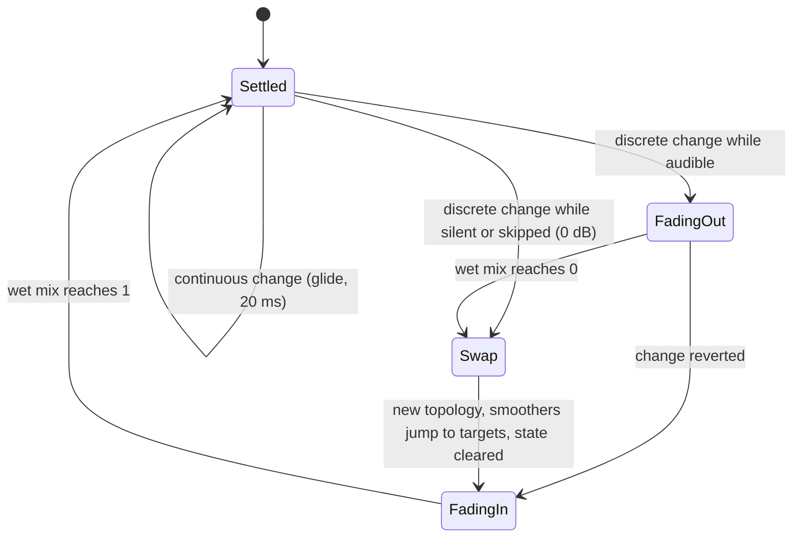

# 03 — DSP Design, Module by Module (Workflow 3)

> Every sample-touching algorithm in Flubsound Pro lives in `flub_core` (`core/`). It is allocation-free C++20 with no third-party code, and the zero-dependency unit tests in `tests/` exercise it. This document describes each DSP module **as implemented**:
> - the exact formulas and constants;
> - the parameter keys, ranges and defaults from [`core/src/engine/Parameters.cpp`](../core/src/engine/Parameters.cpp);
> - the smoothing that makes every change click-free;
> - latency and CPU;
> - how Gaming and Music mode use the module;
> - the tests that prove each property.
>
> Known limitations and roadmap items are labelled as such.

**Reading conventions**

- Levels are dBFS *peak* unless stated otherwise. For a sine, RMS = peak − 3.01 dB.
- `fs` is the session sample rate. The *control rate* is `fs / 16`: every module in this half that has one uses `kControlInterval = 16` (so does the virtualiser; the stereo spatializer uses 32, see section 7).
- `x'` means "the smoothed value of parameter x".
- **Measured** figures were reproduced for this document with small harnesses linked against the module sources. The unit tests assert looser bounds, which are listed per module.
- **CPU** figures are indicative only, measured on one machine: g++ 13.3 `-O2`, x86-64 (Intel Xeon @ 2.10 GHz, container), 48 kHz, stereo, 512-sample blocks, white-noise input, `ScopedNoDenormals` active, best of 5 runs. "% core" = ns per stereo sample ÷ 20 833 ns (one 48 kHz sample period). Section 15 has the chain-level summary.

| § | Module | Main sources |
|---|---|---|
| [0](#0-conventions--shared-primitives) | Conventions & shared primitives | `core/include/flub/common/*`, `core/include/flub/dsp/{Svf,Biquad,Crossover,EnvelopeFollower,Oversampler,TruePeakDetector,FirDesign,Fft}.h`, `core/src/dsp/{Oversampler,Fft}.cpp` |
| [1](#1-gain-staging-overview) | Gain staging overview | `core/src/engine/ProcessingChain.cpp` |
| [2](#2-parametric-eq) | Parametric EQ | `core/src/dsp/ParametricEq.cpp` |
| [3](#3-dynamic-eq) | Dynamic EQ | `core/src/dsp/DynamicEq.cpp` |
| [4](#4-bass-engine) | Bass engine | `core/src/dsp/BassEngine.cpp` |
| [5](#5-transient-shaper--clarity-enhancer) | Transient shaper + clarity enhancer | `core/src/dsp/TransientShaper.cpp`, `core/src/dsp/ClarityEnhancer.cpp` |
| [6](#6-saturation) | Saturation | `core/src/dsp/Saturator.cpp` |

Sections 7–15 follow: stereo spatializer, headphone virtualizer, compressor, true-peak limiter, loudness maximizer, spectral noise gate, metering, macros/modes/protection, and the chain-level CPU and latency summary.

---

## 0. Conventions & shared primitives

### 0.1 Numeric format and the module contract

| Aspect | Rule (as implemented) | Source |
|---|---|---|
| Sample format | 32-bit `float`, planar, processed **in place** on an `AudioBlock`: an array of up to `kMaxChannels = 8` channel pointers plus the sample count. Sub-blocks are views, so they cost no allocation. | `common/AudioBlock.h` |
| Double precision | Used where precision matters more than speed: <br>• filter *design* (`SvfCoeffs::make` computes in `double` and keeps `g`, `k` as `double` for exact response evaluation); <br>• FIR tap design (`FirDesign.h`, taps are then stored as `float`); <br>• `Biquad` coefficients and state (TDF-II); <br>• `MeanSquareFollower` state; <br>• the loudness gates' sums of squares. | `dsp/Svf.h`, `dsp/FirDesign.h`, `dsp/Biquad.h`, `dsp/EnvelopeFollower.h`, `engine/Protection.h` |
| Threading | `prepare()` runs off the audio thread and may allocate. `reset()`, `process()` and all setters run on the audio thread: `noexcept`, no allocation, no locks, no I/O, bounded time. | `dsp/Processor.h` |
| Parameter push | `ProcessingChain::applyParameters()` calls every module setter **every block**. Each module sanitises the new values, compares them with the current set and returns early when nothing changed, so an unchanged parameter costs one comparison. | `engine/ProcessingChain.cpp` |
| Sanitising | **First line, the `ParameterStore`:** `ParameterStore::set()` ignores NaN and keeps the current value; `Info::clamp()` maps NaN to the parameter's default; ±inf clamps to the range edge. A NaN from automation, a host or a script therefore never reaches a module through the store (test *ParameterStore: NaN is ignored, infinities clamp, and the chain stays finite*). <br>**Second line, each module** (for direct API use): values are clamped to the module's documented range, and ±inf clamps to the range edge. NaN handling differs by module: <br>• the previous value is kept by `BassEngine`, `ClarityEnhancer` and `TransientShaper`; <br>• the default is used by `ParametricEq` and `Saturator`; <br>• `DynamicEq` keeps the previous setting for **any** non-finite value, including ±inf. | `engine/Parameters.h`, `src/engine/Parameters.cpp`, per-module `sanitise()` |
| Latency | An integer number of samples, constant between `prepare()` calls. The chain delay-compensates the bypass paths (`ModuleSlot`, global bypass). | `dsp/Processor.h`, `engine/ModuleSlot.h` |
| Channels | A block may carry fewer channels than prepared. Only the channels present are processed, and they are the only ones linked. | per module |

`DelayLine` (`common/DelayLine.h`) is the fixed integer delay used for the dry-path compensation of every latency-carrying stage. Block processing and per-sample processing (`processSample()` + `advance()`) give identical results (test *DelayLine: block delay equals per-sample delay*).

### 0.2 TPT state-variable filter (`dsp/Svf.h`)

The workhorse filter is Andrew Simper's (Cytomic) linear trapezoidal state-variable filter, a topology-preserving transform (TPT). It was chosen over direct-form biquads for three reasons:
- it stays well behaved when its coefficients change every few samples (dynamic EQ, glides);
- its two states are integrator outputs with a physical meaning;
- it is numerically robust for low cutoffs at high sample rates.

```
design:   w  = tan(pi * fc / fs)            fc clamped to [5 Hz, 0.49 fs], Q clamped to [0.025, 40]
          k  = 1 / Q                        A  = 10^(gainDb / 40)
          g  = w  (w / sqrt(A) for LowShelf, w * sqrt(A) for HighShelf)
          a1 = 1 / (1 + g (g + k)),  a2 = g a1,  a3 = g a2

per sample (state ic1, ic2):
          v3 = v0 - ic2
          v1 = a1 ic1 + a2 v3               band-pass core   s / (s^2 + k s + 1)
          v2 = ic2 + a2 ic1 + a3 v3         low-pass core    1 / (s^2 + k s + 1)
          ic1 = 2 v1 - ic1,   ic2 = 2 v2 - ic2
          y  = m0 v0 + m1 v1 + m2 v2
```

The mix coefficients select the response. Every type is one of the normalised analog prototypes below, evaluated at `s = j·tan(π f/fs)/g` (see the response mapping below):
- for the non-shelf types `g = tan(π fc/fs)`, so `|s| = 1` falls exactly on `fc`;
- for the shelves `g` is scaled by `1/√A` (low shelf) or `√A` (high shelf), which moves the half-gain point `|H| = A` onto `fc`.

| `FilterType` | `(m0, m1, m2)` | Analog prototype H(s) | Key property |
|---|---|---|---|
| `LowPass` | (0, 0, 1) | 1 / (s² + ks + 1) | −3.01 dB at fc for Q = 1/√2 |
| `HighPass` | (1, −k, −1) | s² / (s² + ks + 1) | |
| `BandPass` | (0, k, 0) | ks / (s² + ks + 1) | **0 dB at fc** (unity-gain detector) |
| `Notch` | (1, −k, 0) | (s² + 1) / (s² + ks + 1) | zero at fc |
| `AllPass` | (1, −2k, 0) | (s² − ks + 1) / (s² + ks + 1) | \|H\| = 1, −180° at fc |
| `Bell` (k = 1/(Q·A)) | (1, k(A² − 1), 0) | (s² + (A/Q)s + 1) / (s² + s/(QA) + 1) | A² = 10^(dB/20) at fc. A cut is the exact reciprocal of the equal boost, H₊·H₋ = 1. |
| `LowShelf` | (1, k(A − 1), A² − 1) | (s² + kAs + A²) / (s² + ks + 1) | full gain A² at DC, **half the dB gain (A) at fc**, 0 dB at HF |
| `HighShelf` | (A², kA(1 − A), 1 − A²) | (A²s² + kAs + 1) / (s² + ks + 1) | full gain at HF, half the dB gain at fc, 0 dB at DC |

**Exact response mapping.**
- The digital filter is the bilinear transform of the prototype, prewarped at the design frequency. Its response at frequency `f` is therefore exactly the prototype evaluated at `s = j·tan(ω/2)/g`, with `ω = 2π f / fs`.
- `SvfCoeffs::response()` evaluates this in `double`, with `f` clamped to [0, 0.4999 fs]:
  ```
  H(f) = m0 + m1 * s/(s^2+ks+1) + m2 * 1/(s^2+ks+1),   s = j tan(pi f / fs) / g
  ```
  `magnitudeDb()` floors `|H|` at 1e-12, i.e. −240 dB.
- The GUI curves (`ParametricEq::responseDb`) and several tests use exactly this function.
- Test *Svf: analytic response() matches the running filter for every type* checks the running filter against it to within 0.05 dB for all eight types, wherever the response is above −40 dB.

**Shelf convention (important for the bass engine).** The SVF shelf's *corner frequency is its half-gain point*. Two examples:
- a 9 dB low shelf at 60 Hz (Q 0.7) gives +8.85 dB at 20 Hz, **+7.33 dB at 40 Hz**, +4.50 dB at 60 Hz, +0.65 dB at 120 Hz and +0.10 dB at 200 Hz (analytic, identical at 44.1 and 48 kHz);
- test *Svf: shelves reach their gain at DC / Nyquist side* asserts +4 dB at the corner of an 8 dB shelf.

`svfTickRaw()` returns the raw `v1`/`v2` so that crossovers can form LP and HP from one state (HP = v0 − k·v1 − v2). `SvfFilter` is a convenience multichannel wrapper with shared coefficients.

### 0.3 Butterworth cascades

An order-2N Butterworth filter is built from N second-order SVF sections, all at the **same** cutoff, with the pole-pair Qs from `butterworthQ(N, k)`:

```
Q_k = 1 / (2 sin((2k + 1) pi / (4N))),   k = 0 .. N-1        (Svf.h)
```

| Sections N | Order / slope | Q₀ | Q₁ | Q₂ | Q₃ | Used for |
|---|---|---|---|---|---|---|
| 1 | 2nd, 12 dB/oct | 0.7071 | | | | 12 dB/oct EQ cuts; LR4 halves; bass harmonics post-HP and 25 Hz pre-HP; bass protection detector |
| 2 | 4th, 24 dB/oct | 1.3066 | 0.5412 | | | 24 dB/oct EQ cuts; bass subsonic HP4, replace-fundamental HP4, harmonics LP4s; clarity air HP4/LP4/HP4 |
| 3 | 6th, 36 dB/oct | 1.9319 | 0.7071 | 0.5176 | | 36 dB/oct EQ cuts |
| 4 | 8th, 48 dB/oct | 2.5629 | 0.9000 | 0.6013 | 0.5098 | 48 dB/oct EQ cuts |

Every cascade is maximally flat and exactly −3.01 dB at its cutoff. One octave into the stopband it reads −12.3 / −24.1 / −36.2 / −48.2 dB for N = 1..4 (analytic).

### 0.4 Linkwitz–Riley crossovers and all-pass alignment (`dsp/Crossover.h`)

`LinkwitzRiley4` derives both bands from **one** Butterworth design (Q = 1/√2), using three SVF states per channel. With D = s² + √2·s + 1:

```
split:  lp1 = v2,  hp1 = x - k v1 - v2              (one SVF tick)
low  = LP2(lp1)  = 1/D^2        high = HP2(hp1) = s^4/D^2

low + high = (1 + s^4)/D^2 = (s^2 - sqrt2 s + 1)/(s^2 + sqrt2 s + 1)
             because (s^2 + sqrt2 s + 1)(s^2 - sqrt2 s + 1) = s^4 + 1
```

The two bands sum to a second-order **all-pass**: flat magnitude, with phase passing −180° at the crossover. Each band is −6.02 dB at fc.

`LinkwitzRileyAllPass` is the SVF `AllPass` at the same frequency and Q. `ThreeBandSplitter` (used by the maximizer glue) passes the low band through the all-pass of the upper crossover:

```
low' = AP_hi · LP4_lo · x,   mid + high = AP_hi · HP4_lo · x   =>   low' + mid + high = AP_hi · AP_lo · x
```

so the three bands still sum to an all-pass. `BassEngine` uses the identical LR4 topology (`lr4Split()` on `svfTickRaw`), but owns the state so it can be flushed and recovered after a NaN; the shared class keeps its state private.

**Consequence used by the bass engine.** Because LP4 + HP4 is an all-pass that reaches −180° at the corner, crossfading *dry* against an LR4-processed path would notch the corner region. The bass engine therefore engages such stages "parked" at a subsonic corner (§4.3.6).

### 0.5 Biquad and FIR design helpers

- `Biquad` (`dsp/Biquad.h`) is a transposed direct-form II section in `double`, normalised to a0 = 1. It is used where coefficients are static and precision matters: BS.1770 K-weighting and the Brown–Duda head-shadow sections (sections 8 and 13).
- `BiquadCoeffs::fromAnalogFirstOrder(B0, B1, A0, A1, fs)` is the plain bilinear transform with K = 2·fs, *without* prewarping.
- `fir::kaiser`, `fir::sinc` and `fir::besselI0` (series, converged to 1e-14) are prepare-time helpers for the half-band and true-peak interpolators. `fir::lowpass()` (a normalised Kaiser-windowed low-pass) exists but no core module currently uses it.

### 0.6 Half-band oversampler (`dsp/Oversampler.h`, `src/dsp/Oversampler.cpp`)

**Purpose.** Every nonlinearity that can create harmonics above the original Nyquist runs oversampled: the saturation curves (§6) and the maximizer's soft clipper (section 11). This keeps those harmonics from aliasing. The oversampler must have an **integer** round-trip latency, so the dry paths can be compensated exactly.

**Delta oversampling (both users).** Neither user sends the programme itself through the round trip. The curve runs on the upsampled signal `x̂`, only its *deviation* `f(x̂) − x̂` is downsampled, and that band-limited deviation is added to the input delayed by exactly the round-trip latency (`DelayLine`):

```
y = x[n − L] + down( f(up(x)) − up(x) )          L = oversampler round-trip latency
```

Where the curve is linear (quiet material) the deviation vanishes and `y` is the delayed input, so the half-band passband droop below never reaches the programme. The alias rejection is unchanged, because the harmonics still pass the same downsampler. The latency is unchanged too.

**Design.**
- Each 2× stage is a linear-phase Kaiser-windowed half-band FIR with `4d + 1` taps, centre index `2d`.
- The centre tap is exactly 0.5.
- The taps at even offsets from the centre are exactly 0.
- The 2d odd taps, `h[2j+1] = 0.5·sinc((2j+1−2d)/2)·kaiser(2j+1, 4d+1, β)`, are rescaled to sum to 0.5, which gives exactly unity DC gain.

```
upsample   (per low-rate input x[i], history w[j] = x[i-j], j = 0..2d-1):
    out[2i]   = w[d]                              phase 0 = pure delay of d samples
    out[2i+1] = 2 * sum_j h[2j+1] * w[j]          phase 1 = interpolated
downsample (per low-rate output y[i], high-rate input v):
    y[i] = 0.5 * v[2i - 2d] + sum_j h[2j+1] * v[2i - (2j+1)]
round trip of one stage = d (up) + d (down) = 2d samples at the stage's lower rate
```

| Quality | Stage 1 (1× ↔ 2×) | Stage 2 (2× ↔ 4×) | 2× latency | 4× latency |
|---|---|---|---|---|
| `High` | d₁ = 16 → 65 taps, β = 9.0 | d₂ = 4 → 17 taps, β = 8.0 | 2d₁ = **32** | 2d₁ + d₂ = **36** |
| `Low` | d₁ = 8 → 33 taps, β = 4.5 | d₂ = 3 → 13 taps, β = 6.0 | **16** | **19** |
| factor 1 | pass-through (in place) | — | **0** | — |

Stage 2's round trip is 2d₂ samples at the 2× rate, which is d₂ base-rate samples. Hence `latency = 2·d₁ + d₂` for 4×.

**Filter performance.** The table below was computed from the actual tap design. "Image" is the level of the spectral image re unity gain (the worst value over the range, which is at its top edge). For the upsampler this is the image; for the downsampler it is the alias rejection of the same filter. The frequency axis is in base-rate `f/fs`: 0.375 = 18 kHz, 0.417 = 20 kHz at 48 kHz, and 0.4535 = 20 kHz at 44.1 kHz.

| Stage | Max passband deviation 0…0.375 / 0.417 / 0.4535 fs | Worst image rejection 0…0.375 / 0.417 / 0.4535 fs |
|---|---|---|
| Stage 1 High (65 taps) | 0.0002 / 0.004 / 0.50 dB | −91 / −67 / −25 dB |
| Stage 1 Low (33 taps) | 0.023 / 0.092 / 1.24 dB | −51.5 / −39.5 / −17.5 dB |
| Stage 2 High (17 taps) | 0.003 / 0.011 / 0.028 dB | −70 / −58 / −50 dB |
| Stage 2 Low (13 taps) | 0.016 / 0.035 / 0.078 dB | −55 / −48 / −41 dB |

- The header's "~90 dB (High) / ~50 dB (Low)" image rejection holds for content up to about 0.375 fs.
- A half-band filter's transition band is centred on the original Nyquist, so the top octave of a 44.1 kHz stream sits in it. Measured on a bare 2× `Oversampler` round trip at 44.1 kHz: −2.3 dB (Low) and −1.0 dB (High) at 20 kHz, and ≤ 0.03 dB up to 18 kHz. At 48 kHz, 20 kHz reads −0.18 dB (Low) and −0.01 dB (High). Because of delta oversampling (above), this droop applies only to the generated harmonics, not to the programme: a quiet 19.5 kHz tone keeps unity gain through the saturator and the clipper (`tests/test_transparency.cpp`, §6.10).
- Test *Oversampler: round trip reproduces the input delayed by the reported latency* asserts a round-trip SNR of ≥ 80 dB (High) and ≥ 45 dB (Low) for a 997 Hz sine at exactly the reported latency.

**Cost.**
- The loops do not exploit tap symmetry: 2d multiply-adds per base-rate sample for the interpolated upsampler phase, and 2d per base-rate output of the downsampler.
- `upsample()` returns a view on internal buffers, allocated in `prepare()` for `factor × maxBlockSize` samples. It clamps a block longer than `maxBlockSize`, and callers never exceed it.
- A minimum-phase / polyphase-IIR variant with lower latency and non-linear phase is noted in the header as the planned alternative. It is **roadmap**, not implemented.

### 0.7 4× true-peak interpolator (`dsp/TruePeakDetector.h`)

This is the BS.1770-4 Annex 2 approach: 4× oversampling, then take the peak.

- **Prototype filter.** A 161-tap Kaiser-windowed sinc (β = 5.0, centre 80), split into 4 polyphase phases of `kTapsPerPhase = 40` taps each.
- **Phase normalisation.** Each interpolating phase p = 1..3 is normalised to unity DC gain. Phase 0 is the original sample, because the prototype's zeros fall on every 4th tap.
- **Per call.** Each call pushes x[n] and returns `max |.|` over the positions { n−20, n−20+¼, n−20+½, n−20+¾ }. The constant delay is `kDelay = kTapsPerPhase / 2 = 20` base samples.
- **Accuracy** (computed from the float taps):
  - every phase stays within −0.010 / +0.017 dB up to 0.4 fs, and within −0.020 / +0.039 dB up to 0.4535 fs (20 kHz at 44.1 kHz, 21.8 kHz at 48 kHz), so full-band programme is never materially under-read;
  - the error against an ideal fractional delay stays below −54 dB up to 0.4 fs and below −47 dB up to 0.4535 fs;
  - above that the phases roll off (−0.65 dB at 0.47 fs).
  - The previous design (97 taps, 24 per phase, β = 8, `kDelay` 12) dipped by up to 2 dB near 0.4535 fs; the header comment records the change.
- **Shared design.** The taps come from the static `TruePeakDetector::designPhaseTaps()` (the prototype above, `kKaiserBeta = 5.0`, per-phase unity DC gain; phase 0 is left to the delayed sample itself).
- **Users.**
  - `TruePeakMeter` (`analysis/PeakMeters.h`) runs the detector itself.
  - The limiter's `RefinedPeakDetector` (`TruePeakLimiter.cpp`) calls the same `designPhaseTaps()` and uses the same `kDelay`, so the limiter and the meters can never read different peaks. It adds parabolic refinement of local maxima of the 4× sequence and is documented in section 10. There is no separate limiter design any more: the limiter's former β = 8 taps under-read near Nyquist.
- **Tests.**
  - *TruePeakDetector: finds the inter-sample peak of an fs/4 sine at 45 degrees*: sample peak −3.01 dB, detected 0 dB ± 0.15 dB.
  - *TruePeakDetector: phase 0 reproduces the input with kDelay samples of delay*.
  - *TruePeakDetector: full-band accuracy - a 20 kHz sine at 44.1 kHz reads its true amplitude*: 15, 18, 19.5 and 20 kHz sines at 44.1 and 48 kHz, four sampling phases each, read their amplitude within ±0.05 dB.

### 0.8 FFT (`dsp/Fft.h`, `src/dsp/Fft.cpp`)

- A radix-2, iterative, in-place complex FFT. Bit-reversal and twiddle tables (`e^{-j2πk/N}`, k < N/2) are built in `prepare()`.
- `inverse()` scales by 1/N.
- `forwardReal()` / `inverseReal()` run a full N-point complex transform through an internal scratch buffer. That is correct, but about 2× the cost of a true real FFT, and one instance must not be shared between threads.
- The only real-time user is the spectral noise gate (section 12).
- PFFFT or vDSP/IPP behind the same interface is **roadmap** (`docs/02-tech-stack.md`, `docs/07-roadmap.md` item 1.9).
- Test *Fft: forward/inverse round trip and a pure tone lands in one bin* covers it.

### 0.9 Envelope followers and smoothers

All one-pole time constants are 63 % rise times: `c = exp(−1 / (τ · rate))` (`onePoleCoeff`, `common/Math.h`), so 90 % takes 2.3 τ. `rate` is the rate at which the one-pole is stepped, fs or fs/16, and every module derives its coefficients for that rate.

| Primitive | Law | Used by |
|---|---|---|
| `EnvelopeFollower` | `env = x + c (env − x)`, with c = attack if x > env, else release (branching peak follower) | transient-shaper pairs; bass protection detector (10/150 ms); harmonics envelope (0.5/50 ms) |
| `GainSmoother` | `state = t + c (state − t)` in **dB**, with c = attack when the *detector level is rising* (see below) | dynamic EQ, de-mud, presence, compressor |
| `MeanSquareFollower` | `ms = x² + c (ms − x²)`, state in `double` | RMS meters (`analysis/PeakMeters.h`), loudness followers (`analysis/LoudnessFollower.h`). The clarity detectors use their own float mean squares with the same law. |
| `LinearSmoothedValue` | linear ramp over `max(1, ⌊fs·ms/1000⌋)` steps; the last step lands **exactly** on the target | gains, mixes, crossfades (end points must be exactly 0 or 1) |
| `OnePoleSmoother` | `cur = t + c (cur − t)`. It snaps to t when a step no longer changes `cur`, or when \|cur − t\| < 1e-6·(1 + \|t\|). | parameter glides (log-frequency, dB, log-Q) |
| `TransientShaper::PeakHold` | 4 buckets of L = ⌈(fs·T_min/1000)/3⌉ samples; output = max(current bucket, 3 closed buckets), so the window spans 3L+1 … 4L samples (≥ T_min) | ripple-free levels: 25 ms (shaper, bass detectors), 7.5 ms (air) |
| `SvfGlide` / `GGlide` | per-sample interpolation from the previous control-rate design to the new one (§0.10) | dynamic bells and shelves, corner sweeps |

**Attack/release convention** (`GainSmoother`, Giannoulis–Massberg–Reiss decoupled branching topology). "Attack" always means the response to the **detector level rising**:
- Compressor-type computers (level up → gain down: `CutAbove`, `BoostBelow`, de-mud, presence) use `expanderMode = false`: a *falling* gain uses the attack time.
- Expander-type computers (level up → gain up: `BoostAbove`, `CutBelow`) use `expanderMode = true`: a *rising* gain uses the attack time.

**Why peak holds.** A plain peak follower decays between waveform peaks, so it ripples at twice the signal frequency. Any gain derived from it then amplitude-modulates the audio, which is audible distortion on bass. The window covers at least half a period of the lowest frequency of interest: 25 ms is half the period of 20 Hz. So a steady tone always has a crest inside the window and reads as a constant, while a rising level still passes instantly. The float `OnePoleSmoother` stall fix (the "a step that no longer moves counts as settled" rule) is covered by test *OnePoleSmoother: glides converge exactly to non-zero targets (no float stall)*.

### 0.10 Control rate, coefficient glides and block-size invariance

**Control rate.** `ParametricEq`, `DynamicEq`, `BassEngine` and `ClarityEnhancer` run their parameter logic every `kControlInterval = 16` samples: smoothers, gain computers and filter redesign. (The spatializer uses 32; see section 7.) The control phase is counted in **absolute stream time**: the countdown survives across `process()` calls, and blocks are split at tick boundaries.

**Coefficient glides.** A new design is never switched in as a step. The filter glides to it per sample across the next 16 samples, using one of three schemes:

| Scheme | What is interpolated per sample | Used by |
|---|---|---|
| EQ ramp | the six coefficients (a1, a2, a3, m0, m1, m2), linearly from the previous design to the new one | `ParametricEq` |
| `SvfGlide` | (g, k, m0, m1, m2), with a1..a3 **re-derived** each sample, so every intermediate set is a valid, stable SVF | `DynamicEq` (own copy), bass shelf, de-mud and presence bells, air shelf |
| `GGlide` | only the prewarped frequency g, with k and m fixed (fixed-Q LP/HP/LR4 sweeps) and a1..a3 re-derived | bass subsonic, mono, replace, tighten and harmonics filters |

**Block-size invariance policy.**
- Output must not depend on how the host splits the stream. Tick positions and ramp positions are taken from the global control phase, never from the block start.
- Per-sample algorithms (`TransientShaper`, `Saturator`) are invariant by construction. The saturator splits segments only at crossfade ends and at `maxBlockSize`.
- The tests assert exact equality where the implementation is exact:
  - *DynamicEq review: bit-exact for any block split, with events at arbitrary samples* (random block sizes 1..4096 and 60 random events);
  - *BassEngine (review): every block size gives bit-identical output*;
  - *Clarity (review): every block size gives bit-identical output*;
  - *TransientShaper: output is independent of the host block size*.
- `ParametricEq` and `Saturator` assert ≤ 1e-5. The saturator differs only in *when* a sub-1e-15 state is flushed, which is about 1e-14 in effect.

### 0.11 Denormal and non-finite policy

**First line: the host.** Every real-time entry point holds a `ScopedNoDenormals` (`common/Denormals.h`):
- on x86 it sets MXCSR FTZ | DAZ (`0x8040`);
- on AArch64 it sets FPCR.FZ (bit 24);
- entry points: the app's audio callback (`app/Source/engine/AudioEngineHost.cpp`), the plug-in's `processBlock`, and the CLI's offline renderer and analysis.

**Second line: every module flushes its own recursive state.** A host that forgot FTZ therefore cannot trigger a 10–100× subnormal slowdown:

| Module | Flush floor | When | Non-finite recovery |
|---|---|---|---|
| `ParametricEq` | SVF states \|v\| < 1e-15 (−300 dBFS) | end of every processed segment | a non-finite state restarts that section from rest at the segment end |
| `DynamicEq` | SVF states < 1e-20; envelope < 1e-9 | every control tick | the per-band state sum is checked every tick; band state cleared |
| `BassEngine` | SVF states < 1e-20; envelopes < 1e-15 | every control tick | any non-finite state clears **all** states |
| `ClarityEnhancer` | SVF states < 1e-20; envelopes and mean squares < 1e-15 | every control tick | all states cleared |
| `TransientShaper` | +1e-5 (−100 dBFS) added to the detector input; NaN read as 0; input clamped to 1e6 | per sample | envelopes can never be poisoned |
| `Saturator` | IIR states < 1e-15 | end of every segment; the tape emphasis states also every 64 oversampled samples (`kTapeFlushInterval`) | non-finite states flushed to 0 at the same points |

**Chain-level guard.** `ProcessingChain::process()` multiplies every input sample by 0 and sums the results. If the sum is non-finite, the block is output as silence and the whole chain is reset (test *Chain: a NaN/Inf input block is dropped and the chain recovers*).

### 0.12 Tests that prove the primitives (`tests/test_primitives.cpp`)

*Svf: bell reaches its gain at the centre frequency and is flat far away* · *Svf: shelves reach their gain at DC / Nyquist side* · *Svf: analytic response() matches the running filter for every type* · *Svf: Butterworth Q table* · *LR4: bands sum to a flat magnitude; each band is -6 dB at the crossover* · *ThreeBandSplitter: low + mid + high is flat* · *Biquad: first-order analog BLT keeps DC and HF gains* · *Oversampler: round trip reproduces the input delayed by the reported latency* · *Oversampler: latency values per quality* (36 / 32 / 19 / 16 / 0) · *TruePeakDetector: finds the inter-sample peak of an fs/4 sine at 45 degrees* · *TruePeakDetector: phase 0 reproduces the input with kDelay samples of delay* · *TruePeakDetector: full-band accuracy - a 20 kHz sine at 44.1 kHz reads its true amplitude* · *Fft: forward/inverse round trip and a pure tone lands in one bin* · *SpscRing: FIFO order, capacity and overflow drop* · *DelayLine: block delay equals per-sample delay* · *OnePoleSmoother: glides converge exactly to non-zero targets (no float stall)*.

---

## 1. Gain staging overview

### 1.1 Purpose

Flubsound adds bass, presence, air, harmonics, transient punch, drive and loudness. Gain staging is what keeps those additions from stacking up into clipping, limiter pumping or THD, and it lets a user switch any module in or out without a level jump that is not the module's actual effect. The chain relies on five rules, all implemented in code:

1. **Neutral means exact.** At neutral settings every module described in §2–§6 is an exact identity; the saturator is exactly its delayed input. (For the bass engine "neutral" includes `bass.subsonic = 0`: its default 20 Hz high-pass is active.) A bypassed module (`ModuleSlot`) is exactly its latency-delayed dry path.
2. **Unity small-signal gain for everything nonlinear.**
   - The saturation curves are `f(g·x)/g` with `f'(0) = 1` (§6).
   - The Chebyshev bass harmonics and the air exciter add harmonics at a level proportional to the input band level and leave the fundamental untouched (§4, §5).
   - Quiet material therefore passes at unity gain.
3. **Every boost is explicit and bounded.** Level-dependent boosts are *protected* (bass shelf), *tapered* at the noise floor (dynamic-EQ `BoostBelow`, presence) or *gated* (de-mud).
4. **Loudness-adding macro contributions are governed.** The SafetyGovernor scales them back when the limiter or clipper work too hard (section 14).
5. **Exactly one stage guarantees the ceiling:** the maximizer's true-peak limiter. Between stages the signal is float, may exceed 0 dBFS, and is never clipped. The only stage after the limiter, `output.gain`, can only attenuate (−24…0 dB).

### 1.2 Signal flow (where gain can be added or removed)

```
 in ─► input gain ±24 dB ─► AutoLevel ±12 dB (+1 / −4 dB/s) ─► virtualiser, or BS.775 downmix (×0.7071 overall)
                                                                (virt.on toggles crossfade the two folds over 20 ms)
    ─► [gate]        attenuation only (≤ 40 dB); in the chain only in the Quality latency profile
    ─► [EQ]          ±24 dB per band, output −24..+12 dB
    ─► [DynEQ]       static ±12 dB + dynamic up to ±24 dB per band (range), noise-floor tapered
    ─► [Bass]        low shelf 0..+15 dB, withdrawn to keep predicted LF peak ≤ bass.protect;
                     harmonics mix ≤ ×2 of the generated harmonics; subsonic HP removes DC/rumble
    ─► [Clarity]     transient gain ±12 (attack) ±12 (sustain) dB; presence ≤ +6 dB; de-mud ≤ −4 dB;
                     air: harmonics at ≤ −12 dB re band + ≤ +2 dB shelf
    ─► [Saturation]  unity small-signal; loud peaks reduced (≈ 1/g); wet output ±12 dB
    ─► [Spatial]     L+R invariant (section 7)
    ─► [Compressor]  make-up −12..+24 dB, upward ≤ +18 dB (section 9)
    ─► [Maximizer]   drive 0..+24 dB → glue (only while armed) → soft clipper → TRUE-PEAK LIMITER @ ceiling
                     (−12..0 dBTP, default −1)
    ─► output gain −24..0 dB (trim, attenuation only)
    ─► (desktop app only) Σ strips → master TP limiter −1 dBTP, 1 ms look-ahead
```

### 1.3 Where gain is added and removed

| Stage | Can add | Can remove | What bounds it | Source |
|---|---|---|---|---|
| Input gain (`input.gain`) | +24 dB | −24 dB | user; 20 ms linear ramp per block | `ProcessingChain.cpp` |
| AutoLevel (`autolevel.*`) | +12 dB | −12 dB | gated loudness loop on the input layout (BS.1770-4 channel weights, `analysis/ChannelWeights.h`), +1 dB/s up, −4 dB/s down (section 14) | `Protection.h` |
| Surround fold-down | — | 0.7071 × (sum of BS.775 contributions) | fixed, LFE dropped (virtualiser off); toggling `virt.on` crossfades virtualiser ↔ downmix over 20 ms | `ProcessingChain.cpp` |
| Parametric EQ | +24 dB per band, +12 dB output (store range) | −24 dB per band, −24 dB output, cuts | user only; no macro touches it | §2 |
| Dynamic EQ | `staticGain` + dynamic, `range` ≤ 24 dB | the same | `BoostBelow` fades out over the 10 dB above `noiseFloor`; mode bands scale with macros | §3 |
| Bass shelf | +15 dB (+ macros, clamped to 15) | never cuts | **predictive protection**: withdrawn by `softKnee(L + boost − protect)` | §4 |
| Bass harmonics | harmonics at up to ×2 (+6 dB) of the generated level; fundamental unchanged | optional replace-fundamental HP4 | level tracks the band linearly (envelope-normalised) | §4 |
| Clarity shaper | up to +12 dB on onsets (attack) / tails (sustain) | the same, as cuts | level-independent indicators; 1 ms gain smoothing | §5 |
| Presence / de-mud | +6 dB × presence | −4 dB × deMud | inverse-level computer with −80 dB RMS taper / relative threshold with −70 dB RMS gate | §5 |
| Air | 2nd/3rd harmonics at ≤ −12 dB re the 3.5–7 kHz band; +2 dB shelf at 10 kHz | — | envelope-normalised; disabled below 42 kHz | §5 |
| Saturation | wet make-up up to +12 dB (`sat.output`) | loud peaks (curve), −12 dB make-up | unity small-signal; see §6.3 for level behaviour | §6 |
| Maximizer | drive up to +24 dB (+ governed macros) | limiter / clipper / glue reduction | **true-peak ceiling**, SafetyGovernor, AutoDrive (reduce only); the glue splitter is only in the path while glue is armed (1.4) | section 11 |
| Output gain (`output.gain`) | — (0 dB maximum) | −24 dB | trim applied **after** the maximizer, 20 ms ramp (see 1.4) | `ProcessingChain.cpp`, `Parameters.cpp` |

### 1.4 Headroom policy

- **Headroom is float.** Nothing between the input stage and the maximizer clips; peaks above 0 dBFS inside the chain are legal. Protection acts on *predicted* or *measured* levels instead:
  - the bass protection predicts the boosted LF peak;
  - the governor measures the limiter's gain reduction (≤ 6 dB average) and the clipper energy (≤ −30 dB);
  - the limiter guarantees the ceiling.
- **The ceiling is a strip property.** The chain test *Chain: full Music boost on a hot programme never exceeds the ceiling* sets Boost Intensity and all five macros to 100 %, in both modes, on a hot programme. It asserts:
  - true peak ≤ −1 dBTP + 0.15 dB;
  - sample peak ≤ −1 dBFS;
  - zero safety-clamp engagements. This check is meaningful at chain level: the maximizer's limiter count (`LoudnessMaximizer::getSafetyClipCount()`) is published every block as `MeterBus::safetyClipCount`.
- **Factory presets hold it too.** *Factory presets: Boost Intensity and all macros at 100 % stay safe* (`tests/test_factory_presets.cpp`) renders every factory preset with every macro at 100 % and checks sample peak ≤ ceiling, true peak ≤ ceiling + 0.15 dB and no safety clamp. Because the limiter shares the meters' interpolator and holds its gain under the interpolation kernel (section 10), the margin is not needed in practice: measured for this document on the test's own programme, the 24 presets at their own settings and at full macros (48 renders) read at most −1.048 dBTP on the 4× meter for a −1 dBTP ceiling (−2.05 dBTP for the −2 dBTP Bluetooth preset), with no safety clamp. `LoudnessMaximizer.h` records the same result: worst −1.04 dBTP at full macros.
- **Output gain cannot break the guarantee.** `output.gain` is a trim of −24…0 dB applied after the limiter, so it can only lower the level below the ceiling.
  - Hosts that run a single `ProcessingChain` (plug-in, CLI) therefore need no extra safety net. With `--ceiling` or `--target-lufs` the CLI switches the maximizer on, or warns if `max.on=off` was requested explicitly (`tools/flubsound-cli/CliOptions.cpp`); it also warns if the measured true peak of a render exceeds the ceiling by more than 0.1 dB (`OfflineRenderer.cpp`).
  - In the desktop app several strips, each at its own ceiling, can sum above it. The `MixEngine` master limiter (−1 dBTP, 1 ms look-ahead, 50 ms auto release, `MixEngine.cpp`) catches that; its safety-clamp count is exposed as `MixEngine::getMasterSafetyClipCount()`.
- **Glue is out of the path unless armed.** The maximizer's 3-band glue splitter is an all-pass: it raises the crest factor of flat-topped (mastered) material by 1–3 dB, which the limiter would then have to take back.
  - `applyParameters()` therefore keeps the 0.001 glue floor (which avoids an all-pass crossfade each time a macro crosses the glue start point) only while glue is *armed*: `glueArmed = base[max.glue] > 0 || MacroMap::isArmed(base, MaxGlue)`, i.e. a macro that can raise glue is above zero, even before its start point.
  - Otherwise `mp.glue` is the effective value, 0 by default, and the splitter is bypassed. Test *Chain: with glue disarmed the maximizer passes hot flat-topped material untouched* checks that a −5 dBFS 100 Hz square passes the default maximizer bit-exactly (≤ 1e-6), with no gain reduction.
- **Known onset overshoots** are left for the limiter by design:
  - the bass protection's 10 ms detector attack lets a sudden loud bass note overshoot its cap by up to ≈ 3–4 dB, from roughly 12 ms to 40 ms after the onset (§4.3.3, §4.9);
  - the transient shaper can add up to +12 dB to onsets (§5).

### 1.5 Gaming vs Music

The rules are identical in both modes. The difference is *which* contributions are governed; see the tables in section 14:

- **Music:** bass boost, harmonics, maximizer drive and saturation drive (Boost Intensity, Loudness, Warmth).
- **Gaming:** bass boost, harmonics and maximizer drive (Boost Intensity, Impact). No Gaming macro engages or drives saturation (§6.8).

In both modes the tonal, spatial and detail contributions are ungoverned, because they add little loudness.

### 1.6 Tests that prove it

- *Chain: full Music boost on a hot programme never exceeds the ceiling*
- *Factory presets: Boost Intensity and all macros at 100 % stay safe*
- *Chain: with glue disarmed the maximizer passes hot flat-topped material untouched*
- *MacroMap: glue is armed only while a source that can raise it is off zero*
- *Chain: toggling the virtualiser on a 7.1 strip crossfades (no step in the output)*
- *ParameterStore: NaN is ignored, infinities clamp, and the chain stays finite*
- *Chain: everything bypassed = input delayed by the chain latency (bit-transparent path)*
- *Chain: runs at every sample rate a headset may use (8 kHz hands-free .. 192 kHz)*
- *SafetyGovernor: backs off under sustained over-limiting and recovers*
- *ParametricEq: all bands disabled is an exact null*
- *DynamicEq review: an active band that is not acting is an exact identity*
- *BassEngine (review): switching everything off lands on a bit-exact pass-through*
- *BassEngine: headroom protection withdraws the boost on loud low frequencies*
- *Clarity: neutral parameters are an exact pass-through*
- *TransientShaper: neutral settings are an exact pass-through*
- *Saturator: small-signal gain is unity (-40 dBFS, 1 kHz, drive 12 dB)*
- *Saturator: drive 0 dB is transparent and mix 0 is the exactly delayed dry signal*

---

## 2. Parametric EQ

Sources: [`core/include/flub/dsp/ParametricEq.h`](../core/include/flub/dsp/ParametricEq.h), [`core/src/dsp/ParametricEq.cpp`](../core/src/dsp/ParametricEq.cpp).

### 2.1 Purpose

The parametric EQ provides static tonal correction and voicing, for example headphone compensation, device tilt, or taste. It is a fully parametric, **minimum-phase, zero-latency** EQ with up to `kMaxBands = 16` bands; the chain exposes `kDefaultBands = 10`. It is allocation-free even in `prepare()`, and every parameter change is click-free.

### 2.2 Signal flow

```
x ─► band 0 ─► band 1 ─► … ─► band 9 ─► output gain (20 ms linear ramp) ─► y
        │
        └── per band:  y_b = x_b + mix · (H_b(x_b) − x_b)
                       H_b = cascade of 1..4 TPT SVF sections (same state machine for every band)
                       mix = wet amount: exactly 1 when settled, linear 0↔1 ramps for discrete changes
```

### 2.3 Algorithm & maths

**Band topologies** (`designBand()`). The same function designs the running filter and `responseDb()`, so the GUI curve is exactly what is heard:

| `eq.N.type` | SVF sections | Filter (§0.2) | Gain used | Q used |
|---|---|---|---|---|
| Bell | 1 | `Bell`, A² = 10^(gain/20) at f | yes | yes |
| Low Shelf | 1 | `LowShelf`, full gain below f, half at f | yes | yes |
| High Shelf | 1 | `HighShelf` | yes | yes |
| Low Cut | slope/12 = 1..4 | `HighPass` Butterworth (Q table §0.3) | no | no |
| High Cut | 1..4 | `LowPass` Butterworth | no | no |
| Notch | 1 | `Notch` (s² + 1)/(s² + s/Q + 1) | no | yes |
| Band Pass | 1 | `BandPass`, 0 dB at f | no | yes |

- Slope → sections: `N = (clamp(slope, 12, 48) + 6) / 12`, so 12/24/36/48 dB/oct give 1/2/3/4 sections. The chain maps the choice index i to `12·(i+1)`.
- Cuts are exact order-2N Butterworth filters: −3.01 dB at f, 6 dB/oct per order.
- Bands run in series, band 0 first, then the output gain. Each band's mix is `y = x + mix·(H(x) − x)`.

**Control rate and continuous glides.**
- Every `kControlInterval = 16` samples of stream time (0.33 ms at 48 kHz), each *busy* band runs a control tick.
- **Smoothing.** Three `OnePoleSmoother`s step at the control rate with a **20 ms** time constant: `log2(f)`, gain in dB and `log2(Q)`. The per-tick coefficient is `exp(−16 / (0.020·fs))`, i.e. the per-sample 20 ms coefficient raised to the 16th power, so the glide has the same time constant as a per-sample one-pole. Frequency therefore glides exponentially in log-frequency.
- **Redesign.** Coefficients are redesigned only when a smoothed value moved. Across the following 16 samples, the six coefficients (a1, a2, a3, m0, m1, m2) ramp linearly from the previous design to the new one (`runSectionRamped()`), so a sweep is a chain of short ramps with no 16-sample zipper.
- **Settling.** When a smoother stalls at float resolution short of its target, `stepSmoother()` lands it on the target. The final step is below 3e-4 dB or octaves, even at 192 kHz, and the ramp spreads it out. Once settled, the running coefficients use the exact target values, so they are **bit-identical** to what `responseDb()` designs. The shared `OnePoleSmoother` now snaps on its own too, so `stepSmoother()` is a second safeguard.

**Discrete changes** (enable, type, number of cut sections) cannot be interpolated, so they are crossfaded:



- Each ramp lasts `fadeSamples = 16 · round(5 ms · fs / 16)`: 224 samples at 44.1 kHz, 240 at 48, 480 at 96 and 960 at 192 kHz.
- Because this is a whole number of control periods and the mix is computed from an integer position, the mix lands **exactly** on 0 and 1.
- While a swap is pending, the fading-out band keeps its *old* frequency, gain and Q. The new values arrive with the new topology under mix 0, so the old type never morphs towards values meant for the new one.
- A band that was not audible during the last control period (mix 0, or skipped as a 0 dB identity) swaps immediately and only fades in.

**CPU skipping and resume.**
- A band costs nothing while it is disabled and faded out.
- It also costs nothing while it is a Bell or shelf at exactly 0 dB that is not gliding, because it is then an exact identity (m0 = 1, m1 = m2 = 0).
- When a skipped 0 dB band starts to glide while audible, its state is primed: the SVF low-pass integrator `ic2` is set to the input sample (DC equilibrium) and `ic1` to 0. The output mix then ramps from identity to the new design over one control period, so leaving the identity path is step-free.
- When no band is busy, the rest of the block is processed as one segment. The output is sample-identical either way.

**State hygiene.**
- At the end of every processed segment, SVF states below 1e-15 are flushed to 0.
- A non-finite state restarts its section from rest, so a NaN input affects at most the current segment: one block while idle, at most 16 samples while busy.

**`responseDb(bands, n, f, fs)`** is static and pure, so it is safe on any thread:
- it sums `SvfCoeffs::magnitudeDb()` over the sections of every enabled band, after the same sanitising as the running filter;
- it ignores smoothing, crossfades and the output gain;
- it returns 0 for null or empty input, NaN frequency or a non-finite or non-positive sample rate.

### 2.4 Parameters

Band keys are `eq.N.*` with N = 0..9 (`param::kEqBands = 10`).

| Name | Key | Range | Default | Unit | Effect |
|---|---|---|---|---|---|
| Parametric EQ | `eq.on` | off/on | on | toggle | module bypass (`ModuleSlot`, 20 ms crossfade) |
| EQ Output | `eq.output` | −24 … +12 | 0 | dB | output gain, 20 ms linear ramp (the module itself accepts ±24) |
| Band N On | `eq.N.on` | off/on | on | toggle | enable (crossfaded) |
| Band N Type | `eq.N.type` | Bell, Low Shelf, High Shelf, Low Cut, High Cut, Notch, Band Pass | Bell | choice | topology (crossfaded) |
| Band N Frequency | `eq.N.freq` | 20 … 20 000 | 32, 64, 125, 250, 500, 1k, 2k, 4k, 8k, 16k | Hz | centre / corner, log glide 20 ms; the SVF clamps to 0.49 fs |
| Band N Gain | `eq.N.gain` | −24 … +24 | 0 | dB | Bell / shelves only |
| Band N Q | `eq.N.q` | 0.1 … 18 | 1.0 | — | Bell / shelves / Notch / Band Pass; ignored by the Butterworth cuts |
| Band N Slope | `eq.N.slope` | 12, 24, 36, 48 dB/oct | 24 dB/oct | choice | Low / High Cut only (crossfaded) |

With the defaults, all ten bands are enabled 0 dB bells, so all ten are skipped and cost nothing.

Module-level sanitising (`sanitise()`):
- frequency NaN → 1000 Hz, gain NaN → 0, Q NaN → 0.7071, ±inf clamps;
- an out-of-range type becomes Band Pass;
- `setBand()` with values identical to the current ones is free, and an invalid index is ignored.

### 2.5 Smoothing & click-freeness

| Change | Mechanism | Time |
|---|---|---|
| frequency / gain / Q | one-pole in log2 Hz / dB / log2 Q at control rate + per-sample coefficient ramp | 20 ms time constant; starts at the next 16-sample tick |
| enable / type / slope | wet-mix fade out → swap under mix 0 → fade in | 5 ms + 5 ms (whole control periods) |
| output gain | `LinearSmoothedValue`, applied sample-outer so every channel gets the identical ramp | 20 ms |
| module on/off | `ModuleSlot` equal-gain crossfade against the delayed dry path | 20 ms |

### 2.6 Latency & CPU

- **Latency: 0.** The EQ is minimum-phase IIR. Test *ParametricEq: zero latency - the impulse response starts at sample 0 and equals the raw SVF cascade* checks this.
- **CPU** (indicative; conditions under *Reading conventions*):

| Configuration | ns / stereo sample | % core |
|---|---|---|
| 10 static bells (±3 dB) | 97 | 0.47 % |
| 8 bells + two 48 dB/oct cuts | 162 | 0.78 % |
| 10 bands at 0 dB (defaults) | ≈ 0 (skipped) | ≈ 0 % |

Each SVF section costs a few ns per channel-sample. The recurrence is latency-bound, and channels are processed one after another. Control ticks cost O(bands) every 16 samples, and only while a band is busy. SIMD across channels is the next optimisation (**roadmap**, `docs/07-roadmap.md` 1.9).

### 2.7 Gaming vs Music usage

Neither the macros nor the mode policy touch the parametric EQ. `MacroMap` has no `eq.*` target, and `configureModeBands()` only drives dynamic-EQ bands. It is the user's or preset's static voicing layer and behaves identically in both modes. Mode-dependent, level-dependent tone shaping lives in the dynamic EQ (§3).

### 2.8 Tests that prove it (`tests/test_parametric_eq.cpp`)

- **Nulls:**
  - *ParametricEq: all bands disabled is an exact null*
  - *ParametricEq: bells and shelves at 0 dB are an exact null, also after toggles and glides*
- **Accuracy:**
  - *ParametricEq: measured sine gain matches responseDb() for every band type*
  - *ParametricEq: shape sanity - bell centre, shelf plateaus, notch depth, band-pass peak*
  - *ParametricEq: LowCut / HighCut are Butterworth (-3 dB at fc, 6 dB/oct per order)*
  - *ParametricEq: responseDb() sums enabled bands, ignores disabled ones, clamps and is finite*
  - *ParametricEq: 20 kHz bands are stable and accurate at 44.1 kHz and 192 kHz*
  - *ParametricEq: low-frequency bands stay accurate at 96 kHz and 192 kHz*
- **Click-freeness:**
  - *ParametricEq: abrupt gain / Q jumps are click-free (first-difference criterion)*
  - *ParametricEq: gain glides are as smooth as an ideal per-sample glide (no zipper, no stale state)*
  - *ParametricEq: abrupt type / slope / enable changes are crossfaded without clicks*
  - *ParametricEq: discrete changes use a linear ~5 ms wet/dry crossfade*
  - *ParametricEq: frequency glides in the log domain (~20 ms) without clicks*
  - *ParametricEq: the frequency glide is exponential in log2 (Hz), not in Hz*
  - *ParametricEq: output gain is smoothed, clamped and NaN-safe*
- **Robustness and RT safety:**
  - *ParametricEq: getBand() round-trips clamped values; bad indices are safe*
  - *ParametricEq: channels are independent and fewer channels than prepared work*
  - *ParametricEq: reset, setters and process are allocation-free*
  - *ParametricEq: robustness - silence, DC, full-scale noise, impulses, extreme settings, all rates*
  - *ParametricEq: a NaN / Inf input sample does not latch in the filter state*
  - *ParametricEq: output is independent of the host block size (1, 7, 64, 512)*
  - *ParametricEq: zero latency - the impulse response starts at sample 0 and equals the raw SVF cascade*
- **Review regressions:**
  - *ParametricEq (review): glides converge to the exact target design at every sample rate*
  - *ParametricEq (review): a type + gain change on a skipped 0 dB band never plays the old type*
  - *ParametricEq (review): a fading-out band keeps its old values until the swap*

### 2.9 Known limitations

- **No linear-phase mode.** It is roadmap, for offline/batch use only, because it would add latency.
- **Discrete changes crossfade through the dry signal.** Switching the type or slope of a steep cut on bright or bassy material briefly (5 ms each way) lets the unfiltered band through. This is an audible "flash", not a click. Running old and new filters in parallel during the fade would remove it; that is not implemented.
- **The SVF clamps design frequencies to 0.49 fs.** Below 40.8 kHz the top of the 20 kHz range is therefore clamped, and `responseDb()` reflects this consistently.
- **Changing a cut's Q or gain field makes the band "busy".** Q and gain do not affect the Butterworth cuts, so the band redesigns identical coefficients for the length of the glide. This costs CPU only.
- **Channel-count changes without `prepare()`.** If a host changes the channel count between blocks without calling `prepare()`, newly used channels resume from old state.

---

## 3. Dynamic EQ

Sources: [`core/include/flub/dsp/DynamicEq.h`](../core/include/flub/dsp/DynamicEq.h), [`core/src/dsp/DynamicEq.cpp`](../core/src/dsp/DynamicEq.cpp). Mode bands: `configureModeBands()` in [`core/src/engine/ProcessingChain.cpp`](../core/src/engine/ProcessingChain.cpp).

### 3.1 Purpose

The dynamic EQ is level-dependent EQ: each band's gain follows the level *in its own frequency region*. It handles:
- masking and resonance control (de-harsh, de-boom, explosion anti-masking);
- upward "detail" lifts, such as footsteps, voice and air, that only act on quiet content.

It has 8 bands (`kMaxBands`):
- bands 0–3 are the user's (`dyneq.N.*`);
- bands 4–7 belong to the Music/Gaming mode policy.

It has zero latency, and detection is **stereo-linked**, so a gain change never moves a source in the stereo image.

### 3.2 Signal flow

```
 x (module input, "dry") ──┬──► EQ band 0 ─► EQ band 1 ─► … ─► EQ band 7 ─► y        (bands in series, in place)
                           │        ▲             ▲                ▲
                           │        │ totalDb_b (glides over the next 16 samples)
                           │
                           └──► per active band b (sidechain, reads the DRY input):
                                  detector SVF (unity gain) ─► |y|, |inter-sample midpoint|
                                  ─► max over ALL channels and samples of the tick (linked peak)
                                  ─► 2-bucket sliding hold (W ticks) ─► env = max(held, env·e^(−1/W))
                                  ─► levelDb ─► gain computer (mode) ─► GainSmoother (attack/release)
                                  ─► totalDb = fade · (staticGain' + dynamic)
```

Every band's detector reads the module's input *before* any band has changed it. Each threshold therefore refers to the input level, and bands never chase each other.

### 3.3 Algorithm & maths

**Detector per shape.** Each detector is a unity-gain TPT SVF at the band's smoothed frequency and Q:

| Band shape | Detector | Detector Q | Hold time `T_hold` (clamped to [1 ms, 25 ms]) |
|---|---|---|---|
| Bell | `BandPass` (0 dB at f) | band Q | `2 / f_l`, where `f_l = f·(sqrt(1 + 1/(4Q²)) − 1/(2Q))` is the band-pass's lower −3 dB edge. This is half a period of f_l/4, where the skirt is 16 dB down at Q = 1. Example: 1 kHz, Q 1 gives 3.24 ms. |
| High Shelf | `HighPass` | min(Q, 0.7071) | `4 / f`: half a period of f/8, where the 12 dB/oct skirt is 36 dB down |
| Low Shelf | `LowPass` | min(Q, 0.7071) | always 25 ms, i.e. half a period of 20 Hz. The low-pass passes all bass at unity whatever f is. |

- The shelf detectors' Q is capped at Butterworth, so they never resonate above unity near the corner.
- Detector coefficients are redesigned at control rate while f or Q glides, without a ramp, because they only feed the level measurement.

**Inter-sample peak estimate.** A sample-peak detector reads a tone near fs/4 up to 3 dB low. A tone slightly off fs/4 makes that error beat slowly, so the gain tremolos. The detector therefore also evaluates the midpoint between earlier outputs with the maximally flat 6-point Lagrange half-sample interpolator:

```
mid = (150 (y3 + y2) − 25 (y4 + y1) + 3 (y5 + y0)) / 256          (midpoint between y3 and y2)
per-tick peak = max over channels and samples of max(|y0|, |mid|)
```

- The interpolator's gain is ≤ 1, so it never over-reads.
- The midpoint lags 2.5 samples, in the sidechain only.
- A 5-sample history per band and channel carries across blocks.
- Test *DynamicEq review: the level is not read low for treble near fs/4 (inter-sample peaks)* uses a CutAbove bell (ratio 4, ideal gain −22.5 dB). It asserts that the applied gain stays within [ideal − 0.03, ideal + 0.45] dB (never more cut than ideal) for tones at fs/4 and 100 Hz – 19 kHz, and ≤ 0.2 dB gain ripple for a tone detuned 5 Hz from fs/4.

**Level.** At every control tick (control rate `fs/16`):

```
W        = max(1, round(T_hold · fs/16))                    window in ticks
held     = max(windowPeak, prevWindowPeak)                  2 alternating buckets → covers W .. 2W ticks
env      = max(held, env · exp(−1/W))                       instant attack, decay τ = one window
env      = 0 if env < 1e-9
levelDb  = 20 log10(env)   (floor −160 dB)
```

The window always spans at least half a period of the lowest frequency that reaches the detector at a significant level. A steady tone therefore reads a ripple-free level, and the band does not intermodulate. Test *DynamicEq: a steady tone is not modulated by detector ripple (fast release, low frequency)* covers this.

**Gain computers** (dB), with `o = levelDb − threshold'`:

```
CutAbove   (downward compression): g = −min(range', max(0,  o) · (1 − 1/ratio'))
BoostBelow (upward compression)  : g = +min(range', max(0, −o) · (1 − 1/ratio')) · taper
                                   taper = clamp((levelDb − noiseFloor') / 10 dB, 0, 1)
BoostAbove (upward expansion)    : g = +min(range', max(0,  o) · (ratio' − 1))
CutBelow   (downward expansion)  : g = −min(range', max(0, −o) · (ratio' − 1))
```

Worked example (threshold −30 dBFS, ratio 2, range 6 dB, noise floor −70 dBFS):

| Detector level | −65 | −50 | −40 | −30 | −25 | −20 | −10 |
|---|---|---|---|---|---|---|---|
| CutAbove | 0 | 0 | 0 | 0 | −2.5 | −5 | −6 (capped) |
| BoostBelow | +3 (taper ½) | +6 (capped) | +5 | 0 | 0 | 0 | 0 |
| BoostAbove | 0 | 0 | 0 | 0 | +5 | +6 (capped) | +6 |
| CutBelow | −6 | −6 | −6 (capped) | 0 | 0 | 0 | 0 |

The noise-floor taper is what makes `BoostBelow` safe: silence and hiss are never lifted. On digital silence the level is −160 dB, so the taper is 0.

**Smoothing of the dynamic gain.**
- `dyn = GainSmoother(targetDb)` runs at control rate with the band's `attackMs` / `releaseMs` as one-pole time constants.
- `expanderMode` is true for `BoostAbove` and `CutBelow`, so "attack" is always the response to a *rising* detector level (§0.9).
- Once within 1e-5 dB, the gain snaps exactly onto its target.
- Time constants shorter than one control period (0.33 ms at 48 kHz) effectively act within a single tick.

**Total gain and the EQ section.**

```
totalDb = fade · (staticGain' + dyn)          published every tick (relaxed atomic) → getBandGainDb()
EQ      = SvfCoeffs::make(shape ∈ {Bell, LowShelf, HighShelf}, f', Q', totalDb)
```

- Coefficients are recomputed at a tick only when `totalDb` or the geometry changed.
- Across the next 16 samples the section glides linearly in (g, k, m0, m1, m2), re-deriving `a1 = 1/(1 + g(g + k))`, `a2 = g·a1`, `a3 = g·a2` per sample. Every intermediate filter is therefore a valid SVF.
- The ramp position comes from the global control phase.
- A glide between two 0 dB identity sets is skipped.

**Discrete changes** (enable, mode, shape) are click-free:
- A linear 0↔1 `fade` (`LinearSmoothedValue`, 20 ms at control rate: 60 ticks at 48 kHz) multiplies the band's total dB gain.
- At the bottom of the fade, with the EQ glide finished, the band is an exact identity. At 0 dB, Bell, LowShelf and HighShelf share one (g, k, m) set.
- There the band is either removed (disable), or re-typed (mode/shape swap). A swap:
  - switches the `GainSmoother` mode and resets it to 0 dB;
  - clears the level history and redesigns the detector;
  - keeps the SVF states;
  - then fades the band back in.
- Enabling an idle band starts it at its target settings with cleared state and a fade-in from 0.
- With no active band, `process()` only advances the control phase: zero cost and bit-transparent.

**Robustness.**
- When a block carries more channels than the previous one, the returning channels' detector state, EQ state and history are cleared, so a stale tail cannot ring out.
- NaN never enters the envelope: the running peak is the first argument of `std::max`.
- A non-finite band state is cleared within one control interval.

### 3.4 Parameters

**User bands 0–3** (`param::kDynEqBands = 4`, keys `dyneq.N.*`):

| Name | Key | Range | Default | Unit | Effect |
|---|---|---|---|---|---|
| Dynamic EQ | `dyneq.on` | off/on | on | toggle | module bypass (also engaged by macros, section 14) |
| Dyn N On | `dyneq.N.on` | off/on | off | toggle | enable (20 ms fade) |
| Dyn N Mode | `dyneq.N.mode` | Cut Above, Boost Below, Boost Above, Cut Below | Cut Above (N = 0–2), Boost Below (N = 3) | choice | gain computer (swap through 0 dB) |
| Dyn N Shape | `dyneq.N.shape` | Bell, Low Shelf, High Shelf | Bell (0–2), High Shelf (3) | choice | EQ + detector type |
| Dyn N Frequency | `dyneq.N.freq` | 20 … 20 000 | 90, 350, 3500, 10 000 | Hz | band / corner (20 ms log glide) |
| Dyn N Q | `dyneq.N.q` | 0.1 … 10 | 1.0 | — | EQ and detector Q (shelf detector capped at 0.7071) |
| Dyn N Threshold | `dyneq.N.threshold` | −80 … 0 | −24 | dBFS | detector peak level where action starts |
| Dyn N Ratio | `dyneq.N.ratio` | 1 … 20 | 2 | ratio | slope of the computer |
| Dyn N Range | `dyneq.N.range` | 0 … 24 | 6 | dB | maximum magnitude of the dynamic gain |
| Dyn N Static Gain | `dyneq.N.staticGain` | −12 … +12 | 0 | dB | fixed gain added to the dynamic gain |
| Dyn N Attack | `dyneq.N.attack` | 0.1 … 200 | 5 | ms | one-pole τ for a rising level |
| Dyn N Release | `dyneq.N.release` | 5 … 2000 | 80 | ms | one-pole τ for a falling level (plus the hold) |
| Dyn N Noise Floor | `dyneq.N.noiseFloor` | −100 … −30 | −70 | dBFS | `BoostBelow` lift fades out over the 10 dB above it (module accepts −120 … 0) |

- At module level, a non-finite value keeps the previous setting.
- An invalid mode becomes `CutAbove`, and a shape other than Bell or a shelf becomes Bell.
- Continuous values glide with a 20 ms one-pole at control rate: frequency and Q in the natural-log domain, plus threshold, ratio, range, static gain and noise floor.
- Attack and release times take effect immediately.

**Mode bands 4–7** are set every block by `configureModeBands()`. A band is enabled only while `range > 0.01 dB`, so it is idle and costs nothing when its macro is at 0:

| Mode | Band | Purpose | Mode / shape | f | Q | Thr (dBFS) | Ratio | Range | Att / Rel (ms) | Floor |
|---|---|---|---|---|---|---|---|---|---|---|
| Gaming | 4 | footstep detail | BoostBelow / Bell | 3200 Hz | 0.9 | −42 | 3 | 7 dB × Footsteps | 3 / 120 | −75 |
| Gaming | 5 | footstep body (heel) | BoostBelow / Bell | 260 Hz | 1.2 | −45 | 2.5 | 3 dB × Footsteps | 5 / 150 | −75 |
| Gaming | 6 | explosion anti-masking | CutAbove / Low Shelf | 90 Hz | 0.7 | −22 | 3 | 6 dB × Footsteps | 10 / 250 | −80 |
| Gaming | 7 | voice / score | BoostBelow / Bell | 2000 Hz | 0.7 | −36 | 2 | 4 dB × Voice & Score | 5 / 150 | −70 |
| Music | 4 | dynamic de-harsh | CutAbove / Bell | 3500 Hz | 1.2 | −22 | 3 | 3 dB × Clarity | 2 / 80 | −80 |
| Music | 5 | air lift | BoostBelow / High Shelf | 12 000 Hz | 0.7 | −45 | 2 | 3 dB × Clarity | 10 / 200 | −80 |
| Music | 6 | de-boom (paired with bass boost) | CutAbove / Bell | 120 Hz | 1.0 | −14 | 2.5 | 4 dB × Boost Intensity | 10 / 150 | −80 |
| Music | 7 | unused (range 0 → idle) | CutAbove / Bell | 1000 Hz | 1.0 | 0 | 1 | 0 | 5 / 80 | −80 |

The macro values used are the *effective* (post-MacroMap) values.

### 3.5 Smoothing & click-freeness

| Change | Mechanism |
|---|---|
| dynamic gain | `GainSmoother` (attack/release per mode convention) at control rate + per-sample (g, k, m) glide over 16 samples |
| frequency, Q, threshold, ratio, range, static gain, noise floor | 20 ms one-pole at control rate (log domain for f and Q) |
| enable / disable, mode / shape swap | 20 ms linear fade of the band's dB gain to 0 (an exact identity) → swap or remove → fade in |
| module on/off | `ModuleSlot` 20 ms crossfade |

Measured distortion from the gain control (implementer's measurements):
- a −6 dBFS 100 Hz note under an acting 1 kHz Bell (Q 1, default 5/80 ms) leaves intermodulation sidebands near −90 dBc;
- under a 1 kHz high shelf, about −113 dBc.

### 3.6 Latency & CPU

- **Latency: 0.** There is no look-ahead: the sidechain peak detection is instantaneous.
- **Per active band, per channel, per sample:** 2 SVF ticks (detector and EQ), the 3-multiply midpoint, and abs/max.
- **Per band, per tick:** one log10, the gain computer, and `SvfCoeffs::make` (tan, pow, sqrt) only when gain or geometry changed. A ramping band adds 16 divisions.

| Configuration (indicative) | ns / stereo sample | % core |
|---|---|---|
| 8 active bands | 212 | 1.0 % |
| all bands idle | ≈ 0 | ≈ 0 % |

### 3.7 Gaming vs Music usage

- **Gaming.**
  - The Footsteps macro scales bands 4–6: quiet 2–5 kHz "scuff and tick" and 150–400 Hz heel energy are lifted by upward compression, while loud events above threshold are untouched.
  - The anti-masking low shelf only acts on *very* loud low-frequency events and recovers with a 250 ms release, so the steps after an explosion are not buried.
  - Voice & Score scales band 7.
  - Linked detection keeps every source's direction intact.
- **Music.**
  - Clarity scales the de-harsh cut and the air lift that accompany the presence and air boosts of the clarity enhancer.
  - Boost Intensity scales the de-boom band that accompanies the bass boost.
- **Both.** Macros engage `dyneq.on`: Music via Boost Intensity and Clarity, Gaming via Footsteps and Voice & Score (section 14). The user bands 0–3 behave identically in both modes.

### 3.8 Tests that prove it (`tests/test_dynamic_eq.cpp`)

- **Gain computers:**
  - *DynamicEq: CutAbove at the band centre is range capped (-12 dB) and reported*
  - *DynamicEq: CutAbove with a 24 dB range follows the ratio (-15 dB)*
  - *DynamicEq: BoostBelow lifts quiet content, but never the noise floor*
  - *DynamicEq: BoostAbove and CutBelow (expansion) have the expected sign and slope*
  - *DynamicEq: static gain adds to the dynamic gain*
- **Detection:**
  - *DynamicEq: detection is stereo linked (a loud L drives the gain of a quiet R)*
  - *DynamicEq: a Bell band barely touches content two octaves away*
  - *DynamicEq: shelf detectors listen to their own side of the spectrum*
  - *DynamicEq: a steady tone is not modulated by detector ripple (fast release, low frequency)*
  - *DynamicEq: loud bass leaking through a detector skirt does not intermodulate*
  - *DynamicEq: detector reads the dry input, bands do not chase each other*
- **Timing:**
  - *DynamicEq: attack and release timing* (10 / 100 ms → 90 % in 18–30 ms and 200–265 ms)
  - *DynamicEq: level accuracy and timing do not depend on the sample rate*
  - *DynamicEq: expansion modes use attack for a RISING gain*
- **Click-freeness:**
  - *DynamicEq: disabled bands are bit-transparent; enable / disable glide click-free*
  - *DynamicEq: mode and shape switches are click-free crossfades*
  - *DynamicEq: continuous parameter changes glide*
- **RT safety and robustness:**
  - *DynamicEq: setBand sanitises parameters; index checks*
  - *DynamicEq: process, reset and setters do not allocate*
  - *DynamicEq: robustness - silence, DC, full-scale noise, impulses, extreme settings, all rates*
  - *DynamicEq: output is independent of the host block size*
  - *DynamicEq: zero latency - an impulse is not delayed*
- **Review regressions:**
  - *DynamicEq review: the level is not read low for treble near fs/4 (inter-sample peaks)*
  - *DynamicEq review: a channel that re-appears does not ring out stale filter state*
  - *DynamicEq review: bit-exact for any block split, with events at arbitrary samples*
  - *DynamicEq review: an active band that is not acting is an exact identity*
  - *DynamicEq review: hammering discrete changes stays click-free and settles on the last request*
  - *DynamicEq review: NaN / Inf input is flushed within two control intervals*
  - *DynamicEq review: re-preparing at another sample rate keeps levels and timing right*

### 3.9 Known limitations

- **No look-ahead**, by design, for zero latency. A fast transient passes at full level for roughly the attack time before a cut arrives.
- **The hold adds 1–2 windows before the release starts:**
  - 1–2 ms for treble bands;
  - about 3–6 ms for a 1 kHz Bell at Q 1;
  - 25–50 ms for low shelves.

  The envelope then decays with a time constant of one window, so a low-shelf band has an effective release floor of about 50 ms, whatever `releaseMs` is.
- **Minimum 1 ms hold.** Loud bass leaking through the skirt of a high-Q treble bell with a very low threshold can still modulate the gain slightly. Example: 3 kHz, Q 2, threshold −45 dBFS, −3 dBFS 100 Hz gives sidebands at −65 dBc with an 80 ms release and −47 dBc with 5 ms.
- **Residual level ripple** remains for tones very close to small rational fractions of fs: 0.13 dB near fs/4, 0.11 dB near fs/3, 0.04 dB near fs/6 (implementer's measurements).
- **`getBand()` returns a reference to audio-thread state.** GUIs must read band settings from the `ParameterStore`, not from `getBand()`.

---

## 4. Bass engine

Sources: [`core/include/flub/dsp/BassEngine.h`](../core/include/flub/dsp/BassEngine.h), [`core/src/dsp/BassEngine.cpp`](../core/src/dsp/BassEngine.cpp). The tighten stage embeds a `TransientShaper` (§5).

### 4.1 Purpose

The bass engine delivers "more bass" without the three usual costs: limiter pumping, muddy or phasey subs, and wasted headroom. It has five stages, all zero-latency IIR:
1. a subsonic high-pass;
2. mono bass;
3. a **headroom-protected** low shelf;
4. **psychoacoustic harmonics** (missing fundamental) for headsets and small speakers that cannot reproduce the fundamental;
5. a transient "tighten" of the low band.

### 4.2 Signal flow

```
 x_c (all channels, per sample)
  │
  ├─ 1. Subsonic HP4 (Butterworth, Q 1.3066 / 0.5412) @ subsonicHz            [parked stage, park 5 Hz]
  ├─ 2. Mono bass (exactly 2 channels): LR4 split @ monoBelowHz               [parked stage, park 10 Hz]
  │        out_L = (low_L + low_R)/2 + high_L,   out_R = (low_L + low_R)/2 + high_R
  │
  ├──────► protection detector (reads the pre-shelf signal):
  │          LP2 (Q 0.7071) @ max(150 Hz, 1.5·boostFrequency') → max_c|·| (linked)
  │          → 25 ms peak hold → EnvelopeFollower 10 ms / 150 ms → L (dBFS peak)
  │          control rate: withdraw = clamp(softKnee(L + boost' − protect'), 0, boost')
  │
  ├─ 3. Low shelf, Q 0.7 @ boostFrequency', gain = max(0, smooth_5ms(boost' − withdraw))
  │
  ├──────► 4. harmonics source: mid = mean_c(x_c)
  │          → HP2 25 Hz → LP4 @ cutoff' → peak hold 25 ms → env (0.5 ms / 50 ms)
  │          → xn = clamp(b/env, −1, 1) → env·(w2 T2 + w3 T3 + w4 T4 + w5 T5)(xn)
  │          → HP2 @ cutoff' → LP4 @ 6·cutoff' → × 2·amount (20 ms linear ramp) = h
  │
  ├─ replace fundamental (optional): HP4 @ cutoff' on every channel             [parked stage, park 10 Hz]
  ├─ x_c += h   (same harmonics added to every channel)
  ├─ 5. Tighten: LR4 @ 150 Hz; g = TransientShaper(attack 0, sustain = −12 dB·tighten')
  │        on max_c|low_c|;   out_c = g·low_c + high_c                          [parked stage, park 10 Hz]
  ▼
 y_c
```

### 4.3 Algorithm & maths

#### 4.3.1 Subsonic high-pass

- A 4th-order Butterworth HP (two SVF sections) at `subsonicHz` (10–40 Hz; 0 = off).
- At the default 20 Hz: 10 Hz is attenuated by 24.1 dB, 20 Hz by 3.01 dB, and 100 Hz by only 0.00001 dB.
- It removes DC and inaudible rumble that would otherwise consume limiter headroom and woofer excursion.

#### 4.3.2 Mono bass

- Active only when both the prepared spec and the block have **exactly 2 channels**; it is ignored for mono and surround.
- Each channel is split by an LR4 at `monoBelowHz` (40–250 Hz), and both channels get the mid of the lows: `out_c = (low_L + low_R)/2 + high_c`.
- For in-phase content the output is `AP(x)`: LP4 + HP4 = all-pass, so the magnitude is flat.
- Measured:
  - antiphase 50 Hz at a 120 Hz split: **−30.7 dB**;
  - antiphase 1 kHz: −0.002 dB.
- The result is a centred low end with no phasey, out-of-phase sub content.

#### 4.3.3 Adaptive low shelf with predictive headroom protection

- The shelf is an SVF `LowShelf` with Q 0.7 at `boostFrequency`, gain `G` dB.
- In the SVF convention, `boostFrequency` is the **half-gain corner** (§0.2).
- It is skipped (zero cost) while its gain is exactly 0 dB.

The protection works per sample for detection and per control tick for the gain:

```
detector      d[n]  = max_c | LP2_{fd}(x_c[n]) |,   fd = max(150 Hz, 1.5 · boostFrequency')
level         L     = 20 log10( EnvFollower_{10 ms att, 150 ms rel}( PeakHold_25ms(d) ) )
predicted     e     = L + boost' − protect'                       (dB over the cap, full boost assumed)
withdrawal    w     = clamp( softKnee(e), 0, boost' )
                      softKnee(e) = 0              for e <= −3
                                  = (e + 3)^2 / 12 for −3 < e < 3     (6 dB knee, C1-continuous)
                                  = e              for e >= 3
shelf gain    G     = max(0, smooth_5ms(boost' − w))              (net gain smoothed, never a cut)
telemetry     getProtectionDb() = clamp(smooth_5ms(w), 0, boost')
```

Why each piece is there:
- **Prediction, not feedback.** The detector reads the signal *before* the shelf and assumes the whole boost reaches it. This is conservative: content above the corner receives less than the full boost, so the real output lands at or a little below the cap.
- **Detector corner tracking.** A fixed 150 Hz detector under-read content near a 150–200 Hz shelf corner, which still receives about half the boost; the output overshot the cap by up to 2.6 dB. The detector LP therefore sits at `max(150 Hz, 1.5 × boostFrequency)` and is redesigned at control rate while `boostFrequency` glides. For shelves at or below 100 Hz nothing changes. The worst steady overshoot for any tone from 30 to 300 Hz and any shelf from 30 to 200 Hz is about +0.2 dB.
- **Net-gain smoothing.** The 5 ms smoothing is applied to the *net* shelf gain, so a boost change and the protection's reaction cannot pull the gain in opposite directions for a moment.
- **Telemetry.** It smooths the withdrawal itself. It is exactly 0 on quiet material while the boost is automated, instead of flashing the shelf's 5 ms lag as "protection".
- **Peak hold.** The 25 ms hold (§0.9) makes a steady bass note read as a constant, so the protection does not gain-modulate it.

Measured (48 kHz, cap 0 dBFS, boost 12 dB, 40 Hz sine at −6 dBFS, default subsonic):

| Shelf corner | Steady output peak | Protection (telemetry) | First 30 ms after a cold start |
|---|---|---|---|
| 70 Hz (default) | −0.63 dBFS | 5.94 dB | peaks +3.7 dBFS |
| 60 Hz | −1.05 dBFS | 5.94 dB | peaks +2.9 dBFS |

- The onset overshoot is the consequence of the specified 10 ms detector attack. Per half period (12.5 ms) of the 40 Hz tone, the output peaks read −1.1, +2.0, **+3.7**, +1.0, −1.0 dBFS (70 Hz corner), so the output is above the cap from roughly 12 ms to 40 ms after the onset. The downstream limiter absorbs it (§4.9).
- A quiet 40 Hz tone at −40 dBFS keeps the full designed boost, and the protection reads exactly 0.
- A tone already above the cap has the whole boost withdrawn and is never cut.

#### 4.3.4 Psychoacoustic harmonics ("missing fundamental")

**Rationale.** Small transducers, such as laptop speakers and compact headset drivers, cannot reproduce the lowest octaves at a useful level. When a harmonic series 2f₀, 3f₀, 4f₀ … is present, the auditory system still perceives the pitch f₀, and much of the "weight", even if f₀ itself is weak or absent: the residue or virtual pitch effect. So generating harmonics of the bass the device cannot reproduce, in the range it *can* reproduce, restores perceived bass without the excursion and headroom cost of boosting the fundamental.

**Why Chebyshev polynomials give exact harmonics.** Chebyshev polynomials satisfy `T_n(cos θ) = cos(nθ)`:

```
T2(x) = 2x^2 − 1          T3(x) = 4x^3 − 3x
T4(x) = 8x^4 − 8x^2 + 1   T5(x) = 16x^5 − 20x^3 + 5x
```

For a sinusoid `b = A cos θ` normalised by its own amplitude (`xn = b/env` with `env = A`), `xn = cos θ`. Each polynomial then produces **exactly** the n-th harmonic, with no other components and no DC:

```
y = env · Σ w_n T_n(xn) = A · (w2 cos 2θ + w3 cos 3θ + w4 cos 4θ + w5 cos 5θ)
```

The harmonic amplitudes scale *linearly* with A. Unlike a static waveshaper on the raw signal, the tone colour does not change with level, and the added energy is proportional to the bass content. Test *BassEngine: harmonics create clear 2nd and 3rd harmonics of a low tone* checks this linearity to 0.5 dB at −40 dB re the reference level.

**Implementation.**
- **Source.** The mid signal `mean_c(x_c)` after the shelf, band-limited by HP2 at 25 Hz and LP4 (Butterworth) at `harmonicsCutoff`.
- **Envelope.** 25 ms peak hold → `EnvelopeFollower` with 0.5 ms attack and 50 ms release. The hold keeps `env` equal to the tone's peak on steady notes, so the shaper sees a clean `cos θ`.
- **Shaper.** `xn = clamp(b/env, −1, 1)` (0 when env = 0), then `h = env·(w2T2 + w3T3 + w4T4 + w5T5)(xn)`.
- **Weights.** A linear morph with `harmonicsCharacter'` (20 ms smoothing):
  ```
  character 0 (even / warm):  (w2, w3, w4, w5) = (1, 0.35, 0.3, 0.1)
  character 1 (odd / punchy): (w2, w3, w4, w5) = (0.35, 1, 0.1, 0.3)
  ```
- **Post filter.** HP2 at `harmonicsCutoff` (12 dB/oct) and LP4 at `6 × harmonicsCutoff` (24 dB/oct). The steep upper slope keeps the output in the device's usable band and removes the splatter of the envelope's fast attack.
- **Mix.** Linear gain `2 × harmonicsAmount` (+6 dB at amount 1) with a 20 ms linear ramp. The **same** harmonics are added to every channel, so they are centred.
- **Idle path.** The harmonics path is skipped while the amount is 0 and restarts from clean state.

Measured (48 kHz, 50 Hz tone, cutoff 120 Hz, amount 1). Levels are relative to the fundamental, which itself is unchanged (0.00 dB):

| Character | H2 (100 Hz) | H3 (150 Hz) | H4 (200 Hz) | H5 (250 Hz) |
|---|---|---|---|---|
| 0 (even) | +0.9 dB | −4.9 dB | −5.2 dB | −14.5 dB |
| 0.5 | −2.5 dB | +0.8 dB | −8.8 dB | −8.5 dB |
| 1 (odd) | −8.2 dB | +4.3 dB | −14.8 dB | −4.9 dB |

H2 sits below the 120 Hz cutoff and is attenuated by the post-HP, which is why the character morph moves it so much.

#### 4.3.5 Replace fundamental ("Small Speaker Mode") and tighten

- **Replace fundamental.** An HP4 Butterworth at `harmonicsCutoff` on every channel, applied *before* the harmonics are added. It removes the content the transducer cannot reproduce anyway, which reclaims headroom. Measured: 50 Hz with a 120 Hz cutoff, **−30.4 dB**.
- **Tighten.** An LR4 split at a fixed 150 Hz per channel. A `TransientShaper` (§5.3.1) with attack 0 and sustain `−12 dB × tighten` detects `max_c|low_c|` (linked). Its gain applies to the low band only: `out_c = g·low_c + high_c`. Negative sustain shortens the decay of bass notes ("punchy rather than boomy") and leaves content above the split alone. Test *BassEngine: tighten shortens low-frequency decays and leaves highs alone* checks this.

#### 4.3.6 Click-free switching: parked stages

Subsonic, mono, replace and tighten are *filters in the signal path* that switch in and out. Crossfading dry against an LR4-processed path directly would notch the corner region, because LP4 + HP4 is an all-pass at −180° there (§0.4). Every such stage is therefore a `ParkedStage`:

```
engage   : corner parked at 10 Hz (subsonic: 5 Hz, the SVF's lowest design frequency)
           → 20 ms linear crossfade dry → processed (the two differ only below the audible band)
           → only then does the corner glide to its target (25 ms one-pole in log frequency)
disengage: corner glides back to within 5 % of the park frequency (|ln f − ln f_park| < 0.05)
           (tighten also waits until its shaper gain is exactly 1)
           → 20 ms crossfade to dry → the stage stops (zero cost)
corner change on an engaged stage: plain log-frequency glide, per-sample g interpolation (GGlide)
```

The implementer measured a high-frequency (> 3 kHz) residual of at most about −87 dBFS while toggling.

### 4.4 Parameters

| Name | Key | Range | Default | Unit | Effect |
|---|---|---|---|---|---|
| Bass Engine | `bass.on` | off/on | on | toggle | module bypass |
| Bass Boost | `bass.boost` | 0 … 15 | 0 | dB | shelf gain before protection (20 ms smoothing) |
| Boost Frequency | `bass.freq` | 30 … 200 | 70 | Hz | shelf **half-gain corner** (25 ms log glide); also sets the detector corner max(150, 1.5·f) |
| Headroom Protect | `bass.protect` | −30 … 0 | −12 | dBFS | cap for the predicted boosted LF peak (20 ms smoothing) |
| Harmonic Bass | `bass.harmonics` | 0 … 1 | 0 | % | harmonics mix 0 … ×2 (+6 dB) |
| Speaker Low Limit | `bass.harmonicsCutoff` | 40 … 250 | 120 | Hz | harmonics band [cutoff, 6·cutoff]; replace-fundamental corner (25 ms log glide) |
| Harmonic Character | `bass.character` | 0 … 1 | 0.5 | % | even/warm ↔ odd/punchy weight morph |
| Small Speaker Mode | `bass.replaceFundamental` | off/on | off | toggle | HP4 at the cutoff on the original (parked stage) |
| Tighten | `bass.tighten` | 0 … 1 | 0 | % | low-band sustain 0 … −12 dB (parked stage below 150 Hz) |
| Mono Bass Below | `bass.monoBelow` | 0 … 250 | 0 (off) | Hz | LR4 mono-bass corner; values in (0, 40) clamp to 40 Hz |
| Subsonic Filter | `bass.subsonic` | 0 … 40 | 20 | Hz | HP4 corner; 0 = off, values in (0, 10) clamp to 10 Hz |

At module level NaN keeps the previous value and ±inf clamps. Unchanged parameters return early.

### 4.5 Smoothing & click-freeness

| Quantity | Smoothing |
|---|---|
| `boostDb`, `protectThresholdDb`, `harmonicsCharacter` | 20 ms one-pole at control rate |
| `boostFrequency`, `harmonicsCutoff`, parked-stage corners | 25 ms one-pole in log frequency at control rate; filters reach new designs by a per-sample g glide (`GGlide`) |
| net shelf gain | 5 ms one-pole at control rate; the shelf coefficients glide per sample in (g, k, m) (`SvfGlide`) |
| harmonics mix | 20 ms linear ramp per sample |
| tighten amount | the embedded shaper's 20 ms parameter smoothing and 1 ms gain smoothing |
| stage on/off | parked-stage sequence (§4.3.6); module bypass via `ModuleSlot` (20 ms) |

### 4.6 Latency & CPU

- **Latency: 0.** Test *BassEngine: zero latency - an impulse is not delayed* checks this.
- **CPU** (indicative):

| Configuration | ns / stereo sample | % core |
|---|---|---|
| defaults (only the 20 Hz subsonic HP active) | 24 | 0.12 % |
| all stages on (boost 9 dB, harmonics 0.5, replace, tighten 0.5, mono 120 Hz) | 165 | 0.79 % |

### 4.7 Gaming vs Music usage

Macro contributions (section 14 has the full tables):

- **Music.**
  - **Boost Intensity:** boost +5 dB over 20–80 % and harmonics +0.30 over 35–90 %, both governed.
  - **Punch:** tighten +0.5 over 20–100 %.
  - **Warmth:** engages Bass; harmonics +0.20 over 40–100 % and boost +2 dB over 30–100 %, both governed.
  - Boost Intensity also scales the de-boom dynamic-EQ band (120 Hz, §3.4), which holds boomy passages in check while the shelf boosts.
- **Gaming.**
  - **Boost Intensity:** boost +3 dB over 30–90 %, governed.
  - **Impact** (explosions, gunshots): engages Bass; boost +6 dB (governed) and harmonics +0.25 over 40–100 % (governed).
  - The protection keeps explosions from turning the boost into limiter pumping.
  - The linked detector and the centred harmonics never shift a source's position.
- **Preset/user settings only** (no macro touches them): boost frequency, headroom protect, subsonic, mono bass, the harmonics cutoff and character, and Small Speaker Mode. These are device-oriented, e.g. raise *Speaker Low Limit* for a small headset driver.

### 4.8 Tests that prove it (`tests/test_bass_engine.cpp`)

- **Basics and each stage:**
  - *BassEngine: silence in gives exactly silence out; no DC*
  - *BassEngine: the low shelf boosts a quiet tone by its designed amount* (analytic shelf within 0.1 dB; +9 dB within 0.5 dB deep in the shelf)
  - *BassEngine: headroom protection withdraws the boost on loud low frequencies*
  - *BassEngine: harmonics create clear 2nd and 3rd harmonics of a low tone*
  - *BassEngine: harmonics character flips the 2nd / 3rd harmonic balance*
  - *BassEngine: replace-fundamental removes the original below the cutoff*
  - *BassEngine: mono bass cancels antiphase lows and leaves antiphase highs*
  - *BassEngine: subsonic filter removes rumble and keeps the bass*
  - *BassEngine: tighten shortens low-frequency decays and leaves highs alone*
- **Switching, RT safety and robustness:**
  - *BassEngine: switching features on and off is click-free*
  - *BassEngine: zero latency - an impulse is not delayed*
  - *BassEngine: process, reset and setters do not allocate*
  - *BassEngine: robustness - silence, DC, full-scale noise, impulses, extreme settings, all rates*
  - *BassEngine: output is independent of the host block size*
- **Review regressions:**
  - *BassEngine (review): protection telemetry does not flash while the boost is automated*
  - *BassEngine (review): the protection cap holds for every shelf frequency and tone*
  - *BassEngine (review): after loud material the output decays to exact silence without a reset*
  - *BassEngine (review): switching everything off lands on a bit-exact pass-through*
  - *BassEngine (review): every block size gives bit-identical output*
  - *BassEngine (review): steady bass through protection, tighten, mono and subsonic stays clean*

### 4.9 Reviewed design decisions & known limitations

- **`boostFrequency` is the shelf *corner*, i.e. the half-gain point** (SVF shelf convention, as in the parametric EQ). "9 dB @ 60 Hz" therefore gives about +7.3 dB at 40 Hz, +8.85 dB at 20 Hz and +4.5 dB at 60 Hz.
  - A Q 0.7 shelf reaches +8.85 dB at 40 Hz only with its corner at 120 Hz.
  - This was reviewed and kept, for consistency with every other shelf in the product. The test checks the analytic response, plus ≈ +9 dB deep in the shelf.
  - If "full boost at and below the set frequency" were wanted, the corner would have to sit about 1.5–2× higher, which changes the meaning of the control.
- **The protection detector corner tracks `max(150 Hz, 1.5 × boostFrequency)`**, not a fixed 150 Hz (see §4.3.3 for the overshoot it prevents).
- **Onset overshoot.** The 10 ms detector attack lets a sudden loud bass note exceed the cap by up to ≈ 3–4 dB, from roughly 12 ms to 40 ms after its onset (see §4.3.3). The maximizer's limiter absorbs this; it is not a ceiling risk.
- **Waveshaper clamp.** The shaper follows its envelope with a 0.5 ms attack and a hard clamp. When the band level rises faster than the envelope (note onsets, beating multi-tone bass), the clamp engages briefly and adds some intermodulation to the harmonics path. The 24 dB/oct upper limit keeps the residual above 3 kHz at about −55 dB re the programme (implementer's cutoff-sweep measurement).
- **Peak holds delay decay detection.** Holds delay the *start* of decay detection by about 25–33 ms: protection release, harmonics envelope and the tighten shaper. Attacks remain instant.
- **Mono bass requires exactly 2 channels.** If a 2-channel spec receives a 1-channel block, the mono stage pauses for that block, and it can resume with a small discontinuity. That only happens when a host changes the channel count mid-stream.
- **Disengaging a parked stage is deliberately gradual.** It takes about 100–150 ms: the glide to the park frequency, then the 20 ms crossfade.

---

## 5. Transient shaper + Clarity enhancer

Sources:
- [`core/include/flub/dsp/TransientShaper.h`](../core/include/flub/dsp/TransientShaper.h) and [`core/src/dsp/TransientShaper.cpp`](../core/src/dsp/TransientShaper.cpp) (the building block);
- [`core/include/flub/dsp/ClarityEnhancer.h`](../core/include/flub/dsp/ClarityEnhancer.h) and [`core/src/dsp/ClarityEnhancer.cpp`](../core/src/dsp/ClarityEnhancer.cpp) (the module).

### 5.1 Purpose

- **Clarity & detail.**
  - More punch and definition on onsets (drums, gunshots, footsteps).
  - Less smear from sustain.
  - Less low-mid "mud" when it dominates.
  - More intelligibility from a presence lift that backs off when the band is already loud.
  - "Air" from harmonics generated in the top octave.
- **All of it zero latency**, linked across channels where a gain is applied, so the stereo image is preserved.
- **`TransientShaper`** is a standalone building block. `ClarityEnhancer` uses it full-band; `BassEngine` uses it on the low band (§4.3.5).

### 5.2 Signal flow

```
 x_c
  ├─ 1. TransientShaper (linked): g[n] from d[n] = max_c|x_c[n]|, same g on every channel
  ├─ 2. De-mud:   bell 250 Hz, Q 1, gain = deMud' · G_mud              detectors on THIS stage's input:
  │                                                                     BP 250 Hz Q 1 and the broadband signal,
  │                                                                     linked mean squares (20 ms)
  ├─ 3. Presence: bell presenceFrequency', Q 0.8, gain = presence' · G_pres
  │                                                                     detector: BP f' Q 0.8, linked mean square (20 ms)
  ├─ 4. Air (per channel, not linked):
  │        h = HP4 3.5 kHz (x_c)          b = LP4 7 kHz (h)             (Butterworth)
  │        env = smooth_0.5ms( max( E(|b|), 0.7071 · E(|h|) ) )     E = 7.5 ms peak hold → 40 ms release
  │        xn = clamp(b / env, −1, 1);  y = env · (T2(xn) + 0.5·T3(xn))
  │        x_c += air' · 0.2512 · HP4 7 kHz (y)                          (−12 dB at air 1, 20 ms ramp)
  │     then high shelf 10 kHz, Q 0.7071, gain = 2 dB · air'
  ▼
 y_c
```

### 5.3 Algorithm & maths

#### 5.3.1 TransientShaper (level-independent)

```
d    = max_c |x_c|                      NaN → 0, clamped to 1e6
e    = PeakHold_25ms(d) + 1e-5          (window 25..33 ms; +1e-5 = −100 dBFS floor on every envelope)
attack pair : A_fast = Env(att 0.5 ms, rel 60 ms)(e),   A_slow = Env(att 20 ms, rel 60 ms)(e)
sustain pair: S_slow = Env(att 1 ms, rel 400 ms)(e),    S_fast = Env(att 1 ms, rel 40 ms)(e)
wA   = clamp( 20 log10(A_fast / A_slow) / 6 dB, 0, 1 )     > 0 at onsets
wS   = clamp( 20 log10(S_slow / S_fast) / 6 dB, 0, 1 )     > 0 in decays
gdB  = attackDb' · wA + sustainDb' · wS                    (' = 20 ms per-sample one-pole; each ±12 dB)
g    = 10^( smooth_1ms(gdB) / 20 )                         (symmetric 1 ms one-pole in dB, snaps within 1e-6 dB)
```

- **Level independence.** Only *ratios* of envelopes enter the gain, so the shaping follows the envelope's *shape*, not its level. The −100 dBFS floor keeps silence and fading hiss from reading as a "decay".
- **Why the hold.** Without the 25 ms peak hold, the 0.5 ms / 1 ms attack followers would re-acquire every waveform crest. The two envelopes of a pair would then disagree by a few dB at twice the note frequency, so the gain would amplitude-modulate sustained bass notes. With the hold, a steady tone reads as a constant, and both indicators are 0.
- **Neutral.** With attack and sustain at 0 dB and all smoothing landed, `computeGain()` returns **exactly 1.0f** and the log/exp work is skipped. The envelopes keep running so that re-enabling starts from a consistent state.
- **Cost per sample.** The logs are only evaluated while a ratio lies inside its 0–6 dB ramp: one max per channel, 4 one-poles, at most 2 logs and 1 exp.

#### 5.3.2 De-mud (dynamic cut at 250 Hz)

```
bandMs  = MS_20ms( max_c BP_{250 Hz, Q 1}(x_c)^2 )      broadMs = MS_20ms( max_c x_c^2 )
over    = dB(bandMs) − (dB(broadMs) − 12 dB)                           threshold tracks the broadband level
cut     = min(4 dB, softKnee6(over) · 0.5)                             6 dB soft knee (as §4.3.3), ratio 2:1
gate    = clamp((dB(broadMs) + 70) / 10, 0, 1)                         fades out between −60 and −70 dB RMS
G_mud   = GainSmoother_{15 ms att / 150 ms rel}( −cut · gate )           attack = cut deepening (gain falling)
EQ      : bell 250 Hz, Q 1, gain = deMud' · G_mud
```

Measured:
- a dominant 250 Hz tone gets **−4.0 dB** at deMud 1 and −2.0 dB at 0.5;
- a quiet 250 Hz component inside loud broadband material is untouched.

#### 5.3.3 Dynamic presence (inverse-level boost)

```
L       = dB( MS_20ms( max_c BP_{f', Q 0.8}(x_c)^2 ) )                 band level, dB RMS
boost   = clamp( (−18 − L) · 0.25, 0, 6 dB )                            full 6 dB at L <= −42 dB RMS, 0 at >= −18
taper   = clamp( (L + 80) / 10, 0, 1 )                                  no lift at/below −80 dB RMS (hiss)
G_pres  = GainSmoother_{5 ms att / 100 ms rel}( boost · taper )         attack = boost withdrawn (gain falling)
EQ      : bell f' (1–6 kHz), Q 0.8, gain = presence' · G_pres
```

For sines, RMS = peak − 3 dB. Measured at presence 1 on a 3.2 kHz tone (matches the formula):

| Tone level | Applied gain |
|---|---|
| −50 dBFS | +6.0 dB |
| −27 dBFS | +3.0 dB |
| −6 dBFS | 0 dB |

The result is intelligibility on quiet dialogue and quiet cues, without harshness on loud passages.

**Dynamic bells (de-mud and presence).**
- The gain computers run at control rate. The bells glide per sample in (g, k, m) (`SvfGlide`).
- A bell keeps running at 0 dB (an exact identity), so its state is current when the gain moves.
- A bell stops only once its amount target and value are 0 and it has landed on the identity.

#### 5.3.4 Air exciter and the alias-free argument

**Band limiting.**
- `h = HP4_3.5k(x)` is everything above 3.5 kHz; `b = LP4_7k(h)` is the 3.5–7 kHz band. Both are 24 dB/oct Butterworth.
- LP4 at 7 kHz reads −3.01 dB at 7 kHz, −5.1 dB at 7.6 kHz, −6.7 dB at 8 kHz, −11.3 dB at 9 kHz and −16.1 dB at 10 kHz (analytic, 44.1 kHz).

**Envelope.**

```
E(v)  = max( PeakHold_7.5ms(v), E_prev · c_40ms )      instant rise, 40 ms release (window 7.5..10 ms, ≥ 26 periods of 3.5 kHz)
env   = one-pole 0.5 ms of max( E(|b|), 0.7071 · E(|h|) )
```

**Shaper.**

```
xn = clamp(b / env, −1, 1)
y  = env · ( T2(xn) + 0.5 · T3(xn) ) = 2 b²/env − env + 2 b³/env² − 1.5 b      (for |b| <= env)
out = x + air' · 0.2512 · HP4_7k(y)          then high shelf 10 kHz, Q 0.7071, +2 dB · air'
```

**Why there is no oversampling.**
1. For a steady input, `env` is constant: the hold spans many periods of the band. `y` is then a polynomial of **order ≤ 3** in `b`.
2. The products of an order-3 polynomial occupy at most 3 × the input bandwidth: the spectrum of b² lies within [0, 14] kHz and that of b³ within [0, 21] kHz for `b` limited to 7 kHz.
3. So every product stays below 21 kHz, i.e. below Nyquist for any fs ≥ 42 kHz.
4. For a single tone at f the 3rd harmonic stays below Nyquist while f < fs/6: **7.35 kHz at 44.1 kHz**, 8 kHz at 48 kHz.
5. For a single sinusoid normalised to its own peak, `T2` and `T3` produce exactly the 2nd and 3rd harmonic (§4.3.4). For complex material the same polynomial also produces sum/difference and 2f₁ ± f₂ intermodulation terms, which are bounded by the same 21 kHz argument.
6. The final HP4 at 7 kHz keeps only the region above the band, and the 0.5 ms envelope smoother keeps level changes from splattering through the `−env` term.

**The skirt floor `0.7071·E(|h|)`.**
- The LP4 is not a brick wall. A tone at 7.6–9 kHz in its upper skirt reaches `b` attenuated, but normalised against its *own* small band level it would still be shaped at full depth, and its 3rd harmonic would fold back.
- The −3 dB floor derived from everything above 3.5 kHz, i.e. the LP4's level at its corner, makes such skirt content be shaped only gently.
- Content below 7 kHz is still normalised by the band envelope as before.
- The floor also backs the exciter off when the top octave is already bright.

Measured at air 1, levels re the input tone:

| Input | fs | 2nd harmonic | 3rd harmonic | Note |
|---|---|---|---|---|
| 4 kHz | 48 kHz | 8 kHz −13.8 dB | 12 kHz −17.8 dB | 16 kHz (4th) < −150 dB: order ≤ 3 |
| 6.5 kHz | 44.1 kHz | 13 kHz −12.3 dB | 19.5 kHz −18.0 dB | no alias |
| 7.6 kHz | 44.1 kHz | 15.2 kHz −17.1 dB | **alias at 21.3 kHz −25.0 dB** | skirt content |
| 8 kHz | 44.1 kHz | 16 kHz −20.1 dB | **alias at 20.1 kHz −29.8 dB** | |
| 8.5 kHz | 44.1 kHz | 17 kHz −24.8 dB | **alias at 18.6 kHz −36.7 dB** | |
| 9 kHz | 44.1 kHz | 18 kHz −30.0 dB | **alias at 17.1 kHz −44.3 dB** | |
| 8.5 / 9 kHz | 48 kHz | — | alias at 22.5 / 21 kHz: −36.0 / −43.0 dB | |

**Sample-rate guard.** `ProcessingChain` sets `air = 0` whenever **fs < 42 kHz**, for example USB 32 kHz modes and Bluetooth hands-free at 16 or 8 kHz, where the products would fold back. The guard is in `applyParameters()` (`cp.air = fs >= 42000 ? air : 0`) and matches the 21 kHz argument exactly: 3 × 7 kHz = 21 kHz < fs/2.

### 5.4 Parameters

| Name | Key | Range | Default | Unit | Effect |
|---|---|---|---|---|---|
| Clarity | `clarity.on` | off/on | on | toggle | module bypass |
| Transient Attack | `clarity.attack` | −12 … +12 | 0 | dB | onset emphasis (+) or softening (−) |
| Transient Sustain | `clarity.sustain` | −12 … +12 | 0 | dB | tail lengthening (+) or shortening (−) |
| Presence | `clarity.presence` | 0 … 1 | 0 | % | scales the dynamic presence boost (≤ +6 dB) |
| Presence Frequency | `clarity.presenceFreq` | 1000 … 6000 | 3200 | Hz | presence bell and detector centre (25 ms log glide) |
| Air | `clarity.air` | 0 … 1 | 0 | % | exciter mix 0 … −12 dB and 10 kHz shelf 0 … +2 dB (forced to 0 below 42 kHz fs) |
| De-Mud | `clarity.demud` | 0 … 1 | 0 | % | scales the 250 Hz dynamic cut (≤ −4 dB) |

At module level NaN keeps the previous value, other values are clamped, and unchanged parameters return early.

### 5.5 Smoothing & click-freeness

| Quantity | Smoothing |
|---|---|
| attack / sustain amounts | 20 ms one-pole per sample, inside the shaper; the gain itself has 1 ms dB smoothing |
| presence / de-mud amounts | 20 ms one-pole at control rate. When switched on, the stage starts from clean state with its amount rising from 0. |
| dynamic bell gains | `GainSmoother` at control rate (15/150 ms de-mud, 5/100 ms presence), then a per-sample `SvfGlide` |
| presence frequency | 25 ms one-pole in log frequency at control rate; the detector is redesigned per tick, the bell glides |
| air | exciter mix: 20 ms linear ramp per sample. Shelf: amount smoothed 20 ms at control rate, then glided. When switched on, all states start clean. |
| switching off | a stage runs until its amount and EQ gain are exactly 0, then stops |
| module on/off | `ModuleSlot` 20 ms crossfade |

Test *TransientShaper: parameter changes and onsets move the gain smoothly* bounds the gain's slew at 48 kHz: a full 24 dB swing moves at most 0.55 dB per sample.

### 5.6 Latency & CPU

- **Latency: 0.** Tests: *TransientShaper: zero latency - an impulse is not delayed* and *Clarity: zero latency - an impulse is not delayed*.
- **CPU** (indicative):

| Configuration | ns / stereo sample | % core |
|---|---|---|
| neutral (only the shaper's detector runs) | 9.6 | 0.05 % |
| all stages on (attack +6, sustain −3, presence 1, air 1, de-mud 1) | 151 | 0.73 % |

### 5.7 Gaming vs Music usage

- **Music.**
  - **Boost Intensity:** presence +0.35 (0–50 %), air +0.30 (10–60 %), attack +2 dB (10–60 %).
  - **Punch:** attack +6 dB.
  - **Clarity:** presence +0.8, air +0.7 (20–100 %), de-mud +0.5 (0–70 %). It also drives the dynamic-EQ de-harsh (3.5 kHz) and air-lift (12 kHz) bands, so the static-looking brightness is dynamically policed.
- **Gaming.**
  - **Boost Intensity:** presence +0.3 (0–50 %), attack +2 dB (20–70 %).
  - **Impact:** attack +4 dB (20–100 %).
  - **Detail:** air +0.4 (20–100 %).
  - **Voice & Score:** presence +0.7, de-mud +0.4 (20–100 %).
- **Gaming-relevant properties.**
  - The shaper, de-mud and presence gains are linked, so they never move a source.
  - The air exciter runs per channel. Its harmonics scale linearly with each channel's own band level, so a panned source keeps its interaural level difference in the generated harmonics.
- **Engagement.** Macros engage `clarity.on` where listed in section 14.

### 5.8 Tests that prove it

`tests/test_transient_shaper.cpp`:
- *TransientShaper: neutral settings are an exact pass-through*
- *TransientShaper: +12 dB attack lifts the onset of noise bursts relative to their sustained part* (≥ +6 dB onset lift, steady noise within 1 dB)
- *TransientShaper: negative sustain shortens a decaying tone's tail, positive sustain lengthens it* (tail ≥ 6 dB lower or higher)
- *TransientShaper: the shaping is independent of the absolute level* (≤ 0.5 dB difference)
- *TransientShaper: detection is linked - every channel gets the same gain*
- *TransientShaper: parameter changes and onsets move the gain smoothly*
- *TransientShaper: zero latency - an impulse is not delayed*
- *TransientShaper: process, reset and setters do not allocate*
- *TransientShaper: robustness - silence, DC, full-scale noise, impulses, extreme settings, all rates*
- *TransientShaper: output is independent of the host block size*
- *TransientShaper (review): steady low notes are not gain-modulated at any rate*
- *TransientShaper (review): gain is bounded and slews smoothly at every sample rate*
- *TransientShaper (review): neutral is bit-exact again after garbage input at every rate*

`tests/test_clarity.cpp`:
- *Clarity: neutral parameters are an exact pass-through*
- *Clarity: transient attack lifts onsets (linked, full band)*
- *Clarity: de-mud reduces a dominant 250 Hz tone and ignores balanced material* (−4.0 ± 0.5 dB at 1, −2.0 ± 0.5 dB at 0.5)
- *Clarity: dynamic presence lifts quiet content and leaves loud content*
- *Clarity: air creates 2nd and 3rd harmonics of upper-mid content* (no 4th harmonic: ≤ −100 dB)
- *Clarity: air produces no aliasing at 44.1 kHz* (6.5 kHz tone: worst non-harmonic component ≤ −80 dB; skirt tones at −12 dBFS: the 9 kHz 3rd-harmonic alias ≤ −40 dB, the 10 kHz 3rd-harmonic and 12 kHz 2nd-harmonic aliases ≤ −50 dB re the tone level)
- *Clarity: parameter changes are click-free*
- *Clarity: zero latency - an impulse is not delayed*
- *Clarity: process, reset and setters do not allocate*
- *Clarity: robustness - silence, DC, full-scale noise, impulses, extreme settings, all rates*
- *Clarity: output is independent of the host block size*
- *Clarity (review): after loud material the output decays to exact silence without a reset*
- *Clarity (review): every block size gives bit-identical output*
- *Clarity (review): steady tones through shaper, de-mud and presence stay free of modulation products*
- *Clarity (review): presence and de-mud behave the same at every sample rate*

Chain level: *Chain: runs at every sample rate a headset may use (8 kHz hands-free .. 192 kHz)* runs all macros at 100 % at every rate, including the ones where air is forced off.

### 5.9 Reviewed design decisions & known limitations

- **Air exciter aliasing at 44.1/48 kHz.** The exciter is alias-free for content ≤ ~7.35 kHz at 44.1 kHz (≤ 8 kHz at 48 kHz).
  - Strong *tonal* content at 7.6–9 kHz, in the LP4 skirt, still leaves small aliases of −25 to −44 dB re the tone at air 1 (table in §5.3.4).
  - These fold to 17–21 kHz, where hearing is least sensitive and where the much louder exciting tone and its harmonics partly mask them.
  - The chain disables air below 42 kHz fs.
  - A frequency-selective envelope floor or 2× oversampling of the shaper would remove the aliases. Neither is implemented.
- **De-mud trims balanced (pink-like) material.**
  - The threshold is *broadband − 12 dB*. A Q 1 band at 250 Hz on pink noise sits only ≈ 8–9 dB below the broadband level (8.8 dB measured with the module's own detectors on Kellet-filtered pink noise at 48 kHz; 7.6 dB analytically for ideal 20 Hz – 20 kHz pink noise), i.e. ≈ 3–4 dB above the threshold. The level fluctuations of noise, the convex soft knee and the faster attack (cut deepening) push the average cut a little beyond the steady-state value of half that excess.
  - At de-mud 1 this trims pink-noise-like material by **≈ 1.7–2 dB at 250 Hz**: about 1.7 dB in the review measurement, and 1.9–2.0 dB in this document's harness with Kellet-filtered pink noise.
  - The unit test's "balanced material" case uses white noise, which is treble-heavy and does not show this.
  - This is a **tuning item**: a threshold of about broadband − 6…8 dB, or a milder ratio, would leave pink-ish spectra alone.
- **Absolute level thresholds.** The presence thresholds (−18 / −42 dB RMS, floor −80 dB RMS) and the de-mud gate (−70 dB RMS) are absolute, so they assume the chain's nominal level. AutoLevel, when enabled, keeps the input near its target.
- **Residual attack gain after a click.** Both envelopes of the attack pair release with the same 60 ms time constant, so the onset ratio A_fast/A_slow built up by an isolated click decays only slowly. Quiet material that follows within about 100–200 ms can receive a few dB of residual attack gain. The peak hold reduces this but does not remove it; it is inherent to the specified topology.
- **Peak holds delay decay detection.** They delay the start of decay detection by 25–33 ms in the shaper and 7.5–10 ms in the air envelopes. Attacks stay instant.
- **Float envelope precision at high sample rates.** At 96/192 kHz the float followers settle within about 1e-4 of their input, so the steady-state shaper gain on constant material may sit up to about 0.002 dB off unity (implementer's measurement).

---

## 6. Saturation

Sources: [`core/include/flub/dsp/Saturator.h`](../core/include/flub/dsp/Saturator.h), [`core/src/dsp/Saturator.cpp`](../core/src/dsp/Saturator.cpp); oversampling §0.6.

### 6.1 Purpose

Saturation adds harmonic warmth and density: tape, tube or digital character. Two properties hold for all three types:
- **unity small-signal gain**, so drive changes the *character* and the peak behaviour, not the loudness of quiet material;
- **delta oversampling** (§0.6), so the generated harmonics do not alias while the programme itself never passes the half-band filters: no top-octave droop.

The dry/wet mix is latency-aligned internally, so any mix is comb-free.

### 6.2 Signal flow

```
x ──┬──► Oversampler ↑ (factor F) ─► x̂ ─► curve(type) at F·fs ─► f(x̂) − x̂ ─► Oversampler ↓ ──► d
    │                                     (Tape: pre-emphasis → tanh → de-emphasis)            │
    │                                                                                          │
    └──► DelayLine (L = oversampler round trip) ─────────────────────────────► x_d ──────────(+)──► s = x_d + d

base-rate post-processing (per sample):
    s'   = s − tubeW · LP10(s)                  tube DC blocker: s − LP10(s) = 1st-order TPT HP at 10 Hz
    s''  = s' + bumpBeta · tapeW · BP80(s')      tape head bump: peaking bell of exactly (1 + bumpBeta) at 80 Hz
    core = x_d + depth · (s'' − x_d)            drive depth (0 at 0 dB drive, 1 from 6 dB)
    y    = x_d + mix · (outGain · core − x_d)    latency-aligned dry/wet; outGain acts on the wet path only
```

`tubeW` and `tapeW` are 1 for the active type and 0 otherwise; they ramp during a type crossfade.

**Delta oversampling.** The upsampled input `x̂` is kept (`osInput`), and only the deviation `f(x̂) − x̂` is downsampled; during a type crossfade it is `(1 − w)·f_from(x̂) + w·f_to(x̂) − x̂`. The programme itself reaches `s` through the exact dry delay. The latency is unchanged, and the aliasing is unchanged too, because the harmonics still pass the same downsampler (§6.4).

### 6.3 Algorithm & maths

**Curves.** With `g = 10^(drive/20)`, every curve satisfies `f(0) = 0` and `f'(0) = 1`, so `y = f(g·x)/g ≈ x` for small x.

| Type | Curve (oversampled) | Harmonics | Notes |
|---|---|---|---|
| Tape | `de( tanh( g · pre(x) ) / g )` | odd only (tanh is odd). The pre-emphasis makes HF saturate earlier. | `pre` = +6 dB / `de` = −6 dB SVF high shelves at 3 kHz, Q 0.7071, designed at F·fs. They have the same f and Q with negated gain, so they are **exact inverses** (analytic cascade deviation < 1e-14 dB); the small-signal path is flat. Plus the head bump at base rate: `bumpDb = 1 dB · drive / 24`. |
| Tube | `f(u) = (tanh(u + b) − tanh b) / (1 − tanh² b)`, b = 0.2 | even + odd (asymmetric) | Evaluated as the identical closed form `tanh(u) / (1 + tanh(0.2)·tanh(u))`, which follows from the tanh addition theorem and avoids float cancellation at low levels. Asymptotes +0.835 / −1.246. Generated DC is removed by the 10 Hz blocker. |
| Digital | `f(u) = u − (4/27) u³` for \|u\| < 1.5, `sign(u)` beyond | odd only | f(1.5) = 1 and f'(1.5) = 0, so the join is C1: a soft clip with a hard limit at ±1 |

`Saturator::shape(type, x)` returns the bare static curve `f(x)` (tanh for Tape) for tests and the GUI transfer plot. Out-of-range enum values are treated as Digital.

**Drive depth.**
- With `f(g·x)/g` alone, 0 dB drive would still be `tanh(x)`: several % THD and −2.4 dB peaks on full-scale material.
- Engaging the module, for example through the Warmth macro's drive ramp from 0 dB, would then jump in character. The curve is therefore blended in:
  ```
  depth = smoothstep(0, 6 dB, drive) = 3t² − 2t³,   t = drive / 6 dB
  ```
- At 0 dB drive the output is **exactly** the delayed input. From 6 dB up it is exactly `f(g·x)/g`.
- Both terms have unity small-signal gain, so the blend keeps that property.

**DC blocker and head bump** (base rate):
- **DC blocker.** A TPT one-pole: `G = g_dc/(1 + g_dc)`, `g_dc = tan(π·10/fs)`, `v = (s − z)·G`, `lp = v + z`, `z = lp + v`, `HP = s − lp`. It runs continuously, so it is already settled when a crossfade brings Tube in.
- **Head bump.** A unity-peak SVF band-pass at 80 Hz, Q 1.0, so `s + β·BP80(s)` is a peaking bell of exactly `1 + β` at 80 Hz, with `β = 10^(bumpDb/20) − 1`. It is a constant-Q peak with no dip below it, a simplification of a real tape head bump.

**Measured THD** (1 kHz, −6 dBFS, 48 kHz, 2× High; harmonics H2–H20; the fundamental change shows the level behaviour):

| Drive | Tape THD / fund. | Tube THD / H2 / fund. | Digital THD / fund. |
|---|---|---|---|
| 1 dB | 0.12 % / −0.05 dB | 0.37 % / −49 dBc / −0.04 dB | 0.09 % / −0.02 dB |
| 6 dB | 4.8 % / −1.8 dB | 9.4 % / −23 dBc / −1.7 dB | 4.1 % / −1.0 dB |
| 12 dB | 12.3 % / −5.1 dB | 18.3 % / −23 dBc / −4.7 dB | 19.6 % / −4.4 dB |
| 24 dB | 25.5 % / −16.0 dB | 38.7 % / −32 dBc / −15.6 dB | 40.7 % / −15.9 dB |

Tape and Digital show no even harmonics: H2 is below −170 dBc.

**Level behaviour ("auto gain").** There is **no automatic gain-compensation loop** in the saturator. Level neutrality comes from the construction:

- **Quiet material** passes at unity for any drive. Pink noise at −30 dBFS RMS changes by ≤ 0.21 dB through Tape or Digital even at 13 dB drive. Tube reads about 1 dB lower on the same noise at any drive: its always-on 10 Hz DC blocker also removes the infrasonic part of the Kellet pink noise, which is a filter effect, not a level-dependent one.
- **The top octave is flat too.** Because of delta oversampling, a quiet tone never passes the half-band filters. Measured for this document at drive 12 dB, −40 dBFS: tones at 1, 18, 20 and 21 kHz read within 0.015 dB of unity for every type, at 44.1 and 48 kHz, with 2× Low and 2× High. Test *Transparency: the saturator keeps a quiet 19.5 kHz tone at unity gain with drive engaged* asserts ±0.1 dB at 19.5 kHz for the same cases.
- **Loud material loses level.** The wet path's peak ceiling is about `max|f| / g`, i.e. about 1/g for Tape and Digital. Measured on pink noise at −12 dBFS RMS with peaks near 0 dBFS, at 2× Low:

  | Type | Drive 4 dB | Drive 9 dB | Drive 13 dB |
  |---|---|---|---|
  | Tape | −1.2 dB RMS | −3.6 dB RMS (peaks −8.8 dBFS) | −6.1 dB RMS |
  | Digital | −0.5 dB RMS | −1.9 dB RMS | −4.0 dB RMS |

- **Make-up is manual.** `sat.output` (±12 dB) is a wet-path make-up gain. In the macro-driven workflow, loudness is restored downstream by the maximizer (Loudness macro, Boost Intensity) and bounded by AutoDrive. The loudness-matched global bypass (section 14) keeps A/B comparisons fair.
- An automatic wet make-up based on measured loudness is **not implemented**.

### 6.4 Oversampling and aliasing

| Profile (`latency.profile`) | Saturator oversampling | Latency |
|---|---|---|
| Quality | 2× High | 32 samples (0.67 ms at 48 kHz) |
| Balanced (default) | 2× Low | 16 samples (0.33 ms) |
| Low Latency | 2× Low | 16 samples (0.33 ms) |
| API (`setOversampling()` before `prepare()`; constructor default 2× High) | 1×, 2× or 4×, High or Low. Factors other than 1/2/4 are sanitised in `prepare()`: ≥ 4 → 4, ≥ 2 → 2, else 1. | 0 / 32 / 36 (High), 16 / 19 (Low) |

Torture test: a 15 kHz sine at −6 dBFS, drive 12 dB, 48 kHz. The output is periodic in 16 samples, so every in-band component other than 15 kHz is an alias. The table gives the worst alias re the tone (re-measured on the delta-oversampled saturator):

| Type | 1× | 2× Low | 2× High | 4× Low | 4× High |
|---|---|---|---|---|---|
| Tape | −8.4 dB | −19.3 dB | −19.0 dB | −42.3 dB | −43.0 dB |
| Tube | −15.8 dB | −29.8 dB | −29.4 dB | −62.2 dB | −74.2 dB |
| Digital | −14.3 dB | −32.2 dB | −31.8 dB | −59.4 dB | −77.0 dB |

- The Tape figures are the worst because its +6 dB pre-emphasis drives a 15 kHz tone 6 dB harder into the tanh.
- At 2× the dominant alias is the 5th harmonic (75 kHz) folding to 21 kHz.
- Programme material has far less energy at 15 kHz than this test. Heavy saturation of loud HF content still aliases at the chain's 2× setting.
- **Antiderivative anti-aliasing (ADAA) is roadmap** (`docs/08-pitfalls-and-solutions.md` B3).

### 6.5 Parameters

| Name | Key | Range | Default | Unit | Effect |
|---|---|---|---|---|---|
| Saturation | `sat.on` | off/on | **off** | toggle | module bypass (macros can engage it) |
| Saturation Type | `sat.type` | Tape, Tube, Digital | Tape | choice | curve (20 ms crossfade) |
| Drive | `sat.drive` | 0 … 24 | 0 | dB | curve input gain g (1/g after); depth blend below 6 dB; tape head bump 0…+1 dB |
| Mix | `sat.mix` | 0 … 1 | 1 (100 %) | % | latency-aligned dry/wet (mix 0 = exactly the delayed dry signal) |
| Saturation Output | `sat.output` | −12 … +12 | 0 | dB | wet-path make-up gain |

At module level NaN falls back to the default, values are clamped, and an unchanged parameter set returns early.

### 6.6 Smoothing & click-freeness

- **Drive, mix and output** use 20 ms linear ramps (`LinearSmoothedValue`), stepped once per base-rate sample and shared by all channels.
  - While drive ramps, the curve gain `g` is also interpolated linearly across the F oversampled sub-samples of each base sample, and `1/g` is computed per sub-sample. There is no base-rate staircase.
- **Type changes** are a true **20 ms crossfade in the oversampled domain.**
  - Both curves run on the same upsampled input, and the weight advances per oversampled sample: `w = (fadePos·F + k + 1) / (fadeLength·F)`, with `fadeLength = round(0.02·fs)`.
  - The DC blocker and head bump run continuously; their weights follow the fade.
  - Fading *into* Tape resets its emphasis states first, because the other curves are stateless.
  - Selecting the previous type mid-fade reverses the fade from its current position. A third type waits until the running fade ends.
- **Segment splitting.** `process()` splits blocks only at fade ends and at `maxBlockSize`. Everything else is per-sample state, so the output is identical for any host block size, up to the timing of sub-1e-15 state flushes.
- **Timing skew during ramps.** While drive ramps or a type fades, the base-rate weights (depth, head bump, DC blocker) lead the oversampled curve weights by about L/2 base samples: the upsampler and the downsampler each add about L/2. That is 16 samples (0.33 ms) at 48 kHz with 2× High. This is inaudible within the 20 ms ramps.
- **Module on/off** uses the `ModuleSlot` 20 ms crossfade against the delayed dry path. On re-activation the module is reset and pre-rolled for latency + 64 samples before it is heard.

### 6.7 Latency & CPU

- **Latency** equals the oversampler's round trip (§0.6): 0 / 32 / 36 samples (1× / 2× High / 4× High) and 16 / 19 samples (2× Low / 4× Low).
  - It is structural: `setOversampling()` takes effect at the next `prepare()`.
  - The dry path is delayed by the same L.
  - Test *Saturator: latencySamples() is exact - a low-level impulse appears L samples later* checks this.
- **CPU** (indicative, drive 12 dB). The cost of `std::tanh` dominates Tape and Tube. During a type crossfade the curve cost doubles for 20 ms. The wet path runs even at 0 dB drive (warm states, click-free drive-up); `ModuleSlot` bypass is the way to save CPU.

| Configuration | Tape | Tube | Digital |
|---|---|---|---|
| 1× | 75 ns (0.36 %) | — | — |
| 2× Low (Balanced / Low Latency) | 178 ns (0.86 %) | 133 ns (0.64 %) | 73 ns (0.35 %) |
| 2× High (Quality) | 224 ns (1.07 %) | 171 ns (0.82 %) | 112 ns (0.54 %) |
| 4× High | 350 ns (1.68 %) | — | — |

### 6.8 Gaming vs Music usage

- **Music.**
  - **Warmth** engages Saturation (`sat.on`) once the macro exceeds about 1 %: the toggle contribution is `smoothstep(0, 0.02, v)` and a toggle reads as on at ≥ 0.5. It also adds drive +9 dB (governed).
  - **Boost Intensity** adds drive +4 dB over 60–100 % (governed).
  - The SafetyGovernor can take this drive back when the maximizer works too hard.
- **Gaming.**
  - Nothing in the gaming macro table engages or drives saturation, and `sat.on` defaults to off. Saturation therefore stays off in Gaming mode unless a preset or the user turns it on.
  - This is deliberate: added harmonics and peak rounding bring no benefit to positional cues.
  - If it is enabled, the Low Latency profile runs it at 2× Low (16 samples).

### 6.9 Tests that prove it (`tests/test_saturator.cpp`)

- **Curves and level:**
  - *Saturator: shape() has f(0) = 0, unit slope at 0, is bounded and monotonic*
  - *Saturator: small-signal gain is unity (-40 dBFS, 1 kHz, drive 12 dB)* (±0.1 dB for every type and mode; flat within 0.02 dB across the band at −60 dBFS)
  - *Saturator: drive 0 dB is transparent and mix 0 is the exactly delayed dry signal*
  - *Saturator: output gain scales the wet path and the dry/wet mix is latency-aligned*
  - *Transparency: the saturator keeps a quiet 19.5 kHz tone at unity gain with drive engaged* (`tests/test_transparency.cpp`: Tape, Tube and Digital at 44.1 and 48 kHz, 2× Low and High, drive 12 dB, −40 dBFS, within 0.1 dB)
- **Harmonics, DC and aliasing:**
  - *Saturator: THD rises with drive for every type*
  - *Saturator: Tube has a strong 2nd harmonic, Tape and Digital are odd*
  - *Saturator: Tube output is DC-free after settling*
  - *Saturator: 4x HQ Digital keeps 15 kHz aliasing below -60 dB (1x does not)*
  - *Saturator: latencySamples() is exact - a low-level impulse appears L samples later*
  - *Saturator: tape head bump follows drive and HF saturates earlier (emphasis)*
- **Click-freeness:**
  - *Saturator: drive / output / mix jumps are click-free*
  - *Saturator: type changes are crossfaded without clicks*
  - *Saturator: reversed and queued type changes converge to a fresh instance*
- **RT safety and robustness:**
  - *Saturator: process, reset and setParams do not allocate*
  - *Saturator: robust to silence, DC, full-scale noise, impulses and extreme parameters at every rate*
  - *Saturator: channels are independent; fewer channels than prepared is fine*
  - *Saturator: output is independent of the host block size*
- **Review regressions:**
  - *Saturator (review): no subnormal crawl in the tape emphasis after the input stops (FTZ off)*
  - *Saturator (review): recovers from a NaN / Inf input burst*
  - *Saturator (review): mix 0 stays the exact delayed dry signal during fades and ramps*
  - *Saturator (review): maxBlockSize 1 gives the same output as maxBlockSize 4096*
  - *Saturator (review): toggling the type every sample stays click-free*

### 6.10 Known limitations

- **Aliasing at the chain's 2× setting.** Heavy saturation of loud HF content aliases (table in §6.4). ADAA is roadmap. The 4× modes are available through the API but are not used by any latency profile.
- **Loud material gets quieter as drive rises.** There is no automatic make-up (§6.3).
- **The head bump is a simplified model** (constant-Q peak, no dip).
- **Tube curve rounding.** The Tube curve can be non-monotonic by one float ulp (about 6e-8) next to its positive asymptote. This comes from rounding in `T/(1 + tT)` and is inaudible.
