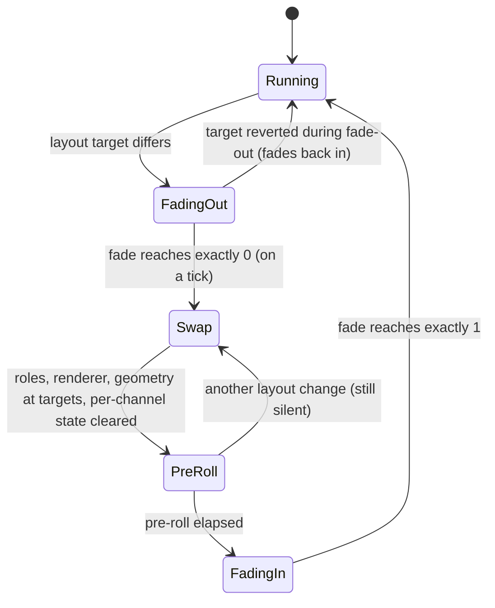

---

## 7. Stereo widener / spatializer

Sources: [`core/include/flub/dsp/StereoSpatializer.h`](../core/include/flub/dsp/StereoSpatializer.h), [`core/src/dsp/StereoSpatializer.cpp`](../core/src/dsp/StereoSpatializer.cpp).

### 7.1 Purpose

"Stereo & Space" widens, focuses and decorrelates the stereo image. It also offers bs2b-style headphone crossfeed. Every stage acts on the **side** signal only, so the mono fold-down is invariant for every setting (§7.3.6). That guarantee protects mono playback, laptop speakers and Bluetooth hands-free links from comb filtering.

- Zero latency, all IIR.
- Stereo only: a block with `numChannels != 2` passes through untouched, and no state advances.
- Its control rate is `fs / 32` (`kControlInterval = 32`). The only control-rate work is the mono-safety loop and state hygiene; every smoother runs per sample.

### 7.2 Signal flow

```
 L ─┐   M = (L + R) / 2 ─────────────────────────────────────────────────────┬─► L' = M + S4
 R ─┘   S = (L − R) / 2                                                       └─► R' = M − S4
        │
        S  ─► HS_w: 2nd-order high shelf (Q 1/√2) at spatial.lowCut ─► × min(w, 1) ─► S1   width
        S1 ─► bell 3 kHz, Q 0.5, +6 dB · focus ─────────────────────────────────► S2   positional focus
        M  ─► HP 300 Hz (Butterworth, 12 dB/oct) ─► z^−5 ms ─► D (nested all-pass) ─► × 0.5·space ─(+)─► S3
        S3 ─► S3 − 0.6 · crossfeed · LP1_700 Hz(S3) ───────────────────────────────► S4   crossfeed

 L', R' ─► <L'R'>, <L'²>, <R'²> (one-pole 300 ms, double) ─► ρ
        ─► every 32 samples: safety s ∈ [0, 1] ─► w_eff = w > 1 ? 1 + (w − 1)(1 − s) : w ─► 20 ms smoother ─► w
```

### 7.3 Algorithm & maths as implemented

#### 7.3.1 Width: a complementary shelf, not an LR4

The header contract is `S' = S_low · min(w, 1) + S_high · w`, split at `widthLowCutHz`. It is realised with a **complementary** split (`S_low + S_high = S` exactly):
- for `w ≤ 1` the width is the plain gain `w · S`;
- for `w > 1` it is `S + (w − 1) · S_high`, i.e. a 2nd-order minimum-phase high shelf on S.

The shelf is the Cytomic high shelf of §0.2, written in terms of the width so that the end points are exact:

```
wHi = max(w, 1),   A = sqrt(wHi)                (shelf gain A² = wHi)
g   = tan(π · lowCut / fs) · sqrt(A),   k = √2  (Q = 1/√2, no overshoot)
m0  = wHi,   m1 = k (1 − A) A,   m2 = 1 − wHi   → m0 + m2 = 1 exactly (LF gain 1)
S1  = min(w, 1) · SVF(S)                         w = 1 gives (1, 0, 0): bit-exact identity
```

The magnitude is 0 dB below the cut, `20 log10 w` above it and half of that (in dB) at the cut. Analytic values at `w = 2`, `lowCut = 180 Hz`, 48 kHz:

| Frequency re cut | 0.22× | 0.5× | 1× | 2× | 4× |
|---|---|---|---|---|---|
| S gain, complementary shelf (as built) | +0.02 dB | +0.38 dB | +3.01 dB | +5.64 dB | +6.00 dB |
| S phase re M | +6.5° | +16.6° | +27.7° | +16.6° | +7.5° |
| in-phase LR4 band sum (reference) | — | +0.5 dB | +3.5 dB | +5.8 dB | — |

The phase of S never strays more than 27.7° from M (16.3° at `w = 1.5`). A literal LR4 pair sums to a 2nd-order all-pass that reaches −180° at the crossover (§0.4). Applied to S alone, with M untouched, it would invert the side signal around the low cut: a left-panned 180 Hz source would image to the right. Width 1 could then never be a bit-exact pass-through either. Test *StereoSpatializer (review): widening never mirrors a panned source around the low cut* pins this choice.

The shelf is re-derived per sample only while `w` or the low cut glide: two square roots and one division, plus an `exp` and a `tan` while the low cut moves.

#### 7.3.2 Positional focus

A Cytomic bell (as `SvfCoeffs::make(Bell)`) on S1 at a fixed 3 kHz, Q 0.5, gain `6 dB · positionalFocus`:

```
A = 10^(gainDb / 40),  k = 1 / (Q A),  m = (1, k (A² − 1), 0)       focus 0 → m1 = 0 exactly
```

At focus 1 and 48 kHz (analytic): +0.25 dB at 300 Hz, +2.15 dB at 1 kHz, **+6.00 dB at 3 kHz**, +3.63 dB at 6 kHz, +1.46 dB at 10 kHz and +0.44 dB at 15 kHz. The gain is ≥ +3 dB from 1.26 kHz to 6.84 kHz. For broadband transients (footsteps, reloads), interaural level differences in this region are the main lateral localisation cue. Emphasising S there sharpens the perceived direction without touching the centre.

#### 7.3.3 Space

```
x  = z^−P · HP300(M)               HP300: 2nd-order Butterworth SVF high-pass, P = 5 ms pre-delay
D  : three nested Schroeder all-passes, g = 0.5; the outer (7.3 ms) section carries the
     4.7 ms section in its delay path, which carries the 3.1 ms one. Per section:
         v = in + g · w,   y = w − g · v,   w = inner(v delayed)
S3 = S2 + 0.5 · space · D(x)
```

- Delays are whole samples (`msToSamples`, rounded) in power-of-two lines that share one wrapped write index. All reads precede the writes, and every delay is ≥ 1 sample.

  | fs | pre-delay | outer | middle | inner |
  |---|---|---|---|---|
  | 44.1 kHz | 221 | 322 | 207 | 137 |
  | 48 kHz | 240 | 350 | 226 | 149 |
  | 96 kHz | 480 | 701 | 451 | 298 |
  | 192 kHz | 960 | 1402 | 902 | 595 |

- D is a true lossless all-pass, so the ambience has exactly the spectrum of HP300(M). On mono sines at space 1, S/M (analytic) is −29.0 dB at 80 Hz, −9.0 dB at 300 Hz, −6.06 dB at 1 kHz and −6.02 dB from 3 kHz. On white noise the test measures −6.1 dB.
- **Why the pre-delay.** A Schroeder section passes `−g` of its input with no delay. Without P that instantaneous tap would put `−0.25 · space · HP(M)` straight into S and pan the centre sideways (4.4 dB interaural level difference at space 1). Delayed by 5 ms it becomes a lateral early reflection (a Lauridsen-type complementary comb) that reads as space, not as an image shift, and the ambience is uncorrelated with M at lag 0.
- **Decay** (measured, impulse on M, space 1, 48 kHz, 10 ms windows): −20 dB after 80 ms, −40 dB after 190 ms, −60 dB after 330 ms; the tail falls about 125–130 dB/s. The flush in §7.3.7 makes it exactly zero after about 2.1 s.
- The network always runs, even at space 0, so raising space starts from a live tail.

#### 7.3.4 Crossfeed

A first-order TPT low-pass at 700 Hz, subtracted from S:

```
G  = tan(π·700/fs) / (1 + tan(π·700/fs))
v  = (S3 − z) · G,   lp = v + z,   z ← lp + v
S4 = S3 − 0.6 · crossfeed · lp
```

This is a monotonic low shelf on S only, with no resonance. At crossfeed 1 (analytic, 48 kHz): −7.96 dB at DC, −7.53 dB at 100 Hz, −5.37 dB at 300 Hz, −2.37 dB at 700 Hz, −1.40 dB at 1 kHz, −0.19 dB at 3 kHz and −0.02 dB at 8 kHz. It reduces low-frequency separation on headphones (bs2b-like comfort) without colouring M.

#### 7.3.5 Output

`L' = M + S4`, `R' = M − S4`. When every stage is neutral, S4 equals S bit-exactly and the code leaves L and R untouched, because `M + S` does not round back to L in general. The neutral path is therefore bit-exact (test *width 1 with everything else neutral is a bit-exact pass-through*).

#### 7.3.6 Mono-sum invariance: proof

Claim: for every parameter setting, every automation trajectory and every safety state, `L' + R' = L + R`, up to float rounding.

1. In exact arithmetic, `L' + R' = (M + S4) + (M − S4) = 2M = L + R`. This holds whatever S4 is, because S4 cancels.
2. Nothing in the module writes to M:
   - width, focus, crossfeed and the safety only scale or filter S;
   - the ambience is *derived* from M but *added* to S.

   So the identity holds sample by sample for any time-varying, recursive or nonlinear processing of S, including parameter glides and the safety loop.
3. Float rounding. `mid = fl(0.5 · fl(L + R))`, `L' = fl(mid + s)` and `R' = fl(mid − s)`, with unit roundoff `u = 2^−24`:
   ```
   |(L' + R') − (L + R)| ≤ u · (|L'| + |R'| + |L + R|)          (a few ulp of the signal)
   ```
   The neutral path (S4 == S) is exact.
4. Measured: 40 runs of full-scale white noise, every parameter re-randomised every 256 samples (48 kHz). The worst `|L' + R' − (L + R)|` was **1.19e−7**. The test bound is 1e−5 (*StereoSpatializer: L'+R' == L+R for random stereo noise under random settings*; also checked under per-sample parameter thrash).

Mono invariance is not the same as "nothing changes in mono". The space ambience and widened S *cancel* in the mono sum; they do not leak into it.

#### 7.3.7 Auto mono safety

```
correlation (output, double): <L'R'>, <L'²>, <R'²> one-pole, τ = 300 ms
ρ = <L'R'> / sqrt(<L'²><R'²>),  clamped to [−1, 1];  undefined (reads 1) if <L'²><R'²> ≤ 1e−20 (≈ −100 dBFS)

every 32 samples of stream time:
  safety off, or user width ≤ 1 :  s −= 32 / (0.3 s · fs)                  released in 300 ms
  ρ undefined (near silence)    :  hold
  else, e = minCorrelation − ρ, h = min(0.05, (1 − minCorrelation) / 2):
      e > 0   :  s += 32 / (0.3 s · fs) · min(1, e / 0.1)                  full pull in 300 ms
      e < −h  :  s −= 32 / (3 s · fs)                                       slow 3 s release
      else    :  hold                                                       hysteresis band
  s = clamp(s, 0, 1)
w_eff = w > 1 ? 1 + (w − 1)(1 − s) : w            only widening is pulled back
```

- `h` shrinks near `minCorrelation = 1` so that release stays reachable (test *mono safety releases with minCorrelation close to 1*).
- Holding during near-silence means game pauses between events do not pump the width back up.
- Per-tick steps at 48 kHz: 2.22e−3 (pull at full error) and 2.22e−4 (release). They scale with fs, so the timing is rate-independent (test *mono safety timing does not depend on the sample rate*).
- Measured (48 kHz, `w = 2`, `minCorrelation = 0`, antiphase noise): `w_eff ≤ 1.05` after 0.31 s. After switching to mono content, `w_eff ≥ 1.95` after 3.10 s.
- `getCorrelation()` and `getEffectiveWidth()` are published once per stereo block (relaxed atomics). The chain forwards the effective width to `MeterBus::effectiveWidth`. The chain's correlation meter is the separate `LevelMeter` (section 13).

**State hygiene** also runs on the 32-sample tick, in stream time:
- SVF and crossfeed states below 1e−15 are flushed;
- all-pass line writes are flushed per write;
- the correlation accumulators are zeroed when `<L'²> + <R'²> < 1e−30`;
- any non-finite filter state, ambience output or correlation sum clears all state.

A NaN or ±inf input is therefore contained within 32–64 samples, and flushing on the tick instead of per host block keeps the output bit-identical for any block size.

### 7.4 Parameters

| Name | Key | Range | Default | Unit | What it does |
|---|---|---|---|---|---|
| Stereo & Space | `spatial.on` | off/on | on | toggle | module bypass (`ModuleSlot`, 20 ms) |
| Width | `spatial.width` | 0 … 2 | 1 | % (stored 0–2 = 0–200 %) | S gain; above 1 only above the low cut (§7.3.1) |
| Width Low Cut | `spatial.lowCut` | 60 … 500 | 180 | Hz | shelf corner (half-gain point) |
| Positional Focus | `spatial.focus` | 0 … 1 | 0 | % | 3 kHz bell on S, 0 … +6 dB |
| Space | `spatial.space` | 0 … 1 | 0 | % | ambience level, `0.5 · space · D(…)` into S |
| Headphone Crossfeed | `spatial.crossfeed` | 0 … 1 | 0 | % | `0.6 · crossfeed` of LP1_700(S) subtracted |
| Mono Safety | `spatial.monoSafety` | off/on | on | toggle | enables the correlation loop (§7.3.7) |
| Min Correlation | `spatial.minCorrelation` | −1 … 1 | 0 | — | target output correlation for the safety |

Module-level sanitising: NaN keeps the previous value; everything else, ±inf included, clamps. An unchanged parameter set returns early.

### 7.5 Smoothing & click-freeness

| Change | Mechanism | Time |
|---|---|---|
| width (user × safety) | per-sample one-pole on `w_eff`; shelf re-derived per sample while it moves | 20 ms (also removes the 32-sample steps of s) |
| low cut | per-sample one-pole on ln(Hz) | 50 ms |
| focus (dB), space gain, crossfeed gain | per-sample one-poles; bell a-coefficients re-derived while focus moves | 20 ms |
| module on/off | `ModuleSlot` crossfade against the (zero-latency) dry path | 20 ms |
| `reset()` | every smoother jumps to its target (nothing to click against) | — |

There are no control-rate coefficient steps. The output is bit-identical for block sizes 1/13/1024/4096, including decaying tails (test *bit-identical for any block size, including tails and max-size blocks*).

### 7.6 Latency & CPU

- **Latency: 0** (test *zero latency - an impulse comes out at its own sample*).
- Per stereo sample: three SVF ticks (shelf, bell, HP), one first-order low-pass, four delay-line reads and writes, three double multiply-adds. Coefficient maths run only while a parameter glides.
- CPU (indicative, conditions under *Reading conventions*): **19–20 ns** per stereo sample neutral (0.09 % of a core; the ambience network and correlation run even at neutral settings), **23–24 ns** with width 1.6 and focus/space/crossfeed 0.5 (0.11 %).
- Memory: four delay lines, the largest 2048 floats at 192 kHz, allocated in `prepare()`.

### 7.7 Gaming vs Music usage

| | Music | Gaming |
|---|---|---|
| Macros | **Width** macro: engages `spatial.on`, width +0.6 (0–100 %), space +0.35 (40–100 %). **Boost Intensity**: width +0.2 (0–50 %). | **Positional** macro: engages `spatial.on`, focus +0.9 (0–100 %), width +0.25 (30–100 %). **Boost Intensity**: focus +0.3 (0–60 %). |
| Crossfeed | as set by the user / preset | **forced to 0** by `ProcessingChain` (it blurs interaural differences, the main lateral cue) |
| Binaural lock (both modes) | When a 5.1/7.1 strip was rendered by the virtualiser (`virt.on`), the chain forces width 1, space 0 and crossfeed 0: binaural output already carries exact interaural cues. Focus stays available. | same |

All contributions are ungoverned (they add little loudness). Macro contributions are clamped to the parameter range: at 100 % Music Width plus Boost, width is `1 + 0.6 + 0.2 = 1.8`.

### 7.8 Tests that prove it (`tests/test_spatializer.cpp`)

- **Mono guarantee and exactness:**
  - *StereoSpatializer: L'+R' == L+R for random stereo noise under random settings* (≤ 1e−5)
  - *StereoSpatializer: width 1 with everything else neutral is a bit-exact pass-through*
  - *StereoSpatializer: width 0 folds to mono, L' == R' == (L + R) / 2*
- **Responses:**
  - *StereoSpatializer: width 2 lifts S by 6 dB above the low cut and not below; M untouched* (+6.02 ± 0.1 dB at 2/10 kHz, ≤ 0.1 dB at 40 Hz, ≤ 0.6 dB at half the cut; matches the analytic shelf within 0.05 dB)
  - *StereoSpatializer: positional focus lifts S around 3 kHz only; M untouched* (+6.0 ± 0.05 dB at 3 kHz)
  - *StereoSpatializer: space adds decorrelated S to a mono input; mono sum stays exact* (S/M −6.1 ± 0.5 dB on noise; −6.02 ± 0.05 dB at 3 and 9 kHz; ≤ −25 dB at 80 Hz)
  - *StereoSpatializer: crossfeed reduces low-frequency S only; M untouched*
- **Safety and metering:**
  - *StereoSpatializer: auto mono safety pulls the width back for antiphase-heavy content*
  - *StereoSpatializer: published correlation tracks the output*
- **Channels, RT safety, robustness, timing:**
  - *StereoSpatializer: 1-channel and 6-channel blocks pass through untouched*
  - *StereoSpatializer: no allocation in reset / setParams / process*
  - *StereoSpatializer: robustness - silence, DC, full-scale noise, impulses, extreme params, all rates*
  - *StereoSpatializer: output is independent of the host block size*
  - *StereoSpatializer: zero latency - an impulse comes out at its own sample*
  - *StereoSpatializer: parameter jumps are click-free*
- **Review regressions:**
  - *StereoSpatializer (review): bit-identical for any block size, including tails and max-size blocks*
  - *StereoSpatializer (review): mono safety releases with minCorrelation close to 1*
  - *StereoSpatializer (review): mono safety timing does not depend on the sample rate*
  - *StereoSpatializer (review): widening never mirrors a panned source around the low cut*
  - *StereoSpatializer (review): NaN / inf inputs are contained within one control interval*
  - *StereoSpatializer (review): per-sample parameter thrash stays finite, bounded and mono-exact*
  - *StereoSpatializer (review): re-prepare at another rate, empty blocks, silence start*

### 7.9 Known limitations

- **Shelf, not brick-wall.** Below the cut the width transition falls at about 12 dB/oct, similar in practice to an in-phase LR4 sum but not a 24 dB/oct split.
- **Correlation reads 1 when one output channel is silent.** "Silent" here means `<L'²><R'²> ≤ 1e−20`, a geometric-mean level of about −100 dBFS; an example is a hard-panned source at width ≤ 1. This is the same convention as `LevelMeter`; many meters read 0 there. The safety holds its state while ρ is undefined.
- **The safety scales only the width.** Space and focus are not pulled back, so a low `minCorrelation` target can be missed while space is on (the width then saturates at 1, which is harmless).
- **Hard-panned sources widened above 1 always drive ρ towards −1**, so any `minCorrelation ≥ 0` pulls such material fully back to width 1. This follows from the contract.
- **The space network is fixed:** no size, decay or modulation controls. Like any decorrelator, it gives frequency-dependent level differences between the ears on steady tones.
- **The loop can overshoot once** on a sudden change, because of the 300 ms measurement lag. The implementer observed a dip to about 1.19 before settling at 1.33 on content with input correlation 0.3. It does not hunt.

---

## 8. Headphone virtualizer

Sources: [`core/include/flub/dsp/HeadphoneVirtualizer.h`](../core/include/flub/dsp/HeadphoneVirtualizer.h), [`core/src/dsp/HeadphoneVirtualizer.cpp`](../core/src/dsp/HeadphoneVirtualizer.cpp). Chain integration: `ProcessingChain::process()` step 2.

### 8.1 Purpose

Games render true positional audio when the endpoint reports 7.1, so the "Flubsound Game" endpoint advertises 7.1. This module folds 5.1/7.1 (or two virtual stereo speakers) down to **binaural** stereo for headphones: the "virtual 7.1" idea. It has two renderers:

- **A. Parametric** (built in, no data licence): a Brown & Duda (1998) spherical head. It provides Woodworth ITD, a first-order head shadow, a rear pinna cue and early reflections.
- **B. Measured HRIRs**: direct-form time-domain convolution of a per-speaker left/right impulse-response set.

Both renderers share the LFE path, the room reflections and a −3 dB headroom trim. The module reports **zero latency**: the ITD delays are part of the acoustic model (a centre source reaches both ears after a/c), not added latency.

### 8.2 Signal flow

```
 channel map (WAVEFORMATEXTENSIBLE):  5.1 = FL FR FC LFE SL SR     7.1 = FL FR FC LFE BL BR SL SR
 azimuth (deg, + = right):            FL/FR ∓front (30)  FC 0  SL/SR ∓side (100)  BL/BR ∓rear (145)

 speaker x (renderer A) ─► rear-cue shelf ─► ITD line ─┬─► Lagrange(D_L) ─► shadow_L ─► ear L ─┐
                                                       └─► Lagrange(D_R) ─► shadow_R ─► ear R ─┤
 speaker x (renderer B) ─► 2L history ─► dot(h_L) ─► ear L,  dot(h_R) ─► ear R ────────────────┤
 LFE ─► LP 120 Hz (Butterworth, 24 dB/oct) ─► × lfeGain ─► both ears ──────────────────────────┤
 Σ non-LFE speaker inputs ─► HP 200 Hz ─► LP 5 kHz ─► 6 taps 4–19 ms, alternating ears ─► × room ┤
                                                                                                ▼
                               (ear L, ear R) × 0.70795 (−3 dB trim) × swap fade ─► ch 0 / ch 1; ch ≥ 2 cleared
```

In the chain the module runs only on multichannel strips (`inputChannels > 2`) with `virt.on`, after the input gain and AutoLevel and before any slot. The chain picks the layout from the strip width: 8 channels are read as 7.1, 6–7 as 5.1 and 3–5 as the stereo layout (FL/FR only; the rest is ignored and cleared). With `virt.on` off the chain applies an ITU-R BS.775 downmix instead: `L = 0.7071 · (FL + 0.7071·FC + 0.7071·(BL + SL))`, likewise R, with the LFE dropped.

### 8.3 Algorithm & maths as implemented

#### 8.3.1 Geometry and Woodworth ITD

Constants: `c = 343 m/s`, head radius `a = virt.headRadius` (default 87.5 mm, so a/c = 255.1 µs = 12.24 samples at 48 kHz). For a speaker at azimuth `az` and an ear at −90° (left) or +90° (right):

```
θ = |remainder(az − earAz, 360°)| ∈ [0°, 180°]     angle between source and ear axis
D = (a/c)(1 − cos θ) · fs              θ < 90°      (path to the ear on the lit side)
  = (a/c)(1 + θ − π/2) · fs            θ ≥ 90°      (straight line to the tangent + arc round the head)
```

For a source at lateral angle φ, the near ear has θ = 90° − φ and the far ear θ = 90° + φ:

```
ITD = D_far − D_near = (a/c)·[(1 + φ) − (1 − sin φ)] = (a/c)(φ + sin φ)          Woodworth
```

A rear source at 145° has the same lateral angle (35°) as one at 35°: a sphere is front/back symmetric, so the rear cue below is what separates them.

Per-ear delays and ITDs at the defaults (a = 87.5 mm, 48 kHz; analytic):

| Speaker | az | θ_L / θ_R | D_L / D_R (samples) | ITD |
|---|---|---|---|---|
| FL | −30° | 60° / 120° | 6.12 / 18.66 | 261 µs |
| FC | 0° | 90° / 90° | 12.24 / 12.24 | 0 |
| SL | −100° | 10° / 170° | 0.19 / 29.34 | 607 µs |
| BL | −145° | 55° / 125° | 5.22 / 19.72 | 302 µs |

The maximum per-ear delay is `(a/c)(1 + π/2)`: 655.8 µs at the default radius and 787.0 µs = 151.1 samples at 192 kHz for a = 105 mm. The ITD lines are sized for that (+ 8, rounded up to a power of two): 256 samples up to 192 kHz, 512 at 384 kHz and 1024 at 768 kHz. The line can be shorter than a host block, so each speaker runs one fused per-sample loop that writes a sample and reads its four Lagrange taps before the line wraps.

**Fractional delay** is a 3rd-order (4-tap) Lagrange interpolator:

```
base = max(0, floor(D) − 1),  d = D − base ∈ [1, 2)   (d ∈ [0, 1) when D < 1)
h0 = −(d−1)(d−2)(d−3)/6,  h1 = d(d−2)(d−3)/2,  h2 = −d(d−1)(d−3)/2,  h3 = d(d−1)(d−2)/6
y  = Σ_k h_k · x[n − base − k]
```

The taps are continuous in D, and an exact integer delay selects a single tap. At the worst position (d = 1.5) its magnitude is −0.54 dB at 10 kHz, **−3.25 dB at 16 kHz** and −8.4 dB at 20 kHz (48 kHz, analytic). So different ears and angles get slightly different top octaves.

#### 8.3.2 Brown–Duda head shadow

A first-order shelving filter per ear:

```
H(s) = (1 + α s / (2 ω0)) / (1 + s / (2 ω0)),   ω0 = c / a
α(θ) = 1.05 + 0.95 · cos(θ · 180°/150°)
DC gain 1;  HF gain α;  pole at 2ω0 → c/(π a) = 1247.8 Hz for a = 87.5 mm
```

`α` is 2.0 (+6.02 dB) facing the ear (θ = 0°) and 0.1 (−20 dB) at θ = 150°. At θ = 180° it recovers partly to 0.28 (−11.0 dB), the "bright spot" behind a sphere. The section is bilinear-transformed **without prewarping** (`BiquadCoeffs::fromAnalogFirstOrder`, K = 2 fs), so the Nyquist gain is exactly α, and it runs as a double-precision TDF-II section.

Per-ear shadow magnitude at the defaults (analytic, excludes trim and rear shelf):

| Speaker | ear L: α / 1 kHz / 4 kHz / 10 kHz | ear R: α / 1 kHz / 4 kHz / 10 kHz | ILD at 4 kHz |
|---|---|---|---|
| FL (−30°) | 1.34 / +1.2 / +2.4 / +2.5 dB | 0.28 / −1.9 / −8.0 / −10.5 dB | 10.4 dB |
| FC (0°) | 0.76 / −0.8 / −2.2 / −2.4 dB | 0.76 / −0.8 / −2.2 / −2.4 dB | 0 |
| SL (−100°) | 1.98 / +3.3 / +5.6 / +5.9 dB | 0.18 / −2.1 / −9.4 / −13.6 dB | 15.0 dB |
| BL (−145°) | 1.44 / +1.5 / +3.0 / +3.1 dB | 0.23 / −2.0 / −8.8 / −12.1 dB | 11.8 dB |

#### 8.3.3 Rear cue

In renderer A every speaker passes an SVF high shelf at 4 kHz, Q 0.7071. Its gain is **−4 dB for |azimuth| > 90°** and 0 dB otherwise: −2 dB at 4 kHz (the half-gain point, §0.2) and −4 dB above. This models pinna shadowing of sources behind the head and resolves the sphere's front/back symmetry.
- At the defaults it applies to BL/BR (145°) and also to SL/SR, because the default side angle, 100°, is past 90°.
- A 0 dB shelf is an exact identity, but it still runs on every speaker so its state stays warm.
- When a side angle crosses 90°, the shelf gain glides (10 ms) rather than stepping.

#### 8.3.4 LFE

A 4th-order Butterworth low-pass at 120 Hz: two SVF sections, Q 0.5412 and 1.3066. It is scaled by `dbToGain(virt.lfe)` and sent identically to both ears. Including the trim, the implementer measured −3.0 dB at 50 Hz, −20.8 dB at 200 Hz and −76.7 dB at 1 kHz; the analytic Butterworth values agree. The stereo layout has no LFE.

#### 8.3.5 Early reflections

```
bus  = Σ non-LFE speaker inputs  → SVF HP 200 Hz (Q 0.7071) → SVF LP 5 kHz (Q 0.7071) → power-of-two line
ear L += room · (0.5 · bus[n − 4.0 ms] + 0.4 · bus[n − 8.9 ms] + 0.3 · bus[n − 15.4 ms])
ear R += room · (0.5 · bus[n − 5.3 ms] + 0.4 · bus[n − 11.7 ms] + 0.3 · bus[n − 19.0 ms])
```

- Reflected energy per ear is `(0.5² + 0.4² + 0.3²) · room² = 0.5 · room²`: −3 dB re a unit direct path at room 1 and −19.5 dB at the default 0.15, before band-limiting.
- The delays are mutually non-harmonic, to avoid a periodic comb, and integer: 192/254/427/562/739/912 samples at 48 kHz, in a 1024-sample line (4096 at 192 kHz).
- The 200 Hz high-pass keeps the reflections from building up boom and combing the bass.
- The line is always fed; the taps are skipped while room is 0 and not ramping.
- The reflections are direction-independent (one mono bus) and are not head-shadowed.

#### 8.3.6 Renderer B: HRIR convolution

- **Validation** in `prepare()`:
  - the layout enum is valid and `length ≥ 1`;
  - left and right entry counts are equal and match the layout (the 5.1/7.1 LFE entry may be present, and is then ignored, or omitted);
  - every IR holds at least `length` taps, and all taps are finite.

  Sets longer than `kMaxHrirTaps = 8192` are truncated.
- **Selection.** The HRIR renderer runs only if the set's `sampleRate` equals the session rate within 0.5 Hz and its layout equals the running layout. Otherwise, or for a malformed set, the parametric renderer runs silently. A set is never resampled here.
- **Convolution** is direct-form:
  - each input sample is written twice into a mirrored history of 2L samples, so the newest L samples are always contiguous;
  - each output is one dot product per ear with the time-reversed IR;
  - four partial sums per ear use a fixed summation order, which is SIMD-friendly and block-size independent.
- The rear shelf, ITD and head shadow are **not** applied, because measured responses carry those cues. LFE, reflections and trim are.
- `setHrirSet()` is structural: a set handed over after `prepare()` is ignored until the next `prepare()`.
- **Status:** no host loads HRIR sets today. The chain always uses renderer A. The SOFA loader, background resampling and a uniformly-partitioned FFT convolver are **roadmap** (`docs/07-roadmap.md` item 2.6).

#### 8.3.7 Output level, channel handling, robustness

- **Output level.** `ear × 0.70794578` (`10^(−3/20)`) × swap fade.
  - There is **no normalisation by speaker count.** Fully correlated full-scale content on every channel therefore exceeds 0 dBFS before the chain's limiter.
  - Measured with 7.1 at the defaults, 48 kHz:
    - 1.0 DC on all 8 channels settles at 5.66 (8 × 0.708, **+15.1 dBFS**; 5.98 peak at the onset);
    - 0 dBFS 60 Hz sine on all 8 reaches +14.3 dBFS;
    - correlated white noise of peak 1 on all 8 reaches +10.1 dBFS;
    - a single FC channel at 0 dBFS, 1 kHz, gives −4.0 / −3.7 dB at L / R. The asymmetry comes from the reflections, whose per-ear taps differ.
  - The maximizer's true-peak limiter downstream absorbs this. Real game mixes are far from fully correlated full scale.
- **Channel handling.**
  - Processing is in place: every input is read into scratch accumulators before channels 0/1 are written.
  - Inputs beyond the layout are ignored and cleared.
  - Layout channels missing from a block are silent, and their state is cleared once.
  - A 1-channel host bus receives `(L + R)/2`.
- **Robustness.** `prepare()` maps a non-finite or non-positive rate to 48 kHz and clamps the rate to 8–768 kHz. At the end of every segment, IIR states below 1e−15 or non-finite are zeroed. The delay lines are FIR, so after a NaN the module recovers by itself within one line length. For the parametric renderer the longest is the reflection line: 1024 samples at 48 kHz and 4096 at 192 kHz. An HRIR history needs its IR length L.

### 8.4 Parameters

| Name | Key | Range | Default | Unit | What it does |
|---|---|---|---|---|---|
| Headphone Virtualizer | `virt.on` | off/on | on | toggle | chain chooses virtualiser (on) or BS.775 downmix (off) for strips with more than 2 channels; no effect on stereo strips |
| Front Speaker Angle | `virt.front` | 22 … 45 | 30 | ° | FL/FR at ∓front |
| Side Speaker Angle | `virt.side` | 80 … 120 | 100 | ° | SL/SR at ∓side |
| Rear Speaker Angle | `virt.rear` | 120 … 165 | 145 | ° | BL/BR at ∓rear (7.1) |
| Head Radius | `virt.headRadius` | 70 … 105 | 87.5 | mm | a in the ITD and shadow models (personalisation) |
| Room | `virt.room` | 0 … 1 | 0.15 | % | early-reflection level |
| LFE Level | `virt.lfe` | −20 … +10 | 0 | dB | LFE gain to both ears |
| (layout) | — | Stereo, 5.1, 7.1 | from the strip | — | the chain sets it from the strip channel count: ≥ 8 → 7.1, 6–7 → 5.1, 3–5 → stereo |
| (HRIR set) | API `setHrirSet()` | — | none | — | structural; renderer B (not wired to any host yet) |

Module sanitising: NaN takes the default; ±inf clamps to the range edge; an invalid layout enum becomes 7.1. `speakerAzimuthDeg()` returns NaN for the LFE and for channels outside the layout.

### 8.5 Smoothing & click-freeness

- **Control rate** `fs / 16`, counted in absolute stream time. While the module is *busy*:
  - each tick advances one-pole smoothers (τ = 30 ms, coefficient computed for the control rate) for the three angles and the head radius;
  - it redesigns every speaker's delays, Lagrange taps and shadow coefficients;
  - across the following 16 samples, delays (hence Lagrange taps), shadow `b0/b1/a1` and the six shelf coefficients are interpolated per sample and land exactly on the new design. Interpolating a1 between two stable first-order poles keeps the pole inside the unit circle.
- **Rear-shelf gain:** its own one-pole (10 ms, control rate) in dB.
- **Room and LFE levels:** linear per-sample ramps over 20 ms.
- **Layout change** (discrete: channel meaning and possibly renderer):



- The fade is `16 · round(5 ms · fs / 16)` samples: 224 at 44.1 kHz, 240 at 48, 480 at 96 and 960 at 192 kHz.
- The pre-roll is `16 · ceil(2 ms · fs / 16)` for the parametric renderer (96 samples at 44.1/48 kHz). For an HRIR it is `max(that, 16 · ceil(min(L, 10 ms · fs) / 16))`. It lets the cleared ITD lines and HRIR histories fill before anything is heard; fading in over an empty path would make the signal arrive as a step at non-zero gain.
- The reflection line and its filters are *not* cleared at a swap, so reflections of content common to both layouts stay continuous.
- The gap is therefore about 12 ms (parametric) to about 20 ms (long HRIR).
- The chain never changes the layout without re-preparing, so in practice this path is exercised only through the API.
- With nothing busy, a block is one segment; the output is sample-identical either way (bit-exact under random 1–4096 partitions with automation).

### 8.6 Latency & CPU

- **Latency: 0** (test *zero latency - near-ear and HRIR paths respond at sample 0*). The Woodworth path delay of up to (a/c)(1 + π/2) is part of the binaural cue.
- CPU, indicative, 7.1 in → binaural out, 48 kHz, 512-sample blocks:

| Configuration | ns / sample frame | % core |
|---|---|---|
| parametric, room 0.15, steady geometry | 78–80 | 0.38 % |
| HRIR direct-form, 128 taps | 467–478 | 2.3 % |
| HRIR 256 taps | 838–844 | 4.0 % |
| HRIR 512 taps | ≈ 1 700 | 8.2 % |
| HRIR 1024 taps | 3 340–3 450 | 16.5 % |

HRIR cost is O(L) per speaker, ear and sample: 7 speakers × 2 ears × L multiply-adds. Direct form is practical up to about **512–1024 taps**. The accepted maximum of 8192 taps would need more than one core at 7.1/48 kHz, so long BRIRs require the partitioned FFT convolver (roadmap).

### 8.7 Gaming vs Music usage

- **Gaming.** The Game strip is 7.1, so with `virt.on` (default on) games are rendered binaurally.
  - The chain's *binaural lock* then fixes width 1, space 0 and crossfeed 0 in the spatializer (section 7); positional focus stays available.
  - Presets for 7.1 headphone play (`gaming-7-1-headphone-surround`) rely on it.
  - Device profiles warn against stacking a headset's own virtual surround, or Windows Sonic, with this module (`adviceFor()`, [`core/src/engine/DeviceProfiles.cpp`](../core/src/engine/DeviceProfiles.cpp)).
- **Music.** Music strips are stereo, so the module does not run. No macro targets `virt.*` in either mode.

### 8.8 Tests that prove it (`tests/test_virtualizer.cpp`)

- **Geometry and cues:**
  - *HeadphoneVirtualizer: speaker azimuth mapping for stereo, 5.1 and 7.1*
  - *HeadphoneVirtualizer: side-left source is louder at 4 kHz and leads at the left ear by the Woodworth ITD* (ILD 6–25 dB at 4 kHz; lag within ±2 samples of the model)
  - *HeadphoneVirtualizer: ITD follows the head radius and the sample rate*
  - *HeadphoneVirtualizer: centre speaker reaches both ears identically*
  - *HeadphoneVirtualizer: rear cue - BL is darker than FL at the left ear*
  - *HeadphoneVirtualizer: LFE reaches both ears equally, low-passed, at lfeGainDb*
  - *HeadphoneVirtualizer: stereo layout renders two mirrored virtual speakers*
  - *HeadphoneVirtualizer: room amount adds reflections 4-19 ms after the direct sound*
- **HRIR renderer:**
  - *HeadphoneVirtualizer: HRIR renderer produces exactly the expected delayed/scaled copies*
  - *HeadphoneVirtualizer: HRIR renderer matches a reference convolution for dense responses*
  - *HeadphoneVirtualizer: HRIR set with another sample rate or layout falls back to the parametric renderer*
- **Contract, RT safety, timing:**
  - *HeadphoneVirtualizer: channels >= 2 are zero after processing*
  - *HeadphoneVirtualizer: no allocation in reset / setParams / process*
  - *HeadphoneVirtualizer: robustness - silence, DC, full-scale noise, impulses, extreme params, all rates*
  - *HeadphoneVirtualizer: fewer channels than the layout, mono blocks and odd blocks are safe*
  - *HeadphoneVirtualizer: output is independent of the host block size*
  - *HeadphoneVirtualizer: zero latency - near-ear and HRIR paths respond at sample 0*
  - *HeadphoneVirtualizer: angle / head-radius changes are click-free and land on the target design*
  - *HeadphoneVirtualizer: layout changes fade out / swap / fade in without a click*
- **Adversarial:**
  - *HeadphoneVirtualizer [adversarial]: centre and ear-axis paths match the header model sample by sample* (independent Lagrange + bilinear reference, 1e−6)
  - *HeadphoneVirtualizer [adversarial]: ILD matches the Brown-Duda response at every rate*
  - *HeadphoneVirtualizer [adversarial]: largest ITD at 192 kHz fits the delay line without wrapping*
  - *HeadphoneVirtualizer [adversarial]: bit-exact under random block partitions with continuous automation*
  - *HeadphoneVirtualizer [adversarial]: continuous angle automation on every block stays click-free*
  - *HeadphoneVirtualizer [adversarial]: layout toggled every block never clicks and settles on the final layout*
  - *HeadphoneVirtualizer [adversarial]: 7.1 fed only FL/FR equals the stereo layout exactly*
  - *HeadphoneVirtualizer [adversarial]: a NaN / Inf input sample does not latch the module*
  - *HeadphoneVirtualizer [adversarial]: re-prepare switches the renderer with the session rate*
  - *HeadphoneVirtualizer [adversarial]: absurd sample rates in prepare() do not hang or produce NaN*
  - *HeadphoneVirtualizer [adversarial]: tiny inputs decay to exact zero at every rate (no subnormal crawl)*
  - *HeadphoneVirtualizer [adversarial]: switching renderer (HRIR 7.1 -> parametric stereo) is click-free*
- **Chain:** *Chain: 7.1 input is virtualised (or downmixed) to stereo; extra channels cleared* (`tests/test_engine.cpp`).

### 8.9 Known limitations

- **HRIR renderer is direct-form**, practical up to about 512–1024 taps (see the CPU table). No host loads HRIRs yet, and there is no public accessor reporting which renderer is active.
- **No speaker-count normalisation.** A surround-to-binaural fold of fully correlated full-scale content can exceed 0 dBFS by up to about 15 dB before the limiter (§8.3.7).
- **Switching `virt.on` at runtime is a hard switch in the chain.** `ProcessingChain` alternates between `virtualizer.process()` and `downmixToStereo()` without a crossfade. The two paths also differ in level: −3 dB trim vs the BS.775 0.7071 weights. When re-enabled, the virtualiser resumes with the history from before it was switched off.
- **Lagrange top-octave loss:** up to −3.25 dB at 16 kHz at half-sample delays (48 kHz).
- **Model simplifications:**
  - a spherical head (no pinna notches, no elevation);
  - the rear cue switches as the side angle crosses 90° (with a 10 ms glide) instead of blending with angle;
  - reflections are direction-independent and unshadowed.
- **Room and LFE also apply in HRIR mode.** Users of BRIRs, which already contain a room, should set room to 0.

---

## 9. Look-ahead compressor (downward + upward)

Sources: [`core/include/flub/dsp/Compressor.h`](../core/include/flub/dsp/Compressor.h), [`core/src/dsp/Compressor.cpp`](../core/src/dsp/Compressor.cpp).

### 9.1 Purpose

A linked, look-ahead, feed-forward compressor that combines two curves:
- a **downward** curve for level control;
- an optional **upward** curve that lifts quiet detail ("environment detail", night mode) without lifting the noise floor.

Detection is linked across all channels, which is mandatory for games: unlinked gain on a game mix moves sounds between the ears. Everything runs per sample, so the output is bit-exact for any host block size.

### 9.2 Signal flow

```
 x (all channels) ─────────────────────────────────────────────► delay L (look-ahead) ─► × F ─► y
   │                                                                                      ▲
   └─► per channel: d = x + w · (HP_sc(x) − x)        HP_sc: 12 dB/oct Butterworth SVF    │
         ─► p = max_c |d|                              (linked, NaN ignored)               │
         ─► two-bucket peak hold (B+1 … 2B samples) ─► L = 20 log10(held) ∈ [−160, +100]   │
         ─► static curve  g_t = gDown(L) + gUp(L)                                          │
         ─► attack / release in dB (double; program-dependent release) ─► g               │
         ─► F = (1 − mix) + mix · 10^((g + makeup) / 20) ───────────────────────────────────┘
```

The gain computed from the detector at sample n is applied to `x[n − L]`: the gain starts moving L samples before the event plays.

### 9.3 Algorithm & maths as implemented

**Static curves.** With slope `s = 1 − 1/R`, knee width W, `o = L − T`:

```
downward (Giannoulis/Massberg/Reiss 2012 soft knee; W = 0 is a hard knee):
   2o < −W        : gDown = 0
   |2o| ≤ W       : gDown = −s (o + W/2)² / (2W)
   2o > W         : gDown = −s · o
upward (only when upMax > 0 and L < upT), s_u = 1 − 1/upR:
   gUp = min(upMax, (upT − L) · s_u) · clamp((L − upFloor) / 12 dB, 0, 1)
target g_t = gDown + gUp                            (computeGainDb() returns exactly this)
```

The knee joins with matching value and slope at `T ± W/2`. The upward lift fades out linearly over the 12 dB above `upFloor`, so silence, hiss and room tone are never pulled up. Worked values:

| Detector peak | −30 | −21 | −18 | −15 | −10 | 0 dBFS |
|---|---|---|---|---|---|---|
| gDown, defaults (T −18, R 2.5, W 6) | 0 | 0 | −0.45 | −1.80 | −4.80 | −10.80 dB |

| Detector peak | −40 | −50 | −60 | −63 | −69 | −75 dBFS |
|---|---|---|---|---|---|---|
| gUp (upT −45, upR 2, upMax 6, floor −75) | 0 | +2.5 | +6.0 (capped) | +6.0 | +3.0 (taper ½) | 0 dB |

With the default upward threshold, ratio and floor (−45 dBFS, 2:1, −75 dBFS), the uncapped lift peaks at **+9 dB at −63 dBFS**: `(−45 + 63) · 0.5 = 9`, taper 1. An `upMax` above 9 dB therefore only matters once the upward threshold, ratio or floor are moved away from their defaults.

**Peak hold.** Two alternating buckets of B samples, `held = max(current, previous)`, which always covers the last B+1 to 2B samples:

```
B = max(1, L, round(fs / (2 f_low))),   f_low = max(20 Hz, scHp / 2) with the sidechain HP on, 20 Hz with it off
48 kHz: HP 80 Hz → B = 600 (12.5 ms);  HP off → 1200 (25 ms);  HP 300 Hz → 160 (3.3 ms), raised to L if L is longer
```

- A steady tone always has a waveform peak inside the window, so the level does not ripple at twice the signal frequency and the gain does not modulate the bass. A −8 dBFS tone with T −20, R 4 settles at −9.0 dB, the static-curve value.
- `B ≥ L` keeps every sample still inside the look-ahead delay held, so the release can never start before the loudest delayed sample has played.
- The side effect is that recovery = hold (B … 2B) + release.

**Level.** `L = min(20 log10(held), +100 dB)`, floored at −160 dB. The +100 dBFS clamp keeps the gain finite for ±Inf input. It is recomputed only when `held` changes, and the curve is re-evaluated only when L or the smoothed curve moves.

**Gain smoothing** (the `GainSmoother` law, §0.9, implemented inline in double precision):

```
g ← g_t + c · (g − g_t),   c = exp(−1 / (τ · fs))                        state and coefficients in double
  τ = attack   when g_t < g   (gain falling: level rising; also removes an upward lift)
  τ = release  when g_t > g   (with autoRelease and g < 0 dB: τ = release · (0.25 + 0.75 σ))
  |g − g_t| < 1e−5 dB  →  g = g_t                                         steady state costs no exp
```

The double state matters. A float one-pole with a 2000 ms release at 192 kHz stalled 0.74 dB short of its target (review finding, test *the gain lands on the static curve even with the slowest times at 192 kHz*).

**Program-dependent (auto) release.**
- An *episode* runs while the held target asks for more than 0.5 dB of downward reduction.
- `onsetGain` is the linear detector peak at which the smoothed downward curve reaches −0.5 dB. `reductionOnsetGain()` computes it in closed form (inside the knee `x = T − W/2 + sqrt(2·0.5·W/s)`, otherwise `x = T + 0.5/s`).
- `loudRun` is the episode-relative index of the last sample whose *instantaneous* linked peak exceeded `onsetGain`. The hold is therefore excluded exactly from the persistence.
- `σ = max(σ, min(1, loudRun / (0.1 s · fs)))`, so reduction that persisted for 100 ms or more releases at `releaseMs`, and a 5 ms transient at about `releaseMs / 4`.
- While the gain is still below −0.5 dB, σ is held, so dense material stays on the slow release (no pumping). Once the gain has recovered, σ falls linearly to 0 over 100 ms.
- The upward lift (g > 0 dB) always rises at `releaseMs`, so short gaps are not pumped up.

**Output.** One delay line serves as both the wet input and the dry path, so parallel compression is phase-aligned and collapses to one factor:

```
y = x[n − L] · ((1 − mix) + mix · 10^((g + makeup) / 20))    exactly 1 at mix 0; exactly G at mix 1
makeup = manual makeupDb, or with autoMakeup: clamp(−gDown(0 dBFS) / 2, 0, +24) dB     (defaults: +5.4 dB)
```

`F` (one `exp`) is recomputed only when `g + makeup` or mix changes.

**Meters.** `getGainReductionDb() = min(0, block minimum of g)` and `getUpwardGainDb() = max(0, block maximum of g)`. Both show the compressor's own net gain, excluding makeup and independent of mix.

**Housekeeping,** every 64 samples of stream time:
- sidechain SVF states below 1e−20 are flushed;
- a non-finite HP state is reset *per channel*, so a NaN on one channel does not disturb the others;
- a non-finite gain returns to 0 dB.

Prepared channels missing from a narrower block are fed zeros through their delay lines and their HP states are reset, so a rejoining channel starts from silence rather than stale audio.

### 9.4 Parameters

| Name | Key | Range | Default | Unit | What it does |
|---|---|---|---|---|---|
| Compressor | `comp.on` | off/on | **off** | toggle | module bypass (Gaming macros engage it) |
| Threshold | `comp.threshold` | −60 … 0 | −18 | dBFS | downward threshold T (detector peak) |
| Ratio | `comp.ratio` | 1 … 20 | 2.5 | ratio | downward slope `1 − 1/R` |
| Knee | `comp.knee` | 0 … 24 | 6 | dB | soft-knee width W (0 = hard) |
| Attack | `comp.attack` | 0.1 … 200 | 10 | ms | one-pole τ for a falling gain |
| Release | `comp.release` | 10 … 2000 | 120 | ms | one-pole τ for a rising gain (after the hold) |
| Auto Release | `comp.autoRelease` | off/on | off | toggle | release scales `0.25 … 1 × releaseMs` with persistence |
| Makeup | `comp.makeup` | −12 … +24 | 0 | dB | manual makeup |
| Auto Makeup | `comp.autoMakeup` | off/on | off | toggle | makeup = half the reduction at 0 dBFS (≤ +24 dB) |
| Sidechain High-Pass | `comp.scHp` | 0 … 300 | 80 | Hz | 0 = off; otherwise clamped to 20 … 300 Hz by the module |
| Mix | `comp.mix` | 0 … 1 | 1 | % | phase-aligned parallel compression |
| Upward Threshold | `comp.upThreshold` | −80 … −10 | −45 | dBFS | below it, quiet material is lifted |
| Upward Ratio | `comp.upRatio` | 1 … 10 | 2 | ratio | lift slope `1 − 1/upR` |
| Upward Max Gain | `comp.upMax` | 0 … 18 | 0 | dB | cap on the lift; 0 = upward off |
| Upward Floor | `comp.upFloor` | −100 … −40 | −75 | dBFS | lift fades to 0 over the 12 dB above it |
| (look-ahead) | `latency.profile` | 0.5 / 1 / 3 ms | 1 ms (Balanced) | ms | structural; module accepts 0 … 10 ms (NaN → 0) |

Module sanitising: out-of-range values clamp, and a non-finite field keeps its last valid value. An unchanged parameter set returns early.

### 9.5 Smoothing & click-freeness

| Change | Mechanism | Time |
|---|---|---|
| threshold, knee, slope (ratio), upward threshold/slope/max/floor, makeup (manual or auto), mix | per-sample one-poles (ratios smoothed as slopes, so the curve glides evenly); a step that no longer moves the float value lands on the target (local `glide()`), so glides really finish | τ = 20 ms (≈ 280 ms to land) |
| sidechain HP corner | one-pole on ln(Hz); SVF coefficients refreshed every 16 samples and on landing | 20 ms |
| sidechain HP on/off | detector input crossfaded raw ↔ high-passed; a re-enabled HP restarts from rest at the new corner under the fade | 20 ms linear |
| attack / release times | coefficients only; the gain state stays continuous | immediate |
| module on/off | `ModuleSlot` crossfade against the latency-delayed dry path; re-activation resets and pre-rolls for L + 64 samples | 20 ms |

### 9.6 Latency & CPU

- **Latency = L = round(lookahead · fs)**, fixed at `prepare()`. Per profile: 3 ms (144 samples at 48 kHz, 132 at 44.1 kHz) in Quality, 1 ms (48 / 44) in Balanced, 0.5 ms (24 / 22) in Low Latency. Test *latencySamples() = round(lookahead \* fs) and a quiet impulse arrives exactly that late* checks this.
- **The look-ahead is partial anticipation, not a ceiling guarantee.** With the default 10 ms attack and a 1 ms look-ahead, the gain has covered `1 − e^(−0.1)` ≈ 9.5 % of a step when the transient plays. A ceiling is the limiter's job (section 10).
- CPU (indicative): **22–23 ns** per stereo sample with the downward and upward curves active (0.11 % of a core), independent of the look-ahead. The implementer measured about 12.5 ns for steady or silent input. Transcendentals run only when the held level changes (`log10`), while the gain or makeup/mix moves (`exp`), when σ changes during a release (`exp`), and during a corner glide (`tan` every 16 samples).

### 9.7 Gaming vs Music usage

- **Gaming** (all ungoverned):
  - **Boost Intensity** engages `comp.on` from about 6 % (smoothstep 5–7 %) and adds upward max +5 dB (10–70 %).
  - **Footsteps** engages it and adds upward max +3 dB (30–100 %).
  - **Detail** engages it and adds upward max +8 dB (0–100 %).
  - Together they reach +16 dB (store range 0 … 18). With the default upward curve the lift is capped by the curve itself at +9 dB (above).
  - Engaging the module also activates the *default downward curve* (−18 dBFS, 2.5:1, 6 dB knee, 10/120 ms, sidechain HP 80 Hz), so loud events are compressed gently while quiet cues are lifted.
  - The 80 Hz sidechain high-pass keeps explosions from ducking everything.
  - The Low Latency profile uses a 0.5 ms look-ahead.
- **Music.** No Music macro touches the compressor, and `comp.on` defaults to off. It is a user/preset tool, for example dynamic genres or night listening via the upward curve.

### 9.8 Tests that prove it (`tests/test_compressor.cpp`)

- **Static curves:**
  - *Compressor: static curve is 0 below the knee, continuous inside it and has slope 1/R above it*
  - *Compressor: upward curve lifts below its threshold, caps at upMax and tapers to 0 at the floor*
  - *Compressor: static curve sanitises out-of-range and non-finite input*
  - *Compressor: 1 kHz tone at -8 dBFS, threshold -20, ratio 4, hard knee settles at -9 dB*
  - *Compressor: upward compression lifts a -50 dBFS tone by ~5 dB and leaves the floor alone*
  - *Compressor: makeup is manual, or auto = half the reduction at 0 dBFS (knee included)*
- **Detection and timing:**
  - *Compressor: linked detection gives both channels identical gain when only one is loud*
  - *Compressor: sidechain high-pass stops a loud 30 Hz tone from causing much reduction*
  - *Compressor: look-ahead attenuates an isolated burst from its very first sample*
  - *Compressor: look-ahead withdraws the upward lift before a loud transient arrives*
  - *Compressor: auto release recovers faster after a short burst than after a long one*
  - *Compressor: mix 0 is exactly the input delayed by the latency; mix 0.5 blends aligned paths*
  - *Compressor: latencySamples() = round(lookahead \* fs) and a quiet impulse arrives exactly that late*
- **Click-freeness, RT safety, robustness:**
  - *Compressor: parameter changes during a loud tone are click-free*
  - *Compressor: reset, setParams and process do not allocate*
  - *Compressor: silence, DC, full-scale noise, impulses and extreme settings stay finite and bounded*
  - *Compressor: recovers from NaN / Inf input samples*
  - *Compressor: output is independent of the host block size (1, 7, 64, 512)*
  - *Compressor: 1..8 channels, all linked, and blocks narrower than the prepared width*
- **Adversarial:**
  - *Compressor [adversarial]: the gain lands on the static curve even with the slowest times at 192 kHz*
  - *Compressor [adversarial]: after a parameter glide the output matches a compressor set up with the final values*
  - *Compressor [adversarial]: attack and release time constants are exact and sample-rate independent* (hold 24–51 ms with the HP off; attack 5 ms ± 0.05; release 100 ms ± 1; at 44.1/48/96/192 kHz)
  - *Compressor [adversarial]: auto release after a 5 ms transient runs at ~releaseMs/4, whatever the hold phase*
  - *Compressor [adversarial]: a channel that rejoins after narrower blocks does not replay stale audio*
  - *Compressor [adversarial]: a NaN on one channel does not disturb the detector of the others*
  - *Compressor [adversarial]: the hold covers the full 10 ms look-ahead even with a 300 Hz sidechain corner*
  - *Compressor [adversarial]: random automation, block sizes and signals never produce NaN/Inf or out-of-range meters*
  - *Compressor [adversarial]: parameter changes at the same sample positions give identical output for any block split*

### 9.9 Known limitations

- **The peak hold is not user-adjustable.** Release begins only after B … 2B samples: 12.5–25 ms with the default 80 Hz sidechain HP, 25–50 ms with it off, and never less than the look-ahead. The GUI should label the release "after hold".
- **Peak detection on the high-passed sidechain** does not bound the unfiltered audio peak, so this is not a limiter. With the HP at fc, content below fc/2 (already ≥ 12 dB down) can still ripple the held level slightly; for example, a 30 Hz tone with HP 80 Hz has a half period (16.7 ms) longer than the bucket (12.5 ms).
- **Auto release** scales only the recovery from downward reduction. After a long reduction, σ stays 1 until the gain is back above −0.5 dB, so a short transient that follows immediately still releases slowly.
- **Auto makeup is capped at +24 dB.** The raw formula would give up to +28.5 dB at T −60, R 20.
- **Overlapping curves.** Where the downward and upward regions overlap (`upThreshold > threshold`), the meters show the net gain rather than the two parts.
- **Non-finite input samples** pass through the delay: that sample's output is non-finite. A ±Inf reads as a +100 dBFS peak, which causes deep reduction for hold + release. `ProcessingChain` drops non-finite blocks before they reach any module.

---

## 10. True-peak limiter

Sources: [`core/include/flub/dsp/TruePeakLimiter.h`](../core/include/flub/dsp/TruePeakLimiter.h), [`core/src/dsp/TruePeakLimiter.cpp`](../core/src/dsp/TruePeakLimiter.cpp), [`core/include/flub/dsp/TruePeakDetector.h`](../core/include/flub/dsp/TruePeakDetector.h).

### 10.1 Purpose

The limiter is the **only** stage that guarantees the ceiling (rule 5 of §1.1). It is used twice:
- inside every strip's `LoudnessMaximizer` (section 11), at `max.ceiling`;
- as the desktop app's master limiter in `MixEngine` across all strips (section 14).

Its guarantee:
- the output never exceeds the ceiling in **sample peak**, for any input; this is proven below and enforced by a counted last-resort clamp;
- it stays within about **0.1 dB of the ceiling in true (inter-sample) peak** for content up to about 0.45 fs;
- it has no gain overshoot, is linked across channels and runs strictly per sample.

### 10.2 Signal flow

```
 x[n] (all channels) ─► RefinedPeakDetector (4× polyphase, 40 taps/phase, Kaiser β 5 = the meter's taps, parabolic refinement; delay D = 20)
        ─► p[n] = max over channels                      (|x| and D = 0 with true-peak detection off)
        ─► r[n] = p[n] > thr ? thr / p[n] : 1            thr = ceiling · 10^(−0.05/20)   (0.05 dB margin)
        ─► m[n] = min(r[n−L−1 … n])                      sliding minimum, L + 2 samples (monotonic deque)
        ─► a[n] = mean(m[n−L … n])                       box filter, L + 1 samples (double running sum)
        ─► g[n] = a[n] ≤ g[n−1] ? a[n] : a[n] + c · (g[n−1] − a[n])     release one-pole (double)
 x[n] ─► delay L + D ─► × g[n] ─► safety clamp |y| ≤ ceiling in force when r[n−L] was computed (counted) ─► y[n]
```

`L = round(lookahead · fs)` and `D = TruePeakDetector::kDelay = 20`.

### 10.3 Algorithm & maths as implemented

#### 10.3.1 The limiter's own true-peak detector

`RefinedPeakDetector` (private to the limiter) uses **exactly the meter's interpolator**. Its taps come from the shared design function `TruePeakDetector::designPhaseTaps()` (§0.7), so the limiter and the meters can never read different peaks:
- a 161-tap Kaiser-windowed sinc with β = 5.0 (`TruePeakDetector::kKaiserBeta`), `kTapsPerPhase = 40`, `kDelay = 20`;
- phases p = 1…3 normalised to unity DC gain;
- phase 0 is the delayed sample `x[n − 20]` itself.

Per call it forms |z| on the 4× grid:

```
a0 = n−D−¼ (previous call's phase 3)   a1 = n−D   a2 = n−D+¼   a3 = n−D+½   a4 = n−D+¾   a5 = n−D+1 (= x[n−19], already in the history)
peak = max(a1 … a4, and for every local maximum a_i (i = 1…4, a_i ≥ neighbours, den < 0):
                     a_i − (a_{i−1} − a_{i+1})² / (8 · den),  den = a_{i−1} − 2 a_i + a_{i+1})
```

The reading covers positions `[n − D − 1/8, n − D + 7/8)`. The parabolic vertex can only raise the estimate, and it costs no extra delay because `a5` is already in the history.

**Why refinement.** The plain maximum of a 4× grid under-reads a peak that falls between grid points by up to `cos(π f / (4 fs))` for a sine at f: −0.03 dB at 0.1 fs, −0.17 dB at 0.25 fs and −0.44 dB at 0.4 fs. That is more than the 0.05 dB margin. The implementer measured a refined residual below 0.03 dB (with the earlier β 8 taps; §10.6 has the end-to-end measurement with the current taps).

**Interpolator accuracy** (phase magnitude, computed from the float taps; the same numbers apply to the meter, §13.3):

| f / fs | 0.2 | 0.3 | 0.4 | 0.44 | 0.45 | 0.4535 | 0.47 |
|---|---|---|---|---|---|---|---|
| phases 1,3 / phase 2 | −0.001 / −0.001 dB | −0.001 / −0.003 | −0.001 / −0.002 | −0.007 / −0.015 | +0.016 / +0.032 | +0.019 / +0.039 | −0.31 / −0.65 |

Every phase is flat within −0.02 / +0.04 dB up to 0.4535 fs (20 kHz at 44.1 kHz). The worst error against an ideal fractional delay up to 0.4 fs is −54 dB (near 0.37 fs). The small over-read near 0.45 fs is conservative for a limiter. The 0.05 dB margin absorbs the in-band error, and the measurements in §10.6 show the net result.

#### 10.3.2 Envelope: sliding minimum + box filter, and why it never overshoots

Definitions: `n` is the sample index. `r[n] ≤ 1` is the gain that sample n's reading requires. The audio delay is `L + D`, so the output at time n is `y[n] = g[n] · x[n − L − D]`. The sample `x[n − L − D]` is the phase-0 point of the reading `p[n − L]`.

```
m[k] = min{ r[j] : k − L − 1 ≤ j ≤ k }                 (window of L + 2)
a[n] = (1 / (L + 1)) · Σ_{k = n−L}^{n} m[k]            (window of L + 1)
```

**Lemma 1 (the envelope is at or below every requirement it must honour).** `a[n] ≤ min(r[n − L − 1], r[n − L])`.

*Proof.* Take any k in [n − L, n]. The window of m[k] is [k − L − 1, k]. Since k ≤ n, `k − L − 1 ≤ n − L − 1`, and since k ≥ n − L, `n − L ≤ k`. So both n − L − 1 and n − L lie in m[k]'s window, and `m[k] ≤ min(r[n−L−1], r[n−L])` for every term of the mean. A mean is at most its largest term. ∎

**Lemma 2 (the release never undoes it).** `g[n] ≤ a[n]`. If `a[n] ≤ g[n−1]`, then `g[n] = a[n]`. Otherwise `g[n] = a[n] + c (g[n−1] − a[n])` with `c ∈ [0, 1)` and `g[n−1] − a[n] < 0`, so `g[n] < a[n]`. The landing rule (`a − g < 1e−7 ⇒ g = a`) gives equality, never more. ∎

**Theorem (sample peak).** `|y[n]| ≤ thr < ceiling` for every n, in exact arithmetic.

*Proof.* Phase 0 of the detector is the sample itself, so `|x[n − L − D]| ≤ p[n − L]`.
- If `p[n − L] ≤ thr`, then `|y[n]| ≤ g[n] · thr ≤ thr`, because g ≤ 1.
- Otherwise `r[n − L] = thr / p[n − L]`, and by Lemmas 1 and 2 `|y[n]| ≤ r[n − L] · p[n − L] = thr`. ∎

In float, the 0.05 dB margin between `thr` and the ceiling covers rounding. The final clamp uses the ceiling that was in force when `r[n − L]` was computed (a per-sample ceiling ring of L + 1 entries), so a falling ceiling never trips it. It turns NaN into 0 and counts every engagement. The tests require the count to be **0**. In every measurement of §10.6 the sample peak stayed at or below `thr` (−0.0501 dB re ceiling), and the clamp never engaged.

**True peak between samples.** Take the output interval between samples n − 1 and n, i.e. input positions `(n − L − D − 1, n − L − D)`.
- 7/8 of it is covered by the reading `p[n − L − 1]` (positions `[n−L−D−9/8, n−L−D−1/8)`), and both bracketing gains honour that reading: `g[n−1] ≤ r[n−L−1]` and `g[n] ≤ r[n−L−1]` (Lemma 1 applied at n − 1 and at n). This is why the minimum window is L + 2 and not L + 1: it includes `r[n−L−1]`.
- The last 1/8 sample before sample n belongs to `p[n − L]`, which only `g[n]` is guaranteed to honour.
- If the gain were constant over the reconstruction kernel, the inter-sample values of y would be g times those of x, and the bound would carry over exactly.
- In practice the gain moves as a straight line of at most `(1 − r)/(L + 1)` per sample. That residual, and the interpolator's error, are what the 0.05 dB margin is for.

The true-peak claim is therefore measured, not proven (§10.6).

**No gain overshoot in the other direction either.** Every m[k] in the mean is at least `min(r[n − 2L − 1 … n])`. So the envelope a[n] never dips below the deepest requirement within the preceding 2L + 2 samples: the attack never over-reduces, and the release only lags the envelope on the way up. The envelope is a FIR (box) of a sliding minimum, so it cannot ring.

**Attack shape.** For an isolated over at `r[n0] = r` (all other r = 1):
- `m = r` on [n0, n0 + L + 1];
- `a[n0 + j] = 1 − (j + 1)(1 − r)/(L + 1)` for j = 0 … L, a linear ramp of L + 1 samples;
- a stays at r for the two output samples `n0 + L` and `n0 + L + 1`, which carry `x[n0 − D]` and `x[n0 − D + 1]`, the interval the reading refers to;
- after that a rises at most linearly and g follows at the release rate.

**Implementation.**
- The sliding minimum is a monotonic deque in a power-of-two ring of capacity `nextPow2(L + 3)`. Indices are `uint32_t` and only their differences are used, so wrap-around is safe. It costs O(1) amortised, at most `2N + L + 2` operations per block of N samples.
- The box filter keeps a float ring with a **double** running sum, re-summed exactly once per ring cycle so it cannot drift.
- `a = sum / (L + 1)` is a division, so a window full of 1.0 gives exactly 1.0.

#### 10.3.3 Release

```
slow = exp(−1 / (releaseMs · fs)),   fast = autoRelease ? exp(−1 / (0.2 · releaseMs · fs)) : slow
over      : any sample with r < 1; overs < 25 ms apart belong to one run
runSpan   : time from the first to the latest over of the run
blend     = clamp((runSpan − 25 ms) / 25 ms, 0, 1),   c = fast + (slow − fast) · blend
run reset : no over for 25 ms AND g ≥ 10^(−0.1/20) (within 0.1 dB of unity)
```

- 25 ms is half a period of 20 Hz. A bass note that pokes over the ceiling on every half-cycle therefore counts as *continuous* limiting (slow, low-distortion release) rather than a string of isolated peaks (fast release that would modulate the waveform).
- Runs shorter than 25 ms release at `releaseMs / 5`; runs longer than 50 ms release at `releaseMs`; the coefficient is blended in between.
- The gain state is double: a float one-pole with a long release stalls a few 1e−5 below 1.0. Recovered, the limiter lands exactly on 1.0 and is **bit-transparent** (`y = x` delayed).

#### 10.3.4 Ceiling, telemetry, channels

- **Ceiling.**
  - Linear 50 ms ramp in dB (`ceilingDbS`); the threshold is re-derived per sample while it moves.
  - `setParams()` called before any processing after `prepare()`/`reset()` applies instantly (the chain pushes its parameters right after preparing).
- **Telemetry.**
  - `getGainReductionDb()` = `20 log10` of the block's minimum g, floored at −160 dB.
  - `getSafetyClipCount()` counts clamp engagements since `prepare()` (not reset by `reset()`).
- **Channels.** All channels are linked (one gain). Prepared channels missing from a block are fed zeros through the detector and the delay, so a channel that rejoins never replays stale audio.

### 10.4 Parameters

The strip limiter has no keys of its own. `LoudnessMaximizer` passes its parameters through (section 11), and the latency profile sets the structural values.

| Name | Key | Range | Default | Unit | What it does |
|---|---|---|---|---|---|
| Ceiling | `max.ceiling` | −12 … 0 | −1 | dBTP | limiter ceiling (strip) |
| Release | `max.release` | 5 … 1000 | 60 | ms | slow release τ; fast = τ/5 with auto release |
| Auto Release | `max.autoRelease` | off/on | on | toggle | run-span-based fast/slow blend |
| (look-ahead) | `latency.profile` | 2 / 1.5 / 0.5 ms | 1.5 ms (Balanced) | ms | structural; module accepts 0 … 10 ms (non-finite → 1.5 ms) |
| (true-peak detection) | — | on | on in every profile | — | structural; off gives a sample-peak limiter with D = 0 |

Master limiter (`MixEngine`, desktop app): ceiling −1 dBTP, capped by the device profile (−2 dBTP Bluetooth A2DP, −3 dBTP hands-free, section 14), 1 ms look-ahead, 50 ms auto release, true peak on. Module sanitising: out-of-range values clamp; a non-finite value keeps the previous one.

### 10.5 Smoothing & click-freeness

- Ceiling: 50 ms linear ramp in dB; the clamp follows the per-sample ceiling history, so automation while limiting never trips it (tests).
- Release or auto-release changes: coefficients only, immediate.
- Attack: a linear ramp of L + 1 samples, and release a one-pole towards the envelope, so the gain is continuous in both directions.
- The limiter is not in a `ModuleSlot` of its own; `max.on` bypasses the whole maximizer (section 11).

### 10.6 Latency & CPU

**Latency = L + D = round(lookahead · fs) + 20** (true peak on).

| Look-ahead | 44.1 kHz | 48 kHz | 96 kHz | 192 kHz | Used by |
|---|---|---|---|---|---|
| 0.5 ms | 22 + 20 = 42 | 24 + 20 = **44** | 48 + 20 = 68 | 96 + 20 = 116 | Low Latency profile |
| 1.0 ms | 44 + 20 = 64 | 48 + 20 = 68 | 96 + 20 = 116 | 192 + 20 = 212 | master limiter (`MixEngine`) |
| 1.5 ms | 66 + 20 = 86 | 72 + 20 = **92** | 144 + 20 = 164 | 288 + 20 = 308 | Balanced profile (header default) |
| 2.0 ms | 88 + 20 = 108 | 96 + 20 = **116** | 192 + 20 = 212 | 384 + 20 = 404 | Quality profile |

**Measured true-peak accuracy.** Single channel, ceiling −1 dBTP, input peak +12 dBFS, four noise seeds, judged by an ideal (8× zero-padded FFT, sinc) reconstruction. Worst value re the ceiling:

| Content | Look-ahead 0.5 ms | 1.5 ms | 2 ms |
|---|---|---|---|
| noise band-limited to 0.39 fs | −0.03 dB (44.1 and 48 kHz) | −0.03 dB | −0.03 dB |
| noise band-limited to 0.45 fs (CD-style 20 kHz band at 44.1 kHz) | +0.020 dB (44.1 kHz), +0.015 dB (48 kHz) | −0.02 dB | −0.02 dB |
| raw full-band white noise | — | +1.12 dB (44.1 kHz), +1.19 dB (48 kHz) | — |

Sample peak was ≤ −0.0501 dB re ceiling and the safety clamp never engaged in any case. The unit tests assert ≤ +0.1 dB on band-limited programme and ≤ +0.35 dB on full-level noise flat to 0.45 fs.

**CPU** (indicative, stereo, while limiting): **159–168 ns** per stereo sample with true-peak detection (≈ 0.8 % of a core), independent of the look-ahead. Detection dominates: 3 interpolated phases × 40 taps = 120 multiply-adds per channel-sample. Sample-peak mode costs **11.5 ns**. SIMD for the TP detector is roadmap (`docs/07-roadmap.md` 1.9).

### 10.7 Gaming vs Music usage

The algorithm is identical in both modes; the profiles differ. Competitive Gaming presets use Low Latency: 0.5 ms look-ahead, 44 samples at 48 kHz. Balanced (1.5 ms, 92 samples) is the default. Quality uses 2 ms (116 samples). The shorter look-ahead gives a steeper attack ramp (L + 1 = 25 samples at 48 kHz), which is still within the true-peak bound (§10.6).

### 10.8 Tests that prove it (`tests/test_limiter.cpp`)

The file contains an independent true-peak meter (8× FFT sinc reconstruction, shares no code with the limiter).

- **Latency and transparency:**
  - *TruePeakLimiter: independent true-peak meter is accurate (self-test)*
  - *TruePeakLimiter: latencySamples() = lookahead + detector delay, and a quiet impulse arrives exactly that late*
  - *TruePeakLimiter: a -30 dBFS signal passes bit-exactly, only delayed by latencySamples()*
- **Ceiling:**
  - *TruePeakLimiter: ceiling holds in sample peak and independent true peak (<= +0.1 dB) at 44.1/48/96 kHz*
  - *TruePeakLimiter: full-band synthetic signals hold the sample ceiling exactly (true peak bounded loosely)* (≤ +2 dB)
  - *TruePeakLimiter: other ceilings and look-aheads hold the ceiling too*
  - *TruePeakLimiter: a sudden +12 dB step never overshoots and is anticipated by the look-ahead*
  - *TruePeakLimiter [adversarial]: CD-band programme (flat to 0.45 fs) stays within the documented true-peak bound* (≤ +0.35 dB, safety count 0)
  - *TruePeakLimiter [adversarial]: 192 kHz and the latency-profile look-aheads hold the ceiling (sample + true peak)*
- **Envelope and release:**
  - *TruePeakLimiter [adversarial]: gain matches a brute-force model of the header (deque, box filter, attack bound)*
  - *TruePeakLimiter: release follows releaseMs (fixed) and releaseMs / 5 after an isolated peak (auto)*
  - *TruePeakLimiter [adversarial]: after 20 s of dense limiting with a 1 s release the gain lands exactly on 0 dB*
- **Linking and click-freeness:**
  - *TruePeakLimiter: detection is linked - a quiet channel gets the loud channel's gain*
  - *TruePeakLimiter: ceiling and release changes while limiting are click-free and never trip the safety clamp*
  - *TruePeakLimiter [adversarial]: ceiling automation while limiting never trips the safety clamp*
  - *TruePeakLimiter: sample-peak mode (true peak off) holds the sample ceiling with latency = lookahead*
- **RT safety and robustness:**
  - *TruePeakLimiter: reset, setParams and process do not allocate*
  - *TruePeakLimiter: silence, DC, full-scale noise, impulses and extreme settings stay finite and under the ceiling*
  - *TruePeakLimiter: NaN / Inf input never reaches the output and the limiter recovers*
  - *TruePeakLimiter: output is independent of the host block size (1, 7, 64, 512)*
  - *TruePeakLimiter: blocks narrower than the prepared channel count and long runs stay stable*
  - *TruePeakLimiter [adversarial]: a channel that leaves and rejoins never replays stale audio*
  - *TruePeakLimiter [adversarial]: reset() mid-limit forgets the gain; setParams() right after applies instantly*
  - *TruePeakLimiter [adversarial]: getGainReductionDb() reports the deepest gain of the block*
- **Detector primitives** (`tests/test_primitives.cpp`):
  - *TruePeakDetector: finds the inter-sample peak of an fs/4 sine at 45 degrees*
  - *TruePeakDetector: phase 0 reproduces the input with kDelay samples of delay*
  - *TruePeakDetector: full-band accuracy - a 20 kHz sine at 44.1 kHz reads its true amplitude* (± 0.05 dB)

### 10.9 Known limitations

- **True-peak scope.**
  - The sample peak is exact for any input.
  - True peak is within about 0.1 dB for content up to about 0.45 fs; measured ≤ +0.020 dB (§10.6).
  - Strong content between 0.45 fs and fs/2 is under-read, because no finite interpolator reaches fs/2. Raw digital white noise measured +1.12 to +1.19 dB above the ceiling; heavy maximizer clipping measured up to about +0.13 dB with the current taps (§11.3.5), and up to about +0.3 dB in an earlier implementer test.
  - Mastered programme carries far less energy up there.
- **Look-ahead 0 ms is accepted** (API only; no profile uses it). The gain then switches instantly: the sample peak is exact, but the true peak is not guaranteed (about +1 dB on noise, implementer's measurement).
- **Release shape is fixed.** It is a one-pole in the linear gain domain; the run-gap and blend constants (25/25/50 ms) are not user parameters.
- **NaN counts as a clamp.** A NaN reaching the output is counted as a safety-clamp engagement (it is zeroed). `ProcessingChain` drops non-finite blocks before they get there.
- **Stale comments in the code.** The scope paragraph at the top of `TruePeakLimiter.h` still describes the older 24-tap detector: "flat to ~0.4 fs", "−0.9 dB at 0.44 fs, −1.7 dB at 0.45 fs", "~+0.25 dB" at 0.45 fs and "~+1.7 dB" on raw white noise. The `RefinedPeakDetector` comment gives the plain-grid under-read as 0.12 dB at 0.3 fs and 0.25 dB at 0.4 fs; the worst case `cos(π f / 4 fs)` is 0.24 dB and 0.44 dB. The code uses the shared 40-taps/phase, β 5 design, with the response in the table of §10.3.1 and the measurements of §10.6.

---

## 11. Loudness maximizer + soft clipper

Sources: [`core/include/flub/dsp/LoudnessMaximizer.h`](../core/include/flub/dsp/LoudnessMaximizer.h), [`core/src/dsp/LoudnessMaximizer.cpp`](../core/src/dsp/LoudnessMaximizer.cpp). Chain policy (glue floor, AutoDrive, output trim): [`core/src/engine/ProcessingChain.cpp`](../core/src/engine/ProcessingChain.cpp).

### 11.1 Purpose

The maximizer is the last slot of every strip. It makes programme louder under a hard true-peak ceiling while keeping distortion measurable and bounded. It has three stages:
1. **Glue**: gentle 3-band 2:1 pre-compression. It balances the band levels so that one band, usually the bass, does not dominate the limiter.
2. **Soft clipper**: oversampled. It shaves sub-millisecond transients (snare or gunshot crack) cheaply, so the limiter only handles the longer peaks, with less audible pumping.
3. **True-peak limiter** at the ceiling (section 10).

It also publishes the telemetry the SafetyGovernor needs: limiter gain reduction and clip energy ratio.

### 11.2 Signal flow

```
 x ─► × drive (0…24 dB, 50 ms ramp in dB) ─► finiteOrZero
   ─► [glue]   ThreeBandSplitter 120 Hz / 4 kHz (bands sum to an all-pass) ─► per band b:
                 linked |b| ─► 2-bucket hold ─► 5 / 80 ms follower ─► G_b = sqrt(T / env)  (env > T),  T = ceiling − 6 dB
               wet = Σ_b b · (1 + glue · (G_b − 1));        out = x + mix_glue · (wet − x)
   ─► [clip]   x̂ = Up(x) (2× or 4× half-band)  ─► c = clip(x̂) − x̂ ─► Down(c)
               y = x[n − L_os] + w_clip[n] · Down(c)[n]              (DELTA oversampling)
   ─► [limit]  TruePeakLimiter at the ceiling (look-ahead, 4× true peak)
 ─► (chain) output.gain trim −24 … 0 dB (20 ms ramp)
```

### 11.3 Algorithm & maths as implemented

#### 11.3.1 Drive

`x ← x · 10^(drive/20)`. The `exp` runs only while the drive ramps. A non-finite result, or a finite input pushed past the float range by the drive, becomes 0 at the door (`finiteOrZero`). It can then neither poison the glue splitter's recursive states nor smear through the oversampler FIRs. For finite input at 0 dB drive the path stays bit-exact.

#### 11.3.2 Glue

- **Split.** `ThreeBandSplitter` at 120 Hz and 4 kHz (§0.4). The low band passes the 4 kHz all-pass, so `low + mid + high = AP_4k · AP_120 · x`: flat magnitude, phase rotated.
- **Detection.** One *linked* level per band: `max over channels of |band|`. It then passes a two-bucket peak hold of `round(fs / (2 f_b))` samples, half a period of the lowest frequency the band carries:

  | Band | f_b | Hold at 48 kHz |
  |---|---|---|
  | low (< 120 Hz) | 30 Hz | 800 samples, 16.7 ms |
  | mid (120 Hz – 4 kHz) | 60 Hz | 400 samples, 8.3 ms |
  | high (> 4 kHz) | 2 kHz | 12 samples, 0.25 ms |

- **Follower and gain.**
  ```
  env ← held + c · (env − held),   c = attack (5 ms) if held > env else release (80 ms);   env < 1e−15 → 0
  T   = ceilingLin · 10^(−6/20) = ceilingLin · 0.50118723
  G   = env > T ? sqrt(T / env) : 1          i.e. out = T · (env / T)^½ : 2:1, hard knee, gain = −(L_env − T_dB)/2 dB
  bandGain = 1 + glue · (G − 1),   wet = Σ band · bandGain,   out = x + mix · (wet − x)
  ```
- **Telemetry.** `getGlueReductionDb()` is the block minimum over bands of `1 + mix · (bandGain − 1)`, in dB.
- **Anti-denormal and overflow guards.** An input offset alternating 1e−20 / 0 (DC plus Nyquist) keeps the splitter's SVF states normal in silence; they belong to the shared splitter and cannot be flushed from outside. If a band sum is non-finite (overflow of finite input), the splitter is reset.

**The chain's glue floor.** `ProcessingChain` passes `glue = max(0.001, max.glue)`, so the glue stage *never switches off*:
- Switching glue fully off and on crossfades x against its own all-pass-shifted band sum. At equal weights the partial sum is `(x + AP_4k · AP_120 · x) / 2`. The all-pass product is within 5° of −1 at both crossover frequencies, so it nulls 120 Hz and 4 kHz by 27.6 dB (analytic, 48 kHz). The reviewer's time-domain measurement during a real 30 ms fade saw about 28 dB at 4 kHz and about 9 dB at 120 Hz, for a few ms. It would happen, for example, whenever Boost Intensity crosses the 40 % start of its glue contribution.
- At 0.001, `bandGain ≥ 1 − 0.001 = 0.999`: at most −0.0087 dB of band compression, measured −0.005 dB at 18 dB drive.

The price is that the maximizer's output in the chain is always the all-pass `AP_4k · AP_120` of its input (flat magnitude, phase rotated around 120 Hz and 4 kHz), not a delayed copy.

A phase rotator also changes the crest factor, and it raises it on flat-topped material. Sample-peak change through `AP_120 · AP_4k` (measured, 48 kHz, 8 seeds):
- a 100 Hz square wave: +3.4 to +3.7 dB;
- quasi-Gaussian white noise: +1.2 to +2.9 dB;
- pink-ish noise: −0.9 to +0.9 dB.

In the maximizer at 0 dB drive, ceiling −1 dBTP, synthetic "mastered" programme (saturated or clipped, peaks at −0.26 dBFS) was limited by **3.1–3.4 dB** with the floor, against 0.7–1.4 dB with `glue = 0`. Unclipped programme showed no difference. See §11.9.

**Stage switching** (API level; with the chain floor it only happens at `prepare()`):
- **On:** splitter and detectors start from rest and run unheard for 10 ms, then fade in over 30 ms.
- **Off:** a 30 ms fade-out, after which the stage stops and costs nothing. With `glue = 0` the stage is skipped entirely and the path is bit-exact.

#### 11.3.3 Soft clipper: the curve

```
t  = 10^((ceilingDb + lerp(+6 dB, +0.3 dB, clipAmount)) / 20)       threshold (per base-rate sample)
ks = t · (1 − knee / 2)                                             knee start, ks ≥ t/2
clip(x) = x                                                         |x| ≤ ks
        = sign(x) · min(t, ks + (t − ks) · tanh((|x| − ks) / (t − ks)))    |x| > ks
knee = 0 → hard clip at t;   t ≤ 0 → 0
```

- **Properties:** odd, monotonic and C1 at ks: tanh has slope 1 at 0, so the join is continuous in value and slope. The curve approaches t asymptotically and **never exceeds t**. Because ks ≥ t/2, `t − ks` is exact (Sterbenz), `ks + (t − ks)·tanh(·)` cannot round above t, and a final `min(·, t)` is applied anyway. NaN falls through as NaN and is caught downstream.
- **At the defaults** (ceiling −1 dBTP, `max.clip` 0.5, `max.clipKnee` 0.5): headroom `lerp(6, 0.3, 0.5) = 3.15 dB`, so `t = +2.15 dBFS` (1.281) and `ks = 0.75 t = −0.35 dBFS` (0.961).
- `clipAmount = 1` puts t at −0.70 dBFS; `clipAmount → 0` would put it at +5.0 dBFS, but `clipAmount = 0` disables the clipper altogether.
- The threshold t always sits 0.3–6 dB *above* the ceiling. With a large knee the soft region can start below it: at knee 1, ks = t/2, 6 dB under t. The clipper shaves transients; the limiter then brings everything to the ceiling.

#### 11.3.4 Soft clipper: delta oversampling

The clipper runs at `osFactor · fs` through the half-band oversampler (§0.6). **Only the correction is band-limited**:

```
x̂[k] = Up(x)                         (factor 1: x̂ = x)
e    = Down( clip(x̂) − x̂ )           the deviation is the only thing that passes the half-band filters
y[n] = x[n − L_os] + w[n] · e[n]      x delayed exactly by the oversampler round trip; w = clip crossfade weight
```

- **Unclipped audio is bit-transparent.** Where nothing exceeds ks, `clip(x̂) − x̂ = 0` exactly, and y is the exactly delayed input.
- **The top octave does not droop.** If the programme itself passed the half-band filters, they would cut 20 kHz by 1.0 dB (High) to 2.3 dB (Low) at 44.1 kHz even when nothing clipped. Test *Transparency: the maximizer's oversampled clipper does not droop the top octave* holds 1, 15 and 19.5 kHz tones at −20 dBFS within **0.05 dB** for 2×/4×, Low/High, at 44.1 and 48 kHz.
- **Aliasing.** The harmonics the curve creates above the original Nyquist are attenuated by the downsampler's alias rejection (§0.6). Delta oversampling changes nothing here, because the correction is the only part that carries them.
- **Where the weight is applied.** The clip weight w is applied at base rate *after* the downsampler. With w = 0 the output is exactly the dry path whatever the filter tails hold, which keeps the path block-size independent.
- **Held controls.** The controls (t, knee, w) are computed per base-rate sample and held across its oversampled sub-samples. They move far too slowly for that to matter.

**Stage switching:**
- **On:** the oversampler is reset and runs unheard for `2 · L_os + 8` samples, then fades in over 20 ms.
- **Off:** a 20 ms fade-out; then the oversampler stops, but the dry delay keeps running so the latency is unchanged.

#### 11.3.5 THD telemetry

```
clipEnergyRatioDb = 10 log10( Σ (w · (x̂ − clip(x̂)))² / Σ x̂² )     over all oversampled samples and channels of the block
                  = −160 dB when nothing was clipped or the clipper is off
```

This is the energy the clipper removed (before band-limiting) relative to the energy that entered it: a THD-like measure of how hard the clipper works. The SafetyGovernor's budget is **−30 dB** (≈ 3.2 % RMS). Measured on noise band-limited to 0.4 fs, peak −6 dBFS before drive, 48 kHz, 4× High, defaults:

| Drive | Limiter GR (block min) | Clip energy ratio (block max) | Glue GR (floor 0.001) | True peak re ceiling |
|---|---|---|---|---|
| 0 dB | 0.00 dB | −160 dB (no clipping) | 0.000 dB | −2.46 dB (input −4.88 dB; the glue all-pass raised this peak, §11.3.2) |
| 6 dB | −3.2 dB | −39.9 dB | −0.002 dB | −0.04 dB |
| 12 dB | −5.1 dB | −16.9 dB | −0.004 dB | −0.02 dB |
| 18 dB | −6.5 dB | −7.8 dB | −0.005 dB | +0.13 dB |

At 12 and 18 dB drive this signal runs well over the governor's clip budget. In the chain the governor would scale the governed drive contributions back (section 14).

#### 11.3.6 Limit and output trim

The internal `TruePeakLimiter` gets `{ceilingDb, releaseMs, autoRelease}`. `getGainReductionDb()` reports its block minimum. The limiter's look-ahead and true-peak detection are structural and passed through at `prepare()`.

After the maximizer the chain applies `output.gain`, a **trim of −24 … 0 dB** (20 ms linear ramp). It can only lower the level, so the strip's true-peak ceiling holds in every host, including the plug-in and the CLI, which have no master limiter.

#### 11.3.7 Block handling and channels

`process()` runs in segments of at most `maxBlockSize`. Prepared channels missing from a block are padded with silence from a pre-allocated `padBuffer`, so every stage (dry delay, oversampler, splitter, limiter) keeps running on all prepared channels and nothing stale is released when a wider block returns.

### 11.4 Parameters

| Name | Key | Range | Default | Unit | What it does |
|---|---|---|---|---|---|
| Loudness Maximizer | `max.on` | off/on | on | toggle | module bypass (`ModuleSlot`) |
| Drive | `max.drive` | 0 … 24 | 0 | dB | input gain into glue/clipper/limiter (+ governed macros; AutoDrive may reduce it) |
| Ceiling | `max.ceiling` | −12 … 0 | −1 | dBTP | limiter ceiling; clip threshold and glue threshold follow it |
| Clipper Share | `max.clip` | 0 … 1 | 0.5 | % | clip threshold headroom `lerp(6, 0.3 dB)`; 0 = clipper off |
| Clipper Softness | `max.clipKnee` | 0 … 1 | 0.5 | % | knee start `t (1 − knee/2)`; 0 = hard clip |
| Multiband Glue | `max.glue` | 0 … 1 | 0 | % | 3-band 2:1 amount; the chain uses `max(0.001, value)` |
| Release | `max.release` | 5 … 1000 | 60 | ms | limiter release (section 10) |
| Auto Release | `max.autoRelease` | off/on | on | toggle | limiter program-dependent release |
| Loudness Target | `max.autoDrive` | off/on | off | toggle | AutoDrive loop (section 14) |
| Target Loudness | `max.target` | −24 … −6 | −14 | LUFS | AutoDrive target (gated output loudness) |
| Output Gain | `output.gain` | −24 … 0 | 0 | dB | post-maximizer trim (chain) |
| (clip oversampling) | `latency.profile` | 4× High / 4× High / 2× Low | Balanced: 4× High | — | structural; API accepts 1, 2, 4 (≤ 1 → 1, 2 → 2, ≥ 3 → 4) and High/Low |

Module sanitising: out-of-range values clamp; non-finite values keep the previous one.

### 11.5 Smoothing & click-freeness

| Change | Mechanism | Time |
|---|---|---|
| drive (dB), ceiling (dB), clipAmount, clipKnee, glue amount | linear ramps (per sample) | 50 ms |
| glue stage on/off | warm-up (unheard), then crossfade against the input | 10 ms + 30 ms in / 30 ms out |
| clipper on/off | warm-up `2 L_os + 8` samples, then crossfade against the aligned dry path | 20 ms |
| limiter ceiling | see §10.5 | 50 ms |
| module on/off | `ModuleSlot` crossfade against the latency-delayed dry path; reset + pre-roll L + 64 on re-activation | 20 ms |
| first parameters after `prepare()`/`reset()` | applied instantly (nothing to click against) | — |

The output is independent of the host block size (tested to 1e−5, including automation of every parameter and stage switch; bit-exact in practice).

### 11.6 Latency & CPU

**Latency = L_os + L + 20**: clip oversampler round trip + limiter look-ahead + detector delay. It is identical with the clipper on or off.

| Profile | Clip oversampling | 44.1 kHz | 48 kHz | 96 kHz | 192 kHz |
|---|---|---|---|---|---|
| Quality | 4× High (36) + 2 ms | 36 + 108 = 144 | 36 + 116 = **152** | 36 + 212 = 248 | 36 + 404 = 440 |
| Balanced | 4× High (36) + 1.5 ms | 36 + 86 = 122 | 36 + 92 = **128** | 36 + 164 = 200 | 36 + 308 = 344 |
| Low Latency | 2× Low (16) + 0.5 ms | 16 + 42 = 58 | 16 + 44 = **60** | 16 + 68 = 84 | 16 + 116 = 132 |

CPU (indicative, stereo, 12 dB drive):

| Configuration | ns / stereo sample | % core |
|---|---|---|
| 4× High, clip 0.5, glue floor 0.001 (Balanced / Quality) | 460–475 | 2.2–2.3 % |
| 4× High, clip 0.5, glue 0.5 | 433–447 | 2.1 % |
| 4× High, clip 0, glue floor (limiter + glue) | 244–250 | 1.2 % |
| clip 0, glue 0 (limiter only; API) | 173–175 | 0.8 % |
| 2× Low, clip 0.5, glue floor, 0.5 ms (Low Latency) | 341–349 | 1.6–1.7 % |

The 4× clipper costs about 220 ns, the always-on glue splitter about 75 ns and the true-peak limiter about 170 ns.

### 11.7 Gaming vs Music usage

| | Music | Gaming |
|---|---|---|
| Boost Intensity | drive **+8 dB** (30–100 %, curve^1.2, governed); glue +0.3 (40–100 %); engages `max.on` from ≈ 26 % | drive **+6 dB** (30–100 %, curve^1.2, governed); engages `max.on` from ≈ 26 % |
| Mode macro | **Loudness**: engages `max.on`; drive **+10 dB** (0–100 %, curve^1.3, governed); glue +0.5 (30–100 %) | — |
| Max. effective drive at 100 % (governor scale 1) | 18 dB (+ base `max.drive`, clamped to 24) | 6 dB (+ base) |
| Latency profile | Balanced (4× High, 1.5 ms) or Quality | competitive presets: Low Latency (2× Low, 0.5 ms) |

The governed drive contributions are what the SafetyGovernor takes back when the average limiter GR goes below −6 dB or the clip energy above −30 dB. AutoDrive can additionally *reduce* the effective drive towards a loudness target, but never below 0 dB (section 14).

### 11.8 Tests that prove it

`tests/test_maximizer.cpp`:
- **Curve, latency, transparency:**
  - *LoudnessMaximizer: softClip is odd, continuous, monotonic, identity below the knee and never exceeds t*
  - *LoudnessMaximizer: latencySamples() = clip oversampler + limiter latency, constant with the clipper off*
  - *LoudnessMaximizer: drive 0 and a -20 dBFS signal pass unchanged, only delayed by latencySamples()*
- **Ceiling:**
  - *LoudnessMaximizer: with 18 dB drive the ceiling holds on noise and drum-like programme (sample and true peak)* (true peak ≤ +0.1 dB while clip energy ≤ −12 dB, ≤ +0.5 dB beyond; sample peak exact)
  - *LoudnessMaximizer: extreme and full-band input still holds the sample ceiling exactly*
  - *LoudnessMaximizer [adversarial]: 192 kHz and the latency profiles hold the ceiling with 18 dB drive*
- **Stages and telemetry:**
  - *LoudnessMaximizer: clipAmount 0 disables the clipper (telemetry -160 dB); clipping shows up in the telemetry*
  - *LoudnessMaximizer: the clipper shaves transients so the limiter reduces less*
  - *LoudnessMaximizer: glue > 0 reduces limiter gain reduction on a bass-heavy signal*
  - *LoudnessMaximizer [adversarial]: clip-energy telemetry equals the header formula*
  - *LoudnessMaximizer [adversarial]: glue is 2:1 above ceiling - 6 dB and an all-pass (no gain) below it*
  - *LoudnessMaximizer: release and ceiling are passed to the limiter*
- **Click-freeness, RT safety, robustness:**
  - *LoudnessMaximizer: parameter changes and stage on/off switches are click-free*
  - *LoudnessMaximizer: reset, setParams and process do not allocate*
  - *LoudnessMaximizer: silence, DC, full-scale noise, impulses and extreme settings stay finite and under the ceiling*
  - *LoudnessMaximizer: NaN / Inf input is contained and the maximizer recovers*
  - *LoudnessMaximizer: output is independent of the host block size (1, 7, 64, 512)*
  - *LoudnessMaximizer [adversarial]: a channel that leaves and rejoins never replays stale audio*
  - *LoudnessMaximizer [adversarial]: a NaN in one channel does not glitch the other channel*
  - *LoudnessMaximizer [adversarial]: automation of every parameter and stage switch is block-size independent*

Elsewhere:
- *Transparency: the maximizer's oversampled clipper does not droop the top octave* (`tests/test_transparency.cpp`)
- *Chain: full Music boost on a hot programme never exceeds the ceiling* (`tests/test_engine.cpp`)
- *SafetyGovernor: backs off under sustained over-limiting and recovers* (`tests/test_engine.cpp`)

### 11.9 Known limitations

- **True peak under very hard clipping.** A clip energy ratio above about −12 dB, 18 dB beyond the governor's budget, creates intermodulation up to fs/2, which the limiter's detector under-reads. Measured up to about +0.13 dB here (§11.3.5) and up to about +0.3 dB in the implementer's dense-noise test, which predates the current detector taps. The sample peak is always exact.
- **In the chain the maximizer is never bit-transparent.** The glue floor keeps the all-pass `AP_4k · AP_120` in the path (flat magnitude, phase rotation). This is the price of never comb-filtering when glue crosses zero. The rotation raises the crest factor of flat-topped (already limited or clipped) material. The synthetic "mastered" test signals of §11.3.2 got 1.9–2.4 dB *more* limiting at 0 dB drive than without the floor. Hot commercial masters are expected to behave similarly; this is not yet measured on real programme. The governor does not react, because it only acts on an average limiter GR below −6 dB. This is a **tuning item**: engaging the splitter only while glue can be in use would keep the comb protection without the extra limiting.
- **Glue on/off in the API still combs.** With `max.glue = 0` passed directly (not through the chain), switching glue on or off still crossfades x against its all-pass. This is inherent to "glue 0 skips the stage, bit-exact".
- **No automatic loudness compensation inside the module.** Loudness targeting is AutoDrive's job (reduce-only), and fair A/B is the loudness-matched bypass (section 14).
- **Clip controls are held per base-rate sample** across the oversampled sub-samples (inaudible at 50 ms ramps).

---

## 12. Spectral noise gate

Sources: [`core/include/flub/dsp/SpectralNoiseGate.h`](../core/include/flub/dsp/SpectralNoiseGate.h), [`core/src/dsp/SpectralNoiseGate.cpp`](../core/src/dsp/SpectralNoiseGate.cpp); FFT §0.8.

### 12.1 Purpose

The gate is light, adaptive noise reduction for hiss and hum on noisy captures, old recordings and batch restoration. It is an STFT gate with a per-bin noise floor learned by minimum tracking. Bins that do not rise clearly above their floor are attenuated by at most `reductionDb`, 12 dB by default: light by design. It has `fftSize` samples of latency, so the chain includes it **only in the Quality latency profile**. Voice-chat denoise is a separate, future neural module (**roadmap**, `docs/09-future-roadmap.md`).

### 12.2 Signal flow

```
 per channel (independent; up to 8):
 x ─► input FIFO (N) ───────────────────────────────────────────────────────────────┐
 y ◄─ overlap-add accumulator [0, H) ◄───────────────────────────────────────────────┤ (read before the new frame)
                                                                                    │
 every H = N/4 samples of stream time (hop clock shared by all channels):          ▼
   frame = FIFO · wa ─► FFT (N) ─► per bin k = 0 … N/2:
        p_k = |X_k|² · 2/N + 1e−20 ─► P_k (one-pole, τ_P) ─► N_k (bias-scaled minimum tracker)
        ρ_k = P_k / N_k ─► 3-bin mean ─► soft gate (6 dB transition) ─► per-bin attack/release (dB)
        ─► linear gain ─► 3-bin mean ─► X_k · G_k ─► IFFT ─► · ws ─► overlap-add
```

### 12.3 Algorithm & maths as implemented

**Framing.**
- `N = fftSize` is structural (`setFftSize()` before `prepare()`): a power of two from 256 to 4096, otherwise 512. The chain uses **1024** in the Quality profile.
- Hop `H = N/4` (75 % overlap), `N/2 + 1` bins, hop duration `h = H / fs`.
- At 48 kHz: N 512 → H 128 (2.67 ms), 257 bins; N 1024 → H 256 (5.33 ms), 513 bins.

**Windows and perfect reconstruction (COLA).**

```
wa[n] = sin(π n / N)              analysis  (periodic sqrt-Hann)
ws[n] = 0.5 · sin(π n / N)        synthesis
wa · ws = 0.5 sin²(π n / N);   Σ over the 4 frames covering any sample:
   sin²θ + sin²(θ + π/4) + sin²(θ + π/2) + sin²(θ + 3π/4) = (sin²θ + cos²θ) + (sin²(θ+π/4) + cos²(θ+π/4)) = 2
   → Σ wa·ws = 0.5 · 2 = 1
```

`Fft::forwardReal` is unscaled and `inverseReal` scales by 1/N, so unity gains reconstruct the input exactly: the implementer measured an error of about 1e−7. The test *reductionDb 0 is a perfect reconstruction delayed by fftSize* checks this. Each output sample is read from the accumulator *before* the incoming sample is analysed, so the delay is exactly N for every sample, independent of the hop phase.

**Per-bin power.**

```
p_k = |X_k|² · (2/N) + 1e−20          2/N = 1 / Σ wa²: white noise of variance σ² reads p_k = σ²
if p_k < 1e30:  P_k ← p_k + a_P (P_k − p_k),   a_P = exp(−h / τ_P),   τ_P = max(10 ms, 2 h)
```

- A bin whose raw power is NaN, Inf or ≥ 1e30 skips its update, so the statistics hold.
- `P_k` starts at 1e−20, which keeps every ratio and log finite.
- The two-hop minimum on τ_P takes over whenever the hop exceeds 5 ms. At 48 kHz that starts at N = 1024 (hop 5.33 ms, τ_P = 10.7 ms). It matters most for N ≥ 2048, where 10 ms would be less than one hop.

**Noise floor: bias-compensated minimum tracking.**

```
candidate c = B · P_k
first profile:  N_k = c
afterwards:     N_k = c                        if c < N_k        (follows downwards instantly)
                N_k = min(c, N_k · 10^(r·h/10))  otherwise        (rises at most r dB/s, r = floorRiseDbPerSec)
```

- **Bias B.** A minimum tracker on a fluctuating estimate settles on its *lower envelope*, not its mean. Uncompensated, the floor would sit 2 dB (short hops, fast rise) to 18 dB (long hops, slow rise) below the noise, and "threshold 6 dB above the floor" would open on plain noise.
  - `B` comes from a 2-D table, bilinear in (log2 h, log2 r).
  - Rows cover hops 0.3125 … 40 ms; columns cover r = 0.5 … 32 dB/s in octaves.
  - The values (0.85 … 9.14 dB) were generated by simulating this exact estimator on Gaussian white noise for 400 s.
  - At the defaults (r = 3 dB/s) B = **5.4 dB** for 512 @ 48 kHz and **7.1 dB** for 1024 @ 48 kHz.
  - With B, `N_k` estimates the *mean* noise power, so `thresholdDb` means "dB above the noise" for every fftSize, rate and rise rate. The reviewer's simulation found the mean floor error within ±0.05 dB of the true noise power across nine fs/N/r combinations.
- **When the floor may adapt:**
  - All four hops in the analysis window must be non-silent. A hop is *silent* if every sample has |x| < 1e−7 (−140 dBFS, digital silence); samples from before `reset()` count as silent.
  - Then `ceil(3 τ_P / h)` further valid frames must pass, so that P_k is within 5 % of settled: 12 frames at 512 @ 48 kHz and 6 at 1024. The first profile is therefore learned about 43 ms (512) or 53 ms (1024) after reset. Until then the gate is fully open.
  - Gaps between tracks do not erase the profile, and half-filled windows are never learned.
- **Freeze.** `freezeFloor` holds `N_k` completely, but only after an initial **learning period** of 1 s of adapting frames (375 frames at 512 @ 48 kHz). Before that the tracker adapts even with freeze on, because a profile frozen from a single ~10 ms snapshot would leave random bins permanently open.

**Gate gain.**

```
ρ_k      = clamp(P_k / N_k, 1e−20, 1e20)
ρ̄_k      = (ρ_{k−1} + ρ_k + ρ_{k+1}) / 3             mirrored at DC and Nyquist (Hermitian spectrum)
t        = clamp((10 log10 ρ̄_k − (thr − 3)) / 6, 0, 1)
target_k = −reduction · (1 − t)                        G_min at thr − 3 dB and below, unity at thr + 3 dB and above
g_k      ← target + c · (g_k − target),   c = exp(−h/attack) when opening (target > g), exp(−h/release) when closing
           snap to target within 1e−3 dB (an open bin is exactly 0 dB)
G_k      = 10^(g_k/20);   applied gain = (G_{k−1} + G_k + G_{k+1}) / 3 (mirrored);  all-unity stays exactly unity
```

**Musical-noise suppression.** Isolated bins of plain noise that randomly poke through the threshold and flicker on and off ("musical noise") are fought at five points:
1. The bias-compensated floor. The threshold refers to the *mean* noise power, so fewer noise bins cross it at all.
2. The 3-bin average of the *ratio*, not of the power. It cuts the variance of noise-only bins about 3×, and a stationary hum line cannot hold its neighbours open. At 1024 @ 48 kHz with 40 dB reduction it improves noise-only suppression from −25.7 to −31.8 dB (implementer).
3. A 6 dB soft transition instead of a binary decision.
4. Asymmetric per-bin ballistics. Bins open fast (5 ms) and close slowly (80 ms), which masks the random on/off flicker.
5. The 3-bin average of the *applied* gain. It keeps the gain curve smooth, which also keeps the equivalent filter kernel short and limits circular time-aliasing, and it spreads any isolated open bin.

**Measured noise-only attenuation.** White noise at −60 dBFS RMS, 48 kHz, defaults otherwise (threshold 6 dB, attack 5 ms, release 80 ms, rise 3 dB/s), averaged over 3–6 s:

| fftSize | reduction 12 dB | reduction 24 dB | reduction 40 dB (implementer) |
|---|---|---|---|
| 512 | −11.7 dB | −23.3 dB | −38.6 dB |
| 1024 (chain) | −11.2 dB | −21.8 dB | −31.8 dB |
| 4096 | −11.0 dB (implementer) | ≈ −22 dB (reviewer) | −28.0 dB |

The implementer measured that a −20 dBFS tone passes with less than 0.001 dB change, while noise outside 0.5–2 kHz drops by 11.4 dB. After a +20 dB noise step, the gate closes again after about `14 dB / r + 0.15 s`, independent of fftSize and rate.

### 12.4 Parameters

| Name | Key | Range | Default | Unit | What it does |
|---|---|---|---|---|---|
| Noise Gate | `gate.on` | off/on | **off** | toggle | module bypass; the slot exists only in the Quality profile |
| Gate Threshold | `gate.threshold` | 0 … 20 | 6 | dB | ρ̄ above the mean-noise floor at the centre of the 6 dB transition |
| Gate Reduction | `gate.reduction` | 0 … 40 | 12 | dB | maximum attenuation G_min; 0 = perfect reconstruction |
| Gate Attack | `gate.attack` | 1 … 50 | 5 | ms | per-bin opening time constant (hop rate) |
| Gate Release | `gate.release` | 10 … 500 | 80 | ms | per-bin closing time constant (hop rate) |
| Floor Adapt Rate | `gate.floorRise` | 0.5 … 20 | 3 | dB/s | maximum upward rate of the floor |
| Freeze Noise Profile | `gate.freeze` | off/on | off | toggle | hold the learned floor (after the 1 s learning period) |
| (FFT size) | `latency.profile` | 1024 in Quality | — | samples | structural; module accepts 256 … 4096 (default 512) |

Module sanitising: NaN/Inf keeps the previous value; values are clamped; an unchanged set returns early.

### 12.5 Smoothing & click-freeness

- `thresholdDb` and `reductionDb` glide per hop with a 20 ms one-pole (snap 1e−4), so moving either never steps every bin at once.
- Attack, release and rise are rates, so they take effect immediately without a discontinuity.
- Per-bin gain ballistics plus overlap-add make every gain change a smooth crossfade between overlapping frames.
- Module on/off: `ModuleSlot` crossfade (20 ms) against the dry path delayed by N. Re-activation resets the gate (the learned profile is forgotten) and pre-rolls N + 64 samples.
- Frames fall on absolute hop boundaries and all smoothing runs at hop rate, so the output is bit-identical for any host block size.

### 12.6 Latency & CPU

- **Latency = N**: 1024 samples in the chain (21.3 ms at 48 kHz, 23.2 ms at 44.1 kHz); 512 → 10.7 ms; 4096 → 85.3 ms at 48 kHz.
- CPU (indicative, stereo, 48 kHz): N 512 **245–259 ns** per stereo sample (1.2 %), N 1024 **262–279 ns** (1.3 %), N 4096 **282–316 ns** (1.4–1.5 %).
  - Per hop and channel it costs one forward and one inverse N-point transform, plus `N/2 + 1` each of `log10`, `exp` and division.
  - The reference FFT runs real transforms as full complex ones (§0.8), about 2× the cost of a real FFT. PFFFT/vDSP/IPP is roadmap.
- Memory, allocated in `prepare()`: per channel `2N + 3(N/2 + 1)` floats; shared `3N` floats, about `3(N/2 + 1)` scratch values and the FFT tables.

### 12.7 Gaming vs Music usage

- **Music / restoration.** The gate is available in the Quality profile (`gate.on`, default off; no macro touches it). Typical uses are hiss on old recordings and noisy captures, and the batch CLI.
- **Gaming.** It is not in the chain in Balanced or Low Latency, which the gaming presets use: 21 ms of latency is unacceptable there, and minimum tracking would learn steady game ambience as noise. Voice-chat denoise is a future neural module (roadmap).

### 12.8 Tests that prove it (`tests/test_noise_gate.cpp`)

- **Reconstruction and latency:**
  - *SpectralNoiseGate: reductionDb 0 is a perfect reconstruction delayed by fftSize*
  - *SpectralNoiseGate: fftSize is validated (power of two 256..4096, else 512)*
  - *SpectralNoiseGate: a low-level impulse appears exactly latencySamples() later*
- **Gating behaviour:**
  - *SpectralNoiseGate: noise-only input converges towards -reductionDb* (between −reduction − 0.5 dB and −0.85 · reduction)
  - *SpectralNoiseGate: -60 dBFS noise is reduced, a -20 dBFS tone passes untouched*
  - *SpectralNoiseGate: bins open fast (attack) and close slowly (release)*
- **Floor tracking:**
  - *SpectralNoiseGate: the floor climbs at floorRiseDbPerSec, independent of the hop length*
  - *SpectralNoiseGate: the floor follows a falling noise level at once*
  - *SpectralNoiseGate: freezeFloor holds the learned floor when the input level rises*
  - *SpectralNoiseGate: a frozen gate still learns its first profile after reset*
  - *SpectralNoiseGate: digital silence does not wipe the learned floor*
- **Parameters and channels:**
  - *SpectralNoiseGate: parameter changes are click-free*
  - *SpectralNoiseGate: setParams clamps to the documented ranges and ignores non-finite values*
  - *SpectralNoiseGate: stereo channels are processed independently*
  - *SpectralNoiseGate: a channel that drops out and returns restarts cleanly*
- **RT safety and robustness:**
  - *SpectralNoiseGate: reset, setters and process do not allocate*
  - *SpectralNoiseGate: silence, DC, full-scale noise, impulses and extreme settings stay finite*
  - *SpectralNoiseGate: output is identical for any host block size*
- **Review regressions:**
  - *SpectralNoiseGate: freezeFloor from the start freezes a settled profile, not a raw snapshot*
  - *SpectralNoiseGate: the gate converges quickly after reset (the floor starts high, not low)*
  - *SpectralNoiseGate: a NaN / Inf burst neither sticks in the output nor poisons the statistics*
  - *SpectralNoiseGate: reset() mid-stream is equivalent to a freshly prepared gate*
  - *SpectralNoiseGate: 8 channels at 192 kHz, block size 1 vs 4096, each equal to a mono gate*
  - *SpectralNoiseGate: a tone is preserved and noise reduced at the rate / size extremes*
  - *SpectralNoiseGate: per-block parameter automation stays finite and click-free on noise*

### 12.9 Known limitations

- **Minimum tracking treats any steady sound as noise.**
  - A tone or pad already playing when the gate starts, or lasting longer than about `(level − floor) / r` seconds, is learned and gated. `freezeFloor` is the tool against this.
  - With freeze on, whatever plays in the first second of valid material becomes the profile.
- **The profile is not persistent.** `reset()` forgets it; so does re-activation through `ModuleSlot` and `ProcessingChain::reset()`.
- **Pauses that are not digital silence are learned.** Dither-only passages become the floor, and recovery then takes `level difference / r` seconds.
- **Musical noise limits the depth at long hops.** With 40 dB reduction the implementer measured −31.8 dB (1024) and −28 dB (4096) on white noise.
- **Leakage near loud tones.** sqrt-Hann sidelobes fall at only 12 dB/oct, so a loud tone keeps nearby bins open: about ±1 kHz at 512 @ 48 kHz with 60 dB tone-to-noise.
- **Output peaks can exceed input peaks.** A time-varying spectral gain can raise output peaks above the input's: the implementer's worst case was 1.49× full scale. The downstream limiter bounds the result.
- **Changing `floorRiseDbPerSec` switches the bias B instantly.** Raising r can briefly drop the floor by up to about 4 dB, recovering in about 0.2 s. It is not a click.
- **The bias table assumes Gaussian noise.** Deterministic hum gets a floor B dB above it, so it is gated more firmly. Very narrowband or impulsive noise gets a floor that is somewhat off.

---

## 13. Metering: loudness, LRA, true peak, RMS and correlation

Sources: [`core/src/analysis/LoudnessMeter.cpp`](../core/src/analysis/LoudnessMeter.cpp), [`core/include/flub/analysis/LoudnessMeter.h`](../core/include/flub/analysis/LoudnessMeter.h), [`core/include/flub/analysis/PeakMeters.h`](../core/include/flub/analysis/PeakMeters.h), [`core/include/flub/analysis/LoudnessFollower.h`](../core/include/flub/analysis/LoudnessFollower.h); telemetry [`core/include/flub/engine/MeterBus.h`](../core/include/flub/engine/MeterBus.h).

### 13.1 Purpose

The meters provide standards-based measurement for the GUI, the loudness-matched A/B, the control loops and the CLI `analyze` command:

| Class | Measures | Standard |
|---|---|---|
| `LoudnessMeter` | momentary (400 ms), short-term (3 s), integrated (gated), LRA, max momentary / short-term | ITU-R BS.1770-4, EBU R128, EBU Tech 3341/3342 |
| `TruePeakMeter` | per-channel true peak, last block and hold since reset | BS.1770-4 Annex 2 (4× oversampling) |
| `LevelMeter` | per-channel sample peak (last block), RMS (300 ms), L/R correlation (300 ms) | IEC 60268-10-like ballistics |
| `LoudnessFollower` | cheap K-weighted running loudness (one-pole, default 3 s) | control loops only (section 14) |

All meters only *read* the block (`process()` takes it as const) and add no latency to the audio.

### 13.2 Signal flow in the chain

```
 input stage → fold to stereo ─► inLevel (LevelMeter), inLoudness (LoudnessFollower, 3 s)      → MeterBus in* fields
                                 dry copy ─► LoudnessMatch dry follower
 slots → output trim ─► SafetyGovernor / AutoDrive / LoudnessMatch wet (control loops)
                      ─► global-bypass crossfade
                      ─► outLevel (peak, RMS, correlation), outTruePeak (TruePeakMeter),
                         outLoudness (LoudnessMeter: M, S, I, LRA)                            → MeterBus out* fields
```

Every scalar is written once per block as a relaxed atomic and polled by the GUI at display rate. `MeterBus::resetLoudnessRequest` (GUI → audio) resets the integrated measurement and the true-peak hold.

### 13.3 Algorithm & maths as implemented

**K-weighting.** Two double-precision TDF-II biquads per channel. They are designed from the analog prototype through a bilinear transform prewarped at f0 (the libebur128/ffmpeg derivation), so every sample rate gets the same analog response:

```
stage 1 (pre-filter, high shelf): f0 = 1681.974450955533 Hz, G = 3.999843853973347 dB, Q = 0.7071752369554196
   K = tan(π f0 / fs),  Vh = 10^(G/20),  Vb = Vh^0.4996667741545416,  a0 = 1 + K/Q + K²
   b = [(Vh + Vb K/Q + K²)/a0,  2(K² − Vh)/a0,  (Vh − Vb K/Q + K²)/a0],   a = [1,  2(K² − 1)/a0,  (1 − K/Q + K²)/a0]
stage 2 (RLB high-pass): f0 = 38.13547087602444 Hz, Q = 0.5003270373238773
   d = 1 + K/Q + K²,   b = [1, −2, 1] (unnormalised, as in the BS.1770 table),   a = [1,  2(K² − 1)/d,  (1 − K/Q + K²)/d]
```

- **At 48 kHz** this reproduces the BS.1770 table: stage 1 b = [1.53512485958697, −2.69169618940638, 1.19839281085285], a = [1, −1.69065929318241, 0.73248077421585]; stage 2 a = [1, −1.99004745483398, 0.99007225036621].
- **Combined response** at 48 kHz (analytic): −13.28 dB at 20 Hz, −1.13 dB at 100 Hz, **+0.691 dB at 997 Hz** (cancelled by the −0.691 offset), +4.01 dB at 5 kHz, +4.04 dB at 10 kHz.
- **Rate dependence.** The unnormalised stage-2 numerator makes the passband slightly rate-dependent: 96 kHz and 192 kHz read 0.017 and 0.027 LU lower than 48 kHz, as libebur128 and ffmpeg do. The design rate is guarded: a non-finite rate becomes 48 kHz and the minimum is 8 kHz.
- **Anti-denormal offset.** A constant 1e−20 (−400 dBFS) is added at the input. The RLB double zero at DC removes it before squaring, but it keeps every recursive state normal during digital silence without FTZ.

**Channel weights** are set in `prepare()` from the prepared channel count. All channels get `G = 1.0`. For **≥ 6 channels** the stream is read as 5.1/7.1: channel 3 (LFE) gets `G = 0` and is not filtered at all, and channels 4–7 get `G = 1.41` (+1.49 dB).

**Sub-blocks and windows.**

```
sub-block   = round(0.1 · fs) samples  (4410 / 4800 / 9600 / 19200 at 44.1 / 48 / 96 / 192 kHz — exact)
E_sub       = Σ_c G_c · Σ y_c²           (a channel whose sum is non-finite contributes 0 and has its filters reset)
ring        : 30 sub-blocks (3 s)
L(window)   = −0.691 + 10 log10( Σ E_sub / (count · subBlockLength) )     floored at −160
momentary   = newest 4 sub-blocks (400 ms);   short-term = all 30 (3 s)
```

- Readings update at exactly 10 Hz on the stream's 100 ms grid.
- Each reads −160 ("−∞") until its window has completely filled since `reset()`: 400 ms for momentary, 3 s for short-term.
- Host blocks are split at sub-block boundaries, per-channel sums extend in stream order and windows are summed oldest to newest. Every reading is therefore bit-identical for any host block size.

**Integrated loudness** (gated, BS.1770-4 / EBU R128):
- Every momentary window is a gating block: 400 ms, a new one every 100 ms, so 75 % overlap.
- Absolute gate: blocks at or below −70 LUFS are discarded.
- Relative gate: `E_thr = mean_E(abs-gated) · 10^(−10/10)`, i.e. 10 LU below the absolute-gated mean energy.
- `I = −0.691 + 10 log10(Σ E / Σ n)` over the blocks that pass both gates.
- Blocks are kept in a **two-level histogram** from −70 to +30 LUFS:
  - 1000 coarse bins of 0.1 LU, each split into ten fine bins of 0.01 LU;
  - every bin keeps the exact energy sum and an `int64` count, at both levels, plus running totals of all absolute-gated energy, so the relative threshold itself is exact;
  - the gate is decided on the single fine bin that straddles it, by that bin's exact mean energy;
  - coarse bins above it are included whole;
  - blocks louder than +30 LUFS (possible only with float overs) share the top bin with their true energy.
- The result is exact except for blocks within 0.01 LU of the gate, and none when those blocks are identical (steady material).
- Memory is O(1) for any programme length: 2 histograms × 11 000 bins × 16 B = 352 KB, allocated in `prepare()`.
- Each 100 ms update scans at most about 1000 coarse and 20 fine bins.

**Loudness range** (EBU Tech 3342):
- Every short-term value (3 s window, 100 ms hop) enters a second histogram of the same kind, with an absolute gate of −70 LUFS and a relative gate of −20 LU.
- With n gated values, the ranks are `round((n − 1) · 0.10)` and `round((n − 1) · 0.95)`, following the Tech 3342 reference indexing. Each rank resolves to its fine bin and is represented by that bin's exact mean loudness.
- `LRA = P95 − P10 ≥ 0`. It reads 0 until the first gated short-term value.
- libebur128 hops 1 s instead of 100 ms. The finer hop only gives the statistics more samples.

**Max values and resets.**
- `maxMomentary` and `maxShortTerm` are the largest readings since the measurement started.
- `reset()` clears everything.
- `resetIntegrated()` starts a new measurement (histograms, I, LRA, max values) while momentary and short-term keep running. Only windows that lie entirely after the reset join it; a partly accumulated sub-block is skipped.

**True peak** (`TruePeakMeter`): the 4× `TruePeakDetector` of §0.7 (161-tap Kaiser β 5 prototype, 40 taps/phase, `kDelay` = 20). Per channel it keeps the maximum of the last block and a hold since `reset()`.
- The phases are flat within −0.02 / +0.04 dB up to 0.4535 fs.
- The reading is the plain maximum of four 4× grid points, *without* the limiter's parabolic refinement. A short transient whose peak falls between grid points can therefore read up to `cos(π f / 4 fs)` low: −0.17 dB at 0.25 fs, −0.55 dB at 0.45 fs. Sustained tones eventually land on the grid (test: 15–20 kHz sines within ±0.05 dB).
- The chain publishes `outTruePeakDb` (max over L/R of the last block) and `outTruePeakMaxDb` (hold).

**Level and correlation** (`LevelMeter`):
- Per channel: the sample peak of the last block, and RMS as a `MeanSquareFollower` with τ = 300 ms (double state).
- For the first two channels, the correlation `r = <LR> / sqrt(<L²><R²>)`, with each mean a 300 ms one-pole. It reads 1 when `sqrt(<L²><R²>) ≤ 1e−12` (below about −120 dBFS), clamped to [−1, 1]: +1 is mono, 0 uncorrelated or wide, −1 out of phase.
- The spatializer computes its own output correlation for the mono safety (§7.3.7); the GUI's correlation meter is this one.

**LoudnessFollower** (control loops):
- K-weighting (the same stage designs), then channel weights chosen from the *block's* channel count (LFE excluded, ≥ 6 channels → 1.41 on channels 4+), then `MeanSquareFollower` with τ = 3 s by default.
- `getLufs() = −0.691 + 10 log10(ms)`, or −160 below 1e−20; `isActive()` is true above −60 LUFS.
- Guards: a 1e−20 input offset and a 1e−60 floor on the mean square keep states normal in silence, and a non-finite mean square resets the follower at the end of the block.

### 13.4 Parameters

The meters have no parameter keys. Related controls: the GUI's *reset loudness* action (`MeterBus::resetLoudnessRequest`), `bypass.matched` (section 14), and `autolevel.*` / `max.autoDrive` / `max.target` (section 14), which consume `LoudnessFollower`s.

### 13.5 Smoothing & ballistics

| Reading | Ballistics / window | Update |
|---|---|---|
| momentary / short-term LUFS | rectangular 400 ms / 3 s windows | 10 Hz, 100 ms grid |
| integrated, LRA | gated histograms since (re)start | 10 Hz |
| true peak | last-block max + hold since reset | per block |
| sample peak | last-block max | per block |
| RMS, correlation | exponential, τ = 300 ms | per sample, published per block |
| `LoudnessFollower` | exponential, τ = 3 s (100 ms for the gates' fast follower) | per sample |

### 13.6 Latency & CPU

- **Latency: 0.** Readings refer to audio already processed (test *latency is zero - readings refer to the audio already processed*). The true-peak detector's internal 20-sample interpolation delay only shifts *when* a peak is reported.
- CPU (indicative, stereo, 48 kHz): `LoudnessMeter` **8–9 ns** per stereo sample (two double biquads per channel plus bookkeeping per 100 ms), `TruePeakMeter` **83–87 ns** (3 × 40 multiply-adds per channel-sample), `LevelMeter` **8.5–9.3 ns**.

### 13.7 Gaming vs Music usage

The meters are identical in both modes. The GUI shows LUFS M/S/I and LRA, true peak, RMS and correlation for every strip. The chain meters the **stereo output** of the strip, after the virtualiser's binaural fold, so the 5.1/7.1 weights never apply there. They apply in the CLI's `analyze` of multichannel files and in the `LoudnessFollower`s that see the raw multichannel input (AutoLevel).

### 13.8 Tests that prove it

`tests/test_loudness_meter.cpp`:
- **K-weighting:**
  - *LoudnessMeter: K-weighting at 48 kHz equals the BS.1770 table*
  - *LoudnessMeter: K-weighting response shape and consistency across sample rates*
  - *LoudnessMeter (adversarial): K-weighting designs stay finite and stable for any rate*
- **Calibration and compliance:**
  - *LoudnessMeter: 0 dBFS 997 Hz sine in one channel reads -3.01 LUFS*
  - *LoudnessMeter: EBU Tech 3341 case 1 (-23 dBFS, 20 s) at 44.1 / 48 / 96 kHz* (± 0.1 LU)
  - *LoudnessMeter: EBU Tech 3341 case 2 (-33 dBFS, 20 s)*
  - *LoudnessMeter: EBU Tech 3341 case 3 (-36 / -23 / -36 dBFS, relative gate)*
  - *LoudnessMeter: EBU Tech 3341 case 4 (-72 / -36 / -23 / -36 / -72 dBFS, both gates)*
  - *LoudnessMeter: EBU Tech 3341 case 5 (-26 / -20 / -26 dBFS, 20 / 20.1 / 20 s)*
  - *LoudnessMeter: EBU Tech 3341 case 6 (5.1: L/R -28, C -24, Ls/Rs -30 dBFS)*
  - *LoudnessMeter: EBU Tech 3342 LRA cases* (± 0.1 LU)
  - *LoudnessMeter (adversarial): EBU Tech 3342 LRA cases at 44.1 and 96 kHz*
  - *LoudnessMeter: 192 kHz still meets Tech 3341 case 1*
  - *LoudnessMeter: 5.1 / 7.1 channel weighting (LFE excluded, surrounds +1.5 dB)*
- **Windows, gating and resets:**
  - *LoudnessMeter: window timing - readings appear exactly when their window is full*
  - *LoudnessMeter: momentary window is a rectangular 400 ms window on a 100 ms grid*
  - *LoudnessMeter: absolute gate - silence does not pull integrated loudness down*
  - *LoudnessMeter: max momentary / short-term hold the loudest window*
  - *LoudnessMeter: resetIntegrated starts a new measurement, momentary keeps running*
  - *LoudnessMeter: reset clears everything*
  - *LoudnessMeter (adversarial): histogram gating matches a brute-force BS.1770 / Tech 3342 reference* (I within 0.002 LU, LRA within 0.02 LU, at 44.1–192 kHz and several block sizes)
  - *LoudnessMeter (adversarial): a noise passage sitting right on the relative gate*
  - *LoudnessMeter (adversarial): reset() / resetIntegrated() exactly on and off the 100 ms grid*
- **Contract and robustness:**
  - *LoudnessMeter: process() only reads the block*
  - *LoudnessMeter: process, reset and getters do not allocate*
  - *LoudnessMeter: robustness - silence, DC, full-scale noise, impulses at all rates*
  - *LoudnessMeter: NaN / Inf input cannot poison the meter*
  - *LoudnessMeter (adversarial): NaN in one channel only drops that channel's sub-block*
  - *LoudnessMeter: extreme configuration values are clamped safely*
  - *LoudnessMeter (adversarial): blocks with fewer / more channels than prepared*
  - *LoudnessMeter: readings are independent of the host block size*
  - *LoudnessMeter: latency is zero - readings refer to the audio already processed*
- **Follower:**
  - *LoudnessFollower: converges to the programme loudness and gates silence*
  - *LoudnessFollower (adversarial): recovers from NaN / Inf input*

True peak (`tests/test_primitives.cpp`): *TruePeakDetector: finds the inter-sample peak of an fs/4 sine at 45 degrees*; *TruePeakDetector: phase 0 reproduces the input with kDelay samples of delay*; *TruePeakDetector: full-band accuracy - a 20 kHz sine at 44.1 kHz reads its true amplitude*.

### 13.9 Known limitations

- **7.1 back-channel weights.** The 1.41 weight goes to *all* of channels 4–7 of a ≥ 6-channel stream. Under BS.1770-4 the 7.1 back pair (±135–150°, channels 4/5 in WAVEFORMATEXTENSIBLE order) should get 1.0, so back-channel content in 7.1 reads up to 1.5 dB hot. This only affects multichannel analysis (CLI, AutoLevel on 7.1 strips), not the stereo output meters.
- **Update rate.** Readings update at 10 Hz, so a value can lag the newest audio by up to 100 ms (this meets the EBU minimum). At non-standard rates where `0.1 · fs` is not an integer (e.g. 11 025 Hz) the windows are off by a fraction of a sample.
- **Gate comparisons are strict (`>`).** Tech 3342 writes `≥`; this matters only for values exactly on a threshold.
- **The true-peak meter uses the plain 4× grid** (no refinement), which BS.1770-4 permits. Short transients near fs/2 can read up to about 0.5 dB low; the limiter uses the refined detector.
- **Channel-count mismatch.** `LoudnessFollower` picks its surround weights from the *block's* channel count, the meter from the *prepared* count. They differ only when a block carries fewer channels than prepared.
- **Stale header comments.** `LoudnessMeter.h` still describes a single-level "0.1 LU histogram" and "~1e−8" table agreement. The implementation is the two-level 0.01 LU histogram described above, and the `.cpp` states ~1e−14 agreement.

---

## 14. Macros, Music/Gaming modes & protection loops

Sources: [`core/src/engine/MacroMap.cpp`](../core/src/engine/MacroMap.cpp), [`core/src/engine/ProcessingChain.cpp`](../core/src/engine/ProcessingChain.cpp), [`core/src/engine/Protection.cpp`](../core/src/engine/Protection.cpp) with [`core/include/flub/engine/Protection.h`](../core/include/flub/engine/Protection.h), [`core/src/engine/MixEngine.cpp`](../core/src/engine/MixEngine.cpp), [`core/include/flub/engine/DeviceProfiles.h`](../core/include/flub/engine/DeviceProfiles.h).

### 14.1 Base values, effective values and the macro formula

Presets and the GUI only write **base** values. Every audio block, `ProcessingChain::applyParameters()` computes **effective** values from them and pushes them into the modules:

```
effective[p] = clamp_p( base[p] + Σ_e  amount_e · c_e(v_e) · g_e )

  v_e      = value of the entry's source: Boost Intensity or Macro 1..5 (0..1); entries with v_e ≤ 0 are skipped
  c_e(v)   = smoothstep(start_e, end_e, v) ^ exponent_e       (smoothstep(t) = 3t² − 2t³)
  g_e      = SafetyGovernor scale (0.3..1) if the entry is "governed", else 1
  clamp_p  = the parameter's own [min, max] from the layout
```

- **Toggles.** Module enables can be macro targets. A toggle reads *on* at ≥ 0.5.
  - An entry `{source, XOn, +1, 0, 0.02}` (`kEngage = 0.02`) switches its module on as soon as the macro reaches 1 % (smoothstep(0, 0.02, 0.01) = 0.5). For example, *Warmth* engages Saturation.
  - Contributions clamp at 1, so a macro can switch a module on but never off.
  - The Boost entries for the maximizer (25–27 %) and, in Gaming, the compressor (5–7 %) switch on at about 26 % and 6 %.
- **Governed entries.** Entries whose effect is "more loudness or drive" are **governed**. The governor can take them back without touching tonal or spatial entries.
- **Governor timing.** The scale applied in a block is the one computed after the previous block.
- **Staggered windows.** Staggered `start/end` windows make one slider behave "intelligently": different processes arrive in a musically sensible order. The first third mostly adds clarity, width and detail, the middle adds bass and harmonics, and loudness ramps in last.
- **GUI read-back.** `effectiveValue(paramId)` returns the effective value to the GUI for "ghost" markers. The audio thread publishes the whole array once per block into relaxed atomics, so the GUI read is race-free.

### 14.2 Boost Intensity staging

Every entry from `kMusicTable` / `kGamingTable` (amount at 100 %, active window, curve exponent; \* = governed):

| Target | Music | Gaming |
|---|---|---|
| Presence (`clarity.presence`) | +0.35 (0–50 %) | +0.30 (0–50 %) |
| Air (`clarity.air`) | +0.30 (10–60 %) | — |
| Transient attack (`clarity.attack`) | +2 dB (10–60 %) | +2 dB (20–70 %) |
| Width (`spatial.width`) | +0.20 (0–50 %) | — |
| Positional focus (`spatial.focus`) | — | +0.30 (0–60 %) |
| Upward detail (`comp.upMax`) | — | +5 dB (10–70 %) |
| Bass boost (`bass.boost`) | +5 dB\* (20–80 %) | +3 dB\* (30–90 %) |
| Harmonic bass (`bass.harmonics`) | +0.30\* (35–90 %) | — |
| Maximizer drive (`max.drive`) | +8 dB\* (30–100 %, curve^1.2) | +6 dB\* (30–100 %, curve^1.2) |
| Glue (`max.glue`) | +0.30 (40–100 %) | — |
| Saturation drive (`sat.drive`) | +4 dB\* (60–100 %) | — |
| Engages | Dynamic EQ (from > 1 %, so the Music de-boom band can track Boost), Maximizer (≈ 26 %) | Compressor (≈ 6 %, for upward compression), Maximizer (≈ 26 %) |

`dyneq.on`, `max.on`, `bass.on`, `clarity.on` and `spatial.on` default to on, so their engage entries matter only if a preset or the user switched the module off. `comp.on` and `sat.on` default to off.

### 14.3 Music mode macros (Macro 1–5)

| Macro | Targets (amount at 100 %, active window; \* governed) | Internal dynamic-EQ companion (mode bands, set by `configureModeBands()`) |
|---|---|---|
| **Punch** | Clarity on; transient attack +6 dB (0–100 %); bass tighten +0.5 (20–100 %) | — |
| **Width** | Stereo on; width +0.6 (0–100 %); space +0.35 (40–100 %) | — |
| **Clarity** | Clarity on; presence +0.8 (0–100 %); air +0.7 (20–100 %); de-mud +0.5 (0–70 %); Dynamic EQ on | Band 4: **de-harsh** bell 3.5 kHz, Q 1.2, *cut above* −22 dBFS, 3:1, range 3 dB × Clarity, 2 / 80 ms. Band 5: **air** high shelf 12 kHz, Q 0.7, *boost below* −45 dBFS, 2:1, range 3 dB × Clarity, 10 / 200 ms |
| **Loudness** | Maximizer on; drive +10 dB\* (0–100 %, curve^1.3); glue +0.5 (30–100 %) | — |
| **Warmth** | Saturation on; saturation drive +9 dB\* (0–100 %); harmonic bass +0.2\* (40–100 %); bass boost +2 dB\* (30–100 %); Bass on | — |

- **Always-on Music companion.** Band 6 is a **de-boom** bell at 120 Hz, Q 1.0, *cut above* −14 dBFS, 2.5:1, with range 4 dB × Boost Intensity (10 / 150 ms). When the bass is boosted, boomy passages are held in check dynamically. Band 7 is unused in Music (range 0, so idle).
- **Floor.** All Music mode bands use a −80 dBFS noise floor.
- **Idle bands.** A mode band is enabled only while its range exceeds 0.01 dB, so it costs nothing while its macro is at 0.

Maximum effective values with Boost and all five macros at 100 % (governor scale 1, default base values):

| Parameter | Value | Parameter | Value |
|---|---|---|---|
| presence | 1.0 (1.15 clamped) | bass boost | +7 dB |
| air | 1.0 (0 below 42 kHz, §5) | harmonic bass | 0.5 |
| transient attack | +8 dB | maximizer drive | +18 dB |
| width | 1.8 | glue | 0.8 |
| space | 0.35 | saturation drive | +13 dB |

### 14.4 Gaming mode macros (Macro 1–5)

| Macro | Targets (\* governed) | Internal dynamic-EQ companion |
|---|---|---|
| **Footsteps** | Dynamic EQ on; Compressor on; upward max gain +3 dB (30–100 %) | Band 4: **footstep detail** bell 3.2 kHz, Q 0.9, *boost below* −42 dBFS, 3:1, range 7 dB × Footsteps (3 / 120 ms), floor −75 dBFS. Band 5: **footstep body** bell 260 Hz, Q 1.2, *boost below* −45 dBFS, 2.5:1, range 3 dB × Footsteps (5 / 150 ms), floor −75 dBFS. Band 6: **explosion anti-masking** low shelf 90 Hz, Q 0.7, *cut above* −22 dBFS, 3:1, range 6 dB × Footsteps (10 / 250 ms), floor −80 dBFS |
| **Positional** | Stereo on; positional focus +0.9 (0–100 %); width +0.25 (30–100 %, widens only above `spatial.lowCut`, default 180 Hz) | — |
| **Impact** (explosions, gunshots) | Bass on; bass boost +6 dB\* (0–100 %); harmonic bass +0.25\* (40–100 %); Clarity on; transient attack +4 dB (20–100 %) | — |
| **Detail** (environment) | Compressor on; upward max gain +8 dB (0–100 %); Clarity on; air +0.4 (20–100 %) | — |
| **Voice & Score** | Clarity on; presence +0.7 (0–100 %); de-mud +0.4 (20–100 %); Dynamic EQ on | Band 7: **voice / score** bell 2 kHz, Q 0.7, *boost below* −36 dBFS, 2:1, range 4 dB × Voice (5 / 150 ms), floor −70 dBFS |

Maximum effective values with Boost and all macros at 100 %:
- presence 1.0, positional focus 1.0 (1.2 clamped), transient attack +6 dB, air 0.4, de-mud 0.4;
- width 1.25 (forced to 1 under the binaural lock);
- upward max gain +16 dB. With the default upward curve the lift itself tops out at +9 dB (§9.3);
- bass boost +9 dB, harmonic bass 0.25, maximizer drive +6 dB.

**Why this footstep design works.**
- Footsteps are quiet, transient and broadband, with their identifying energy around 2–5 kHz (the scuff and tick) and 150–400 Hz (the heel).
- *Boost-below* dynamic bands are upward compressors confined to those regions. They lift quiet events and leave loud ones (gunfire and explosions, which exceed the threshold) untouched, so the mix does not get louder overall.
- The noise-floor taper keeps silence and ambience beds from being pumped up. Band 4's lift fades out over the 10 dB above −75 dBFS (§3.3).
- The anti-masking shelf only engages on *very* loud low-frequency events and recovers with a 250 ms release, so the steps after an explosion are not buried.
- All detection is stereo-linked (dynamic EQ, compressor, limiter), so none of this moves a source's apparent direction.

**Gaming policies enforced by the chain** (independent of preset values):
- **Crossfeed forced to 0.** It blurs interaural differences, the main lateral localisation cue.
- **Binaural lock** (both modes). When the virtualiser rendered 5.1/7.1 to binaural (`inputChannels > 2` and `virt.on`), the chain sets width 1, space 0 and crossfeed 0. Positional focus, a mild ILD emphasis around 1–6 kHz on the side channel, stays available.
- **Low Latency presets.** Presets for competitive play (`gaming-competitive-fps`, `gaming-battle-royale`, `gaming-tournament-clean`) choose the *Low Latency* profile: 0.5 ms look-aheads and 2× short (Low-quality) oversampling. That is **100 samples = 2.08 ms** of algorithmic latency at 48 kHz, 96 samples = 2.18 ms at 44.1 kHz (section 15).

### 14.5 Protection loops

```
 in ─► input gain ─► AutoLevel ─► fold ─► [slots … maximizer (limiter @ max.ceiling)] ─► output trim ─┬─► global bypass ─► meters ─► strip out
        ▲ (+1/−4 dB/s)                                     │ GR, clip energy                        │
        │                                                  ▼                                        ├─► AutoDrive ──► max.drive reduction (next block)
        └── measured on the input (open loop)       SafetyGovernor ──► scale on governed macro     └─► LoudnessMatch wet ─► dry-path gain in bypass
                                                    amounts (next block)
 desktop app: Σ strips (padded to equal latency) ─► master TruePeakLimiter (−1 dBTP, or the device cap) ─► device
```

| Loop | Measures | Acts on | Law (as implemented) |
|---|---|---|---|
| **SafetyGovernor** (THD / over-processing) | Maximizer limiter gain reduction (block minimum) and clipper energy ratio, per block. Averaged with a one-pole `a = exp(−Δt / 3 s)`: GR in dB, clip energy in the power domain (so bursts are not under-weighted). A fully bypassed maximizer feeds 0 dB / −160 dB. | Scale on all *governed* macro amounts | **Over budget** (avg GR < −6 dB **or** avg clip energy > −30 dB): scale −0.15 per second (−15 %/s), floor 0.3; 1 → 0.3 takes 4.7 s. **Comfortably under** (avg GR > −4.5 dB **and** clip energy < −31.5 dB: 1.5 dB hysteresis on both): +0.03 per second (+3 %/s) up to 1; 0.3 → 1 takes 23 s. In between it holds. |
| **AutoLevel** (LUFS input levelling) | *Gated* K-weighted loudness of the input (all input channels, before its own gain, so open-loop and unconditionally stable). A 3 s one-pole advances only while programme is present: block RMS > −70 dBFS, 100 ms follower > −50 LUFS and within 20 LU of the slow value. It counts as active only while the slow value is > −60 LUFS. | Input gain before the fold and the slots | Gain = target − measured, clamped ±12 dB, slew +1 dB/s up and −4 dB/s down, adapted only while the gate is open. Pauses, track gaps and fade-outs never pump the gain up. Switched off, it returns to 0 dB at 4 dB/s. Applied as a per-block linear ramp. Target `autolevel.target` −30 … −10 LUFS (default −18). |
| **AutoDrive** (maximizer loudness target) | Gated loudness (same gate) of the strip *output*, after the output trim | Maximizer drive | Closed loop with a 0.5 LU dead band. It integrates the error at min(2, 0.5 · \|error\|) dB/s. The reduction stays in [−24, 0] dB, and the chain applies `drive = max(0, max.drive(effective) + reduction)`. It can only **reduce** the requested drive, never below 0 dB, so it never makes anything louder than the user or macros asked for (and cannot make a programme that is already above target at 0 dB drive quieter). Switched off, the reduction returns to 0 at 4 dB/s. Target `max.target` −24 … −6 LUFS (default −14). |
| **LoudnessMatch** (fair A/B) | Gated loudness of the dry reference (post-fold, pre-slots) vs the processed output | Gain on the dry path in global bypass | Gain = wet − dry, clamped ±12 dB, slew 3 dB/s, updated only while both followers are active. A positive match is additionally capped at `max(0, max.ceiling − dry peak)`, so the matched reference never exceeds the maximizer ceiling. The dry peak is held with an instant attack and a ~2 s one-pole release, applied per block. The gain itself ramps over 50 ms. |
| **True-peak ceiling** (strip) | 4× interpolated peaks with parabolic refinement | Limiter gain | Look-ahead sliding-minimum + box-filter envelope reaches the required gain before the peak arrives; a final safety clamp counts any engagement (section 10). |
| **Output trim** | — | Strip level after the maximizer | `output.gain` −24 … 0 dB (20 ms ramp). A trim cannot raise the level, so the strip ceiling also holds in the plug-in and the CLI, which have no master limiter. |
| **Master limiter** (desktop app, `MixEngine`) | Sum of all strips, each padded to the largest strip latency | Master gain | −1 dBTP, 1 ms look-ahead (68 samples at 48 kHz including the detector), 50 ms auto release. Engages only when several strips overlap hot. |
| **Device ceiling cap** (desktop app) | Output device transport and profile (`device::adviceFor()`) | Master limiter ceiling | Default −1 dBTP; **Bluetooth A2DP −2 dBTP** (lossy codecs overshoot); **Bluetooth hands-free −3 dBTP**. A profile's own `ceilingDbTp` can lower it further; no shipped profile sets one yet. Strip ceilings are untouched: the cap only ever lowers the output. |
| **Input sanitation** | Non-finite samples in the input block (Σ x·0 is non-finite) | Whole chain | The block is output as silence and the chain state is reset. |

### 14.6 Bypass, A/B and latency profiles

- **Per-module bypass** (`ModuleSlot`):
  - A 20 ms linear, equal-gain crossfade (`y = d + mix · (w − d)`) against a dry path delayed by the module's latency.
  - A bypassed module is not processed at all.
  - A re-enabled module is reset and pre-rolled for latency + 64 samples while still fully dry, so look-ahead lines and filters are primed before anything is heard.
  - The chain latency is identical whether a module is on or off.
- **Global bypass** (`bypass`): a 30 ms crossfade to a dry reference taken after the input stage and fold, delayed by the full chain latency. With *loudness-matched bypass* (`bypass.matched`, default on), the reference is level-matched (§14.5), so comparisons are about tone and dynamics, not loudness.
- **A/B:** two complete parameter banks in the `ParameterStore`. The switch is one atomic, and all continuous parameters glide inside the modules.
- **Latency profiles** (`latency.profile`, structural):
  - Changing the profile sets `needsReprepare()`. The host re-prepares the chain off the audio thread, which is a deliberate, short dropout.
  - Totals at 48 kHz are below; section 15 has the other rates.

| Profile | Gate (STFT) | Saturator OS | Compressor LA | Clipper OS | Limiter LA | Total @ 48 kHz |
|---|---|---|---|---|---|---|
| Quality | in chain (1024) | 2× High (32) | 3 ms (144) | 4× High (36) | 2 ms + 20 (116) | 1352 smp ≈ 28.2 ms |
| Balanced (default) | — | 2× Low (16) | 1 ms (48) | 4× High (36) | 1.5 ms + 20 (92) | 192 smp = 4.0 ms |
| Low Latency | — | 2× Low (16) | 0.5 ms (24) | 2× Low (16) | 0.5 ms + 20 (44) | 100 smp ≈ 2.1 ms |

### 14.7 Parameters (global, macros, protection)

| Name | Key | Range | Default | Unit | What it does |
|---|---|---|---|---|---|
| Input Gain | `input.gain` | −24 … +24 | 0 | dB | before AutoLevel, 20 ms ramp |
| Output Gain | `output.gain` | −24 … 0 | 0 | dB | trim after the maximizer, 20 ms ramp |
| Mode | `mode` | Music, Gaming | Music | choice | selects the macro table, mode bands and gaming policies |
| Boost Intensity | `boost` | 0 … 1 | 0 | % | staged macro source (§14.2) |
| Macro 1 … 5 | `macro.1` … `macro.5` | 0 … 1 | 0 | % | Music: Punch, Width, Clarity, Loudness, Warmth. Gaming: Footsteps, Positional, Impact, Detail, Voice & Score |
| Auto Level | `autolevel.on` | off/on | off | toggle | input LUFS levelling |
| Auto Level Target | `autolevel.target` | −30 … −10 | −18 | LUFS | AutoLevel target |
| Loudness-Matched Bypass | `bypass.matched` | off/on | on | toggle | level-matched dry reference in global bypass |
| Bypass All | `bypass` | off/on | off | toggle | global bypass (30 ms crossfade) |
| Latency Profile | `latency.profile` | Quality, Balanced, Low Latency | Balanced | choice | structural (re-prepare) |
| Loudness Target | `max.autoDrive` | off/on | off | toggle | AutoDrive |
| Target Loudness | `max.target` | −24 … −6 | −14 | LUFS | AutoDrive target |

### 14.8 Tests that prove it

`tests/test_engine.cpp`:
- **Parameters and macros:**
  - *Parameters: layout is complete, keys unique, defaults in range*
  - *ParameterStore: clamping, banks, snapshot, version*
  - *MacroMap: zero macros leave base values untouched*
  - *MacroMap: Boost Intensity is staged and governed*
  - *MacroMap: every mode has five named macros that engage modules*
- **Protection loops:**
  - *SafetyGovernor: backs off under sustained over-limiting and recovers* (6 s at −12 dB GR: scale < 0.6 and ≥ 0.3; then it rises)
  - *AutoLevel: brings a quiet source towards the target, slew limited, frozen in silence*
- **Bypass and latency:**
  - *ModuleSlot: bypassed slot is a pure latency-compensated delay and toggling is click-free*
  - *Chain: latency per profile and constant under module bypass* (Balanced < 5 ms, Low Latency < 2.5 ms)
  - *Chain: everything bypassed = input delayed by the chain latency (bit-transparent path)* (≤ 1e−6)
- **Ceiling and chain behaviour:**
  - *Chain: full Music boost on a hot programme never exceeds the ceiling* (both modes, all macros 100 %: true peak ≤ −1 dBTP + 0.15 dB, sample peak ≤ −1 dBFS)
  - *Chain: process() is allocation-free in every mode and profile*
  - *Chain: 7.1 input is virtualised (or downmixed) to stereo; extra channels cleared*
  - *Chain: loudness-matched global bypass tracks the processed loudness without exceeding the ceiling*
  - *MixEngine: strips are summed, padded to equal latency and master-limited*
  - *Chain: a NaN/Inf input block is dropped and the chain recovers*
  - *Chain: runs at every sample rate a headset may use (8 kHz hands-free .. 192 kHz)*

`tests/test_device_profiles.cpp`: *DeviceProfiles: advice caps the ceiling per connection and warns about stacked headset DSP*, and the matching and parsing tests.

`tests/test_factory_presets.cpp`: *Factory presets: each renders a hot programme cleanly below its ceiling*, *Factory presets: Boost Intensity and all macros at 100 % stay safe*, *Factory presets: macros stack sanely and gaming presets keep positional cues*.

### 14.9 Known limitations

- **The chain-level safety-clamp check is vacuous.** `MeterBus::safetyClipCount` is never written: the maximizer does not forward its limiter's `getSafetyClipCount()`. The "zero safety-clamp engagements" assertion in *Chain: full Music boost on a hot programme never exceeds the ceiling* therefore cannot fail. The module-level limiter and maximizer tests do check the real counter.
- **AutoDrive only reduces.** It cannot make a programme that is already louder than the target at 0 dB drive any quieter. Use `output.gain` or AutoLevel for that.
- **The governor's GR input is a block minimum.** It is averaged over about 3 s, so its budget refers to the deepest limiting per block, not to the mean gain.
- **Absolute gates assume the chain's nominal level.** The loudness gates are absolute (−70 dBFS RMS, −50 LUFS) plus relative (20 LU); very quiet sources below −50 LUFS never drive the loops.

---

## 15. Chain-level CPU and latency summary

Sources: [`core/src/engine/ProcessingChain.cpp`](../core/src/engine/ProcessingChain.cpp) (`prepare()`: profile settings; latency = Σ slot latencies), [`core/src/engine/ModuleSlot.cpp`](../core/src/engine/ModuleSlot.cpp), [`core/src/engine/MixEngine.cpp`](../core/src/engine/MixEngine.cpp).

### 15.1 Latency per module and profile

Latency is the sum of the slot latencies of the current profile. It is constant until the next `prepare()` and does **not** change when a module is bypassed: `ModuleSlot` delays the dry path by the module's latency. Only the gate slot is absent outside the Quality profile. Values are in samples at 48 kHz.

| Stage | Source of latency | Quality | Balanced (default) | Low Latency |
|---|---|---|---|---|
| Input gain, AutoLevel | — | 0 | 0 | 0 |
| Virtualiser / BS.775 downmix | ITD is part of the cue (§8.6) | 0 | 0 | 0 |
| Spectral noise gate | STFT frame N (in chain only in Quality) | **1024** | — | — |
| Parametric EQ, Dynamic EQ, Bass, Clarity | minimum-phase IIR | 0 | 0 | 0 |
| Saturator | 2× oversampler round trip | 32 (2× High) | 16 (2× Low) | 16 (2× Low) |
| Stereo & Space | IIR | 0 | 0 | 0 |
| Compressor | look-ahead | 144 (3 ms) | 48 (1 ms) | 24 (0.5 ms) |
| Maximizer: clipper | oversampler round trip | 36 (4× High) | 36 (4× High) | 16 (2× Low) |
| Maximizer: limiter | look-ahead + TP detector (20) | 96 + 20 = 116 | 72 + 20 = 92 | 24 + 20 = 44 |
| **Strip total** | | **1352 = 28.17 ms** | **192 = 4.00 ms** | **100 = 2.08 ms** |

Strip totals at other rates, measured with `ProcessingChain::getLatencySamples()`:

| fs | Quality | Balanced | Low Latency |
|---|---|---|---|
| 44.1 kHz | 1332 = 30.20 ms | 182 = 4.13 ms | 96 = 2.18 ms |
| 48 kHz | 1352 = 28.17 ms | 192 = 4.00 ms | 100 = 2.08 ms |
| 96 kHz | 1592 = 16.58 ms | 312 = 3.25 ms | 148 = 1.54 ms |
| 192 kHz | 2072 = 10.79 ms | 552 = 2.88 ms | 244 = 1.27 ms |

Why the totals behave as they do:
- The oversampler round trips are fixed in samples: 16/32/36, in base-rate samples at any rate.
- The look-aheads are fixed in milliseconds.
- The gate's 1024-sample frame is fixed in samples.

**Desktop app.**
- `MixEngine` pads every strip to the largest strip latency, so relative A/V sync between applications is preserved.
- The master limiter then adds its own 1 ms look-ahead plus the 20-sample detector delay: 68 samples, 1.42 ms at 48 kHz.
- Device buffering (WASAPI / CoreAudio / ALSA periods, and the drift-compensated FIFO of captured strips) comes on top. It is not algorithmic and is not included here.
- The README's "~2.1 ms Low Latency profile" is the strip's algorithmic latency at 48 kHz.

### 15.2 CPU per module (indicative)

**How it was measured.**
- A throwaway benchmark program, not part of the repository: `flub_core` sources compiled with g++ 13.3 `-O2` and a small `main()`.
- x86-64, Intel Xeon @ 2.10 GHz in a container; 48 kHz, 512-sample blocks, stereo white noise (peak 0.3) unless noted.
- `ScopedNoDenormals` active; best of 5 runs of about 10 s of audio each.
- Two complete runs were made and the range is shown.
- "% core" = ns per stereo sample ÷ 20 833 ns (one 48 kHz sample period).

These are single-machine numbers for relative comparison, not a performance specification.

| Module (configuration) | ns / stereo sample | % core | Section |
|---|---|---|---|
| Parametric EQ, 10 bands at 0 dB (defaults: skipped) | ≈ 0 | 0 % | §2.6 |
| Parametric EQ, 10 static bells | 97–101 | 0.5 % | §2.6 |
| Dynamic EQ, all bands idle / 8 active bands | ≈ 0 / 205–212 | 0 / 1.0 % | §3 |
| Bass engine, defaults (20 Hz subsonic) / all stages | 23–24 / 160–165 | 0.1 / 0.8 % | §4 |
| Clarity, neutral / all stages | 9–10 / 144–151 | 0.05 / 0.7 % | §5 |
| Saturator Tape, 2× Low / 2× High, drive 12 dB | 178–181 / 217–224 | 0.9 / 1.0–1.1 % | §6.7 |
| Stereo & Space, neutral / widened + focus + space + crossfeed | 19–20 / 23–24 | 0.09 / 0.11 % | §7.6 |
| Virtualiser, parametric, 7.1 → binaural | 78–80 | 0.38 % | §8.6 |
| Virtualiser, HRIR direct form, 7.1, 512 / 1024 taps | ≈ 1 700 / 3 340–3 450 | 8.2 / 16.5 % | §8.6 |
| Compressor, down + upward, any look-ahead | 22–23 | 0.11 % | §9.6 |
| True-peak limiter, limiting (sample-peak mode) | 159–168 (11.5) | 0.8 % (0.06 %) | §10.6 |
| Maximizer, 4× High, clip on, glue floor (Balanced/Quality) | 460–475 | 2.2–2.3 % | §11.6 |
| Maximizer, 2× Low, clip on, glue floor, 0.5 ms (Low Latency) | 341–349 | 1.6–1.7 % | §11.6 |
| Spectral noise gate, N 1024 (Quality) | 262–279 | 1.3 % | §12.6 |
| LoudnessMeter / TruePeakMeter / LevelMeter | 8–9 / 83–87 / 8.5–9.3 | 0.04 / 0.4 / 0.04 % | §13.6 |

### 15.3 Whole-chain CPU

This is the full `ProcessingChain::process()`:
- parameter snapshot, MacroMap and mode bands;
- every slot, including the dry-delay work of bypassed ones;
- output trim and the global-bypass path;
- all meters, AutoLevel / AutoDrive / LoudnessMatch followers and analyser taps.

Stereo in and out unless noted; same conditions as §15.2.

| Scenario | Quality | Balanced | Low Latency |
|---|---|---|---|
| Defaults, Music (EQ bands skipped, dynamic EQ idle, bass subsonic, clarity neutral, spatial neutral, maximizer at 0 dB drive with clip 0.5 and the glue floor; gate off, saturator and compressor bypassed) | 645–699 ns (3.1–3.4 %) | 633–650 ns (3.0–3.1 %) | 547–578 ns (2.6–2.8 %) |
| Music, Boost 100 % + all five macros 100 % (Quality: gate on as well) | 1 494–1 529 ns (7.2–7.3 %) | 1 173–1 179 ns (5.6–5.7 %) | 1 078–1 088 ns (5.2 %) |
| Gaming, **7.1 input** through the virtualiser, Boost 50 % + all five macros 100 % | 1 060–1 071 ns (5.1 %) | 1 068–1 079 ns (5.1–5.2 %) | 954–989 ns (4.6–4.7 %) |
| Balanced, all modules bypassed: fixed overhead of meters, control loops and bypass delay lines | — | 189–217 ns (0.9–1.0 %) | — |
| Balanced, 7.1 input, only the virtualiser active | — | 306–330 ns (1.5–1.6 %) | — |

**Reading the numbers:**
- About 190–215 ns per stereo sample is fixed overhead (the two bypass rows were re-run during the fact-check, which widened their ranges). The largest items are the 4× true-peak meter (≈ 85 ns), nine K-weighted `LoudnessFollower`s (two each for AutoLevel and AutoDrive, four for LoudnessMatch, one for input telemetry; the slow follower of each gate runs only while its gate is open) and the latency-compensating dry delays.
- At defaults the maximizer is the largest single module. The clipper runs (clip share 0.5), and the glue floor keeps its splitter running.
- The heaviest realistic strip, full Music boost in the Quality profile with the gate on, stays under 8 % of one 2.1 GHz core. Four strips plus the master limiter stay well inside one core.
- Profile differences come mainly from the clipper's oversampling (4× High vs 2× Low) and the gate.
- The HRIR renderer is the only configuration whose cost grows without bound, linearly in the IR length. It is not used by any host yet (§8.9).

**Headroom and roadmap.** Real-time safety depends on the worst block, not the average. The per-sample algorithms have bounded cost per block, apart from:
- the gate's FFT frame every H samples;
- the limiter's once-per-ring re-sum;
- the loudness meter's 100 ms histogram scans.

Each of these is O(N) or bounded by a small constant. Planned optimisations (**roadmap**, `docs/07-roadmap.md` item 1.9):
- SIMD across channels for the SVF cascades and the true-peak detector;
- a real FFT (PFFFT / vDSP / IPP) for the gate;
- a partitioned FFT convolver for long HRIRs (item 2.6).
